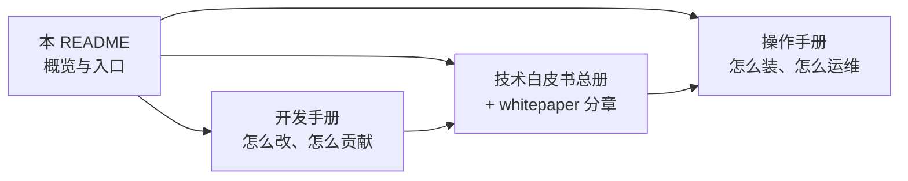

# kubeauto

kubeauto 用于快速部署 Kubernetes 集群及云原生周边组件：安装与配置由 Ansible 角色落地，集群生命周期由 Python 控制面（`kubecli`）编排。项目采用**二进制 + systemd** 方式安装控制面与节点组件（不依赖 kubeadm），并通过配套镜像仓实现离线制品分发。

当前默认栈（以 `common/constants.py` 为准）：**Kubernetes v1.33.6** · **etcd v3.6.4** · **Calico v3.28.4** · **containerd（默认 CRI）** · **Node Allocatable 默认开启**。

---

## 0、文档入口（交付三件套）

交付与日常使用请从下列文档进入，勿再依赖本 README 中的长篇操作细节（操作细节见操作手册）：

| 文档 | 路径 | 用途 |
|------|------|------|
| **操作手册** | [docs/operations-manual.md](./docs/operations-manual.md) | 安装、扩缩、备份、插件开关、验收（Administration Guide） |
| **技术白皮书** | [docs/technical-whitepaper.md](./docs/technical-whitepaper.md) | **签收级 Concepts**：K8s/组件/证书/CRI/CNI/监控原理 + 本项目实现；分章见 [`docs/whitepaper/`](./docs/whitepaper/) |
| **开发手册** | [docs/development-manual.md](./docs/development-manual.md) | 六仓开发、版本钉扎、代码导航、测试与 PR（Developer Guide） |

白皮书分章（架构评审请从这里进）：

| 章 | 内容 |
|----|------|
| [00 前言](./docs/whitepaper/00-preface.md) | 文档约定、术语、安装步骤 |
| [01 产品范围](./docs/whitepaper/01-product-scope.md) | 交付物、能力边界、与 kubeadm 差异 |
| [02 总体架构](./docs/whitepaper/02-k8s-architecture.md) | 控制面/数据面、协调循环 |
| [03 控制平面](./docs/whitepaper/03-control-plane.md) | apiserver / CM / scheduler 与 systemd 实现 |
| [05 etcd](./docs/whitepaper/05-etcd.md) | Raft、TLS、备份恢复 |
| [06 证书 PKI](./docs/whitepaper/06-pki-certificates.md) | cfssl 全链路、SA 复用 CA、轮换顺序 |
| [07 高可用](./docs/whitepaper/07-ha-loadbalancer.md) | kube-lb / 外置 LB |
| [08 CRI](./docs/whitepaper/08-cri-runtime.md) | containerd / cri-dockerd |
| [09 CNI](./docs/whitepaper/09-cni-networking.md) | Calico（etcdv3）等五选一 |
| [11 Allocatable](./docs/whitepaper/11-allocatable-qos.md) | 预留、QoS、验收 |
| [12 监控插件](./docs/whitepaper/12-addons-observability.md) | metrics / Dashboard / Prometheus / Ingress / 存储 |
| [13 制品供应链](./docs/whitepaper/13-artifact-supply-chain.md) | 六仓 dual-push 与离线灌仓 |
| [附录 A 版本矩阵](./docs/whitepaper/A-version-matrix.md) | 与 `constants.py` 对齐 |



---

## 1、项目是什么

### 1.1、能力摘要

- 一键 / 分步安装：prepare → etcd → runtime → master → node → network → addon
- 运行时：containerd（默认）或 docker + cri-dockerd
- 网络：calico（默认）、flannel、cilium、kube-router、kube-ovn
- 高可用：集成 kube-lb（默认）或外置 keepalived + nginx
- 可选插件：Dashboard、Prometheus、Ingress、存储（local-path / NFS / OpenEBS）、MinIO 等
- 离线：`kubecli download` 将 `brinnatt/*` 推入控制节点私仓后再部署
- 生命周期：start / stop / backup / restore / upgrade / destroy / 扩缩容 / 证书轮换

### 1.2、六仓协同

| 仓库 | 职责 |
|------|------|
| **kubeauto**（本仓） | CLI、Ansible、配置模板、测试与文档 |
| kubeauto-dockerfile | 产品镜像打包 |
| kubeauto-k8s-bin-dockerfile | Kubernetes 二进制包 |
| kubeauto-ext-bin-dockerfile | etcd / containerd / helm / cfssl 等 |
| kubeauto-ext-bin-sp1-dockerfile | nginx / chrony / keepalived（源码构建） |
| kubeauto-ext-images-dockerfile | 生态组件镜像 `brinnatt/*` |

镜像拉取顺序：`hub.talkedu.cn/kubeauto/<name>:<tag>` → Docker Hub `brinnatt/<name>:<tag>` → 部署使用 `registry.talkschool.cn:5000/brinnatt/<name>:<tag>`。详情见[技术白皮书 §2.2](./docs/technical-whitepaper.md)。

### 1.3、架构示意

使用独立负载均衡器的高可用架构：


使用集成负载均衡器的高可用架构（本项目默认）：


---

## 2、快速开始

完整步骤与排错见[操作手册](./docs/operations-manual.md)。下面仅作入口级提示。

### 2.1、控制节点

建议将本仓部署于 `/usr/local/kubeauto`，Python 3.12，并安装 `requirements-control.txt`。源码同步示例：

```bash
bash tests/helpers/sync-kubeauto.sh ubuntu@<控制节点IP> '<password>'
```

### 2.2、最小命令流

```bash
kubecli version
kubecli download -D                 # 默认二进制与基础镜像
kubecli new <cluster>               # 生成 clusters/<cluster>/
# 编辑 clusters/<cluster>/hosts 与 config.yml
kubecli setup <cluster> 90          # 或分步 01…07
export KUBECONFIG=/usr/local/kubeauto/clusters/<cluster>/kubectl.kubeconfig
kubectl get nodes
```

### 2.3、规格提示

| 场景 | 建议 |
|------|------|
| 学习 / aio | 可参考操作手册「最小配置」 |
| 生产 / 合同基线 | 节点建议 ≥ **16 CPU / 32Gi**（配合默认 2 CPU + 4Gi 预留） |
| 干净系统 | 勿在曾装 kubeadm 或其他发行版的节点上直接安装 |

Node Allocatable 默认策略见操作手册 [§1.1.4](./docs/operations-manual.md)。

---

## 3、版本与质量门禁（摘要）

| 项 | 默认 / 位置 |
|----|-------------|
| kubeauto | v0.1.1 |
| Kubernetes | v1.33.6 |
| etcd | v3.6.4（ext-bin） |
| Calico | v3.28.4 |
| containerd | 2.1.4（ext-bin） |
| 六仓同步测试 | `tests/unit/test_six_repo_version_sync.py` |
| 单测入口 | `bash tests/run_unit_tests.sh` |
| 企业矩阵 | `tests/enterprise-test-matrix.yaml` |

升级任一组件版本时，必须同步 constants 与对应 dockerfile/CI tag，流程见[开发手册 §3.6](./docs/development-manual.md)。

---

## 4、仓库结构（本仓）

```text
kubeauto/
├── kubecli.py              # 入口
├── controller/             # CLI
├── service/                # 下载、仓库、集群管理
├── common/                 # 常量与工具（版本真相源）
├── conf/config.yml         # 默认配置模板
├── playbooks/              # 安装与生命周期编排
├── roles/                  # 各组件角色
├── tests/                  # 单测与辅助脚本
├── images/                 # 架构图
└── docs/                   # 操作手册 · 白皮书 · 开发手册
```

---

## 5、许可与贡献

二次开发与社区贡献请先阅读[开发手册](./docs/development-manual.md)。提交涉及镜像或版本时，请保证六仓标签一致并附上实验室验证说明。

运维现场问题优先对照[操作手册](./docs/operations-manual.md)；架构与选型争议对照[技术白皮书](./docs/technical-whitepaper.md)。
`)