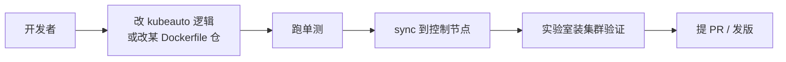
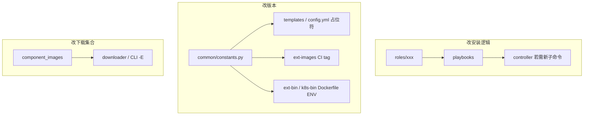
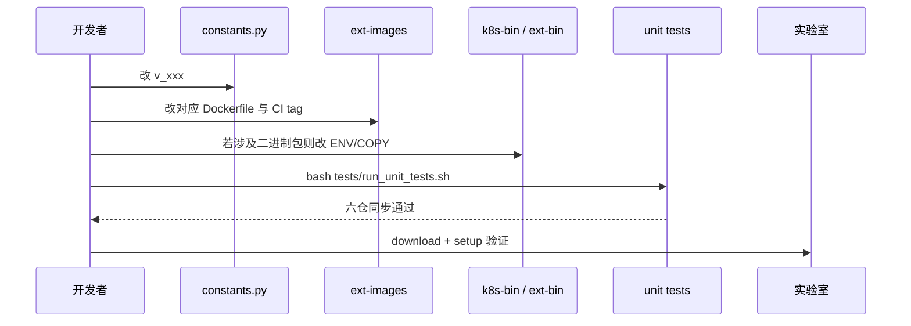
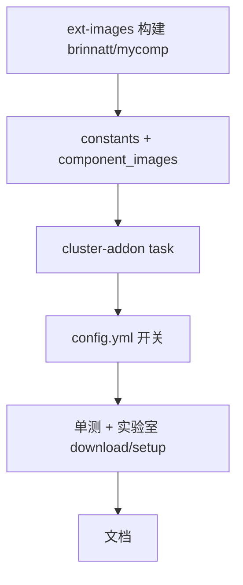
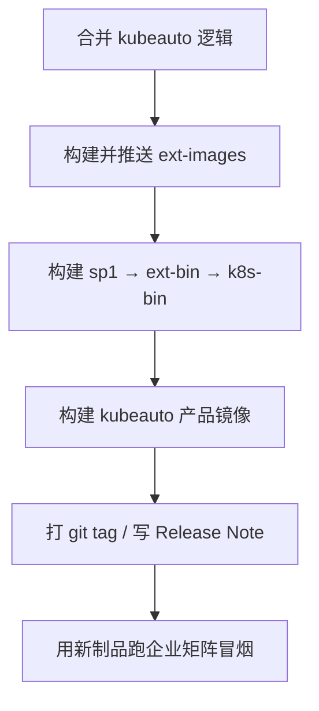

# 3、开发手册

本文档面向希望在社区或企业内部二次开发 kubeauto 的贡献者：说明**六仓如何并列开发**、如何本地跑通 `kubecli`、如何改版本/加组件、如何写测试与同步到控制节点。读完应能从零拉起开发环境并提交可验证的改动。

配套文档：

- [操作手册](./operations-manual.md)
- [技术白皮书总册](./technical-whitepaper.md)（分章见 [`whitepaper/`](./whitepaper/)，含证书/监控/CNI 等原理级说明）
- 仓库入口：[README.md](../README.md)

> 开发前建议至少读完白皮书第 6（PKI）、8（CRI）、13（制品）、14（kubecli）章，避免改配置时破坏信任链或版本契约。

---

## 3.1、开发流程概览



关键约束：

1. **逻辑在 kubeauto，制品在五个 dockerfile 仓**；改镜像标签必须两边一起改。
2. **版本真相源是 `common/constants.py`**；六仓同步测试会对照 sibling 仓。
3. **集群现场数据在 `clusters/`、二进制在 `*-bin/`**，同步脚本会刻意排除它们。

---

## 3.2、推荐目录布局

将六个仓库放在同一父目录（同步测试默认假设 `/projects` 下同级）：

```text
/projects/
├── kubeauto/                          # 本仓：CLI + Ansible
├── kubeauto-dockerfile/               # 产品镜像打包
├── kubeauto-k8s-bin-dockerfile/       # k8s 二进制包
├── kubeauto-ext-bin-dockerfile/       # 扩展二进制包
├── kubeauto-ext-bin-sp1-dockerfile/   # nginx/chrony/keepalived 源码包
└── kubeauto-ext-images-dockerfile/    # brinnatt/* 组件镜像
```

克隆示例（将组织/地址换成实际远程）：

```bash
mkdir -p ~/src/kubeauto-family && cd ~/src/kubeauto-family
git clone <url>/kubeauto.git
git clone <url>/kubeauto-dockerfile.git
git clone <url>/kubeauto-k8s-bin-dockerfile.git
git clone <url>/kubeauto-ext-bin-dockerfile.git
git clone <url>/kubeauto-ext-bin-sp1-dockerfile.git
git clone <url>/kubeauto-ext-images-dockerfile.git
```

若 sibling 仓不在旁边，`test_six_repo_version_sync` 会 skip，本地仍可跑其余单测，但**发版前务必六仓齐全跑一遍**。

---

## 3.3、kubeauto 仓库地图

```text
kubeauto/
├── kubecli.py                 # CLI 入口
├── runtime_hook.py            # 运行时钩子（打包相关）
├── controller/cluster/cli.py  # 子命令定义与分发
├── service/cluster/           # manager / downloader / registry / docker
├── common/                    # constants、mirrors、os、utils、ansible_python
├── model/                     # 预留模型
├── conf/config.yml            # 默认集群配置模板（含 Node Allocatable 等）
├── playbooks/                 # 01–07、10–11、90–99
├── roles/                     # prepare/etcd/runtime/master/node/cni/addon/…
├── requirements-control.txt   # 控制节点 Python 依赖
├── tests/
│   ├── unit/                  # 单元测试
│   ├── helpers/               # sync、验收脚本
│   ├── enterprise-test-matrix.yaml
│   └── run_unit_tests.sh
├── tools/                     # 周边运维小工具（非核心安装路径）
├── images/                    # 文档用架构图
└── docs/                      # 本手册所在目录
```



---

## 3.4、开发环境准备

### 3.4.1、控制节点（推荐）

与交付一致的控制节点具备：

- Linux（Rocky / Ubuntu 等），Docker 可用
- Python **3.12**（优先；脚本会 `python3.12 || python3`）
- 能 SSH 到目标集群节点
- 磁盘足够存放镜像与二进制包

### 3.4.2、本机开发机

```bash
cd /path/to/kubeauto
python3.12 -m venv .venv
source .venv/bin/activate
pip install -r requirements-control.txt
# 若需跑全量单测，再装 unittest 已内置；无需额外测试框架
export PYTHONPATH=/path/to/kubeauto
python kubecli.py version
```

### 3.4.3、包装系统级 kubecli（可选）

```bash
sudo tee /usr/local/bin/kubecli >/dev/null <<'EOF'
#!/bin/bash
cd /usr/local/kubeauto
export PYTHONPATH=/usr/local/kubeauto
PY="$(command -v python3.12 || command -v python3)"
exec "$PY" /usr/local/kubeauto/kubecli.py "$@"
EOF
sudo chmod +x /usr/local/bin/kubecli
```

源码同步到已有控制节点时，直接使用：

```bash
bash tests/helpers/sync-kubeauto.sh ubuntu@192.168.x.x '<password>'
```

该脚本会 rsync 源码（排除 `.git`、`clusters/`、`*-bin/`、`down/` 等），安装/校验 `requirements-control.txt`，并刷新 `/usr/local/bin/kubecli` 包装脚本。

---

## 3.5、本地日常开发循环

### 3.5.1、改角色或 playbook

1. 在 `roles/<name>/` 改 tasks/templates/defaults。
2. 确认变量来自 `conf/config.yml` 或集群副本 `clusters/<c>/config.yml`，命名风格与现有大写变量一致。
3. 若新增 playbook 步骤，同步改 `controller/cluster/cli.py` 里 `setup` 的 step 帮助文案，并接到 `service/cluster/manager.py` 的步骤映射。
4. 单测能覆盖的逻辑尽量抽到 `common/` 或纯函数再测；纯 YAML 变更用实验室验证。

### 3.5.2、改 CLI

- 子命令注册：`controller/cluster/cli.py` 的 `_setup_*_command` / `_handle_*`。
- 业务实现放 `service/`，避免 CLI 文件膨胀。
- 补全逻辑依赖 argparse 定义，改选项后跑 `tests/unit/test_cli_completion.py`。

### 3.5.3、改默认配置

- 全局默认：`conf/config.yml`。
- 已创建的集群不会自动继承，需手动合并到 `clusters/<name>/config.yml`，或重建 `kubecli new`。
- Node Allocatable、CRI、CNI 相关项改动后，更新操作手册对应小节与单测期望值。

---

## 3.6、版本钉扎：如何正确升级一个组件

### 3.6.1、流程



### 3.6.2、检查清单

以升级 Calico 为例：

1. `common/constants.py`：`v_calico`（及依赖的镜像列表）。
2. `kubeauto-ext-images-dockerfile`：`calico-node` / `calico-cni` / `calico-kube-controllers` 的 Dockerfile 与 `.github/workflows/build.yml` tag。
3. `kubeauto-ext-bin-dockerfile`：若 `CALICOCTL_VER` 需对齐，一并修改。
4. 角色模板中勿写死旧 tag；用库存占位或常量渲染。
5. 跑：

```bash
cd /path/to/kubeauto
bash tests/run_unit_tests.sh
```

6. 控制节点：`kubecli download -E` 相关组件后，在干净节点上装网验证。

### 3.6.3、禁止事项

- 只改角色 YAML 里的镜像字符串、不改 `constants.py`。
- 只推 Docker Hub、不推 talkedu（或相反）导致拉取顺序失败。
- 在 systemd 模式下把 `kubeReservedCgroup` 写成 `/podruntime.slice`（会变成 `.slice.slice`）。

---

## 3.7、新增可选插件（addon）

最小闭环：

1. **镜像**：在 `kubeauto-ext-images-dockerfile` 增加（或复用）镜像目录，CI matrix 增加 tag。
2. **常量**：`KubeConstant` 增加版本字段；`component_images["mycomp"] = ["brinnatt/..."]`。
3. **角色**：`roles/cluster-addon/tasks/mycomp.yml` + templates；在 `tasks/main.yml` 按开关 `include_tasks`。
4. **配置**：`conf/config.yml` 增加 `mycomp_install: false` 等开关与必要变量。
5. **下载**：确认 `kubecli download -E mycomp` 能解析到 `component_images`。
6. **测试**：至少增加契约测试（镜像名 `brinnatt/`、版本与 CI 一致）；有条件补企业矩阵条目。
7. **文档**：操作手册插件表 + 白皮书插件节各补一行。



---

## 3.8、五个 Dockerfile 仓怎么改

### 3.8.1、kubeauto-dockerfile

- 从 GitHub release tag 拉源码，`python3 build.py` 打包进镜像。
- 构建环境 Rocky 8 + Python 3.12，保证 glibc 兼容 RHEL/Rocky 8+。
- 发版时：`KUBEAUTO_VER` 与 `v_kubeauto` 一致。

### 3.8.2、kubeauto-k8s-bin-dockerfile

- 产出控制面/节点二进制；tag 通常等于 `v_k8s_bin`（如 `v1.33.6`）。
- 升级 K8s 小版本：改下载脚本/ARG，重建并 dual-push，再改 kubeauto constants。

### 3.8.3、kubeauto-ext-bin-dockerfile

- 聚合 etcd、containerd、runc、CNI、helm、crictl、calicoctl、cfssl，并 `COPY` sp1 产物。
- `EXT_BIN_VER` 必须等于 `v_extra_bin`；嵌入的 `kubeauto-ext-bin-sp1:<tag>` 必须等于 `v_extra_bin_sp1`。

### 3.8.4、kubeauto-ext-bin-sp1-dockerfile

- 源码编译 nginx（stream）、chrony、keepalived。
- 仅在需要改 LB/校时组件版本时动此仓，然后 bump sp1 与 ext-bin。

### 3.8.5、kubeauto-ext-images-dockerfile

- 每个子目录一个组件镜像；CI matrix 的 `tag:` 是同步测试的对照源。
- 所有对外标签使用 `brinnatt/<name>:<tag>`；CI 同时推送到 `hub.talkedu.cn/kubeauto/<name>:<tag>`。

---

## 3.9、测试指南

### 3.9.1、单元测试

```bash
cd /path/to/kubeauto
bash tests/run_unit_tests.sh
# 或
PYTHONPATH=. python3 -m unittest discover -s tests/unit -v
```

常见用例：

| 文件 | 覆盖点 |
|------|--------|
| `test_six_repo_version_sync.py` | 六仓版本一致 |
| `test_kube_reserved.py` | Node Allocatable 默认与 cgroup 名 |
| `test_brinnatt_image_contract.py` | 镜像命名契约 |
| `test_registry_pull_sources.py` / `test_talkedu_mirror.py` | 拉取顺序 |
| `test_cri_dockerd.py` / `test_docker_daemon.py` | Docker 运行时 |
| `test_cli_completion.py` | 补全 |
| `test_role_image_mapping.py` | 角色镜像映射 |

### 3.9.2、企业回归矩阵

见 `tests/enterprise-test-matrix.yaml`。按场景（aio、多 master、docker 运行时、Prometheus 等）在实验室勾选执行；自动化入口可参考 `tests/run_enterprise_regression.sh`（以仓库当前脚本为准）。

### 3.9.3、Node Allocatable 现场验收

```bash
bash tests/helpers/verify-node-reserved.sh clusters/<cluster>/kubectl.kubeconfig
```

---

## 3.10、实验室验证最小路径

假设控制节点已同步源码，Docker 可用：

```bash
# 1. 下载默认二进制与基础镜像
kubecli download -D

# 2. 新建集群配置并编辑 hosts / config.yml
kubecli new demo
# 编辑 clusters/demo/hosts 、 clusters/demo/config.yml

# 3. 一键安装（或分步 01→07）
kubecli setup demo 90

# 4. 验收
export KUBECONFIG=/usr/local/kubeauto/clusters/demo/kubectl.kubeconfig
kubectl get nodes
kubectl get pods -A
```

可选组件：

```bash
kubecli download -E prometheus
# 打开 clusters/demo/config.yml 中 prom_install 等开关后重跑 addon 步骤
kubecli setup demo 07
```

销毁重来：

```bash
kubecli destroy demo
# 确认节点干净后再 setup
```

更细的运维步骤见[操作手册](./operations-manual.md)。

---

## 3.11、代码风格与约定

1. **中文文档编号风格**：与现有 README/手册一致，使用 `1、` / `1.1、` / `1.1.1、`。
2. **配置变量**：库存与 `config.yml` 多用 `UPPER_SNAKE`；Ansible 角色内遵循现有命名。
3. **镜像**：一律 `brinnatt/<name>:<tag>`；部署拼接私仓前缀，不在角色里写死 Docker Hub。
4. **Python**：控制路径面向 3.12；避免依赖系统自带过旧 python3。
5. **安全**：不要把真实密码、kubeconfig、证书提交进 git；`clusters/` 应保持本地。
6. **最小改动**：修 bug / 加功能时不顺手大重构无关角色。

---

## 3.12、提交与发版建议（社区向）

### 3.12.1、PR 建议结构

- **标题**：说明动机（fix / feat / docs / chore）。
- **正文**：改了哪些仓、版本是否 bump、如何测试。
- **六仓变更**：若跨仓，在 PR 中列出各仓 PR/commit 链接，或使用同一发布说明。

### 3.12.2、发版顺序（推荐）



### 3.12.3、文档同步

任何用户可见行为变化（默认开关、版本、命令）应同时更新：

- `docs/operations-manual.md`（怎么操作）
- `docs/technical-whitepaper.md`（为什么 / 架构）
- 本开发手册（若影响开发流程）
- 根 `README.md`（版本表与入口摘要）

---

## 3.13、常见问题（开发向）

**Q：单测报 sibling 缺失？**  
A：把五个 dockerfile 仓放到与 kubeauto 同级；或接受 skip，但发版前补齐。

**Q：改了角色，控制节点没变化？**  
A：是否执行了 `sync-kubeauto.sh`？是否改的是 `clusters/` 里旧副本而非 `conf/` 或 roles？

**Q：download 失败？**  
A：检查 Docker、talkedu/Hub 网络、tag 是否已构建；对照 `constants.py` 与 CI tag。

**Q：Prometheus 安装时 apiserver 内存不足？**  
A：确认未误开 `SYS_RESERVED_ENFORCE=yes` 且预留小于控制面峰值；见操作手册 §1.1.4。

**Q：如何只测 Python 逻辑不装集群？**  
A：`bash tests/run_unit_tests.sh` 即可覆盖契约与常量；安装路径仍需实验室。

---

## 3.14、下一步阅读

1. 先通读[技术白皮书](./technical-whitepaper.md) §2.2–§2.3，建立六仓与流水线图景。  
2. 按[操作手册](./operations-manual.md)在实验室完整装一次 aio。  
3. 选一个小改动（文档或常量注释）走通：改代码 → 单测 → sync → 验证 → PR。

欢迎在此基础上扩展角色与镜像；保持**版本单一真相源**与**brinnatt 镜像契约**，是本项目可维护开源的底线。
`)

---

## 3.15、关键子系统的代码导航（深入）

本章把「要改某能力时从哪几个文件下手」写死，避免在仓库里盲搜。

### 3.15.1、改证书 / PKI

| 目的 | 文件 |
|------|------|
| CA 有效期、profile | `conf/config.yml`（`CA_EXPIRY`/`CERT_EXPIRY`）、`roles/deploy/templates/ca-*.j2` |
| admin/CM/scheduler/proxy kubeconfig | `roles/deploy/tasks/create-*-kubeconfig.yml` |
| apiserver SAN | `roles/kube-master/templates/kubernetes-csr.json.j2`，`MASTER_CERT_HOSTS` |
| kubelet 证 | `roles/kube-node/tasks/create-kubelet-kubeconfig.yml` |
| 轮换流程 | `playbooks/96.update-certs.yml`，`ClusterManager.renew_ca_certs` |
| SA 是否独立密钥 | **当前复用 CA**（`kube-apiserver.service.j2`）；若改为独立 sa.key 需同步改 master 模板与分发列表 |

原理见白皮书 [第 6 章](./whitepaper/06-pki-certificates.md)。

### 3.15.2、改 apiserver / 控制面参数

1. 编辑 `roles/kube-master/templates/kube-*.service.j2`
2. 需要的新变量放入 `conf/config.yml` + 角色 `vars/`
3. 多 master 行为保持 `serial: 1`（`90.setup.yml` / `04.kube-master.yml`），除非你有替代竞态方案并完成 HA 测试
4. 改完后至少：单 master aio + 三 master 实验室各装一次

### 3.15.3、改 CRI

| 运行时 | 入口 |
|--------|------|
| containerd | `roles/containerd/templates/config.toml.j2`、`certs.d/**/hosts.toml.j2` |
| docker | `roles/docker/templates/daemon.json.j2`、`cri-dockerd.service.j2` |
| kubelet 插座 | `roles/kube-node/templates/kubelet.service.j2` |
| pause 版本 | `v_pause` → 占位 `__pause__` → `SANDBOX_IMAGE` |

升级 containerd/runc 往往在 **ext-bin Dockerfile**，不在 kubeauto 常量字段——改完 bump `v_extra_bin` 并跑六仓同步测试。

### 3.15.4、改 CNI

1. `roles/<cni>/` 模板与 tasks  
2. `conf/config.yml` 中该 CNI 段落  
3. `component_images` / ext-images CI tag  
4. `06.network.yml` 条件已按 `CLUSTER_NETWORK` 互斥，新增 CNI 需加 when 分支  
5. 清理逻辑：安装后删除 `10-default.conf`；切换 CNI 的 clean 路径要在 `roles/clean` 验证  

### 3.15.5、改监控栈

1. Chart 文件：`roles/cluster-addon/files/kube-prometheus-stack-*.tgz`  
2. Values：`templates/prometheus/values.yaml.j2`（镜像、NodePort、存储类）  
3. 版本：`v_promchart` + `component_images["prometheus"]` + ext-images CI  
4. etcd 抓取证书任务在 `tasks/prometheus.yml`——改 CA 轮换时确认 Secret 重建  
5. 实验室必须在 ≥16C/32G 且 Allocatable 默认开启的节点验证，观察 apiserver 是否被饿死  

### 3.15.6、改下载与私仓

| 类 | 文件 |
|----|------|
| CLI 开关 | `controller/cluster/cli.py` `_setup_download_command` |
| 编排 | `service/cluster/downloader.py` |
| 拉取顺序 | `service/cluster/registry.py` `_ensure_image_local` / `_talkedu_mirror` |
| 组件清单 | `KubeConstant.component_images` |

新增 `-E` 组件：先保证 ext-images 能构建出 `brinnatt/name:tag`，再写入 `component_images`，再写 addon 任务。

---

## 3.16、Playbook 与角色对照表（开发速查）

| Playbook | 主要角色 | 开发时注意 |
|----------|----------|------------|
| 01.prepare | chrony, deploy, prepare | deploy 在 localhost；改证书必测 |
| 02.etcd | etcd | 扩容状态 `existing` |
| 03.runtime | docker \| containerd | 与 kubelet endpoint 一致 |
| 04.kube-master | kube-lb, kube-master, kube-node | serial |
| 05.kube-node | kube-lb, kube-node | 仅非 master worker |
| 06.network | 五选一 CNI | 互斥 |
| 07.cluster-addon | cluster-addon | 显式 KUBECONFIG |
| 10.ex-lb | ex-lb | VIP 进 SAN |
| 90.setup | 上述串联 | 与分步等价 |
| 91–95,96,99 | 生命周期 | destroy 会删 clusters 目录 |

---

## 3.17、调试技巧

```bash
# 只跑某一步并打开 ansible 详细日志
kubecli setup demo 04 -vvv   # 若 CLI 把 remainder 传给 ansible；否则在 manager 层传 extra_args

# 查看渲染后的清单（安装后）
ls clusters/demo/yml/
ls clusters/demo/ssl/

# 节点上确认 unit 与证书
systemctl cat kube-apiserver
openssl x509 -in /etc/kubernetes/ssl/kubernetes.pem -noout -text | grep -A1 'Subject Alternative'

# 确认 Allocatable
bash tests/helpers/verify-node-reserved.sh clusters/demo/kubectl.kubeconfig
```

改 Jinja 后若节点行为不变：检查是否改到了 `conf/config.yml` 而集群仍用旧的 `clusters/*/config.yml`。

---

## 3.18、开源贡献者最小可行 PR 示例

**示例 A：只修文档**  
改 `docs/whitepaper/` 某章笔误 → 跑无需集群；PR 说明「docs only」。

**示例 B： bump pause**  
1. `v_pause`  
2. ext-images `pause` Dockerfile + CI tag  
3. 单测  
4. 实验室 `download -X` 后看 `SANDBOX_IMAGE`  
5. PR 链到 ext-images 变更  

**示例 C：新增 addon 开关**  
按 §3.7 闭环；PR 必须含：constants、component_images、role task、config 默认 false、单测、操作手册一行、白皮书第 12 章一行。

