# T9、日志

## T9.1、日志架构

监控篇（T4）管的是**指标和告警**：CPU、延迟、错误率这类数，用来盯健康、触发告警。本篇管的是**日志**：谁在什么时间、打印了什么内容，用来还原现场、排查根因。

**生产上这两套一般都要上**，但职责不同：**指标**适合按时间聚合、做告警规则；**日志**适合按关键字、上下文检索。

选型上也就不同：指标常用 Prometheus 这类时序库，日志常用 ES、OpenSearch、托管日志等。

**不要把两类数据混进同一种存储里凑合用**（例如用日志库硬扛全量指标，或把海量原始日志塞进时序库），既贵又难维护，也不是常见做法。

本节对齐 [Kubernetes：Logging Architecture](https://kubernetes.io/docs/concepts/cluster-administration/logging/)，并结合生产习惯写清：**镜像固定 tag、校验日期、可照着 apply 的 YAML**。文中配图来自 **Kubernetes 官网同一套素材**（已下载到本文 `images/`，便于离线阅读）。

### T9.1.1、概念与依据

**应用日志**：看业务行为、排错、审计。**容器里最省事的做法**：写 **stdout / stderr**，由运行时交给 kubelet，再在节点上落盘；平时用 `kubectl logs` 就能看。

**集群级日志（cluster-level logging）**：官方定义是——日志的**存储与生命周期**要和节点、Pod、容器**脱钩**，否则容器崩了、Pod 被赶走、节点挂了，你只依赖本地文件会抓瞎。Kubernetes **不提供**日志存储产品，只提供 API 与节点侧行为；**存哪、查哪、保留多久**由你自己选（EFK、托管日志、Kafka 等）。

**和监控怎么配合**：业务容器可以同时做两件事——一边按 Prometheus 约定暴露 **`/metrics` 端点**（给监控抓），一边往 **stdout/stderr 打日志**（给日志采集收）。**前者不等于后者**：不能指望只靠日志解决告警，也不能只靠指标还原每一行日志原文；两条链路各自部署、各自存储即可。

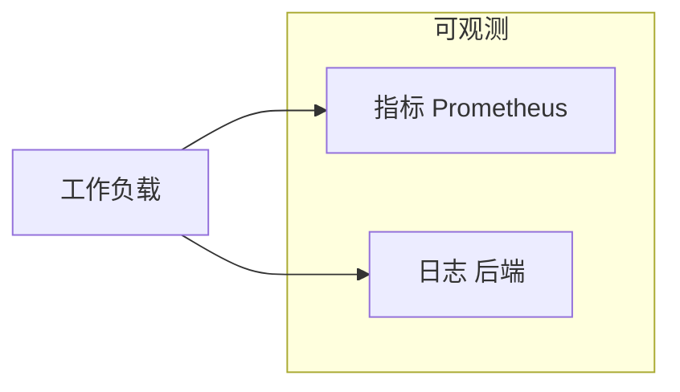

---

### T9.1.2、标准输出与节点行为

下面这张图对应官方「节点如何处理容器日志」的说明：运行时接管 stdout/stderr，与 kubelet 之间用 **CRI 日志格式**衔接（具体实现随运行时变化，但对 kubelet 的接口是统一的）。


**你可以把一条日志从容器里到 `kubectl logs` 的路径理解成：**

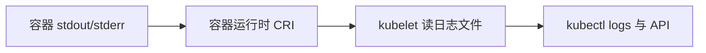

**kubelet 轮转（生产必看）**：自 v1.21 起相关能力已稳定。可在 [kubelet 配置](https://kubernetes.io/docs/reference/config-api/kubelet-config.v1beta1/) 里调 `containerLogMaxSize`（默认约 10Mi）、`containerLogMaxFiles`（默认约 5）等；大流量集群还可关注 `containerLogMaxWorkers`、`containerLogMonitorInterval`。目的是**别让单容器日志把节点盘打满**。

**`kubectl logs` 的边界**：官方写明——通常只能看到**当前正在写的那份**文件；若已轮转，更早的不一定还能从这个命令拿到。**长期留存、合规检索**必须走集群级后端，别指望 `kubectl logs` 当归档库。

**可选（Alpha）**：从 v1.32 起有 `PodLogsQuerySplitStreams` 特性门，可把 stdout / stderr 分开查，默认关。见官方 [Container log streams](https://kubernetes.io/docs/concepts/cluster-administration/logging/#container-log-streams)。

**最小示例**（与官方 [counter-pod.yaml](https://k8s.io/examples/debug/counter-pod.yaml) 同结构，镜像与监控篇一致）：

```yaml
# counter-pod.yaml
apiVersion: v1
kind: Pod
metadata:
  name: counter
spec:
  containers:
    - name: count
      image: busybox:1.37
      args:
        - /bin/sh
        - -c
        - 'i=0; while true; do echo "$i: $(date)"; i=$((i+1)); sleep 1; done'
```

```bash
kubectl apply -f counter-pod.yaml
kubectl logs counter
kubectl logs counter -c count
kubectl logs counter --previous
```

重复实验若遇名称冲突：`kubectl delete pod counter --ignore-not-found`。

> **版本与镜像约定（与监控篇一致）**
>
> **`image:` 一律固定 tag**；升级前到 **GitHub Releases** 或镜像仓库核对 **latest 稳定版**（非 prerelease），并更新下表与校验日期。  
>
> **本文同步校验日期：2026-04-21**  
>
> | 组件 | 镜像 / 标签 | 说明 |
> |------|-------------|------|
> | busybox | `busybox:1.37` | 与 [T4 监控篇](../prometheus/prometheus.md) 一致 · [Hub](https://hub.docker.com/_/busybox/tags) |
> | Fluent Bit | `fluent/fluent-bit:5.0.3` | 节点/sidecar 常用 · [Releases](https://github.com/fluent/fluent-bit/releases/latest) |
> | 官方文档中的 fluentd 示例 | `registry.k8s.io/fluentd-gcp:1.30` | 与 [官方页面示例](https://kubernetes.io/docs/concepts/cluster-administration/logging/) 同源，偏 GKE；**自建集群请改 OUTPUT**，勿照搬 `google_cloud` |

---

### T9.1.3、三类集群级路径

官方在 [Cluster-level logging architectures](https://kubernetes.io/docs/concepts/cluster-administration/logging/#cluster-level-logging-architectures) 里只归纳三类，生产里一般是「三选一或组合」。

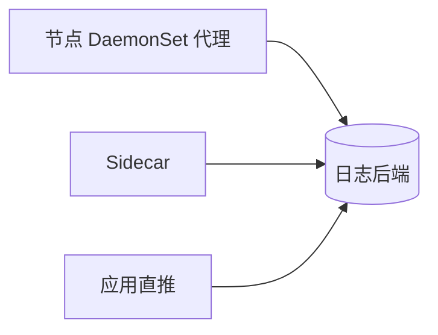

| 路径 | 一句话 | 常见场景 |
|------|--------|----------|
| 节点代理 | 每节点一个采集进程，读本节点容器日志目录，再发到后端 | **默认首选**，不动业务镜像 |
| Sidecar | 跟业务同 Pod：要么把文件日志打到 sidecar 的 stdout，要么在 sidecar 里跑采集进程 | 写文件、多格式分流、节点策略不满足时 |
| 应用直推 | 进程内 SDK 直接发到后端 | 强绑定某云/厂商 SDK，或作补充 |

---

### T9.1.4、落地与示例

这一节把上面三种「集群级日志」拆成四段，每一段都配有**官方示意图**和**能直接 apply 的 YAML**（需要你先装好集群和 `kubectl`）。阅读顺序建议：先看 **T9.1.4.1**，这是大多数公司默认采用的形态；只有业务把日志写进**文件**、或者节点上统一采集满足不了时，再往下看 Sidecar 两种；应用内直推放在最后，用得相对少。

**怎么选，一句话对照**：

- **多数情况**：用 **T9.1.4.1 节点代理**就够了，业务继续往 stdout 打日志即可。  
- **业务必须写文件**：先看能不能改成 stdout；改不了，再用 **T9.1.4.2** 或 **T9.1.4.3**（Sidecar 会多占资源，要心里有数）。  
- **应用直推（T9.1.4.4）**：Kubernetes 不管你怎么实现，适合已经接了某云日志 SDK 的场景，或当补充手段。

---

#### T9.1.4.1、节点代理


**这是在干什么**：在**每一台工作节点**上跑一个采集程序（一般用 **DaemonSet** 部署，保证每台机器都有一个 Pod）。这个程序去读「本节点上、所有容器打出来的日志文件」（常见目录是 `/var/log/pods/...`，具体以你集群为准），解析后再发到 Elasticsearch、Kafka、云厂商日志服务等。

**为什么常用**：业务不用改镜像、不用加边车，只要像平常一样往 **标准输出** 打日志，节点上的代理自然会收集到。

**什么时候不够**：代理默认跟的是「标准输出落到节点上的那套日志」。如果你的程序只往**自己容器里某个路径**写文件，又不跟别的容器共享卷，节点上的统一采集**可能读不到**，这时就要用后面的 Sidecar，或者改程序写法。

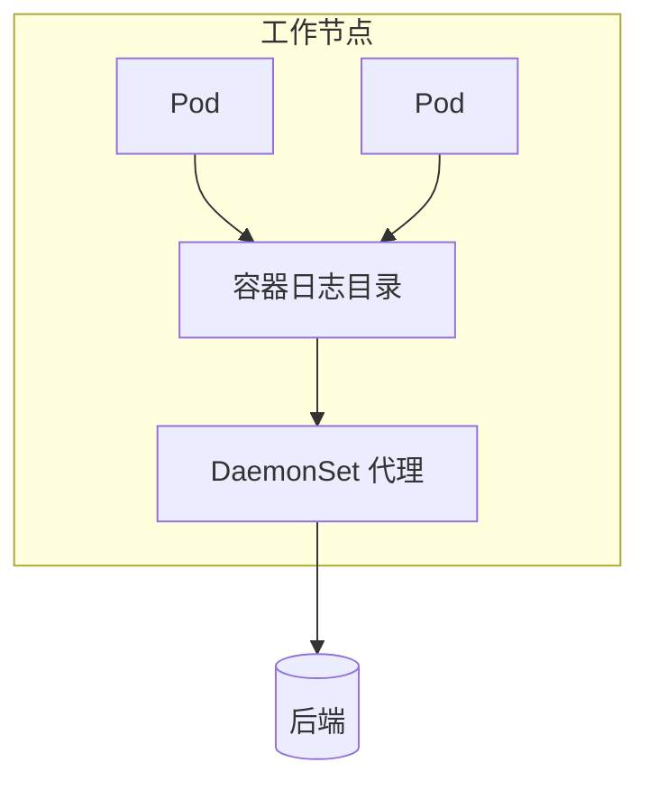

---

#### T9.1.4.2、Sidecar 流式


**这是在干什么**：业务坚持把日志写进**文件**（例如 `/var/log/1.log`），你又希望后面仍然走「标准输出 → 节点采集」这条老路。做法是：加一个（或多个）**小容器**，和主容器**共享同一块卷**，用小容器里的 `tail -F` 去读文件，把读到的内容**打印到自己的标准输出**。这样一来，kubelet 照样按「容器标准输出」收集，节点上的日志代理也能接着收。

**和上一段的关系**：上一段是「节点上一个代理管全机」；这里是「**单个 Pod 里多几个容器配合**」，专门解决「写文件」的问题。

**操作要点**：主容器写文件；**每个要单独看的日志流，对应一个 sidecar**，下面示例里是两个文件，所以有两个 sidecar。用 `kubectl logs` 时可以按**容器名**分别看。


```yaml
# two-files-counter-pod-streaming-sidecar.yaml
apiVersion: v1
kind: Pod
metadata:
  name: counter
spec:
  containers:
    - name: count
      image: busybox:1.37
      args:
        - /bin/sh
        - -c
        - >
          i=0;
          while true;
          do
            echo "$i: $(date)" >> /var/log/1.log;
            echo "$(date) INFO $i" >> /var/log/2.log;
            i=$((i+1));
            sleep 1;
          done
      volumeMounts:
        - name: varlog
          mountPath: /var/log
    - name: count-log-1
      image: busybox:1.37
      args: [/bin/sh, -c, 'tail -n+1 -F /var/log/1.log']
      volumeMounts:
        - name: varlog
          mountPath: /var/log
    - name: count-log-2
      image: busybox:1.37
      args: [/bin/sh, -c, 'tail -n+1 -F /var/log/2.log']
      volumeMounts:
        - name: varlog
          mountPath: /var/log
  volumes:
    - name: varlog
      emptyDir: {}
```

```bash
kubectl apply -f two-files-counter-pod-streaming-sidecar.yaml
kubectl logs counter -c count-log-1
kubectl logs counter -c count-log-2
```

**磁盘上多占一份**：同一条日志，文件里有一份，经 sidecar 打出标准输出后，节点上还会再记一份。官方也提醒这样会**接近双倍占用**。所以能改的话，还是尽量让应用直接打 **stdout/stderr**，让 kubelet 去轮转，更省事。

---

#### T9.1.4.3、Sidecar 采集器


**和 T9.1.4.2 的差别**：上一段是「用 `tail` 把文件**转成**标准输出，再走节点上那套采集」。这一段是「在 Pod 里再跑一个**真正的采集程序**（例如 Fluent Bit、fluentd），直接从共享卷里 **tail 文件**，然后**按你的配置发到后端**（不一定再经过业务容器的标准输出）」。

**什么时候会用到**：例如你希望**解析规则、过滤规则**只作用在这一个应用上，不想在节点全局 DaemonSet 里写一大坨；或者多租户隔离、合规要求必须在 Pod 内完成转发等。

**代价**：每个业务 Pod 都要多跑一个采集容器，**CPU、内存要算进容量规划**。另外，`kubectl logs` 只能看**某个容器的标准输出**，**看不到**「已经发到 Elasticsearch 里」的那条日志；要看转发是否成功，要么看**采集容器自己的日志**，要么到**日志后端**里查。

**和官方文档对齐**：[Kubernetes 文档](https://kubernetes.io/docs/concepts/cluster-administration/logging/#sidecar-container-with-a-logging-agent) 里的示例用的是 **fluentd**，输出写到 **`google_cloud`**，镜像为 **`registry.k8s.io/fluentd-gcp:1.30`**（给 **GCP** 用的）。自建集群一般是 **Fluent Bit** 或自管 fluentd，把配置里的 **`OUTPUT`** 改成你的 ES、Kafka、HTTP 等。下面用 **Fluent Bit 5.x**，先把日志打到 **stdout**，方便你确认管道通了；上线时只改 **`[OUTPUT]`** 即可。

```yaml
# fluent-bit-sidecar-cm.yaml
apiVersion: v1
kind: ConfigMap
metadata:
  name: fluent-bit-config
data:
  fluent-bit.conf: |
    [SERVICE]
        Flush     1
        Log_Level info

    [INPUT]
        Name  tail
        Tag   count.format1
        Path  /var/log/1.log

    [INPUT]
        Name  tail
        Tag   count.format2
        Path  /var/log/2.log

    [OUTPUT]
        Name  stdout
        Match *
        Format json_lines
```

```yaml
# counter-with-fluent-bit-sidecar.yaml
apiVersion: v1
kind: Pod
metadata:
  name: counter
spec:
  containers:
    - name: count
      image: busybox:1.37
      args:
        - /bin/sh
        - -c
        - >
          i=0;
          while true;
          do
            echo "$i: $(date)" >> /var/log/1.log;
            echo "$(date) INFO $i" >> /var/log/2.log;
            i=$((i+1));
            sleep 1;
          done
      volumeMounts:
        - name: varlog
          mountPath: /var/log
    - name: count-agent
      image: fluent/fluent-bit:5.0.3
      command: ["/fluent-bit/bin/fluent-bit"]
      args: ["-c", "/fluent-bit/etc/fluent-bit.conf"]
      volumeMounts:
        - name: varlog
          mountPath: /var/log
        - name: config-volume
          mountPath: /fluent-bit/etc
  volumes:
    - name: varlog
      emptyDir: {}
    - name: config-volume
      configMap:
        name: fluent-bit-config
```

```bash
kubectl apply -f fluent-bit-sidecar-cm.yaml
kubectl apply -f counter-with-fluent-bit-sidecar.yaml
kubectl logs counter -c count-agent
```

上面命令里，`kubectl logs` 看到的是 **Fluent Bit 容器**打到标准输出的内容（示例里配成了 JSON 行）。等你把 **`[OUTPUT]`** 改成真实后端后，要到 **Kibana、OpenSearch Dashboards** 或云控制台里去查业务日志。[官方 fluentd 示例](https://kubernetes.io/docs/concepts/cluster-administration/logging/#sidecar-container-with-a-logging-agent) 可以对照着看：结构一样，只是采集软件和 **`OUTPUT`** 随环境换。

**（插槽：把 OUTPUT 接到 OpenSearch/Elasticsearch 等并验证检索通过后，可在此处补一张 Discover/检索界面截图。）**

---

#### T9.1.4.4、应用直推


**这是在干什么**：不经过节点上的统一采集，应用在代码里用 **SDK 或 HTTP** 等，把日志**直接发到**日志平台或消息队列。

**Kubernetes 的态度**：官方写明，这类做法**不在 Kubernetes 核心概念里细讲**。也就是说：**怎么鉴权、失败重试、打爆了怎么办（背压）、字段长什么样**，都要你们自己在应用或 SDK 层设计。适合已经**绑定了某家云日志**、或必须绕过节点采集策略的情况；也可以和节点采集**同时存在**，作为补充。

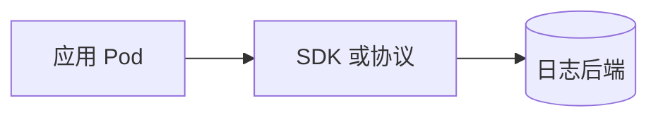

---

下一节 **「T9.2、日志 EFK」** 会用 **ECK** 部署 **Elasticsearch、Kibana**，再用 **Fluent Bit DaemonSet** 把节点上的容器日志送进 ES（与本文 **T9.1** 的采集组件一致）。若团队已经统一用 **Fluentd**，只要把输出指向同一套 ES 即可。

## T9.2、日志 EFK

**Elasticsearch** 负责日志存储与检索；**Kibana** 提供查询与可视化；**Fluent Bit** 以 **DaemonSet** 在各节点读取容器日志并写入 ES，采集模型与 **T9.1** 节点代理一致。已标准化 **Fluentd** 时，将输出指向本节同一 ES 端点即可。

**Elastic Cloud on Kubernetes（ECK）** 是 Elastic 在 Kubernetes 上编排 Elasticsearch、Kibana 等的官方 Operator，负责自定义资源生命周期、TLS 与滚动升级。本节操作步骤依据 ECK 官方安装与部署文档；Fluent Bit 写入 ES 的行为依据 [Elasticsearch 输出插件](https://docs.fluentbit.io/manual/pipeline/outputs/elasticsearch)。

**官方文档**：[Elastic Cloud on Kubernetes](https://www.elastic.co/docs/deploy-manage/deploy/cloud-on-k8s) · [ECK Guide](https://www.elastic.co/guide/en/cloud-on-k8s/current/index.html)

### T9.2.1、数据怎么流

应用将日志写入 **stdout/stderr**，由容器运行时落盘至节点；**Fluent Bit** 读取节点上的容器日志文件并转发至 **Elasticsearch**；**Kibana** 查询 ES 中的索引。**elastic-operator** 根据 `Elasticsearch`、`Kibana` 等 CR 管理 Pod、PVC 与证书，不参与日志数据面转发。

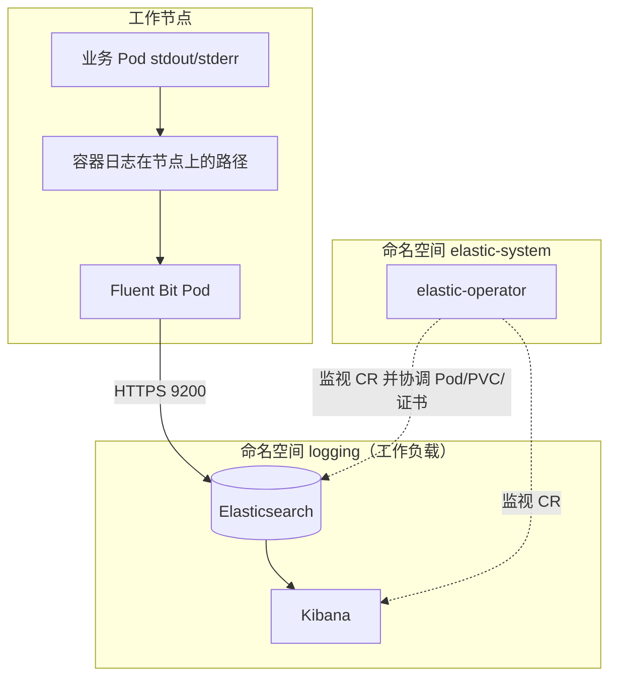

---

### T9.2.2、版本与校验

以 **GitHub Release、Elastic 下载页、[支持矩阵](https://www.elastic.co/support/matrix#matrix_kubernetes)** 为版本准绳；变更时同步更新下表与 GitOps 中的固定镜像 / 清单 URL。

**本文同步校验日期：2026-04-21**

| 组件 | 版本 / 来源 | 说明 |
|------|-------------|------|
| ECK Operator | `3.3.2` | [YAML 安装](https://www.elastic.co/docs/deploy-manage/deploy/cloud-on-k8s/install-using-yaml-manifest-quickstart) 中的 `crds.yaml`、`operator.yaml` · [Releases](https://github.com/elastic/cloud-on-k8s/releases) · [下载](https://www.elastic.co/downloads/elastic-cloud-kubernetes) |
| Kubernetes | **1.31–1.35** | [ECK：Supported versions](https://www.elastic.co/docs/deploy-manage/deploy/cloud-on-k8s#k8s-supported) |
| Elastic Stack（`spec.version`） | **9.3.3** | 与 [Elasticsearch 部署快速入门](https://www.elastic.co/docs/deploy-manage/deploy/cloud-on-k8s/elasticsearch-deployment-quickstart) 示例一致；ECK 支持 Stack **8+、9+**；默认镜像仓库 **`docker.elastic.co`** |
| Fluent Bit | `fluent/fluent-bit:5.0.3` | 与 **T9.1** 一致 · [Releases](https://github.com/fluent/fluent-bit/releases) |

---

### T9.2.3、前提条件

- **命名空间**：Elasticsearch、Kibana、Fluent Bit 部署在 **`logging`**（`kubectl create namespace logging`）。ECK Operator 运行在 **`elastic-system`**（由 `operator.yaml` 创建）；业务负载勿与 Operator 混部于 **`elastic-system`**。
- **存储**：数据目录使用 **`volumeClaimTemplates`** 申请 PVC；将示例中的 **`storageClassName`** 替换为集群内可用 StorageClass（`kubectl get sc`）。试跑可用单节点与小容量盘；生产按容量、副本、可用区规划，参见 [Volume claim templates](https://www.elastic.co/docs/deploy-manage/deploy/cloud-on-k8s/volume-claim-templates)。
- **资源与节点**：示例 CPU/内存为联调下限；生产按数据量与查询负载扩容。节点需满足内存与 **`vm.max_map_count`** 等要求，参见 [Elasticsearch：系统配置与堆](https://www.elastic.co/guide/en/elasticsearch/reference/current/setup-configuration-memory.html)。节点可调度的可用内存不足约 **2GiB** 时，ES Pod 可能持续 **Pending**。
- **`node.store.allow_mmap`**：快速入门默认 **`false`**；生产是否启用 **mmap** 及调优见 [Virtual memory](https://www.elastic.co/docs/deploy-manage/deploy/cloud-on-k8s/virtual-memory)。
- **网络（托管集群）**：**EKS** 须允许控制面与节点间 **TCP 443** 通信，以满足 **ValidatingWebhook** 要求，见 YAML 安装说明中的 **EKS** 章节。**GKE** 须具备完成 RBAC 绑定的管理员权限。
- **凭据**：ECK 为 **`elastic`** 用户生成密码并存入 Secret；**禁止**将密码写入 Git 仓库或 ConfigMap 明文。

---

### T9.2.4、安装 ECK Operator

**参考文档**

| 内容 | 链接 |
|------|------|
| 安装总览（YAML、Helm、OpenShift、离线等） | [Guide：Install ECK](https://www.elastic.co/guide/en/cloud-on-k8s/current/k8s-installing-eck.html) · [Docs：Install ECK](https://www.elastic.co/docs/deploy-manage/deploy/cloud-on-k8s/install) |
| kubectl：CRD 与 Operator | [YAML manifests](https://www.elastic.co/docs/deploy-manage/deploy/cloud-on-k8s/install-using-yaml-manifest-quickstart) |
| Helm | [Helm chart](https://www.elastic.co/docs/deploy-manage/deploy/cloud-on-k8s/install-using-helm-chart) |
| 离线 / 私有镜像仓库 | [Air-gapped](https://www.elastic.co/docs/deploy-manage/deploy/cloud-on-k8s/air-gapped-install) |
| 升级 Operator | [Upgrade ECK](https://www.elastic.co/docs/deploy-manage/upgrade/orchestrator/upgrade-cloud-on-k8s) |

安装将写入集群级 **CRD**、**elastic-system** 命名空间、RBAC、**ValidatingWebhookConfiguration** 等对象，清单见 YAML 安装说明。**删除** ECK 相关 **CRD** 将级联删除集群内由该 Operator 管理的 Elastic 自定义资源，须在变更流程中评估影响。

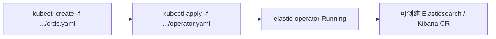

**安装**（版本与官方 YAML 快速入门一致，便于在流水线中固定 URL）：

```bash
kubectl create -f https://download.elastic.co/downloads/eck/3.3.2/crds.yaml
kubectl apply -f https://download.elastic.co/downloads/eck/3.3.2/operator.yaml
```

**验收**：

```bash
kubectl -n elastic-system logs -f statefulset.apps/elastic-operator
kubectl -n elastic-system get pods
```

**`elastic-operator-0`** 为 **`1/1 Running`** 后继续后续步骤。**Helm** 或 **离线**部署按上表文档配置 Chart 参数、镜像同步与 **`container-registry`** 等。

---

### T9.2.5、部署 Elasticsearch（ECK）

在 **`logging`** 命名空间应用 Elasticsearch CR。YAML 在 [Elasticsearch 部署快速入门](https://www.elastic.co/docs/deploy-manage/deploy/cloud-on-k8s/elasticsearch-deployment-quickstart) 基础上补充 **resources**、**volumeClaimTemplates** 与 **`node.roles`**。**`count: 1`** 用于试跑与联调；**生产**将 **`count`** 提升至 **3** 及以上，并按官方说明实施高可用、索引生命周期（ILM）与快照等。

Elastic 当前公开文档未单独提供「ECK 编排」位图；安装 Operator 时创建的集群级 **CRD**、**ValidatingWebhookConfiguration** 等见 [YAML 安装说明](https://www.elastic.co/docs/deploy-manage/deploy/cloud-on-k8s/install-using-yaml-manifest-quickstart)。下图归纳 **`logging`** 命名空间内 **Elasticsearch CR** 经 **elastic-operator** 落地后的主要对象及 **Fluent Bit** 写入路径（与 **T9.2.1**、**T9.2.6** 衔接）。

```mermaid
flowchart TB
  subgraph adm[管理员]
    KA["kubectl apply Elasticsearch CR"]
  end
  subgraph esys[elastic-system]
    OP[elastic-operator]
  end
  subgraph logns[logging]
    ESCR["Elasticsearch CR quickstart"]
    STS[Elasticsearch StatefulSet]
    POD[Elasticsearch Pod]
    PVC[PVC 数据卷]
    SVC["Service quickstart-es-http HTTPS:9200"]
    S_TLS[HTTP 证书 Secret]
    S_EL["Secret quickstart-es-elastic-user"]
    FB[Fluent Bit DaemonSet]
  end
  KA --> ESCR
  ESCR --> OP
  OP --> STS
  OP --> PVC
  OP --> SVC
  OP --> S_TLS
  OP --> S_EL
  STS --> POD
  POD --> PVC
  FB -->|HTTPS 写索引| SVC
```

```yaml
# elasticsearch-eck.yaml（请把 storageClassName 改成你的 StorageClass）
apiVersion: elasticsearch.k8s.elastic.co/v1
kind: Elasticsearch
metadata:
  name: quickstart
  namespace: logging
spec:
  version: 9.3.3
  nodeSets:
    - name: default
      count: 1
      config:
        node.roles: ["master", "data", "ingest"]
        node.store.allow_mmap: false
      podTemplate:
        spec:
          containers:
            - name: elasticsearch
              resources:
                limits:
                  memory: 2Gi
                  cpu: "1"
                requests:
                  memory: 2Gi
                  cpu: "500m"
      volumeClaimTemplates:
        - metadata:
            name: elasticsearch-data
          spec:
            accessModes:
              - ReadWriteOnce
            resources:
              requests:
                storage: 30Gi
            storageClassName: standard
```

```bash
kubectl apply -f elasticsearch-eck.yaml
kubectl -n logging get elasticsearch.elasticsearch.k8s.elastic.co
kubectl -n logging get pods -l elasticsearch.k8s.elastic.co/cluster-name=quickstart
```

**就绪判定**：`kubectl -n logging get elasticsearch` 中 **PHASE** 为 **Ready**、**HEALTH** 为 **green**。单节点与高副本配置并存时可能出现 **yellow**，需按分片与副本策略调整。

集群内访问 ES 使用 Service **`quickstart-es-http`**：**HTTPS**、**9200**，证书由 ECK 管理。扩展配置见 [Elasticsearch configuration](https://www.elastic.co/docs/deploy-manage/deploy/cloud-on-k8s/elasticsearch-configuration)、[Configure deployments](https://www.elastic.co/docs/deploy-manage/deploy/cloud-on-k8s/configure-deployments)。

---

### T9.2.6、部署 Kibana（ECK）

依据 [Kibana 部署快速入门](https://www.elastic.co/docs/deploy-manage/deploy/cloud-on-k8s/kibana-instance-quickstart)，**`spec.version`** 与 Elasticsearch 一致。

```yaml
# kibana-eck.yaml
apiVersion: kibana.k8s.elastic.co/v1
kind: Kibana
metadata:
  name: quickstart
  namespace: logging
spec:
  version: 9.3.3
  count: 1
  elasticsearchRef:
    name: quickstart
```

```bash
kubectl apply -f kibana-eck.yaml
kubectl -n logging get kibana.k8s.elastic.co
kubectl -n logging get pods -l kibana.k8s.elastic.co/name=quickstart
```

Kibana 的 Service 一般为 **`quickstart-kb-http`**。本机调试：

```bash
kubectl -n logging port-forward svc/quickstart-kb-http 5601:5601
```

浏览器访问 `http://127.0.0.1:5601`。经 **Ingress / Gateway** 等对公网或广域暴露时，须配置 **TLS**、认证与访问控制。

---

### T9.2.7、elastic 用户密码

用户 **`elastic`**；Secret 名称 **`<Elasticsearch 资源名>-es-elastic-user`**。

```bash
kubectl -n logging get secret quickstart-es-elastic-user -o jsonpath='{.data.elastic}' | base64 -d
echo
```

```bash
kubectl -n logging get secret quickstart-es-elastic-user -o go-template='{{.data.elastic | base64decode}}{{"\n"}}'
```

---

### T9.2.8、Fluent Bit：DaemonSet 采集并写入 ES

- **INPUT**：**`/var/log/containers/*.log`**，与 **T9.1** 节点级采集对象一致。
- **OUTPUT**：Elasticsearch **HTTPS**；示例中 **`TLS.Verify Off`** 仅用于联调。**生产**挂载 Secret **`quickstart-es-http-certs-public`** 中的 **`ca.crt`**，启用 TLS 校验，参见 [K8s HTTPS 设置](https://www.elastic.co/docs/deploy-manage/security/k8s-https-settings)。
- **凭据**：通过环境变量引用 Secret，**不得**写入 ConfigMap。
- **版本**：Fluent Bit **`es`** 输出与 Stack **9.x** 配合使用；变更以 [插件文档](https://docs.fluentbit.io/manual/pipeline/outputs/elasticsearch) 为准。

**1. Fluent Bit 专用 Secret**（名称与下文 `fluent-bit-es-auth` 一致）：

```bash
PW=$(kubectl -n logging get secret quickstart-es-elastic-user -o jsonpath='{.data.elastic}' | base64 -d)
kubectl -n logging create secret generic fluent-bit-es-auth \
  --from-literal=elastic_password="$PW" \
  --dry-run=client -o yaml | kubectl apply -f -
```

**2. ConfigMap、RBAC、DaemonSet**（镜像 **`fluent/fluent-bit:5.0.3`**；**Host**：**`quickstart-es-http.logging.svc`**）：

```yaml
# fluent-bit-es.yaml
apiVersion: v1
kind: ServiceAccount
metadata:
  name: fluent-bit
  namespace: logging
---
apiVersion: rbac.authorization.k8s.io/v1
kind: ClusterRole
metadata:
  name: fluent-bit-read
rules:
  - apiGroups: [""]
    resources: ["pods", "namespaces"]
    verbs: ["get", "list", "watch"]
---
apiVersion: rbac.authorization.k8s.io/v1
kind: ClusterRoleBinding
metadata:
  name: fluent-bit-read
roleRef:
  apiGroup: rbac.authorization.k8s.io
  kind: ClusterRole
  name: fluent-bit-read
subjects:
  - kind: ServiceAccount
    name: fluent-bit
    namespace: logging
---
apiVersion: v1
kind: ConfigMap
metadata:
  name: fluent-bit-config
  namespace: logging
data:
  fluent-bit.conf: |
    [SERVICE]
        Flush        1
        Daemon       Off
        Log_Level    info
        Parsers_File parsers.conf

    [INPUT]
        Name              tail
        Tag               kube.*
        Path              /var/log/containers/*.log
        multiline.parser  docker, cri
        Mem_Buf_Limit     50MB
        Skip_Long_Lines   On

    [FILTER]
        Name                kubernetes
        Match               kube.*
        Merge_Log           On

    [OUTPUT]
        Name                es
        Match               kube.*
        Host                quickstart-es-http.logging.svc
        Port                9200
        Logstash_Format     On
        Logstash_Prefix     k8s
        Suppress_Type_Name  On
        HTTP_User           elastic
        HTTP_Passwd         ${ES_PASSWORD}
        TLS                 On
        TLS.Verify          Off
  parsers.conf: |
    [PARSER]
        Name   docker
        Format json
        Time_Key time
        Time_Format %Y-%m-%dT%H:%M:%S.%L%z
    [PARSER]
        Name        cri
        Format      regex
        Regex       ^(?<time>[^ ]+) (?<stream>stdout|stderr) (?<logtag>[^ ]*) (?<message>.*)$
        Time_Key    time
        Time_Format %Y-%m-%dT%H:%M:%S.%L%z
---
apiVersion: apps/v1
kind: DaemonSet
metadata:
  name: fluent-bit
  namespace: logging
  labels:
    app: fluent-bit
spec:
  selector:
    matchLabels:
      app: fluent-bit
  template:
    metadata:
      labels:
        app: fluent-bit
    spec:
      serviceAccountName: fluent-bit
      tolerations:
        - operator: Exists
      containers:
        - name: fluent-bit
          image: fluent/fluent-bit:5.0.3
          command: ["/fluent-bit/bin/fluent-bit"]
          args: ["-c", "/fluent-bit/etc/fluent-bit.conf"]
          env:
            - name: ES_PASSWORD
              valueFrom:
                secretKeyRef:
                  name: fluent-bit-es-auth
                  key: elastic_password
          volumeMounts:
            - name: config
              mountPath: /fluent-bit/etc
            - name: varlog
              mountPath: /var/log
              readOnly: true
            - name: varlibdockercontainers
              mountPath: /var/lib/docker/containers
              readOnly: true
      volumes:
        - name: config
          configMap:
            name: fluent-bit-config
        - name: varlog
          hostPath:
            path: /var/log
        - name: varlibdockercontainers
          hostPath:
            path: /var/lib/docker/containers
```

```bash
kubectl apply -f fluent-bit-es.yaml
kubectl -n logging get pods -l app=fluent-bit
```

未使用 **`/var/lib/docker/containers`** 的运行时（如 containerd）可移除对应 **`hostPath`** 与 **`volumeMount`**，保留 **`/var/log`** 挂载。

**排障顺序**：Fluent Bit Pod 日志与事件 → **`quickstart-es-http` Endpoints** → 凭据 Secret → **`kubectl -n logging get elasticsearch`**（**PHASE**、**HEALTH**）。启用细粒度权限时，为写入用户配置 ES 索引权限。

**（插槽：生产 TLS 校验开启后的验证截图或日志摘录）**

---

### T9.2.9、在 Kibana 中查看日志

1. 使用 **T9.2.7** 中 **`elastic`** 凭据登录。  
2. **Stack Management → Data views**：新建数据视图，索引模式 **`k8s-*`**（对应 **`Logstash_Prefix k8s`**），时间字段 **`@timestamp`**。  
3. **Discover** 中检索。菜单名称以当前 **Kibana** 版本为准。

**（插槽：Data view 与 Discover 界面截图）**

按命名空间或标签限制采集范围时，在 Fluent Bit 中使用 **grep**、**rewrite_tag** 等插件配置过滤规则。

---

### T9.2.10、（可选）Kafka 缓冲

高吞吐或写入尖峰场景下，可在采集端与 ES 之间引入 **Kafka** 削峰。

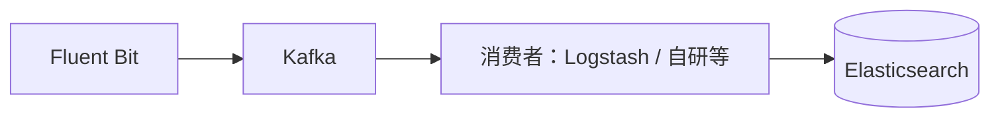

Kafka 部署与版本选型以 **Kafka 官方发行说明** 及所选 Operator/Chart（如 **Strimzi**）为准，版本纳入 GitOps。

**（插槽：Kafka 架构或 Topic 监控截图）**

---

### T9.2.11、与 T9.1 的对应关系

| T9.1 | T9.2 |
|------|------|
| 节点 DaemonSet 采集 | Fluent Bit DaemonSet，读取本节点容器日志 |
| Sidecar | EFK 场景通常无需另增采集边车；日志写文件仍见 **T9.1.4** |
| 应用直推 | 可与本节 ES 并存，应用直写 ES |

**发布前核对**：Kubernetes 版本符合 [ECK 支持范围](https://www.elastic.co/docs/deploy-manage/deploy/cloud-on-k8s#k8s-supported)；CRD 与 Operator 版本一致；Elasticsearch 存储、资源与 **`node.store.allow_mmap`** 已按 [Virtual memory](https://www.elastic.co/docs/deploy-manage/deploy/cloud-on-k8s/virtual-memory) 与容量规划评审；对外入口启用 TLS 与访问控制；Fluent Bit 生产启用 TLS 校验、凭据仅存 Secret；变更遵循 [Update deployments](https://www.elastic.co/docs/deploy-manage/deploy/cloud-on-k8s/update-deployments)。

下一节 **T9.3、Loki** 会按官方 Helm 方式部署 **Loki + Promtail（+ 可选 Grafana）**；它和 EFK 是两条常见路线，按成本与查询习惯二选一即可。

## T9.3、Loki

[Grafana Loki](https://grafana.com/docs/loki/latest/) 按**标签**索引元数据，正文日志压缩成块存起来，不像传统全文检索那样给每个词建倒排索引，成本通常更友好。查询用 **LogQL**，和 **Prometheus / Grafana** 一套习惯。**采集**：官方常提 **Promtail**、**Grafana Alloy**（承接原 Grafana Agent）。本节按 **Promtail + Helm** 落地；你已在 **T9.1 / T9.2** 用的 **Fluent Bit** 也可直接输出到 Loki（[Fluent Bit Loki 输出](https://docs.fluentbit.io/manual/pipeline/outputs/loki)），不冲突。

### T9.3.1、和 ES 怎么选（大白话）

| 维度 | Loki | Elasticsearch（EFK） |
|------|------|----------------------|
| 索引侧重 | 主要索引**标签**；正文走块存储与压缩 | 常做**全文**检索，资源占用更高 |
| 查询 | **LogQL**，跟 Prom 栈对齐 | **KQL / DSL** 等，生态成熟 |
| 典型场景 | 已有 **Grafana**，想控成本、标签统一 | 强检索、复杂分析、合规检索 |

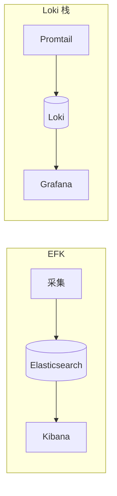

### T9.3.2、日志怎么走

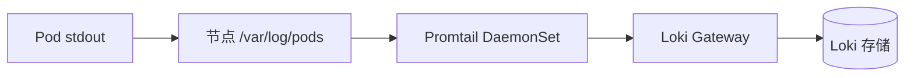

部署模式（单体 / 简单可扩展 / 微服务）见 [Deployment modes](https://grafana.com/docs/loki/latest/get-started/deployment-modes/)。**学习和小集群**用 **Monolithic**（单进程，与文档里旧名 **Single Binary** 同类）即可；上生产再接对象存储、多副本与读写拆分。

下面是 [Loki overview](https://grafana.com/docs/loki/latest/get-started/overview/) 官网同款示意图（本仓库从 [grafana/loki 文档源](https://github.com/grafana/loki/blob/main/docs/sources/get-started/loki-overview-2.png) 同步到本地，便于离线阅读）：


### T9.3.3、版本与校验

升级或排错前，对照 [Release notes](https://grafana.com/docs/loki/latest/release-notes/)、[Helm 安装](https://grafana.com/docs/loki/latest/setup/install/helm/) 与 [Chart README](https://github.com/grafana-community/helm-charts/blob/main/charts/loki/README.md)。

**本文本节校验日期：2026-04-20**

| 组件 | 版本 / 来源 | 说明 |
|------|-------------|------|
| Loki 镜像 | **3.7.1**（Chart `appVersion`，可再 pin tag） | [grafana/loki Releases](https://github.com/grafana/loki/releases)；Chart 见下 |
| Loki Helm Chart | **13.2.0**（与 `helm search repo grafana-community/loki` 一致即可） | [grafana-community/helm-charts](https://github.com/grafana-community/helm-charts) |
| Promtail Chart | `helm search repo grafana/promtail` 当前 stable | 镜像多为 `grafana/promtail` |
| Grafana Chart | `helm search repo grafana/grafana` 当前 stable | 本文用于 Explore 查日志 |

推荐用 **OCI** 装 Loki：`oci://ghcr.io/grafana-community/helm-charts/loki`。下文同时写 **HTTP 仓库**，方便内网镜像站对齐。

### T9.3.4、开工前要准备什么

与 **T9.2** 相同：组件放在 **`logging`** 命名空间；没有则先建：

```bash
kubectl create namespace logging
```

示例 **Monolithic** 打开 **MinIO** 子 Chart 时会多占 **PVC**；把 YAML 里的 **StorageClass** 换成你集群真实值（`kubectl get sc`）。**生产**请接云对象存储或自建 S3 兼容端点，不要长期把 MinIO 当唯一真源；参数见 [Helm reference](https://grafana.com/docs/loki/latest/setup/install/helm/reference/) 与 [Install monolithic](https://grafana.com/docs/loki/latest/setup/install/helm/install-monolithic/)。

### T9.3.5、装 Loki（Monolithic）

下面 **values** 对齐官方 [Install the monolithic Helm chart — Single Replica](https://grafana.com/docs/loki/latest/setup/install/helm/install-monolithic/)，额外固定 **`deploymentMode: Monolithic`**、**`-n logging`**。若 Helm 报未知字段，以 `helm show values grafana-community/loki --version 13.2.0` 为准。

将以下内容保存为 `loki-values.yaml`：

```yaml
# loki-values.yaml（学习/联调用；生产请换对象存储与高可用参数）
loki:
  commonConfig:
    replication_factor: 1
  schemaConfig:
    configs:
      - from: "2024-04-01"
        store: tsdb
        object_store: s3
        schema: v13
        index:
          prefix: loki_index_
          period: 24h
  pattern_ingester:
    enabled: true
  limits_config:
    allow_structured_metadata: true
    volume_enabled: true
  ruler:
    enable_api: true

minio:
  enabled: true

deploymentMode: Monolithic

singleBinary:
  replicas: 1

backend:
  replicas: 0
read:
  replicas: 0
write:
  replicas: 0
ingester:
  replicas: 0
querier:
  replicas: 0
queryFrontend:
  replicas: 0
queryScheduler:
  replicas: 0
distributor:
  replicas: 0
compactor:
  replicas: 0
indexGateway:
  replicas: 0
bloomPlanner:
  replicas: 0
bloomBuilder:
  replicas: 0
bloomGateway:
  replicas: 0
```

安装（**固定 Chart 小版本**，避免他人 `helm install` 时偷偷跨大版本）：

```bash
helm repo add grafana-community https://grafana-community.github.io/helm-charts
helm repo update

helm upgrade --install loki grafana-community/loki -n logging -f loki-values.yaml --version 13.2.0
```

OCI 写法（等价，镜像源更省事时可用）：

```bash
helm upgrade --install loki oci://ghcr.io/grafana-community/helm-charts/loki -n logging -f loki-values.yaml --version 13.2.0
```

查看 Pod（会包含 Loki、Gateway、缓存、MinIO 等，略等几分钟变 Running）：

```bash
kubectl get pods -n logging
```

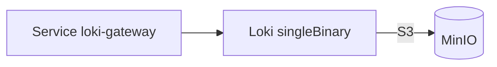

刚装完本节时，**logging** 里先有 **Gateway + Loki + MinIO**（以及 Chart 带出的缓存等）；**Promtail / Grafana** 在 **T9.3.6、T9.3.7** 再补上去。

**Helm 报错时**：先跑 `helm show values grafana-community/loki --version 13.2.0` 核对字段。个别版本示例仍写 **`deploymentMode: SingleBinary`**，与 **Monolithic** 在 [Chart Upgrading](https://github.com/grafana-community/helm-charts/blob/main/charts/loki/README.md#upgrading) 里属同一类部署，按报错二选一；跨大版本升级必须先读该章节。

### T9.3.6、装 Promtail

Promtail 走 **Grafana 官方 Helm 仓库**里的 **`grafana/promtail`**（和 **`grafana-community`** 不是同一个 `helm repo`，两个都要 add）。

客户端 URL 一般指向 **本 Release 名** 下的 Gateway。Release 名 **`loki`**、命名空间 **`logging`** 时，推送地址常为：

`http://loki-gateway.logging.svc.cluster.local/loki/api/v1/push`

```bash
helm repo add grafana https://grafana.github.io/helm-charts
helm repo update

helm upgrade --install promtail grafana/promtail -n logging \
  --version 6.17.1 \
  --set "config.clients[0].url=http://loki-gateway.logging.svc.cluster.local/loki/api/v1/push"
```

版本号与 **T9.4.1** 对齐；若 `helm search` 已有更新小版本，以仓库为准。若你改了 Helm Release 名，Service 前缀会跟着变，用 `kubectl -n logging get svc` 找带 **gateway** 的那条再拼 URL。

```bash
kubectl get pods -n logging -l app.kubernetes.io/name=promtail
```

默认会挂 **`/var/log/pods`**，和 **T9.1** 说的一致。节点没有 `/var/lib/docker/containers` 时，按当前 Chart 的 `values` 删掉多余 hostPath 即可。

### T9.3.7、装 Grafana 接 Loki

只调 API 可以不用 Grafana；**日常查日志**用 **Grafana Explore** 最顺手。新建 `grafana-values.yaml`（**adminPassword 必须改掉**；生产用 **Secret** 或 SSO，勿照抄）：

```yaml
# grafana-values.yaml
adminUser: admin
adminPassword: "请改成强密码"

service:
  type: ClusterIP

datasources:
  datasources.yaml:
    apiVersion: 1
    datasources:
      - name: Loki
        type: loki
        url: http://loki-gateway.logging.svc.cluster.local
        access: proxy
        isDefault: true
```

```bash
# 若已在 T9.3.6 执行过 helm repo add grafana，则只需 helm repo update
helm upgrade --install grafana grafana/grafana -n logging -f grafana-values.yaml
```

```bash
kubectl -n logging port-forward svc/grafana 3000:80
```

浏览器访问 `http://127.0.0.1:3000`，进 **Explore**，选 **Loki**，用 **LogQL** 试查（例如 `{namespace="default"}`）。

**（插槽：此处贴本环境 Grafana Explore 查询截图，便于后来者对照 UI。）**

**T9.3.5～T9.3.7 都做完后**，命名空间里采集与查询关系可概括成：

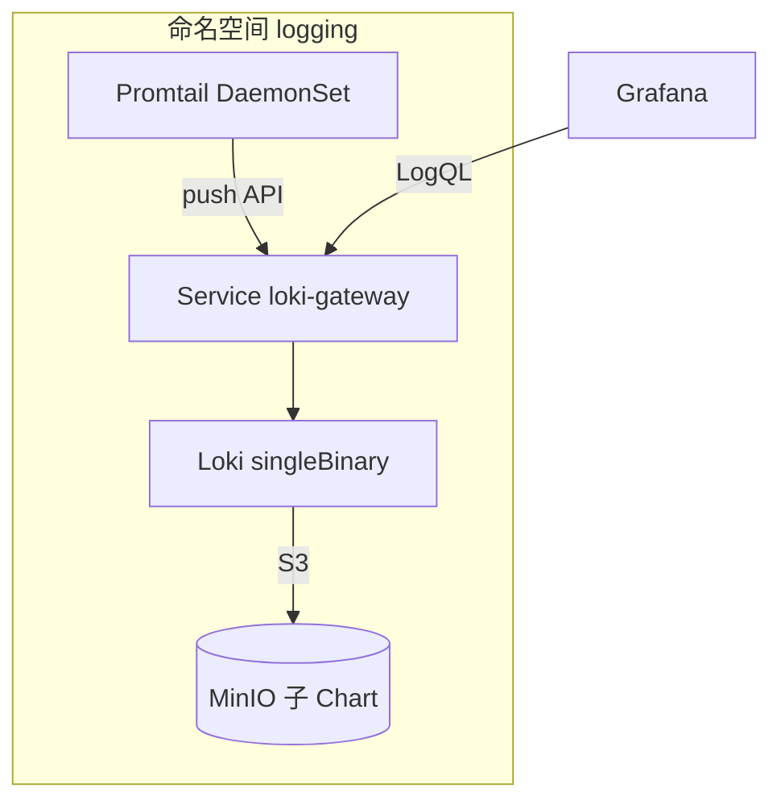

### T9.3.8、和 T9.1 / T9.2 的对应

| 上文 | 本节落点 |
|------|----------|
| **T9.1** 采集路径、Sidecar | **Promtail** 就是典型的**节点级 DaemonSet** 采集 |
| **T9.2** EFK → ES + Kibana | 本节走 **Loki + Grafana**（或只 API），两套路线二选一或按业务拆分 |
| **Fluent Bit** | 已在前面出现过；若要**只保留 Fluent Bit 推到 Loki**，按 [Loki output](https://docs.fluentbit.io/manual/pipeline/outputs/loki) 配置即可，不必再装 Promtail |

### T9.3.9、（可选）Traefik 与入口

入口用 **Traefik** 时，访问日志一般开 **access log**（多为 stdout、JSON），**Promtail** 随节点日志一并采集即可，不必为 Traefik 单独再起一套采集。具体开关以你当前的 Traefik 主版本文档为准。

**（插槽：若要大盘，可到 Grafana 官网选 Traefik 类 Dashboard 模板，导入后把 LogQL 里的 `job`、标签改名与你环境一致。）**

---

下一节 **T9.4、Promtail** 写配置要点、Helm 改法与 **Alloy** 迁移（官方已宣布 Promtail **EOL**），并与 **T9.3.6** 的安装衔接。

## T9.4、Promtail

> **官方结论（2026）**：[Promtail](https://grafana.com/docs/loki/latest/send-data/promtail/) 已于 **2026-03-02 EOL**（不再演进，商业支持结束），**新立项与扩容**请优先 [Grafana Alloy](https://grafana.com/docs/alloy/latest/) 采集并写入 Loki；**lambda-promtail** 不在此 EOL 范围内。本节仍按 **T9.3.6** 已装的 Promtail 讲清配置骨架，便于维护存量集群，并按 [Migrate to Alloy](https://grafana.com/docs/loki/latest/setup/migrate/migrate-to-alloy/) 替换采集端。

**T9.3** 里 Helm 已起 DaemonSet；落地时你要动的主要是 **`config.clients`（推到哪）**、**`positions`（断点续读）**、**`scrape_configs`（采哪些文件 / Pod）**、**`pipeline_stages`（解析与打标签）**。字段级说明已收进官方文档与 Chart 默认模板，下面只保留**生产上容易踩坑**的部分；需要查全量参数时，以 `helm show values grafana/promtail` 与 [Promtail 主文档](https://grafana.com/docs/loki/latest/send-data/promtail/) 为准。

### T9.4.1、版本与校验

**本文本节校验日期：2026-04-21**

| 项目 | 说明 |
|------|------|
| Promtail Helm Chart | `grafana/promtail`，示例 **6.17.1**（以 `helm search repo grafana/promtail --versions` 为准）；Chart 已 **deprecated**，长期应迁 **Alloy** |
| Promtail 镜像 | 建议与 **Loki 同发行线**（**T9.3** 使用 Loki **3.7.1** 时，镜像宜 **3.7.1**：在 `values` 里设 `image.tag: "3.7.1"`，覆盖 Chart 默认 `appVersion`） |
| Loki 写入地址 | 与 **T9.3** 一致：`http://loki-gateway.logging.svc.cluster.local/loki/api/v1/push`（Release 名 **`loki`**、命名空间 **`logging`**） |

### T9.4.2、配置骨架

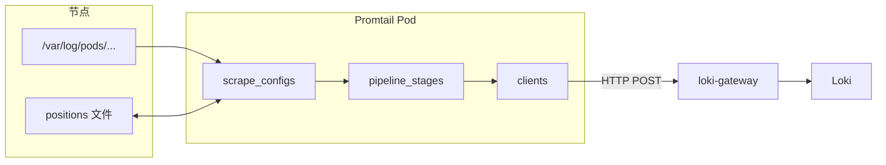

**三件事别搞混**：

1. **clients.url**：必须带 **`/loki/api/v1/push`**；多租户时再加 **`tenant_id`**（与 Loki 配置一致）。
2. **positions**：路径要在容器里**可写**（Chart 默认常挂 **`/run/promtail`**）。
3. **标签**：进 Loki 的是**标签集合**；**高基数**字段（请求 ID、用户 ID 等）不要做成标签，除非你算过成本。

### T9.4.3、Helm 改法

`grafana/promtail` 的默认值在 **`config`** 下拼装完整 **`config.file`**，常见改法：

- **只改推送地址**（与 **T9.3.6** 的 `--set config.clients[0].url=...` 等价）；
- **改镜像版本**：`image.tag`；
- **改抓取 / 管道**：动 **`config.snippets`**、**`config.snippets.extraScrapeConfigs`**、**`config.snippets.extraRelabelConfigs`** 等（**键名以当期 Chart 为准**）。

示例片段（**字段名请对照** `helm show values grafana/promtail --version 6.17.1`）：

```yaml
# promtail-values.yaml 片段
image:
  tag: "3.7.1"

config:
  clients:
    - url: http://loki-gateway.logging.svc.cluster.local/loki/api/v1/push
  positions:
    filename: /run/promtail/positions.yaml
```

```bash
helm repo add grafana https://grafana.github.io/helm-charts
helm repo update
helm upgrade --install promtail grafana/promtail -n logging -f promtail-values.yaml --version 6.17.1
```

### T9.4.4、K8s 抓取要点

- **DaemonSet 一节点一实例**：只读**本节点**日志；**Kubernetes SD** 下务必用 **`relabel`** 保证目标 Pod 落在本节点（Chart 默认模板里已有典型 **`__meta_kubernetes_pod_node_name`** 一类处理，见 `values.yaml` 里 **`snippets.scrapeConfigs`**）。
- **重复日志**：多个 `job` 若匹配同一文件，会向 Loki 打**重复流**，排障时先合并 / 收紧 `scrape_configs`。
- **与 Prometheus 对齐**：`namespace`、`pod`、`container` 等标签习惯与 Prometheus 一致时，**日志与指标**更好关联。

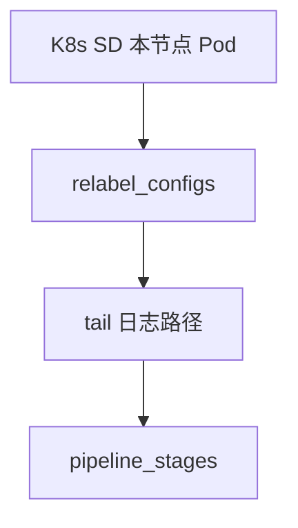

### T9.4.5、管道示例

下面示意：**JSON 行**里抽出 `level` 打成标签，再按标签**丢掉 debug**（完整阶段列表以官方说明为准；Helm 默认往往已有 **`cri: {}`** 处理容器运行时格式，勿与业务 JSON 阶段重复打架）。

```yaml
pipeline_stages:
  - json:
      expressions:
        level: level
  - labels:
      level:
  - match:
      selector: '{level="debug"}'
      action: drop
```

**（插槽：可贴 `kubectl -n logging logs` 里 Promtail 正常工作的片段截图。）**

### T9.4.6、迁到 Alloy（推荐）

1. 读 [Migrate to Alloy](https://grafana.com/docs/loki/latest/setup/migrate/migrate-to-alloy/)，用官方迁移工具把 **Promtail 配置转成 Alloy**（命令以文档为准）。
2. 推送端仍指向 **同一 Loki**（`loki-gateway.logging.svc.cluster.local`），与 **T9.3.5** 不冲突。
3. 新装采集端**不要再押注 Promtail** 长期演进。


**（插槽：可贴 Alloy 运行后 Grafana Explore 查询截图。）**

---

## T9.5、报警

日志告警常见三条路：**Grafana 里对 Loki 做告警规则**（官方当前主推的用法之一）、**Loki Ruler 用 LogQL 评估规则并通知 Alertmanager**、**采集端从日志生成指标再给 Prometheus**（Promtail 已 EOL，长期请用 Alloy 等价能力）。下面按「先易后难」排，并与 **T9.3、T9.4** 的 **Loki / Promtail** 安装方式对齐，不再使用已废弃的 **`loki-stack`** 与旧外链图。

### T9.5.1、版本与校验

**本文本节校验日期：2026-04-21**

| 项目 | 说明 |
|------|------|
| Loki | 与 **T9.3.5** 一致，示例 **3.7.1**（Chart **13.2.0**） |
| 告警规则语言 | **LogQL**（Ruler）或 **Grafana 表达式**（Grafana Alerting），见 [Alerting](https://grafana.com/docs/loki/latest/alerting/) |
| Alertmanager | 与现有监控栈一致；若用 **kube-prometheus-stack**，版本以 `helm search` / 官方发行为准 |
| 采集端 | **Promtail** 已 **EOL**（**T9.4**）；新装请 **Grafana Alloy** |

### T9.5.2、三条路怎么选

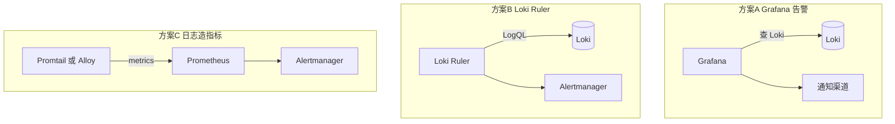

- **方案 A**：团队已用 **Grafana 10/11**，优先在 **Grafana → Alerting** 建规则，数据源选 **Loki**，不必先改 Loki Helm。详见 [Grafana Alerting](https://grafana.com/docs/grafana/latest/alerting/) 与 Loki 文档中的 [Alerting](https://grafana.com/docs/loki/latest/alerting/) 说明。
- **方案 B**：要把规则**当作代码**进集群、与 Prometheus 规则风格统一，或要 **Ruler API / lokitool 同步**时，用 **Ruler**。配置见 [Configure](https://grafana.com/docs/loki/latest/configure/#ruler) 与下文示例。
- **方案 C**：已有 **Prometheus** 生态，希望**先变成指标再告警**时用；注意 **Promtail** 维护结束，新装请规划 **Alloy**（**T9.4.6**）。

### T9.5.3、方案 A：Grafana 里告警（推荐入门）

1. 确认 **T9.3.7** 已把 **Loki** 加成 Grafana 数据源（`http://loki-gateway.logging.svc.cluster.local`）。  
2. 在 Grafana 中新建告警规则，查询类型选 **Loki**，用 **LogQL** 写条件（例如错误日志条数、关键字出现次数）。  
3. 配置通知渠道（企业微信、邮件、PagerDuty 等）。  

**（插槽：可贴「Alerting → New alert rule → Loki 查询」界面截图。）**

生产上记得：**评估间隔、For 持续时间、无数据/错误状态**与值班流程一致；复杂条件可用多查询与表达式（以当前 Grafana 版本文档为准）。

### T9.5.4、方案 B：Loki Ruler + Alertmanager

**T9.3.5** 里若只有 **`loki.ruler.enable_api: true`**，还不足以把告警送到 Alertmanager，需要补上 **`alertmanager_url`**、**规则存储** 等。请先 **`helm show values grafana-community/loki --version 13.2.0`** 看清本版 Chart 是用 **`loki.ruler`** 还是 **`loki.rulerConfig`**，再合并，避免和旧文 **`loki-stack`** 混用。

下面示例与官方 [Alerting](https://grafana.com/docs/loki/latest/alerting/) 中 ruler 结构一致：请用其**替换** **T9.3.5** 里原先那段只含 `enable_api` 的 **`ruler`**，保持 **`loki:`** 下只有一个 **`ruler`** 块。

```yaml
# 合并进 loki-values.yaml 的 loki: 段（路径按集群改）
loki:
  ruler:
    enable_api: true
    alertmanager_url: http://alertmanager-operated.monitoring.svc:9093
    enable_alertmanager_v2: true
    rule_path: /tmp/loki/scratch
    storage:
      type: local
      local:
        directory: /var/loki/rules
    ring:
      kvstore:
        store: inmemory
```

Alertmanager 的 Service 名、命名空间按你集群实际改（常见 **kube-prometheus-stack** 为 `monitoring`）。应用：

```bash
helm upgrade loki grafana-community/loki -n logging -f loki-values.yaml --version 13.2.0
```

规则内容与 **Prometheus 告警规则** 相同，但 **`expr` 里是 LogQL**。官方示例（节选）：

```yaml
groups:
  - name: loki_demo
    rules:
      - alert: HighErrorRate
        expr: |
          sum(rate({namespace="default", app="nginx-demo"} |= "error" [5m])) by (job)
            /
          sum(rate({namespace="default", app="nginx-demo"}[5m])) by (job)
            > 0.05
        for: 5m
        labels:
          severity: warning
        annotations:
          summary: "nginx error ratio high"
```

把规则文件放到 Ruler 能读到的存储（**local** 时需挂卷或 ConfigMap；生产多用 **S3/GCS** 等，见 [Ruler storage](https://grafana.com/docs/loki/latest/alerting/#ruler-storage)）。规则上线可用 **`lokitool`**（Loki **≥3.1**，见官方 [Interacting with the Ruler](https://grafana.com/docs/loki/latest/alerting/#interacting-with-the-ruler)）。

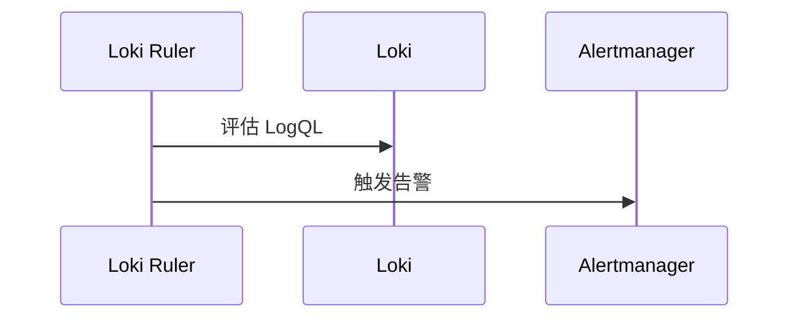

**（插槽：可贴 Alertmanager UI 中由 Loki 触发的告警条目截图。）**

### T9.5.5、方案 C：日志里造指标再走 Prometheus

思路：**Promtail（或 Alloy）pipeline** 里用 **metrics** 阶段暴露 Counter/Histogram，Prometheus 通过 **ServiceMonitor** 抓取 **`/metrics`**，再用 **PrometheusRule** 告警。`grafana/promtail` Chart 支持 **`serviceMonitor.enabled: true`**，标签要对上 Prometheus Operator 的 **`serviceMonitorSelector`**。

示例片段（**pipeline 以 CRI 解析为准**，不要用已废弃的单独 **`docker: {}`** 硬套；标签 `app` 需与你 workload 一致）：

```yaml
# promtail-values-patch.yaml 片段（与 T9.4.3 合并时对照 helm show values）
serviceMonitor:
  enabled: true
  additionalLabels:
    release: prometheus

config:
  snippets:
    pipelineStages:
      - cri: {}
    extraRelabelConfigs: []
  # 在 snippets.scrapeConfigs / extraScrapeConfigs 中按需挂载下面 pipeline，勿重复抓取同一文件
```

**metrics 阶段**示例（逻辑说明用；键名以 Promtail 版本为准）：

```yaml
pipeline_stages:
  - cri: {}
  - match:
      selector: '{app="nginx-demo"}'
      stages:
        - regex:
            expression: '.*(?P<method>GET|POST) .*'
        - metrics:
            nginx_http_requests:
              type: Counter
              description: "nginx requests"
              source: method
              config:
                action: inc
```

Prometheus 里指标名多为 **`promtail_custom_<name>[_total]`**（Counter 带 `_total`），**PrometheusRule** 的 `expr` 以 **Prometheus UI / Grafana Explore（Metrics）** 里实际 series 为准。

**（插槽：可贴 Prometheus Targets 中 promtail 与自定义指标查询截图。）**

### T9.5.6、联调用小应用（可选）

需要一个固定打日志的 workload 时，可用现代镜像，例如 **`nginx:1.27-alpine`**，**ClusterIP** + `kubectl port-forward` 访问，避免旧文里的 **NodePort + 固定机器 IP**。

```yaml
# nginx-demo.yaml
apiVersion: apps/v1
kind: Deployment
metadata:
  name: nginx-demo
  namespace: default
spec:
  replicas: 1
  selector:
    matchLabels:
      app: nginx-demo
  template:
    metadata:
      labels:
        app: nginx-demo
    spec:
      containers:
        - name: nginx
          image: nginx:1.27-alpine
          ports:
            - containerPort: 80
---
apiVersion: v1
kind: Service
metadata:
  name: nginx-demo
  namespace: default
spec:
  selector:
    app: nginx-demo
  ports:
    - port: 80
      targetPort: 80
```

```bash
kubectl apply -f nginx-demo.yaml
kubectl port-forward svc/nginx-demo 8080:80
# 另开终端：curl -s -o /dev/null -w "%{http_code}\n" http://127.0.0.1:8080/
```

LogQL 里用 **`{app="nginx-demo"}`** 或 **`{namespace="default", app="nginx-demo"}`** 与 **T9.5.4** 示例一致即可。

---

## T9.6、LogQL

**LogQL** 是 Loki 的查询语言，和 PromQL 有渊源，但面向日志。详细语法以官方 [Query Loki](https://grafana.com/docs/loki/latest/query/) 为准；下面只整理**生产里天天会用到的骨架**，避免把参考手册整本贴进来。

### T9.6.1、版本与校验

**本文本节校验日期：2026-04-21**

| 项目 | 说明 |
|------|------|
| Loki | 与 **T9.3** 一致，示例 **3.7.x**（Chart **13.2.0**） |
| 查询入口 | **Grafana Explore**、**LogCLI**（[logcli](https://grafana.com/docs/loki/latest/query/logcli/)）、告警规则里的 **LogQL**（**T9.5**） |
| 必读 | [Log queries](https://grafana.com/docs/loki/latest/query/log_queries/) · [Metric queries](https://grafana.com/docs/loki/latest/query/metric_queries/) |

### T9.6.2、两类查询

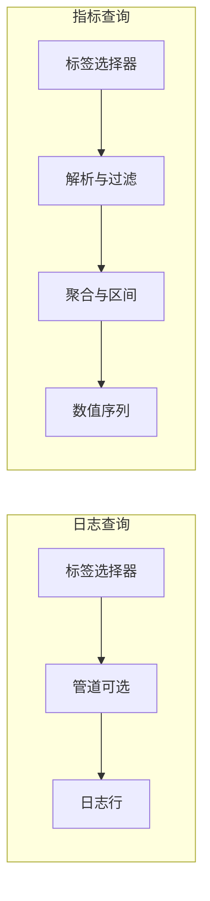

- **日志查询**：结果还是日志内容，适合排障、检索。  
- **指标查询**：在日志上算 **rate、count_over_time** 等，结果给大盘或告警（**T9.5.4**）。

基本形状（官方写法）：

```logql
{ log stream selector } | log pipeline
```

**流选择器必选**，**管道可选**；Loki **只索引标签和时间**，正文靠管道里过滤和解析（见 [Labels](https://grafana.com/docs/loki/latest/get-started/labels/)）。

### T9.6.3、流选择器（标签）

大括号里用 **`=`、`!=`、`=~`、`!~`** 匹配标签，规则和 Prometheus 类似（见 [Prometheus 标签匹配](https://prometheus.io/docs/prometheus/latest/querying/basics/#instant-vector-selectors)）。

新版本里常有 **`service_name`** 等约定标签，便于和 Grafana 里日志视图联动，具体以你集群里 **Explore → 标签浏览器** 看到的为准。

**（插槽：可贴本环境 Grafana Explore 里标签键列表截图。）**

与 **T9.5.6** 的 **nginx-demo** 对齐的示例：

```logql
{namespace="default", app="nginx-demo"}
```

### T9.6.4、管道：先过滤行，再解析

**行过滤**尽量靠前，少扫数据：

| 运算符 | 含义 |
|--------|------|
| `|=` | 行包含子串 |
| `!=` | 行不包含 |
| `|~` | 行匹配正则（RE2） |
| `!~` | 正则不匹配 |

**解析**：`| json`、`| logfmt`、`| regexp "..."` 等，把字段抽成标签再在管道里用（详见官方 [Log queries](https://grafana.com/docs/loki/latest/query/log_queries/)）。

示例：只看包含 `error` 的行再解析 JSON：

```logql
{namespace="default", app="nginx-demo"} |= "error" | json
```

**格式化展示**（不改变 Loki 里存的数据）：`| line_format "..."`、`| label_format ...`（官方 [Query](https://grafana.com/docs/loki/latest/query/) 页有示例）。

### T9.6.5、指标查询（告警 / 大盘）

在日志选择器 + 管道之后，对**范围区间**做聚合，常见：

- **`rate()`**：每秒条目数  
- **`count_over_time()`**：区间内条数  
- **`sum(... ) by (label)`**：按标签聚合  

示例：按 **pod** 看 5 分钟请求日志条数变化（标签名以你环境为准）：

```logql
sum by (pod) (rate({namespace="default", app="nginx-demo"}[5m]))
```

**错误率**一类写法（与 **T9.5.4** 思路一致，按业务改标签）：

```logql
sum(rate({namespace="default", app="nginx-demo"} |= "error" [5m])) by (job)
  /
sum(rate({namespace="default", app="nginx-demo"}[5m])) by (job)
```

区间写法 **`[5m]`** 与 PromQL 习惯一致；更复杂的函数、**unwrap**、**二进制运算**见 [Metric queries](https://grafana.com/docs/loki/latest/query/metric_queries/)。

### T9.6.6、注释与排障习惯

单行或行尾可用 **`#`** 注释（见官方说明）。  

**生产注意**：

1. **标签越少越准**：选择器越宽，扫的 chunk 越多，查询越慢、越贵。  
2. **高基数不要塞进标签**（采集端就要克制，见 **T9.4**）。  
3. **大时间范围 + 宽选择器** 容易超时，先缩时间窗或加 `|=` 过滤。  
4. 与 **T9.3.7** 数据源 URL 一致时，**Grafana Explore** 里试通后再写进 **T9.5** 告警规则。

```mermaid
flowchart TB
  A["标签尽量收窄"] --> B["行过滤 含子串或正则"]
  B --> C["json 或 logfmt"]
  C --> D["rate 等聚合"]
```

**（插槽：可贴一条本环境完整 LogQL 在 Explore 中的查询结果截图。）**

---

