# T9、日志

## T9.1、日志架构

监控篇（T4）管的是**指标和告警**：CPU、延迟、错误率这类数，用来盯健康、触发告警。本篇管的是**日志**：谁在什么时间、打印了什么内容，用来还原现场、排查根因。

**生产上这两套一般都要上**，但职责不同：**指标**适合按时间聚合、做告警规则；**日志**适合按关键字、上下文检索。

选型上也就不同：指标常用 Prometheus 这类时序库，日志常用 ES、OpenSearch、托管日志等。

**不要把两类数据混进同一种存储里凑合用**（例如用日志库硬扛全量指标，或把海量原始日志塞进时序库），既贵又难维护，也不是常见做法。

本节对齐 [Kubernetes：Logging Architecture](https://kubernetes.io/docs/concepts/cluster-administration/logging/)，并结合生产习惯写清：**镜像固定 tag、校验日期、可照着 apply 的 YAML**。文中配图来自 **Kubernetes 官网同一套素材**（已下载到本文 `images/`，便于离线阅读）。

### T9.1.1、概念与依据

**应用日志**：看业务行为、排错、审计。**容器里最省事的做法**：写 **stdout / stderr**，由运行时交给 kubelet，再在节点上落盘；平时用 `kubectl logs` 就能看。

**集群级日志（cluster-level logging）**：官方定义是——日志的**存储与生命周期**要和节点、Pod、容器**脱钩**，否则容器崩了、Pod 被赶走、节点挂了，你只依赖本地文件会抓瞎。Kubernetes **不提供**日志存储产品，只提供 API 与节点侧行为；**存哪、查哪、保留多久**由你自己选（EFK、托管日志、Kafka 等）。

**和监控怎么配合**：业务容器可以同时做两件事——一边按 Prometheus 约定暴露 **`/metrics` 端点**（给监控抓），一边往 **stdout/stderr 打日志**（给日志采集收）。**前者不等于后者**：不能指望只靠日志解决告警，也不能只靠指标还原每一行日志原文；两条链路各自部署、各自存储即可。

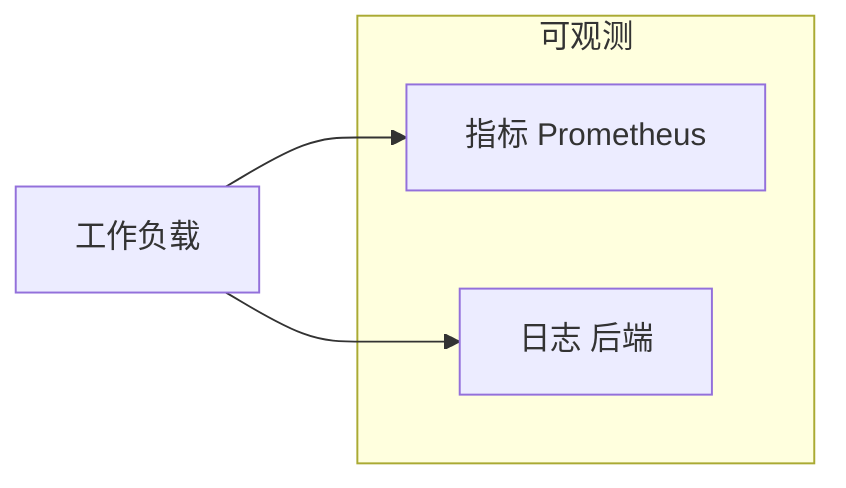
```mermaid
flowchart LR
  subgraph obs["可观测"]
    M[指标 Prometheus]
    L[日志 后端]
  end
  APP[工作负载] --> M
  APP --> L
```

---

### T9.1.2、标准输出与节点行为

下面这张图对应官方「节点如何处理容器日志」的说明：运行时接管 stdout/stderr，与 kubelet 之间用 **CRI 日志格式**衔接（具体实现随运行时变化，但对 kubelet 的接口是统一的）。


**你可以把一条日志从容器里到 `kubectl logs` 的路径理解成：**

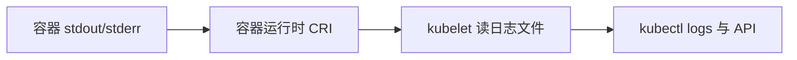
```mermaid
flowchart LR
  C[容器 stdout/stderr]
  R[容器运行时 CRI]
  K[kubelet 读日志文件]
  U["kubectl logs 与 API"]
  C --> R --> K --> U
```

**kubelet 轮转（生产必看）**：自 v1.21 起相关能力已稳定。可在 [kubelet 配置](https://kubernetes.io/docs/reference/config-api/kubelet-config.v1beta1/) 里调 `containerLogMaxSize`（默认约 10Mi）、`containerLogMaxFiles`（默认约 5）等；大流量集群还可关注 `containerLogMaxWorkers`、`containerLogMonitorInterval`。目的是**别让单容器日志把节点盘打满**。

**`kubectl logs` 的边界**：官方写明——通常只能看到**当前正在写的那份**文件；若已轮转，更早的不一定还能从这个命令拿到。**长期留存、合规检索**必须走集群级后端，别指望 `kubectl logs` 当归档库。

**可选（Alpha）**：从 v1.32 起有 `PodLogsQuerySplitStreams` 特性门，可把 stdout / stderr 分开查，默认关。见官方 [Container log streams](https://kubernetes.io/docs/concepts/cluster-administration/logging/#container-log-streams)。

**最小示例**（与官方 [counter-pod.yaml](https://k8s.io/examples/debug/counter-pod.yaml) 同结构，镜像与监控篇一致）：

```yaml
# counter-pod.yaml
apiVersion: v1
kind: Pod
metadata:
  name: counter
spec:
  containers:
    - name: count
      image: busybox:1.37
      args:
        - /bin/sh
        - -c
        - 'i=0; while true; do echo "$i: $(date)"; i=$((i+1)); sleep 1; done'
```

```bash
kubectl apply -f counter-pod.yaml
kubectl logs counter
kubectl logs counter -c count
kubectl logs counter --previous
```

重复实验若遇名称冲突：`kubectl delete pod counter --ignore-not-found`。

> **版本与镜像约定（与监控篇一致）**
>
> **`image:` 一律固定 tag**；升级前到 **GitHub Releases** 或镜像仓库核对 **latest 稳定版**（非 prerelease），并更新下表与校验日期。  
>
> **本文同步校验日期：2026-04-21**  
>
> | 组件 | 镜像 / 标签 | 说明 |
> |------|-------------|------|
> | busybox | `busybox:1.37` | 与 [T4 监控篇](../prometheus/prometheus.md) 一致 · [Hub](https://hub.docker.com/_/busybox/tags) |
> | Fluent Bit | `fluent/fluent-bit:5.0.3` | 节点/sidecar 常用 · [Releases](https://github.com/fluent/fluent-bit/releases/latest) |
> | 官方文档中的 fluentd 示例 | `registry.k8s.io/fluentd-gcp:1.30` | 与 [官方页面示例](https://kubernetes.io/docs/concepts/cluster-administration/logging/) 同源，偏 GKE；**自建集群请改 OUTPUT**，勿照搬 `google_cloud` |

---

### T9.1.3、三类集群级路径

官方在 [Cluster-level logging architectures](https://kubernetes.io/docs/concepts/cluster-administration/logging/#cluster-level-logging-architectures) 里只归纳三类，生产里一般是「三选一或组合」。

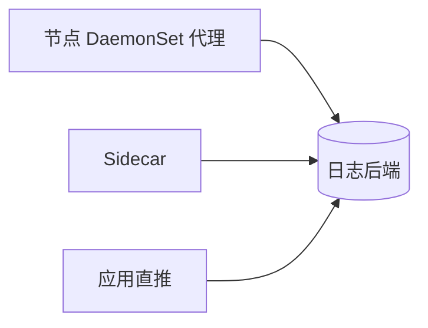
```mermaid
flowchart LR
  A[节点 DaemonSet 代理] --> BE[(日志后端)]
  B[Sidecar] --> BE
  C[应用直推] --> BE
```

| 路径 | 一句话 | 常见场景 |
|------|--------|----------|
| 节点代理 | 每节点一个采集进程，读本节点容器日志目录，再发到后端 | **默认首选**，不动业务镜像 |
| Sidecar | 跟业务同 Pod：要么把文件日志打到 sidecar 的 stdout，要么在 sidecar 里跑采集进程 | 写文件、多格式分流、节点策略不满足时 |
| 应用直推 | 进程内 SDK 直接发到后端 | 强绑定某云/厂商 SDK，或作补充 |

---

### T9.1.4、落地与示例

这一节把上面三种「集群级日志」拆成四段，每一段都配有**官方示意图**和**能直接 apply 的 YAML**（需要你先装好集群和 `kubectl`）。阅读顺序建议：先看 **T9.1.4.1**，这是大多数公司默认采用的形态；只有业务把日志写进**文件**、或者节点上统一采集满足不了时，再往下看 Sidecar 两种；应用内直推放在最后，用得相对少。

**怎么选，一句话对照**：

- **多数情况**：用 **T9.1.4.1 节点代理**就够了，业务继续往 stdout 打日志即可。  
- **业务必须写文件**：先看能不能改成 stdout；改不了，再用 **T9.1.4.2** 或 **T9.1.4.3**（Sidecar 会多占资源，要心里有数）。  
- **应用直推（T9.1.4.4）**：Kubernetes 不管你怎么实现，适合已经接了某云日志 SDK 的场景，或当补充手段。

---

#### T9.1.4.1、节点代理


**这是在干什么**：在**每一台工作节点**上跑一个采集程序（一般用 **DaemonSet** 部署，保证每台机器都有一个 Pod）。这个程序去读「本节点上、所有容器打出来的日志文件」（常见目录是 `/var/log/pods/...`，具体以你集群为准），解析后再发到 Elasticsearch、Kafka、云厂商日志服务等。

**为什么常用**：业务不用改镜像、不用加边车，只要像平常一样往 **标准输出** 打日志，节点上的代理自然会收集到。

**什么时候不够**：代理默认跟的是「标准输出落到节点上的那套日志」。如果你的程序只往**自己容器里某个路径**写文件，又不跟别的容器共享卷，节点上的统一采集**可能读不到**，这时就要用后面的 Sidecar，或者改程序写法。

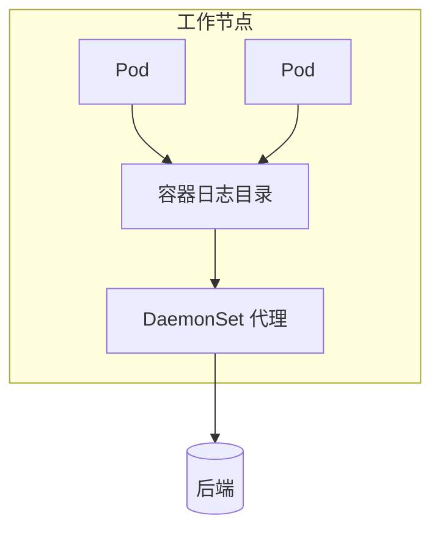
```mermaid
flowchart TB
  subgraph n["工作节点"]
    P1[Pod]
    P2[Pod]
    D[容器日志目录]
    X[DaemonSet 代理]
  end
  P1 --> D
  P2 --> D
  D --> X
  X --> BK[(后端)]
```

---

#### T9.1.4.2、Sidecar 流式

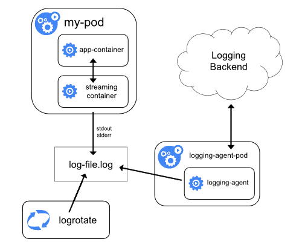

**这是在干什么**：业务坚持把日志写进**文件**（例如 `/var/log/1.log`），你又希望后面仍然走「标准输出 → 节点采集」这条老路。做法是：加一个（或多个）**小容器**，和主容器**共享同一块卷**，用小容器里的 `tail -F` 去读文件，把读到的内容**打印到自己的标准输出**。这样一来，kubelet 照样按「容器标准输出」收集，节点上的日志代理也能接着收。

**和上一段的关系**：上一段是「节点上一个代理管全机」；这里是「**单个 Pod 里多几个容器配合**」，专门解决「写文件」的问题。

**操作要点**：主容器写文件；**每个要单独看的日志流，对应一个 sidecar**，下面示例里是两个文件，所以有两个 sidecar。用 `kubectl logs` 时可以按**容器名**分别看。


```mermaid
flowchart LR
  F[应用写文件]
  T[sidecar tail -F]
  O[sidecar stdout]
  F --> T --> O
  O --> K["kubelet 与节点代理"]
```

```yaml
# two-files-counter-pod-streaming-sidecar.yaml
apiVersion: v1
kind: Pod
metadata:
  name: counter
spec:
  containers:
    - name: count
      image: busybox:1.37
      args:
        - /bin/sh
        - -c
        - >
          i=0;
          while true;
          do
            echo "$i: $(date)" >> /var/log/1.log;
            echo "$(date) INFO $i" >> /var/log/2.log;
            i=$((i+1));
            sleep 1;
          done
      volumeMounts:
        - name: varlog
          mountPath: /var/log
    - name: count-log-1
      image: busybox:1.37
      args: [/bin/sh, -c, 'tail -n+1 -F /var/log/1.log']
      volumeMounts:
        - name: varlog
          mountPath: /var/log
    - name: count-log-2
      image: busybox:1.37
      args: [/bin/sh, -c, 'tail -n+1 -F /var/log/2.log']
      volumeMounts:
        - name: varlog
          mountPath: /var/log
  volumes:
    - name: varlog
      emptyDir: {}
```

```bash
kubectl apply -f two-files-counter-pod-streaming-sidecar.yaml
kubectl logs counter -c count-log-1
kubectl logs counter -c count-log-2
```

**磁盘上多占一份**：同一条日志，文件里有一份，经 sidecar 打出标准输出后，节点上还会再记一份。官方也提醒这样会**接近双倍占用**。所以能改的话，还是尽量让应用直接打 **stdout/stderr**，让 kubelet 去轮转，更省事。

---

#### T9.1.4.3、Sidecar 采集器

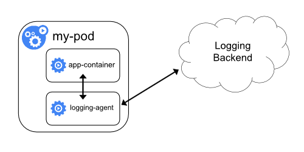

**和 T9.1.4.2 的差别**：上一段是「用 `tail` 把文件**转成**标准输出，再走节点上那套采集」。这一段是「在 Pod 里再跑一个**真正的采集程序**（例如 Fluent Bit、fluentd），直接从共享卷里 **tail 文件**，然后**按你的配置发到后端**（不一定再经过业务容器的标准输出）」。

**什么时候会用到**：例如你希望**解析规则、过滤规则**只作用在这一个应用上，不想在节点全局 DaemonSet 里写一大坨；或者多租户隔离、合规要求必须在 Pod 内完成转发等。

**代价**：每个业务 Pod 都要多跑一个采集容器，**CPU、内存要算进容量规划**。另外，`kubectl logs` 只能看**某个容器的标准输出**，**看不到**「已经发到 Elasticsearch 里」的那条日志；要看转发是否成功，要么看**采集容器自己的日志**，要么到**日志后端**里查。

**和官方文档对齐**：[Kubernetes 文档](https://kubernetes.io/docs/concepts/cluster-administration/logging/#sidecar-container-with-a-logging-agent) 里的示例用的是 **fluentd**，输出写到 **`google_cloud`**，镜像为 **`registry.k8s.io/fluentd-gcp:1.30`**（给 **GCP** 用的）。自建集群一般是 **Fluent Bit** 或自管 fluentd，把配置里的 **`OUTPUT`** 改成你的 ES、Kafka、HTTP 等。下面用 **Fluent Bit 5.x**，先把日志打到 **stdout**，方便你确认管道通了；上线时只改 **`[OUTPUT]`** 即可。

```yaml
# fluent-bit-sidecar-cm.yaml
apiVersion: v1
kind: ConfigMap
metadata:
  name: fluent-bit-config
data:
  fluent-bit.conf: |
    [SERVICE]
        Flush     1
        Log_Level info

    [INPUT]
        Name  tail
        Tag   count.format1
        Path  /var/log/1.log

    [INPUT]
        Name  tail
        Tag   count.format2
        Path  /var/log/2.log

    [OUTPUT]
        Name  stdout
        Match *
        Format json_lines
```

```yaml
# counter-with-fluent-bit-sidecar.yaml
apiVersion: v1
kind: Pod
metadata:
  name: counter
spec:
  containers:
    - name: count
      image: busybox:1.37
      args:
        - /bin/sh
        - -c
        - >
          i=0;
          while true;
          do
            echo "$i: $(date)" >> /var/log/1.log;
            echo "$(date) INFO $i" >> /var/log/2.log;
            i=$((i+1));
            sleep 1;
          done
      volumeMounts:
        - name: varlog
          mountPath: /var/log
    - name: count-agent
      image: fluent/fluent-bit:5.0.3
      command: ["/fluent-bit/bin/fluent-bit"]
      args: ["-c", "/fluent-bit/etc/fluent-bit.conf"]
      volumeMounts:
        - name: varlog
          mountPath: /var/log
        - name: config-volume
          mountPath: /fluent-bit/etc
  volumes:
    - name: varlog
      emptyDir: {}
    - name: config-volume
      configMap:
        name: fluent-bit-config
```

```bash
kubectl apply -f fluent-bit-sidecar-cm.yaml
kubectl apply -f counter-with-fluent-bit-sidecar.yaml
kubectl logs counter -c count-agent
```

上面命令里，`kubectl logs` 看到的是 **Fluent Bit 容器**打到标准输出的内容（示例里配成了 JSON 行）。等你把 **`[OUTPUT]`** 改成真实后端后，要到 **Kibana、OpenSearch Dashboards** 或云控制台里去查业务日志。[官方 fluentd 示例](https://kubernetes.io/docs/concepts/cluster-administration/logging/#sidecar-container-with-a-logging-agent) 可以对照着看：结构一样，只是采集软件和 **`OUTPUT`** 随环境换。

**（插槽：把 OUTPUT 接到 OpenSearch/Elasticsearch 等并验证检索通过后，可在此处补一张 Discover/检索界面截图。）**

---

#### T9.1.4.4、应用直推

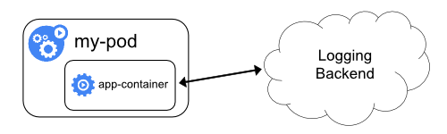

**这是在干什么**：不经过节点上的统一采集，应用在代码里用 **SDK 或 HTTP** 等，把日志**直接发到**日志平台或消息队列。

**Kubernetes 的态度**：官方写明，这类做法**不在 Kubernetes 核心概念里细讲**。也就是说：**怎么鉴权、失败重试、打爆了怎么办（背压）、字段长什么样**，都要你们自己在应用或 SDK 层设计。适合已经**绑定了某家云日志**、或必须绕过节点采集策略的情况；也可以和节点采集**同时存在**，作为补充。

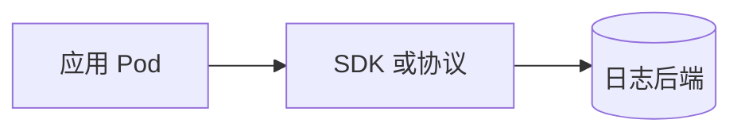
```mermaid
flowchart LR
  APP[应用 Pod] --> SDK["SDK 或协议"]
  SDK --> BE[(日志后端)]
```

---

下一节 **「T9.2、日志 EFK」** 会用 **ECK** 部署 **Elasticsearch、Kibana**，再用 **Fluent Bit DaemonSet** 把节点上的容器日志送进 ES（与本文 **T9.1** 的采集组件一致）。若团队已经统一用 **Fluentd**，只要把输出指向同一套 ES 即可。

## T9.2、日志 EFK

**Elasticsearch** 负责日志存储与检索；**Kibana** 提供查询与可视化；**Fluent Bit** 以 **DaemonSet** 在各节点读取容器日志并写入 ES，采集模型与 **T9.1** 节点代理一致。已标准化 **Fluentd** 时，将输出指向本节同一 ES 端点即可。

**Elastic Cloud on Kubernetes（ECK）** 是 Elastic 在 Kubernetes 上编排 Elasticsearch、Kibana 等的官方 Operator，负责自定义资源生命周期、TLS 与滚动升级。本节操作步骤依据 ECK 官方安装与部署文档；Fluent Bit 写入 ES 的行为依据 [Elasticsearch 输出插件](https://docs.fluentbit.io/manual/pipeline/outputs/elasticsearch)。

**官方文档**：[Elastic Cloud on Kubernetes](https://www.elastic.co/docs/deploy-manage/deploy/cloud-on-k8s) · [ECK Guide](https://www.elastic.co/guide/en/cloud-on-k8s/current/index.html)

### T9.2.1、数据怎么流

应用将日志写入 **stdout/stderr**，由容器运行时落盘至节点；**Fluent Bit** 读取节点上的容器日志文件并转发至 **Elasticsearch**；**Kibana** 查询 ES 中的索引。**elastic-operator** 根据 `Elasticsearch`、`Kibana` 等 CR 管理 Pod、PVC 与证书，不参与日志数据面转发。

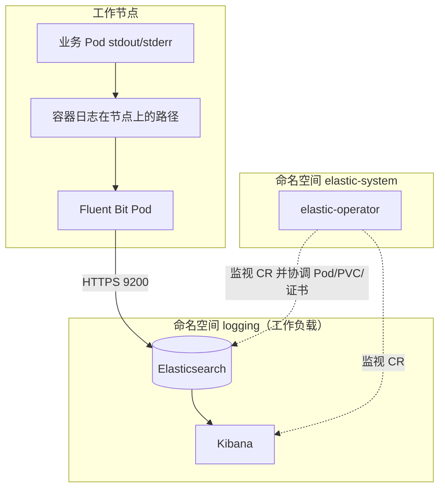
```mermaid
flowchart TB
  subgraph node["工作节点"]
    P[业务 Pod stdout/stderr]
    L[容器日志在节点上的路径]
    FB[Fluent Bit Pod]
  end
  subgraph logging_ns["命名空间 logging（工作负载）"]
    ES[(Elasticsearch)]
    KB[Kibana]
  end
  subgraph esys["命名空间 elastic-system"]
    OP[elastic-operator]
  end
  P --> L --> FB -->|HTTPS 9200| ES
  ES --> KB
  OP -.监视 CR 并协调 Pod/PVC/证书.-> ES
  OP -.监视 CR.-> KB
```

---

### T9.2.2、版本与校验

以 **GitHub Release、Elastic 下载页、[支持矩阵](https://www.elastic.co/support/matrix#matrix_kubernetes)** 为版本准绳；变更时同步更新下表与 GitOps 中的固定镜像 / 清单 URL。

**本文同步校验日期：2026-04-21**

| 组件 | 版本 / 来源 | 说明 |
|------|-------------|------|
| ECK Operator | `3.3.2` | [YAML 安装](https://www.elastic.co/docs/deploy-manage/deploy/cloud-on-k8s/install-using-yaml-manifest-quickstart) 中的 `crds.yaml`、`operator.yaml` · [Releases](https://github.com/elastic/cloud-on-k8s/releases) · [下载](https://www.elastic.co/downloads/elastic-cloud-kubernetes) |
| Kubernetes | **1.31–1.35** | [ECK：Supported versions](https://www.elastic.co/docs/deploy-manage/deploy/cloud-on-k8s#k8s-supported) |
| Elastic Stack（`spec.version`） | **9.3.3** | 与 [Elasticsearch 部署快速入门](https://www.elastic.co/docs/deploy-manage/deploy/cloud-on-k8s/elasticsearch-deployment-quickstart) 示例一致；ECK 支持 Stack **8+、9+**；默认镜像仓库 **`docker.elastic.co`** |
| Fluent Bit | `fluent/fluent-bit:5.0.3` | 与 **T9.1** 一致 · [Releases](https://github.com/fluent/fluent-bit/releases) |

---

### T9.2.3、前提条件

- **命名空间**：Elasticsearch、Kibana、Fluent Bit 部署在 **`logging`**（`kubectl create namespace logging`）。ECK Operator 运行在 **`elastic-system`**（由 `operator.yaml` 创建）；业务负载勿与 Operator 混部于 **`elastic-system`**。
- **存储**：数据目录使用 **`volumeClaimTemplates`** 申请 PVC；将示例中的 **`storageClassName`** 替换为集群内可用 StorageClass（`kubectl get sc`）。试跑可用单节点与小容量盘；生产按容量、副本、可用区规划，参见 [Volume claim templates](https://www.elastic.co/docs/deploy-manage/deploy/cloud-on-k8s/volume-claim-templates)。
- **资源与节点**：示例 CPU/内存为联调下限；生产按数据量与查询负载扩容。节点需满足内存与 **`vm.max_map_count`** 等要求，参见 [Elasticsearch：系统配置与堆](https://www.elastic.co/guide/en/elasticsearch/reference/current/setup-configuration-memory.html)。节点可调度的可用内存不足约 **2GiB** 时，ES Pod 可能持续 **Pending**。
- **`node.store.allow_mmap`**：快速入门默认 **`false`**；生产是否启用 **mmap** 及调优见 [Virtual memory](https://www.elastic.co/docs/deploy-manage/deploy/cloud-on-k8s/virtual-memory)。
- **网络（托管集群）**：**EKS** 须允许控制面与节点间 **TCP 443** 通信，以满足 **ValidatingWebhook** 要求，见 YAML 安装说明中的 **EKS** 章节。**GKE** 须具备完成 RBAC 绑定的管理员权限。
- **凭据**：ECK 为 **`elastic`** 用户生成密码并存入 Secret；**禁止**将密码写入 Git 仓库或 ConfigMap 明文。

---

### T9.2.4、安装 ECK Operator

**参考文档**

| 内容 | 链接 |
|------|------|
| 安装总览（YAML、Helm、OpenShift、离线等） | [Guide：Install ECK](https://www.elastic.co/guide/en/cloud-on-k8s/current/k8s-installing-eck.html) · [Docs：Install ECK](https://www.elastic.co/docs/deploy-manage/deploy/cloud-on-k8s/install) |
| kubectl：CRD 与 Operator | [YAML manifests](https://www.elastic.co/docs/deploy-manage/deploy/cloud-on-k8s/install-using-yaml-manifest-quickstart) |
| Helm | [Helm chart](https://www.elastic.co/docs/deploy-manage/deploy/cloud-on-k8s/install-using-helm-chart) |
| 离线 / 私有镜像仓库 | [Air-gapped](https://www.elastic.co/docs/deploy-manage/deploy/cloud-on-k8s/air-gapped-install) |
| 升级 Operator | [Upgrade ECK](https://www.elastic.co/docs/deploy-manage/upgrade/orchestrator/upgrade-cloud-on-k8s) |

安装将写入集群级 **CRD**、**elastic-system** 命名空间、RBAC、**ValidatingWebhookConfiguration** 等对象，清单见 YAML 安装说明。**删除** ECK 相关 **CRD** 将级联删除集群内由该 Operator 管理的 Elastic 自定义资源，须在变更流程中评估影响。

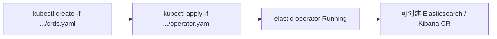
```mermaid
flowchart LR
  S1["kubectl create -f .../crds.yaml"] --> S2["kubectl apply -f .../operator.yaml"]
  S2 --> R["elastic-operator Running"]
  R --> OK["可创建 Elasticsearch / Kibana CR"]
```

**安装**（版本与官方 YAML 快速入门一致，便于在流水线中固定 URL）：

```bash
kubectl create -f https://download.elastic.co/downloads/eck/3.3.2/crds.yaml
kubectl apply -f https://download.elastic.co/downloads/eck/3.3.2/operator.yaml
```

**验收**：

```bash
kubectl -n elastic-system logs -f statefulset.apps/elastic-operator
kubectl -n elastic-system get pods
```

**`elastic-operator-0`** 为 **`1/1 Running`** 后继续后续步骤。**Helm** 或 **离线**部署按上表文档配置 Chart 参数、镜像同步与 **`container-registry`** 等。

---

### T9.2.5、部署 Elasticsearch（ECK）

在 **`logging`** 命名空间应用 Elasticsearch CR。YAML 在 [Elasticsearch 部署快速入门](https://www.elastic.co/docs/deploy-manage/deploy/cloud-on-k8s/elasticsearch-deployment-quickstart) 基础上补充 **resources**、**volumeClaimTemplates** 与 **`node.roles`**。**`count: 1`** 用于试跑与联调；**生产**将 **`count`** 提升至 **3** 及以上，并按官方说明实施高可用、索引生命周期（ILM）与快照等。

Elastic 当前公开文档未单独提供「ECK 编排」位图；安装 Operator 时创建的集群级 **CRD**、**ValidatingWebhookConfiguration** 等见 [YAML 安装说明](https://www.elastic.co/docs/deploy-manage/deploy/cloud-on-k8s/install-using-yaml-manifest-quickstart)。下图归纳 **`logging`** 命名空间内 **Elasticsearch CR** 经 **elastic-operator** 落地后的主要对象及 **Fluent Bit** 写入路径（与 **T9.2.1**、**T9.2.6** 衔接）。

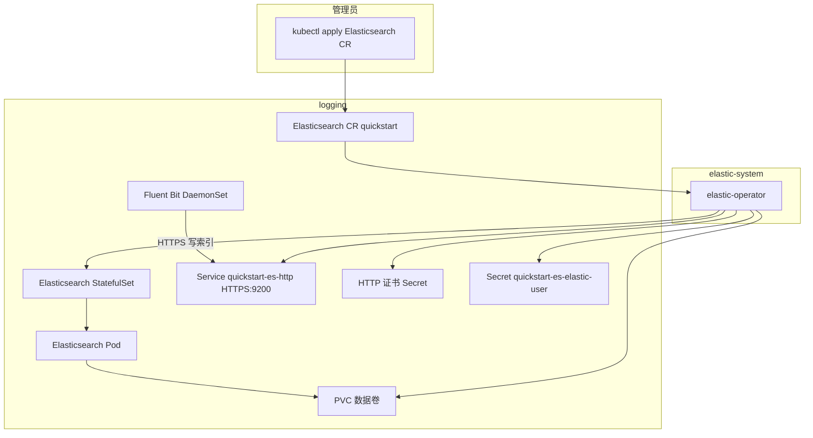
```mermaid
flowchart TB
  subgraph adm[管理员]
    KA["kubectl apply Elasticsearch CR"]
  end
  subgraph esys[elastic-system]
    OP[elastic-operator]
  end
  subgraph logns[logging]
    ESCR["Elasticsearch CR quickstart"]
    STS[Elasticsearch StatefulSet]
    POD[Elasticsearch Pod]
    PVC[PVC 数据卷]
    SVC["Service quickstart-es-http HTTPS:9200"]
    S_TLS[HTTP 证书 Secret]
    S_EL["Secret quickstart-es-elastic-user"]
    FB[Fluent Bit DaemonSet]
  end
  KA --> ESCR
  ESCR --> OP
  OP --> STS
  OP --> PVC
  OP --> SVC
  OP --> S_TLS
  OP --> S_EL
  STS --> POD
  POD --> PVC
  FB -->|HTTPS 写索引| SVC
```

```yaml
# elasticsearch-eck.yaml（请把 storageClassName 改成你的 StorageClass）
apiVersion: elasticsearch.k8s.elastic.co/v1
kind: Elasticsearch
metadata:
  name: quickstart
  namespace: logging
spec:
  version: 9.3.3
  nodeSets:
    - name: default
      count: 1
      config:
        node.roles: ["master", "data", "ingest"]
        node.store.allow_mmap: false
      podTemplate:
        spec:
          containers:
            - name: elasticsearch
              resources:
                limits:
                  memory: 2Gi
                  cpu: "1"
                requests:
                  memory: 2Gi
                  cpu: "500m"
      volumeClaimTemplates:
        - metadata:
            name: elasticsearch-data
          spec:
            accessModes:
              - ReadWriteOnce
            resources:
              requests:
                storage: 30Gi
            storageClassName: standard
```

```bash
kubectl apply -f elasticsearch-eck.yaml
kubectl -n logging get elasticsearches.elasticsearch.k8s.elastic.co
kubectl -n logging get es
kubectl -n logging get pods -l elasticsearch.k8s.elastic.co/cluster-name=quickstart
```

> **运维说明**  
> - `kubectl get` 使用的是 CRD 注册的 **复数资源名**（本例为 **`elasticsearches`**），与 YAML 中 `kind: Elasticsearch` 的写法不同；在 CRD 已安装的集群上可使用短名 **`es`**。  
> - 若需核对 API 资源清单：`kubectl api-resources --api-group=elasticsearch.k8s.elastic.co`。

**就绪判定**：`kubectl -n logging get es`（或上表完整资源名）里 **PHASE** 为 **Ready**；**HEALTH** 以 **green** 为目标。若仅 **单数据节点** 而索引 **副本数大于 0**，副本无法分配到其他节点时，集群可能长期为 **yellow**（主分片可用、副本未齐）。联调环境可将副本调为 **0**；生产冗余需 **增加数据节点** 并保留合理副本策略。

集群内访问 ES 使用 Service **`quickstart-es-http`**：**HTTPS**、**9200**，证书由 ECK 管理。扩展配置见 [Elasticsearch configuration](https://www.elastic.co/docs/deploy-manage/deploy/cloud-on-k8s/elasticsearch-configuration)、[Configure deployments](https://www.elastic.co/docs/deploy-manage/deploy/cloud-on-k8s/configure-deployments)。

---

### T9.2.6、部署 Kibana（ECK）

按 [Kibana 部署快速入门](https://www.elastic.co/docs/deploy-manage/deploy/cloud-on-k8s/kibana-instance-quickstart) 创建 **`Kibana`** 自定义资源；**`spec.version`** 与 **Elasticsearch** 保持一致（本文与 **T9.2.5** 示例均为 **9.3.3**，升级时请对照 [ECK 与 Stack 支持矩阵](https://www.elastic.co/support/matrix#matrix_kubernetes) 与发行说明改同一套版本号）。

清单文件名 **`kibana-eck.yaml`**，建议和 **`elasticsearch-eck.yaml`** 放在同一目录；下面第一段是**最小配置**（默认 ClusterIP，配合 **方式一** 的 port-forward）。需要 NodePort 或 LoadBalancer 时，在**同一份文件**的 **`spec`** 里加上 **方式二** 的 **`http`** 段，再执行 **`kubectl apply`**，不要只改 Service。

```yaml
# kibana-eck.yaml（最小示例；NodePort 见方式二整段示例）
apiVersion: kibana.k8s.elastic.co/v1
kind: Kibana
metadata:
  name: quickstart
  namespace: logging
spec:
  version: 9.3.3
  count: 1
  elasticsearchRef:
    name: quickstart
```

```bash
kubectl apply -f kibana-eck.yaml
kubectl -n logging get kibanas.kibana.k8s.elastic.co
kubectl -n logging get kb
kubectl -n logging get pods -l kibana.k8s.elastic.co/name=quickstart
```

> **运维说明**：`kubectl get` 使用 **`kibanas`**（短名 **`kb`**），与 `kind: Kibana` 不同；使用单数 **`kibana`** 作为资源类型会报错 *the server doesn't have a resource type kibana*。  核对 API：`kubectl api-resources --api-group=kibana.k8s.elastic.co`。
>
> **就绪与访问**：Kibana 启动过程中会经历 **preboot** 与正式 HTTP 服务阶段，**5601** 为 **HTTPS**。短时内出现 **`Readiness probe ... unexpected EOF`** 多与探针命中进程切换窗口有关；以 **`kubectl get pods`** 最终 **Ready** 及日志中出现 **`Kibana is now available`** 作为可用判据。持续不 Ready 时检查 **内存配额**（默认 **1Gi** 仅适用于最小演示，生产按负载上调）及 **Elasticsearch** 是否已达 **Ready**（`kubectl get es`）。

**访问方式与网络**：ECK 创建的 HTTP Service 名一般为 **`quickstart-kb-http`**，默认 **ClusterIP**，仅在集群内可达；自定义与暴露方式见官方 [Accessing services](https://www.elastic.co/guide/en/cloud-on-k8s/current/k8s-services.html)。

**方式一：`kubectl port-forward`（联调）**

在**已安装 kubectl、并已配置 kubeconfig 的管理机**上执行转发；监听的是**该机器的本机回环地址**，不是 Kubernetes 节点 IP。  

- 在 **Windows** 办公机安装 [kubectl](https://kubernetes.io/docs/tasks/tools/#kubectl-windows) 并指向集群后，于 **PowerShell** 执行下文命令，再在同一台 Windows 上用 **Edge / Chrome** 打开 **`https://127.0.0.1:5601`** 即可（**`127.0.0.1` 表示本机**，与操作系统是否为 Linux 无关）。  
- 若仅在 **无图形界面的 Linux 节点**（如 **master-01**）上 SSH 执行 `port-forward`，无法在「服务器本地」弹出浏览器；应在**带浏览器的管理机**上安装 kubeconfig 并转发，或改用 **方式二** / **Ingress**。

```bash
kubectl -n logging port-forward svc/quickstart-kb-http 5601:5601
```

协议为 **`https://127.0.0.1:5601`**（ECK 对 Kibana 启用 **TLS**）。证书校验按基线导入 **CA**（例如自 **Secret `quickstart-kb-http-certs-public`** 导出 `tls.crt`）或在受控环境临时信任。登录凭据见 **T9.2.7**（**`elastic`** 用户）。

**方式二：NodePort / LoadBalancer**  

不要指望 **`kubectl edit service quickstart-kb-http`** 长期生效：这个 Service 是 Operator 根据 **`Kibana`** 对象算出来的，你手改类型，下一轮调和又会被改回 **ClusterIP**。正确做法和官方 [Accessing services](https://www.elastic.co/guide/en/cloud-on-k8s/current/k8s-services.html) 一样：在**上面的 `kibana-eck.yaml`** 里， **`spec`** 中 **`version` / `count` / `elasticsearchRef` 不动**，和它们并列加上 **`http.service.spec`**；需要公网负载均衡就把 **`type`** 换成 **`LoadBalancer`**。

```yaml
# kibana-eck.yaml（含 NodePort 的完整示例，可覆盖最小示例整文件）
apiVersion: kibana.k8s.elastic.co/v1
kind: Kibana
metadata:
  name: quickstart
  namespace: logging
spec:
  version: 9.3.3
  count: 1
  elasticsearchRef:
    name: quickstart
  http:
    service:
      spec:
        type: NodePort
        ports:
          - name: https
            port: 5601
            targetPort: 5601
            # nodePort: 30560   # 不写则由集群自动分配
```

执行 **`kubectl apply -f kibana-eck.yaml`**，再 **`kubectl get svc -n logging quickstart-kb-http`** 看 **NodePort**。浏览器访问 **`https://节点IP:NodePort`**，仍是 HTTPS。长期生产建议 **Ingress + TLS + 鉴权**，避免长期只暴露 NodePort 当唯一入口（暴露面大、审计也不方便）。

> **运维说明**  
>
> **`targetPort` 必须是 5601**（容器监听端口），和对外 **port** 别乱改；**`nodePort`** 要在集群允许范围内。  
>
> **Fleet** 是 Elastic 自带的 **Elastic Agent 统一管理**（在 Kibana 里配策略、装集成、纳管主机上的 Agent）。**本文 T9.2 用 Fluent Bit 采日志，可以不启用 Fleet。** 只有当你同时用 Fleet 又给 Kibana 开了 NodePort 时，历史上个别 ECK 小版本出过兼容性问题；若碰到，查你正在用的 **ECK 版本发行说明**。官方概念见 [Fleet 概述](https://www.elastic.co/guide/en/fleet/current/fleet-overview.html)。

**上线验收（对照做，做完算过）**

本文 **T9.2** 的目标是 **日志进 ES、在 Kibana 里能查**，不是上齐 SIEM/EDR。验收按下面几条做即可；日志里其它 INFO 大多不用逐条消化。

**必过项（少一条都不算上线成功）**

1. **`kubectl -n logging get pods`**：Kibana Pod **Ready**，Elasticsearch **Ready**（与 **T9.2.5** 一致）。  
2. 能打开 Kibana（**方式一** 或 **方式二** 或你们自己的 Ingress），用 **T9.2.7** 的 **`elastic`** 登录。  
3. **T9.2.8** 跑起来之后，在 **Discover** 里能搜到容器日志（或你们约定的索引/数据流）。

**常见日志：要不要管**

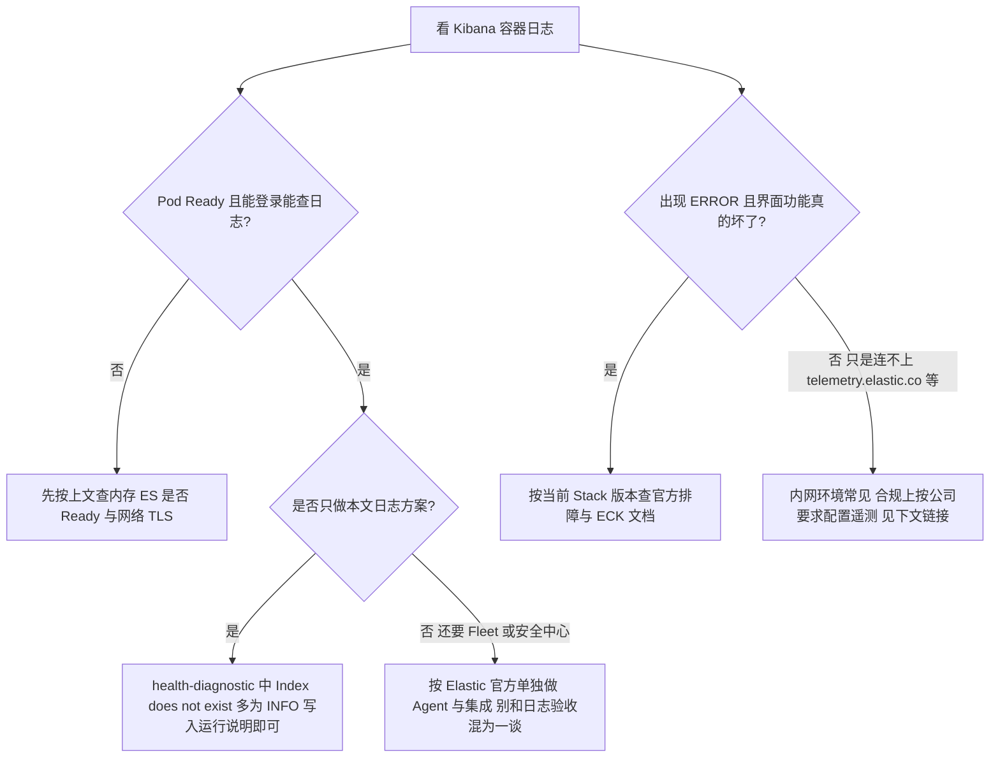
```mermaid
flowchart TD
  A[看 Kibana 容器日志] --> B{Pod Ready 且能登录能查日志?}
  B -->|否| C[先按上文查内存 ES 是否 Ready 与网络 TLS]
  B -->|是| D{是否只做本文日志方案?}
  D -->|是| E[health-diagnostic 中 Index does not exist 多为 INFO 写入运行说明即可]
  D -->|否 还要 Fleet 或安全中心| F[按 Elastic 官方单独做 Agent 与集成 别和日志验收混为一谈]
  A --> G{出现 ERROR 且界面功能真的坏了?}
  G -->|是| H[按当前 Stack 版本查官方排障与 ECK 文档]
  G -->|否 只是连不上 telemetry.elastic.co 等| I[内网环境常见 合规上按公司要求配置遥测 见下文链接]
```

**`health-diagnostic` 和 `PermissionError: Index does not exist` 是啥意思**

Kibana 里带着 **Security** 相关插件，启动后会跑一些内部检查，会去 Elasticsearch 里查一类给 **Endpoint 诊断、遥测**用的数据流。你按本文只装 **ES + Kibana + Fluent Bit**，**从来没装 Elastic Agent / Defend**，这些数据流本来就不存在。代码里把「索引不存在」也归到权限检查路径里打出来，所以你会看到 **`PermissionError: Index does not exist`**，前面往往是 **`[INFO]`** 不是 **`[ERROR]`**。一句话：**不等于集群坏了，也不挡你查日志。** 若以后要收 Endpoint 诊断数据或关掉诊断上报，以 Elastic 文档为准：[Elastic Defend 诊断数据](https://www.elastic.co/guide/en/security/current/endpoint-diagnostic-data.html)。产品侧对诊断数据流与系统角色的演进，可参考仓库说明 [elastic/kibana#85391](https://github.com/elastic/kibana/issues/85391)。

**许可证、Fleet、遥测：什么时候才要动**

- **许可证**：基础版本来就不会开放所有付费功能。日志里出现 *License is not available…* 之类，只要 **你要用的页面（例如 Discover）能用**，按公司采购流程决定是否买商业版；别被日志吓到。  
- **Fleet / Agentless**：只有你真的要用 **Fleet 纳管 Agent** 才去排相关 ERROR；本文日志路径不依赖 Fleet。  
- **往外发使用数据**：涉合规时，在 **`kibana.yml`** 里按官方 [Telemetry settings](https://www.elastic.co/docs/reference/kibana/configuration-reference/telemetry-settings) 配置（ECK 下通过 **`spec.config`** 或 **`SecureSettings`** 注入，具体见 [Kibana configuration（ECK）](https://www.elastic.co/docs/deploy-manage/deploy/cloud-on-k8s/kibana-configuration)）。改之前先在预发对一下当前小版本文档。

**生产环境还建议补上的配置（和上文同一份 CR）**

- **资源**：默认 **1Gi** 只够演示。生产在 **`spec.podTemplate`** 里给 **`kibana`** 容器写够 **requests/limits**，避免 OOM 和调度抖动，按官方 [Kibana configuration（ECK）](https://www.elastic.co/docs/deploy-manage/deploy/cloud-on-k8s/kibana-configuration) 做。  
- **对外访问**：正式用户走 **Ingress / Gateway**，TLS 和鉴权交给入口，不要长期靠 **`kubectl port-forward`**。  
- **版本**：**`spec.version`** 与 **Elasticsearch** 成套升级，先看 [ECK 支持矩阵](https://www.elastic.co/support/matrix#matrix_kubernetes)，再动生产。

---

### T9.2.7、elastic 用户密码

**`elastic` 是谁**：Elasticsearch 内置的超级用户（**`superuser`**），权限最大。ECK 部署 Elasticsearch 时会自动创建该用户，并把**随机生成的密码**放进 Kubernetes **Secret** 里，不会在 YAML 里明文写死。官方说明见 [Accessing services：取 elastic 密码](https://www.elastic.co/guide/en/cloud-on-k8s/current/k8s-services.html#k8s-authentication)。

**Secret 叫什么**：固定规则是 **`{Elasticsearch 的 metadata.name}-es-elastic-user`**，和 **Elasticsearch CR 所在命名空间**一致。本文 **T9.2.5** 里资源名是 **`quickstart`**、命名空间是 **`logging`**，所以 Secret 全名是 **`quickstart-es-elastic-user`**。你若改了 `metadata.name`，Secret 前缀跟着变，**Kibana 登录、Fluent Bit、curl 测 ES** 都要用新名字取密码。

**Secret 里有什么**：键名就是 **`elastic`**（用户名），值是 **Base64** 存的一份密码字符串。下面两条命令取出来的都是**解码后的明文密码**，任选其一即可。

```bash
# 与本文示例一致：命名空间 logging，Elasticsearch 名 quickstart
kubectl -n logging get secret quickstart-es-elastic-user -o go-template='{{.data.elastic | base64decode}}{{"\n"}}'
```

```bash
# 等价写法（Linux / macOS 常见；Windows 若管道异常请用上一条）
kubectl -n logging get secret quickstart-es-elastic-user -o jsonpath='{.data.elastic}' | base64 -d
echo
```

**密码用在哪（和本文其它节对齐）**

- **Kibana 网页登录**：用户名填 **`elastic`**，密码用上面命令打印出来的值（见 **T9.2.6**）。  
- **Fluent Bit 写 ES**：**T9.2.8** 里用同一 Secret 做专用凭据，不要把密码写进 ConfigMap。  
- **命令行测 ES**：对 **`quickstart-es-http`** 做 HTTPS 访问时，**`-u elastic:密码`**，并带上 ECK 提供的 **CA**（见 **T9.2.8** 与官方 [K8s HTTPS 设置](https://www.elastic.co/docs/deploy-manage/security/k8s-https-settings)）。

**取不到 Secret 时**：先 **`kubectl -n logging get es`** 看 Elasticsearch 是否 **Ready**；再 **`kubectl -n logging get secret`** 核对是否真有 **`…-es-elastic-user`**，名称是否和 **`metadata.name`** 对得上。

> **生产建议**  
>
> **`elastic` 只宜管理员与应急使用**，权限过大。业务写入（如 Fluent Bit、应用）应在 Elasticsearch 里建**专用用户与角色**，只给必要索引权限；改密、轮转按公司安全制度，在 ES 侧操作后同步更新 K8s Secret 与引用方。ECK 还可配合自定义用户与证书，见 [Elasticsearch configuration](https://www.elastic.co/docs/deploy-manage/deploy/cloud-on-k8s/elasticsearch-configuration) 与官方安全文档。

---

### T9.2.8、Fluent Bit：DaemonSet 采集并写入 ES

本节把**每个节点**上的容器日志送进 **T9.2.5** 里那套 **Elasticsearch**，和 **T9.1** 说的「读节点上 `/var/log/containers`」是同一路径。采集组件用 **Fluent Bit**，镜像与 **T9.1**、**T9.2.1** 表里一致：**`fluent/fluent-bit:5.0.3`**（与 [GitHub Releases 当前最新稳定 tag](https://github.com/fluent/fluent-bit/releases/latest) 对齐，后续你只管把 tag 换成当时的 latest 再测一遍）。

写法按官方来：**输入与过滤**见 [Tail](https://docs.fluentbit.io/manual/pipeline/inputs/tail)、[Kubernetes Filter](https://docs.fluentbit.io/manual/pipeline/filters/kubernetes)；**写到 ES** 见 [Elasticsearch 输出](https://docs.fluentbit.io/manual/pipeline/outputs/elasticsearch)；**TLS** 见 [Transport security](https://docs.fluentbit.io/manual/administration/transport-security)。连 ECK 的 HTTPS 与证书怎么取，见 [K8s HTTPS 设置](https://www.elastic.co/docs/deploy-manage/security/k8s-https-settings)。

**前置条件（少一步后面必挂）**：**`kubectl -n logging get es`** 里 **Elasticsearch 已 Ready**；同一命名空间已有 Service **`quickstart-es-http`**、Secret **`quickstart-es-elastic-user`**、**`quickstart-es-http-certs-public`**（ECK 创建 ES 后就会有）。你若改了 **T9.2.5** 里的集群名 **`quickstart`**，下面所有资源名里的 **`quickstart`** 都要一起改。

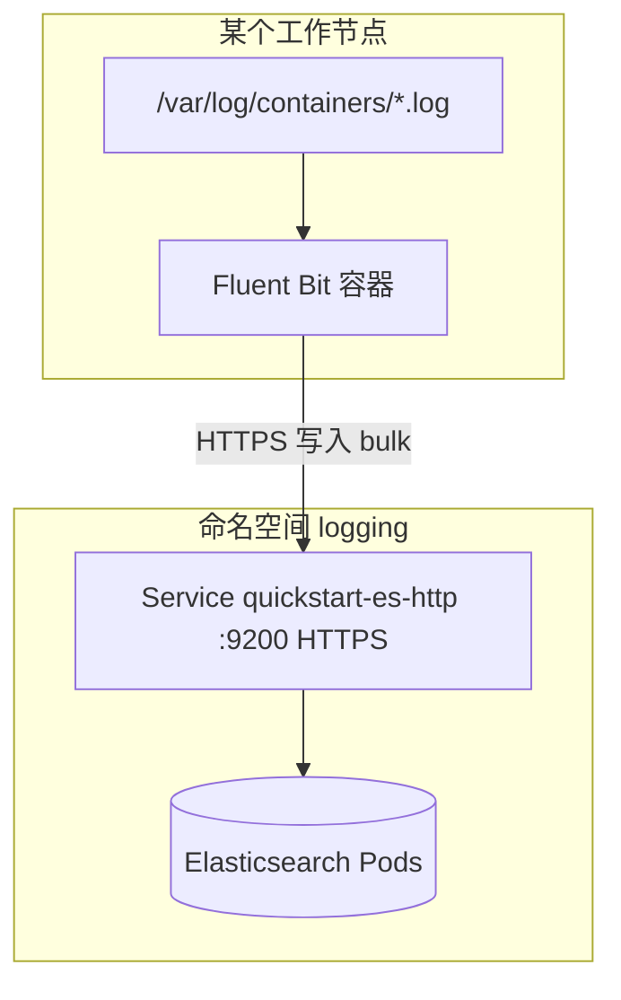
```mermaid
flowchart TB
  subgraph node[某个工作节点]
    LP["/var/log/containers/*.log"]
    FB[Fluent Bit 容器]
    LP --> FB
  end
  subgraph logging[命名空间 logging]
    SVC["Service quickstart-es-http :9200 HTTPS"]
    ES[(Elasticsearch Pods)]
    FB -->|"HTTPS 写入 bulk"| SVC
    SVC --> ES
  end
```

**清单文件**：**`fluent-bit-es.yaml`**，建议和 **`elasticsearch-eck.yaml` / `kibana-eck.yaml`** 放同一目录，方便 Git 管理。

**步骤 1：单独放密码的 Secret（不要写进 ConfigMap）**

密码来源与 **T9.2.7** 相同。下面这条不依赖 **`base64 -d`**，Linux / Windows 上只要 **kubectl** 好用就能跑：

```bash
kubectl -n logging create secret generic fluent-bit-es-auth \
  --from-literal=elastic_password="$(kubectl -n logging get secret quickstart-es-elastic-user -o go-template='{{.data.elastic | base64decode}}')" \
  --dry-run=client -o yaml | kubectl apply -f -
```

生产上更稳妥的是给 Fluent Bit 单独建 **Elasticsearch 专用账号**，只给 **`k8s-*`** 索引写权限，这里仍用 **`elastic`** 是为了和全文示例一口气跑通；落地按 **T9.2.7** 生产建议改用户。

**步骤 2：RBAC + ConfigMap + DaemonSet（生产默认开 TLS 校验）**

**企业生产基线（与官方文档一致，可写进变更/评审）**

下面不是「经验帖」，而是**按厂商文档应做到的最低一致动作**；示例 YAML 已按此对齐，你扩容量时仍以同一套链接里的说明为准。

1. **连 Elasticsearch**：使用 **HTTPS**，并对服务端证书做校验（**`TLS.Verify On`** + **`tls.ca_file`**）。CA 材料与 ECK 下发的 Secret 一致，见 Elastic [K8s HTTPS 设置](https://www.elastic.co/docs/deploy-manage/security/k8s-https-settings)；TLS 通用参数见 Fluent Bit [Transport security](https://docs.fluentbit.io/manual/administration/transport-security)（文档强调生产应启用校验，而非长期关闭）。
2. **Elasticsearch 输出插件**：行为以官方 [Elasticsearch 输出](https://docs.fluentbit.io/manual/pipeline/outputs/elasticsearch) 为准——**`suppress_type_name`**、**`generate_id`**、**`buffer_size` / `Buffer_Size`**、需要时 **`compress`**；采集 **Kubernetes** 日志时建议 **`Replace_Dots On`**（**`replace_dots`**），避免 **`app.kubernetes.io/*`** 等带点 label 在文档里变成嵌套对象，与索引里已把 **`kubernetes.labels.app`** 映射成 **text** 冲突（表现为 **`document_parsing_exception`** / **`Can't get text on a START_OBJECT`**）。排障见同页 **Troubleshooting**。
3. **凭据与 Secret**：密码、API 密钥只进 **Kubernetes Secret**，不写进 ConfigMap；与 Elastic [Accessing services](https://www.elastic.co/guide/en/cloud-on-k8s/current/k8s-services.html#k8s-authentication) 及内置用户管理一致；生产缩小权限见 [Elasticsearch configuration（ECK）](https://www.elastic.co/docs/deploy-manage/deploy/cloud-on-k8s/elasticsearch-configuration)。
4. **采集与缓冲**：**Tail**、**Kubernetes** 过滤、**`Mem_Buf_Limit`** 等单位与含义见官方 [配置说明](https://docs.fluentbit.io/manual/administration/configuring-fluent-bit) 及各插件页；DaemonSet 的 **CPU/内存 requests、limits** 按集群节点日志量评审，并与下游 ES 写入能力匹配。
5. **下游 Elasticsearch 容量**：单节点示例仅用于联调；生产索引速度、线程池、拒绝率等按 Elastic 当前版本 [Indexing speed / 容量规划](https://www.elastic.co/docs/deploy-manage/deploy/self-managed/important-settings-configuration)（以你实际打开的 **Reference** 版本为准）执行，避免只调大 Fluent Bit、ES 侧仍 429。
6. **可观测与排障**：Fluent Bit 提供 [Monitoring / Metrics](https://docs.fluentbit.io/manual/administration/monitoring) 与 **`Trace_Error`** 等诊断手段（同 Elasticsearch 输出文档）；与 ES 侧慢日志、集群健康一并看，避免只看容器 stdout。

要点说明一下，避免你对着 YAML 懵：

- **读日志**：挂宿主机的 **`/var/log`**；再挂 **`/var/lib/docker/containers`** 是为了部分 Docker 运行时解析软链接，**纯 containerd** 的节点可以删掉这一挂卷（见 YAML 后说明）。
- **写 ES**：访问 **`quickstart-es-http.logging.svc:9200`**，必须 **HTTPS**。**`TLS.Verify On`**，CA 用 ECK 公开的 **`quickstart-es-http-certs-public`** 里的 **`tls.crt`** 挂进容器，路径 **`/etc/es-http-ca/tls.crt`**，和官方 curl 示例用的是同一套材料。
- **对接 ES 9.x**：**`Suppress_Type_Name On`**（去掉 `_type`，见插件文档里 Elastic Cloud 8+ 说明）；**`Generate_ID On`** 减少 bulk 写入报错（官方 Troubleshooting 里对 **`create`** 与 data stream 的说明）。
- **读 ES 返回体**：**`Buffer_Size`**（插件文档里的 **`buffer_size`**）用来放大 Elasticsearch 输出里 HTTP 客户端可读响应的上限。默认过小会出现 **`[http_client] cannot increase buffer: ... max=32000`**，随后 **`failed to flush chunk` / `cannot be retried`**。生产建议显式设为 **`512k`** 或更大（日志量极大时再调），见 [Elasticsearch 输出 · buffer_size](https://docs.fluentbit.io/manual/pipeline/outputs/elasticsearch)。
- **索引名**：**`Logstash_Format On`** + **`Logstash_Prefix k8s`**，落到 ES 里是 **`k8s-YYYY.MM.DD`**，和 **T9.2.9** 里数据视图 **`k8s-*`** 对齐。

```yaml
# fluent-bit-es.yaml
apiVersion: v1
kind: ServiceAccount
metadata:
  name: fluent-bit
  namespace: logging
---
apiVersion: rbac.authorization.k8s.io/v1
kind: ClusterRole
metadata:
  name: fluent-bit-read
rules:
  - apiGroups: [""]
    resources: ["pods", "namespaces"]
    verbs: ["get", "list", "watch"]
---
apiVersion: rbac.authorization.k8s.io/v1
kind: ClusterRoleBinding
metadata:
  name: fluent-bit-read
roleRef:
  apiGroup: rbac.authorization.k8s.io
  kind: ClusterRole
  name: fluent-bit-read
subjects:
  - kind: ServiceAccount
    name: fluent-bit
    namespace: logging
---
apiVersion: v1
kind: ConfigMap
metadata:
  name: fluent-bit-config
  namespace: logging
data:
  fluent-bit.conf: |
    [SERVICE]
        Flush           1
        Daemon          Off
        Log_Level       info
        Parsers_File    parsers.conf

    [INPUT]
        Name              tail
        Tag               kube.*
        Path              /var/log/containers/*.log
        multiline.parser  docker, cri
        Mem_Buf_Limit     50MB
        Skip_Long_Lines   On

    [FILTER]
        Name                kubernetes
        Match               kube.*
        Merge_Log           On

    [OUTPUT]
        Name                es
        Match               kube.*
        Host                quickstart-es-http.logging.svc
        Port                9200
        Logstash_Format     On
        Logstash_Prefix     k8s
        Suppress_Type_Name  On
        Generate_ID         On
        HTTP_User           elastic
        HTTP_Passwd         ${ES_PASSWORD}
        TLS                 On
        TLS.Verify          On
        tls.ca_file         /etc/es-http-ca/tls.crt
        Buffer_Size         512k
        Replace_Dots        On
  parsers.conf: |
    [PARSER]
        Name        docker
        Format      json
        Time_Key    time
        Time_Format %Y-%m-%dT%H:%M:%S.%L%z
    [PARSER]
        Name        cri
        Format      regex
        Regex       ^(?<time>[^ ]+) (?<stream>stdout|stderr) (?<logtag>[^ ]*) (?<message>.*)$
        Time_Key    time
        Time_Format %Y-%m-%dT%H:%M:%S.%L%z
---
apiVersion: apps/v1
kind: DaemonSet
metadata:
  name: fluent-bit
  namespace: logging
  labels:
    app: fluent-bit
spec:
  selector:
    matchLabels:
      app: fluent-bit
  template:
    metadata:
      labels:
        app: fluent-bit
    spec:
      serviceAccountName: fluent-bit
      tolerations:
        - operator: Exists
      containers:
        - name: fluent-bit
          image: fluent/fluent-bit:5.0.3
          command: ["/fluent-bit/bin/fluent-bit"]
          args: ["-c", "/fluent-bit/etc/fluent-bit.conf"]
          resources:
            requests:
              cpu: 50m
              memory: 64Mi
            limits:
              cpu: "1"
              memory: 512Mi
          env:
            - name: ES_PASSWORD
              valueFrom:
                secretKeyRef:
                  name: fluent-bit-es-auth
                  key: elastic_password
          volumeMounts:
            - name: config
              mountPath: /fluent-bit/etc
            - name: varlog
              mountPath: /var/log
              readOnly: true
            - name: varlibdockercontainers
              mountPath: /var/lib/docker/containers
              readOnly: true
            - name: es-http-ca
              mountPath: /etc/es-http-ca
              readOnly: true
      volumes:
        - name: config
          configMap:
            name: fluent-bit-config
        - name: varlog
          hostPath:
            path: /var/log
        - name: varlibdockercontainers
          hostPath:
            path: /var/lib/docker/containers
        - name: es-http-ca
          secret:
            secretName: quickstart-es-http-certs-public
            items:
              - key: tls.crt
                path: tls.crt
```

**步骤 3：应用并验收**

```bash
kubectl apply -f fluent-bit-es.yaml
kubectl -n logging rollout status daemonset/fluent-bit --timeout=120s
kubectl -n logging get pods -l app=fluent-bit
```

任选一个 Fluent Bit Pod 看日志，没有连续 **`error`**、`ES` 拒绝连接之类即可。再到 **T9.2.9** 用 **`k8s-*`** 建数据视图、在 **Discover** 里能看到新日志，整条链路才算过。

**纯 containerd、不跑 Docker 的节点**：删掉 DaemonSet 里 **`varlibdockercontainers`** 的 **`volumeMount`** 和 **`volumes`** 那一段即可，**`/var/log`** 必须保留。

> **运维说明**  
> - 若 **`quickstart-es-http-certs-public`** 里没有 **`tls.crt`** 而有 **`ca.crt`**，把上面 Secret **`items`** 里的 **`key`** 改成 **`ca.crt`**，**`tls.ca_file`** 仍指向挂载目录下的文件名（与 **`path`** 一致）。  
> - 集群若启用了 **Pod Security** 等策略，采集类 DaemonSet 可能要单独放命名空间或加 **`securityContext`**，按你们平台规范调，不在此展开。  
> - **绝对不要**在生产长期 **`TLS.Verify Off`**。只有临时联调、且内网已控风险时才可以关校验，见 Fluent Bit 文档里「生产应启用校验」的说明。

**出问题时按这个顺序查**

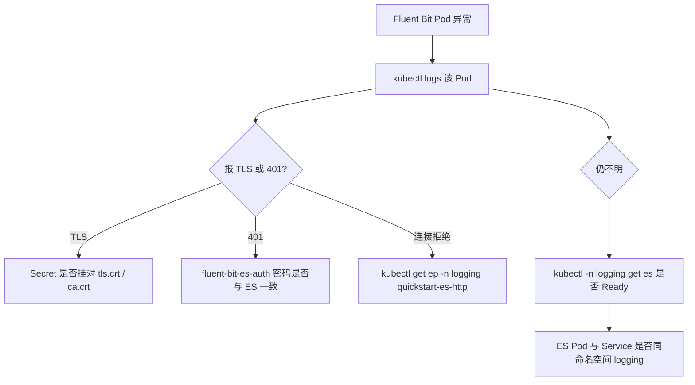
```mermaid
flowchart TD
  A[Fluent Bit Pod 异常] --> B[kubectl logs 该 Pod]
  B --> C{报 TLS 或 401?}
  C -->|TLS| D[Secret 是否挂对 tls.crt / ca.crt]
  C -->|401| E[fluent-bit-es-auth 密码是否与 ES 一致]
  C -->|连接拒绝| F[kubectl get ep -n logging quickstart-es-http]
  B --> G{仍不明}
  G --> H[kubectl -n logging get es 是否 Ready]
  H --> I[ES Pod 与 Service 是否同命名空间 logging]
```

1、**`[http_client] cannot increase buffer ... max=32000`（可定因）**  

这是 **Fluent Bit 读 Elasticsearch HTTP 响应的缓冲区上限太小**，不是 Pod 被系统 **OOM**（OOM 会看到 **`OOMKilled`**）。日志一多、bulk 响应变大就失败，表现为**先正常后报错**。处理： **`[OUTPUT]`** 里设置 **`Buffer_Size 512k`**（或更大），见上文示例与 [Elasticsearch 输出](https://docs.fluentbit.io/manual/pipeline/outputs/elasticsearch)。仍不够时再加大或配合 **`Compress gzip`**（插件文档 **`compress`**）。

2、**已调 `Buffer_Size`，日志里不再出现 `http_client`，但仍 `failed to flush` / `cannot be retried`（尤其只发生在某台 control-plane 节点）**  

这说明 **根因已不是（或不只是）读响应缓冲**，必须看到 **ES 返回的具体错误**：在 **`[OUTPUT]`** 里临时加 **`Trace_Error On`**（见同插件文档 **Troubleshooting**），滚动 Pod 后抓 **`[output:es:es.0]`** 打出来的请求/响应再定因。同时确认 **`kubectl -n logging describe pod <该 Pod>`** 里用的 ConfigMap **资源版本已更新**（旧 Pod 可能仍挂着旧配置）。

3、**`document_parsing_exception` / `kubernetes.labels.app` / `Can't get text on a START_OBJECT`（可定因）**  

ES 返回 **400**，日志里带 **`failed to parse field [kubernetes.labels.app] of type [text]`**，预览值像 **`{kubernetes={io/component=metrics}}`**。含义是：索引里 **`kubernetes.labels.app`** 已被动态映射成 **字符串**，但部分 Pod 带 **`app.kubernetes.io/component`** 等 label，**metadata 在文档里既可能是纯 `app` 字符串，又可能被展成嵌套对象**，类型打架就写入失败。控制面/监控类 Pod（**node-exporter、prometheus-adapter** 等）常见，所以往往**先在某个 master 上的 Fluent Bit** 爆量失败。  

**处理（与官方插件说明一致）**：在 **`[OUTPUT]`** 中加 **`Replace_Dots On`**（见 **`replace_dots`**），把字段名里的 **`.`** 换成 **`_`**，避免 ES 把 **`app`** 误当成可嵌套路径。上文 YAML 已默认打开。  

---

### T9.2.9、Kibana 实践

前面 **Fluent Bit** 已经把容器日志写进 **Elasticsearch**（本文示例索引前缀 **`k8s-`**，与 **T9.2.8** 里 **`Logstash_Prefix k8s`**、**`Logstash_Format On`** 一致）。**生产里真正干活的界面**，长期就是 **Kibana**：**值班的**靠它**查问题翻日志**；**业务或开发**用大盘**盯发版、看流量和错误趋势**；**平台组**管**索引、备份、谁有权限**；**需要时**再上**日志告警**。第一次接触 EFK 的人容易在菜单里迷路，或 Discover 里看到一堆字段名不敢下手——**先把下面三句话记住**，后面就顺了：

- **数据在 Elasticsearch 的索引里**（本文是**按天滚动的** **`k8s-YYYY.MM.DD`**，逻辑上你用一个 **`k8s-*`** 就全扫到）。  
- **Kibana 不存业务日志**；你选的 **数据视图**只是告诉 Kibana「查哪一批索引、默认用哪个时间字段」——不建对数据视图，**Discover、Lens 大多功能没法用**。  
- **KQL 过滤、Dashboard、告警规则**里写的字段名，必须和 **Discover 左侧字段列表**里的一致；**T9.2.8** 里 **`Replace_Dots On`** 会改掉带点字段的路径，**别照抄老文档里带点号的示例**。

> **本文本节校验日期：2026-04-27**（Kibana/Console/Data views 等表述对照 [Kibana 文档](https://www.elastic.co/docs) 与 [Kibana 发行说明](https://www.elastic.co/docs/release-notes/kibana)。**Stack 版本**与 **T9.2.2** 表中的 **9.3.3** 一致，升级时先改 CR 与镜像再回头核对本节步骤。）

**官方文档**：

| 模块 | 覆盖功能 | 什么时候看 | 官方链接 |
|------|----------|------------|----------|
| 业务操作主线 | Discover、Lens、Dashboard、基础分析 | 第一次接触 Kibana，先把查日志和做大盘跑通 | [Explore and analyze](https://www.elastic.co/docs/explore-analyze) |
| 查询语言（KQL） | 日志过滤条件、字段查询、范围查询 | 日常值班查问题，默认先用 KQL | [KQL](https://www.elastic.co/docs/explore-analyze/query-filter/languages/kql) |
| 平台治理模块 | 用户角色、Space、部署升级、连接治理 | 上生产前做权限、分权、变更与升级评审 | [Deploy and manage](https://www.elastic.co/docs/deploy-manage) |
| 数据治理模块 | 索引、映射、摄入、ILM、快照 | 控成本、保留策略、合规留存、灾备恢复 | [Manage data](https://www.elastic.co/docs/manage-data) |
| 查询进阶（ES\|QL） | 管道式查询、聚合分析、复杂结果处理 | KQL 不够用时再上，先试后再看完整语法 | [Try ES\|QL](https://www.elastic.co/docs/explore-analyze/discover/try-esql) · [ES\|QL reference](https://www.elastic.co/docs/reference/query-languages/esql) |

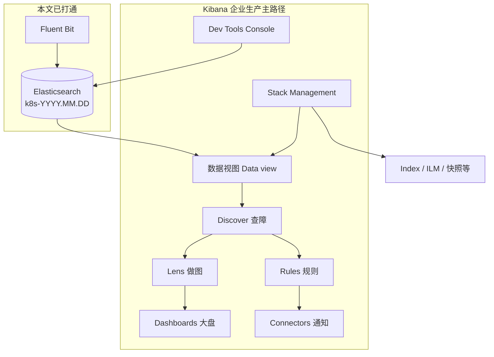
```mermaid
flowchart TB
  subgraph goal[本文已打通]
    FB[Fluent Bit]
    ES[(Elasticsearch<br/>k8s-YYYY.MM.DD)]
    FB --> ES
  end
  subgraph kib[Kibana 企业生产主路径]
    DV[数据视图 Data view]
    DC[Discover 查障]
    LS[Lens 做图]
    DB[Dashboards 大盘]
    RL[Rules 规则]
    CO[Connectors 通知]
    SM[Stack Management]
    DT[Dev Tools Console]
  end
  ES --> DV
  DV --> DC
  DC --> LS
  LS --> DB
  DC --> RL
  RL --> CO
  SM --> DV
  SM --> SM2[Index / ILM / 快照等]
  DT --> ES
```

**导图**（和界面上的名字对齐，不然后面步骤会对不上号）：

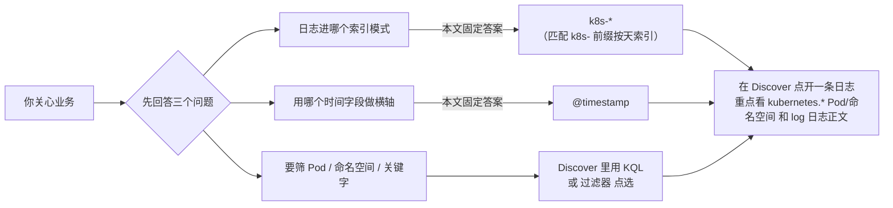
```mermaid
flowchart LR
  A[你关心业务] --> B{先回答三个问题}
  B --> C[日志进哪个索引模式]
  C -->|本文固定答案| D["k8s-*<br>（匹配 k8s- 前缀按天索引）"]
  B --> E[用哪个时间字段做横轴]
  E -->|本文固定答案| F["@timestamp"]
  B --> G[要筛 Pod / 命名空间 / 关键字]
  G --> H[Discover 里用 KQL<br>或 过滤器 点选]
  D --> I[在 Discover 点开一条日志<br>重点看 kubernetes.* Pod/命名空间 和 log 日志正文]
  F --> I
  H --> I
```

**怎么读这一节**：

1. **T9.2.9.0** 先把**左侧那一大串英文菜单**对上号，知道**该点哪、别乱点哪**。  
2. 接着从 **T9.2.9.1** 起动手：**数据视图** → **Discover** → 大盘与告警等；细节都在后面小节。  

#### T9.2.9.0、先认路

Kibana v9.3.3 下常见分组名：**Analytics、Elasticsearch、Observability、Security、Management**；**具体文案、是否折叠、多一条少一条**会随**许可证、功能开关、Space 默认解决方案**变一点，以你环境为准。官方说明导航习惯见 [Find apps and objects](https://www.elastic.co/docs/explore-analyze/find-and-organize/find-apps-and-objects)）。

**企业生产**：先把下面这张表和图刻在脑子里，**比死记英文按钮有用**——你会知道**容器日志进 `k8s-*` 这条线**，主要动 **Analytics + Elasticsearch（索引类）+ Management**；**别在没接数据时跟 Observability/Security 死磕，以为 EFK 没装好**。

**先记住两个省时间的操作（不必每次从根菜单点三级）**

- **顶栏全局搜索框**：直接敲 **`Discover`**、**`Index management`**、**`Data views`** 等，可跳到具体页；`Ctrl`+`/`（Windows/Linux）或 `Cmd`+`/`（macOS）聚焦搜索框。
- **你当前在的哪个 Space**（工作区，细节见 **T9.2.9.7**）：可以把 Space 想成**互不干扰的若干套 Kibana「抽屉」**——**数据视图、大盘、已保存的 Discover 会话**等都按 **Space 分开存**。你**从 Space A 切到 Space B**，**左侧还是 Discover**，但**打开/保存 过的那些对象列表可能变少或变多**，因为那是**另一套抽屉里的东西**，**不是 Elasticsearch 里日志没写进、也不是删库了**，只是**换了个工作区**。  

**侧栏各分区在「本文：Fluent Bit → `k8s-*` 索引」下怎么用（一张总表）**

| 侧栏大分区 | 你列的典型入口 | 是干什么的 | 备注 |
|------------|----------------|------------|------|
| **Analytics** | **Discover** | 按时间看日志、写 **KQL**、展开单条 JSON | 本文**主界面**，细节见 **T9.2.9.2** |
| **Analytics** | **Dashboard** | 把图、表、**Saved search** 拼成一页 | 用 **T9.2.9.3** 的 **`k8s-*`** 数据视图出图（Lens 与 Dashboards） |
| **Analytics** | **Maps** / **Map** 类 | 地理可视化 | 除非日志里有 **geo 字段**要做地理大屏 |
| **Analytics** | **Visualize library** | 管已保存的 **Lens / 旧版可视化** | 新图多数在 **Lens** 里建，**库**里做复用/改名/删 |
| **Analytics** | **Machine Learning**（或 **ML** 菜单） | 无监督、异常、预测等 | 有**数据量、角色与许可**要求；和「先查全量日志」不是同一条路 |
| **Elasticsearch** | **Home** / **Getting started** | 总览、上手引导、快捷入口 | 快速进 **Add data** 等；**不替代**你自建 `k8s-*` 数据视图 |
| **Elasticsearch** | **Index Management** | 看索引列表、分片、**ilm** 状态、打开 **Edit settings** 等 | 与 **T9.2.9.6**（索引/ILM/快照等治理）**配套看**；**直接看到 `k8s-*`** 有没有 |
| **Elasticsearch** | **Playground**、**Synonyms**、**Query rules** 等 | **搜索体验**（同义词、查询规则、**检索实验**等） | 偏 **站内外搜索/语义检索**；**不是**查容器 stdout 的必经之路 |
| **Elasticsearch** | **Agents**（在 **Elasticsearch** 分组下若出现） | 多与 **ES 本侧/推理/检索**相关能力挂钩 | 采集面纳管在 **Management → Integrations / Fleet**；**本文**采日志是 **Fluent Bit**，见 **T9.2.8** |
| **Observability** | **Overview、Logs、Infrastructure、APM…**、**Alerts**、**SLOs**、**Cases** 等 | Elastic **可观测**解决方案：**指标、链路等需 Agent/预置数据流**时好用 | 你**只**按本文上 **EFK** 时，这里**可能空/不对准 `k8s-*`** 很正常；**查容器日志**仍以 **Discover** 为主 |
| **Security** | **Dashboard、Rules、Alerts、Attack Discovery** 等 | **安全/SIEM** 工作面 | 需要 **Security 数据、规则包** 等，先读 **T9.2.9.8** 防期望错位 |
| **Management** | **Stack Management** | 用户/角色、**Data views**、**Spaces**、部分 **Rules** 入口、**Connectors** 等 | **T9.2.9.1** 建数据视图、**T9.2.9.7** 做权限/空间 都常落在这；菜单名**有时直接叫 Management** |
| **Management** | **Dev Tools** | **Console** 调 ES、**Kibana `kbn:`** API 等 | 见 **T9.2.9.5** |
| **Management** | **Integrations**、**Fleet**、**Stack Monitoring**、**Cloud Connect**、**Streams** 等 | **接 Elastic Agent/Beat**、**监控本栈**、**云连接**、**可观测/日志流** 类产品能力 | 本文不装 Agent 时：**Fleet/Integrations 不是完成 EFK 的前提**；**要盯 ES 健康**再上 **Stack Monitoring**，也见 **T9.2.9.8** |

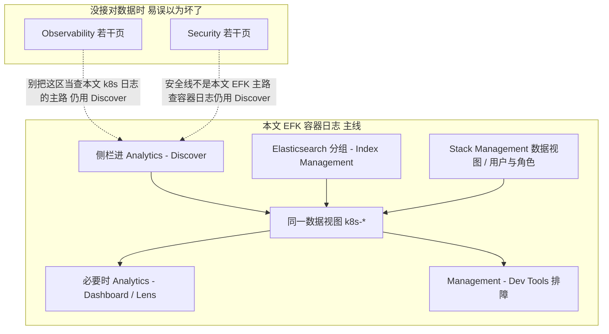
```mermaid
flowchart TB
  subgraph EFK[本文 EFK 容器日志 主线]
    A1[侧栏进 Analytics - Discover]
    A2[同一数据视图 k8s-*]
    A3[必要时 Analytics - Dashboard / Lens]
    A4[Management - Dev Tools 排障]
    A5[Elasticsearch 分组 - Index Management]
    A6[Stack Management 数据视图 / 用户与角色]
  end
  subgraph skip[没接对数据时 易误以为坏了]
    O1[Observability 若干页]
    S1[Security 若干页]
  end
  A1 --> A2 --> A3
  A2 --> A4
  A5 --> A2
  A6 --> A2
  O1 -.->|别把这区当查本文 k8s 日志的主路 仍用 Discover| A1
  S1 -.->|安全线不是本文 EFK 主路 查容器日志仍用 Discover| A1
```

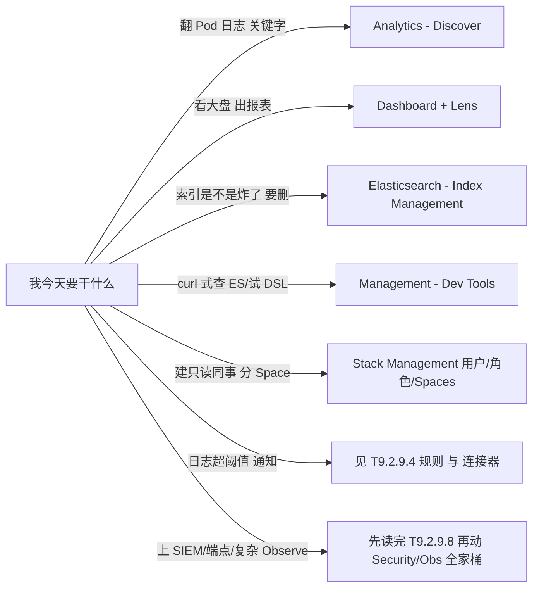
```mermaid
flowchart LR
  Q[我今天要干什么]
  Q -->|翻 Pod 日志 关键字| D[Analytics - Discover]
  Q -->|看大盘 出报表| P[Dashboard + Lens]
  Q -->|索引是不是炸了 要删| I[Elasticsearch - Index Management]
  Q -->|curl 式查 ES/试 DSL| T[Management - Dev Tools]
  Q -->|建只读同事 分 Space| M[Stack Management 用户/角色/Spaces]
  Q -->|日志超阈值 通知| R[见 T9.2.9.4 规则 与 连接器]
  Q -->|上 SIEM/端点/复杂 Observe| X[先读完 T9.2.9.8 再动 Security/Obs 全家桶]
```

> 若**看不到**上表中的某一条：多半是 **License** 或**管理员关掉了功能**；**不影响**你按 **Discover + `k8s-*` + Index Management** 把本文 EFK 跑通。有分歧以 **v9.3.3 官方** [Kibana 文档](https://www.elastic.co/docs) 与**你们集群管理员**为准。

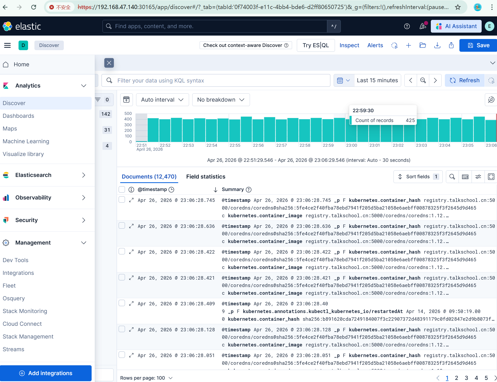

#### T9.2.9.1、建数据视图

1. 用 **T9.2.7** 拿到的密码登录，用户名写 **`elastic`**，或你们已经建好的**业务只读/平台账号**。**不要**让所有人都用超级账号；落地方式见 **T9.2.9.7**。  
2. 进 **Stack Management**（v9.x 里也可能显示为 **Management**，以你界面为准）→ **Data views**（以前叫 *index pattern* 的那套，**概念是同一个，叫法换了**），点 **Create data view**。建一条：  
   - **Name**：自定，如 **`Kubernetes 容器日志`**。  
   - **Index pattern**（界面上**仍用英文这个名字**）：填 **`k8s-*`**，和 **T9.2.8** 的 **`Logstash_Prefix k8s`** 对牢，否则 Discover 会查不到。  
   - **Timestamp field**：选 **`@timestamp`**。不选的话，**全局时间轴、Dashboard 时间选择器**很多功能会缺一条腿。  
3. 若下拉里暂时看不到 **`k8s-*`**，先到 **Stack Management → Index Management** 看是否已有 **`k8s-2026.04.27`** 这种按日命名索引；**没有**就回去查 **T9.2.8** Fluent Bit 与 ES 是否 Ready。**有索引但列表不刷新**时，等几十秒或重进页面；仍不行再对一下当前账号是否有 **`view_index_metadata`** 等读索引元数据的权限。  
4. 只想临时试一把、不打算保存成团队可见的对象时，可以在 **Discover / Lens** 里创建数据视图时选 **Use without saving**（**临时数据视图**），关页面或切应用会丢，适合个人排障。正式环境仍建议**保存**并交给权限管理。  

官方：[Data views](https://www.elastic.co/docs/explore-analyze/find-and-organize/data-views) · [Get started with Discover](https://www.elastic.co/docs/explore-analyze/discover/discover-get-started)

> **和 ES\|QL 的关系**：在 **ES\|QL** 模式下，不少分析可以**不经过**你刚建的数据视图（官方说明见 [Data views 概述](https://www.elastic.co/docs/explore-analyze/find-and-organize/data-views)）。**本文主线**是「数据视图 + Discover 常规 KQL」——和大多数值班同事的习惯一致，先把这条路走顺再玩 ES\|QL。

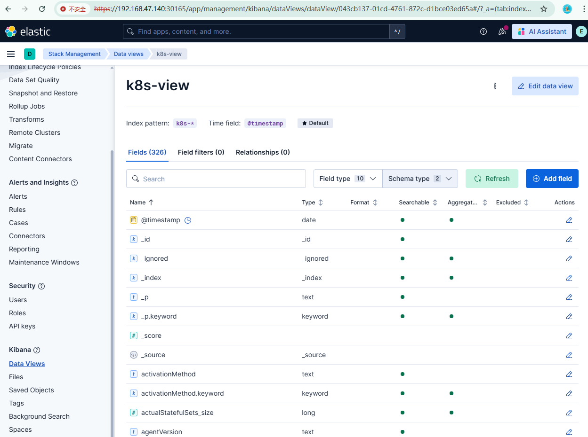

#### T9.2.9.2、Discover

本节与 **T9.2.2** 的 **Kibana/Elasticsearch 9.3.3**（**Elastic Stack** 当前**推荐**稳定小版本，可对照 [Kibana 发行说明](https://www.elastic.co/docs/release-notes/kibana)）、**T9.2.9.1** 的 **数据视图 `k8s-*`** 及**时间字段 `@timestamp`** 保持一致。产品行为以 [Discover](https://www.elastic.co/docs/explore-analyze/discover) 与 [Get started with Discover](https://www.elastic.co/docs/explore-analyze/discover/discover-get-started) 等官方页面为准，**本小节在 2026-04-27 前**已通读并引用上述链路的当前稳定版内容；KQL 语法以 [KQL](https://www.elastic.co/docs/explore-analyze/query-filter/languages/kql) 为权威。侧栏分组与菜单**英文/中文**以实际界面为准，与 **T9.2.9.0** 一致。

**1. 作用**

**Discover** 是 Kibana 中面向 Elasticsearch 数据的**主查询与浏览界面**：按时间范围检索文档，用 KQL 或 Lucene 过滤，查看字段与单条结构，并可将当前视图保存为会话供复用或接入大盘。相对 `kubectl logs`，在集群级日志场景下多三类能力：**全文与字段检索**、**跨节点与多副本统一视图**、**保存/共享同一条检索条件**（仍须配合集群级采集与存储，见 **T9.1**）。

**2. 进入面板**

- **菜单**：**Analytics → Discover**（**T9.2.9.0**）。首次进入若要求选择数据视图，须选用 **T9.2.9.1** 中已建好的 **`k8s-*`**。  
- **无数据**：在 **Index Management** 中看不到**当日或近期**的 **`k8s-` + 日期** 形式的索引时，应回到 **T9.2.8** 与 **ES** 连通性排查，勿仅在 Kibana 中反复切换数据视图。

**3. 排障思路：先省查询，再定界，再读正文**

界面上的点击顺序见官方 [Get started with Discover](https://www.elastic.co/docs/explore-analyze/discover/discover-get-started)。下面这张图回答的是**为什么要这么干**：**时间窗**先把 Elasticsearch 扫描范围压下去（算力与费用）；**KQL** 按 **Kubernetes** 常见层次把候选日志缩到「某个命名空间 / Pod / 容器」；**log 与展开文档**才是读堆栈、核对镜像与节点的地方；只有需要**交接或进大盘**时才值得**保存会话**（见 **T9.2.9.3**）。这与「从左到右点一遍菜单」不是一回事。


```mermaid
flowchart TB
  START([数据视图已是 k8s-*<br/>见 T9.2.9.1])
  START --> W[时间窗<br/>对齐告警或发布时段]
  W --> NS[KQL 定界<br/>namespace 到 pod 到 container]
  NS --> LG[读 log 正文<br/>stderr 关键字 堆栈]
  LG --> JD[展开 JSON<br/>镜像 host label 等]
  JD --> Q{同一套条件要<br/>给别人或进大盘?}
  Q -->|是| SV[保存 Discover 会话]
  SV --> NX[T9.2.9.3 Dashboard 等]
  Q -->|否 继续排查| W
```

**4. 界面分区与职责**

Kibana 9.3.x 的 Discover 为**通用数据探索**；未处于 Observability/Security 等**专项方案上下文**时，即为默认布局（与 [Get started with Discover](https://www.elastic.co/docs/explore-analyze/discover/discover-get-started) 中「Load data into Discover」一致）。可按下述区块理解各区域责任。

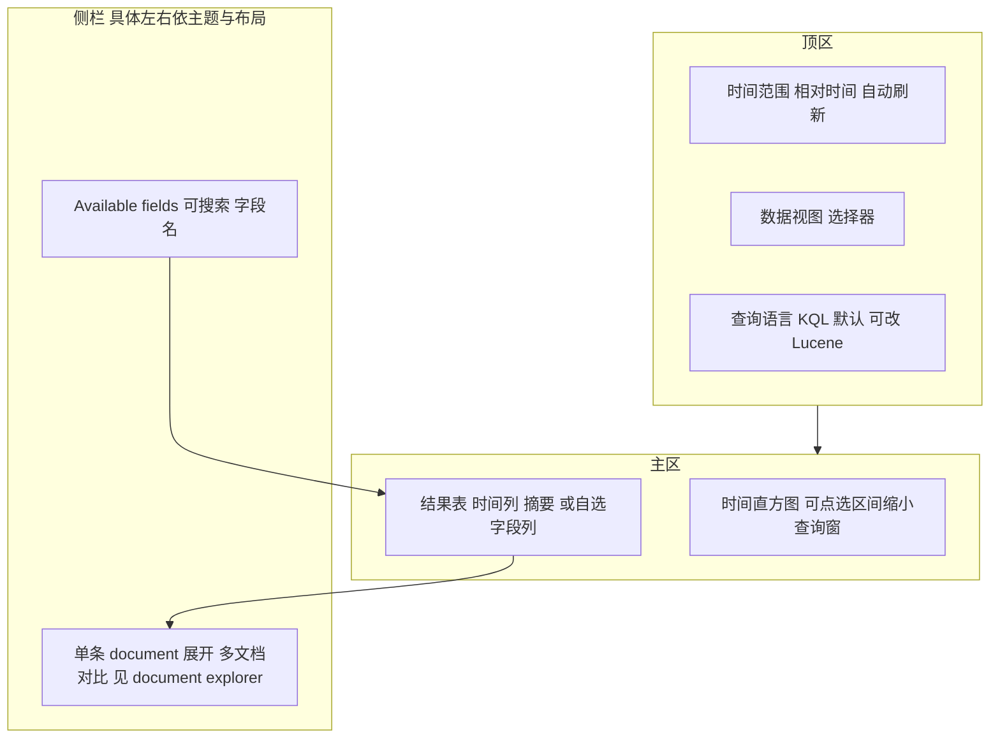
```mermaid
flowchart TB
  subgraph top[顶区]
    T1[时间范围 相对时间 自动刷新]
    T2[数据视图 选择器]
    T3[查询语言 KQL 默认 可改 Lucene]
  end
  subgraph main[主区]
    M1[时间直方图 可点选区间缩小查询窗]
    M2[结果表 时间列 摘要 或自选字段列]
  end
  subgraph flanks[侧栏 具体左右依主题与布局]
    F1[Available fields 可搜索 字段名]
    F2[单条 document 展开 多文档对比 见 document explorer]
  end
  top --> main
  F1 --> M2
  M2 --> F2
```

- **直方图与时间**：直方图依赖数据视图在 **T9.2.9.1** 中绑定的**默认时间字段**；**Time filter** 等说明见 [Filtering in Kibana](https://www.elastic.co/docs/explore-analyze/query-filter/filtering)。生产上**先缩时间、再加条件**，可显著降低对 Elasticsearch 的查询压力。  
- **表与列**：在侧栏为字段**加号**入表、拖拽排序；布局与多文档对比等见 [Document explorer](https://www.elastic.co/docs/explore-analyze/discover/document-explorer)。

**5. 查询与保存（企业常用项）**

| 能力 | 生产上建议用法 | 官方 |
|------|----------------|------|
| 时间窗与自动刷新 | **时间范围**要包住整起故障或整段发版窗口；没有需要时，别把查询时间拉得过大；自动刷新也别设太勤，避免和正常业务一起把 Elasticsearch 打满 | [Discover](https://www.elastic.co/docs/explore-analyze/discover)、[Filtering in Kibana](https://www.elastic.co/docs/explore-analyze/query-filter/filtering) |
| KQL 与 Lucene | **默认 KQL** 做字段与布尔组合；**Lucene** 在搜索栏侧切换。KQL 仅**过滤**文档，不负责聚合与排序，勿与 [Query DSL](https://www.elastic.co/docs/reference/query-languages/querydsl)（JSON，走 `_search` 等 API）在心智上混用；概念导读见 [Query DSL（Explore）](https://www.elastic.co/docs/explore-analyze/query-filter/languages/querydsl) | [KQL](https://www.elastic.co/docs/explore-analyze/query-filter/languages/kql)、[Lucene](https://www.elastic.co/docs/explore-analyze/query-filter/languages/lucene-query-syntax) |
| **ES\|QL** | 不依赖数据视图的**另一种**查数方式，适合表格化、与 **ES\|QL** 图表化路径配合；**本文 EFK 主线**仍以「**数据视图 + KQL**」与值班习惯对齐，与 **T9.2.9.1** 脚注一致 | [Try ES\|QL](https://www.elastic.co/docs/explore-analyze/discover/try-esql) |
| 过滤器与搜索栏 | 侧栏对字段**加/减**生成过滤器，与搜索栏 KQL 组合使用 | [Get started 中 Search and filter 路径](https://www.elastic.co/docs/explore-analyze/discover/discover-get-started) |
| 保存与复用 | 顶栏保存当前 **Discover 会话**（**9.3.3** 等界面中常见 **Session** 等文案，以实际为准），可再加入 **Dashboard**；与保存对象、复用方式的关系见 [Save a search for reuse](https://www.elastic.co/docs/explore-analyze/discover/save-open-search) | 同上及 [Get started with Discover](https://www.elastic.co/docs/explore-analyze/discover/discover-get-started) |
| 字段与模式 | **Field statistics**、**Pattern analysis** 用于看高频值与日志模式，排刷屏与异常段 | [Run pattern analysis in Discover](https://www.elastic.co/docs/explore-analyze/discover/run-pattern-analysis-discover) |
| 长时查询 | 大数据量时可用后台查询类能力，避免浏览器长时间无响应（是否开启受部署与权限约束） | [Run queries in the background](https://www.elastic.co/docs/explore-analyze/discover/background-search) |

上述「时间 + 搜索栏 + 过滤器」在 Kibana 多数应用中与查询结果取交集；具体组合方式见 [Filtering in Kibana](https://www.elastic.co/docs/explore-analyze/query-filter/filtering)。

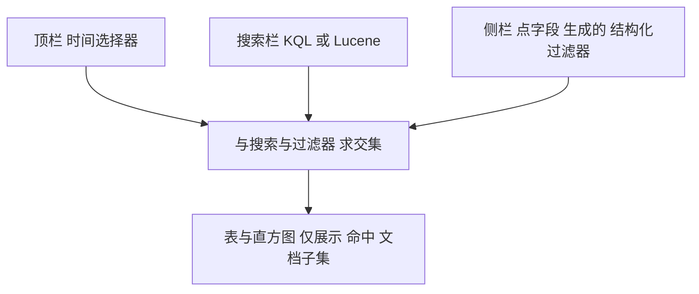
```mermaid
flowchart TB
  TF[顶栏 时间选择器] --> I[与搜索与过滤器 求交集]
  SB[搜索栏 KQL 或 Lucene] --> I
  PF[侧栏 点字段 生成的 结构化过滤器] --> I
  I --> OUT[表与直方图 仅展示 命中 文档子集]
```

**6. 与本文 Fluent Bit 字段的对应关系**

下表来自 **T9.2.8** 中 **Kubernetes 过滤器**与 **Merge_Log** 等常见配置。**若** Parser 或 **Merge** 与本文不一致，**以当前索引 mapping 与 Discover 左侧「可用字段」为准**。开启 **`Replace_Dots On`** 时，**带点的 label 路径在文档中会以替换后的字段名**出现，**不要**沿用带点号的旧文章示例。

| 字段 / 前缀 | 含义 | 生产上用法示例 |
|-------------|------|----------------|
| `@timestamp` | 文档时间，驱动时间轴 | 与顶栏时间选择器一致，排障**优先**对齐本字段 |
| `log` 或解出的正文行 | 容器**一行**原始输出；若应用为 JSON 行且被合并，可多出**业务子字段** | 关键字、堆栈、错误码，例如：`log: *NullPointerException*` |
| `stream` | **stdout** 或 **stderr** | 仅看标准错误，例如：`stream: "stderr"` |
| `kubernetes.pod_name` | Pod 名 | 定界副本，例如：`kubernetes.pod_name: "myapp-7d4f*"` |
| `kubernetes.namespace_name` | 命名空间 | 分环境/租户，例如：`kubernetes.namespace_name: "prod"` |
| `kubernetes.container_name` | 容器名 | 同 Pod 多容器时与 `pod_name` 联用 |
| `kubernetes.container_image`、`kubernetes.host` | 镜像、**所在节点** | 发版对比、怀疑单机问题时筛选 |
| `kubernetes.labels` 经 Replace_Dots 后可能为 **`kubernetes_labels_...`** 等 | Workload 标签的落库形态因映射而异 | 与 **Deployment/Service** 对 label 时**以 Discover 展示名为准**；**T9.2.9.3、T9.2.9.4** 中引用字段须与此一致 |

**7. 示例 KQL（请按实际命名空间与 Pod 名替换）**

```text
kubernetes.namespace_name: "default" and kubernetes.pod_name: "counter*" and log: *error*
```

**8. 与全局验收的对应关系（避免“界面会点、环境对不上”）**

下列与 **T9.2.9.9** 的清单一一对应，在 Discover 中即可逐项自证，不必另写脚本：数据视图为 **`k8s-*`** 且能命中**新产生**的日志、字段名与 **T9.2.8**（含 **`Replace_Dots`**）一致。另请记住：**在 Discover 中缩小显示范围不会减少已写入索引的数据量**；在采集侧**减量**、用 **ILM** 等控容量，见 **T9.2.9.9** 与 **T9.2.8**。

**9. 插图位（生产后补图）**

**（插槽：在运行 **Kibana 9.3.3** 的环境中截取 Discover 全页，须可见数据视图 `k8s-*`、时间选择、搜索栏与至少一条已展开的文档（建议展开 `kubernetes` 与 `log` 等字段，方便对照上文字段表）。将成图存为 `./images/logging-kibana-discover-k8s.png`，并在下方取消注释。若需与官方界面对比，可对照 [Get started with Discover](https://www.elastic.co/docs/explore-analyze/discover/discover-get-started) 中的版式。）**

<!-- 成图后：删除本行“注释说明”，取消下一行 img 的注释。路径须与上段一致。 -->
<!--  -->

#### T9.2.9.3、Lens 与 Dashboards：值班大屏与复盘

**从菜单怎么进**：侧栏 **Analytics → Dashboard** 或 **Analytics 里的 Lens**；老对象也可能在 **Visualize library** 里维护（**T9.2.9.0** 表），**不冲突**，只是**新建**更推荐走 **Lens**。

- **Lens**：**拖拽选字段**就能出图（柱状、折线、指标卡、表格、热力等），是 **9.x 默认走的主可视化**；不纠结「老式 Visualize 里用哪种 aggs」也能交付。进入后重点看：右侧 **Data view 是否仍是 `k8s-*`**、横轴/纵轴**选的是可聚合 type**、右上角 **Save**。  
- **Dashboards**：多面板 + 时间选 + 可选 **Controls 控件**（如按 `namespace` 下拉的变量），给 **NOC 大屏、发版窗口、周报复盘**。**Edit** 进入编辑；**Add from library** 加已有面板；顶栏 **Share** 与**只读编辑**别乱给外网。

**和 Discover 的衔接**：在 Discover 点 **Save** 的查询可以**加到面板**里；Lens 里**同一数据视图**（**`k8s-*`**）上做的图**保存**后，再**Add to dashboard**。  

**生产上防踩坑**：做图前在 Discover **确认字段类型**是 **Keyword / 可聚合**，例如 **`kubernetes.namespace_name` 的 `.keyword` 子字段**（9.x 常见映射下会有）；若图怎么都不出数，多半是**字段用错**或**没选可聚合类型**。**大盘链接**出给外部门前，先想好**时间范围脱敏、权限、是否只读分享**（见官方 [Dashboards](https://www.elastic.co/docs/explore-analyze/dashboards)）。


```mermaid
flowchart LR
  D1[Discover 定字段与 KQL] --> L1[Lens 作图 保存]
  L1 --> DB1[Dashboard 汇总]
  D1 --> DB1
  DB1 --> SH[分享/投屏/导出<br>注意只读与敏感信息]
```

官方：[Lens](https://www.elastic.co/docs/explore-analyze/visualize/lens) · [Dashboards](https://www.elastic.co/docs/explore-analyze/dashboards) · [Add controls](https://www.elastic.co/docs/explore-analyze/dashboards/add-controls)

**（插槽：Lens 从 k8s-* 拖字段出图；Dashboard 汇总多个面板）**

#### T9.2.9.4、Rules（规则）与 Connectors：日志驱动的告警

在 **Stack Management**（**Management**）里找 **Rules** 或 **Connectors**；**Observability**、**Security** 下也有 **Alerts / Rules**（**T9.2.9.0** 侧栏）。**和本文 EFK 直接相关的**，是「能选数据视图 **`k8s-*`**、能用 **KQL/DSL 命中你容器日志**」的那类规则（常见名称：**Elasticsearch query**），一般放在 **Stack Management** 里和 **Connectors** 一起管；**别**和 **APM、SIEM 自带规则**混成一回事，**数据源、权限、许可**都不一样。  

**和本文**最常用的是 **Elasticsearch query** 类：对 **数据视图** **`k8s-*`** 在时间窗里跑**查询/聚合**，过阈值就触发；**Connectors** 配**邮件、Webhook、Slack** 等，接工单或群。  

**生产注意**：规则在 Kibana/ES 侧**定时跑查询**——**窗口别拉成「三天」、间隔别 10 秒一次**，会和大查询抢资源；**先在单命名空间/单服务的 KQL 上验证**再推广。

```mermaid
flowchart LR
  Q[KQL / DSL 命中 k8s-*] --> R[Rule 时间窗+阈值]
  R --> C[Connector 通知]
  C --> O[值班/On-call]
  O --> F[回到 Discover 用同条件排查]
```

官方：[创建与管理规则](https://www.elastic.co/docs/explore-analyze/alerting/alerts/create-manage-rules) · [Elasticsearch query 规则](https://www.elastic.co/docs/explore-analyze/alerting/alerts/rule-type-es-query) · [Alerting 总览](https://www.elastic.co/docs/explore-analyze/alerting)

**（插槽：一条针对 k8s-* 的 Elasticsearch query 规则 + Connector 示例）**

#### T9.2.9.5、Dev Tools（Console）与查询工具：运维必备

**从菜单怎么进**：侧栏 **Management → Dev Tools**（**T9.2.9.0**）；点 **Console** 即主编辑区。  

**Dev Tools → Console** 同时能发 **Elasticsearch** 和 **Kibana** 的 HTTP 接口。查 **索引列表、分片、mapping、手动 `_search` 试 DSL**，比在纯 UI 里点更快。

- **打 ES API**：**不用**加前缀，例如 `GET k8s-*/_count`、`GET /_cat/indices?v`（见 [Elasticsearch REST](https://www.elastic.co/docs/reference/elasticsearch/rest-apis)）。  
- **打 Kibana API**：在路径前加 **`kbn:`**，与官方 [Console 文档](https://www.elastic.co/docs/explore-analyze/query-filter/tools/console) 一致，例如 `GET kbn:/api/index_management/indices`（**具体路径**以你调用的 [Kibana API 文档](https://www.elastic.co/docs/api) 为准）。  

同一层菜单里通常还有 **Search Profiler**、**Grok Debugger** 等，分别用来查**慢在查询哪段**、和 **T9.2.8** 的 **parser** 联调。

官方：[Console](https://www.elastic.co/docs/explore-analyze/query-filter/tools/console) · [Query tools 总览](https://www.elastic.co/docs/explore-analyze/query-filter/tools)

**（插槽：Console 中执行 GET /_cat/indices 或 k8s-* 的 count）**

#### T9.2.9.6、Stack Management：索引治理（ILM、模板、快照）

**从菜单怎么进**：**Elasticsearch** 分组里的 **Index Management** 看**索引现况**；**ILM 策略、快照仓库**等常在 **Stack Management**（**Management**）下与 **数据、快照** 相关子项中配置（9.3.x 把功能拆在 **Manage data** 等入口，**以你界面为准**，找不到就用顶栏**全局搜索** `ILM` / `Snapshot`）。  

日志一多，**不治理就会贵、慢、磁盘爆**。**Index Management** 是生产**必会**的页面：看 **`k8s-*`** 体积、**分片数、主副分片健康**。

- **Index / Component templates**：统一**映射**（例如对 **`kubernetes.labels`** 用 **flattened** 类型、正文用 **text + keyword**），和 **T9.2.8** 的 **`Replace_Dots`** 是**两条线**：前者管「类型不打架、聚合好用」，后者管「带点 label 不和 **text** 动态映射**冲突」——**可以组合**，在评审里定一条主策略。  
- **ILM（Index Lifecycle Management）**：热温冷、**按天级索引**到期删除/迁移，是成本核心。  
- **Snapshot and Restore / SLM**：**备份**与**合规**按公司 **RPO/RTO** 设计，**不是**「上线后再说」的选项。

```mermaid
flowchart TB
  IM[Index Management 看分片/健康/体积] --> TPL[模板 统一 mapping]
  IM --> ILM[ILM 热冷删]
  IM --> SS[快照 SLM/仓库]
  ILM --> COST[成本可控]
  SS --> DR[灾难与合规可审计]
```

官方：[在 Kibana 中管理索引](https://www.elastic.co/docs/manage-data/data-store/perform-index-operations) · [ILM](https://www.elastic.co/docs/manage-data/lifecycle/index-lifecycle-management) · [快照与恢复（Snapshot and restore）](https://www.elastic.co/docs/deploy-manage/tools/snapshot-and-restore)

**（插槽：Index Management 中 k8s-* 与 ILM 策略）**

#### T9.2.9.7、Spaces、用户与角色：多团队共用时必做

- **Spaces**（[官方](https://www.elastic.co/docs/deploy-manage/manage-spaces)）：按**环境或业务线**切开 Kibana；每个 Space 里**自己的**数据视图、Dashboard、规则、已保存对象，**减少互相改乱、误触生产告警**。  
- **Users / Roles**（[Built-in users](https://www.elastic.co/docs/deploy-manage/users-roles/cluster-or-deployment-auth/built-in-users)、[Roles](https://www.elastic.co/docs/reference/elasticsearch/roles)、[Kibana 中管理角色](https://www.elastic.co/docs/deploy-manage/users-roles/cluster-or-deployment-auth/kibana-role-management)、[快速上手](https://www.elastic.co/docs/deploy-manage/users-roles/cluster-or-deployment-auth/quickstart)）：典型拆法——**只读同事**：能 **Discover、Dashboard、读** **`k8s-*`**，**没有**改 ILM/删索引；**平台组**：**Index Management、快照、ILM、角色**；**`elastic` 与超级角色**只留给**应急**与**改集群配置**。  
- **Saved objects**：**导出为 NDJSON** 做 **Git / 多环境晋升** 时，注意[版本向前兼容与导入](https://www.elastic.co/docs/explore-analyze/find-and-organize/saved-objects) 的限制。

**（插槽：按 Space/Role 授权 + Saved objects 导出示意图）**

#### T9.2.9.8、其他模块和本文的关系（避免期望错位）

下面这些在 **Kibana 里都有入口**，但**多数**要**额外接数据、Agent 或商业许可**；**和本文仅「ES + Kibana + Fluent Bit」的日志主线**是两条线，别混为一谈以免排障时猜错方向：

- **Stack Monitoring**：看 **ES / Kibana 自己**的健康，一般要先接 **Metricbeat 或 Elastic Agent** 的监控集，见 [Stack monitoring](https://www.elastic.co/docs/deploy-manage/monitor/stack-monitoring)  
- **Observability 全家桶（APM、Mobile、Profiling 等）**：要**按官方接入**探针或 Agent，**补的是链路/指标等**，不替代你容器 **stdout 日志**  
- **Security（SIEM 等）**：**安全运营**体系，**T9.2** 已说明**本文不上齐**  
- **Maps / Canvas**：**地理与汇报**向；纯日志排障不常用，需要再学 [Maps](https://www.elastic.co/docs/explore-analyze/visualize/maps) / [Canvas](https://www.elastic.co/docs/explore-analyze/visualize/canvas)  
- **Machine learning**：有**数据量与许可**前提，见 [Machine learning](https://www.elastic.co/docs/explore-analyze/machine-learning)  

#### T9.2.9.9、和采集侧一致：过滤范围在 Fluent Bit 做

要在**进 ES 之前**按**命名空间、节点、label** 砍掉不需要的流量（**省钱、合规、降噪**），在 **T9.2.8** 的 **Fluent Bit** 里用 **grep**、**rewrite_tag** 等改管道；**Kibana 不替你收日志**，**Discover 里做过滤**只是不显示，**索引里该占的空间还是占了**（除非从采集侧不送或 ILM 删除）。

**生产检查清单（防「文档在纸上、集群是另一套」）**

1. **数据视图**：模式 **`k8s-*`**，时间字段 **`@timestamp`**，与 **T9.2.8** 的 **`k8s-YYYY.MM.DD`** 索引名一致。  
2. **Discover**：新打一条日志在**预期时间窗**内能复现；字段名**含 `Replace_Dots` 后**的写法，**Lens / 规则**里**不要**混用老字段名。  
3. **ILM + 快照**：在**容量评审**里就有结论，不等到磁盘告警再补。  
4. **权限**：日常不用 **`elastic`**；**Space + Role** 可审计。  
5. **升级**：动 **ECK/Stack 版本**前读 [Kibana release notes](https://www.elastic.co/docs/release-notes/kibana) 与 [ECK 与 K8s 支持矩阵](https://www.elastic.co/docs/deploy-manage/deploy/cloud-on-k8s#k8s-supported)，再改 **T9.2.2** 的 GitOps 与本文 YAML 版本号。  

---

### T9.2.10、（可选）Kafka 缓冲

高吞吐或写入尖峰场景下，可在采集端与 ES 之间引入 **Kafka** 削峰。

```mermaid
flowchart LR
  FB[Fluent Bit] --> K[Kafka]
  K --> C["消费者：Logstash / 自研等"]
  C --> ES[(Elasticsearch)]
```

Kafka 部署与版本选型以 **Kafka 官方发行说明** 及所选 Operator/Chart（如 **Strimzi**）为准，版本纳入 GitOps。

**（插槽：Kafka 架构或 Topic 监控截图）**

---

### T9.2.11、与 T9.1 的对应关系

| T9.1 | T9.2 |
|------|------|
| 节点 DaemonSet 采集 | Fluent Bit DaemonSet，读取本节点容器日志 |
| Sidecar | EFK 场景通常无需另增采集边车；日志写文件仍见 **T9.1.4** |
| 应用直推 | 可与本节 ES 并存，应用直写 ES |

**发布前核对**：Kubernetes 版本符合 [ECK 支持范围](https://www.elastic.co/docs/deploy-manage/deploy/cloud-on-k8s#k8s-supported)；CRD 与 Operator 版本一致；Elasticsearch 存储、资源与 **`node.store.allow_mmap`** 已按 [Virtual memory](https://www.elastic.co/docs/deploy-manage/deploy/cloud-on-k8s/virtual-memory) 与容量规划评审；对外入口启用 TLS 与访问控制；Fluent Bit 生产启用 TLS 校验、凭据仅存 Secret；变更遵循 [Update deployments](https://www.elastic.co/docs/deploy-manage/deploy/cloud-on-k8s/update-deployments)。

下一节 **T9.3、Loki** 会按官方 Helm 方式部署 **Loki + Promtail（+ 可选 Grafana）**；它和 EFK 是两条常见路线，按成本与查询习惯二选一即可。

## T9.3、Loki

[Grafana Loki](https://grafana.com/docs/loki/latest/) 按**标签**索引元数据，正文日志压缩成块存起来，不像传统全文检索那样给每个词建倒排索引，成本通常更友好。查询用 **LogQL**，和 **Prometheus / Grafana** 一套习惯。**采集**：官方常提 **Promtail**、**Grafana Alloy**（承接原 Grafana Agent）。本节按 **Promtail + Helm** 落地；你已在 **T9.1 / T9.2** 用的 **Fluent Bit** 也可直接输出到 Loki（[Fluent Bit Loki 输出](https://docs.fluentbit.io/manual/pipeline/outputs/loki)），不冲突。

### T9.3.1、和 ES 怎么选（大白话）

| 维度 | Loki | Elasticsearch（EFK） |
|------|------|----------------------|
| 索引侧重 | 主要索引**标签**；正文走块存储与压缩 | 常做**全文**检索，资源占用更高 |
| 查询 | **LogQL**，跟 Prom 栈对齐 | **KQL / DSL** 等，生态成熟 |
| 典型场景 | 已有 **Grafana**，想控成本、标签统一 | 强检索、复杂分析、合规检索 |

```mermaid
flowchart LR
  subgraph efk[EFK]
    FB1[采集] --> ES[(Elasticsearch)]
    ES --> KB[Kibana]
  end
  subgraph loki["Loki 栈"]
    PR[Promtail] --> LO[(Loki)]
    LO --> GF[Grafana]
  end
```

### T9.3.2、日志怎么走

```mermaid
flowchart LR
  P[Pod stdout]
  N[节点 /var/log/pods]
  PT[Promtail DaemonSet]
  GW[Loki Gateway]
  L[(Loki 存储)]
  P --> N --> PT --> GW --> L
```

部署模式（单体 / 简单可扩展 / 微服务）见 [Deployment modes](https://grafana.com/docs/loki/latest/get-started/deployment-modes/)。**学习和小集群**用 **Monolithic**（单进程，与文档里旧名 **Single Binary** 同类）即可；上生产再接对象存储、多副本与读写拆分。

下面是 [Loki overview](https://grafana.com/docs/loki/latest/get-started/overview/) 官网同款示意图（本仓库从 [grafana/loki 文档源](https://github.com/grafana/loki/blob/main/docs/sources/get-started/loki-overview-2.png) 同步到本地，便于离线阅读）：

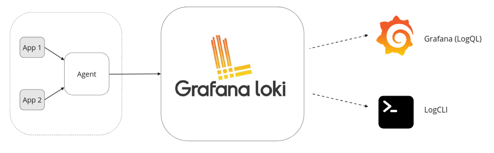

### T9.3.3、版本与校验

升级或排错前，对照 [Release notes](https://grafana.com/docs/loki/latest/release-notes/)、[Helm 安装](https://grafana.com/docs/loki/latest/setup/install/helm/) 与 [Chart README](https://github.com/grafana-community/helm-charts/blob/main/charts/loki/README.md)。

**本文本节校验日期：2026-04-20**

| 组件 | 版本 / 来源 | 说明 |
|------|-------------|------|
| Loki 镜像 | **3.7.1**（Chart `appVersion`，可再 pin tag） | [grafana/loki Releases](https://github.com/grafana/loki/releases)；Chart 见下 |
| Loki Helm Chart | **13.2.0**（与 `helm search repo grafana-community/loki` 一致即可） | [grafana-community/helm-charts](https://github.com/grafana-community/helm-charts) |
| Promtail Chart | `helm search repo grafana/promtail` 当前 stable | 镜像多为 `grafana/promtail` |
| Grafana Chart | `helm search repo grafana/grafana` 当前 stable | 本文用于 Explore 查日志 |

推荐用 **OCI** 装 Loki：`oci://ghcr.io/grafana-community/helm-charts/loki`。下文同时写 **HTTP 仓库**，方便内网镜像站对齐。

### T9.3.4、开工前要准备什么

与 **T9.2** 相同：组件放在 **`logging`** 命名空间；没有则先建：

```bash
kubectl create namespace logging
```

示例 **Monolithic** 打开 **MinIO** 子 Chart 时会多占 **PVC**；把 YAML 里的 **StorageClass** 换成你集群真实值（`kubectl get sc`）。**生产**请接云对象存储或自建 S3 兼容端点，不要长期把 MinIO 当唯一真源；参数见 [Helm reference](https://grafana.com/docs/loki/latest/setup/install/helm/reference/) 与 [Install monolithic](https://grafana.com/docs/loki/latest/setup/install/helm/install-monolithic/)。

### T9.3.5、装 Loki（Monolithic）

下面 **values** 对齐官方 [Install the monolithic Helm chart — Single Replica](https://grafana.com/docs/loki/latest/setup/install/helm/install-monolithic/)，额外固定 **`deploymentMode: Monolithic`**、**`-n logging`**。若 Helm 报未知字段，以 `helm show values grafana-community/loki --version 13.2.0` 为准。

将以下内容保存为 `loki-values.yaml`：

```yaml
# loki-values.yaml（学习/联调用；生产请换对象存储与高可用参数）
loki:
  commonConfig:
    replication_factor: 1
  schemaConfig:
    configs:
      - from: "2024-04-01"
        store: tsdb
        object_store: s3
        schema: v13
        index:
          prefix: loki_index_
          period: 24h
  pattern_ingester:
    enabled: true
  limits_config:
    allow_structured_metadata: true
    volume_enabled: true
  ruler:
    enable_api: true

minio:
  enabled: true

deploymentMode: Monolithic

singleBinary:
  replicas: 1

backend:
  replicas: 0
read:
  replicas: 0
write:
  replicas: 0
ingester:
  replicas: 0
querier:
  replicas: 0
queryFrontend:
  replicas: 0
queryScheduler:
  replicas: 0
distributor:
  replicas: 0
compactor:
  replicas: 0
indexGateway:
  replicas: 0
bloomPlanner:
  replicas: 0
bloomBuilder:
  replicas: 0
bloomGateway:
  replicas: 0
```

安装（**固定 Chart 小版本**，避免他人 `helm install` 时偷偷跨大版本）：

```bash
helm repo add grafana-community https://grafana-community.github.io/helm-charts
helm repo update

helm upgrade --install loki grafana-community/loki -n logging -f loki-values.yaml --version 13.2.0
```

OCI 写法（等价，镜像源更省事时可用）：

```bash
helm upgrade --install loki oci://ghcr.io/grafana-community/helm-charts/loki -n logging -f loki-values.yaml --version 13.2.0
```

查看 Pod（会包含 Loki、Gateway、缓存、MinIO 等，略等几分钟变 Running）：

```bash
kubectl get pods -n logging
```

```mermaid
flowchart LR
  GW["Service loki-gateway"]
  SB[Loki singleBinary]
  MI[(MinIO)]
  GW --> SB
  SB -->|S3| MI
```

刚装完本节时，**logging** 里先有 **Gateway + Loki + MinIO**（以及 Chart 带出的缓存等）；**Promtail / Grafana** 在 **T9.3.6、T9.3.7** 再补上去。

**Helm 报错时**：先跑 `helm show values grafana-community/loki --version 13.2.0` 核对字段。个别版本示例仍写 **`deploymentMode: SingleBinary`**，与 **Monolithic** 在 [Chart Upgrading](https://github.com/grafana-community/helm-charts/blob/main/charts/loki/README.md#upgrading) 里属同一类部署，按报错二选一；跨大版本升级必须先读该章节。

### T9.3.6、装 Promtail

Promtail 走 **Grafana 官方 Helm 仓库**里的 **`grafana/promtail`**（和 **`grafana-community`** 不是同一个 `helm repo`，两个都要 add）。

客户端 URL 一般指向 **本 Release 名** 下的 Gateway。Release 名 **`loki`**、命名空间 **`logging`** 时，推送地址常为：

`http://loki-gateway.logging.svc.cluster.local/loki/api/v1/push`

```bash
helm repo add grafana https://grafana.github.io/helm-charts
helm repo update

helm upgrade --install promtail grafana/promtail -n logging \
  --version 6.17.1 \
  --set "config.clients[0].url=http://loki-gateway.logging.svc.cluster.local/loki/api/v1/push"
```

版本号与 **T9.4.1** 对齐；若 `helm search` 已有更新小版本，以仓库为准。若你改了 Helm Release 名，Service 前缀会跟着变，用 `kubectl -n logging get svc` 找带 **gateway** 的那条再拼 URL。

```bash
kubectl get pods -n logging -l app.kubernetes.io/name=promtail
```

默认会挂 **`/var/log/pods`**，和 **T9.1** 说的一致。节点没有 `/var/lib/docker/containers` 时，按当前 Chart 的 `values` 删掉多余 hostPath 即可。

### T9.3.7、装 Grafana 接 Loki

只调 API 可以不用 Grafana；**日常查日志**用 **Grafana Explore** 最顺手。新建 `grafana-values.yaml`（**adminPassword 必须改掉**；生产用 **Secret** 或 SSO，勿照抄）：

```yaml
# grafana-values.yaml
adminUser: admin
adminPassword: "请改成强密码"

service:
  type: ClusterIP

datasources:
  datasources.yaml:
    apiVersion: 1
    datasources:
      - name: Loki
        type: loki
        url: http://loki-gateway.logging.svc.cluster.local
        access: proxy
        isDefault: true
```

```bash
# 若已在 T9.3.6 执行过 helm repo add grafana，则只需 helm repo update
helm upgrade --install grafana grafana/grafana -n logging -f grafana-values.yaml
```

```bash
kubectl -n logging port-forward svc/grafana 3000:80
```

浏览器访问 `http://127.0.0.1:3000`，进 **Explore**，选 **Loki**，用 **LogQL** 试查（例如 `{namespace="default"}`）。

**（插槽：此处贴本环境 Grafana Explore 查询截图，便于后来者对照 UI。）**

**T9.3.5～T9.3.7 都做完后**，命名空间里采集与查询关系可概括成：

```mermaid
flowchart TB
  subgraph logging["命名空间 logging"]
    PT[Promtail DaemonSet]
    GW["Service loki-gateway"]
    SB[Loki singleBinary]
    MI[(MinIO 子 Chart)]
    PT -->|push API| GW
    GW --> SB
    SB -->|S3| MI
  end
  GR[Grafana] -->|LogQL| GW
```

### T9.3.8、和 T9.1 / T9.2 的对应

| 上文 | 本节落点 |
|------|----------|
| **T9.1** 采集路径、Sidecar | **Promtail** 就是典型的**节点级 DaemonSet** 采集 |
| **T9.2** EFK → ES + Kibana | 本节走 **Loki + Grafana**（或只 API），两套路线二选一或按业务拆分 |
| **Fluent Bit** | 已在前面出现过；若要**只保留 Fluent Bit 推到 Loki**，按 [Loki output](https://docs.fluentbit.io/manual/pipeline/outputs/loki) 配置即可，不必再装 Promtail |

### T9.3.9、（可选）Traefik 与入口

入口用 **Traefik** 时，访问日志一般开 **access log**（多为 stdout、JSON），**Promtail** 随节点日志一并采集即可，不必为 Traefik 单独再起一套采集。具体开关以你当前的 Traefik 主版本文档为准。

**（插槽：若要大盘，可到 Grafana 官网选 Traefik 类 Dashboard 模板，导入后把 LogQL 里的 `job`、标签改名与你环境一致。）**

---

下一节 **T9.4、Promtail** 写配置要点、Helm 改法与 **Alloy** 迁移（官方已宣布 Promtail **EOL**），并与 **T9.3.6** 的安装衔接。

## T9.4、Promtail

> **官方结论（2026）**：[Promtail](https://grafana.com/docs/loki/latest/send-data/promtail/) 已于 **2026-03-02 EOL**（不再演进，商业支持结束），**新立项与扩容**请优先 [Grafana Alloy](https://grafana.com/docs/alloy/latest/) 采集并写入 Loki；**lambda-promtail** 不在此 EOL 范围内。本节仍按 **T9.3.6** 已装的 Promtail 讲清配置骨架，便于维护存量集群，并按 [Migrate to Alloy](https://grafana.com/docs/loki/latest/setup/migrate/migrate-to-alloy/) 替换采集端。

**T9.3** 里 Helm 已起 DaemonSet；落地时你要动的主要是 **`config.clients`（推到哪）**、**`positions`（断点续读）**、**`scrape_configs`（采哪些文件 / Pod）**、**`pipeline_stages`（解析与打标签）**。字段级说明已收进官方文档与 Chart 默认模板，下面只保留**生产上容易踩坑**的部分；需要查全量参数时，以 `helm show values grafana/promtail` 与 [Promtail 主文档](https://grafana.com/docs/loki/latest/send-data/promtail/) 为准。

### T9.4.1、版本与校验

**本文本节校验日期：2026-04-21**

| 项目 | 说明 |
|------|------|
| Promtail Helm Chart | `grafana/promtail`，示例 **6.17.1**（以 `helm search repo grafana/promtail --versions` 为准）；Chart 已 **deprecated**，长期应迁 **Alloy** |
| Promtail 镜像 | 建议与 **Loki 同发行线**（**T9.3** 使用 Loki **3.7.1** 时，镜像宜 **3.7.1**：在 `values` 里设 `image.tag: "3.7.1"`，覆盖 Chart 默认 `appVersion`） |
| Loki 写入地址 | 与 **T9.3** 一致：`http://loki-gateway.logging.svc.cluster.local/loki/api/v1/push`（Release 名 **`loki`**、命名空间 **`logging`**） |

### T9.4.2、配置骨架

```mermaid
flowchart LR
  subgraph nd["节点"]
    POD["/var/log/pods/..."]
    POS["positions 文件"]
  end
  subgraph pr["Promtail Pod"]
    SC[scrape_configs]
    PL[pipeline_stages]
    CL[clients]
  end
  LG[loki-gateway]
  LO[Loki]
  POD --> SC
  SC --> PL
  PL --> CL
  CL -->|HTTP POST| LG
  LG --> LO
  POS <--> SC
```

**三件事别搞混**：

1. **clients.url**：必须带 **`/loki/api/v1/push`**；多租户时再加 **`tenant_id`**（与 Loki 配置一致）。
2. **positions**：路径要在容器里**可写**（Chart 默认常挂 **`/run/promtail`**）。
3. **标签**：进 Loki 的是**标签集合**；**高基数**字段（请求 ID、用户 ID 等）不要做成标签，除非你算过成本。

### T9.4.3、Helm 改法

`grafana/promtail` 的默认值在 **`config`** 下拼装完整 **`config.file`**，常见改法：

- **只改推送地址**（与 **T9.3.6** 的 `--set config.clients[0].url=...` 等价）；
- **改镜像版本**：`image.tag`；
- **改抓取 / 管道**：动 **`config.snippets`**、**`config.snippets.extraScrapeConfigs`**、**`config.snippets.extraRelabelConfigs`** 等（**键名以当期 Chart 为准**）。

示例片段（**字段名请对照** `helm show values grafana/promtail --version 6.17.1`）：

```yaml
# promtail-values.yaml 片段
image:
  tag: "3.7.1"

config:
  clients:
    - url: http://loki-gateway.logging.svc.cluster.local/loki/api/v1/push
  positions:
    filename: /run/promtail/positions.yaml
```

```bash
helm repo add grafana https://grafana.github.io/helm-charts
helm repo update
helm upgrade --install promtail grafana/promtail -n logging -f promtail-values.yaml --version 6.17.1
```

### T9.4.4、K8s 抓取要点

- **DaemonSet 一节点一实例**：只读**本节点**日志；**Kubernetes SD** 下务必用 **`relabel`** 保证目标 Pod 落在本节点（Chart 默认模板里已有典型 **`__meta_kubernetes_pod_node_name`** 一类处理，见 `values.yaml` 里 **`snippets.scrapeConfigs`**）。
- **重复日志**：多个 `job` 若匹配同一文件，会向 Loki 打**重复流**，排障时先合并 / 收紧 `scrape_configs`。
- **与 Prometheus 对齐**：`namespace`、`pod`、`container` 等标签习惯与 Prometheus 一致时，**日志与指标**更好关联。

```mermaid
flowchart TB
  SD["K8s SD 本节点 Pod"]
  RB[relabel_configs]
  PT["tail 日志路径"]
  PL[pipeline_stages]
  SD --> RB --> PT --> PL
```

### T9.4.5、管道示例

下面示意：**JSON 行**里抽出 `level` 打成标签，再按标签**丢掉 debug**（完整阶段列表以官方说明为准；Helm 默认往往已有 **`cri: {}`** 处理容器运行时格式，勿与业务 JSON 阶段重复打架）。

```yaml
pipeline_stages:
  - json:
      expressions:
        level: level
  - labels:
      level:
  - match:
      selector: '{level="debug"}'
      action: drop
```

**（插槽：可贴 `kubectl -n logging logs` 里 Promtail 正常工作的片段截图。）**

### T9.4.6、迁到 Alloy（推荐）

1. 读 [Migrate to Alloy](https://grafana.com/docs/loki/latest/setup/migrate/migrate-to-alloy/)，用官方迁移工具把 **Promtail 配置转成 Alloy**（命令以文档为准）。
2. 推送端仍指向 **同一 Loki**（`loki-gateway.logging.svc.cluster.local`），与 **T9.3.5** 不冲突。
3. 新装采集端**不要再押注 Promtail** 长期演进。

```mermaid
flowchart LR
  A[存量 Promtail] -->|迁移| B[Grafana Alloy]
  B -->|push| G[loki-gateway]
  G --> L[Loki]
```

**（插槽：可贴 Alloy 运行后 Grafana Explore 查询截图。）**

---

## T9.5、报警

日志告警常见三条路：**Grafana 里对 Loki 做告警规则**（官方当前主推的用法之一）、**Loki Ruler 用 LogQL 评估规则并通知 Alertmanager**、**采集端从日志生成指标再给 Prometheus**（Promtail 已 EOL，长期请用 Alloy 等价能力）。下面按「先易后难」排，并与 **T9.3、T9.4** 的 **Loki / Promtail** 安装方式对齐，不再使用已废弃的 **`loki-stack`** 与旧外链图。

### T9.5.1、版本与校验

**本文本节校验日期：2026-04-21**

| 项目 | 说明 |
|------|------|
| Loki | 与 **T9.3.5** 一致，示例 **3.7.1**（Chart **13.2.0**） |
| 告警规则语言 | **LogQL**（Ruler）或 **Grafana 表达式**（Grafana Alerting），见 [Alerting](https://grafana.com/docs/loki/latest/alerting/) |
| Alertmanager | 与现有监控栈一致；若用 **kube-prometheus-stack**，版本以 `helm search` / 官方发行为准 |
| 采集端 | **Promtail** 已 **EOL**（**T9.4**）；新装请 **Grafana Alloy** |

### T9.5.2、三条路怎么选

```mermaid
flowchart TB
  subgraph grafana["方案A Grafana 告警"]
    GA[Grafana] -->|查 Loki| LK[(Loki)]
    GA --> AM1[通知渠道]
  end
  subgraph ruler["方案B Loki Ruler"]
    RU[Loki Ruler] -->|LogQL| LK2[(Loki)]
    RU --> AM2[Alertmanager]
  end
  subgraph pipe["方案C 日志造指标"]
    AG["Promtail 或 Alloy"] -->|metrics| PR[Prometheus]
    PR --> AM3[Alertmanager]
  end
```

- **方案 A**：团队已用 **Grafana 10/11**，优先在 **Grafana → Alerting** 建规则，数据源选 **Loki**，不必先改 Loki Helm。详见 [Grafana Alerting](https://grafana.com/docs/grafana/latest/alerting/) 与 Loki 文档中的 [Alerting](https://grafana.com/docs/loki/latest/alerting/) 说明。
- **方案 B**：要把规则**当作代码**进集群、与 Prometheus 规则风格统一，或要 **Ruler API / lokitool 同步**时，用 **Ruler**。配置见 [Configure](https://grafana.com/docs/loki/latest/configure/#ruler) 与下文示例。
- **方案 C**：已有 **Prometheus** 生态，希望**先变成指标再告警**时用；注意 **Promtail** 维护结束，新装请规划 **Alloy**（**T9.4.6**）。

### T9.5.3、方案 A：Grafana 里告警（推荐入门）

1. 确认 **T9.3.7** 已把 **Loki** 加成 Grafana 数据源（`http://loki-gateway.logging.svc.cluster.local`）。  
2. 在 Grafana 中新建告警规则，查询类型选 **Loki**，用 **LogQL** 写条件（例如错误日志条数、关键字出现次数）。  
3. 配置通知渠道（企业微信、邮件、PagerDuty 等）。  

**（插槽：可贴「Alerting → New alert rule → Loki 查询」界面截图。）**

生产上记得：**评估间隔、For 持续时间、无数据/错误状态**与值班流程一致；复杂条件可用多查询与表达式（以当前 Grafana 版本文档为准）。

### T9.5.4、方案 B：Loki Ruler + Alertmanager

**T9.3.5** 里若只有 **`loki.ruler.enable_api: true`**，还不足以把告警送到 Alertmanager，需要补上 **`alertmanager_url`**、**规则存储** 等。请先 **`helm show values grafana-community/loki --version 13.2.0`** 看清本版 Chart 是用 **`loki.ruler`** 还是 **`loki.rulerConfig`**，再合并，避免和旧文 **`loki-stack`** 混用。

下面示例与官方 [Alerting](https://grafana.com/docs/loki/latest/alerting/) 中 ruler 结构一致：请用其**替换** **T9.3.5** 里原先那段只含 `enable_api` 的 **`ruler`**，保持 **`loki:`** 下只有一个 **`ruler`** 块。

```yaml
# 合并进 loki-values.yaml 的 loki: 段（路径按集群改）
loki:
  ruler:
    enable_api: true
    alertmanager_url: http://alertmanager-operated.monitoring.svc:9093
    enable_alertmanager_v2: true
    rule_path: /tmp/loki/scratch
    storage:
      type: local
      local:
        directory: /var/loki/rules
    ring:
      kvstore:
        store: inmemory
```

Alertmanager 的 Service 名、命名空间按你集群实际改（常见 **kube-prometheus-stack** 为 `monitoring`）。应用：

```bash
helm upgrade loki grafana-community/loki -n logging -f loki-values.yaml --version 13.2.0
```

规则内容与 **Prometheus 告警规则** 相同，但 **`expr` 里是 LogQL**。官方示例（节选）：

```yaml
groups:
  - name: loki_demo
    rules:
      - alert: HighErrorRate
        expr: |
          sum(rate({namespace="default", app="nginx-demo"} |= "error" [5m])) by (job)
            /
          sum(rate({namespace="default", app="nginx-demo"}[5m])) by (job)
            > 0.05
        for: 5m
        labels:
          severity: warning
        annotations:
          summary: "nginx error ratio high"
```

把规则文件放到 Ruler 能读到的存储（**local** 时需挂卷或 ConfigMap；生产多用 **S3/GCS** 等，见 [Ruler storage](https://grafana.com/docs/loki/latest/alerting/#ruler-storage)）。规则上线可用 **`lokitool`**（Loki **≥3.1**，见官方 [Interacting with the Ruler](https://grafana.com/docs/loki/latest/alerting/#interacting-with-the-ruler)）。

```mermaid
sequenceDiagram
  participant R as Loki Ruler
  participant L as Loki
  participant A as Alertmanager
  R->>L: 评估 LogQL
  R->>A: 触发告警
```

**（插槽：可贴 Alertmanager UI 中由 Loki 触发的告警条目截图。）**

### T9.5.5、方案 C：日志里造指标再走 Prometheus

思路：**Promtail（或 Alloy）pipeline** 里用 **metrics** 阶段暴露 Counter/Histogram，Prometheus 通过 **ServiceMonitor** 抓取 **`/metrics`**，再用 **PrometheusRule** 告警。`grafana/promtail` Chart 支持 **`serviceMonitor.enabled: true`**，标签要对上 Prometheus Operator 的 **`serviceMonitorSelector`**。

示例片段（**pipeline 以 CRI 解析为准**，不要用已废弃的单独 **`docker: {}`** 硬套；标签 `app` 需与你 workload 一致）：

```yaml
# promtail-values-patch.yaml 片段（与 T9.4.3 合并时对照 helm show values）
serviceMonitor:
  enabled: true
  additionalLabels:
    release: prometheus

config:
  snippets:
    pipelineStages:
      - cri: {}
    extraRelabelConfigs: []
  # 在 snippets.scrapeConfigs / extraScrapeConfigs 中按需挂载下面 pipeline，勿重复抓取同一文件
```

**metrics 阶段**示例（逻辑说明用；键名以 Promtail 版本为准）：

```yaml
pipeline_stages:
  - cri: {}
  - match:
      selector: '{app="nginx-demo"}'
      stages:
        - regex:
            expression: '.*(?P<method>GET|POST) .*'
        - metrics:
            nginx_http_requests:
              type: Counter
              description: "nginx requests"
              source: method
              config:
                action: inc
```

Prometheus 里指标名多为 **`promtail_custom_<name>[_total]`**（Counter 带 `_total`），**PrometheusRule** 的 `expr` 以 **Prometheus UI / Grafana Explore（Metrics）** 里实际 series 为准。

**（插槽：可贴 Prometheus Targets 中 promtail 与自定义指标查询截图。）**

### T9.5.6、联调用小应用（可选）

需要一个固定打日志的 workload 时，可用现代镜像，例如 **`nginx:1.27-alpine`**，**ClusterIP** + `kubectl port-forward` 访问，避免旧文里的 **NodePort + 固定机器 IP**。

```yaml
# nginx-demo.yaml
apiVersion: apps/v1
kind: Deployment
metadata:
  name: nginx-demo
  namespace: default
spec:
  replicas: 1
  selector:
    matchLabels:
      app: nginx-demo
  template:
    metadata:
      labels:
        app: nginx-demo
    spec:
      containers:
        - name: nginx
          image: nginx:1.27-alpine
          ports:
            - containerPort: 80
---
apiVersion: v1
kind: Service
metadata:
  name: nginx-demo
  namespace: default
spec:
  selector:
    app: nginx-demo
  ports:
    - port: 80
      targetPort: 80
```

```bash
kubectl apply -f nginx-demo.yaml
kubectl port-forward svc/nginx-demo 8080:80
# 另开终端：curl -s -o /dev/null -w "%{http_code}\n" http://127.0.0.1:8080/
```

LogQL 里用 **`{app="nginx-demo"}`** 或 **`{namespace="default", app="nginx-demo"}`** 与 **T9.5.4** 示例一致即可。

---

## T9.6、LogQL

**LogQL** 是 Loki 的查询语言，和 PromQL 有渊源，但面向日志。详细语法以官方 [Query Loki](https://grafana.com/docs/loki/latest/query/) 为准；下面只整理**生产里天天会用到的骨架**，避免把参考手册整本贴进来。

### T9.6.1、版本与校验

**本文本节校验日期：2026-04-21**

| 项目 | 说明 |
|------|------|
| Loki | 与 **T9.3** 一致，示例 **3.7.x**（Chart **13.2.0**） |
| 查询入口 | **Grafana Explore**、**LogCLI**（[logcli](https://grafana.com/docs/loki/latest/query/logcli/)）、告警规则里的 **LogQL**（**T9.5**） |
| 必读 | [Log queries](https://grafana.com/docs/loki/latest/query/log_queries/) · [Metric queries](https://grafana.com/docs/loki/latest/query/metric_queries/) |

### T9.6.2、两类查询

```mermaid
flowchart LR
  subgraph logq["日志查询"]
    S1["标签选择器"] --> P1["管道可选"]
    P1 --> OUT["日志行"]
  end
  subgraph met["指标查询"]
    S2["标签选择器"] --> P2["解析与过滤"]
    P2 --> R1["聚合与区间"]
    R1 --> NUM["数值序列"]
  end
```

- **日志查询**：结果还是日志内容，适合排障、检索。  
- **指标查询**：在日志上算 **rate、count_over_time** 等，结果给大盘或告警（**T9.5.4**）。

基本形状（官方写法）：

```logql
{ log stream selector } | log pipeline
```

**流选择器必选**，**管道可选**；Loki **只索引标签和时间**，正文靠管道里过滤和解析（见 [Labels](https://grafana.com/docs/loki/latest/get-started/labels/)）。

### T9.6.3、流选择器（标签）

大括号里用 **`=`、`!=`、`=~`、`!~`** 匹配标签，规则和 Prometheus 类似（见 [Prometheus 标签匹配](https://prometheus.io/docs/prometheus/latest/querying/basics/#instant-vector-selectors)）。

新版本里常有 **`service_name`** 等约定标签，便于和 Grafana 里日志视图联动，具体以你集群里 **Explore → 标签浏览器** 看到的为准。

**（插槽：可贴本环境 Grafana Explore 里标签键列表截图。）**

与 **T9.5.6** 的 **nginx-demo** 对齐的示例：

```logql
{namespace="default", app="nginx-demo"}
```

### T9.6.4、管道：先过滤行，再解析

**行过滤**尽量靠前，少扫数据：

| 运算符 | 含义 |
|--------|------|
| `|=` | 行包含子串 |
| `!=` | 行不包含 |
| `|~` | 行匹配正则（RE2） |
| `!~` | 正则不匹配 |

**解析**：`| json`、`| logfmt`、`| regexp "..."` 等，把字段抽成标签再在管道里用（详见官方 [Log queries](https://grafana.com/docs/loki/latest/query/log_queries/)）。

示例：只看包含 `error` 的行再解析 JSON：

```logql
{namespace="default", app="nginx-demo"} |= "error" | json
```

**格式化展示**（不改变 Loki 里存的数据）：`| line_format "..."`、`| label_format ...`（官方 [Query](https://grafana.com/docs/loki/latest/query/) 页有示例）。

### T9.6.5、指标查询（告警 / 大盘）

在日志选择器 + 管道之后，对**范围区间**做聚合，常见：

- **`rate()`**：每秒条目数  
- **`count_over_time()`**：区间内条数  
- **`sum(... ) by (label)`**：按标签聚合  

示例：按 **pod** 看 5 分钟请求日志条数变化（标签名以你环境为准）：

```logql
sum by (pod) (rate({namespace="default", app="nginx-demo"}[5m]))
```

**错误率**一类写法（与 **T9.5.4** 思路一致，按业务改标签）：

```logql
sum(rate({namespace="default", app="nginx-demo"} |= "error" [5m])) by (job)
  /
sum(rate({namespace="default", app="nginx-demo"}[5m])) by (job)
```

区间写法 **`[5m]`** 与 PromQL 习惯一致；更复杂的函数、**unwrap**、**二进制运算**见 [Metric queries](https://grafana.com/docs/loki/latest/query/metric_queries/)。

### T9.6.6、注释与排障习惯

单行或行尾可用 **`#`** 注释（见官方说明）。  

**生产注意**：

1. **标签越少越准**：选择器越宽，扫的 chunk 越多，查询越慢、越贵。  
2. **高基数不要塞进标签**（采集端就要克制，见 **T9.4**）。  
3. **大时间范围 + 宽选择器** 容易超时，先缩时间窗或加 `|=` 过滤。  
4. 与 **T9.3.7** 数据源 URL 一致时，**Grafana Explore** 里试通后再写进 **T9.5** 告警规则。

```mermaid
flowchart TB
  A["标签尽量收窄"] --> B["行过滤 含子串或正则"]
  B --> C["json 或 logfmt"]
  C --> D["rate 等聚合"]
```

**（插槽：可贴一条本环境完整 LogQL 在 Explore 中的查询结果截图。）**

---

