# T9、日志

## T9.1、日志架构

监控篇（T4）管的是**指标和告警**：CPU、延迟、错误率这类数，用来盯健康、触发告警。本篇管的是**日志**：谁在什么时间、打印了什么内容，用来还原现场、排查根因。

**生产上这两套一般都要上**，但职责不同：**指标**适合按时间聚合、做告警规则；**日志**适合按关键字、上下文检索。

选型上也就不同：指标常用 Prometheus 这类时序库，日志常用 ES、OpenSearch、托管日志等。

**不要把两类数据混进同一种存储里凑合用**（例如用日志库硬扛全量指标，或把海量原始日志塞进时序库），既贵又难维护，也不是常见做法。

本节对齐 [Kubernetes：Logging Architecture](https://kubernetes.io/docs/concepts/cluster-administration/logging/)，并结合生产习惯写清：**镜像固定 tag、校验日期、可照着 apply 的 YAML**。文中配图来自 **Kubernetes 官网同一套素材**（已下载到本文 `images/`，便于离线阅读）。

### T9.1.1、概念与依据

**应用日志**：看业务行为、排错、审计。**容器里最省事的做法**：写 **stdout / stderr**，由运行时交给 kubelet，再在节点上落盘；平时用 `kubectl logs` 就能看。

**集群级日志（cluster-level logging）**：官方定义是——日志的**存储与生命周期**要和节点、Pod、容器**脱钩**，否则容器崩了、Pod 被赶走、节点挂了，你只依赖本地文件会抓瞎。Kubernetes **不提供**日志存储产品，只提供 API 与节点侧行为；**存哪、查哪、保留多久**由你自己选（EFK、托管日志、Kafka 等）。

**和监控怎么配合**：业务容器可以同时做两件事——一边按 Prometheus 约定暴露 **`/metrics` 端点**（给监控抓），一边往 **stdout/stderr 打日志**（给日志采集收）。**前者不等于后者**：不能指望只靠日志解决告警，也不能只靠指标还原每一行日志原文；两条链路各自部署、各自存储即可。

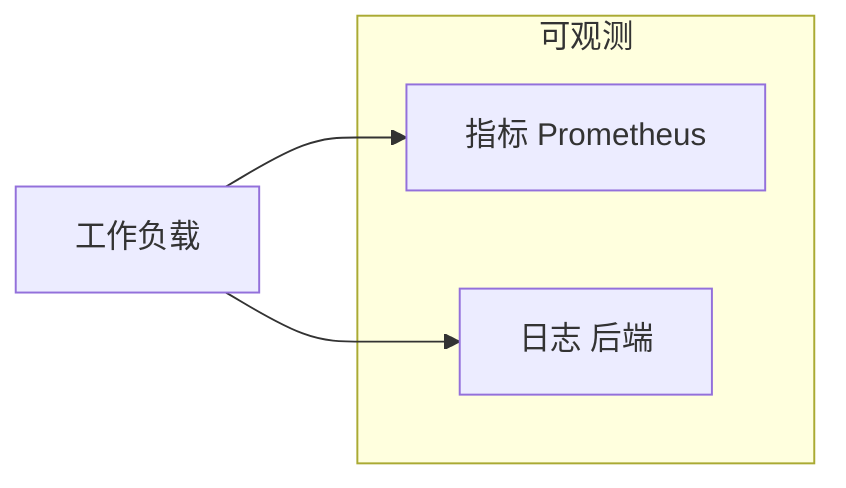

---

### T9.1.2、标准输出与节点行为

下面这张图对应官方「节点如何处理容器日志」的说明：运行时接管 stdout/stderr，与 kubelet 之间用 **CRI 日志格式**衔接（具体实现随运行时变化，但对 kubelet 的接口是统一的）。


**你可以把一条日志从容器里到 `kubectl logs` 的路径理解成：**

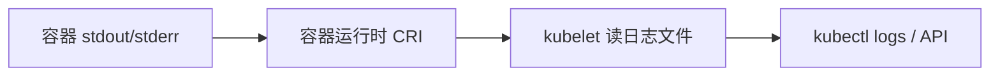

**kubelet 轮转（生产必看）**：自 v1.21 起相关能力已稳定。可在 [kubelet 配置](https://kubernetes.io/docs/reference/config-api/kubelet-config.v1beta1/) 里调 `containerLogMaxSize`（默认约 10Mi）、`containerLogMaxFiles`（默认约 5）等；大流量集群还可关注 `containerLogMaxWorkers`、`containerLogMonitorInterval`。目的是**别让单容器日志把节点盘打满**。

**`kubectl logs` 的边界**：官方写明——通常只能看到**当前正在写的那份**文件；若已轮转，更早的不一定还能从这个命令拿到。**长期留存、合规检索**必须走集群级后端，别指望 `kubectl logs` 当归档库。

**可选（Alpha）**：从 v1.32 起有 `PodLogsQuerySplitStreams` 特性门，可把 stdout / stderr 分开查，默认关。见官方 [Container log streams](https://kubernetes.io/docs/concepts/cluster-administration/logging/#container-log-streams)。

**最小示例**（与官方 [counter-pod.yaml](https://k8s.io/examples/debug/counter-pod.yaml) 同结构，镜像与监控篇一致）：

```yaml
# counter-pod.yaml
apiVersion: v1
kind: Pod
metadata:
  name: counter
spec:
  containers:
    - name: count
      image: busybox:1.37
      args:
        - /bin/sh
        - -c
        - 'i=0; while true; do echo "$i: $(date)"; i=$((i+1)); sleep 1; done'
```

```bash
kubectl apply -f counter-pod.yaml
kubectl logs counter
kubectl logs counter -c count
kubectl logs counter --previous
```

重复实验若遇名称冲突：`kubectl delete pod counter --ignore-not-found`。

> **版本与镜像约定（与监控篇一致）**
>
> **`image:` 一律固定 tag**；升级前到 **GitHub Releases** 或镜像仓库核对 **latest 稳定版**（非 prerelease），并更新下表与校验日期。  
>
> **本文同步校验日期：2026-04-16**  
>
> | 组件 | 镜像 / 标签 | 说明 |
> |------|-------------|------|
> | busybox | `busybox:1.37` | 与 [T4 监控篇](../prometheus/prometheus.md) 一致 · [Hub](https://hub.docker.com/_/busybox/tags) |
> | Fluent Bit | `fluent/fluent-bit:5.0.3` | 节点/sidecar 常用 · [Releases](https://github.com/fluent/fluent-bit/releases/latest) |
> | 官方文档中的 fluentd 示例 | `registry.k8s.io/fluentd-gcp:1.30` | 与 [官方页面示例](https://kubernetes.io/docs/concepts/cluster-administration/logging/) 同源，偏 GKE；**自建集群请改 OUTPUT**，勿照搬 `google_cloud` |

---

### T9.1.3、三类集群级路径

官方在 [Cluster-level logging architectures](https://kubernetes.io/docs/concepts/cluster-administration/logging/#cluster-level-logging-architectures) 里只归纳三类，生产里一般是「三选一或组合」。

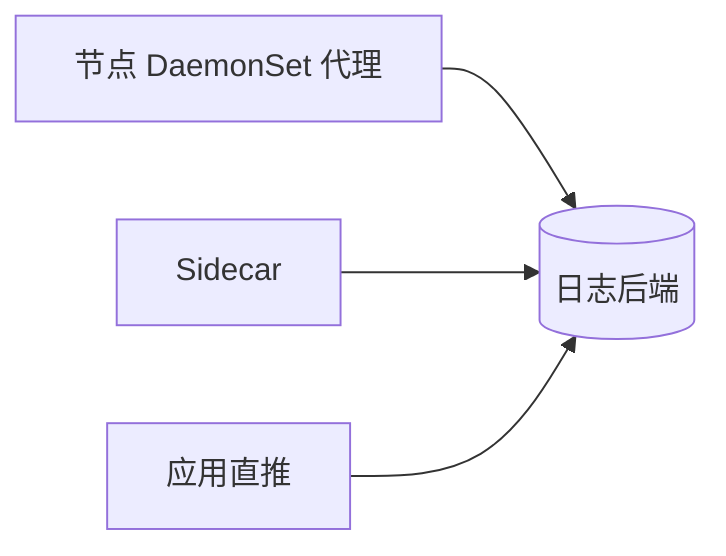

| 路径 | 一句话 | 常见场景 |
|------|--------|----------|
| 节点代理 | 每节点一个采集进程，读本节点容器日志目录，再发到后端 | **默认首选**，不动业务镜像 |
| Sidecar | 跟业务同 Pod：要么把文件日志打到 sidecar 的 stdout，要么在 sidecar 里跑采集进程 | 写文件、多格式分流、节点策略不满足时 |
| 应用直推 | 进程内 SDK 直接发到后端 | 强绑定某云/厂商 SDK，或作补充 |

---

### T9.1.4、落地与示例

这一节把上面三种「集群级日志」拆成四段，每一段都配有**官方示意图**和**能直接 apply 的 YAML**（需要你先装好集群和 `kubectl`）。阅读顺序建议：先看 **T9.1.4.1**，这是大多数公司默认采用的形态；只有业务把日志写进**文件**、或者节点上统一采集满足不了时，再往下看 Sidecar 两种；应用内直推放在最后，用得相对少。

**怎么选，一句话对照**：

- **多数情况**：用 **T9.1.4.1 节点代理**就够了，业务继续往 stdout 打日志即可。  
- **业务必须写文件**：先看能不能改成 stdout；改不了，再用 **T9.1.4.2** 或 **T9.1.4.3**（Sidecar 会多占资源，要心里有数）。  
- **应用直推（T9.1.4.4）**：Kubernetes 不管你怎么实现，适合已经接了某云日志 SDK 的场景，或当补充手段。

---

#### T9.1.4.1、节点代理


**这是在干什么**：在**每一台工作节点**上跑一个采集程序（一般用 **DaemonSet** 部署，保证每台机器都有一个 Pod）。这个程序去读「本节点上、所有容器打出来的日志文件」（常见目录是 `/var/log/pods/...`，具体以你集群为准），解析后再发到 Elasticsearch、Kafka、云厂商日志服务等。

**为什么常用**：业务不用改镜像、不用加边车，只要像平常一样往 **标准输出** 打日志，节点上的代理自然会收集到。

**什么时候不够**：代理默认跟的是「标准输出落到节点上的那套日志」。如果你的程序只往**自己容器里某个路径**写文件，又不跟别的容器共享卷，节点上的统一采集**可能读不到**，这时就要用后面的 Sidecar，或者改程序写法。

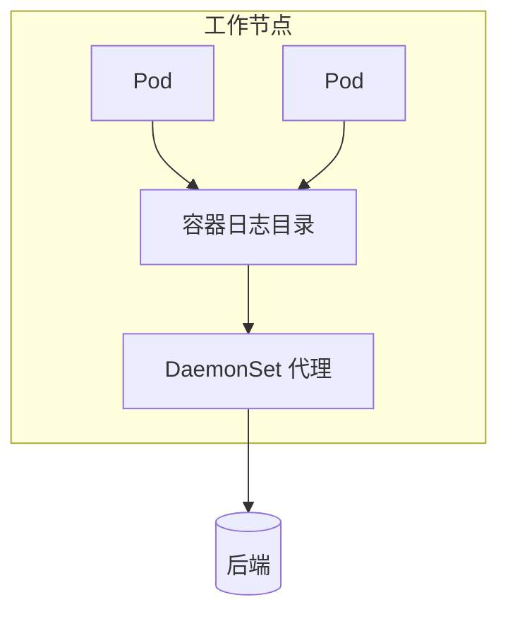

---

#### T9.1.4.2、Sidecar 流式


**这是在干什么**：业务坚持把日志写进**文件**（例如 `/var/log/1.log`），你又希望后面仍然走「标准输出 → 节点采集」这条老路。做法是：加一个（或多个）**小容器**，和主容器**共享同一块卷**，用小容器里的 `tail -F` 去读文件，把读到的内容**打印到自己的标准输出**。这样一来，kubelet 照样按「容器标准输出」收集，节点上的日志代理也能接着收。

**和上一段的关系**：上一段是「节点上一个代理管全机」；这里是「**单个 Pod 里多几个容器配合**」，专门解决「写文件」的问题。

**操作要点**：主容器写文件；**每个要单独看的日志流，对应一个 sidecar**，下面示例里是两个文件，所以有两个 sidecar。用 `kubectl logs` 时可以按**容器名**分别看。


```yaml
# two-files-counter-pod-streaming-sidecar.yaml
apiVersion: v1
kind: Pod
metadata:
  name: counter
spec:
  containers:
    - name: count
      image: busybox:1.37
      args:
        - /bin/sh
        - -c
        - >
          i=0;
          while true;
          do
            echo "$i: $(date)" >> /var/log/1.log;
            echo "$(date) INFO $i" >> /var/log/2.log;
            i=$((i+1));
            sleep 1;
          done
      volumeMounts:
        - name: varlog
          mountPath: /var/log
    - name: count-log-1
      image: busybox:1.37
      args: [/bin/sh, -c, 'tail -n+1 -F /var/log/1.log']
      volumeMounts:
        - name: varlog
          mountPath: /var/log
    - name: count-log-2
      image: busybox:1.37
      args: [/bin/sh, -c, 'tail -n+1 -F /var/log/2.log']
      volumeMounts:
        - name: varlog
          mountPath: /var/log
  volumes:
    - name: varlog
      emptyDir: {}
```

```bash
kubectl apply -f two-files-counter-pod-streaming-sidecar.yaml
kubectl logs counter -c count-log-1
kubectl logs counter -c count-log-2
```

**磁盘上多占一份**：同一条日志，文件里有一份，经 sidecar 打出标准输出后，节点上还会再记一份。官方也提醒这样会**接近双倍占用**。所以能改的话，还是尽量让应用直接打 **stdout/stderr**，让 kubelet 去轮转，更省事。

---

#### T9.1.4.3、Sidecar 采集器


**和 T9.1.4.2 的差别**：上一段是「用 `tail` 把文件**转成**标准输出，再走节点上那套采集」。这一段是「在 Pod 里再跑一个**真正的采集程序**（例如 Fluent Bit、fluentd），直接从共享卷里 **tail 文件**，然后**按你的配置发到后端**（不一定再经过业务容器的标准输出）」。

**什么时候会用到**：例如你希望**解析规则、过滤规则**只作用在这一个应用上，不想在节点全局 DaemonSet 里写一大坨；或者多租户隔离、合规要求必须在 Pod 内完成转发等。

**代价**：每个业务 Pod 都要多跑一个采集容器，**CPU、内存要算进容量规划**。另外，`kubectl logs` 只能看**某个容器的标准输出**，**看不到**「已经发到 Elasticsearch 里」的那条日志；要看转发是否成功，要么看**采集容器自己的日志**，要么到**日志后端**里查。

**和官方文档对齐**：[Kubernetes 文档](https://kubernetes.io/docs/concepts/cluster-administration/logging/#sidecar-container-with-a-logging-agent) 里的示例用的是 **fluentd**，输出写到 **`google_cloud`**，镜像为 **`registry.k8s.io/fluentd-gcp:1.30`**（给 **GCP** 用的）。自建集群一般是 **Fluent Bit** 或自管 fluentd，把配置里的 **`OUTPUT`** 改成你的 ES、Kafka、HTTP 等。下面用 **Fluent Bit 5.x**，先把日志打到 **stdout**，方便你确认管道通了；上线时只改 **`[OUTPUT]`** 即可。

```yaml
# fluent-bit-sidecar-cm.yaml
apiVersion: v1
kind: ConfigMap
metadata:
  name: fluent-bit-config
data:
  fluent-bit.conf: |
    [SERVICE]
        Flush     1
        Log_Level info

    [INPUT]
        Name  tail
        Tag   count.format1
        Path  /var/log/1.log

    [INPUT]
        Name  tail
        Tag   count.format2
        Path  /var/log/2.log

    [OUTPUT]
        Name  stdout
        Match *
        Format json_lines
```

```yaml
# counter-with-fluent-bit-sidecar.yaml
apiVersion: v1
kind: Pod
metadata:
  name: counter
spec:
  containers:
    - name: count
      image: busybox:1.37
      args:
        - /bin/sh
        - -c
        - >
          i=0;
          while true;
          do
            echo "$i: $(date)" >> /var/log/1.log;
            echo "$(date) INFO $i" >> /var/log/2.log;
            i=$((i+1));
            sleep 1;
          done
      volumeMounts:
        - name: varlog
          mountPath: /var/log
    - name: count-agent
      image: fluent/fluent-bit:5.0.3
      command: ["/fluent-bit/bin/fluent-bit"]
      args: ["-c", "/fluent-bit/etc/fluent-bit.conf"]
      volumeMounts:
        - name: varlog
          mountPath: /var/log
        - name: config-volume
          mountPath: /fluent-bit/etc
  volumes:
    - name: varlog
      emptyDir: {}
    - name: config-volume
      configMap:
        name: fluent-bit-config
```

```bash
kubectl apply -f fluent-bit-sidecar-cm.yaml
kubectl apply -f counter-with-fluent-bit-sidecar.yaml
kubectl logs counter -c count-agent
```

上面命令里，`kubectl logs` 看到的是 **Fluent Bit 容器**打到标准输出的内容（示例里配成了 JSON 行）。等你把 **`[OUTPUT]`** 改成真实后端后，要到 **Kibana、OpenSearch Dashboards** 或云控制台里去查业务日志。[官方 fluentd 示例](https://kubernetes.io/docs/concepts/cluster-administration/logging/#sidecar-container-with-a-logging-agent) 可以对照着看：结构一样，只是采集软件和 **`OUTPUT`** 随环境换。

**（插槽：把 OUTPUT 接到 OpenSearch/Elasticsearch 等并验证检索通过后，可在此处补一张 Discover/检索界面截图。）**

---

#### T9.1.4.4、应用直推


**这是在干什么**：不经过节点上的统一采集，应用在代码里用 **SDK 或 HTTP** 等，把日志**直接发到**日志平台或消息队列。

**Kubernetes 的态度**：官方写明，这类做法**不在 Kubernetes 核心概念里细讲**。也就是说：**怎么鉴权、失败重试、打爆了怎么办（背压）、字段长什么样**，都要你们自己在应用或 SDK 层设计。适合已经**绑定了某家云日志**、或必须绕过节点采集策略的情况；也可以和节点采集**同时存在**，作为补充。

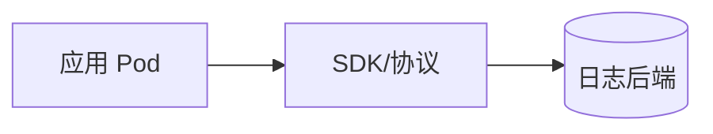

---

下一节 **「T9.2、日志 EFK」** 会用 **ECK** 部署 **Elasticsearch、Kibana**，再用 **Fluent Bit DaemonSet** 把节点上的容器日志送进 ES（与本文 **T9.1** 的采集组件一致）。若团队已经统一用 **Fluentd**，只要把输出指向同一套 ES 即可。

## T9.2、日志 EFK

**Elasticsearch** 负责存日志、做检索；**Kibana** 负责 Web 里查询和看图；**采集器**（本节用 **Fluent Bit**，与上文 **T9.1** 的镜像与采集思路一致）从每个节点读容器日志，再写到 ES。**Fluentd** 也是很好的选择（插件多、偏 Ruby 生态），若团队已标准化 Fluentd，只要把输出改到本节的 ES 地址即可，思路一样。

2026 年 Elastic 在 Kubernetes 上的**官方推荐**落地方式是 **Elastic Cloud on Kubernetes（ECK）**：用 Operator 管理 Elasticsearch / Kibana 的生命周期、证书与升级。下面的步骤以 **ECK + Fluent Bit** 为主线，对齐 [Elastic 文档：ECK](https://www.elastic.co/guide/en/cloud-on-k8s/current/index.html) 与 [Fluent Bit Elasticsearch 输出](https://docs.fluentbit.io/manual/pipeline/outputs/elasticsearch)。**不再沿用**早期教程里「Helm 分别装 master、data、client 三套旧版 Elasticsearch」的做法（与当前节点角色与运维方式都不一致）。

### T9.2.1、数据怎么流

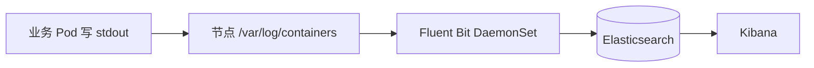

---

### T9.2.2、版本与校验

升级或排错前，务必到 **GitHub Releases / Elastic 支持矩阵**核对当前稳定版，并更新下表日期。

**本文同步校验日期：2026-04-16**

| 组件 | 版本 / 来源 | 说明 |
|------|-------------|------|
| ECK Operator | `3.3.2` | [ECK Releases](https://github.com/elastic/cloud-on-k8s/releases) · 安装清单见下文官方下载地址 |
| Elastic Stack（ES + Kibana `spec.version`） | **8.17.x**（示例写 `8.17.0`，以 [ECK 与版本兼容矩阵](https://www.elastic.co/support/matrix#matrix_kubernetes) 为准） | 镜像由 Operator 按版本拉取，一般来自 `docker.elastic.co` |
| Fluent Bit | `fluent/fluent-bit:5.0.3` | 与本文 **T9.1** 约定一致 · [fluent-bit Releases](https://github.com/fluent/fluent-bit/releases) |

---

### T9.2.3、开工前要准备什么

- **命名空间**：本章约定日志组件放在 **`logging`**（与下文 YAML 一致）。若还没有：`kubectl create namespace logging`。
- **存储**：Elasticsearch 数据盘必须用 **PVC**（ECK 在 `volumeClaimTemplates` 里声明）。把 YAML 里的 **`storageClassName`** 改成你集群里真实存在的 **StorageClass**（可用 `kubectl get sc` 看）。学习可用单副本小盘；生产要按容量、副本、机架分散再做规划。
- **资源**：ES 对内存敏感，示例里给的是**能跑起来的下限**；生产请按官方建议调高，并保证节点 `vm.max_map_count` 等系统参数（见 [Elasticsearch 安装说明](https://www.elastic.co/guide/en/elasticsearch/reference/current/setup-configuration-memory.html)）。
- **密码**：ECK 会为 `elastic` 用户生成随机密码，存在 Secret 里，**不要用教程里写死的密码**。

---

### T9.2.4、安装 ECK Operator

Operator 安装在 **`elastic-system`** 命名空间（安装 YAML 会自动建）。**必须先装 CRD，再装 Operator**，顺序如下（官方发布的固定版本链接，可写进流水线）：

```bash
kubectl create -f https://download.elastic.co/downloads/eck/3.3.2/crds.yaml
kubectl apply -f https://download.elastic.co/downloads/eck/3.3.2/operator.yaml
```

等待 **elastic-system** 里 Operator Pod 变为 Running（不同版本标签可能略有差异，直接看 Pod 列表即可）：

```bash
kubectl -n elastic-system get pods
```

更多安装方式（Helm、离线等）见官方：[Install ECK](https://www.elastic.co/guide/en/cloud-on-k8s/current/k8s-install.html)。

---

### T9.2.5、部署 Elasticsearch（ECK）

在 **`logging`** 命名空间创建集群。下面示例为 **单节点**、便于学习；生产请把 `count` 调成 3 及以上，并按官方做高可用与索引策略。

**（插槽：若需要书中配 Elastic 官方示意图，可从当前版本 [Elastic 文档](https://www.elastic.co/guide/en/cloud-on-k8s/current/index.html) 截取「部署拓扑」类配图，保存为 `./images/eck-elasticsearch.png` 后在本节引用。）**

```yaml
# elasticsearch-eck.yaml（请把 storageClassName 改成你的 StorageClass）
apiVersion: elasticsearch.k8s.elastic.co/v1
kind: Elasticsearch
metadata:
  name: quickstart
  namespace: logging
spec:
  version: 8.17.0
  nodeSets:
    - name: default
      count: 1
      config:
        node.roles: ["master", "data", "ingest"]
        node.store.allow_mmap: false
      podTemplate:
        spec:
          containers:
            - name: elasticsearch
              resources:
                limits:
                  memory: 2Gi
                  cpu: "1"
                requests:
                  memory: 2Gi
                  cpu: "500m"
      volumeClaimTemplates:
        - metadata:
            name: elasticsearch-data
          spec:
            accessModes:
              - ReadWriteOnce
            resources:
              requests:
                storage: 30Gi
            storageClassName: standard
```

```bash
kubectl apply -f elasticsearch-eck.yaml
kubectl -n logging get elasticsearch.elasticsearch.k8s.elastic.co
kubectl -n logging get pods -l elasticsearch.k8s.elastic.co/cluster-name=quickstart
```

集群就绪后，会创建名为 **`quickstart-es-http`** 的 Service（HTTPS 9200）。证书由 ECK 管理。

---

### T9.2.6、部署 Kibana（ECK）

```yaml
# kibana-eck.yaml
apiVersion: kibana.k8s.elastic.co/v1
kind: Kibana
metadata:
  name: quickstart
  namespace: logging
spec:
  version: 8.17.0
  count: 1
  elasticsearchRef:
    name: quickstart
```

```bash
kubectl apply -f kibana-eck.yaml
kubectl -n logging get kibana.k8s.elastic.co
kubectl -n logging get pods -l kibana.k8s.elastic.co/name=quickstart
```

Kibana 的 HTTP Service 一般为 **`quickstart-kb-http`**。本机调试常用端口转发（不改 Service 类型也能用）：

```bash
kubectl -n logging port-forward svc/quickstart-kb-http 5601:5601
```

浏览器访问 `http://127.0.0.1:5601`。生产再通过 **Ingress / Gateway / NodePort** 暴露，并配好 TLS 与访问控制；别直接把 Kibana 暴露在公网。

---

### T9.2.7、拿到 elastic 用户密码

用户名固定为 **`elastic`**。密码在 Secret 里，名称规则为 **`<Elasticsearch 资源名>-es-elastic-user`**：

```bash
kubectl -n logging get secret quickstart-es-elastic-user -o jsonpath='{.data.elastic}' | base64 -d
echo
```

把密码复制到登录页即可。

---

### T9.2.8、Fluent Bit：DaemonSet 采集并写入 ES

说明：

- 采集路径仍用节点上的 **`/var/log/containers/*.log`**（与容器运行时写到节点的方式一致，与 T9.1「节点代理」一致）。
- 写到 ES 时用 **HTTPS**；示例为便于先跑通，使用 **`tls.verify Off`**。**生产环境**应挂上 ECK 提供的 CA 或企业 PKI，并打开校验。
- 下面用 **环境变量** 注入 `elastic` 用户密码，**不要**把密码写进 ConfigMap 明文。

**第一步：把 ES 的密码同步成一个独立 Secret，供 Fluent Bit 引用**（名称可自定，与下文的 `fluent-bit-es` 一致）：

```bash
PW=$(kubectl -n logging get secret quickstart-es-elastic-user -o jsonpath='{.data.elastic}' | base64 -d)
kubectl -n logging create secret generic fluent-bit-es-auth \
  --from-literal=elastic_password="$PW" \
  --dry-run=client -o yaml | kubectl apply -f -
```

**第二步：ConfigMap + RBAC + DaemonSet**（镜像 **`fluent/fluent-bit:5.0.3`**；请把 `storageClassName` 一类无关项已在上文处理；此处 **`Host` 使用同命名空间 DNS 短名**）：

```yaml
# fluent-bit-es.yaml
apiVersion: v1
kind: ServiceAccount
metadata:
  name: fluent-bit
  namespace: logging
---
apiVersion: rbac.authorization.k8s.io/v1
kind: ClusterRole
metadata:
  name: fluent-bit-read
rules:
  - apiGroups: [""]
    resources: ["pods", "namespaces"]
    verbs: ["get", "list", "watch"]
---
apiVersion: rbac.authorization.k8s.io/v1
kind: ClusterRoleBinding
metadata:
  name: fluent-bit-read
roleRef:
  apiGroup: rbac.authorization.k8s.io
  kind: ClusterRole
  name: fluent-bit-read
subjects:
  - kind: ServiceAccount
    name: fluent-bit
    namespace: logging
---
apiVersion: v1
kind: ConfigMap
metadata:
  name: fluent-bit-config
  namespace: logging
data:
  fluent-bit.conf: |
    [SERVICE]
        Flush        1
        Daemon       Off
        Log_Level    info
        Parsers_File parsers.conf

    [INPUT]
        Name              tail
        Tag               kube.*
        Path              /var/log/containers/*.log
        multiline.parser  docker, cri
        Mem_Buf_Limit     50MB
        Skip_Long_Lines   On

    [FILTER]
        Name                kubernetes
        Match               kube.*
        Merge_Log           On

    [OUTPUT]
        Name                es
        Match               kube.*
        Host                quickstart-es-http.logging.svc
        Port                9200
        Logstash_Format     On
        Logstash_Prefix     k8s
        Suppress_Type_Name  On
        HTTP_User           elastic
        HTTP_Passwd         ${ES_PASSWORD}
        TLS                 On
        TLS.Verify          Off
  parsers.conf: |
    [PARSER]
        Name   docker
        Format json
        Time_Key time
        Time_Format %Y-%m-%dT%H:%M:%S.%L%z
    [PARSER]
        Name        cri
        Format      regex
        Regex       ^(?<time>[^ ]+) (?<stream>stdout|stderr) (?<logtag>[^ ]*) (?<message>.*)$
        Time_Key    time
        Time_Format %Y-%m-%dT%H:%M:%S.%L%z
---
apiVersion: apps/v1
kind: DaemonSet
metadata:
  name: fluent-bit
  namespace: logging
  labels:
    app: fluent-bit
spec:
  selector:
    matchLabels:
      app: fluent-bit
  template:
    metadata:
      labels:
        app: fluent-bit
    spec:
      serviceAccountName: fluent-bit
      tolerations:
        - operator: Exists
      containers:
        - name: fluent-bit
          image: fluent/fluent-bit:5.0.3
          command: ["/fluent-bit/bin/fluent-bit"]
          args: ["-c", "/fluent-bit/etc/fluent-bit.conf"]
          env:
            - name: ES_PASSWORD
              valueFrom:
                secretKeyRef:
                  name: fluent-bit-es-auth
                  key: elastic_password
          volumeMounts:
            - name: config
              mountPath: /fluent-bit/etc
            - name: varlog
              mountPath: /var/log
              readOnly: true
            - name: varlibdockercontainers
              mountPath: /var/lib/docker/containers
              readOnly: true
      volumes:
        - name: config
          configMap:
            name: fluent-bit-config
        - name: varlog
          hostPath:
            path: /var/log
        - name: varlibdockercontainers
          hostPath:
            path: /var/lib/docker/containers
```

```bash
kubectl apply -f fluent-bit-es.yaml
kubectl -n logging get pods -l app=fluent-bit
```

若你集群里 **没有** `/var/lib/docker/containers`（少数环境），可删掉对应 `hostPath` 与 `volumeMounts` 块，一般只靠 `/var/log` 即可。

**调不通时先看**：Fluent Bit Pod 日志、`quickstart-es-http` 是否 Ready、密码 Secret 是否一致、ES 是否已为 **green / yellow**（单节点常见 yellow，属预期）。

---

### T9.2.9、在 Kibana 里看日志

1. 用 **T9.2.7** 的账号登录 Kibana。  
2. **Stack Management → Data views（数据视图）** 里新建一条，索引模式填 **`k8s-*`**（与上面 `Logstash_Prefix k8s` 对应；ES 8 不再使用 `_type`，按界面提示选时间字段 **`@timestamp`**）。  
3. 打开 **Discover** 即可检索。

**（插槽：可在此贴一张本环境「Data view + Discover」截图，便于后来者对照 UI。）**

若要**只采集带某标签的 Pod**（例如 `logging=true`），在 Fluent Bit 里加 **grep / rewrite_tag** 过滤即可，逻辑与旧版 Fluentd 教程相同，不再展开一篇长配置；生产建议用命名空间、标签策略统一管理。

---

### T9.2.10、（可选）中间加一层 Kafka

日志量特别大时，可以在采集器和 ES 之间加 **Kafka** 做缓冲，减轻 ES 写入尖峰，架构如下：

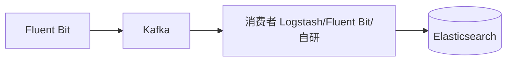

**本节不再展开** Helm 版本与 ZooKeeper/KRaft 细节（版本迭代快）。选型时自行查阅 **Kafka 官方发行说明** 与当前 **Bitnami / Strimzi** 等 Chart 的 stable 版本，并统一写进你的 GitOps 仓库；落地后在本节**留一张架构或 Topic 监控截图**即可。

---

### T9.2.11、和 T9.1 的对应关系

| T9.1 讲的概念 | T9.2 这里的落点 |
|---------------|-----------------|
| 节点级 DaemonSet 采集 | Fluent Bit DaemonSet，读本节点容器日志 |
| Sidecar | 一般**不必**为了 EFK 再额外加采集边车；业务写文件仍按 T9.1.4 处理 |
| 应用直推 | 仍可直接进 ES，与本节并行存在亦可 |

下一节 **T9.3、Loki** 会按官方 Helm 方式部署 **Loki + Promtail（+ 可选 Grafana）**；它和 EFK 是两条常见路线，按成本与查询习惯二选一即可。

## T9.3、Loki

[Grafana Loki](https://grafana.com/docs/loki/latest/) 按**标签**索引元数据，正文日志压缩成块存起来，不像传统全文检索那样给每个词建倒排索引，成本通常更友好。查询用 **LogQL**，和 **Prometheus / Grafana** 一套习惯。**采集**：官方常提 **Promtail**、**Grafana Alloy**（承接原 Grafana Agent）。本节按 **Promtail + Helm** 落地；你已在 **T9.1 / T9.2** 用的 **Fluent Bit** 也可直接输出到 Loki（[Fluent Bit Loki 输出](https://docs.fluentbit.io/manual/pipeline/outputs/loki)），不冲突。

### T9.3.1、和 ES 怎么选（大白话）

| 维度 | Loki | Elasticsearch（EFK） |
|------|------|----------------------|
| 索引侧重 | 主要索引**标签**；正文走块存储与压缩 | 常做**全文**检索，资源占用更高 |
| 查询 | **LogQL**，跟 Prom 栈对齐 | **KQL / DSL** 等，生态成熟 |
| 典型场景 | 已有 **Grafana**，想控成本、标签统一 | 强检索、复杂分析、合规检索 |

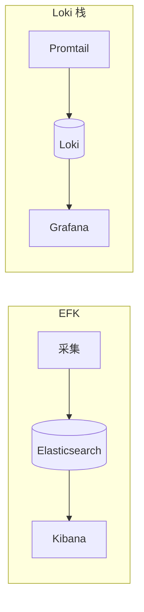

### T9.3.2、日志怎么走

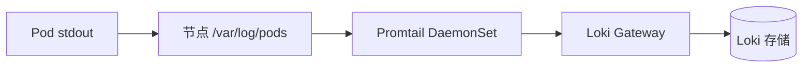

部署模式（单体 / 简单可扩展 / 微服务）见 [Deployment modes](https://grafana.com/docs/loki/latest/get-started/deployment-modes/)。**学习和小集群**用 **Monolithic**（单进程，与文档里旧名 **Single Binary** 同类）即可；上生产再接对象存储、多副本与读写拆分。

下面是 [Loki overview](https://grafana.com/docs/loki/latest/get-started/overview/) 官网同款示意图（本仓库从 [grafana/loki 文档源](https://github.com/grafana/loki/blob/main/docs/sources/get-started/loki-overview-2.png) 同步到本地，便于离线阅读）：


### T9.3.3、版本与校验

升级或排错前，对照 [Release notes](https://grafana.com/docs/loki/latest/release-notes/)、[Helm 安装](https://grafana.com/docs/loki/latest/setup/install/helm/) 与 [Chart README](https://github.com/grafana-community/helm-charts/blob/main/charts/loki/README.md)。

**本文本节校验日期：2026-04-20**

| 组件 | 版本 / 来源 | 说明 |
|------|-------------|------|
| Loki 镜像 | **3.7.1**（Chart `appVersion`，可再 pin tag） | [grafana/loki Releases](https://github.com/grafana/loki/releases)；Chart 见下 |
| Loki Helm Chart | **13.2.0**（与 `helm search repo grafana-community/loki` 一致即可） | [grafana-community/helm-charts](https://github.com/grafana-community/helm-charts) |
| Promtail Chart | `helm search repo grafana/promtail` 当前 stable | 镜像多为 `grafana/promtail` |
| Grafana Chart | `helm search repo grafana/grafana` 当前 stable | 本文用于 Explore 查日志 |

推荐用 **OCI** 装 Loki：`oci://ghcr.io/grafana-community/helm-charts/loki`。下文同时写 **HTTP 仓库**，方便内网镜像站对齐。

### T9.3.4、开工前要准备什么

与 **T9.2** 相同：组件放在 **`logging`** 命名空间；没有则先建：

```bash
kubectl create namespace logging
```

示例 **Monolithic** 打开 **MinIO** 子 Chart 时会多占 **PVC**；把 YAML 里的 **StorageClass** 换成你集群真实值（`kubectl get sc`）。**生产**请接云对象存储或自建 S3 兼容端点，不要长期把 MinIO 当唯一真源；参数见 [Helm reference](https://grafana.com/docs/loki/latest/setup/install/helm/reference/) 与 [Install monolithic](https://grafana.com/docs/loki/latest/setup/install/helm/install-monolithic/)。

### T9.3.5、装 Loki（Monolithic）

下面 **values** 对齐官方 [Install the monolithic Helm chart — Single Replica](https://grafana.com/docs/loki/latest/setup/install/helm/install-monolithic/)，额外固定 **`deploymentMode: Monolithic`**、**`-n logging`**。若 Helm 报未知字段，以 `helm show values grafana-community/loki --version 13.2.0` 为准。

将以下内容保存为 `loki-values.yaml`：

```yaml
# loki-values.yaml（学习/联调用；生产请换对象存储与高可用参数）
loki:
  commonConfig:
    replication_factor: 1
  schemaConfig:
    configs:
      - from: "2024-04-01"
        store: tsdb
        object_store: s3
        schema: v13
        index:
          prefix: loki_index_
          period: 24h
  pattern_ingester:
    enabled: true
  limits_config:
    allow_structured_metadata: true
    volume_enabled: true
  ruler:
    enable_api: true

minio:
  enabled: true

deploymentMode: Monolithic

singleBinary:
  replicas: 1

backend:
  replicas: 0
read:
  replicas: 0
write:
  replicas: 0
ingester:
  replicas: 0
querier:
  replicas: 0
queryFrontend:
  replicas: 0
queryScheduler:
  replicas: 0
distributor:
  replicas: 0
compactor:
  replicas: 0
indexGateway:
  replicas: 0
bloomPlanner:
  replicas: 0
bloomBuilder:
  replicas: 0
bloomGateway:
  replicas: 0
```

安装（**固定 Chart 小版本**，避免他人 `helm install` 时偷偷跨大版本）：

```bash
helm repo add grafana-community https://grafana-community.github.io/helm-charts
helm repo update

helm upgrade --install loki grafana-community/loki -n logging -f loki-values.yaml --version 13.2.0
```

OCI 写法（等价，镜像源更省事时可用）：

```bash
helm upgrade --install loki oci://ghcr.io/grafana-community/helm-charts/loki -n logging -f loki-values.yaml --version 13.2.0
```

查看 Pod（会包含 Loki、Gateway、缓存、MinIO 等，略等几分钟变 Running）：

```bash
kubectl get pods -n logging
```

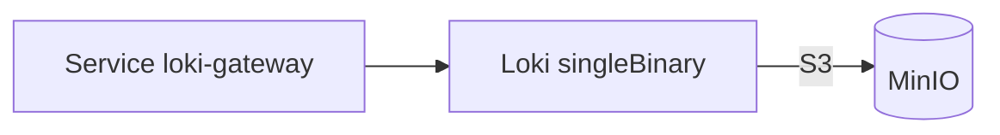

刚装完本节时，**logging** 里先有 **Gateway + Loki + MinIO**（以及 Chart 带出的缓存等）；**Promtail / Grafana** 在 **T9.3.6、T9.3.7** 再补上去。

**Helm 报错时**：先跑 `helm show values grafana-community/loki --version 13.2.0` 核对字段。个别版本示例仍写 **`deploymentMode: SingleBinary`**，与 **Monolithic** 在 [Chart Upgrading](https://github.com/grafana-community/helm-charts/blob/main/charts/loki/README.md#upgrading) 里属同一类部署，按报错二选一；跨大版本升级必须先读该章节。

### T9.3.6、装 Promtail

Promtail 走 **Grafana 官方 Helm 仓库**里的 **`grafana/promtail`**（和 **`grafana-community`** 不是同一个 `helm repo`，两个都要 add）。

客户端 URL 一般指向 **本 Release 名** 下的 Gateway。Release 名 **`loki`**、命名空间 **`logging`** 时，推送地址常为：

`http://loki-gateway.logging.svc.cluster.local/loki/api/v1/push`

```bash
helm repo add grafana https://grafana.github.io/helm-charts
helm repo update

helm upgrade --install promtail grafana/promtail -n logging \
  --set "config.clients[0].url=http://loki-gateway.logging.svc.cluster.local/loki/api/v1/push"
```

若你改了 Helm Release 名，Service 前缀会跟着变，用 `kubectl -n logging get svc` 找带 **gateway** 的那条再拼 URL。

```bash
kubectl get pods -n logging -l app.kubernetes.io/name=promtail
```

默认会挂 **`/var/log/pods`**，和 **T9.1** 说的一致。节点没有 `/var/lib/docker/containers` 时，按当前 Chart 的 `values` 删掉多余 hostPath 即可。

### T9.3.7、装 Grafana 接 Loki

只调 API 可以不用 Grafana；**日常查日志**用 **Grafana Explore** 最顺手。新建 `grafana-values.yaml`（**adminPassword 必须改掉**；生产用 **Secret** 或 SSO，勿照抄）：

```yaml
# grafana-values.yaml
adminUser: admin
adminPassword: "请改成强密码"

service:
  type: ClusterIP

datasources:
  datasources.yaml:
    apiVersion: 1
    datasources:
      - name: Loki
        type: loki
        url: http://loki-gateway.logging.svc.cluster.local
        access: proxy
        isDefault: true
```

```bash
# 若已在 T9.3.6 执行过 helm repo add grafana，则只需 helm repo update
helm upgrade --install grafana grafana/grafana -n logging -f grafana-values.yaml
```

```bash
kubectl -n logging port-forward svc/grafana 3000:80
```

浏览器访问 `http://127.0.0.1:3000`，进 **Explore**，选 **Loki**，用 **LogQL** 试查（例如 `{namespace="default"}`）。

**（插槽：此处贴本环境 Grafana Explore 查询截图，便于后来者对照 UI。）**

**T9.3.5～T9.3.7 都做完后**，命名空间里采集与查询关系可概括成：

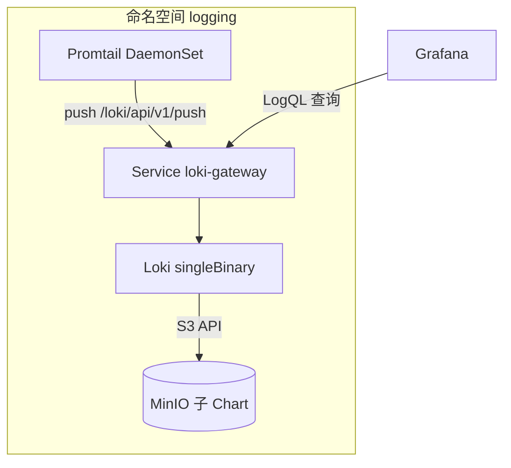

### T9.3.8、和 T9.1 / T9.2 的对应

| 上文 | 本节落点 |
|------|----------|
| **T9.1** 采集路径、Sidecar | **Promtail** 就是典型的**节点级 DaemonSet** 采集 |
| **T9.2** EFK → ES + Kibana | 本节走 **Loki + Grafana**（或只 API），两套路线二选一或按业务拆分 |
| **Fluent Bit** | 已在前面出现过；若要**只保留 Fluent Bit 推到 Loki**，按 [Loki output](https://docs.fluentbit.io/manual/pipeline/outputs/loki) 配置即可，不必再装 Promtail |

### T9.3.9、（可选）Traefik 与入口

入口用 **Traefik** 时，访问日志一般开 **access log**（多为 stdout、JSON），**Promtail** 随节点日志一并采集即可，不必为 Traefik 单独再起一套采集。具体开关以你当前的 Traefik 主版本文档为准。

**（插槽：若要大盘，可到 Grafana 官网选 Traefik 类 Dashboard 模板，导入后把 LogQL 里的 `job`、标签改名与你环境一致。）**

---

下一节 **T9.4、Promtail** 专门写 **promtail.yaml** 里的管道、打标签、过滤，和 **T9.3.6** 的安装步骤衔接。

## T9.4、Promtail

**T9.3** 里已经用 Helm 把 **Promtail** 跑起来了；本节专门讲 **promtail.yaml** 里各部分怎么写、怎么和 **Loki**、**Prometheus** 的标签对齐。你也可以不用 Promtail，改用 **Grafana Alloy** 或 **Fluent Bit** 往 Loki 推日志，概念相通。

Promtail 通过 `-config.file` 指定配置，需要展开环境变量时在进程参数中加 `-config.expand-env=true`，详见 [Promtail 配置](https://grafana.com/docs/loki/latest/clients/promtail/configuration/)。

### 配置

Promtail 是负责收集日志发送给 loki 的代理程序。Promtail 默认通过一个 `config.yaml` 文件进行配置，其中包含 Promtail 服务端信息、存储位置以及如何从文件中抓取日志等配置。

要指定加载哪个配置文件，只需要在命令行下通过 `-config.file` 参数传递 YAML 配置文件即可。此外我们还可以通过在配置文件中使用环境变量引用来设置需要的配置，但是需要在命令行中配置 `-config.expand-env=true`。

然后可以使用 `${VAR}` 来配置，其中 `VAR` 是环境变量的名称，每个变量的引用在启动时被环境变量的值替换，替换是区分大小写的，而且在 YAML 文件被解析之前发生，对未定义变量的引用将被替换为空字符串，除非你指定了一个默认值或自定义的错误文本，要指定一个默认值：

```
${VAR:default_value}
```

其中 `default_value` 是在环境变量未定义的情况下要使用的默认值。

默认的 `config.yaml` 配置文件支持的内容格式为：

```
# 配置 Promtail 服务端
[server: <server_config>]

# 描述 Promtail 如何连接到 Loki 的多个实例，向每个实例发送日志。
# WARNING：如果其中一个远程 Loki 服务器未能回应或回应时出现任何可重试的错误，这将影响其他配置的远程 Loki 服务器发送日志。
# 发送是在单线程上完成的!
# 如果你想向多个远程 Loki 实例发送，一般建议并行运行多个  promtail 客户端。
clients:
  - [<client_config>]

# 描述了如何将读取的文件偏移量保存到磁盘上
[positions: <position_config>]

# 抓取日志配置
scrape_configs:
  - [<scrape_config>]

# 配置被 watch 的目标如何 tailed
# Configures how tailed targets will be watched.
[target_config: <target_config>]
```

#### server

`server` 属性配置了 Promtail 作为 HTTP 服务器的行为。

```
# 禁用 HTTP 和 GRPC 服务
[disable: <boolean> | default = false]

# HTTP 服务监听的主机
[http_listen_address: <string>]

# HTTP 服务监听的端口（0表示随机）
[http_listen_port: <int> | default = 80]

# gRPC 服务监听主机
[grpc_listen_address: <string>]

# gRPC 服务监听的端口（0表示随机）
[grpc_listen_port: <int> | default = 9095]

# 注册指标处理器
[register_instrumentation: <boolean> | default = true]

# 优雅退出超时时间
[graceful_shutdown_timeout: <duration> | default = 30s]

# HTTP 服务读取超时时间
[http_server_read_timeout: <duration> | default = 30s]

# HTTP 服务写入超时时间
[http_server_write_timeout: <duration> | default = 30s]

# HTTP 服务空闲超时时间
[http_server_idle_timeout: <duration> | default = 120s]

# 可接收的最大 gRPC 消息大小
[grpc_server_max_recv_msg_size: <int> | default = 4194304]

# 可发送的最大 gRPC 消息大小
[grpc_server_max_send_msg_size: <int> | default = 4194304]

# 对 gRPC 调用的并发流数量的限制 (0 = unlimited)
[grpc_server_max_concurrent_streams: <int> | default = 100]

# 只记录给定严重程度或以上的信息，支持的值：[debug, info, warn, error]
[log_level: <string> | default = "info"]

# 所有 API 路由服务的基本路径(e.g., /v1/).
[http_path_prefix: <string>]

# 目标管理器检测 promtail 可读的标志，如果设置为 false 检查将被忽略
[health_check_target: <bool> | default = true]
```

#### client

`client` 属性配置了 Promtail 如何连接到 Loki 的实例。

```
# Loki 正在监听的 URL，在 Loki 中表示为 http_listen_address 和 http_listen_port
# 如果 Loki 在微服务模式下运行，这就是 Distributor 的 URL，需要包括 push API 的路径。
# 例如：http://example.com:3100/loki/api/v1/push
url: <string>

# 默认使用的租户 ID，用于推送日志到 Loki。
# 如果省略或为空，则会假设 Loki 在单租户模式下运行，不发送 X-Scope-OrgID 头。
[tenant_id: <string>]

# 发送一批日志前的最大等待时间，即使该批次日志数据未满。
[batchwait: <duration> | default = 1s]

# 在向 Loki 发送批处理之前要积累的最大批处理量（以字节为单位）。
[batchsize: <int> | default = 102400]

# 如果使用了 basic auth 认证，则需要配置用户名和密码
basic_auth:
  [username: <string>]
  [password: <string>]
  # 包含basic auth认证的密码文件
  [password_file: <filename>]

# 发送给服务器的 Bearer token
[bearer_token: <secret>]

# 包含 Bearer token 的文件
[bearer_token_file: <filename>]

# 用来连接服务器的 HTTP 代理服务器
[proxy_url: <string>]

# 如果连接到一个 TLS 服务器，配置 TLS 认证方式。
tls_config:
  # 用来验证服务器的 CA 文件
  [ca_file: <string>]
  # 发送给服务器用于客户端认证的 cert 文件
  [cert_file: <filename>]
  # 发送给服务器用于客户端认证的密钥文件
  [key_file: <filename>]
  # 验证服务器证书中的服务器名称是这个值。
  [server_name: <string>]
  # 如果为 true，则忽略由未知 CA 签署的服务器证书。
  [insecure_skip_verify: <boolean> | default = false]

# 配置在请求失败时如何重试对 Loki 的请求。
# 默认的回退周期为：
# 0.5s, 1s, 2s, 4s, 8s, 16s, 32s, 64s, 128s, 256s(4.267m)
# 在日志丢失之前的总时间为511.5s(8.5m)
backoff_config:
  # 重试之间的初始回退时间
  [min_period: <duration> | default = 500ms]
  # 重试之间的最大回退时间
  [max_period: <duration> | default = 5m]
  # 重试的最大次数
  [max_retries: <int> | default = 10]

# 添加到所有发送到 Loki 的日志中的静态标签
# 使用一个类似于 {"foo": "bar"} 的映射来添加一个 foo 标签，值为 bar
# 这些也可以从命令行中指定：
# -client.external-labels=k1=v1,k2=v2
# (或 --client.external-labels 依赖操作系统)
# 由命令行提供的标签将应用于所有在 "clients" 部分的配置。
# 注意：如果标签的键相同，配置文件中定义的值将取代命令行中为特定 client 定义的值
external_labels:
  [ <labelname>: <labelvalue> ... ]

# 等待服务器响应一个请求的最长时间
[timeout: <duration> | default = 10s]
```

#### positions

`positions` 属性配置了 Promtail 保存文件的位置，表示它已经读到了文件什么程度。当 Promtail 重新启动时需要它，以允许它从中断的地方继续读取日志。

```
# positions 文件的路径
[filename: <string> | default = "/var/log/positions.yaml"]

# 更新 positions 文件的周期
[sync_period: <duration> | default = 10s]

# 是否忽略并覆盖被破坏的 positions 文件
[ignore_invalid_yaml: <boolean> | default = false]
```

#### scrape_configs

`scrape_configs` 属性配置了 Promtail 如何使用指定的发现方法从一系列目标中抓取日志。

```
# 用于在 Promtail 中识别该抓取配置的名称。
job_name: <string>

# 描述如何对目标日志进行结构化
[pipeline_stages: <pipeline_stages>]

# 如何从 jounal 抓取日志
[journal: <journal_config>]

# 如何从 syslog 抓取日志
[syslog: <syslog_config>]

# 如何通过 Loki push API 接收日志 (例如从其他 Promtails 或 Docker Logging Driver 中获取的数据)
[loki_push_api: <loki_push_api_config>]

# 描述了如何 relabel 目标，以确定是否应该对其进行处理
relabel_configs:
  - [<relabel_config>]

# 抓取日志静态目标配置
static_configs:
  - [<static_config>]

# 包含要抓取的目标文件
file_sd_configs:
  - [<file_sd_configs>]

# 描述了如何发现在同一主机上运行的 Kubernetes 服务
kubernetes_sd_configs:
  - [<kubernetes_sd_config>]
```

#### pipeline_stages

`pipeline_stages` 用于转换日志条目和它们的标签，该管道在发现操作结束后执行，`pipeline_stages` 对象由一个阶段列表组成。

```
- [
    <docker> |
    <cri> |
    <regex> |
    <json> |
    <template> |
    <match> |
    <timestamp> |
    <output> |
    <labels> |
    <metrics> |
    <tenant>,
  ]
```

在大多数情况下，你用 `regex` 或 `json` 阶段从日志中提取数据，提取的数据被转化为一个临时的字典 Map 对象，然后这些数据是可以被 promtail 使用的，比如可以作为标签的值或作为输出。此外，除了 docker 和 cri 之外，任何其他阶段都可以访问提取的数据。在后面 `pipeline` 部分会详细介绍如何配置。

#### loki_push_api

`loki_push_api` 属性配置 Promtail 来暴露一个 [Loki push API 服务](https://grafana.com/docs/loki/latest/api#post-lokiapiv1push)。每个配置了 `loki_push_api` 的任务都会暴露这个 API，并且需要一个单独的端口。

```
# push 服务配置选项
[server: <server_config>]

# 标签映射，用于添加到发送到 push API 的每一行日志上
labels:
  [ <labelname>: <labelvalue> ... ]

# promtail 是否应该从传入的日志中传递时间戳
# 当为 false 时，promtail 将把当前的时间戳分配给日志
[use_incoming_timestamp: <bool> | default = false]
```

比如下面的配置示例，将 Promtail 作为一个 Push 接收器启动，并将接受来自其他 Promtail 实例或 `Docker Logging Dirver` 的日志。

```
server:
  http_listen_port: 9080
  grpc_listen_port: 0

positions:
  filename: /tmp/positions.yaml

clients:
  - url: http://ip_or_hostname_where_Loki_run:3100/loki/api/v1/push

scrape_configs:
  - job_name: push1
    loki_push_api:
      server:
        http_listen_port: 3500
        grpc_listen_port: 3600
      labels:
        pushserver: push1
```

注意必须提供 `job_name`，并且在多个 `loki_push_api` 与 `scrape_configs` 之间必须是唯一的，它将被用来注册监控指标。

由于一个新的服务器实例被创建，所以 `http_listen_port` 和 `grpc_listen_port` 必须与 promtail 服务器配置部分不同（除非它被禁用）。

#### relabel_configs

`Relabeling` 是一个强大的工具，可以在目标日志被抓取之前动态地重写其标签集。每个抓取配置可以配置多个 relabeling 步骤，按照它们在配置文件中出现的顺序应用于每个目标的标签集。

在 `relabeling` 之后，如果 `instance` 标签在 relabeling 的时候没有被设置，则默认设置为 `__address__` 的值，`__scheme__` 和 `__metrics_path__` 标签被分别设置为目标的协议和 metrics 指标路径。`__param_<name>` 标签被设置为第一个传递的 URL 参数 `<name>` 的值。

在 `relabeling` 阶段，以 `__meta_` 为前缀的额外标签也是可用的，它们是由提供目标的服务发现机制设置的，并且在不同的机制之间有所不同。

在目标 `relabeling` 完成后，以 `__` 开头的标签将从标签集中删除。

如果一个 `relabeling` 操作只需要临时存储一个标签值（作为后续重新标注步骤的输入），请使用 `__tmp` 标签名称前缀。

```
# 从现有标签中选择 values 值的源标签
# 它们的内容使用配置的分隔符连接起来，并与配置的正则表达式相匹配，以进行替换、保留和删除操作。
[ source_labels: '[' <labelname> [, ...] ']' ]

# 连接源标签值之间的分隔符
[ separator: <string> | default = ; ]

# 在一个 replace 替换操作后结果值被写入的标签
# 它对替换动作是强制性的，Regex 捕获组是可用的。
[ target_label: <labelname> ]

# 正则表达式，提取的值与之匹配
[ regex: <regex> | default = (.*) ]

[ modulus: <uint64> ]

Replacement 值：如果正则表达式匹配，则对其进行 regex 替换
[ replacement: <string> | default = $1 ]

# 根据正则匹配结果执行的动作
[ action: <relabel_action> | default = replace ]
```

`<regex>` 是任何有效的 `RE2` 正则表达式，它是 replace、keep、drop、labelmap、labeldrop 和 labelkeep 操作的必要条件，该正则表达式在两端都是固定的，要取消对正则的锚定，请使用 `.*<regex>.*`。

`<relabel_action>` 决定了要采取的 `relabeling` 动作：

- `replace`：将正则表达式与连接的 `source_labels` 匹配，然后设置 `target_label` 为 `replacement`，用 replacement 中的匹配组引用（${1}、${2}…）替换其值，如果正则表达式不匹配，则不会进行替换。
- `keep`：删除那些 regex 与 `source_labels` 不匹配的目标。
- `drop`：删除与 regex 相匹配的 `source_labels` 目标。
- `hashmod`：将 `target_label` 设置为 `source_labels` 的哈希值的模。
- `labelmap`：将正则表达式与所有标签名称匹配，然后将匹配的标签值复制到由 `replacement` 给出的标签名中，replacement 中的匹配组引用（${1}, ${2}, ...）由其值代替。
- `labeldrop`：将正则表达式与所有标签名称匹配，任何匹配的标签都将从标签集中删除。
- `labelkeep`：将正则表达式与所有标签名称匹配，任何不匹配的标签将被从标签集中删除。

使用 `labeldrop` 和 `labelkeep` 时必须注意，一旦标签被移除，logs 仍然是唯一的标签。

#### static_configs

`static_configs` 静态配置允许指定一个目标列表和标签集：

```
# 配置发现在当前节点上查找
# 这是 Prometheus 服务发现代码所要求的，但并不适用于Promtail，它只能查看本地机器上的文件。
# 因此，它应该只有 localhost 的值，或者可以完全移除它，Promtail 会使用 localhost 的默认值。
targets:
  - localhost

# 定义一个要抓取的日志文件和一组可选的附加标签，以应用于由__path__定义的文件日志流。
labels:
  # 要加载日志的路径，可以使用 glob 模式(e.g., /var/log/*.log).
  __path__: <string>

  # 添加的额外标签
  [ <labelname>: <labelvalue> ... ]
```

比如这里我们配置一个如下所示的静态配置：

```
server:
  http_listen_port: 9080
  grpc_listen_port: 0
positions:
  filename: /var/log/positions.yaml # 这个位置需要是可以被promtail写入的
client:
  url: http://ip_or_hostname_where_Loki_run:3100/loki/api/v1/push
# 抓取配置
scrape_configs:
  - job_name: system
    pipeline_stages:
    static_configs:
      - targets:
          - localhost
        labels:
          job: varlogs # 在 Prometheus中，job 标签对于连接指标和日志很有用
          host: yourhost # `host` 标签可以帮助识别日志来源
          __path__: /var/log/*.log # 路径匹配使用了一个第三方库: https://github.com/bmatcuk/doublestar
```

#### file_sd_config

基于文件的服务发现提供了一种更通用的方式来配置静态目标。它读取一组包含零个或多个 `<static_config>` 列表的文件。对所有定义文件的改变通过监视磁盘变化来应用。文件可以以 YAML 或 JSON 格式提供。JSON 文件必须包含一个静态配置的列表，使用这种格式。

```
[
  {
    "targets": [ "localhost" ],
    "labels": {
      "__path__": "<string>", ...
      "<labelname>": "<labelvalue>", ...
    }
  },
  ...
]
```

此外文件内容也将以指定的刷新间隔定期重新读取。在 `relabeling` 标记阶段，每个目标都有一个元标签 `__meta_filepath`，它的值被设置为被提取的目标文件路径。

```
# 从中提取目标文件的模式。
files:
  [ - <filename_pattern> ... ]

# 重新读取文件的刷新频率
[ refresh_interval: <duration> | default = 5m ]
```

其中 `<filename_pattern>` 可以是一个以 `.json`、`.yml` 或 `.yaml` 结尾的路径，最后一个路径段可以包含一个匹配任何字符序列的 `*`，例如 `my/path/tg_*.json`。

#### kubernetes_sd_config

Kubernetes SD 配置允许从 Kubernetes 的 REST API 中检索抓取的目标，并始终与集群状态保持同步。关于 Kubernetes 发现的配置选项，如下所示：

```
# Kubernetes API 地址
# 如果留空，Prometheus 将被假定在集群内运行，并将自动发现 API 服务器并使用 pod 的 CA 证书和 bearer token 文件（在 /var/run/secrets/kubernetes.io/serviceaccount/ 目录下面）
[ api_server: <host> ]

# 发现的 Kubernetes 角色
role: <role>

# 可选的认证信息
basic_auth:
  [ username: <string> ]
  [ password: <secret> ]
  [ password_file: <string> ]

[ bearer_token: <secret> ]
[ bearer_token_file: <filename> ]
[ proxy_url: <string> ]

# TLS 配置
tls_config:
  [ <tls_config> ]

# 可选的命名空间发现，如果省略，将使用所有命名空间。
namespaces:
  names:
    [ - <string> ]
```

其中 `<role>` 必须是 `endpoints`、`service`、`pod`、`node` 或 `ingress`。具体的配置使用可以完全参考 Prometheus 中的基于 Kubernetes 的发现机制，可以查看 Promtheus 自动发现配置文件：https://github.com/prometheus/prometheus/blob/main/documentation/examples/prometheus-kubernetes.yml 了解更多配置。

### pipeline

在 Promtail 中一个 pipeline 管道被用来转换一个单一的日志行、标签和它的时间戳。一个 pipeline 管道是由一组 stages 阶段组成的，在 Promtail 配置红一共有 4 种类型的 stages。

1. `Parsing stages`(解析阶段) 用于解析当前的日志行并从中提取数据，提取的数据可供其他阶段使用。
2. `Transform stages`(转换阶段) 用于对之前阶段提取的数据进行转换。
3. `Action stages`(处理阶段) 用于从以前阶段中提取数据并对其进行处理，包括：
4. 添加或修改现有日志行标签
5. 更改日志行的时间戳
6. 修改日志行内容
7. 在提取的数据基础上创建一个 metrics 指标
8. `Filtering stages`(过滤阶段) 可选择应用一个阶段的子集，或根据一些条件删除日志数据。

一个典型的 pipeline 将从解析阶段开始（如 regex 或 json 阶段）从日志行中提取数据。然后有一系列的处理阶段配置，对提取的数据进行处理。最常见的处理阶段是一个 `labels stage` 标签阶段，将提取的数据转化为标签。

需要注意的是现在 pipeline 不能用于重复的日志，例如，Loki 将多次收到同一条日志行：

- 从同一文件中读取的两个抓取配置
- 文件中重复的日志行被发送到一个 pipeline，不会做重复数据删除

然后，Loki 会在查询时对那些具有完全相同的纳秒时间戳、标签与日志内容的日志进行一些重复数据删除。

下面的配置示例可以很好地说明我们可以通过 pipeline 来对日志行数据实现什么功能：

```
scrape_configs:
  - job_name: kubernetes-pods-name
    kubernetes_sd_configs: ....
    pipeline_stages:
      # 这个阶段只有在被抓取地目标有一个标签名为 name 且值为 promtail 地时候才会执行
      - match:
          selector: '{name="promtail"}'
          stages:
            # regex 阶段解析出一个 level、timestamp 与 component，在该阶段结束时，这几个值只为 pipeline 内部设置，在以后地阶段可以使用这些值并决定如何处理他们。
            - regex:
                expression: '.*level=(?P<level>[a-zA-Z]+).*ts=(?P<timestamp>[T\d-:.Z]*).*component=(?P<component>[a-zA-Z]+)'

            # labels 阶段从前面地 regex 阶段获取 level、component 值，并将他们变成一个标签，比如 level=error 可能就是这个阶段添加地一个标签。
            - labels:
                level:
                component:

            # 最后，时间戳阶段采用从 regex 提取地 timestamp，并将其变成日志的新时间戳，并解析为 RFC3339Nano 格式。
            - timestamp:
                format: RFC3339Nano
                source: timestamp

      # 这个阶段只有在抓取的目标标签为 name，值为 nginx，并且日志行中包含 GET 字样的时候才会执行
      - match:
          selector: '{name="nginx"} |= "GET"'
          stages:
            # regex 阶段通过匹配一些值来提取一个新的 output 值。
            - regex:
                expression: \w{1,3}.\w{1,3}.\w{1,3}.\w{1,3}(?P<output>.*)

            # output 输出阶段通过将捕获的日志行设置为来自上面 regex 阶段的输出值来更改其内容。
            - output:
                source: output

      # 这个阶段只有在抓取到目标中有标签 name，值为 jaeger-agent 时才会执行。
      - match:
          selector: '{name="jaeger-agent"}'
          stages:
            # JSON 阶段将日志行作为 JSON 字符串读取，并从对象中提取 level 字段，以便在后续的阶段中使用。
            - json:
                expressions:
                  level: level

            # 将上一个阶段中的 level 值变成一个标签。
            - labels:
                level:

  - job_name: kubernetes-pods-app
    kubernetes_sd_configs: ....
    pipeline_stages:
      # 这个阶段只有在被抓取的目标的标签为 "app"，名称为grafana 或 prometheus 时才会执行。
      - match:
          selector: '{app=~"grafana|prometheus"}'
          stages:
            # regex 阶段将提取一个 level 合 componet 值，供后面的阶段使用，允许 level 被定义为 lvl=<level> 或 level=<level>，组件被定义为 logger=<component> 或 component=<component>
            - regex:
                expression: ".*(lvl|level)=(?P<level>[a-zA-Z]+).*(logger|component)=(?P<component>[a-zA-Z]+)"

            # 然后标签阶段将从上面 regex 阶段提取的 level 和 component 变为标签。
            - labels:
                level:
                component:

      # 只有当被抓取的目标有一个标签 "app"，其值为 "some-app"，并且日志行不包含 "info" 一词时，这个阶段才会执行。
      - match:
          selector: '{app="some-app"} != "info"'
          stages:
            # regex 阶段尝试通过查找日志中的 panic 来提取 panic 信息
            - regex:
                expression: ".*(?P<panic>panic: .*)"

            # metrics 阶段将增加一个 Promtail 暴露的 panic_total 指标，只有当从上面的 regex 阶段获取到 panic 值的时候，该 Counter 才会增加。
            - metrics:
                panic_total:
                  type: Counter
                  description: "total count of panic"
                  source: panic
                  config:
                    action: inc
```

下面我们先简单描述下每个阶段可以使用的数据有哪些。

- `标签集`：当前日志行的标签集合，初始化是与日志一起被抓取的标签集，标签集只由处理阶段进行修改，但过滤阶段会从中读取，最终的标签集将由 Loki 建立索引，并可用与查询。
- `提取的键值对`：在解析阶段提取的键值对集合，后续的阶段对提取的 Map 进行操作，或者对它们进行转换，或者对它们进行处理。在一个 pipeline 的末端，提取的 Map 会被丢弃掉，为了使一个解析阶段有用，它必须总要与至少一个处理阶段配对。提取的 Map 被初始化，其初始化标签是与日志行一起抓取的，这个初始数据允许在只操作提取的 Map 的 pipeline 阶段内对标签的值进行处理。例如，从文件中提取的日志条目有一个标签 filename，其值是被提取的文件路径，当一个 pipeline 执行该日志时，最初提取的 Map 将包含使用与标签相同值的文件名。
- `日志时间戳`：日志行的当前时间戳，处理阶段可以修改这个值。如果不设置，则默认为日志被抓取的时间。时间戳的最终值会发送给 Loki。
- `日志行`：当前的日志行，以文本形式表示，初始化为 Promtail 抓取的文本。处理阶段可以修改这个值。日志行的最终值将作为日志的文本内容发送给 Loki。

### 阶段

上面我们结束了 Promtail 的一个 pipeline 中有 4 中类型的阶段，下面我们再分别对这 4 中类型阶段进行简单说明。

#### 解析阶段

解析阶段包括：docker、cri、regex、json 这几个 stage。

##### docker

`docker` 阶段通过使用标签的 Docker 日志格式来解析日志数据进行数据提取。直接使用 `docker: {}` 即表示是一个 docker 阶段。

与大多数阶段不同，docker 阶段不提供配置选项，只支持特定的 Docker 日志格式，来自 Docker 的每一行日志都被写成 JSON 格式，其键值如下。

- `log`：日志行的内容
- `stream`：`stdout` 或者 `stderr`
- `time`：日志行的时间戳字符串

例如配置下面的 pipeline：

```
- docker: {}
```

将会解析 Docker 日志成如下所示格式：

```
{
  "log": "log message\n",
  "stream": "stderr",
  "time": "2019-04-30T02:12:41.8443515Z"
}
```

在提取的数据集中，将创建以下键值对：

- `output`： `log message\n`
- `stream`： `stderr`
- `timestamp`：`2019-04-30T02:12:41.8443515`

##### cri

通过使用标准 CRI 格式解析日志行来提取数据。使用语法一样是直接使用 `cri: {}` 即可，与大多数阶段不同，cri 阶段不提供配置选项，只支持特定的 CRI 日志格式。CRI 指定的日志行是以空格分隔的值，有以下组成部分：

- `log`：整个日志行的内容
- `stream`：`stdout` 或者 `stderr`
- `time`：日志行的时间戳字符串

组件之间不允许有空白，在下面的例子中，只有第一行日志可以使用 cri 阶段进行正确格式化。

```
"2019-01-01T01:00:00.000000001Z stderr P test\ngood"
"2019-01-01 T01:00:00.000000001Z stderr testgood"
"2019-01-01T01:00:00.000000001Z testgood"
```

例如配置下面的 pipeline：

```
- cri: {}
```

当我们有如下所示的日志行数据：

```
"2019-04-30T02:12:41.8443515Z stdout xx message"
```

在提取的数据集中，将创建以下键值对：

- `output`: `message`
- `stream`: `stdout`
- `timestamp`: `2019-04-30T02:12:41.8443515`

##### regex

使用正则表达式提取数据，在 regex 中命名的捕获组支持将数据添加到提取的 Map 映射中。配置格式如下所示：

```
regex:
  # RE2 正则表达式，每个捕获组必须被命名。
  expression: <string>

  # 从指定名称中提取数据，如果为空，则使用 log 信息。
  [source: <string>]
```

其中的 `expression` 是一个 [Google RE2 正则表达式](https://github.com/google/re2/wiki/Syntax)字符串，每个捕获组将被设置为到提取的 Map 中去，每个捕获组也必须命名：`(?P<name>re)`，捕获组的名称将被用作提取的 Map 中的键。

另外需要注意，在使用双引号时，必须转义正则表达式中的所有反斜杠。例如下面的几个表达式都是有效的：

- `expression: \w*`
- `expression: '\w*'`
- `expression: "\\w*"`

但是下面的这几个是无效的表达式：

- `expression: \\w*` - 在使用双引号时才转义反斜线
- `expression: '\\w*'` - 在使用双引号时才转义反斜线
- `expression: "\w*"` - 在使用双引号的时候，反斜杠必须被转义

例如我们使用下的不带 `source` 的 pipeline 配置：

```
- regex:
    expression: "^(?s)(?P<time>\\S+?) (?P<stream>stdout|stderr) (?P<flags>\\S+?) (?P<content>.*)$"
```

当我们要抓取的日志数据为：

```
2019-01-01T01:00:00.000000001Z stderr P i'm a log message!
```

该 pipeline 执行后以下键值对将被添加到提取的 Map 中去：

- `time`: `2019-01-01T01:00:00.000000001Z`
- `stream`: `stderr`
- `flags`: `P`
- `content`: `i'm a log message`

如果我们使用带上 `source` 的 pipeline 配置：

```
- json:
    expressions:
      time:
- regex:
    expression: "^(?P<year>\\d+)"
    source: "time"
```

如果需要抓取的日志数据为：

```
{ "time": "2019-01-01T01:00:00.000000001Z" }
```

则第一阶段将把以下键值对添加到提取的 Map 中：

- `time`: `2019-01-01T01:00:00.000000001Z`

而 regex 阶段将解析提取的 Map 中的时间值，并将以下键值对追加到提取的 Map 中去：

- `year`: `2019`

##### json

通过将日志行解析为 JSON 来提取数据，也可以接受 `JMESPath` 表达式来提取数据，配置格式如下所示：

```
json:
  # JMESPath 表达式的键/值对集合，键将是提取的数据中的键，而表达式将是值，被评估为来自源数据的 JMESPath。
  #
  # JMESPath 表达式可以通过用双引号来包装一个键完成，然后在 YAML 中必须用单引号包装起来，这样它们就会被传递给 JMESPath 解析器进行解析。
  expressions:
    [ <string>: <string> ... ]

  [source: <string>]
```

该阶段使用 Golang JSON 反序列化，提取的数据可以持有非字符串值，本阶段不做任何类型转换，在下游阶段将需要对这些值进行必要的类型转换，可以参考后面的 `template` 阶段了解如何进行转换。

> 注意：如果提取的值是一个复杂的类型，比如数组或 JSON 对象，它将被转换为 JSON 字符串，然后插入到提取的数据中去。

例如我们使用如下所示的 pipeline 配置：

```
- json:
    expressions:
      output: log
      stream: stream
      timestamp: time
```

要抓取的日志行数据为：

```
{
  "log": "log message\n",
  "stream": "stderr",
  "time": "2019-04-30T02:12:41.8443515Z"
}
```

在提取的数据集中，将创建以下键值对：

- `output`: `log message\n`
- `stream`: `stderr`
- `timestamp`: `2019-04-30T02:12:41.8443515`

然后我们还可以用下面的 pipeline 配置来提前数据：

```
- json:
    expressions:
      output: log
      stream: stream
      timestamp: time
      extra:
- json:
    expressions:
      user:
    source: extra
```

要抓取的日志行数据为：

```
{
  "log": "log message\n",
  "stream": "stderr",
  "time": "2019-04-30T02:12:41.8443515Z",
  "extra": "{\"user\":\"marco\"}"
}
```

第一个 json 阶段执行后将在提取的数据集中创建以下键值对：

- `output`: `log message\n`
- `stream`: `stderr`
- `timestamp`: `2019-04-30T02:12:41.8443515`
- `extra`: `{"user": "marco"}`

然后经过第二个 json 阶段执行后将把提取数据中的 extra 值解析为 JSON，并将以下键值对添加到提取的数据集中：

- `user`: `marco`

此外我们还可以使用 JMESPath 表达式来解析有特殊字符的 JSON 字段（比如 `@` 或 `.`），比如我们现在有如下所示的 pipeline 配置：

```
- json:
    expressions:
      output: log
      stream: '"grpc.stream"'
      timestamp: time
```

需要抓取的日志数据如下所示：

```
{
  "log": "log message\n",
  "grpc.stream": "stderr",
  "time": "2019-04-30T02:12:41.8443515Z"
}
```

在提取的数据集中，将创建以下键值对。

- `output`: `log message\n`
- `stream`: `stderr`
- `timestamp`: `2019-04-30T02:12:41.8443515`

需要注意的是在引用 `grpc.stream` 时，如果没有用单引号包裹的双引号，将无法正常工作。

#### 转换阶段

转换阶段用于对之前阶段提取的数据进行转换。

##### multiline

多行阶段将多行日志进行合并，然后再将其传递到 pipeline 的下一个阶段。

一个新的日志块由**第一行正则表达式**来识别，任何与表达式不匹配的行都被认为是前一个匹配块的一部分。配置格式如下所示：

```
multiline:
  # RE2 正则表达式，如果匹配将开始一个新的多行日志块
  # 这个表达式必须被提供
  firstline: <string>

  # 解析的最大等待时间（Go duration）: https://golang.org/pkg/time/#ParseDuration.
  # 如果在这个最大的等待时间内没有新的日志，那么当前日志块将被继续发送。
  # 如果被观察的应用程序因为异常而down掉了，该参数很有用，没有新的日志出现，并且异常块会在最大等待时间过后发送
  # 默认为 3s
  max_wait_time: <duration>

  # 一个多行日志块有的最大行数，如果该块有更多的行，就会认为是新的日志行
  # 默认为 128 行
  max_lines: <integer>
```

比如现在我们有一个 flask 应用，下面的日志数据包含异常信息：

```
[2020-12-03 11:36:20] "GET /hello HTTP/1.1" 200 -
[2020-12-03 11:36:23] ERROR in app: Exception on /error [GET]
Traceback (most recent call last):
  File "/home/pallets/.pyenv/versions/3.8.5/lib/python3.8/site-packages/flask/app.py", line 2447, in wsgi_app
    response = self.full_dispatch_request()
  File "/home/pallets/.pyenv/versions/3.8.5/lib/python3.8/site-packages/flask/app.py", line 1952, in full_dispatch_request
    rv = self.handle_user_exception(e)
  File "/home/pallets/.pyenv/versions/3.8.5/lib/python3.8/site-packages/flask/app.py", line 1821, in handle_user_exception
    reraise(exc_type, exc_value, tb)
  File "/home/pallets/.pyenv/versions/3.8.5/lib/python3.8/site-packages/flask/_compat.py", line 39, in reraise
    raise value
  File "/home/pallets/.pyenv/versions/3.8.5/lib/python3.8/site-packages/flask/app.py", line 1950, in full_dispatch_request
    rv = self.dispatch_request()
  File "/home/pallets/.pyenv/versions/3.8.5/lib/python3.8/site-packages/flask/app.py", line 1936, in dispatch_request
    return self.view_functions[rule.endpoint](**req.view_args)
  File "/home/pallets/src/deployment_tools/hello.py", line 10, in error
    raise Exception("Sorry, this route always breaks")
Exception: Sorry, this route always breaks
[2020-12-03 11:36:23] "GET /error HTTP/1.1" 500 -
[2020-12-03 11:36:26] "GET /hello HTTP/1.1" 200 -
[2020-12-03 11:36:27] "GET /hello HTTP/1.1" 200 -
```

显然我们更希望将上面的 Exception 多行日志识别为一个日志块，在这个示例中，所有的日志块都是括号包括的时间开始的，所以我们可以用 `firstline` 正则表达式：`^\[\d{4}-\d{2}-\d{2} \d{1,2}:\d{2}:\d{2}\]` 来配置一个多行阶段，这将匹配上面我们的异常日志的开头部分，但是不会匹配后面的异常行，直到 `Exception: Sorry, this route always breaks` 这一行日志，这些将被识别为单个日志块，在 Loki 中也是以一个日志条目出现的。

```
multiline:
  # 识别时间戳作为多行日志的第一行，注意这里字符串应该使用单引号。
  firstline: '^\[\d{4}-\d{2}-\d{2} \d{1,2}:\d{2}:\d{2}\]'

  max_wait_time: 3s
```

这个示例是假设我们对日志格式没有进行控制，所以我们需要一个更复杂的正则表达式来匹配第一行日志，但是如果我们能够控制被观察的日志格式，那么我们就可以简化第一行的匹配规则。

下面的是一个简单的 `Akka HTTP` 服务的日志：

```
[2021-01-07 14:17:43,494] [DEBUG] [akka.io.TcpListener] [HelloAkkaHttpServer-akka.actor.default-dispatcher-26] [akka://HelloAkkaHttpServer/system/IO-TCP/selectors/$a/0] - New connection accepted
[2021-01-07 14:17:43,499] [ERROR] [akka.actor.ActorSystemImpl] [HelloAkkaHttpServer-akka.actor.default-dispatcher-3] [akka.actor.ActorSystemImpl(HelloAkkaHttpServer)] - Error during processing of request: 'oh no! oh is unknown'. Completing with 500 Internal Server Error response. To change default exception handling behavior, provide a custom ExceptionHandler.
java.lang.Exception: oh no! oh is unknown
    at com.grafana.UserRoutes.$anonfun$userRoutes$6(UserRoutes.scala:28)
    at akka.http.scaladsl.server.Directive$.$anonfun$addByNameNullaryApply$2(Directive.scala:166)
    at akka.http.scaladsl.server.ConjunctionMagnet$$anon$2.$anonfun$apply$3(Directive.scala:234)
    at akka.http.scaladsl.server.directives.BasicDirectives.$anonfun$mapRouteResult$2(BasicDirectives.scala:68)
    at akka.http.scaladsl.server.directives.BasicDirectives.$anonfun$textract$2(BasicDirectives.scala:161)
    at akka.http.scaladsl.server.RouteConcatenation$RouteWithConcatenation.$anonfun$$tilde$2(RouteConcatenation.scala:47)
    at akka.http.scaladsl.util.FastFuture$.strictTransform$1(FastFuture.scala:40)
  ...
```

简单一看和其他日志一样，我们来看看日志的格式：

```
<configuration>
    <appender name="FILE" class="ch.qos.logback.core.FileAppender">
        <file>crasher.log</file>
        <append>true</append>
        <encoder>
            <pattern>&ZeroWidthSpace;[%date{ISO8601}] [%level] [%logger] [%thread] [%X{akkaSource}] - %msg%n</pattern>
        </encoder>
    </appender>

    <appender name="ASYNC" class="ch.qos.logback.classic.AsyncAppender">
        <queueSize>1024</queueSize>
        <neverBlock>true</neverBlock>
        <appender-ref ref="STDOUT" />
    </appender>

    <root level="DEBUG">
        <appender-ref ref="ASYNC"/>
    </root>

</configuration>
```

对于 Logback 配置来说，没有什么特别之处，除了在每个日志行的开头有一个 ``，这是零宽度空格的 HTML 代码，它使得识别第一行变得更加简单了，这里我们使用的第一行匹配正则表达式为：`\x{200B}\[`，`200B` 是零宽度空格字符的 Unicode 编码：

```
multiline:
  # 将零宽度的空格确定为多行块的第一行，注意该字符串应使用单引号。
  firstline: '^\x{200B}\['

  max_wait_time: 3s
```

##### template

`template` 阶段可以使用 [Go 模板语法](https://golang.org/pkg/text/template/)来操作提取的数据。模板阶段主要用于在将数据设置为标签之前对其他阶段的数据进行操作，例如用下划线替换空格，或者将大写的字符串转换为小写的字符串。模板也可以用来构建具有多个键的信息。模板阶段也可以在提取的数据中创建新的键。

配置格式如下所示：

```
template:
  # 要解析的提取数据中的名称，如果提前数据中的key不存在，将为其添加一个新的值
  source: <string>

  # 使用的 Go 模板字符串。 除了正常的模板之外
  # functions, ToLower, ToUpper, Replace, Trim, TrimLeft, TrimRight,
  # TrimPrefix, TrimSuffix, and TrimSpace 都是可以使用的函数。
  template: <string>s
```

比如下面的 pipeline 配置：

```
- template:
    source: new_key
    template: "hello world!"
```

假如还没有任何数据被添加到提取的数据中，这个阶段将首先在提取的数据 Map 中添加一个空白值的 `new_key`，然后它的值将被设置为 `hello world!`。

在看下面的模板阶段配置：

```
- template:
    source: app
    template: "{{ .Value }}_some_suffix"
```

这个 pipeline 在现有提取的数据中获取键为 app 的值，并将 `_som_suffix` 附加到值后面。例如，如果提前的数据 Map 的键为 app，值为 loki，那么这个阶段将把值从 loki 修改为 `loki_som_suffix`。

```
- template:
    source: app
    template: "{{ ToLower .Value }}"
```

这个 pipeline 从提取的数据中获取键为 app 的值，并将其值转换为小写。例如，如果提取的数据键 app 的值为 LOKI，那么这个阶段将把值转换为小写的 loki。

```
- template:
    source: output_msg
    template: "{{ .level }} for app {{ ToUpper .app }}"
```

这个 pipeline 从提取的数据中获取 `level` 与 `app` 的值，一个新的 `output_msg` 将被添加到提取的数据中，值为上面模板的计算结果。

例如，如果提取的数据中包含键为 app，值为 loki 的数据，level 的值为 warn，那么经过该阶段后会添加一个新的数据，键为 `output_msg`，其值为 `warn for app LOKI`。

任何先前提取的键都可以在模板中使用，所有提取的键都可用于模板的扩展。

```
- template:
    source: app
    template: "{{ .level }} for app {{ ToUpper .Value }} in module {{.module}}"
```

上面的这个 pipeline 从提取的数据中获取 level、app 合 module 值。例如，如果提取的数据包含值为 loki 的 app，level 的值为 warn，moudule 的值为 test，则这个阶段会将提取数据 app 的值更改为 `warn for app LOKI in module test`。

任何之前获取的键都可以在模板中使用，此外，如果 `source` 是可用的，它可以在模板中被称为 `.Value`，我们这里 app 被当成了 source，所以它可以在模板中通过 `.Value` 使用。

```
- template:
    source: app
    template: '{{ Replace .Value "loki" "blokey" 1 }}'
```

这里的模板使用 Go 的 `string.Replace`函数，当模板执行时，从提取的 Map 数据中的键为 app 的全部内容将最多有 1 个 loki 的实例被改为 blokey。

另外有一个名为 `Entry` 的特殊键可以用来引用当前行，当你需要追加或预设日志行的时候，这应该会很有用。

```
- template:
    source: message
    template: "{{.app }}: {{ .Entry }}"
- output:
    source: message
```

例如，上面的片段会在日志行前加上应用程序的名称。

> 在 Loki2.3 中，所有的 [sprig 函数](http://masterminds.github.io/sprig/)都被添加到了当前的模板阶段，包括 ToLower & ToUpper、Replace、Trim、Regex、Hash 和 Sha2Hash 函数。

#### 处理阶段

用于从以前阶段中提取数据并对其进行处理。

##### timestamp

设置日志条目的时间戳值，当时间戳阶段不存在时，日志行的时间戳默认为日志条目被抓取的时间。

配置格式如下所示：

```
timestamp:
  source: <string>

  # 解析时间字符串的格式，可以只有预定义的格式有：[ANSIC UnixDate RubyDate RFC822
  # RFC822Z RFC850 RFC1123 RFC1123Z RFC3339 RFC3339Nano Unix
  # UnixMs UnixUs UnixNs].
  format: <string>

  # 如果格式无法解析，可尝试的 fallback 的格式
  [fallback_formats: []<string>]

  # IANA 时区数据库字符串
  [location: <string>]

  # 在时间戳无法提取或解析的情况下，应采取何种行动。有效值为：[skip, fudge]，默认为 fudge。
  [action_on_failure: <string>]
```

其中的 `format` 字段可以参考格式如下所示：

- `ANSIC`: `Mon Jan \_2 15:04:05 2006`
- `UnixDate`: `Mon Jan_2 15:04:05 MST 2006`
- `RubyDate`: `Mon Jan 02 15:04:05 -0700 2006`
- `RFC822`: `02 Jan 06 15:04 MST`
- `RFC822Z`: `02 Jan 06 15:04 -0700`
- `RFC850`: `Monday, 02-Jan-06 15:04:05 MST`
- `RFC1123`: `Mon, 02 Jan 2006 15:04:05 MST`
- `RFC1123Z`: `Mon, 02 Jan 2006 15:04:05 -0700`
- `RFC3339`: `2006-01-02T15:04:05-07:00`
- `RFC3339Nano`: `2006-01-02T15:04:05.999999999-07:00`

另外支持常见的 Unix 时间戳：

- `Unix`: 1562708916 or with fractions 1562708916.000000123
- `UnixMs`: 1562708916414
- `UnixUs`: 1562708916414123
- `UnixNs`: 1562708916000000123

自定义格式是直接传递格 GO 的 `time.Parse` 函数中的 layout 参数，如果自定义格式没有指定 year，Promtail 会认为应该使用系统时钟的当前年份。

自定义格式使用的语法是使用时间戳的每个组件的特定值来定义日期和时间（例如 Mon Jan 2 15:04:05 -0700 MST 2006），下表显示了应在自定义格式中支持的参考值。


`action_on_failure` 设置定义了在提取的数据中不存在 `source` 字段或时间戳解析失败的情况下，应该如何处理，支持的动作有：

- `fudge（默认）`：将时间戳更改为最近的已知时间戳，总计 1 纳秒（以保证日志顺序）
- `skip`：不改变时间戳，保留日志被 Promtail 抓取的时间

比如使用下面的 pipeline 配置：

```
- timestamp:
    source: time
    format: RFC3339Nano
```

经过上面的 timestamp 阶段在提取的数据中查找一个 time 字段，并以 `RFC3339Nano` 格式化其值（例如，2006-01-02T15:04:05.9999999-07:00），所得的时间值将作为时间戳与日志行一起发送给 Loki。

##### output

设置日志行文本，配置格式如下所示：

```
output:
  source: <string>
```

比如我们有一个如下配置的 pipeline：

```
- json:
    expressions:
      user: user
      message: message
- labels:
    user:
- output:
    source: message
```

需要收集的日志为：

```
{ "user": "alexis", "message": "hello, world!" }
```

在经过第一个 json 阶段后将提前以下键值对到数据中：

- `user`: `alexis`
- `message`: `hello, world!`

然后第二个 label 阶段将把 `user=alexis` 添加到输出的日志标签集中，最后的 output 阶段将把日志数据从原来的 JSON 更改为 message 的值 `hello, world!` 输出。

##### labels

更新日志的标签集，并一起发送给 Loki。配置格式如下所示：

```
labels:
  # Key 是必须的，是将被创建的标签名称。
  # Values 是可选的，提取的数据中的名称，其值将被用于标签的值。
  # 如果是空的，值将被推断为与键相同。
  [ <string>: [<string>] ... ]
```

比如我们有一个如下所示的 pipeline 配置：

```
- json:
    expressions:
      stream: stream
- labels:
    stream:
```

需要处理的日志数据为：

```
{
  "log": "log message\n",
  "stream": "stderr",
  "time": "2019-04-30T02:12:41.8443515Z"
}
```

第一个 json 阶段将提取 `stream` 到 Map 数据中，其值为 `stderr`。然后在第二个 labels 阶段将把这个键值对变成一个标签，在发送到 Loki 的日志行中将包括标签 `stream`，值为 `stderr`。

##### metrics

根据提取的数据计算指标。需要注意的是，创建的 metrics 指标不会被推送到 Loki，而是通过 Promtail 的 `/metrics` 端点暴露出去，Prometheus 应该被配置为可以抓取 Promtail 的指标，以便能够检索这个阶段所配置的指标数据。

配置格式如下所示：

```
# 一个映射，key为metric的名称，value是特定的metric类型
metrics:
  [<string>: [ <metric_counter> | <metric_gauge> | <metric_histogram> ] ...]
```

- **metric_counter**：定义一个 Counter 类型的指标，其值只会不断增加。
- **metric_gauge**：定义一个 Gauge 类型的指标，其值可以增加或减少。
- **metric_histogram**：定义一个直方图指标。

比如我们有一个如下所示的 pipeline 配置用于定义一个 Counter 指标：

```
- metrics:
    log_lines_total:
      type: Counter
      description: "total number of log lines"
      prefix: my_promtail_custom_
      max_idle_duration: 24h
      config:
        match_all: true
        action: inc
    log_bytes_total:
      type: Counter
      description: "total bytes of log lines"
      prefix: my_promtail_custom_
      max_idle_duration: 24h
      config:
        match_all: true
        count_entry_bytes: true
        action: add
```

这个流水线先创建了一个 `log_lines_total` 的 Counter，通过使用 `match_all: true` 参数为每一个接收到的日志行增加。

然后还创建了一个 `log_bytes_total` 的 Counter 指标，通过使用 `count_entry_bytes: true` 参数，将收到的每个日志行的字节大小加入到指标中。

这两个指标如果没有收到新的数据，将在 24h 后小时。另外这些阶段应该放在 pipeline 的末端，在任何标签阶段之后。

```
- regex:
    expression: "^.*(?P<order_success>order successful).*$"
- metrics:
    successful_orders_total:
      type: Counter
      description: "log lines with the message `order successful`"
      source: order_success
      config:
        action: inc
```

比如上面这个 pipeline 首先尝试在日志中找到成功的订单，将其提取为 `order_success` 字段，然后在 metrics 阶段创建一个名为 `successful_orders_total` 的 Counter 指标，其值是在只有提取的数据中有 `order_success` 的时候才会增加。这个 pipeline 的结果是一个指标，其值只有在 Promtail 抓取的日志中带有 `order successful` 文本的日志时才会增加。

```
- regex:
    expression: "^.* order_status=(?P<order_status>.*?) .*$"
- metrics:
    successful_orders_total:
      type: Counter
      description: "successful orders"
      source: order_status
      config:
        value: success
        action: inc
    failed_orders_total:
      type: Counter
      description: "failed orders"
      source: order_status
      config:
        value: fail
        action: inc
```

上面这个 pipeline 首先会尝试在日志中找到格式为 `order_status=<value>` 的文本，将 `<value>` 提取到 `order_status` 中。该指标阶段创建了 `successful_orders_total` 和 `failed_orders_total` 指标，只有当提取数据中的 `order_status` 的值分别为 `success` 或 `fail` 时才会增加。

##### tenant

设置日志要使用的租户 ID 值，从提取数据中的一个字段获取，如果该字段缺失，将使用默认的 Promtail 客户端租户 ID。配置格式如下所示：

```
tenant:
  # source 或 value 配置选项是必须的，但二者不能同时使用（它们是互斥的）
  [ source: <string> ]

  # 当前阶段执行时用来设置租户 ID 的值。
  # 当这个阶段被包含在一个带有 "match" 的条件管道中时非常有用。
  [ value: <string> ]
```

比如我们有如下所示的 pipeline 配置：

```
pipeline_stages:
  - json:
      expressions:
        customer_id: customer_id
  - tenant:
      source: customer_id
```

需要获取的日志数据为：

```
{
  "customer_id": "1",
  "log": "log message\n",
  "stream": "stderr",
  "time": "2019-04-30T02:12:41.8443515Z"
}
```

第一个 json 阶段将提取 `customer_id` 的值到 Map 中，值为 1。在第二个租户阶段将把 `X-Scope-OrgID` 请求 Header 头（Loki 用来识别租户）设置为提取的 `customer_id` 的值，也就是 1.

另外一种场景是用配置的值来覆盖租户 ID，如下所示的 pipeline 配置：

```
pipeline_stages:
  - json:
      expressions:
        app:
        message:
  - labels:
      app:
  - match:
      selector: '{app="api"}'
      stages:
        - tenant:
            value: "team-api"
  - output:
      source: message
```

需要收集的日志数据为：

```
{
  "app": "api",
  "log": "log message\n",
  "stream": "stderr",
  "time": "2019-04-30T02:12:41.8443515Z"
}
```

这个 pipeline 将：

- Decode JSON 日志
- 设置标签 `app="api"`
- 处理匹配阶段，检查 `{app="api"}` 选择器是否匹配，如果匹配了则执行子阶段，也就是这里的租户阶段，覆盖值为 `"team-api"` 的租户。

此外在处理阶段还有 `labeldrop` 阶段，它从标签集中删除标签，这些标签与日志条目一起被发送到 Loki。还有一个 `labelallow` 阶段，它只允许将所提供的标签包含在与日志条目一起发送给 Loki 的标签集中。

#### 过滤阶段

可选择应用一个阶段的子集，或根据一些条件删除日志数据。

##### match

当一个日志条目与可配置的 LogQL 流选择器和过滤表达式相匹配时，有条件地应用一组阶段或删除日志数据。配置语法格式如下所示：

```
match:
  # LogQL 流选择器合过滤表达式。
  selector: <string>

  # pipeline 名称，当定义的时候，在 pipeline_duration_seconds 直方图中创建一个额外的标签，该值与 job_name 使用下划线连接。
  [pipeline_name: <string>]

  # 决定当选择器与日志行匹配时采取什么动作。
  # 默认是 keep，当设置为 drop 时，日志将被删除，以后的指标将不会被记录。
  [action: <string> | default = "keep"]

  # 如果你指定了 `action: drop` 那么 `logentry_dropped_lines_total` 这个指标将为每一个被丢弃的行而增加
  # 默认情况下，reaseon 标签是 `match_stage`，但是你可以选择指定一个自定义值用于该指标的 `reason` 标签。

  [drop_counter_reason: <string> | default = "match_stage"]

  # 只有当选择器与日志的标签相匹配时，才会出现嵌套的流水线阶段：
  stages:
    - [
        <regex_stage>
        <json_stage> |
        <template_stage> |
        <match_stage> |
        <timestamp_stage> |
        <output_stage> |
        <labels_stage> |
        <metrics_stage> |
        <tenant_stage>
      ]
```

比如我们现在有一个如下所的 pipeline 配置：

```
pipeline_stages:
  - json:
      expressions:
        app:
  - labels:
      app:
  - match:
      selector: '{app="loki"}'
      stages:
        - json:
            expressions:
              msg: message
  - match:
      pipeline_name: "app2"
      selector: '{app="pokey"}'
      action: keep
      stages:
        - json:
            expressions:
              msg: msg
  - match:
      selector: '{app="promtail"} |~ ".*noisy error.*"'
      action: drop
      drop_counter_reason: promtail_noisy_error
  - output:
      source: msg
```

要处理的日志数据为：

```
{ "time":"2012-11-01T22:08:41+00:00", "app":"loki", "component": ["parser","type"], "level" : "WARN", "message" : "app1 log line" }
{ "time":"2012-11-01T22:08:41+00:00", "app":"promtail", "component": ["parser","type"], "level" : "ERROR", "message" : "foo noisy error" }
```

第一个 json 阶段将在第一个日志行的提取 Map 数据中添加值 `app=loki`，然后经过第二个 labels 阶段将 `app` 转换成一个标签。对于第二行日志也遵循同样的流程，只是值变成了 `promtail`。

然后在第三个 match 阶段使用 LogQL 表达式 `{app="loki"}` 进行匹配，只有在标签 `app=loki` 的时候才会执行嵌套 json 阶段，这里合我们的第一行日志是匹配的，然后嵌套的 json 阶段将 `message` 数据提取到 Map 数据中，key 变成了 `msg`，值为 `app1 log line`。

接下来执行第四个 match 阶段，需要匹配 `app="pokey"`，很显然这里我们都不匹配，所以嵌套的 json 子阶段不会被执行。

然后执行的第五个 match 阶段，将会删掉任何具有 `app="promtail"` 标签并包括 `noisy error` 文本的日志数据，并且还将增加 `logentry_drop_lines_total` 指标，标签为 `reason="promtail_noisy_error"`。

最后的 output 输出阶段将日志行的内容改为提取数据中的 msg 的值。我们这里的示例最后输出为 `app1 log line`。

##### drop

drop 阶段可以让我们根据配置来删除日志。需要注意的是，如果你提供多个选项配置，它们将被视为 `AND` 子句，其中每个选项必须为真才能删除日志。如果你想用一个 `OR`子句来删除，那么就指定多个删除阶段。配置语法格式如下所示：

```
drop:
  [source: <string>]

  # RE2 正则表达式，如果提供了 source，则会尝试匹配 source
  # 如果没有提供 source，则会尝试匹配日志行数据
  # 如果提供的正则匹配了日志行或者 source，则该行日志将被删除。
  [expression: <string>]

  # 只有在指定 source 源的情况下才能指定 value 值。
  # 指定 value 与 regex 是错误的。
  # 如果提供的值与`source`完全匹配，该行将被删除。
  [value: <string>]

  # older_than 被解析为 Go duration 格式
  # 如果日志行的时间戳大于当前时间减去所提供的时间，则将被删除
  [older_than: <duration>]

  # longer_than 是一个以 bytes 为单位的值，任何超过这个值的日志行都将被删除。
  # 可以指定为整数格式的字节数：8192，或者带后缀的 8kb
  [longer_than: <string>|<int>]

  # 每当一个日志行数据被删除，指标 `logentry_dropped_lines_total` 都会增加。
  # 默认的 reason 标签是 `drop_stage`，然而你可以选择指定一个自定义值，用于该指标的 "reason" 标签。
  [drop_counter_reason: <string> | default = "drop_stage"]
```

比如我们有一个如下所示的简单 drop 阶段配置：

```
- drop:
    expression: ".*debug.*"
```

该阶段将删除任何带有 `debug` 字样的日志行。

如果是下面的配置示例：

```
- json:
    expressions:
      level:
      msg:
- drop:
    source: "level"
    expression: "(error|ERROR)"
```

则下面的日志数据都将被删除：

```
{"time":"2019-01-01T01:00:00.000000001Z", "level": "error", "msg":"11.11.11.11 - "POST /loki/api/push/ HTTP/1.1" 200 932 "-" "Mozilla/5.0 (Windows; U; Windows NT 5.1; de; rv:1.9.1.7) Gecko/20091221 Firefox/3.5.7 GTB6"}
{"time":"2019-01-01T01:00:00.000000001Z", "level": "ERROR", "msg":"11.11.11.11 - "POST /loki/api/push/ HTTP/1.1" 200 932 "-" "Mozilla/5.0 (Windows; U; Windows NT 5.1; de; rv:1.9.1.7) Gecko/20091221 Firefox/3.5.7 GTB6"}
```

然后使用下面的配置来删除老的日志数据：

```
- json:
    expressions:
      time:
      msg:
- timestamp:
    source: time
    format: RFC3339
- drop:
    older_than: 24h
    drop_counter_reason: "line_too_old"
```

> 需要注意的是为了让 `old_than` 发挥作用，你必须在应用 drop 阶段之前，使用时间戳阶段来设置抓取日志行的时间戳。

比如当前的摄取时间为 `2021-05-01T12:00:00Z`，当从文件中读取时，会删除这个日志行：

```
{"time":"2021-05-01T12:00:00Z", "level": "error", "msg":"11.11.11.11 - "POST /loki/api/push/ HTTP/1.1" 200 932 "-" "Mozilla/5.0 (Windows; U; Windows NT 5.1; de; rv:1.9.1.7) Gecko/20091221 Firefox/3.5.7 GTB6"}
```

但是下面的日志数据不会被删除：

```
{"time":"2021-05-03T12:00:00Z", "level": "error", "msg":"11.11.11.11 - "POST /loki/api/push/ HTTP/1.1" 200 932 "-" "Mozilla/5.0 (Windows; U; Windows NT 5.1; de; rv:1.9.1.7) Gecko/20091221 Firefox/3.5.7 GTB6"}
```

在这个例子中，当前时间是 ``2021-05-03T16:00:00Z`，`older_than`是 24h。所有时间戳超过`2021-05-02T16:00:00Z` 的日志行都将被删除。

这个删除阶段删除的所有行也将增加 `logentry_drop_lines_total` 指标，并标明原因为 `"line_too_old"`。

下面是另外一个复杂点的配置：

```
- json:
    expressions:
      time:
      msg:
- timestamp:
    source: time
    format: RFC3339
- drop:
    older_than: 24h
- drop:
    longer_than: 8kb
- drop:
    source: msg
    regex: ".*trace.*"
```

上面的 pipeline 执行后将删除掉所有超过 24 小时**或者**超过 8kb 的日志**或者** json 的 msg 值中包含 `trace` 字样的日志。

### Scraping

Promtail 可以通过 YAML 文件中的 `scrape_configs` 配置来自动发现日志文件并从中提取标签，该语法与 Promtheus 中的配置比较类似。

`scrape_configs` 包含一个或多个配置条目，会对每个发现的目标执行日志抓取任务。

```
scrape_configs:
  - job_name: local
    static_configs:
      - ...

  - job_name: kubernetes
    kubernetes_sd_config:
      - ...
```

但是需要注意如果有一个以上的抓取配置与你的日志匹配了，那么可能会得到重复的日志数据，因为日志是在不同的流中发送的，可能会有不同的标签。

Promtail 中存在几种不同类型的标签：

- 以`__`(两个下划线)开头的标签是**内部标签**，它们通常来自动态数据源，比如服务发现。一旦重新打上标签，它们就会从标签集中删除，如果要保留内部标签发送到 Loki，请重新命名它们，使它们不以 `__` 开头，可以参考下面的 `Relabeling` 部分配置。
- 以 `__meta_kubernetes_pod_label_*` 开头的标签是**元标签**，是根据你的 Kubernetes Pod 的标签生成的。比如你的有一个 Pod 的标签名称是 `foobar`，那么 `scrape_configs` 部分将收到一个名为 `__meta_kubernetes_pod_label_name` 的内部标签，值会被设置为 `foobar`。
- 其他 `__meta_kubernetes_*` 开头的标签是基于其他 Kubernetes 元数据生成的，比如 Pod 的命名空间（`__meta_kubernetes_namespace`）或 Pod 内部的容器名称（`__meta_kubernetes_pod_container_name`）等等，关于 Kubernetes 元标签的完整列表，可以参考 [Prometheus 文档](https://prometheus.io/docs/prometheus/latest/configuration/configuration/#kubernetes_sd_config)的说明，因为这二者实现方式是一致的。
- `__path__` 标签是一个特殊的标签，Promtail 在发现后使用它来计算要读取的文件位置，允许使用通配符，例如 `/var/log/*.log` 用于获取指定目录中所有带有 log 扩展名的文件，而 `/var/log/**/*.log` 用于递归匹配文件与目录。
- 在 `__path__` 中找到的每个文件都会添加文件名标签，以确保日志流的唯一性，它被设置为该行被读取的文件的绝对路径。

Promtail 可以使用 Kubernetes API 来发现作为目标的 Pod，但需要注意它**只能与 Promtail 运行在同一个节点上的 Pod 中读取日志**，Promtail 会在每个目标中查询一个 `__host__` 标签，并验证它是否与 Promtail 的主机名相同。

所以任何时候使用 Kubernetes 服务发现，都必须有一个 `relabel_config` 配置，从 `__meta_kubernetes_pod_node_name` 元标签创建一个中间的 `__host__` 标签。

```
relabel_configs:
  - source_labels: ["__meta_kubernetes_pod_node_name"]
    target_label: "__host__"
```

#### Relabeling

`Relabeling` 表示修改 labels 标签：添加、修改或删除。我们可以通过 `scrape_configs` 中的 `relabel_configs` 来进行 Relabel 操作。由于采用的与 Prometheus 一样的 Relabel 机制，所以操作方式与 Prometheus 是一致的。

**正则表达式**

- Prometheus 使用 `RE2` 正则表达式
- 固定的：正则表达式 `bar` 不会匹配 `foobar`
- `.*bar.*` 则不固定
- 也可以使用捕获组：`(.*)bar` 针对 `foobar` 会创建一个 `$1` 的变量，它的值是 `foo`

**正则示例**

- `prom|alert` 将会匹配 `prom` 与 `alert`
- `201[78]` 将匹配 `2017` 与 `2018`
- `promcon(20.+)` 将匹配 `promcon2020`、`promcon20xx` 等等，如果是 `promcon2018`，则 `$1` 的值为 `2018`。

`relabel_configs` 中我们可以通过配置一个 drop 操作来拒绝目标：如果标签值与指定的正则表达式匹配则被 drop 掉。当一个目标被 drop 掉，拥有的 `scrape_config` 将不会处理来自该特定来源的日志，其他没有 drop 动作的 `scrape_configs` 从同一目标读取的日志仍然可以使用并转发给 Loki。

`relabel_configs` 的一个常见用例就是将一个内部标签如 `__meta_kubernetes_*` 转换为一个中间的内部标签如 `__service__`，然后这个中间的内部标签可以根据 value 值被 drop 掉，或者转化为最终的外部标签，如 `__job__`。

**示例**

如果一个标签（例子中的 `__service__`）为空，则放弃抓取目标：

```
- action: drop
    regex: ''
    source_labels:
    - __service__
```

如果任何一个 `source_labels` 标签包含一个值，则删除抓取目标：

```
- action: drop
    regex: .+
    separator: ''
    source_labels:
    - __meta_kubernetes_pod_label_name
    - __meta_kubernetes_pod_label_app
```

通过重命名一个内部标签来持久化，这样它就会被发送到 Loki：

```
- action: replace
    source_labels:
    - __meta_kubernetes_namespace
    target_label: namespace
```

通过映射保留所有的 Kubernetes Pod 标签，比如将 `__meta_kube__meta_kubernetes_pod_label_foo` 映射为 `foo`：

```
- action: labelmap
    regex: __meta_kubernetes_pod_label_(.+)
```

## T9.5、报警

对于生产环境以及一个有追求的运维人员来说，哪怕是毫秒级别的宕机也是不能容忍的。对基础设施及应用进行适当的日志记录和监控非常有助于解决问题，还可以帮助优化成本和资源，以及帮助检测以后可能会发生的一些问题。前面我们学习使用了 Prometheus 来进行监控报警，但是如果我们使用 Loki 收集日志是否可以根据采集的日志来进行报警呢？答案是肯定的，而且有两种方式可以来实现：Promtail 中的 metrics 阶段和 Loki 的 ruler 组件。

### 测试应用

比如现在我们有一个如下所的 nginx 应用用于 Loki 日志报警：

```
# nginx-deploy.yaml
apiVersion: apps/v1
kind: Deployment
metadata:
  name: nginx
spec:
  selector:
    matchLabels:
      app: nginx
  template:
    metadata:
      labels:
        app: nginx
    spec:
      containers:
      - name: nginx
        image: nginx:1.7.9
        ports:
        - containerPort: 80
---
apiVersion: v1
kind: Service
metadata:
  name: nginx
  labels:
    app: nginx
spec:
  ports:
  - name: nginx
    port: 80
    protocol: TCP
  selector:
    app: nginx
  type: NodePort
```

为方便测试，我们这里使用 NodePort 类型的服务来暴露应用，直接安装即可：

```
kubectl apply -f nginx-deploy.yaml
```

我们可以通过如下命令来来模拟每隔10s访问 Nginx 应用：

```
$ while true; do curl --silent --output /dev/null --write-out '%{http_code}' http://192.168.31.75:32096/; sleep 10; echo; done
200
200
```

### metrics 阶段

前面我们提到在 Promtail 中通过一系列 Pipeline 来处理日志，其中就包括一个 metrics 的阶段，可以根据我们的需求来增加一个监控指标，这就是我们需要实现的基于日志的监控报警的核心点，通过结构化日志，增加监控指标，然后使用 Prometheus 结合 Alertmanager 完成之前我们非常熟悉的监控报警。

首先我们需要安装 Prometheus 与 Alertmanager，可以手动安装，也可以使用 Prometheus Operator 的方式，可以参考[监控报警](https://www.qikqiak.com/monitor/prometheus/)章节相关内容，比如这里我们选择使用 Prometheus Operator 的方式。

前面我们已经使用 `loki-stack` 这个 Helm Chart 安装了 Loki，接下来我们需要重新更新用于安装的 Values 文件：

```
# values-prod.yaml
loki:
  enabled: true
  persistence:
    enabled: true
    accessModes:
    - ReadWriteOnce
    size: 2Gi
    storageClassName: nfs-storage
promtail:
  enabled: true
  serviceMonitor:
    enabled: true
    additionalLabels:
      app: prometheus-operator
      release: prometheus
  pipelineStages:
  - docker: {}
  - match:
      selector: '{app="nginx"}'
      stages:
      - regex:
          expression: '.*(?P<hits>GET /.*)'
      - metrics:
          nginx_hits:
            type: Counter
            description: "Total nginx requests"
            source: hits
            config:
              action: inc
grafana:
  enabled: true
  service:
    type: NodePort
  persistence:
    enabled: true
    storageClassName: nfs-storage
    accessModes:
      - ReadWriteOnce
    size: 1Gi
```

上面最重要的部分就是为 Promtail 添加了 `pipelineStages` 配置，用于对日志行进行转换，在这里我们添加了一个 `match` 的阶段，会去匹配具有 `app=nginx` 这样的日志流数据，然后下一个阶段是利用正则表达式过滤出包含 GET 关键字的日志行。

在 metrics 指标阶段，我们定义了一个 `nginx_hits` 的指标，Promtail 通过其 `/metrics` 端点暴露这个自定义的指标数据。这里我们定义的是一个 `Counter` 类型的指标，当从 regex 阶段匹配上后，这个计数器就会递增。

为了在 Prometheus 中n能够这个指标，我们通过 `promtail.serviceMonitor.enable=true` 开启了一个 ServiceMonitor。接下来重新更新 Loki 应用，使用如下所示的命令即可：

```
helm upgrade --install loki -n logging -f values-prod.yaml .
```

更新完成后会创建一个 ServiceMonitor 对象用于发现 Promtail 的指标数据：

```
$ kubectl get servicemonitor -n logging
NAME            AGE
loki-promtail   17m
```

如果你使用的 Prometheus-Operator 默认不能发现 logging 命名空间下面的数据，则需要创建如下所示的一个 Role 权限：

```
apiVersion: rbac.authorization.k8s.io/v1
kind: Role
metadata:
  labels:
    app.kubernetes.io/component: prometheus
    app.kubernetes.io/name: prometheus
    app.kubernetes.io/part-of: kube-prometheus
    app.kubernetes.io/version: 2.26.0
  name: prometheus-k8s
  namespace: logging
rules:
- apiGroups:
  - ""
  resources:
  - services
  - endpoints
  - pods
  verbs:
  - get
  - list
  - watch
- apiGroups:
  - extensions
  resources:
  - ingresses
  verbs:
  - get
  - list
  - watch
- apiGroups:
  - networking.k8s.io
  resources:
  - ingresses
  verbs:
  - get
  - list
  - watch
---
apiVersion: rbac.authorization.k8s.io/v1
kind: RoleBinding
metadata:
  name: prometheus-k8s
  namespace: logging
roleRef:
  apiGroup: rbac.authorization.k8s.io
  kind: Role
  name: prometheus-k8s
subjects:
- kind: ServiceAccount
  name: prometheus-k8s
  namespace: monitoring
```

正常在 Prometheus 里面就可以看到 Promtail 的抓取目标了：


如果你使用的是 Prometheus Operator 自带的 Grafana，则需要手头添加上 Loki 的数据源：


当然如果你直接使用 loki-stack 中的 Grafana 则不需要，总之现在当我们访问测试应用的时候，在 Loki 中是可以查看到日志数据的：


而且现在在 Prometheus 中还可以查询到我们在 Promtail 中添加的 metrics 指标数据：


接下来我们就可以根据我们的需求来创建报警规则了，由于我们这里使用的 Prometheus Operator，所以可以直接创建一个 PrometheusRule 资源对象即可：

```
apiVersion: monitoring.coreos.com/v1
kind: PrometheusRule
metadata:
  labels:
    prometheus: k8s
    role: alert-rules
  name: promtail-nginx-hits
  namespace: monitoring
spec:
  groups:
    - name: nginx-hits
      rules:
        - alert: LokiNginxHits
          annotations:
            summary: nginx hits counter
            description: 'nginx_hits total insufficient count ({{ $value }}).'
          expr: |
            sum(increase(promtail_custom_nginx_hits[1m])) > 2
          for: 2m
          labels:
            severity: critical
```

这里我们配置了名为 nginx_hits 的报警规则，这些规则在同一个分组中，每隔一定的时间间隔依次执行。触发报警的阈值通过 `expr` 表达式进行配置。我们这里表示的是1分钟之内新增的总和是否大于2，当 `expor` 表达式的条件持续了2分钟时间后，报警就会真正被触发，报警真正被触发之前会保持为 Pending 状态。


然后具体想要把报警发送到什么地方去，可以根据标签去配置 receiver，比如可以通过 WebHook 来接收。我们在 AlertManager 中也是可以看到接收到的报警事件的。


### Ruler 组件

上面的方式虽然可以实现我们的日志报警功能，但是还是不够直接，需要通过 Promtail 去进行处理，那么我们能否直接通过 Loki 来实现报警功能呢？其实在 Loki2.0 版本就提供了报警功能，其中有一个 Ruler 组件可以持续查询一个 rules 规则，并将超过阈值的事件推送给 AlertManager 或者其他 Webhook 服务，这也就是 Loki 自带的报警功能了，而且是兼容 AlertManager 的。

首先我们需要开启 Loki Ruler 组件，同样更新 loki-stack 安装的 Values 文件（可以去掉 metrics 阶段的方式）：

```
# values-prod.yaml
loki:
  enabled: true
  persistence:
    enabled: true
    accessModes:
    - ReadWriteOnce
    size: 2Gi
    storageClassName: nfs-storage
  # Needed for Alerting: https://grafana.com/docs/loki/latest/alerting/
  config:
    ruler:
      # rules规则存储
      # 主要支持本地存储（local）和对象文件系统（azure, gcs, s3, swift）
      storage:
        type: local
        local:
          directory: /rules
      rule_path: /tmp/scratch  # rules临时规则文件存储路径
      alertmanager_url: http://alertmanager-main.monitoring.svc:9093  # alertmanager地址
      ring:  # ruler服务的一致性哈希环配置，用于支持多实例和分片
        kvstore:
          store: inmemory
      enable_api: true
  # 配置报警规则
  alerting_groups:
  - name: nginx-rate
    rules:
    - alert: LokiNginxRate
      expr: sum(rate({app="nginx"} |= "error" [1m])) by (job)
            /
          sum(rate({app="nginx"}[1m])) by (job)
            > 0.01
      for: 1m
      labels:
        severity: critical
      annotations:
        summary: loki nginx rate
        description: high request latency

promtail:
  enabled: true

grafana:
  enabled: true
  service:
    type: NodePort
  persistence:
    enabled: true
    storageClassName: nfs-storage
    accessModes:
      - ReadWriteOnce
    size: 1Gi
```

我们首先通过 `loki.config.ruler` 对 Ruler 组件进行配置，比如指定 Alertmanager 的地址，规则存储方式等，然后通过 `loki.alerting_groups` 配置了报警规则，Loki 的 rulers 规则和结构与 Prometheus 是完全兼容，唯一的区别在于查询语句（LogQL）不同，在Loki中我们用 `LogQL` 来查询日志，一个典型的 rules 配置文件如下所示：

```
groups:
  # 组名称
  - name: xxxx
    rules:
      # Alert名称
      - alert: xxxx
        # logQL查询语句
        expr: xxxx
        # 产生告警的持续时间 pending.
        [ for:  | default = 0s ]
        # 自定义告警事件的label
        labels:
        [ :  ]
        # 告警时间的注释
        annotations:
        [ :  ]
```

比如我们这里配置的规则 `sum(rate({app="nginx"} |= "error" [1m])) by (job) / sum(rate({app="nginx"}[1m])) by (job) > 0.01` 表示通过日志查到 nginx 日志的错误率大于1%就触发告警，同样重新使用上面的 values 文件更新 Loki：


更新完成后我们查看 Loki 的日志可以看到一些关于上面我们配置的报警规则的信息：

```
$ kubectl logs -f loki-0 -n logging
......
level=info ts=2021-05-15T08:52:48.25436331Z caller=metrics.go:83 org_id=..data traceID=7a526c23619c6b4e latency=fast query="sum by(job)(rate({app=\"nginx\"} |= \"error\"[1m])) / sum by(job)(rate({app=\"nginx\"}[1m])) > 0.01" query_type=metric range_type=instant length=0s step=0s duration=6.615062ms status=200 throughput=2.3MB total_bytes=15kB
level=info ts=2021-05-15T08:53:08.271608857Z caller=metrics.go:83 org_id=..2021_05_15_08_49_25.017497657 traceID=2d7b255ccae2692e latency=fast query="sum by(job)(rate({app=\"nginx\"} |= \"error\"[1m])) / sum by(job)(rate({app=\"nginx\"}[1m])) > 0.01" query_type=metric range_type=instant length=0s step=0s duration=55.011001ms status=200 throughput=297kB total_bytes=16kB
```

同样在`1m`之内如果持续超过阈值，则会真正触发报警规则，触发后我们在 Alertmanager 也可以看到对应的报警信息了：


到这里我们就完成了使用 Loki 基于日志的监控报警。

## T9.6、LogQL

受 PromQL 的启发，Loki 也有自己的查询语言，称为 LogQL，它就像一个分布式的 grep，可以聚合查看日志。和 PromQL 一样，LogQL 也是使用标签和运算符进行过滤的，主要有两种类型的查询功能：

- 查询返回日志行内容
- 通过过滤规则在日志流中计算相关的度量指标

### 日志查询

一个基本的日志查询由两部分组成。

- `log stream selector`（日志流选择器）
- `log pipeline`（日志管道）


由于 Loki 的设计，所有 LogQL 查询必须包含一个日志流选择器。

**日志流选择器**决定了有多少日志流（日志内容的唯一来源，如文件）将被搜索到，一个更细粒度的日志流选择器将搜索到流的数量减少到一个可管理的数量。所以传递给日志流选择器的标签将影响查询执行的性能。

而日志流选择器后面的**日志管道**是可选的，日志管道是一组阶段表达式，它们被串联在一起应用于所过滤的日志流，每个表达式都可以过滤、解析和改变日志行内容以及各自的标签。

下面的例子显示了一个完整的日志查询的操作：

```
{container="query-frontend",namespace="loki-dev"} |= "metrics.go" | logfmt | duration > 10s and throughput_mb < 500
```

该查询语句由以下几个部分组成：

- 一个日志流选择器 `{container="query-frontend",namespace="loki-dev"}`，用于过滤 `loki-dev` 命名空间下面的 `query-frontend` 容器的日志
- 然后后面跟着一个日志管道 `|= "metrics.go" | logfmt | duration > 10s and throughput_mb < 500`，这管道表示将筛选出包含 `metrics.go` 这个词的日志，然后解析每一行日志提取更多的表达并进行过滤

> 为了避免转义特色字符，你可以在引用字符串的时候使用单引号，而不是双引号，比如 `\w+1` 与 "\w+" 是相同的。

### Log Stream Selector

日志流选择器决定了哪些日志流应该被包含在你的查询结果中，选择器由**一个或多个键值对**组成，其中每个键是一个**日志标签**，每个值是该标签的值。

日志流选择器是通过将键值对包裹在一对大括号中编写的，比如：

```
{app="mysql",name="mysql-backup"}
```

上面这个示例表示，所有标签为 app 且其值为 mysql 和标签为 name 且其值为 mysql-backup 的日志流将被包括在查询结果中。

其中标签名后面的 `=` 运算符是一个标签匹配运算符，LogQL 中一共支持以下几种标签匹配运算符：

- `=`: 完全匹配
- `!=`: 不相等
- `=~`: 正则表达式匹配
- `!~`: 正则表达式不匹配

例如：

- `{name=~"mysql.+"}`
- `{name!~"mysql.+"}`
- `{name!~"mysql-\\d+"}`

适用于 [Prometheus 标签选择器](https://prometheus.io/docs/prometheus/latest/querying/basics/#instant-vector-selectors)的规则同样适用于 Loki 日志流选择器。

**偏移量修饰符**

偏移修饰符允许改变查询中范围向量的时间偏移。例如，以下表达式对 MySQL 作业的最近 10 分钟到 5 分钟（而不是最近 5 分钟）内的所有日志进行计数。注意，偏移量修饰符总是需要紧跟在范围向量选择器之后。

### Log Pipeline

日志管道可以附加到日志流选择器上，以进一步处理和过滤日志流。 它通常由一个或多个表达式组成，每个表达式针对每个日志行依次执行。 如果一个表达式过滤掉了日志行，则管道将在此处停止并开始处理下一行。一些表达式可以改变日志内容和各自的标签，然后可用于进一步过滤和处理后续表达式或指标查询。

一个日志管道可以由以下部分组成。

- 日志行过滤表达式
- 解析器表达式
- 标签过滤表达式
- 日志行格式化表达式
- 标签格式化表达式
- Unwrap 表达式

其中 unwrap 表达式是一个特殊的表达式，只能在度量查询中使用。

#### 日志行过滤表达式

日志行过滤表达式用于对匹配日志流中的聚合日志进行分布式 grep。

编写入日志流选择器后，可以使用一个**搜索表达式**进一步过滤得到的日志数据集，搜索表达式可以是文本或正则表达式，比如：

- `{job="mysql"} |= "error"`
- `{name="kafka"} |~ "tsdb-ops.*io:2003"`
- `{name="cassandra"} |~ "error=\\w+"`
- `{instance=~"kafka-[23]",name="kafka"} != "kafka.server:type=ReplicaManager"`

上面示例中的 `|=`、`|~` 和 `!=` 是**过滤运算符**，支持下面几种：

- `|=`：日志行包含的字符串
- `!=`：日志行不包含的字符串
- `|~`：日志行匹配正则表达式
- `!~`：日志行与正则表达式不匹配

过滤运算符可以是链式的，并将按顺序过滤表达式，产生的日志行必须满足每个过滤器，比如：

```
{job="mysql"} |= "error" != "timeout"
```

当使用 `|~`和 `!~` 时，可以使用 Golang 的 RE2 语法的正则表达式，默认情况下，匹配是区分大小写的，可以用 `(?i)` 作为正则表达式的前缀，切换为不区分大小写。

虽然日志行过滤表达式可以放在管道的任何地方，但最好把它们放在开头，这样可以提高查询的性能，当某一行匹配时才做进一步的后续处理。例如，虽然结果是一样的，但下面的查询 `{job="mysql"}|="error"|json | line_format "{{.err}}"` 会比 `{job="mysql"} | json | line_format "{{.message}}" |= "error"` 更快，**日志行过滤表达式是继日志流选择器之后过滤日志的最快方式**。

#### 解析器表达式

解析器表达式可以解析和提取日志内容中的标签，这些提取的标签可以用于标签过滤表达式进行过滤，或者用于指标聚合。

提取的标签键将由解析器进行自动格式化，以遵循 Prometheus 指标名称的约定（它们只能包含 ASCII 字母和数字，以及下划线和冒号，不能以数字开头）。

例如下面的日志经过管道 `| json` 将产生以下 Map 数据：

```
{ "a.b": { "c": "d" }, "e": "f" }
```

->

```
{a_b_c="d", e="f"}
```

在出现错误的情况下，例如，如果该行不是预期的格式，该日志行不会被过滤，而是会被添加一个新的 `__error__` 标签。

需要注意的是如果一个提取的标签键名已经存在于原始日志流中，那么提取的标签键将以 `_extracted` 作为后缀，以区分两个标签，你可以使用一个标签格式化表达式来强行覆盖原始标签，但是如果一个提取的键出现了两次，那么只有最新的标签值会被保留。

目前支持 `json`、`logfmt`、`regexp` 和 `unpack` 这几种解析器。

我们应该尽可能使用 `json` 和 `logfmt` 等预定义的解析器，这会更加容易，而当日志行结构异常时，可以使用 `regexp`，可以在同一日志管道中使用多个解析器，这在你解析复杂日志时很有用。

##### JSON

json 解析器有两种模式运行。

- 1. 没有参数。

如果日志行是一个有效的 json 文档，在你的管道中添加 `| json` 将提取所有 json 属性作为标签，嵌套的属性会使用 `_` 分隔符被平铺到标签键中。

> 注意：数组会被忽略。

例如，使用 json 解析器从以下文件内容中提取标签。

```
{
  "protocol": "HTTP/2.0",
  "servers": ["129.0.1.1", "10.2.1.3"],
  "request": {
    "time": "6.032",
    "method": "GET",
    "host": "foo.grafana.net",
    "size": "55",
    "headers": {
      "Accept": "*/*",
      "User-Agent": "curl/7.68.0"
    }
  },
  "response": {
    "status": 401,
    "size": "228",
    "latency_seconds": "6.031"
  }
}
```

可以得到如下所示的标签列表：

```
"protocol" => "HTTP/2.0"
"request_time" => "6.032"
"request_method" => "GET"
"request_host" => "foo.grafana.net"
"request_size" => "55"
"response_status" => "401"
"response_size" => "228"
"response_latency_seconds" => "6.031"
```

- 1. 带参数的

在你的管道中使用 `|json label="expression", another="expression"` 将只提取指定的 json 字段为标签，你可以用这种方式指定一个或多个表达式，与 `label_format` 相同，所有表达式必须加引号。

当前仅支持字段访问（`my.field`, `my["field"]`）和数组访问（`list[0]`），以及任何级别嵌套中的这些组合（`my.list[0]["field"]`）。

例如，`|json first_server="servers[0]", ua="request.headers[\"User-Agent\"]` 将从以下日志文件中提取标签：

```
{
  "protocol": "HTTP/2.0",
  "servers": ["129.0.1.1", "10.2.1.3"],
  "request": {
    "time": "6.032",
    "method": "GET",
    "host": "foo.grafana.net",
    "size": "55",
    "headers": {
      "Accept": "*/*",
      "User-Agent": "curl/7.68.0"
    }
  },
  "response": {
    "status": 401,
    "size": "228",
    "latency_seconds": "6.031"
  }
}
```

提取的标签列表为：

```
"first_server" => "129.0.1.1"
"ua" => "curl/7.68.0"
```

如果表达式返回一个数组或对象，它将以 json 格式分配给标签。例如，`|json server_list="services", headers="request.headers` 将提取到如下标签：

```
"server_list" => `["129.0.1.1","10.2.1.3"]`
"headers" => `{"Accept": "*/*", "User-Agent": "curl/7.68.0"}`
```

##### logfmt

`logfmt` 解析器可以通过使用 `|logfmt` 来添加，它将从 logfmt 格式的日志行中提前所有的键和值。

例如，下面的日志行数据：

```
at=info method=GET path=/ host=grafana.net fwd="124.133.124.161" service=8ms status=200
```

将提取得到如下所示的标签：

```
"at" => "info"
"method" => "GET"
"path" => "/"
"host" => "grafana.net"
"fwd" => "124.133.124.161"
"service" => "8ms"
"status" => "200"
```

##### regexp

与 `logfmt` 和 `json`（它们隐式提取所有值且不需要参数）不同，`regexp` 解析器采用单个参数 `| regexp "<re>"` 的格式，其参数是使用 Golang RE2 语法的正则表达式。

正则表达式必须包含至少一个命名的子匹配（例如`(?P<name>re)`），每个子匹配项都会提取一个不同的标签。

例如，解析器 `| regexp "(?P<method>\\w+) (?P<path>[\\w|/]+) \\((?P<status>\\d+?)\\) (?P<duration>.*)"` 将从以下行中提取标签：

```
POST /api/prom/api/v1/query_range (200) 1.5s
```

提取的标签为：

```
"method" => "POST"
"path" => "/api/prom/api/v1/query_range"
"status" => "200"
"duration" => "1.5s"
```

##### unpack

`unpack` 解析器将解析 json 日志行，并通过打包阶段解开所有嵌入的标签，一个特殊的属性 `_entry` 也将被用来替换原来的日志行。

例如，使用 `| unpack` 解析器，可以得到如下所示的标签：

```
{
  "container": "myapp",
  "pod": "pod-3223f",
  "_entry": "original log message"
}
```

允许提取 `container` 和 `pod` 标签以及原始日志信息作为新的日志行。

> 如果原始嵌入的日志行是特定的格式，你可以将 unpack 与 json 解析器（或其他解析器）相结合使用。

#### 标签过滤表达式

标签过滤表达式允许使用其原始和提取的标签来过滤日志行，它可以包含多个谓词。

一个谓词包含一个标签标识符、操作符和用于比较标签的值。

例如 `cluster="namespace"` 其中的 `cluster` 是标签标识符，操作符是 `=`，值是`"namespace"`。

LogQL 支持从查询输入中自动推断出的多种值类型：

- `String（字符串）`用双引号或反引号引起来，例如`"200"`或`us-central1`。
- `Duration（时间）`是一串十进制数字，每个数字都有可选的数和单位后缀，如 `"300ms"`、`"1.5h"` 或 `"2h45m"`，有效的时间单位是 `"ns"`、`"us"`（或 `"µs"`）、`"ms"`、`"s"`、`"m"`、`"h"`。
- `Number（数字）`是浮点数（64 位），如 250、89.923。
- `Bytes（字节）`是一串十进制数字，每个数字都有可选的数和单位后缀，如 `"42MB"`、`"1.5Kib"` 或 `"20b"`，有效的字节单位是 `"b"`、`"kib"`、`"kb"`、`"mib"`、`"mb"`、`"gib"`、`"gb"`、`"tib"`、`"tb"`、`"pib"`、`"bb"`、`"eb"`。

字符串类型的工作方式与 Prometheus 标签匹配器在日志流选择器中使用的方式完全一样，这意味着你可以使用同样的操作符（`=`、`!=`、`=~`、`!~`）。

使用 Duration、Number 和 Bytes 将在比较前转换标签值，并支持以下比较器。

- `==` 或 `=` 相等比较
- `!=` 不等于比较
- `>` 和 `>=` 用于大于或大于等于比较
- `<` 和 `<=` 用于小于或小于等于比较

例如 `logfmt | duration > 1m and bytes_consumed > 20MB` 过滤表达式。

如果标签值的转换失败，日志行就不会被过滤，而会添加一个 `__error__` 标签，要过滤这些错误，请看管道错误部分。

你可以使用 `and`和 `or` 来连接多个谓词，它们分别表示**且**和**或**的二进制操作，`and` 可以用逗号、空格或其他管道来表示，标签过滤器可以放在日志管道的任何地方。

以下所有的表达式都是等价的:

```
| duration >= 20ms or size == 20kb and method!~"2.."
| duration >= 20ms or size == 20kb | method!~"2.."
| duration >= 20ms or size == 20kb,method!~"2.."
| duration >= 20ms or size == 20kb method!~"2.."
```

默认情况下，多个谓词的优先级是从右到左，你可以用圆括号包装谓词，强制使用从左到右的不同优先级。

例如，以下内容是等价的：

```
| duration >= 20ms or method="GET" and size <= 20KB
| ((duration >= 20ms or method="GET") and size <= 20KB)
```

它将首先评估 `duration>=20ms or method="GET"`，要首先评估 `method="GET" and size<=20KB`，请确保使用适当的括号，如下所示。

```
| duration >= 20ms or (method="GET" and size <= 20KB)
```

#### 日志行格式表达式

日志行格式化表达式可以通过使用 Golang 的 `text/template` 模板格式重写日志行的内容，它需要一个字符串参数 `| line_format "{{.label_name}}"` 作为模板格式，所有的标签都是注入模板的变量，可以用 `{{.label_name}}` 的符号来使用。

例如，下面的表达式：

```
{container="frontend"} | logfmt | line_format "{{.query}} {{.duration}}"
```

将提取并重写日志行，只包含 `query` 和请求的 `duration`。你可以为模板使用双引号字符串或反引号 `{{.label_name}}` 来避免转义特殊字符。

此外 `line_format` 也支持数学函数，例如：

如果我们有以下标签 `ip=1.1.1.1`, `status=200` 和 `duration=3000(ms)`, 我们可以用 `duration` 除以 1000 得到以秒为单位的值：

```
{container="frontend"} | logfmt | line_format "{{.ip}} {{.status}} {{div .duration 1000}}"
```

上面的查询将得到的日志行内容为`1.1.1.1 200 3`。

#### 标签格式表达式

`| label_format`表达式可以重命名、修改或添加标签，它以逗号分隔的操作列表作为参数，可以同时进行多个操作。

当两边都是标签标识符时，例如 `dst=src`，该操作将把 `src` 标签重命名为 `dst`。

左边也可以是一个模板字符串，例如 `dst="{{.status}} {{.query}}"`，在这种情况下，`dst` 标签值会被 Golang 模板执行结果所取代，这与 `| line_format` 表达式是同一个模板引擎，这意味着标签可以作为变量使用，也可以使用同样的函数列表。

在上面两种情况下，如果目标标签不存在，那么就会创建一个新的标签。

重命名形式 `dst=src` 会在将 `src` 标签重新映射到 `dst` 标签后将其删除，然而，模板形式将保留引用的标签，例如 `dst="{{.src}}"` 的结果是 `dst` 和 `src` 都有相同的值。

> 一个标签名称在每个表达式中只能出现一次，这意味着 `| label_format foo=bar,foo="new"` 是不允许的，但你可以使用两个表达式来达到预期效果，比如 `| label_format foo=bar | label_format foo="new"`。

### 查询示例

**多重过滤**

过滤应该首先使用标签匹配器，然后是行过滤器，最后使用标签过滤器：

```
{cluster="ops-tools1", namespace="loki-dev", job="loki-dev/query-frontend"} |= "metrics.go" !="out of order" | logfmt | duration > 30s or status_code!="200"
```

**多解析器**

比如要提取以下格式日志行的方法和路径：

```
level=debug ts=2020-10-02T10:10:42.092268913Z caller=logging.go:66 traceID=a9d4d8a928d8db1 msg="POST /api/prom/api/v1/query_range (200) 1.5s"
```

你可以像下面这样使用多个解析器：

```
{job="cortex-ops/query-frontend"} | logfmt | line_format "{{.msg}}" | regexp "(?P<method>\\w+) (?P<path>[\\w|/]+) \\((?P<status>\\d+?)\\) (?P<duration>.*)"`
```

首先通过 `logfmt` 解析器提取日志中的数据，然后使用 `| line_format` 重新将日志格式化为 `POST /api/prom/api/v1/query_range (200) 1.5s`，然后紧接着就是用 `regexp` 解析器通过正则表达式来匹配提前标签了。

**格式化**

下面的查询显示了如何重新格式化日志行，使其更容易阅读。

```
{cluster="ops-tools1", name="querier", namespace="loki-dev"}
  |= "metrics.go" != "loki-canary"
  | logfmt
  | query != ""
  | label_format query="{{ Replace .query \"\\n\" \"\" -1 }}"
  | line_format "{{ .ts}}\t{{.duration}}\ttraceID = {{.traceID}}\t{{ printf \"%-100.100s\" .query }} "
```

其中的 `label_format` 用于格式化查询，而 `line_format` 则用于减少信息量并创建一个表格化的输出。比如对于下面的日志行数据：

```
level=info ts=2020-10-23T20:32:18.094668233Z caller=metrics.go:81 org_id=29 traceID=1980d41501b57b68 latency=fast query="{cluster=\"ops-tools1\", job=\"cortex-ops/query-frontend\"} |= \"query_range\"" query_type=filter range_type=range length=15m0s step=7s duration=650.22401ms status=200 throughput_mb=1.529717 total_bytes_mb=0.994659
level=info ts=2020-10-23T20:32:18.068866235Z caller=metrics.go:81 org_id=29 traceID=1980d41501b57b68 latency=fast query="{cluster=\"ops-tools1\", job=\"cortex-ops/query-frontend\"} |= \"query_range\"" query_type=filter range_type=range length=15m0s step=7s duration=624.008132ms status=200 throughput_mb=0.693449 total_bytes_mb=0.432718
```

经过上面的查询过后可以得到如下所示的结果：

```
2020-10-23T20:32:18.094668233Z  650.22401ms     traceID = 1980d41501b57b68  {cluster="ops-tools1", job="cortex-ops/query-frontend"} |= "query_range"
2020-10-23T20:32:18.068866235Z  624.008132ms    traceID = 1980d41501b57b68  {cluster="ops-tools1", job="cortex-ops/query-frontend"} |= "query_range"
```

### 日志度量

LogQL 同样支持通过函数方式将日志流进行度量，通常我们可以用它来计算消息的错误率或者排序一段时间内的应用日志输出 Top N。

#### 区间向量

LogQL 同样也支持有限的区间向量度量语句，使用方式和 PromQL 类似，常用函数主要是如下 4 个：

- `rate`: 计算每秒的日志条目
- `count_over_time`: 对指定范围内的每个日志流的条目进行计数
- `bytes_rate`: 计算日志流每秒的字节数
- `bytes_over_time`: 对指定范围内的每个日志流的使用的字节数

比如计算 nginx 的 qps：

```
rate({filename="/var/log/nginx/access.log"}[5m]))
```

计算 kernel 过去 5 分钟发生 oom 的次数：

```
count_over_time({filename="/var/log/message"} |~ "oom_kill_process" [5m]))
```

#### 聚合函数

LogQL 也支持聚合运算，我们可用它来聚合单个向量内的元素，从而产生一个具有较少元素的新向量，当前支持的聚合函数如下：

- `sum`：求和
- `min`：最小值
- `max`：最大值
- `avg`：平均值
- `stddev`：标准差
- `stdvar`：标准方差
- `count`：计数
- `bottomk`：最小的 k 个元素
- `topk`：最大的 k 个元素

聚合函数我们可以用如下表达式描述：

```
<aggr-op>([parameter,] <vector expression>) [without|by (<label list>)]
```

对于需要对标签进行分组时，我们可以用 `without` 或者 `by` 来区分。比如计算 nginx 的 qps，并按照 pod 来分组：

```
sum(rate({filename="/var/log/nginx/access.log"}[5m])) by (pod)
```

只有在使用 `bottomk` 和 `topk` 函数时，我们可以对函数输入相关的参数。比如计算 nginx 的 qps 最大的前 5 个，并按照 pod 来分组：

```
topk(5,sum(rate({filename="/var/log/nginx/access.log"}[5m])) by (pod)))
```

#### 二元运算

##### 数学计算

Loki 存的是日志，都是文本，怎么计算呢？显然 LogQL 中的数学运算是面向区间向量操作的，LogQL 中的支持的二进制运算符如下：

- `+`：加法
- `-`：减法
- `*`：乘法
- `/`：除法
- `%`：求模
- `^`：求幂

比如我们要找到某个业务日志里面的错误率，就可以按照如下方式计算：

```
sum(rate({app="foo", level="error"}[1m])) / sum(rate({app="foo"}[1m]))
```

##### 逻辑运算

集合运算仅在区间向量范围内有效，当前支持

- `and`：并且
- `or`：或者
- `unless`：排除

比如：

```
rate({app=~"foo|bar"}[1m]) and rate({app="bar"}[1m])
```

##### 比较运算

LogQL 支持的比较运算符和 PromQL 一样，包括：

- `==`：等于
- `!=`：不等于
- `>`：大于
- `>=`: 大于或等于
- `<`：小于
- `<=`: 小于或等于

通常我们使用区间向量计算后会做一个阈值的比较，这对应告警是非常有用的，比如统计 5 分钟内 error 级别日志条目大于 10 的情况：

```
count_over_time({app="foo", level="error"}[5m]) > 10
```

我们也可以通过布尔计算来表达，比如统计 5 分钟内 error 级别日志条目大于 10 为真，反正则为假：

```
count_over_time({app="foo", level="error"}[5m]) > bool 10
```

#### 注释

LogQL 查询可以使用 `#` 字符进行注释，例如：

```
{app="foo"} # anything that comes after will not be interpreted in your query
```

对于多行 LogQL 查询，可以使用 `#` 排除整个或部分行：

```
{app="foo"}
    | json
    # this line will be ignored
    | bar="baz" # this checks if bar = "baz"
```


