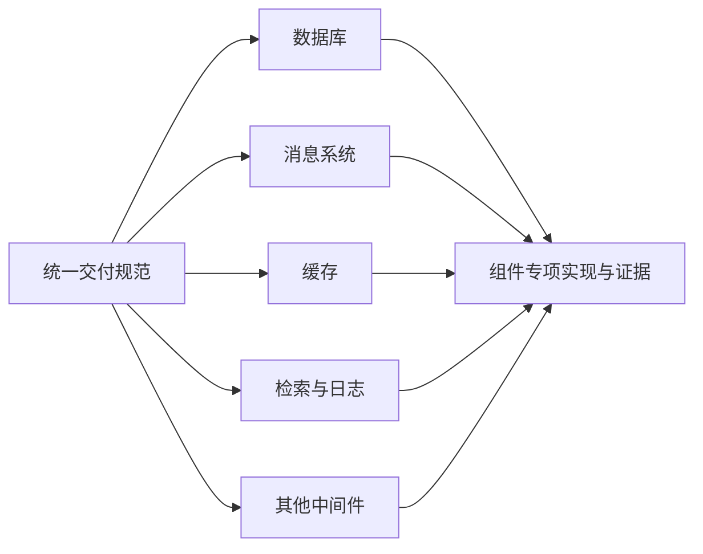
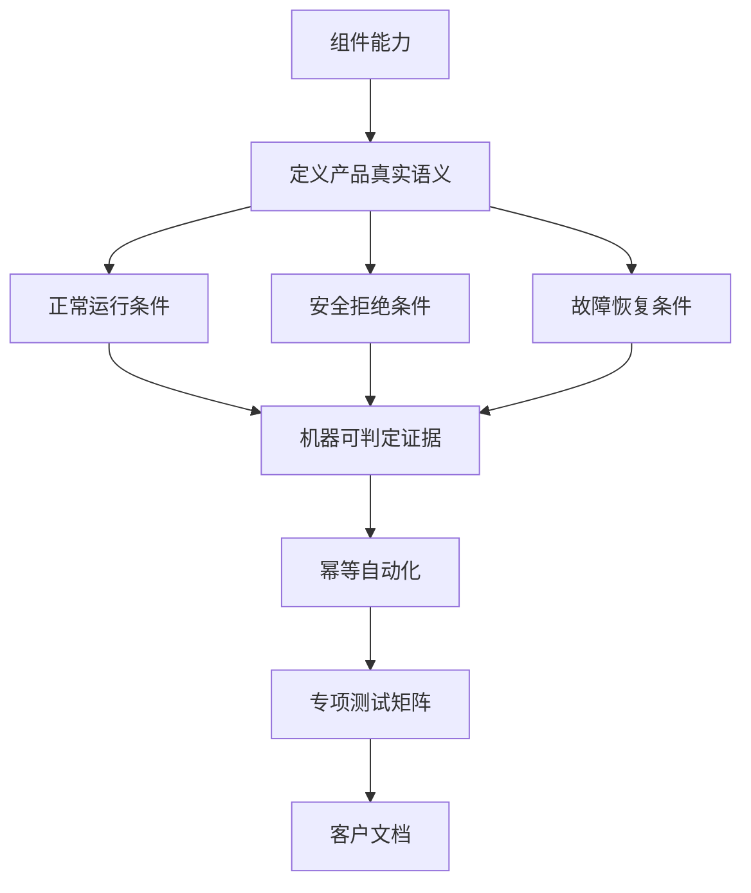
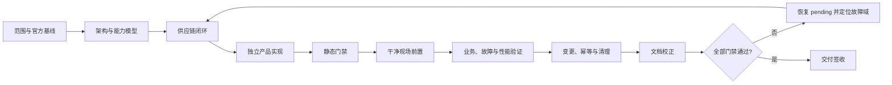
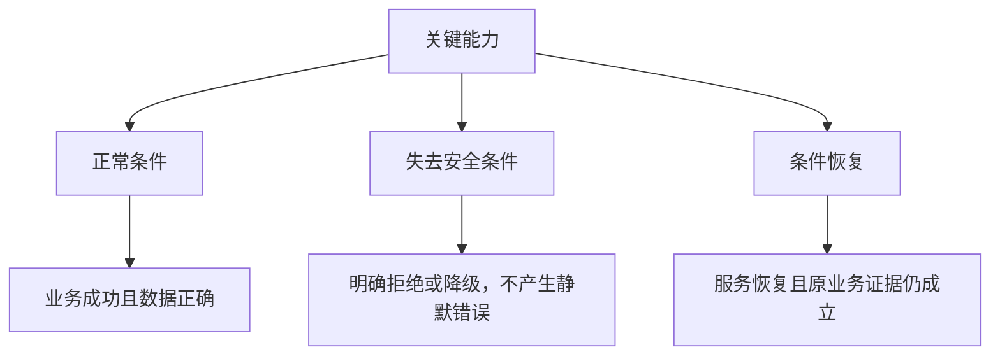
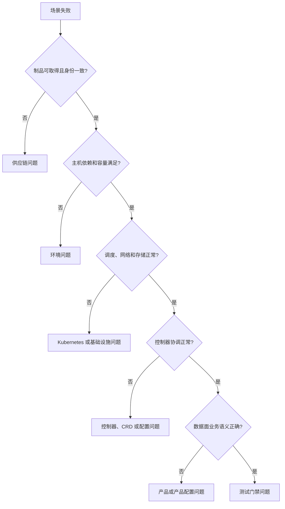
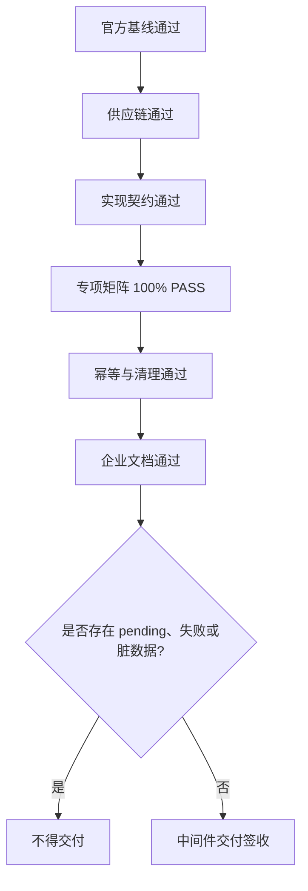

# Kubeauto 中间件企业交付规范

| 文档属性 | 内容 |
| --- | --- |
| 文档类型 | 中间件企业交付规范 |
| 适用范围 | Kubeauto 新增、升级和维护的全部可选中间件 |
| 适用读者 | 架构师、开发人员、测试人员、实施工程师、运维人员、发布人员和技术文档维护人员 |
| 文档版本 | v1.0 |

## 目录

1. 适用范围与统一原则
2. 中间件能力模型
3. 全生命周期交付阶段
4. 官方基线与技术选型
5. 六仓供应链与辅助制品
6. 实现、幂等与资源所有权
7. 专项测试与生产验收
8. 运维可观测性与证据体系
9. 企业文档规范
10. 组件接入与动态扩展
11. 产品差异示例
12. 统一验收定义

## 第一章、适用范围与统一原则

### 1.1 文档定位

本规范定义中间件从技术选型、制品准备、产品接入、现场验证到客户文档交付的统一要求。数据库、消息系统、缓存、检索、日志和其他中间件均使用同一条交付主线；具体产品只在一致性、拓扑、数据保护、扩缩容和性能等能力域中形成差异化实现。

本规范不替代组件手册。组件手册负责说明该产品的部署、使用、运维和开发细节；本规范负责规定所有组件必须回答的问题、必须形成的资产和必须满足的验收条件。



### 1.2 统一原则

| 原则 | 交付要求 |
| --- | --- |
| 官方依据 | 使用处于维护期的官方 GA 版本；版本、兼容性、许可证、API 和行为均可追溯到官方文档、发布说明或源码 |
| 最小影响 | 新组件默认关闭并使用独立配置前缀、任务、模板、矩阵和清理边界；关闭时不改变既有功能 |
| 供应链先行 | 编码和现场测试前完成全部运行及辅助制品盘点、版本锁定、双仓发布和完整性验证 |
| 业务语义验收 | 资源 `Running` 或 `Ready` 只表示阶段状态；最终验收必须包含真实客户端和业务数据断言 |
| 安全失败 | 正常路径、拒绝路径和恢复路径均须验证；失去安全运行条件时必须明确拒绝不安全操作 |
| 自动化与幂等 | 部署、巡检、维护和测试入口可重复执行，长任务可观测，失败和中断可限定回收 |
| 当前证据 | 验收结论只由当前锁定版本的干净现场证据产生，历史日志不能替代本轮测试 |
| 文档即交付 | 客户文档与代码、配置、脚本、日志和现场行为一致，可按主线直接实施并逐步验收 |

### 1.3 状态边界

以下状态不得混用：

| 状态 | 含义 |
| --- | --- |
| 官方支持 | 上游文档声明具备该能力 |
| 已设计 | 已完成架构与边界定义，尚未取得完整实现证据 |
| 已实现 | 项目代码已提供该能力，仍可能存在未完成的现场门禁 |
| 已验证 | 当前锁定版本已通过对应专项测试 |
| 已交付 | 实现、测试、清理、供应链和企业文档全部满足本规范 |

任何“生产可用”结论均应指明版本、拓扑、配置边界和对应证据，不以笼统描述代替验收。

## 第二章、中间件能力模型

每个组件在方案阶段均须完成下列能力建模。某项不适用时，应依据产品语义说明原因，不得直接省略。

| 能力域 | 方案必须说明 | 实现和验收必须形成 |
| --- | --- | --- |
| 产品定位 | 解决的问题、适用与不适用场景、许可证、替代方案 | 明确的交付边界和非目标 |
| 架构 | 控制面、数据面、客户端、依赖、资源所有者 | 架构图、资源关系和唯一控制器 |
| 数据模型 | 数据组织、分片或分区、索引、保留和删除语义 | 可验证的业务数据标志和边界条件 |
| 一致性 | 写入确认、读取可见性、顺序、事务、脑裂和仲裁 | 正常业务断言与失去仲裁时的安全拒绝 |
| 生产拓扑 | 角色、副本、故障域、反亲和、机架或区域感知 | 调度证据以及单点、多点故障场景 |
| 客户端接入 | 内外部入口、服务发现、客户端兼容、超时和重试 | 真实客户端连接、重连和错误配置拒绝 |
| 安全 | TLS、身份、授权、最小权限、网络策略和轮换 | 合法访问成功，错误 CA、错误凭据和越权访问失败 |
| 存储与容量 | 介质、容量公式、水位、保留、扩容、磁盘满和重建 | 真实读写、容量告警、扩容及恢复证据 |
| 数据保护 | 副本、备份、归档、时间点恢复、RPO/RTO 和跨集群灾备 | 可读取制品、真实恢复结果或明确的能力边界 |
| 生命周期 | 安装、扩缩、再平衡、维护、轮换、升级、回滚和下线 | 每步前置、等待、验收、回滚及不可逆边界 |
| 可观测性 | 健康、容量、性能、业务滞后、日志、事件和告警 | 指标采集、受控触发、告警和恢复闭环 |
| 性能 | 数据集、负载模型、并发、持续时间、阈值和瓶颈 | 可复现基线、故障负载、P95/P99 和错误统计 |
| 自动化 | 稳定输入、同名异参、run ID、change ID 和所有权 | 二次执行快照、无意外变更和限定清理 |
| 文档 | 主线路、辅助线路、脚本功能、日志和开发契约 | 正式文档集合、命令语法和现场一致性门禁 |



能力模型是组件之间的共同接口。各组件回答同一组问题，但不得复制其他产品的配置值、状态名称或断言方式。

## 第三章、全生命周期交付阶段

### 3.1 阶段门禁

| 阶段 | 主要活动 | 必备产物 | 退出条件 |
| --- | --- | --- | --- |
| 1. 范围定义 | 明确目标、非目标、共享依赖和影响边界 | 范围说明、能力清单 | 组件边界可审查 |
| 2. 官方基线 | 核验 GA、维护期、兼容矩阵、许可证、发布说明和源码 | 版本决策和官方依据 | 所有版本组成可追溯 |
| 3. 架构设计 | 比较 Operator、Helm、原生工作负载及商业方案 | 架构图、风险与替代方案 | 控制面和数据面职责明确 |
| 4. 能力建模 | 完成第二章各能力域 | 能力边界表 | 无未说明的关键能力 |
| 5. 供应链 | 盘点并发布生产、升级、回滚、备份、性能和测试制品 | 制品清单、digest 或 checksum | 现场不依赖临时公网发现 |
| 6. 产品实现 | 建立独立开关、配置、任务、模板和所有权 | 默认关闭的声明式入口 | 关闭时零影响，同输入可收敛 |
| 7. 静态门禁 | 校验语法、模板、变量、版本同步、安全和文档 | 单元及契约测试 | 受影响静态测试 100% 通过 |
| 8. 现场前置 | 验证清洁度、容量、故障域、存储、网络和时间 | 前置检查证据 | 所有条件机器可判定通过 |
| 9. 安装与业务 | 部署控制面和数据面，执行真实客户端读写 | 业务标志、数量或校验值 | 业务语义通过 |
| 10. 故障与恢复 | 注入成员、仲裁、存储、凭据和控制器故障 | 正常继续、安全拒绝及恢复证据 | 数据和服务回到定义状态 |
| 11. 性能与稳定性 | 执行固定负载、故障负载和持续运行 | 基线、阈值和瓶颈归因 | 无静默错误，结果可复现 |
| 12. 变更与回退 | 演练扩缩、轮换、升级、回滚和不可逆边界 | change ID、变更前后快照 | 回退条件和数据影响明确 |
| 13. 幂等与清理 | 二次执行并验证正常、失败、中断清理 | 身份快照、清理终端标志 | 无意外替换和分路残留 |
| 14. 文档与签收 | 用当前现场结果校正文档和矩阵 | 正式文档、验收记录 | 统一验收定义全部满足 |

### 3.2 阶段流转



阶段失败时，相关矩阵项保持 `pending` 或标记为失败。失败尝试形成的临时代码和现场残留不能成为新基线；应在证明根因后实施最小修复，并从已验证的干净状态重新执行受影响门禁。

## 第四章、官方基线与技术选型

### 4.1 官方证据层级

按下列优先级建立依据：

1. 官方发布说明、生命周期和安全公告；
2. 官方兼容矩阵、安装和运维文档；
3. 锁定版本的 CRD、OpenAPI、命令帮助和默认配置；
4. 锁定版本的官方源码、Chart 和镜像元数据；
5. 经本项目当前专项测试验证的行为。

社区文章和测试时使用的镜像代理只能辅助定位，不能作为版本、API 或生产行为的权威依据。

### 4.2 版本集合

中间件版本不是单一应用标签，而是可共同运行的版本集合：

| 组成 | 核验内容 |
| --- | --- |
| Kubernetes | API 版本、移除项、调度、存储和网络要求 |
| Operator 或控制器 | 支持的应用版本、CRD 转换、升级路径和维护状态 |
| 应用 | GA 状态、协议、数据格式、滚动升级和降级边界 |
| Chart 或清单 | 固定文件、来源、checksum 和模板默认值 |
| 客户端与工具 | 协议兼容、认证机制、备份和性能工具版本 |
| 镜像 | 上游引用、内部发布标签、架构和 manifest digest |

### 4.3 技术选型记录

选型至少比较成熟度、故障模型、操作复杂度、升级能力、生态兼容、许可证、资源成本和退出成本。选定方案应同时说明未选方案及原因，避免把个人偏好写成技术结论。

> **版本变更：** 任一控制器、应用、CRD、Chart 或关键工具版本变化后，应重新核验兼容矩阵，并将受影响测试项恢复为 `pending`。原版本的现场证据不得直接继承。

> **能力边界：** 上游已提供但本项目尚未实现或尚未验证的功能，应标记为“官方可选”或“待验证”，不得列入已交付能力。

## 第五章、六仓供应链与辅助制品

### 5.1 发布单元

Kubeauto 及其五个制品仓库构成一个发布单元。任何组件版本或外部制品变化均应同步审计：

| 仓库 | 主要职责 |
| --- | --- |
| `kubeauto` | 版本常量、配置、产品实现、文档和测试 |
| `kubeauto-dockerfile` | Kubeauto 主镜像构建 |
| `kubeauto-k8s-bin-dockerfile` | Kubernetes 相关固定制品 |
| `kubeauto-ext-bin-dockerfile` | 通用扩展二进制制品 |
| `kubeauto-ext-bin-sp1-dockerfile` | 特定兼容基线的扩展二进制制品 |
| `kubeauto-ext-images-dockerfile` | 平台、中间件及测试辅助镜像 |

### 5.2 全量制品盘点

制品清单必须覆盖完整生命周期，而不只覆盖业务 Pod：

- 生产运行镜像和控制器镜像；
- 安装、升级与回滚所需的 Chart、CRD、镜像和二进制；
- 备份、恢复、对象存储和校验工具；
- 性能测试、故障注入和诊断工具；
- 测试所需的存储、客户端和基础设施镜像。


### 5.3 辅助镜像目录与发布

`kubeauto-ext-images-dockerfile` 使用功能所有权组织目录：

```text
platform/<capability>/...
middleware/<component>/...
tooling/<capability>/...
```

新增镜像应位于拥有该用途的目录中，不在仓库根目录建立例外。精确版本已经存在时直接复用；不存在时使用固定官方 `FROM` 或官方制品构建，在 GitHub Actions 双推矩阵中登记，并通过目录校验。TalkEdu 与 Docker Hub 两端均应核验 tag、manifest 和 digest 后，方可进入常规现场测试。

### 5.4 中国交付路径

中国现场优先使用 `hub.talkedu.cn` 和项目固定的国内源，同时保留 Docker Hub 或官方上游回退。文件下载须先写入临时文件，校验 checksum 后原子替换；镜像须验证 manifest digest，不接受只完成下载但身份不明的制品。

> **临时加速：** 公共代理地址可能随时失效，只允许在隔离测试中通过非持久化运行时参数注入。临时地址不得写入生产代码、CI、默认配置或企业文档，测试完成后应移除覆盖参数。

> **既有配置：** 已交付路径中的固定加速和回退配置受既有测试矩阵保护。除非当前证据证明缺陷，不因新增组件的规则或风格调整而修改。

## 第六章、实现、幂等与资源所有权

### 6.1 独立接入边界

每个组件至少具备：

- 默认关闭的功能开关；
- 独立且一致的配置前缀；
- 独立 task、template 和制品清单；
- 明确的 Kubernetes label、field manager、命名空间和资源所有者；
- 独立单元测试、专项矩阵、runner 模式和 cleanup；
- 不包含明文密码、私钥、token 或完整 Secret 的日志。

关闭功能后，不得创建该组件的 CRD、命名空间、Secret、PVC、工作负载或监控对象。共享代码只有在存在可复现缺陷且修复范围可证明时才允许最小修改，并执行受影响共享契约测试。

### 6.2 幂等分类

| 类型 | 处理规则 | 典型操作 |
| --- | --- | --- |
| 声明式收敛 | 相同输入只应用差异，不产生无意义 rollout | CRD、Operator、CR、ConfigMap、NetworkPolicy |
| 只读验收 | 任意次数执行均不改变集群 | 健康、容量、日志、指标和配置检查 |
| 固定目标变更 | change ID、目标和输入保持稳定；完成后验证并返回成功 | 扩容、轮换、升级、恢复 |
| 临时测试资源 | run ID 唯一，带所有权标签，退出时限定回收 | 客户端、压测、故障注入和临时存储 |
| 不可逆操作 | 默认拒绝自动执行，要求显式变更标识和保护证据 | 数据删除、PVC 缩容、格式或协议最终化 |

同名资源已存在时，应比较不可变请求指纹。输入一致则复用并验证；输入不同则明确拒绝并要求新的名称或 change ID，不得静默覆盖历史请求。

### 6.3 二次执行验收

生产入口应在稳定集群上至少执行两次，并比较：

- Pod、PVC、Secret 和关键 CR 的 UID；
- Operator release revision 和资源 generation；
- 数据标志、业务数量或校验值；
- 配置差异和滚动事件；
- 第二次执行的阶段日志与终端标志。

允许的变化应由输入差异或控制器正常行为解释。无配置差异时发生的 Secret 重建、PVC 替换、数据丢失或无意义滚动均视为失败。

## 第七章、专项测试与生产验收

### 7.1 独立测试分路

每个组件建立独立测试矩阵、runner、证据目录和 cleanup。组件专项验收不自动触发已交付项目的全量回归；只有当前改动影响共享契约时，才扩大到明确受影响的测试范围。

```text
tests/<component>-test-matrix.yaml
tests/helpers/<component>-regression.sh
tests/helpers/<component>-cleanup.sh
tests/unit/test_<component>_delivery.py
tests/unit/test_<component>_documentation.py
```

工作期间受影响矩阵项保持 `pending`。只有当前干净现场取得完整证据后，才可改为 `pass`。

### 7.2 验收层次

| 层次 | 最低证据 |
| --- | --- |
| 静态契约 | 配置类型、模板渲染、版本同步、制品校验、安全规则和文档结构 |
| 平台前置 | 节点、故障域、容量、StorageClass、DNS、网络、时间和 Registry |
| 控制面 | CRD 建立、控制器可用、协调状态和异常事件 |
| 数据面 | 全部预期成员和存储就绪，内部状态满足产品定义 |
| 业务面 | 真实客户端完成写入、读取、事务或消息处理，并验证数量或 hash |
| 安全面 | TLS 主机和 CA 校验、认证、最小权限以及错误凭据和越权拒绝 |
| 故障面 | 单点继续、多点安全拒绝、成员重建和恢复后数据一致 |
| 运维面 | 扩缩、容量、磁盘满、轮换、备份恢复、升级回滚和下线 |
| 性能面 | 固定负载、延迟分位、错误率、资源指标、故障负载和瓶颈分析 |
| 自动化面 | 二次执行无意外变化，失败与中断可诊断并限定清理 |

### 7.3 正常、拒绝和恢复语义

每项关键能力至少定义三类断言：



Pod `Running`、Job `Complete`、备份对象 `Succeeded` 均不是最终证据。备份还应验证对象存在、非零、可读和校验值；恢复还应验证目标业务数据；性能测试还应验证业务错误数为零并保存负载参数。

### 7.4 清洁现场与终端条件

每个有状态场景执行前后均须完成限定清理验证。一次专项交付通过必须同时满足：

1. 预期业务终端标志出现；
2. durable runner 记录 `rc=0`；
3. 日志中不存在失败终端标志；
4. 矩阵绑定当前 run ID 的证据；
5. 最终出现该组件唯一的 `COMPONENT_CLEAN_VERIFY_PASS`；
6. 非本组件资源和数据未被删除或修改。

## 第八章、运维可观测性与证据体系

### 8.1 日志契约

长时间自动化应持续说明当前动作，而不是只在结束时输出结果。统一日志至少包括：

```text
COMPONENT_STAGE_BEGIN id=<case> action=<operation>
COMPONENT_WAIT_HEARTBEAT id=<case> elapsed=<seconds> state=<current-state>
COMPONENT_STAGE_PASS id=<case> evidence=<summary>
COMPONENT_STAGE_FAIL id=<case> class=<failure-domain> reason=<reason>
COMPONENT_DELIVERY_BRANCH_PASS
COMPONENT_CLEAN_VERIFY_PASS
```

阶段日志说明执行到了哪一步；心跳说明仍在等待的对象、已等待时间和当前状态；失败日志提供故障域和首要原因；唯一终端标志只在所有硬性断言通过后输出。

### 8.2 故障分层



故障发生后先保存命令、事件、状态、日志、run ID 和退出码，再依据分层定位。只有干净现场可稳定复现，且官方行为与锁定源码共同证明实现错误时，才能修改产品代码。

### 8.3 证据目录

证据路径应包含组件、版本、场景和唯一 run ID。文件先写入临时路径，完成后原子发布，不覆盖既有证据。证据至少记录：

- 版本、镜像 digest、Chart checksum 和关键配置摘要；
- 执行起止时间、命令、退出码和终端标志；
- 控制面、数据面和业务面断言；
- 故障注入对象、恢复对象及变更前后 UID；
- 性能负载参数、分位延迟、吞吐、错误率和资源指标；
- 清理范围、清理结果和 clean verify 标志。

> **敏感信息：** 证据不得保存密码、私钥、token、完整 Secret 或可复用认证材料。需要关联凭据时只记录 Secret 名称、key、版本标识和不可逆摘要。

## 第九章、企业文档规范

### 9.1 正式文档集合

每个组件交付三份正式文件，覆盖四类企业文档内容：

```text
docs/middleware/<component>/
  operations-manual.md       # 用户手册与运维手册合并版
  technical-whitepaper.md    # 技术白皮书
  development-manual.md      # 开发手册
```

| 文档 | 必须回答的问题 |
| --- | --- |
| 用户与运维手册 | 如何规划、部署、接入、使用、巡检、监控、扩容、压测、保护数据、升级回滚和排障 |
| 技术白皮书 | 为什么采用该方案，内部如何工作，一致性、故障、安全、存储和能力边界是什么 |
| 开发手册 | 代码边界、变量、模板、制品、幂等、测试、发布和版本升级如何维护 |

官方依据按用途并入技术白皮书或开发手册。客户目录不交付方案草稿、评审稿、项目状态、测试时间线、内部经验记录、独立来源索引或额外入口文件。

### 9.2 主线路与辅助线路

用户与运维手册按照客户实际操作顺序提供连续主线路：环境准备、配置、制品、安装、控制面验收、数据面验收、业务验收和上线记录。每一步均能复制执行并独立判断结果。

异常、回滚、风险和补充条件置于对应主步骤之后，并使用 Markdown 引用块：

> **异常处理：** 说明应保留的证据、故障域判定和恢复动作。
>
> **回滚：** 说明回滚前提、不可回滚边界和回滚后验收。
>
> **注意：** 说明数据、容量、兼容性或安全风险。

### 9.3 脚本说明与关键日志

每段客户脚本前提供完整执行契约：

| 字段 | 内容 |
| --- | --- |
| 功能 | 脚本解决的具体部署或运维任务 |
| 输入 | 必须设置的变量、文件、对象和凭据引用 |
| 影响 | 读取、创建、变更或删除的资源 |
| 产物 | 证据文件、备份、资源或变更记录 |
| 幂等 | 重复执行时收敛、复用、拒绝或创建新 run ID |
| 关键日志 | 分步编号、等待心跳、诊断信息和唯一终端标志 |
| 验收 | 客户如何以退出码、状态和业务证据判定完成 |

脚本使用严格错误处理，关键步骤输出 `[当前步骤/总步骤]`。唯一成功标志是最后一条业务日志；标志之后不得继续执行可能失败的动作。Bash 代码块不得使用会被 shell 解释为重定向符的 `<占位符>`，变量示例应采用注释或安全默认值。

### 9.4 文档真实性门禁

1. 字段来自锁定版本 CRD、OpenAPI、`--help` 或官方源码，不凭记忆编写；
2. 版本、镜像、命名空间、Service、配置名和日志标志与生产实现一致；
3. Bash 代码块通过 `bash -n` 或等价语法检查；
4. 生产主线命令在受控现场执行，概念片段明确标注为非生产示例；
5. 测试发现的新等待条件、故障模式和恢复动作同步写入手册；
6. 文档结构、禁用表达、链接和代码块由契约测试持续检查；
7. 用语采用客户视角和规范书面语，不包含内部推理、项目推进过程或未经证明的宣传性结论。

## 第十章、组件接入与动态扩展

### 10.1 标准接入包

新增组件应建立以下最小资产：

```text
docs/middleware/<component>/
  operations-manual.md
  technical-whitepaper.md
  development-manual.md
roles/cluster-addon/tasks/<component>.yml
roles/cluster-addon/templates/<component>/...
tests/<component>-test-matrix.yaml
tests/helpers/<component>-regression.sh
tests/helpers/<component>-cleanup.sh
tests/unit/test_<component>_delivery.py
tests/unit/test_<component>_documentation.py
```

项目实际路径可依据组件实现调整，但独立开关、资源所有权、专项矩阵、限定清理和三份正式文档不可缺失。

### 10.2 扩展步骤

1. 复制第二章的能力模型，逐项形成该组件的产品答案；
2. 执行第三章的阶段门禁，建立当前版本的官方依据和制品闭环；
3. 按第六章建立默认关闭、幂等且资源边界明确的实现；
4. 按第七章定义该产品的正常、拒绝、恢复和运维语义；
5. 按第八章建立 durable runner、日志、证据和清理契约；
6. 按第九章编制三份正式客户文档并执行真实性门禁；
7. 达到第十二章全部条件后，才在中间件索引中标记为已交付。

### 10.3 平等导航

`docs/middleware/README.md` 只承担规范入口和组件导航。所有组件使用同级入口、相同状态词和同一文档集合，不以实现时间、产品类型或历史来源区分文档等级。

后续组件可以增加新的产品能力域；新增能力应先判断是否具有跨组件价值。具有共性的内容补入第二章能力模型，产品特有内容保留在该组件手册或第十一章示例，不改变通用主线的产品中立性。

## 第十一章、产品差异示例

本章仅演示如何把通用能力模型映射为产品真实语义，不构成版本选择、配置模板或验收结论。正式实施以对应组件的官方依据、企业文档和专项矩阵为准。

### 11.1 Percona PXC 与 Apache Kafka 并列映射

| 通用能力 | Percona PXC 示例 | Apache Kafka 示例 |
| --- | --- | --- |
| 仲裁 | Galera Primary Component 维持多数派 | KRaft Controller quorum 维护元数据多数派 |
| 数据复制 | wsrep 同步复制，成员通过 IST 或 SST 追赶 | 分区 Leader 复制到 ISR，Follower 执行日志追赶 |
| 业务证据 | TLS SQL、事务标志、行数和副本读取 | Producer/Consumer、offset、事务边界和消息 hash |
| 安全拒绝 | Non-Primary 状态拒绝不安全写入 | 失去 Controller quorum 或不满足最小 ISR 时拒绝相应操作 |
| 数据保护 | 全量备份、恢复和时间点恢复 | 业务归档、跨集群复制和 checkpoint 需要独立能力设计 |
| 扩容 | 成员加入后执行状态同步 | Broker 加入后还需执行分区再平衡 |
| 存储压力 | 数据文件、事务日志、gcache 和备份空间 | 日志段、索引、retention、Consumer 积压和副本恢复空间 |
| 性能 | sysbench 吞吐、延迟和 flow control | Producer/Consumer 吞吐、lag、P99、分区与消息大小 |

两个示例都回答“仲裁、复制、业务证据、安全拒绝、数据保护、扩容和性能”这些通用问题，但采用完全不同的产品状态和验收命令。副本、恢复和性能概念不能跨产品直接类比。

### 11.2 后续组件的差异化问题

| 组件类型 | 除通用模型外需要重点回答的问题 |
| --- | --- |
| MongoDB | 副本集与分片边界、read/write concern、选主、chunk 迁移、oplog 窗口和一致性备份 |
| Redis | Sentinel 或 Cluster 模式、槽位迁移、持久化策略、复制积压、故障转移和客户端拓扑感知 |
| Elasticsearch | master/data 角色、分片分配、quorum、段合并、水位、snapshot repository 和索引生命周期 |

表中内容用于建立研究清单，不表示已完成方案选择或项目交付。每个组件均须重新核验当前官方 GA、维护周期、Operator 能力、许可证和 Kubernetes 兼容性。

## 第十二章、统一验收定义

中间件只有同时满足以下条件，才能标记为已交付：

- 技术方案、版本集合、许可证和能力边界具有当前官方依据；
- 组件入口默认关闭，关闭时不影响已交付功能；
- 六仓制品闭环完整，运行和辅助制品均可验证并具备固定回退；
- 配置、模板、资源所有权、Secret 使用和错误回收符合实现契约；
- 受影响静态测试和组件专项现场矩阵达到 100% PASS；
- 正常、拒绝、恢复、安全、存储、容量、性能和变更语义具有机器可判定证据；
- 相同输入二次执行不产生非预期替换、滚动或数据变化；
- 失败和中断能够诊断、限定回收并从干净状态重新执行；
- durable `rc=0`、唯一交付标志、零失败标志和最终 clean verify 同时成立；
- 用户与运维手册、技术白皮书和开发手册与当前代码、制品和现场结果一致；
- 中间件索引使用统一状态和同级入口，不以官方能力替代项目验收。


