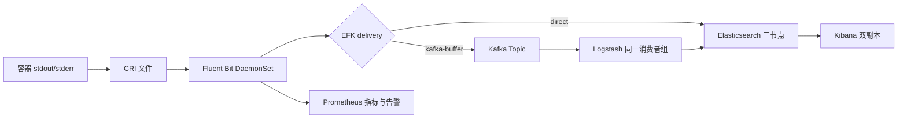
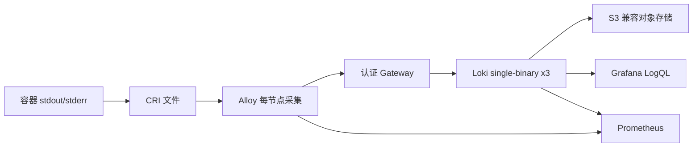
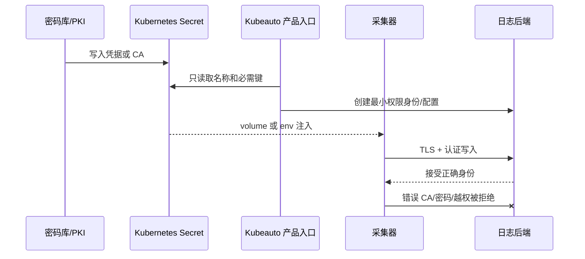

# EFK / Loki 日志平台技术白皮书

| 属性 | 内容 |
| --- | --- |
| 适用产品 | Kubeauto 可选日志平台 |
| Kubernetes 基线 | v1.33.6 |
| 最后核验日期 | 最后核验日期：2026-09-06 |
| 状态边界 | 只有专项矩阵与总交付门禁通过后才属于已交付能力 |

## 1. 目标与非目标

本能力把 Kubernetes 容器的 stdout/stderr 转换为可检索、可视化、可告警和可恢复的日志数据。它提供三条经过显式选择的数据链，但一个集群一次只能运行一条。平台不自动迁移 EFK 与 Loki 的历史数据，不把 Kubernetes `Running` 当成业务成功，也不以副本替代备份。

EFK 适合依赖全文检索、索引级治理、ILM 和快照恢复的客户；Kafka-buffer 在已有 Kafka 时增加可观察的消费积压；Loki 使用标签索引、TSDB 和对象存储降低大规模日志的索引成本。选择取决于查询模型、RPO、RTO、成本和既有运维能力，而不是组件新旧。

## 2. 架构与所有权





`logging` 命名空间的 `kubeauto.io/logging-solution` 是路线所有权声明。产品在创建 namespace、CRD、Secret 派生物或工作负载前读取该标签；已有值与请求值不同即安全拒绝。EFK CR 由 ECK Operator 协调，Loki/Alloy 由固定 Helm release 协调，Kubeauto 只管理自己的声明和 field manager，不采用另一方案资源。

## 3. 数据模型与一致性

### 3.1 EFK

Fluent Bit 使用 CRI parser 读取节点文件并保留时间、stream、Pod 和 namespace 元数据。direct 路线以 HTTPS 和最小权限 writer 写入 `k8s-*`；索引模板固定三主分片、一副本和 ILM。Kafka-buffer 把采集确认边界前移到 Kafka，Topic 为六分区、三副本，Logstash 两副本共享消费者组并写入 Elasticsearch。

Kafka 与 Elasticsearch 不提供跨系统原子事务，因此该路线语义是至少一次交付。网络重试、消费者重平衡或节点恢复可能产生重复；下游通过稳定文档 ID、查询去重或业务字段处理。lag 归零表示已消费到当前末端，不等于 Elasticsearch 快照已完成。

### 3.2 Loki

Alloy 为日志附加稳定的低基数标签，Loki TSDB 只索引标签，日志正文存入 chunks。`replication_factor: 3` 在三个 Loki 成员间复制写入；对象存储保存长期数据，本地 PVC 支持 WAL 和恢复。标签基数直接决定索引和查询成本，禁止把 request ID、用户 ID 等无限基数字段提升为标签。

对象存储短时不可用时写入会重试；恢复后必须通过唯一日志数量证明数据可见。复制因子只能降低单成员故障风险，不替代对象存储版本、跨区域副本或恢复演练。

## 4. 版本、许可证与兼容性

| 组件 | 固定版本 | 许可证/边界 | 官方依据 |
| --- | --- | --- | --- |
| Elastic Cloud on Kubernetes | 3.5.0 | Elastic License 2.0 | <https://www.elastic.co/guide/en/cloud-on-k8s/3.5/index.html> |
| Elasticsearch / Kibana | 9.5.1 | Elastic License 2.0；客户应按使用方式复核订阅能力 | <https://www.elastic.co/guide/en/elasticsearch/reference/current/index.html> |
| Fluent Bit | 5.1.1 | Apache License 2.0 | <https://docs.fluentbit.io/manual> |
| Grafana Loki | 3.7.6 | GNU AGPLv3 | <https://grafana.com/docs/loki/latest/> |
| Loki Chart | 18.9.0 | 固定 tgz 与 SHA256 | <https://grafana.com/docs/loki/latest/setup/install/helm/> |
| Grafana Alloy | 1.18.1 | Apache License 2.0 | <https://grafana.com/docs/alloy/latest/> |
| Alloy Chart | 1.11.1 | 固定 tgz 与 SHA256 | <https://grafana.com/docs/alloy/latest/set-up/install/kubernetes/> |

版本是受支持组合，不是各组件“最新”标签的拼接。任一 Operator、CRD、应用、Chart 或 Kubernetes 版本变化后，应重新核验兼容矩阵、breaking changes、镜像 digest、模板 API 和专项矩阵，旧版本现场证据不能继承。

## 5. 安全模型



凭据只保存在 Secret 或外部密钥系统；配置、Chart values、ConfigMap、Git 和测试日志不得含明文。ECK 生成的 `elastic` 管理身份只用于受控引导，采集器使用索引范围受限的 writer。Loki Gateway 对客户端执行 Basic Auth，对象存储使用独立 S3 身份。采集器 RBAC 允许读取 Pod、Namespace 和日志元数据，不允许读取 Secret。

TLS 验证包括 CA 链、SAN、有效期和目标主机名。错误证书、错误密码、未认证请求和越权动作属于必须验证的安全拒绝路径。NetworkPolicy 可限制采集器到 API、DNS、Kafka、Gateway 或 Elasticsearch 的必要流量；策略变更必须先验证 DNS 和控制面依赖，不能用关闭 TLS 或开放任意出口解决连通问题。

## 6. 高可用、存储和故障语义

EFK 的三个 Elasticsearch Pod使用独立节点和 PVC，单成员故障由副本分片恢复；Kibana 两副本不承载日志数据。Loki 三副本使用 required anti-affinity，单成员重建期间由其余成员服务。Alloy/Fluent Bit 为每节点 DaemonSet，positions 或文件缓冲承担短期连续性。

| 故障 | 正常条件 | 安全拒绝/退化 | 恢复验收 |
| --- | --- | --- | --- |
| 单个 ES/Loki 成员丢失 | 其余成员继续服务 | 多故障域丢失时不承诺写入可用 | 成员 Ready、集群健康、历史与新日志可查 |
| Kibana/Gateway 丢失 | 另一副本或新 Pod 接管 | 未认证 Gateway 仍返回 401 | 入口 200、查询成功 |
| 采集器重建 | positions/文件缓冲保留进度 | 下游不可用时重试，不静默丢弃 | 固定批次全部到达 |
| Kafka 消费停止 | Kafka 保留消息 | lag 增长并告警 | Logstash 恢复、lag 回到 0、文档可查 |
| 对象存储不可用 | 本地恢复窗口吸收短时故障 | 超过容量/RPO 时停止交付承诺 | 存储恢复、历史数据可读 |
| 凭据失效 | 新凭据按顺序发布 | 错误/旧凭据被拒绝 | 新写入、历史读取和旧值撤销 |

## 7. 数据保护与生命周期

EFK 使用 SLM 将 `k8s-*` 快照写入 S3 repository，恢复时改名到隔离索引并比较文档数或 hash。Loki 的数据保护由对象存储版本控制、复制、加密和生命周期共同承担；删除 bucket 或 schema 不可由 Helm rollback 恢复。

ILM/retention 是删除策略，不是备份策略。RPO 取决于写入确认边界与最近可恢复副本，RTO 包括控制面、数据面、凭据、DNS 和数据恢复时间。生产变更前应保存配置、版本、PVC UID、业务标志和备份证据。

升级遵循官方顺序。Loki Helm major 变化可能包含破坏性 Chart 变更，需查阅 <https://grafana.com/docs/loki/latest/setup/upgrade/>；Elasticsearch 数据格式升级不支持简单降级。可逆配置使用精确 revision/generation 回滚，schema 或数据格式变化采用修复前滚或隔离集群恢复。

## 8. 可观测性与性能

Prometheus 同时观察采集器与后端。验收逐副本读取 targets 与 rules API，要求目标 `UP`、规则 `health=ok`、`lastError` 为空。业务 SLI 至少包括端到端可查询延迟、查询 P95/P99、采集错误、重试失败、Kafka lag、对象存储错误、磁盘水位和告警恢复时间。

性能结果必须携带数据集、日志行大小、并发、持续时间、固定资源和故障条件。专项门禁会在 NetworkPolicy 阻断期间生成精确批次，先证明后端计数为 0，再恢复网络并要求全部数据可查；这同时证明背压恢复和资源边界，不以平均吞吐掩盖丢失。

## 9. 自动化与交付边界

Kubeauto 使用默认关闭的 `logging_install`、唯一 `logging_solution`、声明式模板、稳定名称和所有权标签。相同输入重复执行应保留 PVC/Secret UID 和数据；不同路线必须安全拒绝。正常、失败和中断清理分别验证，限定删除日志资源，不修改已交付中间件。

生产交付结论由当前代码、固定制品、三条路线现场证据、44 项矩阵、durable `rc=0`、零失败标志、文档契约和 clean verify 共同形成。官方支持但未由本项目验证的能力不属于已交付范围。

## 10. Kubernetes 日志生命周期

Kubernetes 本身只负责节点上的短期容器日志。容器写入 `stdout` 或 `stderr` 后，容器运行时按 CRI 格式写入节点文件，通常由 `/var/log/containers/*.log` 软链接到 Pod 对应文件。kubelet 的日志轮转参数（`containerLogMaxSize`、`containerLogMaxFiles`）决定节点本地窗口；它们不会把日志复制到集群，也不会延长后端保留期。节点级采集器必须以只读方式挂载这些路径，并使用 Pod、Namespace、Container 元数据补充事件上下文。

采集器的状态分为三层：

1. 文件读取偏移。Fluent Bit 的 DB 文件和 Alloy 的 positions 文件记录已经读取的字节位置，防止采集器重启后从文件开头重复读取。
2. 发送缓冲。内存缓冲吸收瞬时后端延迟；磁盘缓冲或 WAL 吸收滚动重启和短时间网络中断。容量不足时必须产生可观察的丢弃或阻塞指标，不能静默覆盖旧数据。
3. 后端确认。只有收到 Elasticsearch、Kafka 或 Loki 的成功响应，才可把批次视为交付。HTTP 200 只表示服务端接受请求，不表示快照已完成或生命周期策略已执行。

因此，`kubectl logs`、采集器本地文件和后端查询必须使用同一唯一标志与时间窗口进行端到端核对。只检查 DaemonSet `Ready` 会遗漏解析失败、认证失败、索引拒绝和对象存储不可用。

官方依据：[Kubernetes Logging Architecture](https://kubernetes.io/docs/concepts/cluster-administration/logging/)、[CRI logging](https://kubernetes.io/docs/concepts/cluster-administration/logging/#logging-at-the-node-level) 和 [Kubelet Configuration API](https://kubernetes.io/docs/reference/config-api/kubelet-config.v1beta1/)。

## 11. EFK 内部机制

### 11.1 ECK 调谐链

ECK Operator 监听 `Elasticsearch`、`Kibana`、`PodDisruptionBudget` 和证书 Secret。用户提交 CR 后，Operator 计算期望的 StatefulSet、Service、PVC、TLS 证书和安全配置，并持续比较实际状态。StatefulSet 的 Pod 名称和 PVC 名称稳定，因此节点重建不会自动丢失数据；删除 PVC 则是不可逆的数据操作。

ECK 生成的 `logging-es-http` Service 只提供稳定入口，真正的集群健康由 Elasticsearch API 决定。Operator 的 `health`、`availableNodes` 和 `version` 条件用于控制面状态；业务验收仍必须查询 `_cluster/health`、`_cat/nodes`、`_cat/shards` 和一次真实写入/读取。

### 11.2 Elasticsearch 集群、分片和写入

Elasticsearch 集群先通过 master 选举形成集群状态，再将索引分为主分片和副本分片。本文默认每个 `k8s-*` 索引使用 3 个主分片、1 个副本；主分片负责写入路由，副本在主分片故障时提升为可服务副本。分片数量在索引创建后不能原地减少，过多分片会消耗堆内存和集群状态，过少分片会限制并行度，因此应按每日字节量、查询并发和节点数评审，而不是按 Pod 数量机械设置。

写入路径依次经过连接认证、索引模板匹配、解析/ingest、主分片确认和副本同步。`refresh` 使文档可搜索，`flush` 把事务日志安全落盘，segment merge 则合并只读段并回收删除文档空间。删除索引或文档不会立即释放磁盘，空间通常在 merge 后回收；磁盘紧张时必须优先删除完整旧索引或降低保留期，不能反复执行单文档删除期待即时腾出空间。

### 11.3 ILM、模板和 SLM 的边界

Index Template 只影响模板创建之后匹配模式的新索引；它不会回写旧索引。ILM policy 由索引上的 `index.lifecycle.name` 触发，按 hot、warm、cold、delete 等阶段执行，删除动作必须经过客户保留审批。SLM 以 repository 为目标生成快照，快照完成后才具备恢复意义；repository 可用不等于最近快照成功。恢复演练必须把索引恢复到隔离名称，禁止覆盖当前写入索引或 `.security-*`、`.kibana*` 系统索引。

### 11.4 Fluent Bit 管线

Fluent Bit 的 Tail input 读取 CRI 文件，Kubernetes filter 通过 API 缓存 Pod 元数据，Parser 将时间、stream 和 message 分离，输出插件再按批次发送。API 元数据读取失败不应阻断原始日志发送，但会降低标签完整性；因此应同时监控 `kubernetes` filter 错误和 output retry。direct 输出的确认边界是 Elasticsearch HTTP 响应，Kafka-buffer 输出的确认边界是 Kafka broker 对 Topic 分区的确认。

Kafka-buffer 不提供跨 Kafka 与 Elasticsearch 的事务。Logstash 使用持久化队列和固定消费者组读取分区，写入 Elasticsearch 成功后提交 offset；进程崩溃可能导致同一批次重新处理，语义是至少一次。消费者组 lag 下降到零只表示读取追上最新 offset，不代表 Elasticsearch 已建立快照。

## 12. Loki 与 Alloy 内部机制

Loki 将日志流定义为一组标签与有序日志行。写入请求先按标签计算 stream，ingester 在内存中构建 chunk 并写 WAL，达到切块条件或超时后把 chunk 和索引写入对象存储。Querier 根据 TSDB index 找到候选 chunk，再在查询时过滤正文；因此 Loki 的成本和性能主要由标签基数、时间范围、并发和 chunk 大小决定，而不是日志正文是否包含某个单词。

`replication_factor: 3` 使一个 stream 的写入发送到三个 ingester 成员；ring 使用成员心跳和 token 负责分片路由。单成员故障时，剩余成员可继续读取已有数据，重建成员通过 WAL 和对象存储追赶。复制因子不能防止三个故障域同时失效，也不能替代对象存储的跨区域复制。

Alloy 的 file source 读取 CRI 文件，loki.process 负责解析、丢弃和字段转换，loki.write 负责批量、重试和认证发送。positions 文件只记录读取位置，不是日志备份。把高基数字段（request ID、用户 ID、完整 URL）提升为标签会导致 stream 数量爆炸；这类字段应保留在正文或结构化 metadata 中，在查询时使用过滤器。

Gateway 是认证和路由边界：客户端先通过 Basic Auth，再由 Gateway 转发读写路径。对象存储保存 chunks、TSDB index、ruler 和 admin 数据；本地 PVC 只承担 WAL、缓存和恢复窗口。对象存储桶、schema、租户 ID 或加密密钥变化会影响历史数据可读性，不能把 Helm rollback 当作数据格式回滚。

## 13. 可观测性、SLO 与容量模型

建议把日志平台 SLO 分成四个可独立归因的指标：

| SLO | 测量方法 | 主要归因 |
| --- | --- | --- |
| 端到端可查询延迟 | 生成唯一日志后测量采集时间到查询成功时间 | 采集器、网络、后端刷新/ingester |
| 接收成功率 | 发送批次数与后端成功响应数比较 | 认证、限流、磁盘和对象存储 |
| 查询成功率与 P95/P99 | 固定查询集按时间窗口统计 | 分片、标签基数、并发和缓存 |
| 恢复时间 | 故障注入到健康与数据可读的时间 | 控制器、PVC、备份和人工操作 |

EFK 容量初算：

```text
每日原始量 = 峰值字节/秒 × 86400
可搜索物理量 = 每日原始量 × 实测膨胀系数 × (1 + 副本数)
保留空间 = 可搜索物理量 × 保留天数 × 1.30 安全余量
```

还必须加入 segment merge、快照临时空间、节点重建和系统页缓存。达到 flood-stage 水位后 Elasticsearch 可能对索引设置只读保护；处理顺序应是停止非必要写入、删除已批准的旧索引、确认 merge/快照状态，再扩容或迁移数据。

Loki 容量按对象存储写入量、压缩率、复制/WAL 窗口和查询缓存估算。标签基数应设置预算并通过 `loki_index_gateway`、querier 查询耗时和 stream 数量持续观察。无法从单次吞吐测试推导十年容量，必须用高峰数据、保留期和增长率做滚动预测。

## 14. 威胁模型与信任边界

日志可能包含 Token、Cookie、身份证号和业务密钥。采集过滤应在进入后端前完成，访问控制则在后端查询时再次执行。Elasticsearch writer 仅拥有 `k8s-*` 的写入和 monitor 权限；Loki/Alloy ServiceAccount 不得读取 Secret；Kibana/Grafana 用户权限按索引或租户授权。日志脱敏失败属于数据泄露事件，不得用“后端已加密”替代源头过滤。

TLS 信任链包含服务端证书、SAN、客户端 CA、有效期和 DNS。`insecureSkipVerify`、`curl -k`、把密码放入 URL 或把 Secret 复制到 ConfigMap 都会破坏信任边界。NetworkPolicy 只允许采集器访问 DNS、Kubernetes API、目标后端和必要的监控端点；策略部署后必须验证 DNS、API 和数据路径，避免把网络策略误判为后端故障。

## 15. 变更、升级与恢复决策

组件升级的风险顺序是：镜像/Chart 变更、CRD schema 变更、应用数据格式变更、存储和认证变更。镜像与 Chart 可通过固定 revision 回滚；CRD 和数据格式通常只能前滚修复，或在隔离集群从变更前快照恢复。每次变更必须记录 change ID、目标版本、values/manifest、PVC UID、快照 ID、唯一日志标志和回滚条件。

恢复决策遵循以下顺序：

1. 单 Pod 故障：让控制器重建，确认 PVC UID、节点分布和业务查询。
2. 单节点/故障域故障：先恢复调度和容量，再观察副本/分片重建，禁止手工删除未分配分片。
3. 后端磁盘满：先暂停非必要写入，按保留策略删除旧索引或对象，再扩容；保留数据的删除必须经过审批。
4. 集群级数据损坏：停止写入，保护现有 PVC 和对象存储，选择最近成功快照或跨区域副本恢复到隔离名称，完成文档数、时间范围和权限核对后切换入口。

## 16. 官方依据与适用边界

- [ECK 3.5 文档](https://www.elastic.co/guide/en/cloud-on-k8s/3.5/index.html)、[Elasticsearch 9.5 参考](https://www.elastic.co/guide/en/elasticsearch/reference/current/index.html)
- [Elasticsearch Index Lifecycle Management](https://www.elastic.co/guide/en/elasticsearch/reference/current/index-lifecycle-management.html)、[Snapshot Lifecycle Management](https://www.elastic.co/guide/en/elasticsearch/reference/current/snapshot-lifecycle-management.html)
- [Fluent Bit Manual](https://docs.fluentbit.io/manual/)、[Tail input](https://docs.fluentbit.io/manual/pipeline/inputs/tail)、[Kubernetes filter](https://docs.fluentbit.io/manual/pipeline/filters/kubernetes)
- [Loki architecture](https://grafana.com/docs/loki/latest/get-started/architecture/)、[Loki storage](https://grafana.com/docs/loki/latest/configure/storage/)、[Loki labels](https://grafana.com/docs/loki/latest/get-started/labels/)
- [Grafana Alloy](https://grafana.com/docs/alloy/latest/)、[loki.source.file](https://grafana.com/docs/alloy/latest/reference/components/loki/loki.source.file/)

这些链接解释的是组件的通用官方行为；本项目交付范围仍以固定版本、渲染模板、配置前置条件和当前专项矩阵为准。官方文档支持但本项目没有实测的功能不得写成“已交付”。
