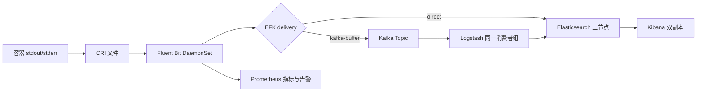
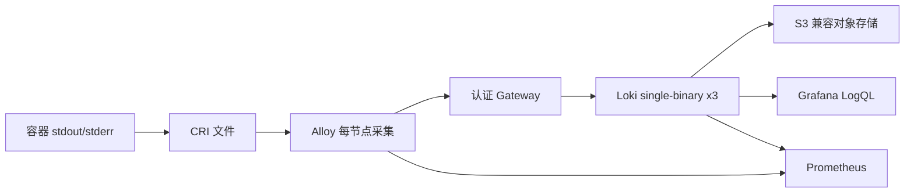
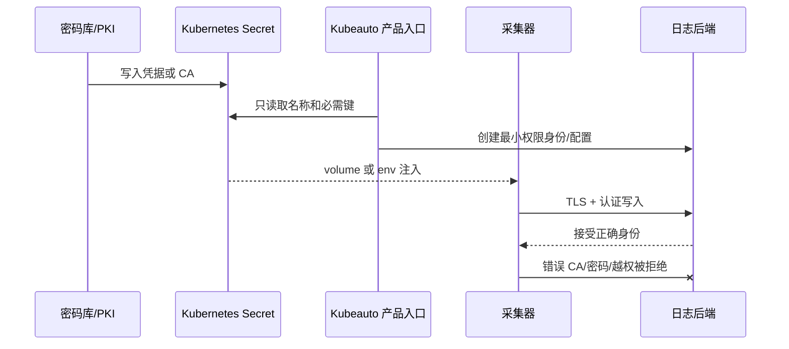

# EFK / Loki 日志平台技术白皮书

| 属性 | 内容 |
| --- | --- |
| 适用产品 | Kubeauto 可选日志平台 |
| Kubernetes 基线 | v1.33.6 |
| 最后核验日期 | 最后核验日期：2026-09-06 |
| 状态边界 | 只有专项矩阵与总交付门禁通过后才属于已交付能力 |

## 1. 目标与非目标

本能力把 Kubernetes 容器的 stdout/stderr 转换为可检索、可视化、可告警和可恢复的日志数据。它提供三条经过显式选择的数据链，但一个集群一次只能运行一条。平台不自动迁移 EFK 与 Loki 的历史数据，不把 Kubernetes `Running` 当成业务成功，也不以副本替代备份。

EFK 适合依赖全文检索、索引级治理、ILM 和快照恢复的客户；Kafka-buffer 在已有 Kafka 时增加可观察的消费积压；Loki 使用标签索引、TSDB 和对象存储降低大规模日志的索引成本。选择取决于查询模型、RPO、RTO、成本和既有运维能力，而不是组件新旧。

## 2. 架构与所有权

`logging` 命名空间的 `kubeauto.io/logging-solution` 是路线所有权声明。产品在创建 namespace、CRD、Secret 派生物或工作负载前读取该标签；已有值与请求值不同即安全拒绝。EFK CR 由 ECK Operator 协调，Loki/Alloy 由固定 Helm release 协调，Kubeauto 只管理自己的声明和 field manager，不采用另一方案资源。

## 3. 数据模型与一致性

### 3.1 EFK

Fluent Bit 使用 CRI parser 读取节点文件并保留时间、stream、Pod 和 namespace 元数据。direct 路线以 HTTPS 和最小权限 writer 写入 `k8s-*`；索引模板固定三主分片、一副本和 ILM。Kafka-buffer 把采集确认边界前移到 Kafka，Topic 为六分区、三副本，Logstash 两副本共享消费者组并写入 Elasticsearch。

Kafka 与 Elasticsearch 不提供跨系统原子事务，因此该路线语义是至少一次交付。网络重试、消费者重平衡或节点恢复可能产生重复；下游通过稳定文档 ID、查询去重或业务字段处理。lag 归零表示已消费到当前末端，不等于 Elasticsearch 快照已完成。

### 3.2 Loki

Alloy 为日志附加稳定的低基数标签，Loki TSDB 只索引标签，日志正文存入 chunks。`replication_factor: 3` 在三个 Loki 成员间复制写入；对象存储保存长期数据，本地 PVC 支持 WAL 和恢复。标签基数直接决定索引和查询成本，禁止把 request ID、用户 ID 等无限基数字段提升为标签。

对象存储短时不可用时写入会重试；恢复后必须通过唯一日志数量证明数据可见。复制因子只能降低单成员故障风险，不替代对象存储版本、跨区域副本或恢复演练。

## 4. 版本、许可证与兼容性

| 组件 | 固定版本 | 许可证/边界 | 官方依据 |
| --- | --- | --- | --- |
| Elastic Cloud on Kubernetes | 3.5.0 | Elastic License 2.0 | <https://www.elastic.co/guide/en/cloud-on-k8s/3.5/index.html> |
| Elasticsearch / Kibana | 9.5.1 | Elastic License 2.0；客户应按使用方式复核订阅能力 | <https://www.elastic.co/guide/en/elasticsearch/reference/current/index.html> |
| Fluent Bit | 5.1.1 | Apache License 2.0 | <https://docs.fluentbit.io/manual> |
| Grafana Loki | 3.7.6 | GNU AGPLv3 | <https://grafana.com/docs/loki/latest/> |
| Loki Chart | 18.9.0 | 固定 tgz 与 SHA256 | <https://grafana.com/docs/loki/latest/setup/install/helm/> |
| Grafana Alloy | 1.18.1 | Apache License 2.0 | <https://grafana.com/docs/alloy/latest/> |
| Alloy Chart | 1.11.1 | 固定 tgz 与 SHA256 | <https://grafana.com/docs/alloy/latest/set-up/install/kubernetes/> |

版本是受支持组合，不是各组件“最新”标签的拼接。任一 Operator、CRD、应用、Chart 或 Kubernetes 版本变化后，应重新核验兼容矩阵、breaking changes、镜像 digest、模板 API 和专项矩阵，旧版本现场证据不能继承。

## 5. 安全模型

凭据只保存在 Secret 或外部密钥系统；配置、Chart values、ConfigMap、Git 和测试日志不得含明文。ECK 生成的 `elastic` 管理身份只用于受控引导，采集器使用索引范围受限的 writer。Loki Gateway 对客户端执行 Basic Auth，对象存储使用独立 S3 身份。采集器 RBAC 允许读取 Pod、Namespace 和日志元数据，不允许读取 Secret。

TLS 验证包括 CA 链、SAN、有效期和目标主机名。错误证书、错误密码、未认证请求和越权动作属于必须验证的安全拒绝路径。NetworkPolicy 可限制采集器到 API、DNS、Kafka、Gateway 或 Elasticsearch 的必要流量；策略变更必须先验证 DNS 和控制面依赖，不能用关闭 TLS 或开放任意出口解决连通问题。

## 6. 高可用、存储和故障语义

EFK 的三个 Elasticsearch Pod使用独立节点和 PVC，单成员故障由副本分片恢复；Kibana 两副本不承载日志数据。Loki 三副本使用 required anti-affinity，单成员重建期间由其余成员服务。Alloy/Fluent Bit 为每节点 DaemonSet，positions 或文件缓冲承担短期连续性。

| 故障 | 正常条件 | 安全拒绝/退化 | 恢复验收 |
| --- | --- | --- | --- |
| 单个 ES/Loki 成员丢失 | 其余成员继续服务 | 多故障域丢失时不承诺写入可用 | 成员 Ready、集群健康、历史与新日志可查 |
| Kibana/Gateway 丢失 | 另一副本或新 Pod 接管 | 未认证 Gateway 仍返回 401 | 入口 200、查询成功 |
| 采集器重建 | positions/文件缓冲保留进度 | 下游不可用时重试，不静默丢弃 | 固定批次全部到达 |
| Kafka 消费停止 | Kafka 保留消息 | lag 增长并告警 | Logstash 恢复、lag 回到 0、文档可查 |
| 对象存储不可用 | 本地恢复窗口吸收短时故障 | 超过容量/RPO 时停止交付承诺 | 存储恢复、历史数据可读 |
| 凭据失效 | 新凭据按顺序发布 | 错误/旧凭据被拒绝 | 新写入、历史读取和旧值撤销 |

## 7. 数据保护与生命周期

EFK 使用 SLM 将 `k8s-*` 快照写入 S3 repository，恢复时改名到隔离索引并比较文档数或 hash。Loki 的数据保护由对象存储版本控制、复制、加密和生命周期共同承担；删除 bucket 或 schema 不可由 Helm rollback 恢复。

ILM/retention 是删除策略，不是备份策略。RPO 取决于写入确认边界与最近可恢复副本，RTO 包括控制面、数据面、凭据、DNS 和数据恢复时间。生产变更前应保存配置、版本、PVC UID、业务标志和备份证据。

升级遵循官方顺序。Loki Helm major 变化可能包含破坏性 Chart 变更，需查阅 <https://grafana.com/docs/loki/latest/setup/upgrade/>；Elasticsearch 数据格式升级不支持简单降级。可逆配置使用精确 revision/generation 回滚，schema 或数据格式变化采用修复前滚或隔离集群恢复。

## 8. 可观测性与性能

Prometheus 同时观察采集器与后端。验收逐副本读取 targets 与 rules API，要求目标 `UP`、规则 `health=ok`、`lastError` 为空。业务 SLI 至少包括端到端可查询延迟、查询 P95/P99、采集错误、重试失败、Kafka lag、对象存储错误、磁盘水位和告警恢复时间。

性能结果必须携带数据集、日志行大小、并发、持续时间、固定资源和故障条件。专项门禁会在 NetworkPolicy 阻断期间生成精确批次，先证明后端计数为 0，再恢复网络并要求全部数据可查；这同时证明背压恢复和资源边界，不以平均吞吐掩盖丢失。

## 9. 自动化与交付边界

Kubeauto 使用默认关闭的 `logging_install`、唯一 `logging_solution`、声明式模板、稳定名称和所有权标签。相同输入重复执行应保留 PVC/Secret UID 和数据；不同路线必须安全拒绝。正常、失败和中断清理分别验证，限定删除日志资源，不修改已交付中间件。

生产交付结论由当前代码、固定制品、三条路线现场证据、44 项矩阵、durable `rc=0`、零失败标志、文档契约和 clean verify 共同形成。官方支持但未由本项目验证的能力不属于已交付范围。
