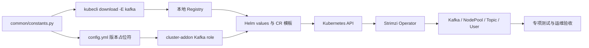

# Apache Kafka on Kubernetes 开发手册

| 文档属性 | 内容 |
| --- | --- |
| 文档类型 | 开发手册 |
| 适用范围 | Kubeauto Kafka 功能的开发、测试、发布与维护 |
| 适用版本 | Strimzi 1.2.0、Apache Kafka 4.3.1、Drain Cleaner 1.6.1 |
| 适用读者 | 开发人员、测试人员、发布人员、技术文档维护人员 |
| 文档版本 | v1.0 |

## 目录

1. 模块边界
2. 代码结构与调用链
3. 版本与制品契约
4. 配置模型
5. 模板与资源所有权
6. 幂等与日志契约
7. 安全开发规范
8. 测试体系
9. 版本升级开发流程
10. 文档与发布门禁
11. 官方开发依据

## 第一章、模块边界

Kafka 是默认关闭的独立可选组件。`kafka_install: "no"` 时不得创建 Kafka CRD、命名空间、Helm release、Secret、PVC 或监控对象。Kafka 功能只管理自身配置、制品、角色、模板、测试和三份企业文档，不改变其他已交付组件的行为。

| 责任域 | Kafka 模块负责 | Kafka 模块不负责 |
| --- | --- | --- |
| Kubernetes | 校验目标集群、StorageClass 和拓扑条件 | 创建或重构 Kubernetes 核心集群 |
| Kafka | Operator、NodePool、Kafka、Topic、User、监控 | 应用业务幂等和 Schema 设计 |
| 安全 | TLS、SCRAM、ACL、配额、Secret 引用 | 在代码中生成或保存客户生产密码 |
| 存储 | PVC 声明、容量和扩容契约 | CSI 后端建设和物理存储运维 |
| 灾备 | 提供 Kafka 核心的边界说明 | 未经独立设计直接启用 MM2 |

## 第二章、代码结构与调用链

### 2.1 文件结构

| 路径 | 职责 |
| --- | --- |
| `common/constants.py` | Strimzi、Kafka、metadata、Drain Cleaner 版本与镜像清单 |
| `conf/config.yml` | Kafka 开关、命名空间、拓扑、资源、存储、安全和监控参数 |
| `service/cluster/manager.py` | 将固定版本写入集群配置占位符 |
| `service/cluster/registry.py` | 将 Kafka 镜像纳入可选组件下载与本地 Registry |
| `roles/cluster-addon/tasks/kafka.yml` | 参数校验、CRD、Helm、证书、CR 发布和就绪等待 |
| `roles/cluster-addon/templates/kafka/` | Operator、Drain Cleaner、Kafka 和监控模板 |
| `roles/cluster-addon/files/` | 固定官方 Chart 及 SHA256 |
| `tests/helpers/kafka-regression.sh` | Kafka 专项现场验收 |
| `tests/helpers/kafka-cleanup.sh` | Kafka 专属资源限定清理与验证 |
| `tests/kafka-test-matrix.yaml` | Kafka 专项能力及当前证据状态 |
| `tests/unit/test_kafka_delivery.py` | 版本、模板、供应链、runner 和文档契约 |
| `docs/middleware/kafka/` | 用户、运维、白皮书和开发手册 |

### 2.2 调用链



`download` 阶段负责镜像供应链和本地 Registry；`cluster-addon` 阶段只使用已锁定制品并协调 Kubernetes 资源。不得在模板或 Ansible role 中动态发现镜像版本。

节点排空门禁遵循 Drain Cleaner 官方控制协议：先验证双副本、跨节点分布、PDB、`failurePolicy=Fail` 和两个 Ready endpoint；随后捕获首次 eviction 的主动拒绝，等待 Operator 完成单 Pod 滚动和 Kafka 状态恢复，再重试排空直至成功。门禁必须识别 `will be rolled by the Strimzi Cluster Operator` 响应，不得把 webhook 超时、连接失败或 endpoint 缺失视为等价成功信号。

## 第三章、版本与制品契约

### 3.1 固定版本

| 逻辑组件 | 上游镜像 | 发布镜像 |
| --- | --- | --- |
| Cluster Operator | `quay.io/strimzi/operator:1.2.0` | `brinnatt/strimzi-operator:1.2.0` |
| Kafka | `quay.io/strimzi/kafka:1.2.0-kafka-4.3.1` | `brinnatt/strimzi-kafka:1.2.0-kafka-4.3.1` |
| Drain Cleaner | `quay.io/strimzi/drain-cleaner:1.6.1` | `brinnatt/strimzi-drain-cleaner:1.6.1` |

Operator values 将正式镜像重写为 `registry.talkschool.cn:5000/brinnatt/...`。版本号必须在常量、配置占位符、Chart、模板、辅助镜像仓、CI 双推矩阵和专项测试中保持一致。

### 3.2 Chart 契约

| Chart | 固定文件 | 校验方式 |
| --- | --- | --- |
| Strimzi Kafka Operator | `strimzi-kafka-operator-1.2.0.tgz` | 同目录 `.sha256`，安装前 `sha256sum --check` |
| Strimzi Drain Cleaner | `strimzi-drain-cleaner-1.6.1.tgz` | 同目录 `.sha256`，安装前 `sha256sum --check` |

下载新 Chart 时先写临时文件，校验官方来源和 SHA256 后原子替换。校验失败的文件不得进入正式目录。

### 3.3 外部镜像仓

所有运行、升级、回滚、性能和测试基础设施镜像均先进入 `kubeauto-ext-images-dockerfile` 的功能目录：

```text
middleware/kafka/
├── strimzi/
│   ├── strimzi-operator/
│   ├── strimzi-kafka/
│   └── strimzi-drain-cleaner/
├── test-support/
│   └── strimzi-kafka-4.3.0/
└── test-storage/
    └── longhorn/
```

新增镜像必须使用固定官方 `FROM`，在 GitHub Actions 中注册唯一 Docker Hub/TalkEdu 双推项，并通过 `python3 scripts/validate_catalog.py`。发布阶段由同一次 GitHub Actions 构建完成双推并核验两端 manifest；中国现场默认只读取已经发布的 TalkEdu 制品，再以 manifest digest 验证 TalkEdu 到现场 Registry 的复制完整性，不把 Docker Hub 在线可达作为部署前提。需要复核指定外部仓库时，可在测试运行时通过 `KAFKA_IMAGE_VERIFY_PREFIX` 显式启用附加 digest 比对。Docker Hub 和官方上游保留为固定回退与发布核验来源；动态公共代理仅允许测试运行时临时注入，不得写入代码、CI、默认配置或企业文档。

## 第四章、配置模型

### 4.1 配置分组

| 分组 | 关键字段 | 校验要求 |
| --- | --- | --- |
| 开关与命名 | `kafka_install`、namespace、cluster name | DNS label，默认关闭 |
| 版本 | Operator、Kafka、metadata、Drain Cleaner | 与常量和 Chart 一致 |
| 拓扑 | Controller/Broker size、topology key | Controller 为 3，Broker 不少于 3 |
| 存储 | StorageClass、Controller/Broker PVC | 非空、只允许 `Gi`/`Ti` 正整数 |
| 资源 | CPU、内存、JVM heap | requests/limits 合法并保留堆外空间 |
| 安全 | Secret 名/key、CA 有效期 | 不包含 Secret 值，续期天数小于有效期 |
| Topic/User | Topic、分区、Group/Txn 前缀、配额 | 命名合法，分区不少于 3 |
| 可选功能 | Cruise Control、metrics、Drain Cleaner | 关闭时模板不产生无效引用 |

数值和布尔值必须保持 YAML 原生类型。Jinja 条件块关闭后不得留下空字段、空 Secret 引用或不完整 CR。

### 4.2 参数校验

参数在创建命名空间或资源前完成校验。校验错误必须给出具体约束，不将半配置 CR 提交给 Operator 后再等待异步失败。

## 第五章、模板与资源所有权

### 5.1 资源关系

| 模板 | 资源 | field manager/所有者 |
| --- | --- | --- |
| `operator-values.yaml.j2` | Operator Deployment、RBAC | Helm release `strimzi-kafka-operator` |
| `drain-cleaner-values.yaml.j2` | Drain Cleaner、Webhook、PDB | Helm release `strimzi-drain-cleaner` |
| `cluster.yaml.j2` | ConfigMap、NodePool、Kafka、Topic、User | `kubeauto-kafka` + Strimzi Operator |
| `monitoring.yaml.j2` | PodMonitor、PrometheusRule | `kubeauto-kafka-monitoring` |

CRD 从已通过 SHA256 校验的 Operator Chart 中逐文件提取并使用 `kubeauto-kafka-crd` field manager 执行 server-side apply。不得把缺少 YAML 文档分隔符的多个 CRD 文本作为单一标准输入提交，否则 YAML 解析只会保留最后一个重复顶层对象。Chart 内 CRD 文件数量与每个对象的 `Established` 状态均属于安装硬性门禁。已有字段不归该 manager 管理时，不得通过 `--force-conflicts` 无审计接管。

### 5.2 资源默认值

- Controller 和 Broker 使用独立 NodePool 与 PVC。
- 同一池使用 required pod anti-affinity 和 topology spread。
- Listener 为内部 TLS 9093，认证为 SCRAM-SHA-512。
- `default.replication.factor=3`、`min.insync.replicas=2`。
- `unclean.leader.election.enable=false`、`auto.create.topics.enable=false`。
- PDB `maxUnavailable=1`，PVC 默认保留。
- 监控 CRD 不存在时不发布监控对象，但 Kafka 安装本身不失败。

## 第六章、幂等与日志契约

### 6.1 幂等分类

| 类型 | 规则 | Kafka 示例 |
| --- | --- | --- |
| 声明式收敛 | 相同输入只应用差异 | CRD、Helm、Kafka、NodePool、监控 |
| 只读检查 | 不修改资源 | Ready、KRaft、ISR、指标、日志采集 |
| 固定目标变更 | change ID、目标和输入稳定 | 扩容、轮换、版本升级 |
| 临时验证资源 | run ID 唯一，退出精确回收 | 客户端 Pod、性能 Topic、故障注入 |
| 不可逆操作 | 默认拒绝，显式审批 | PVC/Topic 删除、metadata version 最终化 |

相同生产配置第二次执行时，应比较并保持 PVC、Secret、NodePool 和 Pod UID；无配置差异时不得产生额外 Helm revision 或无意外滚动。

### 6.2 日志要求

长时间任务输出阶段开始、周期心跳、对象状态、超时边界和唯一终端标志：

```text
KAFKA_STAGE_BEGIN id=<case> action=<operation>
KAFKA_WAIT_HEARTBEAT elapsed=<seconds> state=<state>
KAFKA_STAGE_PASS id=<case> evidence=<summary>
KAFKA_STAGE_FAIL id=<case> class=<failure-domain> reason=<reason>
```

日志不得输出密码、私钥、token、完整 Secret、JAAS 配置或可离线猜测的密码摘要。

## 第七章、安全开发规范

1. Secret 只在运行时引用，模板和测试 fixture 不包含真实值。
2. Ansible 涉及 Secret 的任务设置 `no_log: true`。
3. Drain Cleaner 证书使用临时目录生成，验证有效期、CA 链、SAN 和公私钥匹配。
4. Webhook 使用 `failurePolicy=Fail`，namespace selector 限定 Kafka 资源范围。
5. 客户端 NetworkPolicy、ACL 和配额必须同时提供正向与负向测试。
6. 禁止使用 `latest`、跳过 TLS 验证、管理员共享账号和无限重试。

## 第八章、测试体系

### 8.1 静态和契约测试

| 测试域 | 必须证明 |
| --- | --- |
| YAML | task 文件和全部渲染清单可结构化解析 |
| 版本 | 常量、Chart、镜像、配置和 CR 一致 |
| 供应链 | Dockerfile、CI 双推、TalkEdu/Docker Hub 映射一致 |
| 架构 | Controller/Broker 分池、KRaft、反亲和、PDB、PVC |
| 安全 | TLS、SCRAM、ACL、配额、Secret、证书和负向路径 |
| 可选功能 | 关闭 Cruise Control、metrics 或 bootstrap resources 后清单仍有效 |
| 幂等 | 二次 role 不替换持久身份或意外滚动 |
| 清理 | 仅匹配 Kafka 测试所有权，不删除其他中间件资源 |
| 文档 | 目录仅包含三份正式文档，用户与运维内容合并且结构、术语和操作说明符合交付要求 |

执行 Kafka 聚焦测试：

```bash
.venv/bin/python -m unittest tests.unit.test_kafka_delivery
```

### 8.2 专项现场测试

Kafka 使用独立入口，不执行核心全量回归：

```bash
bash tests/run_enterprise_regression.sh --kafka-only
bash tests/run_enterprise_regression.sh --kafka-status
bash tests/run_enterprise_regression.sh --kafka-follow
bash tests/run_enterprise_regression.sh --kafka-clean-only
```

现场能力至少覆盖：制品摘要、存储读写、安装、KRaft、真实生产消费、事务、TLS/SCRAM/ACL/配额负向、Broker/Controller 故障、再平衡、PVC 扩容、轮换、监控、性能、节点排空、升级回滚窗口、二次幂等和限定清理。

测试项在执行期间保持 `pending`。只有当前干净环境产生预期成功标志、durable `rc=0`、零失败标志和最终清理验证后才可更新为 `pass`。

限定清理必须保留协调者依赖顺序：先删除并等待 `KafkaRebalance`、`KafkaTopic` 和 `KafkaUser`，使 Entity Operator 有机会正常移除 finalizer；随后删除 `KafkaNodePool` 和 `Kafka`，最后卸载 Operator、Drain Cleaner、CRD 及测试存储。强制移除 finalizer 仅用于限定资源在超时后的失败回收，不得作为正常清理路径，也不得作用于未带 Kafka 测试所有权的资源。

### 8.3 失败分类

失败按供应链、主机环境、Kubernetes、存储/网络、Operator 协调、Kafka 数据面、客户端和测试门禁分层。只有稳定复现且官方文档或源码能够证明实现错误时才修改产品代码。失败的试验性改动和测试残留不得成为新基线。

## 第九章、版本升级开发流程

1. 核对目标 Strimzi、Kafka、Kubernetes 和 JDK 官方兼容矩阵。
2. 阅读目标 release notes、升级章节、CRD diff 和 `kafka-versions.yaml`。
3. 在辅助镜像仓增加升级前、目标和回退窗口所需的全部镜像并完成双推。
4. 更新常量、Chart、SHA256、模板和配置占位符。
5. 对现有 CR 执行结构化 diff，处理 API 删除、默认值和不可逆字段。
6. 先验证 Operator/CRD，再验证 Kafka 二进制，最后验证 metadata version。
7. 执行升级、回退窗口、业务、故障和性能专项测试。
8. 同步更新三份企业文档中的版本、命令、字段和边界。

不得将 Kafka 二进制升级、metadata version 最终化和 Controller 拓扑变化合并为一个无回退点的步骤。

## 第十章、文档与发布门禁

Kafka 目录只允许以下三份客户交付文档，覆盖用户、运维、技术和开发四类内容：

| 文件 | 文档类型 | 内容边界 |
| --- | --- | --- |
| `operations-manual.md` | 用户与运维手册 | 部署、接入、Topic/User、上线验收、巡检、故障、容量、性能、轮换、升级回滚和灾备 |
| `technical-whitepaper.md` | 技术白皮书 | 架构、原理、一致性、安全、存储和能力边界 |
| `development-manual.md` | 开发手册 | 代码、配置、模板、制品、测试和发布契约 |

客户文档只描述产品规格、适用边界、使用方法、运维方法和开发契约，不记录项目管理信息或历史过程。异常处理、回滚和风险提示使用 Markdown 引用块，与正常操作主线分离。每段可执行脚本说明功能、输入、影响、产物、幂等、关键日志和成功标志。

## 第十一章、官方开发依据

| 主题 | 官方资料 |
| --- | --- |
| Strimzi 1.2.0 部署与升级 | [Deploying and Managing Strimzi](https://strimzi.io/docs/operators/1.2.0/deploying.html) |
| Strimzi 1.2.0 API | [API Reference](https://strimzi.io/docs/operators/1.2.0/configuring.html) |
| Strimzi 版本映射 | [kafka-versions.yaml](https://github.com/strimzi/strimzi-kafka-operator/blob/1.2.0/kafka-versions.yaml) |
| Strimzi 发布说明 | [1.2.0 Release](https://github.com/strimzi/strimzi-kafka-operator/releases/tag/1.2.0) |
| Drain Cleaner | [Official repository](https://github.com/strimzi/drain-cleaner) |
| Kafka 4.3 升级 | [Apache Kafka Upgrade](https://kafka.apache.org/43/getting-started/upgrade/) |
| KRaft | [Apache Kafka KRaft](https://kafka.apache.org/43/operations/kraft/) |
| Kafka 安全 | [Apache Kafka Security](https://kafka.apache.org/43/security/) |
| Kafka 运维 | [Apache Kafka Operations](https://kafka.apache.org/43/operations/) |

新增或修改字段时，应以锁定版本 CRD schema、官方文档和 tag 源码为依据，并使用结构化 YAML 测试证明渲染结果。
