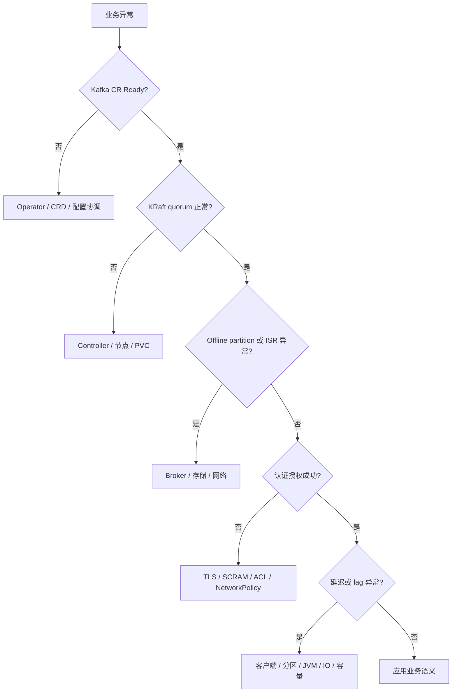
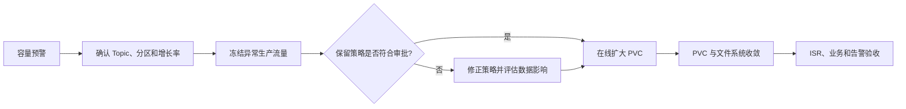

# Apache Kafka on Kubernetes 用户与运维手册

| 文档属性 | 内容 |
| --- | --- |
| 文档类型 | 用户手册与运维手册（合并版） |
| 适用平台 | Kubeauto 管理的 Kubernetes 1.33.6 集群 |
| 适用版本 | Strimzi 1.2.0、Apache Kafka 4.3.1、Drain Cleaner 1.6.1 |
| 适用读者 | 实施工程师、平台管理员、应用负责人、Kafka 管理员、值班人员、安全管理员 |
| 文档版本 | v1.0 |

## 目录

1. 使用约定与职责
2. 环境准备、配置与安装
3. 客户端接入
4. Topic、用户与应用规范
5. 运维原则与操作分级
6. 日常巡检
7. 监控与告警
8. 故障诊断
9. Broker 故障与 KRaft 故障
10. 容量、水位与 PVC 扩容
11. Broker 扩缩容与再平衡
12. 节点维护与 Drain Cleaner
13. 用户密码与证书轮换
14. 性能测试与分析
15. 升级与回滚
16. 数据保护与灾难恢复
17. 上线与变更验收

## 第一章、使用约定与职责

本手册按生产使用顺序组织。首次部署依次执行第二章至第四章，完成上线验收后进入第五章以后的日常运维流程。架构、一致性和故障边界参见[技术白皮书](./technical-whitepaper.md)。


### 1.1 职责分工

| 角色 | 主要职责 |
| --- | --- |
| 平台管理员 | Kubernetes、StorageClass、节点故障域、镜像仓库和 Kubeauto 配置 |
| Kafka 管理员 | Topic、用户、ACL、配额、容量、监控和变更审核 |
| 应用负责人 | Producer/Consumer 参数、业务幂等、Schema、消费失败处理和 SLO |
| 安全管理员 | Secret、证书、密码轮换、网络边界和审计 |

所有命令均从已安装 Kubeauto、能够访问目标集群且配置正确 `kubeconfig` 的 Linux 管理节点执行。Secret 值不得写入 Git、文档、工单正文、终端历史或日志。

### 1.2 统一执行契约

| 项目 | 约定 |
| --- | --- |
| 权威配置 | `clusters/<cluster>/config.yml` |
| 正式入口 | `kubecli download -E kafka`、`kubecli setup <cluster> 07` |
| 重复执行 | 相同配置声明式收敛，不应替换 PVC、Secret、NodePool 或无故滚动 Pod |
| 成功判定 | 命令退出码为 0，并完成业务验收；Pod `Running` 不是最终结果 |
| 失败处理 | 保留 CR、Pod、PVC、事件和 Operator 日志，按第八章分层诊断 |
| 数据删除 | 默认禁止；`kafka_delete_claim` 保持 `false` |

每段脚本均说明功能、输入、影响、产物、幂等行为、关键日志和成功标志。没有出现唯一成功标志，或任意硬性检查失败，均不得进入下一步骤。

## 第二章、环境准备、配置与安装

### 2.1 最低生产条件

| 检查项 | 要求 | 验收方式 |
| --- | --- | --- |
| Kubernetes | 所有目标节点 `Ready` | `kubectl get nodes -o wide` |
| 故障域 | 至少三个不同拓扑值 | 按 `kafka_topology_key` 查看节点标签 |
| StorageClass | 动态供应、块存储、允许扩容 | 查看 `provisioner` 和 `allowVolumeExpansion` |
| 网络 | Pod DNS、Service 网络和 Registry 可达 | 集群现有生产网络门禁 |
| 时间 | 节点时钟同步 | 节点 NTP/chrony 状态 |
| 资源 | 每个 Broker 和 Controller 满足配置请求 | 对比节点 Allocatable 与当前 requests |
| 监控 | Prometheus Operator CRD 可用 | 需要自动发布监控对象时检查 |

以下脚本只读检查节点故障域和 StorageClass。重复执行不会修改集群。

| 项目 | 内容 |
| --- | --- |
| 功能 | 验证三故障域和可扩容 StorageClass |
| 输入 | `TOPOLOGY_KEY`、`STORAGE_CLASS` |
| 影响 | 只读查询 Kubernetes API |
| 产物 | 终端输出 |
| 幂等 | 可重复执行 |
| 关键日志 | `[1/3]` 至 `[3/3]` |
| 成功标志 | `KAFKA_PLATFORM_PREFLIGHT_PASS` |

```bash
bash <<'KAFKA_PLATFORM_PREFLIGHT'
set -Eeuo pipefail
: "${TOPOLOGY_KEY:=kubernetes.io/hostname}"
: "${STORAGE_CLASS:?请设置 STORAGE_CLASS}"

echo '[1/3] 检查可调度节点和拓扑分布。'
kubectl get nodes -o json | jq -e --arg key "$TOPOLOGY_KEY" '
  [.items[]
   | select(any(.status.conditions[]?; .type == "Ready" and .status == "True"))
   | select(.spec.unschedulable != true)
   | .metadata.labels[$key]]
  | map(select(. != null)) | unique | length >= 3' >/dev/null

echo '[2/3] 检查 StorageClass 存在并允许扩容。'
test "$(kubectl get storageclass "$STORAGE_CLASS" -o jsonpath='{.allowVolumeExpansion}')" = true
kubectl get storageclass "$STORAGE_CLASS" \
  -o custom-columns=NAME:.metadata.name,PROVISIONER:.provisioner,EXPAND:.allowVolumeExpansion

echo '[3/3] 检查集群中是否存在同名 Kafka 资源。'
if kubectl -n kafka get kafka kafka-prod >/dev/null 2>&1; then
  echo '检测到既有 kafka/kafka-prod；后续操作将按权威配置进行幂等收敛。'
else
  echo '未检测到既有 kafka/kafka-prod。'
fi
echo KAFKA_PLATFORM_PREFLIGHT_PASS
KAFKA_PLATFORM_PREFLIGHT
```

> **异常处理：** 若故障域不足，应补充节点标签或调整拓扑规划，不得降低 Controller/Broker 副本数绕过检查。若 StorageClass 不允许扩容，应在上线前更换经过验证的 StorageClass；已创建 PVC 不能通过修改 StorageClass 名原地迁移。

### 2.2 容量规划

```text
原始保留数据量 = 峰值写入字节/秒 × 保留秒数
副本后物理数据量 = 原始保留数据量 × 3 ÷ 实测压缩率
建议容量 = 副本后物理数据量 × 索引与段文件开销 × 1.30 以上安全余量
```

容量评审还应包含 Consumer 积压、复制恢复期间的临时增长、JVM 堆外内存、Linux page cache、网络带宽和存储 IOPS。实验室容量不能直接用于生产。

### 2.3 配置 Kafka

编辑 `clusters/<cluster>/config.yml`：

```yaml
kafka_install: "yes"
kafka_namespace: "kafka"
kafka_operator_namespace: "kafka-operator"
kafka_drain_cleaner_namespace: "kafka-drain-cleaner"
kafka_cluster_name: "kafka-prod"
kafka_storage_class: "<经评审的 StorageClass>"
kafka_topology_key: "topology.kubernetes.io/zone"
kafka_controller_size: 3
kafka_broker_size: 3
kafka_controller_pvc_size: "20Gi"
kafka_broker_pvc_size: "100Gi"
kafka_delete_claim: false
kafka_operator_replicas: 2
kafka_cruise_control_enabled: true
kafka_metrics_enabled: true
kafka_monitoring_release_label: "prometheus"
kafka_drain_cleaner_enabled: true
kafka_bootstrap_resources_enabled: true
kafka_default_topic: "kubeauto-events"
kafka_default_topic_partitions: 6
kafka_default_topic_retention_ms: 604800000
kafka_app_user: "kafka-app"
kafka_app_password_secret: "kafka-app-password"
kafka_app_password_secret_key: "password"
kafka_default_group_prefix: "kubeauto-"
kafka_default_transactional_id_prefix: "kubeauto-"
```

Controller 固定为 3，Broker 不少于 3。JVM 堆不能占用容器全部内存，必须为直接内存、线程栈和 Linux page cache 保留空间。

### 2.4 创建应用密码 Secret

密码由企业密码系统生成，长度不少于 32 字节。以下脚本从受控文件读取固定版本密码，相同输入重复执行不会产生新密码。

| 项目 | 内容 |
| --- | --- |
| 功能 | 创建或收敛 Kafka 应用密码 Secret |
| 输入 | `PASSWORD_FILE`、`PASSWORD_VERSION` |
| 影响 | 创建或更新 `kafka/kafka-app-password` |
| 产物 | Kubernetes Secret 和密码版本 annotation |
| 幂等 | 相同密码版本和输入重复执行不产生新密码 |
| 关键日志 | Secret 名称、密码版本；不输出密码 |
| 成功标志 | `KAFKA_APPLICATION_SECRET_READY` |

```bash
bash <<'KAFKA_APPLICATION_SECRET'
set -Eeuo pipefail
: "${PASSWORD_FILE:?请设置密码系统导出的 PASSWORD_FILE}"
: "${PASSWORD_VERSION:?请设置密码系统版本号 PASSWORD_VERSION}"
NAMESPACE=kafka
SECRET=kafka-app-password
test -r "$PASSWORD_FILE"
test "$(wc -c <"$PASSWORD_FILE")" -ge 32

echo '[1/3] 创建 Kafka 命名空间；已存在时保持不变。'
kubectl create namespace "$NAMESPACE" --dry-run=client -o yaml | kubectl apply -f - >/dev/null

echo '[2/3] 以密码系统固定版本收敛应用 Secret；不输出 Secret 内容。'
kubectl -n "$NAMESPACE" create secret generic "$SECRET" \
  --from-file=password="$PASSWORD_FILE" --dry-run=client -o yaml \
  | kubectl apply --server-side --field-manager=kubeauto-kafka-secret -f - >/dev/null
kubectl -n "$NAMESPACE" annotate secret "$SECRET" \
  "kubeauto.io/password-version=$PASSWORD_VERSION" --overwrite >/dev/null
kubectl -n "$NAMESPACE" label secret "$SECRET" \
  app.kubernetes.io/managed-by=kubeauto kubeauto.io/component=kafka-user --overwrite >/dev/null

echo '[3/3] 验证 Secret key、长度和版本标识。'
encoded="$(kubectl -n "$NAMESPACE" get secret "$SECRET" -o jsonpath='{.data.password}')"
test -n "$encoded"
test "$(printf '%s' "$encoded" | base64 -d | wc -c)" -ge 32
test "$(kubectl -n "$NAMESPACE" get secret "$SECRET" \
  -o jsonpath='{.metadata.annotations.kubeauto\.io/password-version}')" = "$PASSWORD_VERSION"
echo "secret=$NAMESPACE/$SECRET password_version=$PASSWORD_VERSION"
echo KAFKA_APPLICATION_SECRET_READY
KAFKA_APPLICATION_SECRET
```

> **注意：** 密码轮换属于独立变更，必须使用新的密码系统版本和第十三章轮换流程，不得在重跑安装时生成随机密码。

### 2.5 执行安装

| 项目 | 内容 |
| --- | --- |
| 功能 | 下载固定 Kafka 制品并执行 Kafka addon |
| 输入 | `KUBEAUTO_CLUSTER` |
| 影响 | 安装 CRD、Operator、Drain Cleaner、Kafka、NodePool、Topic 和 User |
| 产物 | 渲染清单、Helm release、Kubernetes 资源和 PVC |
| 幂等 | 相同配置重复执行声明式收敛 |
| 关键日志 | Chart 校验、CRD、Operator、`KAFKA_WAIT_HEARTBEAT`、`KAFKA_CONTROL_PLANE_READY` |
| 成功判定 | 两个命令退出码为 0，并继续完成 2.6 节就绪检查 |

```bash
bash <<'KAFKA_INSTALL'
set -Eeuo pipefail
: "${KUBEAUTO_CLUSTER:?请设置 KUBEAUTO_CLUSTER}"
CONFIG="clusters/${KUBEAUTO_CLUSTER}/config.yml"

echo '[1/3] 验证 Kafka 已启用并配置 StorageClass。'
test -s "$CONFIG"
grep -Eq '^kafka_install:[[:space:]]*["'"']?yes["'"']?[[:space:]]*$' "$CONFIG"
grep -Eq '^kafka_storage_class:[[:space:]]*["'"']?[^"'"'[:space:]]+' "$CONFIG"

echo '[2/3] 下载并校验固定 Kafka 镜像与制品。'
kubecli download -E kafka

echo '[3/3] 执行 cluster-addon Kafka 安装步骤。'
kubecli setup "$KUBEAUTO_CLUSTER" 07
echo KAFKA_INSTALL_COMMAND_PASS
KAFKA_INSTALL
```

### 2.6 控制面与数据面就绪检查

以下脚本只读等待 Kafka CR、三个 Controller、三个 Broker、六个以上 PVC、Topic 和 User 全部就绪。每 60 秒输出一次当前状态。

```bash
bash <<'KAFKA_READY'
set -Eeuo pipefail
NS=kafka
CLUSTER=kafka-prod
for attempt in $(seq 1 60); do
  state="$(kubectl -n "$NS" get kafka "$CLUSTER" -o jsonpath='{.status.conditions[?(@.type=="Ready")].status}' 2>/dev/null || true)"
  controllers="$(kubectl -n "$NS" get pod -l strimzi.io/cluster="$CLUSTER",strimzi.io/pool-name=controller -o json | jq '[.items[] | select(any(.status.conditions[]?; .type == "Ready" and .status == "True"))] | length')"
  brokers="$(kubectl -n "$NS" get pod -l strimzi.io/cluster="$CLUSTER",strimzi.io/pool-name=broker -o json | jq '[.items[] | select(any(.status.conditions[]?; .type == "Ready" and .status == "True"))] | length')"
  pvc="$(kubectl -n "$NS" get pvc -l strimzi.io/cluster="$CLUSTER" -o json | jq '[.items[] | select(.status.phase == "Bound")] | length')"
  topic="$(kubectl -n "$NS" get kafkatopic kubeauto-events -o jsonpath='{.status.conditions[?(@.type=="Ready")].status}' 2>/dev/null || true)"
  user="$(kubectl -n "$NS" get kafkauser kafka-app -o jsonpath='{.status.conditions[?(@.type=="Ready")].status}' 2>/dev/null || true)"
  if [ "$state" = True ] && [ "$controllers" -eq 3 ] && [ "$brokers" -eq 3 ] \
    && [ "$pvc" -ge 6 ] && [ "$topic" = True ] && [ "$user" = True ]; then
    echo "kafka=$state controllers=$controllers brokers=$brokers pvc=$pvc topic=$topic user=$user"
    echo KAFKA_CONTROL_DATA_READY
    exit 0
  fi
  if [ $((attempt % 6)) -eq 0 ]; then
    echo "KAFKA_READY_WAIT elapsed_seconds=$((attempt * 10)) kafka=${state:-missing} controllers=$controllers brokers=$brokers pvc=$pvc topic=${topic:-missing} user=${user:-missing}"
  fi
  sleep 10
done
kubectl -n "$NS" get kafka,kafkanodepool,kafkatopic,kafkauser,pod,pvc -o wide
exit 1
KAFKA_READY
```

> **异常处理：** 首先查看 Kafka condition、命名空间事件和 Cluster Operator 日志。不得通过删除 PVC、降低副本数或同时重启多个 Pod 处理安装失败。

## 第三章、客户端接入

### 3.1 连接参数

| 参数 | 值 |
| --- | --- |
| Bootstrap Service | `kafka-prod-kafka-bootstrap.kafka.svc:9093` |
| 协议 | `SASL_SSL` |
| SASL 机制 | `SCRAM-SHA-512` |
| CA Secret | `kafka/kafka-prod-cluster-ca-cert`，key 为 `ca.crt` |
| 用户 | `kafka-app` |
| 密码 Secret | `kafka/kafka-app-password`，key 为 `password` |
| 默认 Topic | `kubeauto-events` |
| Consumer Group 前缀 | `kubeauto-` |
| Transactional ID 前缀 | `kubeauto-` |

应用命名空间必须具有允许接入的标签：

```bash
: "${APPLICATION_NAMESPACE:?请设置 APPLICATION_NAMESPACE}"
kubectl label namespace "$APPLICATION_NAMESPACE" kubeauto.io/kafka-client=true --overwrite
```

应用 Deployment 应通过 Secret volume 或 SecretKeyRef 读取密码，通过 Secret volume 挂载 CA。禁止把 Broker Pod IP、单个 Broker DNS 或明文密码写入应用配置。

### 3.2 Java 客户端配置基线

```properties
bootstrap.servers=kafka-prod-kafka-bootstrap.kafka.svc:9093
security.protocol=SASL_SSL
sasl.mechanism=SCRAM-SHA-512
sasl.jaas.config=org.apache.kafka.common.security.scram.ScramLoginModule required username="kafka-app" password="${由 Secret 注入}";
ssl.truststore.type=PEM
ssl.truststore.certificates=${由 Secret 挂载的 ca.crt 内容或客户端支持的 PEM 文件参数}
client.dns.lookup=use_all_dns_ips
acks=all
enable.idempotence=true
delivery.timeout.ms=120000
request.timeout.ms=30000
```

Consumer 应根据业务处理语义设置 `enable.auto.commit=false`，在业务处理成功后提交 offset。事务消费设置 `isolation.level=read_committed`。

### 3.3 生产与消费验收

1. 使用正确 CA 和凭据生产带唯一业务标识的消息。
2. 使用符合 ACL 的 Consumer Group 消费同一消息。
3. 核对 key、value、partition、offset 和业务标识。
4. 使用错误 CA、错误密码、越权 Topic 和越权 Group 分别验证连接或授权被拒绝。
5. 记录客户端版本、Bootstrap Service、时间、错误码和成功标志；不记录密码。

## 第四章、Topic、用户与应用规范

### 4.1 Topic 管理

Topic 通过 `KafkaTopic` 管理，不依赖自动创建：

```yaml
apiVersion: kafka.strimzi.io/v1
kind: KafkaTopic
metadata:
  name: order-events
  namespace: kafka
  labels:
    strimzi.io/cluster: kafka-prod
    app.kubernetes.io/managed-by: kubeauto
spec:
  partitions: 12
  replicas: 3
  config:
    cleanup.policy: delete
    retention.ms: 604800000
    min.insync.replicas: 2
```

提交前应评审分区并行度、保留时间、消息大小、压缩方式和磁盘需求。增加分区可能改变 key 到分区的映射，分区数不能原地缩小。

### 4.2 最小权限用户

```yaml
apiVersion: kafka.strimzi.io/v1
kind: KafkaUser
metadata:
  name: order-service
  namespace: kafka
  labels:
    strimzi.io/cluster: kafka-prod
spec:
  authentication:
    type: scram-sha-512
  authorization:
    type: simple
    acls:
      - type: allow
        host: "*"
        operations: [Read, Write, Describe]
        resource: {type: topic, name: order-events, patternType: literal}
      - type: allow
        host: "*"
        operations: [Read, Describe]
        resource: {type: group, name: order-, patternType: prefix}
  quotas:
    producerByteRate: 10485760
    consumerByteRate: 10485760
    requestPercentage: 50
```

每个应用使用独立用户和 ACL。管理员身份、业务生产者、业务消费者和监控身份不得共用凭据。

### 4.3 应用配置规范

| 场景 | 必需配置 | 应用责任 |
| --- | --- | --- |
| 可靠写入 | `acks=all`、幂等 Producer、有限超时 | 对最终失败进行业务补偿 |
| 同 key 有序 | 稳定 key | 不跨分区声明全局顺序 |
| 事务写入 | 唯一稳定 `transactional.id` | 明确 Kafka 事务边界 |
| 消费处理 | 手工提交 offset | 处理重试、幂等和死信 |
| Schema 演进 | 独立 Schema 管理方案 | 保证前后兼容并控制发布顺序 |
| 凭据轮换 | 支持刷新 Secret 和连接池重连 | 验证新凭据后停止旧连接 |

完成第三章和第四章后，按第十七章上线验收表完成签收，方可开放生产流量。

## 第五章、运维原则与操作分级

### 5.1 基本原则

1. 先保存现场证据，再执行恢复动作。
2. 先判断故障层次，再修改对应层；不得用重启掩盖根因。
3. 所有持久配置均回写 `clusters/<cluster>/config.yml`，不得长期保留现场 CR 分叉。
4. 同一时间只实施一种高风险变更，不同时进行版本升级、证书轮换、扩缩容和存储迁移。
5. Kafka 副本不是备份；删除 Topic、缩短保留时间和删除 PVC 均可能造成不可恢复的数据损失。
6. Controller 固定为三个成员，不按 Broker 扩缩容方式调整 Controller NodePool。
7. 正常变更完成后必须验证 Kafka Ready、KRaft quorum、ISR、offline partition、真实生产消费和监控告警。

### 5.2 操作分级

| 级别 | 操作 | 审批和前置条件 |
| --- | --- | --- |
| 只读 | 巡检、指标查询、日志与事件采集 | 值班权限，可随时执行 |
| 低风险 | Topic 保留参数、用户配额调整 | 配置评审、业务确认、回滚值 |
| 中风险 | Broker 扩容、PVC 扩容、单节点排空 | 变更单、健康基线、容量与回滚判断 |
| 高风险 | Broker 缩容、证书轮换、版本升级 | 维护窗口、数据保护证据、业务负责人在场 |
| 破坏性 | Topic/PVC 删除、metadata version 最终化、灾难切换 | 双人复核、恢复方案和明确授权 |

### 5.3 脚本日志语义

| 日志 | 含义 |
| --- | --- |
| `[n/N]` | 当前步骤和总步骤数 |
| `*_WAIT elapsed_seconds=` | 控制器或数据面仍在收敛，不代表失败 |
| `*_READY` | 指定对象达到就绪门槛，仍需后续业务验收 |
| `*_COLLECTION_PASS` | 诊断资料采集完成，不代表系统健康 |
| `*_PASS` | 该脚本全部硬性检查通过 |

脚本中没有出现唯一成功标志，或任意命令以非零状态退出，均应判定本步骤失败。

## 第六章、日常巡检

### 6.1 巡检项目

| 周期 | 检查项 | 异常条件 |
| --- | --- | --- |
| 5 分钟 | Kafka Ready、Broker/Controller 数量 | Ready 非 True 或实例数不足 |
| 5 分钟 | Offline partition、Under-replicated partition | 任一持续大于 0 |
| 5 分钟 | Consumer lag、请求错误率和 P99 | 超过业务 SLO |
| 15 分钟 | PVC 使用率和增长率 | 达到扩容阈值或预计耗尽时间过短 |
| 每日 | KRaft quorum、Operator reconcile | voter 缺失、reconcile 失败 |
| 每日 | Pod 重启、OOM、节点压力、事件 | 非计划重启或资源压力 |
| 每周 | Topic、ACL、配额与配置源差异 | 现场状态与审批配置不一致 |
| 每月 | 证书有效期、恢复方案和容量预测 | 有效期或容量低于计划窗口 |

### 6.2 一键只读巡检

| 项目 | 内容 |
| --- | --- |
| 功能 | 检查 CR、Pod、PVC、故障域和近期事件 |
| 输入 | `KAFKA_NAMESPACE`、`KAFKA_CLUSTER` |
| 影响 | 只读查询 |
| 产物 | 终端输出，可重定向到受控证据目录 |
| 幂等 | 可重复执行 |
| 关键日志 | `[1/5]` 至 `[5/5]` |
| 成功标志 | `KAFKA_DAILY_HEALTH_PASS` |

```bash
bash <<'KAFKA_DAILY_HEALTH'
set -Eeuo pipefail
: "${KAFKA_NAMESPACE:=kafka}"
: "${KAFKA_CLUSTER:=kafka-prod}"

echo '[1/5] 检查 Kafka CR 和版本。'
test "$(kubectl -n "$KAFKA_NAMESPACE" get kafka "$KAFKA_CLUSTER" \
  -o jsonpath='{.status.conditions[?(@.type=="Ready")].status}')" = True
kubectl -n "$KAFKA_NAMESPACE" get kafka "$KAFKA_CLUSTER" \
  -o custom-columns=NAME:.metadata.name,KAFKA:.status.kafkaVersion,METADATA:.status.kafkaMetadataVersion,READY:.status.conditions[0].status

echo '[2/5] 检查 Controller、Broker 和故障域。'
for pool in controller broker; do
  count="$(kubectl -n "$KAFKA_NAMESPACE" get pod \
    -l strimzi.io/cluster="$KAFKA_CLUSTER",strimzi.io/pool-name="$pool" -o json \
    | jq '[.items[] | select(any(.status.conditions[]?; .type == "Ready" and .status == "True"))] | length')"
  test "$count" -eq 3
  kubectl -n "$KAFKA_NAMESPACE" get pod \
    -l strimzi.io/cluster="$KAFKA_CLUSTER",strimzi.io/pool-name="$pool" -o wide
done

echo '[3/5] 检查所有 Kafka PVC 为 Bound。'
kubectl -n "$KAFKA_NAMESPACE" get pvc -l strimzi.io/cluster="$KAFKA_CLUSTER" -o json \
  | jq -e '([.items[] | select(.status.phase != "Bound")] | length) == 0' >/dev/null
kubectl -n "$KAFKA_NAMESPACE" get pvc -l strimzi.io/cluster="$KAFKA_CLUSTER"

echo '[4/5] 检查 Topic 和 User 协调状态。'
kubectl -n "$KAFKA_NAMESPACE" get kafkatopic,kafkauser -o json \
  | jq -e '([.items[] | select(any(.status.conditions[]?; .type == "Ready" and .status != "True"))] | length) == 0' >/dev/null
kubectl -n "$KAFKA_NAMESPACE" get kafkatopic,kafkauser

echo '[5/5] 输出最近事件和 Pod 重启数。'
kubectl -n "$KAFKA_NAMESPACE" get pod -l strimzi.io/cluster="$KAFKA_CLUSTER" \
  -o custom-columns=NAME:.metadata.name,NODE:.spec.nodeName,RESTARTS:.status.containerStatuses[*].restartCount
kubectl -n "$KAFKA_NAMESPACE" get events --sort-by=.lastTimestamp | tail -30
echo KAFKA_DAILY_HEALTH_PASS
KAFKA_DAILY_HEALTH
```

> **注意：** 本脚本验证 Kubernetes 与 Strimzi 状态，不替代客户端生产消费、KRaft quorum、ISR 和业务 lag 检查。

## 第七章、监控与告警

### 7.1 关键告警

| 告警 | 严重程度 | 首要检查 |
| --- | --- | --- |
| `KafkaOfflinePartitions` | 紧急 | Broker、Leader、存储和网络 |
| `KafkaNoActiveController` | 紧急 | Controller quorum、节点和 PVC |
| `KafkaUnderReplicatedPartitions` | 高 | ISR、Broker 日志、磁盘与网络 |
| `KafkaPersistentVolumeFillingUp` | 高 | 增长率、保留策略和扩容能力 |
| `KafkaConsumerLagHigh` | 高/中 | 消费速率、处理错误和分区并行度 |
| `KafkaMetricsAbsent` | 高 | PodMonitor、Service、网络策略和 exporter |

告警恢复后应保留触发时间、峰值、影响 Topic/Group、处置动作和恢复时间。告警自动消退不能替代根因记录。

### 7.2 指标解释顺序

1. 检查 offline partition 和 active controller，判断是否存在可用性事件。
2. 检查 ISR shrink/expand 和 under-replicated partition，判断复制是否稳定。
3. 检查请求错误率、P95/P99、网络和磁盘延迟，确定瓶颈层。
4. 检查 Consumer lag 与消费速率，区分生产突增和消费能力不足。
5. 检查 JVM GC、CPU throttling、内存和 page cache，确认资源压力。

Strimzi Cluster Operator 1.2.0 的 `:8080/metrics` 端点至少应返回标准 Prometheus 运行时指标，例如 `jvm_info` 或 `vertx_*`。不得以是否存在某个固定的 `strimzi_*` 指标名称作为端点可用性的唯一判据。Kafka 资源的协调结果应同时核对 Kafka condition、Kubernetes 事件和 Cluster Operator 日志。

> **异常处理：** 指标端点不可访问时，依次检查 Operator Pod Ready、容器端口 `8080`、PodMonitor/ServiceMonitor、NetworkPolicy 和 Prometheus target。端点能够返回 JVM/Vert.x 指标但缺少预期业务指标时，应先核对当前固定版本的官方指标清单和采集配置，不得直接判定 Operator 故障。

## 第八章、故障诊断

### 8.1 分层诊断流程



### 8.2 诊断资料采集

| 项目 | 内容 |
| --- | --- |
| 功能 | 保存对象、事件和组件日志 |
| 输入 | `EVIDENCE_ROOT`，可选；默认当前目录 `evidence` |
| 影响 | 只读集群，在管理节点创建唯一目录 |
| 产物 | YAML、文本日志、运行元数据 |
| 幂等 | 每次生成唯一目录，不覆盖历史证据 |
| 关键日志 | 每类资源的保存路径 |
| 成功标志 | `KAFKA_DIAGNOSTIC_COLLECTION_PASS health_verified=false` |

```bash
bash <<'KAFKA_DIAGNOSTICS'
set -Eeuo pipefail
: "${EVIDENCE_ROOT:=$PWD/evidence}"
run_id="$(date -u +%Y%m%dT%H%M%SZ)-$$"
tmp="$(mktemp -d "$EVIDENCE_ROOT/.kafka-$run_id.XXXXXX")"
final="$EVIDENCE_ROOT/kafka-$run_id"
mkdir -p "$EVIDENCE_ROOT"
trap 'test -d "$tmp" && echo "诊断临时目录保留：$tmp" >&2' ERR

echo '[1/4] 保存集群对象。'
kubectl -n kafka get kafka,kafkanodepool,kafkatopic,kafkauser,kafkarebalance,pod,pvc,svc -o yaml >"$tmp/kafka-resources.yaml"
kubectl get node -o wide >"$tmp/nodes.txt"

echo '[2/4] 保存事件和 Operator 日志。'
kubectl -n kafka get events --sort-by=.lastTimestamp >"$tmp/events.txt"
kubectl -n kafka-operator logs deployment/strimzi-cluster-operator --tail=1000 >"$tmp/operator.log" 2>&1 || true
kubectl -n kafka-drain-cleaner logs deployment/strimzi-drain-cleaner --tail=500 >"$tmp/drain-cleaner.log" 2>&1 || true

echo '[3/4] 保存 Kafka Pod 当前及 previous 日志。'
for pod in $(kubectl -n kafka get pod -l strimzi.io/cluster=kafka-prod -o name); do
  name="${pod#pod/}"
  kubectl -n kafka logs "$pod" --all-containers --tail=1000 >"$tmp/$name.log" 2>&1 || true
  kubectl -n kafka logs "$pod" --all-containers --previous --tail=1000 >"$tmp/$name.previous.log" 2>&1 || true
done

echo '[4/4] 原子发布诊断目录。'
printf 'collected_at=%s\ncluster=%s\n' "$(date -u +%FT%TZ)" kafka-prod >"$tmp/metadata.txt"
mv "$tmp" "$final"
trap - ERR
echo "evidence=$final"
echo 'KAFKA_DIAGNOSTIC_COLLECTION_PASS health_verified=false'
KAFKA_DIAGNOSTICS
```

> **注意：** `COLLECTION_PASS` 仅表示资料采集完成。日志中不得保存 Secret、JAAS 密码、私钥或完整认证配置。

### 8.3 常见现象

| 现象 | 关键证据 | 优先方向 | 禁止操作 |
| --- | --- | --- | --- |
| Kafka CR NotReady | condition、Operator 日志、事件 | CR 字段、镜像、RBAC、证书 | 删除 CRD |
| Pod Pending | events、requests、拓扑、PVC | 容量、反亲和、CSI | 降低副本绕过拓扑 |
| CrashLoopBackOff | current/previous 日志、OOM、PVC | 配置、内存、存储、版本 | 清空日志目录 |
| Offline partition | Leader/ISR、Broker 日志 | Broker、网络、磁盘 | 启用不安全选主 |
| Consumer lag | group、分区、消费错误、CPU | 消费能力、业务处理、分区 | 无限制增加消费者 |
| TLS/SASL 失败 | 客户端错误码、CA、Secret 版本 | CA、主机名、密码、机制 | 关闭 TLS 验证 |
| ACL 拒绝 | principal、Topic/Group、Operator 状态 | KafkaUser ACL 与命名 | 使用管理员凭据代替 |

## 第九章、Broker 故障与 KRaft 故障

### 9.1 单 Broker 故障

1. 确认剩余 Broker、KRaft quorum 和 Kafka CR 状态。
2. 确认受影响分区 Leader 已转移，offline partition 为 0。
3. 检查 Producer 错误率、Consumer lag 和业务重试。
4. 修复节点、网络或 PVC，不删除故障 Broker 的 PVC。
5. 等待 Broker 回归并重新进入 ISR。
6. 使用唯一业务标志完成一次生产消费验证。

> **升级处理：** 若两个 Broker 或两个 ISR 已不可用，应冻结非必要写入并优先恢复原成员。不得降低 `min.insync.replicas`、启用 unclean leader election 或删除 PVC 来恢复表面可写。

### 9.2 Controller quorum 故障

一个 Controller 故障时，多数派仍可提交元数据。失去两个 Controller 后，元数据变更应被拒绝。处理顺序为：

1. 保存三个 Controller Pod、PVC、节点和 Kafka 日志。
2. 确认是否为节点、存储、网络或进程故障。
3. 恢复原 Controller 及其 PVC，避免建立不同 cluster ID 的第二套 quorum。
4. 确认 Leader、三个 voter 和 Broker registration 恢复。

> **禁止：** 不得删除 Controller PVC、修改 cluster ID、同时重建三个 Controller，或将 Broker NodePool 临时改为 Controller 角色。

## 第十章、容量、水位与 PVC 扩容

### 10.1 容量处置顺序



禁止直接删除 Broker 活动日志目录、segment、index 或 PVC。调整 Topic retention 会删除超出保留边界的数据，必须经过业务和合规审批。

### 10.2 在线扩容

将 `clusters/<cluster>/config.yml` 中 `kafka_broker_pvc_size` 改为更大的目标值，再执行固定入口。目标容量只能增加。

| 项目 | 内容 |
| --- | --- |
| 功能 | 将三个 Broker PVC 收敛到更大容量 |
| 输入 | `KUBEAUTO_CLUSTER`、`TARGET_SIZE`、`CHANGE_ID` |
| 影响 | 更新 Kafka NodePool 存储声明和 Broker PVC |
| 产物 | 变更前后容量、PVC condition 和日志 |
| 幂等 | 同一目标已满足时只验收，不重复变更 |
| 关键日志 | `KAFKA_VOLUME_EXPANSION_WAIT` |
| 成功标志 | `KAFKA_VOLUME_EXPANSION_PASS` |

```bash
bash <<'KAFKA_VOLUME_EXPANSION'
set -Eeuo pipefail
: "${KUBEAUTO_CLUSTER:?请设置 KUBEAUTO_CLUSTER}"
: "${TARGET_SIZE:?请设置 TARGET_SIZE，例如 200Gi}"
: "${CHANGE_ID:?请设置变更单编号 CHANGE_ID}"
[[ "$TARGET_SIZE" =~ ^[1-9][0-9]*(Gi|Ti)$ ]]
CONFIG="clusters/${KUBEAUTO_CLUSTER}/config.yml"
test -s "$CONFIG"

echo '[1/4] 检查 StorageClass 允许扩容并保存当前 PVC。'
sc="$(kubectl -n kafka get kafkanodepool broker -o jsonpath='{.spec.storage.class}')"
test "$(kubectl get storageclass "$sc" -o jsonpath='{.allowVolumeExpansion}')" = true
kubectl -n kafka get pvc -l strimzi.io/pool-name=broker

echo '[2/4] 检查权威配置已设置目标容量。'
grep -Eq "^kafka_broker_pvc_size:[[:space:]]*[\"']?$TARGET_SIZE[\"']?[[:space:]]*$" "$CONFIG"

echo '[3/4] 通过 Kubeauto 正式入口收敛容量。'
current="$(kubectl -n kafka get kafkanodepool broker -o jsonpath='{.spec.storage.size}')"
if [ "$current" != "$TARGET_SIZE" ]; then
  kubecli setup "$KUBEAUTO_CLUSTER" 07
else
  echo "already_converged=true target=$TARGET_SIZE change_id=$CHANGE_ID"
fi

echo '[4/4] 等待三个 Broker PVC 请求值和状态容量收敛。'
for attempt in $(seq 1 90); do
  ready="$(kubectl -n kafka get pvc -l strimzi.io/pool-name=broker -o json \
    | jq --arg size "$TARGET_SIZE" '[.items[] | select(.spec.resources.requests.storage == $size and .status.capacity.storage == $size)] | length')"
  if [ "$ready" -eq 3 ]; then
    kubectl -n kafka get pvc -l strimzi.io/pool-name=broker
    echo "target=$TARGET_SIZE pvc_ready=$ready change_id=$CHANGE_ID"
    echo KAFKA_VOLUME_EXPANSION_PASS
    exit 0
  fi
  if [ $((attempt % 6)) -eq 0 ]; then
    echo "KAFKA_VOLUME_EXPANSION_WAIT elapsed_seconds=$((attempt * 10)) target=$TARGET_SIZE pvc_ready=$ready"
  fi
  sleep 10
done
exit 1
KAFKA_VOLUME_EXPANSION
```

> **异常处理：** 保存 PVC conditions/events、ResourceQuota、StorageClass 和 CSI Controller/Node 日志。部分 PVC 已扩容时不能缩回；下一次目标值不得小于现有最大 PVC。扩容完成后还必须从 Pod 内确认文件系统容量，并验证 Kafka Ready、ISR 和真实生产消费。

## 第十一章、Broker 扩缩容与再平衡

### 11.1 扩容

1. 完成节点、存储、网络和许可证容量评审。
2. 在权威配置中增大 `kafka_broker_size`。
3. 执行 `kubecli setup <cluster> 07`。
4. 等待新 Broker Ready 和注册完成。
5. 检查 Cruise Control auto-rebalance 或创建 `KafkaRebalance`。
6. 等待再平衡 `Ready`，审批 proposal 后执行，并观察 `Rebalancing` 至 `Ready`。
7. 验证分区分布、ISR、offset 和业务标志。

### 11.2 缩容

缩容前必须将目标 Broker 上的分区迁出。不得先降低 NodePool replicas 再等待系统补救。删除整个 NodePool 时，使用 `KafkaRebalance` 的 `remove-brokers` 模式；迁移完成后核对目标 Broker 无分区、无 Leader、Consumer offset 和消息摘要一致，再执行缩容。

> **回滚：** 再平衡失败时停止继续缩容，保存 `KafkaRebalance` status、Cruise Control 日志和分区分布。Broker 尚未删除时保留原副本数；Broker 已删除但 PVC 保留时，按相同 Broker ID 和官方恢复边界处理，不创建同 ID 的空卷替代原数据。

## 第十二章、节点维护与 Drain Cleaner

### 12.1 排空前检查

```bash
kubectl get validatingwebhookconfiguration strimzi-drain-cleaner \
  -o custom-columns=NAME:.metadata.name,FAILURE_POLICY:.webhooks[0].failurePolicy
kubectl -n kafka-drain-cleaner get deployment,pod,pdb -o wide
kubectl -n kafka-drain-cleaner get endpointslice \
  -l kubernetes.io/service-name=strimzi-drain-cleaner
kubectl -n kafka get pdb
kubectl -n kafka get pod -l strimzi.io/cluster=kafka-prod -o wide
```

确认 webhook `failurePolicy=Fail`、Drain Cleaner 的两个副本分别位于不同节点、Service 存在两个 Ready endpoint、Kafka Ready、ISR 完整且同一时间没有其他滚动变更后执行：

```bash
: "${MAINTENANCE_NODE:?请设置 MAINTENANCE_NODE}"
drain_log="$(mktemp)"
if kubectl drain "$MAINTENANCE_NODE" \
  --ignore-daemonsets --delete-emptydir-data --timeout=10m \
  2>&1 | tee "$drain_log"; then
  drain_rc=0
else
  drain_rc=${PIPESTATUS[0]}
fi
printf 'drain_rc=%s\n' "$drain_rc"
```

Drain Cleaner 以拒绝 eviction 的方式为 Kafka Pod 添加安全滚动标记，首次命令出现 `The pod will be rolled by the Strimzi Cluster Operator` 并返回非零状态属于预期控制流程，不表示应强制删除 Pod。此时按顺序验收：

```bash
grep -F 'will be rolled by the Strimzi Cluster Operator' "$drain_log"
kubectl -n kafka get pod -l strimzi.io/cluster=kafka-prod -o wide
kubectl -n kafka get kafka kafka-prod \
  -o jsonpath='{.status.conditions[?(@.type=="Ready")].status}{"\n"}'
: "${KAFKA_CLIENT_POD:?请设置 KAFKA_CLIENT_POD}"
kubectl -n kafka exec "$KAFKA_CLIENT_POD" -- \
  /opt/kafka/bin/kafka-topics.sh --bootstrap-server kafka-prod-kafka-bootstrap:9093 \
  --command-config /tmp/client.properties --describe --topic kubeauto-events
```

等待目标 Kafka Pod 由 Operator 完成滚动、Controller/Broker 全部 Ready 且 ISR 完整后，再执行相同的 `kubectl drain` 命令。节点上可能存在多个 Kafka Pod 时，应重复“拒绝 eviction、单 Pod 安全滚动、状态验收、再次排空”的过程，直至命令返回 `rc=0`。随后才可排空下一节点。维护结束执行：

```bash
: "${MAINTENANCE_NODE:?请设置 MAINTENANCE_NODE}"
kubectl uncordon "$MAINTENANCE_NODE"
```

> **异常处理：** `failed calling webhook`、`context deadline exceeded` 或 `no endpoints available` 不属于上述预期拒绝。立即停止节点维护，检查 Drain Cleaner Deployment、PDB、Pod 跨节点分布、EndpointSlice、证书和 API Server 到 webhook Service 的网络，再根据已保存的 eviction 响应、Drain Cleaner 日志、Operator 日志、Pod annotation 和 ISR 恢复。不得将 `failurePolicy` 改为 `Ignore`，不得使用 `--disable-eviction`、批量强制删除 Kafka Pod 或同时排空两个故障域。

## 第十三章、用户密码与证书轮换

### 13.1 SCRAM 密码轮换

1. 密码系统生成新版本并保留旧版本的短期回退窗口。
2. 使用固定变更编号更新 `kafka_app_password_secret` 指向的 Secret。
3. 等待 `KafkaUser Ready=True` 和 Operator 协调完成。
4. 更新应用 Secret 挂载或外部密码版本，滚动刷新连接池。
5. 使用新凭据生产消费成功。
6. 使用旧凭据验证认证失败。
7. 关闭旧密码版本并归档变更证据。

相同变更编号必须对应相同密码系统版本，不得在重跑时重新生成密码。

### 13.2 CA 与证书轮换

Strimzi 管理集群 CA 和客户端 CA。轮换前核对证书有效期、应用对 CA bundle 的刷新能力、Pod 滚动预算和业务维护窗口。证书轮换与密码轮换分开实施。

> **异常处理：** 出现 TLS 握手失败时保存证书 subject、issuer、SAN、serial、notBefore/notAfter、Secret resourceVersion、应用错误和 Operator 日志；不得通过关闭 TLS 或主机名验证恢复业务。

## 第十四章、性能测试与分析

### 14.1 固定输入

每次测试记录：Kafka、Operator、JDK 和客户端版本；镜像 digest；节点 CPU/内存；StorageClass、PVC、IOPS 和延迟；Topic 分区与副本；消息大小；压缩算法；`acks`；并发；记录数；Consumer 数量；持续时间。

### 14.2 标准场景

| 场景 | 输入 | 结果 |
| --- | --- | --- |
| Producer 阶梯 | 固定消息大小、记录数，逐级提高并发 | records/s、MB/s、avg、P95/P99、错误 |
| Consumer 阶梯 | 固定 Topic 数据边界和消费者数 | records/s、MB/s、lag、rebalance |
| 端到端延迟 | 消息携带时间戳、序号和摘要 | P50/P95/P99、重复、缺失 |
| Broker 故障负载 | `acks=all`、RF=3、min ISR=2 | 故障窗口错误、恢复时间、ISR |
| 稳定性 | 固定持续负载不少于 4 小时 | 吞吐漂移、GC、磁盘、lag、错误 |

在已经挂载 CA、应用 Secret 并生成 `/tmp/client.properties` 的受控 Kafka 客户端 Pod 中执行官方工具：

```bash
: "${KAFKA_CLIENT_POD:?请设置 KAFKA_CLIENT_POD}"
kubectl -n kafka exec "$KAFKA_CLIENT_POD" -- /opt/kafka/bin/kafka-producer-perf-test.sh \
  --topic kubeauto-events --num-records 50000 --record-size 1024 \
  --throughput -1 --producer.config /tmp/client.properties

kubectl -n kafka exec "$KAFKA_CLIENT_POD" -- /opt/kafka/bin/kafka-consumer-perf-test.sh \
  --bootstrap-server kafka-prod-kafka-bootstrap:9093 \
  --topic kubeauto-events --messages 50000 \
  --consumer.config /tmp/client.properties
```

> **注意：** 性能工具退出码为 0 仍需核对记录数、错误、消息摘要、Broker 指标和 Consumer lag。测试客户端 CPU 或网络饱和时，结果反映的是客户端上限，不是 Kafka 上限。

### 14.3 瓶颈判定

| 现象 | 重点指标 | 可能原因 |
| --- | --- | --- |
| Producer 延迟升高 | request latency、produce throttle、IO latency | Broker/磁盘、配额、批次参数 |
| Consumer lag 增长 | consume rate、group state、CPU | 消费业务、分区并行度、下游依赖 |
| ISR 频繁变化 | replica fetch、网络、磁盘 | 节点抖动、IO 延迟、带宽 |
| GC 停顿 | heap、GC pause、CPU throttling | 堆设置、对象分配、资源限制 |
| 磁盘增长超预期 | Topic bytes、retention、compression | 保留策略、压缩率、异常流量 |

## 第十五章、升级与回滚

### 15.1 升级顺序

1. 核对 Strimzi 官方升级路径和 Kafka 兼容矩阵。
2. 冻结镜像 digest、Chart SHA256、CRD 和目标 metadata version。
3. 保存声明配置、Secret 版本、Topic/ACL、KRaft、ISR、offset 和业务标志。
4. 升级 Strimzi Operator 与 CRD，等待 reconcile 稳定。
5. 修改 Kafka 版本，执行滚动升级。
6. 验证 Kafka Ready、quorum、ISR、生产消费、lag、告警和性能。
7. 保留 metadata version 回退窗口；经审批后再最终化。

### 15.2 回滚边界

Operator/CRD 仍兼容且 Kafka metadata version 未最终化时，可按官方路径回退 Operator 或 Kafka 二进制。metadata version、日志格式或不兼容 CRD 已发生不可逆变化后，不承诺原地降级，应采用经过验证的新集群迁移或数据恢复方案。

> **回滚：** 出现异常时停止后续阶段，保存 Operator、CRD、Kafka CR、Pod、镜像 digest、KRaft、ISR 和业务错误。不得删除 PVC 后将重新部署称为回滚。

## 第十六章、数据保护与灾难恢复

### 16.1 保护对象

- Kafka、NodePool、Topic 和 User 声明纳入企业 GitOps 仓库。
- Secret 和证书由企业密码系统或 PKI 保存版本和恢复责任人。
- 需要重放的业务事件由源系统或合规对象存储归档。
- Consumer offset 导出或 MM2 checkpoint 必须与目标 Topic 的数据边界配套。

### 16.2 跨集群灾备

MirrorMaker 2 属于独立系统，应明确源集群、目标集群、复制 Topic、ACL、checkpoint、RPO、RTO、滞后阈值、流量切换和回切冲突。未部署 MM2 时，不得将单集群三副本描述为跨集群灾备。

> **灾难处理：** 整个集群不可恢复时，先恢复声明与安全身份，再恢复或切换业务事件，最后按确认过的 offset 边界启动消费者。仅看到 Topic 存在不能判定恢复成功。

## 第十七章、上线与变更验收

### 17.1 首次上线验收

| 项目 | 验收结果 |
| --- | --- |
| 三个 Controller 分布在三个故障域 | 通过/不通过 |
| 三个 Broker 分布在三个故障域 | 通过/不通过 |
| Kafka CR、NodePool、Topic、User 均 `Ready=True` | 通过/不通过 |
| Controller 与 Broker PVC 均 `Bound` | 通过/不通过 |
| KRaft quorum 有一个 Leader 和三个 voter | 通过/不通过 |
| Topic 无 offline partition，ISR 完整 | 通过/不通过 |
| TLS + SCRAM 正确凭据生产消费成功 | 通过/不通过 |
| 错误 CA、密码、Topic、Group 权限均被拒绝 | 通过/不通过 |
| 应用使用 Bootstrap Service，不使用 Pod IP | 通过/不通过 |
| Prometheus 指标和关键告警规则可查询 | 通过/不通过 |
| Secret、清单、镜像摘要和执行日志已归档 | 通过/不通过 |
| 运维责任人、容量阈值和变更窗口已确认 | 通过/不通过 |

任一关键项目未通过时不得开放生产流量。

### 17.2 生产变更验收

每次中高风险变更至少保存：

| 类别 | 证据 |
| --- | --- |
| 变更输入 | 变更编号、配置 diff、版本、镜像 digest、Chart SHA256 |
| 变更前 | Kafka/NodePool/Pod/PVC UID，KRaft、ISR、Topic、offset、业务标志 |
| 过程 | 阶段日志、等待心跳、Operator/Drain Cleaner/Cruise Control 状态 |
| 变更后 | Ready、quorum、ISR、生产消费、错误率、lag、性能和告警 |
| 回滚 | 回滚触发条件、实际动作、恢复后验收 |
| 安全 | Secret 版本号和证书元数据；不保存 Secret 值和私钥 |

变更只有在所有硬性检查通过、业务标志可生产并消费、告警恢复且证据归档完成后方可关闭。
