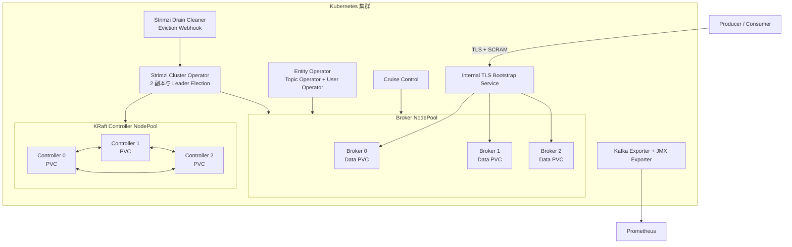
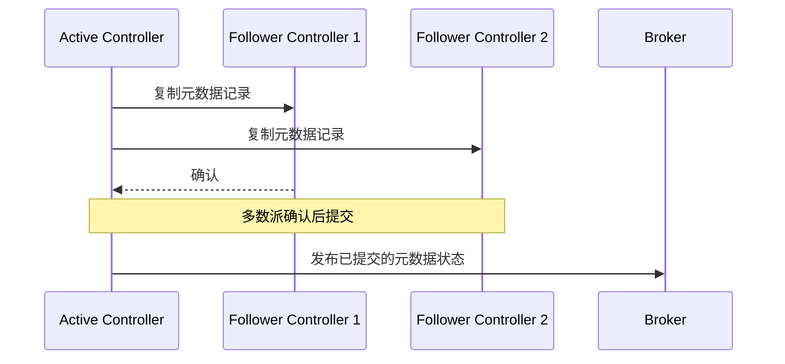
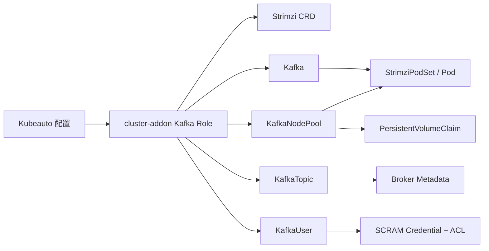
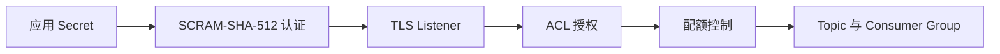
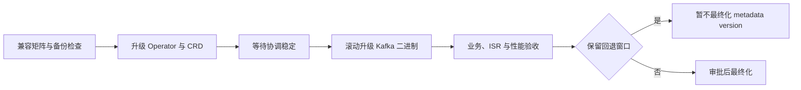

# Apache Kafka on Kubernetes 技术白皮书

| 文档属性 | 内容 |
| --- | --- |
| 文档类型 | 技术白皮书 |
| 适用平台 | Kubeauto 管理的 Kubernetes 1.33.6 集群 |
| 技术栈 | Strimzi Kafka Operator 1.2.0、Apache Kafka 4.3.1、KRaft、Strimzi Drain Cleaner 1.6.1 |
| 适用读者 | 架构师、平台负责人、安全负责人、Kafka 运维负责人 |
| 文档版本 | v1.0 |

## 目录

1. 产品定位与适用范围
2. 技术选型
3. 总体架构
4. KRaft 元数据体系
5. 数据复制与一致性
6. Kubernetes 资源模型
7. 安全体系
8. 存储与容量模型
9. 可用性与故障边界
10. 生命周期管理
11. 可观测性与性能模型
12. 数据保护与灾备边界
13. 技术规格与官方依据

## 第一章、产品定位与适用范围

本方案用于在 Kubernetes 上运行需要持久化、水平扩展、身份认证、访问控制和可审计生命周期管理的 Apache Kafka 集群。Strimzi Operator 负责将 Kafka 集群、节点池、主题、用户、证书和滚动变更建模为 Kubernetes 自定义资源，并持续协调声明状态与实际状态。

适用场景包括业务事件总线、异步解耦、日志与变更数据传输、流处理输入以及需要 Consumer Group 协作的消息处理系统。不适用于任务调度、同步请求响应、任意条件查询或以 Kafka 副本替代备份的场景。

本技术栈的能力边界如下：

| 能力 | 默认提供 | 说明 |
| --- | --- | --- |
| KRaft 集群 | 是 | Kafka 4.x 不再提供 ZooKeeper 模式 |
| 三 Controller、三 Broker | 是 | Controller 与 Broker 使用独立节点池 |
| TLS、SCRAM-SHA-512、ACL | 是 | 内部 Listener 默认启用 |
| Topic、User 声明式管理 | 是 | 通过 `KafkaTopic`、`KafkaUser` 管理 |
| Cruise Control 再平衡 | 是 | 用于 Broker 扩缩容后的分区迁移 |
| Prometheus 指标与告警规则 | 是 | 已存在监控 CRD 时自动发布 |
| Drain Cleaner | 是 | 协调 Kubernetes 节点排空与 Kafka 安全滚动 |
| 外部 Listener | 否 | 必须根据网络、DNS、证书和地址发布方式单独设计 |
| MirrorMaker 2 灾备 | 否 | 属于独立跨集群方案，不等同于单集群高可用 |
| Kafka Connect、Schema Registry | 否 | 连接器许可、镜像及数据语义需要独立评审 |
| Tiered Storage | 否 | 需要远端存储插件、对象存储和独立兼容性验证 |

## 第二章、技术选型

### 2.1 方案比较

| 方案 | 生命周期能力 | 运维模型 | 适用结论 |
| --- | --- | --- | --- |
| Strimzi Kafka Operator | Kafka、NodePool、Topic、User、升级、证书、再平衡 | Kubernetes 原生 CRD，状态可审计 | 默认方案 |
| Confluent for Kubernetes | Kafka 与 Confluent Platform 商业组件 | 需要商业订阅及对应运维体系 | 已采购 Confluent 服务时单独采用 |
| 通用 Helm Chart | 适合标准化安装 | Kafka 专用变更与故障协调能力有限 | 不作为企业默认方案 |
| 自建 StatefulSet | 配置完全自主 | 节点标识、证书、KRaft、再平衡和升级均需自行实现 | 不采用 |

Strimzi 以 Kubernetes API 表达 Kafka 资源及其状态，能够对滚动更新、证书轮换、用户授权和节点池变化进行协调。Kubeauto 固定 Operator Chart、Kafka 镜像和 CRD 版本，不启用未经审批的自动版本漂移。

### 2.2 固定版本

| 组件 | 版本 | 兼容关系 |
| --- | ---: | --- |
| Apache Kafka | 4.3.1 | Strimzi 1.2.0 支持并设为默认版本 |
| Kafka metadata version | 4.3-IV0 | 与 Kafka 4.3 系列协议能力对应 |
| Strimzi Kafka Operator | 1.2.0 | 支持 Kubernetes 1.30 至 1.36 |
| Strimzi Drain Cleaner | 1.6.1 | 与 Strimzi Operator 协作执行节点排空 |
| Kubernetes | 1.33.6 | 位于 Operator 官方测试范围内 |

Kafka 4.x 仅支持 KRaft。系统不部署 ZooKeeper，也不提供新建 ZooKeeper 集群或由 ZooKeeper 模式原地迁移的默认路径。

## 第三章、总体架构



### 3.1 组件职责

| 组件 | 职责 | 不承担的职责 |
| --- | --- | --- |
| Cluster Operator | 协调 Kafka、NodePool、证书及关联工作负载 | 不处理业务消息 |
| KRaft Controller | 保存并提交集群元数据，完成 Controller 选举 | 不作为应用消息入口 |
| Broker | 保存分区副本，处理生产、消费和组协调请求 | 不替代离线备份 |
| Entity Operator | 管理 `KafkaTopic` 和 `KafkaUser` | 不管理应用内部业务权限 |
| Cruise Control | 生成并执行分区再平衡方案 | 不自动解决业务分区设计问题 |
| Drain Cleaner | 拦截 Kafka Pod eviction 并请求安全滚动 | 不绕过 PDB 或 ISR 安全条件 |
| Kafka Exporter/JMX Exporter | 暴露 Consumer Group 和 Broker 指标 | 不保存长期监控数据 |

### 3.2 故障域

Controller 与 Broker 分别使用强制 Pod 反亲和和拓扑分布约束。同一节点池的三个 Pod 必须分布在三个不同的 `kafka_topology_key` 值上。生产环境应优先使用 `topology.kubernetes.io/zone`；只有确实不存在多可用区时才使用 `kubernetes.io/hostname`。

三个 Controller 可容忍一个 Controller 不可用。三个 Broker 配合副本因子 3、`min.insync.replicas=2` 和 Producer `acks=all`，可在一个 Broker 不可用时继续确认满足一致性条件的写入。失去两个同步副本时，系统拒绝写入以避免数据丢失。

## 第四章、KRaft 元数据体系

KRaft 使用 Raft 共识管理 Topic、分区、Broker 注册和配额等集群元数据。Controller quorum 与 Broker ISR 是两个独立层次：Controller quorum 决定元数据是否可以提交，ISR 决定分区写入是否满足同步副本要求。



Controller NodePool 固定为三个成员。Strimzi 1.2.0 使用静态 Controller quorum，不支持以常规在线扩缩容方式增加、删除、重命名 Controller 或改变其角色。Controller 拓扑与存储必须在上线前确定；相关变更需要专项停机方案。

## 第五章、数据复制与一致性

### 5.1 写入确认

可靠写入同时依赖 Broker 和客户端配置：

| 配置 | 基线值 | 作用 |
| --- | --- | --- |
| `default.replication.factor` | 3 | 默认创建三副本 Topic |
| `min.insync.replicas` | 2 | 至少两个同步副本才确认写入 |
| `unclean.leader.election.enable` | false | 禁止非同步副本成为 Leader |
| Producer `acks` | `all` | 等待满足最小 ISR 的确认 |
| Producer `enable.idempotence` | `true` | 控制单 Producer 会话中的重试重复 |

`enable.idempotence=true` 不表示跨 Kafka、数据库和外部 API 的端到端仅一次处理。跨系统一致性应采用事务生产、outbox、稳定业务幂等键或经过验证的事务连接器。

### 5.2 顺序与事务

- Kafka 只保证同一 Topic 分区内的记录顺序，不保证跨分区全局顺序。
- 需要同一业务对象有序时，应使用稳定 key 将其路由到同一分区。
- 事务 Producer 的每个活跃实例必须使用唯一且稳定的 `transactional.id`。
- 只读取已提交事务的消费者应设置 `isolation.level=read_committed`。
- Consumer offset 应在业务处理成功后提交；自动提交不能证明业务处理完成。

## 第六章、Kubernetes 资源模型



Kubeauto 使用 server-side apply 和固定 field manager 发布资源。`Kafka` 定义集群级配置；`KafkaNodePool` 定义 Controller、Broker 的角色、资源与存储；`KafkaTopic` 和 `KafkaUser` 分别定义主题及应用身份。不得同时使用 Helm、手工 StatefulSet 或其他控制器管理同一组 Kafka 对象。

## 第七章、安全体系



1. Listener 使用 TLS，客户端必须验证集群 CA，不允许关闭证书校验。
2. 默认应用身份使用 SCRAM-SHA-512；Secret 值不进入 Git、文档、命令行参数或日志。
3. ACL 按 Topic、Consumer Group 和 Transactional ID 最小授权。
4. 用户配额限制生产、消费字节速率和请求占比，防止单一租户耗尽 Broker。
5. NetworkPolicy 仅允许 Kafka 命名空间及带 `kubeauto.io/kafka-client=true` 标签的命名空间接入。
6. Operator、Entity Operator 和监控组件使用各自 Kubernetes RBAC，不授予业务应用集群管理权限。
7. 凭据与证书轮换必须分别实施；每次轮换均验证新身份成功、旧身份失效和业务连续性。

## 第八章、存储与容量模型

Controller 元数据和 Broker 日志均使用独立持久卷。默认使用支持拓扑调度、在线扩容和块设备语义的 CSI StorageClass，不使用共享文件系统作为 Kafka Broker 的生产存储。

容量规划至少包含以下变量：

```text
原始保留数据量 = 峰值写入字节/秒 × 保留秒数
副本后物理数据量 = 原始保留数据量 × 副本因子 ÷ 实测压缩率
规划容量 = 副本后物理数据量 × 段文件及索引开销 × 安全余量
```

建议为索引、段滚动、复制恢复、操作系统保留空间及流量增长预留不低于 30% 的可用容量。最终水位必须根据存储延迟、Broker 恢复时间和业务增长模型确定。

在线扩容需要同时满足：StorageClass 设置 `allowVolumeExpansion=true`、CSI 驱动支持文件系统扩展、PVC 请求容量增加、PVC 状态容量和 Pod 内文件系统容量全部收敛。PVC 不支持原地缩小。

## 第九章、可用性与故障边界

| 故障 | 预期行为 | 安全边界 |
| --- | --- | --- |
| 单 Broker 故障 | Leader 转移，满足 ISR 条件的分区继续服务 | 恢复前不得继续降低副本数或最小 ISR |
| 两个 Broker/ISR 同时故障 | 不满足 `min.insync.replicas` 的写入被拒绝 | 禁止启用不安全 Leader 选举 |
| 单 Controller 故障 | KRaft 多数派继续提交元数据 | 尽快恢复第三个成员 |
| Controller 失去多数派 | 元数据变更被拒绝 | 不得强制建立第二个 quorum |
| 单节点排空 | Drain Cleaner 请求 Operator 逐 Pod 滚动 | 每次等待 ISR 与 Pod Ready 后继续 |
| PVC 延迟或离线 | Broker 可能离开 ISR，延迟升高 | 不删除活动日志目录或 PVC |
| 磁盘达到高水位 | 限制流量、扩容或按已审批保留策略释放空间 | 不直接删除 segment 文件 |

副本提供运行时可用性，但不防止误删除 Topic、错误保留策略、逻辑污染、凭据泄露或整个集群损失。

## 第十章、生命周期管理

### 10.1 Broker 扩缩与再平衡

Broker 扩容只增加空 Broker，不会自动保证既有分区均匀分布。NodePool 副本数变化后由 Cruise Control 生成并执行再平衡。缩容前必须先将分区迁出目标 Broker，确认无离线分区和 under-replicated partition 后再移除 Broker。

### 10.2 节点维护

Drain Cleaner 通过 Validating Webhook 拦截 Kafka Pod eviction，为目标 Pod 设置安全滚动标记，并拒绝本次 eviction，将实际滚动交给 Cluster Operator。首次 `kubectl drain` 因主动拒绝返回非零状态是控制协议的一部分；Operator 完成单 Pod 滚动且 Kafka 恢复 Ready 和完整 ISR 后，维护程序再次执行排空，直至节点上所有 Kafka Pod 均已安全迁移。Webhook 使用 `failurePolicy=Fail`，范围限定到 Kafka 命名空间；Drain Cleaner 采用两个跨节点副本、至少一个可用副本的 PDB 和两个 Ready Service endpoint，避免维护节点上的 webhook Pod 被驱逐时形成单点。该机制防止 Kubernetes 同时驱逐多个 Kafka Pod而破坏 ISR 或 Controller quorum。

Webhook 请求超时与 Drain Cleaner 主动拒绝具有不同语义。主动拒绝必须包含由 Cluster Operator 执行滚动的明确响应；超时、连接失败或缺少 endpoint 表示 admission 控制面不可用，应停止维护并恢复 webhook 服务，不得通过放宽 `failurePolicy` 绕过。

### 10.3 升级与回滚



Operator、CRD、Kafka 二进制和 metadata version 分阶段变更。Kafka 二进制完成滚动升级后，应先完成业务与稳定性验证，再决定是否最终化 metadata version。最终化后旧版本可能无法读取新元数据，不能承诺跨不兼容版本原地回滚。

## 第十一章、可观测性与性能模型

| 层次 | 关键指标 | 说明 |
| --- | --- | --- |
| KRaft | Active Controller、quorum voter、commit lag | 元数据是否具备多数派并及时提交 |
| Broker | request latency/error、吞吐、JVM、网络 | 请求质量与资源瓶颈 |
| 分区 | offline partition、under-replicated partition、ISR 变化 | 数据可用性与复制健康 |
| 存储 | PVC 使用率、增长率、IO 延迟、log dir offline | 容量及介质故障 |
| Producer | error、retry、queue、request latency | 写入质量与反压 |
| Consumer | group state、lag、rebalance、消费速率 | 积压与消费稳定性 |
| Operator | JVM/Vert.x 运行时指标、Kafka condition、事件和协调日志 | 声明状态及控制器运行状态是否能够收敛 |
| Cruise Control | proposal、optimization、rebalance state | 分区迁移进度与结果 |

Strimzi Cluster Operator 1.2.0 在端口 `8080` 暴露 Prometheus 格式的标准 JVM/Vert.x 运行时指标。具体指标名称属于版本化接口，不能将固定的 `strimzi_*` 前缀作为通用兼容契约；资源协调结果以 Kafka condition、事件和 Operator 日志联合判定。

性能结果必须同时记录版本、镜像摘要、CPU、内存、存储、网络、Topic 分区、副本、消息大小、压缩算法、`acks`、并发、记录数和持续时间。最大瞬时吞吐不能直接作为生产承诺；容量设计应以满足延迟 SLO、零静默错误和故障场景余量的稳定区间为准。

## 第十二章、数据保护与灾备边界

| 保护对象 | 建议方式 | 恢复验证 |
| --- | --- | --- |
| Kafka、NodePool、Topic、User 声明 | 企业 GitOps 仓库 | CR 字段、ACL、Topic 配置一致 |
| Secret 与证书 | 企业密码系统或 PKI | 新身份成功、失效身份被拒绝 |
| 业务事件 | 源系统重放、合规归档或独立跨集群复制 | 数量、key/value 摘要和时间边界一致 |
| Consumer Group offset | MM2 checkpoint 或受控导出 | 与目标 Topic 数据边界配套验证 |

MirrorMaker 2 提供异步跨集群复制，不提供同步共识或不可变备份。灾备设计必须给出 RPO、RTO、复制滞后、切换所有权、客户端地址切换、offset 边界和回切冲突处理策略。

## 第十三章、技术规格与官方依据

### 13.1 核心规格

| 项目 | 基线 |
| --- | --- |
| Controller | 3 个专用 KRaft Controller Pod |
| Broker | 3 个起，独立 Broker NodePool |
| Operator | 2 副本，启用 Leader Election |
| Broker 副本因子 | 3 |
| 最小同步副本 | 2 |
| Listener | 集群内 TLS 9093 |
| 认证与授权 | SCRAM-SHA-512 + Simple ACL |
| 默认 Topic | 6 分区、3 副本、7 天保留 |
| Broker 默认 PVC | 100Gi，生产值以容量评审为准 |
| Controller 默认 PVC | 20Gi |
| PVC 删除策略 | 默认保留 |

### 13.2 官方资料

| 主题 | 官方资料 |
| --- | --- |
| Kafka 下载与版本 | [Apache Kafka Downloads](https://kafka.apache.org/community/downloads/) |
| Kafka 4.3 升级 | [Apache Kafka Upgrade](https://kafka.apache.org/43/getting-started/upgrade/) |
| KRaft 运维 | [Apache Kafka KRaft](https://kafka.apache.org/43/operations/kraft/) |
| Kafka 安全 | [Apache Kafka Security](https://kafka.apache.org/43/security/) |
| Kafka 运维与监控 | [Apache Kafka Operations](https://kafka.apache.org/43/operations/) |
| Strimzi 兼容矩阵 | [Strimzi Downloads](https://strimzi.io/downloads/) |
| Strimzi 1.2.0 发布说明 | [Strimzi 1.2.0 Release](https://github.com/strimzi/strimzi-kafka-operator/releases/tag/1.2.0) |
| Strimzi 部署与管理 | [Deploying and Managing Strimzi 1.2.0](https://strimzi.io/docs/operators/1.2.0/deploying.html) |
| Strimzi API | [Strimzi 1.2.0 API Reference](https://strimzi.io/docs/operators/1.2.0/configuring.html) |
| Kafka 版本映射源码 | [kafka-versions.yaml](https://github.com/strimzi/strimzi-kafka-operator/blob/1.2.0/kafka-versions.yaml) |
| 节点排空 | [Strimzi Drain Cleaner](https://github.com/strimzi/drain-cleaner) |

所有生产字段均应以本表锁定版本对应的官方文档、CRD schema 和源码为准。版本升级时必须重新核对兼容矩阵、API 变化、升级路径和回滚边界。
