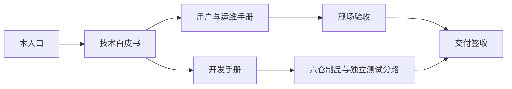
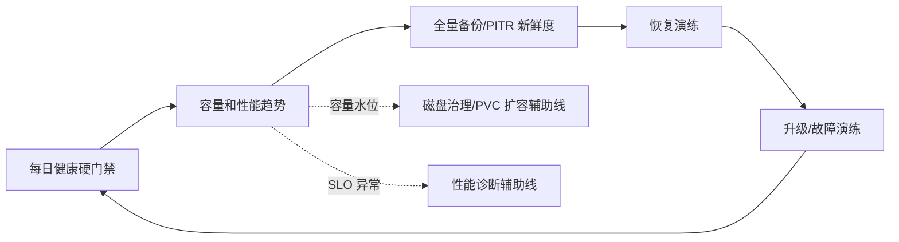
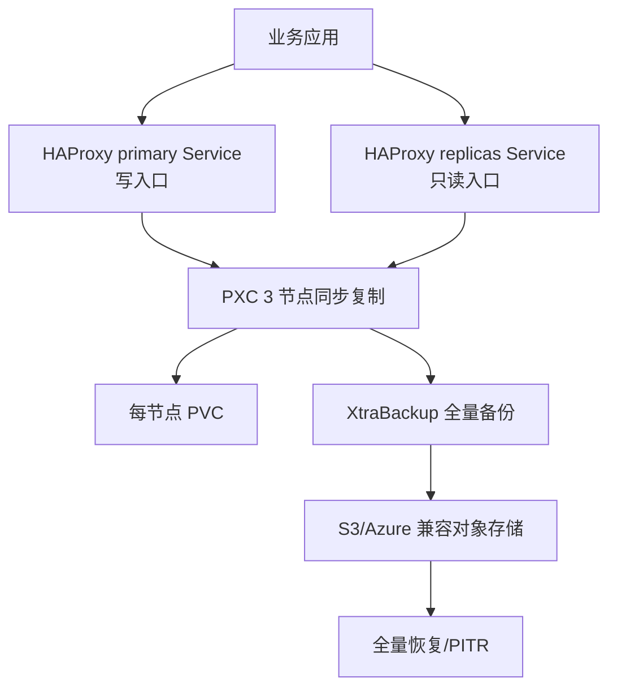

# Percona XtraDB Cluster（PXC）企业级部署、运维与开发文档

> **文档版本：** v1.3（生产运维深化版）
> **最后核验：** 2026-08-21
> **Operator：** Percona Operator for MySQL based on PXC v1.20.0
> **数据库：** Percona XtraDB Cluster 8.4.8-8.1
> **适用范围：** kubeauto 后续新增的独立 MySQL middleware 分路；不改变已交付的 Kubernetes、Nacos、RocketMQ 和现有存储功能。
> **官方依据：** [Percona Operator for MySQL/PXC 官方文档](https://docs.percona.com/percona-operator-for-mysql/pxc/)、[v1.20.0 Release](https://github.com/percona/percona-xtradb-cluster-operator/releases/tag/v1.20.0)

## 目录

1. [本文档怎么使用](#第一章本文档怎么使用)
2. [文档与实现状态](#第二章文档与实现状态)
3. [配套手册](#第三章配套手册)
4. [技术基线](#第四章技术基线)
5. [交付边界](#第五章交付边界)

## 第一章、本文档怎么使用

这套文档按“先判断是否适合、再部署、后验收、最后运维”的顺序组织。客户第一次部署只需要沿着《用户与运维手册》的“主线路”执行；技术原理、异常分流、升级回滚和开发约束放在对应章节，不插入主线路命令块。

| 读者 | 首先阅读 | 阅读目标 |
|---|---|---|
| 架构师/客户技术负责人 | [技术白皮书](./technical-whitepaper.md) | 判断 PXC、同步复制、故障域、性能和灾备是否适合业务 |
| 实施工程师 | [用户与运维手册](./operations-manual.md) | 按固定顺序完成规划、安装、验证和上线准备 |
| 数据库/平台运维 | [用户与运维手册](./operations-manual.md) | 日常巡检、故障诊断、备份恢复、升级和下线 |
| kubeauto 开发者 | [开发手册](./development-manual.md) | 接入代码、镜像、Chart、测试和版本同步 |
| 审计/签收人员 | [官方依据](./official-sources.md) | 核对版本、源码、官方功能和证据来源 |

### 1.1 客户首次部署主线路

| 顺序 | 客户执行 | 完成标志 | 失败时转到 |
|---|---|---|---|
| 1 | 按《用户与运维手册》第 2、3 章完成容量、节点、StorageClass 和权限检查 | 三个可调度故障域，PVC 预检可写可读 | 运维手册 3.3、12.3 的存储/调度分流 |
| 2 | 按第 4 章准备 kubeauto 固定版本制品和 Kubernetes Secret | Chart SHA256、镜像 tag/digest 可对账 | 运维手册第四章、12.2 的供应链分流 |
| 3 | 在配置中设置 `mysql_install: "yes"` 及批准参数，执行 kubeauto addon | role 返回 rc=0，Operator 和 CRD Ready | 运维手册第五章、12.2 的控制面分流 |
| 4 | 等待 PXC 3/3、HAProxy 3/3、PVC Bound 和 `Primary/Synced` | 控制面与数据面同时通过 | 运维手册 6.1、12.4 |
| 5 | 使用 primary Service 写入、replicas Service 读取，验证 TLS 和最小权限 | 业务 marker 可读回，错误凭据被拒绝 | 运维手册第 7 章 |
| 6 | 创建全量备份并抽样校验对象，再按计划做恢复演练 | Backup `Succeeded`，对象 SHA256 可验证 | 运维手册第 10 章 |
| 7 | 保存版本、digest、SQL、备份、故障和清理证据 | MySQL 矩阵当前运行 14/14，清理验证通过 | 运维手册第 13 章 |

> **主线路边界：** 不要把 `kubectl delete pvc`、手工 `pc.bootstrap=YES`、关闭 TLS 校验、`unsafe-pitr` 或修改 Operator 管理的 StatefulSet 当作部署步骤。它们属于高风险例外，只能在对应引用块和审批流程中使用。

> **两条制品路径：** kubeauto 正式 role 从受控的 vendored Chart 和本地 Registry 消费制品；`hub.talkedu.cn` 是中国交付路径的优先来源。动态公共加速器只能作为一次性测试运行参数，不能写入 role、CI、默认配置或本目录文档。

### 1.2 上线后的生产运维主线

数据库交付完成后，客户主要沿以下线路工作。每个入口都在《用户与运维手册》中提供可复制脚本、阶段进度、等待心跳、退出码硬门禁、原子证据目录和唯一终端标志；异常、回滚和高风险操作位于引用块，不混入正常主线。全部脚本都声明并实现可验证的幂等语义：只读脚本不修改生产对象，声明式脚本以同一权威输入收敛，固定目标变更以审批 ID/目标值防止二次动作，临时资源以唯一 run ID 或归属标签创建并在成功、失败时限定回收。

| 长期任务 | 运维手册入口 | 可签收结果 |
|---|---|---|
| 每日/每班巡检 | 8.1 | `PXC_DAILY_ACCEPTANCE_PASS`，控制面、wsrep、PVC、容量、备份和 PITR 同时通过 |
| 容量审计 | 8.4.2 | `PXC_STORAGE_CAPACITY_AUDIT_COLLECTION_PASS health_verified=false`，请求容量、实际卷和文件系统证据完整，容量健康另按客户水位判定 |
| 性能基线 | 9.2 | `PXC_PERFORMANCE_ACCEPTANCE_PASS`，客户 SLO 逐线程硬判定且测试数据已清理 |
| 备份恢复 | 第 10 章 | Backup/Restore `Succeeded` 加业务 marker/GTID 校验 |
| 故障取证 | 第 12 章 | 同一时间戳的分层证据；修复后重新通过日常硬门禁 |

> **PVC 扩容状态：** Percona Operator v1.20.0 提供 GA Volume Expansion 和自动存储扩容能力，但当前 kubeauto `MYSQL-01` 至 `MYSQL-14` 只验证了固定容量建卷和真实读写，未验证在线扩容。运维手册 8.4 提供基于官方行为的预生产演练辅助线，并明确当前交付边界；未在同 CSI 演练通过前不得对客户宣称该能力已签收。

## 第二章、文档与实现状态

当前版本已包含 kubeauto 的独立 MySQL/PXC 实现和现场门禁；以下状态以当前仓库和最近一次独立回归证据为准：

| 项目 | 当前状态 | 说明 |
|---|---|---|
| PXC 技术选型 | 已锁定 | v1.20.0 + PXC 8.4.8-8.1 + HAProxy |
| 技术白皮书 | 已交付并随版本核验 | 解释原理、架构、性能、故障和数据保护 |
| 用户/运维手册 | 已交付并随版本核验 | 主线路命令、预期结果、异常分流和回滚边界与 role 及现场证据对齐 |
| 开发手册 | 已交付并随版本核验 | 规定代码、六仓、门禁和文档联动 |
| kubeauto 安装代码 | 已实现 | 通过 MySQL 独立 role、模板和受控制品目录发布 |
| MySQL 独立现场门禁 | 已实现 | 使用独立矩阵、durable rc 和双清理证据 |
| 现有核心项目 | 已交付 | 不因 PXC 文档或后续测试而修改功能代码 |

文档中的命令分为三类：`交付入口` 是当前仓库固定自动化；`现场操作` 由客户平台/运维执行；`官方诊断` 只用于取证和解释行为。任何临时镜像代理或加速地址都不属于交付入口。

> **证据口径：** 最近一次独立 PXC 门禁为 `MYSQL-01` 至 `MYSQL-14` 全部通过，包含单节点故障、双节点失去多数派后的拒绝写入、IST/SST、全量恢复、PITR 精确事务边界、binlog gap 拒绝、性能阶梯和二次幂等安装。历史日志不能替代当前版本的重新验证。

## 第三章、配套手册

- [Percona XtraDB Cluster 技术白皮书](./technical-whitepaper.md)：为什么选 PXC、组件如何协作、复制和仲裁如何工作、性能如何测量、故障如何分类。
- [Percona PXC 用户与运维手册](./operations-manual.md)：按现场顺序执行安装、客户端接入、真实 SQL 验收、巡检、故障、备份恢复、升级、回滚和卸载。
- [Percona PXC 开发手册](./development-manual.md)：如何把方案接入 kubeauto，如何维护镜像和 Chart，如何建立独立测试分路。
- [官方依据与版本基线](./official-sources.md)：所有版本和官方来源的权威索引。

## 第四章、技术基线

| 组件 | 锁定版本 | 生产用途 |
|---|---:|---|
| Percona Operator for MySQL | 1.20.0 | Kubernetes 声明式协调、升级、备份、恢复和用户管理 |
| Percona XtraDB Cluster | 8.4.8-8.1 | Galera/PXC 同步复制数据库 |
| Percona XtraBackup | 8.4.0-5.1 | 全量备份、SST/恢复相关数据路径 |
| HAProxy | 2.8.18-1 | 写入口、只读入口和健康检查 |
| Fluent Bit | 5.0.6-1 | 可选数据库日志采集 |
| Kubernetes | kubeauto 当前 v1.33.6 | Operator 运行平台 |

## 第五章、交付边界

PXC 不是把一个 `mysql` Pod 放进集群，而是一条包含数据库、代理、存储、证书、备份和恢复的生产链路：

以下内容必须在正式编码和独立现场门禁中完成后，才能对客户宣称“已交付”：

- 三节点 Primary/Synced、真实 SQL 写入和读取；
- 单节点故障、IST/SST 重新加入和多数派安全行为；
- TLS、Secret、密码轮换、最小权限和网络暴露控制；
- 全量备份、恢复、PITR 和 binlog gap 负向测试；
- 固定负载下的性能基线、故障期间延迟和容量阈值；
- Operator/数据库滚动升级、失败回滚和最终清理。

> **当前交付状态：** 本版本的独立 MySQL/PXC 分路已完成上述专项门禁；这不等于已交付核心项目的 full enterprise regression 被重新执行。若后续改动共享下载器、Registry、Ansible 公共入口或核心 Kubernetes 资源，必须重新评估测试范围。
