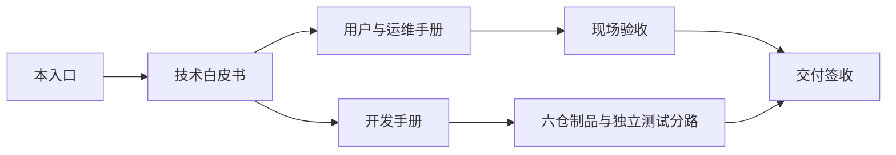
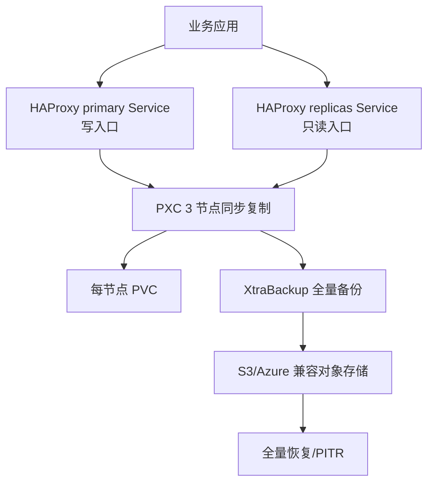

# Percona XtraDB Cluster（PXC）企业级部署、运维与开发文档

> **文档版本：** v1.1（独立 MySQL/PXC 分路交付版）
> **最后核验：** 2026-08-20
> **Operator：** Percona Operator for MySQL based on PXC v1.20.0
> **数据库：** Percona XtraDB Cluster 8.4.8-8.1
> **适用范围：** kubeauto 后续新增的独立 MySQL middleware 分路；不改变已交付的 Kubernetes、Nacos、RocketMQ 和现有存储功能。
> **官方依据：** [Percona Operator for MySQL/PXC 官方文档](https://docs.percona.com/percona-operator-for-mysql/pxc/)、[v1.20.0 Release](https://github.com/percona/percona-xtradb-cluster-operator/releases/tag/v1.20.0)

## 目录

1. [本文档怎么使用](#第一章本文档怎么使用)
2. [文档与实现状态](#第二章文档与实现状态)
3. [配套手册](#第三章配套手册)
4. [技术基线](#第四章技术基线)
5. [交付边界](#第五章交付边界)

## 第一章、本文档怎么使用

这套文档按“先理解、再安装、后运维、最后开发”的顺序组织。客户现场不应只看某一段命令；每一步都必须完成前置检查、执行、预期结果和验收。

| 读者 | 首先阅读 | 阅读目标 |
|---|---|---|
| 架构师/客户技术负责人 | [技术白皮书](./technical-whitepaper.md) | 判断 PXC、同步复制、故障域、性能和灾备是否适合业务 |
| 实施工程师 | [用户与运维手册](./operations-manual.md) | 按固定顺序完成规划、安装、验证和上线准备 |
| 数据库/平台运维 | [用户与运维手册](./operations-manual.md) | 日常巡检、故障诊断、备份恢复、升级和下线 |
| kubeauto 开发者 | [开发手册](./development-manual.md) | 接入代码、镜像、Chart、测试和版本同步 |
| 审计/签收人员 | [官方依据](./official-sources.md) | 核对版本、源码、官方功能和证据来源 |

## 第二章、文档与实现状态

当前版本已包含 kubeauto 的独立 MySQL/PXC 实现和现场门禁；以下状态以当前仓库和最近一次独立回归证据为准：

| 项目 | 当前状态 | 说明 |
|---|---|---|
| PXC 技术选型 | 已锁定 | v1.20.0 + PXC 8.4.8-8.1 + HAProxy |
| 技术白皮书 | 已交付并随版本核验 | 解释原理、架构、性能、故障和数据保护 |
| 用户/运维手册 | 已交付并随版本核验 | 命令、预期结果、异常分流和回滚边界与实现对齐 |
| 开发手册 | 已交付并随版本核验 | 规定代码、六仓、门禁和文档联动 |
| kubeauto 安装代码 | 已实现 | 通过 MySQL 独立 role、模板和受控制品目录发布 |
| MySQL 独立现场门禁 | 已实现 | 使用独立矩阵、durable rc 和双清理证据 |
| 现有核心项目 | 已交付 | 不因 PXC 文档或后续测试而修改功能代码 |

文档中的命令分为三类：`交付入口` 是当前仓库固定自动化；`现场操作` 由客户平台/运维执行；`官方诊断` 只用于取证和解释行为。任何临时镜像代理或加速地址都不属于交付入口。

## 第三章、配套手册

- [Percona XtraDB Cluster 技术白皮书](./technical-whitepaper.md)：为什么选 PXC、组件如何协作、复制和仲裁如何工作、性能如何测量、故障如何分类。
- [Percona PXC 用户与运维手册](./operations-manual.md)：按现场顺序执行安装、客户端接入、真实 SQL 验收、巡检、故障、备份恢复、升级、回滚和卸载。
- [Percona PXC 开发手册](./development-manual.md)：如何把方案接入 kubeauto，如何维护镜像和 Chart，如何建立独立测试分路。
- [官方依据与版本基线](./official-sources.md)：所有版本和官方来源的权威索引。

## 第四章、技术基线

| 组件 | 锁定版本 | 生产用途 |
|---|---:|---|
| Percona Operator for MySQL | 1.20.0 | Kubernetes 声明式协调、升级、备份、恢复和用户管理 |
| Percona XtraDB Cluster | 8.4.8-8.1 | Galera/PXC 同步复制数据库 |
| Percona XtraBackup | 8.4.0-5.1 | 全量备份、SST/恢复相关数据路径 |
| HAProxy | 2.8.18-1 | 写入口、只读入口和健康检查 |
| Fluent Bit | 5.0.6-1 | 可选数据库日志采集 |
| Kubernetes | kubeauto 当前 v1.33.6 | Operator 运行平台 |

## 第五章、交付边界

PXC 不是把一个 `mysql` Pod 放进集群，而是一条包含数据库、代理、存储、证书、备份和恢复的生产链路：

以下内容必须在正式编码和独立现场门禁中完成后，才能对客户宣称“已交付”：

- 三节点 Primary/Synced、真实 SQL 写入和读取；
- 单节点故障、IST/SST 重新加入和多数派安全行为；
- TLS、Secret、密码轮换、最小权限和网络暴露控制；
- 全量备份、恢复、PITR 和 binlog gap 负向测试；
- 固定负载下的性能基线、故障期间延迟和容量阈值；
- Operator/数据库滚动升级、失败回滚和最终清理。
