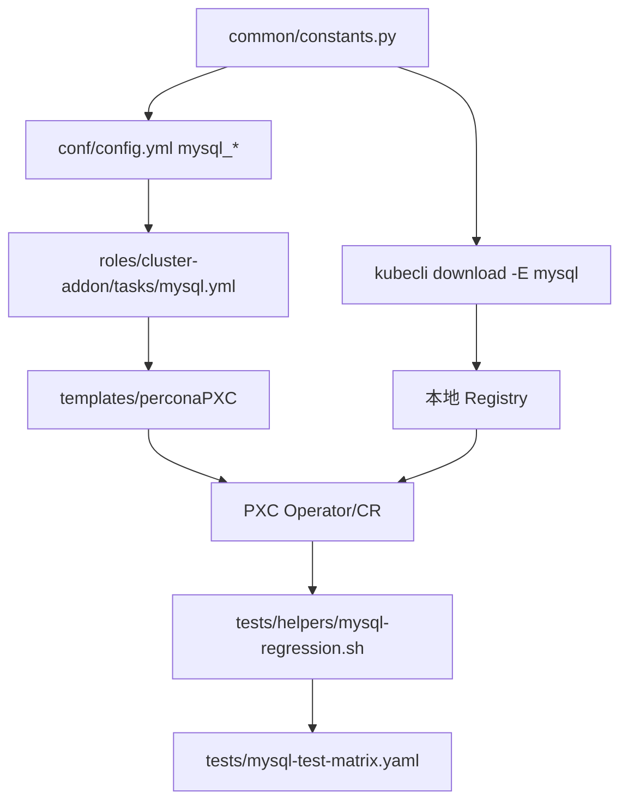
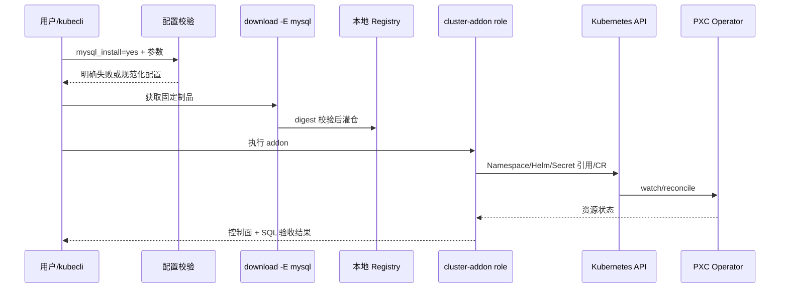
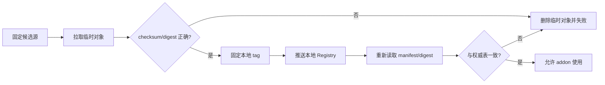

# Percona XtraDB Cluster（PXC）开发手册

> **文档版本：** v1.2（生产实践对齐版）
> **最后核验：** 2026-08-21
> **适用对象：** kubeauto 主仓及五个 sibling 仓库的开发、测试、发布和文档维护人员
> **变更原则：** PXC 是独立 middleware 分路；除非有可复现证据证明现有核心功能存在缺陷，不修改已交付的 Kubernetes、Nacos、RocketMQ 和存储代码。

## 目录

1. 开发边界和六仓关系
2. 代码接入目标
3. 版本、Chart 和镜像
4. 配置与模板契约
5. 独立测试分路
6. 现场证据和失败清理
7. 文档与发布门禁

## 第一章、开发边界和六仓关系

新增 PXC 必须视为独立发布单元。现有 enterprise matrix 记录的是已交付核心功能，不因为 PXC 开发而改成 pending，也不使用其历史 PASS 代替 MySQL 现场证据。

| 仓库 | PXC 关注项 |
|---|---|
| kubeauto | 常量、配置、Ansible role、模板、测试和文档 |
| kubeauto-ext-images-dockerfile | Operator/PXC/XtraBackup/HAProxy/Fluent Bit 镜像 CI 和双推 |
| kubeauto-dockerfile | 产品运行镜像是否需要新增工具 |
| kubeauto-ext-bin-dockerfile | Helm、kubectl 或诊断工具版本 |
| kubeauto-ext-bin-sp1-dockerfile | 仅在平台二进制确有改动时检查 |
| kubeauto-k8s-bin-dockerfile | Kubernetes 版本兼容，不因 PXC 私自改动 |

变更前后都要检查六仓工作树、CI tag、TalkEdu 推送、Docker Hub 推送、镜像 fallback 和本地 Registry manifest。

### 1.1 当前状态和开发授权边界

本手册是当前实现的开发契约。任何后续变更仍必须先读取 `AGENTS.md`、MySQL 测试矩阵、现有 addon 代码和锁定版本官方源码，再把变更与仓库真实结构对齐。

> **已交付代码边界：** PXC 是独立 middleware 分路。测试失败时先证明是新增分路、测试门禁、环境/供应链还是共享代码缺陷；没有 100% 可复现证据，不修改已经交付的 Kubernetes、Nacos、RocketMQ 和存储主链路。

PXC 变更默认只允许触及：新增 MySQL 配置、独立 role/templates、MySQL 制品集合、MySQL 单元/契约/现场测试和本目录文档。若测试暴露核心代码问题，必须先以最小复现证明根因和影响面，不能为让 PXC 测试通过顺手重构已交付主链路。

### 1.2 责任边界

| 角色 | 责任 | 不负责 |
|---|---|---|
| kubeauto 开发 | 配置、渲染、下载、安装、幂等和清理 | 客户 schema 设计 |
| 镜像发布 | 固定版本构建/同步、双推、digest | 运行时动态选源 |
| 平台团队 | 节点、CSI、Registry、命名空间、RBAC | 替应用保管 root 密码 |
| DBA | PXC 参数、用户权限、备份恢复、升级审批 | 绕过 Kubernetes 所有权 |
| 应用团队 | 连接池、幂等重试、schema 和性能 SLO | 直接连接 Pod/使用 root |
| 测试团队 | 独立矩阵、干净环境、当前证据 | 用历史核心 PASS 代替 MySQL 证据 |

## 第二章、代码接入目标



| 实际路径 | 责任 |
|---|---|
| common/constants.py | Operator、PXC、XtraBackup、HAProxy、Fluent Bit 版本和 component_images mysql |
| conf/config.yml | mysql_install、命名空间、副本、StorageClass、PVC、TLS、备份和 PITR |
| roles/cluster-addon/tasks/percona-pxc.yml | Namespace、Operator、CRD、Secret 引用、CR 发布和状态等待 |
| roles/cluster-addon/templates/perconaPXC | Operator values、PXC CR、Backup/Restore/PITR CR |
| roles/cluster-addon/files | 官方 Chart/CRD vendored 包和 SHA256 |
| tests/helpers/mysql-regression.sh | 独立现场门禁、取证、durable rc 和清理 |
| tests/mysql-test-matrix.yaml | MySQL 专属状态、证据、覆盖率和 clean verify |
| tests/unit/test_percona_pxc* | 版本、镜像、CR 安全字段和文档契约 |

不得通过修改现有 Nacos MySQL fixture 复用 PXC；Nacos 的 mysql:8.0.46 和 PXC 镜像集合必须保持生命周期、测试和版本语义隔离。

### 2.1 目标调用链



安装 role 不能隐式联网拉取未知 Chart 或镜像。download 阶段负责供应链，addon 阶段只消费已经验证的本地制品；缺制品时明确失败并给出固定补救入口。

> **网络受限环境：** `hub.talkedu.cn`、Docker Hub 和 Percona 官方地址属于正式来源；动态代理/加速器只可由测试 runner 通过运行时参数临时注入，完成 manifest/digest 校验后立即移除，严禁写入常量、CI、默认配置、脚本或企业文档。

### 2.2 模块拆分原则

建议按“校验、Operator、集群、状态、备份能力”拆分 task include，避免一个数百行 task 文件同时处理下载、Secret、Helm 和 SQL。每个 include 必须有清晰输入、幂等判据和失败消息。模板只做结构化渲染，不在 Jinja 中堆叠业务判断。

| 模块 | 输入 | 输出/验收 |
|---|---|---|
| validate | mysql_*、节点/StorageClass | 合法且可部署的配置 |
| artifacts | 固定 Chart/镜像常量 | SHA256/digest 一致 |
| operator | namespace、Chart、values | Deployment Ready、CRD Established |
| cluster | Secret 引用、PXC CR | 3 PXC/3 HAProxy、PVC/Service |
| health | kubeconfig、业务探针 | Primary/Synced、真实 SQL |
| backup | storage/credential 引用 | Backup/Restore/PITR 可选能力 |

### 2.3 幂等和所有权

重复执行相同配置不得无故轮换密码、重建 PVC、滚动 PXC 或改写用户手工管理的对象。所有由 kubeauto 管理的资源应使用稳定名称和 labels/annotations，server-side apply 的 field manager 固定；对不归 kubeauto 管理的字段不得抢占所有权。

删除路径必须按固定 label 和 namespace 解析具体资源，再与预期集合对账。默认 uninstall 保留 PVC 和备份；数据删除只能由显式高风险开关和审批触发，且单元测试证明不会匹配其他中间件。

## 第三章、版本、Chart 和镜像

锁定集合：

| 组件 | 版本 | 官方证据 |
|---|---:|---|
| PXC Operator | 1.20.0 | v1.20.0 Release、官方 Helm Chart |
| PXC | 8.4.8-8.1 | v1.20.0 deploy/cr.yaml |
| XtraBackup | 8.4.0-5.1 | v1.20.0 supported software |
| HAProxy | 2.8.18-1 | v1.20.0 官方 CR 默认镜像 |
| Fluent Bit | 5.0.6-1 | v1.20.0 supported software |

镜像不得使用 latest、main、开发镜像或动态镜像发现结果。正式供应链只使用项目自有 TalkEdu/Docker Hub 发布和 Percona 官方上游；每个候选都要完成 pull、inspect、tag/push 和本地 Registry manifest 验证。公共加速器只允许通过非持久化环境变量临时注入测试，不得写入仓库。

当前交付只 vendored `pxc-operator-1.20.0.tgz` 及其 SHA256；PXC CR 由 role 模板渲染，不存在单独的 `pxc-db` Chart。Chart/CRD 下载后执行 SHA256 校验并原子替换，失败下载不能进入 vendored 目录。

### 3.1 镜像映射必须来自一个权威表

| 逻辑组件 | 官方上游 | kubeauto 发布名 |
|---|---|---|
| operator | `percona/percona-xtradb-cluster-operator:1.20.0` | `brinnatt/percona-xtradb-cluster-operator:1.20.0` |
| pxc | `percona/percona-xtradb-cluster:8.4.8-8.1` | `brinnatt/percona-xtradb-cluster:8.4.8-8.1` |
| xtrabackup | `percona/percona-xtrabackup:8.4.0-5.1` | `brinnatt/percona-xtrabackup:8.4.0-5.1` |
| haproxy | `percona/haproxy:2.8.18-1` | `brinnatt/percona-haproxy:2.8.18-1` |
| fluent-bit | `percona/fluentbit:5.0.6-1` | `brinnatt/fluentbit:5.0.6-1` |

常量、下载逻辑、ext-images CI、Docker Hub、TalkEdu、模板和测试只引用这份映射派生结果。不能让 CI 叫 `percona-haproxy`、常量叫 `haproxy`、模板又引用 `percona/haproxy` 而没有显式映射。

### 3.2 下载事务

每个制品遵循：写临时文件/临时 tag → 校验 SHA256 或 manifest digest → 原子替换/固定 tag → 推本地 Registry → 从 Registry 重新 inspect。任何一步失败都删除本次临时对象，并保留上一版已验证制品。



正式路径的顺序是：已双推的 `hub.talkedu.cn/kubeauto/<发布名>` → Docker Hub `brinnatt/<发布名>` → Percona 官方上游。每个候选都要验证 manifest/digest。临时测试加速源不得成为该顺序的一部分，也不得写入常量、CI、模板、脚本默认值、文档命令或测试矩阵。

> **供应链回滚：** 任一候选的 checksum、manifest 或 digest 不一致时，删除本次临时对象并保留上一版已验证制品；不能用“能拉到镜像”替代版本和摘要校验，也不能把临时代理地址固化成 fallback。

## 第四章、配置与模板契约

默认值必须安全、可审计：

```yaml
mysql_install: "no"
mysql_namespace: "mysql"
mysql_operator_namespace: "mysql-operator"
mysql_pxc_size: 3
mysql_haproxy_size: 3
mysql_tls_enabled: true
mysql_haproxy_primary_service_type: "ClusterIP"
mysql_haproxy_replicas_enabled: true
mysql_haproxy_replicas_service_type: "ClusterIP"
mysql_haproxy_replicas_only_readers: true
mysql_backup_enabled: false
mysql_pitr_enabled: false
```

静态契约必须检查：

- crVersion 与 Operator 版本一致；
- PXC 和 HAProxy size 为奇数且不小于 3；
- TLS 默认开启，SmartUpdate 默认启用；
- PXC Pod 使用主机反亲和，PDB 不允许同时破坏多数派；
- storageClassName 不为空，不硬编码实验室 VG；
- 镜像 tag 与常量、CI 和本地 Registry manifest 一致；
- PITR 开启时 storageName、对象存储凭据和 binlog 路径完整；
- 模板不出现真实密码、私钥、S3 key、latest 或 main 镜像。

配置文件必须说明维护者、保存路径、消费者、生效命令和回滚方式。一个配置项只设一个权威来源，不在 README、模板、测试脚本中复制不同默认值。

### 4.1 配置分组

| 分组 | 示例 | 校验时机 |
|---|---|---|
| 开关/命名 | install、namespace、cluster name | CLI 读取配置时 |
| 拓扑 | PXC/HAProxy size、anti-affinity | 渲染前 |
| 资源/存储 | requests/limits、StorageClass、PVC | preflight + server dry-run |
| 安全 | TLS、Secret 名、外部暴露 | 渲染前 + API schema |
| 数据保护 | storageName、endpoint、schedule、PITR | 功能开启时强校验 |
| 升级 | crVersion、updateStrategy、镜像 | 版本矩阵 + diff |

条件配置必须“关闭时不渲染、开启时完整校验”。例如 `mysql_pitr_enabled=true` 时缺 storageName、HTTPS endpoint、credentials Secret 或全量备份策略必须失败；不能渲染半配置 CR 交给 Operator 异步报错。

### 4.2 Secret 契约

仓库只保存 Secret 名和 key 契约，不保存 value。系统用户 Secret、业务用户 Secret、TLS Secret 和对象存储 Secret 分开管理。日志、Ansible diff、异常堆栈和测试 evidence 必须脱敏。

Secret 创建/轮换失败时，不得把已经更新一半的密码当成新基线。自动化要记录外部密码版本、Kubernetes resourceVersion 和 Operator 收敛状态，并提供旧/新凭据验证顺序。

### 4.3 模板静态要求

- YAML 经结构化解析，不用正则判断层级；
- `apiVersion`、`kind`、namespace、name、crVersion 固定可测；
- 所有镜像来自常量并带固定 tag，不在模板拼接隐式默认版本；
- 数值/布尔类型保持原类型，避免 `"false"` 被当作真值；
- 可选块没有空 map、空 Secret 引用或无效 placeholder；
- `helm template` 和 `kubectl apply --dry-run=server` 都通过后才部署。

## 第五章、独立测试分路

### 5.1 单元和契约测试

| 测试 | 证明什么 |
|---|---|
| component_images 与 ext-images CI 对账 | 六仓 tag 不漂移 |
| Chart/CRD SHA256 | vendored 制品完整 |
| CR TLS/size/affinity | 安全和仲裁默认值不回退 |
| 镜像拒绝 latest/main | 不接受漂移制品 |
| Backup/PITR schema | 存储引用和恢复字段完整 |
| 清理范围 | 只删除 mysql 测试命名空间和测试数据 |
| 文档链接和版本 | 客户入口不会失效 |

测试必须验证失败路径，而不只是 happy path：偶数副本、缺 StorageClass、PITR 缺存储、latest/main 镜像、空 Secret 引用、Chart checksum 错误、Registry digest 不一致、API dry-run 拒绝和清理范围越界都应明确失败。

单元测试不访问现场网络，不依赖现有集群和用户主目录状态。Chart/CRD schema 使用仓库锁定制品；测试临时文件进入测试临时目录并在成功/失败后清理。

### 5.2 现场门禁


每个阶段保存命令、版本、镜像 digest、渲染 CR、事件、日志、SQL marker、durable rc 和清理结果。Pod Running、CR apply rc=0 或旧日志不构成通过。

现场门禁建议按阶段持久化状态，支持中断后读取证据但不跳过必须重跑的验证：

| 阶段 | 正向 | 负向/故障 |
|---|---|---|
| clean preflight | 无旧 PXC 测试资源 | 检测到残留则拒绝开始 |
| supply chain | 所有 digest 对账 | 篡改 checksum/缺镜像失败 |
| install | Operator/CRD/PXC/HAProxy | 非法 CR 被 schema 拒绝 |
| SQL | TLS 写读、Pod 重建后数据在 | 错密码/越权/只读入口写失败 |
| quorum | 单节点故障仍 Primary | 两节点丢失拒绝写，不强制 bootstrap |
| state transfer | IST 和 SST 均恢复 Synced | donor/空间不足留完整证据 |
| backup | Succeeded + 对象存在 | 错 Secret/TLS/bucket 失败 |
| restore/PITR | marker 和目标时间正确 | binlog gap 默认拒绝 |
| performance | 固定条件报告完整 | 压测机瓶颈/错误样本不签收 |
| cleanup | 只删测试对象，clean verify | 客户资源匹配即阻止删除 |

### 5.3 性能门禁

固定客户 schema、数据量、线程、读写比例和持续时间，记录 P99、错误率、wsrep_flow_control_paused、认证冲突、CPU、IOPS、网络 RTT、HAProxy backend 和 SST 影响。性能阈值必须来自当前干净环境实测，不从官方宣传或旧机器结果复制。

性能代码要输出机器可读原始结果和人可读摘要，测试开始时记录所有控制变量。线程阶梯、正常负载、节点故障和 SST 场景分别编号；任何一次改变资源或参数都产生新基线，不覆盖旧结果。

## 第六章、现场证据和失败清理

失败时按供应链、测试门禁、环境/存储、Operator、PXC/Galera、HAProxy、应用七层分类。先保存现场，再修改一层原因。

### 6.1 durable evidence 契约

每个现场阶段至少写入：`started_at`、`finished_at`、阶段名、输入版本、命令摘要、结果、`rc`、失败分类和证据路径。最终 PASS 必须同时满足：预期 terminal marker、durable `rc=0`、零 failure marker、矩阵当前 evidence 和 clean verify。

> **失败不是新基线：** 失败尝试产生的 CR、PVC、对象存储前缀、临时 Chart、镜像 tag 和猜测性代码必须按所有权清理或回收；只有干净环境重新运行并产生 terminal marker、durable `rc=0`、零 failure marker 和 clean verify，才可以更新矩阵为 pass。

Secret value、TLS 私钥、对象存储 key、数据库密码和 kubeconfig token 不进入 evidence。日志采集器必须有脱敏测试，不能靠人工事后删密码。

### 6.2 失败原子性

| 失败位置 | 必须回收 | 必须保留 |
|---|---|---|
| 下载 | 临时文件/半 tag | URL、checksum、错误分类 |
| Helm/CRD | 本次失败 release（按策略） | rendered manifest、events、日志 |
| PXC 创建 | 测试 CR/Pod/PVC（取证后） | CR status、wsrep、CSI 证据 |
| Backup/Restore | 测试 Job/对象前缀（审批后） | CR status、对象日志、marker |
| 性能 | 测试 schema/账号 | 原始结果、失败样本、环境快照 |

自动清理只处理本次运行创建且带唯一 run id 的对象；无 run id、所有权不明或名称超出 allowlist 时立即停止，不能“尽量清理”。

> **回滚与取证优先级：** 清理动作不得先于证据采集。涉及数据的失败先保留 CR status、Pod/PVC、wsrep、对象列表、事件和日志；修复未通过时回收错误代码与实验室残留，不能用删除现场来制造“通过”。

清理必须满足：

1. 删除测试 CR、测试 namespace、测试 PVC、测试 Job 和测试对象存储前缀；
2. 不删除客户已有 PVC、VG、Registry 数据或现有中间件 namespace；
3. 失败下载、临时 tar、半成品 Chart 和测试 Secret 不进入新基线；
4. 现场执行清理验证，最终输出 MySQL 独立门禁的 clean marker；
5. 失败修复若未通过，回收猜测性代码和实验室残留后再尝试。

### 6.3 不触发 full test 的边界

PXC 日常变更只运行 MySQL 独立单元、契约和现场矩阵。若改动共享下载器、Registry、Ansible 公共入口、Kubernetes 核心资源或现有 addon 行为，说明影响已超出独立分路；此时先做影响分析，由交付负责人决定是否扩大测试，而不是开发者通过文档声明规避。

> **测试范围：** 按当前交付约定，PXC 文档、role、PXC 制品和独立 runner 的日常变更不自动触发 full enterprise test；一旦证据显示共享功能行为被改变，必须停止“独立分路”结论并重新评估 full test 范围。

## 第七章、文档与发布门禁

PXC 任何可见变更必须同步：

- 本开发手册；
- 技术白皮书；
- 用户与运维手册；
- 官方来源和版本矩阵；
- docs 技术栈索引；
- mysql 独立测试矩阵；
- 六仓 CI、镜像 tag、digest 和 fallback。

> **文档同步规则：** 测试中真实遇到的异常必须回写用户与运维手册的引用块，至少包含现象、证据、处置动作、禁止动作和回滚边界；不能只在测试脚本注释中保留经验。

发布前运行文档契约、目标单元测试、Shell/YAML/Helm 静态校验和 MySQL 独立现场门禁。按用户要求，不把 full enterprise test 作为 PXC 日常交付门禁；只有证据表明 PXC 变更影响核心功能时，才由负责人重新评估范围。

### 7.1 版本升级工作流

1. 读取目标 GA Release、支持矩阵、CR/CRD、Chart 和镜像清单。
2. 更新权威版本表和 checksum/digest，不先修改散落模板。
3. 同步五个 sibling 仓库 CI、TalkEdu/Docker Hub tag 和 fallback。
4. 更新模板与 schema 契约，生成 diff 并运行单元/契约测试。
5. 在干净 MySQL 实验分路完成安装、故障、备份恢复、PITR、升级和清理。
6. 当前 evidence 回填 MySQL matrix，文档更新核验日期和差异。
7. 六仓再次审计，确认没有未解释漂移和运行时垃圾。

### 7.2 代码评审清单

- [ ] 没有修改无证据缺陷的已交付核心逻辑。
- [ ] 配置默认关闭，开启条件和失败消息明确。
- [ ] 版本、Chart、镜像、digest、CI 和模板一致。
- [ ] Secret 不落盘、不进日志、不进入命令行持久记录。
- [ ] Namespace、RBAC、field ownership 和卸载边界清楚。
- [ ] 幂等执行不无故滚动数据库或改变密码。
- [ ] 正向、负向、失败清理和 clean verify 均有测试。
- [ ] 用户手册命令与真实自动化入口一致。
- [ ] MySQL 独立 matrix 是当前运行证据，不借用历史 PASS。

### 7.3 本轮回归经验的固定契约

| 已验证问题 | 必须保持的实现/文档契约 |
|---|---|
| PITR GTID 误取 Galera 状态 | 只使用同一会话的 `GTID_SUBTRACT(@@GLOBAL.gtid_executed, ...)`，并要求单一 `UUID:N` |
| PITR Deployment 异步重建 | 等待函数必须有界重试并在超时输出 CR/事件诊断 |
| PITR 恢复后的新 timeline | gap 基线前等待 collector 完整上传周期，不复用旧 timeline 缓存 |
| 双节点失去多数派 | 保持 `Non-Primary` 安全拒写，不引入自动 unsafe bootstrap |
| 中国镜像拉取 | 正式代码只保留固定来源；动态加速器只能 runtime-only 测试注入 |

> **交付确认：** 本轮 `MYSQL-01` 至 `MYSQL-14` 全部通过，且独立门禁记录 durable `rc=0`、零 failure marker 和清理验证。该结果不替代后续版本的当前回归。
