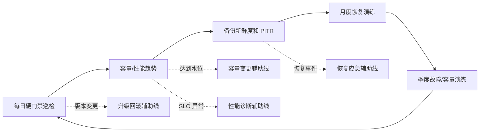
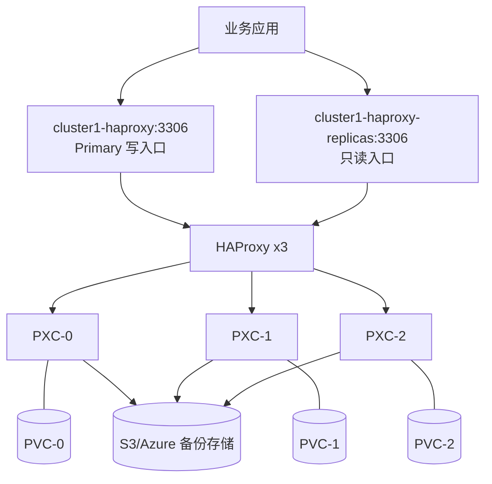
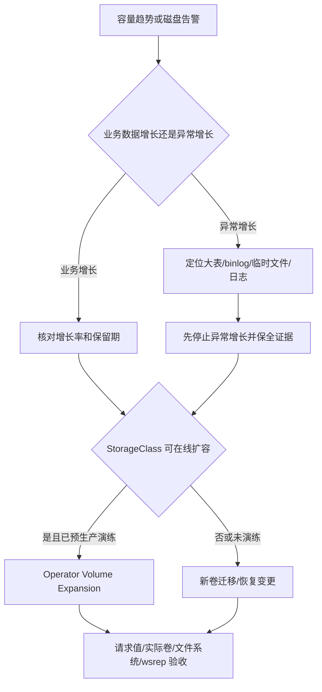
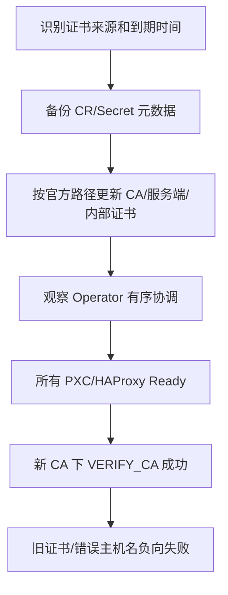
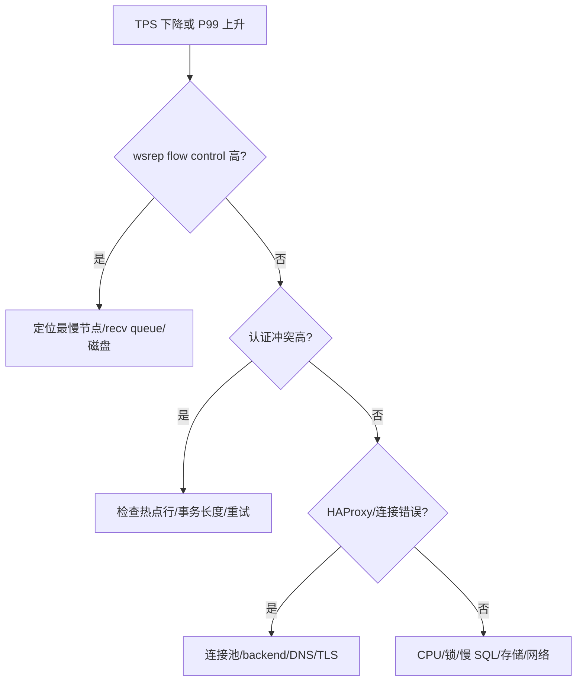
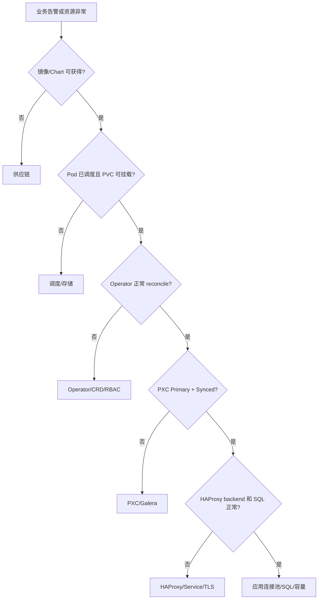

# Percona XtraDB Cluster（PXC）用户与运维手册

> **文档版本：** v1.3（生产运维深化版）
> **最后核验：** 2026-08-21
> **适用系统：** kubeauto Kubernetes v1.33.6
> **适用组件：** Percona Operator for MySQL v1.20.0、PXC 8.4.8-8.1、HAProxy 2.8.18-1
> **官方主线：** [Quickstart](https://docs.percona.com/percona-operator-for-mysql/pxc/quickstart.html)、[Connect](https://docs.percona.com/percona-operator-for-mysql/pxc/connect.html)、[Debug](https://docs.percona.com/percona-operator-for-mysql/pxc/debug.html)、[Backups and restore](https://docs.percona.com/percona-operator-for-mysql/pxc/backups-restore.html)

本文按 drafts 企业文档规范编写：主线路只保留客户需要依次执行的动作；异常处理、回滚和注意事项使用引用块集中说明。当前实现通过独立 MySQL role 和固定 runner 交付；命令中使用 `<...>` 的位置参数必须由客户环境评审后替换，不能直接复制示例凭据。

## 目录

1. [使用约定和状态](#第一章使用约定和状态)
2. [部署目标和容量规划](#第二章部署目标和容量规划)
3. [安装前置检查](#第三章安装前置检查)
4. [制品、Chart 和镜像](#第四章制品chart-和镜像)
5. [安装 Operator 和 CRD](#第五章安装-operator-和-crd)
6. [创建数据库集群](#第六章创建数据库集群)
7. [应用连接和 SQL 验收](#第七章应用连接和-sql-验收)
8. [日常运维和变更](#第八章日常运维和变更)
9. [监控、容量和性能测试](#第九章监控容量和性能测试)
10. [备份、恢复和 PITR](#第十章备份恢复和-pitr)
11. [升级、回滚和下线](#第十一章升级回滚和下线)
12. [故障排查](#第十二章故障排查)
13. [交付验收表](#第十三章交付验收表)

## 第一章、使用约定和状态

### 1.1 统一执行契约

命令从已配置目标集群 kubeconfig 的 Linux 管理节点执行。数据库密码、TLS 私钥和对象存储密钥由密码系统或 Kubernetes Secret 注入，不写入本文档、Git、终端日志或截图。全文沿用以下执行契约：

| 项目 | 统一约定 |
|---|---|
| 执行主机 | 已配置目标生产集群 kubeconfig 的 Linux 管理节点，不在 PXC、HAProxy 或 Operator Pod 内启动管理脚本 |
| 执行账号 | 平台运维账号；能够写交付目录，并具备对应步骤列出的 Kubernetes RBAC 权限 |
| 权威配置 | `clusters/<cluster>/config.yml` 和 kubeauto 渲染文件；现场 CR 是控制器输入，不应成为脱离配置源的长期分叉 |
| 成功判定 | 脚本退出码为 `0`，所有 `test`、`jq -e`、`kubectl wait` 门禁通过，并出现代码块最后一行的明确成功标志 |
| 失败判定 | 脚本提前退出、缺少最后成功标志或任一硬门禁失败，均表示本步骤未通过；不得只凭 Pod `Running` 或部分命令输出继续 |
| 重复执行 | 标注可重跑的脚本会以相同权威输入收敛；可重跑不表示可以无审批地变更密码、PVC、镜像、备份或恢复目标 |
| 日志用途 | 正常日志说明执行阶段和验收结果；异常日志用于确定供应链、存储、Operator、Galera、代理或应用层根因，不以日志数量代替健康判定 |

正常主线脚本统一显示 `[n/N]` 进度，失败时由 `set -Eeuo pipefail` 返回非零退出码，最后一行输出唯一成功标志。需要证据的脚本先写临时目录，全部门禁通过后再原子移动到正式证据目录；失败的临时目录不作为签收结果。

每段脚本前的正文说明其功能、输入、资源影响和验收目标；脚本日志遵循以下语义。客户判断结果时必须读取业务日志，不能只看 shell 是否返回：

| 日志形式 | 含义 | 是否可继续 |
|---|---|---|
| `[n/N] 动作说明` | 当前正在操作的对象和目的；等待阶段会持续输出状态 | 等待本代码块最终标志 |
| `key=value` | 本步骤实际观测值，例如副本、节点、容量、状态和证据路径 | 与本节预期值对账 |
| `*_PASS` / `*_READY` | 本脚本定义的硬门禁全部通过 | 可以进入下一主线步骤 |
| `*_SUCCEEDED` | Operator 管理的单个 CR 已到成功终态，但外部对象或业务数据仍需验证 | 只能进入紧随其后的对象/业务验收 |
| `*_SUBMITTED` | 变更已提交，但控制器或业务验收尚未结束 | 不可签收，继续执行紧随其后的验收 |
| `*_COLLECTION_PASS` | 诊断资料采集完整，不代表系统健康 | 依据日志和分流表定位根因 |
| 缺少最终标志 | 脚本中途失败；终端最后一条命令附近是首个调查入口 | 不可继续，不得人工补写 PASS |

本文不把“第二次没有报错”当作幂等。每段脚本必须符合以下一种可验证语义：

| 脚本类型 | 重复执行契约 | 验证方式 |
|---|---|---|
| 声明式收敛 | 同一配置重复 apply/Helm/kubeauto setup，不更换资源身份、不重建 PVC、不产生第二套对象 | 对账 UID、resourceVersion、目标字段和 Ready 状态 |
| 只读验收/诊断 | 不修改生产对象；每次使用唯一证据目录，旧证据不覆盖 | 比较执行前后资源身份，检查证据目录和最终 marker |
| 固定目标变更 | 以变更 ID、目标节点、目标版本或目标容量作为稳定输入；目标已完成时只验证并返回 | 日志显示 `already_converged=true` 或再次收敛到同一目标 |
| 临时测试资源 | 使用固定所有权 label 或唯一 run ID；成功和失败均按 allowlist 回收 | 清理后查询为空，不匹配客户已有资源 |

恢复、备份、密码轮换等业务动作不能通过“重新生成一个随机输入”实现幂等。相同变更 ID 必须指向相同目标；需要发起新动作时使用新的审批 ID，并保留旧动作证据。

### 1.1.1 脚本功能、影响和幂等索引

下表是全文脚本的执行索引。运行脚本前必须先核对“稳定输入”和“资源影响”；运行后必须取得对应终端标志。`只读` 表示不修改 Kubernetes 生产对象，但可能在管理节点生成新的证据目录。`收敛` 表示仅在现场状态与权威输入不一致时执行变更，目标已满足时只做验收。一次性业务动作使用固定审批 ID 或固定 CR 名作为动作身份；发起新动作必须换用新身份，不能覆盖旧对象。

| 脚本 | 功能与稳定输入 | 资源影响和产物 | 终端标志与重跑语义 |
|---|---|---|---|
| `PXC_WORKDIR` | 创建固定版本交付目录 | 管理节点目录、`evidence/`、`backup/` | `PXC_WORKDIR_READY`；目录存在时校验并复用 |
| `PXC_DEPLOY` | 以 `CLUSTER` 和其 `config.yml` 执行 kubeauto MySQL role | 下载锁定制品，收敛 Operator/PXC | `PXC_KUBEAUTO_DEPLOY_PASS`；相同配置由 role 收敛 |
| `PXC_PREFLIGHT` | 检查版本、节点、StorageClass 和 RBAC | 只读 | `PXC_PREFLIGHT_PASS`；可重复检查 |
| `PXC_NAMESPACES` | 创建或复用两个固定命名空间 | 声明式收敛 Namespace | `PXC_NAMESPACES_READY`；不更换 UID |
| `PXC_STORAGE` | 验证固定预检 PVC 的真实挂载读写 | 创建带专用归属标签的 PVC/Pod，写入 marker | `PXC_STORAGE_PREFLIGHT_PASS`；拒绝接管无归属或异属对象 |
| `PXC_STORAGE_CLEAN` | 回收存储预检对象 | 只删除名称和归属标签同时匹配的 PVC/Pod | `PXC_STORAGE_PREFLIGHT_CLEAN_PASS`；对象不存在时成功 |
| `PXC_ARTIFACT` | 对账四个锁定镜像的 tag/digest | 只读本地镜像元数据 | `PXC_ARTIFACT_INSPECT_PASS`；可重复检查 |
| `PXC_CHART_VERIFY` | 校验固定 Chart SHA256 和压缩包 | 只读本地制品 | `PXC_CHART_VERIFY_PASS`；可重复检查 |
| `PXC_OPERATOR_INSTALL` | 从 vendored Chart 安装或收敛 Operator | Helm release、CRD、RBAC | `PXC_OPERATOR_INSTALL_PASS`；固定 Chart/values 收敛 |
| `PXC_SECRET_CHECK` | 验证系统用户 Secret 契约 | 只读 Secret，绝不输出值 | `PXC_SECRET_CONTRACT_PASS`；可重复检查 |
| `PXC_APPLY` | dry-run 后发布固定 PXC CR | server-side apply 同一 CR | `PXC_CLUSTER_APPLY_SUBMITTED`；随后执行 Ready 验收 |
| `PXC_READY` | 验证 CR、Pod、PVC、故障域和入口 | 只读等待 | `PXC_CONTROL_DATA_READY`；可重复验收 |
| `PXC_CLIENT_CONNECT` | 验证业务 TLS 连接 | 只读 SQL 查询 | `PXC_CLIENT_TLS_CONNECT_PASS`；可重复验收 |
| `PXC_WSREP` | 验证三成员 Primary/Synced | 只读 wsrep 查询 | `PXC_WSREP_HEALTH_PASS`；可重复验收 |
| `PXC_DAILY` | 执行每日生产硬门禁 | 只读集群，生成唯一证据目录 | `PXC_DAILY_ACCEPTANCE_PASS`；每次保留独立证据 |
| `PXC_ONE_NODE_MAINTENANCE` | 排空审批指定的 `TARGET_NODE` | cordon/drain 固定节点 | `PXC_ONE_NODE_MAINTENANCE_PASS`；重跑不选择第二节点 |
| `PXC_SCALE` | 收敛到 `TARGET_SIZE` | 仅在配置和 CR 未收敛时执行步骤 07 | `PXC_HORIZONTAL_SCALE_SUBMITTED`；固定目标重跑只验收 |
| `PXC_STORAGE_AUDIT` | 采集 PVC、文件系统、SC 和事件 | 只读集群，生成唯一证据目录 | `PXC_STORAGE_CAPACITY_AUDIT_COLLECTION_PASS`；不覆盖旧证据，不表示容量健康 |
| `PXC_VOLUME_EXPANSION` | 将所有数据卷扩大到 `NEW_SIZE` | 仅在目标未满足时启用协调并执行步骤 07 | `PXC_VOLUME_EXPANSION_READY`；已扩到同一容量时只验收 |
| `PXC_ROTATE_PASSWORD` | 按 `ROTATION_ID` 和密码系统固定输入轮换一个 Secret key | 原子更新 Secret 值和变更 ID | `PXC_PASSWORD_ROTATION_SUBMITTED`；相同 ID/输入只验收，不重复轮换 |
| `PXC_SYSBENCH` | 完成 prepare、预热、压测、判定和 cleanup | 创建唯一 Pod/测试表，成功失败均回收 | `PXC_PERFORMANCE_ACCEPTANCE_PASS`；每次唯一 run ID，不接管旧 Pod |
| `PXC_PERFORMANCE_DIAG` | 采集性能分层诊断资料 | 只读集群，生成唯一证据目录 | `PXC_PERFORMANCE_DIAG_COLLECTION_PASS`；不表示健康 |
| `PXC_BACKUP` | 执行固定名称的一次备份动作 | 首次创建 Backup CR；重跑读取同一 CR | `PXC_BACKUP_CR_SUCCEEDED`；同名异参立即拒绝，随后验对象 |
| `PXC_RESTORE` | 执行固定名称的一次恢复动作 | 首次创建 Restore CR；会改写目标数据 | `PXC_RESTORE_CR_SUCCEEDED`；同名异参立即拒绝 |
| `PXC_PITR_PREFLIGHT` | 验证 PITR 连续性和最晚时间 | 只读 | `PXC_PITR_PREFLIGHT_PASS`；可重复检查 |
| `PXC_UPGRADE_PREFLIGHT` | 冻结升级前状态 | 只读集群，生成唯一证据目录 | `PXC_UPGRADE_PREFLIGHT_PASS`；不覆盖旧基线 |
| `PXC_OPERATOR_UPGRADE` | 收敛 Operator 到审批版本 | Helm release、CRD、Operator 工作负载 | `PXC_OPERATOR_UPGRADE_PASS`；固定 Chart/values 收敛 |
| `PXC_DATABASE_UPGRADE` | 收敛 PXC/XtraBackup/HAProxy 版本 | server-side apply 并触发 SmartUpdate | `PXC_DATABASE_UPGRADE_READY`；相同清单只验收 rollout |
| `PXC_DECOMMISSION_PREFLIGHT` | 生成下线对象清单 | 只读，不删除任何对象 | `PXC_DECOMMISSION_PREFLIGHT_COLLECTION_PASS`；不表示已下线 |
| `PXC_DIAG` | 统一采集对象、事件和日志 | 只读集群，生成唯一证据目录 | `PXC_DIAGNOSTIC_COLLECTION_PASS`；`health_verified=false` |
| `PXC_OPERATOR_DIAG` | 定位 Helm/CRD/RBAC/Operator 层 | 只读 | `PXC_OPERATOR_DIAG_COLLECTION_PASS`；`health_verified=false` |
| `PXC_SCHEDULING_DIAG` | 定位 Pod/PVC/CSI 调度层 | 只读 | `PXC_SCHEDULING_DIAG_COLLECTION_PASS`；`health_verified=false` |
| `PXC_QUORUM_DIAG` | 采集成员可达性和多数派状态 | 只读 | `PXC_QUORUM_DIAG_COLLECTION_PASS`；`health_verified=false` |
| `PXC_HAPROXY_DIAG` | 采集 Service、Endpoint 和代理日志 | 只读 | `PXC_HAPROXY_DIAG_COLLECTION_PASS`；`health_verified=false` |

日志不是装饰信息。阶段开始前先输出 `[n/N]`，循环等待期间在状态变化时或最长每 5 分钟输出一次 `elapsed_seconds` 心跳，硬门禁后才输出唯一终端标志。脚本异常退出时，终端标志不会出现；保留的 `.tmp` 证据只能用于诊断，不能改名冒充成功证据。

平台团队先在管理节点建立本次交付目录，保存 CR、values、校验和、验收输出和回滚清单：

```bash
bash <<'PXC_WORKDIR'
set -Eeuo pipefail
umask 077
PXC_WORKDIR="$PWD/percona-pxc-1.20.0"
printf '[1/2] 创建或复用固定版本交付目录：%s\n' "$PXC_WORKDIR"
install -d -m 0750 "$PXC_WORKDIR" "$PXC_WORKDIR/evidence" "$PXC_WORKDIR/backup"
printf '[2/2] 验证证据目录可写且权限受控\n'
test -w "$PXC_WORKDIR/evidence"
printf 'PXC_WORKDIR_READY path=%s\n' "$PXC_WORKDIR"
PXC_WORKDIR
```

PXC_WORKDIR 是管理节点本地路径，不是 Operator 读取路径。Operator 只读取通过 kubectl apply 或 Helm 发布到 Kubernetes 的资源。

### 1.2 当前实现状态

| 内容 | 当前状态 |
|---|---|
| 版本和架构 | 已完成官方资料核对 |
| 本文档 | 与当前实现和独立门禁同步 |
| kubeauto mysql 分路 | 已实现，入口由项目 CLI/role 管理 |
| MySQL 独立现场门禁 | 已实现，使用 `tests/run_enterprise_regression.sh --mysql-only` |
| 现有核心矩阵 | 不修改、不重新签字 |

### 1.3 客户首次部署主线路

以下是唯一推荐的首次部署顺序。每一步都必须看到“完成标志”后再进入下一步；不要跳到后面的故障章节寻找替代安装命令。

主线路使用 kubeauto 的固定入口。下面的 `<cluster>` 是 `kubecli new` 创建的集群名，配置文件为 `clusters/<cluster>/config.yml`；脚本检查配置文件、准备固定 MySQL 制品，再执行独立 addon 步骤。它会修改目标集群，重复执行语义由 kubeauto role 的幂等契约保证；不要在目标节点上直接执行临时 Helm 或 `kubectl set image`：

```bash
bash <<'PXC_DEPLOY'
set -Eeuo pipefail
CLUSTER="<cluster>"
CONFIG="clusters/${CLUSTER}/config.yml"
printf '[1/3] 检查 kubeauto 集群配置：%s\n' "$CONFIG"
test -s "$CONFIG"
# 在 CONFIG 中设置 mysql_install: "yes"、StorageClass、容量和 Secret 引用
printf '配置文件存在：cluster=%s bytes=%s\n' "$CLUSTER" "$(wc -c <"$CONFIG")"
printf '[2/3] 下载并校验 MySQL/PXC 固定制品\n'
kubecli download -E mysql
printf '[3/3] 执行 cluster-addon 的 Percona PXC 步骤 07\n'
kubecli setup "$CLUSTER" 07
printf 'PXC_KUBEAUTO_DEPLOY_PASS cluster=%s config=%s\n' "$CLUSTER" "$CONFIG"
PXC_DEPLOY
```

若客户采用 `kubecli setup <cluster> 90` 一键流程，仍须在执行前完成本手册第 2～4 章，并在 90 完成后执行第 6～10 章验收；`07` 只是独立 addon 步骤，不会替代集群基础设施和 CNI 前置条件。

| 步骤 | 执行动作 | 完成标志 |
|---|---|---|
| 1 | 完成第 2、3 章容量、节点、StorageClass、权限和存储读写预检 | 3 个故障域可调度，预检 PVC 写入/读取成功 |
| 2 | 按第 4 章准备受控 Chart、固定镜像和密码/TLS/对象存储 Secret | SHA256、tag/digest、Secret key 对账完成 |
| 3 | 在 kubeauto 配置中设置 `mysql_install: "yes"`，执行生产 role | role rc=0，Operator Deployment 和 CRD Ready |
| 4 | 等待第 6 章控制面和数据面状态 | PXC 3/3、HAProxy 3/3、PVC Bound、三个不同节点 |
| 5 | 按第 7 章完成 TLS、Primary 写入、replicas 读取和最小权限验证 | marker 可读回，越权和错误 CA 被拒绝 |
| 6 | 按第 10 章创建全量备份并进行恢复抽检 | Backup `Succeeded`，对象可读且校验值可保存 |
| 7 | 保存第 13 章签收证据并执行限定清理（测试环境） | 当前矩阵证据完整，输出 `MYSQL_CLEAN_VERIFY_PASS` |


### 1.4 生产运行线路

首次交付只占数据库生命周期的一小部分。上线后按下图运行；日常巡检和备份验证是生产主线，容量变更、性能压测、恢复和升级是受审批的辅助线，应在对应窗口单独执行。



| 线路 | 执行频率 | 入口 | 完成标志 |
|---|---|---|---|
| 日常运维主线 | 每日或每班 | 8.1 节 | `PXC_DAILY_ACCEPTANCE_PASS` |
| 备份与恢复主线 | 每日检查、按月演练 | 第 10 章 | Backup/Restore `Succeeded`，业务校验通过 |
| 容量变更辅助线 | 达到审批水位时 | 8.4 节 | PVC 请求值、实际容量和文件系统容量一致 |
| 性能诊断辅助线 | SLO 趋势异常或变更前后 | 第 9 章 | 原始日志、摘要和 wsrep 前后快照完整 |
| 故障应急辅助线 | 告警或业务故障时 | 第 12 章 | 先取证、再归因、修复后重跑日常硬门禁 |

> **主线路禁止事项：** 不在主线路中手工 bootstrap、删除 PVC、关闭 TLS 校验、使用 `percona.com/unsafe-pitr` 或直接修改 Operator 管理的 StatefulSet。这些动作只有在本文对应的异常/回滚引用块中、完成取证并得到审批后才可考虑。

## 第二章、部署目标和容量规划

Percona 官方建议生产使用 3–5 个 PXC 节点；偶数节点会削弱多数派判断，7 个以上节点会增加写事务确认成本。本文一期采用 3 个 PXC、3 个 HAProxy、每个 PXC 独立 PVC 和主机反亲和。



| 项目 | 一期目标 | 不合格情形 |
|---|---|---|
| PXC 副本 | 3 | 2、4 等偶数生产拓扑 |
| HAProxy | 3 | 业务直接连接 PXC Pod |
| Pod 分布 | 不同 kubernetes.io/hostname | 三个 Pod 集中在一个节点 |
| 存储 | 支持故障后重新挂载的 CSI | 把 Hostpath 当成跨节点高可用 |
| 备份 | 独立 S3/Azure 兼容存储 | 只依赖三份在线副本 |

官方系统要求是至少 3 个节点、每节点 2 CPU、2 GiB RAM、至少 60 GiB 可用于 PV；这是安装门槛，不是生产容量。kubeauto 的生产默认值为每个 PXC 2 CPU/4 GiB、100 GiB PVC；独立门禁使用较小的测试资源，不能把测试值当作客户容量。生产容量至少计算：

```text
PXC PVC = 当前数据 + 索引 + 临时表 + binlog/gcache + 增长窗口
备份存储 = 全量备份大小 × 保留份数 + binlog + PITR 余量
节点内存 = MySQL buffer pool + Galera/XtraBackup + HAProxy + 系统保留
```

## 第三章、安装前置检查

### 3.1 Kubernetes、节点和权限

本脚本只读检查 Kubernetes 版本、Ready 节点、StorageClass 和安装所需 RBAC，不创建资源。CRD 尚未安装时，PXC CR 权限只记录为预检查结果；第五章安装 CRD 后必须重新得到 `yes`。

```bash
bash <<'PXC_PREFLIGHT'
set -Eeuo pipefail
export KUBECONFIG="<目标 kubeconfig 的绝对路径>"
printf '[1/5] 验证 kubectl、jq、Helm、Python 和 PyYAML 客户端依赖\n'
for command in kubectl jq helm python3; do
  command -v "$command" >/dev/null
done
python3 -c 'import yaml; print("PyYAML_READY version=" + yaml.__version__)'
printf '[2/5] 读取 Kubernetes 客户端和服务端版本\n'
kubectl version
printf '[3/5] 统计 Ready 节点并显示故障域\n'
kubectl get nodes -o wide
READY_NODES="$(kubectl get nodes -o json | jq '[.items[] | select(any(.status.conditions[]?; .type == "Ready" and .status == "True"))] | length')"
test "$READY_NODES" -ge 3
printf '节点门禁通过：ready_nodes=%s required=3\n' "$READY_NODES"
printf '[4/5] 列出可供容量评审的 StorageClass\n'
kubectl get sc
test "$(kubectl get sc -o json | jq '.items | length')" -gt 0
printf '[5/5] 验证平台账号的 Kubernetes RBAC\n'
for permission in \
  'create namespaces ' \
  'get pods mysql' \
  'create secrets mysql' \
  'create persistentvolumeclaims mysql'; do
  read -r verb resource namespace <<<"$permission"
  args=(auth can-i "$verb" "$resource")
  [[ -n "${namespace:-}" ]] && args+=(-n "$namespace")
  result="$(kubectl "${args[@]}")"
  printf 'RBAC：verb=%s resource=%s namespace=%s allowed=%s\n' \
    "$verb" "$resource" "${namespace:-cluster}" "$result"
  test "$result" = yes
done
PXC_CR_PERMISSION="$(kubectl auth can-i create \
  perconaxtradbclusters.pxc.percona.com -n mysql 2>/dev/null || true)"
printf 'PXC CR 预检查：allowed=%s；CRD 安装后必须为 yes\n' \
  "${PXC_CR_PERMISSION:-resource-not-installed}"
printf 'PXC_PREFLIGHT_PASS ready_nodes=%s storage_classes=%s\n' \
  "$READY_NODES" "$(kubectl get sc -o json | jq '.items | length')"
PXC_PREFLIGHT
```

预期：至少 3 个可调度节点 Ready；目标 StorageClass 存在；所需权限为 yes。首次部署时 CRD 尚不存在，`create perconaxtradbclusters` 可能返回 no；应在第五章安装 CRD 后重新检查并得到 yes。只有节点 Ready 不能证明存储可用。

> **注意：实验室与生产参数不同。** `tests/helpers/mysql-regression.sh` 为了在专用测试集群完成门禁使用 1 CPU/2 GiB 请求、20 GiB PVC；这只证明功能链路和故障语义，不证明客户容量。上线必须使用配置文件中的生产默认值或经过容量评审的更高值。

### 3.2 创建并确认命名空间

`mysql-operator` 由平台团队维护，承载 Operator Deployment、Webhook 和 RBAC；`mysql` 由平台团队维护，承载 PXC CR、PVC、Service、Backup 和 Restore CR。以下脚本以声明式方式创建或复用两个命名空间，并硬判断其为 Active；命名空间存在不代表可以覆盖其中已有资源，执行前先确认归属：

```bash
bash <<'PXC_NAMESPACES'
set -Eeuo pipefail
export KUBECONFIG="<目标 kubeconfig 的绝对路径>"
printf '[1/3] 查看两个命名空间是否已存在\n'
kubectl get namespace mysql-operator mysql 2>/dev/null || true
printf '[2/3] 以声明式方式创建或收敛命名空间\n'
kubectl create namespace mysql-operator --dry-run=client -o yaml | kubectl apply -f -
kubectl create namespace mysql --dry-run=client -o yaml | kubectl apply -f -
printf '[3/3] 验证命名空间状态\n'
kubectl get namespace mysql-operator mysql
for namespace in mysql-operator mysql; do
  phase="$(kubectl get namespace "$namespace" -o jsonpath='{.status.phase}')"
  printf 'namespace=%s phase=%s\n' "$namespace" "$phase"
  test "$phase" = Active
done
printf 'PXC_NAMESPACES_READY operator_namespace=mysql-operator database_namespace=mysql\n'
PXC_NAMESPACES
```

预期：两个命名空间均为 Active。卸载单个 PXC 集群不删除共享的 `mysql-operator`；删除任一命名空间前，必须确认其中没有其他 Operator、PXC 集群、PVC、Secret 或备份恢复任务。

### 3.3 存储数据面

StorageClass 由平台团队维护，PVC 由 Operator 根据 PXC CR 创建，CSI Controller/Node 负责供给和挂载。先用独立测试 PVC 验证真实写入：

```yaml
apiVersion: v1
kind: PersistentVolumeClaim
metadata:
  name: pxc-storage-preflight
  namespace: mysql
  labels:
    app.kubernetes.io/managed-by: kubeauto-pxc-preflight
    kubeauto.talkedu.cn/purpose: storage-preflight
spec:
  accessModes: [ReadWriteOnce]
  storageClassName: <客户批准的 StorageClass>
  resources:
    requests:
      storage: 1Gi
```

`storage-preflight-pod.yaml` 必须使用已经通过 kubeauto 供应链校验并灌入本地 Registry 的诊断镜像，不允许在交付现场临时拉取漂移标签：

```yaml
apiVersion: v1
kind: Pod
metadata:
  name: pxc-storage-preflight
  namespace: mysql
  labels:
    app.kubernetes.io/managed-by: kubeauto-pxc-preflight
    kubeauto.talkedu.cn/purpose: storage-preflight
spec:
  restartPolicy: Never
  containers:
    - name: writer
      image: registry.talkschool.cn:5000/brinnatt/<已锁定版本的诊断镜像>
      command: ["sh", "-c", "trap : TERM INT; sleep infinity & wait"]
      securityContext:
        allowPrivilegeEscalation: false
      volumeMounts:
        - name: data
          mountPath: /data
  volumes:
    - name: data
      persistentVolumeClaim:
        claimName: pxc-storage-preflight
```

PVC 和测试 Pod 文件保存在 PXC_WORKDIR，由平台团队维护，消费者是 Kubernetes API。脚本创建一次性 PVC/Pod，等待真实挂载后写入并读回 marker；它会创建两个固定名称的临时资源，成功后必须执行紧随其后的清理脚本：

```bash
bash <<'PXC_STORAGE'
set -Eeuo pipefail
export KUBECONFIG="<目标 kubeconfig 的绝对路径>"
PXC_WORKDIR="<第一章输出的绝对路径>"
test -d "$PXC_WORKDIR"
wait_field() {
  local kind="$1" name="$2" jsonpath="$3" expected="$4"
  local value="" last="__unset__" attempt
  for attempt in $(seq 1 10); do
    value="$(kubectl -n mysql get "$kind/$name" \
      -o "jsonpath=${jsonpath}" 2>/dev/null || true)"
    if [[ "$value" != "$last" || $((attempt % 10)) -eq 0 ]]; then
      printf '等待资源：kind=%s name=%s state=%s expected=%s elapsed_seconds=%s\n' \
        "$kind" "$name" "${value:-missing}" "$expected" "$((attempt * 30))"
      last="$value"
    fi
    [[ "$value" == "$expected" ]] && return 0
    (( attempt < 10 ))
    sleep 30
  done
  return 1
}
cleanup_storage_on_error() {
  local rc=$? kind owner purpose evidence remaining attempt
  (( rc == 0 )) && return 0
  set +e
  evidence="$(mktemp "$PXC_WORKDIR/evidence/storage-preflight-failed.XXXXXX.log")"
  {
    kubectl -n mysql get pod,pvc pxc-storage-preflight -o wide || true
    kubectl -n mysql describe pod pxc-storage-preflight || true
    kubectl -n mysql describe pvc pxc-storage-preflight || true
  } >"$evidence" 2>&1
  for kind in pod pvc; do
    owner="$(kubectl -n mysql get "$kind/pxc-storage-preflight" \
      -o jsonpath='{.metadata.labels.app\.kubernetes\.io/managed-by}' \
      2>/dev/null || true)"
    purpose="$(kubectl -n mysql get "$kind/pxc-storage-preflight" \
      -o jsonpath='{.metadata.labels.kubeauto\.talkedu\.cn/purpose}' \
      2>/dev/null || true)"
    if [[ "$owner" == kubeauto-pxc-preflight && \
      "$purpose" == storage-preflight ]]; then
      kubectl -n mysql delete "$kind/pxc-storage-preflight" \
        --ignore-not-found --wait=false >/dev/null || true
    fi
  done
  for attempt in $(seq 1 30); do
    remaining="$(kubectl -n mysql get pod,pvc -o name 2>/dev/null | \
      grep -c '/pxc-storage-preflight$' || true)"
    printf '失败清理进度：remaining=%s elapsed_seconds=%s\n' \
      "$remaining" "$((attempt * 10))" >&2
    [[ "$remaining" -eq 0 ]] && break
    if (( attempt < 30 )); then sleep 10; fi
  done
  printf 'PXC_STORAGE_PREFLIGHT_FAILED rc=%s evidence=%s cleanup_complete=%s\n' \
    "$rc" "$evidence" "$([[ "$remaining" -eq 0 ]] && printf true || printf false)" >&2
  exit "$rc"
}
trap cleanup_storage_on_error EXIT
printf '[1/5] 检查固定名称资源的归属；拒绝接管客户对象\n'
for kind in pvc pod; do
  if kubectl -n mysql get "$kind/pxc-storage-preflight" >/dev/null 2>&1; then
    owner="$(kubectl -n mysql get "$kind/pxc-storage-preflight" \
      -o jsonpath='{.metadata.labels.app\.kubernetes\.io/managed-by}')"
    purpose="$(kubectl -n mysql get "$kind/pxc-storage-preflight" \
      -o jsonpath='{.metadata.labels.kubeauto\.talkedu\.cn/purpose}')"
    test "$owner" = kubeauto-pxc-preflight
    test "$purpose" = storage-preflight
    printf '资源归属通过：kind=%s owner=%s purpose=%s\n' \
      "$kind" "$owner" "$purpose"
  fi
done
printf '[2/5] 创建或收敛存储预检 PVC 并等待 Bound\n'
kubectl apply -f "$PXC_WORKDIR/storage-preflight-pvc.yaml"
wait_field pvc pxc-storage-preflight '{.status.phase}' Bound
printf '[3/5] 创建或复用挂载预检卷的诊断 Pod 并等待 Ready\n'
kubectl apply -f "$PXC_WORKDIR/storage-preflight-pod.yaml"
wait_field pod pxc-storage-preflight \
  '{.status.conditions[?(@.type=="Ready")].status}' True
printf '[4/5] 在真实挂载点幂等写入并读回 marker\n'
kubectl -n mysql exec pxc-storage-preflight -- sh -c 'printf pxc-storage-ok >/data/marker && test "$(cat /data/marker)" = pxc-storage-ok'
printf '[5/5] 输出 PVC、Pod、节点和卷信息\n'
kubectl -n mysql get pvc,pod pxc-storage-preflight -o wide
trap - EXIT
printf 'PXC_STORAGE_PREFLIGHT_PASS pvc=pxc-storage-preflight marker=pxc-storage-ok\n'
PXC_STORAGE
```

预期：PVC Bound、Pod Ready、marker 写入和读取成功。验收后只删除本次测试资源。

清理命令只处理上述两个固定名称，并在删除后硬判断不存在残留；该操作不可替换成通配符清理：

```bash
bash <<'PXC_STORAGE_CLEAN'
set -Eeuo pipefail
export KUBECONFIG="<目标 kubeconfig 的绝对路径>"
printf '[1/3] 对账固定名称资源归属；无归属或异属对象不得删除\n'
for kind in pod pvc; do
  if kubectl -n mysql get "$kind/pxc-storage-preflight" >/dev/null 2>&1; then
    test "$(kubectl -n mysql get "$kind/pxc-storage-preflight" \
      -o jsonpath='{.metadata.labels.app\.kubernetes\.io/managed-by}')" \
      = kubeauto-pxc-preflight
    test "$(kubectl -n mysql get "$kind/pxc-storage-preflight" \
      -o jsonpath='{.metadata.labels.kubeauto\.talkedu\.cn/purpose}')" \
      = storage-preflight
  fi
done
printf '[2/3] 按固定名称和已验证归属删除预检 Pod、PVC\n'
kubectl -n mysql delete pod/pxc-storage-preflight --ignore-not-found --wait=false
kubectl -n mysql delete pvc/pxc-storage-preflight --ignore-not-found --wait=false
printf '[3/3] 验证固定名称资源已完全删除\n'
last_remaining=""
for attempt in $(seq 1 30); do
  remaining="$(kubectl -n mysql get pod,pvc -o name | \
    grep -c '/pxc-storage-preflight$' || true)"
  if [[ "$remaining" != "$last_remaining" || $((attempt % 3)) -eq 0 ]]; then
    printf '清理进度：remaining=%s elapsed_seconds=%s\n' \
      "$remaining" "$((attempt * 10))"
    last_remaining="$remaining"
  fi
  [[ "$remaining" -eq 0 ]] && break
  (( attempt < 30 ))
  sleep 10
done
test "$remaining" -eq 0
printf 'PXC_STORAGE_PREFLIGHT_CLEAN_PASS namespace=mysql\n'
PXC_STORAGE_CLEAN
```

> **异常处理：PVC 长期 Pending**
> 保留 kubectl describe pvc、Pod events、StorageClass 和 CSI 日志，分流“没有消费者、节点拓扑、容量不足、CSI 故障”。不得用降低 PXC 副本数掩盖存储问题。

## 第四章、制品、Chart 和镜像

| 制品 | 固定版本 | 官方用途 |
|---|---|---|
| pxc-operator Chart | 1.20.0 | Operator Deployment、RBAC、CRD |
| Operator image | 1.20.0 | reconcile、webhook、备份恢复协调 |
| PXC image | 8.4.8-8.1 | 数据库节点 |
| XtraBackup image | 8.4.0-5.1 | 备份、恢复、SST |
| HAProxy image | 2.8.18-1 | 数据库代理 |
| Fluent Bit image | 5.0.6-1 | 可选日志收集 |

上游名称、本项目发布名称和集群内引用必须一一对应：

| 上游镜像 | kubeauto 目标发布名 | 集群内目标引用 |
|---|---|---|
| `percona/percona-xtradb-cluster-operator:1.20.0` | `brinnatt/percona-xtradb-cluster-operator:1.20.0` | `registry.talkschool.cn:5000/brinnatt/percona-xtradb-cluster-operator:1.20.0` |
| `percona/percona-xtradb-cluster:8.4.8-8.1` | `brinnatt/percona-xtradb-cluster:8.4.8-8.1` | `registry.talkschool.cn:5000/brinnatt/percona-xtradb-cluster:8.4.8-8.1` |
| `percona/percona-xtrabackup:8.4.0-5.1` | `brinnatt/percona-xtrabackup:8.4.0-5.1` | `registry.talkschool.cn:5000/brinnatt/percona-xtrabackup:8.4.0-5.1` |
| `percona/haproxy:2.8.18-1` | `brinnatt/percona-haproxy:2.8.18-1` | `registry.talkschool.cn:5000/brinnatt/percona-haproxy:2.8.18-1` |

这些发布名已进入 MySQL 制品集合和独立门禁。正式拉取顺序为 TalkEdu 私仓、Docker Hub 已发布副本、Percona 官方上游；公共加速器只允许在测试命令行临时注入，不能写入代码、CI、默认配置或本文档。

镜像必须经固定候选拉取、inspect、tag/push、本地 Registry manifest 和 digest 验证；Chart/CRD 必须 vendored 并通过 SHA256。以下脚本只读检查四个核心镜像是否已进入本地 Docker image store，并逐项打印 tag 和 image ID；它是现场存在性检查，源/目标 manifest digest 对账仍由 kubeauto 下载门禁负责：

```bash
bash <<'PXC_ARTIFACT'
set -Eeuo pipefail
printf '[1/2] 检查四个锁定版本镜像\n'
checked=0
for image in \
  percona-xtradb-cluster-operator:1.20.0 \
  percona-xtradb-cluster:8.4.8-8.1 \
  percona-xtrabackup:8.4.0-5.1 \
  haproxy:2.8.18-1; do
  result="$(docker image inspect "registry.talkschool.cn:5000/brinnatt/$image" \
    --format '{{join .RepoTags ","}} {{.Id}}')"
  printf '镜像通过：image=%s result=%s\n' "$image" "$result"
  checked=$((checked + 1))
done
printf '[2/2] 验证检查数量\n'
test "$checked" -eq 4
printf 'PXC_ARTIFACT_INSPECT_PASS checked=%s\n' "$checked"
PXC_ARTIFACT
```

预期：四个镜像均存在，tag 与锁定版本一致。签收还必须保存各源镜像和本地镜像的 repo digest/manifest 对账结果；仅有本地 image ID 不足以证明供应链一致。

Chart 和 CRD 必须先进入受控 vendored 目录，再由发布代码引用。以下脚本校验 Chart SHA256，再读取 tar 索引证明压缩包结构完整；不安装任何资源。下载阶段保存官方 URL、文件大小和 SHA256；校验失败时删除临时文件，不能覆盖旧制品：

```bash
bash <<'PXC_CHART_VERIFY'
set -Eeuo pipefail
PXC_WORKDIR="<第一章输出的绝对路径>"
test -d "$PXC_WORKDIR/vendor"
cd "$PXC_WORKDIR/vendor"
printf '[1/2] 校验 pxc-operator Chart SHA256\n'
sha256sum -c pxc-operator-1.20.0.tgz.sha256
printf '[2/2] 验证 Chart 压缩包可完整读取\n'
tar -tzf pxc-operator-1.20.0.tgz >/dev/null
printf 'PXC_CHART_VERIFY_PASS chart=pxc-operator-1.20.0.tgz bytes=%s\n' \
  "$(wc -c <pxc-operator-1.20.0.tgz)"
PXC_CHART_VERIFY
```

## 第五章、安装 Operator 和 CRD

| 文件/资源 | 创建者 | 保存位置 | 消费者 | 生效方式 |
|---|---|---|---|---|
| Operator Chart | 发布流水线 | kubeauto vendored files | Helm | helm upgrade --install |
| Operator values | 平台/开发团队 | PXC_WORKDIR/operator-values.yaml | Helm | Helm release |
| CRD | 官方 Chart/bundle | Kubernetes API | Operator/webhook | Helm 安装时创建 |
| Operator Deployment | Helm | mysql-operator | Kubernetes | Deployment reconcile |

本文采用独立 Operator 命名空间并只监听 `mysql`，避免无必要的集群级全命名空间监听。正式交付由 kubeauto role 消费仓库内已校验的 Chart 和本地 Registry；以下 values 片段用于说明渲染契约，字段已经按 `pxc-operator-1.20.0` 官方 `values.yaml` 对照：

```yaml
operatorImageRepository: registry.talkschool.cn:5000/brinnatt/percona-xtradb-cluster-operator
imagePullPolicy: IfNotPresent
watchNamespace: mysql
createNamespace: false
watchAllNamespaces: false
rbac:
  create: true
serviceAccount:
  create: true
logStructured: true
logLevel: INFO
disableTelemetry: true
leaderElectionEnabled: true
resources:
  requests:
    cpu: 100m
    memory: 128Mi
  limits:
    cpu: 500m
    memory: 512Mi
```

`operatorImageRepository` 由 Chart 使用 `appVersion=1.20.0` 组成最终镜像引用。正式编码时必须执行 `helm template`，证明渲染结果使用本地 Registry、目标命名空间和正确 RBAC，再允许安装。

脱离 kubeauto 的手工路径只有在客户已经自行准备并校验 vendored Chart 时才可执行。脚本安装/升级 Helm release，等待 Operator Deployment 和 CRD，再验证目标命名空间的 PXC CR 创建权限；它会修改集群控制面，不能从网络直接安装未知版本：

```bash
bash <<'PXC_OPERATOR_INSTALL'
set -Eeuo pipefail
export KUBECONFIG="<目标 kubeconfig 的绝对路径>"
PXC_WORKDIR="<第一章输出的绝对路径>"
test -d "$PXC_WORKDIR"
test -s "$PXC_WORKDIR/vendor/pxc-operator-1.20.0.tgz"
test -s "$PXC_WORKDIR/operator-values.yaml"
printf '[1/4] 对账 Helm Chart 和用户 values；完全一致时不新增 release revision\n'
CURRENT_CHART="$(helm -n mysql-operator list -o json 2>/dev/null | jq -r \
  '.[] | select(.name == "pxc-operator") | .chart' || true)"
CURRENT_VALUES="$(helm -n mysql-operator get values pxc-operator \
  -o json 2>/dev/null || printf '{}')"
DESIRED_VALUES="$(python3 -c 'import json, sys, yaml; print(json.dumps(yaml.safe_load(open(sys.argv[1], encoding="utf-8")) or {}, sort_keys=True))' "$PXC_WORKDIR/operator-values.yaml")"
if [[ "$CURRENT_CHART" == pxc-operator-1.20.0 ]] && \
  jq -e --argjson desired "$DESIRED_VALUES" '. == $desired' \
    <<<"$CURRENT_VALUES" >/dev/null; then
  printf 'Helm release 已收敛：chart=%s already_converged=true\n' "$CURRENT_CHART"
else
  helm upgrade --install pxc-operator \
    "$PXC_WORKDIR/vendor/pxc-operator-1.20.0.tgz" \
    --namespace mysql-operator --create-namespace \
    --values "$PXC_WORKDIR/operator-values.yaml" \
    --wait --timeout 10m --history-max 10
fi
printf '[2/4] 等待 Operator Deployment 完成 rollout\n'
kubectl -n mysql-operator rollout status deployment/pxc-operator --timeout=10m
printf '[3/4] 等待 PXC CRD Established\n'
last_established="__unset__"
for attempt in $(seq 1 12); do
  established="$(kubectl get crd perconaxtradbclusters.pxc.percona.com \
    -o jsonpath='{.status.conditions[?(@.type=="Established")].status}' \
    2>/dev/null || true)"
  if [[ "$established" != "$last_established" || $((attempt % 3)) -eq 0 ]]; then
    printf 'CRD 进度：established=%s elapsed_seconds=%s\n' \
      "${established:-missing}" "$((attempt * 10))"
    last_established="$established"
  fi
  [[ "$established" == True ]] && break
  (( attempt < 12 ))
  sleep 10
done
test "$established" = True
printf '[4/4] 验证 PXC CR 创建权限\n'
PXC_CR_ALLOWED="$(kubectl auth can-i create perconaxtradbclusters.pxc.percona.com -n mysql)"
printf 'RBAC：resource=perconaxtradbclusters namespace=mysql allowed=%s\n' "$PXC_CR_ALLOWED"
test "$PXC_CR_ALLOWED" = yes
printf 'PXC_OPERATOR_INSTALL_PASS namespace=mysql-operator release=pxc-operator\n'
PXC_OPERATOR_INSTALL
```

预期：Helm deployed、Operator Deployment Ready、CRD Established=True、最后一项权限检查为 yes；Operator 日志无 webhook、RBAC、镜像和 leader election 错误。若 Deployment 实际名称因后续 Chart 模板调整而变化，以 `helm get manifest pxc-operator -n mysql-operator` 的当前渲染结果为准，文档和自动化必须同步更新。

> **回滚边界：Operator 安装失败。** 先保存 Helm manifest、values、CRD 状态、事件和 Operator 日志。若尚未创建 PXC CR，只按发布流程卸载本次 Helm release；若已经存在 PXC/备份/恢复资源，不得直接删除 CRD 或命名空间，应转到第 11.5 节的回滚判定。

## 第六章、创建数据库集群

Operator 管理系统用户 Secret、TLS Secret 和内部认证关系。平台团队负责 Secret 来源、权限、轮换和备份；应用团队只获得业务库最小权限。不要猜测 Secret 字段格式；自定义 secretsName 时必须以 v1.20.0 官方 users 文档和 CRD schema 为准。

生产系统用户密码由密码系统生成后写入 `cluster1-secrets`，Secret 至少包含实际启用组件要求的 `root`、`xtrabackup`、`monitor`、`proxyadmin`、`operator` 和 `replication` 键。以下脚本只验证 Secret 和六个 key 存在且非空，不输出任何值，也不修改 Secret。本文不提供默认密码；禁止使用官方开发示例密码：

```bash
bash <<'PXC_SECRET_CHECK'
set -Eeuo pipefail
export KUBECONFIG="<目标 kubeconfig 的绝对路径>"
printf '[1/2] 确认系统用户 Secret 存在\n'
kubectl -n mysql get secret cluster1-secrets >/dev/null
printf '[2/2] 逐项验证必需 key 非空；日志只输出 key 名\n'
checked=0
for key in root xtrabackup monitor proxyadmin operator replication; do
  value="$(kubectl -n mysql get secret cluster1-secrets \
    -o "jsonpath={.data.${key}}" | base64 -d)"
  test -n "$value"
  printf 'Secret key 通过：name=cluster1-secrets key=%s\n' "$key"
  checked=$((checked + 1))
  unset value
done
test "$checked" -eq 6
printf 'PXC_SECRET_CONTRACT_PASS secret=cluster1-secrets keys=%s\n' "$checked"
PXC_SECRET_CHECK
```

预期：所有键都有非空值，终端不显示密码。Secret 必须在 PXC CR 之前创建，并由外部密码系统保留可恢复副本；Kubernetes Secret 的 base64 不是加密。

cluster1-pxc.yaml 由平台团队保存于 PXC_WORKDIR，Operator 是唯一消费者：

```yaml
apiVersion: pxc.percona.com/v1
kind: PerconaXtraDBCluster
metadata:
  name: cluster1
  namespace: mysql
  finalizers:
    - percona.com/delete-pxc-pods-in-order
spec:
  crVersion: 1.20.0
  secretsName: cluster1-secrets
  tls:
    enabled: true
  updateStrategy: SmartUpdate
  pxc:
    size: 3
    image: registry.talkschool.cn:5000/brinnatt/percona-xtradb-cluster:8.4.8-8.1
    autoRecovery: true
    resources:
      requests:
        cpu: <容量评审结果>
        memory: <容量评审结果>
      limits:
        cpu: <容量评审结果>
        memory: <容量评审结果>
    affinity:
      antiAffinityTopologyKey: kubernetes.io/hostname
    podDisruptionBudget:
      maxUnavailable: 1
    volumeSpec:
      persistentVolumeClaim:
        storageClassName: <客户批准的 StorageClass>
        resources:
          requests:
            storage: <客户容量评审结果>
  haproxy:
    enabled: true
    size: 3
    image: registry.talkschool.cn:5000/brinnatt/percona-haproxy:2.8.18-1
    affinity:
      antiAffinityTopologyKey: kubernetes.io/hostname
    podDisruptionBudget:
      maxUnavailable: 1
    exposeReplicas:
      enabled: true
      onlyReaders: true
  backup:
    image: registry.talkschool.cn:5000/brinnatt/percona-xtrabackup:8.4.0-5.1
    pitr:
      enabled: false
      storageName: s3-prod
      timeBetweenUploads: 60
    storages:
      s3-prod:
        type: s3
        verifyTLS: true
        s3:
          bucket: <客户批准的备份 bucket>
          credentialsSecret: cluster1-backup-s3
          region: <对象存储区域>
          endpointUrl: <S3 兼容 HTTPS endpoint>
```

`cluster1-backup-s3` 的键名和内容必须按 v1.20.0 [Backup storage](https://docs.percona.com/percona-operator-for-mysql/pxc/backups-storage.html) 创建并由密码系统注入。不得把 access key、secret key 或 CA 私钥写进 CR。PITR 一期默认关闭；完成全量备份、对象存储 TLS 和 binlog 连续性门禁后再单独变更为 true。

以下脚本先让 API Server 按当前 CRD 校验清单，再以固定 field manager 提交 PXC CR，最后打印 CR 和派生资源。该步骤会创建或更新数据库集群，但只表示声明已提交，不能替代 6.1 节 Ready 验收：

```bash
bash <<'PXC_APPLY'
set -Eeuo pipefail
export KUBECONFIG="<目标 kubeconfig 的绝对路径>"
PXC_WORKDIR="<第一章输出的绝对路径>"
test -d "$PXC_WORKDIR"
test -s "$PXC_WORKDIR/cluster1-pxc.yaml"
printf '[1/3] 使用 API Server 对 PXC CR 做 dry-run 校验\n'
kubectl apply --dry-run=server -f "$PXC_WORKDIR/cluster1-pxc.yaml" >/dev/null
printf '[2/3] 以固定 field manager 发布 PXC CR\n'
kubectl apply --server-side --field-manager=kubeauto-mysql -f "$PXC_WORKDIR/cluster1-pxc.yaml"
printf '[3/3] 输出 Operator 当前接收的 CR 和派生资源状态\n'
kubectl -n mysql get pxc cluster1 -o yaml
kubectl -n mysql get pxc,pod,pvc,svc -o wide
printf 'PXC_CLUSTER_APPLY_SUBMITTED cluster=cluster1 namespace=mysql\n'
PXC_APPLY
```

### 6.1 安装后控制面和数据面验收

不要用 `kubectl apply` 返回 0 或 Pod Running 结束验收。以下脚本等待固定的 3 个 PXC 和 3 个 HAProxy Pod Ready，硬判断 CR ready、三个 PXC 故障域、三块 Bound PVC、两个 Service 和写入口 EndpointSlice；脚本只读等待，不修改资源：

```bash
bash <<'PXC_READY'
set -Eeuo pipefail
export KUBECONFIG="<目标 kubeconfig 的绝对路径>"
wait_pod_ready() {
  local pod="$1" ready="" last="__unset__" attempt
  for attempt in $(seq 1 60); do
    ready="$(kubectl -n mysql get "pod/$pod" \
      -o jsonpath='{.status.conditions[?(@.type=="Ready")].status}' \
      2>/dev/null || true)"
    if [[ "$ready" != "$last" || $((attempt % 10)) -eq 0 ]]; then
      printf '等待 Pod：name=%s ready=%s elapsed_seconds=%s timeout_seconds=1800\n' \
        "$pod" "${ready:-missing}" "$((attempt * 30))"
      last="$ready"
    fi
    [[ "$ready" == True ]] && return 0
    (( attempt < 60 ))
    sleep 30
  done
  return 1
}
printf '[1/5] 逐个等待 3 个 PXC 和 3 个 HAProxy Pod Ready\n'
for pod in \
  cluster1-pxc-0 cluster1-pxc-1 cluster1-pxc-2 \
  cluster1-haproxy-0 cluster1-haproxy-1 cluster1-haproxy-2; do
  wait_pod_ready "$pod"
done
printf '[2/5] 验证 PXC CR 控制器状态和故障域分布\n'
test "$(kubectl -n mysql get pxc cluster1 -o jsonpath='{.status.state}')" = ready
PXC_NODES="$(kubectl -n mysql get pod -l app.kubernetes.io/component=pxc \
  -o jsonpath='{range .items[*]}{.spec.nodeName}{"\n"}{end}' | sort -u | wc -l)"
test "$PXC_NODES" -eq 3
kubectl -n mysql get pod -o custom-columns='NAME:.metadata.name,NODE:.spec.nodeName,READY:.status.containerStatuses[*].ready'
printf '故障域通过：distinct_pxc_nodes=%s required=3\n' "$PXC_NODES"
printf '[3/5] 验证三块 PXC 数据 PVC 均为 Bound\n'
PVC_BOUND="$(kubectl -n mysql get pvc -l app.kubernetes.io/instance=cluster1 -o json | jq \
  '[.items[] | select(.metadata.name | startswith("datadir-")) | select(.status.phase == "Bound")] | length')"
test "$PVC_BOUND" -eq 3
kubectl -n mysql get pvc -o wide
printf '存储通过：bound_datadir_pvc=%s required=3\n' "$PVC_BOUND"
printf '[4/5] 验证写入口、只读入口和写入口 EndpointSlice\n'
kubectl -n mysql get service cluster1-haproxy cluster1-haproxy-replicas
kubectl -n mysql get endpointslice -l kubernetes.io/service-name=cluster1-haproxy
ENDPOINTS="$(kubectl -n mysql get endpointslice \
  -l kubernetes.io/service-name=cluster1-haproxy -o json | jq \
  '[.items[].endpoints[]? | select(.conditions.ready == true)] | length')"
test "$ENDPOINTS" -gt 0
printf '[5/5] 汇总控制面和数据面基础状态\n'
printf 'PXC_CONTROL_DATA_READY state=ready pxc=3/3 haproxy=3/3 pvc=%s nodes=%s endpoints=%s\n' \
  "$PVC_BOUND" "$PXC_NODES" "$ENDPOINTS"
PXC_READY
```

预期：六个 Pod Ready；三个 PXC 位于三个不同的 `kubernetes.io/hostname`；每个 PXC PVC Bound；两个 Service 和 EndpointSlice 存在。随后使用第七章真实 SQL 验证 wsrep 和业务路径，才能签收。

> **异常分流：Pod Ready 但 CR 不是 `ready`，或 PVC 已 Bound 但 SQL 不可用。** 这是控制面与数据面不一致，先保留 `kubectl get pxc,pod,pvc,events -o yaml`、Operator 日志和 wsrep 状态，再进入第 12 章；不要通过增加副本、删除 PVC 或重启全部 Pod 试错。

## 第七章、应用连接和 SQL 验收

### 7.1 连接入口和客户端要求

| Service | 端口 | 用途 | 约束 |
|---|---:|---|---|
| cluster1-haproxy | 3306 | Primary 写入口 | 业务事务、读写混合 |
| cluster1-haproxy-replicas | 3306 | Replica 只读入口 | 报表/查询，不允许写 |
| cluster1-haproxy | 33062 | 管理健康检查 | 不给业务暴露 |

应用使用连接池、连接超时、事务重试和主节点切换重连；不能把 PXC Pod 名写进应用配置。以下连接探针从客户管理端通过 Primary Service 建立 VERIFY_CA 会话并返回服务端身份和 TLS cipher；`-p` 交互读取密码，命令行和日志不保存密码：

```bash
bash <<'PXC_CLIENT_CONNECT'
set -Eeuo pipefail
printf '[1/2] 通过 Primary Service 建立 VERIFY_CA 连接；请按提示输入业务账号密码\n'
mysql --protocol=TCP \
  -h cluster1-haproxy.mysql.svc.cluster.local -P 3306 \
  -u <业务账号> -p \
  --ssl-mode=VERIFY_CA --ssl-ca="<客户 CA 文件>" \
  --batch --execute="SELECT @@hostname AS backend, CURRENT_USER() AS account; SHOW SESSION STATUS LIKE 'Ssl_cipher';"
printf '[2/2] 连接、身份查询和 TLS 会话检查均已返回成功\n'
printf 'PXC_CLIENT_TLS_CONNECT_PASS service=cluster1-haproxy port=3306 ssl_mode=VERIFY_CA\n'
PXC_CLIENT_CONNECT
```

预期：TLS 握手成功，业务账号只能访问授权 schema，错误密码失败，root 不用于业务连接。

客户端必须校验 CA 和 Service DNS。集群外应用若通过内部负载均衡接入，证书 SAN 必须包含实际访问 FQDN；不能为解决证书错误改用 `--ssl-mode=REQUIRED`、关闭 hostname 校验或把数据库暴露公网。

> **注意：读写入口不可互换。** `cluster1-haproxy` 是 primary 写入口；`cluster1-haproxy-replicas` 仅用于只读流量。强 read-after-write 业务继续走 primary，应用连接池必须支持 Service 后端变化和事务重试边界。

### 7.2 wsrep 健康验收

在每个 PXC Pod 上执行只读状态查询。以下脚本从 Kubernetes Secret 读取密码但不打印密码，逐节点输出 wsrep 观测值，并硬判断 size/Primary/Synced/Ready/Connected；结束时立即清空本地变量：

```bash
bash <<'PXC_WSREP'
set -Eeuo pipefail
export KUBECONFIG="<目标 kubeconfig 的绝对路径>"
ROOT_PASSWORD="$(kubectl -n mysql get secret cluster1-secrets -o jsonpath='{.data.root}' | base64 -d)"
trap 'unset ROOT_PASSWORD' EXIT
test -n "$ROOT_PASSWORD"
WSREP_QUERY="SHOW GLOBAL STATUS WHERE Variable_name IN
  ('wsrep_cluster_size','wsrep_cluster_status','wsrep_local_state_comment',
   'wsrep_ready','wsrep_connected','wsrep_flow_control_paused',
   'wsrep_local_recv_queue','wsrep_local_cert_failures');"
printf '[1/2] 查询三个 PXC 成员的 wsrep 状态\n'
for pod in cluster1-pxc-0 cluster1-pxc-1 cluster1-pxc-2; do
  status="$(printf '%s\n' "$ROOT_PASSWORD" | kubectl -n mysql exec -i "$pod" -c pxc -- sh -eu -c '
    IFS= read -r MYSQL_PWD
    export MYSQL_PWD
    mysql -uroot -h127.0.0.1 --batch --skip-column-names -e "$1"
    unset MYSQL_PWD
  ' sh "$WSREP_QUERY")"
  printf 'wsrep 节点：pod=%s\n%s\n' "$pod" "$status"
  grep -qx $'wsrep_cluster_size\t3' <<<"$status"
  grep -qx $'wsrep_cluster_status\tPrimary' <<<"$status"
  grep -qx $'wsrep_local_state_comment\tSynced' <<<"$status"
  grep -qx $'wsrep_ready\tON' <<<"$status"
  grep -qx $'wsrep_connected\tON' <<<"$status"
done
printf '[2/2] 三个成员均满足 Primary/Synced/Ready/Connected\n'
printf 'PXC_WSREP_HEALTH_PASS cluster_size=3 members=3\n'
PXC_WSREP
```

签收值：所有节点 `wsrep_cluster_size=3`、`wsrep_cluster_status=Primary`、`wsrep_local_state_comment=Synced`、`wsrep_ready=ON`、`wsrep_connected=ON`。队列、flow control 和认证冲突是趋势指标，不应只以单次为零作为容量结论。

### 7.3 业务账号和最小权限

业务账号优先使用 Operator v1.20.0 的 `spec.users` 声明。密码 Secret 的 key 必须与 `passwordSecretRef.key` 一致；以下片段合并进现有 CR 的 `spec`，不是创建第二个 PXC CR：

```yaml
users:
  - name: pxc_app
    dbs:
      - appdb
    hosts:
      - "%"
    grants:
      - SELECT
      - INSERT
      - UPDATE
      - DELETE
    withGrantOption: false
    passwordSecretRef:
      name: cluster1-app-user
      key: password
```

`cluster1-app-user` 由密码系统创建并维护。应用团队只获得该 Secret 对应凭据，不获得 `cluster1-secrets`。变更后验证允许的 CRUD 成功，`CREATE USER`、`GRANT`、访问其他 schema 和全局管理语句失败。

### 7.4 真实 SQL 和重建验收

业务数据面至少执行：

```sql
CREATE DATABASE IF NOT EXISTS pxc_delivery_probe;
CREATE TABLE pxc_delivery_probe.marker (
  id BIGINT PRIMARY KEY,
  value VARCHAR(128) NOT NULL,
  created_at TIMESTAMP NOT NULL DEFAULT CURRENT_TIMESTAMP
);
INSERT INTO pxc_delivery_probe.marker(id, value)
VALUES (1, 'pxc-delivery-probe')
ON DUPLICATE KEY UPDATE value = VALUES(value);
SELECT id, value FROM pxc_delivery_probe.marker WHERE id = 1;
```

Primary Service 写入、replicas Service 读取，再重建一个 PXC Pod 重复读取。保存连接入口、返回值和 wsrep 状态；只在 Pod 内连接 localhost 不算业务验收。

完整验收顺序如下：


删除 Pod 只用于独立门禁，不等同于节点故障测试。若业务写操作在切换窗口失败，必须记录错误码、连接池重连时间和事务是否已经提交；只有可判定幂等性的事务才允许应用层重试。

> **回滚：SQL 验收失败。** 不要修改 PXC 参数或清理 PVC 来“恢复”验收。先区分 TLS/账号/Service、复制状态和业务 SQL 三类原因；保留 marker、错误码和 wsrep 快照，修复后从同一 marker 重新验证。

## 第八章、日常运维和变更

### 8.1 日常巡检

每日巡检不是信息采集任务，而是生产硬门禁。以下脚本同时判定控制器状态、PXC/HAProxy 副本、PVC、三节点 wsrep、文件系统水位、最近成功备份和 PITR 连续性；只有全部通过才原子保存证据并输出成功标志。

运行前按客户 SLO 设置 `PXC_BACKUP_MAX_AGE_HOURS`，按容量策略设置 `PXC_MAX_USED_PERCENT`。示例默认值 `26` 小时和 `80%` 只是每日备份/计划扩容的起始门限，不是所有客户的统一标准。

```bash
bash <<'PXC_DAILY'
set -Eeuo pipefail
export KUBECONFIG="<目标 kubeconfig 的绝对路径>"
PXC_WORKDIR="<第一章输出的绝对路径>"
NAMESPACE="${PXC_NAMESPACE:-mysql}"
OPERATOR_NAMESPACE="${PXC_OPERATOR_NAMESPACE:-mysql-operator}"
CLUSTER="${PXC_CLUSTER:-cluster1}"
EXPECTED_PXC="${PXC_EXPECTED_SIZE:-3}"
EXPECTED_HAPROXY="${PXC_EXPECTED_HAPROXY_SIZE:-3}"
MAX_USED_PERCENT="${PXC_MAX_USED_PERCENT:-80}"
BACKUP_MAX_AGE_HOURS="${PXC_BACKUP_MAX_AGE_HOURS:-26}"
test -d "$PXC_WORKDIR"
for value in "$EXPECTED_PXC" "$EXPECTED_HAPROXY" \
  "$MAX_USED_PERCENT" "$BACKUP_MAX_AGE_HOURS"; do
  [[ "$value" =~ ^[0-9]+$ ]]
done
(( EXPECTED_PXC >= 3 && EXPECTED_PXC % 2 == 1 ))
(( EXPECTED_HAPROXY >= 3 && EXPECTED_HAPROXY % 2 == 1 ))
(( MAX_USED_PERCENT > 0 && MAX_USED_PERCENT < 100 ))
(( BACKUP_MAX_AGE_HOURS > 0 ))

STAMP="$(date -u +%Y%m%dT%H%M%SZ)"
TMP="$(mktemp -d "$PXC_WORKDIR/evidence/.daily-${STAMP}.XXXXXX")"
RUN_SUFFIX="${TMP##*.daily-${STAMP}.}"
OUT="$PXC_WORKDIR/evidence/daily-${STAMP}-${RUN_SUFFIX}"
trap 'rc=$?; if (( rc != 0 )); then printf "PXC_DAILY_FAILED rc=%s temporary_evidence=%s\n" "$rc" "$TMP" >&2; fi' EXIT
chmod 0750 "$TMP"

printf '[1/6] 检查 CR、Pod、HAProxy 和 PVC\n'
kubectl -n "$NAMESPACE" get pxc "$CLUSTER" -o json >"$TMP/pxc.json"
jq -e --argjson pxc "$EXPECTED_PXC" --argjson haproxy "$EXPECTED_HAPROXY" '
  .status.state == "ready" and
  .status.pxc.ready == $pxc and
  .status.haproxy.ready == $haproxy
' "$TMP/pxc.json" >/dev/null
kubectl -n "$NAMESPACE" get pod -o json >"$TMP/pods.json"
pxc_ready="$(jq '[.items[] | select(.metadata.labels["app.kubernetes.io/component"] == "pxc") | select(any(.status.conditions[]?; .type == "Ready" and .status == "True"))] | length' "$TMP/pods.json")"
haproxy_ready="$(jq '[.items[] | select(.metadata.labels["app.kubernetes.io/component"] == "haproxy") | select(any(.status.conditions[]?; .type == "Ready" and .status == "True"))] | length' "$TMP/pods.json")"
test "$pxc_ready" -eq "$EXPECTED_PXC"
test "$haproxy_ready" -eq "$EXPECTED_HAPROXY"
kubectl -n "$NAMESPACE" get pvc \
  -l "app.kubernetes.io/instance=$CLUSTER" -o json >"$TMP/pvc.json"
jq -e --argjson expected "$EXPECTED_PXC" '
  (.items | length) >= $expected and
  all(.items[]; .status.phase == "Bound" and (.status.capacity.storage // "") != "")
' "$TMP/pvc.json" >/dev/null
printf '控制面通过：PXC=%s/%s HAProxy=%s/%s\n' \
  "$pxc_ready" "$EXPECTED_PXC" "$haproxy_ready" "$EXPECTED_HAPROXY"

printf '[2/6] 检查每个 PXC 成员的 Primary、Synced 和 Ready\n'
SECRET_NAME="$(jq -r '.spec.secretsName // empty' "$TMP/pxc.json")"
test -n "$SECRET_NAME"
ROOT_PASSWORD="$(kubectl -n "$NAMESPACE" get secret "$SECRET_NAME" -o jsonpath='{.data.root}' | base64 -d)"
test -n "$ROOT_PASSWORD"
: >"$TMP/wsrep.tsv"
for ordinal in $(seq 0 $((EXPECTED_PXC - 1))); do
  pod="${CLUSTER}-pxc-${ordinal}"
  status="$(printf '%s\n' "$ROOT_PASSWORD" | kubectl -n "$NAMESPACE" \
    exec -i "$pod" -c pxc -- sh -eu -c '
      IFS= read -r MYSQL_PWD
      export MYSQL_PWD
      mysql -uroot --protocol=TCP -h127.0.0.1 -Nse \
        "SHOW GLOBAL STATUS WHERE Variable_name IN
        ('"'"'wsrep_cluster_size'"'"','"'"'wsrep_cluster_status'"'"',
         '"'"'wsrep_local_state_comment'"'"','"'"'wsrep_ready'"'"',
         '"'"'wsrep_connected'"'"','"'"'wsrep_flow_control_paused'"'"',
         '"'"'wsrep_local_recv_queue'"'"','"'"'wsrep_local_cert_failures'"'"');"
      unset MYSQL_PWD
    ')"
  grep -qx $'wsrep_cluster_size\t'"$EXPECTED_PXC" <<<"$status"
  grep -qx $'wsrep_cluster_status\tPrimary' <<<"$status"
  grep -qx $'wsrep_local_state_comment\tSynced' <<<"$status"
  grep -qx $'wsrep_ready\tON' <<<"$status"
  grep -qx $'wsrep_connected\tON' <<<"$status"
  awk -v pod="$pod" 'BEGIN {OFS="\t"} {print pod,$1,$2}' <<<"$status" \
    >>"$TMP/wsrep.tsv"
  printf 'wsrep 通过：%s Primary/Synced/Ready\n' "$pod"
done
unset ROOT_PASSWORD

printf '[3/6] 检查数据库文件系统容量水位\n'
: >"$TMP/filesystem.tsv"
for ordinal in $(seq 0 $((EXPECTED_PXC - 1))); do
  pod="${CLUSTER}-pxc-${ordinal}"
  line="$(kubectl -n "$NAMESPACE" exec "$pod" -c pxc -- \
    sh -eu -c "df -Pk /var/lib/mysql | awk 'NR == 2 {gsub(/%/, \"\", \$5); print \$2,\$3,\$4,\$5}'")"
  read -r total_kb used_kb available_kb used_percent <<<"$line"
  [[ "$used_percent" =~ ^[0-9]+$ ]]
  (( used_percent < MAX_USED_PERCENT ))
  printf '%s\t%s\t%s\t%s\t%s%%\n' \
    "$pod" "$total_kb" "$used_kb" "$available_kb" "$used_percent" \
    | tee -a "$TMP/filesystem.tsv"
done

printf '[4/6] 检查最近成功全量备份和 PITR 连续性\n'
kubectl -n "$NAMESPACE" get pxc-backup -o json >"$TMP/backups.json"
latest_backup="$(jq -r '
  [.items[] | select(.status.state == "Succeeded" and (.status.completed // "") != "")]
  | sort_by(.status.completed) | last
  | if . == null then "" else [.metadata.name,.status.completed,
      (.status.latestRestorableTime // "")] | @tsv end
' "$TMP/backups.json")"
test -n "$latest_backup"
IFS=$'\t' read -r backup_name backup_completed latest_restorable <<<"$latest_backup"
backup_epoch="$(date -u -d "$backup_completed" +%s)"
now_epoch="$(date -u +%s)"
backup_age_hours="$(( (now_epoch - backup_epoch) / 3600 ))"
(( backup_age_hours >= 0 && backup_age_hours <= BACKUP_MAX_AGE_HOURS ))
pitr_enabled="$(jq -r '.spec.backup.pitr.enabled // false' "$TMP/pxc.json")"
if [[ "$pitr_enabled" == true ]]; then
  test -n "$latest_restorable"
  jq -e --arg name "$backup_name" '
    .items[] | select(.metadata.name == $name) |
    [ .status.conditions[]?
      | select(.type == "PITRReady" and .status == "False"
        and .reason == "BinlogGapDetected") ] | length == 0
  ' "$TMP/backups.json" >/dev/null
fi
printf '备份通过：name=%s age_hours=%s pitr=%s latest_restorable=%s\n' \
  "$backup_name" "$backup_age_hours" "$pitr_enabled" "${latest_restorable:-disabled}"

printf '[5/6] 保存对象、事件、资源和 Operator 日志\n'
kubectl -n "$NAMESPACE" get pxc,pod,sts,pvc,svc -o wide >"$TMP/objects.txt"
kubectl -n "$NAMESPACE" get events --sort-by=.lastTimestamp >"$TMP/events.txt"
kubectl -n "$OPERATOR_NAMESPACE" logs deployment/pxc-operator \
  --since=24h >"$TMP/operator.log" 2>&1
if ! kubectl -n "$NAMESPACE" top pod >"$TMP/pod-top.txt" 2>&1; then
  printf 'metrics API 不可用；数据库硬门禁已完成，监控链路需单独修复\n' \
    | tee "$TMP/metrics-warning.txt"
fi

printf '[6/6] 原子发布巡检证据\n'
test ! -e "$OUT"
mv "$TMP" "$OUT"
TMP=""
trap - EXIT
printf 'PXC_DAILY_ACCEPTANCE_PASS evidence=%s\n' "$OUT"
PXC_DAILY
```

`wsrep_flow_control_paused`、`wsrep_local_recv_queue` 和 `wsrep_local_cert_failures` 被保存为趋势证据，但单次值不适合作为所有业务共用的硬阈值。连续升高时进入 9.4 节性能诊断；`kubectl top` 不可用会生成独立告警文件，不会伪造资源监控已通过。脚本提前退出或没有 `PXC_DAILY_ACCEPTANCE_PASS` 时，本班次巡检失败。

> **异常处理：日常巡检失败。** 保留临时证据路径和终端错误，按失败阶段进入 12.2～12.6 节；不得删除失败证据后补写成功结论。数据库状态恢复后必须完整重跑本节，新的成功目录不能覆盖旧失败现场。

### 8.2 单节点计划维护

一次只维护一个 PXC 节点。维护窗口开始前必须有成功备份、Primary/Synced 状态和业务 marker；确认当前没有 Backup/Restore Job 或 SST。`TARGET_NODE` 必须来自已批准变更单，不能在脚本内从当前 Pod 动态反推：Pod 第一次驱逐后可能迁移到另一节点，若重跑时再次反推，会错误排空第二个故障域。以下脚本对同一 `TARGET_NODE` 可重复执行；已 cordon/drain 时只验证收敛状态：

```bash
bash <<'PXC_ONE_NODE_MAINTENANCE'
set -Eeuo pipefail
export KUBECONFIG="<目标 kubeconfig 的绝对路径>"
TARGET_NODE="<变更单批准的固定 Kubernetes 节点名>"
test -n "$TARGET_NODE"
kubectl get node "$TARGET_NODE" >/dev/null
wait_pod_ready() {
  local pod="$1" ready="" last="__unset__" attempt
  for attempt in $(seq 1 60); do
    ready="$(kubectl -n mysql get "pod/$pod" \
      -o jsonpath='{.status.conditions[?(@.type=="Ready")].status}' \
      2>/dev/null || true)"
    if [[ "$ready" != "$last" || $((attempt % 10)) -eq 0 ]]; then
      printf '维护恢复进度：pod=%s ready=%s elapsed_seconds=%s\n' \
        "$pod" "${ready:-missing}" "$((attempt * 30))"
      last="$ready"
    fi
    [[ "$ready" == True ]] && return 0
    (( attempt < 60 ))
    sleep 30
  done
  return 1
}
printf '[1/4] 验证维护前集群、备份和恢复任务状态\n'
test "$(kubectl -n mysql get pxc cluster1 -o jsonpath='{.status.state}')" = ready
kubectl -n mysql get pod -o wide
kubectl -n mysql get pxc-backup,pxc-restore -o wide
ACTIVE_BACKUPS="$(kubectl -n mysql get pxc-backup -o json | jq \
  '[.items[] | select(.status.state != "Succeeded" and .status.state != "Failed")] | length')"
ACTIVE_RESTORES="$(kubectl -n mysql get pxc-restore -o json | jq \
  '[.items[] | select(.status.state != "Succeeded" and .status.state != "Failed")] | length')"
test "$ACTIVE_BACKUPS" -eq 0
test "$ACTIVE_RESTORES" -eq 0
printf '[2/4] 将固定目标节点设为不可调度；重复执行不会选择其他节点\n'
WAS_UNSCHEDULABLE="$(kubectl get node "$TARGET_NODE" -o jsonpath='{.spec.unschedulable}')"
if [[ "$WAS_UNSCHEDULABLE" == true ]]; then
  printf '节点已 cordon：node=%s already_converged=true\n' "$TARGET_NODE"
else
  kubectl cordon "$TARGET_NODE"
fi
printf '[3/4] 排空同一固定节点并由 PDB 保护多数派\n'
kubectl drain "$TARGET_NODE" --ignore-daemonsets --delete-emptydir-data --timeout=20m
printf '[4/4] 等待三个 PXC 成员在可用节点上全部恢复 Ready\n'
for pod in cluster1-pxc-0 cluster1-pxc-1 cluster1-pxc-2; do
  wait_pod_ready "$pod"
done
kubectl -n mysql get pod -o wide
test -z "$(kubectl -n mysql get pod -l app.kubernetes.io/component=pxc \
  --field-selector "spec.nodeName=$TARGET_NODE" -o name)"
printf 'PXC_ONE_NODE_MAINTENANCE_PASS target_node=%s pxc_ready=3 already_converged=%s\n' \
  "$TARGET_NODE" "$WAS_UNSCHEDULABLE"
PXC_ONE_NODE_MAINTENANCE
```

`kubectl drain` 必须受到 PDB 保护；若驱逐被拒绝，先调查副本、PDB、备份或同步状态，不删除 PDB 强行驱逐。主机维护结束后执行 `kubectl uncordon <节点>`，等待重建节点完成 IST 或 SST、三个节点重新 Synced、HAProxy 后端恢复，再结束窗口。若离线时间超出 gcache，SST 属于预期但必须评估 donor 负载。

> **注意：一次只允许一个 PXC 成员离线。** 两个成员同时维护会把剩余成员置于 `Non-Primary`，此时写入必须拒绝。任何需要同时维护多个故障域的变更都必须改为停写并走升级/灾备方案。

### 8.3 PXC 节点水平扩容和缩容

本节改变 PXC 成员数量，不增加已有 PVC 的容量。扩容只能采用奇数 size，生产通常从 3 扩到 5；不能从 3 改为 4。`CHANGE_ID`、`TARGET_SIZE` 和 `KUBEAUTO_CLUSTER` 是稳定输入，必须先把 `mysql_pxc_size` 写入 `clusters/<cluster>/config.yml`。脚本先解析权威配置并拒绝配置漂移；同一变更 ID 的变更前快照只创建一次，重跑不会用变更后的 CR 覆盖它。CR 已为目标值时不重复触发 setup；否则通过 kubeauto 权威入口收敛，不直接 patch 现场 CR：

```bash
bash <<'PXC_SCALE'
set -Eeuo pipefail
export KUBECONFIG="<目标 kubeconfig 的绝对路径>"
PXC_WORKDIR="<第一章输出的绝对路径>"
KUBEAUTO_CLUSTER="<kubeauto 集群名>"
CHANGE_ID="<审批变更 ID，例如 CHG-20260821-002>"
TARGET_SIZE=5
test -d "$PXC_WORKDIR"
[[ "$CHANGE_ID" =~ ^[A-Za-z0-9][A-Za-z0-9._-]{2,63}$ ]]
[[ "$TARGET_SIZE" =~ ^[0-9]+$ ]]
(( TARGET_SIZE >= 3 && TARGET_SIZE % 2 == 1 ))
CONFIG="clusters/${KUBEAUTO_CLUSTER}/config.yml"
test -s "$CONFIG"
wait_pod_ready() {
  local pod="$1" ready="" last="__unset__" attempt
  for attempt in $(seq 1 120); do
    ready="$(kubectl -n mysql get "pod/$pod" \
      -o jsonpath='{.status.conditions[?(@.type=="Ready")].status}' \
      2>/dev/null || true)"
    if [[ "$ready" != "$last" || $((attempt % 10)) -eq 0 ]]; then
      printf '扩缩容进度：pod=%s ready=%s elapsed_seconds=%s\n' \
        "$pod" "${ready:-missing}" "$((attempt * 30))"
      last="$ready"
    fi
    [[ "$ready" == True ]] && return 0
    (( attempt < 120 ))
    sleep 30
  done
  return 1
}
CONFIG_SIZE="$(python3 -c 'import sys, yaml; data = yaml.safe_load(open(sys.argv[1], encoding="utf-8")); print(data.get("mysql_pxc_size", ""))' "$CONFIG")"
test "$CONFIG_SIZE" -eq "$TARGET_SIZE"
CURRENT_SIZE="$(kubectl -n mysql get pxc cluster1 -o jsonpath='{.spec.pxc.size}')"
printf '[1/4] 冻结本次变更前 PXC CR；相同变更 ID 不覆盖原快照\n'
BEFORE="$PXC_WORKDIR/backup/cluster1-before-scale-${CHANGE_ID}.yaml"
if [[ -e "$BEFORE" ]]; then
  test -s "$BEFORE"
  printf '变更前快照已保留：path=%s already_converged=true\n' "$BEFORE"
elif [[ "$CURRENT_SIZE" -eq "$TARGET_SIZE" ]]; then
  printf '目标已经收敛但缺少该变更 ID 的变更前快照；拒绝伪造历史证据：change_id=%s target=%s\n' \
    "$CHANGE_ID" "$TARGET_SIZE" >&2
  exit 1
else
  BEFORE_TMP="$(mktemp "$PXC_WORKDIR/backup/.cluster1-before-scale-${CHANGE_ID}.XXXXXX")"
  if ! kubectl -n mysql get pxc cluster1 -o yaml >"$BEFORE_TMP" || \
    [[ ! -s "$BEFORE_TMP" ]]; then
    rm -f -- "$BEFORE_TMP"
    exit 1
  fi
  mv "$BEFORE_TMP" "$BEFORE"
fi
printf '[2/4] 对账权威配置、当前成员数与审批目标：config=%s current=%s target=%s\n' \
  "$CONFIG_SIZE" "$CURRENT_SIZE" "$TARGET_SIZE"
if [[ "$CURRENT_SIZE" -ne "$TARGET_SIZE" ]]; then
  printf '从 kubeauto 权威配置执行步骤 07；配置必须已设置 mysql_pxc_size=%s\n' "$TARGET_SIZE"
  kubecli setup "$KUBEAUTO_CLUSTER" 07
else
  printf '成员数已收敛：already_converged=true\n'
fi
test "$(kubectl -n mysql get pxc cluster1 -o jsonpath='{.spec.pxc.size}')" \
  -eq "$TARGET_SIZE"
printf '[3/4] 逐个等待目标数量的全部成员 Ready\n'
for ordinal in $(seq 0 $((TARGET_SIZE - 1))); do
  wait_pod_ready "cluster1-pxc-${ordinal}"
done
printf '[4/4] 输出节点和 PVC 分布；随后执行 wsrep 和业务 marker 验收\n'
kubectl -n mysql get pod,pvc -o wide
printf 'PXC_HORIZONTAL_SCALE_SUBMITTED change_id=%s target_size=%s already_converged=true next=wsrep-business-validation\n' \
  "$CHANGE_ID" "$TARGET_SIZE"
PXC_SCALE
```

`cluster1-before-scale-<CHANGE_ID>.yaml` 是变更记录，不是数据库备份。扩容完成条件是目标数量的节点均 Synced、`wsrep_cluster_size` 等于 `TARGET_SIZE`、HAProxy 后端正常、业务 marker 可读写。缩容前先确认被移除节点无备份、恢复或 SST 任务，保留对应 PVC 的处理审批；缩容不是删除 PVC 的授权。

### 8.4 存储水位、磁盘满和 PVC 扩容

#### 8.4.1 容量模型和处置水位

PXC 每个成员拥有独立 PVC，但三份副本保存的是同一业务数据；增加 PXC 节点不会降低已有节点的数据盘使用率。容量计划必须同时考虑数据和索引、临时表、binlog、Galera gcache、SST 临时空间、在线 DDL 峰值以及 CSI/文件系统保留空间。



下表是制定客户阈值的方法，不是硬编码的统一告警值。正式阈值必须根据“达到 100% 前剩余处理时间”反推，并写入监控系统。

| 水位 | 典型起始值 | 必须动作 | 禁止动作 |
|---|---:|---|---|
| 趋势观察 | 60%～70% | 计算 7/30/90 日增长率，核对大表、binlog 和备份增长 | 不因当前仍可写而关闭告警 |
| 计划扩容 | 70%～80% | 创建变更单、成功全量备份、在同 CSI 预生产演练扩容 | 不等到业务写失败才申请容量 |
| 高风险 | 80%～90% | 冻结大批量导入/DDL，确认 CSI 后端和 quota，执行已演练方案 | 不手工删除 `/var/lib/mysql` 文件 |
| 应急 | 90% 以上或预计窗口内耗尽 | 限制增长、保全现场、启动容量应急；必要时按业务预案降级写入 | 不删除 PVC，不随意 purge binlog，不并行重启多个 PXC 节点 |

#### 8.4.2 容量审计脚本

以下脚本只读，不执行扩容。它将 PVC 请求值/实际容量、文件系统使用率、StorageClass 扩容能力、ResourceQuota、事件和节点分布写入原子证据目录。最后的成功标志表示审计数据完整，不表示当前水位符合客户阈值；是否扩容以输出的 `used_percent` 和客户策略判定。

```bash
bash <<'PXC_STORAGE_AUDIT'
set -Eeuo pipefail
export KUBECONFIG="<目标 kubeconfig 的绝对路径>"
PXC_WORKDIR="<第一章输出的绝对路径>"
NAMESPACE="${PXC_NAMESPACE:-mysql}"
CLUSTER="${PXC_CLUSTER:-cluster1}"
EXPECTED_PXC="${PXC_EXPECTED_SIZE:-3}"
test -d "$PXC_WORKDIR"
[[ "$EXPECTED_PXC" =~ ^[0-9]+$ ]]

STAMP="$(date -u +%Y%m%dT%H%M%SZ)"
TMP="$(mktemp -d "$PXC_WORKDIR/evidence/.storage-audit-${STAMP}.XXXXXX")"
RUN_SUFFIX="${TMP##*.storage-audit-${STAMP}.}"
OUT="$PXC_WORKDIR/evidence/storage-audit-${STAMP}-${RUN_SUFFIX}"
trap 'rc=$?; if (( rc != 0 )); then printf "PXC_STORAGE_AUDIT_FAILED rc=%s evidence=%s\n" "$rc" "$TMP" >&2; fi' EXIT
chmod 0750 "$TMP"

printf '[1/4] 读取 PXC 和 PVC 权威状态\n'
kubectl -n "$NAMESPACE" get pxc "$CLUSTER" -o json >"$TMP/pxc.json"
STORAGE_CLASS="$(jq -r '.spec.pxc.volumeSpec.persistentVolumeClaim.storageClassName' "$TMP/pxc.json")"
test -n "$STORAGE_CLASS"
kubectl -n "$NAMESPACE" get pvc \
  -l "app.kubernetes.io/instance=$CLUSTER" -o json >"$TMP/pvc.json"
jq -e --argjson expected "$EXPECTED_PXC" '
  [.items[] | select(.metadata.name | startswith("datadir-"))] as $datadir |
  ($datadir | length) == $expected and
  all($datadir[]; .status.phase == "Bound" and
    (.spec.resources.requests.storage // "") != "" and
    (.status.capacity.storage // "") != "")
' "$TMP/pvc.json" >/dev/null
jq -r '.items[] | select(.metadata.name | startswith("datadir-")) |
  [.metadata.name,.spec.resources.requests.storage,.status.capacity.storage,
   .spec.volumeName,.spec.storageClassName] | @tsv' "$TMP/pvc.json" \
  | tee "$TMP/pvc-capacity.tsv"

printf '[2/4] 读取每个数据库成员的文件系统容量\n'
: >"$TMP/filesystem.tsv"
for ordinal in $(seq 0 $((EXPECTED_PXC - 1))); do
  pod="${CLUSTER}-pxc-${ordinal}"
  kubectl -n "$NAMESPACE" exec "$pod" -c pxc -- \
    sh -eu -c "df -Pk /var/lib/mysql | awk 'NR == 2 {gsub(/%/, \"\", \$5); print \$2,\$3,\$4,\$5}'" \
    | awk -v pod="$pod" 'BEGIN {OFS="\t"} {print pod,$1,$2,$3,$4}' \
    | tee -a "$TMP/filesystem.tsv"
done
test "$(wc -l <"$TMP/filesystem.tsv")" -eq "$EXPECTED_PXC"

printf '[3/4] 检查 StorageClass、quota、事件和拓扑\n'
kubectl get sc "$STORAGE_CLASS" -o json >"$TMP/storageclass.json"
ALLOW_EXPANSION="$(jq -r '.allowVolumeExpansion // false' "$TMP/storageclass.json")"
kubectl -n "$NAMESPACE" get resourcequota,limitrange -o yaml >"$TMP/quota-limits.yaml"
kubectl -n "$NAMESPACE" get events --sort-by=.lastTimestamp >"$TMP/events.txt"
kubectl -n "$NAMESPACE" get pod -l app.kubernetes.io/component=pxc \
  -o custom-columns='POD:.metadata.name,NODE:.spec.nodeName,READY:.status.conditions[?(@.type=="Ready")].status' \
  >"$TMP/topology.txt"

printf '[4/4] 发布容量证据\n'
test ! -e "$OUT"
mv "$TMP" "$OUT"
TMP=""
trap - EXIT
printf 'PXC_STORAGE_CAPACITY_AUDIT_COLLECTION_PASS evidence=%s storage_class=%s allowVolumeExpansion=%s health_verified=false\n' \
  "$OUT" "$STORAGE_CLASS" "$ALLOW_EXPANSION"
PXC_STORAGE_AUDIT
```

`pvc-capacity.tsv` 中第二列是声明请求值，第三列是底层卷上报容量；`filesystem.tsv` 的列依次为 Pod、总 KiB、已用 KiB、可用 KiB、使用百分比。扩容只有在这三层全部增长后才完成，不能只看到 CR 已修改就关闭告警。

#### 8.4.3 磁盘即将耗尽或已经写满

> **应急辅助线：** 先冻结会继续放大空间的批量导入、在线 DDL 和非必要写任务，保存第 12.1 节证据，再确认是业务数据、索引、binlog、临时文件、SST 残留还是容器日志增长。MySQL 数据文件、redo/undo、Galera gcache 和 binlog 之间存在一致性关系，禁止直接 `rm` `/var/lib/mysql` 下的文件。启用 PITR 时，手工 purge binlog 可能制造不可恢复区间；必须先确认成功全量备份、`latestRestorableTime` 和保留策略。
>
> **写满后的处置顺序：** 限制新增写入 -> 确认多数派和存活节点 -> 保全 CR/PVC/PV/CSI/MySQL 日志 -> 选择已演练的在线扩容或新卷恢复 -> 文件系统可写后检查 InnoDB/Galera 状态 -> 完整执行 8.1 节。不得通过删除 PVC、强制 bootstrap 或同时重启三节点“腾空间”。

#### 8.4.4 在线 PVC 扩容的交付边界

Percona Operator v1.20.0 官方支持 `spec.storageScaling.enableVolumeScaling`，并要求 StorageClass 的 `AllowVolumeExpansion: true`。Operator 扩容期间添加 `pvc-resize-in-progress` annotation，完成后删除；`.status.storageAutoscaling` 记录 `currentSize`、`lastResizeTime`、`resizeCount` 和错误。Kubernetes PVC 只能扩大，不能原地缩小。

当前 kubeauto 模板交付并验证了固定 `mysql_pvc_size`、20 GiB 测试 PVC 的 Bound/真实读写和生产默认 100 GiB，但尚未在 `MYSQL-01` 至 `MYSQL-14` 中执行在线扩容。模板也未把 `storageScaling` 暴露为 kubeauto 配置项。因此：

| 能力 | 当前证据 | 对客户的承诺 |
|---|---|---|
| 固定容量建卷和真实读写 | `MYSQL-02` 当前通过 | 已交付 |
| 容量采集、告警和空间治理 | 本节只读 SOP | 可直接使用，阈值需客户评审 |
| Operator 在线 Volume Expansion | 官方 v1.20.0 GA 能力 | 必须在同 CSI/StorageClass 预生产演练后按变更单启用 |
| Operator 自动 `storageScaling.autoscaling` | 官方 v1.20.0 GA 能力 | 当前分路未配置、未回归，不得宣称已交付 |
| 不支持扩容卷的逐 PVC 重建 | 官方高风险手工路径 | 当前分路未回归，不是本版本生产主线 |

以下是在线扩容的预生产演练脚本。执行者必须先把 `clusters/<cluster>/config.yml` 中 `mysql_pvc_size` 更新为经审批的 `NEW_SIZE`；脚本通过固定 kubeauto `07` 步骤发布新的权威容量，不能用临时 `kubectl edit` 形成配置漂移。只有同一 CSI 演练完整通过后，才能把完全相同的步骤纳入生产变更单。

```bash
bash <<'PXC_VOLUME_EXPANSION'
set -Eeuo pipefail
export KUBECONFIG="<目标 kubeconfig 的绝对路径>"
PXC_WORKDIR="<第一章输出的绝对路径>"
KUBEAUTO_CLUSTER="<kubeauto 集群名>"
NAMESPACE="${PXC_NAMESPACE:-mysql}"
CLUSTER="${PXC_CLUSTER:-cluster1}"
EXPECTED_PXC="${PXC_EXPECTED_SIZE:-3}"
NEW_SIZE="<审批后的新容量，例如 150Gi>"
CONFIG="clusters/${KUBEAUTO_CLUSTER}/config.yml"
test -d "$PXC_WORKDIR"
test -s "$CONFIG"
[[ "$NEW_SIZE" =~ ^[1-9][0-9]*(Gi|Ti)$ ]]
[[ "$EXPECTED_PXC" =~ ^[0-9]+$ ]]
command -v numfmt >/dev/null
CONFIG_SIZE="$(python3 -c 'import sys, yaml; data = yaml.safe_load(open(sys.argv[1], encoding="utf-8")); print(data.get("mysql_pvc_size", ""))' "$CONFIG")"
test "$CONFIG_SIZE" = "$NEW_SIZE"

STAMP="$(date -u +%Y%m%dT%H%M%SZ)"
TMP="$(mktemp -d "$PXC_WORKDIR/evidence/.volume-expansion-${STAMP}.XXXXXX")"
RUN_SUFFIX="${TMP##*.volume-expansion-${STAMP}.}"
OUT="$PXC_WORKDIR/evidence/volume-expansion-${STAMP}-${RUN_SUFFIX}"
chmod 0750 "$TMP"
trap 'rc=$?; if (( rc != 0 )); then printf "PXC_VOLUME_EXPANSION_FAILED rc=%s temporary_evidence=%s\n" "$rc" "$TMP" >&2; fi' EXIT

printf '[1/6] 冻结扩容前证据和备份门禁\n'
kubectl -n "$NAMESPACE" get pxc "$CLUSTER" -o yaml >"$TMP/pxc-before.yaml"
kubectl -n "$NAMESPACE" get pvc \
  -l "app.kubernetes.io/instance=$CLUSTER" -o json >"$TMP/pvc-before.json"
mapfile -t CURRENT_REQUESTS < <(jq -r '
  .items[] | select(.metadata.name | startswith("datadir-")) |
  .spec.resources.requests.storage' "$TMP/pvc-before.json")
test "${#CURRENT_REQUESTS[@]}" -eq "$EXPECTED_PXC"
TARGET_BYTES="$(numfmt --from=iec-i "$NEW_SIZE")"
NEEDS_RESIZE=false
for current_size in "${CURRENT_REQUESTS[@]}"; do
  if [[ "$current_size" != "$NEW_SIZE" ]]; then
    current_bytes="$(numfmt --from=iec-i "$current_size")"
    (( TARGET_BYTES > current_bytes ))
    NEEDS_RESIZE=true
  fi
done
latest_backup_state="$(kubectl -n "$NAMESPACE" get pxc-backup -o json | jq -r '
  [.items[] | select((.status.completed // "") != "")]
  | sort_by(.status.completed) | last | .status.state // "")"
test "$latest_backup_state" = Succeeded
STORAGE_CLASS="$(kubectl -n "$NAMESPACE" get pxc "$CLUSTER" \
  -o jsonpath='{.spec.pxc.volumeSpec.persistentVolumeClaim.storageClassName}')"
test "$(kubectl get sc "$STORAGE_CLASS" -o jsonpath='{.allowVolumeExpansion}')" = true
printf '扩容输入：config_size=%s target=%s needs_resize=%s storage_class=%s\n' \
  "$CONFIG_SIZE" "$NEW_SIZE" "$NEEDS_RESIZE" "$STORAGE_CLASS"

printf '[2/6] 仅在需要扩容时启用 Operator Volume Expansion 协调\n'
SCALING_ENABLED="$(kubectl -n "$NAMESPACE" get pxc "$CLUSTER" \
  -o jsonpath='{.spec.storageScaling.enableVolumeScaling}')"
if [[ "$NEEDS_RESIZE" == true && "$SCALING_ENABLED" != true ]]; then
  kubectl -n "$NAMESPACE" patch pxc "$CLUSTER" --type=merge \
    -p '{"spec":{"storageScaling":{"enableVolumeScaling":true}}}'
else
  printf '协调状态无需修改：enabled=%s already_converged=%s\n' \
    "${SCALING_ENABLED:-false}" "$([[ "$NEEDS_RESIZE" == false ]] && printf true || printf false)"
fi

printf '[3/6] 仅在 CR 尚未达到目标时从 kubeauto 权威配置发布容量\n'
CURRENT_CR_SIZE="$(kubectl -n "$NAMESPACE" get pxc "$CLUSTER" \
  -o jsonpath='{.spec.pxc.volumeSpec.persistentVolumeClaim.resources.requests.storage}')"
if [[ "$CURRENT_CR_SIZE" != "$NEW_SIZE" ]]; then
  kubecli setup "$KUBEAUTO_CLUSTER" 07
else
  printf 'CR 容量已收敛：current=%s target=%s already_converged=true\n' \
    "$CURRENT_CR_SIZE" "$NEW_SIZE"
fi
test "$(kubectl -n "$NAMESPACE" get pxc "$CLUSTER" \
  -o jsonpath='{.spec.pxc.volumeSpec.persistentVolumeClaim.resources.requests.storage}')" \
  = "$NEW_SIZE"

printf '[4/6] 等待全部 PVC 请求值、实际容量和 annotation 收敛\n'
last_progress=""
for attempt in $(seq 1 180); do
  kubectl -n "$NAMESPACE" get pvc \
    -l "app.kubernetes.io/instance=$CLUSTER" -o json >"$TMP/pvc-current.json"
  resized="$(jq -r --arg size "$NEW_SIZE" --argjson expected "$EXPECTED_PXC" '
    [.items[] | select(.metadata.name | startswith("datadir-"))] as $p |
    (($p | length) == $expected and
     all($p[]; .spec.resources.requests.storage == $size and
       .status.capacity.storage == $size))
  ' "$TMP/pvc-current.json")"
  resizing_annotation="$(kubectl -n "$NAMESPACE" get pxc "$CLUSTER" -o json | jq -r '
    [.metadata.annotations // {} | to_entries[]?
      | select(.key | contains("pvc-resize-in-progress"))] | length')"
  progress="resized=${resized} annotation_count=${resizing_annotation}"
  if [[ "$progress" != "$last_progress" || $((attempt % 30)) -eq 0 ]]; then
    printf '等待扩容：attempt=%s elapsed_seconds=%s %s\n' \
      "$attempt" "$((attempt * 10))" "$progress"
    last_progress="$progress"
  fi
  if [[ "$resized" == true && "$resizing_annotation" -eq 0 ]]; then
    break
  fi
  (( attempt < 180 ))
  sleep 10
done
test "$resized" = true
test "$resizing_annotation" -eq 0

printf '[5/6] 验证文件系统和集群健康\n'
: >"$TMP/filesystem-after.tsv"
for ordinal in $(seq 0 $((EXPECTED_PXC - 1))); do
  pod="${CLUSTER}-pxc-${ordinal}"
  kubectl -n "$NAMESPACE" exec "$pod" -c pxc -- df -Pk /var/lib/mysql \
    | awk -v pod="$pod" 'NR == 2 {print pod"\t"$2"\t"$3"\t"$4"\t"$5}' \
    | tee -a "$TMP/filesystem-after.tsv"
done
test "$(wc -l <"$TMP/filesystem-after.tsv")" -eq "$EXPECTED_PXC"
test "$(kubectl -n "$NAMESPACE" get pxc "$CLUSTER" -o jsonpath='{.status.state}')" = ready

printf '[6/6] 保存最终状态；随后必须完整执行 8.1 节\n'
kubectl -n "$NAMESPACE" get pxc "$CLUSTER" -o yaml >"$TMP/pxc-after.yaml"
kubectl -n "$NAMESPACE" get pvc \
  -l "app.kubernetes.io/instance=$CLUSTER" -o wide >"$TMP/pvc-after.txt"
test ! -e "$OUT"
mv "$TMP" "$OUT"
TMP=""
trap - EXIT
printf 'PXC_VOLUME_EXPANSION_READY new_size=%s evidence=%s next=daily-acceptance\n' \
  "$NEW_SIZE" "$OUT"
PXC_VOLUME_EXPANSION
```

> **扩容失败和回滚边界：** 先保存 CR annotation、`.status.storageAutoscaling`、PVC conditions/events、ResourceQuota、StorageClass、CSI Controller/Node 日志和云存储事件。配额或后端容量不足时，Operator 可能把 CR 请求值恢复为原值，但 Kubernetes 仍可能继续重试；部分 PVC 已扩大时无法缩回。再次启用前，CR 的目标容量必须不小于当前最大的 PVC。禁止把 CR 改回更小值后宣称回滚成功。
>
> **StorageClass 不支持在线扩容：** Percona 官方手工路径会 orphan StatefulSet，并逐个删除旧 Pod/PVC 后通过 SST 重建新卷。该过程涉及数据卷删除、donor 容量、SST 时长和多数派风险，当前 kubeauto 分路没有专项回归，不能照抄到生产。应优先迁移到支持扩容的 CSI，或以新 PXC 集群从已验证备份恢复并切换业务；两种方案都必须单独演练 RPO/RTO 和回切。

### 8.5 系统用户密码轮换

Operator v1.20.0 官方行为是：修改 `spec.secretsName` 指向的 Secret 后，Operator 在数秒内更新数据库用户，并同步内部 `internal-cluster1` Secret。禁止改 `secretsName`，禁止手工修改 `internal-cluster1`。

轮换单个 key 时由密码系统按变更 ID 导出固定值。`ROTATION_ID` 和 `ROTATION_INPUT` 共同构成本次稳定输入；输入文件必须位于受控临时目录、权限为 `0400` 或 `0600`，由密码系统流程在变更结束后回收。脚本不把密码或其可离线猜测的摘要写入 annotation。相同 ID 重跑时读取同一密码系统版本，与 Secret 当前 data 完全一致才返回；同一 ID 下出现值漂移时立即停止，不静默覆盖。新一轮轮换必须使用新的 ID 和新的密码系统版本：

```bash
bash <<'PXC_ROTATE_PASSWORD'
set -Eeuo pipefail
export KUBECONFIG="<目标 kubeconfig 的绝对路径>"
ROTATE_KEY="<待轮换 key>"
ROTATION_ID="<审批变更 ID，例如 CHG-20260821-001-v1>"
ROTATION_INPUT="<密码系统按 ROTATION_ID 导出的临时文件绝对路径>"
[[ "$ROTATE_KEY" =~ ^[a-z][a-z0-9_-]*$ ]]
(( ${#ROTATE_KEY} <= 32 ))
test -n "$ROTATION_ID"
test -f "$ROTATION_INPUT"
INPUT_MODE="$(stat -c '%a' "$ROTATION_INPUT")"
[[ "$INPUT_MODE" == 400 || "$INPUT_MODE" == 600 ]]
ANNOTATION_KEY="kubeauto.io/password-rotation-${ROTATE_KEY}"
printf '[1/3] 读取密码系统固定输入并对账轮换 ID；不输出密码\n'
EXPECTED_VALUE="$(base64 --wrap=0 <"$ROTATION_INPUT")"
test -n "$EXPECTED_VALUE"
CURRENT_ROTATION="$(kubectl -n mysql get secret cluster1-secrets -o json | \
  jq -r --arg key "$ANNOTATION_KEY" '.metadata.annotations[$key] // ""')"
CURRENT_VALUE="$(kubectl -n mysql get secret cluster1-secrets \
  -o "jsonpath={.data.${ROTATE_KEY}}")"
test -n "$CURRENT_VALUE"
printf '密码轮换输入：key=%s current_id=%s target_id=%s input_mode=%s\n' \
  "$ROTATE_KEY" "${CURRENT_ROTATION:-none}" "$ROTATION_ID" "$INPUT_MODE"
if [[ "$CURRENT_ROTATION" == "$ROTATION_ID" ]]; then
  if [[ "$CURRENT_VALUE" != "$EXPECTED_VALUE" ]]; then
    printf '同一轮换 ID 的 Secret 值与密码系统版本不一致；停止覆盖：key=%s rotation_id=%s\n' \
      "$ROTATE_KEY" "$ROTATION_ID" >&2
    exit 1
  fi
  printf '相同轮换已应用：already_converged=true\n'
else
  printf '[2/3] 原子写入固定密码值和轮换 ID；新 ID 必须实际改变密码\n'
  test "$CURRENT_VALUE" != "$EXPECTED_VALUE"
  jq -n --arg key "$ROTATE_KEY" --arg value "$EXPECTED_VALUE" \
    --arg annotation "$ANNOTATION_KEY" --arg rotation "$ROTATION_ID" \
    '{metadata:{annotations:{($annotation):$rotation}},data:{($key):$value}}' | \
    kubectl -n mysql patch secret cluster1-secrets --type=merge \
      --patch-file=/dev/stdin >/dev/null
  test "$(kubectl -n mysql get secret cluster1-secrets \
    -o "jsonpath={.data.${ROTATE_KEY}}")" = "$EXPECTED_VALUE"
fi
printf '[3/3] 验证 Secret 轮换 ID 和 data 均与密码系统固定输入一致\n'
test "$(kubectl -n mysql get secret cluster1-secrets -o json | \
  jq -r --arg key "$ANNOTATION_KEY" '.metadata.annotations[$key]')" \
  = "$ROTATION_ID"
test "$(kubectl -n mysql get secret cluster1-secrets \
  -o "jsonpath={.data.${ROTATE_KEY}}")" = "$EXPECTED_VALUE"
printf 'PXC_PASSWORD_ROTATION_SUBMITTED key=%s rotation_id=%s already_converged=true\n' \
  "$ROTATE_KEY" "$ROTATION_ID"
unset ROTATE_KEY ROTATION_ID ROTATION_INPUT INPUT_MODE ANNOTATION_KEY \
  CURRENT_ROTATION CURRENT_VALUE EXPECTED_VALUE
PXC_ROTATE_PASSWORD
```

先轮换低风险账号并验证 Operator 日志和连接，再按变更单轮换 root、monitor、proxyadmin、xtrabackup、operator、replication。每个账号都要证明新凭据成功、旧凭据失败、PXC/HAProxy/备份任务稳定；应用账号采用双凭据或连接池滚动刷新，避免瞬时全断。

### 8.6 TLS 证书轮换

证书轮换必须遵循 v1.20.0 [Update certificates](https://docs.percona.com/percona-operator-for-mysql/pxc/tls-update.html)，先确认当前是 Operator 自动生成、cert-manager 还是自定义 Secret，三种路径不能混用。



不要只更新外部证书而遗漏内部复制证书，也不要在同一窗口同时轮换密码、升级镜像和证书。出现握手失败时先保存 Secret resourceVersion、证书 subject/SAN/issuer/notBefore/notAfter、Pod events 和 Operator 日志，禁止通过关闭 TLS 恢复业务。

## 第九章、监控、容量和性能测试

| 层级 | 指标 |
|---|---|
| Operator | reconcile 错误、webhook、leader、CR conditions |
| PXC | wsrep 状态、复制队列、认证失败、flow control |
| HAProxy | primary/replica backend、连接数、错误率、切换 |
| Kubernetes | 重启、OOM、事件、节点资源 |
| Storage | PVC 使用率、IOPS、延迟、CSI 错误 |
| Backup/PITR | 最近成功时间、失败数、binlog gap、latestRestorableTime |

PXC 没有脱离业务的官方 TPS 保证值。性能签收必须使用客户真实 schema、固定数据集和固定版本，保存版本 digest、节点规格、StorageClass、sysbench 参数、TPS、P95/P99、错误率、flow control、CPU、IO 和网络。

> **性能证据边界：** 本轮独立门禁记录的 1/4/16 线程 TPS 为 49.77/226.00/990.34，单节点故障为 588.34；这些数字只描述当前测试集群和测试负载，不是客户 SLO 或容量承诺。上线容量必须按客户数据量、SLO 和故障余量重新压测。

### 9.1 测试前冻结条件

| 变量 | 必须记录 |
|---|---|
| 软件 | Kubernetes、Operator、PXC、HAProxy、XtraBackup 版本和镜像 digest |
| 计算 | 节点 CPU/内存、requests/limits、系统保留、是否超售 |
| 存储 | CSI/StorageClass、卷类型、容量、IOPS/吞吐上限、延迟 |
| 网络 | Pod 跨节点 RTT、带宽、丢包、是否跨可用区 |
| 数据 | schema、表数、行数、数据和索引大小、热点分布 |
| 负载 | 工具版本、线程、连接、读写比例、事务隔离级别、持续时间 |
| 健康 | 测试前后 wsrep、HAProxy backend、备份/SST 是否运行 |

基准测试账号只授权 `pxc_benchmark`，测试结束即吊销。密码系统将专用密码写入独立 Kubernetes Secret 的 `password` key，sysbench Pod 通过 `secretKeyRef` 读取；密码不进入脚本、Git、证据或管理节点进程参数。生产业务密码不得用于 sysbench。

性能签收前创建 `$PXC_WORKDIR/performance-slo.tsv`，每个线程阶梯一行，五列依次为线程数、最低 TPS、最大 P95 毫秒、最大 P99 毫秒、最大错误率百分比。阈值由业务、DBA 和平台共同批准，不能用本实验室的结果代填：

```text
# threads min_tps max_p95_ms max_p99_ms max_error_percent
1  <客户批准值> <客户批准值> <客户批准值> <客户批准值>
4  <客户批准值> <客户批准值> <客户批准值> <客户批准值>
16 <客户批准值> <客户批准值> <客户批准值> <客户批准值>
```

### 9.2 prepare、run 和 cleanup

以下脚本完整执行 prepare、预热、1/4/16 线程阶梯、P95/P99 独立采样、wsrep 前后快照、SLO 判定和 cleanup。sysbench 每轮只汇报一个配置的 percentile，因此 P95 和 P99 来自相同参数下的两次独立样本，报告中不得把两者伪装成同一次事务样本。正式容量测试应增加重复轮次并报告中位数和离散度。

```bash
bash <<'PXC_SYSBENCH'
set -Eeuo pipefail
export KUBECONFIG="<目标 kubeconfig 的绝对路径>"
PXC_WORKDIR="<第一章输出的绝对路径>"
NAMESPACE="${PXC_NAMESPACE:-mysql}"
CLUSTER="${PXC_CLUSTER:-cluster1}"
EXPECTED_PXC="${PXC_EXPECTED_SIZE:-3}"
SYSBENCH_THREADS="${SYSBENCH_THREADS:-1 4 16}"
SYSBENCH_TIME="${SYSBENCH_TIME:-600}"
SYSBENCH_WARMUP_TIME="${SYSBENCH_WARMUP_TIME:-60}"
SYSBENCH_TABLES="${SYSBENCH_TABLES:-16}"
SYSBENCH_TABLE_SIZE="${SYSBENCH_TABLE_SIZE:-100000}"
SYSBENCH_HOST="${SYSBENCH_HOST:-${CLUSTER}-haproxy.${NAMESPACE}.svc}"
SYSBENCH_USER="${SYSBENCH_USER:-pxc_benchmark}"
SYSBENCH_DATABASE="${SYSBENCH_DATABASE:-pxc_benchmark}"
SYSBENCH_IMAGE="<私有 Registry 中已锁定 digest 的 sysbench 1.1 镜像>"
BENCHMARK_SECRET="${PXC_BENCHMARK_SECRET:-pxc-benchmark-credentials}"
INTERNAL_TLS_SECRET="${PXC_INTERNAL_TLS_SECRET:-${CLUSTER}-ssl-internal}"
SLO_FILE="$PXC_WORKDIR/performance-slo.tsv"
test -d "$PXC_WORKDIR"
test -s "$SLO_FILE"
command -v jq >/dev/null
[[ "$SYSBENCH_IMAGE" =~ @sha256:[0-9a-f]{64}$ ]]
for value in "$EXPECTED_PXC" "$SYSBENCH_TIME" "$SYSBENCH_WARMUP_TIME" \
  "$SYSBENCH_TABLES" "$SYSBENCH_TABLE_SIZE"; do
  [[ "$value" =~ ^[0-9]+$ ]]
done
test -n "$(kubectl -n "$NAMESPACE" get secret "$BENCHMARK_SECRET" \
  -o jsonpath='{.data.password}')"
kubectl -n "$NAMESPACE" get secret "$INTERNAL_TLS_SECRET" >/dev/null

STAMP="$(date -u +%Y%m%dt%H%M%Sz)"
TMP="$(mktemp -d "$PXC_WORKDIR/evidence/.sysbench-${STAMP}.XXXXXX")"
RUN_SUFFIX="${TMP##*.sysbench-${STAMP}.}"
RUN_ID="${STAMP}-${RUN_SUFFIX,,}"
OUT="$PXC_WORKDIR/evidence/sysbench-${RUN_ID}"
SYSBENCH_POD="pxc-sysbench-${RUN_ID}"
PREPARED=false
chmod 0750 "$TMP"

wait_benchmark_pod() {
  local ready="" last="__unset__" attempt
  for attempt in $(seq 1 10); do
    ready="$(kubectl -n "$NAMESPACE" get "pod/$SYSBENCH_POD" \
      -o jsonpath='{.status.conditions[?(@.type=="Ready")].status}' \
      2>/dev/null || true)"
    if [[ "$ready" != "$last" || $((attempt % 10)) -eq 0 ]]; then
      printf 'sysbench Pod 进度：pod=%s ready=%s elapsed_seconds=%s\n' \
        "$SYSBENCH_POD" "${ready:-missing}" "$((attempt * 30))"
      last="$ready"
    fi
    [[ "$ready" == True ]] && return 0
    (( attempt < 10 ))
    sleep 30
  done
  return 1
}

delete_benchmark_pod() {
  local remaining="" last="" attempt
  kubectl -n "$NAMESPACE" delete pod "$SYSBENCH_POD" \
    --ignore-not-found --wait=false >/dev/null
  for attempt in $(seq 1 30); do
    remaining="$(kubectl -n "$NAMESPACE" get pod "$SYSBENCH_POD" \
      -o name 2>/dev/null || true)"
    if [[ "$remaining" != "$last" || $((attempt % 3)) -eq 0 ]]; then
      printf 'sysbench 清理进度：pod=%s remaining=%s elapsed_seconds=%s\n' \
        "$SYSBENCH_POD" "$([[ -n "$remaining" ]] && printf 1 || printf 0)" \
        "$((attempt * 10))"
      last="$remaining"
    fi
    [[ -z "$remaining" ]] && return 0
    (( attempt < 30 ))
    sleep 10
  done
  return 1
}

sysbench_exec() {
  local operation="$1" threads="$2" duration="$3" percentile="$4"
  kubectl -n "$NAMESPACE" exec "$SYSBENCH_POD" -- sh -eu -c '
    exec sysbench /usr/share/sysbench/oltp_read_write.lua \
      --db-driver=mysql --mysql-host="$1" --mysql-port=3306 \
      --mysql-user="$2" --mysql-password="$MYSQL_PASSWORD" \
      --mysql-db="$3" --mysql-ssl=VERIFY_CA \
      --mysql-ssl-ca=/etc/mysql/ssl-internal/ca.crt \
      --mysql_storage_engine=innodb --tables="$4" --table-size="$5" \
      --threads="$6" --time="$7" --events=0 --report-interval=5 \
      --rand-type=pareto --percentile="$8" --mysql-ignore-errors=all "$9"
  ' sh "$SYSBENCH_HOST" "$SYSBENCH_USER" "$SYSBENCH_DATABASE" \
    "$SYSBENCH_TABLES" "$SYSBENCH_TABLE_SIZE" "$threads" "$duration" \
    "$percentile" "$operation"
}

cleanup_on_exit() {
  rc=$?
  if [[ "$PREPARED" == true ]]; then
    sysbench_exec cleanup 1 0 95 >>"$TMP/cleanup-on-error.log" 2>&1 || true
  fi
  delete_benchmark_pod || true
  if (( rc != 0 )); then
    printf 'PXC_SYSBENCH_FAILED rc=%s temporary_evidence=%s\n' "$rc" "$TMP" >&2
  fi
  exit "$rc"
}
trap cleanup_on_exit EXIT

wsrep_snapshot() {
  local target="$1" secret_name admin_secret_value pod status
  secret_name="$(kubectl -n "$NAMESPACE" get pxc "$CLUSTER" \
    -o jsonpath='{.spec.secretsName}')"
  test -n "$secret_name"
  admin_secret_value="$(kubectl -n "$NAMESPACE" get secret "$secret_name" \
    -o jsonpath='{.data.root}' | base64 -d)"
  test -n "$admin_secret_value"
  : >"$target"
  for ordinal in $(seq 0 $((EXPECTED_PXC - 1))); do
    pod="${CLUSTER}-pxc-${ordinal}"
    status="$(printf '%s\n' "$admin_secret_value" | kubectl -n "$NAMESPACE" \
      exec -i "$pod" -c pxc -- sh -eu -c '
        IFS= read -r MYSQL_PWD
        export MYSQL_PWD
        mysql -uroot -h127.0.0.1 -Nse \
          "SHOW GLOBAL STATUS WHERE Variable_name IN
          ('"'"'wsrep_cluster_status'"'"','"'"'wsrep_local_state_comment'"'"',
           '"'"'wsrep_flow_control_paused'"'"','"'"'wsrep_local_recv_queue'"'"',
           '"'"'wsrep_local_cert_failures'"'"','"'"'wsrep_local_bf_aborts'"'"');"
        unset MYSQL_PWD
      ')"
    awk -v pod="$pod" 'BEGIN {OFS="\t"} {print pod,$1,$2}' <<<"$status" \
      >>"$target"
  done
  unset admin_secret_value
}

printf '[1/7] 创建集群内受控 sysbench Pod 并冻结测试输入\n'
test -z "$(kubectl -n "$NAMESPACE" get pod "$SYSBENCH_POD" \
  -o name 2>/dev/null || true)"
kubectl -n "$NAMESPACE" create -f - <<PXC_SYSBENCH_POD
apiVersion: v1
kind: Pod
metadata:
  name: ${SYSBENCH_POD}
  namespace: ${NAMESPACE}
  labels:
    kubeauto.io/component: percona-pxc-benchmark
    kubeauto.io/run-id: ${RUN_ID}
spec:
  restartPolicy: Never
  containers:
    - name: sysbench
      image: ${SYSBENCH_IMAGE}
      imagePullPolicy: IfNotPresent
      command: ["/bin/sh", "-c", "exec sleep 86400"]
      env:
        - name: MYSQL_PASSWORD
          valueFrom:
            secretKeyRef:
              name: ${BENCHMARK_SECRET}
              key: password
      resources:
        requests: {cpu: "1", memory: 512Mi}
        limits: {cpu: "4", memory: 2Gi}
      volumeMounts:
        - name: pxc-internal-ca
          mountPath: /etc/mysql/ssl-internal
          readOnly: true
  volumes:
    - name: pxc-internal-ca
      secret:
        secretName: ${INTERNAL_TLS_SECRET}
PXC_SYSBENCH_POD
wait_benchmark_pod
kubectl -n "$NAMESPACE" get pod "$SYSBENCH_POD" -o yaml >"$TMP/sysbench-pod.yaml"
kubectl -n "$NAMESPACE" exec "$SYSBENCH_POD" -- sysbench --version \
  | tee "$TMP/sysbench-version.txt"
kubectl -n "$NAMESPACE" get pxc,pod,pvc,svc -o wide >"$TMP/topology.txt"
kubectl -n "$NAMESPACE" top pod >"$TMP/pod-top-before.txt"
cp "$SLO_FILE" "$TMP/performance-slo.tsv"
wsrep_snapshot "$TMP/wsrep-before.tsv"

printf '[2/7] 准备固定数据集\n'
sysbench_exec prepare 1 0 95 2>&1 | tee "$TMP/prepare.log"
PREPARED=true

printf '[3/7] 预热缓存和连接路径\n'
sysbench_exec run 4 "$SYSBENCH_WARMUP_TIME" 95 2>&1 | tee "$TMP/warmup.log"

printf '[4/7] 执行线程阶梯和 P95/P99 独立样本\n'
printf 'threads\tpercentile\ttps\tlatency_ms\terrors\tevents\terror_percent\n' \
  >"$TMP/results.tsv"
for threads in $SYSBENCH_THREADS; do
  [[ "$threads" =~ ^[0-9]+$ ]]
  (( threads > 0 ))
  for percentile in 95 99; do
    log="$TMP/run-t${threads}-p${percentile}.log"
    sysbench_exec run "$threads" "$SYSBENCH_TIME" "$percentile" \
      2>&1 | tee "$log"
    tps="$(awk '/transactions:/ {gsub(/[()]/, ""); print $(NF-2)}' "$log" | tail -1)"
    latency="$(awk -v key="${percentile}th percentile:" \
      'index($0,key) {print $NF}' "$log" | tail -1)"
    errors="$(awk '/ignored errors:/ {print $3}' "$log" | tail -1)"
    events="$(awk '/total number of events:/ {print $NF}' "$log" | tail -1)"
    errors="${errors:-0}"
    [[ "$tps" =~ ^[0-9]+([.][0-9]+)?$ ]]
    [[ "$latency" =~ ^[0-9]+([.][0-9]+)?$ ]]
    [[ "$errors" =~ ^[0-9]+$ && "$events" =~ ^[0-9]+$ ]]
    error_percent="$(awk -v e="$errors" -v n="$events" \
      'BEGIN {if (n == 0) exit 1; printf "%.6f", e * 100 / n}')"
    printf '%s\t%s\t%s\t%s\t%s\t%s\t%s\n' \
      "$threads" "$percentile" "$tps" "$latency" "$errors" "$events" \
      "$error_percent" | tee -a "$TMP/results.tsv"
  done
done

printf '[5/7] 采集压测后 wsrep、资源和 Kubernetes 事件\n'
wsrep_snapshot "$TMP/wsrep-after.tsv"
kubectl -n "$NAMESPACE" top pod >"$TMP/pod-top-after.txt"
kubectl -n "$NAMESPACE" get events --sort-by=.lastTimestamp >"$TMP/events.txt"

printf '[6/7] 按客户 SLO 逐线程硬判定\n'
tested=0
while read -r threads min_tps max_p95 max_p99 max_error; do
  [[ -z "${threads:-}" || "$threads" == \#* ]] && continue
  for value in "$threads" "$min_tps" "$max_p95" "$max_p99" "$max_error"; do
    [[ "$value" =~ ^[0-9]+([.][0-9]+)?$ ]]
  done
  p95_tps="$(awk -F '\t' -v t="$threads" '$1 == t && $2 == 95 {print $3}' "$TMP/results.tsv")"
  p95="$(awk -F '\t' -v t="$threads" '$1 == t && $2 == 95 {print $4}' "$TMP/results.tsv")"
  p99="$(awk -F '\t' -v t="$threads" '$1 == t && $2 == 99 {print $4}' "$TMP/results.tsv")"
  test -n "$p95_tps" && test -n "$p95" && test -n "$p99"
  max_observed_error="$(awk -F '\t' -v t="$threads" \
    '$1 == t && $7 > max {max=$7} END {print max+0}' "$TMP/results.tsv")"
  awk -v actual="$p95_tps" -v limit="$min_tps" 'BEGIN {exit !(actual >= limit)}'
  awk -v actual="$p95" -v limit="$max_p95" 'BEGIN {exit !(actual <= limit)}'
  awk -v actual="$p99" -v limit="$max_p99" 'BEGIN {exit !(actual <= limit)}'
  awk -v actual="$max_observed_error" -v limit="$max_error" \
    'BEGIN {exit !(actual <= limit)}'
  printf 'SLO 通过：threads=%s tps=%s p95=%s p99=%s error=%s%%\n' \
    "$threads" "$p95_tps" "$p95" "$p99" "$max_observed_error"
  tested=$((tested + 1))
done <"$SLO_FILE"
test "$tested" -eq "$(wc -w <<<"$SYSBENCH_THREADS")"

printf '[7/7] 清理测试数据并原子发布证据\n'
sysbench_exec cleanup 1 0 95 2>&1 | tee "$TMP/cleanup.log"
PREPARED=false
delete_benchmark_pod
test -z "$(kubectl -n "$NAMESPACE" get pod "$SYSBENCH_POD" \
  -o name 2>/dev/null || true)"
test ! -e "$OUT"
mv "$TMP" "$OUT"
TMP=""
trap - EXIT
printf 'PXC_PERFORMANCE_ACCEPTANCE_PASS evidence=%s\n' "$OUT"
PXC_SYSBENCH
```

没有 `PXC_PERFORMANCE_ACCEPTANCE_PASS` 时不得使用该轮结论。`cleanup-on-error.log` 只证明脚本尝试回收专用测试表；失败后还必须核对 schema、账号和正在运行的 sysbench 进程，清理干净才能重跑。测试结束后按账号管理流程吊销专用账号。

> **生产保护：** 默认只在影子环境或批准的压测窗口执行。压测会真实消耗 PXC CPU、内存、网络和存储 IOPS，并产生 binlog/备份增量；不得在未评估容量时直接对生产主 Service 运行。单节点故障、SST 和存储压力场景必须单独审批，不能混入基础线程阶梯。

### 9.3 场景矩阵和判定

| 场景 | 控制变量 | 重点观察 | 通过依据 |
|---|---|---|---|
| 读写混合 | 线程阶梯 1/4/8/16/... | TPS、P95/P99、认证冲突 | 达到客户 SLO，错误率在阈值内 |
| 只读 | replicas Service | 后端分布、CPU、存储缓存 | 无写入，容量拐点明确 |
| 热点写 | 固定热点比例 | cert failures、回滚和重试 | 应用能处理冲突，数据正确 |
| 单节点故障 | 压测中删除/驱逐 1 节点 | 失败事务、重连、恢复时间 | 多数派持续，SLO 符合约定 |
| SST | 人为制造需要 SST 的落后节点 | donor IO/网络、flow control | 集群恢复且业务影响可接受 |
| 存储压力 | 固定 IO 上限或并发 | fsync/PVC 延迟、流控 | 告警先于不可用，阈值明确 |

不能在同一轮同时改变线程、Pod 资源、MySQL 参数和存储配置，否则无法归因。以 P99、错误率、`wsrep_flow_control_paused`、`wsrep_local_cert_failures` 和业务数据正确性为主要判据，不能只看平均 TPS。测试报告必须同时保留原始输出和结论表，不手工删除失败样本。

### 9.4 性能异常分流



先运行以下只读诊断脚本。它把三节点 wsrep、MySQL 线程/锁/慢查询摘要、Pod 资源、PVC、事件和 PXC 日志按同一时间戳保存，避免只依据 TPS 猜测根因：

```bash
bash <<'PXC_PERFORMANCE_DIAG'
set -Eeuo pipefail
export KUBECONFIG="<目标 kubeconfig 的绝对路径>"
PXC_WORKDIR="<第一章输出的绝对路径>"
NAMESPACE="${PXC_NAMESPACE:-mysql}"
CLUSTER="${PXC_CLUSTER:-cluster1}"
EXPECTED_PXC="${PXC_EXPECTED_SIZE:-3}"
test -d "$PXC_WORKDIR"
STAMP="$(date -u +%Y%m%dT%H%M%SZ)"
TMP="$(mktemp -d "$PXC_WORKDIR/evidence/.performance-diag-${STAMP}.XXXXXX")"
RUN_SUFFIX="${TMP##*.performance-diag-${STAMP}.}"
OUT="$PXC_WORKDIR/evidence/performance-diag-${STAMP}-${RUN_SUFFIX}"
chmod 0750 "$TMP"
trap 'rc=$?; if (( rc != 0 )); then printf "PXC_PERFORMANCE_DIAG_FAILED rc=%s evidence=%s\n" "$rc" "$TMP" >&2; fi' EXIT

printf '[1/4] 采集 Kubernetes 资源和存储状态\n'
kubectl -n "$NAMESPACE" get pxc,pod,pvc,svc -o wide >"$TMP/objects.txt"
kubectl -n "$NAMESPACE" top pod >"$TMP/pod-top.txt"
kubectl -n "$NAMESPACE" get events --sort-by=.lastTimestamp >"$TMP/events.txt"

printf '[2/4] 采集三节点 wsrep、线程、锁和 InnoDB 摘要\n'
SECRET_NAME="$(kubectl -n "$NAMESPACE" get pxc "$CLUSTER" \
  -o jsonpath='{.spec.secretsName}')"
test -n "$SECRET_NAME"
ROOT_PASSWORD="$(kubectl -n "$NAMESPACE" get secret "$SECRET_NAME" \
  -o jsonpath='{.data.root}' | base64 -d)"
test -n "$ROOT_PASSWORD"
for ordinal in $(seq 0 $((EXPECTED_PXC - 1))); do
  pod="${CLUSTER}-pxc-${ordinal}"
  printf '%s\n' "$ROOT_PASSWORD" | kubectl -n "$NAMESPACE" \
    exec -i "$pod" -c pxc -- sh -eu -c '
      IFS= read -r MYSQL_PWD
      export MYSQL_PWD
      mysql -uroot -h127.0.0.1 -e "
        SHOW GLOBAL STATUS WHERE Variable_name IN
          ('"'"'Threads_connected'"'"','"'"'Threads_running'"'"',
           '"'"'Slow_queries'"'"','"'"'Innodb_buffer_pool_reads'"'"',
           '"'"'Innodb_buffer_pool_read_requests'"'"','"'"'wsrep_flow_control_paused'"'"',
           '"'"'wsrep_local_recv_queue'"'"','"'"'wsrep_local_cert_failures'"'"',
           '"'"'wsrep_local_bf_aborts'"'"');
        SELECT * FROM performance_schema.data_lock_waits;
        SHOW ENGINE INNODB STATUS;"
      unset MYSQL_PWD
    ' >"$TMP/${pod}-mysql.txt"
done
unset ROOT_PASSWORD

printf '[3/4] 采集数据库和代理日志\n'
for ordinal in $(seq 0 $((EXPECTED_PXC - 1))); do
  kubectl -n "$NAMESPACE" logs "${CLUSTER}-pxc-${ordinal}" -c pxc \
    --since=30m >"$TMP/${CLUSTER}-pxc-${ordinal}.log" 2>&1
done
for ordinal in $(seq 0 2); do
  kubectl -n "$NAMESPACE" logs "${CLUSTER}-haproxy-${ordinal}" -c haproxy \
    --since=30m >"$TMP/${CLUSTER}-haproxy-${ordinal}.log" 2>&1
done

printf '[4/4] 原子发布诊断证据\n'
test ! -e "$OUT"
mv "$TMP" "$OUT"
TMP=""
trap - EXIT
printf 'PXC_PERFORMANCE_DIAG_COLLECTION_PASS evidence=%s health_verified=false\n' "$OUT"
PXC_PERFORMANCE_DIAG
```

日志字段按以下顺序解释：`wsrep_flow_control_paused` 上升表示集群因慢成员节流；`wsrep_local_recv_queue` 只在单节点持续升高时优先调查该节点 CPU/IO；`wsrep_local_cert_failures` 和 `wsrep_local_bf_aborts` 指向热点写和并发事务冲突；`Threads_running` 高但 wsrep 正常时继续看慢 SQL、锁和连接池；三节点同时出现存储延迟时调查 CSI/后端，只有单节点异常时调查该节点/PV。

只有在相同数据集、相同资源、相同版本上稳定复现，并排除压测机、连接池、网络、CSI 和环境抖动后，才进入产品缺陷分析。修复参数、SQL 或资源后必须重跑完全相同的基线，不能用改变了多个变量的新结果宣称问题已修复。

## 第十章、备份、恢复和 PITR

全量备份和 binlog 由 Operator 管理，目标是 S3/Azure 兼容对象存储，路径按集群隔离。PXC 副本不等于备份。

### 10.1 RPO、RTO 和保留策略

| 项目 | 现场必须确定 |
|---|---|
| RPO | 允许丢失的数据时间，决定全量频率和 PITR 上传间隔 |
| RTO | 从事故确认到业务恢复的目标时间，必须用演练实测 |
| 保留 | 每日/每周/每月份数、对象锁和删除审批 |
| 故障域 | 备份 bucket/账号不能与 PXC PVC 共用单点 |
| 加密 | HTTPS、客户 CA、服务端加密/KMS 和密钥轮换 |
| 完整性 | Backup CR、对象列表/大小、恢复演练和业务校验 |

备份窗口前确认集群 Primary/Synced、对象存储可用、无 Restore/SST、bucket 容量充足。备份任务成功不代表达到 RTO，只有定期恢复演练能证明。

### 10.2 创建并验证全量备份

cluster1-backup.yaml 由平台团队维护，Operator 是唯一消费者；字段必须以 v1.20.0 Backup CRD 为准：

```yaml
apiVersion: pxc.percona.com/v1
kind: PerconaXtraDBClusterBackup
metadata:
  name: cluster1-before-change
  namespace: mysql
spec:
  pxcCluster: cluster1
  storageName: s3-prod
```

```bash
bash <<'PXC_BACKUP'
set -Eeuo pipefail
export KUBECONFIG="<目标 kubeconfig 的绝对路径>"
PXC_WORKDIR="<第一章输出的绝对路径>"
BACKUP_NAME="cluster1-before-change"
test -d "$PXC_WORKDIR"
test -s "$PXC_WORKDIR/cluster1-backup.yaml"
printf '[1/4] 校验固定 Backup CR；已存在时必须名称和 spec 完全相同\n'
DESIRED_BACKUP="$(kubectl apply --dry-run=server \
  -f "$PXC_WORKDIR/cluster1-backup.yaml" -o json)"
jq -e --arg name "$BACKUP_NAME" '
  .metadata.name == $name and .metadata.namespace == "mysql" and
  .spec.pxcCluster == "cluster1" and .spec.storageName == "s3-prod"
' <<<"$DESIRED_BACKUP" >/dev/null
if LIVE_BACKUP="$(kubectl -n mysql get pxc-backup "$BACKUP_NAME" \
  -o json 2>/dev/null)"; then
  cmp <(jq -S '.spec' <<<"$DESIRED_BACKUP") \
    <(jq -S '.spec' <<<"$LIVE_BACKUP")
  printf '同一备份动作已存在：name=%s uid=%s already_converged=true\n' \
    "$BACKUP_NAME" "$(jq -r '.metadata.uid' <<<"$LIVE_BACKUP")"
else
  kubectl create -f "$PXC_WORKDIR/cluster1-backup.yaml"
fi
printf '[2/4] 等待备份终态；状态变化或每五分钟输出一次心跳\n'
last_state="__unset__"
for attempt in $(seq 1 240); do
  state="$(kubectl -n mysql get pxc-backup "$BACKUP_NAME" \
    -o jsonpath='{.status.state}' 2>/dev/null || true)"
  if [[ "$state" != "$last_state" || $((attempt % 10)) -eq 0 ]]; then
    printf '备份进度：name=%s state=%s elapsed_seconds=%s\n' \
      "$BACKUP_NAME" "${state:-Pending}" "$((attempt * 30))"
    last_state="$state"
  fi
  [[ "$state" == Succeeded ]] && break
  [[ "$state" == Failed ]] && {
    kubectl -n mysql get pxc-backup "$BACKUP_NAME" -o yaml >&2
    exit 1
  }
  (( attempt < 240 ))
  sleep 30
done
test "$state" = Succeeded
printf '[3/4] 对账备份存储名和对象目标\n'
test "$(kubectl -n mysql get pxc-backup "$BACKUP_NAME" \
  -o jsonpath='{.status.storageName}')" = "s3-prod"
DESTINATION="$(kubectl -n mysql get pxc-backup "$BACKUP_NAME" \
  -o jsonpath='{.status.destination}')"
test -n "$DESTINATION"
printf '备份目标通过：storage=s3-prod destination=%s\n' "$DESTINATION"
printf '[4/4] 输出 Backup CR 事件和终态摘要\n'
kubectl -n mysql describe pxc-backup "$BACKUP_NAME"
printf 'PXC_BACKUP_CR_SUCCEEDED name=%s state=Succeeded storage=s3-prod destination=%s next=object-validation\n' \
  "$BACKUP_NAME" "$DESTINATION"
PXC_BACKUP
```

只有 `.status.state=Succeeded`、storageName/destination 正确、对象存储制品可读且大小合理，才进入升级或破坏性变更。Failed 时保存 `.status.error`、Backup Job/Pod、事件、XtraBackup 日志和对象存储请求错误；修复后创建新名称的 Backup CR，不覆盖失败证据。

> **回滚：全量备份失败。** 不得继续升级、删除旧 PVC 或执行恢复。保留失败 CR 和对象存储请求证据，修复凭据、CA、容量或网络后使用新 Backup CR 名称重试；新备份未 `Succeeded` 前，旧备份仍是唯一可用基线。

### 10.3 全量恢复演练

恢复会停止目标 PXC 并改写数据，必须在隔离演练集群先验证；生产同集群恢复必须有事故审批、停止业务写入、成功备份和明确回退点。`cluster1-restore.yaml` 的 v1.20.0 官方字段如下：

```yaml
apiVersion: pxc.percona.com/v1
kind: PerconaXtraDBClusterRestore
metadata:
  name: cluster1-restore-before-change
  namespace: mysql
spec:
  pxcCluster: cluster1
  backupName: cluster1-before-change
```

```bash
bash <<'PXC_RESTORE'
set -Eeuo pipefail
export KUBECONFIG="<目标 kubeconfig 的绝对路径>"
PXC_WORKDIR="<第一章输出的绝对路径>"
RESTORE_NAME="cluster1-restore-before-change"
test -d "$PXC_WORKDIR"
test -s "$PXC_WORKDIR/cluster1-restore.yaml"
printf '[1/5] 确认源备份已经成功，禁止从失败备份恢复\n'
test "$(kubectl -n mysql get pxc-backup cluster1-before-change \
  -o jsonpath='{.status.state}')" = "Succeeded"
printf '[2/5] 让 API Server 校验固定 Restore CR 的名称和恢复目标\n'
DESIRED_RESTORE="$(kubectl apply --dry-run=server \
  -f "$PXC_WORKDIR/cluster1-restore.yaml" -o json)"
jq -e --arg name "$RESTORE_NAME" '
  .metadata.name == $name and .metadata.namespace == "mysql" and
  .spec.pxcCluster == "cluster1" and
  .spec.backupName == "cluster1-before-change"
' <<<"$DESIRED_RESTORE" >/dev/null
printf '[3/5] 创建恢复动作；同名对象存在时必须 spec 完全相同\n'
if LIVE_RESTORE="$(kubectl -n mysql get pxc-restore "$RESTORE_NAME" \
  -o json 2>/dev/null)"; then
  cmp <(jq -S '.spec' <<<"$DESIRED_RESTORE") \
    <(jq -S '.spec' <<<"$LIVE_RESTORE")
  printf '同一恢复动作已存在：name=%s uid=%s already_converged=true\n' \
    "$RESTORE_NAME" "$(jq -r '.metadata.uid' <<<"$LIVE_RESTORE")"
else
  kubectl create -f "$PXC_WORKDIR/cluster1-restore.yaml"
fi
printf '[4/5] 等待恢复终态；状态变化或每五分钟输出一次心跳\n'
last_state="__unset__"
for attempt in $(seq 1 480); do
  state="$(kubectl -n mysql get pxc-restore "$RESTORE_NAME" \
    -o jsonpath='{.status.state}' 2>/dev/null || true)"
  if [[ "$state" != "$last_state" || $((attempt % 10)) -eq 0 ]]; then
    printf '恢复进度：name=%s state=%s elapsed_seconds=%s\n' \
      "$RESTORE_NAME" "${state:-Pending}" "$((attempt * 30))"
    last_state="$state"
  fi
  [[ "$state" == Succeeded ]] && break
  [[ "$state" == Failed ]] && {
    kubectl -n mysql get pxc-restore "$RESTORE_NAME" -o yaml >&2
    exit 1
  }
  (( attempt < 480 ))
  sleep 30
done
test "$state" = Succeeded
printf '[5/5] 输出 Restore CR 事件和终态；业务数据仍需按本节后续步骤验收\n'
kubectl -n mysql describe pxc-restore "$RESTORE_NAME"
printf 'PXC_RESTORE_CR_SUCCEEDED name=%s state=Succeeded next=business-validation\n' \
  "$RESTORE_NAME"
PXC_RESTORE
```

恢复完成后重新执行第 6.1、7.2、7.4 节：PXC/HAProxy Ready、全部节点 Primary/Synced、系统和业务用户认证正常、备份点之前的 marker 存在、备份点之后的测试 marker 符合预期。最后创建一个新的全量备份，避免继续依赖旧恢复链。

> **回滚：恢复后的业务校验不通过。** 不要在原目标上反复覆盖恢复。冻结写入并保存 Restore CR、目标时间、marker、GTID、Pod/Operator 日志；按事故审批选择另一个经过验证的备份在隔离集群恢复，再通过应用切换或数据补偿回滚。

### 10.4 PITR 前置条件和恢复

PITR 需要至少一个成功全量备份和此后的连续 binlog。以下只读脚本输出所有 PITR condition，硬判断没有 `BinlogGapDetected` 且 `latestRestorableTime` 非空；可安全重复执行。先在 CR 中启用 `spec.backup.pitr.enabled=true`，再做破坏性演练。禁止在上传前 purge binlog。

```bash
bash <<'PXC_PITR_PREFLIGHT'
set -Eeuo pipefail
export KUBECONFIG="<目标 kubeconfig 的绝对路径>"
BACKUP_NAME="cluster1-before-change"
printf '[1/3] 读取 PITRReady condition 和原因\n'
kubectl -n mysql get pxc-backup cluster1-before-change \
  -o jsonpath='{range .status.conditions[*]}{.type}={.status} {.reason}{"\n"}{end}'
printf '[2/3] 拒绝存在 BinlogGapDetected 的恢复链\n'
GAP_COUNT="$(kubectl -n mysql get pxc-backup "$BACKUP_NAME" -o json | jq \
  '[.status.conditions[]? | select(.type == "PITRReady" and .status == "False" and .reason == "BinlogGapDetected")] | length')"
test "$GAP_COUNT" -eq 0
printf '[3/3] 验证并输出当前最晚可恢复时间\n'
LATEST_RESTORABLE="$(kubectl -n mysql get pxc-backup "$BACKUP_NAME" \
  -o jsonpath='{.status.latestRestorableTime}')"
test -n "$LATEST_RESTORABLE"
printf 'PXC_PITR_PREFLIGHT_PASS backup=%s latest_restorable_time=%s gap_count=%s\n' \
  "$BACKUP_NAME" "$LATEST_RESTORABLE" "$GAP_COUNT"
PXC_PITR_PREFLIGHT
```

按时间恢复的 `cluster1-pitr.yaml` 示例：

```yaml
apiVersion: pxc.percona.com/v1
kind: PerconaXtraDBClusterRestore
metadata:
  name: cluster1-pitr-20260819
  namespace: mysql
spec:
  pxcCluster: cluster1
  backupName: cluster1-before-change
  pitr:
    type: date
    date: "<YYYY-MM-DD HH:MM:SS，先按官方规则确认时区>"
    backupSource:
      storageName: s3-prod
```

`type` 可为 `latest`、`date` 或 `transaction`。目标时间必须晚于全量备份且不晚于 `latestRestorableTime`。应用方式和等待字段与 10.3 相同，资源名称改为当前 PITR Restore CR。

`transaction` 使用 MySQL GTID 格式的单个 `UUID:N`，其语义不是“最后一笔需要保留的事务”，而是“恢复边界后紧随的第一笔事务”。Operator 从该 GTID 起排除事务，因此，若要求恢复后保留事务 T100、排除 T101，应把 T101 的 GTID 写入 `spec.pitr.gtid`。不得使用 `wsrep_cluster_state_uuid` 和 `wsrep_last_committed` 拼接该值；二者描述 Galera 状态，不等同于 MySQL binlog GTID。

生产演练应在执行边界后事务的同一数据库会话中，对执行前后的 `@@GLOBAL.gtid_executed` 调用 `GTID_SUBTRACT()`。结果必须严格为一个 `UUID:N`；若为空、包含范围或包含多个 UUID，说明期间存在并发事务，不能猜测或截取字符串，应停止恢复并在受控写入窗口重新捕获。该规则与 Operator v1.20.0 官方文档所述“目标 GTID 是恢复后第一笔事务”以及 Recoverer 的 `--exclude-gtids` 实现一致。

检测到 binlog gap 时默认拒绝不安全恢复，不添加 `percona.com/unsafe-pitr` 绕过审批。应选择 gap 之前的安全点、其他完整备份链或由 DBA/业务负责人批准的数据补偿方案，并明确实际 RPO。

> **PITR 注意：** PITR 恢复会形成新的 Galera timeline。重新启用 collector 后必须确认 Deployment 已重建、完成一个上传周期并重新创建安全基线；不要把旧 timeline 的 binlog 当作新 timeline 的连续链。GTID 必须是恢复边界之后的第一笔单一 `UUID:N` 事务，不能从 `wsrep_*` 状态变量拼接。

### 10.5 备份恢复故障分流

> **异常分流表：**
>
> | 阶段 | 现象 | 优先证据 | 常见原因 |
> |---|---|---|---|
> | Starting | 长期不进入 Running | CR status、Job、调度事件 | 资源不足、RBAC、镜像、并发限制 |
> | Running | 超时/无进度 | XtraBackup 日志、PVC IO、对象请求 | 慢盘、限流、网络、bucket 权限 |
> | Upload | 403/TLS 失败 | endpoint、CA、Secret key、对象日志 | 凭据、时钟、CA、endpoint 配置 |
> | Restore | 停在 Stopping/Restoring | Restore status、PXC Pod、Job | 业务连接未停、对象损坏、空间不足 |
> | PITR | PITRReady=False/gap | condition、latestRestorableTime、binlog 日志 | 上传中断、purge、路径漂移 |
> | 验证 | CR 成功但业务不对 | marker、schema、GTID、目标时间 | 选错备份/时间、验证口径错误 |

不要删除失败 Job、Backup/Restore CR 或 Pod 后才开始取证。失败恢复可能已经停止目标集群或写入部分数据，必须先确认状态和官方恢复语义，再决定重试或回到新的干净目标集群。

> **异常处理顺序：** 先保存 CR status、事件、Operator/XtraBackup 日志和对象存储请求；再判断是凭据、TLS、容量、网络、binlog 连续性还是目标数据选择错误；最后才创建新的 Backup/Restore CR。不得用删除失败资源的方式掩盖失败原因。

## 第十一章、升级、回滚和下线

### 11.1 升级原则和变更包

升级顺序：读取 Release Notes 和兼容矩阵 → 在隔离环境完成升级/恢复演练 → 备份并验证恢复 → 保存 CR/Secret/PVC/events/digest → 升级 CRD/Operator → 观察 webhook/reconcile → 用 SmartUpdate 滚动 PXC → 执行 SQL、故障、备份和性能回归。

变更包必须包含：

- 源版本和目标版本、官方 Release Notes、Kubernetes/PXC/XtraBackup/HAProxy 兼容结论；
- 目标 Chart/CRD SHA256 和所有镜像 digest；
- `helm diff`/`helm template`、CR diff、数据库参数 diff；
- 最新成功全量备份、恢复演练编号、PITR 可恢复时间；
- 维护窗口、业务停写条件、观察时长、终止条件和负责人；
- Operator 回滚、数据库恢复、新集群迁移三类路径，不能只写“改回 tag”。

### 11.2 升级前证据冻结

以下脚本只读采集 Helm、CRD、PXC、PVC、备份和事件，先写临时目录，采集完整后原子发布；重复执行生成新的时间戳证据，不覆盖旧升级基线。

```bash
bash <<'PXC_UPGRADE_PREFLIGHT'
set -Eeuo pipefail
export KUBECONFIG="<目标 kubeconfig 的绝对路径>"
PXC_WORKDIR="<第一章输出的绝对路径>"
test -d "$PXC_WORKDIR"
STAMP="$(date -u +%Y%m%dT%H%M%SZ)"
TMP="$(mktemp -d "$PXC_WORKDIR/evidence/.pre-upgrade-${STAMP}.XXXXXX")"
RUN_SUFFIX="${TMP##*.pre-upgrade-${STAMP}.}"
OUT="$PXC_WORKDIR/evidence/pre-upgrade-${STAMP}-${RUN_SUFFIX}"
chmod 0750 "$TMP"
trap 'rc=$?; if (( rc != 0 )); then printf "PXC_UPGRADE_PREFLIGHT_FAILED rc=%s evidence=%s\n" "$rc" "$TMP" >&2; fi' EXIT
printf '[1/4] 冻结 Helm release 和 CRD\n'
helm -n mysql-operator get all pxc-operator >"$TMP/operator-helm.txt"
kubectl get crd perconaxtradbclusters.pxc.percona.com -o yaml >"$TMP/pxc-crd.yaml"
printf '[2/4] 冻结 PXC CR、Pod、PVC 和 Service\n'
kubectl -n mysql get pxc cluster1 -o yaml >"$TMP/cluster1.yaml"
kubectl -n mysql get pod,pvc,svc -o wide >"$TMP/objects.txt"
printf '[3/4] 冻结备份清单和 Kubernetes 事件\n'
kubectl -n mysql get pxc-backup -o wide >"$TMP/backups.txt"
kubectl -n mysql get events --sort-by=.lastTimestamp >"$TMP/events.txt"
printf '[4/4] 验证当前集群 ready 并原子发布证据\n'
test "$(kubectl -n mysql get pxc cluster1 -o jsonpath='{.status.state}')" = ready
test ! -e "$OUT"
mv "$TMP" "$OUT"
TMP=""
trap - EXIT
printf 'PXC_UPGRADE_PREFLIGHT_PASS evidence=%s state=ready\n' "$OUT"
PXC_UPGRADE_PREFLIGHT
```

不要把 Secret 明文导出到 evidence。仅记录 Secret 名、resourceVersion、受控密码系统版本号和恢复责任人。升级前必须重复第 7.2 节 wsrep 验收，并写入一个带升级批次号的业务 marker。

### 11.3 Operator 和 CRD 升级

目标 Chart 必须已经 vendored 并校验，values 中只修改经评审字段。`TARGET_OPERATOR_VERSION` 是稳定输入；Helm 以同一 Chart/values 重复执行会收敛到相同 release 资源，`--history-max` 限制历史增长。脚本只在 Operator/CRD 和现有 PXC 均恢复 ready 后返回成功：

```bash
bash <<'PXC_OPERATOR_UPGRADE'
set -Eeuo pipefail
export KUBECONFIG="<目标 kubeconfig 的绝对路径>"
PXC_WORKDIR="<第一章输出的绝对路径>"
TARGET_OPERATOR_VERSION="<已批准目标版本>"
test -s "$PXC_WORKDIR/vendor/pxc-operator-${TARGET_OPERATOR_VERSION}.tgz"
test -s "$PXC_WORKDIR/operator-values.yaml"
printf '[1/4] 对账当前 Helm Chart 和审批目标\n'
CURRENT_CHART="$(helm -n mysql-operator list -o json | jq -r \
  '.[] | select(.name == "pxc-operator") | .chart')"
printf 'Operator 版本：current_chart=%s target_version=%s\n' \
  "$CURRENT_CHART" "$TARGET_OPERATOR_VERSION"
printf '[2/4] 对账固定 Chart 和用户 values；完全一致时不新增 release revision\n'
CURRENT_VALUES="$(helm -n mysql-operator get values pxc-operator -o json)"
DESIRED_VALUES="$(python3 -c 'import json, sys, yaml; print(json.dumps(yaml.safe_load(open(sys.argv[1], encoding="utf-8")) or {}, sort_keys=True))' "$PXC_WORKDIR/operator-values.yaml")"
if [[ "$CURRENT_CHART" == "pxc-operator-${TARGET_OPERATOR_VERSION}" ]] && \
  jq -e --argjson desired "$DESIRED_VALUES" '. == $desired' \
    <<<"$CURRENT_VALUES" >/dev/null; then
  printf 'Operator release 已收敛：chart=%s already_converged=true\n' "$CURRENT_CHART"
else
  helm upgrade --install pxc-operator \
    "$PXC_WORKDIR/vendor/pxc-operator-${TARGET_OPERATOR_VERSION}.tgz" \
    --namespace mysql-operator \
    --values "$PXC_WORKDIR/operator-values.yaml" \
    --wait --timeout 10m --history-max 10
fi
printf '[3/4] 等待 Operator Deployment 和 CRD\n'
kubectl -n mysql-operator rollout status deployment/pxc-operator --timeout=10m
last_established="__unset__"
for attempt in $(seq 1 12); do
  established="$(kubectl get crd perconaxtradbclusters.pxc.percona.com \
    -o jsonpath='{.status.conditions[?(@.type=="Established")].status}' \
    2>/dev/null || true)"
  if [[ "$established" != "$last_established" || $((attempt % 3)) -eq 0 ]]; then
    printf 'CRD 进度：established=%s elapsed_seconds=%s\n' \
      "${established:-missing}" "$((attempt * 10))"
    last_established="$established"
  fi
  [[ "$established" == True ]] && break
  (( attempt < 12 ))
  sleep 10
done
test "$established" = True
printf '[4/4] 验证升级未破坏现有 PXC 数据面状态\n'
test "$(kubectl -n mysql get pxc cluster1 -o jsonpath='{.status.state}')" = ready
printf 'PXC_OPERATOR_UPGRADE_PASS target_version=%s pxc_state=ready\n' \
  "$TARGET_OPERATOR_VERSION"
PXC_OPERATOR_UPGRADE
```

观察 Operator 至少完成一轮无错误 reconcile，确认现有 CR 未被意外改写、PXC/HAProxy 未非计划滚动。出现 CRD schema 拒绝、webhook、RBAC 或 panic 时停止数据库版本变更。

### 11.4 PXC、XtraBackup 和 HAProxy 滚动升级

在 Git 管理的 `cluster1-pxc.yaml` 同时更新 `spec.crVersion` 及经过兼容性批准的镜像，不直接 `kubectl set image` 修改 Operator 管理资源。server-side apply 使用固定 field manager，相同清单重复执行收敛到相同对象；脚本等待 StatefulSet rollout 和 CR ready，但业务 SQL、备份和性能仍须执行 11.5 节：

```bash
bash <<'PXC_DATABASE_UPGRADE'
set -Eeuo pipefail
export KUBECONFIG="<目标 kubeconfig 的绝对路径>"
PXC_WORKDIR="<第一章输出的绝对路径>"
test -s "$PXC_WORKDIR/cluster1-pxc.yaml"
printf '[1/4] 让 API Server 使用当前 CRD 校验目标数据库清单\n'
kubectl apply --dry-run=server -f "$PXC_WORKDIR/cluster1-pxc.yaml" >/dev/null
printf '[2/4] 以固定 field manager 收敛 PXC、XtraBackup 和 HAProxy 版本\n'
kubectl apply --server-side --field-manager=kubeauto-mysql \
  -f "$PXC_WORKDIR/cluster1-pxc.yaml"
printf '[3/4] 等待 Operator 管理的 PXC StatefulSet 完成滚动\n'
kubectl -n mysql rollout status statefulset/cluster1-pxc --timeout=60m
printf '[4/4] 验证 CR ready 并输出实际 Pod 镜像和节点\n'
test "$(kubectl -n mysql get pxc cluster1 -o jsonpath='{.status.state}')" = ready
kubectl -n mysql get pod -o wide
kubectl -n mysql get pod -l app.kubernetes.io/instance=cluster1 \
  -o jsonpath='{range .items[*]}{.metadata.name}{"\t"}{range .spec.containers[*]}{.name}={.image}{" "}{end}{"\n"}{end}'
printf 'PXC_DATABASE_UPGRADE_READY state=ready next=chapter-11.5-validation\n'
PXC_DATABASE_UPGRADE
```

SmartUpdate 应一次处理一个数据库节点。每个节点结束后检查镜像 digest、Ready、Primary/Synced、HAProxy 后端和业务查询，再观察下一节点。出现同时两个 PXC 不可用、非 Primary、SST 超出窗口、数据字典错误或业务错误率超过终止阈值时立即停止继续变更并取证。

### 11.5 升级后验收

必须重跑：控制面和 CRD、六 Pod Ready、三个故障域、wsrep、Primary/replicas Service SQL、旧数据 marker、单节点重建、全量备份、恢复抽检和客户批准的性能冒烟。升级后的第一份成功全量备份是新基线；未完成前不能关闭旧备份保留策略。

数据库回滚不是修改镜像 tag。发生数据字典或存储格式变化时，按官方支持矩阵选择 Operator 回退、备份恢复或新集群恢复。

> **回滚：升级中出现 PXC 不收敛或业务数据面失败**
> 保留 Operator 日志、CR status、Pod events、镜像 digest、备份状态和数据库日志；停止继续升级，确认多数派和备份可用，再选择官方支持的恢复路径。禁止删除 PVC 后声称回滚完成。

> **升级回滚判定：** Operator 尚未滚动数据库且 CRD 兼容时，才考虑回退 Operator/Chart；数据库系统表或数据格式已经变化时，优先使用验证过的备份恢复或新集群迁移。任何回滚路径都必须重新完成 SQL、Primary/Synced、备份和清理验收。

| 情形 | 首选路径 | 前提 |
|---|---|---|
| Operator 升级失败，数据库未滚动 | 回退到官方支持的 Operator/CRD 组合 | 新 CRD 未产生不可逆 schema 变化 |
| 单个 PXC Pod 新镜像失败 | 停止滚动并按官方兼容路径处理 | 多数派仍 Primary，不能盲目改 StatefulSet |
| 数据格式/系统表已升级 | 从验证备份恢复或建新集群迁移 | 有当前备份和恢复演练证据 |
| 业务逻辑错误但数据库健康 | 应用回滚/数据修复 | 不把应用错误伪装成 PXC 回滚 |

### 11.6 下线和数据清理

下线顺序：停止业务写入 → 最终全量备份并验证 → 导出 CR 元数据/PVC 清单 → 删除 PXC CR → 确认数据保留策略 → 卸载 Operator → 按审批逐个删除 PVC 和备份。以下脚本只读列出待下线对象供变更单对账，可重复执行且不删除任何资源。禁止 `kubectl delete pvc --all` 或未解析路径的递归删除。

```bash
bash <<'PXC_DECOMMISSION_PREFLIGHT'
set -Eeuo pipefail
export KUBECONFIG="<目标 kubeconfig 的绝对路径>"
printf '[1/4] 确认目标 PXC CR\n'
kubectl -n mysql get pxc cluster1
printf '[2/4] 列出目标集群 PVC；每个名称必须进入保留或销毁清单\n'
kubectl -n mysql get pvc -l app.kubernetes.io/instance=cluster1 -o name
printf '[3/4] 列出全部 Backup/Restore CR，确认没有运行中任务\n'
kubectl -n mysql get pxc-backup -o wide
kubectl -n mysql get pxc-restore -o wide
printf '[4/4] 列出命名空间对象；本脚本不执行删除\n'
kubectl -n mysql get all,secret,configmap -o name
printf 'PXC_DECOMMISSION_PREFLIGHT_COLLECTION_PASS namespace=mysql cluster=cluster1 destructive=false\n'
PXC_DECOMMISSION_PREFLIGHT
```

先把上述输出与变更单中的固定资源清单对账，再执行删除。`percona.com/delete-pxc-pods-in-order` finalizer 会影响删除顺序，但不代表 PVC 可以自动删除。对象存储备份的保留/销毁是独立审批。只有 Kubernetes 资源、PVC、对象存储前缀、DNS/负载均衡、监控和密码系统条目全部按策略处理后，下线才闭环。

> **注意：下线不可逆。** 删除 PVC 和对象存储前缀不是普通清理操作。必须先完成最终全量备份、抽样校验、恢复责任人签字和保留期确认；共享 `mysql-operator` 命名空间不得随单个 PXC 下线删除。

## 第十二章、故障排查

### 12.1 统一取证

本脚本只读采集对象、事件以及 Operator/PXC 当前和 previous 日志。组件日志读取失败会记录在对应文件中而不阻断其他证据采集；最终 `COLLECTION_PASS` 仅表示取证流程完成，不表示数据库健康。

```bash
bash <<'PXC_DIAG'
set -Eeuo pipefail
export KUBECONFIG="<目标 kubeconfig 的绝对路径>"
PXC_WORKDIR="<第一章输出的绝对路径>"
test -d "$PXC_WORKDIR"
STAMP="$(date -u +%Y%m%dT%H%M%SZ)"
OUT="$(mktemp -d "$PXC_WORKDIR/evidence/diag-${STAMP}.XXXXXX")"
chmod 0750 "$OUT"
printf '[1/4] 采集 PXC、Pod、StatefulSet、PVC 和 Service\n'
kubectl -n mysql get pxc,pod,sts,pvc,svc -o wide > "$OUT/objects.txt"
kubectl -n mysql describe pxc cluster1 > "$OUT/pxc-describe.txt"
printf '[2/4] 采集按时间排序的 Kubernetes 事件\n'
kubectl -n mysql get events --sort-by=.lastTimestamp > "$OUT/events.txt"
printf '[3/4] 采集 Operator 当前日志；读取失败保留错误文本\n'
kubectl -n mysql-operator logs deploy/pxc-operator --tail=300 > "$OUT/operator.log" 2>&1 || true
printf '[4/4] 逐节点采集 PXC 当前和 previous 日志\n'
for pod in cluster1-pxc-0 cluster1-pxc-1 cluster1-pxc-2; do
  printf '采集日志：pod=%s current=true previous=true\n' "$pod"
  kubectl -n mysql logs "$pod" --all-containers=true --tail=500 \
    >"$OUT/${pod}.log" 2>&1 || true
  kubectl -n mysql logs "$pod" --all-containers=true --previous --tail=500 \
    >"$OUT/${pod}-previous.log" 2>&1 || true
done
printf 'PXC_DIAGNOSTIC_COLLECTION_PASS evidence=%s files=%s health_verified=false\n' \
  "$OUT" "$(find "$OUT" -maxdepth 1 -type f | wc -l)"
PXC_DIAG
```

先保存现场，再重启、删除、修改 CR 或清理数据。按供应链、调度/存储、Operator、PXC/Galera、HAProxy、应用六层分流。



| 现象 | 先看什么 | 常见根因 | 不应做什么 |
|---|---|---|---|
| Operator 不 Ready | Deployment、事件、CRD、日志 | 镜像、RBAC、证书、API | 不直接删除 CRD |
| PXC Pending | Pod events、PVC、节点资源/反亲和 | 节点、StorageClass、容量 | 不改成 1 副本掩盖 |
| CrashLoop | PXC 日志、Secret、TLS、资源 | 凭据、证书、版本、OOM | 不清空 PVC 试错 |
| wsrep 非 Primary | 所有节点 wsrep、网络、事件 | 少数派、分区、启动顺序 | 不无证据 bootstrap |
| Donor/Joining 很久 | SST/IST 日志、donor 磁盘/网络 | gcache、带宽、PVC | 不同时重启多个节点 |
| HAProxy 无后端 | 日志、Service、Endpoints | wsrep 未 Ready、DNS、健康检查 | 不改用 Pod IP |
| SQL 写失败 | 写入口、wsrep、连接池 | 无 Primary、未重连 | 不循环重试破坏性事务 |
| 备份失败 | Backup status、Job、对象存储 | Secret、TLS、容量、网络 | 不把失败 Job 当成功 |
| PITR 被拒绝 | PITRReady、binlog gap | binlog 不连续 | 不用 unsafe 绕过审批 |

性能问题重点看 wsrep_flow_control_paused、wsrep_local_cert_failures、HAProxy backend、PVC 延迟和 SST 日志；TPS 低不能直接归因于 PXC 产品缺陷。

> **故障归因：** 先区分供应链、测试门禁、环境/存储、Operator、PXC/Galera、HAProxy/Service 和应用 SQL。只有在干净环境中稳定复现、排除压测机和外部依赖，并与锁定版本官方行为不符时，才提交产品缺陷。

### 12.2 供应链、CRD 和 Operator

| 检查 | 命令/证据 | 判断 |
|---|---|---|
| 本地镜像 | `docker image inspect`、Registry manifest | tag/digest 是否存在并一致 |
| Pod 拉取 | `kubectl describe pod` | ErrImagePull、证书、DNS、认证 |
| CRD | `kubectl get crd ... -o yaml` | Established、served/storage version |
| Helm | `helm status/get values/get manifest` | release、values 和实际渲染 |
| Operator | Deployment、leader、日志 | webhook、RBAC、reconcile/panic |

以下脚本只读显示 Helm release、实际 values、CRD、Operator 工作负载和最近日志，用于判断失败位于 Chart/CRD/RBAC/Webhook 还是 reconcile；重复执行不改变资源。

```bash
bash <<'PXC_OPERATOR_DIAG'
set -Eeuo pipefail
export KUBECONFIG="<目标 kubeconfig 的绝对路径>"
printf '[1/4] 读取 Helm release 状态和实际 values\n'
helm -n mysql-operator status pxc-operator
helm -n mysql-operator get values pxc-operator --all
printf '[2/4] 读取 PXC CRD Established/served/storage 信息\n'
kubectl get crd perconaxtradbclusters.pxc.percona.com -o wide
printf '[3/4] 读取 Operator Deployment、Pod、Service 和 EndpointSlice\n'
kubectl -n mysql-operator get deploy,pod,svc,endpointslice -o wide
kubectl -n mysql-operator describe deployment/pxc-operator
printf '[4/4] 输出 Operator 最近 500 行日志；从 webhook/RBAC/reconcile 关键字开始定位\n'
kubectl -n mysql-operator logs deployment/pxc-operator --tail=500
printf 'PXC_OPERATOR_DIAG_COLLECTION_PASS namespace=mysql-operator health_verified=false\n'
PXC_OPERATOR_DIAG
```

若 CR 被拒绝，先保存 API Server 返回的具体 schema 路径，并与锁定的 v1.20.0 CRD 对照。不要删除 CRD 重装；删除 CRD 会连带删除其自定义资源，属于高风险数据面操作。

### 12.3 Pending、PVC 和调度

以下脚本只读解析当前 `cluster1-pxc-0` 实际引用的 datadir PVC，再采集 Pod/PVC describe、节点可分配资源和 CSINode。它不依赖示例 PVC 名，可在 Operator 命名规则不变但卷 UID 变化时重复执行。

```bash
bash <<'PXC_SCHEDULING_DIAG'
set -Eeuo pipefail
export KUBECONFIG="<目标 kubeconfig 的绝对路径>"
TARGET_POD="cluster1-pxc-0"
printf '[1/4] 列出 Pod 和 PVC 当前状态\n'
kubectl -n mysql get pod -o wide
kubectl -n mysql get pvc -o wide
printf '[2/4] 从目标 Pod 解析 datadir PVC，不猜测名称\n'
DATA_PVC="$(kubectl -n mysql get pod "$TARGET_POD" -o json | jq -r '
  .spec.volumes[] | select(.name == "datadir") | .persistentVolumeClaim.claimName')"
test -n "$DATA_PVC"
printf '调度对象：pod=%s data_pvc=%s\n' "$TARGET_POD" "$DATA_PVC"
printf '[3/4] 输出目标 Pod 和实际 PVC 的事件、调度与挂载详情\n'
kubectl -n mysql describe pod "$TARGET_POD"
kubectl -n mysql describe pvc "$DATA_PVC"
printf '[4/4] 输出节点可分配资源和 CSI 节点注册\n'
kubectl get node -o custom-columns='NAME:.metadata.name,TAINTS:.spec.taints,ALLOCATABLE_CPU:.status.allocatable.cpu,ALLOCATABLE_MEM:.status.allocatable.memory'
kubectl get csinode
printf 'PXC_SCHEDULING_DIAG_COLLECTION_PASS pod=%s pvc=%s health_verified=false\n' \
  "$TARGET_POD" "$DATA_PVC"
PXC_SCHEDULING_DIAG
```

PVC 名称必须以现场 `kubectl get pvc` 为准；如果与示例不同，不应直接复制 describe 命令。

> **异常分流：**
>
> - `FailedScheduling` + anti-affinity：可用故障域不足，不能把反亲和删除后签收；
> - `FailedScheduling` + Insufficient：requests 超过剩余资源，先做容量调整；
> - PVC Pending：StorageClass、WaitForFirstConsumer、拓扑、quota 或 provisioner；
> - Multi-Attach/mount error：旧节点未卸载、CSI node/plugin、设备或文件系统；
> - Bound 但 MySQL IO 错误：进入节点/CSI/文件系统日志，不能只看 Kubernetes 对象。

### 12.4 PXC/Galera 非 Primary 或不同步

先在所有存活节点执行第 7.2 节查询并按时间对齐日志：

> **状态分流：**
>
> | 状态 | 含义 | 动作 |
> |---|---|---|
> | `Primary` + `Synced` | 节点可服务 | 继续看 HAProxy/应用 |
> | `Joining`/`Donor` | IST/SST 进行中 | 检查进度、donor 资源、网络和空间 |
> | `Non-Primary` | 未形成多数派 | 查节点和网络故障，不强制写 |
> | `wsrep_ready=OFF` | 当前不接受 wsrep 业务 | 查 state、日志和成员视图 |
> | recv queue 持续升高 | 节点应用复制变慢 | 查慢节点 CPU/IO/大事务 |
> | flow control 持续升高 | 集群被慢节点节流 | 找出队列和磁盘异常节点 |

> **故障恢复语义：**
>
> | 现象 | 结论 | 处理 |
> |---|---|---|
> | `size=1`、`status=Non-Primary` | 少数派，继续写入会破坏安全边界 | 保留日志和 `grastate.dat`，等待多数成员恢复；不得 bootstrap |
> | 所有 PXC Pod 同时停止并出现 `FULL_PXC_CLUSTER_CRASH` | 全量崩溃恢复流程 | 按日志给出的最高 seqno 节点恢复，随后逐节点验证 |
> | `status=Primary` 但 Ready/HAProxy 不一致 | 控制面和数据面尚未收敛 | 先看 Operator、PDB、StatefulSet 事件，再检查 wsrep |

```bash
bash <<'PXC_QUORUM_DIAG'
set -Eeuo pipefail
export KUBECONFIG="<目标 kubeconfig 的绝对路径>"
SECRET_NAME="$(kubectl -n mysql get pxc cluster1 -o jsonpath='{.spec.secretsName}')"
ROOT_PASSWORD="$(kubectl -n mysql get secret "$SECRET_NAME" -o jsonpath='{.data.root}' | base64 -d)"
test -n "$ROOT_PASSWORD"
trap 'unset ROOT_PASSWORD' EXIT
printf '[1/3] 逐个查询可访问成员的 wsrep 安全状态\n'
for pod in cluster1-pxc-0 cluster1-pxc-1 cluster1-pxc-2; do
  if status="$(printf '%s\n' "$ROOT_PASSWORD" | kubectl -n mysql exec -i "$pod" -c pxc -- sh -eu -c '
    IFS= read -r MYSQL_PWD
    export MYSQL_PWD
    mysql -uroot -h127.0.0.1 --batch --skip-column-names -e \
      "SHOW GLOBAL STATUS WHERE Variable_name IN
      ('"'"'wsrep_cluster_size'"'"','"'"'wsrep_cluster_status'"'"',
       '"'"'wsrep_local_state_comment'"'"','"'"'wsrep_ready'"'"');"
    unset MYSQL_PWD
  ' 2>&1)"; then
    printf '成员状态：pod=%s reachable=true\n%s\n' "$pod" "$status"
  else
    printf '成员状态：pod=%s reachable=false error=%s\n' "$pod" "$status"
  fi
done
printf '[2/3] 读取 PXC、Pod 和 PDB，判断多数派及驱逐保护\n'
kubectl -n mysql get pxc,pod,pdb -o wide
printf '[3/3] 按时间输出 Kubernetes 事件\n'
kubectl -n mysql get events --sort-by=.lastTimestamp
printf 'PXC_QUORUM_DIAG_COLLECTION_PASS members=3 health_verified=false\n'
PXC_QUORUM_DIAG
```

诊断命令中的密码必须通过交互式密码系统或 Secret 注入；不得把 `-p<明文>` 写进 shell history。只有在确认数据保护边界、取得客户审批并完成备份后，才允许执行官方全量崩溃恢复动作。

全体节点停止后的 bootstrap 必须选择拥有最新安全状态的节点，并遵循 Percona 官方 crash recovery 流程。本文故意不提供一条“通用 bootstrap 命令”，因为选错节点可能丢失已提交事务或形成脑裂。必须保存所有节点 grastate/日志和最后提交序列，由 DBA 双人复核后执行。

### 12.5 HAProxy、Service 和应用连接

以下脚本只读检查 Service/EndpointSlice、三个 HAProxy 日志和 NetworkPolicy。单个代理日志不可读时记录错误并继续采集其他代理，最终标志只表示资料完整。

```bash
bash <<'PXC_HAPROXY_DIAG'
set -Eeuo pipefail
export KUBECONFIG="<目标 kubeconfig 的绝对路径>"
printf '[1/3] 读取 Service 和 EndpointSlice，确认是否存在可用后端\n'
kubectl -n mysql get service,endpointslice -l app.kubernetes.io/instance=cluster1 -o wide
printf '[2/3] 逐个读取 HAProxy 最近 300 行日志\n'
for pod in cluster1-haproxy-0 cluster1-haproxy-1 cluster1-haproxy-2; do
  if ! kubectl -n mysql logs "$pod" -c haproxy --tail=300; then
    printf 'HAProxy 日志不可读：pod=%s；继续采集其他实例\n' "$pod" >&2
  fi
done
printf '[3/3] 读取可能限制客户端或代理流量的 NetworkPolicy\n'
kubectl -n mysql get networkpolicy
printf 'PXC_HAPROXY_DIAG_COLLECTION_PASS instances=3 health_verified=false\n'
PXC_HAPROXY_DIAG
```

Service 有 ClusterIP 但无健康 endpoint 时，回到 PXC Ready/wsrep 和 HAProxy health check；有 endpoint 但连接超时时，检查 NetworkPolicy、DNS、kube-proxy/CNI 和客户端所在网络。TLS 错误按 CA、SAN、访问名、有效期、客户端时间和协议版本分流，禁止关闭校验作为正式修复。

应用侧必须记录 MySQL 错误码、SQLState、目标 Service、连接建立/重连耗时和事务幂等标识。常见 `Too many connections`、lock wait timeout、deadlock/certification conflict 和只读入口写入失败属于不同问题，不能统一通过无限重试处理。

### 12.6 OOM、慢 SQL 和容量

Pod OOMKilled 先保存 limits、节点内存、MySQL buffer 配置、峰值连接、SST/备份并发和容器 `lastState`。不能只提高 limit：若 requests 未同步调整，节点仍可能超售；若 buffer pool、连接和备份并发无边界，问题会复发。

慢 SQL 先用业务 trace 和 MySQL 性能视图定位语句、执行计划、锁等待和扫描行，再关联存储延迟、flow control 和认证冲突。PXC 同步复制放大长事务和热点写的影响，DDL、大批量更新和无索引查询必须在预生产按真实数据量演练。

### 12.7 恢复现场的最小保全要求

任何修复前至少保留：当前 CR/CRD、所有 Pod/PVC/Service/EndpointSlice、events、Operator/PXC/HAProxy 当前与 previous 日志、wsrep 状态、镜像 digest、备份/恢复状态、发生时间线和应用错误样本。修复后重复同一采集口径并对比，不用“重启后好了”代替根因。

## 第十三章、交付验收表

- [ ] Operator、CRD、PXC、HAProxy 达到目标状态。
- [ ] 3 个 PXC Pod 位于不同节点，PVC 完成真实挂载读写。
- [ ] wsrep_cluster_status=Primary、wsrep_cluster_size=3、所有节点 Synced。
- [ ] Primary Service 写入、replicas Service 读取，Pod 重建后数据存在。
- [ ] 单节点维护期间业务可用，恢复后 IST/SST 完成。
- [ ] TLS、密码轮换、证书轮换、最小权限和网络暴露已验证。
- [ ] 客户真实负载性能结果含 P99、错误率和 wsrep 指标。
- [ ] 全量备份、恢复、PITR 正向和 binlog gap 负向均有当前证据。
- [ ] 升级、回滚、监控和告警均有当前证据。
- [ ] MySQL 独立矩阵 rc=0、零失败标记、最终清理通过；不能借用核心矩阵历史 PASS。

### 13.1 本版本专项回归证据

| 范围 | 当前证据 |
|---|---|
| 控制面/存储 | Operator、CRD、PXC 3/3、HAProxy 3/3、PVC Bound，三个 PXC 位于不同故障域 |
| SQL/安全 | TLS `VERIFY_CA`、Primary 写入、replicas 读取、最小权限拒绝、root 密码轮换 |
| 故障 | 单节点保持 Primary；双节点丢失进入 `Non-Primary` 并拒绝危险写入；Pod 重建完成 IST/SST |
| 数据保护 | 全量备份对象数量/字节数/SHA256；全量恢复后 marker 边界和新备份基线；PITR 精确 GTID |
| 负向恢复 | binlog gap 产生 `BinlogGapDetected`，不安全 PITR 被官方安全原因拒绝 |
| 性能 | 1/4/16 线程 TPS 49.77/226.00/990.34；单节点故障 588.34；零命令失败 |
| 幂等/清理 | 二次 role 保留 Pod/PVC/Secret 身份；两次 `MYSQL_CLEAN_VERIFY_PASS` |
| 交付门禁 | `MYSQL_PXC_FULL_GATE_PASS`、durable `rc=0`、failure markers=0、`MYSQL_PXC_DELIVERY_BRANCH_PASS` |

> **证据使用规则：** 上表是本版本独立分路的当前证据，不是客户环境容量承诺，也不能替代后续版本的重新回归。客户签收时应将同等字段替换为现场实际值，并保存原始日志和 digest。
