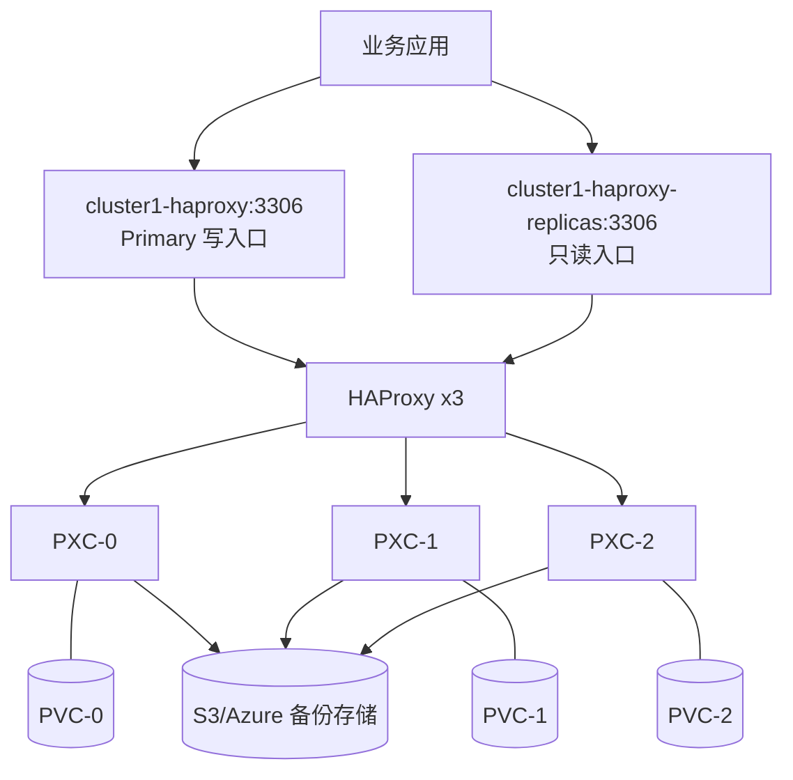
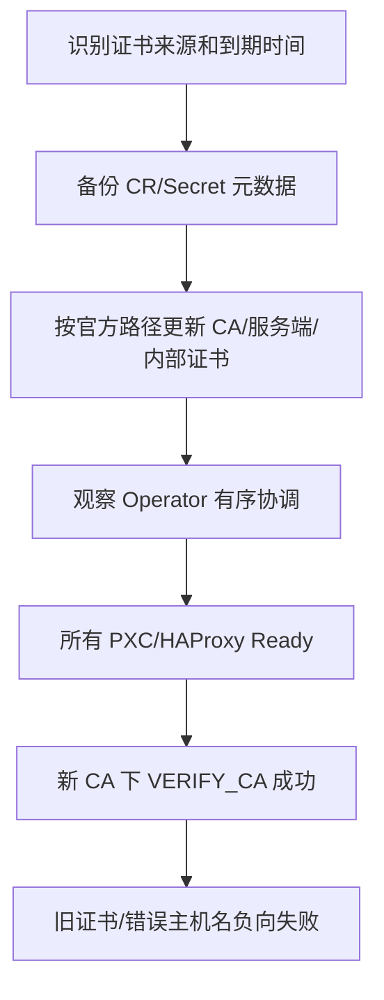
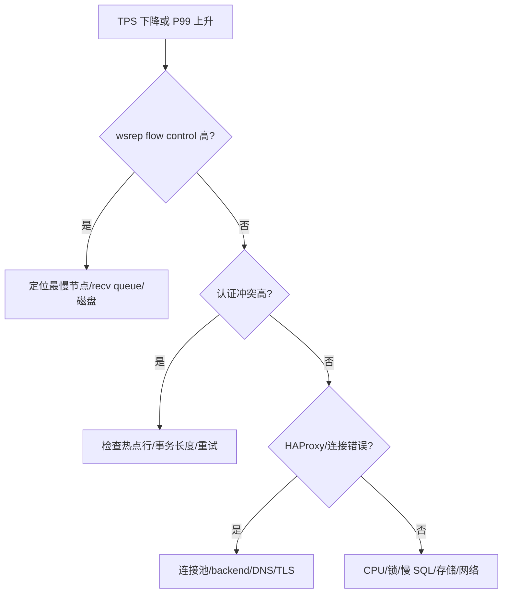
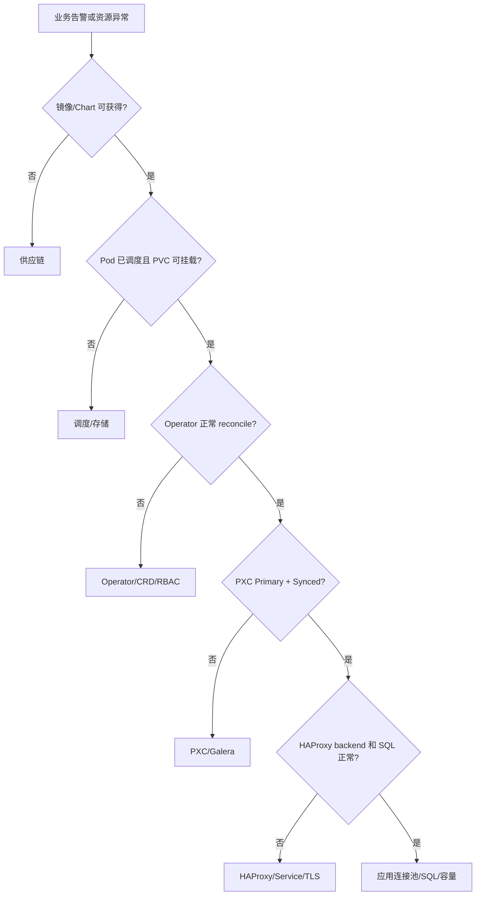

# Percona XtraDB Cluster（PXC）用户与运维手册

> **文档版本：** v1.2（生产实践对齐版）
> **最后核验：** 2026-08-21
> **适用系统：** kubeauto Kubernetes v1.33.6
> **适用组件：** Percona Operator for MySQL v1.20.0、PXC 8.4.8-8.1、HAProxy 2.8.18-1
> **官方主线：** [Quickstart](https://docs.percona.com/percona-operator-for-mysql/pxc/quickstart.html)、[Connect](https://docs.percona.com/percona-operator-for-mysql/pxc/connect.html)、[Debug](https://docs.percona.com/percona-operator-for-mysql/pxc/debug.html)、[Backups and restore](https://docs.percona.com/percona-operator-for-mysql/pxc/backups-restore.html)

本文按 drafts 企业文档规范编写：主线路只保留客户需要依次执行的动作；异常处理、回滚和注意事项使用引用块集中说明。当前实现通过独立 MySQL role 和固定 runner 交付；命令中使用 `<...>` 的位置参数必须由客户环境评审后替换，不能直接复制示例凭据。

## 目录

1. [使用约定和状态](#第一章使用约定和状态)
2. [部署目标和容量规划](#第二章部署目标和容量规划)
3. [安装前置检查](#第三章安装前置检查)
4. [制品、Chart 和镜像](#第四章制品chart-和镜像)
5. [安装 Operator 和 CRD](#第五章安装-operator-和-crd)
6. [创建数据库集群](#第六章创建数据库集群)
7. [应用连接和 SQL 验收](#第七章应用连接和-sql-验收)
8. [日常运维和变更](#第八章日常运维和变更)
9. [监控、容量和性能测试](#第九章监控容量和性能测试)
10. [备份、恢复和 PITR](#第十章备份恢复和-pitr)
11. [升级、回滚和下线](#第十一章升级回滚和下线)
12. [故障排查](#第十二章故障排查)
13. [交付验收表](#第十三章交付验收表)

## 第一章、使用约定和状态

### 1.1 执行环境

命令从已配置目标集群 kubeconfig 的 Linux 管理节点执行。数据库密码、TLS 私钥和对象存储密钥由密码系统或 Kubernetes Secret 注入，不写入本文档、Git、终端日志或截图。平台团队在管理节点建立本次交付目录，保存 CR、values、校验和、验收输出和回滚清单：

```bash
bash <<'PXC_WORKDIR'
set -Eeuo pipefail
umask 077
PXC_WORKDIR="$PWD/percona-pxc-1.20.0"
install -d -m 0750 "$PXC_WORKDIR" "$PXC_WORKDIR/evidence" "$PXC_WORKDIR/backup"
printf 'PXC_WORKDIR=%s\n' "$PXC_WORKDIR"
PXC_WORKDIR
```

PXC_WORKDIR 是管理节点本地路径，不是 Operator 读取路径。Operator 只读取通过 kubectl apply 或 Helm 发布到 Kubernetes 的资源。

### 1.2 当前实现状态

| 内容 | 当前状态 |
|---|---|
| 版本和架构 | 已完成官方资料核对 |
| 本文档 | 与当前实现和独立门禁同步 |
| kubeauto mysql 分路 | 已实现，入口由项目 CLI/role 管理 |
| MySQL 独立现场门禁 | 已实现，使用 `tests/run_enterprise_regression.sh --mysql-only` |
| 现有核心矩阵 | 不修改、不重新签字 |

### 1.3 客户首次部署主线路

以下是唯一推荐的首次部署顺序。每一步都必须看到“完成标志”后再进入下一步；不要跳到后面的故障章节寻找替代安装命令。

主线路使用 kubeauto 的固定入口。下面的 `<cluster>` 是 `kubecli new` 创建的集群名，配置文件为 `clusters/<cluster>/config.yml`；不要在目标节点上直接执行临时 Helm 或 `kubectl set image`：

```bash
set -Eeuo pipefail
CLUSTER="<cluster>"
CONFIG="clusters/${CLUSTER}/config.yml"
test -s "$CONFIG"
# 在 CONFIG 中设置 mysql_install: "yes"、StorageClass、容量和 Secret 引用
kubecli download -E mysql
kubecli setup "$CLUSTER" 07
```

若客户采用 `kubecli setup <cluster> 90` 一键流程，仍须在执行前完成本手册第 2～4 章，并在 90 完成后执行第 6～10 章验收；`07` 只是独立 addon 步骤，不会替代集群基础设施和 CNI 前置条件。

| 步骤 | 执行动作 | 完成标志 |
|---|---|---|
| 1 | 完成第 2、3 章容量、节点、StorageClass、权限和存储读写预检 | 3 个故障域可调度，预检 PVC 写入/读取成功 |
| 2 | 按第 4 章准备受控 Chart、固定镜像和密码/TLS/对象存储 Secret | SHA256、tag/digest、Secret key 对账完成 |
| 3 | 在 kubeauto 配置中设置 `mysql_install: "yes"`，执行生产 role | role rc=0，Operator Deployment 和 CRD Ready |
| 4 | 等待第 6 章控制面和数据面状态 | PXC 3/3、HAProxy 3/3、PVC Bound、三个不同节点 |
| 5 | 按第 7 章完成 TLS、Primary 写入、replicas 读取和最小权限验证 | marker 可读回，越权和错误 CA 被拒绝 |
| 6 | 按第 10 章创建全量备份并进行恢复抽检 | Backup `Succeeded`，对象可读且校验值可保存 |
| 7 | 保存第 13 章签收证据并执行限定清理（测试环境） | 当前矩阵证据完整，输出 `MYSQL_CLEAN_VERIFY_PASS` |


> **主线路禁止事项：** 不在主线路中手工 bootstrap、删除 PVC、关闭 TLS 校验、使用 `percona.com/unsafe-pitr` 或直接修改 Operator 管理的 StatefulSet。这些动作只有在本文对应的异常/回滚引用块中、完成取证并得到审批后才可考虑。

## 第二章、部署目标和容量规划

Percona 官方建议生产使用 3–5 个 PXC 节点；偶数节点会削弱多数派判断，7 个以上节点会增加写事务确认成本。本文一期采用 3 个 PXC、3 个 HAProxy、每个 PXC 独立 PVC 和主机反亲和。



| 项目 | 一期目标 | 不合格情形 |
|---|---|---|
| PXC 副本 | 3 | 2、4 等偶数生产拓扑 |
| HAProxy | 3 | 业务直接连接 PXC Pod |
| Pod 分布 | 不同 kubernetes.io/hostname | 三个 Pod 集中在一个节点 |
| 存储 | 支持故障后重新挂载的 CSI | 把 Hostpath 当成跨节点高可用 |
| 备份 | 独立 S3/Azure 兼容存储 | 只依赖三份在线副本 |

官方系统要求是至少 3 个节点、每节点 2 CPU、2 GiB RAM、至少 60 GiB 可用于 PV；这是安装门槛，不是生产容量。kubeauto 的生产默认值为每个 PXC 2 CPU/4 GiB、100 GiB PVC；独立门禁使用较小的测试资源，不能把测试值当作客户容量。生产容量至少计算：

```text
PXC PVC = 当前数据 + 索引 + 临时表 + binlog/gcache + 增长窗口
备份存储 = 全量备份大小 × 保留份数 + binlog + PITR 余量
节点内存 = MySQL buffer pool + Galera/XtraBackup + HAProxy + 系统保留
```

## 第三章、安装前置检查

### 3.1 Kubernetes、节点和权限

```bash
bash <<'PXC_PREFLIGHT'
set -Eeuo pipefail
export KUBECONFIG="<目标 kubeconfig 的绝对路径>"
kubectl version
kubectl get nodes -o wide
kubectl get sc
kubectl auth can-i create namespaces
kubectl auth can-i get pods -n mysql
kubectl auth can-i create perconaxtradbclusters.pxc.percona.com -n mysql
kubectl auth can-i create secrets -n mysql
kubectl auth can-i create persistentvolumeclaims -n mysql
PXC_PREFLIGHT
```

预期：至少 3 个可调度节点 Ready；目标 StorageClass 存在；所需权限为 yes。首次部署时 CRD 尚不存在，`create perconaxtradbclusters` 可能返回 no；应在第五章安装 CRD 后重新检查并得到 yes。只有节点 Ready 不能证明存储可用。

> **注意：实验室与生产参数不同。** `tests/helpers/mysql-regression.sh` 为了在专用测试集群完成门禁使用 1 CPU/2 GiB 请求、20 GiB PVC；这只证明功能链路和故障语义，不证明客户容量。上线必须使用配置文件中的生产默认值或经过容量评审的更高值。

### 3.2 创建并确认命名空间

`mysql-operator` 由平台团队维护，承载 Operator Deployment、Webhook 和 RBAC；`mysql` 由平台团队维护，承载 PXC CR、PVC、Service、Backup 和 Restore CR。命名空间存在不代表可以覆盖其中已有资源，执行前先确认归属：

```bash
bash <<'PXC_NAMESPACES'
set -Eeuo pipefail
export KUBECONFIG="<目标 kubeconfig 的绝对路径>"
kubectl get namespace mysql-operator mysql 2>/dev/null || true
kubectl create namespace mysql-operator --dry-run=client -o yaml | kubectl apply -f -
kubectl create namespace mysql --dry-run=client -o yaml | kubectl apply -f -
kubectl get namespace mysql-operator mysql
PXC_NAMESPACES
```

预期：两个命名空间均为 Active。卸载单个 PXC 集群不删除共享的 `mysql-operator`；删除任一命名空间前，必须确认其中没有其他 Operator、PXC 集群、PVC、Secret 或备份恢复任务。

### 3.3 存储数据面

StorageClass 由平台团队维护，PVC 由 Operator 根据 PXC CR 创建，CSI Controller/Node 负责供给和挂载。先用独立测试 PVC 验证真实写入：

```yaml
apiVersion: v1
kind: PersistentVolumeClaim
metadata:
  name: pxc-storage-preflight
  namespace: mysql
spec:
  accessModes: [ReadWriteOnce]
  storageClassName: <客户批准的 StorageClass>
  resources:
    requests:
      storage: 1Gi
```

`storage-preflight-pod.yaml` 必须使用已经通过 kubeauto 供应链校验并灌入本地 Registry 的诊断镜像，不允许在交付现场临时拉取漂移标签：

```yaml
apiVersion: v1
kind: Pod
metadata:
  name: pxc-storage-preflight
  namespace: mysql
spec:
  restartPolicy: Never
  containers:
    - name: writer
      image: registry.talkschool.cn:5000/brinnatt/<已锁定版本的诊断镜像>
      command: ["sh", "-c", "trap : TERM INT; sleep infinity & wait"]
      securityContext:
        allowPrivilegeEscalation: false
      volumeMounts:
        - name: data
          mountPath: /data
  volumes:
    - name: data
      persistentVolumeClaim:
        claimName: pxc-storage-preflight
```

PVC 和测试 Pod 文件保存在 PXC_WORKDIR，由平台团队维护，消费者是 Kubernetes API：

```bash
bash <<'PXC_STORAGE'
set -Eeuo pipefail
export KUBECONFIG="<目标 kubeconfig 的绝对路径>"
PXC_WORKDIR="<第一章输出的绝对路径>"
test -d "$PXC_WORKDIR"
kubectl apply -f "$PXC_WORKDIR/storage-preflight-pvc.yaml"
kubectl -n mysql wait --for=jsonpath='{.status.phase}'=Bound pvc/pxc-storage-preflight --timeout=5m
kubectl apply -f "$PXC_WORKDIR/storage-preflight-pod.yaml"
kubectl -n mysql wait --for=condition=Ready pod/pxc-storage-preflight --timeout=5m
kubectl -n mysql exec pxc-storage-preflight -- sh -c 'printf pxc-storage-ok >/data/marker && test "$(cat /data/marker)" = pxc-storage-ok'
kubectl -n mysql get pvc,pod pxc-storage-preflight -o wide
PXC_STORAGE
```

预期：PVC Bound、Pod Ready、marker 写入和读取成功。验收后只删除本次测试资源。

清理命令只处理上述两个固定名称；删除后应确认不存在残留：

```bash
bash <<'PXC_STORAGE_CLEAN'
set -Eeuo pipefail
export KUBECONFIG="<目标 kubeconfig 的绝对路径>"
kubectl -n mysql delete pod/pxc-storage-preflight --ignore-not-found --wait=true
kubectl -n mysql delete pvc/pxc-storage-preflight --ignore-not-found --wait=true
test -z "$(kubectl -n mysql get pod,pvc -o name | grep 'pxc-storage-preflight' || true)"
PXC_STORAGE_CLEAN
```

> **异常处理：PVC 长期 Pending**
> 保留 kubectl describe pvc、Pod events、StorageClass 和 CSI 日志，分流“没有消费者、节点拓扑、容量不足、CSI 故障”。不得用降低 PXC 副本数掩盖存储问题。

## 第四章、制品、Chart 和镜像

| 制品 | 固定版本 | 官方用途 |
|---|---|---|
| pxc-operator Chart | 1.20.0 | Operator Deployment、RBAC、CRD |
| Operator image | 1.20.0 | reconcile、webhook、备份恢复协调 |
| PXC image | 8.4.8-8.1 | 数据库节点 |
| XtraBackup image | 8.4.0-5.1 | 备份、恢复、SST |
| HAProxy image | 2.8.18-1 | 数据库代理 |
| Fluent Bit image | 5.0.6-1 | 可选日志收集 |

上游名称、本项目发布名称和集群内引用必须一一对应：

| 上游镜像 | kubeauto 目标发布名 | 集群内目标引用 |
|---|---|---|
| `percona/percona-xtradb-cluster-operator:1.20.0` | `brinnatt/percona-xtradb-cluster-operator:1.20.0` | `registry.talkschool.cn:5000/brinnatt/percona-xtradb-cluster-operator:1.20.0` |
| `percona/percona-xtradb-cluster:8.4.8-8.1` | `brinnatt/percona-xtradb-cluster:8.4.8-8.1` | `registry.talkschool.cn:5000/brinnatt/percona-xtradb-cluster:8.4.8-8.1` |
| `percona/percona-xtrabackup:8.4.0-5.1` | `brinnatt/percona-xtrabackup:8.4.0-5.1` | `registry.talkschool.cn:5000/brinnatt/percona-xtrabackup:8.4.0-5.1` |
| `percona/haproxy:2.8.18-1` | `brinnatt/percona-haproxy:2.8.18-1` | `registry.talkschool.cn:5000/brinnatt/percona-haproxy:2.8.18-1` |

这些发布名已进入 MySQL 制品集合和独立门禁。正式拉取顺序为 TalkEdu 私仓、Docker Hub 已发布副本、Percona 官方上游；公共加速器只允许在测试命令行临时注入，不能写入代码、CI、默认配置或本文档。

镜像必须经固定候选拉取、inspect、tag/push、本地 Registry manifest 和 digest 验证；Chart/CRD 必须 vendored 并通过 SHA256。以下命令用于交付前核对本地 Registry：

```bash
bash <<'PXC_ARTIFACT'
set -Eeuo pipefail
for image in \
  percona-xtradb-cluster-operator:1.20.0 \
  percona-xtradb-cluster:8.4.8-8.1 \
  percona-xtrabackup:8.4.0-5.1 \
  haproxy:2.8.18-1; do
  docker image inspect "registry.talkschool.cn:5000/brinnatt/$image" \
    --format '{{.RepoTags}} {{.Id}}'
done
PXC_ARTIFACT
```

预期：四个镜像均存在，tag 与锁定版本一致。签收还必须保存各源镜像和本地镜像的 repo digest/manifest 对账结果；仅有本地 image ID 不足以证明供应链一致。

Chart 和 CRD 必须先进入受控 vendored 目录，再由发布代码引用。下载阶段保存官方 URL、文件大小和 SHA256；校验失败时删除临时文件，不能覆盖旧制品：

```bash
bash <<'PXC_CHART_VERIFY'
set -Eeuo pipefail
PXC_WORKDIR="<第一章输出的绝对路径>"
test -d "$PXC_WORKDIR/vendor"
cd "$PXC_WORKDIR/vendor"
sha256sum -c pxc-operator-1.20.0.tgz.sha256
tar -tzf pxc-operator-1.20.0.tgz >/dev/null
PXC_CHART_VERIFY
```

## 第五章、安装 Operator 和 CRD

| 文件/资源 | 创建者 | 保存位置 | 消费者 | 生效方式 |
|---|---|---|---|---|
| Operator Chart | 发布流水线 | kubeauto vendored files | Helm | helm upgrade --install |
| Operator values | 平台/开发团队 | PXC_WORKDIR/operator-values.yaml | Helm | Helm release |
| CRD | 官方 Chart/bundle | Kubernetes API | Operator/webhook | Helm 安装时创建 |
| Operator Deployment | Helm | mysql-operator | Kubernetes | Deployment reconcile |

本文采用独立 Operator 命名空间并只监听 `mysql`，避免无必要的集群级全命名空间监听。正式交付由 kubeauto role 消费仓库内已校验的 Chart 和本地 Registry；以下 values 片段用于说明渲染契约，字段已经按 `pxc-operator-1.20.0` 官方 `values.yaml` 对照：

```yaml
operatorImageRepository: registry.talkschool.cn:5000/brinnatt/percona-xtradb-cluster-operator
imagePullPolicy: IfNotPresent
watchNamespace: mysql
createNamespace: false
watchAllNamespaces: false
rbac:
  create: true
serviceAccount:
  create: true
logStructured: true
logLevel: INFO
disableTelemetry: true
leaderElectionEnabled: true
resources:
  requests:
    cpu: 100m
    memory: 128Mi
  limits:
    cpu: 500m
    memory: 512Mi
```

`operatorImageRepository` 由 Chart 使用 `appVersion=1.20.0` 组成最终镜像引用。正式编码时必须执行 `helm template`，证明渲染结果使用本地 Registry、目标命名空间和正确 RBAC，再允许安装。

脱离 kubeauto 的手工路径只有在客户已经自行准备并校验 vendored Chart 时才可执行；不能从网络直接安装未知版本：

```bash
bash <<'PXC_OPERATOR_INSTALL'
set -Eeuo pipefail
export KUBECONFIG="<目标 kubeconfig 的绝对路径>"
PXC_WORKDIR="<第一章输出的绝对路径>"
test -d "$PXC_WORKDIR"
helm upgrade --install pxc-operator \
  "$PXC_WORKDIR/vendor/pxc-operator-1.20.0.tgz" \
  --namespace mysql-operator --create-namespace \
  --values "$PXC_WORKDIR/operator-values.yaml" \
  --wait --timeout 10m
kubectl -n mysql-operator rollout status deployment/pxc-operator --timeout=10m
kubectl wait --for=condition=Established \
  crd/perconaxtradbclusters.pxc.percona.com --timeout=2m
kubectl auth can-i create perconaxtradbclusters.pxc.percona.com -n mysql
PXC_OPERATOR_INSTALL
```

预期：Helm deployed、Operator Deployment Ready、CRD Established=True、最后一项权限检查为 yes；Operator 日志无 webhook、RBAC、镜像和 leader election 错误。若 Deployment 实际名称因后续 Chart 模板调整而变化，以 `helm get manifest pxc-operator -n mysql-operator` 的当前渲染结果为准，文档和自动化必须同步更新。

> **回滚边界：Operator 安装失败。** 先保存 Helm manifest、values、CRD 状态、事件和 Operator 日志。若尚未创建 PXC CR，只按发布流程卸载本次 Helm release；若已经存在 PXC/备份/恢复资源，不得直接删除 CRD 或命名空间，应转到第 11.5 节的回滚判定。

## 第六章、创建数据库集群

Operator 管理系统用户 Secret、TLS Secret 和内部认证关系。平台团队负责 Secret 来源、权限、轮换和备份；应用团队只获得业务库最小权限。不要猜测 Secret 字段格式；自定义 secretsName 时必须以 v1.20.0 官方 users 文档和 CRD schema 为准。

生产系统用户密码由密码系统生成后写入 `cluster1-secrets`，Secret 至少包含实际启用组件要求的 `root`、`xtrabackup`、`monitor`、`proxyadmin`、`operator` 和 `replication` 键。本文不提供默认密码；禁止使用官方开发示例密码。创建完成后只检查键名，不输出值：

```bash
bash <<'PXC_SECRET_CHECK'
set -Eeuo pipefail
export KUBECONFIG="<目标 kubeconfig 的绝对路径>"
kubectl -n mysql get secret cluster1-secrets >/dev/null
for key in root xtrabackup monitor proxyadmin operator replication; do
  value="$(kubectl -n mysql get secret cluster1-secrets \
    -o "jsonpath={.data.${key}}" | base64 -d)"
  test -n "$value"
  unset value
done
PXC_SECRET_CHECK
```

预期：所有键都有非空值，终端不显示密码。Secret 必须在 PXC CR 之前创建，并由外部密码系统保留可恢复副本；Kubernetes Secret 的 base64 不是加密。

cluster1-pxc.yaml 由平台团队保存于 PXC_WORKDIR，Operator 是唯一消费者：

```yaml
apiVersion: pxc.percona.com/v1
kind: PerconaXtraDBCluster
metadata:
  name: cluster1
  namespace: mysql
  finalizers:
    - percona.com/delete-pxc-pods-in-order
spec:
  crVersion: 1.20.0
  secretsName: cluster1-secrets
  tls:
    enabled: true
  updateStrategy: SmartUpdate
  pxc:
    size: 3
    image: registry.talkschool.cn:5000/brinnatt/percona-xtradb-cluster:8.4.8-8.1
    autoRecovery: true
    resources:
      requests:
        cpu: <容量评审结果>
        memory: <容量评审结果>
      limits:
        cpu: <容量评审结果>
        memory: <容量评审结果>
    affinity:
      antiAffinityTopologyKey: kubernetes.io/hostname
    podDisruptionBudget:
      maxUnavailable: 1
    volumeSpec:
      persistentVolumeClaim:
        storageClassName: <客户批准的 StorageClass>
        resources:
          requests:
            storage: <客户容量评审结果>
  haproxy:
    enabled: true
    size: 3
    image: registry.talkschool.cn:5000/brinnatt/percona-haproxy:2.8.18-1
    affinity:
      antiAffinityTopologyKey: kubernetes.io/hostname
    podDisruptionBudget:
      maxUnavailable: 1
    exposeReplicas:
      enabled: true
      onlyReaders: true
  backup:
    image: registry.talkschool.cn:5000/brinnatt/percona-xtrabackup:8.4.0-5.1
    pitr:
      enabled: false
      storageName: s3-prod
      timeBetweenUploads: 60
    storages:
      s3-prod:
        type: s3
        verifyTLS: true
        s3:
          bucket: <客户批准的备份 bucket>
          credentialsSecret: cluster1-backup-s3
          region: <对象存储区域>
          endpointUrl: <S3 兼容 HTTPS endpoint>
```

`cluster1-backup-s3` 的键名和内容必须按 v1.20.0 [Backup storage](https://docs.percona.com/percona-operator-for-mysql/pxc/backups-storage.html) 创建并由密码系统注入。不得把 access key、secret key 或 CA 私钥写进 CR。PITR 一期默认关闭；完成全量备份、对象存储 TLS 和 binlog 连续性门禁后再单独变更为 true。

发布后保存 CR、事件和资源状态：

```bash
bash <<'PXC_APPLY'
set -Eeuo pipefail
export KUBECONFIG="<目标 kubeconfig 的绝对路径>"
PXC_WORKDIR="<第一章输出的绝对路径>"
test -d "$PXC_WORKDIR"
test -s "$PXC_WORKDIR/cluster1-pxc.yaml"
kubectl apply --dry-run=server -f "$PXC_WORKDIR/cluster1-pxc.yaml" >/dev/null
kubectl apply --server-side --field-manager=kubeauto-mysql -f "$PXC_WORKDIR/cluster1-pxc.yaml"
kubectl -n mysql get pxc cluster1 -o yaml
kubectl -n mysql get pxc,pod,pvc,svc -o wide
PXC_APPLY
```

### 6.1 安装后控制面和数据面验收

不要用 `kubectl apply` 返回 0 或 Pod Running 结束验收。先等待固定的 3 个 PXC 和 3 个 HAProxy Pod Ready，再核对副本分布、PVC 和 Service：

```bash
bash <<'PXC_READY'
set -Eeuo pipefail
export KUBECONFIG="<目标 kubeconfig 的绝对路径>"
for pod in \
  cluster1-pxc-0 cluster1-pxc-1 cluster1-pxc-2 \
  cluster1-haproxy-0 cluster1-haproxy-1 cluster1-haproxy-2; do
  kubectl -n mysql wait --for=condition=Ready "pod/$pod" --timeout=30m
done
kubectl -n mysql get pod -o custom-columns='NAME:.metadata.name,NODE:.spec.nodeName,READY:.status.containerStatuses[*].ready'
kubectl -n mysql get pvc -o wide
kubectl -n mysql get service cluster1-haproxy cluster1-haproxy-replicas
kubectl -n mysql get endpointslice -l kubernetes.io/service-name=cluster1-haproxy
PXC_READY
```

预期：六个 Pod Ready；三个 PXC 位于三个不同的 `kubernetes.io/hostname`；每个 PXC PVC Bound；两个 Service 和 EndpointSlice 存在。随后使用第七章真实 SQL 验证 wsrep 和业务路径，才能签收。

> **异常分流：Pod Ready 但 CR 不是 `ready`，或 PVC 已 Bound 但 SQL 不可用。** 这是控制面与数据面不一致，先保留 `kubectl get pxc,pod,pvc,events -o yaml`、Operator 日志和 wsrep 状态，再进入第 12 章；不要通过增加副本、删除 PVC 或重启全部 Pod 试错。

## 第七章、应用连接和 SQL 验收

### 7.1 连接入口和客户端要求

| Service | 端口 | 用途 | 约束 |
|---|---:|---|---|
| cluster1-haproxy | 3306 | Primary 写入口 | 业务事务、读写混合 |
| cluster1-haproxy-replicas | 3306 | Replica 只读入口 | 报表/查询，不允许写 |
| cluster1-haproxy | 33062 | 管理健康检查 | 不给业务暴露 |

应用使用连接池、连接超时、事务重试和主节点切换重连；不能把 PXC Pod 名写进应用配置。客户端密码交互输入：

```bash
mysql --protocol=TCP \
  -h cluster1-haproxy.mysql.svc.cluster.local -P 3306 \
  -u <业务账号> -p \
  --ssl-mode=VERIFY_CA --ssl-ca=<客户 CA 文件>
```

预期：TLS 握手成功，业务账号只能访问授权 schema，错误密码失败，root 不用于业务连接。

客户端必须校验 CA 和 Service DNS。集群外应用若通过内部负载均衡接入，证书 SAN 必须包含实际访问 FQDN；不能为解决证书错误改用 `--ssl-mode=REQUIRED`、关闭 hostname 校验或把数据库暴露公网。

> **注意：读写入口不可互换。** `cluster1-haproxy` 是 primary 写入口；`cluster1-haproxy-replicas` 仅用于只读流量。强 read-after-write 业务继续走 primary，应用连接池必须支持 Service 后端变化和事务重试边界。

### 7.2 wsrep 健康验收

在每个 PXC Pod 上执行只读状态查询。以下命令从 Kubernetes Secret 读取密码但不打印密码，结束时立即清空本地变量：

```bash
bash <<'PXC_WSREP'
set -Eeuo pipefail
export KUBECONFIG="<目标 kubeconfig 的绝对路径>"
ROOT_PASSWORD="$(kubectl -n mysql get secret cluster1-secrets -o jsonpath='{.data.root}' | base64 -d)"
trap 'unset ROOT_PASSWORD' EXIT
WSREP_QUERY="SHOW GLOBAL STATUS WHERE Variable_name IN
  ('wsrep_cluster_size','wsrep_cluster_status','wsrep_local_state_comment',
   'wsrep_ready','wsrep_connected','wsrep_flow_control_paused',
   'wsrep_local_recv_queue','wsrep_local_cert_failures');"
for pod in cluster1-pxc-0 cluster1-pxc-1 cluster1-pxc-2; do
  printf '\n[%s]\n' "$pod"
  printf '%s\n' "$ROOT_PASSWORD" | kubectl -n mysql exec -i "$pod" -- sh -eu -c '
    IFS= read -r MYSQL_PWD
    export MYSQL_PWD
    mysql -uroot --batch --skip-column-names -e "$1"
    unset MYSQL_PWD
  ' sh "$WSREP_QUERY"
done
PXC_WSREP
```

签收值：所有节点 `wsrep_cluster_size=3`、`wsrep_cluster_status=Primary`、`wsrep_local_state_comment=Synced`、`wsrep_ready=ON`、`wsrep_connected=ON`。队列、flow control 和认证冲突是趋势指标，不应只以单次为零作为容量结论。

### 7.3 业务账号和最小权限

业务账号优先使用 Operator v1.20.0 的 `spec.users` 声明。密码 Secret 的 key 必须与 `passwordSecretRef.key` 一致；以下片段合并进现有 CR 的 `spec`，不是创建第二个 PXC CR：

```yaml
users:
  - name: pxc_app
    dbs:
      - appdb
    hosts:
      - "%"
    grants:
      - SELECT
      - INSERT
      - UPDATE
      - DELETE
    withGrantOption: false
    passwordSecretRef:
      name: cluster1-app-user
      key: password
```

`cluster1-app-user` 由密码系统创建并维护。应用团队只获得该 Secret 对应凭据，不获得 `cluster1-secrets`。变更后验证允许的 CRUD 成功，`CREATE USER`、`GRANT`、访问其他 schema 和全局管理语句失败。

### 7.4 真实 SQL 和重建验收

业务数据面至少执行：

```sql
CREATE DATABASE IF NOT EXISTS pxc_delivery_probe;
CREATE TABLE pxc_delivery_probe.marker (
  id BIGINT PRIMARY KEY,
  value VARCHAR(128) NOT NULL,
  created_at TIMESTAMP NOT NULL DEFAULT CURRENT_TIMESTAMP
);
INSERT INTO pxc_delivery_probe.marker(id, value)
VALUES (1, 'pxc-delivery-probe')
ON DUPLICATE KEY UPDATE value = VALUES(value);
SELECT id, value FROM pxc_delivery_probe.marker WHERE id = 1;
```

Primary Service 写入、replicas Service 读取，再重建一个 PXC Pod 重复读取。保存连接入口、返回值和 wsrep 状态；只在 Pod 内连接 localhost 不算业务验收。

完整验收顺序如下：


删除 Pod 只用于独立门禁，不等同于节点故障测试。若业务写操作在切换窗口失败，必须记录错误码、连接池重连时间和事务是否已经提交；只有可判定幂等性的事务才允许应用层重试。

> **回滚：SQL 验收失败。** 不要修改 PXC 参数或清理 PVC 来“恢复”验收。先区分 TLS/账号/Service、复制状态和业务 SQL 三类原因；保留 marker、错误码和 wsrep 快照，修复后从同一 marker 重新验证。

## 第八章、日常运维和变更

### 8.1 日常巡检

每日保存 PXC、Pod、PVC、Service、事件和 Operator 日志；数据库执行第 7.2 节状态查询，记录 wsrep_cluster_size、wsrep_cluster_status、wsrep_local_state_comment、wsrep_ready、wsrep_flow_control_paused、wsrep_local_recv_queue 和 wsrep_local_cert_failures。

```bash
bash <<'PXC_DAILY'
set -Eeuo pipefail
export KUBECONFIG="<目标 kubeconfig 的绝对路径>"
PXC_WORKDIR="<第一章输出的绝对路径>"
test -d "$PXC_WORKDIR"
OUT="$PXC_WORKDIR/evidence/daily-$(date +%Y%m%d%H%M%S)"
install -d -m 0750 "$OUT"
kubectl -n mysql get pxc,pod,sts,pvc,svc -o wide >"$OUT/objects.txt"
kubectl -n mysql get events --sort-by=.lastTimestamp >"$OUT/events.txt"
kubectl -n mysql-operator logs deployment/pxc-operator \
  --since=24h >"$OUT/operator.log" 2>&1
kubectl -n mysql top pod >"$OUT/pod-top.txt" 2>&1 || true
PXC_DAILY
```

预期：期望副本均 Ready、无新增 Warning、PVC 使用率低于客户告警阈值、Operator 无持续 reconcile 错误。`kubectl top` 不可用属于监控链路问题，应单独记录，不能用 `|| true` 把整体巡检标记成成功。

### 8.2 单节点计划维护

一次只维护一个 PXC 节点。维护窗口开始前必须有成功备份、Primary/Synced 状态和业务 marker；确认当前没有 Backup/Restore Job 或 SST。以 `cluster1-pxc-2` 所在节点为例：

```bash
bash <<'PXC_ONE_NODE_MAINTENANCE'
set -Eeuo pipefail
export KUBECONFIG="<目标 kubeconfig 的绝对路径>"
TARGET_POD="cluster1-pxc-2"
TARGET_NODE="$(kubectl -n mysql get pod "$TARGET_POD" -o jsonpath='{.spec.nodeName}')"
test -n "$TARGET_NODE"
kubectl cordon "$TARGET_NODE"
kubectl -n mysql get pxc-backup
kubectl -n mysql get pod -o wide
kubectl drain "$TARGET_NODE" --ignore-daemonsets --delete-emptydir-data --timeout=20m
kubectl -n mysql wait --for=condition=Ready "pod/$TARGET_POD" --timeout=30m
kubectl -n mysql get pod -o wide
PXC_ONE_NODE_MAINTENANCE
```

`kubectl drain` 必须受到 PDB 保护；若驱逐被拒绝，先调查副本、PDB、备份或同步状态，不删除 PDB 强行驱逐。主机维护结束后执行 `kubectl uncordon <节点>`，等待重建节点完成 IST 或 SST、三个节点重新 Synced、HAProxy 后端恢复，再结束窗口。若离线时间超出 gcache，SST 属于预期但必须评估 donor 负载。

> **注意：一次只允许一个 PXC 成员离线。** 两个成员同时维护会把剩余成员置于 `Non-Primary`，此时写入必须拒绝。任何需要同时维护多个故障域的变更都必须改为停写并走升级/灾备方案。

### 8.3 扩容和缩容

扩容只能采用奇数 size，生产通常从 3 扩到 5；不能从 3 改为 4。扩容前确认至少两个新故障域具备 CPU、内存和动态卷容量，预估 SST 的网络和存储压力：

```bash
bash <<'PXC_SCALE'
set -Eeuo pipefail
export KUBECONFIG="<目标 kubeconfig 的绝对路径>"
PXC_WORKDIR="<第一章输出的绝对路径>"
test -d "$PXC_WORKDIR"
kubectl -n mysql get pxc cluster1 -o yaml >"$PXC_WORKDIR/backup/cluster1-before-scale.yaml"
kubectl -n mysql patch pxc cluster1 --type=merge -p '{"spec":{"pxc":{"size":5}}}'
kubectl -n mysql wait --for=condition=Ready \
  pod/cluster1-pxc-3 pod/cluster1-pxc-4 --timeout=60m
kubectl -n mysql get pod,pvc -o wide
PXC_SCALE
```

`cluster1-before-scale.yaml` 是变更记录，不是数据库备份。扩容完成条件是 5 个节点均 Synced、`wsrep_cluster_size=5`、HAProxy 后端正常、业务 marker 可读写。缩容前先确认被移除节点无备份、恢复或 SST 任务，保留对应 PVC 的处理审批；缩容不是删除 PVC 的授权。

### 8.4 系统用户密码轮换

Operator v1.20.0 官方行为是：修改 `spec.secretsName` 指向的 Secret 后，Operator 在数秒内更新数据库用户，并同步内部 `internal-cluster1` Secret。禁止改 `secretsName`，禁止手工修改 `internal-cluster1`。

轮换单个 key 时由密码系统写入新值；以下命令演示安全输入和 server-side apply，不把密码放进命令行参数或文件：

```bash
bash <<'PXC_ROTATE_PASSWORD'
set -Eeuo pipefail
export KUBECONFIG="<目标 kubeconfig 的绝对路径>"
read -r -s -p 'New password: ' NEW_PASSWORD
printf '\n'
test -n "$NEW_PASSWORD"
ROTATE_KEY="<待轮换 key>"
PATCH_VALUE="$(printf '%s' "$NEW_PASSWORD" | base64 --wrap=0)"
printf '{"data":{"%s":"%s"}}' "$ROTATE_KEY" "$PATCH_VALUE" | \
  kubectl -n mysql patch secret cluster1-secrets --type=merge --patch-file=/dev/stdin
unset NEW_PASSWORD PATCH_VALUE ROTATE_KEY
PXC_ROTATE_PASSWORD
```

先轮换低风险账号并验证 Operator 日志和连接，再按变更单轮换 root、monitor、proxyadmin、xtrabackup、operator、replication。每个账号都要证明新凭据成功、旧凭据失败、PXC/HAProxy/备份任务稳定；应用账号采用双凭据或连接池滚动刷新，避免瞬时全断。

### 8.5 TLS 证书轮换

证书轮换必须遵循 v1.20.0 [Update certificates](https://docs.percona.com/percona-operator-for-mysql/pxc/tls-update.html)，先确认当前是 Operator 自动生成、cert-manager 还是自定义 Secret，三种路径不能混用。



不要只更新外部证书而遗漏内部复制证书，也不要在同一窗口同时轮换密码、升级镜像和证书。出现握手失败时先保存 Secret resourceVersion、证书 subject/SAN/issuer/notBefore/notAfter、Pod events 和 Operator 日志，禁止通过关闭 TLS 恢复业务。

## 第九章、监控、容量和性能测试

| 层级 | 指标 |
|---|---|
| Operator | reconcile 错误、webhook、leader、CR conditions |
| PXC | wsrep 状态、复制队列、认证失败、flow control |
| HAProxy | primary/replica backend、连接数、错误率、切换 |
| Kubernetes | 重启、OOM、事件、节点资源 |
| Storage | PVC 使用率、IOPS、延迟、CSI 错误 |
| Backup/PITR | 最近成功时间、失败数、binlog gap、latestRestorableTime |

PXC 没有脱离业务的官方 TPS 保证值。性能签收必须使用客户真实 schema、固定数据集和固定版本，保存版本 digest、节点规格、StorageClass、sysbench 参数、TPS、P95/P99、错误率、flow control、CPU、IO 和网络。

> **性能证据边界：** 本轮独立门禁记录的 1/4/16 线程 TPS 为 49.77/226.00/990.34，单节点故障为 588.34；这些数字只描述当前测试集群和测试负载，不是客户 SLO 或容量承诺。上线容量必须按客户数据量、SLO 和故障余量重新压测。

### 9.1 测试前冻结条件

| 变量 | 必须记录 |
|---|---|
| 软件 | Kubernetes、Operator、PXC、HAProxy、XtraBackup 版本和镜像 digest |
| 计算 | 节点 CPU/内存、requests/limits、系统保留、是否超售 |
| 存储 | CSI/StorageClass、卷类型、容量、IOPS/吞吐上限、延迟 |
| 网络 | Pod 跨节点 RTT、带宽、丢包、是否跨可用区 |
| 数据 | schema、表数、行数、数据和索引大小、热点分布 |
| 负载 | 工具版本、线程、连接、读写比例、事务隔离级别、持续时间 |
| 健康 | 测试前后 wsrep、HAProxy backend、备份/SST 是否运行 |

基准测试账号只授权 `pxc_benchmark`，测试结束即吊销。密码由运行环境的密码系统以 `SYSBENCH_PASSWORD` 注入，不写入脚本和 Git。宿主机管理员可能读取进程参数，因此生产业务密码不得用于 sysbench。

### 9.2 prepare、run 和 cleanup

```bash
bash <<'PXC_SYSBENCH'
set -Eeuo pipefail
PXC_WORKDIR="<第一章输出的绝对路径>"
test -d "$PXC_WORKDIR"
SYSBENCH_THREADS="<例如 16>"
SYSBENCH_TIME="<例如 600>"
SYSBENCH_HOST="<HAProxy primary Service>"
SYSBENCH_USER="<基准测试账号>"
: "${SYSBENCH_PASSWORD:?由密码系统注入临时基准测试密码}"
mkdir -p "$PXC_WORKDIR/evidence/sysbench"
sysbench oltp_read_write \
  --db-driver=mysql --mysql-host="$SYSBENCH_HOST" --mysql-port=3306 \
  --mysql-user="$SYSBENCH_USER" --mysql-password="$SYSBENCH_PASSWORD" \
  --mysql-db=pxc_benchmark --mysql-ssl=on \
  --tables=16 --table-size=100000 \
  --threads="$SYSBENCH_THREADS" --time="$SYSBENCH_TIME" \
  run | tee "$PXC_WORKDIR/evidence/sysbench/run-$(date +%Y%m%d%H%M%S).log"
unset SYSBENCH_PASSWORD
PXC_SYSBENCH
```

首次运行前用完全相同的连接和表参数执行 `prepare`；每轮测试前确认数据量一致，每个场景预热后至少运行客户批准的稳定时长。所有场景完成后执行 `cleanup`，再删除专用 schema 和账号。prepare/cleanup 的输出也保存到 evidence，任何 SQL 错误都判该轮无效。

### 9.3 场景矩阵和判定

| 场景 | 控制变量 | 重点观察 | 通过依据 |
|---|---|---|---|
| 读写混合 | 线程阶梯 1/4/8/16/... | TPS、P95/P99、认证冲突 | 达到客户 SLO，错误率在阈值内 |
| 只读 | replicas Service | 后端分布、CPU、存储缓存 | 无写入，容量拐点明确 |
| 热点写 | 固定热点比例 | cert failures、回滚和重试 | 应用能处理冲突，数据正确 |
| 单节点故障 | 压测中删除/驱逐 1 节点 | 失败事务、重连、恢复时间 | 多数派持续，SLO 符合约定 |
| SST | 人为制造需要 SST 的落后节点 | donor IO/网络、flow control | 集群恢复且业务影响可接受 |
| 存储压力 | 固定 IO 上限或并发 | fsync/PVC 延迟、流控 | 告警先于不可用，阈值明确 |

不能在同一轮同时改变线程、Pod 资源、MySQL 参数和存储配置，否则无法归因。以 P99、错误率、`wsrep_flow_control_paused`、`wsrep_local_cert_failures` 和业务数据正确性为主要判据，不能只看平均 TPS。测试报告必须同时保留原始输出和结论表，不手工删除失败样本。

### 9.4 性能异常分流



先比较三节点是否存在单点慢盘或资源节流，再查看慢 SQL、锁等待和事务设计。只有在相同数据集、相同资源、相同版本上稳定复现，并排除压测机瓶颈和环境抖动后，才进入产品缺陷分析。

## 第十章、备份、恢复和 PITR

全量备份和 binlog 由 Operator 管理，目标是 S3/Azure 兼容对象存储，路径按集群隔离。PXC 副本不等于备份。

### 10.1 RPO、RTO 和保留策略

| 项目 | 现场必须确定 |
|---|---|
| RPO | 允许丢失的数据时间，决定全量频率和 PITR 上传间隔 |
| RTO | 从事故确认到业务恢复的目标时间，必须用演练实测 |
| 保留 | 每日/每周/每月份数、对象锁和删除审批 |
| 故障域 | 备份 bucket/账号不能与 PXC PVC 共用单点 |
| 加密 | HTTPS、客户 CA、服务端加密/KMS 和密钥轮换 |
| 完整性 | Backup CR、对象列表/大小、恢复演练和业务校验 |

备份窗口前确认集群 Primary/Synced、对象存储可用、无 Restore/SST、bucket 容量充足。备份任务成功不代表达到 RTO，只有定期恢复演练能证明。

### 10.2 创建并验证全量备份

cluster1-backup.yaml 由平台团队维护，Operator 是唯一消费者；字段必须以 v1.20.0 Backup CRD 为准：

```yaml
apiVersion: pxc.percona.com/v1
kind: PerconaXtraDBClusterBackup
metadata:
  name: cluster1-before-change
  namespace: mysql
spec:
  pxcCluster: cluster1
  storageName: s3-prod
```

```bash
bash <<'PXC_BACKUP'
set -Eeuo pipefail
export KUBECONFIG="<目标 kubeconfig 的绝对路径>"
PXC_WORKDIR="<第一章输出的绝对路径>"
test -d "$PXC_WORKDIR"
kubectl apply -f "$PXC_WORKDIR/cluster1-backup.yaml"
kubectl -n mysql wait --for=jsonpath='{.status.state}'=Succeeded \
  pxc-backup/cluster1-before-change --timeout=2h
test "$(kubectl -n mysql get pxc-backup cluster1-before-change \
  -o jsonpath='{.status.storageName}')" = "s3-prod"
test -n "$(kubectl -n mysql get pxc-backup cluster1-before-change \
  -o jsonpath='{.status.destination}')"
kubectl -n mysql describe pxc-backup cluster1-before-change
PXC_BACKUP
```

只有 `.status.state=Succeeded`、storageName/destination 正确、对象存储制品可读且大小合理，才进入升级或破坏性变更。Failed 时保存 `.status.error`、Backup Job/Pod、事件、XtraBackup 日志和对象存储请求错误；修复后创建新名称的 Backup CR，不覆盖失败证据。

> **回滚：全量备份失败。** 不得继续升级、删除旧 PVC 或执行恢复。保留失败 CR 和对象存储请求证据，修复凭据、CA、容量或网络后使用新 Backup CR 名称重试；新备份未 `Succeeded` 前，旧备份仍是唯一可用基线。

### 10.3 全量恢复演练

恢复会停止目标 PXC 并改写数据，必须在隔离演练集群先验证；生产同集群恢复必须有事故审批、停止业务写入、成功备份和明确回退点。`cluster1-restore.yaml` 的 v1.20.0 官方字段如下：

```yaml
apiVersion: pxc.percona.com/v1
kind: PerconaXtraDBClusterRestore
metadata:
  name: cluster1-restore-before-change
  namespace: mysql
spec:
  pxcCluster: cluster1
  backupName: cluster1-before-change
```

```bash
bash <<'PXC_RESTORE'
set -Eeuo pipefail
export KUBECONFIG="<目标 kubeconfig 的绝对路径>"
PXC_WORKDIR="<第一章输出的绝对路径>"
test -d "$PXC_WORKDIR"
test -s "$PXC_WORKDIR/cluster1-restore.yaml"
test "$(kubectl -n mysql get pxc-backup cluster1-before-change \
  -o jsonpath='{.status.state}')" = "Succeeded"
kubectl apply --dry-run=server -f "$PXC_WORKDIR/cluster1-restore.yaml" >/dev/null
kubectl apply -f "$PXC_WORKDIR/cluster1-restore.yaml"
kubectl -n mysql wait --for=jsonpath='{.status.state}'=Succeeded \
  pxc-restore/cluster1-restore-before-change --timeout=4h
kubectl -n mysql describe pxc-restore cluster1-restore-before-change
PXC_RESTORE
```

恢复完成后重新执行第 6.1、7.2、7.4 节：PXC/HAProxy Ready、全部节点 Primary/Synced、系统和业务用户认证正常、备份点之前的 marker 存在、备份点之后的测试 marker 符合预期。最后创建一个新的全量备份，避免继续依赖旧恢复链。

> **回滚：恢复后的业务校验不通过。** 不要在原目标上反复覆盖恢复。冻结写入并保存 Restore CR、目标时间、marker、GTID、Pod/Operator 日志；按事故审批选择另一个经过验证的备份在隔离集群恢复，再通过应用切换或数据补偿回滚。

### 10.4 PITR 前置条件和恢复

PITR 需要至少一个成功全量备份和此后的连续 binlog。先在 CR 中启用 `spec.backup.pitr.enabled=true`，等待 Backup CR 的 `PITRReady` condition 和 `latestRestorableTime`，再做破坏性演练。禁止在上传前 purge binlog。

```bash
bash <<'PXC_PITR_PREFLIGHT'
set -Eeuo pipefail
export KUBECONFIG="<目标 kubeconfig 的绝对路径>"
kubectl -n mysql get pxc-backup cluster1-before-change \
  -o jsonpath='{range .status.conditions[*]}{.type}={.status} {.reason}{"\n"}{end}'
kubectl -n mysql get pxc-backup cluster1-before-change \
  -o jsonpath='{.status.latestRestorableTime}{"\n"}'
PXC_PITR_PREFLIGHT
```

按时间恢复的 `cluster1-pitr.yaml` 示例：

```yaml
apiVersion: pxc.percona.com/v1
kind: PerconaXtraDBClusterRestore
metadata:
  name: cluster1-pitr-20260819
  namespace: mysql
spec:
  pxcCluster: cluster1
  backupName: cluster1-before-change
  pitr:
    type: date
    date: "<YYYY-MM-DD HH:MM:SS，先按官方规则确认时区>"
    backupSource:
      storageName: s3-prod
```

`type` 可为 `latest`、`date` 或 `transaction`。目标时间必须晚于全量备份且不晚于 `latestRestorableTime`。应用方式和等待字段与 10.3 相同，资源名称改为当前 PITR Restore CR。

`transaction` 使用 MySQL GTID 格式的单个 `UUID:N`，其语义不是“最后一笔需要保留的事务”，而是“恢复边界后紧随的第一笔事务”。Operator 从该 GTID 起排除事务，因此，若要求恢复后保留事务 T100、排除 T101，应把 T101 的 GTID 写入 `spec.pitr.gtid`。不得使用 `wsrep_cluster_state_uuid` 和 `wsrep_last_committed` 拼接该值；二者描述 Galera 状态，不等同于 MySQL binlog GTID。

生产演练应在执行边界后事务的同一数据库会话中，对执行前后的 `@@GLOBAL.gtid_executed` 调用 `GTID_SUBTRACT()`。结果必须严格为一个 `UUID:N`；若为空、包含范围或包含多个 UUID，说明期间存在并发事务，不能猜测或截取字符串，应停止恢复并在受控写入窗口重新捕获。该规则与 Operator v1.20.0 官方文档所述“目标 GTID 是恢复后第一笔事务”以及 Recoverer 的 `--exclude-gtids` 实现一致。

检测到 binlog gap 时默认拒绝不安全恢复，不添加 `percona.com/unsafe-pitr` 绕过审批。应选择 gap 之前的安全点、其他完整备份链或由 DBA/业务负责人批准的数据补偿方案，并明确实际 RPO。

> **PITR 注意：** PITR 恢复会形成新的 Galera timeline。重新启用 collector 后必须确认 Deployment 已重建、完成一个上传周期并重新创建安全基线；不要把旧 timeline 的 binlog 当作新 timeline 的连续链。GTID 必须是恢复边界之后的第一笔单一 `UUID:N` 事务，不能从 `wsrep_*` 状态变量拼接。

### 10.5 备份恢复故障分流

> **异常分流表：**
>
> | 阶段 | 现象 | 优先证据 | 常见原因 |
> |---|---|---|---|
> | Starting | 长期不进入 Running | CR status、Job、调度事件 | 资源不足、RBAC、镜像、并发限制 |
> | Running | 超时/无进度 | XtraBackup 日志、PVC IO、对象请求 | 慢盘、限流、网络、bucket 权限 |
> | Upload | 403/TLS 失败 | endpoint、CA、Secret key、对象日志 | 凭据、时钟、CA、endpoint 配置 |
> | Restore | 停在 Stopping/Restoring | Restore status、PXC Pod、Job | 业务连接未停、对象损坏、空间不足 |
> | PITR | PITRReady=False/gap | condition、latestRestorableTime、binlog 日志 | 上传中断、purge、路径漂移 |
> | 验证 | CR 成功但业务不对 | marker、schema、GTID、目标时间 | 选错备份/时间、验证口径错误 |

不要删除失败 Job、Backup/Restore CR 或 Pod 后才开始取证。失败恢复可能已经停止目标集群或写入部分数据，必须先确认状态和官方恢复语义，再决定重试或回到新的干净目标集群。

> **异常处理顺序：** 先保存 CR status、事件、Operator/XtraBackup 日志和对象存储请求；再判断是凭据、TLS、容量、网络、binlog 连续性还是目标数据选择错误；最后才创建新的 Backup/Restore CR。不得用删除失败资源的方式掩盖失败原因。

## 第十一章、升级、回滚和下线

### 11.1 升级原则和变更包

升级顺序：读取 Release Notes 和兼容矩阵 → 在隔离环境完成升级/恢复演练 → 备份并验证恢复 → 保存 CR/Secret/PVC/events/digest → 升级 CRD/Operator → 观察 webhook/reconcile → 用 SmartUpdate 滚动 PXC → 执行 SQL、故障、备份和性能回归。

变更包必须包含：

- 源版本和目标版本、官方 Release Notes、Kubernetes/PXC/XtraBackup/HAProxy 兼容结论；
- 目标 Chart/CRD SHA256 和所有镜像 digest；
- `helm diff`/`helm template`、CR diff、数据库参数 diff；
- 最新成功全量备份、恢复演练编号、PITR 可恢复时间；
- 维护窗口、业务停写条件、观察时长、终止条件和负责人；
- Operator 回滚、数据库恢复、新集群迁移三类路径，不能只写“改回 tag”。

### 11.2 升级前证据冻结

```bash
bash <<'PXC_UPGRADE_PREFLIGHT'
set -Eeuo pipefail
export KUBECONFIG="<目标 kubeconfig 的绝对路径>"
PXC_WORKDIR="<第一章输出的绝对路径>"
test -d "$PXC_WORKDIR"
OUT="$PXC_WORKDIR/evidence/pre-upgrade-$(date +%Y%m%d%H%M%S)"
install -d -m 0750 "$OUT"
helm -n mysql-operator get all pxc-operator >"$OUT/operator-helm.txt"
kubectl get crd perconaxtradbclusters.pxc.percona.com -o yaml >"$OUT/pxc-crd.yaml"
kubectl -n mysql get pxc cluster1 -o yaml >"$OUT/cluster1.yaml"
kubectl -n mysql get pod,pvc,svc -o wide >"$OUT/objects.txt"
kubectl -n mysql get pxc-backup -o wide >"$OUT/backups.txt"
kubectl -n mysql get events --sort-by=.lastTimestamp >"$OUT/events.txt"
PXC_UPGRADE_PREFLIGHT
```

不要把 Secret 明文导出到 evidence。仅记录 Secret 名、resourceVersion、受控密码系统版本号和恢复责任人。升级前必须重复第 7.2 节 wsrep 验收，并写入一个带升级批次号的业务 marker。

### 11.3 Operator 和 CRD 升级

目标 Chart 必须已经 vendored 并校验，values 中只修改经评审字段：

```bash
bash <<'PXC_OPERATOR_UPGRADE'
set -Eeuo pipefail
export KUBECONFIG="<目标 kubeconfig 的绝对路径>"
PXC_WORKDIR="<第一章输出的绝对路径>"
TARGET_OPERATOR_VERSION="<已批准目标版本>"
test -s "$PXC_WORKDIR/vendor/pxc-operator-${TARGET_OPERATOR_VERSION}.tgz"
helm upgrade pxc-operator \
  "$PXC_WORKDIR/vendor/pxc-operator-${TARGET_OPERATOR_VERSION}.tgz" \
  --namespace mysql-operator \
  --values "$PXC_WORKDIR/operator-values.yaml" \
  --wait --timeout 10m
kubectl -n mysql-operator rollout status deployment/pxc-operator --timeout=10m
kubectl wait --for=condition=Established \
  crd/perconaxtradbclusters.pxc.percona.com --timeout=2m
PXC_OPERATOR_UPGRADE
```

观察 Operator 至少完成一轮无错误 reconcile，确认现有 CR 未被意外改写、PXC/HAProxy 未非计划滚动。出现 CRD schema 拒绝、webhook、RBAC 或 panic 时停止数据库版本变更。

### 11.4 PXC、XtraBackup 和 HAProxy 滚动升级

在 Git 管理的 `cluster1-pxc.yaml` 同时更新 `spec.crVersion` 及经过兼容性批准的镜像，不直接 `kubectl set image` 修改 Operator 管理资源。先执行 server-side dry-run，再 apply：

```bash
bash <<'PXC_DATABASE_UPGRADE'
set -Eeuo pipefail
export KUBECONFIG="<目标 kubeconfig 的绝对路径>"
PXC_WORKDIR="<第一章输出的绝对路径>"
test -s "$PXC_WORKDIR/cluster1-pxc.yaml"
kubectl apply --dry-run=server -f "$PXC_WORKDIR/cluster1-pxc.yaml" >/dev/null
kubectl apply --server-side --field-manager=kubeauto-mysql \
  -f "$PXC_WORKDIR/cluster1-pxc.yaml"
kubectl -n mysql get pod -o wide
PXC_DATABASE_UPGRADE
```

SmartUpdate 应一次处理一个数据库节点。每个节点结束后检查镜像 digest、Ready、Primary/Synced、HAProxy 后端和业务查询，再观察下一节点。出现同时两个 PXC 不可用、非 Primary、SST 超出窗口、数据字典错误或业务错误率超过终止阈值时立即停止继续变更并取证。

### 11.5 升级后验收

必须重跑：控制面和 CRD、六 Pod Ready、三个故障域、wsrep、Primary/replicas Service SQL、旧数据 marker、单节点重建、全量备份、恢复抽检和客户批准的性能冒烟。升级后的第一份成功全量备份是新基线；未完成前不能关闭旧备份保留策略。

数据库回滚不是修改镜像 tag。发生数据字典或存储格式变化时，按官方支持矩阵选择 Operator 回退、备份恢复或新集群恢复。

> **回滚：升级中出现 PXC 不收敛或业务数据面失败**
> 保留 Operator 日志、CR status、Pod events、镜像 digest、备份状态和数据库日志；停止继续升级，确认多数派和备份可用，再选择官方支持的恢复路径。禁止删除 PVC 后声称回滚完成。

> **升级回滚判定：** Operator 尚未滚动数据库且 CRD 兼容时，才考虑回退 Operator/Chart；数据库系统表或数据格式已经变化时，优先使用验证过的备份恢复或新集群迁移。任何回滚路径都必须重新完成 SQL、Primary/Synced、备份和清理验收。

| 情形 | 首选路径 | 前提 |
|---|---|---|
| Operator 升级失败，数据库未滚动 | 回退到官方支持的 Operator/CRD 组合 | 新 CRD 未产生不可逆 schema 变化 |
| 单个 PXC Pod 新镜像失败 | 停止滚动并按官方兼容路径处理 | 多数派仍 Primary，不能盲目改 StatefulSet |
| 数据格式/系统表已升级 | 从验证备份恢复或建新集群迁移 | 有当前备份和恢复演练证据 |
| 业务逻辑错误但数据库健康 | 应用回滚/数据修复 | 不把应用错误伪装成 PXC 回滚 |

### 11.6 下线和数据清理

下线顺序：停止业务写入 → 最终全量备份并验证 → 导出 CR 元数据/PVC 清单 → 删除 PXC CR → 确认数据保留策略 → 卸载 Operator → 按审批逐个删除 PVC 和备份。禁止 `kubectl delete pvc --all` 或未解析路径的递归删除。

```bash
bash <<'PXC_DECOMMISSION_PREFLIGHT'
set -Eeuo pipefail
export KUBECONFIG="<目标 kubeconfig 的绝对路径>"
kubectl -n mysql get pxc cluster1
kubectl -n mysql get pvc -l app.kubernetes.io/instance=cluster1 -o name
kubectl -n mysql get pxc-backup -o wide
kubectl -n mysql get pxc-restore -o wide
kubectl -n mysql get all,secret,configmap -o name
PXC_DECOMMISSION_PREFLIGHT
```

先把上述输出与变更单中的固定资源清单对账，再执行删除。`percona.com/delete-pxc-pods-in-order` finalizer 会影响删除顺序，但不代表 PVC 可以自动删除。对象存储备份的保留/销毁是独立审批。只有 Kubernetes 资源、PVC、对象存储前缀、DNS/负载均衡、监控和密码系统条目全部按策略处理后，下线才闭环。

> **注意：下线不可逆。** 删除 PVC 和对象存储前缀不是普通清理操作。必须先完成最终全量备份、抽样校验、恢复责任人签字和保留期确认；共享 `mysql-operator` 命名空间不得随单个 PXC 下线删除。

## 第十二章、故障排查

### 12.1 统一取证

```bash
bash <<'PXC_DIAG'
set -Eeuo pipefail
export KUBECONFIG="<目标 kubeconfig 的绝对路径>"
PXC_WORKDIR="<第一章输出的绝对路径>"
test -d "$PXC_WORKDIR"
OUT="$PXC_WORKDIR/evidence/diag-$(date +%Y%m%d%H%M%S)"
install -d -m 0750 "$OUT"
kubectl -n mysql get pxc,pod,sts,pvc,svc -o wide > "$OUT/objects.txt"
kubectl -n mysql describe pxc cluster1 > "$OUT/pxc-describe.txt"
kubectl -n mysql get events --sort-by=.lastTimestamp > "$OUT/events.txt"
kubectl -n mysql-operator logs deploy/pxc-operator --tail=300 > "$OUT/operator.log" 2>&1 || true
for pod in cluster1-pxc-0 cluster1-pxc-1 cluster1-pxc-2; do
  kubectl -n mysql logs "$pod" --all-containers=true --tail=500 \
    >"$OUT/${pod}.log" 2>&1 || true
  kubectl -n mysql logs "$pod" --all-containers=true --previous --tail=500 \
    >"$OUT/${pod}-previous.log" 2>&1 || true
done
printf 'diagnostic_dir=%s\n' "$OUT"
PXC_DIAG
```

先保存现场，再重启、删除、修改 CR 或清理数据。按供应链、调度/存储、Operator、PXC/Galera、HAProxy、应用六层分流。



| 现象 | 先看什么 | 常见根因 | 不应做什么 |
|---|---|---|---|
| Operator 不 Ready | Deployment、事件、CRD、日志 | 镜像、RBAC、证书、API | 不直接删除 CRD |
| PXC Pending | Pod events、PVC、节点资源/反亲和 | 节点、StorageClass、容量 | 不改成 1 副本掩盖 |
| CrashLoop | PXC 日志、Secret、TLS、资源 | 凭据、证书、版本、OOM | 不清空 PVC 试错 |
| wsrep 非 Primary | 所有节点 wsrep、网络、事件 | 少数派、分区、启动顺序 | 不无证据 bootstrap |
| Donor/Joining 很久 | SST/IST 日志、donor 磁盘/网络 | gcache、带宽、PVC | 不同时重启多个节点 |
| HAProxy 无后端 | 日志、Service、Endpoints | wsrep 未 Ready、DNS、健康检查 | 不改用 Pod IP |
| SQL 写失败 | 写入口、wsrep、连接池 | 无 Primary、未重连 | 不循环重试破坏性事务 |
| 备份失败 | Backup status、Job、对象存储 | Secret、TLS、容量、网络 | 不把失败 Job 当成功 |
| PITR 被拒绝 | PITRReady、binlog gap | binlog 不连续 | 不用 unsafe 绕过审批 |

性能问题重点看 wsrep_flow_control_paused、wsrep_local_cert_failures、HAProxy backend、PVC 延迟和 SST 日志；TPS 低不能直接归因于 PXC 产品缺陷。

> **故障归因：** 先区分供应链、测试门禁、环境/存储、Operator、PXC/Galera、HAProxy/Service 和应用 SQL。只有在干净环境中稳定复现、排除压测机和外部依赖，并与锁定版本官方行为不符时，才提交产品缺陷。

### 12.2 供应链、CRD 和 Operator

| 检查 | 命令/证据 | 判断 |
|---|---|---|
| 本地镜像 | `docker image inspect`、Registry manifest | tag/digest 是否存在并一致 |
| Pod 拉取 | `kubectl describe pod` | ErrImagePull、证书、DNS、认证 |
| CRD | `kubectl get crd ... -o yaml` | Established、served/storage version |
| Helm | `helm status/get values/get manifest` | release、values 和实际渲染 |
| Operator | Deployment、leader、日志 | webhook、RBAC、reconcile/panic |

```bash
bash <<'PXC_OPERATOR_DIAG'
set -Eeuo pipefail
export KUBECONFIG="<目标 kubeconfig 的绝对路径>"
helm -n mysql-operator status pxc-operator
helm -n mysql-operator get values pxc-operator --all
kubectl get crd perconaxtradbclusters.pxc.percona.com -o wide
kubectl -n mysql-operator get deploy,pod,svc,endpointslice -o wide
kubectl -n mysql-operator describe deployment/pxc-operator
kubectl -n mysql-operator logs deployment/pxc-operator --tail=500
PXC_OPERATOR_DIAG
```

若 CR 被拒绝，先保存 API Server 返回的具体 schema 路径，并与锁定的 v1.20.0 CRD 对照。不要删除 CRD 重装；删除 CRD 会连带删除其自定义资源，属于高风险数据面操作。

### 12.3 Pending、PVC 和调度

```bash
bash <<'PXC_SCHEDULING_DIAG'
set -Eeuo pipefail
export KUBECONFIG="<目标 kubeconfig 的绝对路径>"
kubectl -n mysql get pod -o wide
kubectl -n mysql get pvc -o wide
kubectl -n mysql describe pod cluster1-pxc-0
kubectl -n mysql describe pvc datadir-cluster1-pxc-0
kubectl get node -o custom-columns='NAME:.metadata.name,TAINTS:.spec.taints,ALLOCATABLE_CPU:.status.allocatable.cpu,ALLOCATABLE_MEM:.status.allocatable.memory'
kubectl get csinode
PXC_SCHEDULING_DIAG
```

PVC 名称必须以现场 `kubectl get pvc` 为准；如果与示例不同，不应直接复制 describe 命令。

> **异常分流：**
>
> - `FailedScheduling` + anti-affinity：可用故障域不足，不能把反亲和删除后签收；
> - `FailedScheduling` + Insufficient：requests 超过剩余资源，先做容量调整；
> - PVC Pending：StorageClass、WaitForFirstConsumer、拓扑、quota 或 provisioner；
> - Multi-Attach/mount error：旧节点未卸载、CSI node/plugin、设备或文件系统；
> - Bound 但 MySQL IO 错误：进入节点/CSI/文件系统日志，不能只看 Kubernetes 对象。

### 12.4 PXC/Galera 非 Primary 或不同步

先在所有存活节点执行第 7.2 节查询并按时间对齐日志：

> **状态分流：**
>
> | 状态 | 含义 | 动作 |
> |---|---|---|
> | `Primary` + `Synced` | 节点可服务 | 继续看 HAProxy/应用 |
> | `Joining`/`Donor` | IST/SST 进行中 | 检查进度、donor 资源、网络和空间 |
> | `Non-Primary` | 未形成多数派 | 查节点和网络故障，不强制写 |
> | `wsrep_ready=OFF` | 当前不接受 wsrep 业务 | 查 state、日志和成员视图 |
> | recv queue 持续升高 | 节点应用复制变慢 | 查慢节点 CPU/IO/大事务 |
> | flow control 持续升高 | 集群被慢节点节流 | 找出队列和磁盘异常节点 |

> **故障恢复语义：**
>
> | 现象 | 结论 | 处理 |
> |---|---|---|
> | `size=1`、`status=Non-Primary` | 少数派，继续写入会破坏安全边界 | 保留日志和 `grastate.dat`，等待多数成员恢复；不得 bootstrap |
> | 所有 PXC Pod 同时停止并出现 `FULL_PXC_CLUSTER_CRASH` | 全量崩溃恢复流程 | 按日志给出的最高 seqno 节点恢复，随后逐节点验证 |
> | `status=Primary` 但 Ready/HAProxy 不一致 | 控制面和数据面尚未收敛 | 先看 Operator、PDB、StatefulSet 事件，再检查 wsrep |

```bash
bash <<'PXC_QUORUM_DIAG'
set -Eeuo pipefail
export KUBECONFIG="<目标 kubeconfig 的绝对路径>"
for pod in cluster1-pxc-0 cluster1-pxc-1 cluster1-pxc-2; do
  kubectl -n mysql exec "$pod" -c pxc -- mysql -uroot -p \
    --batch --skip-column-names -e \
    "SHOW GLOBAL STATUS WHERE Variable_name IN ('wsrep_cluster_size','wsrep_cluster_status','wsrep_local_state_comment','wsrep_ready');" \
    || true
done
kubectl -n mysql get pxc,pod,pdb,events --sort-by=.lastTimestamp
PXC_QUORUM_DIAG
```

诊断命令中的密码必须通过交互式密码系统或 Secret 注入；不得把 `-p<明文>` 写进 shell history。只有在确认数据保护边界、取得客户审批并完成备份后，才允许执行官方全量崩溃恢复动作。

全体节点停止后的 bootstrap 必须选择拥有最新安全状态的节点，并遵循 Percona 官方 crash recovery 流程。本文故意不提供一条“通用 bootstrap 命令”，因为选错节点可能丢失已提交事务或形成脑裂。必须保存所有节点 grastate/日志和最后提交序列，由 DBA 双人复核后执行。

### 12.5 HAProxy、Service 和应用连接

```bash
bash <<'PXC_HAPROXY_DIAG'
set -Eeuo pipefail
export KUBECONFIG="<目标 kubeconfig 的绝对路径>"
kubectl -n mysql get service,endpointslice -l app.kubernetes.io/instance=cluster1 -o wide
for pod in cluster1-haproxy-0 cluster1-haproxy-1 cluster1-haproxy-2; do
  kubectl -n mysql logs "$pod" -c haproxy --tail=300
done
kubectl -n mysql get networkpolicy
PXC_HAPROXY_DIAG
```

Service 有 ClusterIP 但无健康 endpoint 时，回到 PXC Ready/wsrep 和 HAProxy health check；有 endpoint 但连接超时时，检查 NetworkPolicy、DNS、kube-proxy/CNI 和客户端所在网络。TLS 错误按 CA、SAN、访问名、有效期、客户端时间和协议版本分流，禁止关闭校验作为正式修复。

应用侧必须记录 MySQL 错误码、SQLState、目标 Service、连接建立/重连耗时和事务幂等标识。常见 `Too many connections`、lock wait timeout、deadlock/certification conflict 和只读入口写入失败属于不同问题，不能统一通过无限重试处理。

### 12.6 OOM、慢 SQL 和容量

Pod OOMKilled 先保存 limits、节点内存、MySQL buffer 配置、峰值连接、SST/备份并发和容器 `lastState`。不能只提高 limit：若 requests 未同步调整，节点仍可能超售；若 buffer pool、连接和备份并发无边界，问题会复发。

慢 SQL 先用业务 trace 和 MySQL 性能视图定位语句、执行计划、锁等待和扫描行，再关联存储延迟、flow control 和认证冲突。PXC 同步复制放大长事务和热点写的影响，DDL、大批量更新和无索引查询必须在预生产按真实数据量演练。

### 12.7 恢复现场的最小保全要求

任何修复前至少保留：当前 CR/CRD、所有 Pod/PVC/Service/EndpointSlice、events、Operator/PXC/HAProxy 当前与 previous 日志、wsrep 状态、镜像 digest、备份/恢复状态、发生时间线和应用错误样本。修复后重复同一采集口径并对比，不用“重启后好了”代替根因。

## 第十三章、交付验收表

- [ ] Operator、CRD、PXC、HAProxy 达到目标状态。
- [ ] 3 个 PXC Pod 位于不同节点，PVC 完成真实挂载读写。
- [ ] wsrep_cluster_status=Primary、wsrep_cluster_size=3、所有节点 Synced。
- [ ] Primary Service 写入、replicas Service 读取，Pod 重建后数据存在。
- [ ] 单节点维护期间业务可用，恢复后 IST/SST 完成。
- [ ] TLS、密码轮换、证书轮换、最小权限和网络暴露已验证。
- [ ] 客户真实负载性能结果含 P99、错误率和 wsrep 指标。
- [ ] 全量备份、恢复、PITR 正向和 binlog gap 负向均有当前证据。
- [ ] 升级、回滚、监控和告警均有当前证据。
- [ ] MySQL 独立矩阵 rc=0、零失败标记、最终清理通过；不能借用核心矩阵历史 PASS。

### 13.1 本版本专项回归证据

| 范围 | 当前证据 |
|---|---|
| 控制面/存储 | Operator、CRD、PXC 3/3、HAProxy 3/3、PVC Bound，三个 PXC 位于不同故障域 |
| SQL/安全 | TLS `VERIFY_CA`、Primary 写入、replicas 读取、最小权限拒绝、root 密码轮换 |
| 故障 | 单节点保持 Primary；双节点丢失进入 `Non-Primary` 并拒绝危险写入；Pod 重建完成 IST/SST |
| 数据保护 | 全量备份对象数量/字节数/SHA256；全量恢复后 marker 边界和新备份基线；PITR 精确 GTID |
| 负向恢复 | binlog gap 产生 `BinlogGapDetected`，不安全 PITR 被官方安全原因拒绝 |
| 性能 | 1/4/16 线程 TPS 49.77/226.00/990.34；单节点故障 588.34；零命令失败 |
| 幂等/清理 | 二次 role 保留 Pod/PVC/Secret 身份；两次 `MYSQL_CLEAN_VERIFY_PASS` |
| 交付门禁 | `MYSQL_PXC_FULL_GATE_PASS`、durable `rc=0`、failure markers=0、`MYSQL_PXC_DELIVERY_BRANCH_PASS` |

> **证据使用规则：** 上表是本版本独立分路的当前证据，不是客户环境容量承诺，也不能替代后续版本的重新回归。客户签收时应将同等字段替换为现场实际值，并保存原始日志和 digest。
