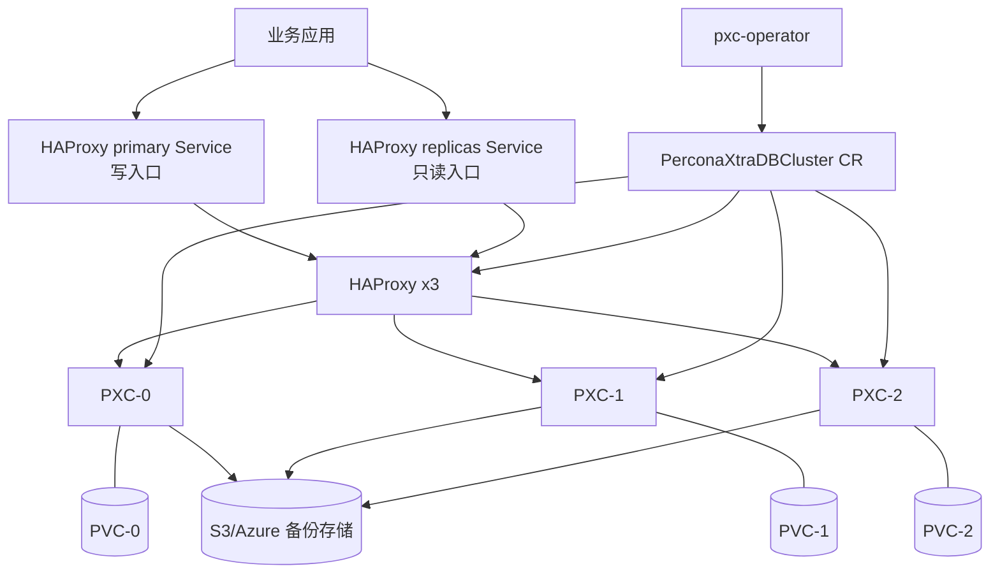
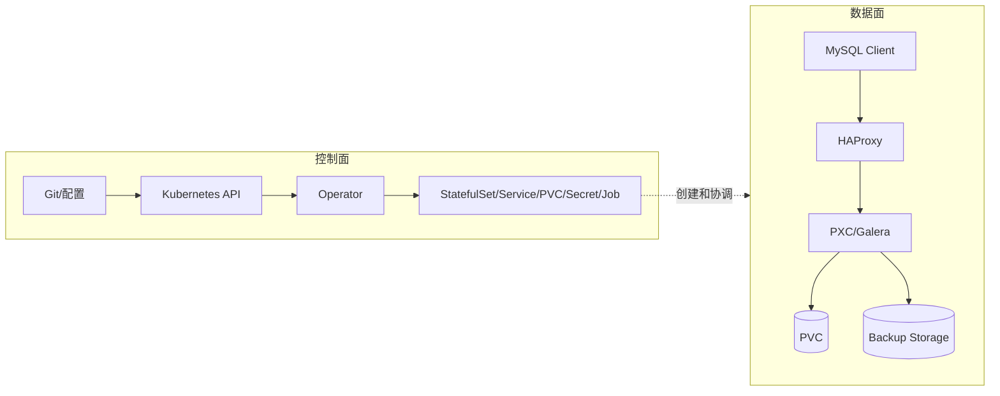
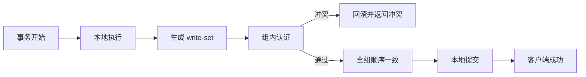
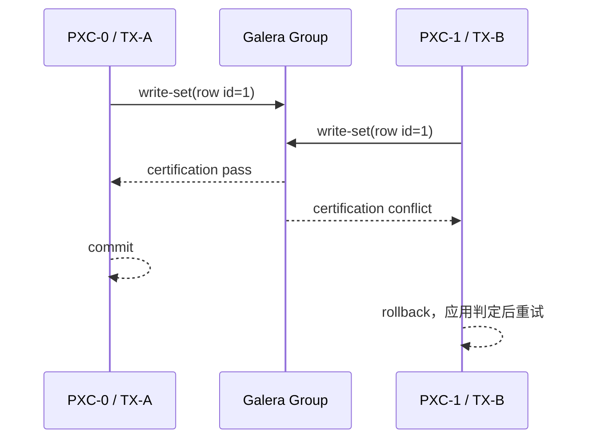
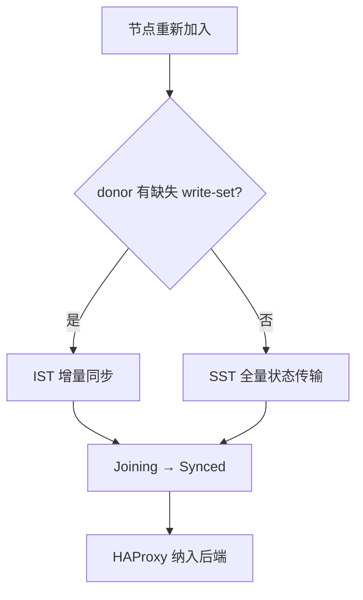
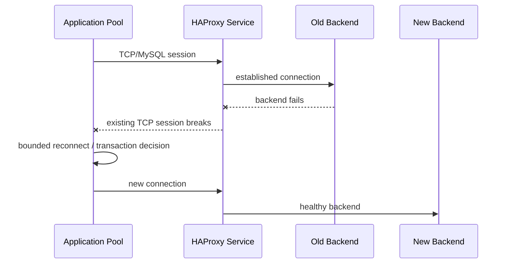
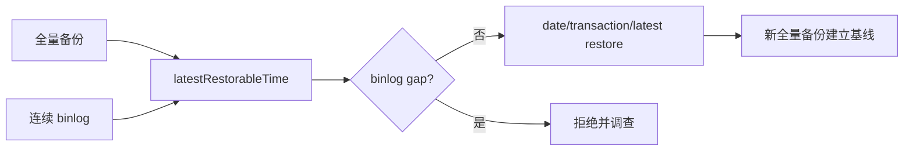
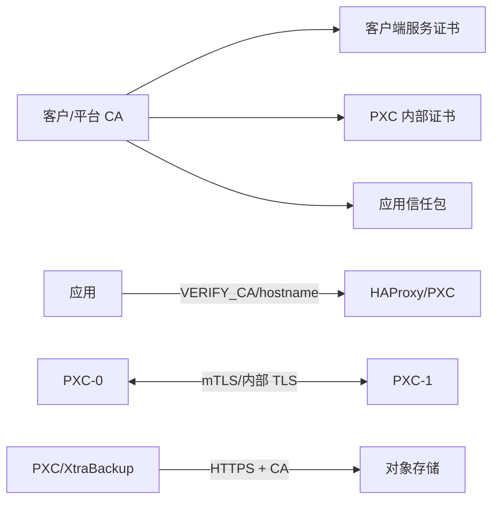

# Percona XtraDB Cluster（PXC）技术白皮书

> **文档版本：** v1.0（编码前技术基线）  
> **最后核验：** 2026-08-19  
> **锁定版本：** Percona Operator for MySQL v1.20.0、PXC 8.4.8-8.1、XtraBackup 8.4.0-5.1、HAProxy 2.8.18-1  
> **官方依据：** [Architecture](https://docs.percona.com/percona-operator-for-mysql/pxc/architecture.html)、[Replication](https://docs.percona.com/percona-operator-for-mysql/pxc/replication.html)、[HAProxy](https://docs.percona.com/percona-operator-for-mysql/pxc/haproxy-conf.html)、[Storage](https://docs.percona.com/percona-operator-for-mysql/pxc/storage.html)

本文说明 PXC 为什么这样设计、一次 SQL 请求经过哪些组件、故障时哪些状态是安全状态、哪些能力不属于本方案，以及后续 kubeauto 代码必须如何落地。

## 目录

1. 定位、适用场景和限制
2. 组件和总体架构
3. Galera/PXC 复制原理
4. Operator 协调模型
5. HAProxy 连接和故障转移
6. 存储、故障域和恢复
7. 备份、恢复和 PITR
8. 安全、可观测性和容量
9. 性能模型和测试方法
10. 交付边界和官方依据

## 第一章、定位、适用场景和限制

PXC 是运行在 Kubernetes 上的 MySQL 高可用集群形态。每个 PXC 节点保存完整数据，Galera 提供同步复制和多数派判断，Operator 管理节点、代理、PVC、Secret、备份和升级。

| 需求 | PXC 能力 | 不能替代 |
|---|---|---|
| 单节点故障 | 3 节点多数派继续服务 | 跨地域灾备 |
| 节点一致性 | Galera 写集认证和同步提交 | 误删后的历史版本 |
| 连接稳定 | HAProxy primary/replica Service | 应用连接池和事务重试 |
| 声明式运维 | Operator reconcile、SmartUpdate、Backup/Restore CR | 无审查的任意变更 |
| 数据保护 | XtraBackup、binlog、PITR | 备份存储自身的灾备 |

适合需要 Kubernetes 原生管理、单节点故障连续服务和同步数据副本的业务。不适合跨地域双写、强依赖任意 MySQL DDL、极低写延迟、两个节点的极限资源环境；这些需求必须另行设计和压测。

### 1.1 为什么选择 PXC，而不是单实例或普通异步主从

| 形态 | 提交语义 | 单节点故障 | 主要风险 |
|---|---|---|---|
| 单 MySQL + PVC | 单点本地提交 | 依赖 Pod/PVC 在新节点恢复 | 节点/PVC 恢复时间内不可用 |
| 异步主从 | 主库提交后异步传输 | 需要选主和提升副本 | 故障瞬间可能丢失尚未复制事务 |
| PXC 3 节点 | write-set 组通信、认证和顺序一致 | 2/3 多数派继续工作 | 写延迟受网络和最慢节点影响 |

PXC 的价值是把“副本一致性、成员关系和故障仲裁”放进 Galera 协议，并由 Operator 映射为 Kubernetes 资源生命周期。它不是无代价的高可用：每次写事务需要跨节点通信，热点写可能发生认证冲突，慢节点会通过 flow control 限制整个集群。

### 1.2 一致性边界

PXC 使用 virtually synchronous replication。事务提交前，write-set 已在组内获得全局顺序并完成认证；其他节点的 apply 线程仍可能有短暂队列。因此：

- 提交成功比普通异步复制提供更强的数据持久性和故障切换基础；
- “三个节点在同一微秒完成物理落盘”不是正确理解；
- 从另一个节点立即读取时，是否等待因果依赖取决于读路径和 wsrep 一致性设置；
- `replicas` Service 用于读扩展前必须以业务可接受的新鲜度实测，强 read-after-write 流程优先走 primary Service；
- 业务仍需处理连接断开、事务回滚、认证冲突和超时，数据库高可用不能替代应用容错。

### 1.3 数据和 SQL 约束

生产业务表应使用 InnoDB，并为写事务提供明确主键。非事务表、超大事务、热点单行、长时间锁、批量 DDL 和依赖特定 MySQL 行为的语句必须在锁定版本上验证。PXC 能运行 MySQL 协议不等于任意单机 MySQL workload 可以无改造迁移。

## 第二章、组件和总体架构



| 资源 | 维护者 | 作用 |
|---|---|---|
| PerconaXtraDBCluster CR | 平台团队/GitOps | 副本、镜像、TLS、存储、代理和升级策略 |
| Operator Deployment | Helm/平台 | 监听资源并执行 reconcile |
| PXC Pod | Operator | 运行数据库和 wsrep |
| HAProxy Pod/Service | Operator | 根据 PXC 健康状态提供入口 |
| PVC/PV | CSI + Operator | 保存每个节点数据 |
| Backup/Restore CR | 运维/GitOps | 声明备份和恢复动作 |
| Secret | 密码系统/平台 | 密码、TLS、对象存储凭据 |

一次写请求路径是：应用 → HAProxy primary Service → 健康 PXC → Galera 写集认证 → 多数派确认 → 本地提交 → 应用。应用只使用 Service DNS，不使用 PXC Pod IP。

### 2.1 控制面和数据面



Operator 故障首先影响声明式变更、扩缩容、备份恢复和自愈协调；已经运行的数据面不应因为一次短暂 reconcile 失败立即停止 SQL 服务。反过来，Operator Ready 也不能证明 PXC Primary/Synced 或业务 SQL 正常。监控和验收必须分别覆盖两条链路。

### 2.2 Kubernetes 资源关系

每个 PXC Pod 有稳定 ordinal 和独立 PVC；StatefulSet 提供身份和启动顺序，Service 提供发现，HAProxy 根据数据库健康状态选择后端。PDB 只约束 Kubernetes API 发起的自愿驱逐，不防止主机断电、内核崩溃、存储故障或管理员强删 Pod。因此三节点反亲和、节点故障域、CSI 能力和运维纪律缺一不可。

## 第三章、Galera/PXC 复制原理

PXC 采用 Galera 虚拟同步复制。事务先在接入节点本地执行，提交阶段提取被修改行的 write-set，通过组通信获得全局顺序并在各成员认证。认证通过后进入 apply/commit；冲突事务回滚。最慢节点、网络 RTT、磁盘延迟和事务冲突都会增加提交延迟。



### 3.1 write-set 认证和冲突

认证不是在事务执行前对全局数据库加锁，而是在提交阶段比较并发 write-set。两个连接可以在不同 PXC 节点同时更新同一热点行，最后只有一个获得兼容顺序，另一个以冲突/死锁类错误回滚。



降低冲突的首要方式是业务设计：缩短事务、避免热点行、固定更新顺序、限制批量写入、优先把写流量收敛到 primary Service。重试必须有次数、退避和幂等约束；不能对支付、库存等非幂等事务遇到任何错误就无条件重放。

### 3.2 apply 队列和 flow control

成员收到并认证 write-set 后由 apply 线程落到本地。如果某节点 CPU、磁盘或锁处理变慢，接收队列上升；达到阈值时 Galera flow control 会要求组内其他节点暂缓发送，使集群保持可追赶状态。


因此 PXC 写吞吐接近“最慢健康成员”的能力，不是三个节点写能力相加。`wsrep_flow_control_paused` 持续上升时，应定位单点慢盘、资源节流、长事务、SST 或网络，而不是先提高连接数。

### 3.3 DDL 和大事务

集群 DDL 通常通过 Total Order Isolation（TOI）按全局顺序执行，保证所有节点 schema 一致，但长时间 ALTER 会阻塞或显著影响业务。Rolling Schema Upgrade（RSU）让节点逐个脱离同步执行，使用不当会造成临时或永久 schema 不一致，不能作为默认生产捷径。

上线 DDL 前必须用接近生产的数据量验证执行时间、锁行为、临时空间、复制影响和回滚路径。大事务会生成大 write-set，占用内存、网络和 apply 时间；应拆成可审计批次，并用业务 marker 验证每批结果。

### 3.4 多数派和脑裂

Galera 通过成员视图和 quorum 形成 Primary Component。只有多数派组件允许安全写入，少数派会阻止写操作。

| 3 节点事件 | 协议状态 | 正确动作 |
|---|---|---|
| 1 节点宕机 | 2/3 Primary | 继续服务，修复后 IST/SST |
| 2 节点宕机 | 1/3 非多数派 | 不强行写入，调查故障节点 |
| 2+1 网络分区 | 2 节点侧 Primary | 1 节点侧停止写，恢复网络后同步 |
| 全部停止 | 无 Primary | 按官方恢复流程选择安全序列启动 |

生产判断至少读取：wsrep_cluster_size、wsrep_cluster_status、wsrep_local_state_comment、wsrep_ready、wsrep_flow_control_paused、wsrep_local_recv_queue、wsrep_local_cert_failures。Pod Running 不能替代这些状态。

Primary Component 是数据库协议层成员视图，不等同于 Kubernetes Ready。3 节点在 2+1 网络分区时，2 节点侧拥有多数派，1 节点侧拒绝写；这正是脑裂保护。手工让少数派可写会破坏这一保证。

全体停止后的恢复不能简单“任选一个 Pod 启动”。必须比较节点最后状态、sequence number 和安全启动标志，选择最新安全节点建立新 Primary Component，再让其他节点加入。错误 bootstrap 可能把较旧副本当成权威并丢失事务。

### 3.5 IST、SST 和 gcache

节点短暂离线且 donor 仍保留缺失 write-set 时使用 IST；新节点或缺少历史时使用 SST。SST 会消耗 donor 的磁盘、CPU、网络和业务带宽，必须设置维护窗口并监控。



gcache 是节点保存近期 write-set 的环形历史。能否 IST 取决于 donor 是否仍保留 joiner 缺失的连续序列，而不只取决于离线分钟数。写入速率越高、gcache 越小，越容易退化为 SST。

| 项目 | IST | SST |
|---|---|---|
| 传输内容 | 缺失 write-set | 完整状态快照 |
| 速度/开销 | 通常较快、较小 | 受全量数据、网络和磁盘限制 |
| donor 影响 | 读取 gcache | XtraBackup、读取和上传大量数据 |
| 触发 | UUID/序列连续且历史仍在 | 新节点、历史缺失或状态不兼容 |
| 运维关注 | apply 队列和追赶时间 | donor 负载、临时空间、超时、业务 P99 |

gcache 容量应根据峰值写入字节率和允许维护窗口计算，再通过故障测试校准。不能把一次小数据集 IST 成功外推为生产一定不会 SST。

## 第四章、Operator 协调模型

Operator 监听 CR、Pod、PVC、Secret、Job 和 Service，计算期望状态并反复修正实际状态。


kubectl apply 返回 0 只表示对象进入 API Server；交付必须继续等待 CR conditions、PXC 状态、HAProxy 后端和 SQL 数据面。SmartUpdate 是官方推荐的数据库变更策略，Operator 按安全顺序滚动节点；配置、密码、资源和镜像变更都可能触发滚动过程。

### 4.1 reconcile 不是一次性安装脚本

Operator 持续比较“CR 中的期望状态”和“API Server 中的实际状态”。手工修改其管理的 StatefulSet、Deployment 或 Service 可能在下一轮被恢复，也可能造成 CR 与现场漂移。权威变更入口应是受版本控制的 CR/values，紧急手工操作必须在事后回写权威配置并解释原因。

| 操作 | 正确入口 | 错误做法 |
|---|---|---|
| 改 PXC 镜像/资源 | PerconaXtraDBCluster CR | `kubectl edit statefulset` |
| 改 Operator 镜像/RBAC | Helm values/Chart | 手工改 Deployment 后不留记录 |
| 改系统密码 | `spec.secretsName` 指向的 Secret | 改 `internal-<cluster>` Secret |
| 创建备份/恢复 | Backup/Restore CR | 直接进入容器执行未记录脚本 |
| 扩缩容 | CR 中 size | 手工 scale Operator 管理的 StatefulSet |

### 4.2 SmartUpdate 的安全边界

SmartUpdate 负责按集群状态和顺序推进滚动，不代表任何版本组合都能安全升级。Operator、CRD、PXC、XtraBackup、HAProxy 和 Kubernetes 必须先通过兼容矩阵；PDB 和多数派必须健康；每个节点更新后还要验证 wsrep 和 SQL。

Operator 不替代变更审批、备份恢复演练和业务终止阈值。若节点无法回到 Synced，继续滚动会从“单节点异常”扩大为“失去多数派”。

## 第五章、HAProxy 连接和故障转移

| Service | 语义 | 应用用途 |
|---|---|---|
| cluster1-haproxy:3306 | Primary 后端 | 写事务和读写混合 |
| cluster1-haproxy-replicas:3306 | Replica 后端 | 只读查询，onlyReaders=true |
| cluster1-haproxy:33062 | 管理/健康检查 | 平台排障，不给业务 |

HAProxy 根据 PXC 健康检查摘除非 Ready、非 Synced 或不可写节点。应用必须实现连接池重连，因为 TCP 连接在主节点切换时可能断开。

### 5.1 primary 与 replicas 的语义

primary Service 把读写流量送到当前 writer 后端，降低跨节点并发写带来的认证冲突；replicas Service 在 `onlyReaders=true` 时避免选择 writer，用于可容忍相应读取语义的查询。PXC 协议仍具有多主能力，但本方案不把“所有节点同时接写”作为默认应用架构。



HAProxy 可以把新连接切到健康节点，不能透明搬迁已经建立的 MySQL session。事务执行中断时，应用必须判断事务是否提交，使用业务幂等键或查询结果确认后再重试。

### 5.2 暴露边界

默认使用 ClusterIP。集群外接入应通过客户批准的内部 LoadBalancer/网关和受控 FQDN，限制源网段、NetworkPolicy 和防火墙，证书 SAN 与访问名一致。33062、HAProxy stats、Operator webhook/metrics 和 PXC Pod 端口不是普通业务入口，不能直接暴露公网。

## 第六章、存储、故障域和恢复

每个 PXC 节点拥有独立 PVC。CSI 必须支持所需拓扑、挂载、扩容和故障后重挂载。

| 存储问题 | PXC 影响 |
|---|---|
| Hostpath 本地卷 | 节点永久损坏时不能自动漂移恢复 |
| CSI 无跨节点挂载 | Pod 可重建但 PVC 不能附着 |
| PVC 空间耗尽 | MySQL、binlog、备份或 SST 失败 |
| 存储高延迟 | 提交延迟和 flow control 上升 |
| 只验证 PVC Bound | 不能证明 Pod 已挂载和可写 |

三份在线副本提供节点级可用性，不提供误删保护；备份存储必须与 PXC PVC 故障域分离。

### 6.1 存储路径和性能放大

一次写事务不仅涉及 InnoDB 本地写入，还受 Galera 复制、其他节点 apply 和最慢成员影响。单个 PVC 的高尾延迟可能通过 recv queue 和 flow control 放大到全体业务。容量评审不能只写“SSD”，而要记录卷类型、IOPS、吞吐、P95/P99 延迟、fsync、扩容方式和故障重挂载时间。

```text
单节点 PVC 规划 = 数据 + 索引 + 临时空间 + binlog + gcache + SST/运维余量 + 增长窗口
集群原始容量 ≈ 单节点 PVC × PXC 节点数
备份容量 = 全量大小 × 保留份数 + 连续 binlog + 对象版本/保留余量
```

数据库使用率告警应早于文件系统耗尽，并给扩容、数据归档和备份清理留出审批时间。PVC 扩容必须验证 StorageClass、CSI、文件系统在线扩容和 PXC 实际可见容量，不能只看 PVC spec 已修改。

### 6.2 故障域

主机反亲和只保证调度时尽量/强制分散，不能自动形成机架、电源、交换机或可用区级隔离。生产应把 `kubernetes.io/hostname` 与真实故障域映射清楚；若三台节点共享同一存储控制器或电源，逻辑三副本仍存在共同失效点。

## 第七章、备份、恢复和 PITR

Operator 使用 XtraBackup 创建 Backup CR 并将结果写入 S3/Azure 兼容存储。成功条件包括 Backup CR Succeeded、对象存储制品完整可读、集群名、时间和路径正确。Job Completed 不足以签收。

PITR 需要全量备份和连续 binlog；binlog 路径按集群隔离，上传前禁止 purge，检测到 gap 时拒绝不安全恢复。恢复到新集群使用 backupSource，同集群可使用 backupName；PITR 完成后必须建立新的全量备份基线。



### 7.1 在线副本、全量备份和 PITR 的区别

| 能力 | 保护对象 | 不能解决 |
|---|---|---|
| PXC 三副本 | 节点/PVC 单点故障 | 误删、错误 DDL、逻辑污染同步到所有节点 |
| XtraBackup 全量 | 某个一致备份点 | 备份点之后的数据 |
| 连续 binlog/PITR | 全量点到目标时间/事务 | binlog gap、错误时间选择 |
| 对象存储保留/对象锁 | 备份被误删或篡改 | 未做恢复演练导致备份不可用 |

RPO 由全量备份频率、binlog 上传间隔和 gap 决定；RTO 由备份大小、对象下载、prepare/restore、PXC 启动同步和业务验证共同决定。宣传值不能代替客户数据量上的当前恢复演练。

### 7.2 恢复为何必须验证业务数据

Restore CR Succeeded 说明 Operator 工作流达到成功状态，不证明选对了备份、目标时间、schema 或业务记录。恢复验收至少包含：Primary/Synced、账号/TLS、关键表行数和校验、备份前后 marker、应用查询、以及恢复后的新全量备份。

PITR 检测到 binlog gap 时拒绝不安全恢复是数据保护机制。绕过 gap 可能得到语义不完整的数据库；只能在业务/DBA 明确接受实际数据损失并有补偿方案时另行审批。

## 第八章、安全、可观测性和容量

- TLS 默认开启；客户端、内部复制和 webhook 证书按官方 TLS 流程管理。
- Operator 使用高权限 RBAC；应用账号只授予业务 schema 所需权限。
- Secret 不写入普通配置、Git、镜像层、日志或截图。
- HAProxy 和数据库管理端口不直接暴露公网；北向暴露审查 source ranges、NetworkPolicy 和审计。
- 备份启用对象存储 TLS、最小权限 bucket policy、密钥轮换和恢复演练。

| 层级 | 指标/日志 | 目的 |
|---|---|---|
| Operator | reconcile、webhook、leader、CR conditions | 控制器是否收敛 |
| PXC | wsrep、错误日志、OOM、重启 | 复制和数据库状态 |
| HAProxy | backend health、连接、错误 | 业务入口 |
| CSI/PVC | 使用率、延迟、挂载错误 | 存储根因 |
| Backup/PITR | 最近成功、失败、gap、可恢复时间 | RPO |

### 8.1 四类身份和密钥

| 类型 | 示例 | 管理要求 |
|---|---|---|
| Kubernetes 控制面 | Operator ServiceAccount/RBAC | 最小 watch namespace，审计变更 |
| PXC 系统用户 | root、operator、monitor、xtrabackup | Operator 管理，定期轮换，不给应用 |
| 业务用户 | schema 级 CRUD | `spec.users`/密码系统，最小权限 |
| 外部存储身份 | S3/Azure credentials | 限定 bucket/prefix，独立轮换 |

系统 Secret、Operator 内部 Secret 和业务 Secret 责任不同。外部 Secret 是平台权威，`internal-<cluster>` 由 Operator 同步，用户不应修改。base64 不是加密；需要 Kubernetes at-rest encryption、RBAC、审计以及密码系统的生命周期管理共同保护。

### 8.2 TLS 信任链

至少存在客户端到 HAProxy/PXC、PXC 内部通信、Operator webhook、对象存储 HTTPS 等信任关系。证书轮换前要识别证书由 Operator、cert-manager 还是客户 PKI 维护。只替换一个 Secret、关闭 hostname 校验或临时改明文会造成隐蔽漂移。



证书验收包含正确 CA 成功、错误 CA 失败、错误主机名失败、有效期/时钟正确，以及轮换期间连接和 Operator reconcile 行为。

### 8.3 从指标到告警

单指标阈值不够。建议组合：

- `wsrep_cluster_status != Primary` 或 cluster size 小于期望：高优先级可用性告警；
- 节点长期非 Synced、recv queue 上升且 flow control 增加：复制/性能告警；
- HAProxy 健康后端不足并伴随应用连接错误：业务入口告警；
- PVC 使用率/延迟、Pod OOM/重启和节点压力：容量根因告警；
- 最近成功备份超出 RPO、PITRReady=False 或 latestRestorableTime 停滞：数据保护告警；
- Operator reconcile 连续失败：控制面告警，但要与数据面健康分别展示。

告警必须指向本目录运维手册的固定取证和分流步骤，避免告警只有现象没有责任边界。

## 第九章、性能模型和测试方法

PXC 没有脱离业务的官方 TPS 保证值。写性能由事务冲突、节点数量、网络 RTT、最慢节点 fsync、flow control、连接池、SST 和 PVC 延迟共同决定。平均 TPS 单独不能作为生产签收。

可用一个非承诺性的因果模型理解写延迟：

```text
事务响应时间 ≈ 本地 SQL 执行 + write-set 组通信/认证 + 本地提交
尾延迟额外受：最慢成员 apply、flow control、热点冲突、锁等待、SST/备份 IO、连接切换
```

增加 PXC 节点主要增加故障容忍和完整副本，不保证提高写吞吐；更多成员意味着更多通信和状态维护。只读负载可以利用 replicas Service 分散，但每个节点仍需 apply 全部 write-set，读压力过高也会间接拖慢复制。

性能测试必须固定 Operator/PXC/HAProxy/Kubernetes/digest、节点规格、StorageClass、数据集、schema、线程数、读写比例和持续时间，并采集 TPS、P95/P99、错误率、flow control、队列、CPU、IOPS、网络和存储延迟。

| 场景 | 目的 |
|---|---|
| 读写混合 | 正常业务基线 |
| 只读 | replicas Service 和读扩展 |
| 热点写 | 认证冲突和事务重试 |
| 连接数阶梯 | 连接池/HAProxy/节点拐点 |
| 单节点故障 | 故障期间 P99、错误率、恢复时间 |
| SST | donor IO/网络和业务影响 |
| 存储压力 | PVC 延迟对提交和流控的影响 |

### 9.1 基准测试的科学性

基准结果只有在软件 digest、硬件、网络、StorageClass、数据集、schema、线程、连接、运行时长和健康状态全部固定时才可比较。至少报告吞吐、P50/P95/P99、错误率、重试、flow control、认证冲突、CPU throttling、磁盘延迟/IOPS 和网络 RTT。


压测机达到 CPU/网络上限、数据集完全在缓存中、运行时间过短或只报告平均 TPS，都会产生误导。性能签收应先定义客户 SLO 和终止条件，再执行测试；不应测完后挑选有利指标。

### 9.2 容量拐点和上线余量

线程增加但 TPS 不再上升、P99/错误率/flow control 快速恶化的位置是容量拐点。生产上线容量应保留节点故障、备份和 SST 期间的余量，不能把三节点都健康时的峰值作为可持续额度。扩容前先证明瓶颈属于 CPU、内存、连接、存储、网络还是事务冲突；不同根因的优化措施不同。

## 第十章、交付边界和官方依据

本方案不承诺跨地域双写、无限读扩展、任意 MySQL SQL 兼容、PXC 替代备份、Hostpath 提供跨节点高可用，也不允许用旧日志证明新版本通过。

正式交付必须具备当前版本镜像/Chart digest、Primary/Synced、真实 SQL、单节点故障、备份恢复、PITR、性能、监控、升级回滚和清理证据。完整来源见[官方依据与版本基线](./official-sources.md)。
