# 1、操作手册

本文档为 kubeauto 的**操作手册**，说明如何在目标环境中下载制品、部署集群、配置网络与插件，以及日常运维操作。

kubeauto 用于快速部署 Kubernetes 集群及云原生周边组件：安装与配置逻辑由 Ansible 角色实现，集群生命周期由 Python 控制面（`kubecli`）编排。项目不依赖 kubeadm，采用二进制 + systemd 方式落地控制面与节点组件，并支持离线镜像仓库分发。

配套文档：

- [技术白皮书总册](./technical-whitepaper.md)（**原理与实现签收文档**，分章见 [`whitepaper/`](./whitepaper/)）
  - 证书 / PKI → [第 6 章](./whitepaper/06-pki-certificates.md)
  - 控制面组件 → [第 3 章](./whitepaper/03-control-plane.md)
  - CRI → [第 8 章](./whitepaper/08-cri-runtime.md)
  - CNI → [第 9 章](./whitepaper/09-cni-networking.md)
  - 监控与插件 → [第 12 章](./whitepaper/12-addons-observability.md)
  - Node Allocatable → [第 11 章](./whitepaper/11-allocatable-qos.md)（操作细节见本文 §1.1.4）
- [开发手册](./development-manual.md)：六仓协同开发与贡献指南
- [技术栈索引](./technology-stack-index.md)：集中查找组件原理、项目入口、运维章节与官方来源
- 仓库入口：[README.md](../README.md)
- Percona PXC 独立中间件文档：[入口](./middleware/perconaPXC/README.md) · [用户与运维手册](./middleware/perconaPXC/operations-manual.md)（当前为编码前方案）

## 1.1、前言

### 1.1.1、最小配置

下表给出实验室连通性验证常用规格，**不得**直接作为生产合同基线。生产按业务容量与合同选型；启用默认 Node Allocatable（合计约 **2 CPU + 4Gi**）时，工作节点建议不低于 **16 CPU / 32Gi**（详见 §1.1.4）。

| 部署场景                   | 节点角色            | CPU  | 内存  | 存储空间 | 常规组件                                                     |
| -------------------------- | ------------------- | ---- | ----- | -------- | ------------------------------------------------------------ |
| 单节点部署<br />（1 节点） | 控制节点 + 工作节点 | 4 核 | 16 GB | 60 GB    | • kube-apiserver / kube-controller-manager / kube-scheduler<br/>• etcd<br/>• kubelet / kube-proxy<br/>• containerd 或 docker+cri-dockerd<br/>• CNI（calico / flannel / cilium 等）<br/>• CoreDNS、kubectl |
| 多节点部署<br />（3 节点） | 控制节点            | 4 核 | 16 GB | 60 GB    | • 同上控制面组件<br/>• 集成 kube-lb，或外置 keepalived + nginx<br/>• CNI、CoreDNS |
| 多节点部署<br />（2 节点） | 工作节点            | 2 核 | 8 GB  | 30 GB    | • kubelet / kube-proxy<br/>• containerd 或 docker+cri-dockerd<br/>• CNI（与控制面一致） |
| 生产推荐（合同基线）       | 控制 / 工作节点     | ≥16 核 | ≥32 GB | 按盘规划 | • 同上，并启用默认 kube/system reserved（见 §1.1.4） |

### 1.1.2、架构

部署形态：

| 形态 | 用途 | 说明 |
|------|------|------|
| all-in-one | 学习 / 测试 | `kubecli start-aio`；控制面与工作负载共节点 |
| 多节点高可用 | 生产 | 多 master + etcd 奇数成员；节点组件经本机 kube-lb 访问 apiserver |

**外置 LB（可选）**：keepalived VIP + nginx（stream）转发至各 master apiserver：

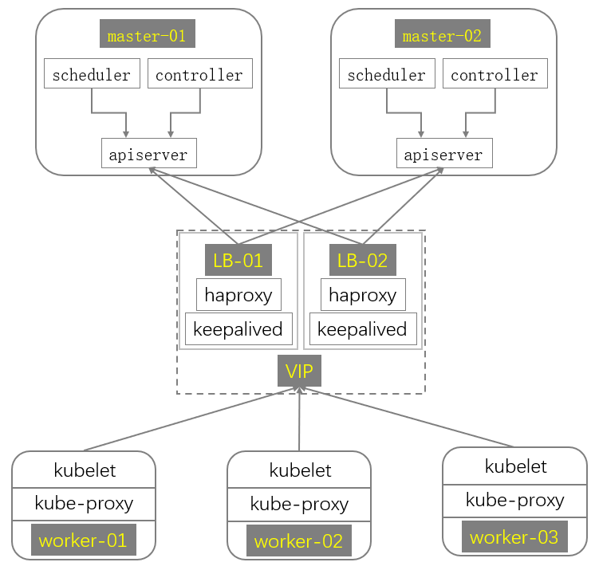

**集成 kube-lb（默认）**：各节点本地 `127.0.0.1:6443` 四层转发至 master 列表：

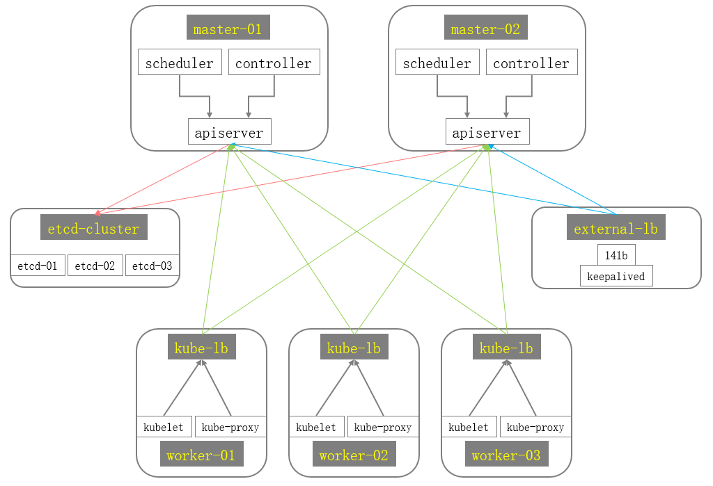

本项目默认第二种。原理见白皮书 [第 7 章](./whitepaper/07-ha-loadbalancer.md)。

### 1.1.3、容器运行时

Kubernetes 通过 [CRI](https://kubernetes.io/docs/concepts/architecture/cri/) 与节点上的容器运行时交互。自 **1.24** 起，内建 dockershim 已移除；节点须使用符合 CRI 的运行时。官方说明：[Container Runtimes](https://kubernetes.io/docs/setup/production-environment/container-runtimes/)。

本项目支持：

| 运行时 | 适用说明 | 库存配置 | 默认版本钉扎 |
|--------|----------|----------|--------------|
| **containerd**（默认） | 生产推荐；与 pause / k8s 二进制配套 | `CONTAINER_RUNTIME="containerd"` | 随 ext-bin（当前 **2.1.4**） |
| **docker + cri-dockerd** | 需保留 Docker Engine 时 | `CONTAINER_RUNTIME="docker"` | Engine **28.5.2**，cri-dockerd **0.3.26**（`v_docker` / `v_cri_dockerd`） |

默认 Kubernetes 版本：**v1.33.6**（`v_k8s_bin`）。沙箱镜像：`SANDBOX_IMAGE` → `registry.talkschool.cn:5000/brinnatt/pause:3.10`。kubelet 与运行时须使用相同 **cgroup 驱动**（本项目为 `systemd`）。

参考：

- [containerd getting started](https://github.com/containerd/containerd/blob/main/docs/getting-started.md)
- [cri-tools / crictl](https://github.com/kubernetes-sigs/cri-tools)
- [cri-dockerd](https://github.com/Mirantis/cri-dockerd)
- [Docker Engine 二进制安装](https://docs.docker.com/engine/install/binaries/)

### 1.1.4、为系统守护进程预留计算资源（Node Allocatable）

Kubernetes 节点默认可被调度至节点 **Capacity**。若不预先为操作系统与 Kubernetes 系统守护进程划定资源，业务 Pod 将与上述守护进程竞争 CPU、内存等资源，并在压力场景下触发节点级资源饥饿、System OOM，甚至导致节点暂时不可用。

kubelet 提供 **Node Allocatable** 能力，用于从 Capacity 中划出不可被调度器超卖的业务容量，并为系统守护进程建立可审计的预留。Kubernetes 建议集群管理员按节点负载密度配置 Node Allocatable。kubeauto 默认启用 `kubeReserved` 与 `systemReserved`，并在约定节点规格（≥16 CPU / 32Gi 内存）下采用合计 **2 CPU + 4Gi** 的预留基线。

本节说明官方机制、驱逐与 QoS 相关行为，以及本项目的默认策略与验收方法。

**参考文档：**

| 主题 | 链接 |
|------|------|
| Node Allocatable、`kubeReserved`、`systemReserved`、强制执行 | [Reserve Compute Resources for System Daemons](https://kubernetes.io/docs/tasks/administer-cluster/reserve-compute-resources/) |
| 节点压力驱逐 | [Node-pressure Eviction](https://kubernetes.io/docs/concepts/scheduling-eviction/node-pressure-eviction/) |
| Pod QoS 类别 | [Pod Quality of Service Classes](https://kubernetes.io/docs/concepts/workloads/pods/pod-qos/) |

#### 1.1.4.1、问题背景

未配置预留时，调度器可按 Capacity 放置 Pod。节点上仍运行大量系统守护进程（操作系统服务、kubelet、容器运行时等）。这些进程与 Pod 共享同一套物理资源，在高密度或突发负载下会产生资源争用。

未配置 Node Allocatable 时：

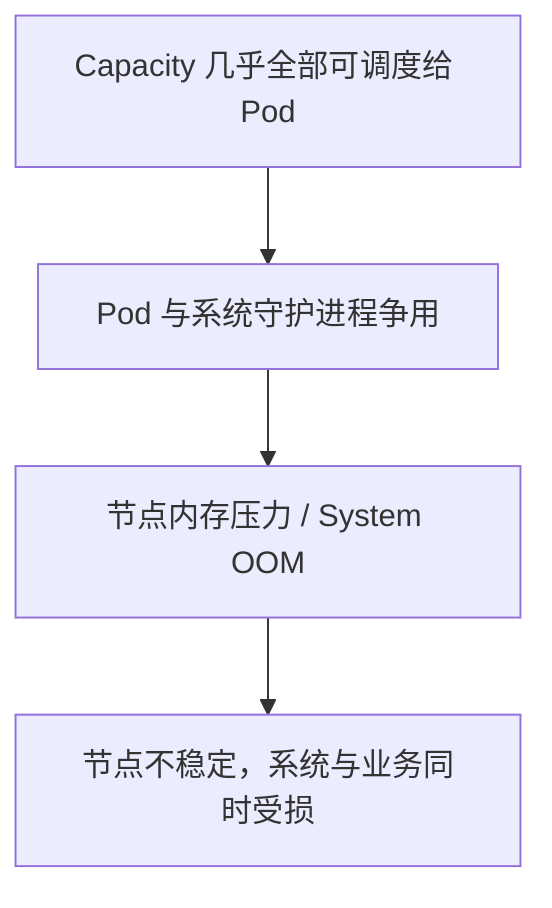

配置 Node Allocatable 后：

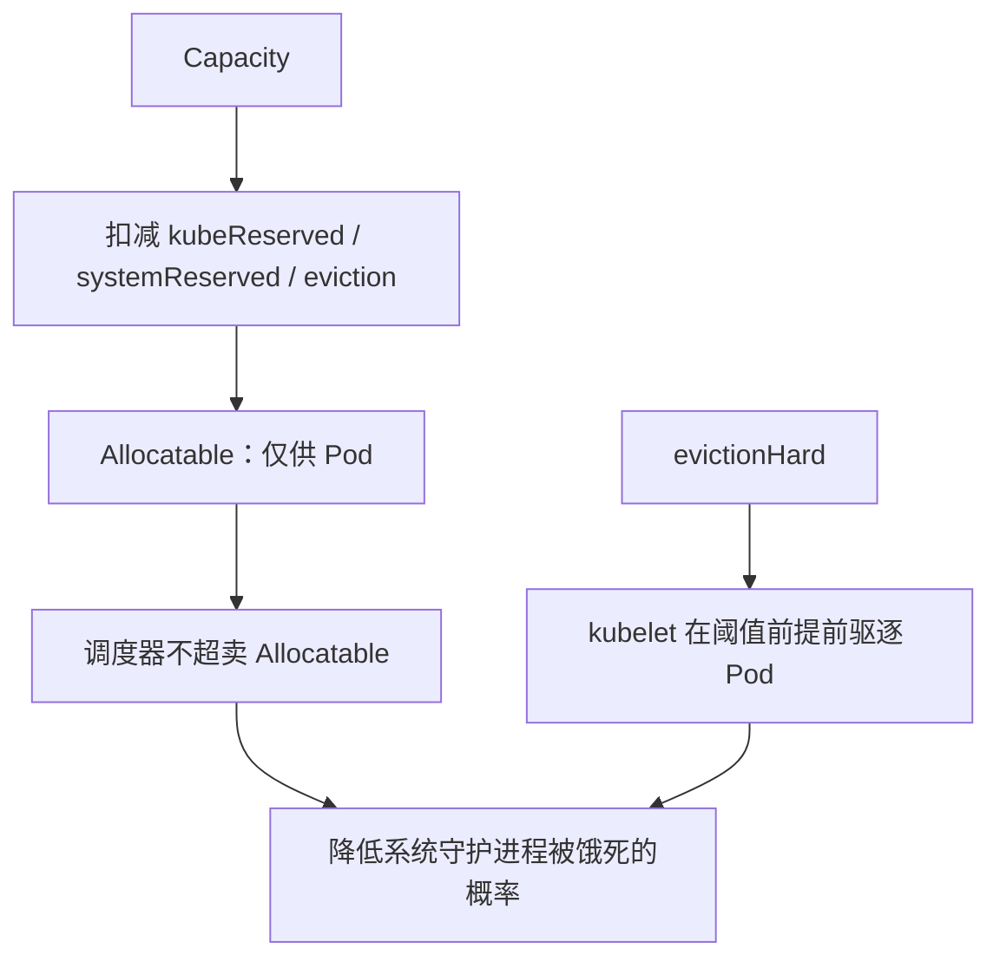

预留机制的作用边界如下：

1. **调度约束**：减小 Allocatable，限制可调度到该节点的 Pod `requests` 总量。
2. **运行时约束**：在启用相应 `enforceNodeAllocatable` 项时，通过 cgroup 限制 Pods 与（可选）kube / system 预留对应控制组的用量上限。
3. **驱逐约束**：在可用内存等信号跌破 `evictionHard` 阈值时，由 kubelet 主动终止 Pod，降低直接进入 System OOM 的概率。
4. **能力边界**：Node Allocatable 与节点压力驱逐不能保证内核永不故障，也不能保证 Linux OOM killer 永不误杀系统进程；其目标是降低概率并改善失效模式（优先影响业务 Pod，而非平台组件）。

#### 1.1.4.2、Node Allocatable 计算

**Allocatable** 表示节点上可供 Pod 使用的计算资源量。调度器不会对 Allocatable 进行超卖。当前支持 CPU、内存与 ephemeral-storage 等资源类型。

内存维度的关系可概括为：

```text
Allocatable ≈ Capacity − kubeReserved − systemReserved − evictionHard 预留量
```

官方文档示例：节点具备 `16` CPU、`32Gi` 内存；配置

- `kubeReserved` = `{cpu: 1000m, memory: 2Gi}`
- `systemReserved` = `{cpu: 500m, memory: 1Gi}`
- `evictionHard` = `{memory.available: "<500Mi"}`

时，Allocatable 约为 **14.5 CPU、28.5Gi 内存**。调度器确保该节点上所有 Pod 的内存 `requests` 之和不超过 28.5Gi；当节点上 Pod 的总体内存用量超过 Allocatable 时，kubelet 将驱逐 Pod。

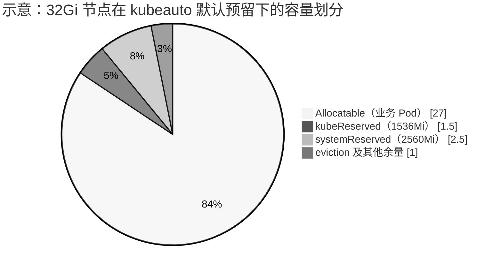

上图仅为结构示意。现场 Capacity 与 Allocatable 的差值以 `kubectl describe node` 为准。

#### 1.1.4.3、kubeReserved 与 systemReserved

| 配置项 | 用途（官方定义） | kubeauto 默认落点 |
|--------|------------------|-------------------|
| `kubeReserved` | 为 kubelet、容器运行时等 **Kubernetes 系统守护进程** 预留资源；一般不用于以 Pod 形式运行的系统组件 | `KUBE_RESERVED_CPU/MEMORY`；systemd 下 `kubeReservedCgroup: /podruntime`（对应主机 `podruntime.slice`） |
| `systemReserved` | 为 **操作系统守护进程**（如 sshd、udev）预留资源；亦应考虑为 **内核** 预留内存（内核内存当前不计入 Pod） | `SYS_RESERVED_CPU/MEMORY`；systemd 下 `systemReservedCgroup: /system`（对应 `system.slice`） |
| `evictionHard` | 为节点压力驱逐保留阈值以下的可用资源；该部分不可再分配给 Pod | 模板默认含 `memory.available: 300Mi` 等 |

使用 **systemd** cgroup 驱动时，官方要求：配置名应为 `kubeReservedCgroup` / `systemReservedCgroup` 的取值，由 kubelet 在名称后追加 `.slice`。若直接配置为 `/podruntime.slice`，将产生 `podruntime.slice.slice` 这类错误路径（参见 [kubernetes#78629](https://github.com/kubernetes/kubernetes/issues/78629)）。kubeauto 在 systemd 模式下使用 `/podruntime` 与 `/system`。

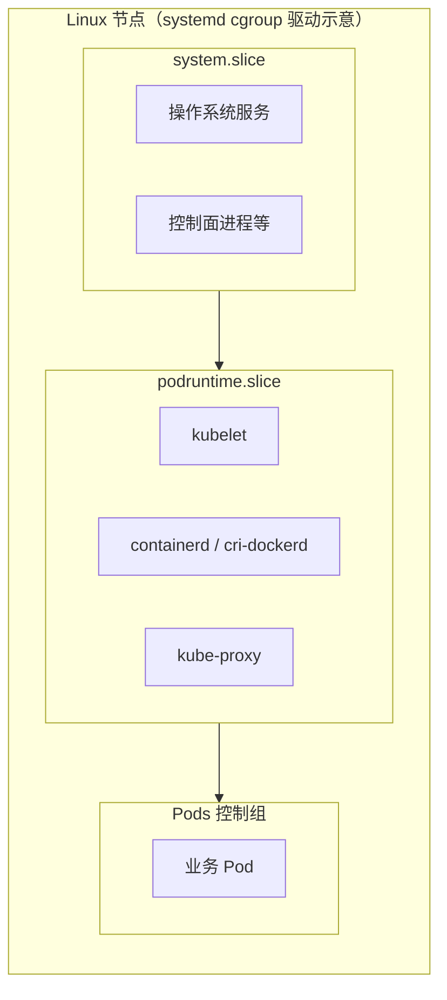

#### 1.1.4.4、强制执行 Node Allocatable（enforceNodeAllocatable）

调度器将 Allocatable 视为 Pod 可用容量。默认情况下，kubelet 通过在 Pod 总体用量超过 Allocatable 时驱逐 Pod 来强制执行该约束，对应 `enforceNodeAllocatable` 中的 `pods`。

可选地，可将 `kube-reserved`、`system-reserved` 加入同一列表，以对相应预留控制组施加强制限制；同时必须分别配置 `kubeReservedCgroup`、`systemReservedCgroup`。kubelet **不会**创建不存在的预留 cgroup；无效 cgroup 会导致 kubelet 启动失败。

**预留数值与强制执行是两件独立事务：**

| 行为 | 作用 | 是否默认开启（kubeauto） |
|------|------|--------------------------|
| 配置 `kubeReserved` / `systemReserved` | 从 Capacity 扣减，缩小 Allocatable（调度侧） | 是 |
| `enforceNodeAllocatable` 含 `pods` | 限制 Pod 总体用量，超额则驱逐 | 是 |
| 含 `kube-reserved` | 对 kube 预留控制组施加上限 | 是 |
| 含 `system-reserved` | 对 OS 预留控制组（如 `system.slice`）施加上限 | **否**（`SYS_RESERVED_ENFORCE: "no"`） |

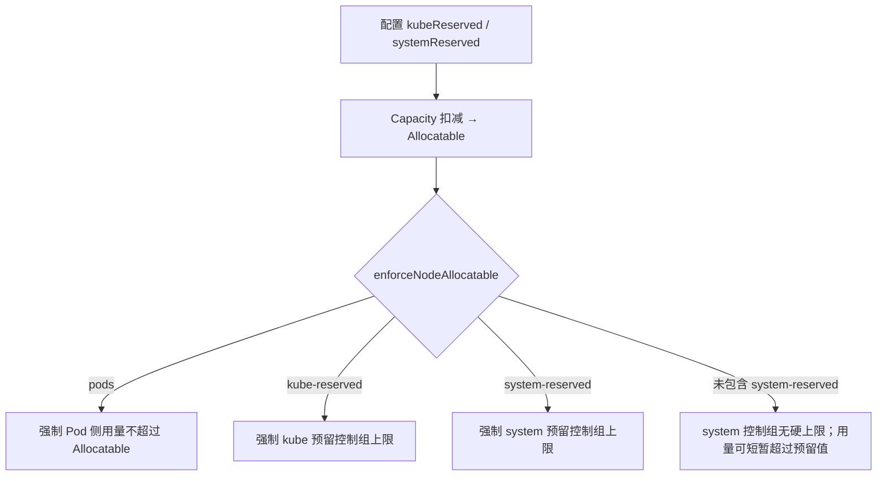

官方 General Guidelines 指出：对 `systemReserved` 的强制执行须格外谨慎，可能导致关键系统服务 CPU 饥饿、被 OOM 杀死或无法 fork。建议仅在完成充分节点画像、并具备故障恢复能力后再启用。推荐演进顺序为：先强制 `pods` → 在监控完备后尝试对 kube/system 的可压缩资源（如 CPU）强制 → 再考虑 kube 的不可压缩资源 → 确有必要时再对 `systemReserved` 的不可压缩资源强制执行。

kubeauto 默认策略：启用预留记账（合计 2 CPU + 4Gi），强制执行 `pods` 与 `kube-reserved`，**不**默认强制执行 `system-reserved`，以避免过小的 `system.slice` 内存上限危及控制面进程。

#### 1.1.4.5、节点压力与资源回收顺序

资源紧张时，行为由多层机制共同决定，不宜简化为「仅由内核 OOM killer 决定」。

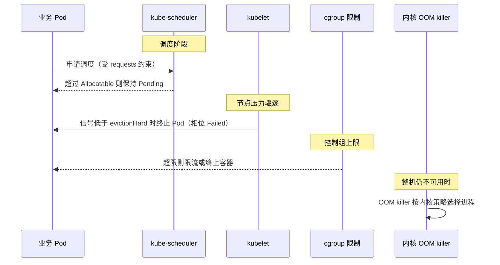

**调度阶段**  
节点上 Pod 的 `requests` 总和不得超过 Allocatable。

**节点压力驱逐（Node-pressure Eviction）**  
kubelet 监控内存、磁盘、inode、PID 等信号。当资源达到配置阈值时，可主动终止 Pod 以回收资源。硬驱逐阈值下，kubelet 使用 `0s` 宽限期。节点级内存压力可导致 System OOM 并影响该节点全部工作负载；通过 `evictionHard` 预留可用内存，kubelet 在跌破阈值前提前驱逐 Pod。

在回收节点级资源仍不足以缓解压力后，kubelet 按以下因素对终端用户 Pod 排序并驱逐（内存压力场景）：

1. Pod 资源用量是否超过 `requests`；
2. Pod Priority；
3. 用量相对 `requests` 的超额程度。

典型顺序：用量超过 `requests` 的 BestEffort / Burstable 优先；Guaranteed，以及用量未超过 `requests` 的 Burstable，通常靠后。文档说明：kubelet **并不**以 QoS 类别作为驱逐排序的直接键；QoS 可用于估计倾向。当系统守护进程用量超过 `kube-reserved` / `system-reserved`，且节点上仅剩遵守 `requests` 的 Guaranteed / Burstable 时，kubelet 仍可能驱逐低优先级 Pod 以维护节点稳定性。

**Pod QoS 类别（与驱逐倾向相关）**

| QoS | 判定要点 | 节点压力下的相对位置 |
|-----|----------|----------------------|
| BestEffort | 容器未设置 CPU/内存 request 与 limit | 通常最先成为驱逐候选 |
| Burstable | 不满足 Guaranteed，但至少设置了部分 request/limit | 介于中间 |
| Guaranteed | 各容器 CPU、内存的 request 与 limit 均大于零且两两相等 | 通常最不易因其他 Pod 超用而被驱逐 |

**内核 OOM**  
若上述机制仍无法恢复节点可用内存，Linux OOM killer 将介入。该层不由 Kubernetes 保证「业务进程一定先于系统守护进程终止」。合理配置预留与驱逐的目标，是尽量避免进入该层。

#### 1.1.4.6、kubeauto 默认参数与变更方式

约定生产节点规格不低于 **16 CPU / 32Gi 内存**。默认预留如下：

| 参数 | 默认值 | 说明 |
|------|--------|------|
| `KUBE_RESERVED_ENABLED` | `"yes"` | 启用 kube 预留 |
| `KUBE_RESERVED_CPU` / `KUBE_RESERVED_MEMORY` | `1000m` / `1536Mi` | `kubeReserved` |
| `SYS_RESERVED_ENABLED` | `"yes"` | 启用 system 预留（调度扣减） |
| `SYS_RESERVED_CPU` / `SYS_RESERVED_MEMORY` | `1000m` / `2560Mi` | `systemReserved` |
| `SYS_RESERVED_ENFORCE` | `"no"` | 不将 `system-reserved` 加入 `enforceNodeAllocatable` |
| 合计 | **2 CPU + 4Gi** | 从业务可调度容量中划出的平台基线 |

配置文件：`conf/config.yml`（模板）与 `clusters/<cluster>/config.yml`（集群实例）。修改后需重新应用 kube-node 配置，例如：

```bash
kubecli setup <cluster> 05
```

节点物理内存必须 **大于** 预留量与 eviction 预留之和。若 Capacity 小于预留，kubelet 将以 `Expected capacity >= reservation` 类错误拒绝启动；该行为符合官方约束。低规格实验节点不得直接套用上述生产默认值。

#### 1.1.4.7、验收

```bash
# 确认集群配置中的预留项
grep -E 'KUBE_RESERVED_|SYS_RESERVED_' clusters/<cluster>/config.yml

# 确认 Capacity 与 Allocatable 差值符合预留预期
kubectl describe node <node> | grep -A8 -E 'Capacity|Allocatable'

# 仓库内校验脚本（期望输出 RESERVED_ALLOCATABLE_PASS）
bash tests/helpers/verify-node-reserved.sh clusters/<cluster>/kubectl.kubeconfig
```

通过条件通常包括：CPU 差值不少于约 `2000m`、内存差值约 `4Gi` 量级（含 eviction）；kubelet 配置中存在 `kubeReserved` / `systemReserved`；`enforceNodeAllocatable` 包含 `pods` 与 `kube-reserved`，默认不包含 `system-reserved`；运行时位于 `podruntime.slice`，且不存在错误的 `podruntime.slice.slice`。

#### 1.1.4.8、交付说明摘要

在约定规格（≥16 CPU / 32Gi 内存）的节点上，kubeauto 默认启用 Node Allocatable：从业务可调度容量中预留合计 **2 CPU + 4Gi**，供 Kubernetes 系统守护进程与操作系统（含内核侧记账）使用；默认强制执行 `pods` 与 `kube-reserved`，不强制执行 `system-reserved`。资源压力下，优先通过调度约束与节点压力驱逐影响业务 Pod，以降低 System OOM 及平台组件不可用的风险。

---

## 1.2、单节点部署

all-in-one 将 etcd、控制面与工作负载部署在同一节点，仅用于学习与测试。生产请使用 §1.3。低规格节点若启用默认 Node Allocatable，可能因 Capacity 不足导致 kubelet 拒绝启动——实验室可临时关闭预留（见 §1.1.4.6）。

控制节点默认路径：`/usr/local/kubeauto`。也可用源码同步：`bash tests/helpers/sync-kubeauto.sh <user@host> '<password>'`。

### 1.2.1、安装 kubecli

```bash
# wget https://github.com/brinnatt/kubeauto/releases/download/v0.1.1/kubecli-amd64
# mv kubecli-amd64 /usr/local/bin/kubecli
# chmod +x /usr/local/bin/kubecli
# kubecli -h
usage: kubecli [-h] COMMAND ...

Kubeauto - Kubernetes cluster management tool

options:
  -h, --help    show this help message and exit

available commands:
  COMMAND
    new         Create a new cluster configuration
    setup       Setup a cluster with specific step
    list        List all managed clusters
    checkout    Switch to a cluster's kubeconfig
    start-aio   Quickly setup an all-in-one cluster with default settings
    start       Start all cluster services
    stop        Stop all cluster services
    upgrade     Upgrade the cluster components
    backup      Backup cluster state (etcd snapshot)
    restore     Restore cluster from backup
    destroy     Destroy the cluster
    add-etcd    Add an etcd node to the cluster
    add-master  Add a master node to the cluster
    add-node    Add a worker node to the cluster
    del-etcd    Remove an etcd node from the cluster
    del-master  Remove a master node from the cluster
    del-node    Remove a worker node from the cluster
    kca-renew   Force renew CA certificates and all other certs
    kcfg-adm    Manage kubeconfig users for the cluster
    download    Download required components with version control
    docker      Manage Docker containers
    system      Manage system environments
```

> 提示：该项目支持 amd64 和 arm64 两种架构，根据自己的系统架构选择对应的管理工具即可。

### 1.2.2、下载制品


```bash
# kubecli download -D
```

> 提示：kubecli 二进制包含所有的 python 库，但是不包含 ansible 工具，kubecli 会根据系统源安装 ansible 工具，如果安装源有问题导致安装失败，请自行手动安装，然后继续下面的步骤。

### 1.2.3、安装

需 root（或等效权限）：

```bash
# kubecli start-aio
```

### 1.2.4、验证

```bash
# kubecli list
[2025-11-30 22:00:25] [INFO] [controller.cluster.cli] Managed clusters:
[2025-11-30 22:00:25] [INFO] [controller.cluster.cli]   -> 1: k8s-main
[2025-11-30 22:00:25] [INFO] [controller.cluster.cli] * -> 2: aio
# kubectl get nodes
NAME         STATUS   ROLES    AGE     VERSION
master-aio   Ready    master   2m46s   v1.33.6
# kubectl get pods -A
NAMESPACE     NAME                                       READY   STATUS    RESTARTS   AGE
kube-system   calico-kube-controllers-5d475c975d-jhlls   1/1     Running   0          2m44s
kube-system   calico-node-wtrn2                          1/1     Running   0          2m44s
kube-system   coredns-597f899fbb-sxfh7                   1/1     Running   0          2m21s
kube-system   metrics-server-88f86499-n5lzj              1/1     Running   0          2m20s
kube-system   node-local-dns-6qbst                       1/1     Running   0          2m20s
```

## 1.3、高可用部署

### 1.3.1、环境准备

| 角色 | 数量建议 | 描述 |
|------|----------|------|
| 控制 / 部署节点 | 1 | 运行 `kubecli`、本地 Registry、持有 `clusters/`；生产建议与业务节点分离 |
| etcd | 3（或 1/5） | **奇数**成员以维持 Raft 多数；生产建议独立 SSD（见 §1.3.3.2 fio） |
| kube_master | ≥2 | apiserver 无状态多副本；CM/Scheduler 选主 |
| kube_node | n | 工作负载；master 默认也安装 kubelet（跑 CNI DaemonSet） |
| ex_lb（可选） | 2 | 外置 VIP；步骤 `10` |

前置约束：

1. **时钟同步**：安装流程可部署 chrony；装完后须确认各节点时间一致。
2. **数据目录**：默认占用 `/var`；可改 `CONTAINERD_STORAGE_DIR` / `DOCKER_STORAGE_DIR` / `KUBELET_ROOT_DIR` / `ETCD_DATA_DIR`。
3. **干净系统**：勿在曾安装 kubeadm 或其他发行版残留的节点上直接安装。
4. **OS**：以 Rocky Linux 8.10 为主要验证基线；过旧发行版不建议。
5. **规格**：启用默认 Allocatable 时节点建议 ≥16C/32Gi；文档中 2C/4G 仅作连通性试验，不可当生产规格。

### 1.3.2、快速安装

以下以多 master 高可用为例；命令默认在控制节点以 root 执行。示例 IP 请替换为现场地址。

1. **OS 与网络**：Rocky Linux 8.10（或项目已验证发行版）；主机名唯一；SSH 可达。
2. **安装 kubecli**（amd64 / arm64 选一）：

```bash
wget https://github.com/brinnatt/kubeauto/releases/download/v0.1.1/kubecli-amd64
mv kubecli-amd64 /usr/local/bin/kubecli && chmod +x /usr/local/bin/kubecli
kubecli version
```

3. **SSH 与制品**：

```bash
kubecli system -a <node1> <node2> ... --password '<ssh-password>'
kubecli download -D
# 非默认 CNI / 可选插件按需：
# kubecli download -E flannel
# kubecli download -E cilium
# kubecli download -E prometheus
```

`download -D` 会拉取 k8s-bin / ext-bin、启动本地 Registry，并尽量安装系统 Ansible（`ansible-runner` 依赖）。失败时请按发行版手动安装 ansible 后重试。

4. **集群配置**：

```bash
kubecli new k8s-main
# 编辑 clusters/k8s-main/hosts 与 clusters/k8s-main/config.yml
```

5. **安装**：

```bash
kubecli setup k8s-main 90          # 或 all
# 分步：01 prepare → 02 etcd → 03 runtime → 04 kube-master → 05 kube-node → 06 network → 07 cluster-addon
```

6. **验收**：`kubectl get nodes`；`kubectl get pods -A`；按需执行 `tests/helpers/verify-node-reserved.sh`。

### 1.3.3、分步安装

#### 1.3.3.1、创建证书和初始化环境

对应 CLI：`kubecli setup <cluster> 01` 或 `kubecli setup <cluster> prepare`（映射到 `playbooks/01.prepare.yml`）。

该 playbook 依次执行：

| 顺序 | 角色 | 目标主机 | 作用 |
|------|------|----------|------|
| 1（可选） | `chrony` | `kube_master` / `kube_node` / `etcd` / `ex_lb` / `chrony` | 仅当 inventory 中 `chrony` 组非空时安装；生产环境建议事先完成全节点时间同步 |
| 2 | `deploy` | `localhost`（部署节点） | 生成集群 CA，以及 admin / kube-proxy / controller-manager / scheduler 等 kubeconfig |
| 3 | `prepare` | `kube_master` / `kube_node` / `etcd` | 操作系统与内核参数初始化、目录、本机仓库解析、主机名与 `/etc/hosts`、向 master/node 下发 `kubectl.kubeconfig` |

说明：本步骤**不**签发 `kubernetes.pem`（由 `kube-master` 签发）与 kubelet 证书（由 `kube-node` 签发）；**不**向工作节点分发 `ca-key.pem`。CA 信任锚与叶子证书的分发矩阵见技术白皮书第 6 章。

##### 1.3.3.1.1、deploy 角色

实现：`roles/deploy/tasks/main.yml`。证书与 kubeconfig 写入 `clusters/<cluster>/ssl/` 与 `clusters/<cluster>/`。若已存在 `ca.pem` 且未设置 `CHANGE_CA=true`，则跳过 CA 初始化以保证幂等。

**证书模型（本项目）**

组件 TLS 使用 Cloudflare [cfssl](https://github.com/cloudflare/cfssl) 与集群自签 CA。按用途区分：

| 类型 | key usage | 本项目典型文件 |
|------|-----------|----------------|
| 服务端证书 | server auth | 校验连接目标（SAN 必须覆盖客户端实际访问的 IP/DNS） |
| 客户端证书 | client auth | `admin.pem`、`kube-proxy.pem`、CM/Scheduler 客户端证等；CSR 的 `hosts` 可为空 |
| 对等证书（同一张证兼 server + client） | 二者兼有 | `etcd.pem`；以及后续步骤中的 `kubernetes.pem`、kubelet 证书 |

`kubernetes` profile 同时包含 `server auth` 与 `client auth`，因此同一叶子证书可在不同连接方向复用。`kubernetes.pem` 的三重用途（apiserver 服务端、etcd 客户端、kubelet 客户端）在 **§1.3.3.4** 与 `kube-master` 角色中落地。

**1、创建 CA**

配置模板：`roles/deploy/templates/ca-config.json.j2`（有效期来自 `conf/config.yml` 的 `CERT_EXPIRY` / `CUSTOM_EXPIRY`）。

```json
{
  "signing": {
    "default": { "expiry": "{{ CERT_EXPIRY }}" },
    "profiles": {
      "kubernetes": {
        "usages": ["signing", "key encipherment", "server auth", "client auth"],
        "expiry": "{{ CERT_EXPIRY }}"
      },
      "kcfg": {
        "usages": ["signing", "key encipherment", "client auth"],
        "expiry": "{{ CUSTOM_EXPIRY }}"
      }
    }
  }
}
```

- `profile kubernetes`：签发组件证书（默认可作服务端或客户端）；`CERT_EXPIRY` 默认 `438000h`（50 年）。
- `profile kcfg`：自定义用户 kubeconfig（仅 client auth）；在 `ADD_KCFG=true` 时使用。

CSR 模板：`roles/deploy/templates/ca-csr.json.j2`，`ca.expiry` 取自 `CA_EXPIRY`（默认 `876000h`，约 100 年）：

```json
{
  "CN": "kubernetes-ca",
  "key": { "algo": "rsa", "size": 2048 },
  "names": [{ "C": "CN", "ST": "HangZhou", "L": "XS", "O": "k8s", "OU": "System" }],
  "ca": { "expiry": "{{ CA_EXPIRY }}" }
}
```

```bash
# 在 clusters/<cluster>/ssl/ 下执行（由 Ansible 调用 extra-bin/cfssl）
cfssl gencert -initca ca-csr.json | cfssljson -bare ca
# 产物：ca.pem、ca-key.pem
```

**2、生成 kubectl（admin）kubeconfig**

CSR：`roles/deploy/templates/admin-csr.json.j2`。

```json
{
  "CN": "admin",
  "hosts": [],
  "key": { "algo": "rsa", "size": 2048 },
  "names": [{ "C": "CN", "ST": "HangZhou", "L": "XS", "O": "system:masters", "OU": "System" }]
}
```

- 客户端证书无需填写 `hosts`。
- Subject 的 Organization（`O`）为 `system:masters`。x509 认证器将该字段映射为用户组。默认 RBAC 中 `cluster-admin` ClusterRoleBinding 的 Subject 含该组；官方亦将 `system:masters` 视为可绕过授权层的高权限（break-glass）组（见 [PKI certificates and requirements](https://kubernetes.io/docs/setup/best-practices/certificates/)）。admin 证书与 `kubectl.kubeconfig` 须按密钥级保护。

```bash
kubectl describe clusterrolebinding cluster-admin
# Subjects: Group system:masters
```

签发与写入（逻辑见 `roles/deploy/tasks/create-kubectl-kubeconfig.yml`）：

```bash
cfssl gencert -ca=ca.pem -ca-key=ca-key.pem -config=ca-config.json \
  -profile=kubernetes admin-csr.json | cfssljson -bare admin

# server 使用 roles/deploy/vars/main.yml：
#   KUBE_APISERVER=https://{{ groups['kube_master'][0] }}:{{ SECURE_PORT }}
# 默认 SECURE_PORT=6443；集群名/上下文取自 config.yml 的 CLUSTER_NAME、CONTEXT_NAME
kubectl config set-cluster {{ CLUSTER_NAME }} \
  --certificate-authority=ca.pem --embed-certs=true \
  --server={{ KUBE_APISERVER }} \
  --kubeconfig={{ cluster_dir }}/kubectl.kubeconfig
kubectl config set-credentials admin \
  --client-certificate=admin.pem --embed-certs=true --client-key=admin-key.pem \
  --kubeconfig={{ cluster_dir }}/kubectl.kubeconfig
kubectl config set-context {{ CONTEXT_NAME }} \
  --cluster={{ CLUSTER_NAME }} --user=admin \
  --kubeconfig={{ cluster_dir }}/kubectl.kubeconfig
kubectl config use-context {{ CONTEXT_NAME }} \
  --kubeconfig={{ cluster_dir }}/kubectl.kubeconfig
# 另复制一份到部署节点 ~/.kube/config（mode 0400）
```

注意：部署节点上的运维 kubeconfig **默认指向首个 master IP:SECURE_PORT**，不是本机 `127.0.0.1`。节点上 CM / Scheduler / kubelet / kube-proxy 在后续步骤中会改为经 **kube-lb** 访问 `https://127.0.0.1:{{ SECURE_PORT }}`。

**3、生成 kube-proxy.kubeconfig**

CSR：`roles/deploy/templates/kube-proxy-csr.json.j2`，CN=`system:kube-proxy`。预定义 ClusterRoleBinding `system:node-proxier` 将该用户绑定到 Role `system:node-proxier`。

```bash
cfssl gencert -ca=ca.pem -ca-key=ca-key.pem -config=ca-config.json \
  -profile=kubernetes kube-proxy-csr.json | cfssljson -bare kube-proxy
# kubectl config … --server={{ KUBE_APISERVER }} --kubeconfig={{ cluster_dir }}/kube-proxy.kubeconfig
```

节点安装时由 `kube-node` 将该文件复制到 `/etc/kubernetes/kube-proxy.kubeconfig`，并把 `server` 改写为 `https://127.0.0.1:{{ SECURE_PORT }}`。

**4、生成 controller-manager / scheduler kubeconfig**

任务文件：`create-kube-controller-manager-kubeconfig.yml`、`create-kube-scheduler-kubeconfig.yml`。

| 组件 | CN / 凭据用户 | O |
|------|---------------|---|
| kube-controller-manager | `system:kube-controller-manager` | `system:kube-controller-manager` |
| kube-scheduler | `system:kube-scheduler` | `system:kube-scheduler` |

生成过程与 kube-proxy 相同；产物保存在 `clusters/<cluster>/`。安装 master 时由 `kube-master` 分发到 `/etc/kubernetes/`，并将 `server` 改写为 `https://127.0.0.1:{{ SECURE_PORT }}`。

可选：`ADD_KCFG=true` 时执行 `add-custom-kubectl-kubeconfig.yml`，使用 `kcfg` profile 签发自定义用户客户端证书。

##### 1.3.3.1.2、prepare 角色

实现：`roles/prepare/tasks/main.yml`。节点上若存在标记文件 `/opt/kubeauto_prepare_tasks`，则跳过本角色（幂等）。

主要动作：

1. 按发行版执行 `debian.yml` / `redhat.yml` / `suse.yml` 等，安装基础软件包。
2. `common.yml`：关闭 swap、加载 `br_netfilter` / IPVS 等相关模块、写入 `sysctl` 与 systemd 限制等。
3. 创建 `{{ bin_dir }}`、`{{ ca_dir }}`、`/root/.kube`。
4. 将部署节点上的 `kubectl.kubeconfig` 复制到 **kube_master 与 kube_node** 的 `/root/.kube/config`（etcd 专用节点不复制）。
5. 向 `/etc/hosts` 写入本地镜像仓库 `registry.talkschool.cn` 解析（`REGISTRY_HOST_IP`）。
6. 若 `ENABLE_SETTING_HOSTNAME=true`，用 `hostnamectl` 设置 `K8S_NODENAME`；并以 `groups.kube_master[0]` 为汇聚源同步各节点主机名到 `/etc/hosts`（见 `docs/design-first-master.md`）。
7. 写入 `/opt/kubeauto_prepare_tasks` 标记完成。

本角色**不**安装 `kubectl` / `kubelet` 二进制（由后续 `kube-master` / `kube-node` 从 `kube-bin/` 下发），也**不**分发 `ca.pem` / `ca-key.pem`（分别在 etcd、kube-master、kube-node 等角色中按矩阵下发）。

#### 1.3.3.2、安装 etcd 集群

> **原理与实现详解：** 见技术白皮书 [第 5 章 etcd](./whitepaper/05-etcd.md)。


Kubernetes 集群使用 etcd 存储所有数据，是最重要的组件之一，注意 etcd 集群需要奇数个节点(1, 3, 5 ...)，本文档使用 3 个节点做集群。

请在另外窗口打开 [roles/etcd/tasks/main.yml](../roles/etcd/tasks/main.yml) 文件，对照看以下讲解内容。

1、创建 etcd 证书

> 注意：证书是在部署节点创建好之后推送到目标 etcd 节点上去的，以增加 ca 证书的安全性

创建 etcd 证书请求 [etcd-csr.json.j2](../roles/etcd/templates/etcd-csr.json.j2)

```bash
{
  "CN": "etcd",
  "hosts": [

    "{{ host }}",

    "127.0.0.1"
  ],
  "key": {
    "algo": "rsa",
    "size": 2048
  },
  "names": [
    {
      "C": "CN",
      "ST": "HangZhou",
      "L": "XS",
      "O": "k8s",
      "OU": "System"
    }
  ]
}
```

- etcd 使用对等证书，hosts 字段必须指定授权使用该证书的 etcd 节点 IP，这里枚举了所有 etcd 节点的地址。

2、创建 etcd 服务文件 [etcd.service.j2](../roles/etcd/templates/etcd.service.j2)

```bash
[Unit]
Description=Etcd Server
After=network.target
After=network-online.target
Wants=network-online.target
Documentation=https://github.com/coreos

[Service]
Type=notify
WorkingDirectory={{ ETCD_DATA_DIR }}
ExecStart={{ bin_dir }}/etcd \
  --name=etcd-{{ inventory_hostname }} \
  --cert-file={{ ca_dir }}/etcd.pem \
  --key-file={{ ca_dir }}/etcd-key.pem \
  --peer-cert-file={{ ca_dir }}/etcd.pem \
  --peer-key-file={{ ca_dir }}/etcd-key.pem \
  --trusted-ca-file={{ ca_dir }}/ca.pem \
  --peer-trusted-ca-file={{ ca_dir }}/ca.pem \
  --initial-advertise-peer-urls=https://{{ inventory_hostname }}:2380 \
  --listen-peer-urls=https://{{ inventory_hostname }}:2380 \
  --listen-client-urls=https://{{ inventory_hostname }}:2379,http://127.0.0.1:2379 \
  --advertise-client-urls=https://{{ inventory_hostname }}:2379 \
  --initial-cluster-token=etcd-cluster-0 \
  --initial-cluster={{ ETCD_NODES }} \
  --initial-cluster-state={{ CLUSTER_STATE }} \
  --data-dir={{ ETCD_DATA_DIR }} \
  --wal-dir={{ ETCD_WAL_DIR }} \
  --snapshot-count=50000 \
  --auto-compaction-retention=1 \
  --auto-compaction-mode=periodic \
  --max-request-bytes=10485760 \
  --quota-backend-bytes=8589934592
Restart=always
RestartSec=15
LimitNOFILE=65536
OOMScoreAdjust=-999

[Install]
WantedBy=multi-user.target
```

- 完整参数列表请使用 `etcd --help` 查询
- 注意 etcd 即需要服务器证书也需要客户端证书，为了方便这里使用一个 peer 证书代替两个证书。
- `--initial-cluster-state` 值为 `new` 时，`--name` 的参数值必须位于 `--initial-cluster` 列表中。
- `--snapshot-count` `--auto-compaction-retention` 一些性能优化参数，请查阅 etcd 项目文档。
- 设置 `--data-dir` 和 `--wal-dir` 使用不同磁盘目录，可以避免磁盘 io 竞争，提高性能，具体请参考 etcd 项目文档。

3、验证 etcd 集群状态

- systemctl status etcd 查看服务状态
- journalctl -u etcd 查看运行日志
- 在任一 etcd 集群节点上执行如下命令

```bash
# 根据hosts中配置设置shell变量 $NODE_IPS
export NODE_IPS="192.168.1.1 192.168.1.2 192.168.1.3"
for ip in ${NODE_IPS}; do
  etcdctl \
  --endpoints=https://${ip}:2379  \
  --cacert=/etc/kubernetes/ssl/ca.pem \
  --cert=/etc/kubernetes/ssl/etcd.pem \
  --key=/etc/kubernetes/ssl/etcd-key.pem \
  endpoint health; done
https://192.168.110.220:2379 is healthy: successfully committed proposal: took = 6.082221ms
https://192.168.110.221:2379 is healthy: successfully committed proposal: took = 4.447803ms
https://192.168.110.222:2379 is healthy: successfully committed proposal: took = 5.397452ms
```

```bash
for ip in ${NODE_IPS}; do
  etcdctl \
  --endpoints=https://${ip}:2379  \
  --cacert=/etc/kubernetes/ssl/ca.pem \
  --cert=/etc/kubernetes/ssl/etcd.pem \
  --key=/etc/kubernetes/ssl/etcd-key.pem \
  --write-out=table endpoint status; done
+------------------------------+------------------+---------+-----------------+---------+--------+-----------------------+--------+-----------+------------+-----------+------------+--------------------+--------+--------------------------+-------------------+
|           ENDPOINT           |        ID        | VERSION | STORAGE VERSION | DB SIZE | IN USE | PERCENTAGE NOT IN USE | QUOTA  | IS LEADER | IS LEARNER | RAFT TERM | RAFT INDEX | RAFT APPLIED INDEX | ERRORS | DOWNGRADE TARGET VERSION | DOWNGRADE ENABLED |
+------------------------------+------------------+---------+-----------------+---------+--------+-----------------------+--------+-----------+------------+-----------+------------+--------------------+--------+--------------------------+-------------------+
| https://192.168.110.220:2379 | a68459b5c6f543d5 |   3.6.4 |           3.6.0 |  6.4 MB | 1.7 MB |                   74% | 8.6 GB |      true |      false |         8 |      32691 |              32691 |        |                          |             false |
+------------------------------+------------------+---------+-----------------+---------+--------+-----------------------+--------+-----------+------------+-----------+------------+--------------------+--------+--------------------------+-------------------+
+------------------------------+------------------+---------+-----------------+---------+--------+-----------------------+--------+-----------+------------+-----------+------------+--------------------+--------+--------------------------+-------------------+
|           ENDPOINT           |        ID        | VERSION | STORAGE VERSION | DB SIZE | IN USE | PERCENTAGE NOT IN USE | QUOTA  | IS LEADER | IS LEARNER | RAFT TERM | RAFT INDEX | RAFT APPLIED INDEX | ERRORS | DOWNGRADE TARGET VERSION | DOWNGRADE ENABLED |
+------------------------------+------------------+---------+-----------------+---------+--------+-----------------------+--------+-----------+------------+-----------+------------+--------------------+--------+--------------------------+-------------------+
| https://192.168.110.221:2379 | b3e2d7b9c045016c |   3.6.4 |           3.6.0 |  6.4 MB | 1.6 MB |                   75% | 8.6 GB |     false |      false |         8 |      32691 |              32691 |        |                          |             false |
+------------------------------+------------------+---------+-----------------+---------+--------+-----------------------+--------+-----------+------------+-----------+------------+--------------------+--------+--------------------------+-------------------+
+------------------------------+------------------+---------+-----------------+---------+--------+-----------------------+--------+-----------+------------+-----------+------------+--------------------+--------+--------------------------+-------------------+
|           ENDPOINT           |        ID        | VERSION | STORAGE VERSION | DB SIZE | IN USE | PERCENTAGE NOT IN USE | QUOTA  | IS LEADER | IS LEARNER | RAFT TERM | RAFT INDEX | RAFT APPLIED INDEX | ERRORS | DOWNGRADE TARGET VERSION | DOWNGRADE ENABLED |
+------------------------------+------------------+---------+-----------------+---------+--------+-----------------------+--------+-----------+------------+-----------+------------+--------------------+--------+--------------------------+-------------------+
| https://192.168.110.222:2379 | 1471d7a200f308b9 |   3.6.4 |           3.6.0 |  6.4 MB | 1.6 MB |                   75% | 8.6 GB |     false |      false |         8 |      32691 |              32691 |        |                          |             false |
+------------------------------+------------------+---------+-----------------+---------+--------+-----------------------+--------+-----------+------------+-----------+------------+--------------------+--------+--------------------------+-------------------+
```

- 所有节点健康：etcdctl endpoint health 对所有三个节点都返回 healthy；
- 有且仅有一个领导者：etcdctl endpoint status 显示一个节点 is leader: true，另外两个节点 is leader: false；
- Raft 任期一致：所有节点处于同一 Raft term，且近期未发生频繁 Leader 切换；
- Raft 索引同步：各节点 Raft index 与 Raft applied index 基本一致，日志同步正常；
- 无活跃告警：etcdctl alarm list 返回空。
- 节点间网络稳定：没有频繁的领导者切换（通过监控 etcd_server_leader_changes_seen_total 指标）。
- 磁盘空间充足：没有 NOSPACE 告警，且磁盘使用率在安全阈值内（例如低于80%）。

##### 磁盘与 fio 验收（对齐官方 Hardware recommendations）

官方文档：[Hardware recommendations](https://etcd.io/docs/v3.6/op-guide/hardware/) · [Performance](https://etcd.io/docs/v3.6/op-guide/performance/)

**结论先说：** 生产环境 etcd 最敏感的是**磁盘顺序写 + `fdatasync` 延迟**，不是 CPU。慢盘会拉长 Raft 提交时间，导致心跳超时、频繁选主，集群表现为 apiserver 卡顿或 etcd `leader changes` 升高。

| 官方建议 | 含义 | 交付建议 |
|----------|------|----------|
| 典型需约 **50 sequential IOPS** | 例如 7200 RPM 机械盘量级的顺序写能力 | 仅适合实验室；生产不推荐机械盘承载 etcd |
| 重载建议约 **500 sequential IOPS** | 本地 SSD / 高性能块存储量级 | 生产 etcd 数据盘优先 SSD |
| 云厂商标称多为 **并发 IOPS** | 并发值可比顺序 IOPS 高约一个数量级 | **不要**用控制台「IOPS」数字直接当 etcd 容量依据 |
| 带宽 | 故障成员追赶需要带宽；常见 10MB/s 起，大规模更高 | 与延迟分开评估 |

本项目落点（`conf/config.yml` / `etcd.service.j2`）：

| 变量 | 默认 | 说明 |
|------|------|------|
| `ETCD_DATA_DIR` | `/var/lib/etcd` | 后端数据与快照 |
| `ETCD_WAL_DIR` | `""`（空则与 data 同路径） | 可将 WAL 放到独立磁盘，降低与 data 的 IO 争用 |
| `--quota-backend-bytes` | `8589934592`（8Gi） | 后端配额；接近配额会触发 `NOSPACE` 告警 |

**fio 测什么：** 用与 etcd 相近的同步写 + `fdatasync` 模式，测量**该块设备**的提交延迟。下列命令与官方硬件指南中的示例同类（在**将承载 `ETCD_DATA_DIR` 的挂载点**上执行，勿测无关盘）：

```bash
# 在 etcd 数据盘挂载目录下执行（示例：已挂载到 /var/lib/etcd）
cd /var/lib/etcd
mkdir -p fio-testdata && cd fio-testdata
fio --rw=write --ioengine=sync --fdatasync=1 \
  --directory=. --size=2200m --bs=2300 --name=etcd-disk-check
```

**如何读结果（现场验收）：**

1. 关注报告中的 **fdatasync / fsync 延迟**（以及写完成延迟），而不是只看「IOPS」一行营销数字。
2. 对照官方 Performance 叙述：同机房 RTT 可为数百微秒；机械盘 `fdatasync` 常见约 10ms 量级，SSD 常可低于 1ms。若 p99/`fdatasync` 长期明显高于数毫秒且伴随选主，应更换更快存储或隔离 WAL。
3. 测完删除 `fio-testdata`，避免占满 etcd 盘。
4. 装完集群后用指标交叉验证：`etcd_disk_wal_fsync_duration_seconds`、`etcd_server_leader_changes_seen_total`（若已部署监控）。

**与健康检查的关系：** 上文 `endpoint health` / `endpoint status` 证明成员与 Raft 正常；fio 证明**底层盘**是否满足稳定写延迟。二者都要通过才宜作为生产 etcd 盘。

#### 1.3.3.3、安装容器运行时

> **原理与实现详解：** 见技术白皮书 [第 8 章 CRI](./whitepaper/08-cri-runtime.md)。

库存 `CONTAINER_RUNTIME`：`containerd`（默认）或 `docker`。角色：`roles/containerd` / `roles/docker`（含 cri-dockerd）。安装：`kubecli setup <cluster> 03`（或 `container-runtime`）。

关键落点：

| 项 | containerd | docker + cri-dockerd |
|----|------------|----------------------|
| CRI socket | `unix:///run/containerd/containerd.sock` | `unix:///var/run/cri-dockerd.sock` |
| 主配置 | `/etc/containerd/config.toml` | `/etc/docker/daemon.json` + cri-dockerd unit |
| 沙箱 | `SANDBOX_IMAGE` | 同左（`--pod-infra-container-image`） |
| 私仓 | `certs.d/` + `INSECURE_REG` | `insecure-registries` |

启用 `KUBE_RESERVED_ENABLED` 时，运行时 unit 可加入 `podruntime.slice`（与 §1.1.4 一致）。

命令对比：

| 命令           | docker         | crictl（推荐）  | ctr                    |
| -------------- | -------------- | --------------- | ---------------------- |
| 查看容器列表   | docker ps      | crictl ps       | ctr -n k8s.io c ls     |
| 查看容器详情   | docker inspect | crictl inspect  | ctr -n k8s.io c info   |
| 查看容器日志   | docker logs    | crictl logs     | 无                     |
| 容器内执行命令 | docker exec    | crictl exec     | 无                     |
| 挂载容器       | docker attach  | crictl attach   | 无                     |
| 容器资源使用   | docker stats   | crictl stats    | 无                     |
| 创建容器       | docker create  | crictl create   | ctr -n k8s.io c create |
| 启动容器       | docker start   | crictl start    | ctr -n k8s.io run      |
| 停止容器       | docker stop    | crictl stop     | 无                     |
| 删除容器       | docker rm      | crictl rm       | ctr -n k8s.io c del    |
| 查看镜像列表   | docker images  | crictl images   | ctr -n k8s.io i ls     |
| 查看镜像详情   | docker inspect | crictl inspecti | 无                     |
| 拉取镜像       | docker pull    | crictl pull     | ctr -n k8s.io i pull   |
| 推送镜像       | docker push    | 无              | ctr -n k8s.io i push   |
| 删除镜像       | docker rmi     | crictl rmi      | ctr -n k8s.io i rm     |
| 查看Pod列表    | 无             | crictl pods     | 无                     |
| 查看Pod详情    | 无             | crictl inspectp | 无                     |
| 启动Pod        | 无             | crictl runp     | 无                     |
| 停止Pod        | 无             | crictl stopp    | 无                     |

> 提示：默认 containerd 路径会在 master/worker 安装 [nerdctl](https://github.com/containerd/nerdctl)（用法接近 docker CLI），版本钉扎见 `v_nerdctl` / ext-bin。节点上 containerd socket 属 root，请用 **root 或 sudo** 执行（非 root 会误走 rootless 模式）。

#### 1.3.3.4、安装 kube_master 节点

> **原理与实现详解：** 见技术白皮书 [第 3 章控制平面](./whitepaper/03-control-plane.md)、[第 6 章证书](./whitepaper/06-pki-certificates.md)、[第 7 章 HA](./whitepaper/07-ha-loadbalancer.md)。

对应 CLI：`kubecli setup <cluster> 04` 或 `kubecli setup <cluster> kube-master`（映射到 `playbooks/04.kube-master.yml`）。

部署 master 节点包含控制面三组件，并在本步骤同时安装本机 kube-lb 与 kubelet/kube-proxy：

- **kube-apiserver**：集群 REST API；唯一直接访问 etcd 的控制面组件；其它组件经 API 读写状态。
- **kube-scheduler**：监视未绑定 Node 的 Pod，按调度策略完成绑定。
- **kube-controller-manager**：一组控制器；通过 API 使集群状态收敛到期望态。

**高可用：**

- apiserver：无状态；本项目由每节点 **kube-lb**（nginx stream）提供本机入口，可选 `ex_lb` 提供北向 VIP。
- controller-manager / scheduler：`--leader-elect=true`；仅 leader 执行 reconcile / 调度；现代版本默认使用 Lease 作为选主锁。

**安装编排（`playbooks/04.kube-master.yml`）：**

```yaml
- hosts: kube_master
  serial: 1        # 多 master 串行，避免 apiserver Service IP allocator 竞态
  roles:
  - kube-lb        # 监听 127.0.0.1:{{ SECURE_PORT }}（默认 6443），上游为全部 master:SECURE_PORT
  - kube-master
  - kube-node      # master 亦运行 kubelet/kube-proxy，以便 DaemonSet（网络/监控等）落地
```

顺序要求：先有本机 kube-lb，CM / Scheduler / kubelet 的 kubeconfig 才能稳定指向 `https://127.0.0.1:{{ SECURE_PORT }}`。

**签发 `kubernetes.pem`（`roles/kube-master`）**

CSR：`roles/kube-master/templates/kubernetes-csr.json.j2`：

```json
{
  "CN": "kubernetes",
  "hosts": [
    "127.0.0.1",

    "{{ hostvars[groups['ex_lb'][0]]['EX_APISERVER_VIP'] }}",


    "{{ host }}",

    "{{ CLUSTER_KUBERNETES_SVC_IP }}",

    "{{ host }}",

    "kubernetes",
    "kubernetes.default",
    "kubernetes.default.svc",
    "kubernetes.default.svc.cluster",
    "kubernetes.default.svc.cluster.local",
    "kubernetes.default.svc.{{ CLUSTER_DNS_DOMAIN }}"
  ],
  "key": { "algo": "rsa", "size": 2048 },
  "names": [{ "C": "CN", "ST": "HangZhou", "L": "XS", "O": "k8s", "OU": "System" }]
}
```

SAN 必须覆盖客户端实际访问名：

- 始终含 `127.0.0.1`（经 kube-lb 的 TLS 校验名）与全部 `kube_master` IP。
- 若配置 `ex_lb`，自动加入 `EX_APISERVER_VIP`。
- 外部访问可在 `conf/config.yml` 的 `MASTER_CERT_HOSTS` 追加 IP/FQDN。
- 含默认 Service `kubernetes` 的 ClusterIP（`CLUSTER_KUBERNETES_SVC_IP`）及 DNS 名。

**`kubernetes.pem` 一证多用**（同一张证 + `kubernetes-key.pem`）：

| 用途 | apiserver 参数 |
|------|----------------|
| HTTPS 服务端 | `--tls-cert-file` / `--tls-private-key-file` |
| 访问 etcd 的客户端 | `--etcd-certfile` / `--etcd-keyfile` |
| 访问 kubelet API 的客户端 | `--kubelet-client-certificate` / `--kubelet-client-key` |

安装后会创建 ClusterRoleBinding `kubernetes-crb`：`--clusterrole=system:kubelet-api-admin --user=kubernetes`，使上述 kubelet 客户端身份具备 logs/exec 等权限。

**ServiceAccount 与集群 CSR 签发复用 `ca-key.pem`：**

| 组件 | 参数 | 文件 |
|------|------|------|
| kube-apiserver | `--service-account-signing-key-file` | `ca-key.pem` |
| kube-apiserver | `--service-account-key-file` | `ca.pem` |
| kube-controller-manager | `--service-account-private-key-file` | `ca-key.pem` |
| kube-controller-manager | `--cluster-signing-cert-file` / `--cluster-signing-key-file` | `ca.pem` / `ca-key.pem` |

`ca-key.pem` **仅分发到 kube_master**（与 `ca.pem`、`kubernetes.pem`、`aggregator-proxy.pem` 一同下发）；纯 worker / 纯 etcd 节点不得持有 `ca-key.pem`。

同角色还会签发 **aggregator-proxy** 证书，供 apiserver 的 `--proxy-client-cert-file` / `--proxy-client-key-file` 使用。

**kube-apiserver unit**（`roles/kube-master/templates/kube-apiserver.service.j2`，摘要；`ENABLE_CLUSTER_AUDIT=true` 时另有 audit 参数）：

```ini
[Unit]
Description=Kubernetes API Server
Documentation=https://github.com/GoogleCloudPlatform/kubernetes
After=network.target

[Service]
ExecStart={{ bin_dir }}/kube-apiserver \
  --allow-privileged=true \
  --anonymous-auth=false \
  --api-audiences=api,istio-ca \
  --authorization-mode=Node,RBAC \
  --bind-address={{ inventory_hostname }} \
  --client-ca-file={{ ca_dir }}/ca.pem \
  --endpoint-reconciler-type=lease \
  --etcd-cafile={{ ca_dir }}/ca.pem \
  --etcd-certfile={{ ca_dir }}/kubernetes.pem \
  --etcd-keyfile={{ ca_dir }}/kubernetes-key.pem \
  --etcd-servers={{ ETCD_ENDPOINTS }} \
  --kubelet-certificate-authority={{ ca_dir }}/ca.pem \
  --kubelet-client-certificate={{ ca_dir }}/kubernetes.pem \
  --kubelet-client-key={{ ca_dir }}/kubernetes-key.pem \
  --secure-port={{ SECURE_PORT }} \
  --service-account-issuer=https://kubernetes.default.svc \
  --service-account-signing-key-file={{ ca_dir }}/ca-key.pem \
  --service-account-key-file={{ ca_dir }}/ca.pem \
  --service-cluster-ip-range={{ SERVICE_CIDR }} \
  --service-node-port-range={{ NODE_PORT_RANGE }} \
  --tls-cert-file={{ ca_dir }}/kubernetes.pem \
  --tls-private-key-file={{ ca_dir }}/kubernetes-key.pem \
  --requestheader-client-ca-file={{ ca_dir }}/ca.pem \
  --requestheader-allowed-names= \
  --requestheader-extra-headers-prefix=X-Remote-Extra- \
  --requestheader-group-headers=X-Remote-Group \
  --requestheader-username-headers=X-Remote-User \
  --proxy-client-cert-file={{ ca_dir }}/aggregator-proxy.pem \
  --proxy-client-key-file={{ ca_dir }}/aggregator-proxy-key.pem \
  --enable-aggregator-routing=true \
  --v=2
Restart=always
RestartSec=5
Type=notify
LimitNOFILE=65536

[Install]
WantedBy=multi-user.target
```

- `--authorization-mode=Node,RBAC`：Node 授权器配合 `NodeRestriction` 准入，限制 kubelet 仅能操作本节点相关资源（见 [Node authorization](https://kubernetes.io/docs/reference/access-authn-authz/node/)）。
- 完整参数以当前版本 `kube-apiserver --help` 及[官方参考](https://kubernetes.io/docs/reference/command-line-tools-reference/kube-apiserver/)为准。
- 启动顺序：先 `systemctl restart kube-apiserver` 并等待 active，再启动 CM / scheduler（与 `serial: 1` 配合）。

**kube-controller-manager unit**（`kube-controller-manager.service.j2`）：

```ini
[Unit]
Description=Kubernetes Controller Manager
Documentation=https://github.com/GoogleCloudPlatform/kubernetes

[Service]
ExecStart={{ bin_dir }}/kube-controller-manager \
  --allocate-node-cidrs=true \
  --authentication-kubeconfig=/etc/kubernetes/kube-controller-manager.kubeconfig \
  --authorization-kubeconfig=/etc/kubernetes/kube-controller-manager.kubeconfig \
  --bind-address=0.0.0.0 \
  --cluster-cidr={{ CLUSTER_CIDR }} \
  --cluster-name=kubernetes \
  --cluster-signing-cert-file={{ ca_dir }}/ca.pem \
  --cluster-signing-key-file={{ ca_dir }}/ca-key.pem \
  --kubeconfig=/etc/kubernetes/kube-controller-manager.kubeconfig \
  --leader-elect=true \
  --node-cidr-mask-size={{ NODE_CIDR_LEN }} \
  --root-ca-file={{ ca_dir }}/ca.pem \
  --service-account-private-key-file={{ ca_dir }}/ca-key.pem \
  --service-cluster-ip-range={{ SERVICE_CIDR }} \
  --use-service-account-credentials=true \
  --v=2
Restart=always
RestartSec=5

[Install]
WantedBy=multi-user.target
```

- `--cluster-cidr` / `--service-cluster-ip-range`：须与网络插件及 apiserver 一致。
- `--cluster-signing-*`：用于签发 TLS Bootstrap / CSR 证书。
- `--root-ca-file`：写入 Pod ServiceAccount 卷中的 CA，供校验 apiserver。
- kubeconfig 的 `server` 在节点上被改写为 `https://127.0.0.1:{{ SECURE_PORT }}`。

**kube-scheduler unit**（`kube-scheduler.service.j2`）：

```ini
[Unit]
Description=Kubernetes Scheduler
Documentation=https://github.com/GoogleCloudPlatform/kubernetes

[Service]
ExecStart={{ bin_dir }}/kube-scheduler \
  --authentication-kubeconfig=/etc/kubernetes/kube-scheduler.kubeconfig \
  --authorization-kubeconfig=/etc/kubernetes/kube-scheduler.kubeconfig \
  --bind-address=0.0.0.0 \
  --kubeconfig=/etc/kubernetes/kube-scheduler.kubeconfig \
  --leader-elect=true \
  --v=2
Restart=always
RestartSec=5

[Install]
WantedBy=multi-user.target
```

**master 上的 kube-node**

默认以 DaemonSet 部署 CNI；master 若不运行 kubelet，则无法调度网络/监控等 DaemonSet Pod。本 playbook 在 `kube-master` 之后对同一主机执行 `kube-node`。业务工作负载默认可调度到 master；可用 `kubectl cordon` / taint 限制。

**验证**

```bash
kubecli setup k8s-main 04   # 或 kube-master

systemctl status kube-lb kube-apiserver kube-controller-manager kube-scheduler
ss -lntp | grep 127.0.0.1:6443    # kube-lb
journalctl -u kube-apiserver -u kube-controller-manager -u kube-scheduler
# 确认 worker 上不存在 ca-key.pem；master 上存在
```

#### 1.3.3.5、安装 kube_node 节点

> **原理与实现详解：** 见技术白皮书 [第 4 章数据平面](./whitepaper/04-node-dataplane.md)、[第 11 章 Allocatable](./whitepaper/11-allocatable-qos.md)。

对应 CLI：`kubecli setup <cluster> 05` 或 `kubecli setup <cluster> kube-node`（映射到 `playbooks/05.kube-node.yml`）。

前置条件：控制面（§1.3.3.4）已可用。本步骤仅处理 **不在** `kube_master` 组中的 worker（master 已在上一步执行过 `kube-node` 角色）：

```yaml
# playbooks/05.kube-node.yml
- hosts: kube_node
  roles:
  - { role: kube-lb, when: "inventory_hostname not in groups['kube_master']" }
  - { role: kube-node, when: "inventory_hostname not in groups['kube_master']" }
```

| 组件 | 作用 |
|------|------|
| kube-lb | nginx stream；监听 `127.0.0.1:{{ SECURE_PORT }}`，上游全部 `kube_master:SECURE_PORT` |
| kubelet | 节点代理：Pod 生命周期、CRI、Node 状态上报 |
| kube-proxy | Service 代理（iptables / ipvs，由 `PROXY_MODE` 决定） |

节点侧 kubeconfig 的 apiserver 地址统一为 `roles/kube-node/vars/main.yml` 中的  
`KUBE_APISERVER: "https://127.0.0.1:{{ SECURE_PORT }}"`（经本机 kube-lb）。

**CNI 占位配置**

`kube-node` 写入 `/etc/cni/net.d/10-default.conf`（`cni-default.conf.j2`），并下发 CNI 二进制到 `/opt/cni/bin`，以便后续 DaemonSet 网络插件接管。正式 CNI 在 `kubecli setup <cluster> 06`（`network`）安装。

**kubelet 证书与 kubeconfig**

`roles/kube-node/tasks/create-kubelet-kubeconfig.yml` 在部署节点签发，再分发到本机（**仅** `ca.pem` + kubelet 证，不含 `ca-key.pem`）：

- CN=`system:node:{{ K8S_NODENAME }}`，O=`system:nodes`（Node 授权所需）。
- SAN 含 `127.0.0.1`、本机 IP、`K8S_NODENAME`。
- 配置文件：`/etc/kubernetes/kubelet.kubeconfig`；行为配置：`/var/lib/kubelet/config.yaml`（`kubelet-config.yaml.j2`）。

**kubelet.service**（完整逻辑见 `roles/kube-node/templates/kubelet.service.j2`）：

```ini
[Unit]
Description=Kubernetes Kubelet
Documentation=https://github.com/GoogleCloudPlatform/kubernetes

After=network-online.target cri-dockerd.service
Wants=network-online.target
Requires=cri-dockerd.service

After=network-online.target
Wants=network-online.target


After=podruntime.slice
Requires=podruntime.slice


[Service]
WorkingDirectory=/var/lib/kubelet
ExecStartPre=/bin/mount -o remount,rw '/sys/fs/cgroup'

Slice=podruntime.slice


# 前缀 "-"：cgroup v2 统一层级上部分路径可能不存在，允许失败；
# cgroup v1/hybrid 上回填控制器目录，避免 Reserved Cgroup 强制失败
ExecStartPre=-/bin/mkdir -p /sys/fs/cgroup/podruntime.slice
ExecStartPre=-/bin/mkdir -p /sys/fs/cgroup/cpu/podruntime.slice
# … 以及 cpuacct/cpuset/memory/pids/systemd/hugetlb 下的
#    podruntime.slice 与 system.slice（见模板全文）

ExecStart={{ bin_dir }}/kubelet \
  --config=/var/lib/kubelet/config.yaml \

  --container-runtime-endpoint=unix:///var/run/cri-dockerd.sock \

  --container-runtime-endpoint=unix:///run/containerd/containerd.sock \

  --hostname-override={{ K8S_NODENAME }} \
  --kubeconfig=/etc/kubernetes/kubelet.kubeconfig \
  --root-dir={{ KUBELET_ROOT_DIR }} \
  --v=2
Restart=always
RestartSec=5

[Install]
WantedBy=multi-user.target
```

要点：

- `CONTAINER_RUNTIME=docker` 时依赖 **cri-dockerd**；默认 containerd 使用 `unix:///run/containerd/containerd.sock`。
- `KUBE_RESERVED_ENABLED=yes`（`conf/config.yml` 默认）时：`Slice=podruntime.slice`，且 unit 依赖预先由 `roles/prepare/tasks/podruntime-slice.yml` 创建的 slice；kubelet **不会**自行创建 `kubeReservedCgroup` 父组。
- `ExecStartPre=-/bin/mkdir …`：在 cgroup v1/hybrid 上回填缺失目录；在 cgroup v2 上允许失败。
- Node Allocatable 参数与验收见 **§1.1.4**；官方：[Reserve compute resources](https://kubernetes.io/docs/tasks/administer-cluster/reserve-compute-resources/)。

**kube-proxy**

- kubeconfig 已在 `deploy` 生成；本角色复制到 `/etc/kubernetes/kube-proxy.kubeconfig` 并将 `server` 改为 `{{ KUBE_APISERVER }}`（本机 127.0.0.1）。
- 配置：`/var/lib/kube-proxy/kube-proxy-config.yaml`（见模板注释，含 `clusterCIDR`、`hostnameOverride`、`mode` 等）。
- unit（`kube-proxy.service.j2`）：`KUBE_RESERVED_ENABLED=yes` 时同样设置 `Slice=podruntime.slice`；`ExecStart` 仅引用上述 config 文件。

**验证**

```bash
kubecli setup k8s-main 05   # 或 kube-node

systemctl status kube-lb kubelet kube-proxy
ss -lntp | grep 127.0.0.1:6443
grep 'server:' /etc/kubernetes/kubelet.kubeconfig   # 期望 https://127.0.0.1:6443
test ! -e /etc/kubernetes/ssl/ca-key.pem && echo OK  # worker 不得有 ca-key
journalctl -u kubelet -u kube-proxy
```

#### 1.3.3.6、安装网络组件

> **原理与实现详解：** 见技术白皮书 [第 9 章 CNI](./whitepaper/09-cni-networking.md)、[第 10 章 DNS](./whitepaper/10-dns-service.md)。  
> 官方参考：[Cluster Networking](https://kubernetes.io/docs/concepts/cluster-administration/networking/) · [CNI Spec](https://www.cni.dev/)

Kubernetes **不实现**完整的 Pod 到 Pod 连通性；节点间与主机侧如何转发，由实现 CNI 的网络插件负责。缺少可用 Pod 网络时，节点常长期处于 NotReady（条件含 `NetworkPluginNotReady`）。

**官方网络模型关注的四类通信：**

| # | 问题 | 职责归属 |
|---|------|----------|
| 1 | 同 Pod 内容器到容器 | Pod 共享网络命名空间（localhost） |
| 2 | Pod 到 Pod | CNI / 集群网络插件 |
| 3 | Pod 到 Service | Service + kube-proxy（或 eBPF 等替代数据面） |
| 4 | 外部到 Service | NodePort / LoadBalancer / Ingress 等 |

**Pod IP 模型四条不变量（官方要求）：**

1. 每个 Pod 拥有独立 IP；同 Pod 内容器共享该网络命名空间。
2. 任意 Pod 与任意 Pod 无需 NAT 即可通信（模型语义）。
3. 任意 Node 上的代理（如系统守护进程）与任意 Pod 无需 NAT 即可通信。
4. Pod 自身所见 IP 与其他 Pod / 节点所见一致（无双重地址映射）。

**CNI 与本项目落地：**

- kubelet 经 CRI 创建 Pod 沙箱（pause，本项目 `SANDBOX_IMAGE`）并持有 network namespace 后，调用 CNI **ADD** 配址与接口；Pod 删除时调用 **DEL**。IPAM 负责地址分配与回收。
- 配置通常位于 `/etc/cni/net.d/`，二进制位于 `/opt/cni/bin`。正式 CNI 安装成功后须清除占位 `10-default.conf`，且勿多插件配置并存。
- Pod 网段由 `CLUSTER_CIDR`（及 `NODE_CIDR_LEN` 等）划定；Service 网段为 `SERVICE_CIDR`，二者不得重叠。Service 可达不等于 Pod IP 互通。

**库存选型（五选一）：** `CLUSTER_NETWORK` ∈ `calico` | `flannel` | `cilium` | `kube-router` | `kube-ovn`。由 `playbooks/06.network.yml`（`kubecli setup <cluster> 06` / `network`）按条件安装对应角色。默认 **calico**。切换 CNI 前须清理旧插件状态（conflist、隧道/BPF 残留等），并重新 `kubecli download -E <组件>`。

##### 1.3.3.6.1、安装 calico 网络

Calico 是广泛使用的 Kubernetes 网络插件之一，支持 NetworkPolicy，并可按模式组合 BGP / IP-in-IP / VXLAN。**kubeauto 默认 CNI 为 Calico**（库存 `CLUSTER_NETWORK="calico"`）。说明：Kubernetes 一致性测试（conformance）并不绑定某一特定 CNI，上文「默认网络插件」仅指本项目默认选型。

###### 本项目中的 Calico 架构（etcdv3 数据存储）

官方文档：[About Calico](https://docs.tigera.io/calico/latest/about/) · [Determine best networking option](https://docs.tigera.io/calico/latest/networking/determine-best-networking)

kubeauto **默认数据存储为 etcdv3**（`roles/calico/templates/calicoctl.cfg.j2` 中 `datastoreType: etcdv3`），**不是** Kubernetes CRD（KDD）模式。因此：

- Calico 状态（IPAM、BGP 节点信息、部分策略对象）写在 **etcd**（路径前缀通常为 `/calico`），而不是以 `projectcalico.org/v3` CRD 为权威源。
- 未额外安装 Calico API server / CRD 时，`kubectl apply` 含 `GlobalNetworkPolicy`、`HostEndpoint` 等清单会报 `no matches for kind`；**主机侧策略与排障请使用 `calicoctl`**（证书与 `/etc/calico/calicoctl.cfg` 由角色下发）。
- 下图按 **本项目默认（etcd + bird）** 绘制，勿与上游「仅 KDD」示意图混读。

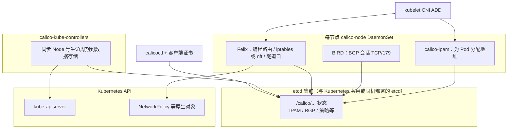

| 组件 | 作用 | 本项目落点 |
|------|------|------------|
| calico-node | 每节点数据面：Felix +（bird 模式下）BGP + CNI/IPAM | DaemonSet；镜像 `brinnatt/calico-node` 等 |
| calico-kube-controllers | 监视 K8s 对象并写入 Calico 数据存储 | Deployment |
| calicoctl | 运维查询 / 策略 / BGP 配置 | 节点 `/usr/local/bin/calicoctl` + `/etc/calico/calicoctl.cfg` |
| 客户端证书 | 访问 etcd | `/etc/calico/ssl/calico.pem`（由 `calico-csr.json.j2` 签发） |

**封装与路由（与 `conf/config.yml` 对应）：**

| 配置项 | 默认 | 含义 |
|--------|------|------|
| `CALICO_NETWORKING_BACKEND` | `bird` | BGP 控制面；可选 `vxlan` / `none` |
| `CALICO_ENABLE_OVERLAY` | `Always` | 映射到 IPIP/VXLAN 池模式：`Always` / `CrossSubnet` / `Never` |
| `IP_AUTODETECTION_METHOD` | `can-reach={{ 首个 kube_master }}` | 选中用于 BGP/隧道的主机 IP |
| `CALICO_RR_ENABLED` | `false` | 大规模可开启 Route Reflector（见下节） |
| `calico_ver` | 由常量渲染，当前 **v3.28.4** | 清单模板 `calico-v3.28.yaml.j2` |

| 模式（概念） | 数据面特征 | 适用 |
|--------------|------------|------|
| 纯 BGP（overlay=`Never`） | 节点间宣告 Pod/网段路由，无额外封装 | 底层路由可达、可接受 BGP |
| IP-in-IP | 接口常为 `tunl0`；**IP 协议号 4**，不是 GRE | 跨子网且需简单封装 |
| VXLAN | 接口常为 `vxlan.calico` | 云上或限制 BGP 的环境 |

如果需要安装 calico，请在 `clusters/xxxx/hosts` 文件中设置变量 `CLUSTER_NETWORK="calico"`。

```bash
$ tree .
.
|-- tasks
|   |-- calico-rr.yml
|   `-- main.yml
|-- templates
|   |-- bgp-default.yaml.j2
|   |-- bgp-rr.yaml.j2
|   |-- calico-csr.json.j2
|   |-- calico-v3.24.yaml.j2
|   |-- calico-v3.26.yaml.j2
|   |-- calico-v3.28.yaml.j2
|   `-- calicoctl.cfg.j2
`-- vars
    `-- main.yml
```

请在另外窗口打开 [roles/calico/tasks/main.yml](../roles/calico/tasks/main.yml) 文件，对照看以下讲解内容。

**创建 calico 证书申请：**

```bash
{
  "CN": "calico",
  "hosts": [],
  "key": {
    "algo": "rsa",
    "size": 2048
  },
  "names": [
    {
      "C": "CN",
      "ST": "HangZhou",
      "L": "XS",
      "O": "k8s",
      "OU": "System"
    }
  ]
}
```

calico 作为客户端连接 etcd，证书申请 hosts 字段可以为空：

- 服务器证书：用于 HTTPS 服务端验证，必须包含服务的域名/IP（如 `etcd-server.local`, `192.168.1.100`），客户端通过验证证书中的 `hosts` 来确认连接的是正确的服务器。
- 客户端证书：用于客户端身份认证，`hosts` 字段通常为空或包含客户端自身的标识。etcd 通过验证证书的 `CN`（Common Name）和 `O`（Organization）字段来识别客户端身份并授权。
- etcd 使用 **TLS 双向认证**：服务端校验客户端证书，客户端校验服务端证书（由 `--trusted-ca-file` / 对等 CA 配置）。Calico 作为 etcd **客户端**时，证书 `hosts` 可为空；身份由 CN/O 等 Subject 字段体现。etcd 自身的用户/权限模型与 Kubernetes RBAC 无关。

Calico 证书使用场景：

- calico/node 组件：运行在每个节点的 `calico-node` 容器访问 etcd 集群时，使用此客户端证书进行身份认证。
- Calico CNI 插件：当节点上的 CNI 插件（二进制文件）需要直接与 etcd 通信来注册 Pod 网络端点时，使用此证书。
- calicoctl 命令行工具：管理员使用 `calicoctl` 管理 Calico 资源（如创建 NetworkPolicy、查看 IP 池）时，需要此证书连接 etcd。
- calico/kube-controllers 控制器：该控制器同步 Kubernetes 资源到 Calico 数据存储时，通过此证书访问 etcd。

> 我们项目的 calico 使用的是 etcd 数据存储模式，也可以使用 **Kubernetes API 数据存储模式**。
>
> Kubernetes API 数据存储模式下 Calico 组件通过 ServiceAccount Token 与 Kubernetes API Server 通信，**不再需要单独的 etcd 客户端证书**。
>
> https://docs.tigera.io/calico/latest/operations/install-apiserver
>
> https://docs.tigera.io/calico/latest/operations/calicoctl/configure/kdd
>
> 说明（与 kubectl apply projectcalico.org/v3）：默认 etcd 存储安装不会在集群里注册 GlobalNetworkPolicy、HostEndpoint 等 CRD，因此 kubectl apply 这类清单会报 no matches for kind，但 calico-node 仍可正常运行。主机侧 Calico 策略请使用 calicoctl（本仓库下发的 /etc/calico/calicoctl.cfg 与证书）。使用 tools/k8stools/CalicoPolicyCli.py 时：所有子命令须显式 `--context`；`plan` / `validate` / `apply` / `delete` 须显式 `--traffic-layer`；Pod 层还须 `-n`；上述定位类参数仅能从命令行传入（脚本不读取对应环境变量，也不使用 kubectl 当前默认 context 代替）。traffic-layer 含 host/both 必须手写 `--executor calicoctl`（本模式）或 `--executor kubectl`（Kubernetes 数据存储且已装 CRD），并手写 `--interface` 或逐节点注解 `kubeauto.calico/host-interface`；脚本不提供 executor 自动推断。预演用 `plan`；calicoctl 路径不支持 `apply --dry-run=server`。详见该脚本 MAINTAINER_DOC 第 0、7、9 节。

**创建 calico DaemonSet yaml 文件和 rbac 文件：**

请对照 [roles/calico/templates/calico-v3.28.yaml.j2](../roles/calico/templates/calico-v3.28.yaml.j2) 文件注释和以下注意内容

- 详细配置参数请参考 [Configuring calico/node](https://docs.tigera.io/calico/latest/reference/configure-calico-node)
- 配置 ETCD_ENDPOINTS 、CA、证书等，所有 `"{{ }}"` 变量与 ansible hosts 文件中设置对应
- 配置集群 POD 网络 CALICO_IPV4POOL_CIDR={{ CLUSTER_CIDR }}
- 配置 FELIX_DEFAULTENDPOINTTOHOSTACTION=ACCEPT 默认允许 Pod 到 Node 的网络流量，更多 [Configuring Felix](https://docs.tigera.io/calico/latest/reference/felix/configuration)

**安装 calico 网络：**

- 节点名须符合 DNS 子域规则且集群内唯一；Calico 节点名与主机名相关，重复会导致 etcd 中配置互相覆盖、BGP 邻居异常。
- 推荐使用库存/`K8S_NODENAME` 固定命名，避免事后改名。
- 安装之前必须确保 `kube_master` 和 `kube_node` 节点已经成功部署
- 删除前面安装 kube_node 时默认的 cni 网络配置，轮询等待 calico 网络插件安装完成

[可选]配置 calicoctl 工具 [calicoctl.cfg.j2](../roles/calico/templates/calicoctl.cfg.j2)

```bash
apiVersion: projectcalico.org/v3
kind: CalicoAPIConfig
metadata:
spec:
  datastoreType: "etcdv3"
  etcdEndpoints: {{ ETCD_ENDPOINTS }}
  etcdKeyFile: /etc/calico/ssl/calico-key.pem
  etcdCertFile: /etc/calico/ssl/calico.pem
  etcdCACertFile: {{ ca_dir }}/ca.pem
```

**验证 calico 网络：**

安装成功后验证如下（镜像须已通过 `kubecli download` 进入 `registry.talkschool.cn:5000`；确认 Pod Running 后再做连通性检查）：

```bash
kubectl get pods -A
NAMESPACE     NAME                                       READY   STATUS    RESTARTS        AGE
kube-system   calico-kube-controllers-5d475c975d-kjmtm   1/1     Running   4 (2m25s ago)   2d17h
kube-system   calico-node-9b8b7                          1/1     Running   3 (2m32s ago)   2d17h
kube-system   calico-node-dsv65                          1/1     Running   3 (2m26s ago)   2d17h
kube-system   calico-node-jmcw2                          1/1     Running   0               18h
kube-system   calico-node-lrhhg                          1/1     Running   3 (2m25s ago)   2d17h
kube-system   calico-node-qx7qd                          1/1     Running   3 (2m36s ago)   2d17h
kube-system   coredns-597f899fbb-srj8q                   1/1     Running   3 (2m26s ago)   2d17h
kube-system   metrics-server-88f86499-8psq5              1/1     Running   4 (2m26s ago)   2d17h
kube-system   node-local-dns-5l7g4                       1/1     Running   3 (2m36s ago)   2d17h
kube-system   node-local-dns-dv64k                       1/1     Running   3 (2m26s ago)   2d17h
kube-system   node-local-dns-rcqlg                       1/1     Running   0               18h
kube-system   node-local-dns-vlf7l                       1/1     Running   3 (2m32s ago)   2d17h
kube-system   node-local-dns-zfvfb                       1/1     Running   3 (2m25s ago)   2d17h
```

**查看网卡和路由信息：**

```bash
kubectl run test --image=busybox -- sleep 3600
```

```bash
ip add show |grep -A 4 cali
10: cali1037a54e65e@if3: <BROADCAST,MULTICAST,UP,LOWER_UP> mtu 1480 qdisc noqueue state UP group default qlen 1000
    link/ether ee:ee:ee:ee:ee:ee brd ff:ff:ff:ff:ff:ff link-netns cni-e1078f04-ae36-2c6e-3536-b6d7831b08f7
    inet6 fe80::ecee:eeff:feee:eeee/64 scope link 
       valid_lft forever preferred_lft forever
```

- 可以看到包含类似 cali1cxxx 的网卡，是 calico 为测试 pod 生成的
- tunl0 网卡现在不用管，是默认生成的，当开启 IPIP 特性时使用的隧道

```bash
# 查看路由
route -n
Kernel IP routing table
Destination     Gateway         Genmask         Flags Metric Ref    Use Iface
0.0.0.0         192.168.110.1   0.0.0.0         UG    100    0        0 ens160
172.20.37.192   0.0.0.0         255.255.255.192 U     0      0        0 *
172.20.37.195   0.0.0.0         255.255.255.255 UH    0      0        0 cali1037a54e65e
172.20.133.128  192.168.110.216 255.255.255.192 UG    0      0        0 tunl0
172.20.171.0    192.168.110.217 255.255.255.192 UG    0      0        0 tunl0
172.20.184.64   192.168.110.214 255.255.255.192 UG    0      0        0 tunl0
172.20.222.0    192.168.110.215 255.255.255.192 UG    0      0        0 tunl0
192.168.110.0   0.0.0.0         255.255.255.0   U     100    0        0 ens160
```

**查看所有 calico 节点状态：**

```bash
calicoctl node status
Calico process is running.

IPv4 BGP status
+-----------------+-------------------+-------+----------+-------------+
|  PEER ADDRESS   |     PEER TYPE     | STATE |  SINCE   |    INFO     |
+-----------------+-------------------+-------+----------+-------------+
| 192.168.110.214 | node-to-node mesh | up    | 08:50:40 | Established |
| 192.168.110.215 | node-to-node mesh | up    | 08:50:40 | Established |
| 192.168.110.217 | node-to-node mesh | up    | 08:50:40 | Established |
| 192.168.110.216 | node-to-node mesh | up    | 08:52:28 | Established |
+-----------------+-------------------+-------+----------+-------------+
```

**BGP 协议是通过 TCP 连接来建立邻居的，因此可以用 netstat 命令验证 BGP Peer**

```bash
netstat -antlp|grep ESTABLISHED|grep 179
tcp        0      0 192.168.110.218:54547   192.168.110.215:179     ESTABLISHED 2262/bird           
tcp        0      0 192.168.110.218:56349   192.168.110.217:179     ESTABLISHED 2262/bird           
tcp        0      0 192.168.110.218:38797   192.168.110.216:179     ESTABLISHED 2262/bird           
tcp        0      0 192.168.110.218:56419   192.168.110.214:179     ESTABLISHED 2262/bird         
```

**查看 etcd 中 calico 相关信息：**

本项目 Calico 使用 **etcdv3** 存储。可在 **etcd 成员节点**上用本机回环客户端口查看（unit 监听 `http://127.0.0.1:2379`；集群广告地址仍为 HTTPS）：

```bash
# 查看 calico 前缀（按现场 ETCDCTL_API / etcdctl 版本）
ETCDCTL_API=3 etcdctl --endpoints="http://127.0.0.1:2379" get --prefix /calico
# 查看 calico网络为各节点分配的网段
ETCDCTL_API=3 etcdctl --endpoints="http://127.0.0.1:2379" get --prefix /calico/ipam/v2/host
```

---

###### 1.3.3.6.1.1、BGP Route Reflectors

`CALICO_NETWORKING_BACKEND=bird` 时，默认启用 **node-to-node mesh**（IBGP 全互联）。节点规模增大后，启用 **BGP Route Reflector（RR）** 可使非 RR 节点主要与 RR 建立 peer，降低 mesh 开销。`conf/config.yml` 建议在约 **50+ 节点**时评估。

| 项 | 说明 |
|----|------|
| 前提 | `CLUSTER_NETWORK=calico`；`calico-node` Running；数据存储为 **etcdv3**（本项目默认，非 KDD） |
| 开关 | `CALICO_RR_ENABLED: true` |
| RR 节点 | `CALICO_RR_NODES: ["<ip>", ...]`；未设则默认全部 `kube_master`（`roles/calico/tasks/calico-rr.yml`） |
| 安装步骤 | `kubecli setup <cluster> 06`（`network`）；勿与 `07` / `cluster-addon` 混淆 |

###### 1.3.3.6.1.2、kubecli 启用 route reflector

```bash
# 1. 编辑 clusters/<cluster>/config.yml
#    CALICO_RR_ENABLED: true
#    # CALICO_RR_NODES: ["10.0.0.11", "10.0.0.12"]
kubecli setup <cluster> 06

# 2. 验证（各节点）
calicoctl node status
# 期望：PEER TYPE 为指向 RR 的 node specific；STATE=Established；mesh 全互联减少
```

###### 1.3.3.6.1.3、手动配置 route reflector

手工步骤见 Tigera：[Configure a node to act as a route reflector](https://docs.tigera.io/calico/latest/networking/configuring/bgp#configure-a-node-to-act-as-a-route-reflector)（`routeReflectorClusterID`、peerSelector、关闭 `nodeToNodeMeshEnabled`）。本项目默认 **etcdv3**，请用节点上 `calicoctl` 操作，勿按 Kubernetes datastore（KDD）流程假设。

##### 1.3.3.6.2、安装 flannel 网络

官方文档：[flannel](https://github.com/flannel-io/flannel) · [Kubernetes 集成说明](https://github.com/flannel-io/flannel/blob/master/Documentation/kubernetes.md)

Flannel 为每个节点分配 Pod 子网，并在节点间建立连通（后端常见 **vxlan** / **host-gw**）。它**不**替代 kube-proxy，也不实现 Kubernetes NetworkPolicy（策略需其他组件）。

###### 工作机制（与本项目路径一致）

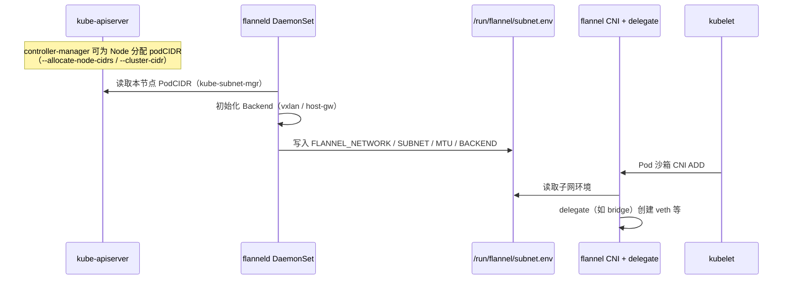

要点：

1. **flanneld** 负责子网与后端设备/路由，**不**直接创建每个 Pod 的 veth。
2. **CNI 配置**（由 ConfigMap 下发到 `/etc/cni/net.d`）中 `type: flannel` 的插件读取 `subnet.env`，再 **delegate** 给 bridge 等插件完成主机侧接口。
3. 本项目通过 apiserver 读取 `podCIDR`（见 [flannel#847](https://github.com/flannel-io/flannel/issues/847)），依赖控制面已正确配置 `CLUSTER_CIDR` / `NODE_CIDR_LEN`。

| 后端 | 行为 | 适用 |
|------|------|------|
| `vxlan`（默认） | 节点间 VXLAN 封装（常见设备 `flannel.1`，UDP 8472） | 跨子网、云网络限制主机路由时 |
| `host-gw` | 仅主机路由，无封装 | 所有节点二层可达时，开销更低 |

###### kubeauto 安装步骤

| 步骤 | 操作 |
|------|------|
| 1 | 库存 `CLUSTER_NETWORK="flannel"` |
| 2 | `conf/config.yml`：`FLANNEL_BACKEND`（默认 `vxlan`）；若 `vxlan` 且同二层可优化，可设 `DIRECT_ROUTING: true`（写入 DirectRouting） |
| 3 | `kubecli download -E flannel`（镜像 `brinnatt/flannel`、`brinnatt/flannel-cni-plugin`，版本见 `v_flannel` / `v_flannel_cni`） |
| 4 | `kubecli setup <cluster> 06` 或一键 `90`/`all` |

角色与模板：`roles/flannel/` · `templates/kube-flannel.yaml.j2`（含 RBAC、ConfigMap `net-conf.json` / `cni-conf.json`、DaemonSet）。

ConfigMap 中 CNI 链示例（与模板一致，无 bandwidth 插件时以仓库为准）：

```json
{
  "name": "cbr0",
  "cniVersion": "0.3.1",
  "plugins": [
    {
      "type": "flannel",
      "delegate": { "hairpinMode": true, "isDefaultGateway": true }
    },
    {
      "type": "portmap",
      "capabilities": { "portMappings": true }
    }
  ]
}
```

`net-conf.json` 中 `Network` 取自 `CLUSTER_CIDR`，`Backend.Type` 取自 `FLANNEL_BACKEND`。

###### 验证
```bash
kubectl get pods -n kube-system -l app=flannel
# 或
kubectl get pods -n kube-system | grep flannel

# 任选一节点
cat /run/flannel/subnet.env
ip -d link show flannel.1 2>/dev/null || true   # vxlan 后端
ip route | head
```

每个节点的 flannel Pod 须为 Running，且 `subnet.env` 中网段属于 `CLUSTER_CIDR`，然后再部署业务负载。

##### 1.3.3.6.3、安装 cilium 网络

官方文档：[Cilium](https://docs.cilium.io/) · 原理见白皮书 [第 9 章](./whitepaper/09-cni-networking.md)。

Cilium 基于 **eBPF** 实现 Pod 连通、NetworkPolicy 与可观测（可选 Hubble）。本项目以 Helm 安装（`roles/cilium/`，chart 随 `download -E cilium` 准备），当前版本 **`v_cilium=v1.19.5`**（Hubble UI 镜像版本见 `v_cilium_hubble_ui`，默认 `v0.13.5`）。内核需大于 4.9。

| 步骤 | 操作 |
|------|------|
| 1 | 库存 `CLUSTER_NETWORK="cilium"` |
| 2 | `kubecli download -E cilium`（`brinnatt/cilium`、`brinnatt/cilium-operator-generic`）；若启用 Hubble：另执行 `kubecli download -E cilium-hubble` |
| 3 | `kubecli setup <cluster> 06` |

**`conf/config.yml` 关键项：**

| 配置项 | 默认 | 含义 |
|--------|------|------|
| `cilium_ver` | 由常量渲染（当前 v1.19.5） | Agent / Operator / Hubble Relay 镜像标签 |
| `cilium_hubble_enabled` | `false` | 启用 Hubble Relay |
| `cilium_hubble_ui_enabled` | `false` | 启用 Hubble UI（依赖 DNS；在 `07` addon 阶段再等待就绪） |
| `cilium_connectivity_check` | `false` | 在 `07` 部署连通性检查工作负载（命名空间 `cilium-test`） |

IPAM 为 cluster-pool，池网段取自 `CLUSTER_CIDR`（见 `roles/cilium/templates/values.yaml.j2`）。启用 NodeLocal DNS 时，values 会排除 `LOCAL_DNS_CACHE` 地址。

**验证：**

```bash
kubectl get pods -n kube-system -l k8s-app=cilium
kubectl -n kube-system get pods | grep -E 'cilium-operator|hubble' || true
cilium status   # 节点已下发 cilium 客户端时
ls /etc/cni/net.d/
```

##### 1.3.3.6.4、安装 kube-router 网络

官方文档：[kube-router](https://www.kube-router.io/) · 原理见白皮书 [第 9 章](./whitepaper/09-cni-networking.md)。

kube-router 提供 Pod 路由（BGP / overlay）、可选 NetworkPolicy 防火墙。本项目 DaemonSet 固定 `--run-service-proxy=false`，Service 数据面仍由 **kube-proxy** 负责，避免双代理冲突。当前版本 **`v_kuberouter=v1.5.4`**。

| 步骤 | 操作 |
|------|------|
| 1 | 库存 `CLUSTER_NETWORK="kube-router"` |
| 2 | `kubecli download -E kube-router`（`brinnatt/kube-router`） |
| 3 | `kubecli setup <cluster> 06` |

**`conf/config.yml` 关键项：**

| 配置项 | 默认 | 含义 |
|--------|------|------|
| `OVERLAY_TYPE` | `full` | overlay 模式（公有云等常需 Always/full；自管环境可按文档改为 `subnet` 等） |
| `FIREWALL_ENABLE` | `true` | 是否启用 NetworkPolicy 防火墙（`--run-firewall`） |
| `kube_router_ver` | 由常量渲染（当前 v1.5.4） | 镜像标签 |

角色与模板：`roles/kube-router/` · `templates/kuberouter.yaml.j2`（命名空间 `kube-system`）。

**验证：**

```bash
kubectl get pods -n kube-system -l k8s-app=kube-router
ls /etc/cni/net.d/
```

##### 1.3.3.6.5、安装 kube-ovn 网络

官方文档：[Kube-OVN](https://kubeovn.github.io/docs/) · 原理见白皮书 [第 9 章](./whitepaper/09-cni-networking.md)。

kube-ovn 基于 OVN/OVS 提供 SDN（逻辑交换机、网关等）。本项目通过 `roles/kube-ovn/templates/install.sh.j2` 安装，当前版本 **`v_kubeovn=v1.11.5`**。角色在安装 CNI **之前**会下发 CoreDNS 与 NodeLocal DNS 清单；因此 `07` addon 阶段若已检测到 `coredns` Pod，将跳过重复安装。

| 步骤 | 操作 |
|------|------|
| 1 | 库存 `CLUSTER_NETWORK="kube-ovn"` |
| 2 | `kubecli download -E kube-ovn`（`brinnatt/kube-ovn`） |
| 3 | `kubecli setup <cluster> 06` |

**`conf/config.yml` 关键项：**

| 配置项 | 默认 | 含义 |
|--------|------|------|
| `kube_ovn_ver` | 由常量渲染（当前 v1.11.5） | 镜像标签 |

**验证：**

```bash
kubectl get pods -n kube-system | grep -E 'kube-ovn|ovs|ovn'
kubectl get pods -n kube-system -l app=kube-ovn-cni
ls /etc/cni/net.d/
```

#### 1.3.3.7、集成插件

> **原理与实现详解：** 见技术白皮书 [第 12 章插件与监控](./whitepaper/12-addons-observability.md)。

`roles/cluster-addon` 在步骤 `07` / `cluster-addon`（`playbooks/07.cluster-addon.yml`）按 `config.yml` 开关安装。镜像统一为 `brinnatt/<name>:<tag>`，节点侧拉取路径为 `registry.talkschool.cn:5000/brinnatt/...`。默认镜像集用 `kubecli download -X`；可选组件用 `kubecli download -E <component>`（合法组件名见 `common/constants.py` 的 `component_images`）。

##### 1.3.3.7.1、DNS

集群 DNS 为 Pod 提供 Service / Pod 相关域名解析。当前推荐实现为 **CoreDNS**（集群内 Service 名通常仍为 `kube-dns`）。官方说明：[DNS for Services and Pods](https://kubernetes.io/docs/concepts/services-networking/dns-pod-service/)。

**NodeLocal DNSCache**（官方：[Using NodeLocal DNSCache](https://kubernetes.io/docs/tasks/administer-cluster/nodelocaldns/)）以 DaemonSet 在每个节点运行本地 DNS 缓存。kubeauto 默认 `dns_install: "yes"` 且 `ENABLE_LOCAL_DNS_CACHE: true`：启用后 kubelet `clusterDNS` 指向 **`169.254.20.10`**（`LOCAL_DNS_CACHE`）。

**部署：** `kubecli setup <cluster> 07`（或 `cluster-addon`）。模板：`roles/cluster-addon/templates/dns/`。选用 `kube-ovn` 时 DNS 已在步骤 `06` 预装，addon 会按现有 Pod 跳过重复创建。

**验证：**

```bash
kubectl get pods -n kube-system -l k8s-app=kube-dns
kubectl get pods -n kube-system | grep -E 'node-local-dns|nodelocaldns' || true
kubectl get svc -n kube-system kube-dns
kubectl create deployment dns-nginx --image=nginx --replicas=1
kubectl expose deployment dns-nginx --port=80 --name=dns-nginx
kubectl run dns-test --rm -it --restart=Never --image=busybox:1.28 -- \
  nslookup dns-nginx.default.svc.cluster.local
```

启用 NodeLocal 时，业务 Pod 内 `/etc/resolv.conf` 的 nameserver 常见为 `169.254.20.10`。外部域名由 CoreDNS forward 至上游。验证建议使用 `busybox:1.28` 或 `dnsutils`（部分 busybox 自带 `nslookup` 存在缺陷）。

##### 1.3.3.7.2、metrics-server

实现聚合 API `metrics.k8s.io`，支撑 `kubectl top` 与基于资源指标的 HPA。镜像属于 **默认镜像集**（`-X` / `-D` 内含），无需单独 `-E`。

| 项 | 值 |
|----|-----|
| 开关 | `metricsserver_install`（默认 `"yes"`） |
| 版本 | `metricsVer` / `v_metricsserver`（当前 `v0.8.0`） |
| 命名空间 | `kube-system` |
| 模板 | `roles/cluster-addon/templates/metrics-server/components.yaml.j2` |
| 下载 | `kubecli download -X`（含 `brinnatt/metrics-server`） |
| 安装 | `kubecli setup <cluster> 07` |

```bash
kubectl get apiservice v1beta1.metrics.k8s.io
kubectl top nodes
kubectl top pods -A
```

##### 1.3.3.7.3、Kubernetes Dashboard

| 项 | 值 |
|----|-----|
| 开关 | `dashboard_install`（默认 `"no"`） |
| 版本 | `dashboardVer`（chart `kubernetes-dashboard-*.tgz`） |
| 命名空间 | `kube-system`（Helm release `kubernetes-dashboard`） |
| 下载 | `kubecli download -E dashboard` |
| 安装 | 置 `"yes"` 后 `kubecli setup <cluster> 07` |

含 Kong 前置代理及 admin-user / read-user RBAC 模板。生产环境须限制暴露面并轮换高权限令牌。详见白皮书第 12 章。

```bash
kubectl get pods -n kube-system | grep -E 'dashboard|kong'
```

##### 1.3.3.7.4、Prometheus（kube-prometheus-stack）

| 项 | 值 |
|----|-----|
| 开关 | `prom_install`（默认 `"no"`） |
| 命名空间 | `prom_namespace`（默认 `monitor`） |
| 存储类 | `prom_storage_class`（生产必须设置为已验证的 StorageClass；实验环境可使用 `local-path`） |
| Chart | `prom_chart_ver`（当前 `88.0.0`） |
| 高可用 | Prometheus 2 副本、Alertmanager 3 副本、admission webhook 2 副本；PDB + 硬反亲和 |
| 主要镜像 | Prometheus `v3.13.1-distroless`、Alertmanager `v0.33.1`、Grafana `13.1.1`、Operator `v0.93.0` |
| 下载 | `kubecli download -E prometheus`；可选钉钉 webhook：`-E prometheus-dingtalk` |
| 安装 | 置 `"yes"` 后 `kubecli setup <cluster> 07` |

角色会为 etcd 抓取签发客户端证书 Secret（`monitor/etcd-client-cert`），并在首次安装时创建 `monitor/grafana-admin`，其管理员口令为随机值且重复执行不会轮换。启用持久化前须先安装并验证 StorageClass；六个有状态副本合计需要六个 RWO PVC。资源消耗较大，须在已配置 Node Allocatable 的充足节点上启用。

```bash
kubectl get pods,pvc,pdb -n monitor -o wide
kubectl -n monitor get secret grafana-admin \
  -o jsonpath='{.data.admin-password}' | base64 -d; echo

# API 验收建议通过受控端口转发执行，不要长期暴露管理接口
kubectl -n monitor port-forward svc/prometheus-operated 9090:9090
curl -fsS http://127.0.0.1:9090/api/v1/targets | jq \
  '[.data.activeTargets[] | select(.health != "up" or .lastError != "")]'
curl -fsS http://127.0.0.1:9090/api/v1/rules | jq \
  '[.data.groups[].rules[] | select(.health != "ok" or .lastError != "")]'
```

以上两个 `jq` 结果均应为空数组。升级前必须备份 values 与 Grafana/Prometheus 数据，使用 Helm history 记录当前 revision；受控升级后验证 Targets、Rules、Grafana 数据源及告警触发/恢复，失败时回滚到上一 `deployed` revision。不得通过删除 PVC 处理升级失败。

**Prometheus 可选扩展（默认全部关闭）**

| 能力 | 开关 | 依赖与入口 |
|---|---|---|
| Thanos Querier/Sidecar | `prom_thanos_install` | 依赖 `prom_install: "yes"`；Querier Service `thanos-querier`；对象存储凭据由 `prom_thanos_objectstorage_secret` 指向 Secret |
| prometheus-adapter | `prom_adapter_install` | 依赖核心栈；注册 `custom.metrics.k8s.io`；可用 `prom_adapter_prometheus_url` 指向 Thanos Querier |
| blackbox-exporter | `prom_blackbox_install` | 依赖核心栈；创建 exporter Service；Probe 目标必须由用户显式提交 |

扩展使用固定本地 Chart/镜像并纳入同一回归分路，不会因测试自动启用。显式卸载前将 `prom_optional_uninstall: "yes"` 执行一次 setup，完成后恢复 `"no"`；PVC 默认保留。详见 `docs/middleware/prometheus/operations-manual.md`。

##### 1.3.3.7.5、ingress-nginx

| 项 | 值 |
|----|-----|
| 开关 | `ingress_nginx_install`（默认 `"no"`） |
| 命名空间 | `ingress_nginx_namespace`（默认 `ingress-nginx`） |
| 调度 | 节点需标签 `ingress-controller/provider=ingress-nginx` |
| 指标 | `ingress_nginx_metrics_enabled`（默认 `true`；建议先装 Prometheus） |
| 下载 | `kubecli download -E ingress-nginx` |
| 安装 | 置 `"yes"` 后 `kubecli setup <cluster> 07` |

```bash
kubectl label node <node> ingress-controller/provider=ingress-nginx --overwrite
kubectl get pods -n ingress-nginx
```

ex-lb 可将 80/443 转发至 Ingress NodePort（见 `INGRESS_NODEPORT_LB` / `INGRESS_TLS_NODEPORT_LB`）。

##### 1.3.3.7.6、存储供给

| 组件 | 开关（默认均 `"no"`） | 命名空间 / 要点 | `-E` |
|------|----------------------|-----------------|------|
| local-path-provisioner | `local_path_provisioner_install` | StorageClass `local_path_storage_class`（默认 `local-path`）；数据目录 `local_path_provisioner_dir` | `local-path-provisioner` |
| NFS provisioner | `nfs_provisioner_install` | 命名空间 `nfs_provisioner_namespace`（默认 `kube-system`）；须配置 `nfs_server` / `nfs_path` | `nfs-provisioner` |
| OpenEBS | `openebs_install` | 命名空间 `openebs_namespace`（默认 `openebs`）；`openebs_lvm_enabled` 控制是否装 LVM CSI | `openebs` |

安装：对应开关置 `"yes"` → `download -E` → `kubecli setup <cluster> 07`。

```bash
kubectl get sc
kubectl get pods -n openebs   # OpenEBS 时
```

##### 1.3.3.7.7、MinIO

| 项 | 值 |
|----|-----|
| 开关 | `minio_install`（默认 `"no"`） |
| Operator / Tenant 命名空间 | Operator 固定 `minio-operator`；Tenant 为 `minio_namespace`（默认 `minio`） |
| 存储类 | `minio_storage_class`（默认倾向 OpenEBS LVM SC） |
| 池规模 | `minio_pool_servers`（默认 4）、`minio_pool_size` |
| 凭据 | `minio_root_user` / `minio_root_password`（交付后须轮换） |
| 下载 | `kubecli download -E minio` |
| 安装 | 置 `"yes"` 后 `kubecli setup <cluster> 07`（须先有可用 StorageClass） |

```bash
kubectl get pods -n minio-operator
kubectl get pods -n minio
```

##### 1.3.3.7.8、其他可选组件（概要）

| 组件 | 开关 | `-E` | 说明 |
|------|------|------|------|
| Nacos | `nacos_install` | `nacos` | 命名空间 `nacos`；需外部 MySQL |
| RocketMQ | `rocketmq_install` | `rocketmq` | 命名空间 `rocketmq` |
| network-check | `network_check_enabled` | `network-check` | 非 Cilium 时的连通性 CronJob（NS `network-test`） |

完整镜像与版本钉扎见 `common/constants.py` 的 `component_images` 与白皮书第 12 章。

local-path/NFS 的容量与删除边界、Nacos 外部 MySQL/强反亲和、RocketMQ Operator 异步协调与消息数据面验收见白皮书[第 17 章](./whitepaper/17-storage-middleware-addons.md)。以下终态是最低要求：

```bash
# local-path / NFS：必须创建 PVC + Pod 做写、读、重建和回收
kubectl get sc,pv,pvc
kubectl describe pvc <pvc>

# Nacos：对象/PVC 全部 Ready 后，还要做配置发布与跨客户端读取
kubectl -n nacos get sts,pod,pvc,svc -o wide
kubectl -n nacos logs <nacos-pod> -c nacos --tail=200

# RocketMQ：等待异步 CR 协调完成，再做 topic + 生产/消费验收
kubectl -n rocketmq get broker,nameservice,console
kubectl -n rocketmq get pod,pvc,svc -o wide
kubectl -n rocketmq logs deploy/rocketmq-operator --tail=200
```

Nacos `nacos_replicas: 3` 使用跨主机强反亲和，需要至少 3 个合格节点；RocketMQ 默认 `rocketmq_replica_per_group: 0` 只有 master，不能写成消息副本 HA。NFS provisioner 不会安装 NFS server，安装前必须先从每个工作节点验证 export 可挂载和可写。

### 1.3.4、OpenEBS 生产运维

本节是 kubeauto 的 OpenEBS 现场 SOP。架构、两种 StorageClass 的原理与能力边界见白皮书[第 16 章](./whitepaper/16-storage-openebs.md)。

#### 1.3.4.1、先选模式，再改开关

| 现场条件 | 配置 | 可用 StorageClass |
|----------|------|-------------------|
| 没有独立数据盘/VG，只需节点目录型本地卷 | `openebs_install: "yes"`、`openebs_lvm_enabled: "no"` | `openebs-hostpath` |
| 所有存储节点已准备同名 VG | 两项都设 `"yes"` | `openebs-hostpath`、`openebs-lvmpv` |
| 只有部分节点有 VG | 两项都设 `"yes"`，并另外创建带 `allowedTopologies` 的 LVM SC | Hostpath + 自定义拓扑 LVM SC |
| 需要跨节点 RWX 或存储自身多副本 | 不把本项目 Hostpath/LVM 当成该能力 | 使用 NFS、外部阵列或已评审的复制型存储 |

注意：`openebs_install: "no"` 时，`openebs_lvm_enabled` 的值不生效。`openebs_lvm_enabled: "yes"` 只安装驱动，不创建磁盘分区、PV 或 VG。

编辑的是目标集群副本，不是模板：

```bash
vi /usr/local/kubeauto/clusters/<cluster>/config.yml
```

Hostpath-only 示例：

```yaml
openebs_install: "yes"
openebs_ver: "4.3.2"
openebs_namespace: "openebs"
openebs_hostpath: "/var/openebs/local"
openebs_hostpath_storage_class: "openebs-hostpath"
openebs_lvm_enabled: "no"
```

Hostpath + LVM 示例：

```yaml
openebs_install: "yes"
openebs_ver: "4.3.2"
openebs_namespace: "openebs"
openebs_hostpath: "/var/openebs/local"
openebs_hostpath_storage_class: "openebs-hostpath"
openebs_lvm_storage_class: "openebs-lvmpv"
openebs_lvm_vg: "vg_k8s"
openebs_lvm_enabled: "yes"
```

#### 1.3.4.2、节点与磁盘前置检查

对每个允许承载 LVM 业务的节点执行检查。生产不得直接运行实验室的 loop-device helper。

```bash
# 软件与内核能力
command -v lvm
lsmod | grep -E 'dm_snapshot|dm_thin_pool'

# 盘、挂载、签名和现有 LVM 关系
lsblk -o NAME,TYPE,SIZE,FSTYPE,MOUNTPOINTS,MODEL,SERIAL
pvs
vgs
lvs -a -o+devices,seg_monitor,data_percent,metadata_percent
```

kubeauto 的 prepare 角色会安装 LVM2，并加载 `dm_snapshot`、`dm_thin_pool`。若模块检查失败，先排查当前内核是否提供对应模块，不能跳过后继续安装。

若要新建 VG，必须先由客户确认专用数据盘、备份状态和销毁授权。下面只展示 LVM 官方命令形态，`<approved-device>` 必须替换为已核准且不含现有数据的明确设备：

```bash
# 高危：pvcreate 会写入设备元数据；确认设备后才可执行
sudo pvcreate <approved-device>
sudo vgcreate vg_k8s <approved-device>

# 已有 vg_k8s 扩入新盘时使用 vgextend，而不是再次 vgcreate
# sudo pvcreate <approved-new-device>
# sudo vgextend vg_k8s <approved-new-device>
```

每台存储节点验收：

```bash
sudo vgs vg_k8s -o vg_name,vg_size,vg_free,pv_count,lv_count
sudo lvs -a vg_k8s -o lv_name,lv_size,segtype,data_percent,metadata_percent,seg_monitor
```

禁止事项：

- 不对系统盘、已挂载文件系统、容器运行时目录所在盘执行 `pvcreate`。
- 不用 loop 文件作为客户生产 VG。
- 不把不同性能/可靠性等级的磁盘混入同一 VG 后仍宣称具有单一性能等级。
- 不在没有备份和恢复演练时删除 PVC、LV、VG 或 PV。

#### 1.3.4.3、下载与安装

```bash
cd /usr/local/kubeauto
kubecli download -E openebs
kubecli setup <cluster> 07
```

安装任务使用仓库内 `openebs-4.3.2.tgz`，并从本地 Registry 拉取项目钉扎镜像。安装后先查 Helm 和组件，而不是直接创建业务：

```bash
export KUBECONFIG=/usr/local/kubeauto/clusters/<cluster>/kubectl.kubeconfig

helm -n openebs list
kubectl -n openebs get deploy,ds,pod -o wide
kubectl get sc openebs-hostpath -o yaml
```

启用 LVM 时继续检查：

```bash
kubectl get sc openebs-lvmpv -o yaml
kubectl -n openebs get lvmnodes.local.openebs.io
kubectl -n openebs get lvmnodes.local.openebs.io -o yaml
kubectl get csidriver local.csi.openebs.io
kubectl get csistoragecapacity -A
```

验收要点：

- Hostpath SC provisioner 为 `openebs.io/local`。
- LVM SC provisioner 为 `local.csi.openebs.io`，`volumeBindingMode` 为 `WaitForFirstConsumer`。
- `LVMNode` 中目标节点上报 `vg_k8s` 与非零空闲容量。
- Controller `5/5` Ready；LVM node DaemonSet 在预期节点 Ready。
- “Pod Ready”不能代替后续真实读写验收。

#### 1.3.4.4、Hostpath PVC 读写验收

```yaml
apiVersion: v1
kind: PersistentVolumeClaim
metadata:
  name: openebs-hostpath-smoke
spec:
  accessModes: ["ReadWriteOnce"]
  storageClassName: openebs-hostpath
  resources:
    requests:
      storage: 1Gi
---
apiVersion: v1
kind: Pod
metadata:
  name: openebs-hostpath-smoke
spec:
  restartPolicy: Never
  containers:
    - name: writer
      image: registry.talkschool.cn:5000/brinnatt/linux-utils:4.2.0
      command: ["sh", "-c", "echo hostpath-ok > /data/probe && cat /data/probe && sleep 3600"]
      volumeMounts:
        - name: data
          mountPath: /data
  volumes:
    - name: data
      persistentVolumeClaim:
        claimName: openebs-hostpath-smoke
```

将清单保存到受控临时文件后应用，并验证：

```bash
kubectl apply -f <hostpath-smoke-yaml>
kubectl wait --for=condition=Ready pod/openebs-hostpath-smoke --timeout=180s
kubectl get pvc,pv
kubectl exec openebs-hostpath-smoke -- cat /data/probe
kubectl get pv "$(kubectl get pvc openebs-hostpath-smoke -o jsonpath='{.spec.volumeName}')" -o yaml
```

预期输出包含 `hostpath-ok`，PV 有目标节点亲和性。删除 Pod 再以同一 PVC 重建，数据仍应存在。

Hostpath 容量检查必须到 PV 所在节点查看 `openebs_hostpath` 所在文件系统：

```bash
df -hT /var/openebs/local
df -ih /var/openebs/local
```

当前项目未配置 Hostpath XFS project quota，PVC 的 `1Gi` 不是目录写入硬上限。必须以文件系统容量和 inode 监控防止多个 PVC 互相挤占。

#### 1.3.4.5、LVM PVC 读写验收

```yaml
apiVersion: v1
kind: PersistentVolumeClaim
metadata:
  name: openebs-lvm-smoke
spec:
  accessModes: ["ReadWriteOnce"]
  storageClassName: openebs-lvmpv
  resources:
    requests:
      storage: 1Gi
---
apiVersion: v1
kind: Pod
metadata:
  name: openebs-lvm-smoke
spec:
  restartPolicy: Never
  containers:
    - name: writer
      image: registry.talkschool.cn:5000/brinnatt/linux-utils:4.2.0
      command: ["sh", "-c", "echo lvm-ok > /data/probe && sync && cat /data/probe && sleep 3600"]
      volumeMounts:
        - name: data
          mountPath: /data
  volumes:
    - name: data
      persistentVolumeClaim:
        claimName: openebs-lvm-smoke
```

```bash
kubectl apply -f <lvm-smoke-yaml>
kubectl wait --for=condition=Ready pod/openebs-lvm-smoke --timeout=300s
kubectl get pvc openebs-lvm-smoke -o wide
kubectl get pod openebs-lvm-smoke -o wide
kubectl exec openebs-lvm-smoke -- cat /data/probe
kubectl -n openebs get lvmvolumes.local.openebs.io -o wide
```

在 Pod 所在节点确认 LV 与 thin pool：

```bash
sudo lvs -a vg_k8s -o lv_name,lv_size,pool_lv,segtype,data_percent,metadata_percent,seg_monitor
sudo vgs vg_k8s -o vg_name,vg_size,vg_free
```

预期：PVC `Bound`，读回 `lvm-ok`，`LVMVolume` Ready，`vg_k8s` 中存在对应 PVC LV。仅看到 `openebs-lvmpv` SC 或 LVM Pod Running 均不算通过。

#### 1.3.4.6、只有部分节点提供 LVM

当前默认 `openebs-lvmpv` 没有启用 `allowedTopologies`。官方 v1.7.0 要求 VG 只存在于部分节点时显式声明拓扑。先获取准确节点名：

```bash
kubectl get nodes -o custom-columns=NAME:.metadata.name
```

创建新的、名称不同的 SC；只列出已验证存在 `vg_k8s` 的节点：

```yaml
apiVersion: storage.k8s.io/v1
kind: StorageClass
metadata:
  name: openebs-lvmpv-topology
allowVolumeExpansion: true
parameters:
  fsType: ext4
  storage: "lvm"
  thinProvision: "yes"
  volgroup: "vg_k8s"
provisioner: local.csi.openebs.io
reclaimPolicy: Delete
volumeBindingMode: WaitForFirstConsumer
allowedTopologies:
  - matchLabelExpressions:
      - key: kubernetes.io/hostname
        values:
          - <storage-node-1>
          - <storage-node-2>
```

```bash
kubectl apply -f <topology-storageclass-yaml>
kubectl get sc openebs-lvmpv-topology -o yaml
```

业务 PVC 必须显式使用 `openebs-lvmpv-topology`。再做两个负向验证：

1. Pod 强制到允许节点时，PVC 能 Bound 并读写。
2. Pod 强制到未列入 topology 的节点时，应保持不可调度，而不是创建错误位置的卷。

不要把两个 SC 同时标记为默认。节点扩容时，必须先准备 VG、检查 `LVMNode` 容量，再更新 topology，最后允许业务调度。

#### 1.3.4.7、PVC Pending 故障树

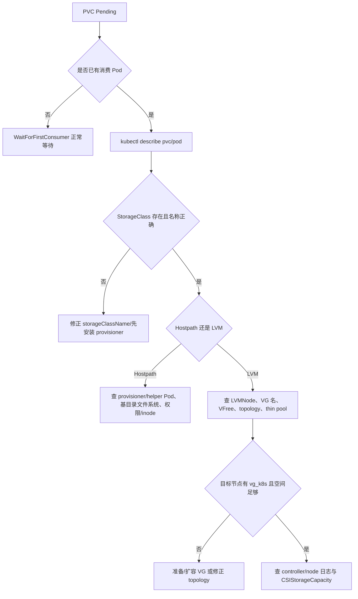

固定诊断命令：

```bash
kubectl describe pvc <pvc>
kubectl describe pod <pod>
kubectl get events -A --sort-by=.lastTimestamp | tail -n 100
kubectl -n openebs get pod -o wide
kubectl -n openebs logs deploy/openebs-lvm-localpv-controller -c openebs-lvm-plugin --tail=200
kubectl -n openebs get lvmnodes.local.openebs.io -o yaml
kubectl get csistoragecapacity -A -o yaml
```

部署名/容器名以 `kubectl -n openebs get deploy` 的现场输出为准。常见分类：

| 现象 | 根因方向 | 处理 |
|------|----------|------|
| PVC Pending，无 Pod | WFFC 正常行为 | 创建真正消费者后再判断 |
| `storageclass ... not found` | 名称或安装顺序 | 修正 PVC/先安装 SC |
| scheduler 选不到节点 | VG 不存在、无空间、topology 冲突 | 查 LVMNode/VG/Pod 亲和性 |
| `InsufficientCapacity` | VG/thin pool 容量不足 | 扩容后确认容量对象刷新 |
| `FailedMount` | node plugin、kubelet 路径、文件系统或设备错误 | 查 Pod 事件和目标节点日志 |
| Hostpath helper 失败 | 基目录权限、只读 FS、磁盘/inode 满 | 修复节点文件系统，不要反复重建 PVC |

#### 1.3.4.8、thin pool 容量与扩容

项目 LVM SC 默认 `thinProvision: "yes"`，所有同一 VG 的 thin PVC 共用 `vg_k8s_thinpool`。巡检：

```bash
sudo lvs -a vg_k8s -o lv_name,lv_size,pool_lv,segtype,data_percent,metadata_percent,seg_monitor
sudo vgs vg_k8s -o vg_name,vg_size,vg_free
```

`Data%` 是数据块占用，`Meta%` 是映射元数据占用，任一接近 100% 都是故障风险。扩容前先确认 VG 有足够 `VFree`：

```bash
# 示例：从 VG 空闲 extents 向现有 thin pool 增加已评审容量
sudo lvextend -L +<approved-size> vg_k8s/vg_k8s_thinpool
sudo lvs -a vg_k8s -o lv_name,lv_size,data_percent,metadata_percent,seg_monitor
```

不要照抄固定 `+190G`；扩多少由真实写入增长、保留余量和 VG 空闲容量决定。若启用 LVM autoextend，还必须验证 thin pool 已监控：

```bash
sudo lvchange --monitor y vg_k8s/vg_k8s_thinpool
sudo lvs -a vg_k8s -o lv_name,seg_monitor,data_percent,metadata_percent
sudo grep -E '^\s*thin_pool_autoextend_(threshold|percent)' /etc/lvm/lvm.conf
```

自动扩容仍受 VG `VFree` 限制，不能替代物理容量告警。

扩大单个 PVC：

```bash
kubectl patch pvc <pvc> -p '{"spec":{"resources":{"requests":{"storage":"<new-size>"}}}}'
kubectl describe pvc <pvc>
```

只支持增大，不支持缩小。扩容后必须在业务 Pod 内验证文件系统容量与读写；不要只看 PVC spec。

#### 1.3.4.9、备份、删除与卸载

etcd 备份不包含卷数据。交付备份至少包含：

- 应用一致性数据备份；
- PV/PVC/SC 和工作负载清单；
- PV 到节点、目录或 LV 的映射；
- VG、thin pool 和节点磁盘清单；
- 在隔离环境执行过的恢复记录。

当前 SC `reclaimPolicy: Delete`。删除 PVC 会触发删除后端目录或 LV。清理 smoke 资源前先确认它们不是业务资源：

```bash
kubectl delete pod openebs-hostpath-smoke openebs-lvm-smoke --ignore-not-found
kubectl delete pvc openebs-hostpath-smoke openebs-lvm-smoke --ignore-not-found
kubectl get pv
kubectl -n openebs get lvmvolumes.local.openebs.io
```

卸载 OpenEBS 前必须先迁移/删除所有使用它的 PVC，并核对 Retain/Delete 结果。仅卸载 Helm release 不等于业务数据已安全迁移，也不应直接手工删除未知 LV 或 Hostpath 目录。

#### 1.3.4.10、现场签收表

| # | 检查 | 通过证据 |
|---|------|----------|
| 1 | 模式与业务需求一致 | 选型记录明确本地卷不自带副本/RWX |
| 2 | 版本与镜像一致 | chart 4.3.2、Hostpath 4.3.0、LVM 1.7.0 |
| 3 | 节点前置条件 | LVM2、内核模块、磁盘/VG 清单 |
| 4 | 部分节点模型 | SC `allowedTopologies` 与 VG 节点一致 |
| 5 | Hostpath 数据面 | PVC Bound、写入/读取、Pod 重建持久 |
| 6 | LVM 数据面 | PVC Bound、LVMVolume Ready、LV 存在、写入/读取 |
| 7 | 容量保护 | 文件系统、VG、thin pool 告警规则与责任人 |
| 8 | 故障边界 | 节点不可用演练结果符合本地卷设计 |
| 9 | 备份恢复 | 业务一致性备份与恢复演练通过 |
| 10 | 删除回收 | 测试卷清理符合 `Delete`，无错误 LV/目录残留 |

## 1.4、制品下载与离线分发

控制节点需具备 Docker，用于拉取镜像并推送到本地仓库。命令与参数以实现为准：`controller/cluster/cli.py` → `service/cluster/downloader.py`。

| 选项 | 含义 |
|------|------|
| `-D` / `--all` | 下载全部默认组件：Docker、Ansible、K8s 二进制、extra-bin、kubeauto 及默认镜像集 |
| `-d` / `--docker` | 仅 Docker（可选版本） |
| `-a` / `--ansible` | Ansible |
| `-k` / `--k8s-bin` | Kubernetes 二进制包 |
| `-e` / `--ext-bin` | 额外二进制（helm、cfssl、cilium 客户端等） |
| `-z` / `--kubeauto` | kubeauto 运行时包 |
| `-R` / `--harbor` | Harbor 离线安装包 |
| `-X` / `--default-images` | 默认镜像：pause、coredns、k8s-dns-node-cache、metrics-server、calico-\* |
| `-E` / `--ext-images` `<COMPONENT>` | 额外组件镜像；合法名含：`cilium`、`cilium-hubble`、`flannel`、`kube-router`、`kube-ovn`、`dashboard`、`prometheus`、`prometheus-dingtalk`、`ingress-nginx`、`minio`、`openebs`、`local-path-provisioner`、`nfs-provisioner`、`nacos`、`rocketmq`、`network-check` 等 |

```bash
kubecli download -D
kubecli download -X
kubecli download -E flannel
kubecli download -E prometheus
```

拉取顺序（`brinnatt/*`）：优先 `hub.talkedu.cn/kubeauto/<name>:<tag>`，失败再回落 Docker Hub `brinnatt/<name>:<tag>`。节点侧通过 `registry.talkschool.cn:5000` 拉取（需在 `/etc/hosts` 或 DNS 指向控制节点，并配置 insecure registry）。

## 1.5、集群生命周期

步骤与 playbook 映射以实现为准：`service/cluster/manager.py` 中 `_PLAYBOOK_MAP_SETUP` / `_PLAYBOOK_MAP_CLUSTER_COMMAND` / `_PLAYBOOK_MAP_ADD_NODE` / `_PLAYBOOK_MAP_REMOVE_NODE`。

**安装步骤（`kubecli setup <cluster> <step>`）：**

| 步骤 | 别名 | Playbook |
|------|------|----------|
| `01` | `prepare` | `01.prepare.yml` |
| `02` | `etcd` | `02.etcd.yml` |
| `03` | `container-runtime` | `03.runtime.yml` |
| `04` | `kube-master` | `04.kube-master.yml` |
| `05` | `kube-node` | `05.kube-node.yml` |
| `06` | `network` | `06.network.yml` |
| `07` | `cluster-addon` | `07.cluster-addon.yml` |
| `90` | `all` | `90.setup.yml` |
| `10` | `ex-lb` | `10.ex-lb.yml` |
| `11` | `harbor` | `11.harbor.yml` |

**运维命令：**

| 操作 | 命令 | Playbook |
|------|------|----------|
| 启动 / 停止 | `kubecli start` / `stop` `<cluster>` | `91.start.yml` / `92.stop.yml` |
| 备份 / 恢复 | `kubecli backup` / `restore` `<cluster>` | `94.backup.yml` / `95.restore.yml` |
| 升级 | `kubecli upgrade` `<cluster>` | `93.upgrade.yml` |
| 证书轮换 | `kubecli kca-renew` `<cluster>` | `96.update-certs.yml` |
| 销毁 | `kubecli destroy` `<cluster>` | `99.clean.yml` |
| 一键全量安装 | `kubecli setup <cluster> 90` 或 `all` | `90.setup.yml` |

**扩缩容：**

| 操作 | 命令 | Playbook |
|------|------|----------|
| 加 etcd / master / node | `kubecli add-etcd` / `add-master` / `add-node` `<cluster> <ip...>` | `21.addetcd.yml` / `23.addmaster.yml` / `22.addnode.yml` |
| 删 etcd / master / node | `kubecli del-etcd` / `del-master` / `del-node` `<cluster> <ip...>` | `31.deletcd.yml` / `33.delmaster.yml` / `32.delnode.yml` |

切换当前操作集群：

```bash
kubecli list
kubecli checkout <cluster>
```

用户 kubeconfig 管理见 `kubecli kcfg-adm`（非 playbook 生命周期步骤）。

## 1.6、验收建议

1. `kubectl get nodes` 全部 Ready；`kube-system`（及所选 CNI / addon 命名空间）系统 Pod Running。
2. 已启用 metrics-server 时：`kubectl top nodes` 有输出；APIService `v1beta1.metrics.k8s.io` Available。
3. Node Allocatable：见 §1.1.4.7，或执行 `bash tests/helpers/verify-node-reserved.sh clusters/<cluster>/kubectl.kubeconfig`。
4. 业务与插件镜像应来自 `registry.talkschool.cn:5000/brinnatt/...`；非默认 CNI / 可选 addon 须已执行对应 `download -E`。
5. 企业级矩阵见 `tests/enterprise-test-matrix.yaml`（交付回归参考）。

---

**文档修订说明：** 本节由早期 README 运维内容整理而来，已按当前默认版本（Kubernetes v1.33.6）、CRI（containerd / docker+cri-dockerd）、CNI 五选一与 Node Allocatable 默认策略校准。架构与六仓协同详见技术白皮书与开发手册。
