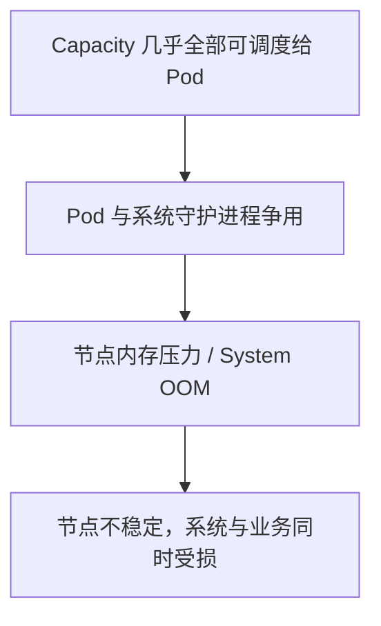
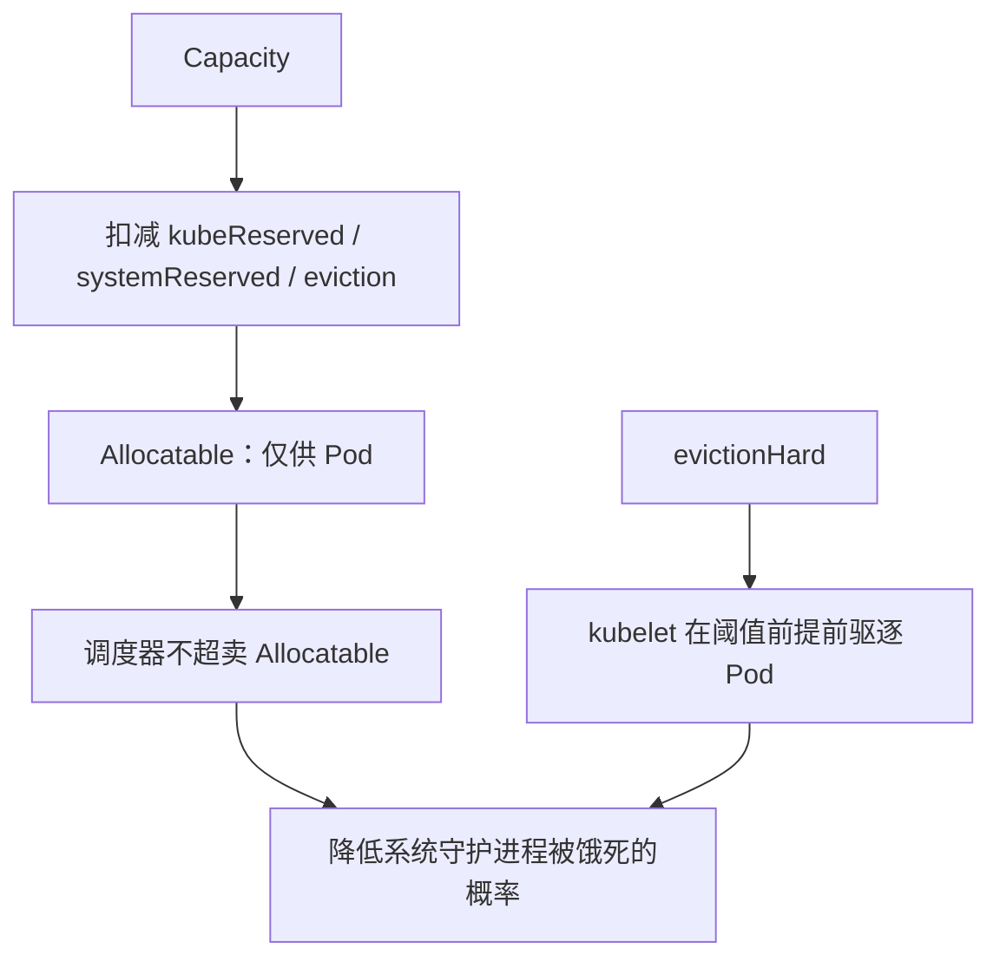
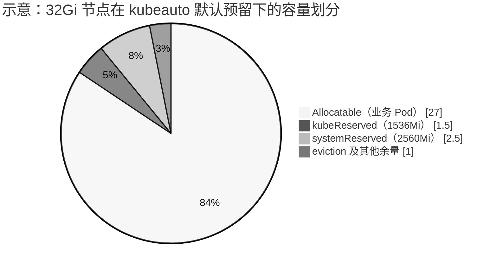
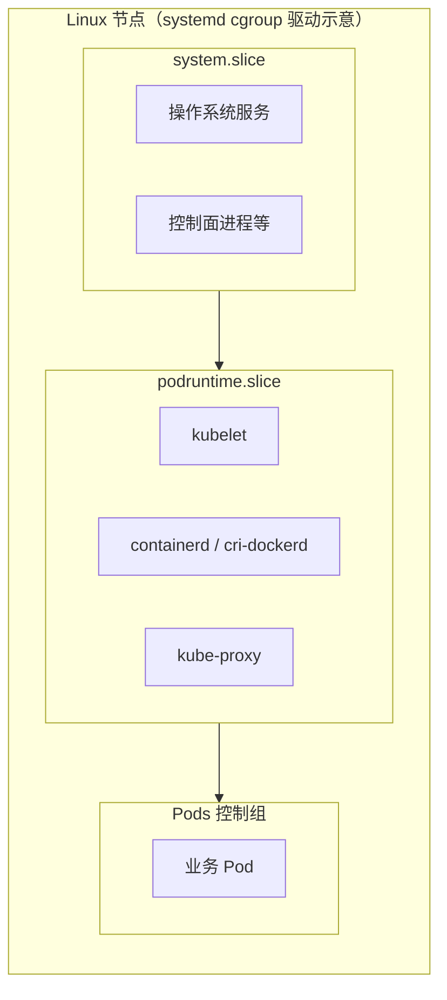
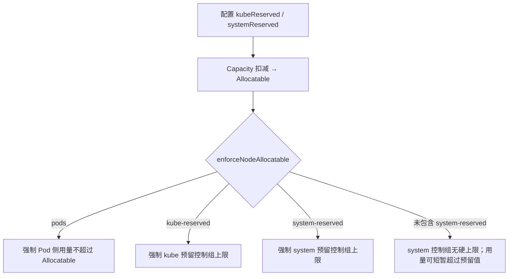
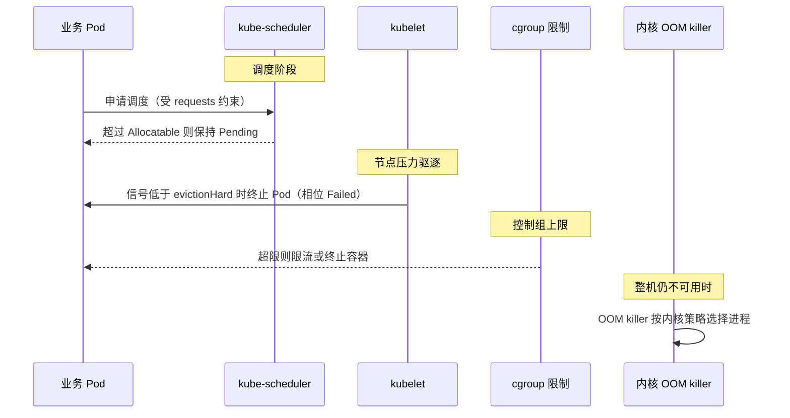

# 1、操作手册

本文档为 kubeauto 的**运维操作手册**，说明如何在目标环境中下载制品、部署集群、配置网络与插件，以及日常运维操作。

kubeauto 用于快速部署 Kubernetes 集群及云原生周边组件：安装与配置逻辑由 Ansible 角色实现，集群生命周期由 Python 控制面（`kubecli`）编排。项目不依赖 kubeadm，采用二进制 + systemd 方式落地控制面与节点组件，并支持离线镜像仓库分发。

配套文档：

- [技术白皮书总册](./technical-whitepaper.md)（**原理与实现签收文档**，分章见 [`whitepaper/`](./whitepaper/)）
  - 证书 / PKI → [第 6 章](./whitepaper/06-pki-certificates.md)
  - 控制面组件 → [第 3 章](./whitepaper/03-control-plane.md)
  - CRI → [第 8 章](./whitepaper/08-cri-runtime.md)
  - CNI → [第 9 章](./whitepaper/09-cni-networking.md)
  - 监控与插件 → [第 12 章](./whitepaper/12-addons-observability.md)
  - Node Allocatable → [第 11 章](./whitepaper/11-allocatable-qos.md)（操作细节见本文 §1.1.4）
- [开发手册](./development-manual.md)：六仓协同开发与贡献指南
- 仓库入口：[README.md](../README.md)

## 1.1、前言

### 1.1.1、最小配置

最小配置是相对概念，来自测试与学习环境的经验值，用于快速拉起可用集群。配置偏低时活动空间有限，**不建议直接作为生产规格**。生产环境请按业务与合同约定选型；启用默认 Node Allocatable（合计预留约 2 CPU + 4Gi）时，节点建议不低于 **16 CPU / 32Gi 内存**（详见 §1.1.4）。

| 部署场景                   | 节点角色            | CPU  | 内存  | 存储空间 | 常规组件                                                     |
| -------------------------- | ------------------- | ---- | ----- | -------- | ------------------------------------------------------------ |
| 单节点部署<br />（1 节点） | 控制节点 + 工作节点 | 4 核 | 16 GB | 60 GB    | • kube-apiserver / kube-controller-manager / kube-scheduler<br/>• etcd<br/>• kubelet / kube-proxy<br/>• containerd 或 docker+cri-dockerd<br/>• CNI（calico / flannel / cilium 等）<br/>• CoreDNS、kubectl |
| 多节点部署<br />（3 节点） | 控制节点            | 4 核 | 16 GB | 60 GB    | • 同上控制面组件<br/>• 集成 kube-lb，或外置 keepalived + nginx<br/>• CNI、CoreDNS |
| 多节点部署<br />（2 节点） | 工作节点            | 2 核 | 8 GB  | 30 GB    | • kubelet / kube-proxy<br/>• containerd 或 docker+cri-dockerd<br/>• CNI（与控制面一致） |
| 生产推荐（合同基线）       | 控制 / 工作节点     | ≥16 核 | ≥32 GB | 按盘规划 | • 同上，并启用默认 kube/system reserved（见 §1.1.4） |

### 1.1.2、架构

从最小配置描述中可以看到，我们的部署方案有两种，一种是 allinone 安装，一般用来学习和测试；一种是高可用安装，用于生产环境。

使用独立负载均衡器的高可用架构很经典，成熟且高效，如下图所示：


使用集成负载均衡器的高可用架构同样高效，如下图所示：


本项目默认使用第二种集成负载均衡器的高可用架构。

### 1.1.3、容器运行时

k8s 作为一个容器编排工具，发展之初，借用稳定可靠的 docker 作为底层的容器运行时，顺理成章，但是 docker 是一个独立的 C/S 架构的容器工具，对容器有完整的生命周期定义，并非为 k8s 而生。

随着 k8s 的发展，社区有了一些新的理解，符合 CRI 标准的容器运行时皆可对接 k8s，其中比较突出的有 containerd，CRI-O 等，我们可以根据自己的实际需求灵活搭配。

Kubernetes 自 1.24 起移除 dockershim。本项目支持两类 CRI：

| 运行时 | 适用说明 | 库存配置 |
|--------|----------|----------|
| **containerd**（默认） | 推荐生产默认；与当前 k8s 二进制包、pause 镜像配套 | `CONTAINER_RUNTIME="containerd"` |
| **docker + cri-dockerd** | 需要沿用 Docker Engine 时使用；通过 [cri-dockerd](https://github.com/Mirantis/cri-dockerd) 提供 CRI | `CONTAINER_RUNTIME="docker"` |

默认 Kubernetes 版本为 **v1.33.6**（见 `common/constants.py` 中 `v_k8s_bin`）。cri-dockerd 版本与 Engine 版本见同文件 `v_cri_dockerd` / `v_docker`。

进一步了解 containerd：

- 安装与 CRI：https://github.com/containerd/containerd/blob/main/docs/getting-started.md
- crictl：https://github.com/kubernetes-sigs/cri-tools
- Docker Engine 二进制安装：https://docs.docker.com/engine/install/binaries/

> 提示：可从 Kubernetes 历史安装方法中加深对容器运行时演进的理解，参考[安装 Kubernetes](https://brinnatt.com/projects/cicd/6、安装-kubernetes)

### 1.1.4、为系统守护进程预留计算资源（Node Allocatable）

Kubernetes 节点默认可被调度至节点 **Capacity**。若不预先为操作系统与 Kubernetes 系统守护进程划定资源，业务 Pod 将与上述守护进程竞争 CPU、内存等资源，并在压力场景下触发节点级资源饥饿、System OOM，甚至导致节点暂时不可用。

kubelet 提供 **Node Allocatable** 能力，用于从 Capacity 中划出不可被调度器超卖的业务容量，并为系统守护进程建立可审计的预留。Kubernetes 建议集群管理员按节点负载密度配置 Node Allocatable。kubeauto 默认启用 `kubeReserved` 与 `systemReserved`，并在约定节点规格（≥16 CPU / 32Gi 内存）下采用合计 **2 CPU + 4Gi** 的预留基线。

本节说明官方机制、驱逐与 QoS 相关行为，以及本项目的默认策略与验收方法。

**参考文档：**

| 主题 | 链接 |
|------|------|
| Node Allocatable、`kubeReserved`、`systemReserved`、强制执行 | [Reserve Compute Resources for System Daemons](https://kubernetes.io/docs/tasks/administer-cluster/reserve-compute-resources/) |
| 节点压力驱逐 | [Node-pressure Eviction](https://kubernetes.io/docs/concepts/scheduling-eviction/node-pressure-eviction/) |
| Pod QoS 类别 | [Pod Quality of Service Classes](https://kubernetes.io/docs/concepts/workloads/pods/pod-qos/) |

#### 1.1.4.1、问题背景

未配置预留时，调度器可按 Capacity 放置 Pod。节点上仍运行大量系统守护进程（操作系统服务、kubelet、容器运行时等）。这些进程与 Pod 共享同一套物理资源，在高密度或突发负载下会产生资源争用。

未配置 Node Allocatable 时：



配置 Node Allocatable 后：



预留机制的作用边界如下：

1. **调度约束**：减小 Allocatable，限制可调度到该节点的 Pod `requests` 总量。
2. **运行时约束**：在启用相应 `enforceNodeAllocatable` 项时，通过 cgroup 限制 Pods 与（可选）kube / system 预留对应控制组的用量上限。
3. **驱逐约束**：在可用内存等信号跌破 `evictionHard` 阈值时，由 kubelet 主动终止 Pod，降低直接进入 System OOM 的概率。
4. **能力边界**：Node Allocatable 与节点压力驱逐不能保证内核永不故障，也不能保证 Linux OOM killer 永不误杀系统进程；其目标是降低概率并改善失效模式（优先影响业务 Pod，而非平台组件）。

#### 1.1.4.2、Node Allocatable 计算

**Allocatable** 表示节点上可供 Pod 使用的计算资源量。调度器不会对 Allocatable 进行超卖。当前支持 CPU、内存与 ephemeral-storage 等资源类型。

内存维度的关系可概括为：

```text
Allocatable ≈ Capacity − kubeReserved − systemReserved − evictionHard 预留量
```

官方文档示例：节点具备 `16` CPU、`32Gi` 内存；配置

- `kubeReserved` = `{cpu: 1000m, memory: 2Gi}`
- `systemReserved` = `{cpu: 500m, memory: 1Gi}`
- `evictionHard` = `{memory.available: "<500Mi"}`

时，Allocatable 约为 **14.5 CPU、28.5Gi 内存**。调度器确保该节点上所有 Pod 的内存 `requests` 之和不超过 28.5Gi；当节点上 Pod 的总体内存用量超过 Allocatable 时，kubelet 将驱逐 Pod。



上图仅为结构示意。现场 Capacity 与 Allocatable 的差值以 `kubectl describe node` 为准。

#### 1.1.4.3、kubeReserved 与 systemReserved

| 配置项 | 用途（官方定义） | kubeauto 默认落点 |
|--------|------------------|-------------------|
| `kubeReserved` | 为 kubelet、容器运行时等 **Kubernetes 系统守护进程** 预留资源；一般不用于以 Pod 形式运行的系统组件 | `KUBE_RESERVED_CPU/MEMORY`；systemd 下 `kubeReservedCgroup: /podruntime`（对应主机 `podruntime.slice`） |
| `systemReserved` | 为 **操作系统守护进程**（如 sshd、udev）预留资源；亦应考虑为 **内核** 预留内存（内核内存当前不计入 Pod） | `SYS_RESERVED_CPU/MEMORY`；systemd 下 `systemReservedCgroup: /system`（对应 `system.slice`） |
| `evictionHard` | 为节点压力驱逐保留阈值以下的可用资源；该部分不可再分配给 Pod | 模板默认含 `memory.available: 300Mi` 等 |

使用 **systemd** cgroup 驱动时，官方要求：配置名应为 `kubeReservedCgroup` / `systemReservedCgroup` 的取值，由 kubelet 在名称后追加 `.slice`。若直接配置为 `/podruntime.slice`，将产生 `podruntime.slice.slice` 这类错误路径（参见 [kubernetes#78629](https://github.com/kubernetes/kubernetes/issues/78629)）。kubeauto 在 systemd 模式下使用 `/podruntime` 与 `/system`。



#### 1.1.4.4、强制执行 Node Allocatable（enforceNodeAllocatable）

调度器将 Allocatable 视为 Pod 可用容量。默认情况下，kubelet 通过在 Pod 总体用量超过 Allocatable 时驱逐 Pod 来强制执行该约束，对应 `enforceNodeAllocatable` 中的 `pods`。

可选地，可将 `kube-reserved`、`system-reserved` 加入同一列表，以对相应预留控制组施加强制限制；同时必须分别配置 `kubeReservedCgroup`、`systemReservedCgroup`。kubelet **不会**创建不存在的预留 cgroup；无效 cgroup 会导致 kubelet 启动失败。

**预留数值与强制执行是两件独立事务：**

| 行为 | 作用 | 是否默认开启（kubeauto） |
|------|------|--------------------------|
| 配置 `kubeReserved` / `systemReserved` | 从 Capacity 扣减，缩小 Allocatable（调度侧） | 是 |
| `enforceNodeAllocatable` 含 `pods` | 限制 Pod 总体用量，超额则驱逐 | 是 |
| 含 `kube-reserved` | 对 kube 预留控制组施加上限 | 是 |
| 含 `system-reserved` | 对 OS 预留控制组（如 `system.slice`）施加上限 | **否**（`SYS_RESERVED_ENFORCE: "no"`） |



官方 General Guidelines 指出：对 `systemReserved` 的强制执行须格外谨慎，可能导致关键系统服务 CPU 饥饿、被 OOM 杀死或无法 fork。建议仅在完成充分节点画像、并具备故障恢复能力后再启用。推荐演进顺序为：先强制 `pods` → 在监控完备后尝试对 kube/system 的可压缩资源（如 CPU）强制 → 再考虑 kube 的不可压缩资源 → 确有必要时再对 `systemReserved` 的不可压缩资源强制执行。

kubeauto 默认策略：启用预留记账（合计 2 CPU + 4Gi），强制执行 `pods` 与 `kube-reserved`，**不**默认强制执行 `system-reserved`，以避免过小的 `system.slice` 内存上限危及控制面进程。

#### 1.1.4.5、节点压力与资源回收顺序

资源紧张时，行为由多层机制共同决定，不宜简化为「仅由内核 OOM killer 决定」。



**调度阶段**  
节点上 Pod 的 `requests` 总和不得超过 Allocatable。

**节点压力驱逐（Node-pressure Eviction）**  
kubelet 监控内存、磁盘、inode、PID 等信号。当资源达到配置阈值时，可主动终止 Pod 以回收资源。硬驱逐阈值下，kubelet 使用 `0s` 宽限期。节点级内存压力可导致 System OOM 并影响该节点全部工作负载；通过 `evictionHard` 预留可用内存，kubelet 在跌破阈值前提前驱逐 Pod。

在回收节点级资源仍不足以缓解压力后，kubelet 按以下因素对终端用户 Pod 排序并驱逐（内存压力场景）：

1. Pod 资源用量是否超过 `requests`；
2. Pod Priority；
3. 用量相对 `requests` 的超额程度。

典型顺序：用量超过 `requests` 的 BestEffort / Burstable 优先；Guaranteed，以及用量未超过 `requests` 的 Burstable，通常靠后。文档说明：kubelet **并不**以 QoS 类别作为驱逐排序的直接键；QoS 可用于估计倾向。当系统守护进程用量超过 `kube-reserved` / `system-reserved`，且节点上仅剩遵守 `requests` 的 Guaranteed / Burstable 时，kubelet 仍可能驱逐低优先级 Pod 以维护节点稳定性。

**Pod QoS 类别（与驱逐倾向相关）**

| QoS | 判定要点 | 节点压力下的相对位置 |
|-----|----------|----------------------|
| BestEffort | 容器未设置 CPU/内存 request 与 limit | 通常最先成为驱逐候选 |
| Burstable | 不满足 Guaranteed，但至少设置了部分 request/limit | 介于中间 |
| Guaranteed | 各容器 CPU、内存的 request 与 limit 均大于零且两两相等 | 通常最不易因其他 Pod 超用而被驱逐 |

**内核 OOM**  
若上述机制仍无法恢复节点可用内存，Linux OOM killer 将介入。该层不由 Kubernetes 保证「业务进程一定先于系统守护进程终止」。合理配置预留与驱逐的目标，是尽量避免进入该层。

#### 1.1.4.6、kubeauto 默认参数与变更方式

约定生产节点规格不低于 **16 CPU / 32Gi 内存**。默认预留如下：

| 参数 | 默认值 | 说明 |
|------|--------|------|
| `KUBE_RESERVED_ENABLED` | `"yes"` | 启用 kube 预留 |
| `KUBE_RESERVED_CPU` / `KUBE_RESERVED_MEMORY` | `1000m` / `1536Mi` | `kubeReserved` |
| `SYS_RESERVED_ENABLED` | `"yes"` | 启用 system 预留（调度扣减） |
| `SYS_RESERVED_CPU` / `SYS_RESERVED_MEMORY` | `1000m` / `2560Mi` | `systemReserved` |
| `SYS_RESERVED_ENFORCE` | `"no"` | 不将 `system-reserved` 加入 `enforceNodeAllocatable` |
| 合计 | **2 CPU + 4Gi** | 从业务可调度容量中划出的平台基线 |

配置文件：`conf/config.yml`（模板）与 `clusters/<cluster>/config.yml`（集群实例）。修改后需重新应用 kube-node 配置，例如：

```bash
kubecli setup <cluster> 05
```

节点物理内存必须 **大于** 预留量与 eviction 预留之和。若 Capacity 小于预留，kubelet 将以 `Expected capacity >= reservation` 类错误拒绝启动；该行为符合官方约束。低规格实验节点不得直接套用上述生产默认值。

#### 1.1.4.7、验收

```bash
# 确认集群配置中的预留项
grep -E 'KUBE_RESERVED_|SYS_RESERVED_' clusters/<cluster>/config.yml

# 确认 Capacity 与 Allocatable 差值符合预留预期
kubectl describe node <node> | grep -A8 -E 'Capacity|Allocatable'

# 仓库内校验脚本（期望输出 RESERVED_ALLOCATABLE_PASS）
bash tests/helpers/verify-node-reserved.sh clusters/<cluster>/kubectl.kubeconfig
```

通过条件通常包括：CPU 差值不少于约 `2000m`、内存差值约 `4Gi` 量级（含 eviction）；kubelet 配置中存在 `kubeReserved` / `systemReserved`；`enforceNodeAllocatable` 包含 `pods` 与 `kube-reserved`，默认不包含 `system-reserved`；运行时位于 `podruntime.slice`，且不存在错误的 `podruntime.slice.slice`。

#### 1.1.4.8、交付说明摘要

在约定规格（≥16 CPU / 32Gi 内存）的节点上，kubeauto 默认启用 Node Allocatable：从业务可调度容量中预留合计 **2 CPU + 4Gi**，供 Kubernetes 系统守护进程与操作系统（含内核侧记账）使用；默认强制执行 `pods` 与 `kube-reserved`，不强制执行 `system-reserved`。资源压力下，优先通过调度约束与节点压力驱逐影响业务 Pod，以降低 System OOM 及平台组件不可用的风险。

---

## 1.2、单节点部署

单节点部署是以 allinone 的方式把所有组件都部署在一个节点上面，可以快速构建一个可用的 k8s，供学习和测试使用。

1、下载集群管理工具

```bash
# wget https://github.com/brinnatt/kubeauto/releases/download/v0.1.1/kubecli-amd64
# mv kubecli-amd64 /usr/local/bin/kubecli
# chmod +x /usr/local/bin/kubecli
# kubecli -h
usage: kubecli [-h] COMMAND ...

Kubeauto - Kubernetes cluster management tool

options:
  -h, --help    show this help message and exit

available commands:
  COMMAND
    new         Create a new cluster configuration
    setup       Setup a cluster with specific step
    list        List all managed clusters
    checkout    Switch to a cluster's kubeconfig
    start-aio   Quickly setup an all-in-one cluster with default settings
    start       Start all cluster services
    stop        Stop all cluster services
    upgrade     Upgrade the cluster components
    backup      Backup cluster state (etcd snapshot)
    restore     Restore cluster from backup
    destroy     Destroy the cluster
    add-etcd    Add an etcd node to the cluster
    add-master  Add a master node to the cluster
    add-node    Add a worker node to the cluster
    del-etcd    Remove an etcd node from the cluster
    del-master  Remove a master node from the cluster
    del-node    Remove a worker node from the cluster
    kca-renew   Force renew CA certificates and all other certs
    kcfg-adm    Manage kubeconfig users for the cluster
    download    Download required components with version control
    docker      Manage Docker containers
    system      Manage system environments
```

> 提示：该项目支持 amd64 和 arm64 两种架构，根据自己的系统架构选择对应的管理工具即可。

2、配置 kubecli 执行环境并下载 k8s 所需组件

```bash
# kubecli download -D
```

> 提示：kubecli 二进制包含所有的 python 库，但是不包含 ansible 工具，kubecli 会根据系统源安装 ansible 工具，如果安装源有问题导致安装失败，请自行手动安装，然后继续下面的步骤。

3、安装 aio 集群

使用 kubecli 工具安装 k8s 集群，要有 root 权限。

```bash
# kubecli start-aio
```

4、验证 aio 集群是否成功安装

```bash
# kubecli list
[2025-11-30 22:00:25] [INFO] [controller.cluster.cli] Managed clusters:
[2025-11-30 22:00:25] [INFO] [controller.cluster.cli]   -> 1: k8s-main
[2025-11-30 22:00:25] [INFO] [controller.cluster.cli] * -> 2: aio
# kubectl get nodes
NAME         STATUS   ROLES    AGE     VERSION
master-aio   Ready    master   2m46s   v1.33.6
# kubectl get pods -A
NAMESPACE     NAME                                       READY   STATUS    RESTARTS   AGE
kube-system   calico-kube-controllers-5d475c975d-jhlls   1/1     Running   0          2m44s
kube-system   calico-node-wtrn2                          1/1     Running   0          2m44s
kube-system   coredns-597f899fbb-sxfh7                   1/1     Running   0          2m21s
kube-system   metrics-server-88f86499-n5lzj              1/1     Running   0          2m20s
kube-system   node-local-dns-6qbst                       1/1     Running   0          2m20s
```

## 1.3、高可用部署

### 1.3.1、环境准备

| 角色        | 数量 | 描述                                                         |
| ----------- | ---- | ------------------------------------------------------------ |
| 部署节点    | 1    | 运行 kubecli 命令，管控多集群；可以复用 master 节点，但生产上建议准备一个单独的部署节点。 |
| etcd 节点   | 3    | etcd 集群需要 1, 3, 5, ... 奇数个节点，选举必需；可以复用 master 节点，但生产上建议使用性能高的磁盘单独部署。 |
| master 节点 | 2    | 高可用集群至少 2 个 master 节点                              |
| node 节点   | n    | 运行应用负载的节点，可根据需要提升机器配置或增加节点数       |

> 注意 1：集群时钟同步至关重要，时间一旦不同步，会出现无法预料的问题，且不易察觉，按下面步骤安装集群时，时间同步会自动初始化，你需要在安装完集群后，首先检查时间同步的有效性。
>
> 注意 2：默认配置下容器运行时和 kubelet 会占用 /var 的磁盘空间，如果磁盘分区特殊，可以设置 config.yml 中的容器运行时和 kubelet 数据目录：`CONTAINERD_STORAGE_DIR`，`DOCKER_STORAGE_DIR`，`KUBELET_ROOT_DIR`。
>
> 注意 3：确保在干净的系统上开始安装，不要使用曾经装过 kubeadm 或其他 k8s 发行版的环境。
>
> 注意 4：本项目开发环境是 Rockylinux 8.10，不建议使用低于该版本的系统安装 k8s 集群。

### 1.3.2、快速安装

以下示例创建一个 9 节点的多主高可用集群，文档中命令默认都需要 root 权限运行。

1、基础系统配置

- 2c/4g 内存 120g 硬盘（该配置仅测试用）
- 最小化安装 Rockylinux 8.10
- 配置基础网络、更新源、SSH 登录等

2、安装依赖

kubecli 把大部分依赖环境一起打包进了二进制，但 ansible_runner 库依赖操作系统的 ansible 环境，不过 `kubecli download -D` 在下载所有安装组件同时也解决了 ansible 依赖，如果因国内网络环境安装失败，可以手动安装 ansible 再继续后面步骤。

3、准备 ssh 免密登陆

配置从部署节点能够 ssh 免密登陆所有节点

```bash
# kubecli system -a 192.168.110.214 192.168.110.215 192.168.110.216 192.168.110.217 192.168.110.218 192.168.110.219 192.168.110.220 192.168.110.221 192.168.110.222
```

> 说明：如果密码相同，只需要输入一次，如果密码不同，需要输入各自的密码。

4、在部署节点安装 k8s 集群

4.1、下载对应的 x64 或 arm64 构架的 kubecli 工具

```bash
# wget https://github.com/brinnatt/kubeauto/releases/download/v0.1.1/kubecli-amd64
# mv kubecli-amd64 /usr/local/bin/kubecli
# chmod +x /usr/local/bin/kubecli
# kubecli -h
```

4.2、下载 k8s 所需所有组件以及 kubecli 运行时环境

```bash
# kubecli download -D
```

4.3、下载额外容器镜像（cilium，flannel，prometheus 等）

```bash
# kubecli download -E flannel
# kubecli download -E prometheus
```

4.4、创建集群配置实例

```bash
# kubecli new k8s-main
[2025-12-05 12:59:10] [INFO] [service.cluster.manager] -> Cluster k8s-main created. Next steps:
[2025-12-05 12:59:10] [INFO] [service.cluster.manager] 1. Configure /usr/local/kubeauto/clusters/k8s-main/hosts
[2025-12-05 12:59:10] [INFO] [service.cluster.manager] 2. Configure /usr/local/kubeauto/clusters/k8s-main/config.yml
```

然后根据提示配置 hosts 和 config.yml，根据前面节点规划修改hosts 文件和其他集群层面的主要配置选项；其他集群组件等配置项可以在config.yml 文件中修改。

4.5、开始安装

```bash
# 一键安装
kubecli setup k8s-main all

# 或者分步安装
kubecli setup k8s-main 01
kubecli setup k8s-main 02
...
```

### 1.3.3、分步安装

#### 1.3.3.1、创建证书和初始化环境

本步骤主要完成:

- (optional) role: chrony，集群中的时间同步至关重要，有条件的话，手动单独完成所有节点时间同步
- role: deploy，创建 CA 证书、集群组件访问 apiserver 所需的各种 kubeconfig
- role: prepare，系统基础环境初始化配置、分发 CA 证书、kubectl 客户端安装

##### 1.3.3.1.1、deploy 角色

> roles/deploy/tasks/main.yml

**1、创建 CA 证书**

kubernetes 系统各组件需要使用 TLS 证书对通信进行加密，使用 CloudFlare 的 PKI 工具集生成自签名的 CA 证书，用来签名后续创建的其它 TLS 证书。[参见官方项目](https://github.com/cloudflare/cfssl)。

根据认证对象可以将证书分成三类：服务器证书 `server cert`，客户端证书 `client cert`，对等证书 `peer cert`(既是 `server cert` 又是 `client cert`)，在kubernetes 集群中需要的证书种类如下：

- `etcd` 集群每个节点既需要标识自己服务的 `server cert`，也需要 `client cert` 与其它 `etcd` 集群节点交互，当然可以分别指定 2 个证书，为了更简洁，这里使用一个对等证书。
- `master` 节点既需要标识 apiserver 服务的 `server cert`，也需要 `client cert` 连接 `etcd` 集群，这里也使用一个对等证书。
- `kubectl` `calico` `kube-proxy` 只需要 `client cert`，因此证书请求中 `hosts` 字段可以为空。
- `kubelet` 既需要标识自己服务的 `server cert`，也需要 `client cert` 请求 `apiserver`，也使用一个对等证书。

整个集群要使用统一的 CA 证书，只需要在 ansible 控制端创建，然后分发给其他节点；为了保证安装的幂等性，如果已经存在 CA 证书，就跳过创建 CA 步骤。

创建 CA 配置文件 [ca-config.json.j2](https://github.com/brinnatt/kubeauto/blob/master/roles/deploy/templates/ca-config.json.j2)

```bash
{
  "signing": {
    "default": {
      "expiry": "{{ CERT_EXPIRY }}"
    },
    "profiles": {
      "kubernetes": {
        "usages": [
            "signing",
            "key encipherment",
            "server auth",
            "client auth"
        ],
        "expiry": "{{ CERT_EXPIRY }}"
      },
      "kcfg": {
        "usages": [
            "signing",
            "key encipherment",
            "client auth"
        ],
        "expiry": "{{ CUSTOM_EXPIRY }}"
      }
    }
  }
}
```

- `signing`：表示该证书可用于签名其它证书；生成的 ca.pem 证书中 `CA=TRUE`；
- `server auth`：表示可以用该 CA 对 server 提供的证书进行验证；
- `client auth`：表示可以用该 CA 对 client 提供的证书进行验证；
- `profile kubernetes`：包含了 `server auth` 和 `client auth`，所以可以签发三种不同类型证书；expiry 证书有效期，默认 50 年。
- `profile kcfg`：在后面客户端 kubeconfig 证书管理中用到。

创建 CA 证书签名请求 [ca-csr.json.j2](https://github.com/brinnatt/kubeauto/blob/master/roles/deploy/templates/ca-csr.json.j2)

```bash
{
  "CN": "kubernetes-ca",
  "key": {
    "algo": "rsa",
    "size": 2048
  },
  "names": [
    {
      "C": "CN",
      "ST": "HangZhou",
      "L": "XS",
      "O": "k8s",
      "OU": "System"
    }
  ],
  "ca": {
    "expiry": "876000h"
  }
}
```

- `ca expiry`：指定 ca 证书的有效期，默认 100 年。

生成 CA 证书和私钥

```bash
cfssl gencert -initca ca-csr.json | cfssljson -bare ca
```

**2、生成 kubeconfig 配置文件**

kubectl 使用 `~/.kube/config` 配置文件与 kube-apiserver 进行交互，且拥有管理 K8S 集群的完全权限。

准备 kubectl 使用的 admin 证书签名请求 [admin-csr.json.j2](https://github.com/brinnatt/kubeauto/blob/master/roles/deploy/templates/admin-csr.json.j2)

```bash
{
  "CN": "admin",
  "hosts": [],
  "key": {
    "algo": "rsa",
    "size": 2048
  },
  "names": [
    {
      "C": "CN",
      "ST": "HangZhou",
      "L": "XS",
      "O": "system:masters",
      "OU": "System"
    }
  ]
}
```

- kubectl 使用客户端证书可以不指定 hosts 字段。
- 证书 Subject 的 Organization（`O`）为 `system:masters`。Kubernetes x509 认证器将该字段映射为用户组。默认 RBAC 中 `cluster-admin` ClusterRoleBinding 包含该组；官方亦将 `system:masters` 视为可绕过授权层的高权限（break-glass）组（见 [PKI certificates and requirements](https://kubernetes.io/docs/setup/best-practices/certificates/)）。admin 证书与 `kubectl.kubeconfig` 须按密钥级保护。

```bash
$ kubectl describe clusterrolebinding cluster-admin
Name:         cluster-admin
Labels:       kubernetes.io/bootstrapping=rbac-defaults
Annotations:  rbac.authorization.kubernetes.io/autoupdate=true
Role:
  Kind:  ClusterRole
  Name:  cluster-admin
Subjects:
  Kind   Name            Namespace
  ----   ----            ---------
  Group  system:masters  
```

生成 admin 用户证书

```bash
cfssl gencert -ca=ca.pem -ca-key=ca-key.pem -config=ca-config.json -profile=kubernetes admin-csr.json | cfssljson -bare admin
```

生成 `~/.kube/config` 配置文件

使用 `kubectl config` 生成 kubeconfig 自动保存到 `~/.kube/config`，生成后 `cat ~/.kube/config` 可以验证配置文件包含 kube-apiserver 地址、证书、用户名等信息。

```bash
kubectl config set-cluster kubernetes --certificate-authority=ca.pem --embed-certs=true --server=127.0.0.1:8443
kubectl config set-credentials admin --client-certificate=admin.pem --embed-certs=true --client-key=admin-key.pem
kubectl config set-context kubernetes --cluster=kubernetes --user=admin
kubectl config use-context kubernetes
```

**3、生成 kube-proxy.kubeconfig 配置文件**

创建 kube-proxy 证书请求 [kube-proxy-csr.json.j2](https://github.com/brinnatt/kubeauto/blob/master/roles/deploy/templates/kube-proxy-csr.json.j2)

```bash
{
  "CN": "system:kube-proxy",
  "hosts": [],
  "key": {
    "algo": "rsa",
    "size": 2048
  },
  "names": [
    {
      "C": "CN",
      "ST": "HangZhou",
      "L": "XS",
      "O": "k8s",
      "OU": "System"
    }
  ]
}
```

- kube-proxy 使用客户端证书可以不指定 hosts 字段。
- CN 指定该证书的 User 为 `system:kube-proxy`，预定义的 ClusterRoleBinding `system:node-proxier` 将 User `system:kube-proxy` 与 Role `system:node-proxier` 绑定，授予了调用 kube-apiserver Proxy 相关 API 的权限；

```bash
$ kubectl describe clusterrolebinding system:node-proxier
Name:         system:node-proxier
Labels:       kubernetes.io/bootstrapping=rbac-defaults
Annotations:  rbac.authorization.kubernetes.io/autoupdate=true
Role:
  Kind:  ClusterRole
  Name:  system:node-proxier
Subjects:
  Kind  Name               Namespace
  ----  ----               ---------
  User  system:kube-proxy  
```

生成 `system:kube-proxy` 用户证书

```bash
cfssl gencert -ca=ca.pem -ca-key=ca-key.pem -config=ca-config.json -profile=kubernetes kube-proxy-csr.json | cfssljson -bare kube-proxy
```

生成 kube-proxy.kubeconfig

使用 `kubectl config` 生成 kubeconfig 自动保存到 kube-proxy.kubeconfig

```bash
kubectl config set-cluster kubernetes --certificate-authority=ca.pem --embed-certs=true --server=127.0.0.1:8443 --kubeconfig=kube-proxy.kubeconfig
kubectl config set-credentials kube-proxy --client-certificate=kube-proxy.pem --embed-certs=true --client-key=kube-proxy-key.pem --kubeconfig=kube-proxy.kubeconfig
kubectl config set-context default --cluster=kubernetes --user=kube-proxy --kubeconfig=kube-proxy.kubeconfig
kubectl config use-context default --kubeconfig=kube-proxy.kubeconfig
```

**4、生成其它组件 kubeconfig 配置文件**

创建 kube-controller-manager 和 kube-scheduler 组件的 kubeconfig 文件，过程与创建 kube-proxy.kubeconfig 类似，略。

##### 1.3.3.1.2、prepare 角色

请在另外窗口打开[roles/prepare/tasks/main.yml](https://github.com/brinnatt/kubeauto/blob/master/roles/prepare/tasks/main.yml) 文件，比较简单直观

1. 设置基础操作系统软件和系统参数，请阅读脚本中的注释内容。
2. 创建一些基础文件目录、环境变量以及添加本地镜像仓库 `registry.talkschool.cn` 的域名解析。
3. 分发 kubeconfig 等配置文件。

#### 1.3.3.2、安装 etcd 集群

> **原理与实现详解：** 见技术白皮书 [第 5 章 etcd](./whitepaper/05-etcd.md)。


Kubernetes 集群使用 etcd 存储所有数据，是最重要的组件之一，注意 etcd 集群需要奇数个节点(1, 3, 5 ...)，本文档使用 3 个节点做集群。

请在另外窗口打开 [roles/etcd/tasks/main.yml](https://github.com/brinnatt/kubeauto/blob/master/roles/etcd/tasks/main.yml) 文件，对照看以下讲解内容。

1、创建 etcd 证书

> 注意：证书是在部署节点创建好之后推送到目标 etcd 节点上去的，以增加 ca 证书的安全性

创建 etcd 证书请求 [etcd-csr.json.j2](https://github.com/brinnatt/kubeauto/blob/master/roles/etcd/templates/etcd-csr.json.j2)

```bash
{
  "CN": "etcd",
  "hosts": [

    "{{ host }}",

    "127.0.0.1"
  ],
  "key": {
    "algo": "rsa",
    "size": 2048
  },
  "names": [
    {
      "C": "CN",
      "ST": "HangZhou",
      "L": "XS",
      "O": "k8s",
      "OU": "System"
    }
  ]
}
```

- etcd 使用对等证书，hosts 字段必须指定授权使用该证书的 etcd 节点 IP，这里枚举了所有 etcd 节点的地址。

2、创建 etcd 服务文件 [etcd.service.j2](https://github.com/brinnatt/kubeauto/blob/master/roles/etcd/templates/etcd.service.j2)

```bash
[Unit]
Description=Etcd Server
After=network.target
After=network-online.target
Wants=network-online.target
Documentation=https://github.com/coreos

[Service]
Type=notify
WorkingDirectory={{ ETCD_DATA_DIR }}
ExecStart={{ bin_dir }}/etcd \
  --name=etcd-{{ inventory_hostname }} \
  --cert-file={{ ca_dir }}/etcd.pem \
  --key-file={{ ca_dir }}/etcd-key.pem \
  --peer-cert-file={{ ca_dir }}/etcd.pem \
  --peer-key-file={{ ca_dir }}/etcd-key.pem \
  --trusted-ca-file={{ ca_dir }}/ca.pem \
  --peer-trusted-ca-file={{ ca_dir }}/ca.pem \
  --initial-advertise-peer-urls=https://{{ inventory_hostname }}:2380 \
  --listen-peer-urls=https://{{ inventory_hostname }}:2380 \
  --listen-client-urls=https://{{ inventory_hostname }}:2379,http://127.0.0.1:2379 \
  --advertise-client-urls=https://{{ inventory_hostname }}:2379 \
  --initial-cluster-token=etcd-cluster-0 \
  --initial-cluster={{ ETCD_NODES }} \
  --initial-cluster-state={{ CLUSTER_STATE }} \
  --data-dir={{ ETCD_DATA_DIR }} \
  --wal-dir={{ ETCD_WAL_DIR }} \
  --snapshot-count=50000 \
  --auto-compaction-retention=1 \
  --auto-compaction-mode=periodic \
  --max-request-bytes=10485760 \
  --quota-backend-bytes=8589934592
Restart=always
RestartSec=15
LimitNOFILE=65536
OOMScoreAdjust=-999

[Install]
WantedBy=multi-user.target
```

- 完整参数列表请使用 `etcd --help` 查询
- 注意 etcd 即需要服务器证书也需要客户端证书，为了方便这里使用一个 peer 证书代替两个证书。
- `--initial-cluster-state` 值为 `new` 时，`--name` 的参数值必须位于 `--initial-cluster` 列表中。
- `--snapshot-count` `--auto-compaction-retention` 一些性能优化参数，请查阅 etcd 项目文档。
- 设置 `--data-dir` 和 `--wal-dir` 使用不同磁盘目录，可以避免磁盘 io 竞争，提高性能，具体请参考 etcd 项目文档。

3、验证 etcd 集群状态

- systemctl status etcd 查看服务状态
- journalctl -u etcd 查看运行日志
- 在任一 etcd 集群节点上执行如下命令

```bash
# 根据hosts中配置设置shell变量 $NODE_IPS
export NODE_IPS="192.168.1.1 192.168.1.2 192.168.1.3"
for ip in ${NODE_IPS}; do
  etcdctl \
  --endpoints=https://${ip}:2379  \
  --cacert=/etc/kubernetes/ssl/ca.pem \
  --cert=/etc/kubernetes/ssl/etcd.pem \
  --key=/etc/kubernetes/ssl/etcd-key.pem \
  endpoint health; done
https://192.168.110.220:2379 is healthy: successfully committed proposal: took = 6.082221ms
https://192.168.110.221:2379 is healthy: successfully committed proposal: took = 4.447803ms
https://192.168.110.222:2379 is healthy: successfully committed proposal: took = 5.397452ms
```

```bash
for ip in ${NODE_IPS}; do
  etcdctl \
  --endpoints=https://${ip}:2379  \
  --cacert=/etc/kubernetes/ssl/ca.pem \
  --cert=/etc/kubernetes/ssl/etcd.pem \
  --key=/etc/kubernetes/ssl/etcd-key.pem \
  --write-out=table endpoint status; done
+------------------------------+------------------+---------+-----------------+---------+--------+-----------------------+--------+-----------+------------+-----------+------------+--------------------+--------+--------------------------+-------------------+
|           ENDPOINT           |        ID        | VERSION | STORAGE VERSION | DB SIZE | IN USE | PERCENTAGE NOT IN USE | QUOTA  | IS LEADER | IS LEARNER | RAFT TERM | RAFT INDEX | RAFT APPLIED INDEX | ERRORS | DOWNGRADE TARGET VERSION | DOWNGRADE ENABLED |
+------------------------------+------------------+---------+-----------------+---------+--------+-----------------------+--------+-----------+------------+-----------+------------+--------------------+--------+--------------------------+-------------------+
| https://192.168.110.220:2379 | a68459b5c6f543d5 |   3.6.4 |           3.6.0 |  6.4 MB | 1.7 MB |                   74% | 8.6 GB |      true |      false |         8 |      32691 |              32691 |        |                          |             false |
+------------------------------+------------------+---------+-----------------+---------+--------+-----------------------+--------+-----------+------------+-----------+------------+--------------------+--------+--------------------------+-------------------+
+------------------------------+------------------+---------+-----------------+---------+--------+-----------------------+--------+-----------+------------+-----------+------------+--------------------+--------+--------------------------+-------------------+
|           ENDPOINT           |        ID        | VERSION | STORAGE VERSION | DB SIZE | IN USE | PERCENTAGE NOT IN USE | QUOTA  | IS LEADER | IS LEARNER | RAFT TERM | RAFT INDEX | RAFT APPLIED INDEX | ERRORS | DOWNGRADE TARGET VERSION | DOWNGRADE ENABLED |
+------------------------------+------------------+---------+-----------------+---------+--------+-----------------------+--------+-----------+------------+-----------+------------+--------------------+--------+--------------------------+-------------------+
| https://192.168.110.221:2379 | b3e2d7b9c045016c |   3.6.4 |           3.6.0 |  6.4 MB | 1.6 MB |                   75% | 8.6 GB |     false |      false |         8 |      32691 |              32691 |        |                          |             false |
+------------------------------+------------------+---------+-----------------+---------+--------+-----------------------+--------+-----------+------------+-----------+------------+--------------------+--------+--------------------------+-------------------+
+------------------------------+------------------+---------+-----------------+---------+--------+-----------------------+--------+-----------+------------+-----------+------------+--------------------+--------+--------------------------+-------------------+
|           ENDPOINT           |        ID        | VERSION | STORAGE VERSION | DB SIZE | IN USE | PERCENTAGE NOT IN USE | QUOTA  | IS LEADER | IS LEARNER | RAFT TERM | RAFT INDEX | RAFT APPLIED INDEX | ERRORS | DOWNGRADE TARGET VERSION | DOWNGRADE ENABLED |
+------------------------------+------------------+---------+-----------------+---------+--------+-----------------------+--------+-----------+------------+-----------+------------+--------------------+--------+--------------------------+-------------------+
| https://192.168.110.222:2379 | 1471d7a200f308b9 |   3.6.4 |           3.6.0 |  6.4 MB | 1.6 MB |                   75% | 8.6 GB |     false |      false |         8 |      32691 |              32691 |        |                          |             false |
+------------------------------+------------------+---------+-----------------+---------+--------+-----------------------+--------+-----------+------------+-----------+------------+--------------------+--------+--------------------------+-------------------+
```

- 所有节点健康：etcdctl endpoint health 对所有三个节点都返回 healthy；
- 有且仅有一个领导者：etcdctl endpoint status 显示一个节点 is leader: true，另外两个节点 is leader: false；
- Raft 任期一致：所有节点处于同一 Raft term，且近期未发生频繁 Leader 切换；
- Raft 索引同步：各节点 Raft index 与 Raft applied index 基本一致，日志同步正常；
- 无活跃告警：etcdctl alarm list 返回空。
- 节点间网络稳定：没有频繁的领导者切换（通过监控 etcd_server_leader_changes_seen_total 指标）。
- 磁盘空间充足：没有 NOSPACE 告警，且磁盘使用率在安全阈值内（例如低于80%）。

> **磁盘性能**：快速的磁盘是 etcd 部署性能和稳定性的最关键因素。
>
> 磁盘速度慢会增加 etcd 请求延迟，并可能损害集群稳定性。由于 etcd 的 raft 协议依赖于将元数据持久地存储到日志中，因此大多数 etcd 集群成员必须将每个请求写入磁盘。此外，etcd 还会逐步将其状态检查点写入磁盘，以便截断此日志。如果这些写入耗时过长，心跳可能会超时并触发选举，从而损害集群的稳定性。通常，要判断磁盘速度是否足以满足 etcd 的要求，可以使用 fio 等基准测试工具。
>
> etcd 对磁盘写入延迟非常敏感。通常需要 50 的顺序 IOPS（例如，7200 RPM 磁盘）。对于负载较重的集群，建议使用 500 的顺序 IOPS（例如，典型的本地 SSD 或高性能虚拟化块设备）。请注意，大多数云提供商发布的是并发 IOPS，而不是顺序 IOPS；发布的并发 IOPS 可能比顺序 IOPS 高出 10 倍。要测量实际的顺序 IOPS，我们建议使用磁盘基准测试工具，例如 diskbench 或 fio。
>
> ```bash
> # 测试示例
> mkdir test-data
> fio --rw=write --ioengine=sync --fdatasync=1 --directory=test-data --size=2200m --bs=2300 --name=mytest
> ```

#### 1.3.3.3、安装容器运行时

> **原理与实现详解：** 见技术白皮书 [第 8 章 CRI](./whitepaper/08-cri-runtime.md)。


Kubernetes 1.24 起移除 dockershim。本项目支持：

- **containerd**（默认，`CONTAINER_RUNTIME="containerd"`）
- **docker + cri-dockerd**（`CONTAINER_RUNTIME="docker"`）

kubeauto 集成安装运行时：

- 默认无需修改库存中的 `CONTAINER_RUNTIME`
- 执行安装：分步 `kubecli setup k8s-main 03`，或一键 `kubecli setup k8s-main 90` / `all`（以当前 CLI 帮助为准）
- 版本钉扎见 `common/constants.py` 与 ext-bin 打包镜像

命令对比：

| 命令           | docker         | crictl（推荐）  | ctr                    |
| -------------- | -------------- | --------------- | ---------------------- |
| 查看容器列表   | docker ps      | crictl ps       | ctr -n k8s.io c ls     |
| 查看容器详情   | docker inspect | crictl inspect  | ctr -n k8s.io c info   |
| 查看容器日志   | docker logs    | crictl logs     | 无                     |
| 容器内执行命令 | docker exec    | crictl exec     | 无                     |
| 挂载容器       | docker attach  | crictl attach   | 无                     |
| 容器资源使用   | docker stats   | crictl stats    | 无                     |
| 创建容器       | docker create  | crictl create   | ctr -n k8s.io c create |
| 启动容器       | docker start   | crictl start    | ctr -n k8s.io run      |
| 停止容器       | docker stop    | crictl stop     | 无                     |
| 删除容器       | docker rm      | crictl rm       | ctr -n k8s.io c del    |
| 查看镜像列表   | docker images  | crictl images   | ctr -n k8s.io i ls     |
| 查看镜像详情   | docker inspect | crictl inspecti | 无                     |
| 拉取镜像       | docker pull    | crictl pull     | ctr -n k8s.io i pull   |
| 推送镜像       | docker push    | 无              | ctr -n k8s.io i push   |
| 删除镜像       | docker rmi     | crictl rmi      | ctr -n k8s.io i rm     |
| 查看Pod列表    | 无             | crictl pods     | 无                     |
| 查看Pod详情    | 无             | crictl inspectp | 无                     |
| 启动Pod        | 无             | crictl runp     | 无                     |
| 停止Pod        | 无             | crictl stopp    | 无                     |

> 提示：如果你觉得 crictl 和 ctr 不顺手，那就使用 [nerdctl](https://github.com/containerd/nerdctl)，跟 docker 的使用方式一样。

#### 1.3.3.4、安装 kube_master 节点

> **原理与实现详解：** 见技术白皮书 [第 3 章控制平面](./whitepaper/03-control-plane.md)、[第 6 章证书](./whitepaper/06-pki-certificates.md)、[第 7 章 HA](./whitepaper/07-ha-loadbalancer.md)。


部署 master 节点主要包含三个组件 `apiserver` `scheduler` `controller-manager`，其中：

- apiserver 提供集群管理的 REST API 接口，包括认证授权、数据校验以及集群状态变更等
  - 只有 API Server 才直接操作 etcd
  - 其他模块通过 API Server 查询或修改数据
  - 提供其他模块之间的数据交互和通信的枢纽
- scheduler 负责分配调度 Pod 到集群内的 node 节点
  - 监听 kube-apiserver，查询还未分配 Node 的 Pod
  - 根据调度策略为这些 Pod 分配节点
- controller-manager 由一系列的控制器组成，它通过 apiserver 监控整个集群的状态，并确保集群处于预期的工作状态

**高可用机制：**

- apiserver：无状态服务，可以通过独立负载均衡器或集成负载均衡器实现高可用，如前言中架构描述。
- controller-manager：开启 `--leader-elect=true` 时，多副本通过协调选举，仅 **leader** 运行控制循环，其余副本待命。现代 Kubernetes 默认使用 **Lease** 对象作为选主锁（历史版本亦支持基于 Endpoints / ConfigMap 的锁）。
- scheduler：同样使用 `--leader-elect=true`；仅 leader 执行调度决策，其它副本不进行绑定。

**安装流程：**

```bash
cat playbooks/04.kube-master.yml
- hosts: kube_master
  serial: 1        # [fix] 多 master 串行部署，避免 apiserver Service IP allocator 竞态
  roles:
  - kube-lb        # 四层负载均衡，监听在127.0.0.1:6443，转发到真实master节点apiserver服务
  - kube-master
  - kube-node      # 因为网络、监控等daemonset组件，master节点也推荐安装kubelet和kube-proxy服务
  ... 
```

**创建 kubernetes 证书签名请求：**

```bash
{
  "CN": "kubernetes",
  "hosts": [
    "127.0.0.1",

    "{{ hostvars[groups['ex_lb'][0]]['EX_APISERVER_VIP'] }}",


    "{{ host }}",

    "{{ CLUSTER_KUBERNETES_SVC_IP }}",

    "{{ host }}",

    "kubernetes",
    "kubernetes.default",
    "kubernetes.default.svc",
    "kubernetes.default.svc.cluster",
    "kubernetes.default.svc.cluster.local",
    "kubernetes.default.svc.{{ CLUSTER_DNS_DOMAIN }}"
  ],
  "key": {
    "algo": "rsa",
    "size": 2048
  },
  "names": [
    {
      "C": "CN",
      "ST": "HangZhou",
      "L": "XS",
      "O": "k8s",
      "OU": "System"
    }
  ]
}
```

kubernetes apiserver 使用对等证书，创建时 hosts 字段需要配置：

- 如果配置 ex_lb，需要把 EX_APISERVER_VIP 也配置进去
- 如果需要外部访问 apiserver，可选在 config.yml 配置 MASTER_CERT_HOSTS
- `kubectl get svc` 将看到集群中由 api-server 创建的默认服务 `kubernetes`，因此也要把 `kubernetes` 服务名和各个服务域名也添加进去

**创建 apiserver 的服务配置文件：**

```bash
[Unit]
Description=Kubernetes API Server
Documentation=https://github.com/GoogleCloudPlatform/kubernetes
After=network.target

[Service]
ExecStart={{ bin_dir }}/kube-apiserver \
  --allow-privileged=true \
  --anonymous-auth=false \
  --api-audiences=api,istio-ca \
  --authorization-mode=Node,RBAC \
  --bind-address={{ inventory_hostname }} \
  --client-ca-file={{ ca_dir }}/ca.pem \
  --endpoint-reconciler-type=lease \
  --etcd-cafile={{ ca_dir }}/ca.pem \
  --etcd-certfile={{ ca_dir }}/kubernetes.pem \
  --etcd-keyfile={{ ca_dir }}/kubernetes-key.pem \
  --etcd-servers={{ ETCD_ENDPOINTS }} \
  --kubelet-certificate-authority={{ ca_dir }}/ca.pem \
  --kubelet-client-certificate={{ ca_dir }}/kubernetes.pem \
  --kubelet-client-key={{ ca_dir }}/kubernetes-key.pem \
  --secure-port={{ SECURE_PORT }} \
  --service-account-issuer=https://kubernetes.default.svc \
  --service-account-signing-key-file={{ ca_dir }}/ca-key.pem \
  --service-account-key-file={{ ca_dir }}/ca.pem \
  --service-cluster-ip-range={{ SERVICE_CIDR }} \
  --service-node-port-range={{ NODE_PORT_RANGE }} \
  --tls-cert-file={{ ca_dir }}/kubernetes.pem \
  --tls-private-key-file={{ ca_dir }}/kubernetes-key.pem \
  --requestheader-client-ca-file={{ ca_dir }}/ca.pem \
  --requestheader-allowed-names= \
  --requestheader-extra-headers-prefix=X-Remote-Extra- \
  --requestheader-group-headers=X-Remote-Group \
  --requestheader-username-headers=X-Remote-User \
  --proxy-client-cert-file={{ ca_dir }}/aggregator-proxy.pem \
  --proxy-client-key-file={{ ca_dir }}/aggregator-proxy-key.pem \
  --enable-aggregator-routing=true \
  --v=2
Restart=always
RestartSec=5
Type=notify
LimitNOFILE=65536

[Install]
WantedBy=multi-user.target
```

- Kubernetes 对 API 访问需要依次经过认证、授权和准入控制(admission control)，认证解决用户是谁的问题，授权解决用户能做什么的问题，Admission Control 则是资源管理方面的作用。
- 本项目 `--authorization-mode=Node,RBAC`：Node 授权器配合 `NodeRestriction` 准入插件，限制 kubelet 仅能操作与本节点相关的资源。官方说明见 [Node authorization](https://kubernetes.io/docs/reference/access-authn-authz/node/) 与 [Authenticating](https://kubernetes.io/docs/reference/access-authn-authz/authentication/)。
- 详细参数以当前版本 `kube-apiserver --help` 及 [kube-apiserver](https://kubernetes.io/docs/reference/command-line-tools-reference/kube-apiserver/) 为准。
- 增加了访问 kubelet 使用的证书配置，防止匿名访问 kubelet 的安全漏洞。

**创建 controller-manager 的服务文件：**

```bash
[Unit]
Description=Kubernetes Controller Manager
Documentation=https://github.com/GoogleCloudPlatform/kubernetes

[Service]
ExecStart={{ bin_dir }}/kube-controller-manager \
  --allocate-node-cidrs=true \
  --authentication-kubeconfig=/etc/kubernetes/kube-controller-manager.kubeconfig \
  --authorization-kubeconfig=/etc/kubernetes/kube-controller-manager.kubeconfig \
  --bind-address=0.0.0.0 \
  --cluster-cidr={{ CLUSTER_CIDR }} \
  --cluster-name=kubernetes \
  --cluster-signing-cert-file={{ ca_dir }}/ca.pem \
  --cluster-signing-key-file={{ ca_dir }}/ca-key.pem \
  --kubeconfig=/etc/kubernetes/kube-controller-manager.kubeconfig \
  --leader-elect=true \
  --node-cidr-mask-size={{ NODE_CIDR_LEN }} \
  --root-ca-file={{ ca_dir }}/ca.pem \
  --service-account-private-key-file={{ ca_dir }}/ca-key.pem \
  --service-cluster-ip-range={{ SERVICE_CIDR }} \
  --use-service-account-credentials=true \
  --v=2
Restart=always
RestartSec=5

[Install]
WantedBy=multi-user.target
```

- --cluster-cidr：指定 Cluster 中 Pod 的 CIDR 范围，该网段在各 Node 间必须路由可达(flannel/calico 等网络插件实现)
- --service-cluster-ip-range：参数指定 Cluster 中 Service 的 CIDR 范围，必须和 kube-apiserver 中的参数一致
- `--cluster-signing-*`：指定的证书和私钥文件用来签名为 TLS BootStrap 创建的证书和私钥
- --root-ca-file：用来对 kube-apiserver 证书进行校验，指定该参数后，才会在 Pod 容器的 ServiceAccount 中放置该 CA 证书文件
- `--leader-elect=true`：多副本选主；仅 **leader** 运行各控制器 reconcile 循环，非 leader 副本参与选举并作为故障接管后备。

**创建 scheduler 的服务文件：**

```bash
[Unit]
Description=Kubernetes Scheduler
Documentation=https://github.com/GoogleCloudPlatform/kubernetes

[Service]
ExecStart={{ bin_dir }}/kube-scheduler \
  --authentication-kubeconfig=/etc/kubernetes/kube-scheduler.kubeconfig \
  --authorization-kubeconfig=/etc/kubernetes/kube-scheduler.kubeconfig \
  --bind-address=0.0.0.0 \
  --kubeconfig=/etc/kubernetes/kube-scheduler.kubeconfig \
  --leader-elect=true \
  --v=2
Restart=always
RestartSec=5

[Install]
WantedBy=multi-user.target
```

- `--leader-elect=true`：多副本选主；仅 **leader** 执行调度（过滤 / 打分 / 绑定），非 leader 副本不进行 Pod 绑定。

**master 节点安装 node 服务 kubelet kube-proxy**

本项目默认使用 DaemonSet 方式安装网络插件，如果 master 节点不安装 kubelet 服务，就无法启动容器，也就不能安装网络插件；

如果 master 节点不安装网络插件，那么通过 `apiserver` 方式无法访问 `dashboard` `kibana` 等 POD 资源。

> 注意：在 master 节点也同时成为 node 节点后，默认业务 POD 也会调度到 master 节点；可以使用 `kubectl cordon` 命令禁止业务 POD 调度到 master 节点。

**master 集群的验证**

运行 `kubecli setup k8s-main 04`（或 `kube-master`）成功后，验证 master 节点的主要组件：

```bash
# 查看进程状态
systemctl status kube-apiserver
systemctl status kube-controller-manager
systemctl status kube-scheduler
# 查看进程运行日志
journalctl -u kube-apiserver
journalctl -u kube-controller-manager
journalctl -u kube-scheduler
```

#### 1.3.3.5、安装 kube_node 节点

> **原理与实现详解：** 见技术白皮书 [第 4 章数据平面](./whitepaper/04-node-dataplane.md)、[第 11 章 Allocatable](./whitepaper/11-allocatable-qos.md)。


kube_node 是集群中运行工作负载的节点，前置条件需要先部署好 kube_master 节点，kube_node 需要部署如下组件：

```bash
cat playbooks/05.kube-node.yml
- hosts: kube_node
  roles:
  - { role: kube-lb, when: "inventory_hostname not in groups['kube_master']" }
  - { role: kube-node, when: "inventory_hostname not in groups['kube_master']" }
```

- kube-lb：由 nginx 裁剪编译的四层负载均衡，用于将请求转发到主节点的 apiserver 服务
- kubelet：kube_node 上最主要的组件，管理容器、数据采集、日志等 k8s 资源
- kube-proxy：发布应用服务与负载均衡

**创建 cni 基础网络插件配置文件：**

因为后续需要用 `DaemonSet Pod` 方式运行 k8s 网络插件，所以 kubelet.server 服务必须开启 cni 相关参数，并且提供 cni 网络配置文件。

**创建 kubelet 的服务文件：**

- 根据官方建议独立使用 kubelet 配置文件，详见 [roles/kube-node/templates/kubelet-config.yaml.j2](https://github.com/brinnatt/kubeauto/blob/master/roles/kube-node/templates/kubelet-config.yaml.j2)
- 必须先创建工作目录 `/var/lib/kubelet`

当前实现见 `roles/kube-node/templates/kubelet.service.j2`（摘要）：

```bash
[Unit]
Description=Kubernetes Kubelet
# docker 模式：After/Requires=cri-dockerd.service
# KUBE_RESERVED_ENABLED=yes 时：After/Requires=podruntime.slice
[Service]
WorkingDirectory=/var/lib/kubelet
ExecStartPre=/bin/mount -o remount,rw '/sys/fs/cgroup'
# KUBE_RESERVED_ENABLED=yes 时：Slice=podruntime.slice（kubelet 计入 kubeReserved）
# 预留开启时：ExecStartPre=-/bin/mkdir -p …/podruntime.slice 与 …/system.slice
#   （前缀 "-"：cgroup v2 统一层级上路径可能不存在，允许失败；cgroup v1/hybrid 上回填控制器目录）
ExecStart={{ bin_dir }}/kubelet \
  --config=/var/lib/kubelet/config.yaml \
  # containerd: unix:///run/containerd/containerd.sock
  # docker:    unix:///var/run/cri-dockerd.sock
  --container-runtime-endpoint=… \
  --hostname-override={{ K8S_NODENAME }} \
  --kubeconfig=/etc/kubernetes/kubelet.kubeconfig \
  --root-dir={{ KUBELET_ROOT_DIR }} \
  --v=2
```

- `podruntime.slice` 由 `roles/prepare/tasks/podruntime-slice.yml` 预先创建；kubelet **不会**自动创建 `kubeReservedCgroup` 指向的父控制组（官方说明）。
- cgroup v1 场景下，部分发行版未预先初始化 `cpuset` / `hugetlb` 等控制器下的 slice 目录时，需由上述 `ExecStartPre=-/bin/mkdir` 回填，否则启用 reserved cgroup 时可能出现 `Failed to enforce … Reserved Cgroup Limits`。
- CRI 端点随 `CONTAINER_RUNTIME` 在 containerd 与 cri-dockerd 之间切换，勿写死为单一 socket。
- Node Allocatable 参数与验收见本文 **§1.1.4**；官方文档：https://kubernetes.io/docs/tasks/administer-cluster/reserve-compute-resources/

**创建 kube-proxy kubeconfig 文件：**

该步骤已经在 deploy 节点完成，[roles/deploy/tasks/main.yml](https://github.com/brinnatt/kubeauto/blob/master/roles/deploy/tasks/main.yml)

- 生成的 kube-proxy.kubeconfig 配置文件需要移动到 /etc/kubernetes/ 目录，后续 kube-proxy 服务启动参数里面需要指定。

**创建 kube-proxy 服务文件：**

```bash
[Unit]
Description=Kubernetes Kube-Proxy Server
Documentation=https://github.com/GoogleCloudPlatform/kubernetes
After=network.target

[Service]
WorkingDirectory=/var/lib/kube-proxy
ExecStart={{ bin_dir }}/kube-proxy \
  --config=/var/lib/kube-proxy/kube-proxy-config.yaml
Restart=always
RestartSec=5
LimitNOFILE=65536

[Install]
WantedBy=multi-user.target
```

请注意 [kube-proxy-config](https://github.com/brinnatt/kubeauto/blob/master/roles/kube-node/templates/kube-proxy-config.yaml.j2) 文件的注释说明。

验证 node 状态：

```bash
systemctl status kubelet	# 查看状态
systemctl status kube-proxy
journalctl -u kubelet		# 查看日志
journalctl -u kube-proxy 
```

#### 1.3.3.6、安装网络组件

> **原理与实现详解：** 见技术白皮书 [第 9 章 CNI](./whitepaper/09-cni-networking.md)、[第 10 章 DNS](./whitepaper/10-dns-service.md)。


首先回顾下 K8S 网络设计原则，在配置集群网络插件或者部署 K8S 应用、服务时，请参考以下总结：

- 每个 Pod 都拥有一个独立 IP 地址，Pod 内所有容器共享一个网络命名空间
- 集群内所有 Pod 都在一个直接连通的扁平网络中，可通过 IP 直接访问
  - 所有容器之间无需 NAT 就可以直接互相访问
  - 所有 Node 和所有容器之间无需 NAT 就可以直接互相访问
  - 容器自己看到的 IP 跟其他容器看到的一样
- Service cluster IP 只可在集群内部访问，外部请求需要通过 NodePort、LoadBalance 或者 Ingress 来访问

`Container Network Interface (CNI)` 是目前 CNCF 主推的网络模型，它由两部分组成：

- CNI Plugin 负责给容器配置网络，它包括两个基本的接口
  - 配置网络：AddNetwork(net *NetworkConfig, rt *RuntimeConf) (types.Result, error)
  - 清理网络：DelNetwork(net *NetworkConfig, rt *RuntimeConf) error
- IPAM Plugin 负责给容器分配 IP 地址

Kubernetes Pod 的网络是这样创建的：

- 每个 Pod 除业务容器外，还包含由 kubelet 通过 CRI 创建的 **Pod 沙箱（sandbox）**，镜像一般为 pause（本项目 `SANDBOX_IMAGE`，默认 `registry.talkschool.cn:5000/brinnatt/pause:3.10`）
- kubelet 创建沙箱并建立 network namespace
- kubelet 调用 CNI（`ADD`）为沙箱配置网络
- Pod 内业务容器共享该沙箱的网络命名空间

本项目基于 CNI driver 调用各种网络插件来配置 kubernetes 的网络，常用 CNI 插件有 `flannel` `calico` `cilium`等等，这些插件各有优势，也在互相借鉴学习优点。

同一二层网络内，Flannel 可选用 `host-gw` 后端（主机路由，无 VXLAN 封装开销）；跨子网场景常用 `vxlan`。Calico 可在 BGP 宣告路由之外，按需启用 **IP-in-IP** 或 **VXLAN** 封装（IP-in-IP 是 IP 协议号 4 的封装，**不是** GRE）。各插件能力与适用拓扑不同，按库存 `CLUSTER_NETWORK` 五选一安装。

项目当前内置支持的网络插件有：`calico` `cilium` `flannel` `kube-ovn` `kube-router`

##### 1.3.3.6.1、安装 calico 网络

Calico 是广泛使用的 Kubernetes 网络插件之一，支持 NetworkPolicy，并可按模式组合 BGP / IP-in-IP / VXLAN。**kubeauto 默认 CNI 为 Calico**（库存 `CLUSTER_NETWORK="calico"`）。说明：Kubernetes 一致性测试（conformance）并不绑定某一特定 CNI，上文「默认网络插件」仅指本项目默认选型。

以下示意图便于理解 Calico 数据面组件关系。**注意：** 图中若出现 `projectcalico.org/v3` CRD，对应的是 Kubernetes 数据存储模式；**kubeauto 默认使用 etcdv3 数据存储**（`calicoctl.cfg` 指向 etcd），此时部分 CRD 清单不会注册，主机侧策略请使用 `calicoctl`（见下文说明）。

```bash
+================================================================================+
|                          Kubernetes Control Plane                              |
|                                                                                |
|  kube-apiserver                                                                |
|                                                                                |
|  - Stores Calico CRDs (authoritative state only, no IP allocation)             |
|    * IPPool                                                                    |
|    * BlockAffinity                                                             |
|    * BGPPeer                                                                   |
|    * BGPConfiguration                                                          |
|    * NetworkPolicy / GlobalNetworkPolicy                                       |
|                                                                                |
|  Example: CRD YAML snippet                                                     |
|    apiVersion: projectcalico.org/v3                                            |
|    kind: IPPool                                                                |
|    metadata:                                                                   |
|      name: ippool-1                                                            |
|    spec:                                                                       |
|      cidr: 192.168.0.0/16                                                      |
|      ipipMode: CrossSubnet                                                     |
|      vxlanMode: Never                                                          |
|      natOutgoing: true                                                         |
|      disabled: false                                                           |
|                                                                                |
+================================================================================+
                                   |
                                   | watch / sync (CRD)
                                   v
+================================================================================+
|                 calico-kube-controllers (Deployment)                           |
|                                                                                |
|  node-controller                                                               |
|                                                                                |
|  - Watches Kubernetes Node lifecycle                                           |
|  - Creates BlockAffinity per node                                              |
|  - Reclaims unused IP blocks                                                   |
|                                                                                |
|  Example: node-controller config                                               |
|    FELIX_CONFIGURATION (ConfigMap / environment variables)                     |
|      DATASTORE_TYPE: "kubernetes"                                              |
|      ETCD_ENDPOINTS: "https://etcd:2379"                                       |
|      IPAM_TYPE: "calico-ipam"                                                  |
|                                                                                |
|  Notes:                                                                        |
|  - Does NOT allocate Pod IPs                                                   |
|  - Does NOT program kernel routes                                              |
|                                                                                |
+================================================================================+
                                   |
                                   | watch CRD
                                   v
+================================================================================+
|                    calico-node (DaemonSet, per node)                           |
|                                                                                |
|  +----------------------------------------------------------------------------+|
|  |                                Felix                                       ||
|  |                                                                            ||
|  |  Control Plane -> Data Plane Translation                                   ||
|  |                                                                            ||
|  |  - Watches CRDs and Kubernetes API                                         ||
|  |  - Determines dataplane behavior                                           ||
|  |      * Encapsulation: IPIP / VXLAN / WireGuard                             ||
|  |      * Local routing view                                                  ||
|  |      * NetworkPolicy enforcement                                           ||
|  |                                                                            ||
|  |  - Programs Linux kernel                                                   ||
|  |      * ip route (Pod /32 or Node CIDR)                                     ||
|  |      * iptables / nftables / tc / eBPF                                     ||
|  |      * Creates tunnel interfaces                                           ||
|  |        - tunl0 (IPIP)                                                      ||
|  |        - vxlan.calico (VXLAN)                                              ||
|  |        - wireguard.calico (WireGuard)                                      ||
|  |                                                                            ||
|  |  Felix Configuration (ConfigMap / Environment)                             ||
|  |    FELIX_IPV6SUPPORT: "false"                                              ||
|  |    FELIX_IPV4POOL_CIDR: "192.168.0.0/16"                                   ||
|  |    FELIX_ENCAPSULATION: "IPIP"                                             ||
|  |    FELIX_BPFENABLED: "true"                                                ||
|  |                                                                            ||
|  |  NOTE: Felix does NOT run BGP                                              ||
|  +----------------------------------------------------------------------------+|
|                                                                                |
|  +----------------------------------------------------------------------------+|
|  |                           calico-ipam                                      ||
|  |                                                                            ||
|  |  - Allocates Pod IPs from IP blocks                                        ||
|  |  - Honors BlockAffinity ownership                                          ||
|  |  - Persists allocation state in etcd/datastore                             ||
|  |                                                                            ||
|  |  Example: calico-ipam config                                               ||
|  |    IPAM_TYPE: "calico-ipam"                                                ||
|  |    AUTO_ASSIGN_BLOCK_SIZE: 26                                              ||
|  |    DATASTORE_TYPE: "kubernetes"                                            ||
|  +----------------------------------------------------------------------------+|
|                                                                                |
|  +----------------------------------------------------------------------------+|
|  |                           BIRD / BIRDv2                                    ||
|  |                                                                            ||
|  |  BGP Control Plane                                                         ||
|  |                                                                            ||
|  |  - Establishes BGP sessions (TCP 179)                                      ||
|  |  - Peers with other nodes or Route Reflectors                              ||
|  |                                                                            ||
|  |  - Advertises routes (mode dependent):                                     ||
|  |      * Pod /32 routes (pure BGP, no encapsulation)                         ||
|  |      * Node CIDR routes (IPIP / VXLAN / WireGuard modes)                   ||
|  |  - Learns remote routes and exports them to Felix                          ||
|  |                                                                            ||
|  |  BIRD Configuration example (bird.conf / bird6.conf)                       ||
|  |    router id 192.168.0.101                                                 ||
|  |    protocol bgp Node-to-Node {                                             ||
|  |      local as 64512                                                        ||
|  |      neighbor 192.168.0.102 as 64512                                       ||
|  |      multihop 2;                                                           ||
|  |    }                                                                       ||
|  |                                                                            ||
|  |  NOTE: BIRD does NOT enforce policy or program kernel rules                ||
|  +----------------------------------------------------------------------------+|
|                                                                                |
+================================================================================+
                                   |
                                   | iBGP / eBGP
                                   v
+================================================================================+
|                       Calico Route Reflectors (Detailed)                       |
|                                                                                |
|  Configuration / Working Mechanism:                                            |
|    ┌───────────────────────────────────────────────────────────────┐           |
|    │ 1. Configure RR cluster ID on node:                           │           |
|    │    calicoctl patch node <node> -p '{"spec":{"bgp":            │           | 
|    │    {"routeReflectorClusterID":"244.0.0.1"}}}'                 │           |
|    │                                                               │           |
|    │ 2. Label node as RR:                                          │           |
|    │    calicoctl patch node <node> -p '{"metadata":{"labels":     │           |
|    │    {"route-reflector":"true"}}}'                              │           |
|    │                                                               │           |
|    │ 3. Create BGPPeer to connect all nodes to RR nodes:           │           |
|    │    kind: BGPPeer                                              │           |
|    │    spec:                                                      │           |
|    │      nodeSelector: all()       # matches all nodes            │           |
|    │      peerSelector: route-reflector == 'true'                  │           |
|    │                                                               │           |
|    │ 4. Disable full node-to-node mesh:                            │           |
|    │    kind: BGPConfiguration                                     │           |
|    │    spec:                                                      │           |
|    │      nodeToNodeMeshEnabled: false                             │           |
|    │      asNumber: 64512                                          │           |
|    │                                                               │           |
|    │ 5. Working mechanism:                                         │           |
|    │      * RR receives BGP routes from all calico-nodes           │           |
|    │      * RR reflects routes to other nodes                      │           |
|    │      * Reduces full-mesh BGP connections                      │           |
|    │      * RR nodes do not run Felix or enforce policies          │           |
|    └───────────────────────────────────────────────────────────────┘           |
+================================================================================+
                                   |
                                   | route propagation
                                   v
+================================================================================+
|                        Linux Kernel Data Plane                                 |
|                                                                                |
|  +----------------------------------------------------------------------------+|
|  |                        Kernel Routing Table                                ||
|  |                                                                            ||
|  |  Local Pod routes:                                                         ||
|  |    192.168.1.2/32  dev caliXXXX  scope link                                ||
|  |                                                                            ||
|  |  Remote routes (examples):                                                 ||
|  |    192.168.1.66/32 via 192.168.0.101 dev eth0                              ||
|  |    192.168.2.0/26  via tunl0 / vxlan.calico                                ||
|  +----------------------------------------------------------------------------+|
|                                                                                |
|  +----------------------------------------------------------------------------+|
|  |                  Encapsulation (controlled by IPPool)                      ||
|  |                                                                            ||
|  |  ipipMode: Detailed                                                        ||
|  |    ┌──────────────────────────────────────────────────────────────────┐    ||
|  |    │ Never       -> Direct L3 routing, no encapsulation               │    ||
|  |    │              * Linux kernel installs Pod /32 routes directly     │    || 
|  |    │              * Minimal CPU / MTU overhead                        │    ||
|  |    │ Always      -> Encapsulate all cross-node traffic                │    ||
|  |    │              * Creates tunl0 device                              │    ||
|  |    │              * Wraps Pod traffic in IPIP header                  │    ||
|  |    │              * Decapsulates on destination node                  │    ||
|  |    │ CrossSubnet -> Encapsulate only if nodes are in different subnets│    ||
|  |    │              * Local subnet traffic stays unencapsulated         │    ||
|  |    │              * Cross-subnet traffic uses tunl0                   │    ||
|  |    │              * Balances encapsulation overhead and isolation     │    ||
|  |    └──────────────────────────────────────────────────────────────────┘    ||
|  |                                                                            ||
|  |  vxlanMode: Never / Always / CrossSubnet                                   ||
|  |    -> vxlan.calico                                                         ||
|  |  wireguardEnabled: true                                                    ||
|  |    -> wireguard.calico                                                     ||
|  +----------------------------------------------------------------------------+|
|                                                                                |
|  +----------------------------------------------------------------------------+|
|  |                 Cross-Node Pod Traffic Flow                                ||
|  |                                                                            ||
|  |  Pod A (192.168.1.2)                                                       ||
|  |    -> veth                                                                 ||
|  |    -> caliXXXX                                                             ||
|  |    -> routing lookup                                                       ||
|  |    -> eth0 / tunl0 / vxlan.calico / wireguard.calico                       ||
|  |    -> Node B                                                               ||
|  |    -> decapsulation (if enabled)                                           ||
|  |    -> caliYYYY                                                             ||
|  |    -> Pod B (192.168.1.66)                                                 ||
|  +----------------------------------------------------------------------------+|
|                                                                                |
|  +----------------------------------------------------------------------------+|
|  |                    NetworkPolicy Enforcement                               ||
|  |                                                                            ||
|  |  Implemented by Felix at multiple hook points                              ||
|  |    - iptables / nftables                                                   ||
|  |    - tc                                                                    ||
|  |    - eBPF (eBPF dataplane mode)                                            ||
|  +----------------------------------------------------------------------------+|
+================================================================================+
```

如果需要安装 calico，请在 `clusters/xxxx/hosts` 文件中设置变量 `CLUSTER_NETWORK="calico"`。

```bash
$ tree .
.
|-- tasks
|   |-- calico-rr.yml
|   `-- main.yml
|-- templates
|   |-- bgp-default.yaml.j2
|   |-- bgp-rr.yaml.j2
|   |-- calico-csr.json.j2
|   |-- calico-v3.24.yaml.j2
|   |-- calico-v3.26.yaml.j2
|   |-- calico-v3.28.yaml.j2
|   `-- calicoctl.cfg.j2
`-- vars
    `-- main.yml
```

请在另外窗口打开 [roles/calico/tasks/main.yml](https://github.com/brinnatt/kubeauto/blob/master/roles/calico/tasks/main.yml) 文件，对照看以下讲解内容。

**创建 calico 证书申请：**

```bash
{
  "CN": "calico",
  "hosts": [],
  "key": {
    "algo": "rsa",
    "size": 2048
  },
  "names": [
    {
      "C": "CN",
      "ST": "HangZhou",
      "L": "XS",
      "O": "k8s",
      "OU": "System"
    }
  ]
}
```

calico 作为客户端连接 etcd，证书申请 hosts 字段可以为空：

- 服务器证书：用于 HTTPS 服务端验证，必须包含服务的域名/IP（如 `etcd-server.local`, `192.168.1.100`），客户端通过验证证书中的 `hosts` 来确认连接的是正确的服务器。
- 客户端证书：用于客户端身份认证，`hosts` 字段通常为空或包含客户端自身的标识。etcd 通过验证证书的 `CN`（Common Name）和 `O`（Organization）字段来识别客户端身份并授权。
- etcd 使用 **TLS 双向认证**：服务器验证客户端证书，客户端验证服务器证书。
  - 当 Calico 组件作为客户端连接 etcd 时，只需要提供有效的客户端证书，不需要在证书中声明要访问的服务端地址。
  - etcd 服务器端会检查客户端证书的 `CN` 和 `O` 字段，根据这些信息进行 RBAC 授权。

Calico 证书使用场景：

- calico/node 组件：运行在每个节点的 `calico-node` 容器访问 etcd 集群时，使用此客户端证书进行身份认证。
- Calico CNI 插件：当节点上的 CNI 插件（二进制文件）需要直接与 etcd 通信来注册 Pod 网络端点时，使用此证书。
- calicoctl 命令行工具：管理员使用 `calicoctl` 管理 Calico 资源（如创建 NetworkPolicy、查看 IP 池）时，需要此证书连接 etcd。
- calico/kube-controllers 控制器：该控制器同步 Kubernetes 资源到 Calico 数据存储时，通过此证书访问 etcd。

> 我们项目的 calico 使用的是 etcd 数据存储模式，也可以使用 **Kubernetes API 数据存储模式**。
>
> Kubernetes API 数据存储模式下 Calico 组件通过 ServiceAccount Token 与 Kubernetes API Server 通信，**不再需要单独的 etcd 客户端证书**。
>
> https://docs.tigera.io/calico/latest/operations/install-apiserver
>
> https://docs.tigera.io/calico/latest/operations/calicoctl/configure/kdd
>
> 说明（与 kubectl apply projectcalico.org/v3）：默认 etcd 存储安装不会在集群里注册 GlobalNetworkPolicy、HostEndpoint 等 CRD，因此 kubectl apply 这类清单会报 no matches for kind，但 calico-node 仍可正常运行。主机侧 Calico 策略请使用 calicoctl（本仓库下发的 /etc/calico/calicoctl.cfg 与证书）。使用 tools/k8stools/CalicoPolicyCli.py 时：所有子命令须显式 `--context`；`plan` / `validate` / `apply` / `delete` 须显式 `--traffic-layer`；Pod 层还须 `-n`；上述定位类参数仅能从命令行传入（脚本不读取对应环境变量，也不使用 kubectl 当前默认 context 代替）。traffic-layer 含 host/both 必须手写 `--executor calicoctl`（本模式）或 `--executor kubectl`（Kubernetes 数据存储且已装 CRD），并手写 `--interface` 或逐节点注解 `kubeauto.calico/host-interface`；脚本不提供 executor 自动推断。预演用 `plan`；calicoctl 路径不支持 `apply --dry-run=server`。详见该脚本 MAINTAINER_DOC 第 0、7、9 节。

**创建 calico DaemonSet yaml 文件和 rbac 文件：**

请对照 [roles/calico/templates/calico-v3.28.yaml.j2](https://github.com/brinnatt/kubeauto/blob/master/roles/calico/templates/calico-v3.28.yaml.j2) 文件注释和以下注意内容

- 详细配置参数请参考 [calico官方文档](https://projectcalico.docs.tigera.io/reference/node/configuration)
- 配置 ETCD_ENDPOINTS 、CA、证书等，所有 `"{{ }}"` 变量与 ansible hosts 文件中设置对应
- 配置集群 POD 网络 CALICO_IPV4POOL_CIDR={{ CLUSTER_CIDR }}
- 配置 FELIX_DEFAULTENDPOINTTOHOSTACTION=ACCEPT 默认允许 Pod 到 Node 的网络流量，更多 [felix配置选项](https://projectcalico.docs.tigera.io/reference/felix/configuration)

**安装 calico 网络：**

- 安装前检查主机名，不能有大写字母，只能由 `小写字母` `-` `.`组成，calico-node v3.0.6 以上已经解决主机大写字母问题。
- 安装前必须确保各节点主机名不重复，calico node name 由节点主机名决定，如果重复，那么重复节点在 etcd 中只存储一份配置，BGP 邻居也不会建立。
- 安装之前必须确保 `kube_master` 和 `kube_node` 节点已经成功部署
- 删除前面安装 kube_node 时默认的 cni 网络配置，轮询等待 calico 网络插件安装完成

[可选]配置 calicoctl 工具 [calicoctl.cfg.j2](https://github.com/brinnatt/kubeauto/blob/master/roles/calico/templates/calicoctl.cfg.j2)

```bash
apiVersion: projectcalico.org/v3
kind: CalicoAPIConfig
metadata:
spec:
  datastoreType: "etcdv3"
  etcdEndpoints: {{ ETCD_ENDPOINTS }}
  etcdKeyFile: /etc/calico/ssl/calico-key.pem
  etcdCertFile: /etc/calico/ssl/calico.pem
  etcdCACertFile: {{ ca_dir }}/ca.pem
```

**验证 calico 网络：**

执行 calico 安装成功后可以验证如下：(需要等待镜像下载完成，有时候即便上一步已经配置了 docker 国内加速，还是可能比较慢，请确认以下容器运行起来以后，再执行后续验证步骤)

```bash
kubectl get pods -A
NAMESPACE     NAME                                       READY   STATUS    RESTARTS        AGE
kube-system   calico-kube-controllers-5d475c975d-kjmtm   1/1     Running   4 (2m25s ago)   2d17h
kube-system   calico-node-9b8b7                          1/1     Running   3 (2m32s ago)   2d17h
kube-system   calico-node-dsv65                          1/1     Running   3 (2m26s ago)   2d17h
kube-system   calico-node-jmcw2                          1/1     Running   0               18h
kube-system   calico-node-lrhhg                          1/1     Running   3 (2m25s ago)   2d17h
kube-system   calico-node-qx7qd                          1/1     Running   3 (2m36s ago)   2d17h
kube-system   coredns-597f899fbb-srj8q                   1/1     Running   3 (2m26s ago)   2d17h
kube-system   metrics-server-88f86499-8psq5              1/1     Running   4 (2m26s ago)   2d17h
kube-system   node-local-dns-5l7g4                       1/1     Running   3 (2m36s ago)   2d17h
kube-system   node-local-dns-dv64k                       1/1     Running   3 (2m26s ago)   2d17h
kube-system   node-local-dns-rcqlg                       1/1     Running   0               18h
kube-system   node-local-dns-vlf7l                       1/1     Running   3 (2m32s ago)   2d17h
kube-system   node-local-dns-zfvfb                       1/1     Running   3 (2m25s ago)   2d17h
```

**查看网卡和路由信息：**

```bash
kubectl run test --image=busybox -- sleep 3600
```

```bash
ip add show |grep -A 4 cali
10: cali1037a54e65e@if3: <BROADCAST,MULTICAST,UP,LOWER_UP> mtu 1480 qdisc noqueue state UP group default qlen 1000
    link/ether ee:ee:ee:ee:ee:ee brd ff:ff:ff:ff:ff:ff link-netns cni-e1078f04-ae36-2c6e-3536-b6d7831b08f7
    inet6 fe80::ecee:eeff:feee:eeee/64 scope link 
       valid_lft forever preferred_lft forever
```

- 可以看到包含类似 cali1cxxx 的网卡，是 calico 为测试 pod 生成的
- tunl0 网卡现在不用管，是默认生成的，当开启 IPIP 特性时使用的隧道

```bash
# 查看路由
route -n
Kernel IP routing table
Destination     Gateway         Genmask         Flags Metric Ref    Use Iface
0.0.0.0         192.168.110.1   0.0.0.0         UG    100    0        0 ens160
172.20.37.192   0.0.0.0         255.255.255.192 U     0      0        0 *
172.20.37.195   0.0.0.0         255.255.255.255 UH    0      0        0 cali1037a54e65e
172.20.133.128  192.168.110.216 255.255.255.192 UG    0      0        0 tunl0
172.20.171.0    192.168.110.217 255.255.255.192 UG    0      0        0 tunl0
172.20.184.64   192.168.110.214 255.255.255.192 UG    0      0        0 tunl0
172.20.222.0    192.168.110.215 255.255.255.192 UG    0      0        0 tunl0
192.168.110.0   0.0.0.0         255.255.255.0   U     100    0        0 ens160
```

**查看所有 calico 节点状态：**

```bash
calicoctl node status
Calico process is running.

IPv4 BGP status
+-----------------+-------------------+-------+----------+-------------+
|  PEER ADDRESS   |     PEER TYPE     | STATE |  SINCE   |    INFO     |
+-----------------+-------------------+-------+----------+-------------+
| 192.168.110.214 | node-to-node mesh | up    | 08:50:40 | Established |
| 192.168.110.215 | node-to-node mesh | up    | 08:50:40 | Established |
| 192.168.110.217 | node-to-node mesh | up    | 08:50:40 | Established |
| 192.168.110.216 | node-to-node mesh | up    | 08:52:28 | Established |
+-----------------+-------------------+-------+----------+-------------+
```

**BGP 协议是通过 TCP 连接来建立邻居的，因此可以用 netstat 命令验证 BGP Peer**

```bash
netstat -antlp|grep ESTABLISHED|grep 179
tcp        0      0 192.168.110.218:54547   192.168.110.215:179     ESTABLISHED 2262/bird           
tcp        0      0 192.168.110.218:56349   192.168.110.217:179     ESTABLISHED 2262/bird           
tcp        0      0 192.168.110.218:38797   192.168.110.216:179     ESTABLISHED 2262/bird           
tcp        0      0 192.168.110.218:56419   192.168.110.214:179     ESTABLISHED 2262/bird         
```

**查看 etcd 中 calico 相关信息：**

因为这里 calico 网络使用 etcd 存储数据，所以可以在 etcd 集群中查看数据

- calico 3.x 版本默认使用 etcd v3 存储，**登录集群的一个etcd 节点**，查看命令：

```bash
# 查看所有calico相关数据
ETCDCTL_API=3 etcdctl --endpoints="http://127.0.0.1:2379" get --prefix /calico
# 查看 calico网络为各节点分配的网段
ETCDCTL_API=3 etcdctl --endpoints="http://127.0.0.1:2379" get --prefix /calico/ipam/v2/host
```

---

###### 1.3.3.6.1.1、BGP Route Reflectors

`Calico` 作为 `k8s` 的一个流行网络插件，它依赖 `BGP` 路由协议实现集群节点上的 `POD` 路由互通；而路由互通的前提是节点间建立 BGP Peer 连接。BGP 路由反射器（Route Reflectors，简称 RR）可以简化集群 BGP Peer 的连接方式，它是解决 BGP 扩展性问题的有效方式；具体来说：

- 没有 RR 时，所有节点之间需要两两建立连接（IBGP 全互联），节点数量增加将导致连接数剧增、资源占用剧增
- 引入 RR 后，其他 BGP 路由器只需要与它建立连接并交换路由信息，节点数量增加连接数只是线性增加，节省系统资源

calico-node 版本 v3.3 开始支持内建路由反射器，非常方便，因此使用 calico 作为网络插件可以支持大规模节点数的 `K8S` 集群。

- 建议集群节点数大于 50 时，应用 BGP Route Reflectors 特性

**前提条件：**

k8s 集群使用 calico 网络插件部署成功。实验环境是 3 个 master，3 个 worker，3 个 etcd，calico 版本 v3.28.4。

```bash
# kubectl get nodes
NAME        STATUS                     ROLES    AGE     VERSION
master-01   Ready,SchedulingDisabled   master   3d23h   v1.33.6
master-02   Ready,SchedulingDisabled   master   3d23h   v1.33.6
master-03   Ready,SchedulingDisabled   master   47h     v1.33.6
worker-01   Ready                      node     3d23h   v1.33.6
worker-02   Ready                      node     3d23h   v1.33.6
worker-03   Ready                      node     3m28s   v1.33.6
# kubectl get pods -A |grep calico
kube-system   calico-kube-controllers-5d475c975d-kjmtm   1/1     Running   5 (10h ago)   3d23h
kube-system   calico-node-9b8b7                          1/1     Running   4 (10h ago)   3d23h
kube-system   calico-node-dsv65                          1/1     Running   4 (10h ago)   3d23h
kube-system   calico-node-jmcw2                          1/1     Running   1 (10h ago)   47h
kube-system   calico-node-lrhhg                          1/1     Running   4 (10h ago)   3d23h
kube-system   calico-node-qx7qd                          1/1     Running   4 (10h ago)   3d23h
kube-system   calico-node-w57lk                          1/1     Running   0             3m36s
```

查看当前集群中 BGP 连接情况：可以看到集群中 4 个节点两两建立了 BGP 连接

```bash
# ansible -i /usr/local/kubeauto/clusters/k8s-main/hosts kube_master,kube_node -m shell -a 'calicoctl node status'
192.168.110.214 | CHANGED | rc=0 >>
Calico process is running.

IPv4 BGP status
+-----------------+-------------------+-------+----------+-------------+
|  PEER ADDRESS   |     PEER TYPE     | STATE |  SINCE   |    INFO     |
+-----------------+-------------------+-------+----------+-------------+
| 192.168.110.215 | node-to-node mesh | up    | 03:18:21 | Established |
| 192.168.110.216 | node-to-node mesh | up    | 03:18:21 | Established |
| 192.168.110.217 | node-to-node mesh | up    | 03:18:21 | Established |
| 192.168.110.218 | node-to-node mesh | up    | 03:18:21 | Established |
| 192.168.110.219 | node-to-node mesh | up    | 13:57:46 | Established |
+-----------------+-------------------+-------+----------+-------------+

IPv6 BGP status
No IPv6 peers found.
192.168.110.218 | CHANGED | rc=0 >>
Calico process is running.

IPv4 BGP status
+-----------------+-------------------+-------+----------+-------------+
|  PEER ADDRESS   |     PEER TYPE     | STATE |  SINCE   |    INFO     |
+-----------------+-------------------+-------+----------+-------------+
| 192.168.110.214 | node-to-node mesh | up    | 03:18:21 | Established |
| 192.168.110.215 | node-to-node mesh | up    | 03:18:21 | Established |
| 192.168.110.216 | node-to-node mesh | up    | 03:18:21 | Established |
| 192.168.110.217 | node-to-node mesh | up    | 03:18:21 | Established |
| 192.168.110.219 | node-to-node mesh | up    | 13:57:46 | Established |
+-----------------+-------------------+-------+----------+-------------+

IPv6 BGP status
No IPv6 peers found.
192.168.110.217 | CHANGED | rc=0 >>
Calico process is running.

IPv4 BGP status
+-----------------+-------------------+-------+----------+-------------+
|  PEER ADDRESS   |     PEER TYPE     | STATE |  SINCE   |    INFO     |
+-----------------+-------------------+-------+----------+-------------+
| 192.168.110.214 | node-to-node mesh | up    | 03:18:21 | Established |
| 192.168.110.215 | node-to-node mesh | up    | 03:18:21 | Established |
| 192.168.110.216 | node-to-node mesh | up    | 03:18:21 | Established |
| 192.168.110.218 | node-to-node mesh | up    | 03:18:21 | Established |
| 192.168.110.219 | node-to-node mesh | up    | 13:57:46 | Established |
+-----------------+-------------------+-------+----------+-------------+

IPv6 BGP status
No IPv6 peers found.
192.168.110.216 | CHANGED | rc=0 >>
Calico process is running.

IPv4 BGP status
+-----------------+-------------------+-------+----------+-------------+
|  PEER ADDRESS   |     PEER TYPE     | STATE |  SINCE   |    INFO     |
+-----------------+-------------------+-------+----------+-------------+
| 192.168.110.214 | node-to-node mesh | up    | 03:18:21 | Established |
| 192.168.110.215 | node-to-node mesh | up    | 03:18:21 | Established |
| 192.168.110.217 | node-to-node mesh | up    | 03:18:21 | Established |
| 192.168.110.218 | node-to-node mesh | up    | 03:18:21 | Established |
| 192.168.110.219 | node-to-node mesh | up    | 13:57:46 | Established |
+-----------------+-------------------+-------+----------+-------------+

IPv6 BGP status
No IPv6 peers found.
192.168.110.215 | CHANGED | rc=0 >>
Calico process is running.

IPv4 BGP status
+-----------------+-------------------+-------+----------+-------------+
|  PEER ADDRESS   |     PEER TYPE     | STATE |  SINCE   |    INFO     |
+-----------------+-------------------+-------+----------+-------------+
| 192.168.110.214 | node-to-node mesh | up    | 03:18:21 | Established |
| 192.168.110.216 | node-to-node mesh | up    | 03:18:21 | Established |
| 192.168.110.217 | node-to-node mesh | up    | 03:18:21 | Established |
| 192.168.110.218 | node-to-node mesh | up    | 03:18:21 | Established |
| 192.168.110.219 | node-to-node mesh | up    | 13:57:46 | Established |
+-----------------+-------------------+-------+----------+-------------+

IPv6 BGP status
No IPv6 peers found.
192.168.110.219 | CHANGED | rc=0 >>
Calico process is running.

IPv4 BGP status
+-----------------+-------------------+-------+----------+-------------+
|  PEER ADDRESS   |     PEER TYPE     | STATE |  SINCE   |    INFO     |
+-----------------+-------------------+-------+----------+-------------+
| 192.168.110.214 | node-to-node mesh | up    | 13:57:47 | Established |
| 192.168.110.215 | node-to-node mesh | up    | 13:57:47 | Established |
| 192.168.110.216 | node-to-node mesh | up    | 13:57:47 | Established |
| 192.168.110.217 | node-to-node mesh | up    | 13:57:47 | Established |
| 192.168.110.218 | node-to-node mesh | up    | 13:57:47 | Established |
+-----------------+-------------------+-------+----------+-------------+

IPv6 BGP status
No IPv6 peers found.
```

---

###### 1.3.3.6.1.2、kubecli 启用 route reflector

- 修改 `/usr/local/kubeauto/clusters/k8s-main/config.yml` 文件，设置配置项 `CALICO_RR_ENABLED: true`
- 重新执行网络安装 `kubecli setup k8s-main 06`（或 `network`；勿与 `07`/`cluster-addon` 混淆）

执行完成，检查 bgp 连接验证即可。

###### 1.3.3.6.1.3、手动安装 route reflector

参考官方[Calico bgp route reflector 配置](https://docs.tigera.io/calico/latest/networking/configuring/bgp#configure-a-node-to-act-as-a-route-reflector)

选定节点并配置 Route Reflector，首先查看当前集群中的节点：

```bash
# calicoctl get node -o wide
NAME        ASN       IPV4                 IPV6   
master-01   (64512)   192.168.110.214/24          
master-02   (64512)   192.168.110.215/24          
master-03   (64512)   192.168.110.216/24          
worker-01   (64512)   192.168.110.217/24          
worker-02   (64512)   192.168.110.218/24          
worker-03   (64512)   192.168.110.219/24          
```

可以在集群中选择 1 个或多个节点作为 rr 节点，这里先选择节点 master-01

```bash
# 配置routeReflectorClusterID
calicoctl patch node master-01 -p '{"spec": {"bgp": {"routeReflectorClusterID": "244.0.0.1"}}}'

# 配置node label
calicoctl patch node master-01 -p '{"metadata": {"labels": {"route-reflector": "true"}}}'
```

> `routeReflectorClusterID`：BGP 集群标识符，防止路由环路，通常是 IPv4 格式的地址，在同一 AS 内必须唯一，当有多个 RR 时，所有 RR 应使用相同的 ClusterID
>
> `route-reflector`：通过 kv 标签标识 RR 节点，便于后续的节点选择器匹配。

配置 BGP node 与 Route Reflector 的连接建立规则：

```bash
# 让所有节点（nodeSelector: all()）与所有 RR 节点（peerSelector）建立 BGP 连接。
$ cat << EOF | calicoctl create -f -
kind: BGPPeer
apiVersion: projectcalico.org/v3
metadata:
  name: peer-with-route-reflectors
spec:
  nodeSelector: all()	# 匹配所有节点
  peerSelector: route-reflector == 'true'	# 连接到带有此标签的节点
EOF
```

配置全局禁用全连接（BGP full mesh）：

```bash
# 必须禁用全连接，否则 RR 配置无效，节点间仍会建立全连接。
$ cat << EOF | calicoctl create -f -
apiVersion: projectcalico.org/v3
kind: BGPConfiguration
metadata:
  name: default
spec:
  logSeverityScreen: Info
  nodeToNodeMeshEnabled: false	# 关键：关闭节点间全连接
  asNumber: 64512
EOF
```

验证增加 rr 之后的 bgp 连接情况：

```bash
# ansible -i /usr/local/kubeauto/clusters/k8s-main/hosts kube_master,kube_node -m shell -a 'calicoctl node status'
192.168.110.214 | CHANGED | rc=0 >>
Calico process is running.

IPv4 BGP status
+-----------------+---------------+-------+----------+-------------+
|  PEER ADDRESS   |   PEER TYPE   | STATE |  SINCE   |    INFO     |
+-----------------+---------------+-------+----------+-------------+
| 192.168.110.215 | node specific | up    | 13:52:58 | Established |
| 192.168.110.216 | node specific | up    | 13:52:58 | Established |
| 192.168.110.217 | node specific | up    | 13:52:58 | Established |
| 192.168.110.218 | node specific | up    | 13:52:58 | Established |
| 192.168.110.219 | node specific | up    | 13:52:58 | Established |
+-----------------+---------------+-------+----------+-------------+

IPv6 BGP status
No IPv6 peers found.
192.168.110.218 | CHANGED | rc=0 >>
Calico process is running.

IPv4 BGP status
+-----------------+---------------+-------+----------+-------------+
|  PEER ADDRESS   |   PEER TYPE   | STATE |  SINCE   |    INFO     |
+-----------------+---------------+-------+----------+-------------+
| 192.168.110.214 | node specific | up    | 13:52:58 | Established |
+-----------------+---------------+-------+----------+-------------+

IPv6 BGP status
No IPv6 peers found.
192.168.110.217 | CHANGED | rc=0 >>
Calico process is running.

IPv4 BGP status
+-----------------+---------------+-------+----------+-------------+
|  PEER ADDRESS   |   PEER TYPE   | STATE |  SINCE   |    INFO     |
+-----------------+---------------+-------+----------+-------------+
| 192.168.110.214 | node specific | up    | 13:52:58 | Established |
+-----------------+---------------+-------+----------+-------------+

IPv6 BGP status
No IPv6 peers found.
192.168.110.216 | CHANGED | rc=0 >>
Calico process is running.

IPv4 BGP status
+-----------------+---------------+-------+----------+-------------+
|  PEER ADDRESS   |   PEER TYPE   | STATE |  SINCE   |    INFO     |
+-----------------+---------------+-------+----------+-------------+
| 192.168.110.214 | node specific | up    | 13:52:58 | Established |
+-----------------+---------------+-------+----------+-------------+

IPv6 BGP status
No IPv6 peers found.
192.168.110.215 | CHANGED | rc=0 >>
Calico process is running.

IPv4 BGP status
+-----------------+---------------+-------+----------+-------------+
|  PEER ADDRESS   |   PEER TYPE   | STATE |  SINCE   |    INFO     |
+-----------------+---------------+-------+----------+-------------+
| 192.168.110.214 | node specific | up    | 13:52:59 | Established |
+-----------------+---------------+-------+----------+-------------+

IPv6 BGP status
No IPv6 peers found.
192.168.110.219 | CHANGED | rc=0 >>
Calico process is running.

IPv4 BGP status
+-----------------+---------------+-------+----------+-------------+
|  PEER ADDRESS   |   PEER TYPE   | STATE |  SINCE   |    INFO     |
+-----------------+---------------+-------+----------+-------------+
| 192.168.110.214 | node specific | up    | 13:52:59 | Established |
+-----------------+---------------+-------+----------+-------------+

IPv6 BGP status
No IPv6 peers found.
```

可以看到所有其他节点都与所选 rr 节点建立 bgp 连接。

> 可以继续增加一个 rr 节点，步骤同上，添加成功后可以看到所有其他节点都与两个 rr 节点建立 bgp 连接，两个 rr 节点之间也建立 bgp 连接。对于节点数较多的 `K8S` 集群建议配置 2-3 个 RR 节点。

##### 1.3.3.6.2、安装 flannel 网络

`Flannel` 是最早应用到 k8s 集群的网络插件之一，简单高效，且提供多个后端 `backend` 模式供选择；本文介绍以 `DaemonSet Pod` 方式集成到 k8s 集群，需要在所有 master 节点和 worker 节点安装。

**kubeauto 集成安装 flannel：**

- 设置 `/usr/local/kubeauto/clusters/xxx/hosts` 文件中变量 `CLUSTER_NETWORK="flannel"`
- 下载额外镜像 `kubecli download -E flannel`
- 执行集群安装 `kubecli setup xxx all`

Flannel 的核心职责是：

1. **管理集群的子网分配**：为每个节点分配一个 Pod 子网（保存在 etcd 或 Kubernetes API 中）。
2. **提供网络配置模板**：它告诉每个节点上的 CNI “如何配置网络”。

Flannel 的典型配置文件（`/etc/cni/net.d/10-flannel.conflist`）结构如下：

```bash
{
  "name": "cbr0",
  "cniVersion": "0.3.1",
  "plugins": [
    {
      "type": "flannel",
      "delegate": {
        "hairpinMode": true,
        "isDefaultGateway": true
      }
    },
    {
      "type": "portmap",
      "capabilities": {
        "portMappings": true
      }
    },
    {
      "type": "bandwidth",
      "capabilities": {
        "bandwidth": true
      }
    }
  ]
}
```

Flannel 的配置文件定义了一个**插件链**，它自己作为链中的第一个插件，负责提供集群网络信息，然后**委托（调用）** 像 `bridge` 这样的底层插件去干活，最后还可以让 `portmap` 等插件进行功能增强。

这种设计使得 Flannel 非常灵活，可以专注于集群范围的子网管理，而将具体的网络设备操作委托给更专业的插件。以下是 flannel 的工作机制流程图，大致方向没有问题，有助于排查细节问题。

```bash
+================================================================================+
|                          Kubernetes Control Plane                              |
|                                                                                |
|  kube-apiserver                                                                |
|                                                                                |
|  - Allocates and records PodCIDR per Node                                      |
|                                                                                |
|    Node.spec.podCIDR = 10.244.X.0/24                                           |
|                                                                                |
+================================================================================+
                                   |
                                   | watch / patch
                                   v
+================================================================================+
|                         flanneld (DaemonSet)                                   |
|                         One flanneld per Node                                  |
|                                                                                |
|  1. Retrieve local Node PodCIDR                                                |
|     - Source: Kubernetes API                                                   |
|                                                                                |
|  2. Initialize backend                                                         |
|     - vxlan      -> prepare VXLAN device                                       |
|     - host-gw    -> prepare direct routing                                     |
|     - wireguard  -> prepare encrypted tunnel                                   |
|                                                                                |
|  3. Create backend resources                                                   |
|     - vxlan      -> create flannel.1                                           |
|     - host-gw    -> no tunnel, route only                                      |
|                                                                                |
|  4. Write runtime network configuration (CORE)                                 |
|                                                                                |
|     /run/flannel/subnet.env                                                    |
|     +----------------------------------------------------------------------+   |
|     | FLANNEL_NETWORK=10.244.0.0/16                                          | |
|     | FLANNEL_SUBNET=10.244.1.1/24                                           | |
|     | FLANNEL_MTU=1450                                                       | |
|     | FLANNEL_BACKEND=vxlan                                                  | |
|     +----------------------------------------------------------------------+   |
|                                                                                |
|  5. Configure inter-node forwarding                                            |
|     - vxlan   -> FDB entries + ARP + UDP 8472                                  |
|     - host-gw -> ip route add                                                  |
|                                                                                |
|  NOTE: flanneld does NOT create Pod interfaces                                 |
|        flanneld does NOT run CNI lifecycle                                     |
|                                                                                |
+================================================================================+
                                   |
                                   | configuration only
                                   v
+================================================================================+
|              /etc/cni/net.d/10-flannel.conflist (CRITICAL)                     |
|                                                                                |
|  Generated during Flannel installation                                         |
|                                                                                |
|  {                                                                             |
|    "name": "cbr0",                                                             |
|    "plugins": [                                                                |
|      {                                                                         |
|        "type": "flannel",                                                      |
|        "delegate": {                                                           |
|          "type": "bridge",                                                     |
|          "bridge": "cni0",                                                     |
|          "isGateway": true,                                                    |
|          "ipMasq": false,                                                      |
|          "hairpinMode": true                                                   |
|        }                                                                       |
|      },                                                                        |
|      {                                                                         |
|        "type": "portmap",                                                      |
|        "capabilities": { "portMappings": true }                                |
|      }                                                                         |
|    ]                                                                           |
|  }                                                                             |
|                                                                                |
|  Semantics:                                                                    |
|  - flannel CNI reads subnet.env                                                |
|  - flannel CNI passes parameters to delegate plugin                            |
|  - actual interface creation is done by bridge / host-local                    |
|                                                                                |
+================================================================================+
                                   |
                                   | kubelet invokes CNI
                                   v
+================================================================================+
|                          CNI Execution Phase                                   |
|                                                                                |
|  6. kubelet creates Pod sandbox                                                |
|                                                                                |
|  7. flannel CNI plugin                                                         |
|     - Reads /run/flannel/subnet.env                                            |
|     - Determines Pod CIDR and MTU                                              |
|     - Calculates Pod IP (10.244.X.Y)                                           |
|     - Delegates to bridge plugin                                               |
|                                                                                |
|  8. bridge / host-local plugin                                                 |
|     - Create veth pair                                                         |
|     - Pod namespace: eth0                                                      |
|     - Host side: vethXXXX -> cni0                                              |
|     - Assign Pod IP and default route                                          |
|                                                                                |
+================================================================================+
                                   |
                                   v
+================================================================================+
|                         Linux Kernel Data Plane                                |
|                                                                                |
|  Pod Network Namespace                                                         |
|     +----------------------+                                                   |
|     | eth0                 | 10.244.1.2                                        |
|     +----------------------+                                                   |
|                |                                                               |
|              veth                                                              |
|                |                                                               |
|     +----------------------+                                                   |
|     | cni0 (Linux bridge)  |                                                   |
|     +----------------------+                                                   |
|                |                                                               |
|     +----------------------------------------------------------------------+   |
|     | Flannel backend forwarding                                           |   |
|     |                                                                      |   |
|     | vxlan   -> flannel.1 -> UDP 8472 -> remote Node                      |   |
|     | host-gw -> physical NIC -> remote Node                               |   |
|     +----------------------------------------------------------------------+   |
|                                                                                |
|  Result:                                                                       |
|  - Flat Pod network across nodes                                               |
|  - No network policy enforcement                                               |
|  - No BGP, no routing protocol                                                 |
|                                                                                |
+================================================================================+
```

`Flannel DaemonSet Pod` 运行以后会生成 `/run/flannel/subnet.env` 文件，例如：

```bash
FLANNEL_NETWORK=10.1.0.0/16
FLANNEL_SUBNET=10.1.17.1/24
FLANNEL_MTU=1472
FLANNEL_IPMASQ=true
```

然后它利用这个文件信息去配置和调用 `bridge` 插件来生成容器网络，调用 `host-local` 来管理 `IP` 地址，例如：

```bash
{
	"name": "mynet",
	"type": "bridge",
	"mtu": 1472,
	"ipMasq": false,
	"isGateway": true,
	"ipam": {
		"type": "host-local",
		"subnet": "10.1.17.0/24"
	}
}
```

> 关联文档：[flannel kubernetes 集成](https://github.com/flannel-io/flannel/blob/master/Documentation/kubernetes.md)，[cni 插件](https://github.com/containernetworking/plugins)。

本项目配置文件 [kube-flannel.yaml.j2](https://github.com/brinnatt/kubeauto/blob/master/roles/flannel/templates/kube-flannel.yaml.j2)：

- 注意：本安装方式，flannel 通过 apiserver 接口读取 podCidr 信息，详见 https://github.com/flannel-io/flannel/issues/847

  因此想要修改节点 pod 网段掩码，请在 `clusters/xxxx/config.yml` 中修改 `NODE_CIDR_LEN` 配置项

- 配置相关 RBAC 权限和 `service account`

- 配置 `ConfigMap` 包含 CNI 配置和 flannel 配置(指定backend等)

**验证 flannel 网络：**

执行 flannel 安装成功后可以验证如下：

```bash
# kubectl get pods -A  |grep flannel
kube-system   kube-flannel-ds-49rzh           1/1     Running   0          38m
kube-system   kube-flannel-ds-djpbg           1/1     Running   0          38m
kube-system   kube-flannel-ds-ngpmp           1/1     Running   0          38m
kube-system   kube-flannel-ds-nxngw           1/1     Running   0          38m
kube-system   kube-flannel-ds-ppwst           1/1     Running   0          38m
kube-system   kube-flannel-ds-zwc59           1/1     Running   0          38m
```

每个节点上的 flannel pod 都必须处于 Running 状态才可以部署应用。

#### 1.3.3.7、集成插件

> **原理与实现详解：** 见技术白皮书 [第 12 章插件与监控](./whitepaper/12-addons-observability.md)。


##### 1.3.3.7.1、DNS

集群 DNS 为 Pod 提供 Service / Pod 相关域名解析。当前推荐实现为 **CoreDNS**（集群内 Service 名通常仍为 `kube-dns`）。官方说明：[DNS for Services and Pods](https://kubernetes.io/docs/concepts/services-networking/dns-pod-service/)。

**NodeLocal DNSCache**（官方：[Using NodeLocal DNSCache](https://kubernetes.io/docs/tasks/administer-cluster/nodelocaldns/)）以 DaemonSet 在每个节点运行本地 DNS 缓存，降低对 CoreDNS Service 的跨节点查询与 conntrack 压力。kubeauto 默认 `dns_install: "yes"` 且 `ENABLE_LOCAL_DNS_CACHE: true`（`conf/config.yml`）：启用后 kubelet `clusterDNS` 指向链路本地地址 **`169.254.20.10`**（`LOCAL_DNS_CACHE`），因此 Pod 内 `/etc/resolv.conf` 的 nameserver 常见为该地址，而非 CoreDNS 的 ClusterIP。

**部署**

DNS 由 `roles/cluster-addon` 安装（步骤 `07` / `cluster-addon`），模板位于 `roles/cluster-addon/templates/dns/`。

```bash
kubecli setup <cluster> 07
# 或
kubecli setup <cluster> cluster-addon
```

**验证**

```bash
kubectl get pods -n kube-system -l k8s-app=kube-dns
kubectl get pods -n kube-system | grep -E 'node-local-dns|nodelocaldns' || true
kubectl get svc -n kube-system kube-dns
```

创建测试工作负载时，请分别创建 Deployment 与 Service（勿依赖已移除的 `kubectl run --expose`）：

```bash
kubectl create deployment dns-nginx --image=nginx --replicas=1
kubectl expose deployment dns-nginx --port=80 --name=dns-nginx
kubectl run dns-test --rm -it --restart=Never --image=busybox:1.28 -- \
  nslookup dns-nginx.default.svc.cluster.local
```

启用 NodeLocal 时，业务 Pod 内 `/etc/resolv.conf` 典型为：

```text
nameserver 169.254.20.10
search <namespace>.svc.cluster.local svc.cluster.local cluster.local
options ndots:5
```

外部域名解析由 CoreDNS forward 至上游（通常继承节点解析配置）；连通性取决于节点出网与上游 DNS。

> 历史问题 1（早期版本记录，供排障参考）：部分旧版 Calico 从网段网络地址起分配 Pod IP，可能导致 DNS Pod 异常（见 [calico#1710](https://github.com/projectcalico/calico/issues/1710)）。当前默认 Calico **v3.28.x** 一般不再复现；若仍出现 DNS CrashLoop，优先检查 CNI Ready、沙箱镜像拉取与 CoreDNS/NodeLocal 日志，再考虑删除重建 DNS Pod。历史现象摘录：
>
> ```bash
> # BUG出现现象
> $ kubectl get pod --all-namespaces -o wide
> NAMESPACE     NAME                                       READY     STATUS             RESTARTS   AGE       IP              NODE
> default       busy-5cc98488d4-s894w                      1/1       Running            0          28m       172.20.24.193   192.168.97.24
> kube-system   calico-kube-controllers-6597d9c664-nq9hn   1/1       Running            0          1h        192.168.97.24   192.168.97.24
> kube-system   calico-node-f8gnf                          2/2       Running            0          1h        192.168.97.24   192.168.97.24
> kube-system   kube-dns-69bf9d5cc9-c68mw                  0/3       CrashLoopBackOff   27         31m       172.20.24.192   192.168.97.24
> 
> # 解决办法，删除pod，自动重建
> $ kubectl delete pod -n kube-system kube-dns-69bf9d5cc9-c68mw
> ```
>
> 历史问题 2：部分 busybox 镜像自带的 `nslookup` 存在缺陷，DNS 测试可能误报失败（见 [kubernetes/dns#109](https://github.com/kubernetes/dns/issues/109)）。验证时建议使用 `busybox:1.28` 或 `dnsutils` 镜像。


##### 1.3.3.7.2、其他可选插件（概要）

`cluster-addon` 角色按集群 `config.yml` 中的开关安装可选组件。镜像统一为 `brinnatt/<name>:<tag>`，部署路径一般为 `registry.talkschool.cn:5000/brinnatt/...`。安装前请用 `kubecli download -E <component>` 将对应镜像推入本地仓库。

| 组件 | 配置开关（示例） | `-E` 组件名（示例） | 说明 |
|------|------------------|---------------------|------|
| metrics-server | 默认随基础安装 | （默认镜像集） | 资源指标 API |
| Kubernetes Dashboard | `dashboard_install` | `dashboard` | Helm chart + Kong |
| local-path-provisioner | `local_path_provisioner_install` | `local-path-provisioner` | 本地路径动态卷 |
| NFS provisioner | `nfs_provisioner_install` | `nfs-provisioner` | NFS 子目录供给 |
| OpenEBS | `openebs_install` | `openebs` | 本地 PV / LVM 等（见角色模板注释） |
| Prometheus Stack | `prom_install` | `prometheus` | kube-prometheus-stack |
| MinIO | `minio_install` | `minio` | Operator + Tenant |
| ingress-nginx | `ingress_nginx_install` | `ingress-nginx` | Ingress 控制器 |
| Nacos / RocketMQ | `nacos_install` / `rocketmq_install` | `nacos` / `rocketmq` | 中间件示例，依赖外部存储或资源规格时请按模板调整 |

网络插件除 Calico、Flannel 外，库存 `CLUSTER_NETWORK` 还可取 `cilium`、`kube-router`、`kube-ovn`。切换 CNI 前需保证节点干净（无残留 CNI 配置与 vxlan 设备），并已 `download -E` 对应镜像。Cilium Hubble 等可选能力见集群配置中的 `cilium_*` 开关。

详细镜像与版本钉扎见 [技术白皮书](./technical-whitepaper.md) 与 `common/constants.py` 中 `component_images`。

## 1.4、制品下载与离线分发

控制节点需具备 Docker，用于拉取打包镜像并推送到本地仓库。

```bash
# 下载默认二进制包与基础镜像（pause、coredns、calico、metrics-server 等）
kubecli download -D

# 或按项下载
kubecli download -X              # 默认镜像集
kubecli download -E flannel      # 指定组件镜像
kubecli download -E prometheus
```

拉取顺序（`brinnatt/*`）：优先 `hub.talkedu.cn/kubeauto/<name>:<tag>`，失败再回落 Docker Hub `brinnatt/<name>:<tag>`。节点侧通过 `registry.talkschool.cn:5000` 拉取（需在 `/etc/hosts` 或 DNS 指向控制节点，并配置 insecure registry）。

## 1.5、集群生命周期

| 操作 | 命令 | Playbook |
|------|------|----------|
| 一键安装 | `kubecli setup <cluster> 90` 或 `all` | `90.setup.yml` |
| 启动 / 停止 | `kubecli start` / `stop` | `91.start.yml` / `92.stop.yml` |
| 备份 / 恢复 | `kubecli backup` / `restore` | `94.backup.yml` / `95.restore.yml` |
| 升级 | `kubecli upgrade` | `93.upgrade.yml` |
| 证书轮换 | `kubecli kca-renew <cluster>` | `96.update-certs.yml` |
| 销毁 | `kubecli destroy <cluster>` | `99.clean.yml` |

扩缩容：

```bash
kubecli add-node <cluster> <ip...>
kubecli add-master <cluster> <ip...>
kubecli add-etcd <cluster> <ip...>
kubecli del-node <cluster> <ip...>
# del-master / del-etcd 同理
```

切换当前操作集群：

```bash
kubecli list
kubecli checkout <cluster>
```

## 1.6、验收建议

1. `kubectl get nodes` 全部 Ready；系统 Pod Running。
2. Node Allocatable：见 §1.1.4.7，或执行 `bash tests/helpers/verify-node-reserved.sh clusters/<cluster>/kubectl.kubeconfig`。
3. 业务镜像应来自 `registry.talkschool.cn:5000/brinnatt/...`，避免节点直连外网导致版本漂移。
4. 企业级矩阵见 `tests/enterprise-test-matrix.yaml`（交付回归参考）。

---

**文档修订说明：** 本节由早期 README 运维内容整理而来，已按当前默认版本（Kubernetes v1.33.6）、CRI（containerd / docker+cri-dockerd）与 Node Allocatable 默认策略校准。架构与六仓协同详见技术白皮书与开发手册。
