# T4、Prometheus

监控是保证系统正常运行必不可少的功能，特别是对于 Kubernetes 这类复杂系统，监控报警更是不可或缺。我们需要时刻掌握系统的各项运行指标，监控 Pod 的各种状态，并在出现问题时及时获取报警通知。

在 Kubernetes 早期版本中，系统监控主要通过 heapster、influxDB 和 grafana 的组合实现。在新版本中 heapster 已被移除，Prometheus 已成为主流的监控与告警方案。Prometheus 是开源的系统监控与告警工具包，最初由 [SoundCloud](https://soundcloud.com/) 构建（2012 年起），后被众多公司采用，现为独立维护的开源项目；2016 年加入 [CNCF](https://cncf.io/)，成为继 [Kubernetes](https://kubernetes.io/) 之后第二个托管项目。其以拉取方式采集并存储时间序列指标（即带时间戳及可选键值标签的度量数据），适合机器级监控与高动态服务架构的监控。

## T4.1、简介

以下内容与 [Prometheus 官方概览](https://prometheus.io/docs/introduction/overview/) 保持一致。

Prometheus 最初由 SoundCloud 开发，是一款开源的系统监控与告警工具包。2016 年加入 CNCF，成为继 Kubernetes 之后的第二个托管项目。根据官方文档，其主要特性如下：

- **多维数据模型**：时间序列由指标名称与键/值对标签唯一标识（参见 [Data model](https://prometheus.io/docs/concepts/data_model/)）
- **PromQL**：灵活的 [查询语言](https://prometheus.io/docs/prometheus/latest/querying/basics/)，可基于维度做筛选与聚合
- **拉取模型**：通过 HTTP 拉取方式采集时间序列
- **推送支持**：短生命周期任务可通过 [Pushgateway](https://prometheus.io/docs/instrumenting/pushing/) 等中介网关推送指标
- **目标发现**：通过服务发现或静态配置发现抓取目标
- **无分布式存储依赖**：单机节点即可自治，不依赖远端存储
- **多种作图与仪表板**：支持多种绘图与仪表板方式展示数据

### Prometheus 核心组件

[官方文档](https://prometheus.io/docs/introduction/overview/#components) 将 Prometheus 生态描述为多组件组成，其中多数为可选：

- **Prometheus Server**：抓取并存储时间序列数据的主服务
- **Alertmanager**：处理告警的独立组件
- **Exporter**：面向 HAProxy、StatsD、Graphite 等服务的专用导出器，暴露指标供 Prometheus 抓取
- **Pushgateway**：支持短生命周期任务的指标推送网关
- **Client libraries**：用于在应用代码中埋点的 [客户端库](https://prometheus.io/docs/instrumenting/clientlibs/)
- **各类支持工具**：包括作图、仪表板、API 消费者等（如 [Grafana](https://grafana.com/)）

多数组件使用 [Go](https://golang.org/) 编写，可编译为静态二进制，便于构建与部署。下图展示 Prometheus 及其生态组件的架构：


**整体工作流程**（与 [官方 Architecture 描述](https://prometheus.io/docs/introduction/overview/#architecture) 一致）：Prometheus 从已埋点的 job 抓取指标（可直接抓取，或通过 Pushgateway 抓取短生命周期任务），将所有样本在本地存储，并基于规则对数据进行聚合、生成新的时间序列或产生告警；[Grafana](https://grafana.com/) 或其他 API 消费者可对采集到的数据进行可视化。

## T4.2、安装

Prometheus 使用 Go 语言编写，安装简便，只需下载对应平台的二进制文件即可运行，访问 [Prometheus 下载页面](https://prometheus.io/download)获取最新版本。

Prometheus 可以通过 YAML 配置文件直接启动，如果我们使用二进制的方式来启动的话，可以使用下面的命令：

```bash
tar xf prometheus-3.10.0.linux-amd64.tar.gz
cd prometheus-3.10.0.linux-amd64/
./prometheus --config.file=prometheus.yml
```

其中 `prometheus.yml` 文件的配置如下（格式遵循 [Prometheus 官方配置说明](https://prometheus.io/docs/prometheus/latest/configuration/configuration/)）：

```yaml
# my global config（与发行包 prometheus-3.x.x.linux-amd64 中自带的 prometheus.yml 一致）
global:
  scrape_interval: 15s      # 抓取目标的默认频率（不写时程序默认为 1m，发行包示例写 15s）
  evaluation_interval: 15s  # 规则评估频率（不写时程序默认为 1m，发行包示例写 15s）
  # scrape_timeout 未写时使用程序默认 10s（且不能大于 scrape_interval）

# 规则文件列表（可含 glob），用于记录规则与告警
rule_files:
  # - "first_rules.yml"
  # - "second_rules.yml"

# 抓取配置列表，定义监控目标与抓取方式
scrape_configs:
  # job_name 会作为标签 job=<job_name> 附加到该 job 抓取的所有时间序列
  - job_name: "prometheus"
    # metrics_path 默认为 '/metrics'，scheme 默认为 'http'
    static_configs:
      - targets: ["localhost:9090"]
        # labels 会附加到从该 static_config 抓取的所有指标
        labels:
          app: "prometheus"

# Alertmanager 配置（告警推送目标）
alerting:
  alertmanagers:
    - static_configs:
        - targets:
          # - alertmanager:9093
```

该配置文件包含以下模块（顺序与 [官方配置结构](https://prometheus.io/docs/prometheus/latest/configuration/configuration/) 一致）：

- **`global`**：全局配置，作为其他配置段的默认值。
  - `scrape_interval`：抓取目标的默认频率。**配置里不写时**程序使用 1m；**发行包自带的 prometheus.yml** 里显式写了 15s，所以你看到的 15s 就是包里的示例值，与“不写时默认 1m”不矛盾。
  - `evaluation_interval`：规则评估频率。不写时程序默认 1m；发行包示例为 15s。
  - `scrape_timeout`：单次抓取超时。不写时程序默认 10s，且不能大于 `scrape_interval`。
- **`rule_files`**：规则文件路径列表（支持 glob），用于记录规则与告警；当前示例未启用任何规则文件。
- **`scrape_configs`**：抓取配置列表，定义抓取哪些目标以及如何抓取。
- **`alerting`**：与 Alertmanager 相关的设置，包括告警推送目标等。

上面示例里只有一段 **scrape 配置**（一个 `scrape_config` 项），对应一个 **job**，名为 `prometheus`。根据[官方配置说明](https://prometheus.io/docs/prometheus/latest/configuration/configuration/)：一段 scrape 配置通常对应一个 job，目标的 `job` 标签会取该配置的 `job_name`。Prometheus 服务自身通过 HTTP 暴露指标，因此可以抓取自己：该 job 使用 `static_configs` 配置了单个目标 `localhost:9090`。未指定时，`metrics_path` 默认为 `/metrics`，`scheme` 默认为 `http`，因此实际抓取地址为 `http://localhost:9090/metrics`，得到的是 Prometheus 服务自身的状态与性能时间序列。

若要监控更多目标，可在 `scrape_configs` 下追加新的 `scrape_config`（新 job），或在现有 job 的 `static_configs` 中增加目标；也可通过服务发现等方式动态发现目标。

### T4.2.1、示例 Prometheus 3.10

本小节分为两部分：**本地示例**（1～2）在主机上用 Go 客户端库暴露指标并用本地 Prometheus 抓取；**Kubernetes 部署**（3～7）在集群中部署 Prometheus 3.10 及依赖资源。两部分的配置与步骤互不依赖，可按需只做其一。

本小节使用 [Prometheus Go 客户端库](https://github.com/prometheus/client_golang) 的 `examples/random` 示例，在本地暴露三个带不同延迟分布的模拟 RPC 指标端点，供 Prometheus 3.10 抓取。该示例暴露的指标格式符合 [Prometheus exposition 格式](https://prometheus.io/docs/instrumenting/exposition_formats/)，可直接被 Prometheus 抓取。

**1. 准备 Go 环境并运行 random 示例**

确保已安装 Go（建议 1.21+）并启用 Go modules，克隆客户端库并编译运行：

```bash
git clone https://github.com/prometheus/client_golang.git
cd client_golang/examples/random
export GO111MODULE=on
export GOPROXY=https://goproxy.cn
go build
```

在三个终端中分别启动三个实例（监听不同端口）：

```bash
./random -listen-address=:8080
./random -listen-address=:8081
./random -listen-address=:8082
```

此时可访问三个指标端点：`http://localhost:8080/metrics`、`http://localhost:8081/metrics`、`http://localhost:8082/metrics`。

**2. 在 Prometheus 中配置抓取**

将下面配置追加到 **本地** 使用的 `prometheus.yml` 的 `scrape_configs` 中（与 [官方 scrape_config](https://prometheus.io/docs/prometheus/latest/configuration/configuration/#scrape_config) 一致），然后重启 Prometheus 或调用 `/-/reload`（需已开启 `--web.enable-lifecycle`）：

```yaml
scrape_configs:
  - job_name: 'example-random'
    scrape_interval: 5s   # 覆盖全局默认，该 job 每 5 秒抓取
    static_configs:
      - targets: ['localhost:8080', 'localhost:8081']
        labels:
          group: 'production'
      - targets: ['localhost:8082']
        labels:
          group: 'canary'
```

通过为同一 job 下不同 `static_configs` 设置不同 `labels`，可在 Prometheus 中区分环境（例如生产与金丝雀）。在 Web UI 的 Status → Targets 中可确认新 job 是否被正确抓取。添加监控目标的核心方式即为：在 `scrape_configs` 中增加一个 `scrape_config`，并保证目标提供符合 [Prometheus exposition](https://prometheus.io/docs/instrumenting/exposition_formats/) 格式的 HTTP 指标接口（默认路径 `/metrics`）。

> 为便于管理，以下所有监控相关资源均放在 namespace `kube-mon` 下，若不存在请先执行：`kubectl create namespace kube-mon`。

**3. 在 Kubernetes 中部署 Prometheus 3.10**

以下给出 ConfigMap、Deployment、PV/PVC、RBAC、Service 的**资源定义**；实际在集群中的 **apply 顺序** 见本小节「6. 部署 Prometheus 并处理数据目录权限」中的表格，须严格按该顺序执行，否则 Pod 无法创建或无法调度。

将 Prometheus 配置放入 ConfigMap，与 [官方配置结构](https://prometheus.io/docs/prometheus/latest/configuration/configuration/) 一致。注意：`scrape_timeout` 不能大于 `scrape_interval`；保留时间建议在配置文件中用 `storage.tsdb.retention` 设置（3.x 推荐方式，命令行参数已弃用）。

```yaml
# prometheus-cm.yaml
apiVersion: v1
kind: ConfigMap
metadata:
  name: prometheus-config
  namespace: kube-mon
data:
  prometheus.yml: |
    global:
      scrape_interval: 15s
      scrape_timeout: 10s
    rule_files: []
    scrape_configs:
      - job_name: 'prometheus'
        static_configs:
          - targets: ['localhost:9090']
    alerting:
      alertmanagers: []
    storage:
      tsdb:
        retention:
          time: 24h
```

创建 ConfigMap：

```bash
kubectl apply -f prometheus-cm.yaml
```

后续若有新抓取目标，只需更新该 ConfigMap 并让 Prometheus 重新加载配置即可。

> **⚠️ 部署顺序**：Deployment 依赖 **ConfigMap**（prometheus-config）、**PVC**（prometheus-data）和 **RBAC**（ServiceAccount `prometheus`）。必须先完成下面的「4. 数据持久化」「5. RBAC」并执行 `kubectl apply` 后，再应用本节的 Deployment；否则会报错 `serviceaccount "prometheus" not found`，ReplicaSet 无法创建 Pod。建议按「3 → 4 → 5 → 6」顺序操作。

接着创建 Deployment（使用 **Prometheus 3.10.0** 官方镜像）：

```yaml
# prometheus-deploy.yaml（请先完成 4、5 步后再 apply）
apiVersion: apps/v1
kind: Deployment
metadata:
  name: prometheus
  namespace: kube-mon
  labels:
    app: prometheus
spec:
  selector:
    matchLabels:
      app: prometheus
  template:
    metadata:
      labels:
        app: prometheus
    spec:
      serviceAccountName: prometheus
      initContainers:
        - name: fix-data-dir-permissions
          image: busybox:1.36
          command: ["sh", "-c", "chown -R 65534:65534 /prometheus || true"]
          volumeMounts:
            - name: data
              mountPath: /prometheus
      containers:
      - image: prom/prometheus:v3.10.0
        name: prometheus
        args:
        - "--config.file=/etc/prometheus/prometheus.yml"
        - "--storage.tsdb.path=/prometheus"
        - "--web.enable-lifecycle"
        - "--web.enable-admin-api"
        ports:
        - containerPort: 9090
          name: http
        volumeMounts:
        - mountPath: "/etc/prometheus"
          name: config-volume
        - mountPath: "/prometheus"
          name: data
        resources:
          requests:
            cpu: 100m
            memory: 512Mi
          limits:
            cpu: 100m
            memory: 512Mi
      volumes:
      - name: data
        persistentVolumeClaim:
          claimName: prometheus-data
      - configMap:
          name: prometheus-config
        name: config-volume
```

说明：保留时间已在上面 ConfigMap 的 `storage.tsdb.retention.time: 24h` 中配置，无需再传 `--storage.tsdb.retention.time`。`--web.enable-lifecycle` 用于通过 HTTP POST `/-/reload` 热加载配置；`--web.enable-admin-api` 用于开放管理类 API（生产环境请按需并做好访问控制）。

**4. 数据持久化（Local PV）**

以下使用 Local PV 将 Prometheus 数据落到宿主机目录，采用 **静态制备（static provisioning）**：手动创建 PV 和 PVC，由控制面根据容量、访问模式、`storageClassName` 等 [匹配并绑定](https://kubernetes.io/docs/concepts/storage/persistent-volumes/#binding)。PV 与 PVC 的 `storageClassName` 填成相同字符串（如 `local-storage`）即可互相匹配，**不需要**在集群中实际存在同名的 StorageClass 资源；`kubectl get storageclass` 查不到 `local-storage` 也属正常。只有 **动态制备（dynamic provisioning）**（只创建 PVC、由 StorageClass 的 provisioner 自动创建 PV）才要求集群中存在对应名称的 StorageClass 对象。**重要**：Local PV 只能被调度到「拥有该磁盘路径」的那台节点，因此 `nodeAffinity` 里的节点名必须与集群中真实节点名一致（如 `worker-01`），否则使用该 PVC 的 Pod 会一直处于 **Pending**。请先将下面 YAML 中的 `values` 里的节点名改成你打算运行 Prometheus 的节点名（可用 `kubectl get nodes` 查看）。该节点上需事先创建目录并确保 Kubelet 可写（例如 `mkdir -p /data/k8s/prometheus`）。

```yaml
# prometheus-pv-pvc.yaml（请将 node3 改为实际节点名，如 worker-01）
apiVersion: v1
kind: PersistentVolume
metadata:
  name: prometheus-local
  labels:
    app: prometheus
spec:
  accessModes:
    - ReadWriteOnce
  capacity:
    storage: 20Gi
  storageClassName: local-storage
  local:
    path: /data/k8s/prometheus
  nodeAffinity:
    required:
      nodeSelectorTerms:
        - matchExpressions:
            - key: kubernetes.io/hostname
              operator: In
              values:
                - node3   # 必改：改为实际节点名，如 worker-01
  persistentVolumeReclaimPolicy: Retain
---
apiVersion: v1
kind: PersistentVolumeClaim
metadata:
  name: prometheus-data
  namespace: kube-mon
spec:
  selector:
    matchLabels:
      app: prometheus
  accessModes:
    - ReadWriteOnce
  resources:
    requests:
      storage: 20Gi
  storageClassName: local-storage
```

**5. RBAC**

Prometheus 需访问集群内节点、Pod、Service、Endpoint 等资源以做服务发现与抓取，因此需要 ClusterRole 和 ClusterRoleBinding。以下使用 `rbac.authorization.k8s.io/v1`；Ingress 资源使用 `networking.k8s.io`（Kubernetes 1.19+）。

```yaml
# prometheus-rbac.yaml
apiVersion: v1
kind: ServiceAccount
metadata:
  name: prometheus
  namespace: kube-mon
---
apiVersion: rbac.authorization.k8s.io/v1
kind: ClusterRole
metadata:
  name: prometheus
rules:
  - apiGroups: [""]
    resources:
      - nodes
      - services
      - endpoints
      - pods
      - nodes/proxy
    verbs: ["get", "list", "watch"]
  - apiGroups: ["networking.k8s.io"]
    resources: ["ingresses"]
    verbs: ["get", "list", "watch"]
  - apiGroups: [""]
    resources:
      - configmaps
      - nodes/metrics
    verbs: ["get"]
  - nonResourceURLs: ["/metrics"]
    verbs: ["get"]
---
apiVersion: rbac.authorization.k8s.io/v1
kind: ClusterRoleBinding
metadata:
  name: prometheus
roleRef:
  apiGroup: rbac.authorization.k8s.io
  kind: ClusterRole
  name: prometheus
subjects:
  - kind: ServiceAccount
    name: prometheus
    namespace: kube-mon
```

```bash
kubectl apply -f prometheus-rbac.yaml
```

**6. 部署 Prometheus 并处理数据目录权限**

建议操作顺序（必须按此顺序，否则 Pod 无法创建或无法调度）：

| 顺序 | 操作 | 说明 |
|------|------|------|
| 1 | `kubectl create namespace kube-mon` | 若无该 namespace |
| 2 | `kubectl apply -f prometheus-cm.yaml` | ConfigMap |
| 3 | 修改 PV 节点名后 `kubectl apply -f prometheus-pv-pvc.yaml` | PV 的 nodeAffinity 需为真实节点名 |
| 4 | `kubectl apply -f prometheus-rbac.yaml` | **必做**：创建 ServiceAccount `prometheus`，Deployment 依赖此项 |
| 5 | `kubectl apply -f prometheus-deploy.yaml` | Deployment |

部署前可快速检查依赖是否就绪：`kubectl get sa prometheus -n kube-mon`、`kubectl get configmap prometheus-config -n kube-mon`、`kubectl get pvc prometheus-data -n kube-mon`，三者均存在后再 apply Deployment。

按上表顺序，在已执行顺序 1、2 的前提下，执行顺序 3、4、5 的示例命令如下：

```bash
kubectl apply -f prometheus-pv-pvc.yaml    # 顺序 3
kubectl apply -f prometheus-rbac.yaml     # 顺序 4
kubectl apply -f prometheus-deploy.yaml   # 顺序 5
kubectl get pods -n kube-mon
```

成功启动后，Pod 状态为 Running，日志中会出现配置加载及 “Server is ready to receive web requests.” 等输出（Prometheus 3.10 的日志格式可能与旧版略有不同）。

**若创建 Deployment 后没有 Pod**：
- **报错 `serviceaccount "prometheus" not found`**：说明未先执行本小节「5. RBAC」。执行 `kubectl apply -f prometheus-rbac.yaml` 后，再执行 `kubectl rollout restart deployment prometheus -n kube-mon`（或删除 Deployment 后重新 `kubectl apply -f prometheus-deploy.yaml`），Pod 即可被创建。
- **Pod 一直 Pending**：多半是 Local PV 的节点亲和写成了不存在的节点（如文档示例里的 `node3`）。解决步骤：① 删除 Deployment；② 删除 PVC；③ 删除 PV；④ 把 PV 的 `nodeAffinity.values` 改成实际节点名（如 `worker-01`），保存后重新 `kubectl apply -f prometheus-pv-pvc.yaml`；⑤ 再 `kubectl apply -f prometheus-deploy.yaml`。

**若 Pod 出现 `CrashLoopBackOff` 且日志有 `permission denied`**（如 `open /prometheus/queries.active: permission denied`）：`prom/prometheus:v3.10.0` 默认以非 root（UID 65534）运行，而 Local PV 挂载的宿主机目录往往属主为 root。本节提供的 `prometheus-deploy.yaml` 已包含 **initContainer** 在启动前执行 `chown -R 65534:65534 /prometheus`，一般即可避免。若仍报错，可核对镜像实际运行 UID，或临时使用 `securityContext.runAsUser: 0`（仅建议在实验环境使用）。

**7. 创建 Service 以访问 Web UI**

```yaml
# prometheus-svc.yaml
apiVersion: v1
kind: Service
metadata:
  name: prometheus
  namespace: kube-mon
  labels:
    app: prometheus
spec:
  selector:
    app: prometheus
  type: NodePort
  ports:
    - name: web
      port: 9090
      targetPort: http
```

为便于从集群外访问，此处使用 `NodePort`；生产环境可改为 Ingress 或通过端口转发访问。

```bash
kubectl apply -f prometheus-svc.yaml
kubectl get svc -n kube-mon
```

记下 NodePort 端口（例如 `31078`），在浏览器中访问 `http://<任意节点 IP>:<NodePort>` 即可打开 Prometheus 3.10 的 Web UI。

- **Status -> Target health**：查看当前抓取目标及状态。
- **Alerts**：未配置告警规则时为空。
- **Query -> Graph**：在查询框输入指标名（如 `scrape_duration_seconds`）并执行，可查看 Prometheus 自抓取指标等时间序列图表。


## T4.3、监控应用

Prometheus 通过 HTTP(S) 拉取目标的 [exposition 格式](https://prometheus.io/docs/instrumenting/exposition_formats/) 指标，无需在目标上安装独立 agent，只要目标暴露一个可访问的 metrics 端点即可。许多组件（如 Kubernetes 各组件、CoreDNS、Istio）已内置 `/metrics` 或专用端口；未内置的可通过 [Exporter](https://prometheus.io/docs/instrumenting/exporters/)（如 `node_exporter`、`mysqld_exporter`）以 sidecar 或独立部署方式暴露指标。

### T4.3.1、普通应用（示例：CoreDNS）

只要应用提供符合 Prometheus 格式的 `/metrics`（或自定义路径）接口，即可在 `prometheus.yml` 的 `scrape_configs` 中增加一个 job 进行抓取。下面以集群内的 **CoreDNS** 为例，在 **T4.2.1 已部署的 Prometheus（kube-mon）** 上增加对 CoreDNS 的监控。

**1. 确认 CoreDNS 已开启 Prometheus 指标**

CoreDNS 通过 `prometheus` 插件暴露指标，默认监听 `:9153`。查看 CoreDNS 的 ConfigMap，确认 Corefile 中有 `prometheus :9153`：

```bash
kubectl get configmap coredns -n kube-system -o jsonpath='{.data.Corefile}'
```

若输出中包含 `prometheus :9153`，说明已开启。CoreDNS 的 Service（通常为 `kube-dns`）会暴露 9153 端口，Prometheus 在集群内可通过 Service DNS 访问，无需写死 Pod IP。

**2. 在集群内验证 metrics 可达（可选）**

从任意 Pod 或通过 `kubectl run` 临时 Pod 访问 CoreDNS 的 metrics 端口（以下使用 Service 名称，适用于默认的 kube-dns）。注意：① `head -20` 须在容器内执行（`sh -c '...'`），若在宿主机上使用 `| head -20`，管道会提前关闭导致 `debug` Pod 残留；② 使用 `-i` 而非 `-it`，避免 TTY 下输出未刷新到终端就随 Pod 退出而看不到数据。

```bash
kubectl run -i --rm debug --image=curlimages/curl --image-pull-policy=IfNotPresent --restart=Never -- sh -c 'curl -s "http://kube-dns.kube-system.svc.cluster.local:9153/metrics" | head -20'
```

能输出 `# HELP` / `# TYPE` 等行即表示接口正常。

**3. 更新 Prometheus 配置并加入 coredns job**

在 T4.2.1 中我们已在 `kube-mon` 中创建了 ConfigMap `prometheus-config`。此处在其 `scrape_configs` 中**新增**一个 job（不要删掉原有的 `prometheus` job 及 `global`、`rule_files`、`alerting`、`storage` 等段）。使用 **Service 地址** `kube-dns.kube-system.svc.cluster.local:9153` 作为 target，避免 Pod 重启后 IP 变化导致抓取失败。完整示例（与 T4.2.1 配置结构一致，仅增加 coredns job）如下：

```yaml
# prometheus-cm.yaml（在 T4.2.1 基础上增加 coredns job，apply 前请确认 namespace、ConfigMap 名称与现有一致）
apiVersion: v1
kind: ConfigMap
metadata:
  name: prometheus-config
  namespace: kube-mon
data:
  prometheus.yml: |
    global:
      scrape_interval: 15s
      scrape_timeout: 10s
    rule_files: []
    scrape_configs:
      - job_name: 'prometheus'
        static_configs:
          - targets: ['localhost:9090']
      - job_name: 'coredns'
        static_configs:
          - targets: ['kube-dns.kube-system.svc.cluster.local:9153']
    alerting:
      alertmanagers: []
    storage:
      tsdb:
        retention:
          time: 24h
```

**4. 应用配置并触发热加载**

```bash
kubectl apply -f prometheus-cm.yaml
```

ConfigMap 更新后，挂载到 Prometheus Pod 的 `prometheus.yml` 会在一段时间内自动更新。因 T4.2.1 中已启用 `--web.enable-lifecycle`，可通过 HTTP POST 触发重载，无需重启 Pod。从**能访问集群的机器**上执行（将 `<节点IP>` 换为任意节点地址，端口为 Prometheus Service 的 NodePort，例如 31078）：

```bash
curl -X POST "http://<节点IP>:31078/-/reload"
```

若在集群内执行，也可先查 Prometheus Pod IP 再 reload：

```bash
POD_IP=$(kubectl get pods -n kube-mon -l app=prometheus -o jsonpath='{.items[0].status.podIP}')
curl -X POST "http://${POD_IP}:9090/-/reload"
```

**5. 校验抓取结果**

在浏览器打开 Prometheus Web UI（如 `http://<节点IP>:31078`），进入 **Status → Target health**，应能看到 `coredns` job 及 target 状态为 UP。在 **Query → Graph** 中可查询 CoreDNS 相关指标（如 `coredns_cache_hits_total`、`coredns_cache_misses_total`）。指标含义可参考该 target 的 `/metrics` 输出中的 `# HELP` 注释。


**说明**：`scrape_configs` 还支持 `basic_auth`、`bearer_token`、`kubernetes_sd_configs` 等，详见 [官方 scrape_config](https://prometheus.io/docs/prometheus/latest/configuration/configuration/#scrape_config)。若 CoreDNS 有多副本且需按 Pod 分别抓取，可改用 `kubernetes_sd_configs` 做服务发现。

### T4.3.2、使用 exporter 监控

若应用本身没有暴露 Prometheus 格式的 `/metrics`，可通过 [Exporter](https://prometheus.io/docs/instrumenting/exporters/) 将指标暴露给 Prometheus。官方与社区为常见中间件提供了多种 exporter（如 Redis、MySQL、Node 等）。下面以 **Redis + redis-exporter** 为例，在 **kube-mon** 中部署 Redis，并以 **sidecar** 方式在同一 Pod 内运行 [redis-exporter](https://github.com/oliver006/redis_exporter)，供已在 T4.2.1/T4.3.1 中部署的 Prometheus 抓取。

**1. 部署 Redis 与 redis-exporter**

同一 Pod 内：主容器为 Redis，sidecar 为 redis-exporter。exporter 默认连接 `localhost:6379`，与主应用同 Pod 时无需额外配置。镜像版本随官方更新，当前示例使用 **Redis 8.6**（[官方发布](https://redis.io/blog/announcing-redis-86-performance-improvements-streams/)）与 **redis_exporter v1.82**（[GitHub Releases](https://github.com/oliver006/redis_exporter/releases)），便于安全与兼容性。资源清单（文件名与 T4.3.1 统一，如 `prometheus-redis.yaml`）：

```yaml
# prometheus-redis.yaml
apiVersion: apps/v1
kind: Deployment
metadata:
  name: redis
  namespace: kube-mon
spec:
  selector:
    matchLabels:
      app: redis
  template:
    metadata:
      labels:
        app: redis
    spec:
      containers:
        - name: redis
          image: redis:8.6-alpine
          resources:
            requests:
              cpu: 100m
              memory: 100Mi
          ports:
            - containerPort: 6379
        - name: redis-exporter
          image: oliver006/redis_exporter:v1.82.0
          resources:
            requests:
              cpu: 100m
              memory: 100Mi
          ports:
            - containerPort: 9121
---
apiVersion: v1
kind: Service
metadata:
  name: redis
  namespace: kube-mon
spec:
  selector:
    app: redis
  ports:
    - name: redis
      port: 6379
      targetPort: 6379
    - name: prom
      port: 9121
      targetPort: 9121
```

```bash
kubectl apply -f prometheus-redis.yaml
kubectl get pods,svc -n kube-mon
```

**2. 校验 exporter 指标（可选）**

Prometheus 与 Redis 同处 `kube-mon`，可直接用 Service 名访问。在集群内执行：

```bash
kubectl run -i --rm debug --image=curlimages/curl --image-pull-policy=IfNotPresent --restart=Never -- sh -c 'curl -s "http://redis.kube-mon.svc.cluster.local:9121/metrics" | grep -E "^redis_up |^redis_uptime_in_seconds "'
```

若输出中出现 `redis_up 1` 和 `redis_uptime_in_seconds` 即表示 exporter 已连上 Redis 并正常暴露指标。

**3. 更新 Prometheus 配置并加入 redis job**

在 T4.3.1 的 `prometheus-config` 基础上，在 `scrape_configs` 中**新增** `redis` job。因 Prometheus 与 Redis 同 namespace，target 使用 Service 名即可：`redis.kube-mon.svc.cluster.local:9121`（或简写 `redis:9121`）。以下为**完整** ConfigMap 示例（含 prometheus、coredns、redis 三个 job，与 T4.2.1/T4.3.1 结构一致）：

```yaml
# prometheus-cm.yaml（在 T4.3.1 基础上增加 redis job）
apiVersion: v1
kind: ConfigMap
metadata:
  name: prometheus-config
  namespace: kube-mon
data:
  prometheus.yml: |
    global:
      scrape_interval: 15s
      scrape_timeout: 10s
    rule_files: []
    scrape_configs:
      - job_name: 'prometheus'
        static_configs:
          - targets: ['localhost:9090']
      - job_name: 'coredns'
        static_configs:
          - targets: ['kube-dns.kube-system.svc.cluster.local:9153']
      - job_name: 'redis'
        static_configs:
          - targets: ['redis.kube-mon.svc.cluster.local:9121']
    alerting:
      alertmanagers: []
    storage:
      tsdb:
        retention:
          time: 24h
```

```bash
kubectl apply -f prometheus-cm.yaml
```

**4. 触发热加载并校验**

ConfigMap 挂载更新后，通过 NodePort 或 Pod IP 触发 reload（与 T4.3.1 相同）：

```bash
# 方式一：NodePort（将 <节点IP> 换为实际节点，端口为 Prometheus Service 的 NodePort）
curl -X POST "http://<节点IP>:31078/-/reload"

# 方式二：集群内 Pod IP
POD_IP=$(kubectl get pods -n kube-mon -l app=prometheus -o jsonpath='{.items[0].status.podIP}')
curl -X POST "http://${POD_IP}:9090/-/reload"
```

在 Prometheus Web UI（**Status → Targets health**）中确认 `redis` job 为 UP，在 **Query → Graph** 中可查询 `redis_up`、`redis_uptime_in_seconds`、`redis_exporter_scrapes_total` 等指标。


## T4.4、监控集群

前面介绍了用 Prometheus 监控 Kubernetes 集群内应用（CoreDNS、Redis 等），集群本身的监控同样重要，主要包括：

- **节点资源**：CPU、负载、磁盘、内存等（通常由 **node_exporter** 采集）。
- **核心组件**：kube-scheduler、kube-controller-manager、kube-apiserver、CoreDNS 等（部分已在 T4.3.1 配置）。
- **编排状态**：Deployment/Pod 状态、资源请求与使用量等（可由 **kube-state-metrics** 暴露）。

常用组件简述：**cAdvisor** 内置于 Kubelet，提供容器级指标；**metrics-server** 提供节点/Pod 的 CPU/内存使用量，供 `kubectl top` 和 HPA，不存历史；**kube-state-metrics** 暴露资源对象状态（如副本数、是否就绪），由 Prometheus 抓取。Heapster 已废弃，由 metrics-server 等替代。

### T4.4.1、监控集群节点（node_exporter）

使用 [Prometheus Node Exporter](https://github.com/prometheus/node_exporter) 采集主机级指标（CPU、内存、磁盘、网络等），官方说明见 [Monitoring Linux host metrics with the Node Exporter](https://prometheus.io/docs/guides/node-exporter/)。为覆盖所有节点，采用 **DaemonSet** 部署，每节点一个 Pod，监听 9100 端口。

**1. 部署 node_exporter DaemonSet**

镜像使用当前稳定版 **v1.10.2**（[Releases](https://github.com/prometheus/node_exporter/releases)）。因需读取主机 `/proc`、`/sys`、根文件系统，Pod 需 `hostPID`、`hostIPC`、`hostNetwork` 及对应 hostPath 挂载；`tolerations: operator: Exists` 表示容忍任意污点，control-plane 与 worker 均会调度。资源清单（与上文命名风格一致，如 `prometheus-node-exporter.yaml`）：

```yaml
# prometheus-node-exporter.yaml
apiVersion: apps/v1
kind: DaemonSet
metadata:
  name: node-exporter
  namespace: kube-mon
  labels:
    app: node-exporter
spec:
  selector:
    matchLabels:
      app: node-exporter
  template:
    metadata:
      labels:
        app: node-exporter
    spec:
      hostPID: true
      hostIPC: true
      hostNetwork: true
      nodeSelector:
        kubernetes.io/os: linux
      containers:
        - name: node-exporter
          image: prom/node-exporter:v1.10.2
          args:
            - --web.listen-address=$(HOSTIP):9100
            - --path.procfs=/host/proc
            - --path.sysfs=/host/sys
            - --path.rootfs=/host/root
            - --collector.filesystem.ignored-mount-points=^/(dev|proc|sys|var/lib/containerd/.+|var/lib/docker/.+)($|/)
            - --collector.filesystem.ignored-fs-types=^(autofs|binfmt_misc|cgroup|configfs|debugfs|devpts|devtmpfs|fusectl|hugetlbfs|mqueue|overlay|proc|procfs|pstore|rpc_pipefs|securityfs|sysfs|tracefs)$
          ports:
            - containerPort: 9100
          env:
            - name: HOSTIP
              valueFrom:
                fieldRef:
                  fieldPath: status.hostIP
          resources:
            requests:
              cpu: 100m
              memory: 128Mi
            limits:
              cpu: 200m
              memory: 256Mi
          securityContext:
            runAsNonRoot: true
            runAsUser: 65534
          volumeMounts:
            - name: proc
              mountPath: /host/proc
            - name: sys
              mountPath: /host/sys
            - name: root
              mountPath: /host/root
              mountPropagation: HostToContainer
              readOnly: true
      tolerations:
        - operator: "Exists"
      volumes:
        - name: proc
          hostPath:
            path: /proc
        - name: sys
          hostPath:
            path: /sys
        - name: root
          hostPath:
            path: /
```

```bash
kubectl apply -f prometheus-node-exporter.yaml
kubectl get pods -n kube-mon -l app=node-exporter -o wide
```

每节点应有一个 Running 的 Pod；因 `hostNetwork: true`，节点上会监听 9100。可选：从集群内用某节点 IP 校验 `curl <节点IP>:9100/metrics | grep -E '^node_' | head -5`。

### T4.4.2、服务发现

节点扩缩容时若逐条维护静态 target 不便，可使用 Prometheus 的 [Kubernetes 服务发现](https://prometheus.io/docs/prometheus/latest/configuration/configuration/#kubernetes_sd_config)（支持 Node、Service、Pod、Endpoints、Ingress 等）。`role: node` 时默认目标为 Kubelet 端口 10250，需用 relabel 改为 node-exporter 的 9100，并可将 `instance` 设为节点名、用 `labelmap` 带入节点标签。**以下为与 T4.2.1/T4.3 一致的完整 ConfigMap**（含 prometheus、coredns、redis、kubernetes-nodes、kubernetes-kubelet），请整体替换 `prometheus-config` 后 apply，并按 T4.3.1 方式 reload（NodePort 或 Pod IP）：

```yaml
# prometheus-cm.yaml（T4.4 完整版）
apiVersion: v1
kind: ConfigMap
metadata:
  name: prometheus-config
  namespace: kube-mon
data:
  prometheus.yml: |
    global:
      scrape_interval: 15s
      scrape_timeout: 10s
    rule_files: []
    scrape_configs:
      - job_name: 'prometheus'
        static_configs:
          - targets: ['localhost:9090']
      - job_name: 'coredns'
        static_configs:
          - targets: ['kube-dns.kube-system.svc.cluster.local:9153']
      - job_name: 'redis'
        static_configs:
          - targets: ['redis.kube-mon.svc.cluster.local:9121']
      # -------- kubernetes-nodes：抓取各节点上的 node-exporter（9100）--------
      # role: node 时，服务发现默认把 __address__ 设成 <节点IP>:10250（kubelet），
      # 下面用 relabel 改成 node-exporter 的 9100，并把 instance 设为节点名。
      - job_name: 'kubernetes-nodes'
        kubernetes_sd_configs:
          - role: node   # 从 API 发现所有 Node，每个节点一个 target
        relabel_configs:
          # 把抓取地址从 <IP>:10250 改成 <IP>:9100（node-exporter 端口）
          - source_labels: [__address__]   # 要读取的标签（当前即 "节点:10250"）
            regex: '(.*):10250'             # 括号 (.*) 捕获 IP/主机部分
            replacement: '${1}:9100'        # 用捕获组 ${1} 保留主机，端口改为 9100
            target_label: __address__       # 写回抓取地址，Prometheus 按此请求
            action: replace                 # 替换：按 regex 匹配后按 replacement 生成新值
          # 用节点名作为 instance，便于 PromQL 里 node_load1{instance="worker-01"}
          - source_labels: [__meta_kubernetes_node_name]
            target_label: instance
            action: replace
          # 把节点上的 K8s 标签（如 zone、arch）映射成指标标签，便于按标签聚合
          - action: labelmap                 # 按正则批量复制标签，不改值
            regex: __meta_kubernetes_node_label_(.+)  # 匹配到的元标签名去掉前缀后作为新标签名
      # -------- kubernetes-kubelet：抓取各节点 kubelet 的 /metrics（HTTPS 10250）--------
      - job_name: 'kubernetes-kubelet'
        kubernetes_sd_configs:
          - role: node
        scheme: https                       # kubelet 只暴露 HTTPS
        tls_config:
          ca_file: /var/run/secrets/kubernetes.io/serviceaccount/ca.crt  # Pod 内 SA 的 CA
          insecure_skip_verify: true         # 跳过服务端证书校验（kubelet 常为自签名）
        bearer_token_file: /var/run/secrets/kubernetes.io/serviceaccount/token  # Pod 内 SA 的 token，用于认证
        relabel_configs:
          - action: labelmap
            regex: __meta_kubernetes_node_label_(.+)
    alerting:
      alertmanagers: []
    storage:
      tsdb:
        retention:
          time: 24h
```

```bash
kubectl apply -f prometheus-cm.yaml
# 方式一：NodePort
curl -X POST "http://<节点IP>:31078/-/reload"
# 方式二：集群内 Pod IP
# POD_IP=$(kubectl get pods -n kube-mon -l app=prometheus -o jsonpath='{.items[0].status.podIP}')
# curl -X POST "http://${POD_IP}:9090/-/reload"
```

说明（语法与参数简要说明）：

- **job_name**：本段抓取配置的名字，会出现在 Prometheus 里该 job 的 `job` 标签上。
- **kubernetes_sd_configs / role: node**：使用 Kubernetes 服务发现，`role: node` 表示“按节点发现”：从 API 拉取集群所有 Node，每个节点生成一个抓取目标。此时 Prometheus 会为每个 target 自动加上一批以 `__meta_kubernetes_` 开头的**元标签**（例如 `__meta_kubernetes_node_name`、`__meta_kubernetes_node_label_zone` 等），这些标签不会直接作为指标标签暴露，需要通过 **relabel_configs** 转成我们需要的标签（如 `instance`）。
- **relabel_configs**：在真正发起抓取前，对 target 的标签做改写。
  - **action: replace**：用 `source_labels` 拼出的字符串去匹配 `regex`，用 `replacement` 里的 `$1`、`${1}` 等引用捕获组，把结果写入 `target_label`。上面把 `__address__` 从 `(.*):10250` 改成 `${1}:9100`，就是把“抓取地址”从 kubelet 的 10250 改成 node-exporter 的 9100。
  - **action: labelmap**：按 `regex` 匹配现有标签名，把匹配到的标签**复制**一份，新标签名由 `replacement` 决定（默认用正则捕获组）。例如 `regex: __meta_kubernetes_node_label_(.+)` 会把 `__meta_kubernetes_node_label_zone` 映射为 `zone`，这样节点上的 K8s 标签会变成指标标签，便于按 zone/arch 等聚合。
- **为何 10250 改成 9100**：`role: node` 时，服务发现默认把每个节点的 `__address__` 设成该节点的 kubelet 地址（`<节点IP>:10250`）。我们要抓的是 **node-exporter**（监听 9100），所以用一条 replace 规则把端口改成 9100；这样 `kubernetes-nodes` 这个 job 抓的就是各节点上的 node-exporter，而不是 kubelet。
- **kubernetes-kubelet 的 scheme / tls / bearer_token**：kubelet 的 metrics 只暴露在 **HTTPS 10250** 上，因此需要 `scheme: https`。`ca_file` 和 `bearer_token_file` 使用 Pod 内挂载的 ServiceAccount 的 CA 与 token，用于与 kubelet 建立 TLS 并做认证；`insecure_skip_verify: true` 表示不校验 kubelet 服务端证书（常见于自签名）。该 job 需要 T4.2.1 中配置的 RBAC（如 `nodes/metrics`、`nodes/proxy` 等）才能访问 kubelet。

更多元标签含义见官方 [kubernetes_sd_config](https://prometheus.io/docs/prometheus/latest/configuration/configuration/#kubernetes_sd_config)。


在 **Query -> Graph** 中可查询 `node_load1`（各节点 1 分钟负载），或按节点名过滤，如 `node_load1{instance="worker-01"}`（将 `worker-01` 换为实际节点名）。


## T4.5、监控容器

说到容器监控我们自然会想到 `cAdvisor`，我们前面也说过 cAdvisor 已经内置在了 kubelet 组件之中，所以我们不需要单独去安装，`cAdvisor` 的数据路径为 `/api/v1/nodes/<node>/proxy/metrics`，但是我们不推荐使用这种方式，因为这种方式是通过 APIServer 去代理访问的。

对于大规模的集群会对 APIServer 造成很大的压力，所以我们可以直接通过访问 kubelet 的 `/metrics/cadvisor` 这个路径来获取 cAdvisor 的数据，同样我们这里使用 node 的服务发现模式，因为每一个节点下面都有 kubelet，自然都有 `cAdvisor` 采集数据指标，配置如下：

```yaml
- job_name: 'kubernetes-cadvisor'
  kubernetes_sd_configs:
  - role: node
  scheme: https
  tls_config:
    ca_file: /var/run/secrets/kubernetes.io/serviceaccount/ca.crt
  bearer_token_file: /var/run/secrets/kubernetes.io/serviceaccount/token
  relabel_configs:
  - action: labelmap
    regex: __meta_kubernetes_node_label_(.+)
    replacement: $1
  - source_labels: [__meta_kubernetes_node_name]
    regex: (.+)
    replacement: /metrics/cadvisor    # <nodeip>/metrics -> <nodeip>/metrics/cadvisor
    target_label: __metrics_path__
  # 下面的方式不推荐使用
  # - target_label: __address__
  #   replacement: kubernetes.default.svc:443
  # - source_labels: [__meta_kubernetes_node_name]
  #   regex: (.+)
  #   target_label: __metrics_path__
  #   replacement: /api/v1/nodes/${1}/proxy/metrics/cadvisor
```

上面的配置和我们之前配置 `node-exporter` 几乎一样，区别是我们这里使用了 https 协议，另外需要注意的是配置了 ca.cart 和 token 这两个文件，这两个文件是 Pod 启动后自动注入进来的，然后加上 `__metrics_path__` 的访问路径 `/metrics/cadvisor`，现在更新下配置，然后查看 Targets 路径：


我们可以切换到 Graph 路径下面查询容器相关数据，比如我们这里来查询集群中所有 Pod 的 CPU 使用情况。kubelet 中的 cAdvisor 采集的指标及含义，可以查看 [Monitoring cAdvisor with Prometheus](https://github.com/google/cadvisor/blob/master/docs/storage/prometheus.md) 说明。其中有一项：

`container_cpu_usage_seconds_total` (Counter) 累计消耗的 CPU 时间 (单位：秒)

`container_cpu_usage_seconds_total` 是容器累计使用的 CPU 时间，用它除以 CPU 的总时间，就可以得到容器的 CPU 使用率了：

首先计算容器的 CPU 占用时间，由于节点上的 CPU 有多个，所以需要将容器在每个 CPU 上占用的时间累加起来，Pod 在 1m 内平均每秒使用的 CPU 时间为：(根据 pod 和 namespace 进行分组查询)

```bash
sum(rate(container_cpu_usage_seconds_total{image!="",pod!=""}[1m])) by (namespace, pod)
```

**注意指标标签的变化：**

在 Kubernetes 1.16 版本中移除了 cadvisor metrics 的 `pod_name` 和 `container_name` 这两个标签，改成了 `pod` 和 `container`。

> "Removed cadvisor metric labels pod_name and container_name to match instrumentation guidelines. Any Prometheus queries that match pod_name and container_name labels (e.g. cadvisor or kubelet probe metrics) must be updated to use pod and container instead. (#80376, @ehashman)"

然后计算容器可用的 CPU 资源。这里的 `container_spec_cpu_quota` 指标反映了容器的 CPU 限制配置。这个指标的工作原理如下：

1. **当容器设置了 CPU 限制时**（例如 `limits.cpu: "0.5"`）：
   - `container_spec_cpu_quota` 的值 = CPU 核数 × 100,000
   - 例如：0.5 核 → 50,000，1 核 → 100,000，2 核 → 200,000
2. **当容器未设置 CPU 限制时**：
   - `container_spec_cpu_quota` 的值为 -1（表示无限制）

所以，要得到实际的 CPU 核数，需要将 `container_spec_cpu_quota` 除以 100,000。Pod 每秒可用的 CPU 总时间（以 CPU-秒为单位）就是：

```bash
sum(container_spec_cpu_quota{image!="", pod!=""}) by(namespace, pod) / 100000
```

**关于 CPU 配额指标的说明：**

`container_spec_cpu_quota` 是容器的 CPU 配额，所以只有配置了 `resource.limits.cpu` 的 Pod 才可以获得该指标数据（值为正数）。对于没有设置 CPU 限制的 Pod，该指标值为 -1，无法用于此计算方法。

将上面这两个语句的结果相除，就得到了容器的 CPU 使用率（百分比）：

```bash
(
  sum(rate(container_cpu_usage_seconds_total{image!="",pod!=""}[1m])) by (namespace, pod)
)
/
(
  sum(container_spec_cpu_quota{image!="", pod!=""}) by(namespace, pod) / 100000
) * 100
```

这个计算式的逻辑是：

- 分子：Pod 在最近 1 分钟内**实际**平均每秒使用的 CPU 时间（单位：CPU-秒/秒）
- 分母：Pod **被允许**使用的 CPU 核数（通过 `quota/100000` 转换得到）
- 结果：实际使用量占允许使用量的百分比

> 这个计算公式**假定所有 Pod 都配置了 CPU Limit**。对于没有配置 CPU Limit 的 Pod，`container_spec_cpu_quota` 指标不存在或为 -1，上述查询将无法计算出这些 Pod 的 CPU 使用率。在实际生产环境中，建议为所有工作负载设置合理的资源限制。

在 Prometheus 里面执行上面的 PromQL 语句可以得到类似下面的结果：


Pod 内存使用率的计算就简单多了，直接用内存实际使用量除以内存限制使用量即可：

```bash
sum(container_memory_rss{image!=""}) by(namespace, pod) / sum(container_spec_memory_limit_bytes{image!=""}) by(namespace, pod) * 100 != +inf
```

在 promethues 里面执行上面的 promQL 语句可以得到下面的结果：


## T4.6、监控 apiserver

apiserver 作为 Kubernetes 最核心的组件，监控也是必须的，对于 apiserver 的监控我们可以直接通过 kubernetes 的 Service 来获取：

```bash
$ kubectl get svc
NAME             TYPE           CLUSTER-IP       EXTERNAL-IP             PORT(S)          AGE
kubernetes       ClusterIP      10.96.0.1        <none>                  443/TCP          33d
```

上面这个 Service 就是我们集群的 apiserver 在集群内部的 Service 地址，要自动发现 Service 类型的服务，我们就需要用到 `role: Endpoints`：

```bash
- job_name: 'kubernetes-apiservers'
  kubernetes_sd_configs:
  - role: endpoints
```

这个任务是定义一个类型为 endpoints 的 kubernetes_sd_configs，添加到 Prometheus ConfigMap 配置文件中，然后更新配置：

```bash
$ kubectl apply -f prometheus-cm.yaml
configmap/prometheus-config configured
# 隔一会儿执行reload操作
$ curl -X POST "http://10.244.3.174:9090/-/reload"
```

更新完成后，我们再去查看 Prometheus Dashboard 的 target 页面：


我们可以看到 kubernetes-apiservers 下面出现了很多实例，这是因为我们使用的是 Endpoints 类型的服务发现，所以 Prometheus 把所有的 Endpoints 服务都抓取过来了。我们需要服务名为 `kubernetes` 的 apiserver 也在这个列表之中，应该怎样过滤出这个服务来呢？

还记得前面的 `relabel_configs` 吗？我们需要使用这个配置，只是我们这里不是使用 `replace` 这个动作了，而是 `keep`，就是只把符合我们要求的给保留下来，哪些才是符合我们要求的呢？

我们可以把鼠标放置在任意一个 target 上，可以查看到 `Before relabeling`里面所有的元数据，比如我们要过滤的服务是 `default` namespace 下面服务名为 `kubernetes` 的元数据，所以这里我们就可以根据对应的 `__meta_kubernetes_namespace` 和 `__meta_kubernetes_service_name` 这两个元数据来 relabel，另外由于 kubernetes 这个服务对应的端口是 443，需要使用 https 协议，所以 ca 证书要配置上，如下所示：

```yaml
- job_name: 'kubernetes-apiservers'
  kubernetes_sd_configs:
  - role: endpoints
  scheme: https
  tls_config:
    ca_file: /var/run/secrets/kubernetes.io/serviceaccount/ca.crt
  bearer_token_file: /var/run/secrets/kubernetes.io/serviceaccount/token
  relabel_configs:
  - source_labels: [__meta_kubernetes_namespace, __meta_kubernetes_service_name, __meta_kubernetes_endpoint_port_name]
    action: keep
    regex: default;kubernetes;https
```

现在重新更新配置文件、重新加载 Prometheus，切换到 Prometheus 的 Targets 路径下查看：

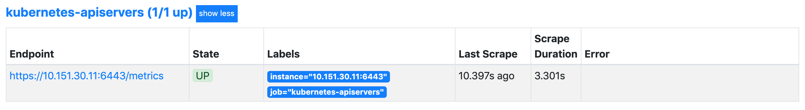

现在可以看到 `kubernetes-apiserver` 这个任务下面只有 apiserver 这一个实例了，证明我们的 `relabel` 是成功的，现在我们切换到 Graph 路径下面查看下采集到的数据，比如查询 apiserver 总的请求数：

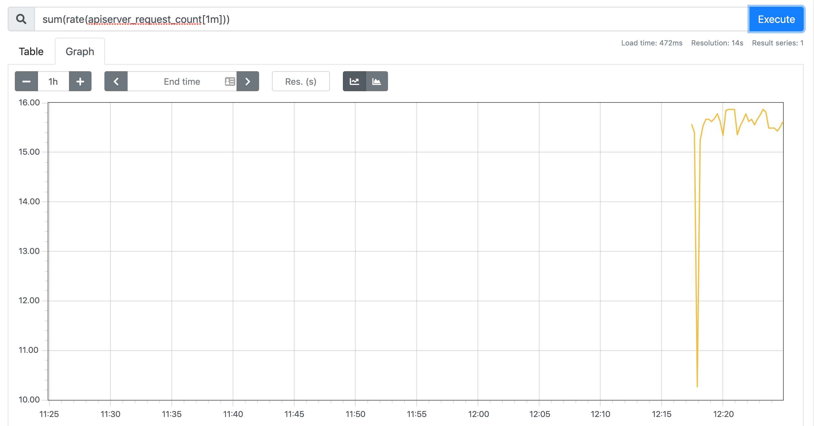

这样我们就完成了对 Kubernetes APIServer 的监控。

另外如果我们要监控其他系统组件，比如 kube-controller-manager、kube-scheduler 应该怎么做呢？

由于 apiserver 服务在 default namespace 下使用 Service kubernetes，而其余组件服务在 kube-system namespace 下面，如果我们想要监控这些组件的话，需要手动创建单独的 Service，其中 kube-sheduler 的指标数据端口为 10251，kube-controller-manager 对应的端口为 10252，大家可以尝试自己配置这几个系统组件。

## T4.7、监控 Pod

上面的 apiserver 实际上就是一种特殊的 Endpoints，现在我们配置一个任务，专门用来发现普通类型的 Endpoint，也就是 Service 关联的 Pod 列表：

```yaml
- job_name: 'kubernetes-endpoints'
  kubernetes_sd_configs:
  - role: endpoints
  relabel_configs:
  - source_labels: [__meta_kubernetes_service_annotation_prometheus_io_scrape]
    action: keep
    regex: true
  - source_labels: [__meta_kubernetes_service_annotation_prometheus_io_scheme]
    action: replace
    target_label: __scheme__
    regex: (https?)
  - source_labels: [__meta_kubernetes_service_annotation_prometheus_io_path]
    action: replace
    target_label: __metrics_path__
    regex: (.+)
  - source_labels: [__address__, __meta_kubernetes_service_annotation_prometheus_io_port]
    action: replace
    target_label: __address__
    regex: ([^:]+)(?::\d+)?;(\d+)  # RE2 正则规则，+是一次多多次，?是0次或1次，其中?:表示非匹配组(意思就是不获取匹配结果)
    replacement: $1:$2
  - action: labelmap
    regex: __meta_kubernetes_service_label_(.+)
  - source_labels: [__meta_kubernetes_namespace]
    action: replace
    target_label: kubernetes_namespace
  - source_labels: [__meta_kubernetes_service_name]
    action: replace
    target_label: kubernetes_name
  - source_labels: [__meta_kubernetes_pod_name]
    action: replace
    target_label: kubernetes_pod_name
```

注意我们这里在 `relabel_configs` 区域做了大量的配置，特别是第一个 `__meta_kubernetes_service_annotation_prometheus_io_scrape` 为 true 的才保留下来，这就是说要想自动发现集群中的 Endpoint，就需要我们在 Service 的 `annotation` 区域添加 `prometheus.io/scrape=true` 的声明，现在我们先将上面的配置更新，查看下效果：


我们可以看到 `kubernetes-endpoints` 这个任务下面只发现了两个服务，这是因为我们在 `relabel_configs` 中过滤了 `annotation` 有 `prometheus.io/scrape=true` 的 Service，而现在我们系统中只有一个 `kube-dns` 服务符合要求，该 Service 下面有两个实例，所以出现了两个实例：

```bash
$ kubectl get svc kube-dns -n kube-system -o yaml
apiVersion: v1
kind: Service
metadata:
  annotations:
    prometheus.io/port: "9153"  # metrics 接口的端口
    prometheus.io/scrape: "true"  # 这个注解可以让prometheus自动发现
  creationTimestamp: "2019-11-08T11:59:50Z"
  labels:
    k8s-app: kube-dns
    kubernetes.io/cluster-service: "true"
    kubernetes.io/name: KubeDNS
  name: kube-dns
  namespace: kube-system
......
```

现在我们在之前创建的 redis 这个 Service 中添加上 `prometheus.io/scrape=true` 这个 annotation：

```yaml
# prome-redis.yaml
kind: Service
apiVersion: v1
metadata:
  name: redis
  namespace: kube-mon
  annotations:
    prometheus.io/scrape: "true"
    prometheus.io/port: "9121"
spec:
  selector:
    app: redis
  ports:
  - name: redis
    port: 6379
    targetPort: 6379
  - name: prom
    port: 9121
    targetPort: 9121
```

由于 redis 服务的 metrics 接口在 9121 这个 redis-exporter 服务上面，所以我们还需要添加一个 `prometheus.io/port=9121` 这样的 annotations，然后更新这个 Service：

```bash
$ kubectl apply -f prome-redis.yaml
deployment.apps "redis" unchanged
service "redis" changed
```

更新完成后，去 Prometheus 查看 Targets 路径，可以看到 redis 服务自动出现在了 `kubernetes-endpoints` 这个任务下面：

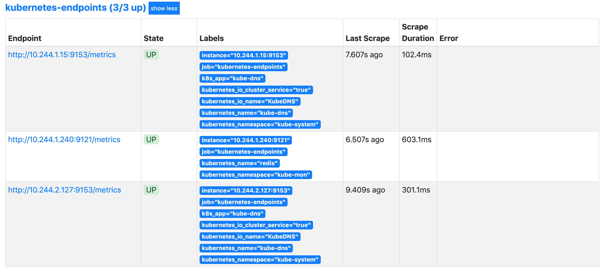

以后有了新的服务，如果服务本身提供了 `/metrics` 接口，我们就完全不需要用静态的方式去配置了，所以现在可以把前面配置的 redis 的静态配置去掉了。

## T4.8、kube-state-metrics

上面我们配置了基于 Endpoints 的自动服务发现监控，但这主要针对应用内部的自定义监控指标，需要应用本身提供 `/metrics` HTTP 端点，或通过对应的 exporter 来暴露应用级别的指标数据。然而，在 Kubernetes 集群中，各类资源对象（如 Pod、DaemonSet、Deployment、Job、CronJob 等）的运行状态本身也需要被监控，这些状态直接反映了集群的调度情况与应用的健康度。例如：

- 我期望运行的副本数是多少？实际可用的副本有几个？
- 有多少 Pod 处于 running、stopped 或 terminated 状态？
- Pod 发生了多少次重启？
- 当前有多少 Job 正在执行？

通过回顾之前从集群中采集的指标（主要来源于 kube-apiserver 和 kubelet 内置的 cAdvisor），我们发现其中并不包含这类资源对象级别的状态信息。对于 Prometheus 监控体系而言，此时就需要引入额外的 exporter 来暴露这些指标。为此，Kubernetes 社区提供了 [kube-state-metrics](https://github.com/kubernetes/kube-state-metrics) 组件，这正是我们所需的解决方案。

### 4.8.1、与 metric-server 对比

**metric-server**

- **功能定位**：从 Kubernetes API Server 采集节点和 Pod 的资源使用量指标（如 CPU、内存使用率）。
- **核心用途**：为 HPA（Horizontal Pod Autoscaler）、调度器等 Kubernetes 内部组件提供实时资源度量数据，以支持弹性伸缩等自动化决策。
- **输出形式**：对采集的原始数据进行聚合、格式化，并可通过 API 对外提供。

**kube-state-metrics**

- **功能定位**：专注于获取并暴露 Kubernetes 各类资源对象（如 Deployment、StatefulSet、Pod、Job 等）的状态与元数据信息。
- **核心用途**：反映资源对象的期望状态与实际状态，例如副本数、Pod 状态、重启次数、Job 完成情况等。
- **输出形式**：以 Prometheus 格式的指标暴露资源对象的状态信息。

**核心区别**

- **metric-server** 关注的是集群**物理资源的消耗情况**（例如 CPU 使用率、内存用量），属于资源监控。
- **kube-state-metrics** 关注的是集群**资源对象的状态信息**（例如 Deployment 是否健康、Pod 是否在运行），属于状态监控。

**与 Prometheus 的关系**

Prometheus 作为一个通用的监控系统，通常不直接采用 metric-server 聚合后的数据作为监控指标源，因为它更倾向于直接从源头（如 kubelet、应用自身）拉取原始指标。然而，Prometheus 可以监控 metric-server 组件本身的运行状态（例如其 Pod 是否正常、服务是否可访问），而这类监控恰恰可以借助 **kube-state-metrics** 提供的资源对象状态指标来实现。

### 4.8.2、安装

kube-state-metrics 官方提供了在 Kubernetes 中部署的清单文件。我们将代码克隆到本地，并注意其与 Kubernetes 版本的兼容性：

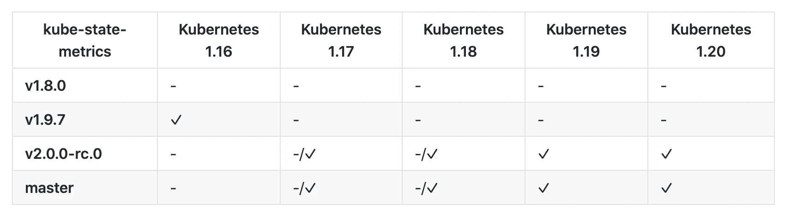

```bash
$ git clone https://github.com/kubernetes/kube-state-metrics.git
$ cd kube-state-metrics/examples/standard
```

默认的镜像仓库为 [gcr.io](https://gcr.io/)，您可以将其替换为可访问的镜像，例如将 `deployment.yaml` 中的镜像修改为：

```bash
image: cnych/kube-state-metrics:v2.0.0-rc.0
```

由于我们之前已为 Prometheus 配置了 Endpoints 自动发现，因此可以为 kube-state-metrics 的 Service 添加相应注解，使其被自动发现。

修改 `service.yaml` 文件，添加 Prometheus 采集注解：

```yaml
# service.yaml
apiVersion: v1
kind: Service
metadata:
  labels:
    app.kubernetes.io/name: kube-state-metrics
    app.kubernetes.io/version: 2.0.0-rc.0
  annotations:
    prometheus.io/scrape: "true"
    prometheus.io/port: "8080"  # 8081是kube-state-metrics应用本身指标的端口
  name: kube-state-metrics
  namespace: kube-system
```

```bash
$ kubectl apply -f .
clusterrolebinding.rbac.authorization.k8s.io/kube-state-metrics created
clusterrole.rbac.authorization.k8s.io/kube-state-metrics created
deployment.apps/kube-state-metrics created
serviceaccount/kube-state-metrics created
service/kube-state-metrics created
```

部署完成后，Prometheus 应能自动发现并采集 kube-state-metrics 指标：


### 4.8.3、水平分片（Horizontal Sharding）

kube-state-metrics 支持通过水平分片实现指标采集的横向扩展，适用于大规模 Kubernetes 集群（节点数 > 500 或对象数 > 10 万）。分片机制通过对 Kubernetes 对象的 UID 进行 MD5 哈希计算，并对总分片数取模，确保相同对象始终由同一分片实例采集。

**静态分片（稳定功能）**

通过以下 CLI 参数配置静态分片：

```bash
--shard=0                # 当前分片索引（0 起始）
--total-shards=3         # 总分片数量
```

**部署要求**：

- 每个分片需独立部署为单独的 Pod（通常使用 Deployment 多副本）
- 分片索引必须手动指定且互不重复
- 所有分片应配置相同的 `--resources` 和 `--namespaces` 参数
- 生产环境推荐配置 3–5 个分片，每个分片分配 1–2 CPU 和 1–2 GiB 内存

**自动分片（实验性功能）**

当以 StatefulSet 部署 kube-state-metrics 时，可通过 Downward API 自动注入 Pod 信息，启用自动分片发现：

```bash
args:
  - --pod=$(POD_NAME)
  - --pod-namespace=$(POD_NAMESPACE)
env:
  - name: POD_NAME
    valueFrom:
      fieldRef:
        fieldPath: metadata.name
  - name: POD_NAMESPACE
    valueFrom:
      fieldRef:
        fieldPath: metadata.namespace
```

> **重要提示**：自动分片为实验性功能，官方明确标注 "[This is an experimental feature and may be broken or removed without notice](https://github.com/kubernetes/kube-state-metrics?tab=readme-ov-file#automated-sharding)"。生产环境应优先使用静态分片配置。

部署示例参考官方仓库 `/examples/autosharding` 目录。

### 4.8.4、应用场景

1、工作负载健康度

```bash
# 存在失败状态的 Job
kube_job_status_failed{job="kube-state-metrics"} > 0

# 节点处于 NotReady 状态
kube_node_status_condition{condition="Ready", status="false"} == 1

# Pod 处于异常生命周期阶段
kube_pod_status_phase{phase=~"Failed|Unknown|Pending"} == 1

# 近 30 分钟内容器发生重启（使用 increase 避免计数器重置问题）
increase(kube_pod_container_status_restarts_total[30m]) > 0
```

> **技术说明**：`kube_pod_container_status_restarts_total` 为计数器（Counter）类型，应使用 `increase()` 或 `rate()` 计算增量，**避免使用 `changes()`**（该函数适用于记录状态变更次数的 Gauge 指标，不适用于计数器）。

2、资源配置一致性

```bash
# Deployment 副本偏差（期望副本数 - 可用副本数）
kube_deployment_spec_replicas{namespace="default"} 
  - kube_deployment_status_replicas_available{namespace="default"}

# StatefulSet 更新停滞
kube_statefulset_status_current_revision != kube_statefulset_status_update_revision
```

3、安全与合规

```bash
# 特权容器运行检测
kube_pod_container_security_context_privileged == 1

# 容器未设置 CPU 限制
kube_pod_container_resource_limits_cpu_cores == 0

# Pod 以 root 用户运行
kube_pod_container_info{uid="0"} == 1
```

**标签冲突问题：`namespace` 与 `exported_namespace`**

> 问题现象：
>
> 在 Prometheus 中查询指标时，观察到：
>
> - 指标包含 `exported_namespace` 标签而非预期的 `namespace`
> - 使用 `namespace="your-ns"` 过滤无结果，但 `exported_namespace="your-ns"` 可返回数据
>
> 根本原因：
>
> 此现象**并非 kube-state-metrics 指标设计变更**，而是由 Prometheus 抓取机制导致的标签冲突：
>
> | 标签来源          | 标签名      | 含义                                                   |
> | ----------------- | ----------- | ------------------------------------------------------ |
> | **Scrape Target** | `namespace` | kube-state-metrics Pod 所在命名空间（如 `monitoring`） |
> | **指标原始标签**  | `namespace` | 被监控资源的实际命名空间（如 `default`）               |
>
> 当两者冲突时，Prometheus 默认将指标原始标签重命名为 `exported_namespace` 以保留两者 。
>
> 解决方案：
>
> **配置 `honor_labels: true`**，在 Prometheus scrape 配置中启用标签保留：
>
> ```yaml
> scrape_configs:
>   - job_name: 'kube-state-metrics'
>     honor_labels: true  # 保留指标原始标签，避免重命名
>     kubernetes_sd_configs:
>       - role: endpoints
>     relabel_configs:
>       - source_labels: [__meta_kubernetes_service_label_app_kubernetes_io_name]
>         regex: kube-state-metrics
>         action: keep
> ```
>
> - 指标标签保持为 `namespace="default"`（资源真实命名空间）
> - 不再出现 `exported_namespace` 标签
> - 查询语句无需修改，直接使用 `namespace` 过滤

**故障排查清单**

| 问题         | 检查项                                                       | 修复措施                                        |
| ------------ | ------------------------------------------------------------ | ----------------------------------------------- |
| 查询无数据   | 1. 检查 Prometheus target 状态<br />2. 验证 `honor_labels` 配置 | 启用 `honor_labels: true`，重启 Prometheus      |
| 指标基数过高 | 检查是否导出全部 annotations/labels                          | 配置 `--metric-labels-allowlist` 限制高基数标签 |
| 分片指标缺失 | 验证所有分片的 `--shard`/`--total-shards` 一致性             | 确保分片索引 0..N-1 连续且总数一致              |
| 指标命名异常 | 对比官方指标文档 `/docs/metrics/`                            | 升级至兼容版本，避免使用已废弃指标              |

> 官方资源：
>
> - **指标完整列表**：`/docs/metrics/` 目录（按资源类型分类）
> - **部署示例**：`/examples/standard/`
> - **GitHub 仓库**：https://github.com/kubernetes/kube-state-metrics
> - **Kubernetes 官方文档**：https://kubernetes.io/docs/concepts/cluster-administration/kube-state-metrics/

## T4.9、Grafana

前面我们使用 Prometheus 采集了 Kubernetes 集群中的一些监控数据指标，我们也尝试使用 promQL 语句查询出了一些数据，并且在 Prometheus 的 Dashboard 中进行了展示，但是 Prometheus 的图表功能相对较弱，我们需要一个专业的工具来展示这些数据，这里采用 [Grafana](http://grafana.com/)。

Grafana 是一个可视化面板，有着非常漂亮的图表和布局展示，专业的度量仪表盘和图形编辑器，支持 Graphite、zabbix、InfluxDB、Prometheus、OpenTSDB、Elasticsearch 等作为数据源，比 Prometheus 自带的图表展示功能强大很多，支持丰富的插件。

### 4.9.1、安装

同样的我们将 grafana 安装到 Kubernetes 集群中，可以先查看一下 grafana 的 docker 镜像介绍，在 dockerhub 上搜索，也可以去官网查看相关资料，镜像地址如下：https://hub.docker.com/r/grafana/grafana/，我们可以看到介绍中运行 grafana 容器的命令非常简单：

```bash
$ docker run -d --name=grafana -p 3000:3000 grafana/grafana
```

这里需要注意 Changelog 中 v5.1.0 版本的更新介绍：

```bash
Major restructuring of the container
Usage of chown removed
File permissions incompatibility with previous versions
user id changed from 104 to 472
group id changed from 107 to 472
Runs as the grafana user by default (instead of root)
All default volumes removed
```

特别需要注意第 3 条，userid 和 groupid 都有所变化，所以我们在运行容器的时候需要注意这个变化。现在我们将这个容器转化成 Kubernetes 中的 Pod：

```yaml
# grafana.yaml
apiVersion: apps/v1
kind: Deployment
metadata:
  name: grafana
  namespace: kube-mon
spec:
  selector:
    matchLabels:
      app: grafana
  template:
    metadata:
      labels:
        app: grafana
    spec:
      volumes:
      - name: storage
        hostPath:
          path: /data/k8s/grafana/
      nodeSelector:
        kubernetes.io/hostname: node2
      securityContext:
        runAsUser: 0
      containers:
      - name: grafana
        image: grafana/grafana:7.4.3
        imagePullPolicy: IfNotPresent
        ports:
        - containerPort: 3000
          name: grafana
        env:
        - name: GF_SECURITY_ADMIN_USER
          value: admin
        - name: GF_SECURITY_ADMIN_PASSWORD
          value: admin321
        readinessProbe:
          failureThreshold: 10
          httpGet:
            path: /api/health
            port: 3000
            scheme: HTTP
          initialDelaySeconds: 60
          periodSeconds: 10
          successThreshold: 1
          timeoutSeconds: 30
        livenessProbe:
          failureThreshold: 3
          httpGet:
            path: /api/health
            port: 3000
            scheme: HTTP
          periodSeconds: 10
          successThreshold: 1
          timeoutSeconds: 1
        resources:
          limits:
            cpu: 150m
            memory: 512Mi
          requests:
            cpu: 150m
            memory: 512Mi
        volumeMounts:
        - mountPath: /var/lib/grafana
          name: storage
---
apiVersion: v1
kind: Service
metadata:
  name: grafana
  namespace: kube-mon
spec:
  type: NodePort
  ports:
    - port: 3000
  selector:
    app: grafana
```

镜像版本 `grafana/grafana:7.4.3`，然后添加了健康检查、资源声明，另外两个比较重要的环境变量`GF_SECURITY_ADMIN_USER` 和 `GF_SECURITY_ADMIN_PASSWORD`，用来配置 grafana 的管理员用户和密码。

由于 grafana 将 dashboard、插件这些数据保存在 `/var/lib/grafana` 这个目录下面，所以如果需要做数据持久化，就需要针对这个目录进行 volume 挂载声明。

同 Prometheus 一样，我们将 grafana 固定在一个具有 `kubernetes.io/hostname=node2` 标签的节点，由于上面我们刚刚提到 Changelog 中 grafana 的 userid 和 groupid 有所变化，所以我们这里增加一个 `securityContext`，声明使用 root 用户运行。

最后，我们需要对外暴露 grafana 这个服务，所以我们需要一个对应的 Service 对象，当然用 NodePort 或者再建立一个 ingress 对象都是可行的。

现在我们直接创建上面的这些资源对象：

```bash
$ kubectl apply -f grafana.yaml
deployment.apps "grafana" created
service "grafana" created
```

创建完成后，我们可以查看 grafana 对应的 Pod 是否正常：

```bash
$ kubectl get pods -n kube-mon -l app=grafana         
NAME                       READY   STATUS    RESTARTS   AGE
grafana-5579769f64-vfn7q   1/1     Running   0          77s
$ kubectl logs -f grafana-5579769f64-vfn7q -n kube-mon
......
logger=settings var="GF_SECURITY_ADMIN_USER=admin"
t=2019-12-13T06:35:08+0000 lvl=info msg="Config overridden from Environment variable"
......
t=2019-12-13T06:35:08+0000 lvl=info msg="Initializing Stream Manager"
t=2019-12-13T06:35:08+0000 lvl=info msg="HTTP Server Listen" logger=http.server address=[::]:3000 protocol=http subUrl= socket=
```

看到上面的日志信息就证明 grafana 的 Pod 已经正常启动起来了。这个时候我们可以查看 Service 对象：

```bash
$ kubectl get svc -n kube-mon
NAME         TYPE        CLUSTER-IP      EXTERNAL-IP   PORT(S)             AGE
grafana      NodePort    10.104.116.58   <none>        3000:31548/TCP      12m
......
```

现在我们就可以在浏览器中使用 `http://<任意节点IP:31548>` 来访问 grafana 这个服务了：


由于上面我们配置了管理员，所以第一次打开的时候会跳转到登录界面，然后就可以用上面我们配置的两个环境变量的值来进行登录，登录完成后就可以进入到 Grafana 的首页，然后点击 `Add data source` 进入添加数据源界面。

我们要配置的数据源是 `Prometheus`，Prometheus 和 Grafana 都处于 kube-mon namespace 下面，所以我们这里的数据源地址：`http://prometheus:9090`，因为在同一个 namespace 下面，可以直接用 Service 服务名，然后其他的配置信息就根据实际情况了，比如 Auth 认证，我们这里没有，所以跳过即可，点击最下方的 `Save & Test`，提示成功证明我们的数据源配置正确：


### 4.9.2、插件

我们也可以安装一些其他插件，比如 grafana 就有一个专门针对 Kubernetes 集群监控的插件 [grafana-kubernetes-app](https://grafana.com/plugins/grafana-kubernetes-app)，这里我们介绍一个功能更加强大的插件 [DevOpsProdigy KubeGraf](https://github.com/devopsprodigy/kubegraf/)，它是 Grafana 官方的 [Kubernetes 插件](https://grafana.com/plugins/grafana-kubernetes-app) 的升级版本，该插件可以用来可视化和分析 Kubernetes 集群的性能，通过各种图形直观的展示了 Kubernetes 集群主要服务的指标和特征，还可以用于检查应用程序的生命周期和错误日志。

要安装这个插件，需要到 grafana Pod 里面执行安装命令：

```bash
$ kubectl exec -it grafana-5579769f64-7729f -n kube-mon /bin/bash
bash-5.0# grafana-cli plugins install devopsprodigy-kubegraf-app

installing devopsprodigy-kubegraf-app @ 1.5.1
from: https://grafana.com/api/plugins/devopsprodigy-kubegraf-app/versions/1.5.1/download
into: /var/lib/grafana/plugins

✔ Installed devopsprodigy-kubegraf-app successfully
installing grafana-piechart-panel @ 1.6.1
from: https://grafana.com/api/plugins/grafana-piechart-panel/versions/1.6.1/download
into: /var/lib/grafana/plugins

✔ Installed grafana-piechart-panel successfully
Installed dependency: grafana-piechart-panel ✔

Restart grafana after installing plugins . <service grafana-server restart>
```

安装完成后需要重启 grafana 才会生效，我们这里直接删除 Pod，重建即可。Pod 删除重建完成后插件就安装成功了。然后通过浏览器打开 Grafana 找到该插件，点击 `enable` 启用插件。

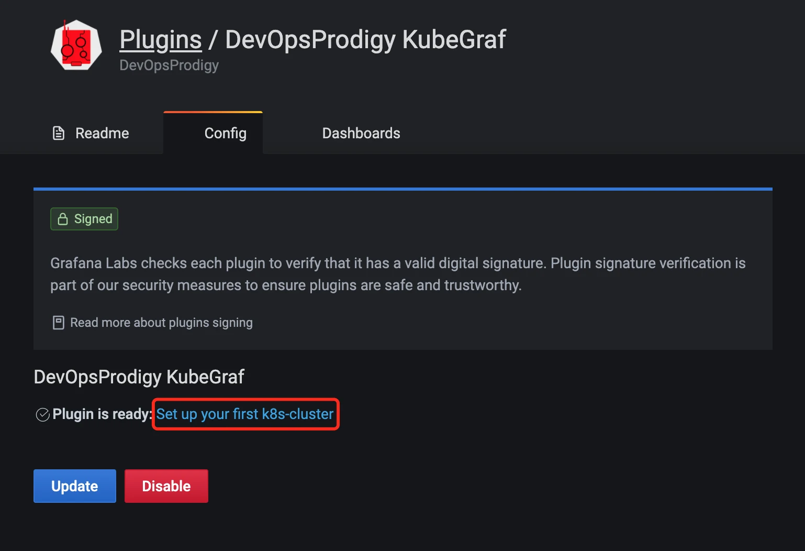

点击 `Set up your first k8s-cluster` 创建一个新的 Kubernetes 集群：

- URL 使用 Kubernetes Service 地址即可：https://kubernetes.default:443
- Access 访问模式使用：`Server(default)`
- 由于插件访问 Kubernetes 集群的各种资源对象信息，所以我们需要配置访问权限，这里我们可以简单使用 kubectl 的 `kubeconfig` 来进行配置即可。
- 勾选 Auth 下面的 `TLS Client Auth` 和 `With CA Cert` 两个选项
- 其中 `TLS Auth Details` 下面的值就对应 `kubeconfig` 里面的证书信息。比如我们这里的 `kubeconfig` 文件格式如下所示：

```yaml
apiVersion: v1
clusters:
- cluster:
    certificate-authority-data: <certificate-authority-data>
    server: https://master1:6443
  name: kubernetes
contexts:
- context:
    cluster: kubernetes
    user: kubernetes-admin
  name: kubernetes-admin@kubernetes
current-context: 'kubernetes-admin@kubernetes'
kind: Config
preferences: {}
users:
- name: kubernetes-admin
  user:
    client-certificate-data: <client-certificate-data>
    client-key-data: <client-key-data>
```

那么 `CA Cert` 的值就对应 `kubeconfig` 里面的 `<certificate-authority-data>` 进行 base64 解码过后的值；`Client Cert` 的值对应 `<client-certificate-data>` 进行 base64 解码过后的值；`Client Key` 的值就对应 `<client-key-data>` 进行 base64 解码过后的值。

- 最后在 `additional datasources` 下拉列表中选择 prometheus 的数据源。
- 点击 `Save & Test` 就可以保存成功了。

> 对于 base64 解码推荐使用一些在线的服务，比如 [https://www.base64decode.org](https://www.base64decode.org/)，非常方便。

插件配置完成后，在左侧栏就会出现 `DevOpsProdigy KubeGraf` 插件的入口，通过插件页面可以查看整个集群的状态。

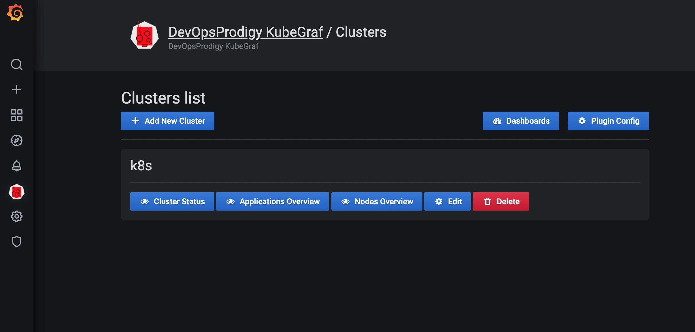

还有几个漂亮的 Dashboard 可以供我们来进行监控图表的展示：

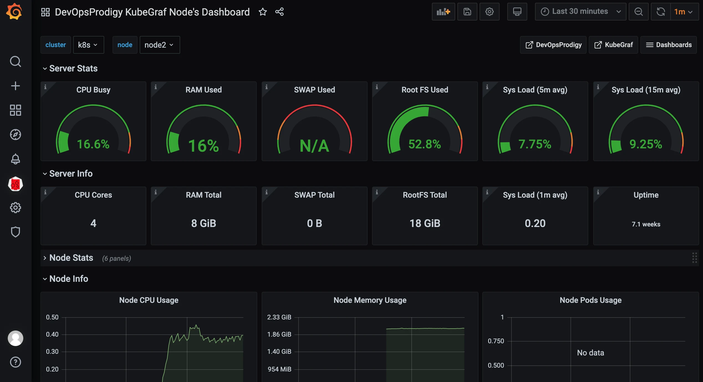

### 4.9.3、导入 Dashboard

为了能够快速对系统进行监控，我们可以直接复用别人的 Grafana Dashboard，在 Grafana 的官方网站上就有很多非常优秀的第三方 Dashboard，我们完全可以直接导入进来即可。比如我们想要对所有的集群节点进行监控，也就是 node-exporter 采集的数据，这里我们就可以导入 https://grafana.com/grafana/dashboards/8919 这个 Dashboard。

在侧边栏点击 "+"，选择 `Import`，在 Grafana Dashboard 的文本框中输入 8919 即可导入：

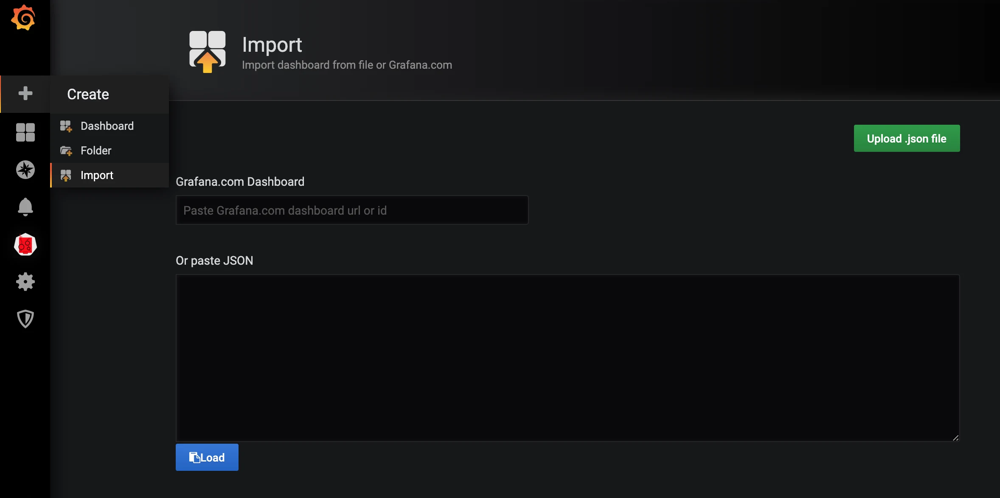

进入导入 Dashboard 的页面，可以编辑名称，选择 Prometheus 的数据源：

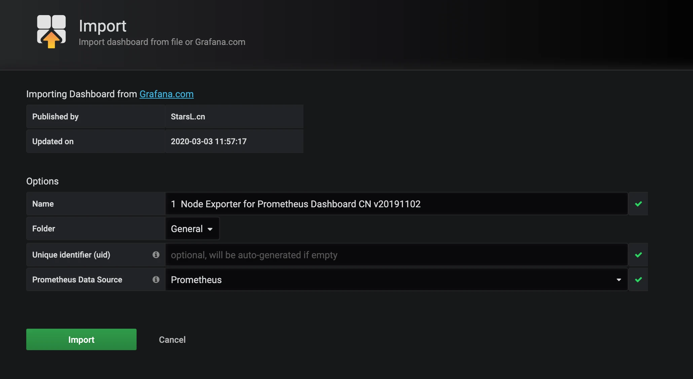

保存后即可进入导入的 Dashboard 页面。由于该 Dashboard 更新比较及时，所以基本上导入进来就可以直接使用了，我们也可以对页面进行一些调整，如果有的图表没有出现对应的图形，则可以编辑根据查询语句去 DEBUG。

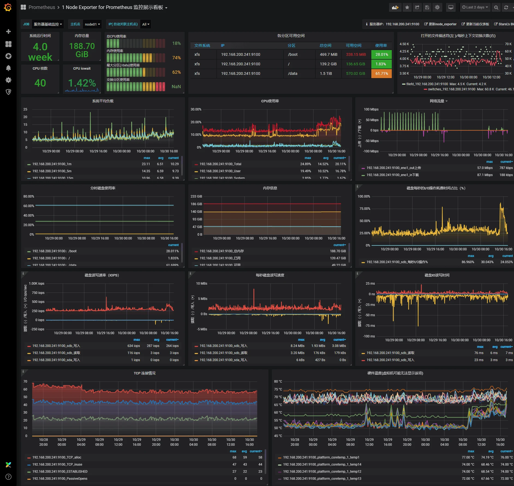

### 4.9.4、自定义图表

导入现成的第三方 Dashboard 或许能解决我们大部分问题，但是毕竟还会有需要定制图表的时候，这个时候就需要了解如何去自定义图表了。

同样在侧边栏点击 "+"，选择 Dashboard，然后选择 `Add new panel` 创建一个图表：

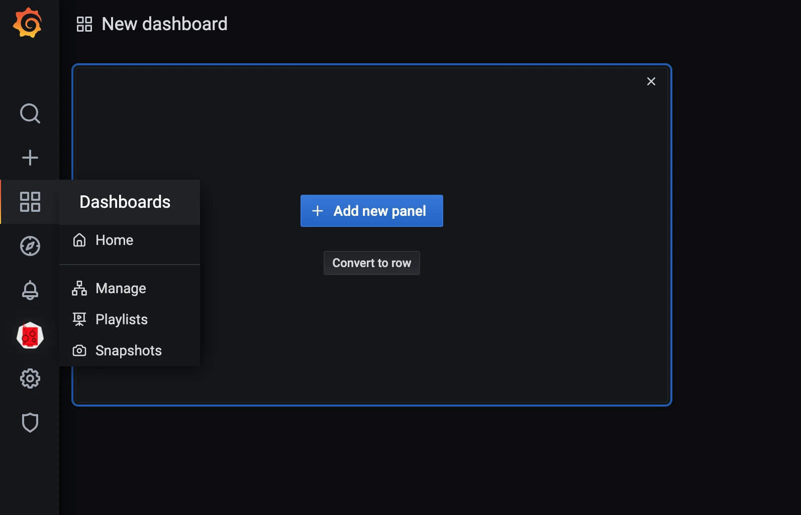

然后在下方 Query 栏中选择 `Prometheus` 这个数据源：

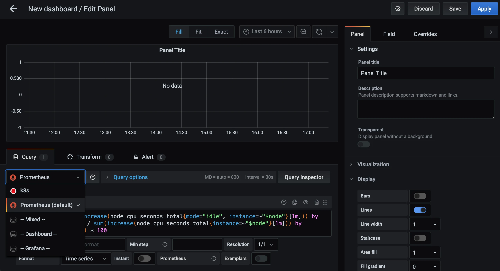

然后在 `Metrics` 区域输入我们要查询的监控 PromQL 语句，比如我们这里想要查询集群节点 CPU 的使用率：

```bash
(1 - sum(increase(node_cpu_seconds_total{mode="idle", instance=~"$node"}[1m])) by (instance) / sum(increase(node_cpu_seconds_total{instance=~"$node"}[1m])) by (instance)) * 100
```

虽然我们现在还没有具体的学习过 PromQL 语句，但其实我们仔细分析上面的语句也不是很困难，集群节点的 CPU 使用率实际上就相当于排除空闲 CPU 的使用率，所以我们可以优先计算空闲 CPU 的使用时长，除以总的 CPU 时长就是空闲率了，1 减空闲率就是 CPU 的使用率，如果想用百分比来表示的话，则乘以 100 即可。

这里有一个需要注意的地方是在 PromQL 语句中有一个 `instance=~"$node"` 的标签，其实意思就是根据 `$node` 这个参数来进行过滤，也就是我们希望在 Grafana 里面通过参数化来控制每一次计算哪一个节点的 CPU 使用率。

所以这里就涉及到 Grafana 里面的参数使用。点击页面顶部的 `Dashboard Settings` 按钮进入配置页面：

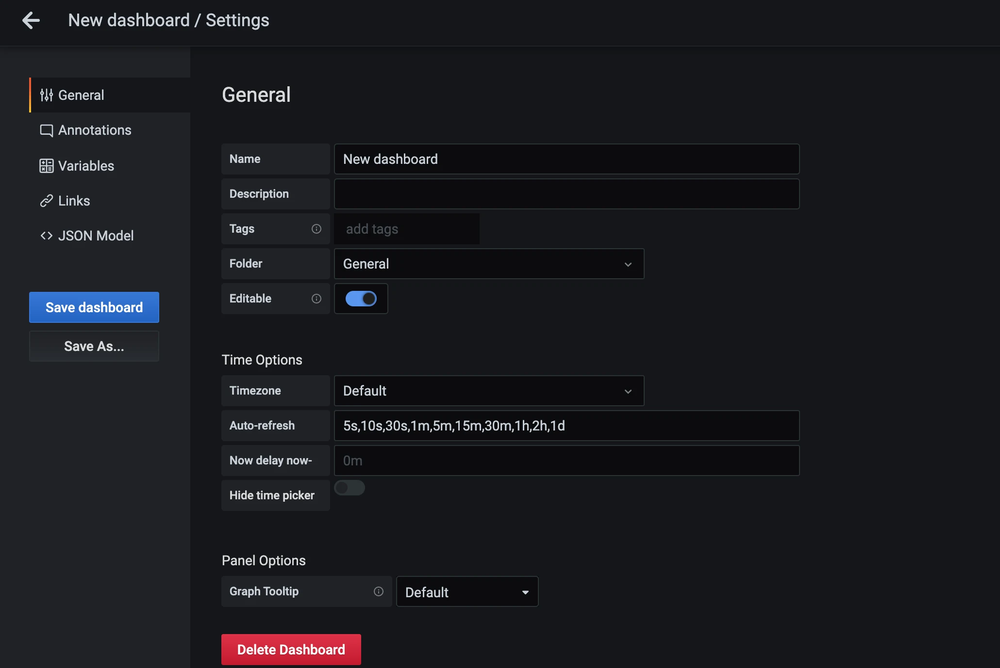

在左侧 tab 栏点击 `Variables` 进入参数配置页面，如果还没有任何参数，可以通过点击 `Add Variable` 添加一个新的变量：

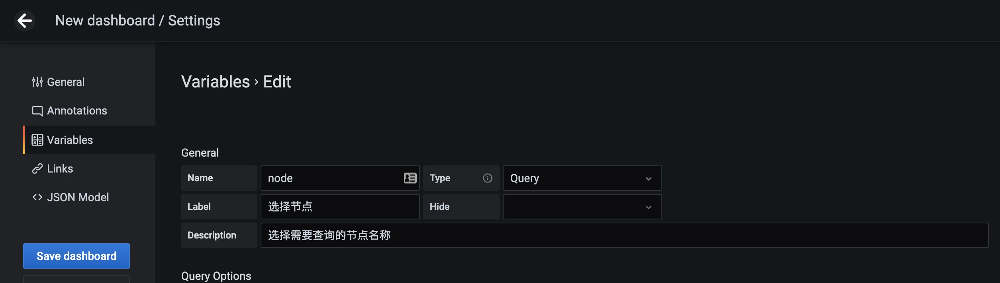

这里需要注意的是变量的名称 `node` 就是上面我们在 PromQL 语句里面使用的 `$node` 这个参数，这两个地方必须保持一致，然后最重要的就是参数的获取方式了，比如我们可以通过 `Prometheus` 这个数据源，通过 `kubelet_node_name` 这个指标来获取，在 Prometheus 里面我们可以查询该指标获取到的值为：

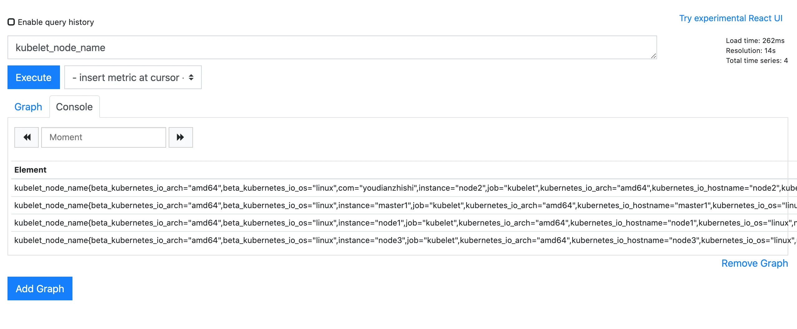

其实我们只想要获取节点的名称，所以我们可以用正则表达式去匹配 `node=xxx` 这个标签，将匹配的值作为参数的值即可：

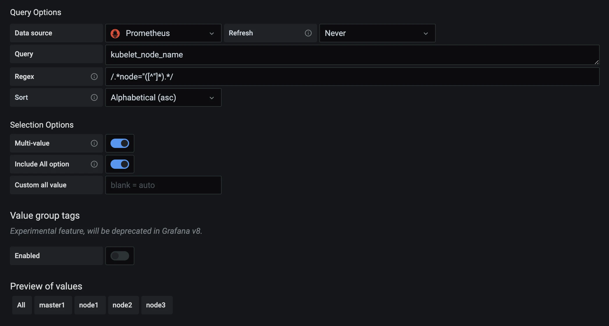

在最下面的 `Preview of values` 里面会有获取的参数值的预览结果。除此之外，我们还可以使用一个更方便的 `label_values` 函数来获取，该函数可以用来直接获取某个指标的 label 值：

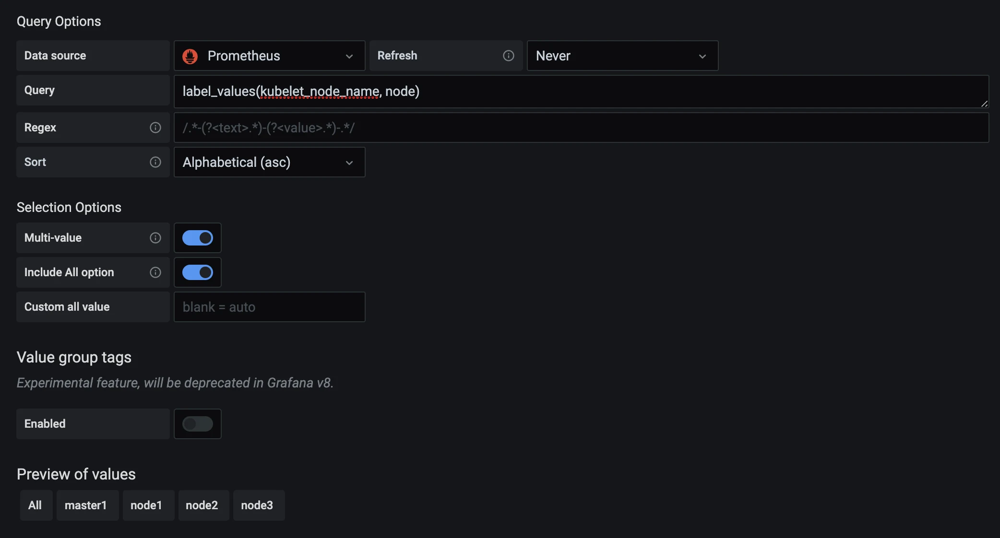

另外由于我们希望能够让用户选择一次性可以查询多少个节点的数据，所以我们将 `Multi-value` 以及 `Include All option` 都勾选上了，保存后跳转到 Dashboard 页面就可以看到我们自定义的图表信息：

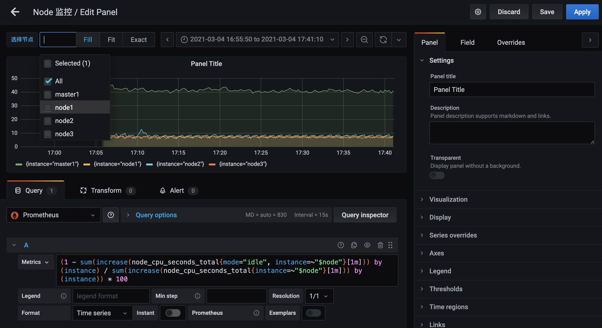

而且还可以根据参数选择一个或者多个节点，当然图表的标题和大小都可以更改：

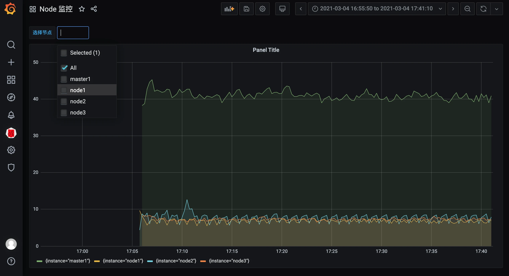

## T4.10、PromQL

Prometheus 通过指标名称（metrics name）以及对应的一组标签（label）定义一条唯一的时间序列。指标名称反映了监控样本的基本标识，而 label 则在这个基本特征上为采集到的数据提供了多种特征维度。用户可以基于这些特征维度进行过滤、聚合、统计从而产生一条计算后的新时间序列。

`PromQL` 是 Prometheus 内置的数据查询语言，提供对时间序列数据丰富的查询，聚合以及逻辑运算能力的支持。并且被广泛应用在 Prometheus 的日常应用当中，包括对数据查询、可视化、告警处理。可以这么说，`PromQL` 是 Prometheus 所有应用场景的基础，理解和掌握 `PromQL` 是我们使用 Prometheus 必备的技能。

### 4.10.1、时间序列

前面我们通过 node-exporter 暴露的 metrics 服务，Prometheus 可以采集到当前主机所有监控指标的样本数据。例如：

```bash
# HELP node_cpu_seconds_total Seconds the cpus spent in each mode.
# TYPE node_cpu_seconds_total counter
node_cpu_seconds_total{cpu="0",mode="idle"} 6.62885731e+06
# HELP node_load1 1m load average.
# TYPE node_load1 gauge
node_load1 2.29
```

其中非 `#` 开头的每一行表示当前 node-exporter 采集到的一个监控样本，`node_cpu_seconds_total` 和 `node_load1` 表示当前指标的名称，大括号中的标签则反映了当前样本的一些特征和维度，浮点数则是该监控样本的具体值。

Prometheus 会将所有采集到的样本数据以时间序列的方式保存在**内存数据库**中，并且定时保存到硬盘上。时间序列是按照时间戳和值的序列顺序存放的，我们称之为向量(vector)，每条时间序列通过指标名称(metrics name)和一组标签集(labelset)命名。如下所示，可以将时间序列理解为一个以时间为 X 轴的数字矩阵：

```bash
  ^
  │   . . . . . . . . . . . . . . . . .   . .   node_cpu_seconds_total{cpu="cpu0",mode="idle"}
  │     . . . . . . . . . . . . . . . . . . .   node_cpu_seconds_total{cpu="cpu0",mode="system"}
  │     . . . . . . . . . .   . . . . . . . .   node_load1{}
  │     . . . . . . . . . . . . . . . .   . .  
  v
    <------------------ 时间 ---------------->
```

在时间序列中的每一个点称为一个样本（sample），样本由以下三部分组成：

- 指标(metric)：包括 metric name 和描述当前样本特征的 labelsets
- 时间戳(timestamp)：一个精确到毫秒的时间戳
- 样本值(value)： 一个 float64 浮点型数据

如下所示：

```bash
<--------------- metric ---------------------><-timestamp -><-value->
http_request_total{status="200", method="GET"}@1434417560938 => 94355
http_request_total{status="200", method="GET"}@1434417561287 => 94334

http_request_total{status="404", method="GET"}@1434417560938 => 38473
http_request_total{status="404", method="GET"}@1434417561287 => 38544

http_request_total{status="200", method="POST"}@1434417560938 => 4748
http_request_total{status="200", method="POST"}@1434417561287 => 4785
```

在形式上，所有的指标(Metric)都通过如下格式表示：

```bash
<metric name>{<label name> = <label value>, ...}
```

- 指标的名称(metric name)可以反映被监控样本的含义（比如 http_request_total 表示当前系统接收到的 HTTP 请求总量）。指标名称只能由 ASCII 字符、数字、下划线以及冒号组成，并且必须符合正则表达式 `[a-zA-Z_:][a-zA-Z0-9_:]*`。
- 标签(label)反映了当前样本的特征维度，通过这些维度 Prometheus 可以对样本数据进行过滤，聚合等。标签的名称只能由 ASCII 字符、数字以及下划线组成，并且满足正则表达式 `[a-zA-Z_][a-zA-Z0-9_]*`。

每个不同的 `metric_name` 和 `label` 组合都称为**时间序列**，在 Prometheus 的表达式语言中，表达式或子表达式有以下四种类型：

- 瞬时向量（Instant vector）：一组时间序列，每个时间序列包含单个样本，它们共享相同的时间戳。也就是说，表达式的返回值中只会包含该时间序列中的最新的一个样本值。而这样的表达式称之为瞬时向量表达式。
- 区间向量（Range vector）：一组时间序列，每个时间序列包含一段时间范围内的样本数据，这些是通过将时间选择器附加到方括号中的瞬时向量（例如[5m]5分钟）而生成的。
- 标量（Scalar）：一个简单的数字浮点值。
- 字符串（String）：一个简单的字符串值。

所有指标都是 Prometheus 定期从 metrics 接口那里采集过来的。采集间隔时间由 `prometheus.yaml` 配置中的 `scrape_interval` 指定。最多抓取间隔为 30 秒，这意味着至少每 30 秒就会有一个带有新时间戳记录的新数据点，这个值可能会更改，也可能不会更改，但是每隔 `scrape_interval` 都会产生一个新的数据点。

### 4.10.2、指标类型

从存储上来讲，所有的监控指标 metric 都是相同的，但是在不同的场景下这些 metric 又有一些细微的差异。 例如，在 Node Exporter 返回的样本中指标 `node_load1` 反应的是当前系统的负载状态，随着时间的变化这个指标返回的样本数据是在不断变化的。

而指标 `node_cpu_seconds_total` 所获取到的样本数据却不同，它是一个持续增大的值，因为其反应的是 CPU 的累计使用时间，从理论上讲只要系统不关机，这个值是会一直变大的。

为了能够帮助用户理解和区分这些不同监控指标之间的差异，Prometheus 定义了 4 种不同的指标类型：Counter（计数器）、Gauge（仪表盘）、Histogram（直方图）、Summary（摘要）。

在 node-exporter 返回的样本数据中，其注释中也包含了该样本的类型。例如：

```bash
# HELP node_cpu_seconds_total Seconds the cpus spent in each mode.
# TYPE node_cpu_seconds_total counter
node_cpu_seconds_total{cpu="cpu0",mode="idle"} 362812.7890625
```

#### 4.10.2.1、Counter

`Counter` (只增不减的计数器) 类型的指标其工作方式和计数器一样，只增不减。常见的监控指标，如 `http_requests_total`、`node_cpu_seconds_total` 都是 `Counter` 类型的监控指标。

`Counter` 是一个简单但又强大的工具，例如我们可以在应用程序中记录某些事件发生的次数，通过以时间序列的形式存储这些数据，我们可以轻松的了解该事件产生的速率变化。`PromQL` 内置的聚合操作和函数可以让用户对这些数据进行进一步的分析，例如，通过 `rate()` 函数获取 HTTP 请求量的增长率：

```bash
rate(http_requests_total[5m])
```

查询当前系统中，访问量前 10 的 HTTP 请求：

```bash
topk(10, http_requests_total)
```

#### 4.10.2.2、Gauge

与 `Counter` 不同，`Gauge`（可增可减的仪表盘）类型的指标侧重于反应系统的当前状态。因此这类指标的样本数据可增可减。常见指标如：`node_memory_MemFree_bytes`（主机当前空闲的内存大小）、`node_memory_MemAvailable_bytes`（可用内存大小）都是 `Gauge` 类型的监控指标。通过 `Gauge` 指标，用户可以直接查看系统的当前状态：

```bash
node_memory_MemFree_bytes
```

对于 `Gauge` 类型的监控指标，通过 `PromQL` 内置函数 `delta()` 可以获取样本在一段时间范围内的变化情况。例如，计算 CPU 温度在两个小时内的差异：

```bash
delta(cpu_temp_celsius{host="zeus"}[2h])
```

还可以直接使用 `predict_linear()` 对数据的变化趋势进行预测。例如，预测系统磁盘空间在 4 个小时之后的剩余情况：

```bash
predict_linear(node_filesystem_free_bytes[1h], 4 * 3600)
```

#### 4.10.2.3、Histogram 和 Summary

除了 `Counter` 和 `Gauge` 类型的监控指标以外，Prometheus 还定义了 `Histogram` 和 `Summary` 指标类型。`Histogram` 和 `Summary` 主要用于统计和分析样本的分布情况。

在大多数情况下人们都倾向于使用某些量化指标的平均值，例如 CPU 的平均使用率、页面的平均响应时间，这种方式也有很明显的问题，以系统 API 调用的平均响应时间为例：

+ 如果大多数 API 请求都维持在 100ms 的响应时间范围内，而个别请求的响应时间需要 5s，那么就会导致某些 WEB 页面的响应时间落到**中位数**上，而这种现象被称为**长尾问题**。

+ 为了区分是平均的慢还是长尾的慢，最简单的方式就是按照请求延迟的范围进行分组。
  + 例如，统计延迟在 0~10ms 之间的请求数有多少，而 10~20ms 之间的请求数又有多少。
  + 通过这种方式可以快速分析系统慢的原因。`Histogram` 和 `Summary` 都是为了能够解决这样的问题而存在的。
  + 通过 `Histogram` 和`Summary` 类型的监控指标，我们可以快速了解监控样本的分布情况。

例如，指标 `prometheus_tsdb_wal_fsync_duration_seconds` 的指标类型为 Summary。它记录了 Prometheus Server 中 `wal_fsync` 的处理时间，通过访问 Prometheus Server 的 `/metrics` 地址，可以获取到以下监控样本数据：

```bash
# HELP prometheus_tsdb_wal_fsync_duration_seconds Duration of WAL fsync.
# TYPE prometheus_tsdb_wal_fsync_duration_seconds summary
prometheus_tsdb_wal_fsync_duration_seconds{quantile="0.5"} 0.012352463
prometheus_tsdb_wal_fsync_duration_seconds{quantile="0.9"} 0.014458005
prometheus_tsdb_wal_fsync_duration_seconds{quantile="0.99"} 0.017316173
prometheus_tsdb_wal_fsync_duration_seconds_sum 2.888716127000002
prometheus_tsdb_wal_fsync_duration_seconds_count 216
```

从上面的样本中可以得知当前 Prometheus Server 进行 `wal_fsync` 操作的总次数为 216 次，耗时 2.888716127000002s。其中中位数（quantile=0.5）的耗时为 0.012352463，9 分位数（quantile=0.9）的耗时为 0.014458005s。

在 Prometheus Server 自身返回的样本数据中，我们还能找到类型为 Histogram 的监控指标 `prometheus_tsdb_compaction_chunk_range_seconds_bucket`：

```bash
# HELP prometheus_tsdb_compaction_chunk_range_seconds Final time range of chunks on their first compaction
# TYPE prometheus_tsdb_compaction_chunk_range_seconds histogram
prometheus_tsdb_compaction_chunk_range_seconds_bucket{le="100"} 71
prometheus_tsdb_compaction_chunk_range_seconds_bucket{le="400"} 71
prometheus_tsdb_compaction_chunk_range_seconds_bucket{le="1600"} 71
prometheus_tsdb_compaction_chunk_range_seconds_bucket{le="6400"} 71
prometheus_tsdb_compaction_chunk_range_seconds_bucket{le="25600"} 405
prometheus_tsdb_compaction_chunk_range_seconds_bucket{le="102400"} 25690
prometheus_tsdb_compaction_chunk_range_seconds_bucket{le="409600"} 71863
prometheus_tsdb_compaction_chunk_range_seconds_bucket{le="1.6384e+06"} 115928
prometheus_tsdb_compaction_chunk_range_seconds_bucket{le="6.5536e+06"} 2.5687892e+07
prometheus_tsdb_compaction_chunk_range_seconds_bucket{le="2.62144e+07"} 2.5687896e+07
prometheus_tsdb_compaction_chunk_range_seconds_bucket{le="+Inf"} 2.5687896e+07
prometheus_tsdb_compaction_chunk_range_seconds_sum 4.7728699529576e+13
prometheus_tsdb_compaction_chunk_range_seconds_count 2.5687896e+07
```

与 `Summary` 类型的指标相似之处在于 `Histogram` 类型的样本同样会反应当前指标的记录的总数（以 `_count` 作为后缀）以及其值的总量（以 `_sum` 作为后缀）。不同在于 `Histogram` 指标直接反应了在不同区间内样本的个数，区间通过标签 le 进行定义。

### 4.10.3、查询

当 Prometheus 采集到监控指标样本数据后，我们就可以通过 PromQL 对监控样本数据进行查询。基本的 Prometheus 查询的结构非常类似于一个 metric 指标，以指标名称开始。

#### 4.10.3.1、查询结构

比如只查询 `node_cpu_seconds_total` 则会返回所有采集节点的所有类型的 CPU 时长数据，当然如果数据量特别大的时候，直接在 Grafana 执行该查询操作的时候，则可能导致浏览器崩溃，因为它同时需要渲染的数据点太多。

接下来，可以使用标签进行过滤查询，标签过滤器支持 4 种运算符：

- `=` 等于
- `!=` 不等于
- `=~` 匹配正则表达式
- `!~` 与正则表达式不匹配

标签过滤器都位于指标名称后面的 `{}` 内，比如过滤 master 节点的 CPU 使用数据可用如下查询语句：

```bash
node_cpu_seconds_total{instance="ydzs-master"}
```

> PromQL 查询语句中的正则表达式匹配使用 [RE2语法](https://github.com/google/re2/wiki/Syntax)。

此外我们还可以使用多个标签过滤器，以逗号分隔。多个标签过滤器之间是 `AND` 的关系，所以使用多个标签进行过滤，返回的指标数据必须和所有标签过滤器匹配。

如下查询语句将返回所有以 `ydzs-` 为前缀并且是 `idle` 模式下面的节点的 CPU 使用时长指标：

```bash
node_cpu_seconds_total{instance=~"ydzs-.*", mode="idle"}
```

#### 4.10.3.2、范围选择器

我们可以通过在查询语句末尾附加**[时间范围选择器](https://prometheus.io/docs/prometheus/latest/querying/basics/#range-vector-selectors)**（Range Selector，语法为 `[时长]`），来指定从每个时间序列中提取多长时间范围内的样本数据，从而生成**区间向量**（Range Vector）。

区间向量中的每个样本包含该时间范围内多个按时间正序排列的 `<时间戳, 值>` 对。例如：

```bash
node_cpu_seconds_total{instance="ydzs-master", mode="idle"}[1m]
```

+ 时间单位支持：`s`（秒）、`m`（分钟）、`h`（小时）、`d`（天）、`w`（周）、`y`（年）

添加 `[1m]` 后，查询将返回过去 1 分钟内该指标的所有采样点。若 Prometheus 的抓取间隔（scrape interval）为 15 秒，则每个时间序列通常会包含约 4 个样本点（如下图所示）：

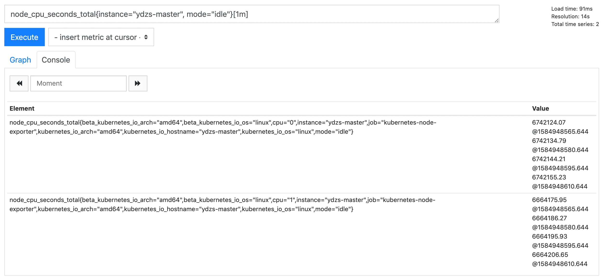

可以看到上面的两个时间序列都有 4 个值，这是因为我们 Prometheus 中配置的抓取间隔是 15 秒，所以，我们从图中的 `@` 符号后面的时间戳可以看出，它们之间的间隔基本上就是 15 秒。

但是在 Prometheus 表达式浏览器的 **Graph** 选项卡中直接执行上述区间向量查询时，会出现渲染错误：

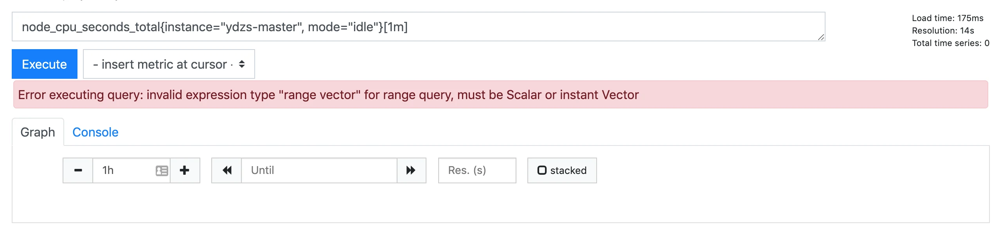

这是因为 Graph 面板仅支持绘制**标量**（Scalar）或**瞬时向量**（Instant Vector），而区间向量包含多个 `时间戳 - 值` 对，无法直接映射为单一时间点的图表数据。

正确做法：对区间向量应用聚合函数（如 `rate()`/`irate()`/`increase()`），将其转换为瞬时向量后再绘图。

Prometheus 官方对瞬时向量和区间向量有很多操作的[函数](https://prometheus.io/docs/prometheus/latest/querying/functions)，不过对于区间向量来说最常用的函数并不多，使用最频繁的有如下几个函数：

| 函数             | 作用                                                         | 适用场景                                         | 注意事项                                      |
| ---------------- | ------------------------------------------------------------ | ------------------------------------------------ | --------------------------------------------- |
| `rate(v[d])`     | 计算区间 `d` 内每个时间序列的**每秒平均增长率**，基于线性回归平滑计算 | 计数器（counter）类型指标的长期趋势分析、告警    | 自动处理计数器重置（reset），结果可能为非整数 |
| `irate(v[d])`    | 仅使用区间内**最后两个样本点**计算瞬时每秒增长率             | 快速波动指标的实时监控视图                       | 对噪声敏感，**不推荐**用于告警或长期趋势分析  |
| `increase(v[d])` | 计算区间 `d` 内时间序列的**总增量**，等价于 `rate(v[d]) * d(秒)` | 统计某时间段内的累计增长量（如请求总数、错误数） | 同样会处理 counter 重置，结果为浮点数         |

```bash
# 过去 5 分钟内 CPU idle 时间的每秒平均增长率
rate(node_cpu_seconds_total{instance="ydzs-master", mode="idle"}[5m])

# 过去 1 分钟内的瞬时增长率（最后两点）
irate(node_cpu_seconds_total{instance="ydzs-master", mode="idle"}[1m])

# 过去 10 分钟内 idle 时间的总增量（秒）
increase(node_cpu_seconds_total{instance="ydzs-master", mode="idle"}[10m])
```

我们选择的时间范围将确定图表的粒度，比如，持续时间 `[1m]` 会给出非常尖锐的图表，从而很难直观的显示出趋势来，看起来像这样：

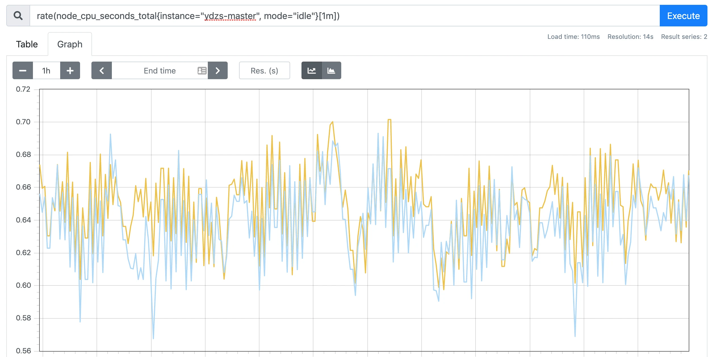

对于一小时的图表，`[5m]` 显示的图表看上去要更加合适一些，更能显示出 CPU 使用的趋势：

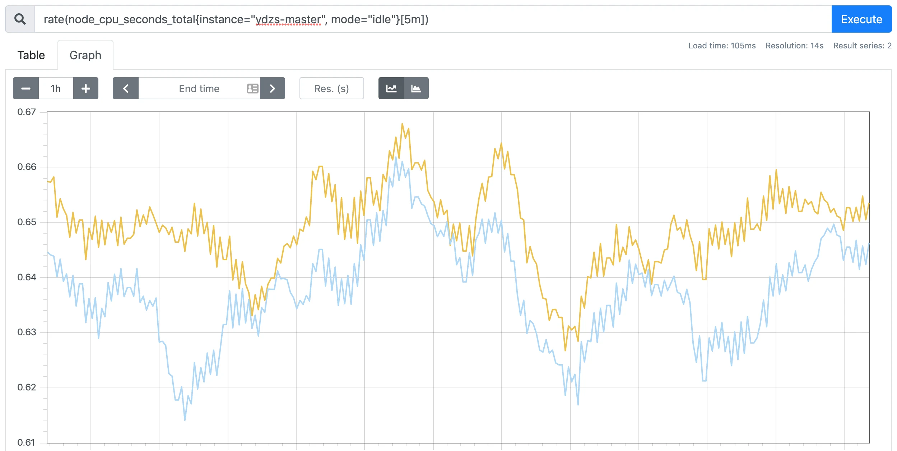

对于更长的时间跨度，可能需要设置更长的持续时间，以便消除波峰并获得更多的长期趋势图表。我们可以简单比较持续时间为`[5m]` 和 `[30m]` 的一天内的图表：

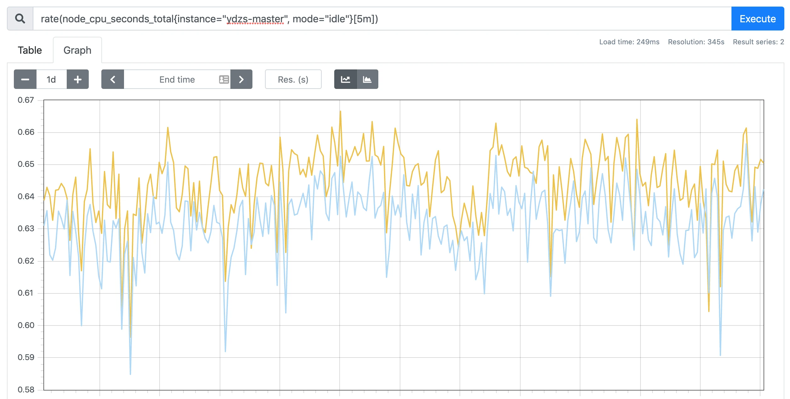

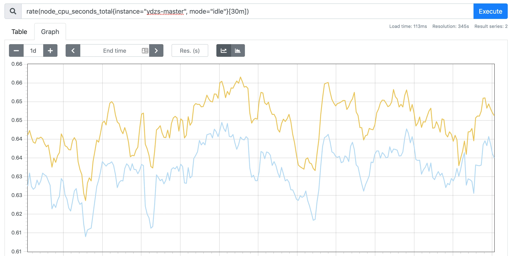

有的时候可能想要查看 5 分钟前或者昨天一天的区间内的样本数据，这个时候我们就需要用到位移操作了，位移操作的关键字是 `offset`，比如我们可以查询 30 分钟之前的 master 节点 CPU 的空闲指标数据：

```bash
node_cpu_seconds_total{instance="ydzs-master", mode="idle"} offset 30m
```

> 需要注意的是 `offset` 关键字需要紧跟在选择器 `{}` 后面。

同样位移操作也适用于区间向量，比如我们要查询昨天的前 5 分钟的 CPU 空闲增长率：

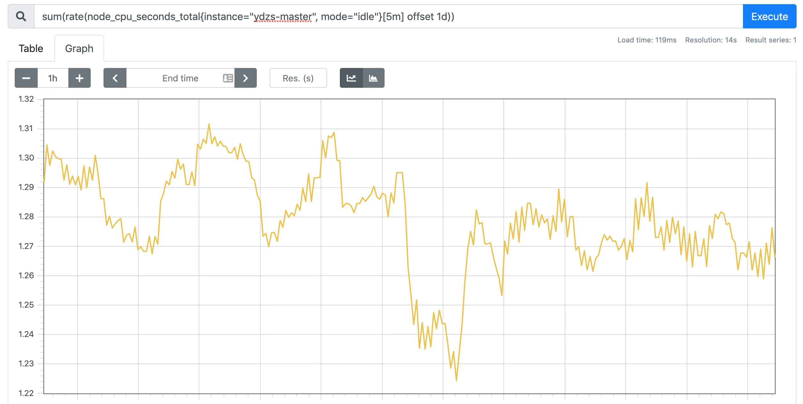

#### 4.10.3.3、关联查询

Prometheus 不提供类似 SQL 的关联查询（JOIN）语法，但可以通过 [运算符](https://prometheus.io/docs/prometheus/latest/querying/operators/) 对多个时间序列或标量执行常规计算、比较和逻辑运算。

> 当运算符作用于两个瞬时向量时，仅标签集完全一致的时间序列才会参与运算。所谓标签集完全一致，是指两个时间序列的所有标签名称和标签值均相同（`__name__` 除外）。只有当左侧向量的每个序列都能在右侧向量中找到唯一匹配的序列时，才能完成一对一匹配运算。

例如以下两个瞬时向量查询：

```bash
node_cpu_seconds_total{instance="ydzs-master", cpu="0", mode="idle"}
```

```bash
node_cpu_seconds_total{instance="ydzs-node1", cpu="0", mode="idle"}
```

若对这两个序列执行加法运算：

```bash
node_cpu_seconds_total{instance="ydzs-master", cpu="0", mode="idle"} 
+ 
node_cpu_seconds_total{instance="ydzs-node1", cpu="0", mode="idle"}
```

尝试获取 master 和 node1 节点总的空闲 CPU 时长，则不会返回任何内容：

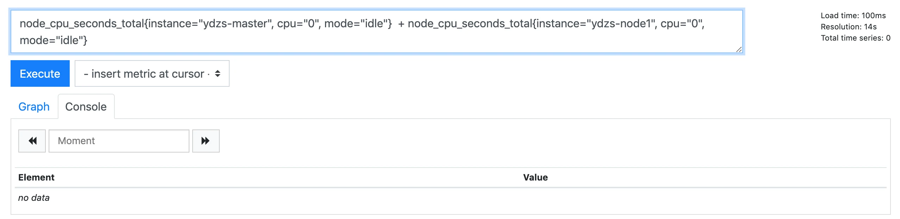

原因是两个时间序列的 `instance` 标签值不同，标签集不完全匹配，无法建立一对一映射关系。

此时可使用 `on` 关键字显式指定仅基于部分标签进行匹配。例如仅按 `mode` 标签匹配：

```bash
node_cpu_seconds_total{instance="ydzs-master", mode="idle"} 
+ on(mode) 
node_cpu_seconds_total{instance="ydzs-node1", mode="idle"}
```

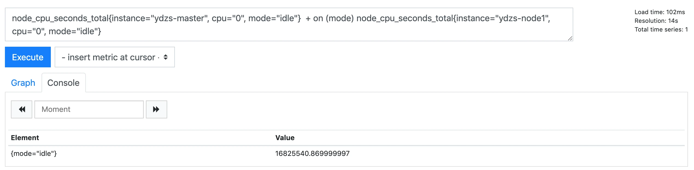

需要注意的是，运算结果生成的新瞬时向量仅包含 `on` 关键字中指定的标签（本例中为 `mode`），其他标签将被丢弃。

实际上，Prometheus 提供了丰富的 [聚合操作](https://prometheus.io/docs/prometheus/latest/querying/operators/#aggregation-operators)，多数场景下使用聚合函数更为简洁。例如统计各实例的空闲 CPU 时间序列，推荐使用：

```bash
sum by (instance) (node_cpu_seconds_total{mode="idle"})
```

`on` 关键字仅适用于一对一匹配场景。当涉及多对一或一对多匹配时，需配合 `group_left` 或 `group_right` 使用。例如通过 [kube-state-metrics](https://github.com/kubernetes/kube-state-metrics) 获取 Kubernetes 集群指标时，执行以下查询：

```bash
container_cpu_user_seconds_total{namespace="kube-system"} * on (pod) kube_pod_info
```

将返回错误：

```bash
Error executing query: multiple matches for labels: many-to-one matching must be explicit (group_left/group_right)
```

错误原因：`container_cpu_user_seconds_total` 指标在同一个 Pod 上可能因 `container`、`cpu` 等标签存在多条时间序列，而 `kube_pod_info` 每个 Pod 通常仅对应一条记录，形成多对一匹配关系，必须显式声明匹配方向。

解决方法是使用 `group_left` 或 `group_right` 关键字：

- `group_left`：表示左侧为高基数侧，允许多个左侧序列匹配同一个右侧序列
- `group_right`：表示右侧为高基数侧，允许一个左侧序列匹配多个右侧序列

结果向量默认保留高基数侧的所有标签。若需额外引入低基数侧的特定标签，可在括号中显式指定。

修正后的查询示例：

```bash
container_cpu_user_seconds_total{namespace="kube-system"} * on (pod) group_left() kube_pod_info
```

该查询可正常执行，返回结果包含左侧序列的全部标签，并成功关联右侧 `kube_pod_info` 的匹配记录。

#### 4.10.3.4、瞬时向量和标量结合

瞬时向量支持与标量值直接进行算术运算，标量将广播至向量中的每个样本。

```bash
node_cpu_seconds_total{instance="ydzs-master"} * 10
```

该查询会将瞬时向量中每个序列的每个样本值乘以 10，常用于比率换算或百分比计算。

支持的运算符包括：

- 算术运算符：`+`、`-`、`*`、`/`、`%`、`^`
- 比较运算符：`==`、`!=`、`>`、`<`、`>=`、`<=`（配合 `bool` 修饰符可返回 0/1 值）
- 逻辑集合运算符：`and`、`or`、`unless`（仅适用于两个瞬时向量之间，基于标签匹配执行集合运算）

关于 PromQL 的更多用法，请参考官方文档：https://prometheus.io/docs/prometheus/latest/querying/basics/。

## T4.11、Alertmanager

在前面的学习中我们了解到，Prometheus 生态包含一个独立的告警通知组件——AlertManager。AlertManager 主要用于接收 Prometheus Server 发送的告警信息，支持丰富的告警通知渠道，并具备告警去重、降噪、分组、路由等核心能力，是一款功能完善的告警通知管理系统。

Prometheus Server 通过配置告警规则（Alerting Rules）周期性执行规则计算。当 PromQL 表达式查询结果满足告警条件，并持续达到指定的持续时间（`for` 子句）后，Prometheus 会将告警信息发送至 AlertManager。

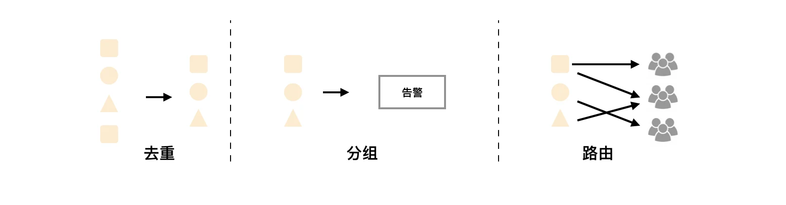

在 Prometheus 中，一条告警规则主要由以下部分组成：

- **告警名称（alert name）**：用于标识告警规则，命名应简洁明确，能够直接反映告警的核心内容
- **告警表达式（expr）**：通过 PromQL 定义告警触发条件，表示需要监控的指标状态
- **持续时间（for）**：可选字段，指定告警条件持续满足多长时间后才正式触发告警，用于避免瞬时抖动导致的误报
- **标签（labels）**：为告警添加额外的键值对标签，可用于告警分组、路由或丰富告警上下文
- **注解（annotations）**：用于补充告警的详细描述、处理建议等人类可读信息，通常用于通知模板渲染

Prometheus 支持通过 `groups` 对多条相关的告警规则进行分组管理，便于统一配置评估间隔和维护。

AlertManager 作为独立组件，负责接收并处理来自一个或多个 Prometheus Server 的告警信息。其核心功能包括：

- **告警去重（Deduplication）**：自动合并来自不同 Prometheus 实例的重复告警，避免通知风暴
- **告警分组（Grouping）**：将具有相同标签组合的告警聚合为一条通知，提升通知可读性
- **告警路由（Routing）**：根据告警标签将告警分发至不同的接收器（Receiver），支持按团队、环境、严重程度等维度灵活配置
- **告警抑制（Inhibition）**：当某条告警触发时，自动抑制其他相关联的低优先级告警，减少冗余通知
- **静默管理（Silences）**：支持在指定时间范围内临时屏蔽符合条件的告警，适用于维护窗口或已知问题场景

在通知渠道方面，AlertManager 原生支持 Email、Slack、PagerDuty、OpsGenie、Webhook 等多种集成方式。对于未原生支持的渠道（如钉钉、企业微信等），用户可通过配置 Webhook 接收器，与第三方机器人或自定义服务集成，实现灵活的告警通知扩展。

关于 AlertManager 的详细配置与使用，请参考官方文档：https://prometheus.io/docs/alerting/latest/overview/。

### T4.11.1、安装

从官方文档 https://prometheus.io/docs/alerting/configuration/ 中我们可以看到下载 AlertManager 二进制文件后，可以通过下面的命令运行：

```bash
$ ./alertmanager --config.file=simple.yml
```

其中 `-config.file` 参数是用来指定对应的配置文件，由于我们这里同样要运行到 Kubernetes 集群中来，所以我们使用 Docker 镜像的方式来安装，使用的镜像是：`prom/alertmanager:v0.21.0`。

首先，指定配置文件，同样的，我们这里使用一个 ConfigMap 资源对象：

```yaml
# alertmanager-config.yaml
apiVersion: v1
kind: ConfigMap
metadata:
  name: alert-config
  namespace: kube-mon
data:
  config.yml: |-
    global:
      # 当alertmanager持续多长时间未接收到告警后标记告警状态为 resolved
      resolve_timeout: 5m
      # 配置邮件发送信息
      smtp_smarthost: 'smtp.163.com:25'
      smtp_from: 'ych_1024@163.com'
      smtp_auth_username: 'ych_1024@163.com'
      smtp_auth_password: '<邮箱密码>'
      smtp_hello: '163.com'
      smtp_require_tls: false
    # 所有报警信息进入后的根路由，用来设置报警的分发策略
    route:
      # 这里的标签列表是接收到报警信息后的重新分组标签，例如，接收到的报警信息里面有许多具有 cluster=A 和 alertname=LatncyHigh 这样的标签的报警信息将会批量被聚合到一个分组里面
      group_by: ['alertname', 'cluster']
      # 当一个新的报警分组被创建后，需要等待至少 group_wait 时间来初始化通知，这种方式可以确保您能有足够的时间为同一分组来获取多个警报，然后一起触发这个报警信息。
      group_wait: 30s

      # 相同的group之间发送告警通知的时间间隔
      group_interval: 30s

      # 如果一个报警信息已经发送成功了，等待 repeat_interval 时间来重新发送他们，不同类型告警发送频率需要具体配置
      repeat_interval: 1h

      # 默认的receiver：如果一个报警没有被一个route匹配，则发送给默认的接收器
      receiver: default

      # 上面所有的属性都由所有子路由继承，并且可以在每个子路由上进行覆盖。
      routes:
      - receiver: email
        group_wait: 10s
        match:
          team: node
    receivers:
    - name: 'default'
      email_configs:
      - to: '517554016@qq.com'
        send_resolved: true  # 接受告警恢复的通知
    - name: 'email'
      email_configs:
      - to: '517554016@qq.com'
        send_resolved: true
```

> **分组**：分组机制可以将详细的告警信息合并成一个通知，在某些情况下，比如由于系统宕机导致大量的告警被同时触发，在这种情况下分组机制可以将这些被触发的告警合并为一个告警通知，避免一次性接受大量的告警通知，而无法对问题进行快速定位。

这是 AlertManager 的配置文件，我们先直接创建这个 ConfigMap 资源对象：

```bash
$ kubectl apply -f alertmanager-config.yaml
configmap/alert-config created
```

然后配置 AlertManager 的容器，直接使用一个 Deployment 来进行管理即可，对应的 YAML 资源声明如下：

```yaml
apiVersion: apps/v1
kind: Deployment
metadata:
  name: alertmanager
  namespace: kube-mon
  labels:
    app: alertmanager
spec:
  selector:
    matchLabels:
      app: alertmanager
  template:
    metadata:
      labels:
        app: alertmanager
    spec:
      volumes:
      - name: alertcfg
        configMap:
          name: alert-config
      containers:
      - name: alertmanager
        image: prom/alertmanager:v0.21.0
        imagePullPolicy: IfNotPresent
        args:
        - "--config.file=/etc/alertmanager/config.yml"
        ports:
        - containerPort: 9093
          name: http
        volumeMounts:
        - mountPath: "/etc/alertmanager"
          name: alertcfg
        resources:
          requests:
            cpu: 100m
            memory: 256Mi
          limits:
            cpu: 100m
            memory: 256Mi
```

这里我们将上面创建的 `alert-config` 这个 ConfigMap 资源对象以 Volume 的形式挂载到 `/etc/alertmanager` 目录下去，然后在启动参数中指定了配置文件 `--config.file=/etc/alertmanager/config.yml`，然后我们可以来创建这个资源对象：

```bash
$ kubectl apply -f alertmanager-deploy.yaml
deployment.apps/alertmanager created
```

为了可以访问到 AlertManager，同样需要我们创建一个对应的 Service 对象：(alertmanager-svc.yaml)

```yaml
apiVersion: v1
kind: Service
metadata:
  name: alertmanager
  namespace: kube-mon
  labels:
    app: alertmanager
spec:
  selector:
    app: alertmanager
  type: NodePort
  ports:
    - name: web
      port: 9093
      targetPort: http
```

使用 NodePort 类型也是为了方便测试，创建上面的 Service 这个资源对象：

```bash
$ kubectl apply -f alertmanager-svc.yaml
service/alertmanager created
```

AlertManager 的容器启动起来后，我们还需要在 Prometheus 中配置下 AlertManager 的地址，让 Prometheus 能够访问到 AlertManager，在 Prometheus 的 ConfigMap 资源清单中添加如下配置：

```bash
alerting:
  alertmanagers:
    - static_configs:
      - targets: ["alertmanager:9093"]
```

更新这个资源对象后，稍等一小会儿，执行 reload 操作即可。

### T4.11.2、报警规则

目前 AlertManager 容器已正常运行并与 Prometheus 完成关联配置，但尚未定义具体的告警规则。Prometheus 需要依据告警规则对监控数据进行评估，当满足触发条件时才会向 AlertManager 发送告警信息。

告警规则允许基于 Prometheus 表达式语言（PromQL）定义告警触发条件，并在条件满足时向外部接收者发送通知。

首先需要在 Prometheus 配置文件中指定告警规则文件路径：

```bash
rule_files:
- /etc/prometheus/rules.yml
```

`rule_files` 用于指定告警规则文件的位置。在 Kubernetes 环境中，通常通过 ConfigMap 将规则文件挂载至 Prometheus 容器。示例如下（alert-rules.yml）：

```bash
apiVersion: v1
kind: ConfigMap
metadata:
  name: prometheus-config
  namespace: kube-mon
data:
  prometheus.yml: |
    global:
      scrape_interval: 15s
      scrape_timeout: 15s
      evaluation_interval: 30s  # 默认情况下每分钟对告警规则进行计算
    alerting:
      alertmanagers:
      - static_configs:
        - targets: ["alertmanager:9093"]
    rule_files:
    - /etc/prometheus/rules.yml
  ...... # 省略prometheus其他部分
  rules.yml: |
    groups:
    - name: test-node-mem
      rules:
      - alert: NodeMemoryUsage
        expr: (node_memory_MemTotal_bytes - (node_memory_MemFree_bytes + node_memory_Buffers_bytes + node_memory_Cached_bytes)) / node_memory_MemTotal_bytes * 100 > 20
        for: 2m
        labels:
          team: node
        annotations:
          summary: "{{$labels.instance}}: High Memory usage detected"
          description: "{{$labels.instance}}: Memory usage is above 20% (current value is: {{ $value }}"
```

上述示例定义了一条名为 `NodeMemoryUsage` 的告警规则，一条完整的告警规则包含以下字段：

- **alert**：告警规则名称，用于唯一标识该告警
- **expr**：PromQL 表达式，定义告警触发条件。Prometheus 周期性评估该表达式，当查询结果非空且满足条件时触发告警
- **for**：可选字段，指定告警条件持续满足的等待时间。仅在条件持续满足该时长后，告警状态才会从 `pending` 转为 `firing`。该机制用于过滤瞬时抖动，降低误报率
- **labels**：自定义标签，以键值对形式附加到告警实例上，可用于告警分组、路由或丰富告警上下文
- **annotations**：补充说明信息，不参与告警匹配或路由，通常用于通知模板中展示告警详情、处理建议等人类可读内容

> **for 字段说明**：该参数主要用于告警降噪。对于响应时间、资源使用率等存在波动的指标，通过设置合理的等待时间，可避免因瞬时峰值触发误告警，确保告警反映的是持续性问题。

为提升告警信息的可读性，Prometheus 支持在 `labels` 和 `annotations` 中使用模板语法：

- `{{$labels.<label_name>}}`：引用当前告警实例中指定标签的值
- `{{$value}}`：引用当前 PromQL 表达式计算的样本值

为便于演示，示例中将告警阈值设置为 20%。更新 ConfigMap 后，由于 Prometheus Pod 已通过 Volume 挂载该 ConfigMap 至 `/etc/prometheus` 目录，`rules.yml` 文件将自动同步。执行 Prometheus 配置重载（reload）后，在 Prometheus Dashboard 的 **Alerts** 页面即可查看已加载的告警规则：

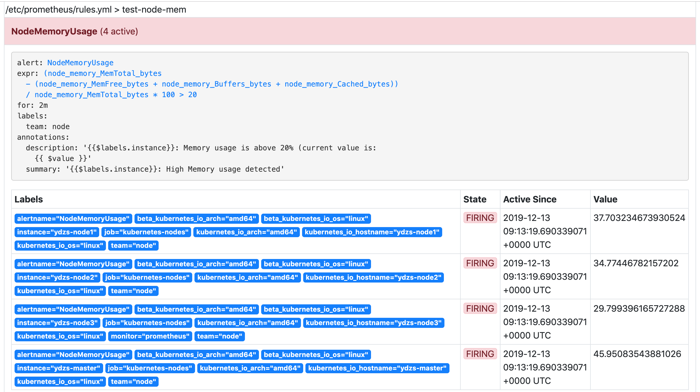

告警规则在生命周期内存在三种状态：

- **inactive**：告警条件未满足，处于非活动状态
- **pending**：告警条件已满足，但持续时间未达到 `for` 指定的阈值
- **firing**：告警条件持续满足超过 `for` 指定的时长，告警正式触发并发送至 AlertManager

Prometheus 会将处于 `pending` 或 `firing` 状态的告警实例记录到内置时间序列 `ALERTS{}` 中，可通过以下表达式查询：

```bash
ALERTS{alertname="<alert name>", alertstate="pending|firing", <additional alert labels>}
```

样本值为 `1` 表示告警处于活动状态（pending 或 firing），样本值为 `0` 表示告警已从活动状态恢复。

示例告警规则中配置了标签 `team: node`，若 AlertManager 路由配置如下：

```bash
routes:
- receiver: email
  group_wait: 10s
  match:
    team: node
```

则该告警将被路由至 `email` 接收器。若接收器配置为邮箱通知，满足条件后将收到类似如下的告警邮件：

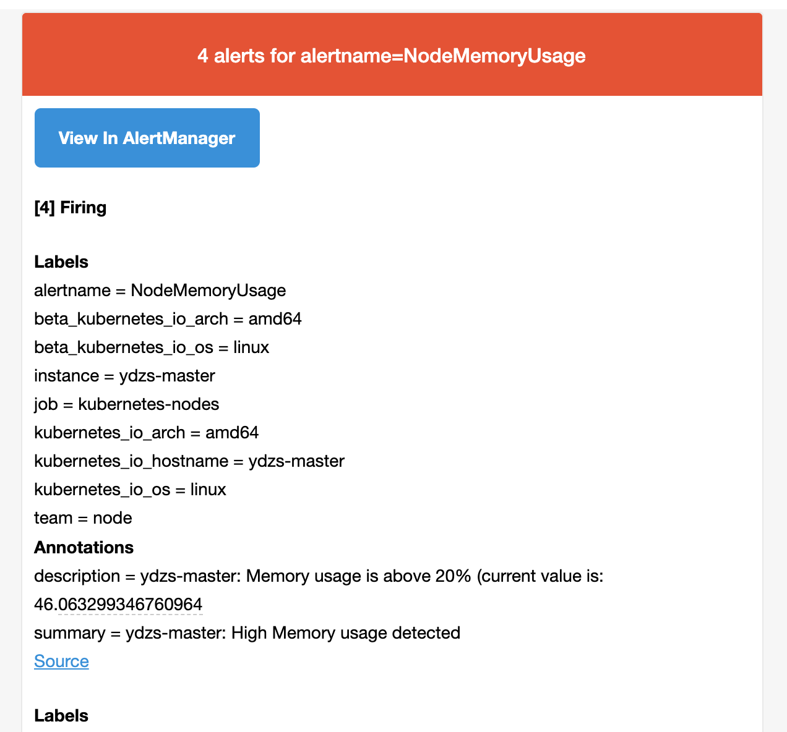

邮件内容包含 `View In AlertManager` 链接，可通过该链接跳转至 AlertManager 界面查看详情。

若 AlertManager 服务通过 NodePort 方式暴露：

```bash
$ kubectl get svc -n kube-mon
NAME           TYPE        CLUSTER-IP      EXTERNAL-IP   PORT(S)             AGE
alertmanager   NodePort    10.98.1.195     <none>        9093:31194/TCP      141m
```

可通过 `<NodeIP>:31194` 访问 AlertManager Dashboard。该页面支持告警过滤、分组查看，并提供两项高级功能：

- **Inhibition（告警抑制）**：当某条告警已触发时，可配置规则抑制其他相关联的低优先级告警。例如：当集群不可达告警触发时，可抑制该集群下所有节点的资源告警，避免通知风暴。抑制规则需在 AlertManager 配置文件中通过 `inhibit_rules` 显式定义
- **Silences（告警静默）**：支持在指定时间范围内临时屏蔽符合匹配条件的告警。静默规则基于标签匹配器（matchers）配置，与路由树语法一致。匹配成功的告警将不会发送给接收者，适用于计划维护或已知问题场景

AlertManager 全局配置中的 `repeat_interval` 参数控制相同告警的重复通知间隔。例如配置 `repeat_interval: 1h`，则同一告警在持续触发状态下，每小时仅发送一次通知，避免重复打扰。

一条告警从产生到最终通知接收者，需经过 AlertManager 的完整处理流程：分组（Grouping）→ 去重（Deduplication）→ 抑制（Inhibition）→ 静默（Silences）→ 路由（Routing）→ 通知（Notification）。该过程中任一环节均可能导致告警被合并、抑制或屏蔽，最终未发送通知。告警完整生命周期如下图所示：

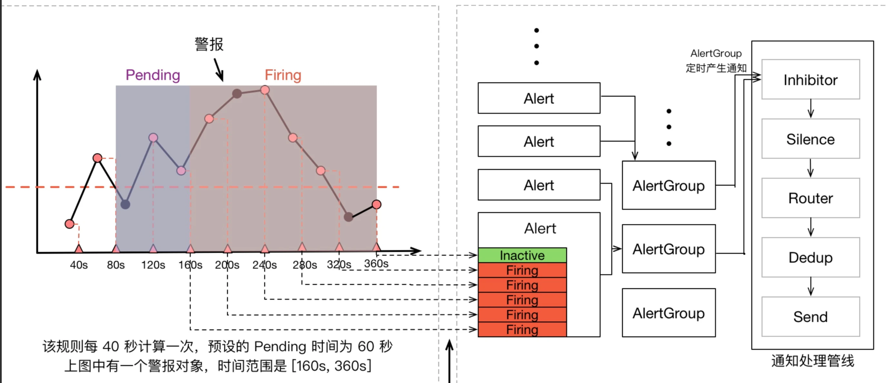

关于告警规则与 AlertManager 的详细配置，请参考官方文档：

- 告警规则：https://prometheus.io/docs/prometheus/latest/configuration/alerting_rules/
- AlertManager 配置：https://prometheus.io/docs/alerting/latest/configuration/

#### T4.11.2.1、WebHook 接收器

前文配置了 AlertManager 自带的邮件告警模板。AlertManager 支持多种告警接收器，例如 Slack、企业微信、钉钉等，其中最为灵活的方式是使用 Webhook。通过配置 Webhook 接收器，AlertManager 可将告警信息以 HTTP POST 请求的形式发送至自定义服务，由该服务负责告警内容的解析、格式化及分发。

以下是一个用于对接钉钉机器人的 Webhook 服务示例，代码仓库地址：[github.com/cnych/alertmanager-dingtalk-hook](https://github.com/cnych/alertmanager-dingtalk-hook)

需将该服务部署至 Kubernetes 集群中，对应的资源清单如下（dingtalk-hook.yaml）：

```bash
apiVersion: apps/v1
kind: Deployment
metadata:
  name: dingtalk-hook
  namespace: kube-mon
spec:
  selector:
    matchLabels:
      app: dingtalk-hook
  template:
    metadata:
      labels:
        app: dingtalk-hook
    spec:
      containers:
      - name: dingtalk-hook
        image: cnych/alertmanager-dingtalk-hook:v0.3.2
        imagePullPolicy: IfNotPresent
        ports:
        - containerPort: 5000
          name: http
        env:
        - name: PROME_URL
          value: k8s.qikqiak.com:30980
        - name: LOG_LEVEL
          value: debug
        - name: ROBOT_TOKEN
          valueFrom:
            secretKeyRef:
              name: dingtalk-secret
              key: token
        - name: ROBOT_SECRET
          valueFrom:
            secretKeyRef:
              name: dingtalk-secret
              key: secret
        resources:
          requests:
            cpu: 50m
            memory: 100Mi
          limits:
            cpu: 50m
            memory: 100Mi

---
apiVersion: v1
kind: Service
metadata:
  name: dingtalk-hook
  namespace: kube-mon
spec:
  selector:
    app: dingtalk-hook
  ports:
  - name: hook
    port: 5000
    targetPort: http
```

上述配置中包含以下关键环境变量：

- `ROBOT_TOKEN`：钉钉机器人 Access Token，用于标识机器人身份
- `PROME_URL`：指定跳转链接中的 Prometheus 地址，默认为 Pod 内部地址，建议配置为外部可访问地址
- `LOG_LEVEL`：日志级别，设置为 `debug` 可输出 AlertManager 发送的原始 Webhook 数据，便于调试，生产环境可不配置或设置为 `info`
- `ROBOT_SECRET`：钉钉机器人安全设置中的加签密钥（SEC 开头字符串），用于请求签名验证

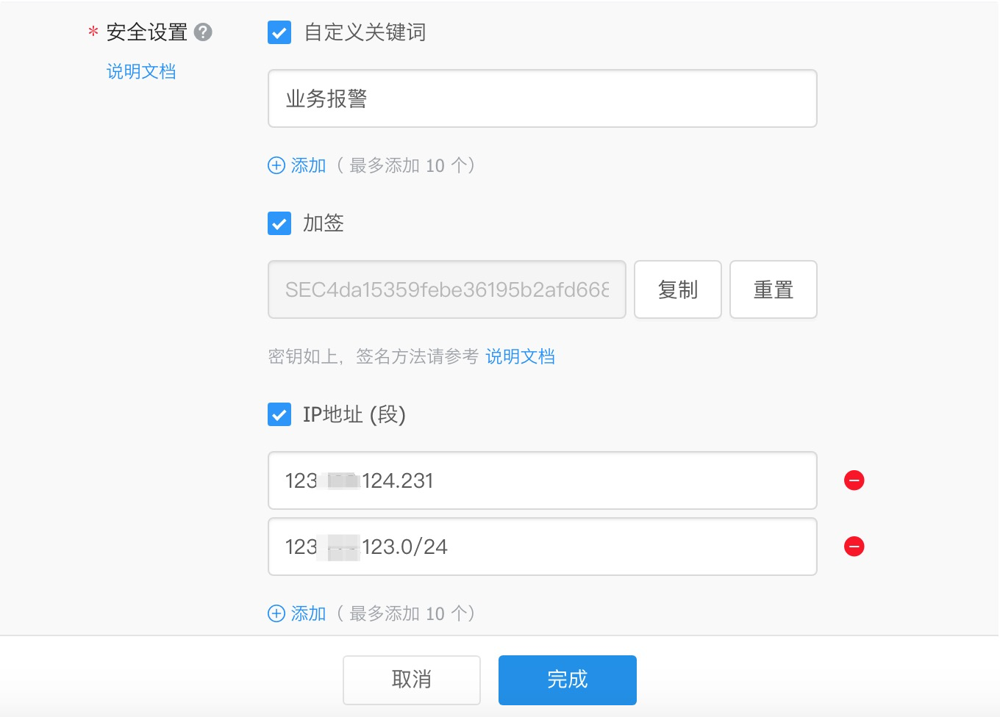

由于 `ROBOT_TOKEN` 和 `ROBOT_SECRET` 属于敏感信息，建议通过 Kubernetes Secret 进行管理。创建 Secret 并部署资源：

```bash
$ kubectl create secret generic dingtalk-secret --from-literal=token=<钉钉群聊的机器人TOKEN> --from-literal=secret=<钉钉群聊机器人的SECRET> -n kube-mon
secret "dingtalk-secret" created
$ kubectl apply -f dingtalk-hook.yaml
deployment.apps "dingtalk-hook" created
service "dingtalk-hook" created
$ kubectl get pods -n kube-mon
NAME                            READY     STATUS      RESTARTS   AGE
dingtalk-hook-c4fcd8cd6-6r2b6   1/1       Running     0          45m
......
```

部署完成后，在 AlertManager 配置中添加 Webhook 接收器及对应路由：

```bash
  routes:
  - receiver: webhook
    match:
      filesystem: node
receivers:
- name: 'webhook'
  webhook_configs:
  - url: 'http://dingtalk-hook:5000'
    send_resolved: true
```

上述配置定义了一个名为 `webhook` 的接收器，其地址为 `http://dingtalk-hook:5000`，即前述钉钉 Webhook 服务的 ClusterIP 地址。`send_resolved: true` 表示在告警恢复时也向接收器发送通知。

更新 AlertManager 和 Prometheus 的 ConfigMap 后，执行配置重载使变更生效。当满足告警条件时，包含 `team=node` 标签的告警将被路由至 `webhook` 接收器，即由 `dingtalk-hook` 服务处理。可通过查看 Pod 日志确认请求处理情况：

```bash
$ kubectl logs -f dingtalk-hook-cc677c46d-gf26f -n kube-mon
 * Serving Flask app "app" (lazy loading)
 * Environment: production
   WARNING: Do not use the development server in a production environment.
   Use a production WSGI server instead.
 * Debug mode: off
 * Running on http://0.0.0.0:5000/ (Press CTRL+C to quit)

2019-12-15 08:11:30,051 DEBUG Starting new HTTPS connection (1): oapi.dingtalk.com:443
2019-12-15 08:11:30,781 DEBUG https://oapi.dingtalk.com:443 "POST /robot/send?access_token=ff5067c95035185a752eb0fe90a1e52fd16f596c8ca89712e18ac2a3e1b7ee89&timestamp=1576397489986&sign=wOggfoW%2BAVgvi2BiHnlKd79Tvjf7S3boRAs1BoDhhTE%3D HTTP/1.1" 200 None
2019-12-15 08:11:30,951 INFO 10.244.2.129 - - [15/Dec/2019 08:11:30] "POST / HTTP/1.1" 200 -
```

日志显示 Webhook 请求已成功发送至钉钉开放平台接口。此时钉钉群聊中将收到告警通知：

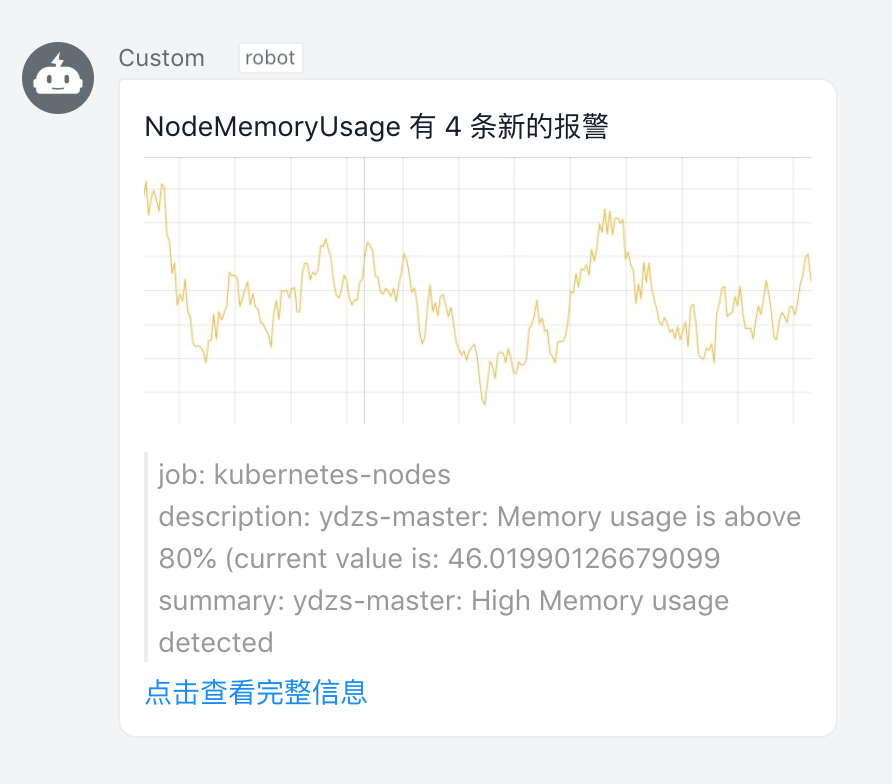

示例服务采用简单的 Markdown 格式转发告警内容，展示效果较为基础。实际生产中可根据钉钉自定义机器人文档（https://open.dingtalk.com/document/robots/custom-robot-access ）定制消息模板，实现更友好的告警展示。

### T4.11.3、自定义模板

AlertManager 默认使用内置的通知模板，该模板已编译至二进制文件中，无需额外配置即可使用。若需自定义告警通知内容（如调整邮件 HTML 结构、适配特定 IM 平台格式等），可按以下步骤配置自定义模板：

**步骤一：下载官方默认模板**

```bash
$ wget https://raw.githubusercontent.com/prometheus/alertmanager/master/template/default.tmpl
```

**步骤二：根据需求修改模板内容**

重点修改 `define "email.default.html"` 等模板定义块：

```bash
{{ define "email.default.html" }}
.... // 自定义 HTML 内容
{{ end }}
```

模板语法基于 Go template，支持访问告警的 `Labels`、`Annotations`、`Status` 等字段，具体参考官方模板文档：https://prometheus.io/docs/alerting/latest/notification_examples/

**步骤三：在 alertmanager.yml 中配置模板路径**

```bash
templates:
- '/etc/alertmanager/templates/*.tmpl'
```

确保模板文件通过 ConfigMap 或 Volume 挂载至指定路径，保存配置后执行重载即可生效。

### T4.11.4、记录规则

通过 PromQL 可实时对 Prometheus 采集的样本数据进行查询、聚合及各类运算。当 PromQL 表达式较为复杂或计算开销较大时，直接查询可能导致响应延迟或超时。为此，Prometheus 提供 Recording Rule（记录规则）机制，支持在后台周期性预计算复杂表达式，并将结果保存为新的时间序列，供后续查询直接复用，从而提升查询效率、降低计算压力。

在 Prometheus 配置文件中，通过 `rule_files` 指定记录规则文件路径：

```bash
rule_files:
  [ - <filepath_glob> ... ]
```

规则文件采用以下结构定义：

```bash
groups:
  [ - <rule_group> ]
```

示例规则文件：

```bash
groups:
- name: example
  rules:
  - record: job:http_inprogress_requests:sum
    expr: sum(http_inprogress_requests) by (job)
```

`rule_group` 配置项说明：

```bash
# 分组名称，在同一文件中必须唯一
name: <string>

# 该分组规则的评估频率，未指定时沿用 global.evaluation_interval
[ interval: <duration> | default = global.evaluation_interval ]

rules:
  [ - <rule> ... ]
```

单个规则（rule）的配置项如下：

```bash
# 输出时间序列的名称，必须符合 Prometheus 指标命名规范
record: <string>

# PromQL 表达式，每个评估周期执行计算，结果保存为 record 指定的新时间序列
expr: <string>

# 为结果时间序列添加或覆盖的标签（可选）
labels:
  [ <labelname>: <labelvalue> ]
```

Prometheus 按照 `global.evaluation_interval` 指定的频率（默认 1 分钟）周期性评估记录规则，执行 `expr` 中的 PromQL 计算，并将结果写入 `record` 指定的新指标中。通过 `labels` 可为结果添加额外标签，便于后续过滤或聚合。

记录规则与告警规则共享相同的评估机制和配置方式，建议将高频使用的复杂查询预定义为记录规则，以优化系统整体查询性能。

关于 Recording Rule 的详细配置，请参考官方文档：https://prometheus.io/docs/prometheus/latest/configuration/recording_rules/

## T4.12、Thanos

[Thanos](https://thanos.io/) 是一个基于 Prometheus 实现的监控方案，其主要设计目的是解决原生 Prometheus 上的痛点，并且做进一步的提升，主要的特性有：**全局查询，高可用，动态拓展，长期存储**。下图是 Thanos 官方的架构图：

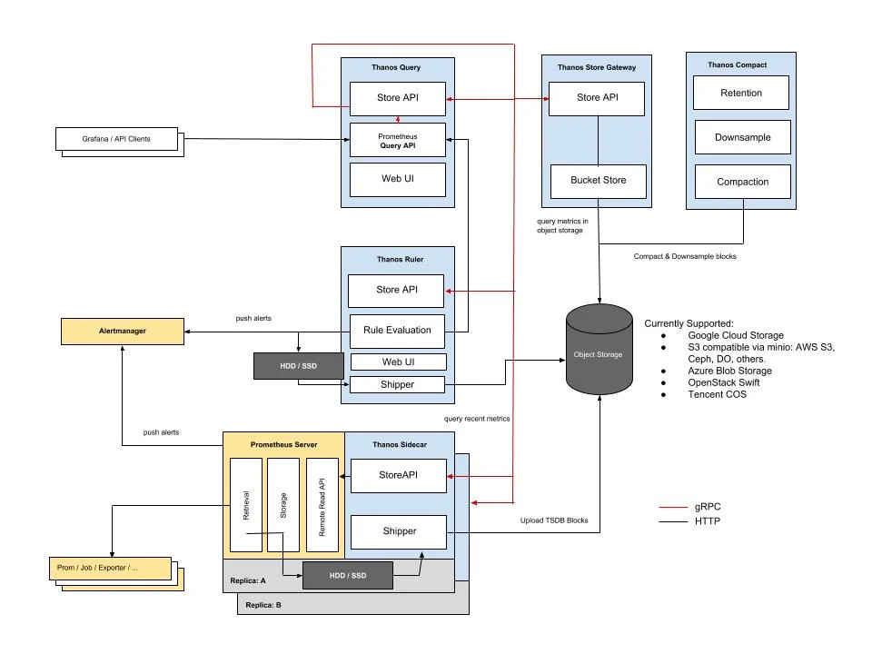

Thanos 由以下功能组件构成：

- **Sidecar**：与 Prometheus 进程部署在同一 Pod 中，负责将 Prometheus 数据暴露给 Querier 进行实时查询，并可选将数据上传至对象存储以实现长期保存
- **Querier**：实现 Prometheus HTTP API，负责聚合来自 Sidecar、Store Gateway 等组件的数据，提供统一查询入口
- **Store Gateway**：从对象存储中读取历史数据块，并通过 gRPC Store API 向 Querier 提供查询服务
- **Compactor**：对对象存储中的历史数据块执行压缩、合并及下采样操作，优化存储效率与查询性能
- **Receiver**：接收 Prometheus 通过 Remote Write API 发送的指标数据，支持本地持久化及上传至对象存储
- **Ruler**：基于 PromQL 执行告警规则和记录规则评估，支持将结果写回 Prometheus 或发送至 Alertmanager
- **Bucket**：用于查看对象存储中数据块的元信息，包括压缩级别、采样分辨率、时间范围等

### T4.12.1、工作流程

Thanos 支持 Prometheus 的读取与远程写入，其核心工作流程如下：

**指标写入流程**

1. Prometheus 从目标服务的 metrics 端点抓取指标数据，并根据配置的 recording rules 周期性评估，结果以 TSDB 格式分块存储至本地。默认每 2 小时生成一个数据块，且禁用本地压缩
2. Sidecar 监听 Prometheus 数据目录，当检测到新生成的只读数据块时，将其上传至对象存储作为长期历史数据。上传过程中会修改数据块的 `meta.json` 文件，添加 Thanos 扩展字段（如 `external_labels`）
3. Ruler 根据配置的 recording rules 周期性向 Querier 发起查询，获取评估所需指标值，并将结果以 TSDB 格式存储至本地。当本地生成新的只读数据块时，Ruler 也会将其上传至对象存储
4. Compactor 周期性对对象存储中的数据块执行压缩与下采样操作。压缩时合并数据块中的 chunk 并更新 `meta.json` 中的 `level` 字段（初始值为 1，每次压缩递增）；下采样时根据指定步长从原始数据块中抽取样本生成新数据块，并在 `meta.json` 中记录 `resolution` 字段

**指标查询流程**

1. 客户端通过 Prometheus HTTP API 向 Querier 发起查询请求，Querier 将请求转换为 gRPC Store API 请求，分发至其他 Querier、Sidecar、Ruler 及 Store Gateway 组件
2. Sidecar 接收到查询请求后，将其转换为 Prometheus HTTP API 请求转发至本地 Prometheus 实例，返回短期实时数据
3. Ruler 接收到查询请求后，直接从本地 TSDB 读取评估结果并返回
4. Store Gateway 接收到查询请求后，首先遍历对象存储中数据块的 `meta.json` 文件，根据时间范围和标签进行预过滤；随后读取 `index` 和 `chunks` 执行精确查询，高频访问的 `index` 会被缓存以提升后续查询效率，最终返回长期历史数据

**告警触发流程**

1. Prometheus 根据配置的 alerting rules 周期性评估本地采集的指标，当告警条件满足时向 Alertmanager 发送告警
2. Ruler 根据配置的 alerting rules 周期性向 Querier 发起查询获取评估指标，当告警条件满足时同样向 Alertmanager 发送告警
3. Alertmanager 接收来自 Prometheus 和 Ruler 的告警消息，执行分组、去重、抑制等处理后发送至配置的接收器

### T4.12.2、核心特性

相比原生 Prometheus，Thanos 具备以下优势：

- **统一查询入口**：Querier 实现 Prometheus HTTP API 及 gRPC Store API，作为全局查询网关聚合来自多个 Prometheus 实例 Sidecar 及 Store Gateway 的数据
- **查询去重**：每个数据块携带集群标识标签，Querier 在查询时自动去除副本标签，将指标名称与标签一致的序列按时间戳合并，避免重复结果
- **高存储利用率**：Prometheus 实例仅保留短期数据，Sidecar 将持久化数据块上传至对象存储；Compactor 定期压缩历史数据并按采样策略清理冗余，显著降低存储成本
- **高可用架构**：Querier 为无状态服务，支持水平扩展；Store、Ruler、Sidecar 为有状态服务，多副本部署时支持高可用，但需注意数据冗余带来的存储开销
- **长期数据存储**：通过 Sidecar 或 Receiver 将本地数据块上传至对象存储，实现监控数据的无限期归档
- **水平扩展能力**：当单 Prometheus 实例采集压力过大时，可通过拆分 scrape job 至多个实例实现负载分担，Querier 自动聚合查询结果
- **跨集群查询**：通过在多个集群的 Querier 之上部署全局 Querier，可实现跨集群指标聚合查询，支持监控架构的无限横向扩展

### T4.12.3、Sidecar 组件

首先清理前序章节中部署的 Prometheus 资源对象。为实现 Prometheus 对 Kubernetes 集群资源的自动发现，需配置相应的 RBAC 权限（rbac.yaml）：

```bash
apiVersion: v1
kind: ServiceAccount
metadata:
  name: prometheus
  namespace: kube-mon
---
apiVersion: rbac.authorization.k8s.io/v1
kind: ClusterRole
metadata:
  name: prometheus
rules:
- apiGroups: [""]
  resources: ["nodes", "services", "endpoints", "pods", "nodes/proxy"]
  verbs: ["get", "list", "watch"]
- apiGroups: ["extensions", "networking.k8s.io"]
  resources: ["ingresses"]
  verbs: ["get", "list", "watch"]
- apiGroups: [""]
  resources: ["configmaps", "nodes/metrics"]
  verbs: ["get"]
- nonResourceURLs: ["/metrics"]
  verbs: ["get"]
---
apiVersion: rbac.authorization.k8s.io/v1
kind: ClusterRoleBinding
metadata:
  name: prometheus
roleRef:
  apiGroup: rbac.authorization.k8s.io
  kind: ClusterRole
  name: prometheus
subjects:
- kind: ServiceAccount
  name: prometheus
  namespace: kube-mon
```

接下来配置 Prometheus 配置文件模板，该模板由 Thanos Sidecar 组件读取并渲染为实际配置文件。配置中必须添加 `external_labels` 字段，以便 Querier 基于这些标签执行数据去重（configmap.yaml）：

```bash
apiVersion: v1
kind: ConfigMap
metadata:
  name: prometheus-config
  namespace: kube-mon
data:
  prometheus.yaml.tmpl: | # 注意这里的名称是 prometheus.yaml.tmpl
    global:
      scrape_interval: 15s
      scrape_timeout: 15s
      external_labels:
        cluster: ydzs-test
        replica: $(POD_NAME)  # 每个 Prometheus 有一个唯一的标签

    rule_files:  # 报警规则文件配置
    - /etc/prometheus/rules/*rules.yaml

    alerting:
      alert_relabel_configs:  # 我们希望告警从不同的副本中也是去重的
      - regex: replica
        action: labeldrop
      alertmanagers:
      - scheme: http
        path_prefix: /
        static_configs:
        - targets: ['alertmanager:9093']

    scrape_configs:
    ......  # 其他抓取任务配置和前面章节中的配置保持一致即可
```

告警规则文件因内容较多，建议拆分至独立 ConfigMap 中管理（rules-configmap.yaml）：

```yaml
apiVersion: v1
kind: ConfigMap
metadata:
  name: prometheus-rules
  namespace: kube-mon
data:
  alert-rules.yaml: |-
    groups:
    - name: Deployment
      rules:
      - alert: DeploymentAtZeroReplicas
        annotations:
          summary: Deployment {{$labels.deployment}} in {{$labels.exported_namespace}} has no running pods
        expr: |
          sum(kube_deployment_status_replicas) by (deployment, exported_namespace) < 1
        for: 1m
        labels:
          team: node
    - name: Pods
      rules:
      - alert: ContainerRestarted
        annotations:
          summary: Container {{$labels.container}} in pod {{$labels.pod}} (namespace: {{$labels.exported_namespace}}) was restarted
        expr: |
          sum(increase(kube_pod_container_status_restarts_total[1m])) by (pod, exported_namespace, container) > 0
        for: 0m
        labels:
          team: node
```

Thanos 通过 Sidecar 与 Prometheus 集成，需将两者部署于同一 Pod 中。Prometheus 必须启用以下参数：

- `--web.enable-admin-api`：允许 Sidecar 通过管理 API 获取 Prometheus 元数据
- `--web.enable-lifecycle`：支持 Sidecar 触发 Prometheus 配置与规则文件的热重载

由于 Prometheus 默认每 2 小时生成一个 TSDB 数据块，为避免实例重启导致数据丢失，建议使用 StatefulSet 管理并配置持久化存储（sidecar.yaml）：

```yaml
apiVersion: apps/v1
kind: StatefulSet
metadata:
  name: prometheus
  namespace: kube-mon
  labels:
    app: prometheus
spec:
  serviceName: "prometheus"
  replicas: 2
  selector:
    matchLabels:
      app: prometheus
      thanos-store-api: "true"
  template:
    metadata:
      labels:
        app: prometheus
        thanos-store-api: "true"
    spec:
      serviceAccountName: prometheus
      volumes:
        - name: prometheus-config
          configMap:
            name: prometheus-config
        - name: prometheus-rules
          configMap:
            name: prometheus-rules
        - name: prometheus-config-shared
          emptyDir: {}
      containers:
        - name: prometheus
          image: prom/prometheus:v2.14.0
          imagePullPolicy: IfNotPresent
          args:
            - "--config.file=/etc/prometheus-shared/prometheus.yaml"
            - "--storage.tsdb.path=/prometheus"
            - "--storage.tsdb.retention.time=6h"
            - "--storage.tsdb.no-lockfile"
            - "--storage.tsdb.min-block-duration=2h" # Thanos处理数据压缩
            - "--storage.tsdb.max-block-duration=2h"
            - "--web.enable-admin-api" # 通过一些命令去管理数据
            - "--web.enable-lifecycle" # 支持热更新  localhost:9090/-/reload 加载
          ports:
            - name: http
              containerPort: 9090
          resources:
            requests:
              memory: "2Gi"
              cpu: "1"
            limits:
              memory: "2Gi"
              cpu: "1"
          volumeMounts:
            - name: prometheus-config-shared
              mountPath: /etc/prometheus-shared/
            - name: prometheus-rules
              mountPath: /etc/prometheus/rules
            - name: data
              mountPath: "/prometheus"
        - name: thanos
          image: thanosio/thanos:v0.18.0
          imagePullPolicy: IfNotPresent
          args:
            - sidecar
            - --log.level=debug
            - --tsdb.path=/prometheus
            - --prometheus.url=http://localhost:9090
            - --reloader.config-file=/etc/prometheus/prometheus.yaml.tmpl
            - --reloader.config-envsubst-file=/etc/prometheus-shared/prometheus.yaml
            - --reloader.rule-dir=/etc/prometheus/rules/
          ports:
            - name: http-sidecar
              containerPort: 10902
            - name: grpc
              containerPort: 10901
          env:
            - name: POD_NAME
              valueFrom:
                fieldRef:
                  fieldPath: metadata.name
          resources:
            requests:
              memory: "2Gi"
              cpu: "1"
            limits:
              memory: "2Gi"
              cpu: "1"
          volumeMounts:
            - name: prometheus-config-shared
              mountPath: /etc/prometheus-shared/
            - name: prometheus-config
              mountPath: /etc/prometheus
            - name: prometheus-rules
              mountPath: /etc/prometheus/rules
            - name: data
              mountPath: "/prometheus"
  volumeClaimTemplates: # 由于prometheus每2h生成一个TSDB数据块，所以还是需要保存本地的数据
    - metadata:
        name: data
        labels:
          app: prometheus
      spec:
        storageClassName: openebs-jiva-default
        accessModes:
          - ReadWriteOnce
        resources:
          requests:
            storage: 2Gi
```

配置说明：

- Prometheus 与 Sidecar 通过 `localhost` 通信，共享 `/prometheus` 数据目录及配置文件挂载卷
- 通过 Downward API 将 Pod 名称注入 `POD_NAME` 环境变量，并作为 `external_labels.replica` 标签附加至指标
- 使用 StatefulSet 配合 `volumeClaimTemplates` 实现数据持久化，避免实例重启导致 2 小时窗口内数据丢失

由于使用 StatefulSet 管理 Prometheus 实例，需创建 Headless Service 供 Querier 通过 DNS SRV 记录自动发现 Sidecar（headless.yaml）：

```yaml
# 该服务为 querier 创建 srv 记录，以便查找 store-api 的信息
apiVersion: v1
kind: Service
metadata:
  name: thanos-store-gateway
  namespace: kube-mon
spec:
  type: ClusterIP
  clusterIP: None
  ports:
    - name: grpc
      port: 10901
      targetPort: grpc
  selector:
    thanos-store-api: "true"
```

应用上述资源配置：

```bash
$ kubectl apply -f rbac.yaml
$ kubectl apply -f configmap.yaml
$ kubectl apply -f rules-configmap.yaml
$ kubectl apply -f headless.yaml
$ kubectl apply -f sidecar.yaml
$ kubectl get pods -n kube-mon -l app=prometheus
NAME           READY   STATUS    RESTARTS   AGE
prometheus-0   2/2     Running   0          86s
prometheus-1   2/2     Running   0          74s
```

### T4.12.4、Querier 组件

创建 Prometheus 实例后，需通过 Thanos Querier 提供统一查询入口，而非直接使用负载均衡器转发请求。Querier 配置需指定 Sidecar 的发现地址，此处通过 Headless Service 的 DNS SRV 记录实现自动发现（querier.yaml）：

```yaml
apiVersion: apps/v1
kind: Deployment
metadata:
  name: thanos-querier
  namespace: kube-mon
  labels:
    app: thanos-querier
spec:
  selector:
    matchLabels:
      app: thanos-querier
  template:
    metadata:
      labels:
        app: thanos-querier
    spec:
      containers:
        - name: thanos
          image: thanosio/thanos:v0.18.0
          args:
            - query
            - --log.level=debug
            - --query.replica-label=replica
            # Discover local store APIs using DNS SRV.
            - --store=dnssrv+thanos-store-gateway:10901
          ports:
            - name: http
              containerPort: 10902
            - name: grpc
              containerPort: 10901
          resources:
            requests:
              memory: "2Gi"
              cpu: "1"
            limits:
              memory: "2Gi"
              cpu: "1"
          livenessProbe:
            httpGet:
              path: /-/healthy
              port: http
            initialDelaySeconds: 10
          readinessProbe:
            httpGet:
              path: /-/healthy
              port: http
            initialDelaySeconds: 15
---
apiVersion: v1
kind: Service
metadata:
  name: thanos-querier
  namespace: kube-mon
  labels:
    app: thanos-querier
spec:
  ports:
    - port: 9090
      protocol: TCP
      targetPort: http
      name: http
  selector:
    app: thanos-querier
  type: NodePort
```

关键配置说明：

- `--store=dnssrv+_grpc._tcp.thanos-store-gateway:10901`：通过 DNS SRV 记录自动发现所有暴露 gRPC Store API 的组件（Sidecar、Store Gateway 等）
- `--query.replica-label=replica`：指定用于标识数据副本的标签，Querier 基于该标签执行去重
- 健康检查端点：`/-/healthy` 用于存活探针，`/-/ready` 用于就绪探针

应用配置并验证：

```bash
$ kubectl apply -f querier.yaml
$ kubectl get pods -n kube-mon -l app=thanos-querier
NAME                             READY   STATUS    RESTARTS   AGE
thanos-querier-cf566866b-r4jcj   1/1     Running   0          3m26s
$ kubectl get svc -n kube-mon -l app=thanos-querier
NAME             TYPE       CLUSTER-IP      EXTERNAL-IP   PORT(S)          AGE
thanos-querier   NodePort   10.108.199.11   <none>        9090:31854/TCP   3m30s
```

部署完成后，通过 `http://<NodeIP>:31854` 访问 Querier Web 界面：

- **Stores 页面**：显示通过服务发现获取的 Sidecar 及 Store Gateway 组件信息
- **Graph 页面**：提供与原生 Prometheus 一致的 PromQL 查询界面

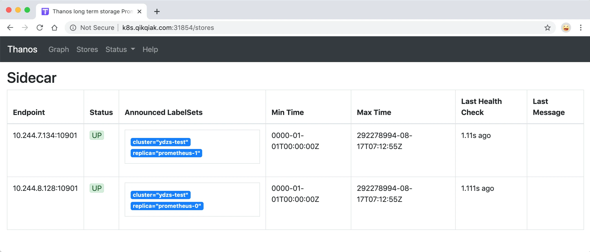

在 `Graph` 页面下同样可以使用 `PromQL` 语句来查询监控信息，这个页面和 Prometheus 原生的页面几乎是一致的，比如我们查询 master 节点的节点信息：

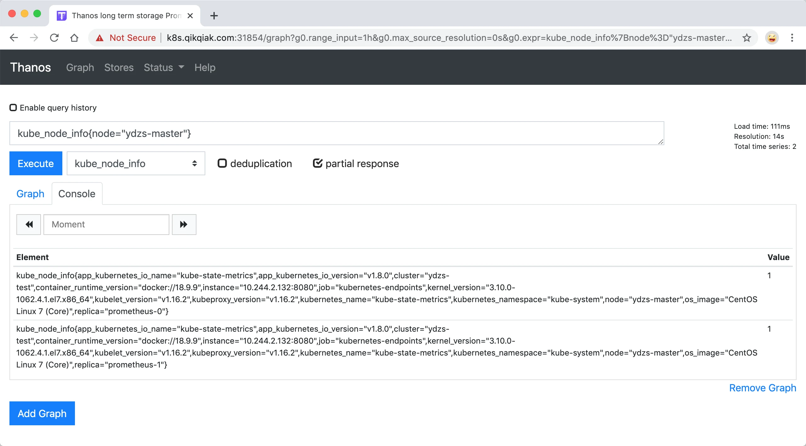

这里我们没有勾选 `deduplication`，Thanos 不会帮我们合并数据，所以能够看到 `prometheus-0` 和 `prometheus-1` 两条数据，因为我们有两个副本去抓取监控数据。

如果将 `deduplication` 选中，结果会根据 `replica` 这个标签进行合并，如果两个副本都有对应的数据，`Querier` 会取 timestamp 更小的结果：

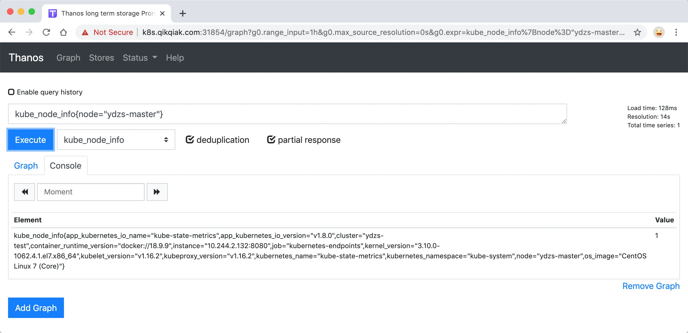

注意，前面 Grafana 配置的 Prometheus 数据源已经失效了，因为现在监控数据的来源是 `Thanos Querier`，所以我们需要重新配置 Prometheus 的数据源地址为 `http://thanos-querier:9090`：

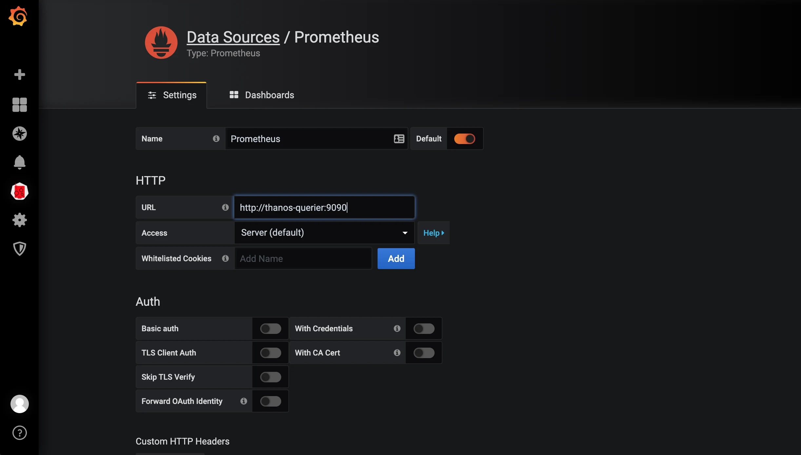

之前的监控图表也可以正常显示了：

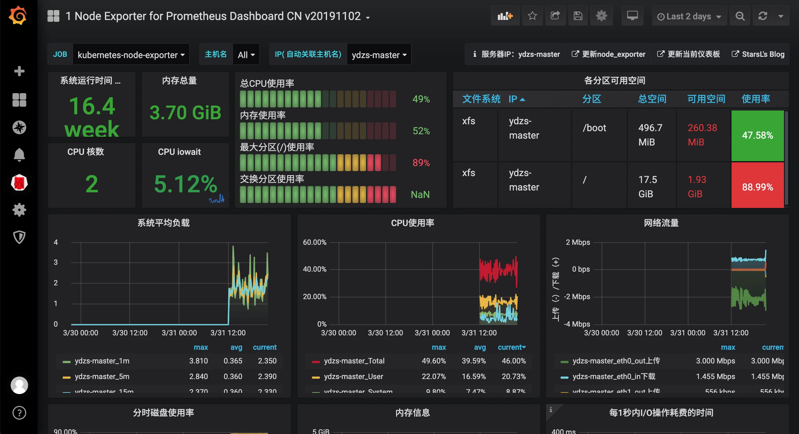

### T4.12.5、Ruler 组件

现在我们可以测试下 Prometheus 配置的监控报警规则是否生效，比如对于 `DeploymentAtZeroReplicas` 这个报警规则，当集群中有 Deployment 的副本数变成 0 就会触发报警：

```bash
$ kubectl get deploy
NAME                     READY   UP-TO-DATE   AVAILABLE   AGE
vault-demo               1/1     1            1           41d
```

我们可以手动将某个 Deployment 的副本数缩减为 0：

```bash
$ kubectl scale --replicas=0 deployment/vault-demo
deployment.apps/vault-demo scaled
$ kubectl get deploy
NAME                     READY   UP-TO-DATE   AVAILABLE   AGE
vault-demo               0/0     0            0           41d
```

这个时候 Alertmanager 同样也会根据外部的 replica 标签对告警进行去重，上面的报警规则中我们添加了 `team=node` 这样的标签，所以会通过前面配置的 webhook 接收器发送给钉钉进行告警：

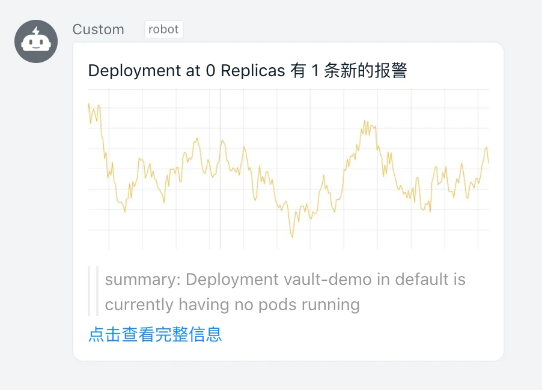

前序配置中，告警规则由 Prometheus 实例本地评估。Thanos Ruler 组件可作为替代方案，其通过 Query API 从 Querier 获取指标数据执行规则评估，评估结果可写回本地 TSDB 或发送至 Alertmanager。

Ruler 的数据获取路径为：`Ruler → Querier → Sidecar → Prometheus`，相较 Prometheus 本地评估增加了链路依赖。在无跨集群告警或全局聚合需求场景下，建议优先使用 Prometheus 原生告警机制以降低复杂度。

若需使用 Ruler，配置要点包括：

- 通过 `--rule-file` 指定告警/记录规则文件
- 通过 `--query` 指定 Querier 地址列表
- 通过 `--alertmanagers.url` 配置 Alertmanager 接收地址
- 通过 `--objstore.config-file` 配置对象存储，实现评估结果持久化

详细配置请参考官方文档：https://thanos.io/tip/components/rule.md/

### T4.12.6、Store 组件

前面我们安装了 Thanos 的 Sidecar 和 Querier 组件，已经可以做到 Prometheus 的高可用，通过 Querier 提供统一的入口来查询监控数据，而且还可以对监控数据自动去重，但是还有一个非常重要的环节，就是配置对象存储，对于查看历史监控数据至关重要。

这个时候需要用到 Thanos Store 组件，将历史监控指标存储到对象存储中。

目前 Thanos 支持的对象存储有：

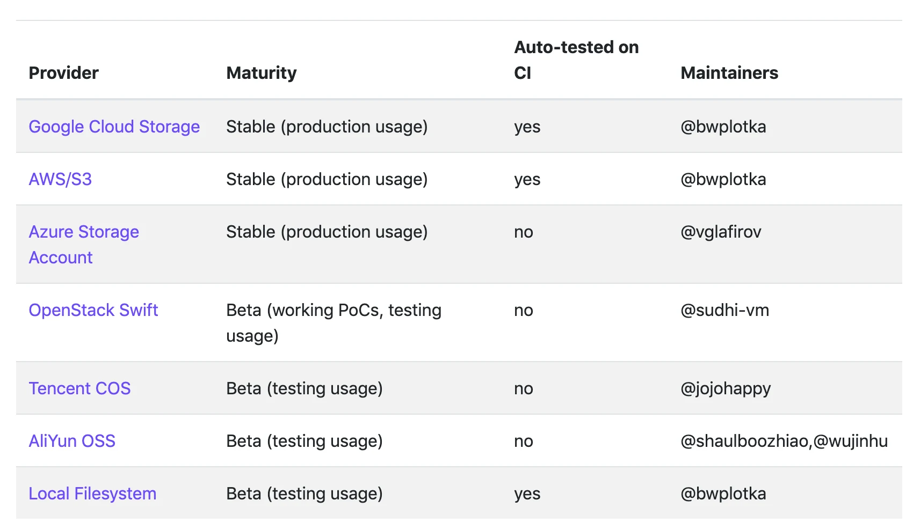

生产环境推荐使用 `Stable` 状态的方案，比如 S3 或者兼容 S3 的服务，比如 Ceph、Minio 等等。

对于国内用户当然最方便的还是直接使用阿里云 OSS 或者腾讯云 COS 这样的服务，很多时候可能我们的服务并不是跑在公有云上面的，所以这里我们用 Minio 来部署一个兼容 S3 协议的对象存储服务。

#### T4.12.6.1、安装 Minio

> Minio 开源项目已废弃，可以找其它替代方案，比如 https://rustfs.com/

MinIO RELEASE.2025-05-24T17-08-30Z 以前的版本都包含完整的功能，短期还可以使用。

为了方便管理，将所有的资源对象都部署在一个名为 minio 的命名空间中，如果没有的话需要手动创建。直接使用 Deployment 来管理 Minio 的服务（minio-deploy.yaml）：

```bash
apiVersion: apps/v1
kind: Deployment
metadata:
  name: minio
spec:
  selector:
    matchLabels:
      app: minio
  strategy:
    type: Recreate
  template:
    metadata:
      labels:
        app: minio
    spec:
      volumes:
        - name: data
          persistentVolumeClaim:
            claimName: minio-pvc
      containers:
        - name: minio
          volumeMounts:
            - name: data
              mountPath: "/data"
          image: minio/minio:RELEASE.2025-04-22T22-12-26Z
          args:
            - server
            - /data
          env:
            - name: MINIO_ACCESS_KEY
              value: "minio"
            - name: MINIO_SECRET_KEY
              value: "minio123"
          ports:
            - containerPort: 9000
          readinessProbe:
            httpGet:
              path: /minio/health/ready
              port: 9000
            initialDelaySeconds: 90
            periodSeconds: 10
          livenessProbe:
            httpGet:
              path: /minio/health/live
              port: 9000
            initialDelaySeconds: 30
            periodSeconds: 10
```

通过一个名为 `minio-pvc` 的 PVC 对象将数据持久化，当然我们可以使用静态的 PV 来提供存储，这里我们直接使用前面的 OpenEBS 的 LocalPV 来提供存储服务，使用 `openebs-jiva-default` 这个 StorageClass 对象来提供动态 PV（minio-pvc.yaml）：

```yaml
apiVersion: v1
kind: PersistentVolumeClaim
metadata:
  name: minio-pvc
spec:
  accessModes:
    - ReadWriteOnce
  resources:
    requests:
      storage: 10G
  storageClassName: openebs-jiva-default
```

最后我们可以通过 Service 和 Ingress 对象将 Minio 暴露给外部用户使用（minio-ingress.yaml）：

```yaml
apiVersion: v1
kind: Service
metadata:
  name: minio
spec:
  ports:
    - port: 9000
      targetPort: 9000
      protocol: TCP
  selector:
    app: minio
---
apiVersion: traefik.containo.us/v1alpha1
kind: Middleware
metadata:
  name: redirect-https
spec:
  redirectScheme:
    scheme: https
---
apiVersion: traefik.containo.us/v1alpha1
kind: IngressRoute
metadata:
  name: minio
spec:
  entryPoints:
    - web
  routes:
    - kind: Rule
      match: Host(`minio.qikqiak.com`)
      services:
        - kind: Service
          name: minio
          port: 9000
      middlewares:
        - name: redirect-https
---
apiVersion: traefik.containo.us/v1alpha1
kind: IngressRoute
metadata:
  name: minio-https
spec:
  entryPoints:
    - websecure
  routes:
    - kind: Rule
      match: Host(`minio.qikqiak.com`)
      services:
        - kind: Service
          name: minio
          port: 9000
  tls:
    certResolver: ali
    domains:
      - main: "*.qikqiak.com"
```

这里我们使用的是 Traefik2.X 版本的 Ingress 控制器，使用 IngressRoute 这个资源对象来定义 Ingress 信息，然后直接创建上面的资源对象即可：

```bash
kubectl create ns minio
kubectl apply -f minio-deploy.yaml
kubectl apply -f minio-pvc.yaml
kubectl apply -f minio-ingress.yaml
```

部署成功后，将域名 `minio.qikqiak.com` 解析到 Ingress 控制器所在的节点即可通过浏览器访问到 MinIO 服务了，通过上面定义的 `MINIO_ACCESS_KEY` 和 `MINIO_SECRET_KEY` 即可登录：

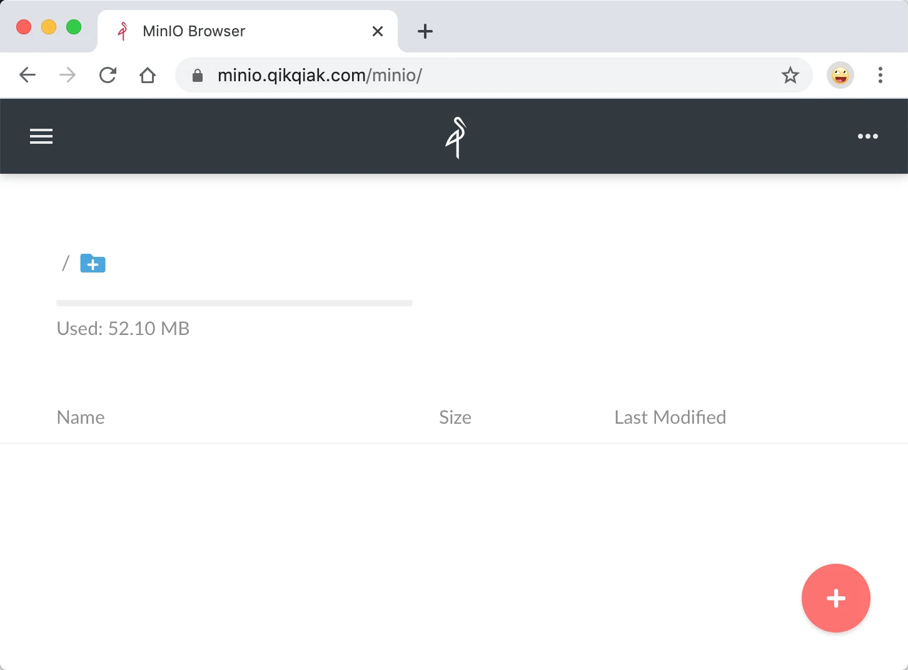

#### T4.12.6.2、安装 Thanos Store

对象存储就绪后，部署 Store Gateway 组件。首先登录 MinIO 创建名为 `thanos` 的 Bucket，并配置对象存储连接文件（thanos-storage-minio.yaml）：

```yaml
type: s3
config:
  bucket: thanos
  endpoint: minio.default.svc.cluster.local:9000
  access_key: minio
  secret_key: minio123
  insecure: true
  signature_version2: false
```

使用上面的配置文件来创建一个 Secret 对象：

```bash
$ kubectl create secret generic thanos-objectstorage --from-file=thanos.yaml=thanos-storage-minio.yaml -n kube-mon
secret/thanos-objectstorage created
```

然后创建 Store 组件的资源清单，注意需要添加一个 `thanos-store-api: "true"` 的标签，这样前面我们创建的 `thanos-store-gateway` 这个 Headless Service 就可以自动发现这个服务，Querier 组件查询数据的时候除了可以通过 Sidecar 去获取数据也可以通过这个 Store 组件去对象存储里面获取数据了。

将上面的 Secret 对象通过 Volume 形式挂载到容器中的 `/etc/secret` 目录下，通过 `objstore.config-file` 参数指定即可（store.yaml）：

```yaml
apiVersion: apps/v1
kind: StatefulSet
metadata:
  name: thanos-store-gateway
  namespace: kube-mon
  labels:
    app: thanos-store-gateway
spec:
  replicas: 1
  selector:
    matchLabels:
      app: thanos-store-gateway
  serviceName: thanos-store-gateway
  template:
    metadata:
      labels:
        app: thanos-store-gateway
        thanos-store-api: "true"
    spec:
      containers:
        - name: thanos
          image: thanosio/thanos:v0.18.0
          args:
            - "store"
            - "--log.level=debug"
            - "--data-dir=/data"
            - "--objstore.config-file=/etc/secret/thanos.yaml"
            - "--index-cache-size=500MB"
            - "--chunk-pool-size=500MB"
          ports:
            - name: http
              containerPort: 10902
            - name: grpc
              containerPort: 10901
          livenessProbe:
            httpGet:
              port: 10902
              path: /-/healthy
          readinessProbe:
            httpGet:
              port: 10902
              path: /-/ready
          volumeMounts:
            - name: object-storage-config
              mountPath: /etc/secret
              readOnly: false
      volumes:
        - name: object-storage-config
          secret:
            secretName: thanos-objectstorage
```

直接创建上面的资源对象即可：

```bash
$ kubectl apply -f store.yaml
$ kubectl get pods -n kube-mon -l thanos-store-api=true
NAME                     READY   STATUS    RESTARTS   AGE
prometheus-0             2/2     Running   0          15h
prometheus-1             2/2     Running   0          15h
thanos-store-gateway-0   1/1     Running   0          100s
```

部署成功后可以去 Thano 的 Querier 页面上查看 Store 信息，能看到我们配置的 Store 组件了：

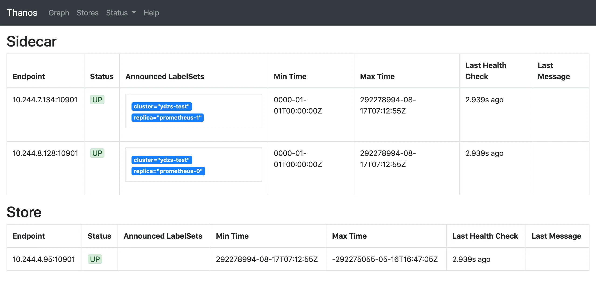

这里我们只是配置了去对象存储查询数据的组件，那什么地方往对象存储中写数据呢？

当然还是由 Sidecar 组件完成，所以我们需要把 `objstore.config-file` 参数和 Secret 对象也要配置到 Sidecar 组件中去：

```yaml
volumes:
- name: object-storage-config
  secret:
    secretName: thanos-objectstorage
args:
- sidecar
- --log.level=debug
- --tsdb.path=/prometheus
- --prometheus.url=http://localhost:9090
- --reloader.config-file=/etc/prometheus/prometheus.yaml.tmpl
- --reloader.config-envsubst-file=/etc/prometheus-shared/prometheus.yaml
- --reloader.rule-dir=/etc/prometheus/rules/
- --objstore.config-file=/etc/secret/thanos.yaml
volumeMounts:
- name: object-storage-config
  mountPath: /etc/secret
  readOnly: false
```

配置完成后重新更新 Sidecar 组件即可。配置生效后就会有数据写入到 MinIO，我们可以去 MinIO 的页面上查看验证：

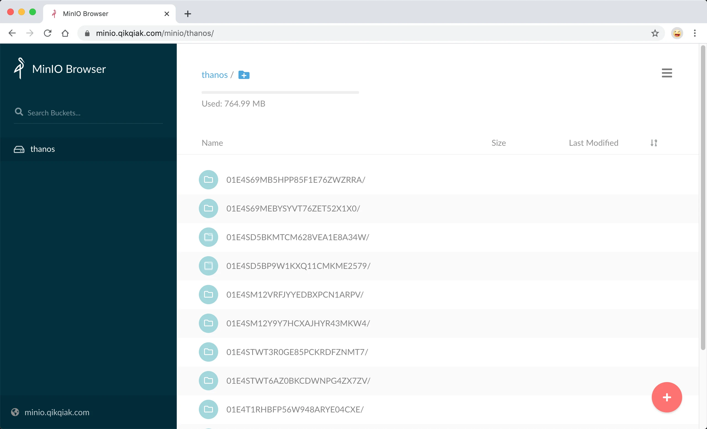

### T4.12.7、Compactor 组件

现在历史监控数据已经上传到对象存储中去了，但是由于监控数据量非常庞大，所以一般情况下我们会去安装一个 Thanos 的 Compactor 组件，用来将对象存储中的数据进行压缩和下采样。Compactor 组件的部署和 Store 非常类似，指定对象存储的配置文件即可，如下所示的资源清单文件（compactor.yaml）：

```bash
apiVersion: apps/v1
kind: StatefulSet
metadata:
  name: thanos-compactor
  namespace: kube-mon
  labels:
    app: thanos-compactor
spec:
  replicas: 1
  selector:
    matchLabels:
      app: thanos-compactor
  serviceName: thanos-compactor
  template:
    metadata:
      labels:
        app: thanos-compactor
    spec:
      containers:
        - name: thanos
          image: thanosio/thanos:v0.18.0
          args:
            - "compact"
            - "--log.level=debug"
            - "--data-dir=/data"
            - "--objstore.config-file=/etc/secret/thanos.yaml"
            - "--wait"
          ports:
            - name: http
              containerPort: 10902
          livenessProbe:
            httpGet:
              port: 10902
              path: /-/healthy
            initialDelaySeconds: 10
          readinessProbe:
            httpGet:
              port: 10902
              path: /-/ready
            initialDelaySeconds: 15
          volumeMounts:
            - name: object-storage-config
              mountPath: /etc/secret
              readOnly: false
      volumes:
        - name: object-storage-config
          secret:
            secretName: thanos-objectstorage
```

最重要的还是提供对象存储的配置文件，然后直接创建上面的资源清单文件：

```bash
$ kubectl apply -f compactor.yaml
$ kubectl get pods -n kube-mon -l app=thanos-compactor
NAME                 READY   STATUS    RESTARTS   AGE
thanos-compactor-0   1/1     Running   0          68s
```

到这里我们就完成了使用 Thanos 来部署高可用的 Prometheus 集群，当然 Thanos 还有其他的一些组件，比如 Check、Bucket、Receiver 等，对于这些组件的使用感兴趣的可以查看官方文档 https://thanos.io/。

### T4.12.8、Receiver 组件

前面我们介绍主要组件的时候提到了 Receiver 组件，那为什么上面在使用 Thanos 的时候并没有用到呢？这是因为 Receiver 和 Sidecar 是 Thanos 的两种不同架构模式，早期的 Receiver 只是一种实验特性，现在已经是 GA 状态了，所以非常有必要来了解下。

那么 Receiver 到底有什么作用呢？和 Sidecar 的区别是什么？

我们知道 Sidecar 模式是在每一个 Prometheus 的实例旁边添加一个 Sidecar 组件来上传数据，但是数据上传并不是实时的，而是每 2h 上传一个数据块，而且当通过 Querier 组件查询的时候，如果 Sidecar 非常多，那么势必会造成很多的资源消耗，这也是现在使用 Sidecar 模式的弊端。

Thanos Receiver 组件可以接收来自任何 Prometheus 实例的 remote write 远程写入请求，并将数据存储在本地 TSDB 中，同样我们也可以选择将这些 TSDB 块定期上传到对象存储中。此外 Receiver 同样也暴露了 StoreAPI 接口，这样 Thanos Querier 组件也是可以实时查询接收到的指标，完全不需要去所有的 Sidecar 上查询最新的数据。

另外 Thanos Receiver 组件也支持多租户，通过传入请求的 HTTP Header 头 `THANOS-TENANT` 的值来确定租户 Prometheus 的 ID，为了防止数据库级别的数据泄露，每个租户都有一个单独的 TSDB 实例，Thanos Receiver 还通过暴露类似于 Prometheus 的 external_label 来支持多租户。

```bash
                 +
Tenant's Premise | Provider Premise
                 |
                 |            +------------------------+
                 |            |                        |
                 |  +-------->+     Object Storage     |
                 |  |         |                        |
                 |  |         +-----------+------------+
                 |  |                     ^
                 |  | S3 API              | S3 API
                 |  |                     |
                 |  |         +-----------+------------+
                 |  |         |                        |       Store API
                 |  |         |  Thanos Store Gateway  +<-----------------------+
                 |  |         |                        |                        |
                 |  |         +------------------------+                        |
                 |  |                                                           |
                 |  +---------------------+                                     |
                 |                        |                                     |
+--------------+ |            +-----------+------------+              +---------+--------+
|              | | Remote     |                        |  Store API   |                  |
|  Prometheus  +------------->+     Thanos Receiver    +<-------------+  Thanos Querier  |
|              | | Write      |                        |              |                  |
+--------------+ |            +------------------------+              +---------+--------+
                 |                                                              ^
                 |                                                              |
+--------------+ |                                                              |
|              | |                PromQL                                        |
|    User      +----------------------------------------------------------------+
|              | |
+--------------+ |
                 +
```

如果我们需要负载均衡和数据多副本等功能，则可以将 Thanos Receiver 的多个实例作为单个 hash 的一部分来运行，每个 Receiver 在 hashring 中的位置决定了哪些时间序列被哪个 Receiver 接收和存储。下面是一个 hashring 的配置文件示例：

```bash
[
  {
    "hashring": "tenant-a",
    "endpoints": [
      "tenant-a-1.metrics.local:19291/api/v1/receive",
      "tenant-a-2.metrics.local:19291/api/v1/receive"
    ],
    "tenants": ["tenant-a"]
  },
  {
    "hashring": "tenants-b-c",
    "endpoints": [
      "tenant-b-c-1.metrics.local:19291/api/v1/receive",
      "tenant-b-c-2.metrics.local:19291/api/v1/receive"
    ],
    "tenants": ["tenant-b", "tenant-c"]
  },
  {
    "hashring": "soft-tenants",
    "endpoints": ["http://soft-tenants-1.metrics.local:19291/api/v1/receive"]
  }
]
```

这里多租户配置涉及两个核心概念：

**软租户（Soft Tenants）**

当 hashring 配置未显式指定 `tenants` 字段时，该 hashring 即被视为软租户 hashring。软租户 hashring 作为默认路由规则，接收所有未匹配到任何硬租户配置的远程写入请求。具体行为如下：

- 对于未在 HTTP 请求头中设置 `THANOS-TENANT` 字段的远程写入请求，Thanos Receiver 会将其路由至软租户 hashring
- 请求中的数据点将自动附加默认租户 ID 作为 `tenant_id` 标签，该默认值可通过 `--receive.default-tenant-id` 启动参数配置（默认为 `default-tenant`）
- 软租户模式适用于单租户场景或无需严格隔离的多租户场景，配置简单，但无法实现租户级别的数据隔离与权限控制

**硬租户（Hard Tenants）**

硬租户需在 hashring 配置文件中通过 `tenants` 字段显式声明租户标识列表。Thanos Receiver 对硬租户请求的处理逻辑如下：

- 所有发往硬租户的远程写入请求，必须在 HTTP 请求头中携带 `THANOS-TENANT: <tenant-id>`，且 `<tenant-id>` 需与 hashring 配置中的某一项完全匹配
- Receiver 接收到请求后，遍历已配置的硬租户列表，将请求路由至该租户对应的 Receiver 端点集合（endpoints）
- 每个硬租户可配置多个 Receiver 端点，结合 `--receive.replication-factor` 参数可实现数据副本冗余，提升数据可靠性
- 硬租户模式适用于多租户隔离场景，不同租户的数据在存储、查询、告警等链路中完全隔离，满足安全合规与资源配额管理需求

> **远程写入请求可经由任意 Receiver 实例接入，但会根据 Hashring 配置内部路由至该硬租户指定的存储端点。**

```bash
                                  Soft tenant hashring
                                 +-----------------------+
                                 |                       |
+-----------------+              |  +-----------------+  |
|                 |              |  |                 |  |
|  Load Balancer  +-------+      |  | Thanos receiver |  |
|                 |       |      |  |                 |  |
+-----------------+       |      |  +-----------------+  |
                          |      |                       |
                          |      |                       |
                          |      |  +-----------------+  |
                          |      |  |                 |  |
                          +-------->+ Thanos receiver +-----------+
                                 |  |                 |  |        |
                                 |  +-----------------+  |        |
                                 |                       |        |
                                 +-----------------------+        |
                                                                  |
                                   Hard Tenant A hashring         |
                                 +-----------------------+        |
                                 |                       |        |
                                 |  +-----------------+  |        |
                                 |  |                 |  |        |
                                 |  | Thanos receiver +<----------+
                                 |  |                 |  |        |
                                 |  +-----------------+  |        |
                                 |                       |        |
                                 |                       |        |
                                 |  +-----------------+  |        |
                                 |  |                 |  |        |
                                 |  | Thanos receiver +<----------+
                                 |  |                 |  |
                                 |  +-----------------+  |
                                 |                       |
                                 +-----------------------+
```

接下来我们来安装配置 Thanos Receiver 组件，现在我们的 Prometheus 数据是通过 Remote Write API 实时上传到 Receiver 组件上面去的，所以我们需要对 Receiver 组件进行数据持久化，然后指定 objstore 后可以将数据上传到对象存储中去，对应的资源清单文件如下所示：

```yaml
# receiver.yaml
apiVersion: apps/v1
kind: StatefulSet
metadata:
  labels:
    app: thanos-receiver
  name: thanos-receiver
  namespace: kube-mon
spec:
  selector:
    matchLabels:
      app: thanos-receiver
  serviceName: thanos-receiver
  replicas: 1
  template:
    metadata:
      labels:
        app: thanos-receiver
        thanos-store-api: "true"
    spec:
      containers:
        - image: thanosio/thanos:v0.18.0
          args:
            - receive
            - --grpc-address=0.0.0.0:10901
            - --http-address=0.0.0.0:10902
            - --remote-write.address=0.0.0.0:19291
            - --receive.replication-factor=1
            - --objstore.config-file=/etc/secret/thanos.yaml
            - --tsdb.path=/var/thanos/receiver
            - --tsdb.retention=1d
            - --label=receive_replica="$(NAME)"
            - --receive.local-endpoint=$(NAME).thanos-receiver.$(NAMESPACE).svc.cluster.local:10901
          env:
            - name: NAME
              valueFrom:
                fieldRef:
                  fieldPath: metadata.name
            - name: NAMESPACE
              valueFrom:
                fieldRef:
                  fieldPath: metadata.namespace
          livenessProbe:
            failureThreshold: 8
            httpGet:
              path: /-/healthy
              port: 10902
              scheme: HTTP
            periodSeconds: 30
          name: thanos-receive
          ports:
            - containerPort: 10901
              name: grpc
            - containerPort: 10902
              name: http
            - containerPort: 19291
              name: remote-write
          readinessProbe:
            failureThreshold: 20
            httpGet:
              path: /-/ready
              port: 10902
              scheme: HTTP
            periodSeconds: 5
          volumeMounts:
            - mountPath: /var/thanos/receiver
              name: data
              readOnly: false
            - name: object-storage-config
              mountPath: /etc/secret
              readOnly: false
      volumes:
        - name: object-storage-config
          secret:
            secretName: thanos-objectstorage
  volumeClaimTemplates:
    - metadata:
        name: data
        labels:
          app: thanos-receiver
      spec:
        storageClassName: openebs-jiva-default
        accessModes:
          - ReadWriteOnce
        resources:
          requests:
            storage: 20Gi
---
apiVersion: v1
kind: Service
metadata:
  name: thanos-receiver
  namespace: kube-mon
spec:
  clusterIP: None
  ports:
    - name: grpc
      port: 10901
      targetPort: 10901
    - name: http
      port: 10902
      targetPort: 10902
    - name: remote-write
      port: 19291
      targetPort: 19291
  selector:
    app: thanos-receiver
```

需要注意现在 Receiver 也变成了 Querier 组件的一个数据源了，所以这里我们给上面的 Pod 增加一个 `thanos-store-api: "true"` 的标签，这样可以让 Querier 自动发现这个 Pod。直接创建上面的资源清单即可：

```bash
kubectl apply -f receiver.yaml
```

创建完成后可以得到我们的远程写 API 地址为：`http://thanos-receiver:19291/api/v1/receive`。

由于现在我们使用 Receiver 模式了，所以之前的 Sidecar 模式就不需要了，可以先将之前的 Sidecar 删除掉，其实现在我们的 Prometheus 变成了近乎无状态的了，只需要 Prometheus 应用本身，然后加上 remotewrite api 地址即可：

```bash
# configmap.yaml
apiVersion: v1
kind: ConfigMap
metadata:
  name: prometheus-config
  namespace: kube-mon
data:
  prometheus.yaml.tmpl: |
    global:
      scrape_interval: 15s
      scrape_timeout: 15s
      external_labels:
        cluster: ydzs-test
        replica: $(POD_NAME)  # 每个 Prometheus 有一个唯一的标签

    rule_files:  # 报警规则文件配置
    - /etc/prometheus/rules/*rules.yaml

    # 指定 remote write 地址
    remote_write:
    - url: http://thanos-receiver:19291/api/v1/receive

    ......
```

正常是不需要 Sidecar 容器了，这里我们为了用一个 StatefulSet 来运行两个 Prometheus 副本，借助 Sidecar 来帮我们渲染 prometheus.yaml.tmpl 模板文件(因为 Prometheus 本身是不支持环境变量替换的)，`这里的 Sidecar 仅作渲染用`，后续可以换成其他方式：

```yaml
# sidecar.yaml
apiVersion: apps/v1
kind: StatefulSet
metadata:
  name: prometheus
  namespace: kube-mon
  labels:
    app: prometheus
spec:
  serviceName: "prometheus"
  replicas: 2
  selector:
    matchLabels:
      app: prometheus
  template:
    metadata:
      labels:
        app: prometheus
    spec:
      serviceAccountName: prometheus
      volumes:
        - name: prometheus-config
          configMap:
            name: prometheus-config
        - name: prometheus-rules
          configMap:
            name: prometheus-rules
        - name: prometheus-config-shared
          emptyDir: {}
      containers:
        - name: prometheus
          image: prom/prometheus:v2.14.0
          imagePullPolicy: IfNotPresent
          args:
            - "--config.file=/etc/prometheus-shared/prometheus.yaml"
            - "--storage.tsdb.path=/prometheus"
            - "--storage.tsdb.retention.time=6h"
            - "--storage.tsdb.no-lockfile"
            - "--storage.tsdb.min-block-duration=2h" # Thanos处理数据压缩
            - "--storage.tsdb.max-block-duration=2h"
            - "--web.enable-admin-api" # 通过一些命令去管理数据
            - "--web.enable-lifecycle" # 支持热更新  localhost:9090/-/reload 加载
          ports:
            - name: http
              containerPort: 9090
          resources:
            requests:
              memory: "2Gi"
              cpu: "1"
            limits:
              memory: "2Gi"
              cpu: "1"
          volumeMounts:
            - name: prometheus-config-shared
              mountPath: /etc/prometheus-shared/
            - name: prometheus-rules
              mountPath: /etc/prometheus/rules
            - name: prometheus-config
              mountPath: /etc/prometheus
        - name: thanos
          image: thanosio/thanos:v0.18.0
          imagePullPolicy: IfNotPresent
          args:
            - sidecar
            - --log.level=debug
            - --reloader.config-file=/etc/prometheus/prometheus.yaml.tmpl
            - --reloader.config-envsubst-file=/etc/prometheus-shared/prometheus.yaml
            - --reloader.rule-dir=/etc/prometheus/rules/
          ports:
            - name: http-sidecar
              containerPort: 10902
            - name: grpc
              containerPort: 10901
          env:
            - name: POD_NAME
              valueFrom:
                fieldRef:
                  fieldPath: metadata.name
          volumeMounts:
            - name: prometheus-config-shared
              mountPath: /etc/prometheus-shared/
            - name: prometheus-config
              mountPath: /etc/prometheus
            - name: prometheus-rules
              mountPath: /etc/prometheus/rules
```

重新创建 Prometheus：

```bash
$ kubectl delete -f configmap.yaml
$ kubectl delete -f sidecar.yaml
$ kubectl apply -f configmap.yaml
$ kubectl apply -f sidecar.yaml
$ kubectl get pods -n kube-mon
NAME                              READY   STATUS    RESTARTS   AGE
alertmanager-86c756695f-b92zh     1/1     Running   0          38h
dingtalk-hook-66c75955d-mjpdc     1/1     Running   0          38h
grafana-67c7856c69-kjcvp          1/1     Running   0          23h
node-exporter-gvbmd               1/1     Running   0          23h
node-exporter-tx4p2               1/1     Running   0          166m
node-exporter-wfp4j               1/1     Running   0          36h
node-exporter-x8gjs               1/1     Running   0          27d
prometheus-0                      2/2     Running   0          5m8s
prometheus-1                      2/2     Running   0          5m1s
thanos-compactor-0                1/1     Running   0          3h44m
thanos-querier-77b47f7948-4sjhc   1/1     Running   0          3h9m
thanos-receiver-0                 1/1     Running   0          40m
thanos-store-gateway-0            1/1     Running   0          3h10m
```

部署完成后，Prometheus 就开始实时远程写入数据到 Receiver 去了，我们通过 Querier 的界面可以查看到现在发现的 Stores：

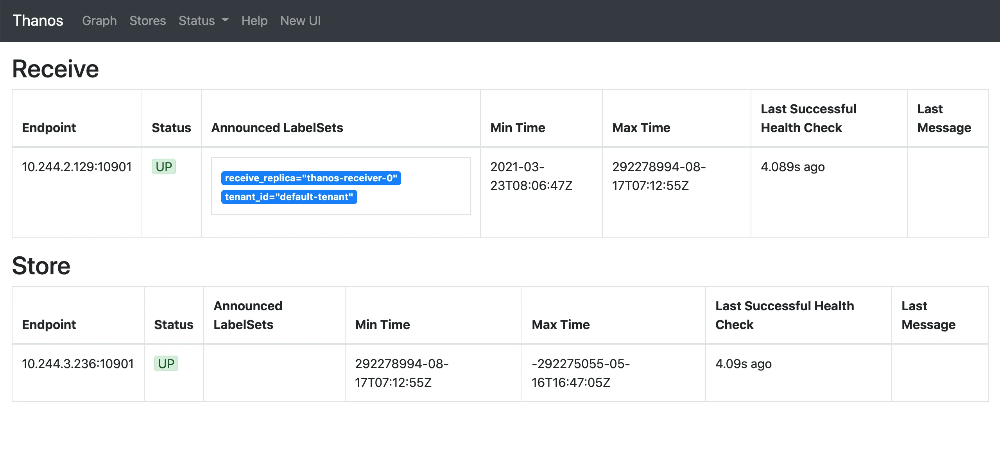

然后切换到 Graph 页面查询 `node_load1`，先去掉 `deduplication`：

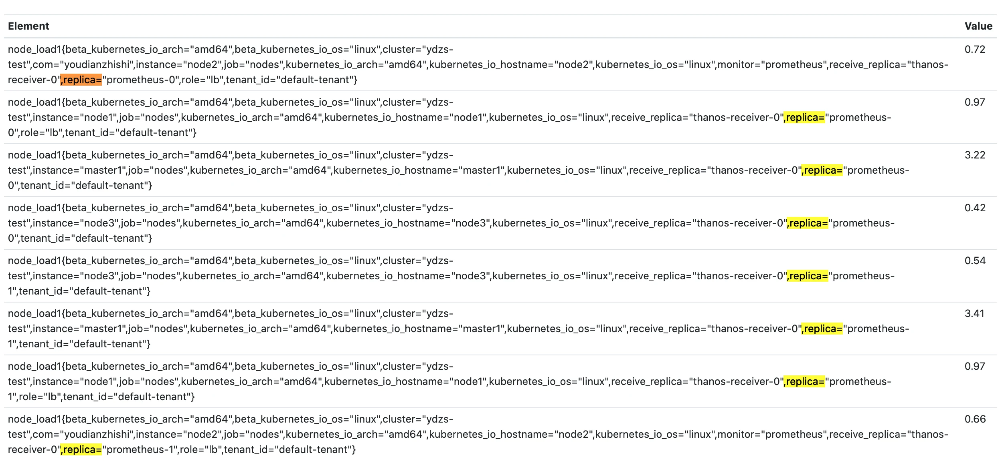


可以看到已经查询到了两个 Prometheus 实例的数据，这证明我们数据已经成功上传到 Receiver 了，这里的数据其实是通过 Receiver 获取到的，然后勾选上 `deduplication` 后可以根据 `replica` 标签进行去重：

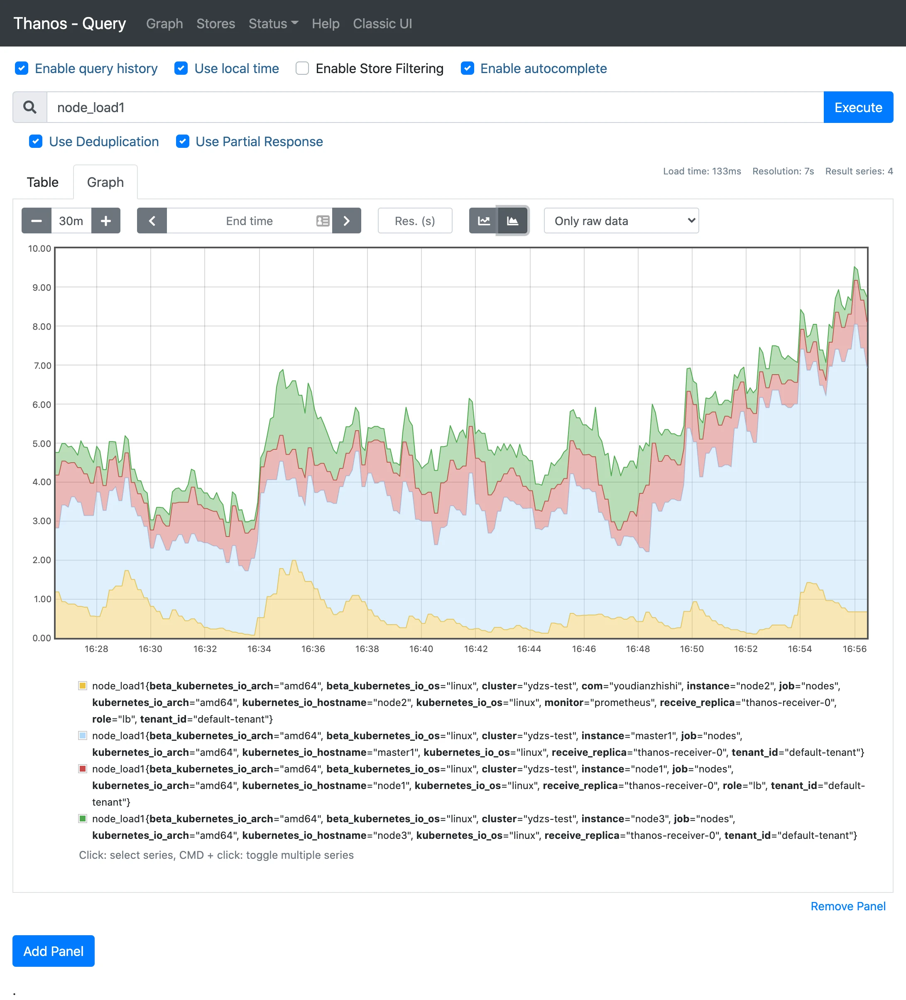

而且在 `NewUI` 中还可以根据 Store 来过滤要查询的数据，比如我们可以直接查询远程对象存储中的数据：

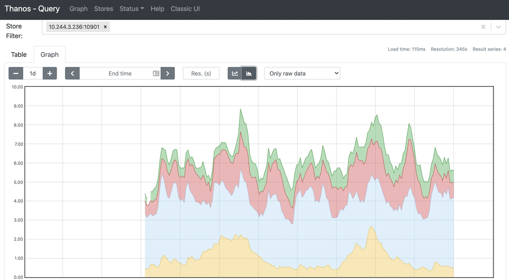


此外我们还为 Receiver 配置了 StoreObject，正常一段时间（默认还是 2h）后 Receiver 组件也会把数据上传到对象存储中去。

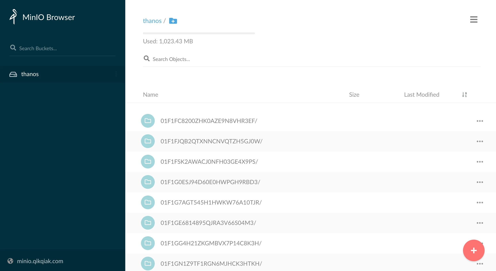

## T4.13、Prometheus Adapter

Kubernetes 的核心优势之一是支持应用程序的水平弹性伸缩。**HorizontalPodAutoscaler（HPA）** 可根据资源使用指标（如 CPU、内存）或自定义业务指标自动调整 Pod 副本数量。

> **重要更新**：`autoscaling/v2` 已在 Kubernetes 1.23+ 中成为**稳定版本**，推荐生产环境使用。`autoscaling/v2beta1` 和 `autoscaling/v2beta2` 已被废弃，请勿在新项目中采用。

### T4.13.1、自定义指标

除了基于 CPU 和内存来进行自动扩缩容之外，我们还可以根据自定义的监控指标来进行。这时我们要用到 `Prometheus Adapter`，Prometheus 用于监控应用的负载和集群本身的各种指标，`Prometheus Adapter` 可以帮我们使用 Prometheus 收集的指标，然后加以利用来制定扩展策略，这些指标都是通过 APIServer 暴露的，而且 HPA 资源对象也可以很轻易地直接使用。


首先，我们部署一个示例应用，测试通过 Prometheus 收集指标自动缩放，资源清单文件如下所示（hpa-prome-demo.yaml）：

```yaml
apiVersion: apps/v1
kind: Deployment
metadata:
  name: hpa-prom-demo
spec:
  selector:
    matchLabels:
      app: nginx-server
  template:
    metadata:
      labels:
        app: nginx-server
    spec:
      containers:
        - name: nginx-demo
          image: cnych/nginx-vts:v1.0
          resources:
            limits:
              cpu: 50m
            requests:
              cpu: 50m
          ports:
            - containerPort: 80
              name: http
---
apiVersion: v1
kind: Service
metadata:
  name: hpa-prom-demo
  annotations:
    prometheus.io/scrape: "true"
    prometheus.io/port: "80"
    prometheus.io/path: "/status/format/prometheus"
spec:
  ports:
    - port: 80
      targetPort: 80
      name: http
  selector:
    app: nginx-server
  type: NodePort
```

这里我们部署的应用是在 80 端口的 `/status/format/prometheus` 这个端点暴露 nginx-vts 指标的，前面我们已经在 Prometheus 中配置了 Endpoints 的自动发现，所以我们直接在 Service 对象的 `annotations` 中进行配置，这样我们就可以在 Prometheus 中采集该指标数据了。为了测试方便，我们这里使用 NodePort 类型的 Service，现在直接创建上面的资源对象即可：

```bash
$ kubectl apply -f hpa-prome-demo.yaml
deployment.apps/hpa-prom-demo created
service/hpa-prom-demo created
$ kubectl get pods -l app=nginx-server
NAME                             READY   STATUS    RESTARTS   AGE
hpa-prom-demo-755bb56f85-lvksr   1/1     Running   0          4m52s
$ kubectl get svc
NAME            TYPE        CLUSTER-IP       EXTERNAL-IP   PORT(S)        AGE
hpa-prom-demo   NodePort    10.101.210.158   <none>        80:32408/TCP   5m44s
......
```

部署完成后我们可以使用如下命令测试应用是否正常，以及指标数据接口能否正常获取：

```bash
$ curl http://k8s.qikqiak.com:32408
<!DOCTYPE html>
<html>
......
</html>
$ curl http://k8s.qikqiak.com:32408/status/format/prometheus
......
nginx_vts_server_requests_total{host="*",code="1xx"} 0
nginx_vts_server_requests_total{host="*",code="2xx"} 32
nginx_vts_server_requests_total{host="*",code="3xx"} 0
nginx_vts_server_requests_total{host="*",code="4xx"} 0
nginx_vts_server_requests_total{host="*",code="5xx"} 0
nginx_vts_server_requests_total{host="*",code="total"} 32
nginx_vts_server_request_seconds_total{host="*"} 0.000
nginx_vts_server_request_seconds{host="*"} 0.000
......
```

上面的指标数据中，我们比较关心的是 `nginx_vts_server_requests_total` 这个指标，表示请求总数，是一个 `Counter` 类型的指标，我们将使用该指标的值来确定是否需要对我们的应用进行自动扩缩容。


**安装 Prometheus-Adapter 并配置自定义指标**

将 Prometheus-Adapter 部署到 Kubernetes 集群后，可以通过配置规则将 Prometheus 中的任意指标暴露给 HPA（Horizontal Pod Autoscaler）使用。配置的核心是定义一个规则文件，让 Adapter 知道如何从 Prometheus 查询指标并将其映射为 Kubernetes 可用的自定义指标。

以下是一个配置示例，详细说明可参考官方文档 [Prometheus-Adapter 配置说明](https://github.com/kubernetes-sigs/prometheus-adapter/blob/master/docs/config.md)

```yaml
rules:
  - seriesQuery: "nginx_vts_server_requests_total"
    seriesFilters: []
    resources:
      overrides:
        namespace: # 这里的namespace和pod_name是prometheus里面指标的标签
          resource: namespace
        pod_name:
          resource: pod
    name:
      matches: "^(.*)_total"
      as: "${1}_per_second"
    metricsQuery: (sum(rate(<<.Series>>{<<.LabelMatchers>>}[1m])) by (<<.GroupBy>>))
```

**配置字段说明**

- **`seriesQuery`**：指定 Prometheus 查询语句，用于发现可用的指标。Adapter 会执行该查询，并将返回的所有指标系列（series）作为候选指标提供给 HPA。
- **`seriesFilters`**：可选字段，用于过滤 `seriesQuery` 返回的指标系列。如果不需要过滤，留空即可。
- **`resources`**：将 Prometheus 指标中的标签与 Kubernetes 资源类型关联，这是 Adapter 能够按 Pod、Namespace 等资源维度查询指标的关键。有两种定义方式：
  - **`overrides`**：显式指定标签与 Kubernetes 资源的映射关系。示例中将指标中的 `namespace` 标签映射为 Kubernetes 的 `namespace` 资源，`pod_name` 标签映射为 `pod` 资源。这样在查询时，Adapter 会自动将目标 Pod 的名称和命名空间作为标签值传入查询语句。
  - **`template`**：使用 Go 模板语法动态生成标签名。例如 `template: "kube_<<.Group>>_<<.Resource>>"` 会将指标中的 `kube_apps_deployment` 标签与 `apps` 组下的 `deployment` 资源关联。
- **`name`**：用于重命名指标，通常是因为原始指标（如 `_total` 后缀的计数器）不适合直接用于 HPA，需要转换为速率等形式。
  - **`matches`**：正则表达式匹配原始指标名，支持分组捕获。
  - **`as`**：定义重命名后的指标名格式，默认为 `$1`（第一个分组）。示例中将 `_total` 后缀替换为 `_per_second`，更符合指标含义。
- **`metricsQuery`**：定义实际的 PromQL 查询语句，用于获取某个具体指标的当前值。Adapter 在收到 HPA 请求时会执行该查询。查询语句中的占位符会被自动替换：
  - `<<.Series>>`：当前指标名称。
  - `<<.LabelMatchers>>`：基于 `resources` 关联生成的标签选择器，例如 `namespace="default", pod="my-pod"`。
  - `<<.GroupBy>>`：用于聚合的标签，通常为 `pod` 或 `namespace`，由 `resources` 关联决定。

示例中的查询语句计算了每个 Pod 在最近 1 分钟内的请求速率，并按 Pod 分组返回结果。

接下来我们通过 Helm Chart 来部署 Prometheus Adapter，新建 `hpa-prome-adapter-values.yaml` 文件覆盖默认的 Values 值，内容如下所示：

```yaml
rules:
  default: false
  custom:
    - seriesQuery: "nginx_vts_server_requests_total"
      resources:
        overrides:
          namespace:
            resource: namespace
          pod_name:
            resource: pod
      name:
        matches: "^(.*)_total"
        as: "${1}_per_second"
      metricsQuery: (sum(rate(<<.Series>>{<<.LabelMatchers>>}[1m])) by (<<.GroupBy>>))

prometheus:
  url: http://thanos-querier.kube-mon.svc.cluster.local
```

这里我们添加了一条 rules 规则，然后指定了 Prometheus 的地址，我们这里使用了 Thanos 部署的 Promethues 集群，所以用 Querier 的地址。使用下面的命令一键安装：

```bash
$ helm repo add prometheus-community https://prometheus-community.github.io/helm-charts
$ helm repo update
$ helm install prometheus-adapter prometheus-community/prometheus-adapter -n kube-mon -f hpa-prome-adapter-values.yaml
NAME: prometheus-adapter
LAST DEPLOYED: Mon Mar 29 18:52:44 2021
NAMESPACE: kube-mon
STATUS: deployed
REVISION: 1
TEST SUITE: None
NOTES:
prometheus-adapter has been deployed.
In a few minutes you should be able to list metrics using the following command(s):

  kubectl get --raw /apis/custom.metrics.k8s.io/v1beta1
```

安装完成后，可以使用下面的命令来检测是否生效了：

```bash
$ kubectl get pods -n kube-mon -l app=prometheus-adapter
NAME                                  READY   STATUS    RESTARTS   AGE
prometheus-adapter-58b559fc7d-l2j6t   1/1     Running   0          3m21s
$  kubectl get --raw="/apis/custom.metrics.k8s.io/v1beta1" | jq
{
  "kind": "APIResourceList",
  "apiVersion": "v1",
  "groupVersion": "custom.metrics.k8s.io/v1beta1",
  "resources": [
    {
      "name": "pods/nginx_vts_server_requests_per_second",
      "singularName": "",
      "namespaced": true,
      "kind": "MetricValueList",
      "verbs": [
        "get"
      ]
    },
    {
      "name": "namespaces/nginx_vts_server_requests_per_second",
      "singularName": "",
      "namespaced": false,
      "kind": "MetricValueList",
      "verbs": [
        "get"
      ]
    }
  ]
}
```

我们可以看到 `nginx_vts_server_requests_per_second` 指标可用。 现在，让我们检查该指标的当前值：

```bash
$ kubectl get --raw "/apis/custom.metrics.k8s.io/v1beta1/namespaces/default/pods/*/nginx_vts_server_requests_per_second" | jq .
{
  "kind": "MetricValueList",
  "apiVersion": "custom.metrics.k8s.io/v1beta1",
  "metadata": {
    "selfLink": "/apis/custom.metrics.k8s.io/v1beta1/namespaces/default/pods/%2A/nginx_vts_server_requests_per_second"
  },
  "items": [
    {
      "describedObject": {
        "kind": "Pod",
        "namespace": "default",
        "name": "hpa-prom-demo-bbb6c65bb-jlc95",
        "apiVersion": "/v1"
      },
      "metricName": "nginx_vts_server_requests_per_second",
      "timestamp": "2021-03-29T11:30:47Z",
      "value": "355m",
      "selector": null
    }
  ]
}
```

出现类似上面的信息就表明已经配置成功了，此外部署完成后还会添加一个 `APIService` 对象：

```bash
$ kubectl get apiservice |grep adapter
v1beta1.custom.metrics.k8s.io          kube-mon/prometheus-adapter   True        24h
$ kubectl get apiservice v1beta1.custom.metrics.k8s.io -o yaml
apiVersion: apiregistration.k8s.io/v1
kind: APIService
metadata:
  name: v1beta1.custom.metrics.k8s.io
  ......
spec:
  group: custom.metrics.k8s.io
  groupPriorityMinimum: 100
  insecureSkipTLSVerify: true
  service:
    name: prometheus-adapter
    namespace: kube-mon
    port: 443
  version: v1beta1
  versionPriority: 100
......
```

上面的这个 `APIService` 对象其实就是我们这里通过自定义 Metrics 来实现 HPA 的核心，通过这个对象来提供 `custom metrics API`。

当 HPA 请求 metrics 时，APIServer 聚合器会将请求转发到上面配置的 `prometheus-adapter` 服务，该服务实现了 Kubernetes resource metrics API 和 custom metrics API，它会根据配置的 rules 从 Prometheus 抓取并处理 metrics，处理（如重命名 metrics 等）完后将 metric 通过 `custom metrics API` 返回给 HPA。最后 HPA 通过获取的 metrics 的 value 对 Deployment/ReplicaSet 进行扩缩容。

prometheus-adapter 作为 APIServer 的一个扩展，充当了代理 kube-apiserver 请求 Prometheus 的功能。

> 需要注意的是 `v1beta1.custom.metrics.k8s.io` 是写在 `prometheus-adapter` 代码中的，因此不能任意改变。

接下来我们部署一个针对上面的自定义指标的 HPA 资源对象，如下所示：

```bash
# hpa-prome.yaml
apiVersion: autoscaling/v2beta1
kind: HorizontalPodAutoscaler
metadata:
  name: nginx-custom-hpa
spec:
  scaleTargetRef:
    apiVersion: apps/v1
    kind: Deployment
    name: hpa-prom-demo
  minReplicas: 2
  maxReplicas: 5
  metrics:
    - type: Pods
      pods:
        metricName: nginx_vts_server_requests_per_second
        targetAverageValue: 10
        # m 除以 1000
        # target 500 milli-requests per second,
        # which is 1 request every two seconds
        # targetAverageValue: 500m
```

如果请求数超过每秒 10 个，则将对应用进行扩容。直接创建上面的资源对象：

```bash
$ kubectl apply -f hpa-prome.yaml
horizontalpodautoscaler.autoscaling/nginx-custom-hpa created
$ kubectl describe hpa nginx-custom-hpa
Name:                                              nginx-custom-hpa
Namespace:                                         default
Labels:                                            <none>
Annotations:                                       <none>
CreationTimestamp:                                 Mon, 29 Mar 2021 19:32:37 +0800
Reference:                                         Deployment/hpa-prom-demo
Metrics:                                           ( current / target )
  "nginx_vts_server_requests_per_second" on pods:  <unknown> / 10
Min replicas:                                      2
Max replicas:                                      5
Deployment pods:                                   0 current / 0 desired
Events:                                            <none>
[root@master1 install]# kubectl describe hpa nginx-custom-hpa
Name:                                              nginx-custom-hpa
Namespace:                                         default
Labels:                                            <none>
Annotations:                                       <none>
CreationTimestamp:                                 Mon, 29 Mar 2021 19:32:37 +0800
Reference:                                         Deployment/hpa-prom-demo
Metrics:                                           ( current / target )
  "nginx_vts_server_requests_per_second" on pods:  266m / 10
Min replicas:                                      2
Max replicas:                                      5
Deployment pods:                                   2 current / 2 desired
Conditions:
  Type            Status  Reason              Message
  ----            ------  ------              -------
  AbleToScale     True    ReadyForNewScale    recommended size matches current size
  ScalingActive   True    ValidMetricFound    the HPA was able to successfully calculate a replica count from pods metric nginx_vts_server_requests_per_second
  ScalingLimited  False   DesiredWithinRange  the desired count is within the acceptable range
Events:
  Type    Reason             Age   From                       Message
  ----    ------             ----  ----                       -------
  Normal  SuccessfulRescale  21s   horizontal-pod-autoscaler  New size: 2; reason: Current number of replicas below Spec.MinReplicas
```

可以看到 HPA 对象已经生效了，新增了一个 Pod 副本：

```bash
$ kubectl get pods -l app=nginx-server
NAME                             READY   STATUS    RESTARTS   AGE
hpa-prom-demo-755bb56f85-s5dzf   1/1     Running   0          67s
hpa-prom-demo-755bb56f85-wbpfr   1/1     Running   0          3m30s
```

接下来我们同样对应用进行压测：

```bash
$ while true; do wget -q -O- http://k8s.qikqiak.com:32408; done
```

打开另外一个终端观察 HPA 对象的变化：

```bash
$ kubectl get hpa
NAME               REFERENCE                  TARGETS     MINPODS   MAXPODS   REPLICAS   AGE
nginx-custom-hpa   Deployment/hpa-prom-demo   14239m/10   2         5         2          4m27s
$ kubectl describe hpa nginx-custom-hpa
Name:                                              nginx-custom-hpa
Namespace:                                         default
Labels:                                            <none>
Annotations:                                       <none>
CreationTimestamp:                                 Mon, 29 Mar 2021 19:32:37 +0800
Reference:                                         Deployment/hpa-prom-demo
Metrics:                                           ( current / target )
  "nginx_vts_server_requests_per_second" on pods:  31874m / 10
Min replicas:                                      2
Max replicas:                                      5
Deployment pods:                                   5 current / 5 desired
Conditions:
  Type            Status  Reason               Message
  ----            ------  ------               -------
  AbleToScale     True    ScaleDownStabilized  recent recommendations were higher than current one, applying the highest recent recommendation
  ScalingActive   True    ValidMetricFound     the HPA was able to successfully calculate a replica count from pods metric nginx_vts_server_requests_per_second
  ScalingLimited  True    TooManyReplicas      the desired replica count is more than the maximum replica count
Events:
  Type    Reason             Age    From                       Message
  ----    ------             ----   ----                       -------
  Normal  SuccessfulRescale  2m37s  horizontal-pod-autoscaler  New size: 2; reason: Current number of replicas below Spec.MinReplicas
  Normal  SuccessfulRescale  50s    horizontal-pod-autoscaler  New size: 4; reason: pods metric nginx_vts_server_requests_per_second above target
  Normal  SuccessfulRescale  35s    horizontal-pod-autoscaler  New size: 5; reason: pods metric nginx_vts_server_requests_per_second above target
```

可以看到指标 `nginx_vts_server_requests_per_second` 的数据已经超过阈值了，触发扩容动作了，副本数变成了 3，然后又扩容到了 5。


如果需要更好的进行测试，我们可以使用一些压测工具，比如 ab、fortio 等工具。当我们中断测试后，默认 5 分钟过后就会自动缩容：

```bash
$ kubectl describe hpa nginx-custom-hpa
Name:                                              nginx-custom-hpa
Namespace:                                         default
Labels:                                            <none>
Annotations:                                       kubectl.kubernetes.io/last-applied-configuration:
                                                     {"apiVersion":"autoscaling/v2beta1","kind":"HorizontalPodAutoscaler","metadata":{"annotations":{},"name":"nginx-custom-hpa","namespace":"d...
CreationTimestamp:                                 Tue, 07 Apr 2020 17:54:55 +0800
Reference:                                         Deployment/hpa-prom-demo
Metrics:                                           ( current / target )
  "nginx_vts_server_requests_per_second" on pods:  533m / 10
Min replicas:                                      2
Max replicas:                                      5
Deployment pods:                                   2 current / 2 desired
Conditions:
  Type            Status  Reason            Message
  ----            ------  ------            -------
  AbleToScale     True    ReadyForNewScale  recommended size matches current size
  ScalingActive   True    ValidMetricFound  the HPA was able to successfully calculate a replica count from pods metric nginx_vts_server_requests_per_second
  ScalingLimited  True    TooFewReplicas    the desired replica count is less than the minimum replica count
Events:
  Type    Reason             Age   From                       Message
  ----    ------             ----  ----                       -------
  Normal  SuccessfulRescale  23m   horizontal-pod-autoscaler  New size: 2; reason: Current number of replicas below Spec.MinReplicas
  Normal  SuccessfulRescale  19m   horizontal-pod-autoscaler  New size: 3; reason: pods metric nginx_vts_server_requests_per_second above target
  Normal  SuccessfulRescale  4m2s  horizontal-pod-autoscaler  New size: 2; reason: All metrics below target
```

到这里我们就完成了使用自定义的指标对应用进行自动扩缩容的操作。如果 Prometheus 安装在我们的 Kubernetes 集群之外，则只需要确保可以从集群访问到查询的端点，并在 adapter 的部署清单中对其进行更新即可。在更复杂的场景中，可以获取多个指标结合使用来制定扩展策略。

## T4.14、Prometheus Operator

前面我们用自定义的方式来对 Kubernetes 集群进行监控，基本上也能够完成监控报警的需求。但实际上对于 Kubernetes 来说，还有更简单的方式来监控报警，那就是 [Prometheus Operator](https://prometheus-operator.dev/docs/getting-started/installation/)。Prometheus Operator 为监控 Kubernetes 资源和管理 Prometheus 实例提供了简单的定义，简化了在 Kubernetes 上的部署、管理和运行 Prometheus 和 Alertmanager 集群。

Prometheus Operator 为 Kubernetes 提供了对 Prometheus 相关监控组件的部署和管理方案，该项目简化了 Prometheus 的监控栈配置，主要包括以下几个功能：

- Kubernetes 自定义资源：使用 Kubernetes CRD 来部署和管理 Prometheus、Alertmanager 和相关组件。
- 简化的部署配置：直接通过 Kubernetes 资源清单配置 Prometheus，比如版本、持久化、副本、保留策略等。
- Prometheus 监控目标配置：基于熟知的 Kubernetes 标签查询自动生成监控目标配置，无需学习 Prometheus 专门配置。

首先我们先来了解下 Prometheus Operator 的架构图：


这是 Prometheus-Operator 官方提供的架构图，各组件以不同的方式运行在 Kubernetes 集群中，其中 Operator 是最核心的部分，作为一个控制器，他会去创建 Prometheus、ServiceMonitor、AlertManager 以及 PrometheusRule 等 CRD 资源对象，然后会一直 Watch 并维持这些资源对象的状态。

目前 Operator 提供的 CRD 以 [Prometheus Operator 官方文档](https://prometheus-operator.dev/docs/getting-started/introduction/) 为准，包括以下资源对象（与 [Design](https://prometheus-operator.dev/docs/getting-started/design/) 一致）：

- `ScrapeConfig` — 定义抓取配置，支持集群外或无法用 ServiceMonitor/PodMonitor 表述的抓取
- `PrometheusAgent` — 部署 Prometheus Agent 实例（精简版，无告警/规则等）
- `AlertmanagerConfig` — 配置 Alertmanager 子配置（路由、receiver、抑制等）
- `PrometheusRule` — 定义告警与记录规则
- `Probe` — 黑盒探测（Ingress、静态目标等）
- `PodMonitor` — 按 Pod 标签发现并抓取目标
- `ServiceMonitor` — 按 Service/Endpoints 发现并抓取目标
- `ThanosRuler` — 部署 Thanos Ruler，跨多 Prometheus 评估规则
- `Alertmanager` — 部署 Alertmanager 集群
- `Prometheus` — 部署 Prometheus 实例

| CRD | 用途 | 企业场景要点 |
|-----|------|----------------|
| **Prometheus** | 部署、副本、存储、关联 ServiceMonitor/PodMonitor/规则 | 多副本 HA、`serviceMonitorSelector: {}` 匹配全部监控；限制命名空间用 `serviceMonitorNamespaceSelector` |
| **Alertmanager** | 部署告警集群、静默、路由 | 多副本 HA、与 Prometheus 的 `alerting.alertmanagers` 对应 |
| **ServiceMonitor** | 通过 Service/Endpoints 发现抓取目标 | 为每个需监控的 Service 配 `selector.matchLabels` 和 `endpoints[].port`，Prometheus 用 `serviceMonitorSelector` 选择 |
| **PodMonitor** | 通过 Pod 标签发现抓取目标 | 无 Service 时用；DaemonSet/裸 Pod 监控常用 |
| **Probe** | 黑盒探测（HTTP/TCP/ICMP 等） | 需配合 blackbox-exporter；监控 Ingress、外部 URL 可用 |
| **ScrapeConfig** | 原生 Prometheus 抓取配置 | 集群外目标、consul/ec2 等发现、非 K8s 场景 |
| **PrometheusRule** | 告警与记录规则 | 被 Prometheus/ThanosRuler 的 `ruleSelector` 选择；多租户时可按 namespace/label 拆分 |
| **AlertmanagerConfig** | Alertmanager 子配置 | 与 Alertmanager 的 `alertmanagerConfigSelector` 配合，做路由、inhibit、receiver |
| **ThanosRuler** | 跨多 Prometheus 的规则评估 | 需 query 端点；多集群/长期存储场景 |
| **PrometheusAgent** | 轻量抓取+远程写入 | 边沿/大量实例时减少本地存储与计算 |

> 说明：选择器语义见官方 [Design - Resource Selectors](https://prometheus-operator.dev/docs/getting-started/design/) — 未指定 selector 表示不匹配任何对象；显式 `{}` 表示匹配所有。

### T4.14.1、安装

> 注意：截止 20260305，kube-prometheus 仍然处于实验阶段，随时可能进行重大改变。
>
> 原话：Everything is experimental and may change significantly at any time.

首先 clone 项目代码，基于 main 版本安装 https://github.com/prometheus-operator/kube-prometheus：

```bash
$ git clone https://github.com/prometheus-operator/kube-prometheus.git
$ cd kube-prometheus

# Create the namespace and CRDs, and then wait for them to be available before creating the remaining resources
# Note that due to some CRD size we are using kubectl server-side apply feature which is generally available since kubernetes 1.22.
# If you are using previous kubernetes versions this feature may not be available and you would need to use kubectl create instead.
kubectl apply --server-side -f manifests/setup
kubectl wait \
    --for condition=Established \
    --all CustomResourceDefinition \
    --namespace=monitoring
kubectl apply -f manifests/
```

这会自动安装 node-exporter、kube-state-metrics、grafana、prometheus-adapter 以及 prometheus 和 alertmanager 等大量组件，而且 prometheus 和 alertmanager 还是多副本的。

```bash
root@master-aio:~# kubectl get pods -n monitoring 
NAME                                  READY   STATUS    RESTARTS        AGE
alertmanager-main-0                   2/2     Running   2 (5h24m ago)   17h
alertmanager-main-1                   2/2     Running   2 (5h24m ago)   17h
alertmanager-main-2                   2/2     Running   2 (5h24m ago)   17h
blackbox-exporter-58bdf9f74f-b6lzr    3/3     Running   3 (5h24m ago)   16h
grafana-f6d65b5df-xxj5r               1/1     Running   1 (5h24m ago)   17h
kube-state-metrics-6654b59fdf-wcqrl   3/3     Running   3 (5h24m ago)   17h
node-exporter-92n2x                   2/2     Running   2 (5h24m ago)   17h
node-exporter-bsqwb                   2/2     Running   2 (5h25m ago)   17h
node-exporter-dkh6r                   2/2     Running   2 (5h24m ago)   17h
node-exporter-h8cjq                   2/2     Running   2 (5h24m ago)   17h
node-exporter-lcck7                   2/2     Running   2 (5h26m ago)   17h
node-exporter-rkwnf                   2/2     Running   2 (5h25m ago)   17h
prometheus-adapter-599c88b6c4-fxcrn   1/1     Running   1 (5h24m ago)   17h
prometheus-adapter-599c88b6c4-xp88h   1/1     Running   1 (5h24m ago)   17h
prometheus-k8s-0                      2/2     Running   2 (5h24m ago)   17h
prometheus-k8s-1                      2/2     Running   2 (5h24m ago)   17h
prometheus-operator-68447c67-xhr5n    2/2     Running   2 (5h24m ago)   17h
```

```bash
root@master-aio:~# kubectl get services -n monitoring 
NAME                    TYPE        CLUSTER-IP      EXTERNAL-IP   PORT(S)                      AGE
alertmanager-main       ClusterIP   10.68.223.161   <none>        9093/TCP,8080/TCP            17h
alertmanager-operated   ClusterIP   None            <none>        9093/TCP,9094/TCP,9094/UDP   17h
blackbox-exporter       ClusterIP   10.68.79.169    <none>        9115/TCP,19115/TCP           17h
grafana                 ClusterIP   10.68.14.57     <none>        3000/TCP                     17h
kube-state-metrics      ClusterIP   None            <none>        8443/TCP,9443/TCP            17h
node-exporter           ClusterIP   None            <none>        9100/TCP                     17h
prometheus-adapter      ClusterIP   10.68.197.75    <none>        443/TCP                      17h
prometheus-k8s          ClusterIP   10.68.168.188   <none>        9090/TCP,8080/TCP            17h
prometheus-operated     ClusterIP   None            <none>        9090/TCP                     17h
prometheus-operator     ClusterIP   None            <none>        8443/TCP                     17h
```

可以看到上面针对 grafana、alertmanager 和 prometheus 都创建了一个类型为 ClusterIP 的 Service，如果我们想要在外网访问这些服务的话，可以创建对应的 Ingress 对象或者使用 NodePort 类型的 Service。

我们这里为了简单演示，直接使用 NodePort 类型的服务即可，编辑 `grafana`、`alertmanager-main` 和 `prometheus-k8s` 这 3 个 Service，将服务类型更改为 NodePort：

```bash
root@master-aio:~# kubectl edit -n monitoring service alertmanager-main
root@master-aio:~# kubectl edit -n monitoring service grafana
root@master-aio:~# kubectl edit -n monitoring service prometheus-k8s
root@master-aio:~# kubectl get services -n monitoring 
NAME                    TYPE        CLUSTER-IP      EXTERNAL-IP   PORT(S)                         AGE
alertmanager-main       NodePort    10.68.223.161   <none>        9093:31218/TCP,8080:30223/TCP   18h
alertmanager-operated   ClusterIP   None            <none>        9093/TCP,9094/TCP,9094/UDP      18h
blackbox-exporter       ClusterIP   10.68.79.169    <none>        9115/TCP,19115/TCP              18h
grafana                 NodePort    10.68.14.57     <none>        3000:30929/TCP                  18h
kube-state-metrics      ClusterIP   None            <none>        8443/TCP,9443/TCP               18h
node-exporter           ClusterIP   None            <none>        9100/TCP                        18h
prometheus-adapter      ClusterIP   10.68.197.75    <none>        443/TCP                         18h
prometheus-k8s          NodePort    10.68.168.188   <none>        9090:31339/TCP,8080:30196/TCP   18h
prometheus-operated     ClusterIP   None            <none>        9090/TCP                        18h
prometheus-operator     ClusterIP   None            <none>        8443/TCP                        18h
```

更改完成后，我们就可以通过上面的 NodePort 去访问对应的服务了，比如查看 prometheus 的服务发现页面：

> 访问时，发现页面无法打开，因为 kube-prometheus 最新版本 v0.16.0 默认开启了 prometheus-networkPolicy.yaml 策略限制，修改一下访问策略
>
> ```bash
>   - from: []
>     # 这三行注释掉
>     #- podSelector:
>     #    matchLabels:
>     #      app.kubernetes.io/name: prometheus-adapter
> ```
>
> 同理，grafana 也有这个问题。


prometheus-k8s 服务上面有个参数比较重要，就是 sessionAffinity: ClientIP，根据 `ClientIP` 来做 session 亲和性，因为 prometheus 多副本拉取数据不能保证一致，有可能是时序问题，也有可能是网络问题，所以要通过 IP 亲和性把同一个用户调度到同一个 prometheus 副本，保持数据一致性。

```bash
apiVersion: v1
kind: Service
metadata:
  labels: # 定义service label，prometheus通过serviceMonitorSelector组件来匹配
    app.kubernetes.io/component: prometheus
    app.kubernetes.io/instance: k8s
    app.kubernetes.io/name: prometheus
    app.kubernetes.io/part-of: kube-prometheus
    app.kubernetes.io/version: 3.10.0
  name: prometheus-k8s
  namespace: monitoring
spec:
  ......
  selector: # 匹配pod应用
    app.kubernetes.io/component: prometheus
    app.kubernetes.io/instance: k8s
    app.kubernetes.io/name: prometheus
    app.kubernetes.io/part-of: kube-prometheus
  sessionAffinity: ClientIP # 源IP亲和性
```

grafana 上面可以通过 dashboard 看到各种资源的指标了。


### T4.14.2、自定义监控报警

除了 Kubernetes 集群中的一些资源对象、节点以及组件需要监控，有的时候我们可能还需要根据实际的业务需求去添加自定义的监控项，添加一个自定义监控的步骤大致如下：

- 第一步建立一个 ServiceMonitor 对象，用于 Prometheus 添加监控项
- 第二步让 ServiceMonitor 对象关联提供 metrics 数据接口的 Service 对象
- 第三步确保 Service 对象可以正确获取到 metrics 数据

#### T4.14.2.1、etcd 监控（HTTP）

环境：etcd 3.6.x 二进制 + Prometheus Operator。metrics 用 HTTP 暴露（[etcd #18477](https://github.com/etcd-io/etcd/issues/18477) 推荐，避免 TLS 客户端证书问题）。

**1. 每台 master 上：etcd 改为 HTTP 暴露 metrics**

```bash
sudo sed -i 's|--listen-metrics-urls=https://0.0.0.0:2381|--listen-metrics-urls=http://0.0.0.0:2381|' /etc/systemd/system/etcd.service
sudo systemctl daemon-reload && sudo systemctl restart etcd
curl -s http://127.0.0.1:2381/metrics | head -3
```

确保有 `--metrics=extensive`（没有则在 ExecStart 中补上）。

**2. 创建 Service + EndpointSlice（合并为一个 EndpointSlice，多 endpoint）**

将下面 YAML 中的 IP、nodeName 改为你的三台 master 后 apply。

| 参数 | 说明 |
|------|------|
| `clusterIP: None` | Headless，仅用于服务发现 |
| `kubernetes.io/service-name` | 必须等于关联的 Service 名（K8s 1.21+） |
| `addressType: IPv4` | 与 Service `ipFamilies` 一致 |
| `ports.name` | 与 Service `ports.name` 一致，ServiceMonitor 按端口名匹配 |

```yaml
# etcd-monitor-resources.yaml
apiVersion: v1
kind: Service
metadata:
  name: etcd-k8s
  namespace: kube-system
  labels:
    k8s-app: etcd
spec:
  type: ClusterIP
  clusterIP: None
  ipFamilies: [IPv4]
  ipFamilyPolicy: SingleStack
  ports:
    - name: metrics
      port: 2381
      protocol: TCP
      targetPort: 2381
---
apiVersion: discovery.k8s.io/v1
kind: EndpointSlice
metadata:
  name: etcd-k8s
  namespace: kube-system
  labels:
    k8s-app: etcd
    kubernetes.io/service-name: etcd-k8s
addressType: IPv4
ports:
  - name: metrics
    port: 2381
    protocol: TCP
endpoints:
  - addresses: ["192.168.47.128"]
    nodeName: master-01
  - addresses: ["192.168.47.129"]
    nodeName: master-02
  - addresses: ["192.168.47.130"]
    nodeName: master-03
```

```bash
kubectl apply -f etcd-monitor-resources.yaml
```

**3. 创建 ServiceMonitor**

| 参数 | 说明 |
|------|------|
| `prometheus: k8s` | 与 Prometheus CR 的 `serviceMonitorSelector` 匹配（kube-prometheus 默认） |
| `selector.matchLabels` | 匹配上一步 Service 的 label |
| `port: metrics` | 对应 Service/EndpointSlice 的端口名 |

```yaml
# prometheus-servicemonitor-etcd.yaml
apiVersion: monitoring.coreos.com/v1
kind: ServiceMonitor
metadata:
  name: etcd-k8s
  namespace: monitoring
  labels:
    prometheus: k8s
spec:
  jobLabel: k8s-app
  selector:
    matchLabels:
      k8s-app: etcd
  namespaceSelector:
    matchNames:
      - kube-system
  endpoints:
    - port: metrics
      interval: 15s
      scrapeTimeout: 10s
      scheme: http
      honorLabels: true
```

```bash
kubectl apply -f prometheus-servicemonitor-etcd.yaml
kubectl rollout restart statefulset/prometheus-k8s -n monitoring
```

**4. 验证**

```bash
kubectl port-forward prometheus-k8s-0 -n monitoring 9090:9090
```

浏览器打开 http://192.168.47.128:9090 -> Status -> Targets，etcd-k8s 应有 3 个 UP；Graph 查询 `etcd_server_version` 应有 3 条序列。


