# T4、Prometheus

监控是保证系统正常运行必不可少的功能，特别是对于 Kubernetes 这类复杂系统，监控报警更是不可或缺。我们需要时刻掌握系统的各项运行指标，监控 Pod 的各种状态，并在出现问题时及时获取报警通知。

在 Kubernetes 早期版本中，系统监控主要通过 heapster、influxDB 和 grafana 的组合实现。在新版本中 heapster 已被移除，Prometheus 已成为主流的监控与告警方案。Prometheus 是开源的系统监控与告警工具包，最初由 [SoundCloud](https://soundcloud.com/) 构建（2012 年起），后被众多公司采用，现为独立维护的开源项目；2016 年加入 [CNCF](https://cncf.io/)，成为继 [Kubernetes](https://kubernetes.io/) 之后第二个托管项目。其以拉取方式采集并存储时间序列指标（即带时间戳及可选键值标签的度量数据），适合机器级监控与高动态服务架构的监控。

## T4.1、简介

以下内容与 [Prometheus 官方概览](https://prometheus.io/docs/introduction/overview/) 保持一致。

Prometheus 最初由 SoundCloud 开发，是一款开源的系统监控与告警工具包。2016 年加入 CNCF，成为继 Kubernetes 之后的第二个托管项目。根据官方文档，其主要特性如下：

- **多维数据模型**：时间序列由指标名称与键/值对标签唯一标识（参见 [Data model](https://prometheus.io/docs/concepts/data_model/)）
- **PromQL**：灵活的 [查询语言](https://prometheus.io/docs/prometheus/latest/querying/basics/)，可基于维度做筛选与聚合
- **拉取模型**：通过 HTTP 拉取方式采集时间序列
- **推送支持**：短生命周期任务可通过 [Pushgateway](https://prometheus.io/docs/instrumenting/pushing/) 等中介网关推送指标
- **目标发现**：通过服务发现或静态配置发现抓取目标
- **无分布式存储依赖**：单机节点即可自治，不依赖远端存储
- **多种作图与仪表板**：支持多种绘图与仪表板方式展示数据

### Prometheus 核心组件

[官方文档](https://prometheus.io/docs/introduction/overview/#components) 将 Prometheus 生态描述为多组件组成，其中多数为可选：

- **Prometheus Server**：抓取并存储时间序列数据的主服务
- **Alertmanager**：处理告警的独立组件
- **Exporter**：面向 HAProxy、StatsD、Graphite 等服务的专用导出器，暴露指标供 Prometheus 抓取
- **Pushgateway**：支持短生命周期任务的指标推送网关
- **Client libraries**：用于在应用代码中埋点的 [客户端库](https://prometheus.io/docs/instrumenting/clientlibs/)
- **各类支持工具**：包括作图、仪表板、API 消费者等（如 [Grafana](https://grafana.com/)）

多数组件使用 [Go](https://golang.org/) 编写，可编译为静态二进制，便于构建与部署。下图展示 Prometheus 及其生态组件的架构：

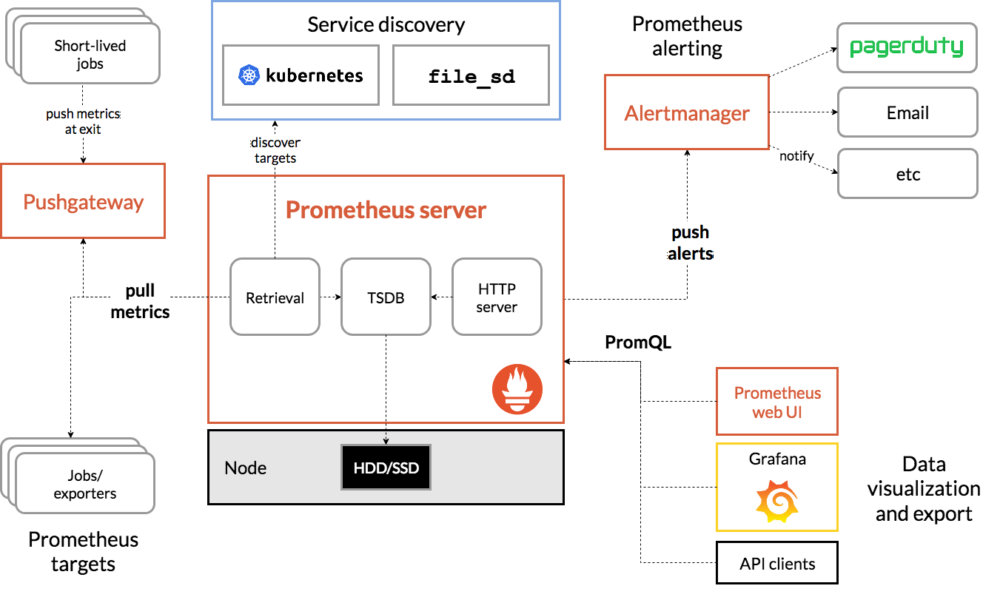

**整体工作流程**（与 [官方 Architecture 描述](https://prometheus.io/docs/introduction/overview/#architecture) 一致）：Prometheus 从已埋点的 job 抓取指标（可直接抓取，或通过 Pushgateway 抓取短生命周期任务），将所有样本在本地存储，并基于规则对数据进行聚合、生成新的时间序列或产生告警；[Grafana](https://grafana.com/) 或其他 API 消费者可对采集到的数据进行可视化。

## T4.2、安装

Prometheus 使用 Go 语言编写，安装简便，只需下载对应平台的二进制文件即可运行，访问 [Prometheus 下载页面](https://prometheus.io/download)获取最新版本。

Prometheus 可以通过 YAML 配置文件直接启动，如果我们使用二进制的方式来启动的话，可以使用下面的命令：

```bash
tar xf prometheus-3.10.0.linux-amd64.tar.gz
cd prometheus-3.10.0.linux-amd64/
./prometheus --config.file=prometheus.yml
```

其中 `prometheus.yml` 文件的配置如下（格式遵循 [Prometheus 官方配置说明](https://prometheus.io/docs/prometheus/latest/configuration/configuration/)）：

```yaml
# my global config（与发行包 prometheus-3.x.x.linux-amd64 中自带的 prometheus.yml 一致）
global:
  scrape_interval: 15s      # 抓取目标的默认频率（不写时程序默认为 1m，发行包示例写 15s）
  evaluation_interval: 15s  # 规则评估频率（不写时程序默认为 1m，发行包示例写 15s）
  # scrape_timeout 未写时使用程序默认 10s（且不能大于 scrape_interval）

# 规则文件列表（可含 glob），用于记录规则与告警
rule_files:
  # - "first_rules.yml"
  # - "second_rules.yml"

# 抓取配置列表，定义监控目标与抓取方式
scrape_configs:
  # job_name 会作为标签 job=<job_name> 附加到该 job 抓取的所有时间序列
  - job_name: "prometheus"
    # metrics_path 默认为 '/metrics'，scheme 默认为 'http'
    static_configs:
      - targets: ["localhost:9090"]
        # labels 会附加到从该 static_config 抓取的所有指标
        labels:
          app: "prometheus"

# Alertmanager 配置（告警推送目标）
alerting:
  alertmanagers:
    - static_configs:
        - targets:
          # - alertmanager:9093
```

该配置文件包含以下模块（顺序与 [官方配置结构](https://prometheus.io/docs/prometheus/latest/configuration/configuration/) 一致）：

- **`global`**：全局配置，作为其他配置段的默认值。
  - `scrape_interval`：抓取目标的默认频率。**配置里不写时**程序使用 1m；**发行包自带的 prometheus.yml** 里显式写了 15s，所以你看到的 15s 就是包里的示例值，与“不写时默认 1m”不矛盾。
  - `evaluation_interval`：规则评估频率。不写时程序默认 1m；发行包示例为 15s。
  - `scrape_timeout`：单次抓取超时。不写时程序默认 10s，且不能大于 `scrape_interval`。
- **`rule_files`**：规则文件路径列表（支持 glob），用于记录规则与告警；当前示例未启用任何规则文件。
- **`scrape_configs`**：抓取配置列表，定义抓取哪些目标以及如何抓取。
- **`alerting`**：与 Alertmanager 相关的设置，包括告警推送目标等。

上面示例里只有一段 **scrape 配置**（一个 `scrape_config` 项），对应一个 **job**，名为 `prometheus`。根据[官方配置说明](https://prometheus.io/docs/prometheus/latest/configuration/configuration/)：一段 scrape 配置通常对应一个 job，目标的 `job` 标签会取该配置的 `job_name`。Prometheus 服务自身通过 HTTP 暴露指标，因此可以抓取自己：该 job 使用 `static_configs` 配置了单个目标 `localhost:9090`。未指定时，`metrics_path` 默认为 `/metrics`，`scheme` 默认为 `http`，因此实际抓取地址为 `http://localhost:9090/metrics`，得到的是 Prometheus 服务自身的状态与性能时间序列。

若要监控更多目标，可在 `scrape_configs` 下追加新的 `scrape_config`（新 job），或在现有 job 的 `static_configs` 中增加目标；也可通过服务发现等方式动态发现目标。

### T4.2.1、示例 Prometheus 3.10

本小节分为两部分：**本地示例**（1～2）在主机上用 Go 客户端库暴露指标并用本地 Prometheus 抓取；**Kubernetes 部署**（3～7）在集群中部署 Prometheus 3.10 及依赖资源。两部分的配置与步骤互不依赖，可按需只做其一。

本小节使用 [Prometheus Go 客户端库](https://github.com/prometheus/client_golang) 的 `examples/random` 示例，在本地暴露三个带不同延迟分布的模拟 RPC 指标端点，供 Prometheus 3.10 抓取。该示例暴露的指标格式符合 [Prometheus exposition 格式](https://prometheus.io/docs/instrumenting/exposition_formats/)，可直接被 Prometheus 抓取。

**1. 准备 Go 环境并运行 random 示例**

确保已安装 Go（建议 1.21+）并启用 Go modules，克隆客户端库并编译运行：

```bash
git clone https://github.com/prometheus/client_golang.git
cd client_golang/examples/random
export GO111MODULE=on
export GOPROXY=https://goproxy.cn
go build
```

在三个终端中分别启动三个实例（监听不同端口）：

```bash
./random -listen-address=:8080
./random -listen-address=:8081
./random -listen-address=:8082
```

此时可访问三个指标端点：`http://localhost:8080/metrics`、`http://localhost:8081/metrics`、`http://localhost:8082/metrics`。

**2. 在 Prometheus 中配置抓取**

将下面配置追加到 **本地** 使用的 `prometheus.yml` 的 `scrape_configs` 中（与 [官方 scrape_config](https://prometheus.io/docs/prometheus/latest/configuration/configuration/#scrape_config) 一致），然后重启 Prometheus 或调用 `/-/reload`（需已开启 `--web.enable-lifecycle`）：

```yaml
scrape_configs:
  - job_name: 'example-random'
    scrape_interval: 5s   # 覆盖全局默认，该 job 每 5 秒抓取
    static_configs:
      - targets: ['localhost:8080', 'localhost:8081']
        labels:
          group: 'production'
      - targets: ['localhost:8082']
        labels:
          group: 'canary'
```

通过为同一 job 下不同 `static_configs` 设置不同 `labels`，可在 Prometheus 中区分环境（例如生产与金丝雀）。在 Web UI 的 Status → Targets 中可确认新 job 是否被正确抓取。添加监控目标的核心方式即为：在 `scrape_configs` 中增加一个 `scrape_config`，并保证目标提供符合 [Prometheus exposition](https://prometheus.io/docs/instrumenting/exposition_formats/) 格式的 HTTP 指标接口（默认路径 `/metrics`）。

> 为便于管理，以下所有监控相关资源均放在 namespace `kube-mon` 下，若不存在请先执行：`kubectl create namespace kube-mon`。

> **版本与镜像约定（官方最新稳定版）**
>
> 文中 **`image:` 固定标签**须与各软件 **GitHub Releases**（或 registry 对应 tag）上 **latest 稳定版**（`prerelease: false`）一致，**禁止使用 `latest` 浮动标签**。升级前先查官方发行页再改 YAML。
>
> **本文同步校验日期：2026-03-28**，对应当前稳定版示例：  
>
> | 组件 | 镜像 / 标签 | 官方发行说明 |
> |------|-------------|--------------|
> | Prometheus | `prom/prometheus:v3.10.0` | [Releases](https://github.com/prometheus/prometheus/releases/latest) |
> | Alertmanager | `prom/alertmanager:v0.31.1` | [Releases](https://github.com/prometheus/alertmanager/releases/latest) |
> | node_exporter | `prom/node-exporter:v1.10.2` | [Releases](https://github.com/prometheus/node_exporter/releases/latest) |
> | Grafana OSS | `grafana/grafana:12.4.1` | [Releases](https://github.com/grafana/grafana/releases/latest) · [Download](https://grafana.com/grafana/download) |
> | kube-state-metrics | `registry.k8s.io/kube-state-metrics/kube-state-metrics:v2.18.0` | [Releases](https://github.com/kubernetes/kube-state-metrics/releases/latest) |
> | redis_exporter | `oliver006/redis_exporter:v1.82.0` | [Releases](https://github.com/oliver006/redis_exporter/releases/latest) |
> | Redis（应用镜像） | `redis:8.6.2-alpine` | [Releases](https://github.com/redis/redis/releases/latest) · [Hub Tags](https://hub.docker.com/_/redis/tags) |
> | Thanos | `thanosio/thanos:v0.41.0` | [Releases](https://github.com/thanos-io/thanos/releases/latest) |
> | busybox（init 辅助） | `busybox:1.37` | [Hub Tags](https://hub.docker.com/_/busybox/tags) |
> | MinIO | `minio/minio:RELEASE.2025-10-15T17-29-55Z` | [Releases](https://github.com/minio/minio/releases/latest) |
> | prometheus-webhook-dingtalk | `timonwong/prometheus-webhook-dingtalk:v2.1.0` | [Releases](https://github.com/timonwong/prometheus-webhook-dingtalk/releases/latest) |
> | PrometheusAlert（企微等聚合通道） | `feiyu563/prometheus-alert:v4.9.2` | [Releases](https://github.com/feiyu563/PrometheusAlert/releases/latest) |
>
> **补充**：文中出现的 `cnych/*` 等为教程配套**社区镜像**，通常无独立 GitHub Release 页与核心栈同步；使用须在 [Docker Hub](https://hub.docker.com/) 对应仓库核对维护者当前推荐的**固定 tag**（勿用 `latest`），并在变更时更新本文校验日期。

**3. 在 Kubernetes 中部署 Prometheus 3.10**

以下给出 ConfigMap、Deployment、PV/PVC、RBAC、Service 的**资源定义**；实际在集群中的 **apply 顺序** 见本小节「6. 部署 Prometheus 并处理数据目录权限」中的表格，须严格按该顺序执行，否则 Pod 无法创建或无法调度。

将 Prometheus 配置放入 ConfigMap，与 [官方配置结构](https://prometheus.io/docs/prometheus/latest/configuration/configuration/) 一致。注意：`scrape_timeout` 不能大于 `scrape_interval`；保留时间建议在配置文件中用 `storage.tsdb.retention` 设置（3.x 推荐方式，命令行参数已弃用）。

```yaml
# prometheus-cm.yaml
apiVersion: v1
kind: ConfigMap
metadata:
  name: prometheus-config
  namespace: kube-mon
data:
  prometheus.yml: |
    global:
      scrape_interval: 15s
      scrape_timeout: 10s
    rule_files: []
    scrape_configs:
      - job_name: 'prometheus'
        static_configs:
          - targets: ['localhost:9090']
    alerting:
      alertmanagers: []
    storage:
      tsdb:
        retention:
          time: 24h
```

创建 ConfigMap：

```bash
kubectl apply -f prometheus-cm.yaml
```

后续若有新抓取目标，只需更新该 ConfigMap 并让 Prometheus 重新加载配置即可。

> **⚠️ 部署顺序**：Deployment 依赖 **ConfigMap**（prometheus-config）、**PVC**（prometheus-data）和 **RBAC**（ServiceAccount `prometheus`）。必须先完成下面的「4. 数据持久化」「5. RBAC」并执行 `kubectl apply` 后，再应用本节的 Deployment；否则会报错 `serviceaccount "prometheus" not found`，ReplicaSet 无法创建 Pod。建议按「3 → 4 → 5 → 6」顺序操作。

接着创建 Deployment（使用 **Prometheus 3.10.0** 官方镜像）：

```yaml
# prometheus-deploy.yaml（请先完成 4、5 步后再 apply）
apiVersion: apps/v1
kind: Deployment
metadata:
  name: prometheus
  namespace: kube-mon
  labels:
    app: prometheus
spec:
  selector:
    matchLabels:
      app: prometheus
  template:
    metadata:
      labels:
        app: prometheus
    spec:
      serviceAccountName: prometheus
      initContainers:
        - name: fix-data-dir-permissions
          image: busybox:1.37
          command: ["sh", "-c", "chown -R 65534:65534 /prometheus || true"]
          volumeMounts:
            - name: data
              mountPath: /prometheus
      containers:
      - image: prom/prometheus:v3.10.0
        name: prometheus
        args:
        - "--config.file=/etc/prometheus/prometheus.yml"
        - "--storage.tsdb.path=/prometheus"
        - "--web.enable-lifecycle"
        - "--web.enable-admin-api"
        ports:
        - containerPort: 9090
          name: http
        volumeMounts:
        - mountPath: "/etc/prometheus"
          name: config-volume
        - mountPath: "/prometheus"
          name: data
        resources:
          requests:
            cpu: 100m
            memory: 512Mi
          limits:
            cpu: 100m
            memory: 512Mi
      volumes:
      - name: data
        persistentVolumeClaim:
          claimName: prometheus-data
      - configMap:
          name: prometheus-config
        name: config-volume
```

说明：保留时间已在上面 ConfigMap 的 `storage.tsdb.retention.time: 24h` 中配置，无需再传 `--storage.tsdb.retention.time`。`--web.enable-lifecycle` 用于通过 HTTP POST `/-/reload` 热加载配置；`--web.enable-admin-api` 用于开放管理类 API（生产环境请按需并做好访问控制）。

**4. 数据持久化（Local PV）**

以下使用 Local PV 将 Prometheus 数据落到宿主机目录，采用 **静态制备（static provisioning）**：手动创建 PV 和 PVC，由控制面根据容量、访问模式、`storageClassName` 等 [匹配并绑定](https://kubernetes.io/docs/concepts/storage/persistent-volumes/#binding)。PV 与 PVC 的 `storageClassName` 填成相同字符串（如 `local-storage`）即可互相匹配，**不需要**在集群中实际存在同名的 StorageClass 资源；`kubectl get storageclass` 查不到 `local-storage` 也属正常。只有 **动态制备（dynamic provisioning）**（只创建 PVC、由 StorageClass 的 provisioner 自动创建 PV）才要求集群中存在对应名称的 StorageClass 对象。**重要**：Local PV 只能被调度到「拥有该磁盘路径」的那台节点，因此 `nodeAffinity` 里的节点名必须与集群中真实节点名一致（如 `worker-01`），否则使用该 PVC 的 Pod 会一直处于 **Pending**。请先将下面 YAML 中的 `values` 里的节点名改成你打算运行 Prometheus 的节点名（可用 `kubectl get nodes` 查看）。该节点上需事先创建目录并确保 Kubelet 可写（例如 `mkdir -p /data/k8s/prometheus`）。

```yaml
# prometheus-pv-pvc.yaml（请将 node3 改为实际节点名，如 worker-01）
apiVersion: v1
kind: PersistentVolume
metadata:
  name: prometheus-local
  labels:
    app: prometheus
spec:
  accessModes:
    - ReadWriteOnce
  capacity:
    storage: 20Gi
  storageClassName: local-storage
  local:
    path: /data/k8s/prometheus
  nodeAffinity:
    required:
      nodeSelectorTerms:
        - matchExpressions:
            - key: kubernetes.io/hostname
              operator: In
              values:
                - node3   # 必改：改为实际节点名，如 worker-01
  persistentVolumeReclaimPolicy: Retain
---
apiVersion: v1
kind: PersistentVolumeClaim
metadata:
  name: prometheus-data
  namespace: kube-mon
spec:
  selector:
    matchLabels:
      app: prometheus
  accessModes:
    - ReadWriteOnce
  resources:
    requests:
      storage: 20Gi
  storageClassName: local-storage
```

**5. RBAC**

Prometheus 需访问集群内节点、Pod、Service、Endpoint 等资源以做服务发现与抓取，因此需要 ClusterRole 和 ClusterRoleBinding。以下使用 `rbac.authorization.k8s.io/v1`；Ingress 资源使用 `networking.k8s.io`（Kubernetes 1.19+）。

```yaml
# prometheus-rbac.yaml
apiVersion: v1
kind: ServiceAccount
metadata:
  name: prometheus
  namespace: kube-mon
---
apiVersion: rbac.authorization.k8s.io/v1
kind: ClusterRole
metadata:
  name: prometheus
rules:
  - apiGroups: [""]
    resources:
      - nodes
      - services
      - endpoints
      - pods
      - nodes/proxy
    verbs: ["get", "list", "watch"]
  - apiGroups: ["networking.k8s.io"]
    resources: ["ingresses"]
    verbs: ["get", "list", "watch"]
  - apiGroups: [""]
    resources:
      - configmaps
      - nodes/metrics
    verbs: ["get"]
  - nonResourceURLs: ["/metrics"]
    verbs: ["get"]
---
apiVersion: rbac.authorization.k8s.io/v1
kind: ClusterRoleBinding
metadata:
  name: prometheus
roleRef:
  apiGroup: rbac.authorization.k8s.io
  kind: ClusterRole
  name: prometheus
subjects:
  - kind: ServiceAccount
    name: prometheus
    namespace: kube-mon
```

```bash
kubectl apply -f prometheus-rbac.yaml
```

**6. 部署 Prometheus 并处理数据目录权限**

建议操作顺序（必须按此顺序，否则 Pod 无法创建或无法调度）：

| 顺序 | 操作 | 说明 |
|------|------|------|
| 1 | `kubectl create namespace kube-mon` | 若无该 namespace |
| 2 | `kubectl apply -f prometheus-cm.yaml` | ConfigMap |
| 3 | 修改 PV 节点名后 `kubectl apply -f prometheus-pv-pvc.yaml` | PV 的 nodeAffinity 需为真实节点名 |
| 4 | `kubectl apply -f prometheus-rbac.yaml` | **必做**：创建 ServiceAccount `prometheus`，Deployment 依赖此项 |
| 5 | `kubectl apply -f prometheus-deploy.yaml` | Deployment |

部署前可快速检查依赖是否就绪：`kubectl get sa prometheus -n kube-mon`、`kubectl get configmap prometheus-config -n kube-mon`、`kubectl get pvc prometheus-data -n kube-mon`，三者均存在后再 apply Deployment。

按上表顺序，在已执行顺序 1、2 的前提下，执行顺序 3、4、5 的示例命令如下：

```bash
kubectl apply -f prometheus-pv-pvc.yaml    # 顺序 3
kubectl apply -f prometheus-rbac.yaml     # 顺序 4
kubectl apply -f prometheus-deploy.yaml   # 顺序 5
kubectl get pods -n kube-mon
```

成功启动后，Pod 状态为 Running，日志中会出现配置加载及 “Server is ready to receive web requests.” 等输出（Prometheus 3.10 的日志格式可能与旧版略有不同）。

**若创建 Deployment 后没有 Pod**：
- **报错 `serviceaccount "prometheus" not found`**：说明未先执行本小节「5. RBAC」。执行 `kubectl apply -f prometheus-rbac.yaml` 后，再执行 `kubectl rollout restart deployment prometheus -n kube-mon`（或删除 Deployment 后重新 `kubectl apply -f prometheus-deploy.yaml`），Pod 即可被创建。
- **Pod 一直 Pending**：多半是 Local PV 的节点亲和写成了不存在的节点（如文档示例里的 `node3`）。解决步骤：① 删除 Deployment；② 删除 PVC；③ 删除 PV；④ 把 PV 的 `nodeAffinity.values` 改成实际节点名（如 `worker-01`），保存后重新 `kubectl apply -f prometheus-pv-pvc.yaml`；⑤ 再 `kubectl apply -f prometheus-deploy.yaml`。

**若 Pod 出现 `CrashLoopBackOff` 且日志有 `permission denied`**（如 `open /prometheus/queries.active: permission denied`）：`prom/prometheus:v3.10.0` 默认以非 root（UID 65534）运行，而 Local PV 挂载的宿主机目录往往属主为 root。本节提供的 `prometheus-deploy.yaml` 已包含 **initContainer** 在启动前执行 `chown -R 65534:65534 /prometheus`，一般即可避免。若仍报错，可核对镜像实际运行 UID，或临时使用 `securityContext.runAsUser: 0`（仅建议在实验环境使用）。

**7. 创建 Service 以访问 Web UI**

```yaml
# prometheus-svc.yaml
apiVersion: v1
kind: Service
metadata:
  name: prometheus
  namespace: kube-mon
  labels:
    app: prometheus
spec:
  selector:
    app: prometheus
  type: NodePort
  ports:
    - name: web
      port: 9090
      targetPort: http
```

为便于从集群外访问，此处使用 `NodePort`；生产环境可改为 Ingress 或通过端口转发访问。

```bash
kubectl apply -f prometheus-svc.yaml
kubectl get svc -n kube-mon
```

记下 NodePort 端口（例如 `31078`），在浏览器中访问 `http://<任意节点 IP>:<NodePort>` 即可打开 Prometheus 3.10 的 Web UI。

- **Status -> Target health**：查看当前抓取目标及状态。
- **Alerts**：未配置告警规则时为空。
- **Query -> Graph**：在查询框输入指标名（如 `scrape_duration_seconds`）并执行，可查看 Prometheus 自抓取指标等时间序列图表。

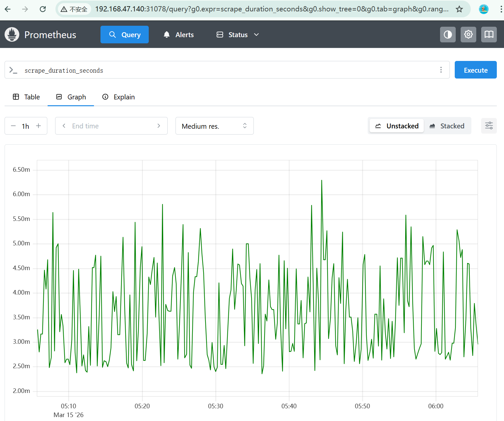

**企业生产补充：Prometheus Web/API 安全与 Grafana 数据源认证（官方文档对齐）**

上文 **T4.2.1** 为便于在内网快速跑通，Prometheus 监听 **HTTP `9090`** 且 **未**在服务端启用 Basic Auth / TLS；集群内 Grafana 使用 **`http://prometheus:9090`**、数据源认证选 **No authentication** 即可。**有合规或内控要求时**，必须在 **Prometheus 侧** 与 **Grafana 数据源侧**同步按官方说明打开认证与传输安全，否则仅改一端会出现 UI 里 **Authentication** 选项与真实服务不一致、**Save & test** 失败或「以为已加密实际仍明文」的问题。

| 层面 | 官方依据 | 生产要点 |
|------|----------|----------|
| Prometheus 服务端 | [HTTPS and authentication](https://prometheus.io/docs/prometheus/latest/configuration/https/) | 使用 **`--web.config.file`** 加载 YAML，可配置 **`tls_server_config`**（服务端证书）与 **`basic_auth_users`**（口令为 **bcrypt** 哈希；文件可在每次 HTTP 请求时重读）。示例见上游 [web-config.yml](https://github.com/prometheus/prometheus/blob/main/documentation/examples/web-config.yml)。TLS 部署步骤另见 Grafana 文档所引用的 [Securing Prometheus API and UI Endpoints Using TLS Encryption](https://prometheus.io/docs/guides/tls-encryption/)。 |
| 网络与暴露面 | Kubernetes / Ingress 惯例 | 除上述外，常用 **Ingress + TLS**、**仅 ClusterIP** 配合 **NetworkPolicy**、或前置 API 网关，缩小 `9090` 对外暴露；**Admin API**（T4.2.1 中 `--web.enable-admin-api`）尤须限制可达性。 |
| Grafana 数据源 | [Configure the Prometheus data source](https://grafana.com/docs/grafana/latest/datasources/prometheus/configure/) | **Authentication**：**Basic authentication**（用户名/口令，对应 Prometheus Basic Auth）、**Forward OAuth identity**（将当前用户的 OAuth/OIDC 令牌转发给数据源；需上游与本企业 IdP 策略支持）、**No authentication**（仅当 Prometheus 确无认证且风险可接受）。**Prometheus server URL**：启用 TLS 后改为 **`https://主机:端口`**。**TLS settings**：校验自签/私有 CA 时配置 **CA certificate**；双向 TLS 时配置 **TLS client authentication**；**Skip TLS verify** 仅应急排障。**HTTP headers**：按反向代理或多租户网关要求添加。口令、客户端证书私钥等用 Grafana **Secrets** 或 Provisioning 的 **`secureJsonData`** 注入，**勿**写入 Git 明文。 |

**与本文清单的对应关系**：保持 **HTTP、无认证** 时，Grafana 数据源选 **No authentication**，URL 维持 **`http://prometheus.kube-mon.svc.cluster.local:9090`**（或短名 `http://prometheus:9090`）。一旦 Prometheus 启用 **HTTPS** 和/或 **Basic Auth**，必须在数据源中填写 **同一套** URL scheme、**Authentication** 与 **TLS** 选项；中间经 **Thanos Querier** 等查询入口时，URL 与认证方式以 **实际查询服务** 为准（见后文 Thanos 相关小节）。

## T4.3、监控应用

Prometheus 通过 HTTP(S) 拉取目标的 [exposition 格式](https://prometheus.io/docs/instrumenting/exposition_formats/) 指标，无需在目标上安装独立 agent，只要目标暴露一个可访问的 metrics 端点即可。许多组件（如 Kubernetes 各组件、CoreDNS、Istio）已内置 `/metrics` 或专用端口；未内置的可通过 [Exporter](https://prometheus.io/docs/instrumenting/exporters/)（如 `node_exporter`、`mysqld_exporter`）以 sidecar 或独立部署方式暴露指标。

### T4.3.1、普通应用（示例：CoreDNS）

只要应用提供符合 Prometheus 格式的 `/metrics`（或自定义路径）接口，即可在 `prometheus.yml` 的 `scrape_configs` 中增加一个 job 进行抓取。下面以集群内的 **CoreDNS** 为例，在 **T4.2.1 已部署的 Prometheus（kube-mon）** 上增加对 CoreDNS 的监控。

**1. 确认 CoreDNS 已开启 Prometheus 指标**

CoreDNS 通过 `prometheus` 插件暴露指标，默认监听 `:9153`。查看 CoreDNS 的 ConfigMap，确认 Corefile 中有 `prometheus :9153`：

```bash
kubectl get configmap coredns -n kube-system -o jsonpath='{.data.Corefile}'
```

若输出中包含 `prometheus :9153`，说明已开启。CoreDNS 的 Service（通常为 `kube-dns`）会暴露 9153 端口，Prometheus 在集群内可通过 Service DNS 访问，无需写死 Pod IP。

**2. 在集群内验证 metrics 可达（可选）**

从任意 Pod 或通过 `kubectl run` 临时 Pod 访问 CoreDNS 的 metrics 端口（以下使用 Service 名称，适用于默认的 kube-dns）。注意：① `head -20` 须在容器内执行（`sh -c '...'`），若在宿主机上使用 `| head -20`，管道会提前关闭导致 `debug` Pod 残留；② 使用 `-i` 而非 `-it`，避免 TTY 下输出未刷新到终端就随 Pod 退出而看不到数据。

```bash
kubectl run -i --rm debug --image=curlimages/curl --image-pull-policy=IfNotPresent --restart=Never -- sh -c 'curl -s "http://kube-dns.kube-system.svc.cluster.local:9153/metrics" | head -20'
```

能输出 `# HELP` / `# TYPE` 等行即表示接口正常。

**3. 更新 Prometheus 配置并加入 coredns job**

在 T4.2.1 中我们已在 `kube-mon` 中创建了 ConfigMap `prometheus-config`。此处在其 `scrape_configs` 中**新增**一个 job（不要删掉原有的 `prometheus` job 及 `global`、`rule_files`、`alerting`、`storage` 等段）。使用 **Service 地址** `kube-dns.kube-system.svc.cluster.local:9153` 作为 target，避免 Pod 重启后 IP 变化导致抓取失败。完整示例（与 T4.2.1 配置结构一致，仅增加 coredns job）如下：

```yaml
# prometheus-cm.yaml（在 T4.2.1 基础上增加 coredns job，apply 前请确认 namespace、ConfigMap 名称与现有一致）
apiVersion: v1
kind: ConfigMap
metadata:
  name: prometheus-config
  namespace: kube-mon
data:
  prometheus.yml: |
    global:
      scrape_interval: 15s
      scrape_timeout: 10s
    rule_files: []
    scrape_configs:
      - job_name: 'prometheus'
        static_configs:
          - targets: ['localhost:9090']
      - job_name: 'coredns'
        static_configs:
          - targets: ['kube-dns.kube-system.svc.cluster.local:9153']
    alerting:
      alertmanagers: []
    storage:
      tsdb:
        retention:
          time: 24h
```

**4. 应用配置并触发热加载**

```bash
kubectl apply -f prometheus-cm.yaml
```

ConfigMap 更新后，挂载到 Prometheus Pod 的 `prometheus.yml` 会在一段时间内自动更新。因 T4.2.1 中已启用 `--web.enable-lifecycle`，可通过 HTTP POST 触发重载，无需重启 Pod。从**能访问集群的机器**上执行（将 `<节点IP>` 换为任意节点地址，端口为 Prometheus Service 的 NodePort，例如 31078）：

```bash
curl -X POST "http://<节点IP>:31078/-/reload"
```

若在集群内执行，也可先查 Prometheus Pod IP 再 reload：

```bash
POD_IP=$(kubectl get pods -n kube-mon -l app=prometheus -o jsonpath='{.items[0].status.podIP}')
curl -X POST "http://${POD_IP}:9090/-/reload"
```

**5. 校验抓取结果**

在浏览器打开 Prometheus Web UI（如 `http://<节点IP>:31078`），进入 **Status → Target health**，应能看到 `coredns` job 及 target 状态为 UP。在 **Query → Graph** 中可查询 CoreDNS 相关指标（如 `coredns_cache_hits_total`、`coredns_cache_misses_total`）。指标含义可参考该 target 的 `/metrics` 输出中的 `# HELP` 注释。

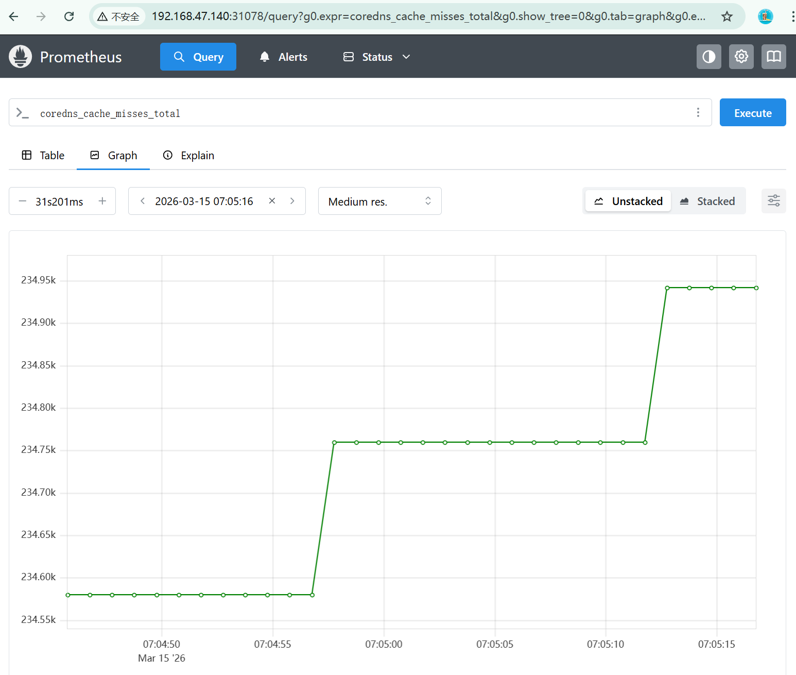

**说明**：`scrape_configs` 还支持 `basic_auth`、`bearer_token`、`kubernetes_sd_configs` 等，详见 [官方 scrape_config](https://prometheus.io/docs/prometheus/latest/configuration/configuration/#scrape_config)。若 CoreDNS 有多副本且需按 Pod 分别抓取，可改用 `kubernetes_sd_configs` 做服务发现。

### T4.3.2、使用 exporter 监控

若应用本身没有暴露 Prometheus 格式的 `/metrics`，可通过 [Exporter](https://prometheus.io/docs/instrumenting/exporters/) 将指标暴露给 Prometheus。官方与社区为常见中间件提供了多种 exporter（如 Redis、MySQL、Node 等）。下面以 **Redis + redis-exporter** 为例，在 **kube-mon** 中部署 Redis，并以 **sidecar** 方式在同一 Pod 内运行 [redis-exporter](https://github.com/oliver006/redis_exporter)，供已在 T4.2.1/T4.3.1 中部署的 Prometheus 抓取。

**1. 部署 Redis 与 redis-exporter**

同一 Pod 内：主容器为 Redis，sidecar 为 redis-exporter。exporter 默认连接 `localhost:6379`，与主应用同 Pod 时无需额外配置。镜像与上文 **「版本与镜像约定」** 表一致：**Redis** 用官方补丁线 **`8.6.2-alpine`**（[GitHub Releases](https://github.com/redis/redis/releases/latest)）、**redis_exporter** 用 **`v1.82.0`**。资源清单（文件名与 T4.3.1 统一，如 `prometheus-redis.yaml`）：

```yaml
# prometheus-redis.yaml
apiVersion: apps/v1
kind: Deployment
metadata:
  name: redis
  namespace: kube-mon
spec:
  selector:
    matchLabels:
      app: redis
  template:
    metadata:
      labels:
        app: redis
    spec:
      containers:
        - name: redis
          image: redis:8.6.2-alpine
          resources:
            requests:
              cpu: 100m
              memory: 100Mi
          ports:
            - containerPort: 6379
        - name: redis-exporter
          image: oliver006/redis_exporter:v1.82.0
          resources:
            requests:
              cpu: 100m
              memory: 100Mi
          ports:
            - containerPort: 9121
---
apiVersion: v1
kind: Service
metadata:
  name: redis
  namespace: kube-mon
spec:
  selector:
    app: redis
  ports:
    - name: redis
      port: 6379
      targetPort: 6379
    - name: prom
      port: 9121
      targetPort: 9121
```

```bash
kubectl apply -f prometheus-redis.yaml
kubectl get pods,svc -n kube-mon
```

**2. 校验 exporter 指标（可选）**

Prometheus 与 Redis 同处 `kube-mon`，可直接用 Service 名访问。在集群内执行：

```bash
kubectl run -i --rm debug --image=curlimages/curl --image-pull-policy=IfNotPresent --restart=Never -- sh -c 'curl -s "http://redis.kube-mon.svc.cluster.local:9121/metrics" | grep -E "^redis_up |^redis_uptime_in_seconds "'
```

若输出中出现 `redis_up 1` 和 `redis_uptime_in_seconds` 即表示 exporter 已连上 Redis 并正常暴露指标。

**3. 更新 Prometheus 配置并加入 redis job**

在 T4.3.1 的 `prometheus-config` 基础上，在 `scrape_configs` 中**新增** `redis` job。因 Prometheus 与 Redis 同 namespace，target 使用 Service 名即可：`redis.kube-mon.svc.cluster.local:9121`（或简写 `redis:9121`）。以下为**完整** ConfigMap 示例（含 prometheus、coredns、redis 三个 job，与 T4.2.1/T4.3.1 结构一致）：

```yaml
# prometheus-cm.yaml（在 T4.3.1 基础上增加 redis job）
apiVersion: v1
kind: ConfigMap
metadata:
  name: prometheus-config
  namespace: kube-mon
data:
  prometheus.yml: |
    global:
      scrape_interval: 15s
      scrape_timeout: 10s
    rule_files: []
    scrape_configs:
      - job_name: 'prometheus'
        static_configs:
          - targets: ['localhost:9090']
      - job_name: 'coredns'
        static_configs:
          - targets: ['kube-dns.kube-system.svc.cluster.local:9153']
      - job_name: 'redis'
        static_configs:
          - targets: ['redis.kube-mon.svc.cluster.local:9121']
    alerting:
      alertmanagers: []
    storage:
      tsdb:
        retention:
          time: 24h
```

```bash
kubectl apply -f prometheus-cm.yaml
```

**4. 触发热加载并校验**

ConfigMap 挂载更新后，通过 NodePort 或 Pod IP 触发 reload（与 T4.3.1 相同）：

```bash
# 方式一：NodePort（将 <节点IP> 换为实际节点，端口为 Prometheus Service 的 NodePort）
curl -X POST "http://<节点IP>:31078/-/reload"

# 方式二：集群内 Pod IP
POD_IP=$(kubectl get pods -n kube-mon -l app=prometheus -o jsonpath='{.items[0].status.podIP}')
curl -X POST "http://${POD_IP}:9090/-/reload"
```

在 Prometheus Web UI（**Status → Targets health**）中确认 `redis` job 为 UP，在 **Query → Graph** 中可查询 `redis_up`、`redis_uptime_in_seconds`、`redis_exporter_scrapes_total` 等指标。

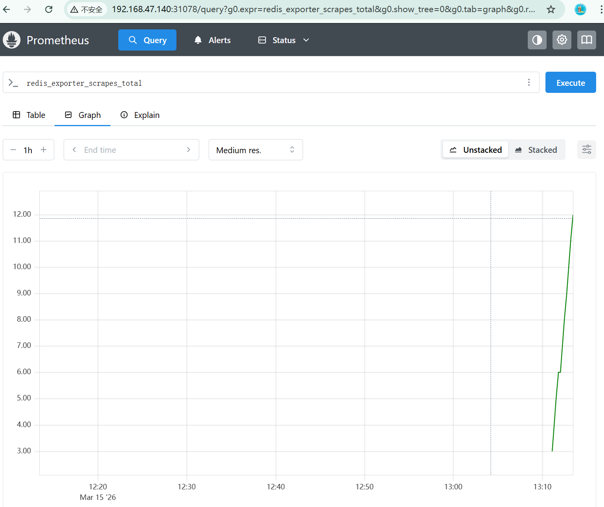

## T4.4、监控集群

前面介绍了用 Prometheus 监控 Kubernetes 集群内应用（CoreDNS、Redis 等），集群本身的监控同样重要，主要包括：

- **节点资源**：CPU、负载、磁盘、内存等（通常由 **node_exporter** 采集）。
- **核心组件**：kube-scheduler、kube-controller-manager、kube-apiserver、CoreDNS 等（部分已在 T4.3.1 配置）。
- **编排状态**：Deployment/Pod 状态、资源请求与使用量等（可由 **kube-state-metrics** 暴露）。

常用组件简述：**cAdvisor** 内置于 Kubelet，提供容器级指标；**metrics-server** 提供节点/Pod 的 CPU/内存使用量，供 `kubectl top` 和 HPA，不存历史；**kube-state-metrics** 暴露资源对象状态（如副本数、是否就绪），由 Prometheus 抓取。Heapster 已废弃，由 metrics-server 等替代。

### T4.4.1、监控集群节点（node_exporter）

使用 [Prometheus Node Exporter](https://github.com/prometheus/node_exporter) 采集主机级指标（CPU、内存、磁盘、网络等），官方说明见 [Monitoring Linux host metrics with the Node Exporter](https://prometheus.io/docs/guides/node-exporter/)。为覆盖所有节点，采用 **DaemonSet** 部署，每节点一个 Pod，监听 9100 端口。

**1. 部署 node_exporter DaemonSet**

镜像使用当前稳定版 **v1.10.2**（[Releases](https://github.com/prometheus/node_exporter/releases)）。因需读取主机 `/proc`、`/sys`、根文件系统，Pod 需 `hostPID`、`hostIPC`、`hostNetwork` 及对应 hostPath 挂载；`tolerations: operator: Exists` 表示容忍任意污点，control-plane 与 worker 均会调度。资源清单（与上文命名风格一致，如 `prometheus-node-exporter.yaml`）：

```yaml
# prometheus-node-exporter.yaml
apiVersion: apps/v1
kind: DaemonSet
metadata:
  name: node-exporter
  namespace: kube-mon
  labels:
    app: node-exporter
spec:
  selector:
    matchLabels:
      app: node-exporter
  template:
    metadata:
      labels:
        app: node-exporter
    spec:
      hostPID: true
      hostIPC: true
      hostNetwork: true
      nodeSelector:
        kubernetes.io/os: linux
      containers:
        - name: node-exporter
          image: prom/node-exporter:v1.10.2
          args:
            - --web.listen-address=$(HOSTIP):9100
            - --path.procfs=/host/proc
            - --path.sysfs=/host/sys
            - --path.rootfs=/host/root
            - --collector.filesystem.ignored-mount-points=^/(dev|proc|sys|var/lib/containerd/.+|var/lib/docker/.+)($|/)
            - --collector.filesystem.ignored-fs-types=^(autofs|binfmt_misc|cgroup|configfs|debugfs|devpts|devtmpfs|fusectl|hugetlbfs|mqueue|overlay|proc|procfs|pstore|rpc_pipefs|securityfs|sysfs|tracefs)$
          ports:
            - containerPort: 9100
          env:
            - name: HOSTIP
              valueFrom:
                fieldRef:
                  fieldPath: status.hostIP
          resources:
            requests:
              cpu: 100m
              memory: 128Mi
            limits:
              cpu: 200m
              memory: 256Mi
          securityContext:
            runAsNonRoot: true
            runAsUser: 65534
          volumeMounts:
            - name: proc
              mountPath: /host/proc
            - name: sys
              mountPath: /host/sys
            - name: root
              mountPath: /host/root
              mountPropagation: HostToContainer
              readOnly: true
      tolerations:
        - operator: "Exists"
      volumes:
        - name: proc
          hostPath:
            path: /proc
        - name: sys
          hostPath:
            path: /sys
        - name: root
          hostPath:
            path: /
```

```bash
kubectl apply -f prometheus-node-exporter.yaml
kubectl get pods -n kube-mon -l app=node-exporter -o wide
```

每节点应有一个 Running 的 Pod；因 `hostNetwork: true`，节点上会监听 9100。可选：从集群内用某节点 IP 校验 `curl <节点IP>:9100/metrics | grep -E '^node_' | head -5`。

### T4.4.2、服务发现

节点扩缩容时若逐条维护静态 target 不便，可使用 Prometheus 的 [Kubernetes 服务发现](https://prometheus.io/docs/prometheus/latest/configuration/configuration/#kubernetes_sd_config)（支持 Node、Service、Pod、Endpoints、Ingress 等）。`role: node` 时默认目标为 Kubelet 端口 10250，需用 relabel 改为 node-exporter 的 9100，并可将 `instance` 设为节点名、用 `labelmap` 带入节点标签。**以下为与 T4.2.1/T4.3 一致的完整 ConfigMap**（含 prometheus、coredns、redis、kubernetes-nodes、kubernetes-kubelet），请整体替换 `prometheus-config` 后 apply，并按 T4.3.1 方式 reload（NodePort 或 Pod IP）：

```yaml
# prometheus-cm.yaml（T4.4 完整版）
apiVersion: v1
kind: ConfigMap
metadata:
  name: prometheus-config
  namespace: kube-mon
data:
  prometheus.yml: |
    global:
      scrape_interval: 15s
      scrape_timeout: 10s
    rule_files: []
    scrape_configs:
      - job_name: 'prometheus'
        static_configs:
          - targets: ['localhost:9090']
      - job_name: 'coredns'
        static_configs:
          - targets: ['kube-dns.kube-system.svc.cluster.local:9153']
      - job_name: 'redis'
        static_configs:
          - targets: ['redis.kube-mon.svc.cluster.local:9121']
      # -------- kubernetes-nodes：抓取各节点上的 node-exporter（9100）--------
      # role: node 时，服务发现默认把 __address__ 设成 <节点IP>:10250（kubelet），
      # 下面用 relabel 改成 node-exporter 的 9100，并把 instance 设为节点名。
      - job_name: 'kubernetes-nodes'
        kubernetes_sd_configs:
          - role: node   # 从 API 发现所有 Node，每个节点一个 target
        relabel_configs:
          # 把抓取地址从 <IP>:10250 改成 <IP>:9100（node-exporter 端口）
          - source_labels: [__address__]   # 要读取的标签（当前即 "节点:10250"）
            regex: '(.*):10250'             # 括号 (.*) 捕获 IP/主机部分
            replacement: '${1}:9100'        # 用捕获组 ${1} 保留主机，端口改为 9100
            target_label: __address__       # 写回抓取地址，Prometheus 按此请求
            action: replace                 # 替换：按 regex 匹配后按 replacement 生成新值
          # 用节点名作为 instance，便于 PromQL 里 node_load1{instance="worker-01"}
          - source_labels: [__meta_kubernetes_node_name]
            target_label: instance
            action: replace
          # 把节点上的 K8s 标签（如 zone、arch）映射成指标标签，便于按标签聚合
          - action: labelmap                 # 按正则批量复制标签，不改值
            regex: __meta_kubernetes_node_label_(.+)  # 匹配到的元标签名去掉前缀后作为新标签名
      # -------- kubernetes-kubelet：抓取各节点 kubelet 的 /metrics（HTTPS 10250）--------
      - job_name: 'kubernetes-kubelet'
        kubernetes_sd_configs:
          - role: node
        scheme: https                       # kubelet 只暴露 HTTPS
        tls_config:
          ca_file: /var/run/secrets/kubernetes.io/serviceaccount/ca.crt  # Pod 内 SA 的 CA
          insecure_skip_verify: true         # 跳过服务端证书校验（kubelet 常为自签名）
        bearer_token_file: /var/run/secrets/kubernetes.io/serviceaccount/token  # Pod 内 SA 的 token，用于认证
        relabel_configs:
          - action: labelmap
            regex: __meta_kubernetes_node_label_(.+)
    alerting:
      alertmanagers: []
    storage:
      tsdb:
        retention:
          time: 24h
```

```bash
kubectl apply -f prometheus-cm.yaml
# 方式一：NodePort
curl -X POST "http://<节点IP>:31078/-/reload"
# 方式二：集群内 Pod IP
# POD_IP=$(kubectl get pods -n kube-mon -l app=prometheus -o jsonpath='{.items[0].status.podIP}')
# curl -X POST "http://${POD_IP}:9090/-/reload"
```

说明（语法与参数简要说明）：

- **job_name**：本段抓取配置的名字，会出现在 Prometheus 里该 job 的 `job` 标签上。
- **kubernetes_sd_configs / role: node**：使用 Kubernetes 服务发现，`role: node` 表示“按节点发现”：从 API 拉取集群所有 Node，每个节点生成一个抓取目标。此时 Prometheus 会为每个 target 自动加上一批以 `__meta_kubernetes_` 开头的**元标签**（例如 `__meta_kubernetes_node_name`、`__meta_kubernetes_node_label_zone` 等），这些标签不会直接作为指标标签暴露，需要通过 **relabel_configs** 转成我们需要的标签（如 `instance`）。
- **relabel_configs**：在真正发起抓取前，对 target 的标签做改写。这里**标签**指 key-value 对：每个 target 有一组「标签名(key)=标签值(value)」。
  - **source_labels 和 regex 的关系（容易混）**：`source_labels` 里写的是**标签名（key）**，不是 key:value。Prometheus 会取出这些 key 在当前 target 上对应的 **value**，按顺序用分隔符（默认 `;`）拼成一个字符串；**regex 匹配的是这个「拼接后的 value 字符串」**，不是 key。例如 `source_labels: [__meta_kubernetes_service_annotation_prometheus_io_scrape]`、`regex: "true"` 表示：取名为 `__meta_kubernetes_service_annotation_prometheus_io_scrape` 的标签的**值**（例如 `"true"`），若该值匹配正则 `"true"` 则执行后续动作（如 keep 保留该 target）。
  - **action: replace**：用上述「source_labels 的 value 拼接串」去匹配 `regex`，用 `replacement` 里的 `$1`、`${1}` 等引用捕获组，把结果写入 `target_label`。上面把 `__address__` 从 `(.*):10250` 改成 `${1}:9100`，就是把“抓取地址”从 kubelet 的 10250 改成 node-exporter 的 9100。
  - **action: labelmap**：这里 regex 作用对象不同——**匹配的是「标签名(key)」**，把匹配到的标签整对复制，新标签名由 `replacement` 决定。例如 `regex: __meta_kubernetes_node_label_(.+)` 匹配的是**现有标签的名字**（如 `__meta_kubernetes_node_label_zone`），复制后新名字为 `zone`。
- **为何 10250 改成 9100**：`role: node` 时，服务发现默认把每个节点的 `__address__` 设成该节点的 kubelet 地址（`<节点IP>:10250`）。我们要抓的是 **node-exporter**（监听 9100），所以用一条 replace 规则把端口改成 9100；这样 `kubernetes-nodes` 这个 job 抓的就是各节点上的 node-exporter，而不是 kubelet。
- **kubernetes-kubelet 的 scheme / tls / bearer_token**：kubelet 的 metrics 只暴露在 **HTTPS 10250** 上，因此需要 `scheme: https`。`ca_file` 和 `bearer_token_file` 使用 Pod 内挂载的 ServiceAccount 的 CA 与 token，用于与 kubelet 建立 TLS 并做认证；`insecure_skip_verify: true` 表示不校验 kubelet 服务端证书（常见于自签名）。该 job 需要 T4.2.1 中配置的 RBAC（如 `nodes/metrics`、`nodes/proxy` 等）才能访问 kubelet。

**Kubernetes 服务发现元标签（`__meta_kubernetes_*`）从哪里来？**

下面用到的 `source_labels` 如 `__meta_kubernetes_node_name`、`__meta_kubernetes_service_annotation_prometheus_io_scrape` 等，**不是我们在 YAML 里定义的**，而是 **Prometheus 在服务发现阶段自动生成并挂到每个 target 上的**。当你配置了 `kubernetes_sd_configs` 且 `role` 为 `node`、`endpoints`、`pod`、`service`、`ingress` 等时，Prometheus 会请求 Kubernetes API，为每个发现到的目标附加一批以 `__meta_kubernetes_` 开头的**元标签**；这些标签只用于 relabel，不会直接出现在最终指标上。  

- **谁定义的**：由 **Prometheus 的 Kubernetes 服务发现逻辑**定义，完整列表与含义见官方配置文档 [kubernetes_sd_config](https://prometheus.io/docs/prometheus/latest/configuration/configuration/#kubernetes_sd_config)（页内按 role 分：node、service、pod、endpoints、endpointslice、ingress）。  
- **命名规则**：`__meta_kubernetes_<role>_<类型>_<名称>`。例如：`node_name`、`node_label_zone`（节点标签）、`service_name`、`service_annotation_<key>`（Service 的 annotation，key 中的 `.`、`/` 会变成 `_`，如 `prometheus.io/scrape` → `prometheus_io_scrape`）、`pod_name`、`endpoint_port_name` 等。  
- **本手册各 role 常用元标签速查**：  
  - **role: node**：`__meta_kubernetes_node_name`、`__meta_kubernetes_node_label_<标签名>`、默认 `__address__` 为节点 IP:10250。  
  - **role: endpoints**：每个 target 对应一个 Endpoint，会带上其所属 **Service** 与（若由 Pod 支撑）**Pod** 的元数据，例如 `__meta_kubernetes_namespace`、`__meta_kubernetes_service_name`、`__meta_kubernetes_service_annotation_<key>`（如 `prometheus_io_scrape`、`prometheus_io_port`）、`__meta_kubernetes_pod_name`、`__meta_kubernetes_endpoint_port_name` 等。  

后续 T4.6、T4.7 中出现的 `__meta_kubernetes_*` 均来自上述机制，不再重复说明；需要完整列表时请直接查阅官方 [kubernetes_sd_config](https://prometheus.io/docs/prometheus/latest/configuration/configuration/#kubernetes_sd_config)。

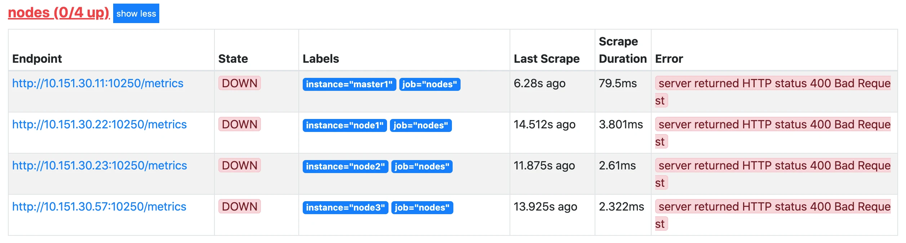

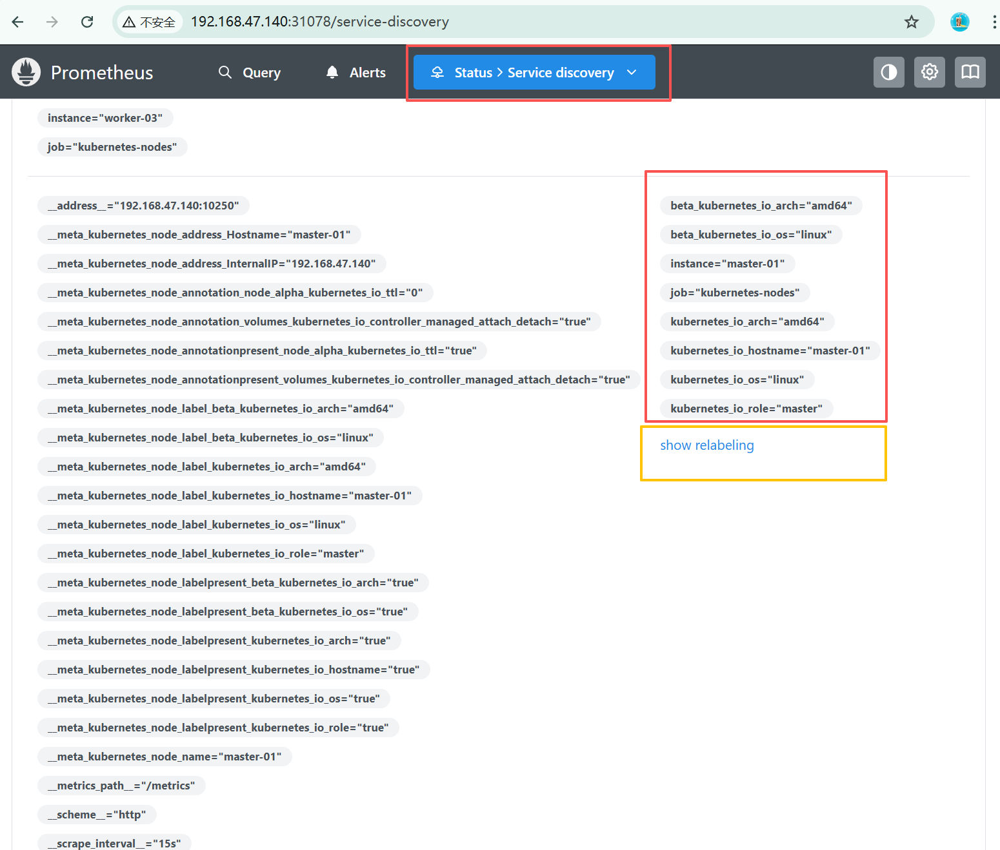

在 **Query -> Graph** 中可查询 `node_load1`（各节点 1 分钟负载），或按节点名过滤，如 `node_load1{instance="worker-01"}`（将 `worker-01` 换为实际节点名）。

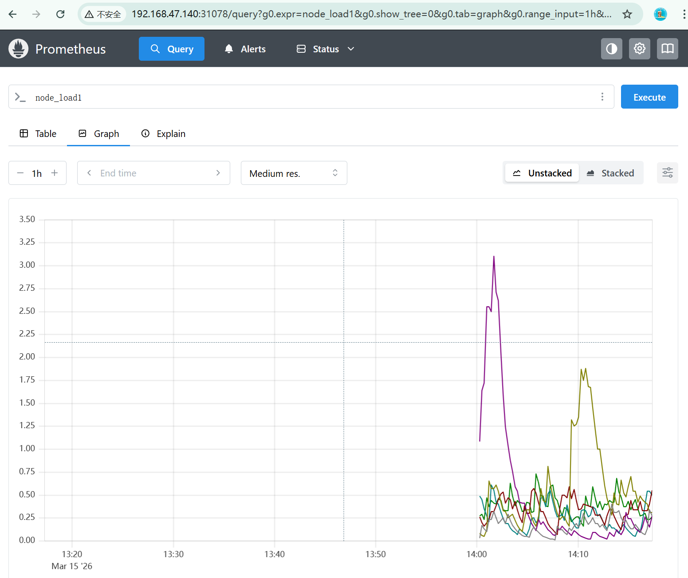

## T4.5、监控容器

容器监控通常使用 kubelet 内置的 **cAdvisor**，无需单独安装。cAdvisor 指标可通过 API Server 代理路径 `/api/v1/nodes/<node>/proxy/metrics/cadvisor` 获取，但该方式会加重 API Server 负担，**不推荐**在大规模集群使用。推荐直接抓取各节点 kubelet 的 **HTTPS :10250/metrics/cadvisor**，与 T4.4 的 `kubernetes-kubelet` 一样使用 `role: node` 服务发现和 ServiceAccount 认证。

在 T4.4 的 `prometheus-config` 的 `scrape_configs` 中**新增** `kubernetes-cadvisor` job。为与上文一致、避免漏配或缩进错误，下面给出**含 T4.4 全部 job 并新增 kubernetes-cadvisor 的完整 ConfigMap**（[Prometheus 官方 Kubernetes 示例](https://github.com/prometheus/prometheus/blob/main/documentation/examples/prometheus-kubernetes.yml) 中 cadvisor 使用顶层 `metrics_path`，此处保持一致）：

```yaml
# prometheus-cm.yaml（T4.4 + T4.5 完整版）
apiVersion: v1
kind: ConfigMap
metadata:
  name: prometheus-config
  namespace: kube-mon
data:
  prometheus.yml: |
    global:
      scrape_interval: 15s
      scrape_timeout: 10s
    rule_files: []
    scrape_configs:
      - job_name: 'prometheus'
        static_configs:
          - targets: ['localhost:9090']
      - job_name: 'coredns'
        static_configs:
          - targets: ['kube-dns.kube-system.svc.cluster.local:9153']
      - job_name: 'redis'
        static_configs:
          - targets: ['redis.kube-mon.svc.cluster.local:9121']
      # -------- kubernetes-nodes：抓取各节点上的 node-exporter（9100）--------
      - job_name: 'kubernetes-nodes'
        kubernetes_sd_configs:
          - role: node
        relabel_configs:
          - source_labels: [__address__]
            regex: '(.*):10250'
            replacement: '${1}:9100'
            target_label: __address__
            action: replace
          - source_labels: [__meta_kubernetes_node_name]
            target_label: instance
            action: replace
          - action: labelmap
            regex: __meta_kubernetes_node_label_(.+)
      # -------- kubernetes-kubelet：抓取各节点 kubelet 的 /metrics（HTTPS 10250）--------
      - job_name: 'kubernetes-kubelet'
        kubernetes_sd_configs:
          - role: node
        scheme: https
        tls_config:
          ca_file: /var/run/secrets/kubernetes.io/serviceaccount/ca.crt
          insecure_skip_verify: true
        bearer_token_file: /var/run/secrets/kubernetes.io/serviceaccount/token
        relabel_configs:
          - action: labelmap
            regex: __meta_kubernetes_node_label_(.+)
      # -------- kubernetes-cadvisor：抓取各节点 kubelet 的 /metrics/cadvisor（HTTPS 10250）--------
      # K8s 1.7.3+ 的 cAdvisor 指标从 kubelet /metrics 中拆出，需单独抓取此路径；RBAC 与 kubernetes-kubelet 相同。
      - job_name: 'kubernetes-cadvisor'
        kubernetes_sd_configs:
          - role: node
        scheme: https
        metrics_path: /metrics/cadvisor
        tls_config:
          ca_file: /var/run/secrets/kubernetes.io/serviceaccount/ca.crt
          insecure_skip_verify: true
        bearer_token_file: /var/run/secrets/kubernetes.io/serviceaccount/token
        relabel_configs:
          - source_labels: [__meta_kubernetes_node_name]
            target_label: instance
            action: replace
          - action: labelmap
            regex: __meta_kubernetes_node_label_(.+)
    alerting:
      alertmanagers: []
    storage:
      tsdb:
        retention:
          time: 24h
```

```bash
kubectl apply -f prometheus-cm.yaml
# 使配置生效（与 T4.4 一致）
curl -X POST "http://<节点IP>:31078/-/reload"
```

说明：`kubernetes-cadvisor` 与 `kubernetes-kubelet` 共用同一套 RBAC（T4.2.1 的 `nodes/metrics`、`nodes/proxy` 等），均直接访问节点 `:10250`。使用顶层 **metrics_path: /metrics/cadvisor**（[官方示例](https://github.com/prometheus/prometheus/blob/main/documentation/examples/prometheus-kubernetes.yml) 写法），无需用 relabel 改写 `__metrics_path__`。Pod 内 `ca.crt` 与 `token` 由 ServiceAccount 自动挂载。更新配置并 reload 后，在 Status -> Target health 中可看到 `kubernetes-cadvisor` 任务：

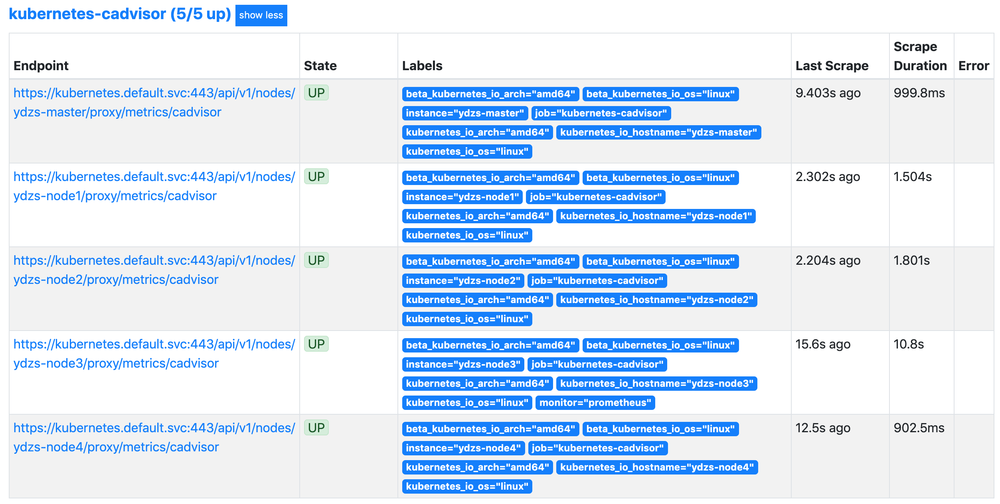

在 **Query → Graph** 中可查询容器相关指标。下面以集群中所有 Pod 的 CPU 使用率为例。cAdvisor 指标含义见 [Monitoring cAdvisor with Prometheus](https://github.com/google/cadvisor/blob/master/docs/storage/prometheus.md)。例如：

`container_cpu_usage_seconds_total` (Counter) 累计消耗的 CPU 时间 (单位：秒)

`container_cpu_usage_seconds_total` 是容器累计使用的 CPU 时间，用它除以 CPU 的总时间，就可以得到容器的 CPU 使用率了：

首先计算容器的 CPU 占用时间，由于节点上的 CPU 有多个，所以需要将容器在每个 CPU 上占用的时间累加起来，Pod 在 1m 内平均每秒使用的 CPU 时间为：(根据 pod 和 namespace 进行分组查询)

```bash
sum(rate(container_cpu_usage_seconds_total{image!="",pod!=""}[1m])) by (namespace, pod)
```

**注意指标标签的变化：**

在 Kubernetes 1.16 版本中移除了 cadvisor metrics 的 `pod_name` 和 `container_name` 这两个标签，改成了 `pod` 和 `container`。

> "Removed cadvisor metric labels pod_name and container_name to match instrumentation guidelines. Any Prometheus queries that match pod_name and container_name labels (e.g. cadvisor or kubelet probe metrics) must be updated to use pod and container instead. (#80376, @ehashman)"

然后计算容器可用的 CPU 资源。这里的 `container_spec_cpu_quota` 指标反映了容器的 CPU 限制配置。这个指标的工作原理如下：

1. **当容器设置了 CPU 限制时**（例如 `limits.cpu: "0.5"`）：
   - `container_spec_cpu_quota` 的值 = CPU 核数 × 100,000
   - 例如：0.5 核 → 50,000，1 核 → 100,000，2 核 → 200,000
2. **当容器未设置 CPU 限制时**：
   - `container_spec_cpu_quota` 的值为 -1（表示无限制）

所以，要得到实际的 CPU 核数，需要将 `container_spec_cpu_quota` 除以 100,000。Pod 每秒可用的 CPU 总时间（以 CPU-秒为单位）就是：

```bash
sum(container_spec_cpu_quota{image!="", pod!=""}) by(namespace, pod) / 100000
```

**关于 CPU 配额指标的说明：**

`container_spec_cpu_quota` 是容器的 CPU 配额，所以只有配置了 `resource.limits.cpu` 的 Pod 才可以获得该指标数据（值为正数）。对于没有设置 CPU 限制的 Pod，该指标值为 -1，无法用于此计算方法。

将上面这两个语句的结果相除，就得到了容器的 CPU 使用率（百分比）：

```bash
(
  sum(rate(container_cpu_usage_seconds_total{image!="",pod!=""}[1m])) by (namespace, pod)
)
/
(
  sum(container_spec_cpu_quota{image!="", pod!=""}) by(namespace, pod) / 100000
) * 100
```

这个计算式的逻辑是：

- 分子：Pod 在最近 1 分钟内**实际**平均每秒使用的 CPU 时间（单位：CPU-秒/秒）
- 分母：Pod **被允许**使用的 CPU 核数（通过 `quota/100000` 转换得到）
- 结果：实际使用量占允许使用量的百分比

> 这个计算公式**假定所有 Pod 都配置了 CPU Limit**。对于没有配置 CPU Limit 的 Pod，`container_spec_cpu_quota` 指标不存在或为 -1，上述查询将无法计算出这些 Pod 的 CPU 使用率。在实际生产环境中，建议为所有工作负载设置合理的资源限制。

在 Prometheus 里面执行上面的 PromQL 语句可以得到类似下面的结果：

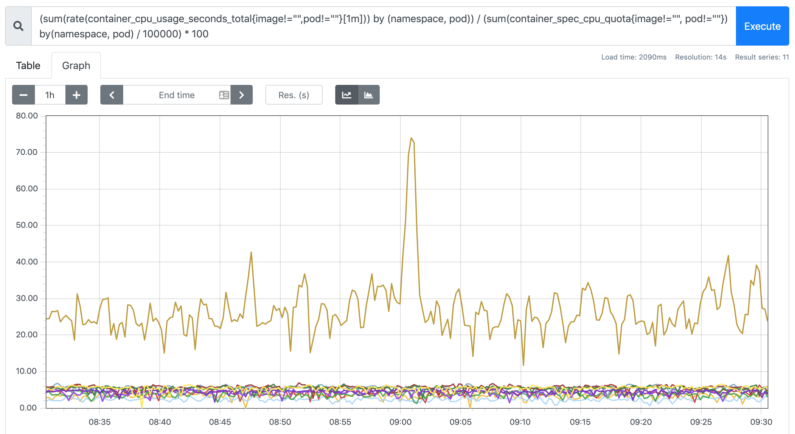


Pod 内存使用率的计算就简单多了，直接用内存实际使用量除以内存限制使用量即可：

```bash
sum(container_memory_rss{image!=""}) by(namespace, pod) / sum(container_spec_memory_limit_bytes{image!=""}) by(namespace, pod) * 100 != +inf
```

在 Prometheus 的 Graph 中执行上述 PromQL 可得类似下面结果：

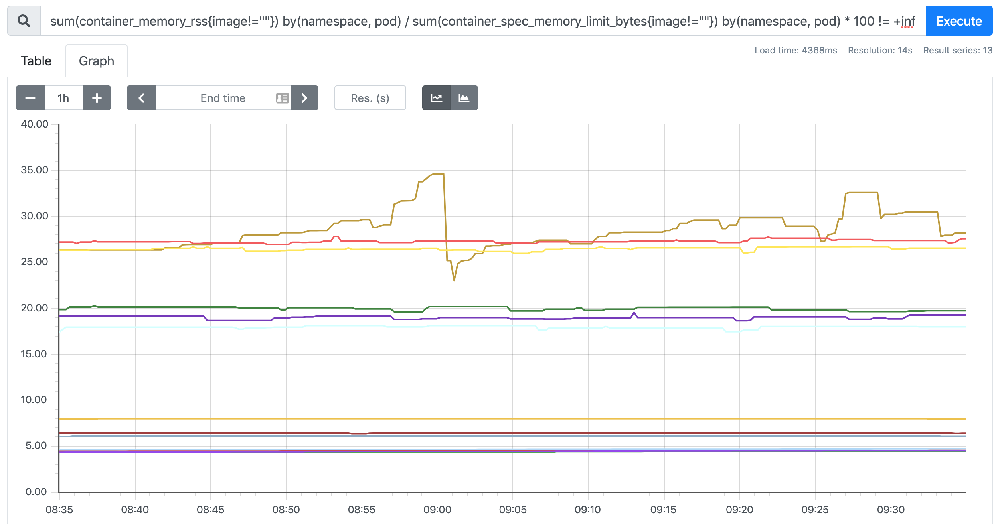

## T4.6、监控 apiserver

API Server 是 Kubernetes 核心组件，需纳入监控。集群内默认会有一个指向 API Server 的 Service `kubernetes`（`default` namespace），例如：

```bash
kubectl get svc kubernetes -n default
# NAME         TYPE        CLUSTER-IP   EXTERNAL-IP   PORT(S)   AGE
# kubernetes   ClusterIP   10.96.0.1    <none>        443/TCP   ...
```

使用 Prometheus 的 **`role: endpoints`** 服务发现时，会拉取到集群内所有 Endpoints；需通过 **relabel `action: keep`** 只保留 `default` namespace、服务名 `kubernetes`、端口名 `https` 的 target，即 API Server。做法与 [Prometheus 官方 Kubernetes 示例](https://github.com/prometheus/prometheus/blob/main/documentation/examples/prometheus-kubernetes.yml) 一致。

在 T4.5 的 `prometheus-config` 的 `scrape_configs` 中**新增** `kubernetes-apiservers` job。下面给出**含 T4.5 全部 job 并新增 kubernetes-apiservers 的完整 ConfigMap**，直接覆盖 apply 后 reload 即可：

```yaml
# prometheus-cm.yaml（T4.5 + T4.6 完整版）
apiVersion: v1
kind: ConfigMap
metadata:
  name: prometheus-config
  namespace: kube-mon
data:
  prometheus.yml: |
    global:
      scrape_interval: 15s
      scrape_timeout: 10s
    rule_files: []
    scrape_configs:
      - job_name: 'prometheus'
        static_configs:
          - targets: ['localhost:9090']
      - job_name: 'coredns'
        static_configs:
          - targets: ['kube-dns.kube-system.svc.cluster.local:9153']
      - job_name: 'redis'
        static_configs:
          - targets: ['redis.kube-mon.svc.cluster.local:9121']
      - job_name: 'kubernetes-nodes'
        kubernetes_sd_configs:
          - role: node
        relabel_configs:
          - source_labels: [__address__]
            regex: '(.*):10250'
            replacement: '${1}:9100'
            target_label: __address__
            action: replace
          - source_labels: [__meta_kubernetes_node_name]
            target_label: instance
            action: replace
          - action: labelmap
            regex: __meta_kubernetes_node_label_(.+)
      - job_name: 'kubernetes-kubelet'
        kubernetes_sd_configs:
          - role: node
        scheme: https
        tls_config:
          ca_file: /var/run/secrets/kubernetes.io/serviceaccount/ca.crt
          insecure_skip_verify: true
        bearer_token_file: /var/run/secrets/kubernetes.io/serviceaccount/token
        relabel_configs:
          - action: labelmap
            regex: __meta_kubernetes_node_label_(.+)
      - job_name: 'kubernetes-cadvisor'
        kubernetes_sd_configs:
          - role: node
        scheme: https
        metrics_path: /metrics/cadvisor
        tls_config:
          ca_file: /var/run/secrets/kubernetes.io/serviceaccount/ca.crt
          insecure_skip_verify: true
        bearer_token_file: /var/run/secrets/kubernetes.io/serviceaccount/token
        relabel_configs:
          - source_labels: [__meta_kubernetes_node_name]
            target_label: instance
            action: replace
          - action: labelmap
            regex: __meta_kubernetes_node_label_(.+)
      # -------- kubernetes-apiservers：仅抓取 default/kubernetes 的 https 端口 --------
      # role: endpoints 会发现所有 Endpoints；keep 只保留 namespace;service_name;port_name 匹配的 target
      - job_name: 'kubernetes-apiservers'
        kubernetes_sd_configs:
          - role: endpoints
        scheme: https
        tls_config:
          ca_file: /var/run/secrets/kubernetes.io/serviceaccount/ca.crt
        bearer_token_file: /var/run/secrets/kubernetes.io/serviceaccount/token
        relabel_configs:
          - source_labels: [__meta_kubernetes_namespace, __meta_kubernetes_service_name, __meta_kubernetes_endpoint_port_name]
            action: keep
            regex: default;kubernetes;https
    alerting:
      alertmanagers: []
    storage:
      tsdb:
        retention:
          time: 24h
```

```bash
kubectl apply -f prometheus-cm.yaml
curl -X POST "http://<节点IP>:31078/-/reload"
```

说明：`__meta_kubernetes_namespace`、`__meta_kubernetes_service_name`、`__meta_kubernetes_endpoint_port_name` 由 Prometheus 在 `role: endpoints` 时自动附加（见 T4.4「元标签从哪里来」及 [kubernetes_sd_config](https://prometheus.io/docs/prometheus/latest/configuration/configuration/#kubernetes_sd_config)）。`action: keep` 表示只保留 `source_labels` 拼接后与 `regex` 匹配的 target；此处即仅保留 `default` namespace、服务名 `kubernetes`、端口名 `https` 的 endpoint（即 API Server），单节点与 HA 均适用。更新后可在 **Status → Targets** 中确认 `kubernetes-apiservers` 下仅有一个实例，在 **Query → Graph** 中可查询如 `apiserver_request_total` 等指标。

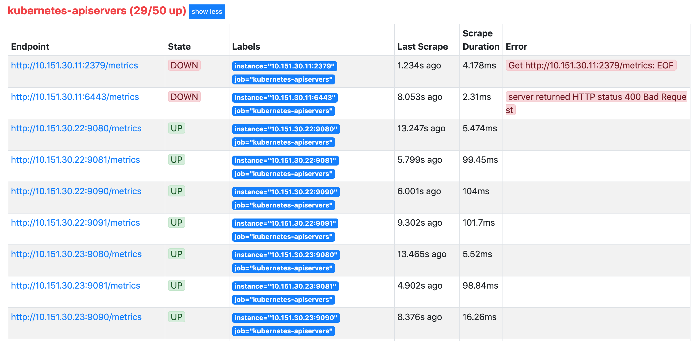

**其他系统组件**：kube-controller-manager、kube-scheduler 等通常不在 default 的 `kubernetes` Service 中暴露，若需监控需在 `kube-system` 下为对应组件单独创建 Service并暴露指标端口（如 kube-scheduler 常见 10251，kube-controller-manager 常见 10252），再通过 endpoints 或静态 job 抓取。

## T4.7、监控 Pod（Endpoints 自动发现）

API Server 的监控本质上是 Endpoints 的一种（default/kubernetes）。本节配置 **`kubernetes-endpoints`** job，用于发现所有带 `prometheus.io/scrape=true` 注解的 Service 背后的 Pod，并按注解设置抓取端口、路径和协议，这样新增带 metrics 的服务只需在 Service 上打注解即可被自动抓取，无需再写静态 job。

**本段用到的 `source_labels` 从哪里来？**

`kubernetes-endpoints` 使用 `role: endpoints`。Prometheus 会为**每个 Service 的每个 Endpoint**（即每个 Pod 的每个端口）生成一个 target，并自动附上该 **Service** 的元数据（见上文 T4.4 说明中的「Kubernetes 服务发现元标签」）。其中：  

- **Service 的 annotations** 会变成 `__meta_kubernetes_service_annotation_<key>`，`<key>` 里的不合法字符（如 `.`、`/`）会变成下划线。例如你在 Service 上写了 `prometheus.io/scrape: "true"`、`prometheus.io/port: "9121"`，对应的元标签就是 `__meta_kubernetes_service_annotation_prometheus_io_scrape`、`__meta_kubernetes_service_annotation_prometheus_io_port`。  
- 因此 relabel 里写 `source_labels: [__meta_kubernetes_service_annotation_prometheus_io_scrape]` 表示「取**标签名**为这个的标签」；Prometheus 会拿该标签的**值**（即注解的值，如 `"true"`）去匹配 `regex: "true"`，`action: keep` 表示只保留**值**匹配的 target（即只保留 `prometheus.io/scrape` 注解为 `true` 的 Service 的 target）。**小结**：`source_labels` 填的是 key，`regex` 匹配的是这些 key 对应的 value（拼接后的字符串）。

完整元标签列表与设计说明见官方 [kubernetes_sd_config - endpoints 与 service 部分](https://prometheus.io/docs/prometheus/latest/configuration/configuration/#kubernetes_sd_config)。

在 T4.6 的 `prometheus-config` 的 `scrape_configs` 中**新增** `kubernetes-endpoints` job；同时**去掉**静态的 `redis` job（redis 改为通过 Endpoints 发现）。下面给出**含 T4.6 全部 job、去掉 redis 静态、并新增 kubernetes-endpoints 的完整 ConfigMap**：

```yaml
# prometheus-cm.yaml（T4.6 + T4.7 完整版，redis 改为 endpoints 发现）
apiVersion: v1
kind: ConfigMap
metadata:
  name: prometheus-config
  namespace: kube-mon
data:
  prometheus.yml: |
    global:
      scrape_interval: 15s
      scrape_timeout: 10s
    rule_files: []
    scrape_configs:
      - job_name: 'prometheus'
        static_configs:
          - targets: ['localhost:9090']
      - job_name: 'coredns'
        static_configs:
          - targets: ['kube-dns.kube-system.svc.cluster.local:9153']
      - job_name: 'kubernetes-nodes'
        kubernetes_sd_configs:
          - role: node
        relabel_configs:
          - source_labels: [__address__]
            regex: '(.*):10250'
            replacement: '${1}:9100'
            target_label: __address__
            action: replace
          - source_labels: [__meta_kubernetes_node_name]
            target_label: instance
            action: replace
          - action: labelmap
            regex: __meta_kubernetes_node_label_(.+)
      - job_name: 'kubernetes-kubelet'
        kubernetes_sd_configs:
          - role: node
        scheme: https
        tls_config:
          ca_file: /var/run/secrets/kubernetes.io/serviceaccount/ca.crt
          insecure_skip_verify: true
        bearer_token_file: /var/run/secrets/kubernetes.io/serviceaccount/token
        relabel_configs:
          - action: labelmap
            regex: __meta_kubernetes_node_label_(.+)
      - job_name: 'kubernetes-cadvisor'
        kubernetes_sd_configs:
          - role: node
        scheme: https
        metrics_path: /metrics/cadvisor
        tls_config:
          ca_file: /var/run/secrets/kubernetes.io/serviceaccount/ca.crt
          insecure_skip_verify: true
        bearer_token_file: /var/run/secrets/kubernetes.io/serviceaccount/token
        relabel_configs:
          - source_labels: [__meta_kubernetes_node_name]
            target_label: instance
            action: replace
          - action: labelmap
            regex: __meta_kubernetes_node_label_(.+)
      - job_name: 'kubernetes-apiservers'
        kubernetes_sd_configs:
          - role: endpoints
        scheme: https
        tls_config:
          ca_file: /var/run/secrets/kubernetes.io/serviceaccount/ca.crt
        bearer_token_file: /var/run/secrets/kubernetes.io/serviceaccount/token
        relabel_configs:
          - source_labels: [__meta_kubernetes_namespace, __meta_kubernetes_service_name, __meta_kubernetes_endpoint_port_name]
            action: keep
            regex: default;kubernetes;https
      # -------- kubernetes-endpoints：仅抓取带 prometheus.io/scrape=true 的 Service 的 Endpoints --------
      - job_name: 'kubernetes-endpoints'
        kubernetes_sd_configs:
          - role: endpoints
        relabel_configs:
          - source_labels: [__meta_kubernetes_service_annotation_prometheus_io_scrape]
            action: keep
            regex: "true"
          - source_labels: [__meta_kubernetes_service_annotation_prometheus_io_scheme]
            action: replace
            target_label: __scheme__
            regex: (https?)
          - source_labels: [__meta_kubernetes_service_annotation_prometheus_io_path]
            action: replace
            target_label: __metrics_path__
            regex: (.+)
          - source_labels: [__address__, __meta_kubernetes_service_annotation_prometheus_io_port]
            action: replace
            target_label: __address__
            regex: ([^:]+)(?::\d+)?;(\d+)
            replacement: $1:$2
          - action: labelmap
            regex: __meta_kubernetes_service_label_(.+)
          - source_labels: [__meta_kubernetes_namespace]
            action: replace
            target_label: kubernetes_namespace
          - source_labels: [__meta_kubernetes_service_name]
            action: replace
            target_label: kubernetes_name
          - source_labels: [__meta_kubernetes_pod_name]
            action: replace
            target_label: kubernetes_pod_name
    alerting:
      alertmanagers: []
    storage:
      tsdb:
        retention:
          time: 24h
```

**步骤一：为 redis Service 添加 Prometheus 注解**（若尚未添加）。metrics 在 redis-exporter 的 9121 端口：

```yaml
# prome-redis.yaml（仅 Service 片段，用于 kubectl apply）
apiVersion: v1
kind: Service
metadata:
  name: redis
  namespace: kube-mon
  annotations:
    prometheus.io/scrape: "true"
    prometheus.io/port: "9121"
spec:
  selector:
    app: redis
  ports:
    - name: redis
      port: 6379
      targetPort: 6379
    - name: prom
      port: 9121
      targetPort: 9121
```

```bash
kubectl apply -f prome-redis.yaml
```

**步骤二：应用 Prometheus 配置并 reload**

```bash
kubectl apply -f prometheus-cm.yaml
curl -X POST "http://<节点IP>:31078/-/reload"
```

说明：仅当 Service 的 annotation `prometheus.io/scrape` 为 `true` 时该 Service 的 Endpoints 会被保留；`prometheus.io/port`、`prometheus.io/path`、`prometheus.io/scheme` 可选，用于覆盖默认端口、路径和协议。CoreDNS 的 kube-dns Service 通常已带 `prometheus.io/scrape=true` 和 `prometheus.io/port=9153`，因此 `kubernetes-endpoints` 下会看到 kube-dns 的实例；为 redis 打上注解后也会自动出现。之后新增带 `/metrics` 的服务只需在对应 Service 上添加相同注解，无需再改 Prometheus ConfigMap。

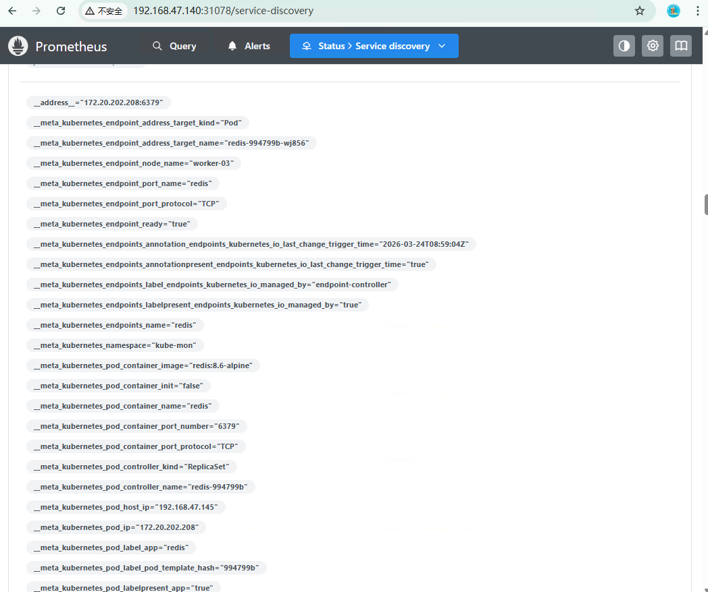

## T4.8、kube-state-metrics

**前面我们监控到的都是「资源用量」和「组件是否活着」，还没有「资源对象的状态」**。

**kube-state-metrics 是一个监听 Kubernetes API、把各类资源对象的「当前状态」转成 Prometheus 指标的组件**，这样你就能在 Prometheus 里查「期望副本数 vs 实际可用数」「Pod 是否 Pending/Failed」「重启次数」等。

| 前面已经有的 | 能回答的问题 | 还缺什么 |
|-------------|--------------|----------|
| **T4.4 节点 / T4.5 容器** | 节点负载、容器 CPU/内存用量 | 不知道「某个 Deployment 期望几副本、实际几副本」 |
| **T4.6 API Server** | API 请求量、延迟 | 不知道「有多少 Pod 处于 Pending/Failed」 |
| **T4.7 Endpoints 发现** | 哪些 Service 暴露了 `/metrics`、自动抓取 | 不知道「Pod 重启了几次」「Job 是否失败」 |

**API Server 和 kubelet 的 `/metrics` 里没有上面「还缺」的这类信息**。这些信息来自 Kubernetes 的**资源对象本身**（Deployment、Pod、Job 等）的**状态字段**。kube-state-metrics 做的事就是：**监听 API Server 里这些对象的变化，把状态转成 Prometheus 指标**（例如 `kube_deployment_status_replicas_available`、`kube_pod_status_phase`），供 Prometheus 抓取。

> 官方说明见 [kube-state-metrics README](https://github.com/kubernetes/kube-state-metrics)：`listens to the Kubernetes API server and generates metrics about the state of the objects`。

---

### T4.8.1、和 metric-server 的区别

集群里可能还会听到 **metrics-server**，两者容易混淆，区别可以理解为：

- **metrics-server**：给 **Kubernetes 自己用**的。采集节点/Pod 的 **CPU、内存用量**，通过 Metrics API 提供给 HPA、调度器等，**不是给 Prometheus 当数据源的**。
- **kube-state-metrics**：给 **Prometheus 用**的。采集 **Deployment/Pod/Job 等对象的状态**（期望副本数、实际副本数、Pod 阶段、重启次数等），以 Prometheus 格式暴露在 `/metrics`，由 Prometheus 抓取。

也就是说：**资源用量**（CPU/内存）→ metrics-server / 我们前面的 node-exporter、cAdvisor；**对象状态**（副本数、Phase、重启次数）→ kube-state-metrics。

---

### T4.8.2、安装

部署 kube-state-metrics 后，**不需要改 Prometheus 的 ConfigMap**：T4.7 已经配置了 `kubernetes-endpoints`，只要给 kube-state-metrics 的 **Service 打上** `prometheus.io/scrape=true` 和 `prometheus.io/port=8080`，Prometheus 就会自动发现并抓取这个新 Service 背后的 Pod（和之前 redis、kube-dns 一样）。

**步骤一：克隆仓库并进入官方示例目录**

```bash
git clone https://github.com/kubernetes/kube-state-metrics.git
cd kube-state-metrics/examples/standard
```

注意与 Kubernetes 版本兼容性，见官方 [Compatibility matrix](https://github.com/kubernetes/kube-state-metrics#compatibility-matrix)；一般用最新 release 即可。

| kube-state-metrics | Kubernetes client-go Version |
| ------------------ | ---------------------------- |
| v2.14.0            | v1.31                        |
| v2.15.0            | v1.32                        |
| v2.16.0            | v1.32                        |
| v2.17.0            | v1.33                        |
| v2.18.0            | v1.34                        |
| main               | v1.35                        |

**步骤二：若无法拉取 gcr.io 镜像，修改 deployment 中的镜像**

打开 `deployment.yaml`，把镜像改为可访问的仓库，例如：

```text
# 将 image 改为类似（具体版本以官方仓库为准）：
image: registry.k8s.io/kube-state-metrics/kube-state-metrics:v2.18.0
# 或第三方镜像，例如：
# image: cnych/kube-state-metrics:v2.0.0-rc.0
```

**步骤三：修改 service.yaml，让 Prometheus 自动发现**

在 **同一目录** 的 `service.yaml` 里，给 Service 的 `metadata.annotations` 增加 Prometheus 抓取注解（端口 8080 是 kube-state-metrics 对外暴露指标用的；8081 是它自己的遥测端口，不必改）：

```yaml
# service.yaml 中 metadata 下增加或保留 annotations：
apiVersion: v1
kind: Service
metadata:
  labels:
    app.kubernetes.io/component: exporter
    app.kubernetes.io/name: kube-state-metrics
    app.kubernetes.io/version: 2.18.0
  annotations:
    prometheus.io/scrape: "true"
    prometheus.io/port: "8080"   # 8080=指标端口；8081=应用自身遥测
  name: kube-state-metrics
  namespace: kube-system
spec:
  clusterIP: None
  ports:
    - name: http-metrics
      port: 8080
      targetPort: http-metrics
    - name: telemetry
      port: 8081
      targetPort: telemetry
  selector:
    app.kubernetes.io/name: kube-state-metrics
```

**步骤四：一键部署**

仍在 `kube-state-metrics/examples/standard` 目录下执行（会创建 ClusterRole、ClusterRoleBinding、Deployment、ServiceAccount、Service）：

```bash
kubectl apply -f .
```

若最后一行出现类似下面的报错，**属于正常现象**，一般**不影响** kube-state-metrics 是否已部署成功（前面 `deployment`、`service`、`clusterrole` 等已为 `created` 即说明核心清单已应用）：

```text
error: resource mapping not found for name: "" namespace: "" from "kustomization.yaml": no matches for kind "Kustomization" in version "kustomize.config.k8s.io/v1beta1"
ensure CRDs are installed first
```

**原因**：官方 `examples/standard` 目录里除各组件清单外，还带有 **`kustomization.yaml`**，是给 **Kustomize** 用的编排文件（需执行 `kubectl apply -k .` 时由 kubectl 内置解释），**不是** 集群里的某种 CRD。执行 `kubectl apply -f .` 时会把目录下所有 yaml 都提交给 API Server，`kustomization.yaml` 无法作为集群资源创建，便会报上述错误。

**可选做法**：

- 继续用 `kubectl apply -f .`：忽略该条错误即可；或用 `kubectl get pods -n kube-system -l app.kubernetes.io/name=kube-state-metrics` 确认 Pod 已就绪。
- 改用 Kustomize：`kubectl apply -k .`（在同一目录下），则不会把 `kustomization.yaml` 误当普通资源 apply。
- 或只应用具体文件（与当前官方仓库一致）：`kubectl apply -f cluster-role.yaml -f cluster-role-binding.yaml -f service-account.yaml -f deployment.yaml -f service.yaml`（**不要**带上 `kustomization.yaml`）。

**步骤五：确认 Prometheus 已抓取**

因为 T4.7 的 `kubernetes-endpoints` 只抓带 `prometheus.io/scrape=true` 的 Service，部署完成后 Prometheus 会自动把 kube-state-metrics 加入抓取目标。在 Prometheus 的 **Status → Service discovery** 里找到 `kubernetes-endpoints`，应能看到 kube-state-metrics 的 endpoint（状态为 UP）。

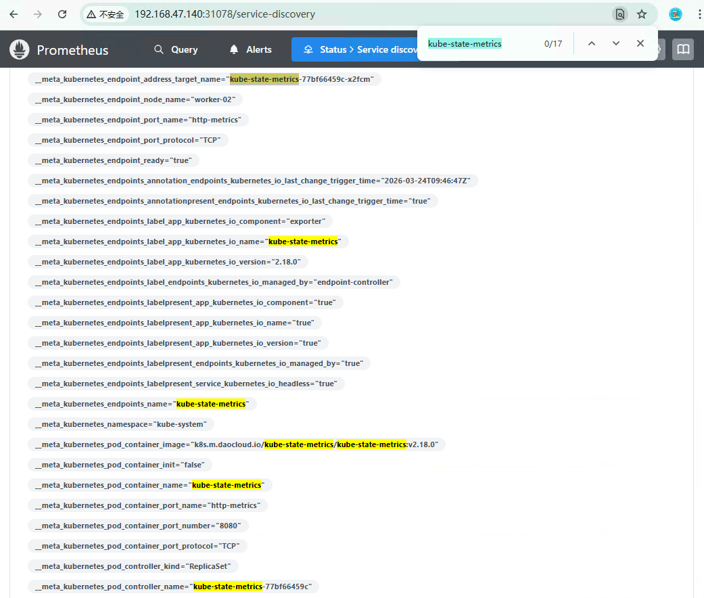

> Grafana 大盘：导入 kube-state-metrics 或 Kubernetes 工作负载类模板前，请先读 T4.9.3「观测分层与本文 job」。默认经 T4.7 的 kubernetes-endpoints 抓取时，序列上的 job 多为 kubernetes-endpoints，模板若写死 kube-state-metrics 容易无数据，需按该节改变量或 PromQL。若已按 T4.8.4 增加独立的 kube-state-metrics job 并启用 honor_labels，则可能与社区模板一致，仍以 Explore 里实际标签为准。

### T4.8.3、水平分片

**什么时候需要看这段**？

集群规模很大（例如节点数 > 500 或对象数 > 10 万）时，单实例 kube-state-metrics 可能吃满内存或延迟变高，这时可以用**水平分片**把对象分摊到多个实例。中小集群用默认单实例即可，不必配置分片。

分片原理：按 Kubernetes 对象的 UID 做 MD5 再对总分片数取模，同一个对象始终由同一个分片负责，这样 Prometheus 抓多个 target 时不会重复或漏掉。官方文档见 [Horizontal sharding](https://github.com/kubernetes/kube-state-metrics#horizontal-sharding)。

**静态分片（推荐）**：在 deployment 的容器参数里加上：

```text
--shard=0           # 当前实例的分片编号（从 0 开始）
--total-shards=3    # 总分片数，所有实例必须一致
```

每个分片一个 Deployment（或同一 Deployment 的多副本各自传不同 `--shard`），分片编号 0 到 total-shards-1 不重复；各分片的 `--resources`、`--namespaces` 等保持一致。生产上常用 3～5 个分片，每实例约 1～2 CPU、1～2 GiB 内存。

**自动分片（实验性）**：用 StatefulSet 部署时，可通过 Downward API 把 Pod 名和 namespace 传给进程，实现「按 Pod 序号自动算分片」。示例见官方 [examples/autosharding](https://github.com/kubernetes/kube-state-metrics/tree/main/examples/autosharding)。官方注明该功能为实验性，可能随时变更或移除，生产环境建议用静态分片。

### T4.8.4、部署后能查什么（应用场景示例）

部署并确认 Prometheus 已抓取 kube-state-metrics 后，在 **Prometheus → Query（Graph）** 里就可以用下面这类 PromQL。指标含义和更多示例见官方 [docs 目录](https://github.com/kubernetes/kube-state-metrics/tree/main/docs)。

**1、工作负载健康度**

```promql
# 有处于失败状态的 Job
kube_job_status_failed{job="kube-state-metrics"} > 0

# 节点 NotReady
kube_node_status_condition{condition="Ready", status="false"} == 1

# Pod 处于非 Running（Pending/Failed/Unknown）
kube_pod_status_phase{phase=~"Failed|Unknown|Pending"} == 1

# 近 30 分钟内容器有重启（用 increase 看计数器增量）
increase(kube_pod_container_status_restarts_total[30m]) > 0
```

> `kube_pod_container_status_restarts_total` 是**计数器**，要用 `increase()` 或 `rate()` 看变化，不要用 `changes()`（那是给 Gauge 用的）。

**2、副本与发布状态**

```promql
# Deployment 期望副本数 - 可用副本数（大于 0 说明有副本未就绪）
kube_deployment_spec_replicas{namespace="default"} - kube_deployment_status_replicas_available{namespace="default"}

# StatefulSet 当前版本与更新版本不一致（可能卡在滚动更新）
kube_statefulset_status_current_revision != kube_statefulset_status_update_revision
```

**3、安全与合规（示例）**

```promql
# 以特权模式运行的容器
kube_pod_container_security_context_privileged == 1

# 未设置 CPU limit 的容器
kube_pod_container_resource_limits_cpu_cores == 0
```

---

**常见问题：为什么查到的标签是 `exported_namespace` 而不是 `namespace`？**

**现象**：在 Prometheus 里用 `namespace="default"` 过滤 kube-state-metrics 的指标没结果，但改成 `exported_namespace="default"` 就有数据。

**原因（用一句话说）**：Prometheus 在抓一个 target 时，会先给指标打上「这个 target 是谁」的标签（例如 job、instance、**namespace**＝kube-state-metrics 所在命名空间，如 `kube-system`）。而 kube-state-metrics 暴露的指标**自己**也带 `namespace`（表示**资源**在哪个命名空间，如 `default`）。两个都叫 `namespace` 就冲突了，Prometheus 会把**指标自带的**那个改名为 `exported_namespace`，所以你会看到 `exported_namespace="default"` 而不是 `namespace="default"`。

**解决办法**：在抓 kube-state-metrics 的 job 里加上 **`honor_labels: true`**，表示「优先保留指标自带的标签，不要用 target 的标签覆盖」。这样指标里会保留 `namespace="default"`（资源所在命名空间），查 PromQL 时继续用 `namespace="xxx"` 即可。

我们当前是通过 T4.7 的 **`kubernetes-endpoints`** 自动发现 kube-state-metrics 的，没有单独为它建一个 job，所以若要启用 `honor_labels`，需要二选一：

- **方式 A**：在 `kubernetes-endpoints` 这个 job 里整体加上 `honor_labels: true`（会影响到该 job 下所有 target，若其他 Service 的指标也有同名标签会被一起保留）。
- **方式 B**：单独为 kube-state-metrics 建一个 job，用 `role: endpoints` + relabel 只保留 Service 名为 kube-state-metrics 的 target，并在该 job 里设置 `honor_labels: true`（只影响 kube-state-metrics，推荐）。

方式 B 的配置示例（加入到你当前 Prometheus 的 `scrape_configs` 里即可）：

```yaml
- job_name: 'kube-state-metrics'
  honor_labels: true
  kubernetes_sd_configs:
    - role: endpoints
  relabel_configs:
    - source_labels: [__meta_kubernetes_service_name]
      regex: kube-state-metrics
      action: keep
```

改完后 reload Prometheus，再查时就会是 `namespace="default"`，不再出现 `exported_namespace`。

---

### T4.8.5、故障排查速查

| 现象         | 建议检查                                               | 常见处理 |
| ------------ | ------------------------------------------------------ | -------- |
| 查不到指标   | Prometheus Targets 里 kube-state-metrics 是否 UP；是否遇到 `exported_namespace` | 确认抓取正常；需要时加 `honor_labels: true` |
| 指标特别多   | 是否暴露了过多 annotations/labels                      | 用 `--metric-labels-allowlist` 等限制 |
| 分片不全     | 多分片时 `--shard` / `--total-shards` 是否一致、是否 0～N-1 连续 | 核对每个实例参数 |
| 指标名对不上 | 版本是否过旧或与 K8s 不兼容                            | 查官方 [docs/metrics](https://github.com/kubernetes/kube-state-metrics/tree/main/docs) 与兼容表 |

**官方链接**：[GitHub kube-state-metrics](https://github.com/kubernetes/kube-state-metrics) | [指标文档 docs](https://github.com/kubernetes/kube-state-metrics/tree/main/docs) | [Kubernetes 官方说明](https://kubernetes.io/docs/concepts/cluster-administration/kube-state-metrics/)

## T4.9、Grafana

[Grafana OSS](https://grafana.com/grafana/) 把前面部署的 Prometheus 等指标源做成大盘和告警界面。本节按官方 [在 Kubernetes 上部署 Grafana](https://grafana.com/docs/grafana/latest/setup-grafana/installation/kubernetes/) 来写：PVC、Deployment、Service。与全文一致：命名空间 `kube-mon`，Prometheus 服务地址 `prometheus:9090`；持久化用 Local PV 加 PVC，与 Prometheus 分开，避免挂错卷。

> **生产落地摘要**（逐项核对）
>
> 镜像：固定标签，禁用 latest，版本与文首「版本与镜像约定」一致，以 [Grafana Releases](https://github.com/grafana/grafana/releases/latest) 为准。 
>
> 凭据：管理员口令放在 Secret 里，生产用强口令并定期轮换。 
>
> 安全：容器非 root 运行（官方镜像常用 UID/GID 472，见 [Configure Docker](https://grafana.com/docs/grafana/latest/setup-grafana/configure-docker/)）；对外优先 Ingress 配 TLS，少长期暴露 NodePort。 
>
> 容量：官方 Kubernetes 安装页中的最低配置约 250m CPU、750Mi 内存；生产按用户和大盘数量提高 limit，并盯 PVC 使用率。 
>
> 入口：云上优先 LoadBalancer 或 Ingress；裸金属内网可像 T4.2.1 一样先用 NodePort 验证。 
>
> 大盘：长期维护建议用 [Provisioning](https://grafana.com/docs/grafana/latest/administration/provisioning/) 把 JSON 放进 Git，少依赖只在网页里改。 
>
> 托管：若要少运维，可看 [Grafana Cloud](https://grafana.com/products/cloud/)。

---

### T4.9.1、清单部署（OSS，Local PV）

**（1）持久化** 

在选定节点创建宿主机目录（示例 `/data/k8s/grafana`），把下面 PV 里 `nodeAffinity` 的节点名改成 `kubectl get nodes` 看到的真实名字，改法与 T4.2.1 里 Prometheus 的 PV 相同。

```yaml
# grafana-pv-pvc.yaml
apiVersion: v1
kind: PersistentVolume
metadata:
  name: grafana-local
  labels:
    app: grafana
spec:
  accessModes:
    - ReadWriteOnce
  capacity:
    storage: 10Gi
  storageClassName: local-storage-grafana
  local:
    path: /data/k8s/grafana
  nodeAffinity:
    required:
      nodeSelectorTerms:
        - matchExpressions:
            - key: kubernetes.io/hostname
              operator: In
              values:
                - node3   # 必改：如 worker-01
  persistentVolumeReclaimPolicy: Retain
---
apiVersion: v1
kind: PersistentVolumeClaim
metadata:
  name: grafana-data
  namespace: kube-mon
spec:
  selector:
    matchLabels:
      app: grafana
  accessModes:
    - ReadWriteOnce
  resources:
    requests:
      storage: 10Gi
  storageClassName: local-storage-grafana
```

**（2）管理员 Secret**

Kubernetes 要求 `Secret.stringData` 里每个值都是字符串（见 [Secret 说明](https://kubernetes.io/docs/concepts/configuration/secret/)）。若 `admin-password` 写成不带引号的纯数字，YAML 会当成数字类型，API 会报错：无法把数字解成 stringData。因此口令一律用英文双引号包起来；口令里若含双引号或反斜杠，可用外层单引号或 YAML 多行块写法。

```yaml
# grafana-secret.yaml
apiVersion: v1
kind: Secret
metadata:
  name: grafana-admin
  namespace: kube-mon
type: Opaque
stringData:
  admin-user: "admin"
  admin-password: "在此处填写强密码"
```

**（3）Deployment**

与官方示例一样设置 `fsGroup: 472`，并加上 `runAsUser`、`runAsGroup` 为 472，以及 initContainer 里对数据目录做 `chown`，避免 Local 卷属主是 root 时 Grafana 写不进 `/var/lib/grafana`。健康检查：官方常用 `/robots.txt`，这里用 `/api/health`，含义更直观，两种都与 [Kubernetes 安装文档](https://grafana.com/docs/grafana/latest/setup-grafana/installation/kubernetes/) 不冲突。

镜像用 OSS 稳定版，与文首版本表一致（示例 `grafana/grafana:12.4.1`）；升级前到 [Grafana Releases](https://github.com/grafana/grafana/releases/latest) 核对 tag。

```yaml
# grafana-deploy.yaml
apiVersion: apps/v1
kind: Deployment
metadata:
  name: grafana
  namespace: kube-mon
  labels:
    app: grafana
spec:
  replicas: 1
  selector:
    matchLabels:
      app: grafana
  template:
    metadata:
      labels:
        app: grafana
    spec:
      securityContext:
        runAsNonRoot: true
        runAsUser: 472
        runAsGroup: 472
        fsGroup: 472
      initContainers:
        - name: fix-grafana-data-perms
          image: busybox:1.37
          command: ["sh", "-c", "chown -R 472:472 /var/lib/grafana || true"]
          volumeMounts:
            - name: data
              mountPath: /var/lib/grafana
      containers:
        - name: grafana
          image: grafana/grafana:12.4.1
          imagePullPolicy: IfNotPresent
          securityContext:
            allowPrivilegeEscalation: false
          ports:
            - containerPort: 3000
              name: http-grafana
          env:
            - name: GF_SECURITY_ADMIN_USER
              valueFrom:
                secretKeyRef:
                  name: grafana-admin
                  key: admin-user
            - name: GF_SECURITY_ADMIN_PASSWORD
              valueFrom:
                secretKeyRef:
                  name: grafana-admin
                  key: admin-password
          readinessProbe:
            httpGet:
              path: /api/health
              port: http-grafana
              scheme: HTTP
            initialDelaySeconds: 15
            periodSeconds: 10
            timeoutSeconds: 5
          livenessProbe:
            httpGet:
              path: /api/health
              port: http-grafana
              scheme: HTTP
            initialDelaySeconds: 60
            periodSeconds: 20
            timeoutSeconds: 5
          resources:
            requests:
              cpu: 250m
              memory: 768Mi
            limits:
              cpu: "2"
              memory: 2Gi
          volumeMounts:
            - mountPath: /var/lib/grafana
              name: data
      volumes:
        - name: data
          persistentVolumeClaim:
            claimName: grafana-data
```

**（4）Service**

与 T4.2.1 一样先用 NodePort，方便裸金属或内网访问；云上可改成 LoadBalancer 或交给 Ingress（官方安装示例里常见 LoadBalancer）。

```yaml
# grafana-svc.yaml
apiVersion: v1
kind: Service
metadata:
  name: grafana
  namespace: kube-mon
  labels:
    app: grafana
spec:
  type: NodePort
  selector:
    app: grafana
  ports:
    - name: http
      port: 3000
      protocol: TCP
      targetPort: http-grafana
```

**（5）应用顺序**

| 顺序 | 命令 |
|------|------|
| 1 | `kubectl apply -f grafana-pv-pvc.yaml` |
| 2 | `kubectl apply -f grafana-secret.yaml` |
| 3 | `kubectl apply -f grafana-deploy.yaml` |
| 4 | `kubectl apply -f grafana-svc.yaml` |

```bash
kubectl wait --for=condition=available deployment/grafana -n kube-mon --timeout=180s
kubectl get pods,svc -n kube-mon -l app=grafana
```

浏览器访问 `http://节点IP:NodePort`，端口号用 `kubectl get svc grafana -n kube-mon` 查看。若在集群内自测，可执行 `kubectl port-forward -n kube-mon svc/grafana 3000:3000`，再打开 `http://127.0.0.1:3000`（port-forward 见官方说明）。

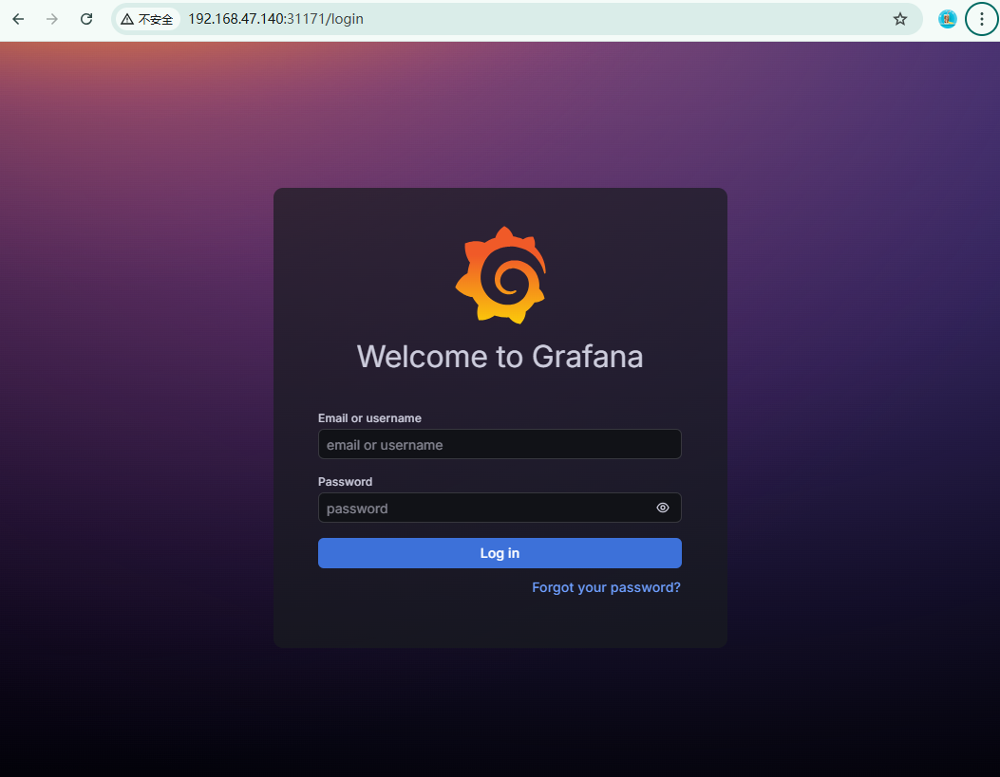

---

### T4.9.2、配置 Prometheus 数据源

步骤与 Grafana 官方 [配置 Prometheus 数据源](https://grafana.com/docs/grafana/latest/datasources/prometheus/configure/) 一致。若生产上对 Prometheus 开了认证或 TLS，请同时阅读 T4.2.1 文末「企业生产补充」一节，避免只改 Grafana 或只改 Prometheus 一侧。

1. 权限：需要组织管理员（或贵司 Grafana 里同等角色）；也可用 [Provisioning](https://grafana.com/docs/grafana/latest/administration/provisioning/) 用 YAML 声明数据源。  
2. 入口：Connections → Add new connection → 搜 Prometheus → Add new data source（菜单随版本可能略有不同，以官方文档为准）。  
3. Connection 里的 Prometheus 地址：与 T4.2.1 同命名空间、且未开 TLS 时，可填 `http://prometheus:9090`，或 `http://prometheus.kube-mon.svc.cluster.local:9090`。若 Prometheus 已启用 TLS，这里要改成 https 和对应端口，并与下面 TLS 设置一致。  
4. Authentication：须与 Prometheus 实际配置一致。Basic authentication 对应 Prometheus 的 web.config 里 basic_auth_users；口令用 Secret 或 secureJsonData，不要写进 Git。Forward OAuth identity 把当前登录用户的 OAuth 令牌转给上游，需上游和身份体系支持。No authentication 仅在 Prometheus 未做认证且网络已隔离时使用，与 T4.2.1 默认清单一致。  
5. TLS settings：自签或内网 CA 时按需上传 CA；双向 TLS 时配置客户端证书与密钥。Skip TLS verify 只建议临时排障，生产不要长期打开。Prometheus 侧如何开 TLS 见 [官方 TLS 指南](https://prometheus.io/docs/guides/tls-encryption/)。  
6. HTTP headers：若前面有反向代理要带头，可在此添加。  
7. 点 Save and test，成功说明地址、认证和 TLS 与当前 Prometheus（或兼容查询接口）匹配。

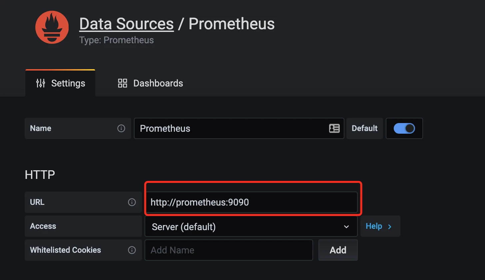

---

### T4.9.3、导入 Dashboard 与大盘维护

前面已用官方稳定栈把采集跑通（Prometheus、node_exporter、kubelet、cAdvisor、apiserver、Endpoints、kube-state-metrics 等）。Grafana 只用 PromQL 展示已有指标，本身不产生新指标。若大盘里的 job、instance 与当前抓取配置不一致，再热门的模板也会整页无数据。下面先说明分层与本文 job 的对应关系，再给出推荐导入顺序和上线自检。

维护大盘时可参考官方：[创建与构建大盘](https://grafana.com/docs/grafana/latest/visualizations/dashboards/build-dashboards/)、[最佳实践](https://grafana.com/docs/grafana/latest/visualizations/dashboards/build-dashboards/best-practices/)、[导入大盘](https://grafana.com/docs/grafana/latest/visualizations/dashboards/build-dashboards/import-dashboards/)、[Provisioning](https://grafana.com/docs/grafana/latest/administration/provisioning/)、[Alerting](https://grafana.com/docs/grafana/latest/alerting/)。若希望规则和大盘与上游生态完全同源，可看 [kubernetes-mixin](https://github.com/kubernetes-monitoring/kubernetes-mixin) 或 [kube-prometheus](https://github.com/prometheus-operator/kube-prometheus)，与本文手写 YAML 路线不同，可作中长期方向。

**观测分层与本文 job（总览）**

请先确认 Prometheus 里 Status → Target health 中，下表相关 job 均为 UP，且 `prometheus-config` 至少包含 T4.7；T4.8 的 kube-state-metrics 经 Endpoints 注解被发现。

| 分层 | 关注点 | 本文 job 标签 | 典型指标（节选） |
|------|--------|---------------|------------------|
| 宿主机 | 节点 CPU、内存、磁盘、网络 | kubernetes-nodes | `node_cpu_seconds_total`、`node_memory_*` 等 |
| 容器 | Pod 资源用量与限额 | kubernetes-cadvisor、kubernetes-kubelet | `container_cpu_usage_seconds_total` 等 |
| 工作负载 | 副本、Pod 状态、重启 | kubernetes-endpoints 下的 kube-state-metrics（见 T4.8） | `kube_deployment_*`、`kube_pod_status_phase` 等 |
| 控制面 | API 请求与延迟 | kubernetes-apiservers | `apiserver_request_*` 等 |
| 平台组件 | CoreDNS、示例 Redis | 静态 coredns job（若仍保留）或 kubernetes-endpoints | `coredns_*`、`redis_*` 等 |
| 监控自身 | 抓取与 TSDB | prometheus | `up`、`scrape_*`、`prometheus_tsdb_*` |

与社区模板的常见差别（不改会无数据）：社区常写 job 为 node-exporter，本文为 kubernetes-nodes；社区常写 cadvisor，本文为 kubernetes-cadvisor。

kube-state-metrics 经 kubernetes-endpoints 抓取时，时间序列上的 job 一般是 kubernetes-endpoints，而不是 kube-state-metrics。社区大盘若在 PromQL 里把 job 固定写成 kube-state-metrics，就筛不到任何序列，图表面板会空白（看不到曲线）。可去掉这条 job 条件、只按 `kube_` 前缀查指标，或把 job 改成 kubernetes-endpoints，再配合 namespace 等标签缩小范围。节点类大盘里 instance 应与 T4.4 一致，一般是节点名。

**推荐导入顺序**

打开 [Grafana 大盘库](https://grafana.com/grafana/dashboards/)，Dashboards → New → Import，数据源选 T4.9.2 配好的 Prometheus。下表 ID 为常用社区模板，导入后请以页面说明为准，并务必按上表改 job 等变量。

| 优先级 | 范围 | 做法 | 导入后核对 |
|--------|------|------|------------|
| 高 | 宿主机 | 搜 Node Exporter Full，常用 [1860](https://grafana.com/grafana/dashboards/1860) | 变量或查询里 job 改为 kubernetes-nodes，instance 用节点名 |
| 高 | 容器与集群 | 搜 Kubernetes cluster monitoring，可试 [7249](https://grafana.com/grafana/dashboards/7249) | cadvisor、kubelet 相关 job 改为 kubernetes-cadvisor、kubernetes-kubelet |
| 高 | 对象状态 | 搜 kube-state-metrics、Kubernetes Views 等 | 去掉 job=kube-state-metrics，或改为 kubernetes-endpoints，以 `kube_*` 能出数为准 |
| 中 | 控制面 | 搜 Kubernetes API Server | job 为 kubernetes-apiservers |
| 中 | DNS | 搜 CoreDNS，如 [14981](https://grafana.com/grafana/dashboards/14981) | 若静态 job 与 Endpoints 重复抓取，注意重复序列 |
| 中 | Prometheus 自身 | 搜 Prometheus Stats，如 [3662](https://grafana.com/grafana/dashboards/3662) | job 为 prometheus |
| 低 | Redis（若做了 T4.3.2） | 搜 Redis Exporter 大盘 | 与 redis 或 kubernetes-endpoints、端口一致 |

**企业侧习惯**

定版：改好 job 后的 JSON 放进 Git，用 Provisioning 下发，少在生产界面手改。 

分文件夹：例如基础设施、K8s 对象与控制面、平台组件、监控自省，配合文件夹权限。 

告警：规则与通知仍以 T4.11 的 Prometheus + Alertmanager 或 Grafana Alerting 为主（见官方 Alerting 文档）；大盘侧重看图和排障。

 升级：升级 node_exporter、KSM、Grafana 后对照各项目发行说明检查指标名；社区大盘停更时可 fork 自维护。

**上线前自检**

在 Explore 或大盘里确认：`up{job="kubernetes-nodes"}` 与节点数一致；cadvisor 的 container 类指标有数据；`kube_*` 有数据；若抓了 apiserver 则 apiserver_request_total 有数据；CoreDNS、Redis 若部署则对应指标可查。若某项没有数据，先回 Prometheus 看 Target，再按本节第一张表改大盘里的 job 和 instance，不要先假定集群坏了。

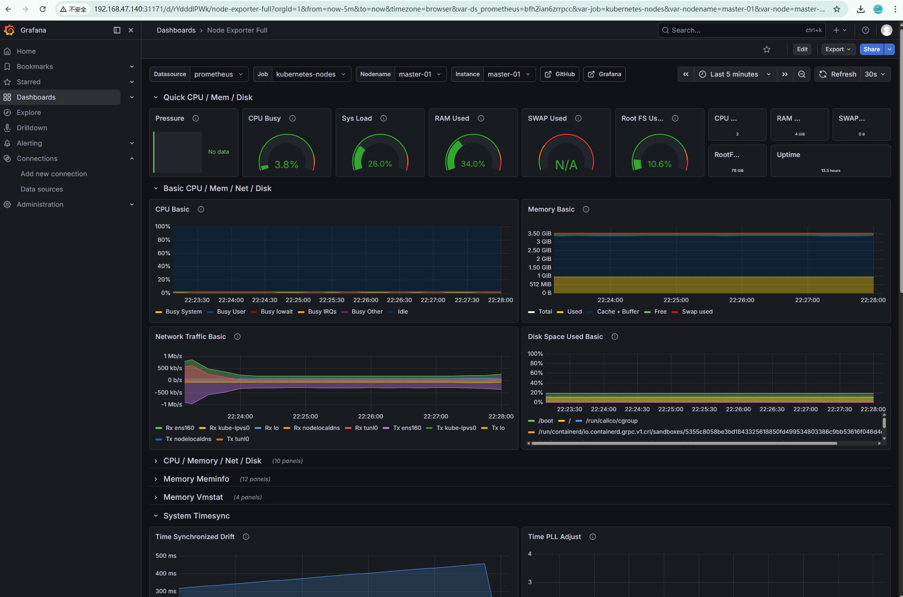

---

### 4.9.4、自建 Panel 与模板变量

在 Grafana 里新建一个面板，用 PromQL 显示 node_exporter 的 CPU 利用率（本文里 job 为 kubernetes-nodes，instance 为节点名），并用下拉框切换节点。

**整体分四步**：进入大盘编辑 → 先不写变量、确认有曲线 → 添加名为 `node` 的变量 → 在查询里写上 `instance="$node"` 再保存。更细的菜单说明见官方 [创建大盘](https://grafana.com/docs/grafana/latest/visualizations/dashboards/build-dashboards/create-dashboard/) 与 [变量](https://grafana.com/docs/grafana/latest/dashboards/variables/)；PromQL 规则见 [Prometheus 查询基础](https://prometheus.io/docs/prometheus/latest/querying/basics/)。

**步骤 1：进入面板编辑**

Explore 只用来试跑查询；要落到大盘上，按下表操作。

| 场景 | 操作 |
|------|------|
| 新建 | 左侧 Dashboards → New → New dashboard → Add visualization（中文版多为「添加可视化」）→ 数据源选 T4.9.2 里配好的 Prometheus |
| 已有大盘 | 打开该大盘 → 右上角 Edit → Add → Visualization → 同一 Prometheus 数据源 |

**步骤 2：先不加变量，确认查询有数据**

> 注意：**若界面里只有 Metric、Label filters，没有大段文本框**：这是 Prometheus 数据源的 **Builder（构建器）** 模式，用来点选指标和标签，不是用来粘贴整段 PromQL 的。请在**该条 Query（如 Query A）的编辑区域**找到 **Builder** 与 **Code** 的切换（多在查询标题行右侧或标签旁；中文版可能写作「代码」）。点 **Code** 后会出现多行文本输入框，再把下面整句贴进去。若找不到切换项，见官方 [Prometheus 查询编辑器](https://grafana.com/docs/grafana/latest/datasources/prometheus/query-editor/) 中 Builder 与 Code 的说明。Explore 里同样可先切到 Code 再试跑。

在面板编辑页 Queries 里（切换到 **Code**）粘贴下面整句，点右上角 Save dashboard 保存，回到大盘看是否出曲线：

```promql
100 * (1 - avg by (instance) (rate(node_cpu_seconds_total{job="kubernetes-nodes", mode="idle"}[5m])))
```

`mode` 必须写成 `mode="idle"`（英文半角双引号）。若你集群里 job 名与本文不同，可先删掉 job 条件只留 `mode="idle"` 试通；与本文一致时应保留 `job="kubernetes-nodes"`。

**步骤 3：添加变量 `node`**

官方顺序与字段说明见：[添加与管理变量](https://grafana.com/docs/grafana/latest/dashboards/variables/add-template-variables/)、[Prometheus 模板变量](https://grafana.com/docs/grafana/latest/datasources/prometheus/template-variables/)（含 Query type 与 API 对应关系）。下面按 **Grafana 12.x 常见布局**（General、Query options、Static options、Selection options 等）与本文环境对齐；若你界面多「Advanced」折叠区，展开后勿改与下表冲突的项。

1. 在该大盘右上角点齿轮 **Dashboard settings** → 左侧 **Variables** → **Add variable**。  
2. 自上而下对照下表填写，填完点 **Apply**（或页面底部 **Update**），再在 **Dashboard settings** 里 **Save dashboard**；回到大盘顶部应出现名为「节点」（或你设的 Label）的下拉框。  
3. **Preview of values**（或「运行查询 / Run query」）应有若干 `instance`（节点名）；若为空，先回 Prometheus Query 查 `node_cpu_seconds_total{job="kubernetes-nodes"}`。

| 界面分组 | 字段 | 本文生产推荐 | 说明 |
|----------|------|----------------|------|
| 顶部 | Variable type（变量类型） | **Query** | 不用 Custom、Constant 等；Query 才能拉 Prometheus。 |
| General | Name | **node** | 必须与步骤 4 里 `$node` 完全一致，区分大小写。 |
| General | Label | **节点**（可改） | 仅大盘顶部展示名。 |
| General | Description | 可填：node_exporter 节点 instance，job 为 kubernetes-nodes | 生产建议写清用途，便于交接与审计；可不填。 |
| General | Display / Show on dashboard | 与团队习惯一致 | 常见为列表或「Label 与值」；保持默认亦可。 |
| Query options | Data source | **T4.9.2 配置的 Prometheus** | 勿选错成其它数据源。 |
| Query options | Query type | 见下「Query type 两种填法」 | 须与本文 job、metric、标签一致；选错则无预览值。 |
| Query options | Regex | **留空** | 生产勿随意写正则；除非有统一命名再过滤。 |
| Query options | Apply regex to | 默认即可 | 仅在使用 Regex 时有意义。 |
| Query options | Sort | **Alphabetical asc** 或默认 | 便于找节点；按团队习惯。 |
| Static options | Use static options（使用静态选项） | **关闭** | 本文用动态查询，不要改用手写静态列表。 |
| Selection options | Multi-value | **关闭** | 与步骤 4 的 `instance="$node"` 等号匹配一致；打开后易被迫改用 `=~`，与本文生产方案冲突。 |
| Selection options | Include All option | **关闭** | 避免「全部」占位符与 RE2 问题；需要看全节点时用 T4.9.3 大盘或临时去掉变量条件。 |
| Selection options | Allow custom values（允许用户向列表添加自定义值） | **关闭** | 官方说明为「允许用户把自定义值加进列表」。生产建议**关闭**，只选查询预览里存在的 `instance`，避免手填不存在的节点名导致整图无数据或误查；临时排障若需手填再单独开。 |
| Selection options | Custom all value 等 | **勿填**（Include All 关闭时通常无此项） | 禁止填两个星号等非法正则占位。 |

**Query type 两种填法（选一种即可，以预览出节点名为准）**

1. **Label values**（推荐，与 [官方说明](https://grafana.com/docs/grafana/latest/datasources/prometheus/template-variables/) 一致）：Query type 选 **Label values**；**Label** 填 **instance**；**Metric** 选 `node_cpu_seconds_total`，并在同一区域的**标签筛选**里加上 `job` = `kubernetes-nodes`、`mode` = `idle`。若你界面允许把 Metric 写成一整段选择器，也可试 `node_cpu_seconds_total{job="kubernetes-nodes", mode="idle"}`。  
2. **Classic query**：若下拉中有 **Classic query**（文档标注为 deprecated，仍可用），在出现的文本框中只填：`label_values(node_cpu_seconds_total{job="kubernetes-nodes", mode="idle"}, instance)`，不要再套其它选项。

**步骤 4：把查询改成使用变量，再保存**

1. 打开上一步同一个面板的编辑页（Edit panel），确认查询仍为 **Code** 模式。
2. 把 Queries 里的 PromQL **整句替换**为下面这一条。注意：这里是 **`instance="$node"`**（等号），**不要**写成 `instance=~"$node"`（波浪线表示正则，容易和多选、「全部」一起触发难查的报错）。
3. Save dashboard。用大盘左上角下拉框换节点，曲线应随所选 instance 变化。

```promql
100 * (1 - avg by (instance) (rate(node_cpu_seconds_total{job="kubernetes-nodes", mode="idle", instance="$node"}[5m])))
```

多节点对比需要多个图时，可复制本面板或再建查询，**不要**为此打开 Multi-value 或 Include All；也可直接用 T4.9.3 导入的社区大盘。

**为何禁止多选和 Include All（读懂即可）**

多选或「全部」时，Grafana 往往把 `$node` 展开成带 `|` 的正则串，查询里就要用 `=~`，一旦再配错「全部」占位符，容易撞上 Prometheus 用的 RE2 正则限制。本文只教**单选 + 等号**，步骤最少、最不容易错。

**与本文的对应关系**

job 在 T4.4 中为 kubernetes-nodes；instance 一般为节点名（如 worker-01）。社区模板常写 node-exporter，直接套用会无数据，需在面板里改 job，或按 T4.9.3 的表格处理。

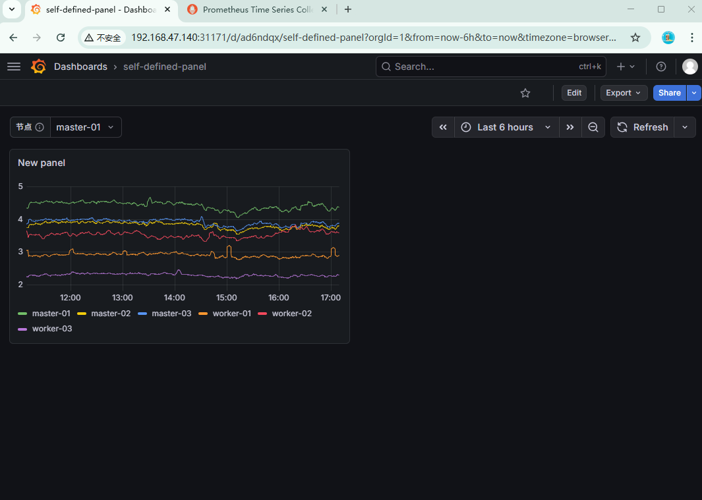

---

### 4.9.5、Helm 部署 Grafana

本节面向**已用 Helm 管理应用发布**的集群，做法对齐 Grafana 官方 [使用 Helm 部署](https://grafana.com/docs/grafana/latest/setup-grafana/installation/helm/)、Helm 官方 [安装与升级说明](https://helm.sh/docs/intro/install/)，以及社区 chart [grafana-community/helm-charts](https://github.com/grafana-community/helm-charts) 中 `charts/grafana` 的 README 与默认 `values.yaml`。chart 由社区维护，**选定 chart 版本后请先读完该版本的 README**，再合上本文的镜像与命名空间约定。

**与全文保持一致（避免双实例、版本漂移）**

- **命名空间**：全文默认使用 `kube-mon`，下文命令与示例 values 都按此书写。**如果你必须改用别的命名空间**（例如公司有统一前缀），请做三件事：把下面所有命令里的 `kube-mon` 全部换成你的名字；在 Grafana 里配置 Prometheus 时，把地址改成 `http://prometheus.<你的命名空间>.svc.cluster.local:9090`（与 T4.9.2 同理）；确认 Prometheus 的 Service 真在该命名空间。  
- **Grafana 镜像**：与文首「版本与镜像约定」一致，示例 tag 为 `12.4.1`；升级前到 [Grafana Releases](https://github.com/grafana/grafana/releases/latest) 重新核对稳定版，**values 里写死 tag**，不要依赖未经确认的默认浮动版本。  
- **管理员 Secret**：与 T4.9.1 相同，`admin-user`、`admin-password` 的值必须是字符串（纯数字口令要用引号），见 T4.9.1。  
- **Prometheus**：若只装本 chart、不装整套监控栈，集群里须已有 T4.2.1 的 Prometheus，否则 Grafana 没有数据源；数据源 URL 与 T4.9.2 一致。  
- **与 T4.9.1 二选一**：同一命名空间里不要既有清单部署的 Grafana，又 Helm 再装一套。改走 Helm 前，请先删掉清单里的 Grafana Deployment、Service 等资源，或整体换命名空间并同步改 Prometheus 访问方式。  
- **kube-prometheus-stack**：若选用 Prometheus Operator 整套 chart，一般自带 Prometheus 和 Grafana，**不要再**套用 T4.2.1 与 T4.9.1 的手工清单，避免双实例；该路线见后文 T4.14，以所选 chart 官方文档为准。

**安全、稳定、可靠（生产建议，与官方 chart 能力对齐）**

- **安全**：镜像与 chart 版本写入 Git 变更记录；管理员口令只放 Secret，**不要**把 `adminPassword` 明文写进长期保存的 values 仓库；对浏览器暴露走 **Ingress + TLS**（由集群签发或 cert-manager 等）；Grafana 官方镜像以非 root 用户运行，community chart 默认带有 `runAsUser: 472` 与容器安全上下文，**升级 chart 后复查这些默认值是否仍符合你们基线**。若集群推行零信任网络，可按 chart 说明启用 **NetworkPolicy**，并务必放行到 **Prometheus**、**DNS** 的出站，否则数据源与健康检查会失败。  
- **稳定**：开启持久化 PVC，选对 `storageClassName`，避免 Pod 重建后配置丢失；为容器配置合适的请求与上限（至少不低于 T4.9.1），减轻节点挤压与 OOM；社区 chart 已带存活与就绪探针，一般保持默认即可。单副本时，尽量在计划窗口内做版本升级。  
- **可靠**：`helm install` / `helm upgrade` 使用 `--version` 锁定 chart，并用 `--wait` 与合理 `timeout`（官方常用做法，见 Helm 文档），必要时对生产升级加 `--atomic` 以便失败时自动回滚；了解 **PVC 在 uninstall 后是否保留**（常见为保留），制定备份与清理策略；重要大盘与数据源用 [Provisioning](https://grafana.com/docs/grafana/latest/administration/provisioning/) 进 Git，避免唯一副本丢数据后无从恢复。

**命令示例（注释逐项说明；chart 版本号须替换为你们在变更单里锁定的那一串）**

```bash
# 1）添加官方安装文档使用的社区仓库
helm repo add grafana-community https://grafana-community.github.io/helm-charts
helm repo update

# 2）列出 chart 版本，挑一版与你们验证过的 Grafana 应用版本匹配，写入变更记录；可用下列命令导出新版本默认值作 diff
# helm show values grafana-community/grafana --version "<chart 版本>" > chart-defaults.yaml
helm search repo grafana-community/grafana --versions | head -20

# 3）命名空间：与全文一致为 kube-mon；若你用其它名字，这里和下两行一并替换
kubectl create namespace kube-mon 2>/dev/null || true

# 4）管理员 Secret：与 T4.9.1 同结构的 YAML，勿把仓库里的明文密码提交到 Git
kubectl apply -f grafana-secret.yaml

# 5）安装：--version 必写；--wait 等待就绪，超时调大；生产升级可再加 --atomic
helm install grafana grafana-community/grafana \
  --namespace kube-mon \
  --version "<填写 helm search 选中的 chart 版本号>" \
  -f grafana-helm-values.yaml \
  --wait --timeout 15m

helm status grafana -n kube-mon
kubectl get pods,svc,ingress -n kube-mon -l app.kubernetes.io/name=grafana
```

**values 示例（文件名自定；YAML 内注释便于评审与交接，键名以当时 chart 的 values 为准）**

```yaml
# grafana-helm-values.yaml — 生产向示例，安装前用 `helm show values grafana-community/grafana --version <同安装版本>` 核对字段是否变化

# 单副本可满足多数 OSS 场景；要高可用需额外架构（多副本、共享存储、Grafana Enterprise 等），超出本文范围
replicas: 1

# 镜像：与文首「版本与镜像约定」一致；pullPolicy 若生产要求可改为 Always 并配合固定 digest（由贵司镜像规范决定）
image:
  registry: docker.io
  repository: grafana/grafana
  tag: "12.4.1"
  pullPolicy: IfNotPresent

# Pod 安全上下文：community chart 默认与官方 Grafana 镜像非 root（472）一致；显式写出便于安全审计，若与 chart 新版本默认值冲突以 chart 为准
securityContext:
  runAsNonRoot: true
  runAsUser: 472
  runAsGroup: 472
  fsGroup: 472

containerSecurityContext:
  allowPrivilegeEscalation: false
  privileged: false
  capabilities:
    drop:
      - ALL
  seccompProfile:
    type: RuntimeDefault

# 数据盘：生产必须持久化，否则重启丢大盘与数据源配置
persistence:
  enabled: true
  type: pvc
  size: 10Gi
  # 填空字符串常表示用集群默认 StorageClass；显式写名更清晰，例如 local-storage-grafana
  storageClassName: ""

# 管理员：口令来自 Secret，勿在此写 adminPassword
adminUser: admin
admin:
  existingSecret: grafana-admin
  userKey: admin-user
  passwordKey: admin-password

# 资源：底线参考 T4.9.1；用户与大盘多时要加压测后再调
resources:
  requests:
    cpu: 250m
    memory: 768Mi
  limits:
    cpu: "2"
    memory: 2Gi

# 对外访问的根 URL，须与 Ingress 实际对外地址一致，否则登录重定向、邮件链接易错
env:
  GF_SERVER_ROOT_URL: "https://grafana.example.com"

# 入口：生产优先 TLS；tls.secretName 需事先创建或由 Ingress 控制器托管证书
ingress:
  enabled: true
  ingressClassName: nginx
  hosts:
    - grafana.example.com
  tls:
    - secretName: grafana-tls
      hosts:
        - grafana.example.com

# 可选：零信任网络时再启用，并务必按 chart 文档配置 egress，放行 Prometheus（如 kube-mon:9090）与 DNS
# networkPolicy:
#   enabled: true
#   allowExternal: false
#   # 须结合 explicitNamespacesSelector、explicitIpBlocks、egress 等逐项放行，见 chart values 英文注释

# 可选：缓解节点维护时的驱逐（单副本时效果有限，视集群策略而定）
# podDisruptionBudget:
#   minAvailable: 1
```

**部署完成后**

在 **Connections** 中按 **T4.9.2** 添加 Prometheus；大盘与变量按 **T4.9.3、T4.9.4**；抓取端 job 仍须与 **T4.4～T4.8** 一致。日后配置以 Provisioning 落 Git 为佳，与 T4.9.3「企业侧习惯」一致。

**升级与卸载**

- 升级：`helm upgrade grafana grafana-community/grafana --namespace kube-mon --version "<新版本>" -f grafana-helm-values.yaml --wait --timeout 15m`，生产建议先在预发集群跑通；需要失败自动回滚时可加 `--atomic`（见 Helm 文档）。  
- 卸载：`helm uninstall grafana -n kube-mon`。**PVC 是否随 chart 删除因版本与参数而异**，卸载前查阅当前 chart 说明并做好数据备份。

## T4.10、PromQL

Prometheus 用指标名和一组标签确定一条时间序列；同名指标下标签不同即为不同序列。术语与语义以官方 [PromQL 基础](https://prometheus.io/docs/prometheus/latest/querying/basics/)、[数据模型](https://prometheus.io/docs/concepts/data_model/)、[指标类型](https://prometheus.io/docs/concepts/metric_types/) 为准。部署版本请以 [Prometheus 发行页](https://github.com/prometheus/prometheus/releases/latest) 上标记为 Latest 的发行线为准（编写本文时为 3.10.x），升级前请再次打开该页核对 Tag 与发行说明，并与前文抓取配置一并回归验证。下文示例中的 `job` 与 `instance` 与 **T4.4** 一致时可写作 `job="kubernetes-nodes"` 与节点名（如 `worker-01`），便于在 Grafana Explore 或 Prometheus 自带查询页面对照练习。

### 4.10.1、时间序列

node_exporter 暴露的文本里，非注释行即样本，例如：

```text
# HELP node_cpu_seconds_total Seconds the cpus spent in each mode.
# TYPE node_cpu_seconds_total counter
node_cpu_seconds_total{cpu="0",mode="idle"} 6.62885731e+06
# HELP node_load1 1m load average.
# TYPE node_load1 gauge
node_load1 2.29
```

行首带 `#` 的是说明；其余行里，指标名加大括号内的标签和最后的数值构成一个样本。

样本按时间追加形成时间序列；多条序列可理解为沿同一时间轴并行演进，每条由指标名与唯一标签集标识。样本持久化在本地 TSDB（含 WAL 与块存储），查询在 TSDB 上完成，而不是仅在内存里临时存放。

一个样本包含三部分：指标与标签、时间戳、float64 数值。下面只是概念示意（不是 `/metrics` 里的原文格式）：

```text
http_request_total{status="200",method="GET"} @1434417560938 => 94355
```

序列的一般写法为 `指标名{标签名="值", 其他标签...}`。指标名与标签名的命名规则以官方 [数据模型](https://prometheus.io/docs/concepts/data_model/) 为准。

PromQL 求值结果可分为瞬时向量、区间向量、标量、字符串四类，定义见官方 [Basics](https://prometheus.io/docs/prometheus/latest/querying/basics/)。

抓取由 [配置](https://prometheus.io/docs/prometheus/latest/configuration/configuration/) 里全局或各 `scrape_config` 的 `scrape_interval` 决定；主配置在本文 ConfigMap 中常为 `prometheus.yml`。每次抓取成功会为各序列追加新时间戳的样本，间隔以你当前配置为准。

### 4.10.2、指标类型

同类样本在存储层格式一致，语义上仍分四种：Counter、Gauge、Histogram、Summary，见 [指标类型](https://prometheus.io/docs/concepts/metric_types/)。`node_load1` 随负载升降，多为 Gauge；`node_cpu_seconds_total` 大体单调递增（进程重启等会复位），为 Counter。exposition 里的 `# TYPE` 可辅助判断。

```text
# HELP node_cpu_seconds_total Seconds the cpus spent in each mode.
# TYPE node_cpu_seconds_total counter
node_cpu_seconds_total{cpu="0",mode="idle"} 362812.7890625
```

#### 4.10.2.1、Counter

Counter 只增不减（计数器复位除外）。看「每秒变化」应对区间向量使用 `rate` 或 `increase`，见 [Counter](https://prometheus.io/docs/concepts/metric_types/#counter) 与下文 4.10.3.2。

```promql
rate(http_requests_total[5m])
```

对 Counter 直接 `topk` 往往按累计值排序，只宜粗看。告警与容量分析建议先对区间向量做 `rate` 或 `increase` 再聚合，例如：

```promql
topk(10, rate(http_requests_total[5m]))
```

#### 4.10.2.2、Gauge

Gauge 可升可降，反映当前量，如 `node_memory_MemAvailable_bytes`。可用 `delta`、`predict_linear` 等，函数语义见 [Functions](https://prometheus.io/docs/prometheus/latest/querying/functions/)。

```promql
node_memory_MemAvailable_bytes{job="kubernetes-nodes", instance="worker-01"}
delta(node_load1{job="kubernetes-nodes", instance="worker-01"}[2h])
predict_linear(node_filesystem_free_bytes{job="kubernetes-nodes", instance="worker-01"}[1h], 4 * 3600)
```

#### 4.10.2.3、Histogram 与 Summary

二者用于分位数与分布，避免只看平均值而掩盖长尾延迟。Summary 在客户端算好分位数；Histogram 暴露 `_bucket{le="..."}` 以及 `_sum`、`_count`，查询端常用 `histogram_quantile`，细则见官方函数与指标类型说明。

若组件采用原生直方图（native histogram），标签与 PromQL 与经典 Histogram 不同，见 [Native histograms](https://prometheus.io/docs/concepts/native_histograms/) 与所用版本的发行说明；生产以实际 `/metrics` 输出为准。

以下为 Prometheus 自身 `/metrics` 的示意片段（数值随运行变化）：Summary 带 `quantile`；Histogram 带 `le` 的 `bucket`。

```text
# TYPE prometheus_tsdb_wal_fsync_duration_seconds summary
prometheus_tsdb_wal_fsync_duration_seconds{quantile="0.5"} 0.012352463
prometheus_tsdb_wal_fsync_duration_seconds_sum 2.888716127000002
prometheus_tsdb_wal_fsync_duration_seconds_count 216
# TYPE prometheus_tsdb_compaction_chunk_range_seconds histogram
prometheus_tsdb_compaction_chunk_range_seconds_bucket{le="+Inf"} 2.5687896e+07
prometheus_tsdb_compaction_chunk_range_seconds_sum 4.7728699529576e+13
prometheus_tsdb_compaction_chunk_range_seconds_count 2.5687896e+07
```

Histogram 与 Summary 都有 `_count` 与 `_sum`；Histogram 还通过各 `le` 桶反映落在各区间的观测数。

### 4.10.3、查询

查询多以指标名开头，再用大括号筛选标签，见 [Basics](https://prometheus.io/docs/prometheus/latest/querying/basics/)。

#### 4.10.3.1、查询结构

单独写 `node_cpu_seconds_total` 会拉出所有节点、所有模式，序列很多，在 Grafana 全屏渲染可能很卡。应先加标签缩小范围。与本文 node 抓取一致时可写 `job="kubernetes-nodes"`（见 **T4.4**），`instance` 为节点名（如 `worker-01`）。

标签匹配：`=`、`!=`、`=~`、`!~`；正则引擎为 [RE2](https://github.com/google/re2/wiki/Syntax)。`{}` 内多个条件逗号分隔，语义为与（AND）。

```promql
node_cpu_seconds_total{job="kubernetes-nodes", instance="worker-01"}
node_cpu_seconds_total{job="kubernetes-nodes", instance=~"worker-.*", mode="idle"}
```

#### 4.10.3.2、范围选择器

在瞬时向量选择器后追加官方文档中的 [区间向量选择器](https://prometheus.io/docs/prometheus/latest/querying/basics/#range-vector-selectors)（语法为 `[时长]`），得到区间向量：每条序列在窗口内保留多个按时间排序的样本点。时长单位含 `s`、`m`、`h`、`d`、`w`、`y`，详见官方 Basics。

```promql
node_cpu_seconds_total{job="kubernetes-nodes", instance="worker-01", mode="idle"}[1m]
```

若抓取间隔为 15 秒，1 分钟内每条序列通常约有四个样点，具体以集群配置为准。在 Table 视图可看到区间内多个带 `@` 时间戳的值。

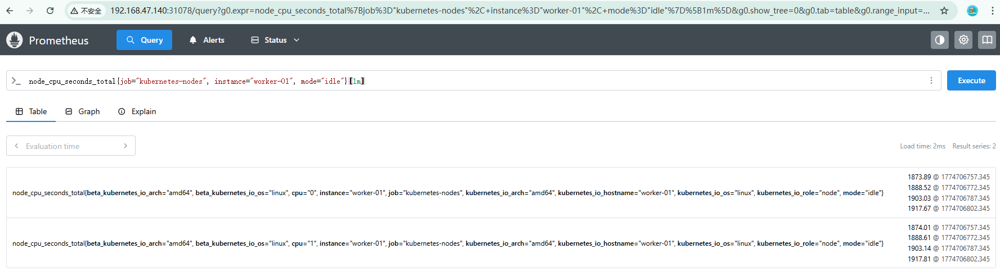

Graph 面板只接受标量或瞬时向量；对「裸区间向量」在同一时刻仍含多点，直接绘图会报错。

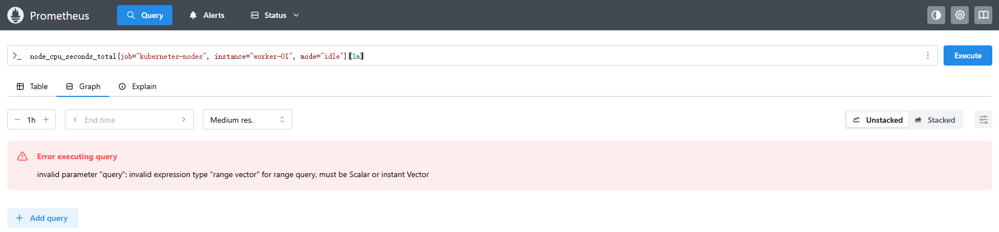

对 Counter 的区间向量应使用 `rate`、`increase` 等（其它类型选对应函数），先得到瞬时向量再画图或写告警。函数定义见官方 [Functions](https://prometheus.io/docs/prometheus/latest/querying/functions/)。告警与 SLO 规则里，Counter 的增长率优先用 `rate`，慎用 `irate`；`increase` 多用于看图或粗估区间总增量。区间长度建议明显大于抓取间隔（常见做法是至少取约 2 倍 `scrape_interval`，以便有足够样点；细则以官方说明为准）。

| 函数 | 作用（扼要） | 常见用途 | 注意 |
| ---- | ------------ | -------- | ---- |
| `rate(v[d])` | 估计窗口内平均每秒增长，处理计数器复位 | Counter 趋势、告警 | 窗口应大于抓取间隔，常为 `scrape_interval` 数倍；结果可为非整数 |
| `irate(v[d])` | 仅用窗口内最后两点估瞬时每秒增长 | 极短期波动展示 | 噪声大，不宜单独用于告警 |
| `increase(v[d])` | 估计窗口内总增量 | 区间「大约多了多少」 | 与 `rate` 的关系与边界行为见官方说明 |

```promql
rate(node_cpu_seconds_total{job="kubernetes-nodes", instance="worker-01", mode="idle"}[5m])
irate(node_cpu_seconds_total{job="kubernetes-nodes", instance="worker-01", mode="idle"}[1m])
increase(node_cpu_seconds_total{job="kubernetes-nodes", instance="worker-01", mode="idle"}[10m])
```

窗口 `[d]` 越短曲线起伏越大，越长越平滑。生产上可在固定抓取间隔后，在 Grafana 中对同一 `rate(...)` 尝试不同窗口（如 5 分钟与 30 分钟），或把短窗与长窗放在同一面板对比，再结合大盘时间跨度选用。

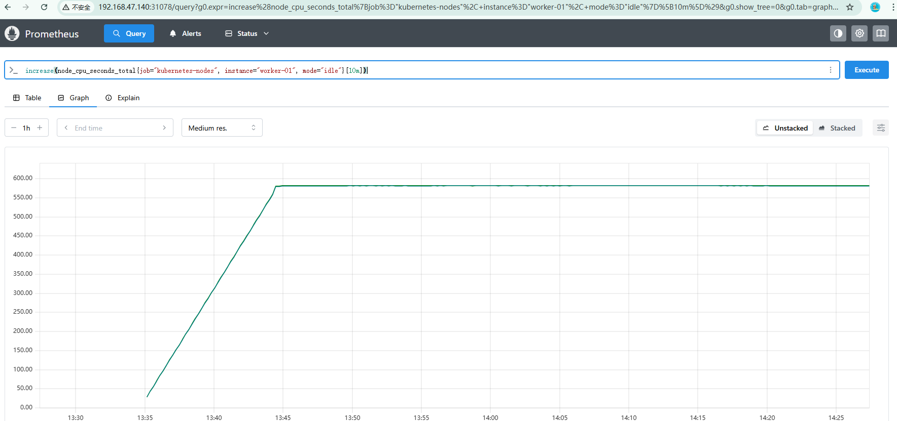

`offset` 把选中的时间整体向过去平移。**瞬时向量**的写法是把 `offset` 紧接在标签选择器后面（大括号之后）。下式是约 30 分钟前那一刻的 idle 累计秒数，仍是 Counter 瞬时值，不是每秒变化率。

```promql
node_cpu_seconds_total{job="kubernetes-nodes", instance="worker-01", mode="idle"} offset 30m
```

**区间向量**必须把 `offset` 写在 **`[时长]` 之后**，再交给 `rate` 等函数，官方示例形如 `rate(http_requests_total[5m] offset 1w)`。下面用较短偏移便于在练习环境里仍能查到数据（若仍为空，多半是评估时刻往前移之后，该 5 分钟窗口内样本不足或当时尚无抓取，可改短 `offset` 或把 Grafana 时间范围拉长）：

```promql
rate(node_cpu_seconds_total{job="kubernetes-nodes", instance="worker-01", mode="idle"}[5m] offset 15m)
```

需要对比「整点前一小时」时再把 `offset` 改成 `1h` 等即可；`offset 1h` 语法正确，但在**新起的 Prometheus**或**保留时间不足**时，一小时前可能没有序列或窗口内点数不够算 `rate`，就会表现为无数据，并非表达式写错。

标签与时长请按集群实际情况改写。

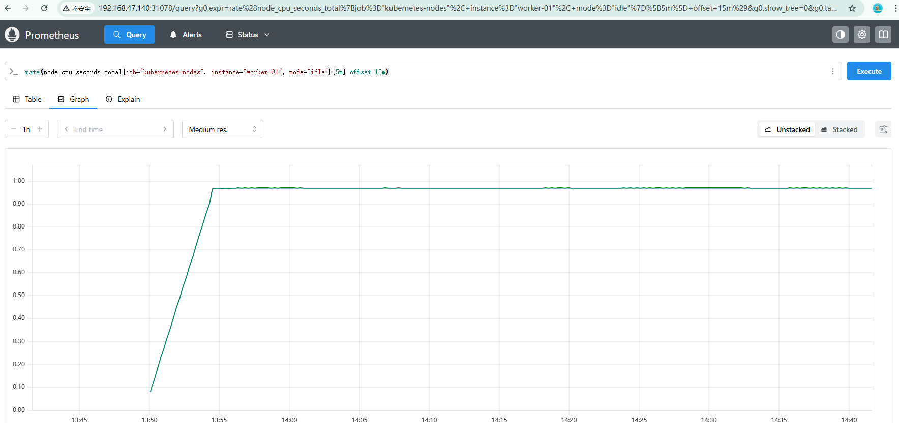

#### 4.10.3.3、关联查询

Prometheus 没有 SQL 式的 JOIN，但可用 [运算符](https://prometheus.io/docs/prometheus/latest/querying/operators/) 对向量与标量做算术、比较和向量间逻辑运算。

两路瞬时向量做二元运算时，默认按完整标签集一对一匹配（指标名可不同，细则见官方 [向量匹配](https://prometheus.io/docs/prometheus/latest/querying/operators/#vector-matching)）。左侧每条序列须在右侧找到恰好一条标签完全相同的序列，否则该点无结果。

例如（与本文节点名一致）：

```promql
node_cpu_seconds_total{job="kubernetes-nodes", instance="worker-01", cpu="0", mode="idle"}
node_cpu_seconds_total{job="kubernetes-nodes", instance="worker-02", cpu="0", mode="idle"}
```

直接相加：

```promql
node_cpu_seconds_total{job="kubernetes-nodes", instance="worker-01", cpu="0", mode="idle"}
+
node_cpu_seconds_total{job="kubernetes-nodes", instance="worker-02", cpu="0", mode="idle"}
```

因 `instance` 不同，默认无法配对，结果为空。

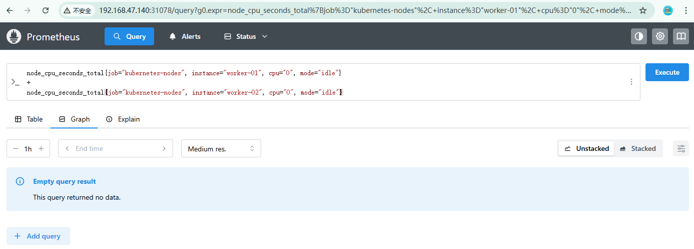

可用 `on` 或 `ignoring` 声明仅用部分标签对齐。`node_cpu_seconds_total` 按 **CPU 核心**分多条序列（`cpu="0"`、`cpu="1"` 等），同一 `instance`、同一 `mode="idle"` 仍会对应多条时间序列。若只写 `on(mode)`，左右任一侧都会在匹配组 `{mode="idle"}` 下出现多条序列，Prometheus 会报错（duplicate series / many-to-many matching not allowed）。教学上应同时限定 **同一颗 CPU**，并用 `on` 列出足以区分序列的标签，例如 `mode` 与 `cpu`：

```promql
node_cpu_seconds_total{job="kubernetes-nodes", instance="worker-01", mode="idle", cpu="0"}
+ on(mode, cpu)
node_cpu_seconds_total{job="kubernetes-nodes", instance="worker-02", mode="idle", cpu="0"}
```

结果侧只保留 `on` 中声明的标签（本例为 `mode` 与 `cpu`），`instance` 等其余标签会丢弃。若要把多核、多节点合成一条曲线，应用 `sum` 等聚合，而不是强行用过粗的 `on(...)`。

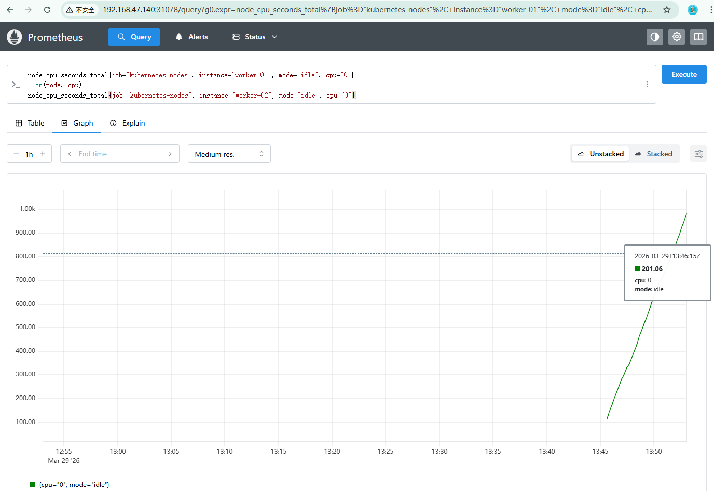

多数「多序列合成」场景更稳妥的是 [聚合](https://prometheus.io/docs/prometheus/latest/querying/operators/#aggregation-operators)，例如按实例汇总 idle 的 Counter 值（若要看使用率，仍应对 `rate` 或归一化后再做聚合，视面板公式而定）：

```promql
sum by (instance) (
  node_cpu_seconds_total{job="kubernetes-nodes", mode="idle"}
)
```

出现**多对一**或**一对多**时，必须写清 `group_left` 或 `group_right`。例：与 **T4.8** [kube-state-metrics](https://github.com/kubernetes/kube-state-metrics) 联用时，`container_cpu_user_seconds_total` 常带 `container`、`cpu` 等高基数标签，而 `kube_pod_info` 每 Pod 往往一条，粗写：

```promql
container_cpu_user_seconds_total{namespace="kube-system"} * on (pod) kube_pod_info
```

可能报错：

```text
Error executing query: multiple matches for labels: many-to-one matching must be explicit (group_left/group_right)
```

原因是左侧多条序列对应右侧同一 `pod`。应使用 `group_left`（或按数据方向使用 `group_right`），且 `on` 与 `group_left` 里写的标签须与两侧序列上真实存在的标签一致。`pod` 是否足以唯一匹配、是否要同时约束 `namespace` 等，请在 Grafana Explore 或 Prometheus 查询页用 `kube_pod_info`、`container_cpu_user_seconds_total` 实际列出的标签核对（不同 chart 版本可能仍见 `pod_name` 等旧标签名）。

```promql
container_cpu_user_seconds_total{namespace="kube-system"}
  * on (namespace, pod) group_left()
  kube_pod_info{namespace="kube-system"}
```

`group_left` 表示左侧一侧可有多条序列对应右侧同一条；括号内可列出要从右侧并入左侧的额外标签，具体写法以你要保留的维度和官方运算符文档为准。

#### 4.10.3.4、瞬时向量与标量

标量与瞬时向量运算时，标量会作用到向量中每一个样本，例如：

```promql
node_cpu_seconds_total{job="kubernetes-nodes", instance="worker-01"} * 10
```

常用运算符见 [Operators](https://prometheus.io/docs/prometheus/latest/querying/operators/)：算术；比较（可加 `bool` 得 0/1）；以及向量集合运算 `and`、`or`、`unless`。

更完整的 PromQL 语法与语义见官方 [Querying basics](https://prometheus.io/docs/prometheus/latest/querying/basics/)。

## T4.11、Alertmanager

官方把「告警」拆成两块，这是理解全部配置的出发点，见 [Alerting overview](https://prometheus.io/docs/alerting/latest/overview/)：**Prometheus 里的告警规则**负责在本地周期求值并把告警发给 Alertmanager；**Alertmanager** 负责在收到之后做静默、抑制、聚合（分组）以及通过邮件、On-Call、聊天、Webhook 等渠道把通知发出去。Prometheus 不替你选收件人、也不做静默；Alertmanager 不替你跑 PromQL、也不存业务指标。

**1、Prometheus 一侧在做什么**

每条 [告警规则](https://prometheus.io/docs/prometheus/latest/configuration/alerting_rules/)在 `global.evaluation_interval`（或规则组自己的 `interval`）到达时被求值一次。`expr` 是 PromQL，结果是**瞬时向量**：里面有几条时间序列，就表示当前时刻有几个「告警候选」。若写了 `for`，条件须**连续**满足这一段时长，状态才从 `pending` 进到 `firing`；未写 `for` 则一旦为真会很快进入 `firing`。只有进入 `firing` 的告警才会通过 HTTP 推给 Alertmanager（恢复时也会按协议告知，便于发「已恢复」类通知，具体行为见 [Alerts API 与客户端约定](https://prometheus.io/docs/alerting/latest/alerts_api/)）。`labels` 会进入告警实例并参与后续路由；`annotations` 给人看，不参与匹配。可用内置指标 `ALERTS` 在 Prometheus 里自查当前规则状态。

**2、Alertmanager 一侧在做什么**

Alertmanager 处理客户端（主要是 Prometheus）推上来的告警，官方归纳的核心概念见 [Alertmanager](https://prometheus.io/docs/alerting/latest/alertmanager/)，下面按「为何要这样设计」来读即可。

1. **去重（deduplicating）**
   

同一告警在重复推送、多副本 Prometheus 等场景下会多次到达，Alertmanager 会按告警身份做合并，避免收件箱被完全相同的条目刷屏。

2. **分组（grouping）**

   大规模故障时，`expr` 往往会对很多实例各产生一条 firing，若逐条通知人会崩溃。`group_by` 指定用哪些标签把告警**归并成一批**再发通知（例如按 `alertname` 加 `cluster`），这样一条通知里仍能带上多个实例信息。`group_wait` 是「这一批刚凑齐时先等一会儿」，以便同一批里再进来的告警能塞进同一条通知；`group_interval` 控制**同一分组**在已发过通知之后，隔多久可以再发**下一批**关于该组的更新；`repeat_interval` 控制**同一条已处于 firing 的告警**在未恢复前，重复提醒收件人的最小间隔。三者都在路由树里配置，细节以 [configuration](https://prometheus.io/docs/alerting/latest/configuration/) 为准。

3. **抑制（inhibition）**

   若「集群整体不可达」这类根因告警已在 firing，可以配置规则：**在满足条件时不再通知**同一范围内的次要告警（例如该集群下所有节点磁盘告警），避免根因未修时收到海量次生告警。写在 `inhibit_rules`。

4. **静默（silences）**

   按计划维护或已知问题时，用与路由相同的 **matchers** 语法匹配告警，在时间段内**直接不发通知**。多在 Alertmanager Web UI 里配，也可走 API。

5. **路由树与接收器（routing + receivers）**

   根路由 `route` 与子路由 `routes` 组成一棵树，按 **matchers**（Alertmanager 0.22 起推荐写法，本文镜像 v0.31.1 适用）决定走哪个 `receiver`。`receiver` 里并列 `email_configs`、`slack_configs`、`webhook_configs` 等，真正把 JSON 负载交给外部系统；通知正文模板见 [Notifications](https://prometheus.io/docs/alerting/latest/notifications/)。

高可用说明：多实例 Alertmanager 可组成集群（`--cluster.*` 等参数，见[项目说明](https://github.com/prometheus/alertmanager#high-availability)）。Prometheus 应在配置里列出**全部** Alertmanager 地址，而不是在前面做一层会丢弃请求的负载均衡，否则不符合官方对客户端行为的约定。

可选：**每 alertname 告警条数上限**（`--alerts.per-alertname-limit`）用于防止异常洪峰把 Alertmanager 或下游渠道打垮，见官方 [Alertmanager](https://prometheus.io/docs/alerting/latest/alertmanager/) 一节「Alert limits」。

**3、数据流示意**

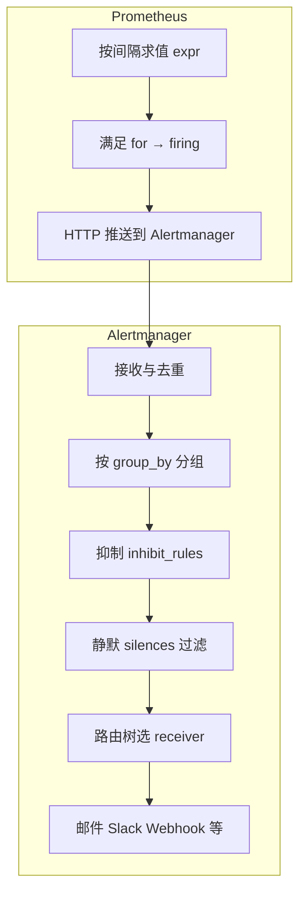
```mermaid
flowchart TB
  subgraph PM[Prometheus]
    E[按间隔求值 expr]
    F["满足 for → firing"]
    H[HTTP 推送到 Alertmanager]
  end
  subgraph AM[Alertmanager]
    R[接收与去重]
    G[按 group_by 分组]
    I[抑制 inhibit_rules]
    S[静默 silences 过滤]
    T[路由树选 receiver]
    N[邮件 Slack Webhook 等]
  end
  E --> F --> H --> R --> G --> I --> S --> T --> N
```

上图是便于对齐配置项的逻辑顺序；抑制、静默与路由在实际代码中的衔接细节以当前版本的 [configuration](https://prometheus.io/docs/alerting/latest/configuration/) 为准。

**4、你在本教程环境里怎么逐项对得上号**

下面按「先能打开页面，再看 Prometheus，最后看 Alertmanager」来操作，和 **T4.2.1**、**T4.11.1** 一致：两组件都在 `kube-mon`，Service 名通常是 `prometheus` 与 `alertmanager`（若你改过名字，把下文命令里的服务名一起改掉）。

**怎么进到页面**

- 集群内临时验证：可对该 namespace 下的 Prometheus / Alertmanager Pod 做端口转发，例如 `kubectl port-forward -n kube-mon svc/prometheus 9090:9090`、`kubectl port-forward -n kube-mon svc/alertmanager 9093:9093`，本机浏览器分别打开 `http://127.0.0.1:9090` 与 `http://127.0.0.1:9093`。
- 若 **T4.11.1** 里把 Alertmanager 暴露成 NodePort，则可用 `kubectl get svc -n kube-mon alertmanager` 看 `9093:节点端口`，再用 `http://<任一节点IP>:<节点端口>` 打开 Alertmanager；Prometheus 是否 NodePort 以你前文清单为准，没有就只能 port-forward 或 Ingress。

**在 Prometheus 里该看哪里**

1. 打开顶部菜单里的 Alerts（告警）。这里列出的是「规则求值结果」，不是邮件有没有发出去。  
   - `inactive`：当前这次求值里 `expr` 为假，属于正常空闲。  
   - `pending`：`expr` 已经为真，但还没到规则里 `for` 写的持续时间，相当于在等「是不是持续出问题」，避免短暂抖动就告警。  
   - `firing`：条件持续满足 `for` 之后，Prometheus 会把这条告警推给 Alertmanager；只有到了这一步，后面邮件、钉钉之类才可能动工。  
2. 若 Alerts 里**根本没有**你在 `rules.yml` 里写的规则名，多半是 `rule_files` 没挂上、`rules.yml` 键名或路径不对，或改完 ConfigMap 没 reload，回到 **T4.4** / **T4.11.2** 核对并做一次 **T4.3.1** 的 reload。  
3. 菜单 Status 里可顺带看一眼运行信息（不同版本入口名称略有差异），确认进程与启动参数正常即可；是否连上 Alertmanager 以配置里 `alerting.alertmanagers` 为准，连不上时常见表现是 firing 后收件箱永远没有动静，同时可结合 Alertmanager 侧是否收到请求来排查。

**在 Alertmanager 里该看哪里**

1. 默认页或 Alerts 一类入口会列出**当前推送到 Alertmanager 的告警**（已按分组、静默、抑制处理前的集合在不同版本里展示方式可能略有不同，但核心是「通知链路上游送来的内容」）。  
2. Silences（静默）用于维护窗口：按标签匹配器在这段时间一定范围内**拦通知**，适合「今晚割接，先别吵」。这和 Prometheus 里规则删不删是两回事：规则可以还在 firing，只是 Alertmanager 选择不往 receiver 发。  
3. 若 Prometheus 里已经是 `firing`，而 Alertmanager 里长时间什么都没有，优先查三类问题：  
   - Prometheus 的 `prometheus.yml` 里有没有 `alerting.alertmanagers`，`targets` 是否是 `alertmanager:9093`（同 ns）或完整集群域名；  
   - 两个 Pod 是否都在 `Running`、网络策略有没有拦掉 9093；  
   - 有没有静默或抑制规则把通知挡掉（可在配置里搜 `inhibit_rules` 和对照 UI）。

### T4.11.1、安装（按表顺序做）

**默认前提**：你已按 **T4.2.1** 部署 Prometheus（镜像 `prom/prometheus:v3.10.0`），并按 **T4.4** 配好 `kubernetes-nodes` 等抓取；资源在命名空间 `kube-mon`，ConfigMap 名为 `prometheus-config`，与全文一致。

**版本**：Alertmanager 使用 **T4.2.1「版本与镜像约定」表**中的 `prom/alertmanager:v0.31.1`。以后升级只以 [Alertmanager Releases](https://github.com/prometheus/alertmanager/releases/latest) 上标记为 Latest 的**稳定版**为准，不要猜 tag。

**这一节只做两件事**：先把 Alertmanager 起在集群里；再改 Prometheus 的 `prometheus.yml`，把空的 `alertmanagers: []` 换成真实地址。**告警规则文件**留到 **T4.11.2**，避免一次改太多。

**总流程**

| 顺序 | 内容 | 做完怎么确认 |
|------|------|----------------|
| 1 | 应用 Alertmanager 配置 ConfigMap | `kubectl get cm -n kube-mon alert-config` |
| 2 | 应用 Deployment | `kubectl rollout status deployment/alertmanager -n kube-mon` |
| 3 | 应用 Service | `kubectl get svc,endpoints -n kube-mon alertmanager` |
| 4 | 改 `prometheus-config` 里的 `alerting`，再 apply 并对 Prometheus 执行 **T4.3.1** reload | Prometheus 无报错；必要时看 Pod 日志 |

**可选：本机试二进制**（与镜像内 `alertmanager --help` 一致，参数是两个连字符）：

```bash
./alertmanager --config.file=alertmanager.yml
```

**步骤 1：Alertmanager 配置（ConfigMap）**

`data.config.yml` 是 **Alertmanager 自己的配置语法**，不是 Kubernetes 资源语法。SMTP 真实密码不要进 Git；生产用流水线注入、Secret 挂载（官方支持 `smtp_auth_password_file`，见 [Alertmanager 配置](https://prometheus.io/docs/alerting/latest/configuration/)），或只在集群里维护的渲染流程。

`route` 里：`receiver: default` 表示没被子路由命中的告警走默认通道；`routes` 里带 `matchers` 的子路由把 `team="node"` 的告警改走名为 **`email` 的接收器**（与 **T4.11.2** 示例规则里的 `labels.team: node` 对齐）。`matchers` 写法见官方 [matcher](https://prometheus.io/docs/alerting/latest/configuration/#matcher)；嵌在 Kubernetes YAML 里时，**每一条 matcher 用单引号包整行**，避免 YAML 解析和 Alertmanager 语法混在一起不好查错。

**易错点（启动失败时先查这条）**：`route` / `routes` 里出现的**每一个** `receiver: xxx`，都必须在下面的 **`receivers` 里有一条对应的 `- name: xxx`**，名字要**完全一致**（区分大小写）。少定义会报错：`undefined receiver "xxx" used in route`。这不是「邮件和 Webhook 冲突」，而是**名字没对上**。例如 **T4.11.2.2** 把接收器命名成 `email-and-dingtalk` 时，子路由里的 `receiver` 也要改成 **`email-and-dingtalk`**，或保留子路由为 `email` 则 `receivers` 里仍须保留 `- name: email`（并在该块里并列写 `webhook_configs`）。

若你在 Prometheus 里配了 `global.external_labels.cluster`，`group_by` 里可加上 `cluster`，多集群时分组更清晰。SMTP 端口和是否 TLS 以邮件服务商文档为准（常见 587 + STARTTLS）。

```yaml
# alertmanager-config.yaml
apiVersion: v1
kind: ConfigMap
metadata:
  name: alert-config
  namespace: kube-mon
data:
  config.yml: |-
    global:
      resolve_timeout: 5m
      smtp_smarthost: 'smtp.example.com:587'
      smtp_from: 'alerts@example.com'
      smtp_auth_username: 'alerts@example.com'
      smtp_auth_password: '<由部署流程注入，勿入库>'
      smtp_require_tls: true
    route:
      group_by: [alertname, team]
      group_wait: 30s
      group_interval: 5m
      repeat_interval: 4h
      receiver: default
      routes:
        - receiver: email
          matchers:
            - 'team="node"'
          group_wait: 10s
    receivers:
      - name: default
        email_configs:
          - to: 'oncall@example.com'
            send_resolved: true
      - name: email
        email_configs:
          - to: 'oncall@example.com'
            send_resolved: true
```

```bash
kubectl apply -f alertmanager-config.yaml
```

**邮件通知：要能进收件箱，缺哪条都不行**

`email_configs` 里的 `to` 只是**收件人地址**。真正发信走的是 **`global` 里的 SMTP**：Alertmanager 作为 SMTP 客户端连到 `smtp_smarthost`，用 `smtp_auth_*` 认证，用 `smtp_from` 当发件人。示例里的 `smtp.example.com`、`alerts@example.com` 和占位密码**不会发出任何真实邮件**，必须全部换成你可用的邮件服务参数。

生产上通常要同时满足：

1. **SMTP 与认证**：`smtp_smarthost`（`主机:端口`）、TLS（`smtp_require_tls` 等）与**服务商或企业邮局**文档一致；密码用官方支持的 `smtp_auth_password` 或 **`smtp_auth_password_file`**（Secret 挂文件，推荐），不要进 Git。
2. **个人邮箱（如 QQ 邮箱）**：在邮箱设置里**开启 SMTP**，使用**授权码**填入 `smtp_auth_password`（不是 QQ 登录密码）；`smtp_from` 一般填该邮箱或服务商要求的发信身份；**主机名、端口、SSL/STARTTLS 以腾讯当前说明为准**（常见为 `smtp.qq.com` 配合 465 或 587，以官方为准）。
3. **出站网络**：Alertmanager Pod 能解析并访问 SMTP 端口（防火墙、安全组、代理、固定出口白名单、NetworkPolicy 等）。很多企业让监控走**内部 SMTP 中继**，由运维提供 relay 地址和账号。
4. **投递与反垃圾**：发件域、SPF/DKIM 等常由邮件基础设施负责；若 SMTP 通了但进垃圾箱，要按你们邮局规范调整。

只把 `to` 改成你的 QQ 邮箱**不够**；`global` 不配成真实 QQ SMTP 与授权码，告警路由到 `email` 接收器后也会在日志里报 SMTP 错误。改完 `alert-config` 后 **`kubectl rollout restart deployment/alertmanager -n kube-mon`**，排错看 **`kubectl logs -n kube-mon deploy/alertmanager`**。

**步骤 2：Deployment**

与 **T4.2.1** 一样给工作负载加非 root 安全上下文；数据目录 Alertmanager 镜像默认不需要 PVC（本示例仅配置文件 ConfigMap）。

```yaml
# alertmanager-deploy.yaml
apiVersion: apps/v1
kind: Deployment
metadata:
  name: alertmanager
  namespace: kube-mon
  labels:
    app: alertmanager
spec:
  selector:
    matchLabels:
      app: alertmanager
  template:
    metadata:
      labels:
        app: alertmanager
    spec:
      securityContext:
        runAsNonRoot: true
        runAsUser: 65534
        fsGroup: 65534
      volumes:
        - name: alertcfg
          configMap:
            name: alert-config
      containers:
        - name: alertmanager
          image: prom/alertmanager:v0.31.1
          imagePullPolicy: IfNotPresent
          args:
            - --config.file=/etc/alertmanager/config.yml
          ports:
            - containerPort: 9093
              name: http
          volumeMounts:
            - mountPath: /etc/alertmanager
              name: alertcfg
          livenessProbe:
            httpGet:
              path: /
              port: http
            initialDelaySeconds: 10
          readinessProbe:
            httpGet:
              path: /
              port: http
            initialDelaySeconds: 5
          resources:
            requests:
              cpu: 100m
              memory: 256Mi
            limits:
              cpu: 500m
              memory: 512Mi
```

```bash
kubectl apply -f alertmanager-deploy.yaml
kubectl rollout status deployment/alertmanager -n kube-mon
```

**步骤 3：Service**

练习环境用 NodePort 方便浏览器访问；生产多改成 ClusterIP，再配合 Ingress 或只给集群内访问，并配合 NetworkPolicy 收紧来源。与 **T4.2.1** 的 Prometheus Service 策略保持一致即可。

```yaml
# alertmanager-svc.yaml
apiVersion: v1
kind: Service
metadata:
  name: alertmanager
  namespace: kube-mon
  labels:
    app: alertmanager
spec:
  selector:
    app: alertmanager
  type: NodePort
  ports:
    - name: web
      port: 9093
      targetPort: http
```

```bash
kubectl apply -f alertmanager-svc.yaml
```

**改 Alertmanager 配置后怎么生效**：默认镜像**没有**像 Prometheus 那样依赖 `/-/reload` 热加载。更新 `alert-config` 后请重启 Deployment：

```bash
kubectl rollout restart deployment/alertmanager -n kube-mon
```

可选：在镜像参数中加 `--web.enable-lifecycle` 后，可对 Alertmanager 发 POST `/-/reload`（与 [官方文档](https://prometheus.io/docs/alerting/latest/configuration/) 中 HTTP API 说明一致）；本文采用重启，步骤最少。

**步骤 4：让 Prometheus 指向 Alertmanager**

编辑 `prometheus-config` 的 `data.prometheus.yml`。在 **T4.4** 完整示例里，原来类似：

```yaml
    rule_files: []
    alerting:
      alertmanagers: []
```

本步**只改 `alerting` 段**，`rule_files` **暂时保持 `[]`**（规则在 **T4.11.2** 再加）。把 `alerting` 整段替换为下面内容（结构必须与 [Prometheus configuration](https://prometheus.io/docs/prometheus/latest/configuration/configuration/) 一致：`static_configs` 下面是**列表项**，必须有 `- targets:`，不能写成裸的 `targets:`）：

```yaml
    alerting:
      alertmanagers:
        - static_configs:
            - targets: ["alertmanager:9093"]
```

Prometheus 与 Alertmanager **同命名空间**时用服务短名即可；若 Prometheus 以后迁到别的命名空间，target 改成 FQDN，例如 `alertmanager.kube-mon.svc.cluster.local:9093`。

**不要**删掉 `global`、`scrape_configs`、`storage` 等已有块。保存后 `kubectl apply` 你的 Prometheus ConfigMap 清单，再按 **T4.3.1** 对 Prometheus 执行 reload。

**可选自检**：配置加载后看 Alertmanager 日志是否有解析错误；也可在 Alertmanager Pod 内执行 `amtool check-config /etc/alertmanager/config.yml`（镜像内自带 `amtool`）。

### T4.11.2、告警规则

**前提**：**T4.11.1** 已完成，Prometheus 的 `alerting` 已指向 Alertmanager。

**这一节做三件事**：

1. 在 ConfigMap `prometheus-config` 的 `data` 下**新增键** `rules.yml`（与 `prometheus.yml` 并列），Kubernetes 会把每个键挂成 `/etc/prometheus/<键名>`，因此容器内路径为 `/etc/prometheus/rules.yml`。
2. 在 `prometheus.yml` 里**只保留一处** `rule_files`：把顶部的 `rule_files: []` **改成**下面这类列表即可；**不要**在前面留着 `rule_files: []` 又在文件后面再写一段 `rule_files`，否则启动或 reload 会报错：`field rule_files already set`。
3. apply 后按 **T4.3.1** reload；上线前用 `promtool` 自检（见下）。

**不要**再复制粘贴一整段 `alerting`。**T4.11.1** 已配好的话保持不动；若你跳过了上一节，需要把下面片段里 `rule_files` 与 `alerting` 一起合并进 `prometheus.yml`。

合并后应类似（仅作结构核对，实际文件里还有 `global`、`scrape_configs` 等）。注意：**全文件仅此一段 `rule_files`**，与 **T4.4** 等完整版里 `global` 下面的 `rule_files: []` 是「二选一」，改规则时删掉空列表，不要追加第二处。

```yaml
    rule_files:
      - /etc/prometheus/rules.yml
    alerting:
      alertmanagers:
        - static_configs:
            - targets: ["alertmanager:9093"]
```

规则求值周期跟 **T4.2.1** 的 `global.evaluation_interval`（如 `15s`）走；某个组要放慢可在 `groups` 里单独写 `interval`。字段含义见官方 [告警规则](https://prometheus.io/docs/prometheus/latest/configuration/alerting_rules/)。

**示例规则**（与 **T4.4** 节点指标一致：`job="kubernetes-nodes"`）。用 `MemAvailable` 和 `MemTotal` 估算内存压力；阈值 `50` 方便实验，生产常改 `80`～`90`，并保留 `for` 防抖。

```yaml
# prometheus-config 中 data.rules.yml 的完整内容
apiVersion: v1
kind: ConfigMap
metadata:
  name: prometheus-config
  namespace: kube-mon
data:
  rules.yml: |
    groups:
      - name: node-memory
        interval: 30s
        rules:
          - alert: NodeMemoryHigh
            expr: |
              (100 * (1 - node_memory_MemAvailable_bytes{job="kubernetes-nodes"} / node_memory_MemTotal_bytes{job="kubernetes-nodes"})) > 50
            for: 2m
            labels:
              team: node
            annotations:
              summary: "节点 {{ $labels.instance }} 内存压力高"
              description: "可用内存占比已低于阈值，当前计算值（已用百分比）约 {{ $value }}。"
  prometheus.yml: |
    global:
      scrape_interval: 15s
      scrape_timeout: 10s
  # 下面保持不变 ...
```

**字段一眼看懂**：`alert` 规则名；`expr` 是 PromQL，为真才算触发；`for` 要连续满足多久才从 `pending` 变 `firing`；`labels` 会进告警实例，Alertmanager 路由和分组都靠它；`annotations` 给人读，不参与匹配。模板变量见官方 [告警规则](https://prometheus.io/docs/prometheus/latest/configuration/alerting_rules/) 里的模板说明。

**上线前自检**：

```bash
kubectl rollout restart -n kube-mon deployment prometheus
kubectl exec -n kube-mon deploy/prometheus -- promtool check config /etc/prometheus/prometheus.yml
kubectl exec -n kube-mon deploy/prometheus -- promtool check rules /etc/prometheus/rules.yml
```

第二条若报找不到文件，说明 ConfigMap 里缺少 `rules.yml` 键，或 `rule_files` 路径与挂载路径不一致。

**打开 Prometheus 的 Alerts 页面看规则是否在列表里、状态是否变化。**

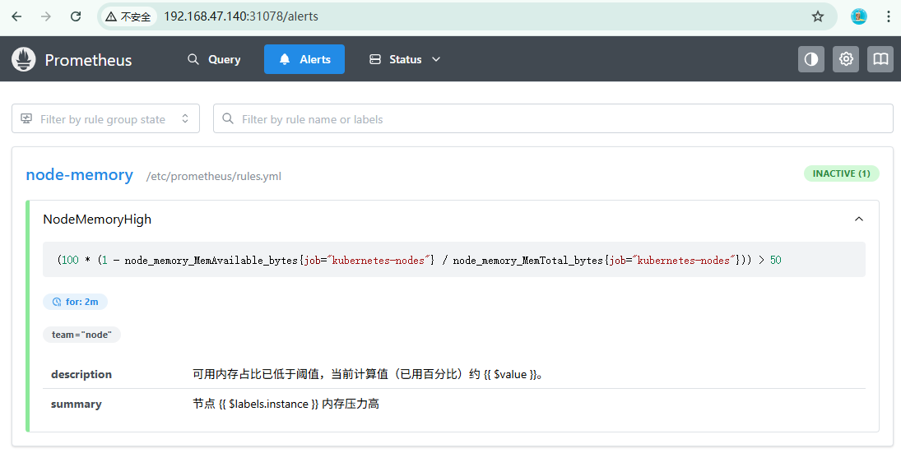

**状态含义**：`inactive` 条件不成立；`pending` 已成立但未满 `for`；`firing` 已推给 Alertmanager。用内置指标自查：

```promql
ALERTS{alertname="NodeMemoryHigh", alertstate=~"pending|firing"}
```

本例 `labels.team` 为 `node`，与 **T4.11.1** 子路由里 `team="node"` 一致，告警会交给 **`email` 接收器**，由 Alertmanager **按 `global` SMTP 尝试发信**。收件箱能不能收到，取决于 **T4.11.1**「邮件通知」里 SMTP、认证、出站是否已配通，**不是**只改 `to` 就行。

#### T4.11.2.1、Alertmanager Web UI

**和 Prometheus 里 Alerts 的区别**：Prometheus 页是**规则求值状态**（inactive/pending/firing）；Alertmanager 页是**已经送过来的告警**怎么分组、有没有被静默/抑制、会走哪个接收器。两边都要会看，别混成一个。

**怎么打开**

- **NodePort**（与 **T4.11.1** 清单一致）：`kubectl get svc -n kube-mon alertmanager`，看 `PORT(S)` 里 `9093:3xxxx` 的节点端口，浏览器访问 `http://<任一节点 IP>:<3xxxx>`。
- **ClusterIP / 本机没直达集群**：`kubectl port-forward -n kube-mon svc/alertmanager 9093:9093`，本机打开 `http://127.0.0.1:9093`。
- 生产对外多走 Ingress + TLS，逻辑仍是访问 Alertmanager 的 **9093** 等价入口。

**界面大致结构**（0.2x 以后常见布局；具体文案随版本略有出入，以你镜像为准）

| 入口 / 区域 | 用途 |
|-------------|----------------|
| **Alerts** | 当前 Alertmanager 手里的告警列表，多按 **`route.group_by`** 聚成「一组」展示。展开一组可看每条告警的**标签**（来自 Prometheus 规则里的 `labels` 等）、当前会交给哪个 **receiver**（邮件、Webhook 等）。若显示被 **silenced** / **inhibited**，表示被静默或抑制规则挡了通知。 |
| **Silences** | **临时静音**：在时间段内按 **matchers** 匹配到的告警**不再往接收器发**，适合割接、已知误报。和「改 Prometheus 规则」无关；规则可以还在 firing，只是不吵你。新建静默时要填：匹配条件、开始/结束时间、说明、创建人（有的版本可选）。matchers 语法与路由里一致，例如 `alertname="NodeMemoryHigh"`、`team="node"`，见官方 [matcher](https://prometheus.io/docs/alerting/latest/configuration/#matcher)。 |
| **Status** | 版本、运行信息；多实例集群时可能看到成员状态。改配置是否生效以 **T4.11.1** 的 **restart / reload** 为准，不是看这个页「自动更新」。 |

**你在 Alerts 页该怎么理解**

- **一组里多条**：通常是因为同一 `group_by` 标签组合下有多条 firing（例如多个 `instance`）。通知往往按组发，所以你会觉得「一条邮件里塞了多台机器」。
- **看不到告警**：可能是 Prometheus 没推到 Alertmanager（查 Prometheus `alerting` 与网络）、告警已被静默/抑制、或当前本来就没有 firing。
- **有告警但没邮件**：先看 **T4.11.1「邮件通知」** SMTP；再看该组对应的 **receiver** 是不是邮件；最后看是否 **silenced**。

**Silences 页常用操作**

1. **New Silence**：填 matchers（至少能唯一框住你想静音的范围，太宽会误伤）。
2. 设 **开始/结束时间**；到期自动失效。
3. 已有静默可在列表里 **Expire** 提前取消。

**配置文件里才有的地方（UI 里不画表单）**

- **`inhibit_rules`（抑制）**：例如「集群挂了就别再报单盘」这类逻辑，写在 `config.yml`，见 [inhibit_rule](https://prometheus.io/docs/alerting/latest/configuration/#inhibit_rule)。
- **`repeat_interval` / `group_wait` / `group_interval`**：控制多久重复通知、分组等待等，在 **`route`** 里调，要和值班习惯一起试，官方说明在 [configuration](https://prometheus.io/docs/alerting/latest/configuration/) 的 routing 相关字段。

官方延伸阅读：[Alertmanager](https://prometheus.io/docs/alerting/latest/alertmanager/)、[Alertmanager 配置](https://prometheus.io/docs/alerting/latest/configuration/)、[告警规则](https://prometheus.io/docs/prometheus/latest/configuration/alerting_rules/)。

#### T4.11.2.2、Webhook：钉钉与企业微信群机器人

**这一节要干的事**：告警已经到 **Alertmanager v0.31.1**（版本与 **T4.2.1** 文首表一致）了，再往**钉钉群**或**企业微信群**里推一条通知。Alertmanager 只会按 [webhook_config](https://prometheus.io/docs/alerting/latest/configuration/#webhook_config) 把 [官方这份 JSON](https://prometheus.io/docs/alerting/latest/notifications/) POST 到集群里的某个 HTTP 地址；钉钉和企微机器人各自要的报文格式，必须靠**集群里的转发程序**去调官方 HTTPS 接口。**机器人的 token、加签密钥、带 key 的整段 URL 只往 Secret 里放，不要写进 Git。**

**生产上这条链路怎么选（和文首「版本与镜像约定」表一致）**

| 要接到哪里 | 用到的转发软件（固定镜像 tag） | 官方依据你先看哪里 | K8s 清单从哪来 |
|------------|-------------------------------|--------------------|----------------|
| 钉钉自定义机器人（可含加签） | [prometheus-webhook-dingtalk](https://github.com/timonwong/prometheus-webhook-dingtalk)，镜像 `timonwong/prometheus-webhook-dingtalk:v2.1.0` | 钉钉开放平台：[自定义机器人接入](https://developers.dingtalk.com/document/app/custom-robot-access)、[安全设置与加签](https://developers.dingtalk.com/document/robots/customize-robot-security-settings)（页面若改版以开放平台搜索为准） | 上游有 [contrib/k8s](https://github.com/timonwong/prometheus-webhook-dingtalk/tree/v2.1.0/contrib/k8s)；下文已按 **kube-mon**、Secret、固定 tag 写好一份可直接 apply 的示例。 |
| 企业微信群机器人 | [PrometheusAlert](https://github.com/feiyu563/PrometheusAlert)，镜像 `feiyu563/prometheus-alert:v4.9.2` | 腾讯：[群机器人配置说明](https://developer.work.weixin.qq.com/document/path/91770)（路径以官网为准） | Release **v4.9.2** 里的 [kubernetes.zip](https://github.com/feiyu563/PrometheusAlert/releases/download/v4.9.2/kubernetes.zip)；先解压部署，再按下面 Alertmanager 的 URL 接上。 |

**两套都要守的规矩**：转发 Pod 必须能访问 `oapi.dingtalk.com` 或 `qyapi.weixin.qq.com`；镜像不准用未钉死的 tag；Alertmanager 里 `webhook_configs.url` 写集群内 Service，例如 `http://服务名.kube-mon.svc.cluster.local:端口路径`；要和 **T4.11.2** 规则上的 `labels`（如 `team="node"`）在 `route` 里对得上；要和邮件一起发，就在**同一个 receiver** 里并排写 `email_configs` 和 `webhook_configs`。需要 TLS 客户端、代理等用 Alertmanager 的 [http_config](https://prometheus.io/docs/alerting/latest/configuration/#http_config)。

---

**甲、钉钉（官方建机器人 + 集群里跑 prometheus-webhook-dingtalk）**

1. 在钉钉侧按开放平台文档建好「自定义机器人」，安全设置用 **加签**，记下 **access_token** 和 **SECRET**（常见 `SEC` 开头）。这一步只能在钉钉控制台完成，和 K8s 无关。  
2. 集群里配置由 **Secret** 提供。下面示例里 target 名叫 `prod`，你可以改名，但后面的 Alertmanager 路径最后一节要跟着改。

`prometheus-webhook-dingtalk-secret.yaml`（本地改完再 apply，勿提交仓库）：

```yaml
apiVersion: v1
kind: Secret
metadata:
  name: prometheus-webhook-dingtalk
  namespace: kube-mon
type: Opaque
stringData:
  config.yaml: |
    targets:
      prod:
        url: https://oapi.dingtalk.com/robot/send?access_token=换成你的 token
        secret: 换成你的 SEC 加签密钥
```

`prometheus-webhook-dingtalk.yaml`：

```yaml
apiVersion: apps/v1
kind: Deployment
metadata:
  name: prometheus-webhook-dingtalk
  namespace: kube-mon
  labels:
    app: prometheus-webhook-dingtalk
spec:
  replicas: 1
  selector:
    matchLabels:
      app: prometheus-webhook-dingtalk
  template:
    metadata:
      labels:
        app: prometheus-webhook-dingtalk
    spec:
      containers:
        - name: prometheus-webhook-dingtalk
          image: timonwong/prometheus-webhook-dingtalk:v2.1.0
          args:
            - --web.listen-address=:8060
            - --config.file=/config/config.yaml
          ports:
            - name: http
              containerPort: 8060
          volumeMounts:
            - name: config
              mountPath: /config
          resources:
            requests:
              cpu: 50m
              memory: 64Mi
            limits:
              cpu: 200m
              memory: 128Mi
      volumes:
        - name: config
          secret:
            secretName: prometheus-webhook-dingtalk
---
apiVersion: v1
kind: Service
metadata:
  name: prometheus-webhook-dingtalk
  namespace: kube-mon
spec:
  selector:
    app: prometheus-webhook-dingtalk
  ports:
    - name: http
      port: 8060
      targetPort: http
```

```bash
kubectl apply -f prometheus-webhook-dingtalk-secret.yaml
kubectl apply -f prometheus-webhook-dingtalk.yaml
kubectl logs -n kube-mon deploy/prometheus-webhook-dingtalk
```

日志里应打印出对应的 Webhook 地址，格式固定为 **`http://<主机>:8060/dingtalk/<target 名>/send`**；给 Alertmanager 用时把主机名换成 Service：`prometheus-webhook-dingtalk.kube-mon.svc.cluster.local`。

在 **T4.11.1** 的 `receivers` 里追加或合并（邮件 + 钉钉示例）。若接收器名叫 **`email-and-dingtalk`**，则 **`route.routes` 里对应子路由的 `receiver` 也必须改成 `email-and-dingtalk`**，否则会报 **`undefined receiver "email" used in route`**（见 **T4.11.1** 文内「易错点」）。  
下面只是 **`route.routes` + `receivers` 片段**，你要和 **T4.11.1** 里已有的 **`global:`**、**`route`** 顶栏（`group_by`、`receiver: default` 等）拼成**完整** `config.yml`，不要只有这一段就去 apply。

```yaml
      routes:
        - receiver: email-and-dingtalk
          matchers:
            - 'team="node"'
          group_wait: 10s
    receivers:
      - name: default
        email_configs:
          - to: 'oncall@example.com'
            send_resolved: true
      - name: email-and-dingtalk
        email_configs:
          - to: 'oncall@example.com'
            send_resolved: true
        webhook_configs:
          - url: 'http://prometheus-webhook-dingtalk.kube-mon.svc.cluster.local:8060/dingtalk/prod/send'
            send_resolved: true
```

改完 Alertmanager 配置后按你在 **T4.11.1** 的方式 reload 或重启 Deployment。

---

**乙、企业微信（官方建机器人 + 集群里跑 PrometheusAlert）**

1. 在企微群里添加机器人，复制 **带 key= 的 Webhook 地址**，字段含义以 **[群机器人文档](https://developer.work.weixin.qq.com/document/path/91770)** 为准。  
2. 部署 **PrometheusAlert v4.9.2**：下载与 Release 同版本的 **[kubernetes.zip](https://github.com/feiyu563/PrometheusAlert/releases/download/v4.9.2/kubernetes.zip)**，解压后把清单里的命名空间改成 **kube-mon**，镜像行改成 **`feiyu563/prometheus-alert:v4.9.2`**（若 [Docker Hub 标签页](https://hub.docker.com/r/feiyu563/prometheus-alert/tags) 暂时还没有同号 tag，以 Hub 上已有、且 README 示例推荐的最近稳定 tag 为准，或按 zip 里默认镜像行与 Release 说明对齐），再 `kubectl apply`。首次登录 Web 控制台，按项目 **[企业微信告警配置](https://github.com/feiyu563/PrometheusAlert/blob/master/doc/readme/conf-wechat.md)**、**[Prometheus 接入](https://github.com/feiyu563/PrometheusAlert/blob/master/doc/readme/system-prometheus.md)** 配好机器人与模版。**模版英文名 `tpl`** 必须与你控制台里实际启用的一致，不要照抄文档里不存在的名字。  
3. Alertmanager 对接口 **`/prometheusalert`**，查询参数见项目 **[接口说明](https://github.com/feiyu563/PrometheusAlert/blob/master/doc/readme/base-restful.md)**。下面是一条示意（把 Service 名、端口、tpl、整段 wxurl 换成你的；若一行太长或特殊字符导致失败或对 `wxurl` 做 URL 编码，按项目文档处理）：

```yaml
  - name: alertmanager-to-prometheusalert-wx
    webhook_configs:
      - url: 'http://prometheus-alert.kube-mon.svc.cluster.local:8080/prometheusalert?type=wx&tpl=这里填Web里的模版名&wxurl=https://qyapi.weixin.qq.com/cgi-bin/webhook/send?key=你的key'
        send_resolved: true
```

Service 名 `prometheus-alert`、端口 **8080** 若与 zip 里不一致，以 `kubectl get svc -n kube-mon` 为准。

---

**丙、验收（按顺序做，和前文约定一致）**

下面假设你用的还是 **T4.11.2** 示例规则：**`NodeMemoryHigh`**，`labels.team: node`，`for: 2m`，表达式里是 **`> 50`**。你已按 **甲** 或 **乙** 接好转发，并在 **T4.11.1** 里让 **`team="node"`** 命中带 Webhook 的 `receiver`（名称以你 config 为准，别和旧文里的 `email` 接收器弄混）。

1. **先确认没有误伤**
   
打开 Alertmanager Web（**T4.11.2.1** 里的 NodePort 或 port-forward），进 **Silences**，看是否已有匹配 `alertname="NodeMemoryHigh"` 或 `team="node"` 的静默；有就先 **Expire** 或等到期，否则通知永远被挡。
   
2. **把规则改成「必响」便于实验（验完改回去）**

   编辑 `kube-mon` 下的 **`prometheus-config`**，在 `data.rules.yml` 里把 `NodeMemoryHigh` 的阈值从 **`> 50`** 改成 **`> 1`**（或更小），目的是让 `expr` 几乎恒为真。`kubectl apply -f` 更新 ConfigMap 之后：若 Prometheus 已按 **T4.2.1** 打开 **`--web.enable-lifecycle`**，用 NodePort 或端口转发对 **`/prometheus` 的 9090** 发 **`curl -X POST .../-/reload`**（全文多处示例与 **T4.3.1** 同一操作）；若你集群里习惯改完必重启，则执行 `kubectl rollout restart -n kube-mon deployment prometheus`

   若你当前是 **StatefulSet** 版 Prometheus（如 **T4.12.3**），就对对应 StatefulSet 滚动重启，别和 Deployment 命令混用。

3. **在 Prometheus 里确认已经 firing**  
   - 页面 **Alerts** 里找到 **NodeMemoryHigh**，等满 **`for: 2m`** 后状态应为 **firing**。  
   - 或在 **Graph** 里查：`ALERTS{alertname="NodeMemoryHigh", alertstate="firing"}`，若一直是 `pending`，说明条件未满 2 分钟，或节点指标没抓到（回到 **T4.4**、**T4.11.2** 看 `job="kubernetes-nodes"`）。

4. **在 Alertmanager 里确认这条告警会进你的接收器**

   打开 **Alerts**，展开对应分组，看是否出现 **NodeMemoryHigh**，标签里是否有 **`team="node"`**，展示的 **receiver** 是否为你配了钉钉或企微 Webhook 的那一个。若显示 **silenced** / **inhibited**，回到步骤 1 或 **T4.11.1** 的 `inhibit_rules`。

5. **看转发 Pod 有没有报错**  
   - 钉钉：`kubectl logs -n kube-mon deploy/prometheus-webhook-dingtalk --tail=100`  

   - 企微：`kubectl logs -n kube-mon deploy/prometheus-alert --tail=100`（Deployment 名以你 apply 的为准，可先 `kubectl get deploy -n kube-mon`）

     常见现象：加签错、token 错会返回 4xx，日志里会有 HTTP 错误。

6. **看 IM 是否收到**

   钉钉群或企业微信群里应在 **group_wait** 等路由参数允许的时间窗内收到一条（或一组）告警；若 Alertmanager 配了 **`send_resolved: true`**，恢复阈值并 reload 后还应收到恢复类通知（以实际模版为准）。

7. **收不到时按这条顺序自查**

   ① Alertmanager **Silences** 是否挡掉

   ② **`route` 的 matcher** 是否包含 `team="node"`，且 **receiver** 里真有对应的 **`webhook_configs.url`**（路径与 **甲** 的 `/dingtalk/prod/send` 或 **乙** 的 `/prometheusalert?...` 完全一致）

   ③ **`kubectl get endpoints -n kube-mon prometheus-webhook-dingtalk`**（或你的 PrometheusAlert Service）是否有后端

   ④ 从集群内 `curl -sS -X POST`  your-webhook-url 是否通（可临时起一个 **curl** debug Pod，见 **T4.2.1** 同集群 DNS 习惯）

   ⑤ 转发 Pod **能否访问公网**（防火墙、代理、企业出口策略）

8. **实验结束把阈值改回**

   将 `rules.yml` 里的 **`> 1`** 改回 **`> 50`**（或你们生产用阈值），reload / 重启 Prometheus，避免实验规则长期误报。

**插图槽位**

- `docs/prometheus/images/t4-11-alertmanager-webhook-flow.png`（Prometheus → Alertmanager → 转发服务 → IM，你可自行补图）  
- `docs/prometheus/images/t4-11-dingtalk-robot-verify.png`（打码后的群内告警消息截图，可选）

### T4.11.3、邮件模板

默认模板可直接用。要统一 **值班链接、Runbook、公司抬头**：从与 **Alertmanager v0.31.1** 一致的 [default.tmpl](https://github.com/prometheus/alertmanager/blob/v0.31.1/template/default.tmpl) 拉下来进 Git 再改；配置 **顶层** `templates:`，文件挂进容器（如 `/etc/alertmanager/templates/`），与 glob 一致。

```bash
curl -fsSL -o default.tmpl "https://raw.githubusercontent.com/prometheus/alertmanager/v0.31.1/template/default.tmpl"
```

语法为 Go template，字段见 [Notifications](https://prometheus.io/docs/alerting/latest/notifications/) 与 [notification_examples](https://prometheus.io/docs/alerting/latest/notification_examples/)。

```yaml
templates:
  - /etc/alertmanager/templates/*.tmpl
```

用 ConfigMap 子路径或 Volume 挂到容器内（与 glob 前缀一致）。变更走评审 + **`kubectl rollout restart deployment/alertmanager -n kube-mon`**（或已启用的 `/-/reload`）。

### T4.11.4、记录规则（配合 T4.4 节点指标）

与告警规则同写在 `rule_files`，见 [Recording rules](https://prometheus.io/docs/prometheus/latest/configuration/recording_rules/)。**企业里**：Grafana 大盘、多条告警共用同一套重查询时，先 `record` 再在面板和 `expr` 里引用，减轻 Prometheus 压力；`interval` 可与查询粒度一致（如 `30s`），`record` 命名与团队规范统一。评估间隔未在组内指定时，跟 `global.evaluation_interval`（**T4.2.1** 为 `15s`）；若全局未配则程序默认 `1m`，以当前 `prometheus.yml` 为准。

下面与 **T4.4** 一致使用 `job="kubernetes-nodes"`；第二条与 **T4.11.2** 内存告警语义一致，可把告警 `expr` 改成直接判断记录指标（阈值更易读）。

```yaml
groups:
  - name: node-recording
    interval: 30s
    rules:
      - record: instance:node_memory_used_bytes:calc
        expr: |
          node_memory_MemTotal_bytes{job="kubernetes-nodes"}
          - node_memory_MemAvailable_bytes{job="kubernetes-nodes"}
      - record: instance:node_memory_utilisation:ratio
        expr: |
          1 - (
            node_memory_MemAvailable_bytes{job="kubernetes-nodes"}
            /
            node_memory_MemTotal_bytes{job="kubernetes-nodes"}
          )
```

可用 `labels` 给写出的序列加标签。CPU、磁盘等建议按团队规范引入 [mixins](https://github.com/monitoring-mixins) 或内部标准记录规则集，避免在文档里复制易错的长 `expr`。

## T4.12、Thanos

[Thanos](https://thanos.io/) 装在现有 Prometheus 外面，帮你做到三件事：历史数据进对象存储、所有人用同一个查询地址、两台 Prometheus 查出来能当一台看（去重）。

和本文 **T4.2.1～T4.11** 连起来用时，请先对齐下面几条（后文 YAML 都按这个前提写）：

| 项 | 说明 |
|----|------|
| 镜像 | 文首「版本与镜像约定」：Prometheus `v3.10.0`，Thanos `v0.41.0` |
| Grafana | 数据源改成 Querier，不要再去轮询两个 Prometheus |
| 对象存储 | 账号密钥只放 Secret，不要写进 Git |

**长期数据怎么进桶（两种做法，别混用）**

Thanos 把数据长期放进对象存储，常见有两种路子：

1. **Sidecar**：Prometheus 先在本地盘里生成 TSDB 块，Sidecar 负责把块上传到桶。  
2. **Receiver**：Prometheus 用 `remote_write` 把样本推到 Receiver，Receiver 落盘后再上传桶。

两种都能存历史，但原理不一样。本文 **T4.12.3～T4.12.7** 只讲第一种（Sidecar + 桶）；第二种写在 **T4.12.8**。

若两条路同时打开，同一条指标可能被写进桶里两份，费钱还容易查乱；除非你们事先写清楚谁写哪些指标，否则不要两条一起上。

**官方文档**（升级前对照 [Releases](https://github.com/thanos-io/thanos/releases/latest) 稳定版）：

- [入门](https://thanos.io/tip/thanos/getting-started.md/)
- [设计](https://thanos.io/tip/thanos/design.md/)
- [组件总览](https://thanos.io/tip/components/query.md/)

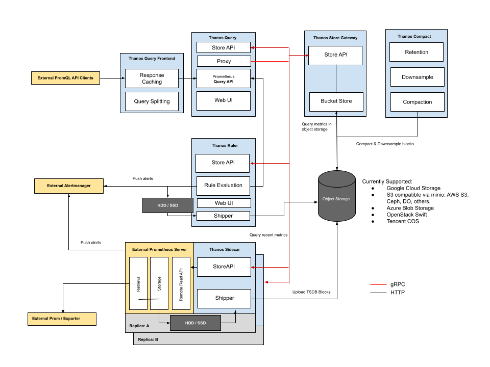

需要与官方图一致时，打开 [Thanos README → Architecture Overview](https://github.com/thanos-io/thanos/blob/main/README.md#architecture-overview)，把图另存为上述文件名即可（离线阅读依赖本地图片）。

**组件简介：**

**1、Sidecar（和 Prometheus 同一个 Pod）**

和 Prometheus 共用一块 TSDB 数据盘。一般干三件事：

- 用 gRPC 的 Store API 把「本机刚写完、还没上传」的数据提供给 Querier（查最近几小时主要靠它）。
- 块写满封闭后，上传到对象存储（长期历史靠它）。
- reloader：把模板里的 `$(POD_NAME)` 渲染成真正的 `prometheus.yaml`。

上线后重点看：上传有没有报错（权限、地址、网络），块大小和保留时间是否和下文 YAML 一致。详见 [Sidecar](https://thanos.io/tip/components/sidecar.md/)。

**2、Querier（统一查询入口）**

Grafana、脚本、人工排障，HTTP 请求都打 Querier，Querier 会向所有已注册的 Store（Sidecar、Store Gateway、Receiver 等）要数据，再拼成一份结果。

注意两点：**双副本去重**依赖 Prometheus `external_labels` 里用固定**键名**区分副本（本文用 `replica`，值为 `$(POD_NAME)` 渲染后的 Pod 名），Querier 用 `--query.replica-label` 填**同一个键名**；Query UI（v0.41）勾选 **Use Deduplication** 才能把两条线合成一条。**为什么要一致、键与值分别是什么**见 **T4.12.1.1**；UI 其它选项见 **T4.12.4**「Query 页各选项含义」。另：用 DNS 自动发现时，Headless Service 里 Store API 的端口名要叫 `grpc`。负载高可以多起几个 Querier 副本。详见 [Query](https://thanos.io/tip/components/query.md/)。

查询量特别大时，可再加 [Query Frontend](https://thanos.io/tip/components/query-frontend.md/) 做缓存和拆分，本文不写部署清单，避免和入门路径混在一起。

**3、Store Gateway（只读桶里的老数据）**

不负责抓取。它根据桶里块的元数据，决定读哪些对象，再通过 Store API 把「冷数据」交给 Querier。数据量大时要调内存和缓存（见 **T4.12.6**），必要时按区域或桶前缀拆多套 Store。详见 [Store](https://thanos.io/tip/components/store.md/)。

**4、Compactor（整理桶里的数据，只能跑一个）**

对**同一个桶**做合并块、降采样、执行保留策略。官方要求：**同一个桶不要并行跑多个 Compactor**，否则可能把数据弄坏。Kubernetes 里保持 `replicas: 1`，并确认没有另一套环境误连同一个桶。平时看压缩是否积压、本地工作目录磁盘是否够。详见 [Compact](https://thanos.io/tip/components/compact.md/)。

**5、Receiver（remote_write，可选）**

接 Prometheus 的 remote_write，本地落盘，可选再上传桶，也提供 Store API。适合已经和 remote write 体系绑定的团队；要高可用、磁盘和 hashring 设计，见 **T4.12.8** 与 [Receive](https://thanos.io/tip/components/receive.md/)。和 Sidecar 重复写同一批业务指标前，必须有明确分工，默认不要混用。

**6、Ruler（可选）**

在 Thanos 这边跑记录规则/告警规则，数据从 Querier 来，链路比「Prometheus 本机算规则」长。默认仍建议：**规则在各 Prometheus 上算，告警走 T4.11**（**T4.12.3** 里已示例用 `alert_relabel_configs` 去掉 `replica`，避免双副本重复告警）。只有确实要跨集群、全局一条规则时再上 Ruler。详见 [Rule](https://thanos.io/tip/components/rule.md/)。

**7、Bucket Web（可选）**

在页面上看桶里有哪些块、时间范围等，方便排障，不参与正常查询链路。详见 [Bucket](https://thanos.io/tip/components/tools.md/#bucket-web)。

### T4.12.1、数据怎么流动（写、查、告警）

**写入**

- 抓取和规则仍在 Prometheus 里跑，`scrape_configs` 从 **T4.4～T4.8** 整段贴进模板。
- 数据先写本地 TSDB；块按 2h 封闭后，Sidecar 上传到对象存储（**T4.12.6** 给 Sidecar 配上 `--objstore` 之后）。
- 桶里块多了，由 Compactor 做合并和降采样。

**怎么验收**：对象存储里是否出现 Thanos 相关对象；Sidecar 日志里是否还有持续上传失败。

**查询**

- 对外只暴露 Querier；Grafana 里填例如 `http://thanos-querier.kube-mon.svc.cluster.local:9090`。
- 查最近的数据，主要靠 Sidecar；查很久以前的数据，主要靠 Store Gateway 读桶。
- 打开 Querier UI 顶部导航里的 **Endpoints**（路由多为 `/stores`，对应 API `/api/v1/stores`；**导航文字不叫「Stores」**）：应能看到每个 Prometheus 上的 Sidecar，以及接上桶之后的 Store Gateway 等。缺哪一类，就查 DNS、标签 `thanos-store-api`、网络策略。

**告警**

- 规则仍在 Prometheus 里算，Alertmanager 仍是 **T4.11** 的 `alertmanager:9093`。
- 两个副本会各算一遍规则，要靠 `alert_relabel_configs` 去掉 `replica`，Alertmanager 才只收一条。
- 若再加 Ruler 也往同一个 Alertmanager 推，要自己配好路由和标签，避免重复通知。

### T4.12.1.1、副本标签

**背景**：**T4.12.3** 里用 StatefulSet 起 **两个 Prometheus**，它们抓取同一批 target，写出来的时间序列几乎一样。若没有额外区分，Thanos Querier 会把两边当成两套无关数据，**图里同一条指标可能出现两条线**（或查询语义混乱）。

**`external_labels` 干什么用**：Prometheus 在把样本写入 TSDB 前，会给每条序列加上 **全局标签**。其中 **`cluster`** 用来标识「哪套集群」（多集群联邦时尤其重要）。**副本维度**用另一个标签：本文**标签名（键）**固定写 **`replica`**，**标签值**必须是「这一副本独有的字符串」，这样两个 Pod 写出来的同一条逻辑指标，只在 **`replica` 的值**上不同。

**`replica` 和 `$(POD_NAME)` 谁是谁**：二者不是同一类东西。

| 写法 | 含义 |
|------|------|
| **`replica`** | **标签的键名（key）**，出现在 `external_labels:` 下面左侧。Querier 的 `--query.replica-label` 指的就是这个**键名**。 |
| **`$(POD_NAME)`** | 模板里的**占位符**。Sidecar reloader 做环境变量替换后，会变成当前 Pod 的名字，例如 **`prometheus-0`、`prometheus-1`**。那才是 **`replica` 标签的值（value）**。 |

渲染后在配置里等价于：

```yaml
external_labels:
  cluster: cluster1
  replica: prometheus-0   # 在 prometheus-1 上则是 prometheus-1
```

**`--query.replica-label=replica` 干什么用**：Querier 从多个 Store / Sidecar 拉数据时，若你在 UI 里打开 **deduplication（去重）**，它会认为：除了配置里指定的这条 **「副本标签」** 以外，其它标签都相同的序列，属于**同一逻辑序列的高可用副本**，可以合并成一条展示。**`--query.replica-label` 的值必须是 Prometheus `external_labels` 里那条「用来区分第几个 Prometheus」的标签键名**。本文都写 **`replica`**，所以 Querier 写 **`--query.replica-label=replica`**。

**为什么要一致**：若 Prometheus 加的键是 **`replica`**，而 Querier 写成 **`--query.replica-label=replica_id`**（或任意别的键名），Querier **认不出**哪一个是「副本维度」，**去重不会对上**，双副本时仍可能两条线或合并错误。键名可以改成别的（例如 `prometheus_replica`），但两边必须**同一个字符串**。

**和告警的关系**：两个副本各自算规则，告警里也会带上 **`replica`**。**T4.12.3** 里用 `alert_relabel_configs` **删掉 `replica`**，是为了让 Alertmanager 把两条几乎相同的告警合成一条通知；删的是**标签键**为 `replica` 的那一项，与 Querier 去重是同一套「副本维度」概念。

**小结**：**`replica`** = 标签键；**`$(POD_NAME)`** → 渲染后的 Pod 名 = 该键的值；**`--query.replica-label`** = 告诉 Querier「副本维度用的是哪一个键」，须与 Prometheus 里 **`external_labels` 的键名**一致。

### T4.12.2、上生产前核对清单

- 对象存储：优先云厂商 S3 兼容或你们已运维好的兼容存储；连接信息只放 Secret；桶权限最小化。
- Compactor：同一个桶只跑一个 Compactor；CPU 和本地盘给够，看压缩是否跟得上。
- 标签：`external_labels.cluster` 在多集群里不重复；**副本维度的标签键名**与 Querier `--query.replica-label` 一致（含义见 **T4.12.1.1**）。
- 从 T4.2.1 迁过来：先备份 ConfigMap；删掉 Deployment 版 `prometheus`，避免和 StatefulSet 同名；StorageClass 用你们集群真实的，不要照抄示例里的 `openebs-jiva-default`。
- RBAC：T4.2.1 若已建过同名 ClusterRole/Binding 且规则一样，不必再 apply 一遍。
- 日志：平时用 `info`，临时改 `debug` 查完记得改回。
- 安全：Prometheus 的 `--web.enable-admin-api` 不要暴露到不可信网络；Thanos/Prometheus 的 HTTP、gRPC 按你们习惯加 NetworkPolicy 或等价隔离。

### T4.12.3、Sidecar 与双副本 Prometheus

**本节假设**

- 命名空间：`kube-mon`
- 用 StatefulSet 起 2 个 Prometheus 副本，每个 Pod 里：Prometheus + Thanos Sidecar
- 告警仍用 **T4.11** 的 Alertmanager

RBAC 与 **T4.2.1** 一致（Ingress 只用 `networking.k8s.io`，不要再用已废弃的 `extensions`）。

`rbac.yaml`（与 T4.2.1 的 `prometheus-rbac.yaml` 相同；若集群里已有，可不再 apply）：

```yaml
apiVersion: v1
kind: ServiceAccount
metadata:
  name: prometheus
  namespace: kube-mon
---
apiVersion: rbac.authorization.k8s.io/v1
kind: ClusterRole
metadata:
  name: prometheus
rules:
  - apiGroups: [""]
    resources: ["nodes", "services", "endpoints", "pods", "nodes/proxy"]
    verbs: ["get", "list", "watch"]
  - apiGroups: ["networking.k8s.io"]
    resources: ["ingresses"]
    verbs: ["get", "list", "watch"]
  - apiGroups: [""]
    resources: ["configmaps", "nodes/metrics"]
    verbs: ["get"]
  - nonResourceURLs: ["/metrics"]
    verbs: ["get"]
---
apiVersion: rbac.authorization.k8s.io/v1
kind: ClusterRoleBinding
metadata:
  name: prometheus
roleRef:
  apiGroup: rbac.authorization.k8s.io
  kind: ClusterRole
  name: prometheus
subjects:
  - kind: ServiceAccount
    name: prometheus
    namespace: kube-mon
```

`configmap.yaml` 说明：

- Sidecar 读 `prometheus.yaml.tmpl`，用环境变量替换后生成真正的 `prometheus.yaml`。
- 必须把 **T4.4～T4.8** 里已经验证过的整段 `scrape_configs` 贴进下面占位（含 `kubernetes-nodes`、`kubernetes-endpoints` 等），**不要留 `......`**，否则迁完会丢抓取目标。
- `cluster` 改成你们集群唯一名字；`external_labels` 下 **`replica:` 是标签键名**，**`$(POD_NAME)` 是标签值的模板**（渲染成 `prometheus-0` 等）；Querier 的 **`--query.replica-label` 必须与这个键名一致**（本文均为 `replica`）。详见 **T4.12.1.1**。
- 保留时间写在配置里的 `storage` 段（Prometheus 3.x 推荐），不要再用已弃用的 `--storage.tsdb.retention.time` 命令行。

```yaml
apiVersion: v1
kind: ConfigMap
metadata:
  name: prometheus-config
  namespace: kube-mon
data:
  prometheus.yaml.tmpl: |
    global:
      scrape_interval: 15s
      scrape_timeout: 10s
      evaluation_interval: 15s
      external_labels:
        cluster: ydzs-test
        replica: $(POD_NAME)

    storage:
      tsdb:
        retention:
          time: 6h

    rule_files:
      - /etc/prometheus/rules/*rules.yaml

    alerting:
      alert_relabel_configs:
        - regex: replica
          action: labeldrop
      alertmanagers:
        - scheme: http
          path_prefix: /
          static_configs:
            - targets: ['alertmanager:9093']

    scrape_configs:
      # 将 T4.4～T4.8 中已验证的 scrape_configs 整段粘贴到这里（保持缩进）
      - job_name: 'prometheus'
        static_configs:
          - targets: ['localhost:9090']
```

`rules-configmap.yaml`：示例规则对齐 **T4.8** 的 kube-state-metrics。若抓取未开 `honor_labels`，命名空间标签往往是 `exported_namespace`，下面注解已按此写；若你已开 `honor_labels: true`，把注解里的 `exported_namespace` 改成 `namespace`。

```yaml
apiVersion: v1
kind: ConfigMap
metadata:
  name: prometheus-rules
  namespace: kube-mon
data:
  alert-rules.yaml: |-
    groups:
      - name: workload
        rules:
          - alert: DeploymentNoAvailableReplicas
            annotations:
              summary: Deployment {{ $labels.deployment }} 在 {{ $labels.exported_namespace }} 无可用副本
            expr: |
              kube_deployment_spec_replicas > 0
              and kube_deployment_status_replicas_available == 0
            for: 5m
            labels:
              team: node
          - alert: ContainerRestarted
            annotations:
              summary: Pod {{ $labels.pod }} 内容器 {{ $labels.container }} 发生重启（{{ $labels.exported_namespace }}）
            expr: |
              increase(kube_pod_container_status_restarts_total[15m]) > 0
            for: 2m
            labels:
              team: node
```

**Prometheus 启动参数**（与 [Sidecar](https://thanos.io/tip/components/sidecar.md/) 要求一致）

- `--web.enable-admin-api`、`--web.enable-lifecycle`：Sidecar 读元数据、触发热加载。
- `--storage.tsdb.min-block-duration` / `max-block-duration` 设为 2h：和块上传节奏一致；本地保留多久看 ConfigMap 里的 `storage.tsdb.retention.time`（示例 6h，可按磁盘改）。
- 镜像默认非 root，PVC 挂盘权限不对会起不来：用 initContainer 做 `chown`，做法同 **T4.2.1**。

`sidecar.yaml`：镜像版本见文首约定表；`storageClassName` 换成你们集群的；生产请加大磁盘，示例 2Gi 仅练习。

```yaml
apiVersion: apps/v1
kind: StatefulSet
metadata:
  name: prometheus
  namespace: kube-mon
  labels:
    app: prometheus
spec:
  serviceName: prometheus-headless
  replicas: 2
  selector:
    matchLabels:
      app: prometheus
      thanos-store-api: "true"
  template:
    metadata:
      labels:
        app: prometheus
        thanos-store-api: "true"
    spec:
      serviceAccountName: prometheus
      initContainers:
        - name: fix-data-dir-permissions
          image: busybox:1.37
          command: ["sh", "-c", "chown -R 65534:65534 /prometheus || true"]
          volumeMounts:
            - name: data
              mountPath: /prometheus
      volumes:
        - name: prometheus-config
          configMap:
            name: prometheus-config
        - name: prometheus-rules
          configMap:
            name: prometheus-rules
        - name: prometheus-config-shared
          emptyDir: {}
      containers:
        - name: prometheus
          image: prom/prometheus:v3.10.0
          imagePullPolicy: IfNotPresent
          args:
            - "--config.file=/etc/prometheus-shared/prometheus.yaml"
            - "--storage.tsdb.path=/prometheus"
            - "--storage.tsdb.no-lockfile"
            - "--storage.tsdb.min-block-duration=2h"
            - "--storage.tsdb.max-block-duration=2h"
            - "--web.enable-admin-api"
            - "--web.enable-lifecycle"
          ports:
            - name: http
              containerPort: 9090
          resources:
            requests:
              memory: "2Gi"
              cpu: "1"
            limits:
              memory: "2Gi"
              cpu: "1"
          volumeMounts:
            - name: prometheus-config-shared
              mountPath: /etc/prometheus-shared/
            - name: prometheus-rules
              mountPath: /etc/prometheus/rules
            - name: data
              mountPath: "/prometheus"
        - name: thanos
          image: thanosio/thanos:v0.41.0
          imagePullPolicy: IfNotPresent
          args:
            - sidecar
            - --log.level=info
            - --tsdb.path=/prometheus
            - --prometheus.url=http://localhost:9090
            - --reloader.config-file=/etc/prometheus/prometheus.yaml.tmpl
            - --reloader.config-envsubst-file=/etc/prometheus-shared/prometheus.yaml
            - --reloader.rule-dir=/etc/prometheus/rules/
          ports:
            - name: http-sidecar
              containerPort: 10902
            - name: grpc
              containerPort: 10901
          env:
            - name: POD_NAME
              valueFrom:
                fieldRef:
                  fieldPath: metadata.name
          resources:
            requests:
              memory: "2Gi"
              cpu: "1"
            limits:
              memory: "2Gi"
              cpu: "1"
          volumeMounts:
            - name: prometheus-config-shared
              mountPath: /etc/prometheus-shared/
            - name: prometheus-config
              mountPath: /etc/prometheus
            - name: prometheus-rules
              mountPath: /etc/prometheus/rules
            - name: data
              mountPath: "/prometheus"
  volumeClaimTemplates:
    - metadata:
        name: data
        labels:
          app: prometheus
      spec:
        storageClassName: openebs-jiva-default
        accessModes:
          - ReadWriteOnce
        resources:
          requests:
            storage: 2Gi
```

**Headless 说明**

- Prometheus StatefulSet 的 Headless 名为 `prometheus-headless`（与 `spec.serviceName` 一致），单 Pod 稳定 DNS 形如 `prometheus-0.prometheus-headless.kube-mon.svc.cluster.local`。
- 发现用 Service 名叫 `thanos-store-apis`，故意不和后面 Store Gateway 的 StatefulSet 名 `thanos-store-gateway` 混成一个名字。
- 打了标签 `thanos-store-api: "true"` 的 Pod（Sidecar、Store、Receiver 等）都会被这条 Service 收进来，Querier 只配这一条 DNS SRV 即可。

`discovery.yaml`：StatefulSet 要求 `serviceName` 对应的 Headless Service 必须先存在。下面有两个 Service：给 Prometheus **StatefulSet 稳定网络身份**用的 Headless、给 Thanos Store API 发现用的（和 Store Gateway 那套 StatefulSet 不冲突）。

**与 T4.2.1 同名冲突说明**：若你已在 **T4.2.1** 创建过 Service **`prometheus`**（NodePort 等，会分配固定 `clusterIP`），**不能**再用同名清单把该 Service 改成 Headless（`clusterIP: None`），API 会报 `spec.clusterIPs[0]: Invalid value: []string{"None"}: may not change once set`。本文 Headless 使用独立名称 **`prometheus-headless`**，与上文 `sidecar.yaml` 里 `serviceName` 一致；**T4.2.1 的 Service `prometheus` 可保留**，继续给浏览器 / Grafana 用 `http://prometheus.kube-mon.svc.cluster.local:9090`（selector 仍是 `app: prometheus` 即可）。

```yaml
apiVersion: v1
kind: Service
metadata:
  name: prometheus-headless
  namespace: kube-mon
spec:
  type: ClusterIP
  clusterIP: None
  ports:
    - name: http
      port: 9090
      targetPort: http
  selector:
    app: prometheus
---
apiVersion: v1
kind: Service
metadata:
  name: thanos-store-apis
  namespace: kube-mon
spec:
  type: ClusterIP
  clusterIP: None
  ports:
    - name: grpc
      port: 10901
      targetPort: grpc
  selector:
    thanos-store-api: "true"
```

**部署顺序**

还没接对象存储时，Sidecar 可能报上传相关错误，可以先不配 `--objstore`，等 **T4.12.6** 再补上。

```bash
kubectl apply -f rbac.yaml
kubectl apply -f configmap.yaml
kubectl apply -f rules-configmap.yaml
kubectl apply -f discovery.yaml
kubectl apply -f sidecar.yaml
kubectl get pods -n kube-mon -l app=prometheus
```

两副本就绪后，每个 Pod 应是 2/2（Prometheus + Sidecar）。

### T4.12.4、Querier

查数只走 Querier，不要再去负载均衡两个 Prometheus。

Querier 用 DNS SRV 自动发现所有带 Store API 的组件（Sidecar、Store Gateway、Receiver 等）。Headless Service 里端口名必须叫 `grpc`，这样 SRV 记录才是 `_grpc._tcp...` 形式。

**与 Thanos v0.41+ 对齐（Breaking）**：自 **v0.41** 起，Query 已**删除**静态指定后端的 **`--store`**（以及 `--rule`、`--exemplar` 等旧写法），统一改用 **`--endpoint`**（可重复传递多个地址；仍支持 `dns+`、`dnssrv+` 前缀）。旧清单若仍写 `--store`，进程会直接报错：`unknown long flag '--store'`。依据见上游 [CHANGELOG / #7890](https://github.com/thanos-io/thanos/pull/7890)；本仓库文首镜像约定既为 `v0.41.0`，下列 YAML 已按 **`--endpoint`** 编写。若你暂时卡在更老的 Thanos 镜像，需对照该版本 `thanos query --help`，或升级镜像与本文一致。

`querier.yaml`：

```yaml
apiVersion: apps/v1
kind: Deployment
metadata:
  name: thanos-querier
  namespace: kube-mon
  labels:
    app: thanos-querier
spec:
  selector:
    matchLabels:
      app: thanos-querier
  template:
    metadata:
      labels:
        app: thanos-querier
    spec:
      containers:
        - name: thanos
          image: thanosio/thanos:v0.41.0
          args:
            - query
            - --log.level=info
            - --query.replica-label=replica
            - --endpoint=dnssrv+_grpc._tcp.thanos-store-apis.kube-mon.svc.cluster.local
          ports:
            - name: http
              containerPort: 10902
            - name: grpc
              containerPort: 10901
          resources:
            requests:
              memory: "2Gi"
              cpu: "1"
            limits:
              memory: "2Gi"
              cpu: "1"
          livenessProbe:
            httpGet:
              path: /-/healthy
              port: http
            initialDelaySeconds: 10
          readinessProbe:
            httpGet:
              path: /-/ready
              port: http
            initialDelaySeconds: 15
---
apiVersion: v1
kind: Service
metadata:
  name: thanos-querier
  namespace: kube-mon
  labels:
    app: thanos-querier
spec:
  ports:
    - port: 9090
      protocol: TCP
      targetPort: http
      name: http
  selector:
    app: thanos-querier
  type: NodePort
```

参数说明：

- `--endpoint=dnssrv+_grpc._tcp.thanos-store-apis.kube-mon.svc.cluster.local`：静态注册的 Store API（Sidecar 等）发现地址；须与 **T4.12.3** 里 Headless 名称、命名空间一致；你改了名字这里要一起改。多个后端可写多条 `--endpoint=...`。**勿**再使用已移除的 `--store`（v0.41+）。
- `--query.replica-label=replica`：填的是 **Prometheus `external_labels` 里「副本维度」的标签键名**（本文键名为 `replica`，不是 Pod 名）。须与 ConfigMap 模板里 `replica: $(POD_NAME)` 的**左侧键名**一致。Query UI 勾选 **Use Deduplication**（或 API `dedup=true`）后，才按该键合并双副本曲线。原理见 **T4.12.1.1**；界面其它开关见本节下 **「Query 页各选项含义」**。

```bash
kubectl apply -f querier.yaml
kubectl get pods -n kube-mon -l app=thanos-querier
kubectl get svc -n kube-mon -l app=thanos-querier
```

用 NodePort 或 `kubectl port-forward svc/thanos-querier 9090:9090 -n kube-mon` 打开 Query UI。

**Store 列表在哪（v0.41 容易找错）**：顶部导航第二项在源码里叫 **Endpoints**（链接到 **`/stores`**），**不会显示「Stores」字样**。若你从 **Graph** 进来，点顶栏 **Endpoints** 即可看到 Querier 当前认识的所有 Store API 端点（Sidecar、Store Gateway 等）。窄屏时导航收成「汉堡菜单」，要先展开。也可直接访问 `http://<Querier>:<NodePort>/stores`（若前面有 `web.route-prefix` 或反代路径前缀，需把前缀加在 `/stores` 前）。

**和「Enable Store Filtering」里两个地址的关系**：勾选 **Enable Store Filtering** 后，查询面板里的 **Store Filter** 下拉选项（例如 `172.20.37.237:10901`、`172.20.202.232:10901`）来自**同一份** `/api/v1/stores` 数据，只是嵌在 Graph 页里做查询过滤；**并不是没有独立列表页**——完整列表在 **Endpoints** 页，Filter 里只是多选子集。

下文 **Query 主界面**按 **Thanos v0.41.x**（镜像 `thanosio/thanos:v0.41.0`）说明。上游会持续合并 Prometheus 查询页改动，**若你界面文案与下表略有出入，以当前镜像 UI 为准**。

**官方文档为什么「不像界面说明书」**：[Query 组件文档](https://github.com/thanos-io/thanos/blob/v0.41.0/docs/components/query.md)写的是 **HTTP API**（如 `dedup`、`partial_response`、`storeMatch[]`、`engine`）和 **启动参数**，一般不画 Web 布局图。界面上的勾选项是把这些参数**填进 POST body / 请求头**。**与 v0.41.0 源码的对应关系**（便于你自行核对、升级后 diff）：

| 你在界面上点的 | v0.41.0 前端实现要点（Thanos 仓库） |
|----------------|--------------------------------------|
| 顶栏 **Use local time** 等 5 项 | `PanelList.tsx`：`useLocalStorage` 存浏览器本地，控制 **图形时间轴用本地时区**、是否拉 `/api/v1/stores` 进面板、是否启用历史/补全/高亮/Linter；**不直接改 Querier 服务端配置**。 |
| **Execute** | `Panel.tsx` → `POST` `/api/v1/query` 或 `/api/v1/query_range`，表单里带 `dedup`、`partial_response`、`storeMatch[]`、`engine`、`analyze` 等。 |
| **Explain** | `Panel.tsx` → `GET`（带 query string）`/api/v1/query_explain` 或 `/api/v1/query_range_explain`，参数与上面同类；返回**解释/分析结构**，不是替代 Execute 的数值结果。 |
| **Use Deduplication / Use Partial Response** | 同上，映射为表单字段 **`dedup`**、**`partial_response`**（与官方文档表格一致）。 |
| **Force Tracing** | 勾选后对该次请求加 HTTP 头 **`X-Thanos-Force-Tracing: true`**（见 `Panel.tsx`）；响应里可取 **`X-Thanos-Trace-ID`**。**不是**「Prometheus / Thanos 引擎」切换；若你界面上曾看成「Force Tracing Engine」，多半是 **Force Tracing** 与 **Engine** 两行靠在一起误读。 |
| **Prometheus / Thanos**（Engine） | 映射为表单字段 **`engine`**，与 `--query.promql-engine` 默认值一致；选 Prometheus 时源码里会关掉 **Analyze** 勾选能力。 |
| **Enable Store Filtering** | `PanelList.tsx`：仅当勾选时才把 **`/api/v1/stores`** 的结果传给各 Panel；**不勾选时面板侧 Store 列表为空，不出现「Store Filter」多选**，请求里也不会带 `storeMatch[]`（即仍向 Querier 已注册的全部 Store 扇出）。 |

因此：**下表描述的是「勾选后在协议层等价于什么」**，与官方文档一致；**不是**臆测布局，而是以 **v0.41.0** 的 `pkg/ui/react-app/src/pages/graph/PanelList.tsx`、`Panel.tsx`、`GraphControls.tsx` 为准。**旧教程只写「Graph + 去重」已不足以描述当前 UI**。

#### T4.12.4.1、Query 页各选项含义（v0.41.0）

**时间与展示习惯**

| 界面要素 | 含义 | 生产上怎么用 |
|----------|------|----------------|
| **Time**（时间范围 / 结束时刻 / 步长 step） | 与原生 Prometheus 一致：**瞬时查询**看「某一时刻」；**范围查询**要起止时间与 **step**（分辨率）。Thanos 还会参与 **降采样** 相关行为（见官方 `max_source_resolution`）。 | 排障先选最近 1h；看长期趋势再拉大窗口。step 过小会加重 Store 与 Querier 负载。 |
| **Table \| Graph** | **Graph**：折线/多序列曲线；**Table**：当前时刻或范围内的数值表。 | 看图做趋势；需要精确对比标签组合时用 Table。 |
| **Use local time** | 时间轴、时间戳按**浏览器本地时区**显示；关闭则多用 **UTC**。 | 值班习惯本地时间可开；写文档、对日志（常 UTC）可对齐关。 |

**编辑器与体验（不改变数据，只改变你怎么写查询）**

| 界面要素 | 含义 | 生产上怎么用 |
|----------|------|----------------|
| **Enable query history** | 开启后把执行过的查询写入浏览器 **localStorage**（键 `history`，最多约 50 条），输入框可复用；**关则不上历史列表**（纯前端行为，与 Querier 无关）。 | 可开；共享工作站或敏感环境建议关或清站点数据。 |
| **Enable autocomplete** | 输入时提示 metric / 标签名。 | 建议开，减少手误。 |
| **Enable highlighting** | PromQL **语法高亮**。 | 建议开，可读性更好。 |
| **Enable Linter** | 对当前表达式做**静态检查/提示**（如可疑写法）。 | 建议开；**Linter 通过也不代表查询一定省资源**。 |
| **查询框旁的 Execute \| Explain** | **Execute**：真正发起查询，返回指标结果。**Explain**：展示表达式**如何被解析/规划**（查询计划类信息），用于理解求值结构；**不替代 Execute 的数值结果**。具体展示与所选引擎有关。 | 日常用 **Execute**；慢查询或结果不符合预期时，用 **Explain** 辅助分析（与官方引擎演进相关，勿与「告警规则 explain」混为一谈）。 |

**与 Thanos 数据面直接相关的开关（最重要）**

| 界面要素 | 含义 | 生产上怎么用 |
|----------|------|----------------|
| **Use Deduplication** | 对应 API 参数 **`dedup`**：是否按 Querier 配置的 **`--query.replica-label`**（本文 `replica`）对 HA 副本做**去重合并**（见文档 **T4.12.1.1**）。关：每个 Prometheus 副本各一条序列；开：合成一条并填缝。 | **双副本 Prometheus + Sidecar 场景建议常开**；调试「到底哪个副本在吐数」时可临时关。Grafana 走同一 Querier 时，去重由数据源 URL 参数或数据源版本决定，未必与你在 Web UI 勾的一致。 |
| **Use Partial Response** | 对应 **`partial_response`**：某个 Store/Sidecar **超时或报错**时，是**带 warning 返回其它 Store 能拿到的部分结果**（偏可用），还是整体更偏失败（偏严格）。与 `--query.partial-response` 默认值、Store 超时等配合，见 [Query 文档 · Partial Response](https://github.com/thanos-io/thanos/blob/v0.41.0/docs/components/query.md#partial-response)。 | **多数生产会先开**：避免单个副本抖动导致整页空；**金融级强一致**场景再评估关，并接受可用性下降。注意响应里的 **Warnings**。 |
| **Enable Store Filtering** | **勾选**：前端会去拉 **`/api/v1/stores`** 并在每个查询面板里显示 **Store Filter** 多选；你选的 Store 会转成请求里的 **`storeMatch[]`**（与 [store matchers](https://github.com/thanos-io/thanos/blob/v0.41.0/docs/components/query.md#store-matchers) 一致）。**不勾选**：不向面板注入 Store 列表，**不出现** Filter 控件，请求**不带** `storeMatch[]`，Querier 仍对**已注册的全部 Store** 扇出。 | **日常建议关**（少误操作、也少依赖 stores API）；**排障单 Store** 时再开。 |
| **Thanos \| Prometheus**（Engine） | 选用 **Thanos 实验性 PromQL 引擎**还是**经典 Prometheus 引擎**，请求体字段 **`engine`**，与 **`--query.promql-engine`**（及 distributed 模式下默认）一致，见 [Query 文档 · Thanos PromQL Engine](https://github.com/thanos-io/thanos/blob/v0.41.0/docs/components/query.md#thanos-promql-engine-experimental)。 | **生产默认可保持 Prometheus**；切 Thanos 引擎前先在非生产验证。 |
| **Analyze**（与 Engine 同区，**仅 Thanos 引擎时可选**） | 源码中与 **`analyze`** 查询参数一起提交；选 **Prometheus** 引擎时该勾选会被禁用（`Panel.tsx` 中 `disableAnalyzeCheckbox`）。用于在 Thanos 引擎路径上请求**额外分析信息**（具体字段随版本以响应 JSON 为准）。 | 默认关；**性能排障、验证 Thanos 引擎**时再开。勿与 **Explain** 按钮混淆：Explain 走 **`/api/v1/query_explain`** 系列端点。 |
| **Force Tracing**（v0.41.0 源码字面；**不是**引擎开关） | 勾选后对本请求设置 **`X-Thanos-Force-Tracing: true`**，在 Querier **已配置 tracing** 时促使采集本次查询链路 trace；响应可带 **`X-Thanos-Trace-ID`**。背景见 [#6311](https://github.com/thanos-io/thanos/issues/6311)、[#6770](https://github.com/thanos-io/thanos/pull/6770)。 | **未接追踪后端时通常无效果**。生产默认关；排障慢查询时临时开。 |

**和旧描述的对照**：以前常说「去重开/关对比两条线」——在 v0.41 上请认准界面 **Use Deduplication**，且同一面板可能还有 **Partial Response、Store Filtering、引擎** 等，**不要只记 Graph**。

**Grafana**（见 **T4.9**）：数据源填集群内 `http://thanos-querier.kube-mon.svc.cluster.local:9090`；Grafana 在集群外时再用 NodePort 或 Ingress，安全要求与 T4.9 一致。保存后点 Save & test。Grafana Explore 的选项与 Thanos 自带 Web UI **不是同一套界面**，但访问的是同一 Query API。

**生产习惯**：Querier Service 常改成 ClusterIP，只给集群内或受控 Ingress 用；**不要把带租户头、无鉴别的 Query UI 直接暴露给不可信用户**（见 [Query 文档 · tenant](https://github.com/thanos-io/thanos/blob/v0.41.0/docs/components/query.md) 安全提示）。**Endpoints** 页（`/stores`）里长期缺某个 Sidecar 时，先查对应 Prometheus Pod、Headless 的 SRV 解析、是否刚扩缩容。多集群联邦见官方 [Query](https://thanos.io/tip/components/query.md/)。

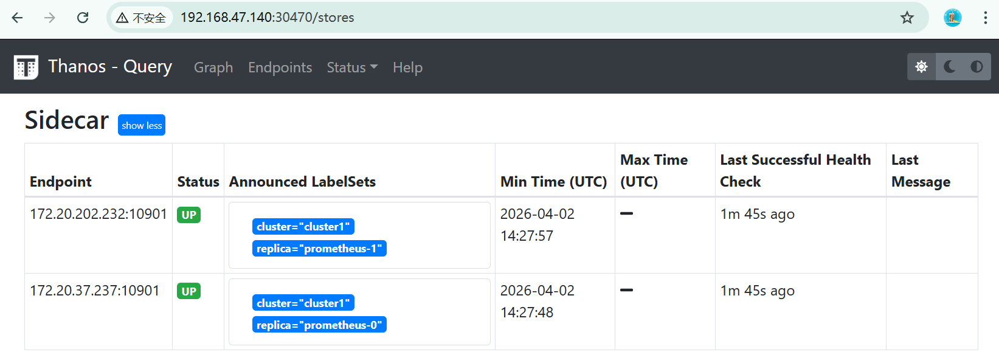

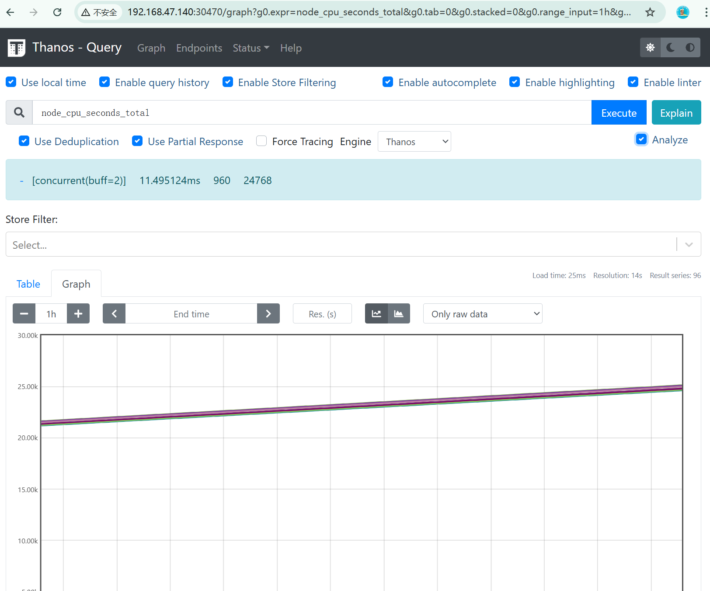

### T4.12.5、告警与 Ruler 怎么选

**默认做法**

规则仍在各 Prometheus 副本上算，告警走 **T4.11**。**T4.12.3** 里已示例用 `alert_relabel_configs` 去掉 `replica`，避免两个副本各推一条重复告警。

**简单验收**

任选一个 Deployment，执行 `kubectl scale deploy/<name> --replicas=0 -n <ns>`，等 **T4.12.3** 里 `DeploymentNoAvailableReplicas` 的 `for` 时间走完，在 Alertmanager 或 **T4.11.2.2** 的钉钉/企微应收到告警；副本调回后应恢复。

**插图槽位**：`docs/prometheus/images/t4-12-alert-deployment-down.png`（打码）

**何时用 Thanos Ruler**

只有当你必须用「对着 Querier、跨副本或跨集群的一条规则」时再上。链路是 Ruler → Querier → Sidecar → Prometheus，中间任一环节不稳，告警都会跟着抖。部署时要配：`--query` 指 Querier，`--alertmanagers.url` 指 T4.11，规则和对象存储按 [Ruler](https://thanos.io/tip/components/rule.md/) 与 [Releases](https://github.com/thanos-io/thanos/releases/tag/v0.41.0) 来。

### T4.12.6、对象存储与 Store Gateway

**Sidecar 和 Store 分工**

- Sidecar：只上传「本机已经封闭」的块。
- Store Gateway：只从桶里读块，交给 Querier。
- 二者共用同一个 Secret 里的 `thanos.yaml`，但干的活不一样：没有 Store，只能查 Prometheus 本地还保留的那段时间；没有 Sidecar 上传，桶里不会有新数据。

**生产环境**

优先云厂商 S3 兼容（OSS、COS、S3 等），endpoint、区域、TLS、加密按云文档来；密钥用 Secret 或云上的工作负载身份，不要把 `access_key` 写进 Git。存储类型与字段见 [对象存储配置](https://thanos.io/tip/thanos/storage.md/)。上线后看：Querier **Endpoints**（`/stores`）是否出现 Store Gateway、桶里对象是否在涨、Sidecar 是否还在报上传错。

**练习环境**

下面用 MinIO 演示。若 MinIO 策略有变，可换 [RustFS](https://rustfs.com/) 等 S3 兼容产品，Thanos 仍按 S3 填 endpoint 和密钥。镜像 tag 见文首约定表，安全更新见 [MinIO Releases](https://github.com/minio/minio/releases/latest)。

#### T4.12.6.1、MinIO（练习用，独立 namespace）

资源都放在命名空间 `minio`。生产请把 root 账号口令改成 Secret；示例里明文只为跟练方便。

`minio-deploy.yaml`：

```yaml
apiVersion: apps/v1
kind: Deployment
metadata:
  name: minio
  namespace: minio
  labels:
    app: minio
spec:
  selector:
    matchLabels:
      app: minio
  strategy:
    type: Recreate
  template:
    metadata:
      labels:
        app: minio
    spec:
      volumes:
        - name: data
          persistentVolumeClaim:
            claimName: minio-pvc
      containers:
        - name: minio
          image: minio/minio:RELEASE.2025-10-15T17-29-55Z
          args: ["server", "/data", "--console-address", ":9001"]
          env:
            - name: MINIO_ROOT_USER
              value: minio
            - name: MINIO_ROOT_PASSWORD
              value: minio123
          ports:
            - containerPort: 9000
            - containerPort: 9001
          volumeMounts:
            - name: data
              mountPath: /data
          readinessProbe:
            httpGet:
              path: /minio/health/ready
              port: 9000
            initialDelaySeconds: 20
            periodSeconds: 10
          livenessProbe:
            httpGet:
              path: /minio/health/live
              port: 9000
            initialDelaySeconds: 30
            periodSeconds: 10
```

`minio-pvc.yaml`：

```yaml
apiVersion: v1
kind: PersistentVolumeClaim
metadata:
  name: minio-pvc
  namespace: minio
spec:
  accessModes:
    - ReadWriteOnce
  resources:
    requests:
      storage: 10Gi
  storageClassName: openebs-jiva-default
```

`minio-svc.yaml`：API 用 9000；控制台 9001，按需再暴露。

```yaml
apiVersion: v1
kind: Service
metadata:
  name: minio
  namespace: minio
spec:
  type: ClusterIP
  ports:
    - name: api
      port: 9000
      targetPort: 9000
    - name: console
      port: 9001
      targetPort: 9001
  selector:
    app: minio
```

```bash
kubectl create namespace minio --dry-run=client -o yaml | kubectl apply -f -
kubectl apply -f minio-pvc.yaml
kubectl apply -f minio-deploy.yaml
kubectl apply -f minio-svc.yaml
```

控制台可执行：`kubectl port-forward svc/minio 9001:9001 -n minio`，用上面账号登录，新建 bucket `thanos`。外网暴露用你们自己的 Ingress 或 Gateway。

**插图槽位**：`docs/prometheus/images/t4-12-minio-bucket.png`

#### T4.12.6.2、Thanos 连接 MinIO 与 Store Gateway

`thanos-storage-minio.yaml`：MinIO 在命名空间 `minio` 时，endpoint 如下（若你改了名字或端口，这里要一起改）：

```yaml
type: s3
config:
  bucket: thanos
  endpoint: minio.minio.svc.cluster.local:9000
  access_key: minio
  secret_key: minio123
  insecure: true
  signature_version2: false
```

```bash
kubectl create secret generic thanos-objectstorage \
  --from-file=thanos.yaml=thanos-storage-minio.yaml -n kube-mon
```

Store Gateway 的 StatefulSet 需要同名 Headless Service（和 `serviceName` 一致）：

`store-gateway-discovery.yaml`：

```yaml
apiVersion: v1
kind: Service
metadata:
  name: thanos-store-gateway
  namespace: kube-mon
spec:
  type: ClusterIP
  clusterIP: None
  ports:
    - name: grpc
      port: 10901
      targetPort: grpc
  selector:
    app: thanos-store-gateway
```

`store.yaml`：

```yaml
apiVersion: apps/v1
kind: StatefulSet
metadata:
  name: thanos-store-gateway
  namespace: kube-mon
  labels:
    app: thanos-store-gateway
spec:
  replicas: 1
  selector:
    matchLabels:
      app: thanos-store-gateway
  serviceName: thanos-store-gateway
  template:
    metadata:
      labels:
        app: thanos-store-gateway
        thanos-store-api: "true"
    spec:
      containers:
        - name: thanos
          image: thanosio/thanos:v0.41.0
          args:
            - store
            - --log.level=info
            - --data-dir=/data
            - --objstore.config-file=/etc/secret/thanos.yaml
            - --index-cache-size=500MB
            - --chunk-pool-size=500MB
          ports:
            - name: http
              containerPort: 10902
            - name: grpc
              containerPort: 10901
          livenessProbe:
            httpGet:
              port: http
              path: /-/healthy
          readinessProbe:
            httpGet:
              port: http
              path: /-/ready
          volumeMounts:
            - name: store-data
              mountPath: /data
            - name: object-storage-config
              mountPath: /etc/secret
              readOnly: true
      volumes:
        - name: store-data
          emptyDir: {}
        - name: object-storage-config
          secret:
            secretName: thanos-objectstorage
```

```bash
kubectl apply -f store-gateway-discovery.yaml
kubectl apply -f store.yaml
kubectl get pods -n kube-mon -l thanos-store-api=true
```

Querier 的 **Endpoints**（`/stores`）应多出 Store Gateway。数据写入仍靠各 Prometheus Pod 里的 Sidecar：给 sidecar 容器挂上同样的 Secret，并追加下面参数（生产建议 Secret 只读挂载）：

```yaml
# 合并进 StatefulSet prometheus 的 thanos 容器：volumes / volumeMounts / args 追加
args:
  - sidecar
  - --log.level=info
  - --tsdb.path=/prometheus
  - --prometheus.url=http://localhost:9090
  - --reloader.config-file=/etc/prometheus/prometheus.yaml.tmpl
  - --reloader.config-envsubst-file=/etc/prometheus-shared/prometheus.yaml
  - --reloader.rule-dir=/etc/prometheus/rules/
  - --objstore.config-file=/etc/secret/thanos.yaml
```

apply 后等至少一个 2h 块上传，或看 sidecar 日志里 shipper 成功，再到 MinIO 里应能看到对象。

**插图槽位**：`docs/prometheus/images/t4-12-querier-stores-with-store.png`

### T4.12.7、Compactor

同一个桶只能跑一个 Compactor，不要扩成多副本抢同一桶。本地压缩工作目录示例用 `emptyDir`，规模大时按官方建议改成 PVC 或更大盘。

`compactor.yaml`：

```yaml
apiVersion: apps/v1
kind: StatefulSet
metadata:
  name: thanos-compactor
  namespace: kube-mon
  labels:
    app: thanos-compactor
spec:
  replicas: 1
  selector:
    matchLabels:
      app: thanos-compactor
  serviceName: thanos-compactor
  template:
    metadata:
      labels:
        app: thanos-compactor
    spec:
      containers:
        - name: thanos
          image: thanosio/thanos:v0.41.0
          args:
            - compact
            - --log.level=info
            - --data-dir=/data
            - --objstore.config-file=/etc/secret/thanos.yaml
            - --wait
          ports:
            - name: http
              containerPort: 10902
          livenessProbe:
            httpGet:
              port: http
              path: /-/healthy
            initialDelaySeconds: 10
          readinessProbe:
            httpGet:
              port: http
              path: /-/ready
            initialDelaySeconds: 15
          volumeMounts:
            - name: object-storage-config
              mountPath: /etc/secret
              readOnly: true
            - name: data
              mountPath: /data
      volumes:
        - name: object-storage-config
          secret:
            secretName: thanos-objectstorage
        - name: data
          emptyDir: {}
---
apiVersion: v1
kind: Service
metadata:
  name: thanos-compactor
  namespace: kube-mon
spec:
  clusterIP: None
  selector:
    app: thanos-compactor
  ports:
    - port: 10902
      name: http
```

```bash
kubectl apply -f compactor.yaml
kubectl get pods -n kube-mon -l app=thanos-compactor
```

到本节为止：双副本 Prometheus + Sidecar、Querier、对象存储、Store、Compactor，是一条常用的完整链路。更多组件见 [Thanos 入门](https://thanos.io/tip/thanos/getting-started.md/)。

### T4.12.8、Receiver（remote_write，可选）

Sidecar 是「块上传」；Receiver 是「Prometheus 用 remote_write 把数据推过来」。Receiver 适合采集和查询要拆开的架构，但要单独运维磁盘、高可用和 hashring。建议先把上文 Sidecar 链路跑稳，再考虑本节。

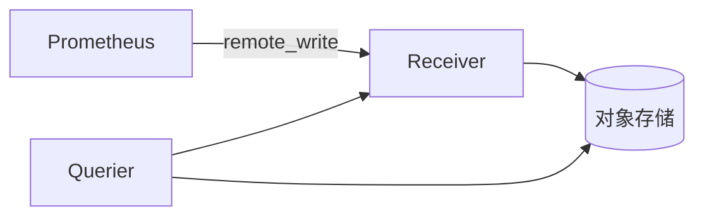
```mermaid
flowchart LR
  P[Prometheus] -->|remote_write| R[Receiver]
  R --> B[(对象存储)]
  Q[Querier] --> R
  Q --> B
```

多副本时要配 hashring，下面 `endpoints` 必须是带 `http://` 的完整地址。软租户、硬租户和 HTTP 头 `THANOS-TENANT` 见 [Receiver](https://thanos.io/tip/components/receive.md/)。

```json
[
  {
    "hashring": "tenant-a",
    "endpoints": [
      "http://tenant-a-1.metrics.local:19291/api/v1/receive",
      "http://tenant-a-2.metrics.local:19291/api/v1/receive"
    ],
    "tenants": ["tenant-a"]
  },
  {
    "hashring": "soft-default",
    "endpoints": ["http://thanos-receiver-0.thanos-receiver.kube-mon.svc.cluster.local:19291/api/v1/receive"]
  }
]
```

单副本示例与 **T4.12.6** 共用 Secret `thanos-objectstorage`。注意：Kubernetes 不会把环境变量展开进容器 `args`，所以 `--label` 和 `--receive.local-endpoint` 里写死了 `thanos-receiver-0` 的 DNS；以后要扩副本，必须改 hashring 和这些参数。

`receiver.yaml`：

```yaml
apiVersion: apps/v1
kind: StatefulSet
metadata:
  name: thanos-receiver
  namespace: kube-mon
  labels:
    app: thanos-receiver
spec:
  serviceName: thanos-receiver
  replicas: 1
  selector:
    matchLabels:
      app: thanos-receiver
  template:
    metadata:
      labels:
        app: thanos-receiver
        thanos-store-api: "true"
    spec:
      containers:
        - name: thanos
          image: thanosio/thanos:v0.41.0
          args:
            - receive
            - --log.level=info
            - --grpc-address=0.0.0.0:10901
            - --http-address=0.0.0.0:10902
            - --remote-write.address=0.0.0.0:19291
            - --receive.replication-factor=1
            - --objstore.config-file=/etc/secret/thanos.yaml
            - --tsdb.path=/var/thanos/receiver
            - --tsdb.retention=1d
            - --label=receive_replica=thanos-receiver-0
            - --receive.local-endpoint=thanos-receiver-0.thanos-receiver.kube-mon.svc.cluster.local:10901
          ports:
            - containerPort: 10901
              name: grpc
            - containerPort: 10902
              name: http
            - containerPort: 19291
              name: remote-write
          livenessProbe:
            httpGet:
              path: /-/healthy
              port: http
            periodSeconds: 30
          readinessProbe:
            httpGet:
              path: /-/ready
              port: http
            periodSeconds: 5
          volumeMounts:
            - name: data
              mountPath: /var/thanos/receiver
            - name: object-storage-config
              mountPath: /etc/secret
              readOnly: true
      volumes:
        - name: object-storage-config
          secret:
            secretName: thanos-objectstorage
  volumeClaimTemplates:
    - metadata:
        name: data
      spec:
        storageClassName: openebs-jiva-default
        accessModes: ["ReadWriteOnce"]
        resources:
          requests:
            storage: 20Gi
---
apiVersion: v1
kind: Service
metadata:
  name: thanos-receiver
  namespace: kube-mon
spec:
  clusterIP: None
  ports:
    - name: grpc
      port: 10901
      targetPort: grpc
    - name: http
      port: 10902
      targetPort: http
    - name: remote-write
      port: 19291
      targetPort: remote-write
  selector:
    app: thanos-receiver
```

```bash
kubectl apply -f receiver.yaml
```

Remote write 地址示例：`http://thanos-receiver.kube-mon.svc.cluster.local:19291/api/v1/receive`。在 **T4.12.3** 的 `prometheus.yaml.tmpl` 里增加（`scrape_configs` 仍须完整粘贴 T4.4～T4.8，不要省略号）：

```yaml
    remote_write:
      - url: http://thanos-receiver.kube-mon.svc.cluster.local:19291/api/v1/receive
```

Prometheus 仍可带 Sidecar，但只当 reloader 用（同 T4.12.3，去掉 `--objstore`），或换成你们自己的配置渲染方式。没设计好之前，不要让 Sidecar 和 Receiver 往桶里重复写同一批指标。

**验收**：Querier **Endpoints**（`/stores`）里出现 Receiver；Graph 能查到近期数据；过一段时间后桶里能看到 Receiver 上传的块。

**插图槽位**

- `docs/prometheus/images/t4-12-receiver-stores.png`
- `docs/prometheus/images/t4-12-remote-write-query.png`

## T4.13、Prometheus Adapter

Kubernetes 的核心优势之一是支持应用程序的水平弹性伸缩。**HorizontalPodAutoscaler（HPA）** 可根据资源使用指标（如 CPU、内存）或自定义业务指标自动调整 Pod 副本数量。

> **重要更新**：`autoscaling/v2` 已在 Kubernetes 1.23+ 中成为**稳定版本**，推荐生产环境使用。`autoscaling/v2beta1` 和 `autoscaling/v2beta2` 已被废弃，请勿在新项目中采用。

### T4.13.1、自定义指标

除了基于 CPU 和内存来进行自动扩缩容之外，我们还可以根据自定义的监控指标来进行。这时我们要用到 `Prometheus Adapter`，Prometheus 用于监控应用的负载和集群本身的各种指标，`Prometheus Adapter` 可以帮我们使用 Prometheus 收集的指标，然后加以利用来制定扩展策略，这些指标都是通过 APIServer 暴露的，而且 HPA 资源对象也可以很轻易地直接使用。

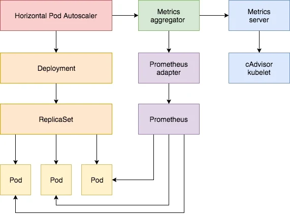

首先，我们部署一个示例应用，测试通过 Prometheus 收集指标自动缩放，资源清单文件如下所示（hpa-prome-demo.yaml）：

```yaml
apiVersion: apps/v1
kind: Deployment
metadata:
  name: hpa-prom-demo
spec:
  selector:
    matchLabels:
      app: nginx-server
  template:
    metadata:
      labels:
        app: nginx-server
    spec:
      containers:
        - name: nginx-demo
          image: cnych/nginx-vts:v1.0
          resources:
            limits:
              cpu: 50m
            requests:
              cpu: 50m
          ports:
            - containerPort: 80
              name: http
---
apiVersion: v1
kind: Service
metadata:
  name: hpa-prom-demo
  annotations:
    prometheus.io/scrape: "true"
    prometheus.io/port: "80"
    prometheus.io/path: "/status/format/prometheus"
spec:
  ports:
    - port: 80
      targetPort: 80
      name: http
  selector:
    app: nginx-server
  type: NodePort
```

这里我们部署的应用是在 80 端口的 `/status/format/prometheus` 这个端点暴露 nginx-vts 指标的，前面我们已经在 Prometheus 中配置了 Endpoints 的自动发现，所以我们直接在 Service 对象的 `annotations` 中进行配置，这样我们就可以在 Prometheus 中采集该指标数据了。为了测试方便，我们这里使用 NodePort 类型的 Service，现在直接创建上面的资源对象即可：

```bash
$ kubectl apply -f hpa-prome-demo.yaml
deployment.apps/hpa-prom-demo created
service/hpa-prom-demo created
$ kubectl get pods -l app=nginx-server
NAME                             READY   STATUS    RESTARTS   AGE
hpa-prom-demo-755bb56f85-lvksr   1/1     Running   0          4m52s
$ kubectl get svc
NAME            TYPE        CLUSTER-IP       EXTERNAL-IP   PORT(S)        AGE
hpa-prom-demo   NodePort    10.101.210.158   <none>        80:32408/TCP   5m44s
......
```

部署完成后我们可以使用如下命令测试应用是否正常，以及指标数据接口能否正常获取：

```bash
$ curl http://k8s.qikqiak.com:32408
<!DOCTYPE html>
<html>
......
</html>
$ curl http://k8s.qikqiak.com:32408/status/format/prometheus
......
nginx_vts_server_requests_total{host="*",code="1xx"} 0
nginx_vts_server_requests_total{host="*",code="2xx"} 32
nginx_vts_server_requests_total{host="*",code="3xx"} 0
nginx_vts_server_requests_total{host="*",code="4xx"} 0
nginx_vts_server_requests_total{host="*",code="5xx"} 0
nginx_vts_server_requests_total{host="*",code="total"} 32
nginx_vts_server_request_seconds_total{host="*"} 0.000
nginx_vts_server_request_seconds{host="*"} 0.000
......
```

上面的指标数据中，我们比较关心的是 `nginx_vts_server_requests_total` 这个指标，表示请求总数，是一个 `Counter` 类型的指标，我们将使用该指标的值来确定是否需要对我们的应用进行自动扩缩容。

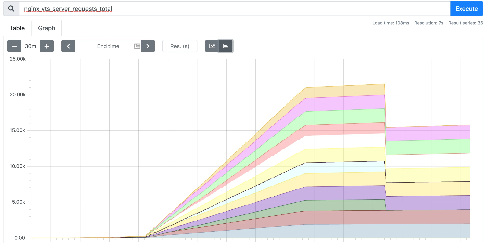

**安装 Prometheus-Adapter 并配置自定义指标**

将 Prometheus-Adapter 部署到 Kubernetes 集群后，可以通过配置规则将 Prometheus 中的任意指标暴露给 HPA（Horizontal Pod Autoscaler）使用。配置的核心是定义一个规则文件，让 Adapter 知道如何从 Prometheus 查询指标并将其映射为 Kubernetes 可用的自定义指标。

以下是一个配置示例，详细说明可参考官方文档 [Prometheus-Adapter 配置说明](https://github.com/kubernetes-sigs/prometheus-adapter/blob/master/docs/config.md)

```yaml
rules:
  - seriesQuery: "nginx_vts_server_requests_total"
    seriesFilters: []
    resources:
      overrides:
        namespace: # 这里的namespace和pod_name是prometheus里面指标的标签
          resource: namespace
        pod_name:
          resource: pod
    name:
      matches: "^(.*)_total"
      as: "${1}_per_second"
    metricsQuery: (sum(rate(<<.Series>>{<<.LabelMatchers>>}[1m])) by (<<.GroupBy>>))
```

**配置字段说明**

- **`seriesQuery`**：指定 Prometheus 查询语句，用于发现可用的指标。Adapter 会执行该查询，并将返回的所有指标系列（series）作为候选指标提供给 HPA。
- **`seriesFilters`**：可选字段，用于过滤 `seriesQuery` 返回的指标系列。如果不需要过滤，留空即可。
- **`resources`**：将 Prometheus 指标中的标签与 Kubernetes 资源类型关联，这是 Adapter 能够按 Pod、Namespace 等资源维度查询指标的关键。有两种定义方式：
  - **`overrides`**：显式指定标签与 Kubernetes 资源的映射关系。示例中将指标中的 `namespace` 标签映射为 Kubernetes 的 `namespace` 资源，`pod_name` 标签映射为 `pod` 资源。这样在查询时，Adapter 会自动将目标 Pod 的名称和命名空间作为标签值传入查询语句。
  - **`template`**：使用 Go 模板语法动态生成标签名。例如 `template: "kube_<<.Group>>_<<.Resource>>"` 会将指标中的 `kube_apps_deployment` 标签与 `apps` 组下的 `deployment` 资源关联。
- **`name`**：用于重命名指标，通常是因为原始指标（如 `_total` 后缀的计数器）不适合直接用于 HPA，需要转换为速率等形式。
  - **`matches`**：正则表达式匹配原始指标名，支持分组捕获。
  - **`as`**：定义重命名后的指标名格式，默认为 `$1`（第一个分组）。示例中将 `_total` 后缀替换为 `_per_second`，更符合指标含义。
- **`metricsQuery`**：定义实际的 PromQL 查询语句，用于获取某个具体指标的当前值。Adapter 在收到 HPA 请求时会执行该查询。查询语句中的占位符会被自动替换：
  - `<<.Series>>`：当前指标名称。
  - `<<.LabelMatchers>>`：基于 `resources` 关联生成的标签选择器，例如 `namespace="default", pod="my-pod"`。
  - `<<.GroupBy>>`：用于聚合的标签，通常为 `pod` 或 `namespace`，由 `resources` 关联决定。

示例中的查询语句计算了每个 Pod 在最近 1 分钟内的请求速率，并按 Pod 分组返回结果。

接下来我们通过 Helm Chart 来部署 Prometheus Adapter，新建 `hpa-prome-adapter-values.yaml` 文件覆盖默认的 Values 值，内容如下所示：

```yaml
rules:
  default: false
  custom:
    - seriesQuery: "nginx_vts_server_requests_total"
      resources:
        overrides:
          namespace:
            resource: namespace
          pod_name:
            resource: pod
      name:
        matches: "^(.*)_total"
        as: "${1}_per_second"
      metricsQuery: (sum(rate(<<.Series>>{<<.LabelMatchers>>}[1m])) by (<<.GroupBy>>))

prometheus:
  url: http://thanos-querier.kube-mon.svc.cluster.local
```

这里我们添加了一条 rules 规则，然后指定了 Prometheus 的地址，我们这里使用了 Thanos 部署的 Promethues 集群，所以用 Querier 的地址。使用下面的命令一键安装：

```bash
$ helm repo add prometheus-community https://prometheus-community.github.io/helm-charts
$ helm repo update
$ helm install prometheus-adapter prometheus-community/prometheus-adapter -n kube-mon -f hpa-prome-adapter-values.yaml
NAME: prometheus-adapter
LAST DEPLOYED: Mon Mar 29 18:52:44 2021
NAMESPACE: kube-mon
STATUS: deployed
REVISION: 1
TEST SUITE: None
NOTES:
prometheus-adapter has been deployed.
In a few minutes you should be able to list metrics using the following command(s):

  kubectl get --raw /apis/custom.metrics.k8s.io/v1beta1
```

安装完成后，可以使用下面的命令来检测是否生效了：

```bash
$ kubectl get pods -n kube-mon -l app=prometheus-adapter
NAME                                  READY   STATUS    RESTARTS   AGE
prometheus-adapter-58b559fc7d-l2j6t   1/1     Running   0          3m21s
$  kubectl get --raw="/apis/custom.metrics.k8s.io/v1beta1" | jq
{
  "kind": "APIResourceList",
  "apiVersion": "v1",
  "groupVersion": "custom.metrics.k8s.io/v1beta1",
  "resources": [
    {
      "name": "pods/nginx_vts_server_requests_per_second",
      "singularName": "",
      "namespaced": true,
      "kind": "MetricValueList",
      "verbs": [
        "get"
      ]
    },
    {
      "name": "namespaces/nginx_vts_server_requests_per_second",
      "singularName": "",
      "namespaced": false,
      "kind": "MetricValueList",
      "verbs": [
        "get"
      ]
    }
  ]
}
```

我们可以看到 `nginx_vts_server_requests_per_second` 指标可用。 现在，让我们检查该指标的当前值：

```bash
$ kubectl get --raw "/apis/custom.metrics.k8s.io/v1beta1/namespaces/default/pods/*/nginx_vts_server_requests_per_second" | jq .
{
  "kind": "MetricValueList",
  "apiVersion": "custom.metrics.k8s.io/v1beta1",
  "metadata": {
    "selfLink": "/apis/custom.metrics.k8s.io/v1beta1/namespaces/default/pods/%2A/nginx_vts_server_requests_per_second"
  },
  "items": [
    {
      "describedObject": {
        "kind": "Pod",
        "namespace": "default",
        "name": "hpa-prom-demo-bbb6c65bb-jlc95",
        "apiVersion": "/v1"
      },
      "metricName": "nginx_vts_server_requests_per_second",
      "timestamp": "2021-03-29T11:30:47Z",
      "value": "355m",
      "selector": null
    }
  ]
}
```

出现类似上面的信息就表明已经配置成功了，此外部署完成后还会添加一个 `APIService` 对象：

```bash
$ kubectl get apiservice |grep adapter
v1beta1.custom.metrics.k8s.io          kube-mon/prometheus-adapter   True        24h
$ kubectl get apiservice v1beta1.custom.metrics.k8s.io -o yaml
apiVersion: apiregistration.k8s.io/v1
kind: APIService
metadata:
  name: v1beta1.custom.metrics.k8s.io
  ......
spec:
  group: custom.metrics.k8s.io
  groupPriorityMinimum: 100
  insecureSkipTLSVerify: true
  service:
    name: prometheus-adapter
    namespace: kube-mon
    port: 443
  version: v1beta1
  versionPriority: 100
......
```

上面的这个 `APIService` 对象其实就是我们这里通过自定义 Metrics 来实现 HPA 的核心，通过这个对象来提供 `custom metrics API`。

当 HPA 请求 metrics 时，APIServer 聚合器会将请求转发到上面配置的 `prometheus-adapter` 服务，该服务实现了 Kubernetes resource metrics API 和 custom metrics API，它会根据配置的 rules 从 Prometheus 抓取并处理 metrics，处理（如重命名 metrics 等）完后将 metric 通过 `custom metrics API` 返回给 HPA。最后 HPA 通过获取的 metrics 的 value 对 Deployment/ReplicaSet 进行扩缩容。

prometheus-adapter 作为 APIServer 的一个扩展，充当了代理 kube-apiserver 请求 Prometheus 的功能。

> 需要注意的是 `v1beta1.custom.metrics.k8s.io` 是写在 `prometheus-adapter` 代码中的，因此不能任意改变。

接下来我们部署一个针对上面的自定义指标的 HPA 资源对象，如下所示：

```bash
# hpa-prome.yaml
apiVersion: autoscaling/v2beta1
kind: HorizontalPodAutoscaler
metadata:
  name: nginx-custom-hpa
spec:
  scaleTargetRef:
    apiVersion: apps/v1
    kind: Deployment
    name: hpa-prom-demo
  minReplicas: 2
  maxReplicas: 5
  metrics:
    - type: Pods
      pods:
        metricName: nginx_vts_server_requests_per_second
        targetAverageValue: 10
        # m 除以 1000
        # target 500 milli-requests per second,
        # which is 1 request every two seconds
        # targetAverageValue: 500m
```

如果请求数超过每秒 10 个，则将对应用进行扩容。直接创建上面的资源对象：

```bash
$ kubectl apply -f hpa-prome.yaml
horizontalpodautoscaler.autoscaling/nginx-custom-hpa created
$ kubectl describe hpa nginx-custom-hpa
Name:                                              nginx-custom-hpa
Namespace:                                         default
Labels:                                            <none>
Annotations:                                       <none>
CreationTimestamp:                                 Mon, 29 Mar 2021 19:32:37 +0800
Reference:                                         Deployment/hpa-prom-demo
Metrics:                                           ( current / target )
  "nginx_vts_server_requests_per_second" on pods:  <unknown> / 10
Min replicas:                                      2
Max replicas:                                      5
Deployment pods:                                   0 current / 0 desired
Events:                                            <none>
[root@master1 install]# kubectl describe hpa nginx-custom-hpa
Name:                                              nginx-custom-hpa
Namespace:                                         default
Labels:                                            <none>
Annotations:                                       <none>
CreationTimestamp:                                 Mon, 29 Mar 2021 19:32:37 +0800
Reference:                                         Deployment/hpa-prom-demo
Metrics:                                           ( current / target )
  "nginx_vts_server_requests_per_second" on pods:  266m / 10
Min replicas:                                      2
Max replicas:                                      5
Deployment pods:                                   2 current / 2 desired
Conditions:
  Type            Status  Reason              Message
  ----            ------  ------              -------
  AbleToScale     True    ReadyForNewScale    recommended size matches current size
  ScalingActive   True    ValidMetricFound    the HPA was able to successfully calculate a replica count from pods metric nginx_vts_server_requests_per_second
  ScalingLimited  False   DesiredWithinRange  the desired count is within the acceptable range
Events:
  Type    Reason             Age   From                       Message
  ----    ------             ----  ----                       -------
  Normal  SuccessfulRescale  21s   horizontal-pod-autoscaler  New size: 2; reason: Current number of replicas below Spec.MinReplicas
```

可以看到 HPA 对象已经生效了，新增了一个 Pod 副本：

```bash
$ kubectl get pods -l app=nginx-server
NAME                             READY   STATUS    RESTARTS   AGE
hpa-prom-demo-755bb56f85-s5dzf   1/1     Running   0          67s
hpa-prom-demo-755bb56f85-wbpfr   1/1     Running   0          3m30s
```

接下来我们同样对应用进行压测：

```bash
$ while true; do wget -q -O- http://k8s.qikqiak.com:32408; done
```

打开另外一个终端观察 HPA 对象的变化：

```bash
$ kubectl get hpa
NAME               REFERENCE                  TARGETS     MINPODS   MAXPODS   REPLICAS   AGE
nginx-custom-hpa   Deployment/hpa-prom-demo   14239m/10   2         5         2          4m27s
$ kubectl describe hpa nginx-custom-hpa
Name:                                              nginx-custom-hpa
Namespace:                                         default
Labels:                                            <none>
Annotations:                                       <none>
CreationTimestamp:                                 Mon, 29 Mar 2021 19:32:37 +0800
Reference:                                         Deployment/hpa-prom-demo
Metrics:                                           ( current / target )
  "nginx_vts_server_requests_per_second" on pods:  31874m / 10
Min replicas:                                      2
Max replicas:                                      5
Deployment pods:                                   5 current / 5 desired
Conditions:
  Type            Status  Reason               Message
  ----            ------  ------               -------
  AbleToScale     True    ScaleDownStabilized  recent recommendations were higher than current one, applying the highest recent recommendation
  ScalingActive   True    ValidMetricFound     the HPA was able to successfully calculate a replica count from pods metric nginx_vts_server_requests_per_second
  ScalingLimited  True    TooManyReplicas      the desired replica count is more than the maximum replica count
Events:
  Type    Reason             Age    From                       Message
  ----    ------             ----   ----                       -------
  Normal  SuccessfulRescale  2m37s  horizontal-pod-autoscaler  New size: 2; reason: Current number of replicas below Spec.MinReplicas
  Normal  SuccessfulRescale  50s    horizontal-pod-autoscaler  New size: 4; reason: pods metric nginx_vts_server_requests_per_second above target
  Normal  SuccessfulRescale  35s    horizontal-pod-autoscaler  New size: 5; reason: pods metric nginx_vts_server_requests_per_second above target
```

可以看到指标 `nginx_vts_server_requests_per_second` 的数据已经超过阈值了，触发扩容动作了，副本数变成了 3，然后又扩容到了 5。

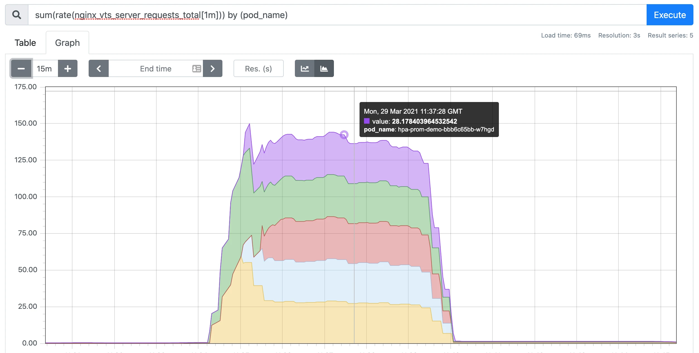

如果需要更好的进行测试，我们可以使用一些压测工具，比如 ab、fortio 等工具。当我们中断测试后，默认 5 分钟过后就会自动缩容：

```bash
$ kubectl describe hpa nginx-custom-hpa
Name:                                              nginx-custom-hpa
Namespace:                                         default
Labels:                                            <none>
Annotations:                                       kubectl.kubernetes.io/last-applied-configuration:
                                                     {"apiVersion":"autoscaling/v2beta1","kind":"HorizontalPodAutoscaler","metadata":{"annotations":{},"name":"nginx-custom-hpa","namespace":"d...
CreationTimestamp:                                 Tue, 07 Apr 2020 17:54:55 +0800
Reference:                                         Deployment/hpa-prom-demo
Metrics:                                           ( current / target )
  "nginx_vts_server_requests_per_second" on pods:  533m / 10
Min replicas:                                      2
Max replicas:                                      5
Deployment pods:                                   2 current / 2 desired
Conditions:
  Type            Status  Reason            Message
  ----            ------  ------            -------
  AbleToScale     True    ReadyForNewScale  recommended size matches current size
  ScalingActive   True    ValidMetricFound  the HPA was able to successfully calculate a replica count from pods metric nginx_vts_server_requests_per_second
  ScalingLimited  True    TooFewReplicas    the desired replica count is less than the minimum replica count
Events:
  Type    Reason             Age   From                       Message
  ----    ------             ----  ----                       -------
  Normal  SuccessfulRescale  23m   horizontal-pod-autoscaler  New size: 2; reason: Current number of replicas below Spec.MinReplicas
  Normal  SuccessfulRescale  19m   horizontal-pod-autoscaler  New size: 3; reason: pods metric nginx_vts_server_requests_per_second above target
  Normal  SuccessfulRescale  4m2s  horizontal-pod-autoscaler  New size: 2; reason: All metrics below target
```

到这里我们就完成了使用自定义的指标对应用进行自动扩缩容的操作。如果 Prometheus 安装在我们的 Kubernetes 集群之外，则只需要确保可以从集群访问到查询的端点，并在 adapter 的部署清单中对其进行更新即可。在更复杂的场景中，可以获取多个指标结合使用来制定扩展策略。

## T4.14、Prometheus Operator

前面我们用自定义的方式来对 Kubernetes 集群进行监控，基本上也能够完成监控报警的需求。但实际上对于 Kubernetes 来说，还有更简单的方式来监控报警，那就是 [Prometheus Operator](https://prometheus-operator.dev/docs/getting-started/installation/)。Prometheus Operator 为监控 Kubernetes 资源和管理 Prometheus 实例提供了简单的定义，简化了在 Kubernetes 上的部署、管理和运行 Prometheus 和 Alertmanager 集群。

Prometheus Operator 为 Kubernetes 提供了对 Prometheus 相关监控组件的部署和管理方案，该项目简化了 Prometheus 的监控栈配置，主要包括以下几个功能：

- Kubernetes 自定义资源：使用 Kubernetes CRD 来部署和管理 Prometheus、Alertmanager 和相关组件。
- 简化的部署配置：直接通过 Kubernetes 资源清单配置 Prometheus，比如版本、持久化、副本、保留策略等。
- Prometheus 监控目标配置：基于熟知的 Kubernetes 标签查询自动生成监控目标配置，无需学习 Prometheus 专门配置。

首先我们先来了解下 Prometheus Operator 的架构图：

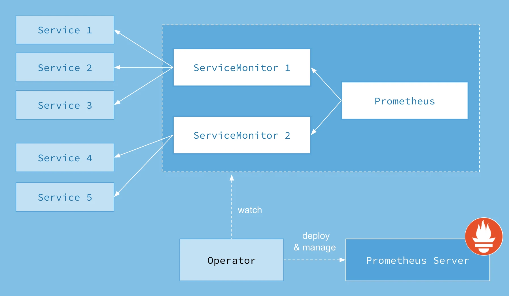

这是 Prometheus-Operator 官方提供的架构图，各组件以不同的方式运行在 Kubernetes 集群中，其中 Operator 是最核心的部分，作为一个控制器，他会去创建 Prometheus、ServiceMonitor、AlertManager 以及 PrometheusRule 等 CRD 资源对象，然后会一直 Watch 并维持这些资源对象的状态。

目前 Operator 提供的 CRD 以 [Prometheus Operator 官方文档](https://prometheus-operator.dev/docs/getting-started/introduction/) 为准，包括以下资源对象（与 [Design](https://prometheus-operator.dev/docs/getting-started/design/) 一致）：

- `ScrapeConfig` — 定义抓取配置，支持集群外或无法用 ServiceMonitor/PodMonitor 表述的抓取
- `PrometheusAgent` — 部署 Prometheus Agent 实例（精简版，无告警/规则等）
- `AlertmanagerConfig` — 配置 Alertmanager 子配置（路由、receiver、抑制等）
- `PrometheusRule` — 定义告警与记录规则
- `Probe` — 黑盒探测（Ingress、静态目标等）
- `PodMonitor` — 按 Pod 标签发现并抓取目标
- `ServiceMonitor` — 按 Service/Endpoints 发现并抓取目标
- `ThanosRuler` — 部署 Thanos Ruler，跨多 Prometheus 评估规则
- `Alertmanager` — 部署 Alertmanager 集群
- `Prometheus` — 部署 Prometheus 实例

| CRD | 用途 | 企业场景要点 |
|-----|------|----------------|
| **Prometheus** | 部署、副本、存储、关联 ServiceMonitor/PodMonitor/规则 | 多副本 HA、`serviceMonitorSelector: {}` 匹配全部监控；限制命名空间用 `serviceMonitorNamespaceSelector` |
| **Alertmanager** | 部署告警集群、静默、路由 | 多副本 HA、与 Prometheus 的 `alerting.alertmanagers` 对应 |
| **ServiceMonitor** | 通过 Service/Endpoints 发现抓取目标 | 为每个需监控的 Service 配 `selector.matchLabels` 和 `endpoints[].port`，Prometheus 用 `serviceMonitorSelector` 选择 |
| **PodMonitor** | 通过 Pod 标签发现抓取目标 | 无 Service 时用；DaemonSet/裸 Pod 监控常用 |
| **Probe** | 黑盒探测（HTTP/TCP/ICMP 等） | 需配合 blackbox-exporter；监控 Ingress、外部 URL 可用 |
| **ScrapeConfig** | 原生 Prometheus 抓取配置 | 集群外目标、consul/ec2 等发现、非 K8s 场景 |
| **PrometheusRule** | 告警与记录规则 | 被 Prometheus/ThanosRuler 的 `ruleSelector` 选择；多租户时可按 namespace/label 拆分 |
| **AlertmanagerConfig** | Alertmanager 子配置 | 与 Alertmanager 的 `alertmanagerConfigSelector` 配合，做路由、inhibit、receiver |
| **ThanosRuler** | 跨多 Prometheus 的规则评估 | 需 query 端点；多集群/长期存储场景 |
| **PrometheusAgent** | 轻量抓取+远程写入 | 边沿/大量实例时减少本地存储与计算 |

> 说明：选择器语义见官方 [Design - Resource Selectors](https://prometheus-operator.dev/docs/getting-started/design/) — 未指定 selector 表示不匹配任何对象；显式 `{}` 表示匹配所有。

### T4.14.1、安装

> 注意：截止 20260305，kube-prometheus 仍然处于实验阶段，随时可能进行重大改变。
>
> 原话：Everything is experimental and may change significantly at any time.

首先 clone 项目代码，基于 main 版本安装 https://github.com/prometheus-operator/kube-prometheus：

```bash
$ git clone https://github.com/prometheus-operator/kube-prometheus.git
$ cd kube-prometheus

# Create the namespace and CRDs, and then wait for them to be available before creating the remaining resources
# Note that due to some CRD size we are using kubectl server-side apply feature which is generally available since kubernetes 1.22.
# If you are using previous kubernetes versions this feature may not be available and you would need to use kubectl create instead.
kubectl apply --server-side -f manifests/setup
kubectl wait \
    --for condition=Established \
    --all CustomResourceDefinition \
    --namespace=monitoring
kubectl apply -f manifests/
```

这会自动安装 node-exporter、kube-state-metrics、grafana、prometheus-adapter 以及 prometheus 和 alertmanager 等大量组件，而且 prometheus 和 alertmanager 还是多副本的。

```bash
root@master-aio:~# kubectl get pods -n monitoring 
NAME                                  READY   STATUS    RESTARTS        AGE
alertmanager-main-0                   2/2     Running   2 (5h24m ago)   17h
alertmanager-main-1                   2/2     Running   2 (5h24m ago)   17h
alertmanager-main-2                   2/2     Running   2 (5h24m ago)   17h
blackbox-exporter-58bdf9f74f-b6lzr    3/3     Running   3 (5h24m ago)   16h
grafana-f6d65b5df-xxj5r               1/1     Running   1 (5h24m ago)   17h
kube-state-metrics-6654b59fdf-wcqrl   3/3     Running   3 (5h24m ago)   17h
node-exporter-92n2x                   2/2     Running   2 (5h24m ago)   17h
node-exporter-bsqwb                   2/2     Running   2 (5h25m ago)   17h
node-exporter-dkh6r                   2/2     Running   2 (5h24m ago)   17h
node-exporter-h8cjq                   2/2     Running   2 (5h24m ago)   17h
node-exporter-lcck7                   2/2     Running   2 (5h26m ago)   17h
node-exporter-rkwnf                   2/2     Running   2 (5h25m ago)   17h
prometheus-adapter-599c88b6c4-fxcrn   1/1     Running   1 (5h24m ago)   17h
prometheus-adapter-599c88b6c4-xp88h   1/1     Running   1 (5h24m ago)   17h
prometheus-k8s-0                      2/2     Running   2 (5h24m ago)   17h
prometheus-k8s-1                      2/2     Running   2 (5h24m ago)   17h
prometheus-operator-68447c67-xhr5n    2/2     Running   2 (5h24m ago)   17h
```

```bash
root@master-aio:~# kubectl get services -n monitoring 
NAME                    TYPE        CLUSTER-IP      EXTERNAL-IP   PORT(S)                      AGE
alertmanager-main       ClusterIP   10.68.223.161   <none>        9093/TCP,8080/TCP            17h
alertmanager-operated   ClusterIP   None            <none>        9093/TCP,9094/TCP,9094/UDP   17h
blackbox-exporter       ClusterIP   10.68.79.169    <none>        9115/TCP,19115/TCP           17h
grafana                 ClusterIP   10.68.14.57     <none>        3000/TCP                     17h
kube-state-metrics      ClusterIP   None            <none>        8443/TCP,9443/TCP            17h
node-exporter           ClusterIP   None            <none>        9100/TCP                     17h
prometheus-adapter      ClusterIP   10.68.197.75    <none>        443/TCP                      17h
prometheus-k8s          ClusterIP   10.68.168.188   <none>        9090/TCP,8080/TCP            17h
prometheus-operated     ClusterIP   None            <none>        9090/TCP                     17h
prometheus-operator     ClusterIP   None            <none>        8443/TCP                     17h
```

可以看到上面针对 grafana、alertmanager 和 prometheus 都创建了一个类型为 ClusterIP 的 Service，如果我们想要在外网访问这些服务的话，可以创建对应的 Ingress 对象或者使用 NodePort 类型的 Service。

我们这里为了简单演示，直接使用 NodePort 类型的服务即可，编辑 `grafana`、`alertmanager-main` 和 `prometheus-k8s` 这 3 个 Service，将服务类型更改为 NodePort：

```bash
root@master-aio:~# kubectl edit -n monitoring service alertmanager-main
root@master-aio:~# kubectl edit -n monitoring service grafana
root@master-aio:~# kubectl edit -n monitoring service prometheus-k8s
root@master-aio:~# kubectl get services -n monitoring 
NAME                    TYPE        CLUSTER-IP      EXTERNAL-IP   PORT(S)                         AGE
alertmanager-main       NodePort    10.68.223.161   <none>        9093:31218/TCP,8080:30223/TCP   18h
alertmanager-operated   ClusterIP   None            <none>        9093/TCP,9094/TCP,9094/UDP      18h
blackbox-exporter       ClusterIP   10.68.79.169    <none>        9115/TCP,19115/TCP              18h
grafana                 NodePort    10.68.14.57     <none>        3000:30929/TCP                  18h
kube-state-metrics      ClusterIP   None            <none>        8443/TCP,9443/TCP               18h
node-exporter           ClusterIP   None            <none>        9100/TCP                        18h
prometheus-adapter      ClusterIP   10.68.197.75    <none>        443/TCP                         18h
prometheus-k8s          NodePort    10.68.168.188   <none>        9090:31339/TCP,8080:30196/TCP   18h
prometheus-operated     ClusterIP   None            <none>        9090/TCP                        18h
prometheus-operator     ClusterIP   None            <none>        8443/TCP                        18h
```

更改完成后，我们就可以通过上面的 NodePort 去访问对应的服务了，比如查看 prometheus 的服务发现页面：

> 访问时，发现页面无法打开，因为 kube-prometheus 最新版本 v0.16.0 默认开启了 prometheus-networkPolicy.yaml 策略限制，修改一下访问策略
>
> ```bash
>   - from: []
>     # 这三行注释掉
>     #- podSelector:
>     #    matchLabels:
>     #      app.kubernetes.io/name: prometheus-adapter
> ```
>
> 同理，grafana 也有这个问题。

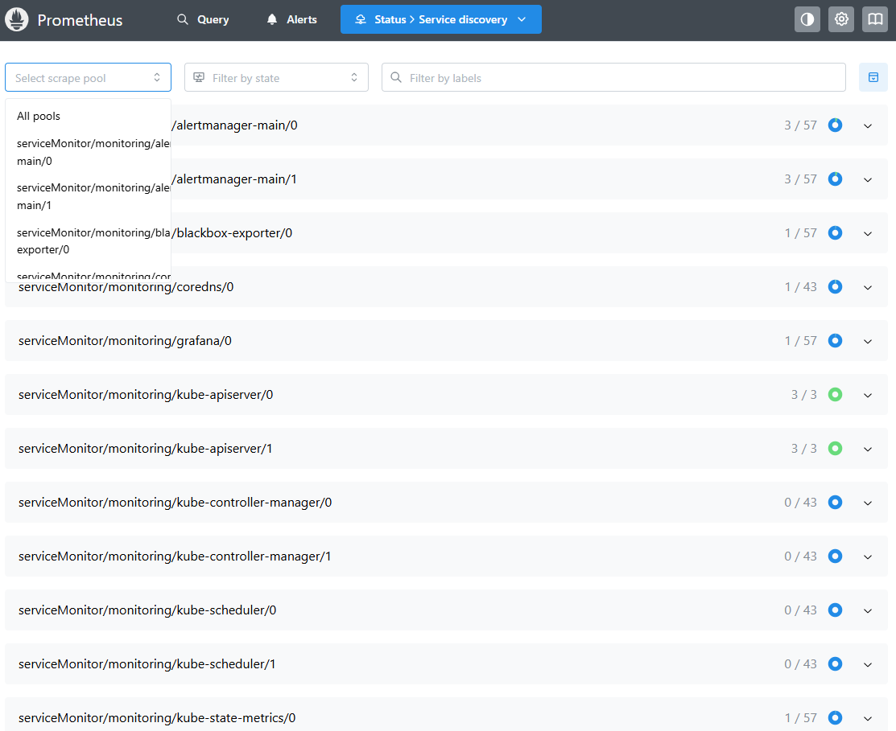

prometheus-k8s 服务上面有个参数比较重要，就是 sessionAffinity: ClientIP，根据 `ClientIP` 来做 session 亲和性，因为 prometheus 多副本拉取数据不能保证一致，有可能是时序问题，也有可能是网络问题，所以要通过 IP 亲和性把同一个用户调度到同一个 prometheus 副本，保持数据一致性。

```bash
apiVersion: v1
kind: Service
metadata:
  labels: # 定义service label，prometheus通过serviceMonitorSelector组件来匹配
    app.kubernetes.io/component: prometheus
    app.kubernetes.io/instance: k8s
    app.kubernetes.io/name: prometheus
    app.kubernetes.io/part-of: kube-prometheus
    app.kubernetes.io/version: 3.10.0
  name: prometheus-k8s
  namespace: monitoring
spec:
  ......
  selector: # 匹配pod应用
    app.kubernetes.io/component: prometheus
    app.kubernetes.io/instance: k8s
    app.kubernetes.io/name: prometheus
    app.kubernetes.io/part-of: kube-prometheus
  sessionAffinity: ClientIP # 源IP亲和性
```

grafana 上面可以通过 dashboard 看到各种资源的指标了。

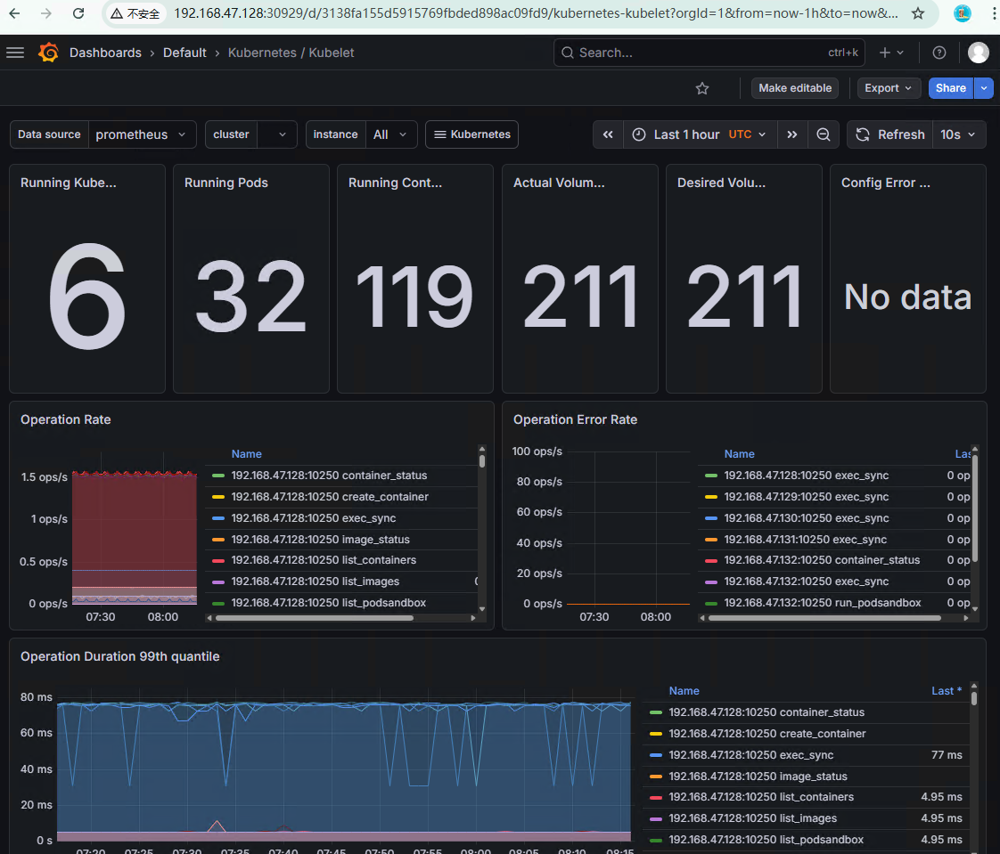

### T4.14.2、自定义监控报警

除了 Kubernetes 集群中的一些资源对象、节点以及组件需要监控，有的时候我们可能还需要根据实际的业务需求去添加自定义的监控项，添加一个自定义监控的步骤大致如下：

- 第一步建立一个 ServiceMonitor 对象，用于 Prometheus 添加监控项
- 第二步让 ServiceMonitor 对象关联提供 metrics 数据接口的 Service 对象
- 第三步确保 Service 对象可以正确获取到 metrics 数据

#### T4.14.2.1、etcd 监控（HTTP）

环境：etcd 3.6.x 二进制 + Prometheus Operator。metrics 用 HTTP 暴露（[etcd #18477](https://github.com/etcd-io/etcd/issues/18477) 推荐，避免 TLS 客户端证书问题）。

**1. 每台 master 上：etcd 改为 HTTP 暴露 metrics**

```bash
sudo sed -i 's|--listen-metrics-urls=https://0.0.0.0:2381|--listen-metrics-urls=http://0.0.0.0:2381|' /etc/systemd/system/etcd.service
sudo systemctl daemon-reload && sudo systemctl restart etcd
curl -s http://127.0.0.1:2381/metrics | head -3
```

确保有 `--metrics=extensive`（没有则在 ExecStart 中补上）。

**2. 创建 Service + EndpointSlice（合并为一个 EndpointSlice，多 endpoint）**

将下面 YAML 中的 IP、nodeName 改为你的三台 master 后 apply。

| 参数 | 说明 |
|------|------|
| `clusterIP: None` | Headless，仅用于服务发现 |
| `kubernetes.io/service-name` | 必须等于关联的 Service 名（K8s 1.21+） |
| `addressType: IPv4` | 与 Service `ipFamilies` 一致 |
| `ports.name` | 与 Service `ports.name` 一致，ServiceMonitor 按端口名匹配 |

```yaml
# etcd-monitor-resources.yaml
apiVersion: v1
kind: Service
metadata:
  name: etcd-k8s
  namespace: kube-system
  labels:
    k8s-app: etcd
spec:
  type: ClusterIP
  clusterIP: None
  ipFamilies: [IPv4]
  ipFamilyPolicy: SingleStack
  ports:
    - name: metrics
      port: 2381
      protocol: TCP
      targetPort: 2381
---
apiVersion: discovery.k8s.io/v1
kind: EndpointSlice
metadata:
  name: etcd-k8s
  namespace: kube-system
  labels:
    k8s-app: etcd
    kubernetes.io/service-name: etcd-k8s
addressType: IPv4
ports:
  - name: metrics
    port: 2381
    protocol: TCP
endpoints:
  - addresses: ["192.168.47.128"]
    nodeName: master-01
  - addresses: ["192.168.47.129"]
    nodeName: master-02
  - addresses: ["192.168.47.130"]
    nodeName: master-03
```

```bash
kubectl apply -f etcd-monitor-resources.yaml
```

**3. 创建 ServiceMonitor**

| 参数 | 说明 |
|------|------|
| `prometheus: k8s` | 与 Prometheus CR 的 `serviceMonitorSelector` 匹配（kube-prometheus 默认） |
| `selector.matchLabels` | 匹配上一步 Service 的 label |
| `port: metrics` | 对应 Service/EndpointSlice 的端口名 |

```yaml
# prometheus-servicemonitor-etcd.yaml
apiVersion: monitoring.coreos.com/v1
kind: ServiceMonitor
metadata:
  name: etcd-k8s
  namespace: monitoring
  labels:
    prometheus: k8s
spec:
  jobLabel: k8s-app
  selector:
    matchLabels:
      k8s-app: etcd
  namespaceSelector:
    matchNames:
      - kube-system
  endpoints:
    - port: metrics
      interval: 15s
      scrapeTimeout: 10s
      scheme: http
      honorLabels: true
```

```bash
kubectl apply -f prometheus-servicemonitor-etcd.yaml
kubectl rollout restart statefulset/prometheus-k8s -n monitoring
```

**4. 验证**

```bash
kubectl port-forward prometheus-k8s-0 -n monitoring 9090:9090
```

浏览器打开 http://192.168.47.128:9090 -> Status -> Targets，etcd-k8s 应有 3 个 UP；Graph 查询 `etcd_server_version` 应有 3 条序列。


