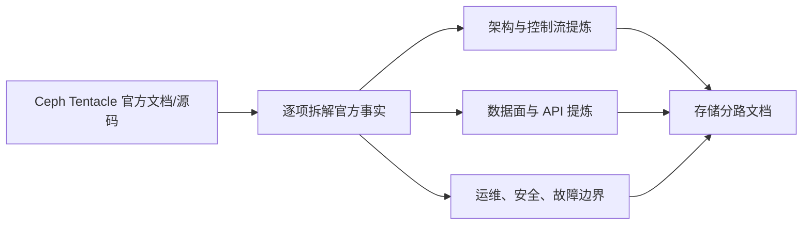

# Kubeauto 存储分路

存储分路是与 `docs/middleware/` 完全独立的产品分路。它不复用中间件的文档类型、专项矩阵或状态词；每个存储技术栈按官方产品模块组织文档。当前首个技术栈为 Ceph Tentacle，严格对应官方九个入口：

| # | Ceph 模块 | 本项目文档 |
|---:|---|---|
| 1 | Architecture | [01-architecture.md](./ceph/01-architecture.md) |
| 2 | Cephadm | [02-cephadm.md](./ceph/02-cephadm.md) |
| 3 | RADOS Storage Cluster | [03-rados.md](./ceph/03-rados.md) |
| 4 | CephFS | [04-cephfs.md](./ceph/04-cephfs.md) |
| 5 | RBD | [05-rbd.md](./ceph/05-rbd.md) |
| 6 | RADOS Gateway | [06-radosgw.md](./ceph/06-radosgw.md) |
| 7 | MGR | [07-mgr.md](./ceph/07-mgr.md) |
| 8 | MGR Dashboard | [08-mgr-dashboard.md](./ceph/08-mgr-dashboard.md) |
| 9 | Monitoring | [09-monitoring.md](./ceph/09-monitoring.md) |

## 官方基线

- 文档入口：[Ceph Tentacle](https://docs.ceph.com/en/tentacle/)
- 官方源代码分支：[ceph/ceph `tentacle`](https://github.com/ceph/ceph/tree/tentacle)
- 本次核验的官方提交：`76fba24cef67d9219f97eeaa68cd1a848da3f2b2`
- 九份正文按机制和客户任务重新组织官方内容。重复叙述可以合并，但官方概念、状态、配置语义、默认行为、命令、限制、警告和异常恢复分支必须在正文中得到实际解释，不能用目录或“已覆盖”声明代替。

Ceph 的对象、块、文件接口共用 RADOS 数据平面；cephadm 负责集群生命周期，MGR/ Dashboard/ Monitoring 提供控制、管理和观测能力。文档中的命令用于理解官方行为和后续产品实现设计，尚不表示 kubeauto 已经交付 Ceph 安装或 CSI 集成。
