# Ceph 架构全解（Tentacle）

> Ceph 在没有中心对象目录和中心数据网关的前提下，支持大量客户端并行访问 PB 到 EB 级对象、块和文件数据，并在设备、主机、机架和网络持续变化时维持一致性与可用性。

Ceph 把对象、块和文件统一建立在 RADOS（Reliable Autonomic Distributed Object Store）之上。理解 Ceph 不能只记 daemon 名称；必须能沿着一笔 I/O 解释地图从哪里来、对象如何计算到 PG、PG 如何计算到 OSD、谁接受写入、谁生成副本或纠删码分片、何时向客户端确认，以及故障以后哪一份历史具有权威性。

## 1. 一张图看懂整个系统

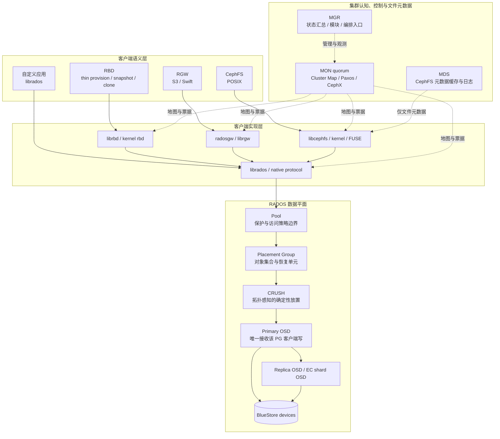

先固定四个边界：

1. 正常对象数据不经过 MON、MGR 或 MDS 中转，客户端直接与 OSD 通信。
2. MON 保存权威集群状态，但不保存“每个对象在哪块盘”的中心目录。
3. MDS 只为 CephFS 提供文件元数据服务；RBD 和 RGW 不依赖 MDS。
4. 所有上层服务最终都把自己的数据模型转换为 RADOS 对象；同一个 S3 object、文件或 RBD image 通常不等于一个 RADOS 对象。

### 1.1 四类核心 daemon

| daemon | 权威职责 | 运行时作用 | 明确不承担的职责 |
|---|---|---|---|
| `ceph-mon` | 保存 Cluster Map 主副本；对状态变化执行 Paxos；维护认证数据库并签发 CephX ticket | 向客户端和 daemon 分发地图、认证材料与集群健康状态 | 不代理正常对象 I/O，不维护逐对象位置索引 |
| `ceph-osd` | 在本地设备保存对象或 shard；维护 PG log | 客户端读写、复制/编码、heartbeat、peering、recovery、backfill、scrub | 不解释目录树、虚拟磁盘或 S3 用户语义 |
| `ceph-mgr` | 接收 daemon 统计并提供管理扩展点 | Dashboard、Prometheus、orchestrator 等模块的承载进程 | 不替代 MON 共识，不是业务数据持久化主体 |
| `ceph-mds` | 维护 CephFS inode、目录、权限、锁、cap 和热点元数据缓存 | journal 持久化到 RADOS；active/standby 和多 active 扩展 | 不代理 CephFS 文件内容 I/O，不服务 RBD/RGW |

daemon 可以增加实例实现容量、吞吐或高可用，但 daemon 数量本身不定义数据保护等级。副本数、纠删码参数和故障域由 pool 与 CRUSH 共同决定。

## 2. RADOS 对象与 OSD 持久化模型

### 2.1 对象不是文件，也不是目录

OSD 在平坦命名空间中保存对象，不按目录层级组织。对象包含：

| 部分 | 内容 | 对定位和语义的影响 |
|---|---|---|
| Object ID | 对象名称/标识 | 参与 hash；客户端用它计算 PG |
| Binary data | OSD 不解释的字节串 | 文件、块、S3 payload 的意义由上层客户端定义 |
| Metadata | name/value 属性 | 可承载 xattr、omap 或上层实现需要的附属状态 |

官方架构说明强调 object ID 不只是某个本地文件系统内唯一。工程上，完整对象身份还受 pool 与可选 namespace 约束，因此排障和 API 操作应使用 `pool + namespace + object name`，不能只拿一个显示名称猜测位置。

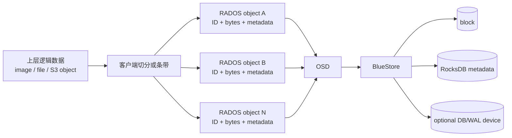

默认后端 BlueStore 直接管理块设备，以数据库式布局保存对象。这里的 OSD 同时常被用来表示 `ceph-osd` 进程和该进程管理的逻辑存储实例；它不是“物理盘”的同义词。常见布局是一块设备对应一个 OSD，但超大高速 NVMe 可能切成多个 OSD，必须经过基准验证。

### 2.2 语义属于客户端，可靠性属于 RADOS

- CephFS 把文件内容条带为对象，把目录、inode、owner、mode 等元数据放入独立 metadata pool。
- RBD 把一个逻辑块设备 image 条带为固定大小对象，并在对象之上实现 snapshot、clone。
- RGW 把 S3/Swift 对象、bucket index、用户和日志状态映射到多个 RADOS pool 与对象。
- 直接使用 `librados` 的程序得到原始对象 API；条带、并行、重试和应用级一致性由程序自己设计。

所以，“RADOS 对象完好”不能直接推出上层目录树、bucket index 或 image 元数据一定完好；上层服务各有自己的元数据和一致性约束。

## 3. Cluster Map：所有参与者共享的集群事实

客户端联系任一 MON，完成认证并取得当前 Cluster Map。OSD 同样持有地图。客户端知道 daemon、拓扑与规则，却仍不知道某个对象的物理位置；对象位置随后由算法计算，而不是向 MON 发起逐对象查询。

### 3.1 Cluster Map 实际是五类地图

| 地图 | 官方定义的主要字段 | 关键状态 | 直接检查命令 |
|---|---|---|---|
| Monitor Map | cluster `fsid`；每个 MON 的 rank/position、name、address、TCP port；创建、修改时间与 epoch | quorum 成员发现基础 | `ceph mon dump` |
| OSD Map | `fsid`；创建/修改时间；pool、replica size、PG 数、OSD 列表 | `up/down`、`in/out`、pool 属性 | `ceph osd dump` |
| PG Map | PG version、timestamp、最后采用的 OSD Map epoch、full ratios、每个 PG 的统计 | PG ID、Up Set、Acting Set、复合状态、pool 用量 | `ceph pg dump` |
| CRUSH Map | storage device、权重、device class、failure-domain 层级、遍历规则 | `device/host/rack/row/room` 等拓扑 | `ceph osd getcrushmap -o map.bin` 后用 `crushtool -d` 反编译 |
| MDS Map | MDS Map epoch、创建与修改时间、metadata pool、MDS 列表 | MDS `up/in`、rank 与文件系统关系 | `ceph fs dump` |

每张地图都有版本历史，版本称为 epoch。OSD down、PG degraded、MON 成员或 CRUSH 变化会产生新 epoch。旧客户端或落后 daemon 可以按历史追赶；epoch 也是判断拓扑视图是否过期的基础。

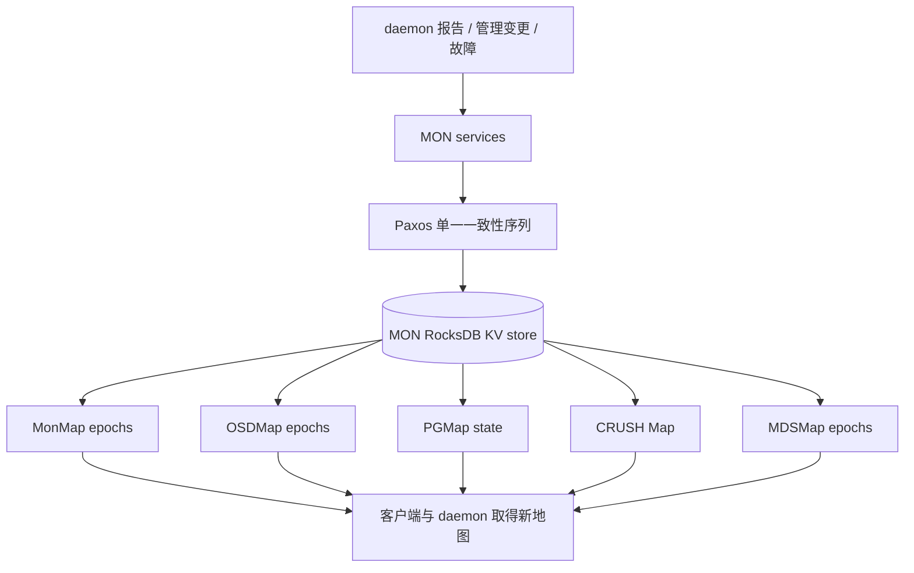

### 3.2 `fsid`、daemon ID 与地图发现

`fsid` 唯一标识一个 Ceph 集群，允许同一硬件环境存在多个逻辑集群。每个 MON 还有独立 ID，例如 `mon.a`。MON 之间不是靠各自主机的 `ceph.conf` 发现彼此，而是以 monmap 为权威，避免配置文件分发延迟或拼写错误把 MON 集群撕裂。

客户端配置的 `mon_host` 只需让它接触至少一个在线 MON；连接成功后，当前 monmap 会告诉它其他 MON。`mon_host` 可以是地址列表，也可以是解析出多个 A/AAAA 记录的 DNS 名称。

## 4. MON、Paxos 与控制面可用性

### 4.1 多数派才是权威

一个 MON 足以形成一票 quorum，但它也是单点。失败后，持有旧地图的已有客户端可能短时访问未变化数据，但无法可靠取得新地图、刷新票据或提交状态变化，系统不能被视为可用。

多个 MON 对 monitor services 的变化使用一个 Paxos 实例形成强一致顺序，再以 ACID 批次写入 key/value store。quorum 必须超过半数：

| MON 数 | 最小 quorum | 可容忍同时失联数 |
|---:|---:|---:|
| 1 | 1 | 0 |
| 3 | 2 | 1 |
| 5 | 3 | 2 |
| 6 | 4 | 2 |

偶数规模不会凭空增加多数派容错能力，所以生产通常使用跨故障域的奇数 MON。

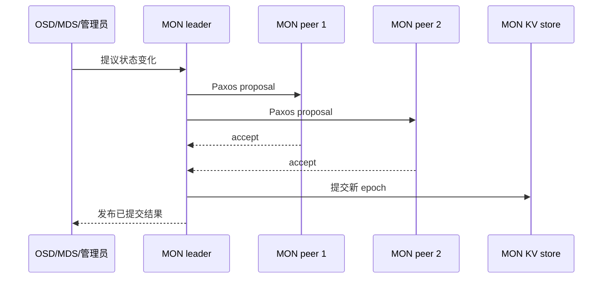

### 4.2 落后 MON 如何追赶

落后超过允许范围的 MON 会退出 quorum 并同步：Leader 是最先达到最新 Paxos 版本的 MON；Provider 同样持有最新状态并可提供同步数据；Requester 是落后者。Leader 把 requester 指向 provider，provider 分块发送 store，requester 逐块 ACK，完成后通知 leader 并重新加入 quorum。这避免大块同步压垮 leader。

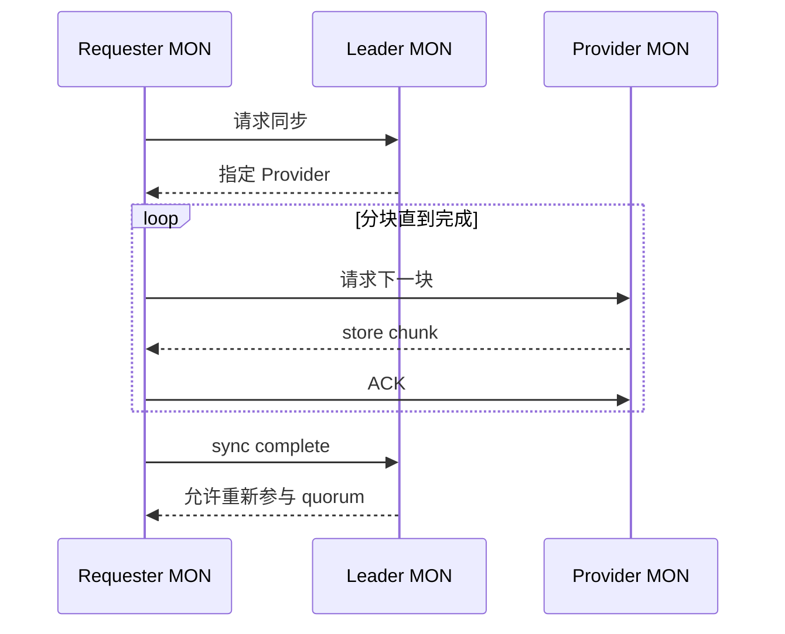

新 MON 加入时总会同步；运行中角色可能迁移，provider 自己落后时可中止同步。相关 trimming 要等 PG `active+clean`，以免过早丢弃恢复所需历史。

### 4.3 时间与持久化是共识前提

MON 消息、lease 和 timeout 依赖时钟。MON 主机必须运行 NTP 或 PTP，并最好同时对齐多个高质量上游和彼此。时钟漂移会让消息因时间戳过期被忽略，或让 timeout 过早/过晚触发。

MON RocksDB 使用 `mmap()` 并频繁刷盘。生产应使用企业级 SSD，避免与 OSD 数据盘共用设备；容量、写延迟或空间不足会直接影响控制面。

### 4.4 Bootstrap、地址与存储保护栏

MON 首次形成集群必须同时具备三个身份材料：全局唯一 `fsid`、本 MON 的字母或字母数字 ID（如 `a`，进程名为 `mon.a`），以及 `mon.` secret key。部署工具通常生成三者；手工部署若缺任一项，MON 不能安全地加入同一 Paxos 集群。

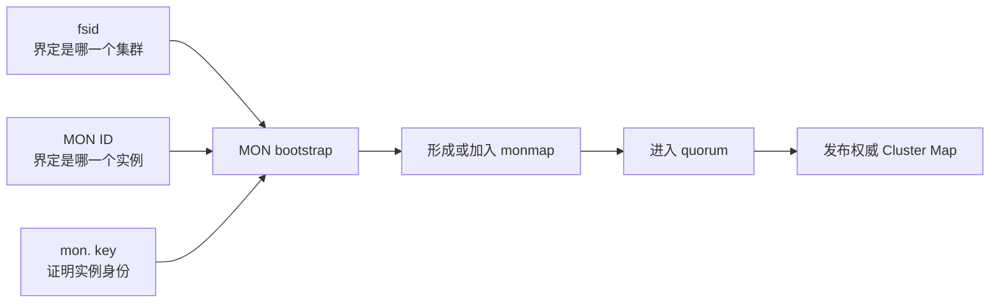

生产落地必须遵守以下边界：

| 项目 | 架构事实 | 生产要求 |
|---|---|---|
| 发现 | 客户端/daemon 用 `mon_host` 找到第一个 MON；MON 彼此只信 monmap | `mon_host` 可以不列全，但必须始终能命中至少一个在线 MON |
| 地址 | MON 地址是 monmap 中经 Paxos 提交的成员信息 | 部署后不能只改 DNS、主机 IP 或 `ceph.conf`；变更必须走 MON 地址迁移流程 |
| 设备 | MON store 是 RocksDB KV store，频繁刷盘且使用 `mmap()` | MON data 使用可靠 SSD，避免与 OSD data 共盘，监控延迟和可用空间 |
| 容量 | MON 保存 map 历史、Paxos 状态、auth 与日志 | 把 `mon_data_size_warn`、可用空间 warn/crit 当控制面容量门禁，不把 MON 盘当普通系统盘 |
| 同步 | 新 MON 必同步；落后超阈值的 MON 离开 quorum 后成为 requester | 同步期间仍须维持其余 MON 多数派，不能同时滚动多个故障域 |

Provider 在提供 store 时若自己落后于 leader，可以中止正在进行的同步；requester 不能把半份 store 当成可加入 quorum 的状态。完整同步后才重新加入，集群级 trimming 又要求 PG 达到 `active+clean`。因此，MON 扩缩容前同时检查 quorum、MON store 空间和 PG 健康，而不是只看新进程是否启动。

### 4.5 Pool 与容量的防误操作控制

`nearfull/backfillfull/full` 的初始化配置只在创建集群时写入 OSDMap。集群运行后，OSD 实际执行 OSDMap 中的值，不会持续读取 `ceph.conf` 或 central config 中同名的 `mon_osd_*_ratio`。这解释了为什么“配置文件已经改了”可能对现网水位没有任何效果。

Pool 删除是数据删除，不是元数据整理。生产同时使用集群级 `mon_allow_pool_delete` 和 pool flags 构成双层保护：

| 保护 | 阻止的操作 | 适用场景 |
|---|---|---|
| `mon_allow_pool_delete=false` | 所有 pool 删除 | 常态默认门禁 |
| `nodelete` | 删除指定 pool | 核心业务池二次保护 |
| `nopgchange` | 改指定 pool 的 `pg_num/pgp_num` | 防止误触发 split/merge 与迁移 |
| `nosizechange` | 改指定 pool 的 `size` | 防止误降冗余 |

防护开关不是变更流程的替代品。确需变更时，先记录 pool 属性和应用所有者，计算 CRUSH/PG/容量影响，短时解除最小范围保护，执行并验证，再立即恢复保护；不要为方便长期关闭全局删除门禁。

## 5. CephX：认证、授权、票据与会话

CephX 类似 Kerberos：MON 扮演授权中心，每个 principal 与 MON 共享长期 secret；MON 签发有期限的 auth ticket 和 service ticket。ticket 同时证明身份并携带 capabilities，但认证证明“你是谁”，授权描述“你能做什么”。

### 5.1 参与者与密钥材料

| 名称 | 含义 | 谁持有 |
|---|---|---|
| principal/entity | 客户端或 daemon，如 `client.backup`、`osd.23` | entity name 是公开标识 |
| principal secret | principal 的长期共享密钥 | 该 principal 与 MON auth database |
| MON secret | MON 服务共享秘密 | MON 集群 |
| rotating service secret | 某服务类型周期轮换的密钥 | 该类型 daemon 与 MON；通常并存多个代际 |
| auth session key | principal 与 MON auth service 的短期密钥 | principal 与 MON |
| service session key | principal 与 OSD/MDS/MGR/MON 服务的短期密钥 | principal 与目标服务 |
| capability | 对各服务的权限描述 | 封装进 ticket，由服务执行 |

服务是同一 daemon 类型的集合。例如 OSD ticket 能被 OSD service 用共享的轮换密钥验证，客户端无须为每个 OSD 保存不同长期密码。

### 5.2 第一阶段：取得 auth ticket

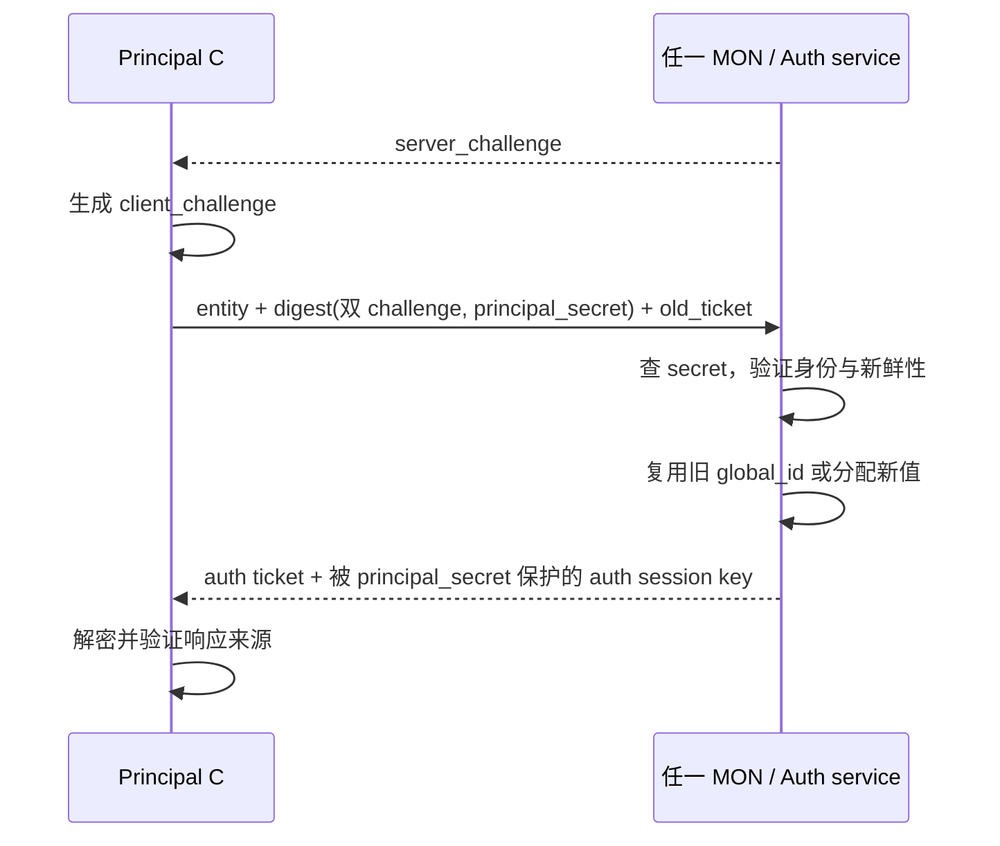

双 challenge 防止直接重放。Nautilus 以后，第一阶段响应还能同时携带所需 service tickets 和 connection secret。旧 ticket 有效时可以复用 `global_id`，新的 session key 仍会重新生成。

Ticket 的关键内容包括 entity name、global ID/incarnation、`created/renew_after/expires`、caps、一份仅服务端能解开的 opaque ticket blob，以及一份客户端能解出的 session key。客户端得到会话密钥，却不能伪造服务端可验证的 ticket blob。

### 5.3 第二阶段：取得 service ticket

若第一阶段没有一并返回目标票据，客户端携 auth ticket 向 MON 请求 MON、MGR、OSD 或 MDS ticket。MON 解开 auth ticket、确认 entity/global ID，读取该 entity 对目标服务的 caps，生成新的 service session key，再返回：

1. 用 auth session key 保护、供客户端读取的 service session key；
2. 用目标服务 rotating secret 保护、供服务 daemon 解开的 ticket blob。

一个请求可以申请多个服务类型。此时客户端有了授权材料，但尚未和真正的数据服务建立会话。

### 5.4 第三阶段：与服务 daemon 双向认证

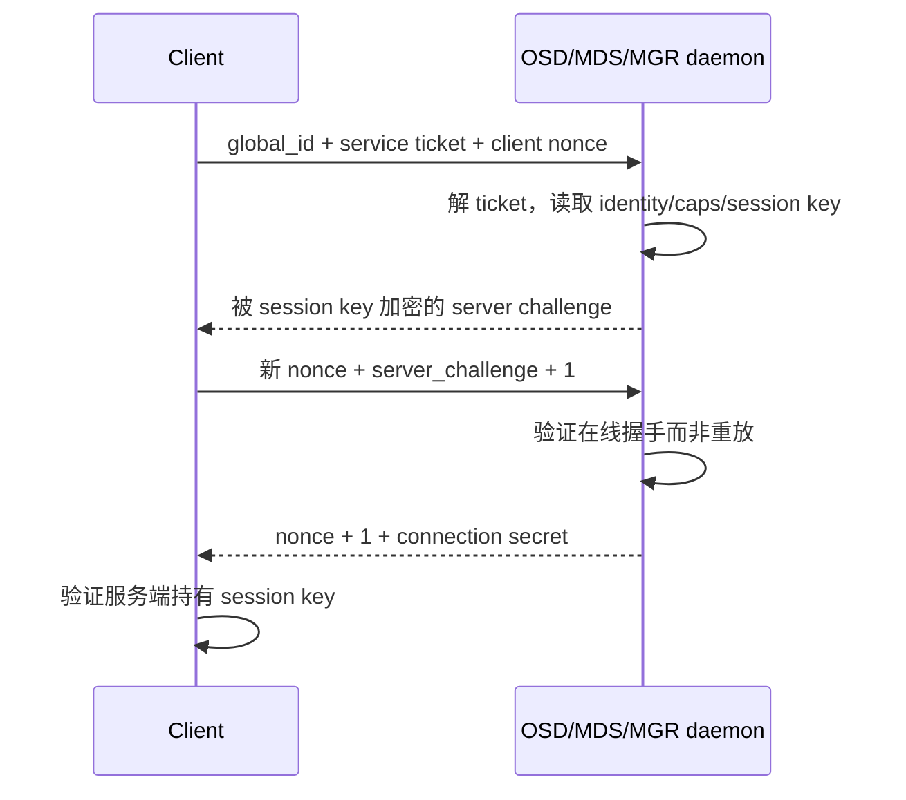

现代握手用 challenge/nonce 证明请求新鲜。服务端从 ticket 读取 caps 并执行授权，客户端用响应和 nonce 递增验证对端。

### 5.5 capabilities 作用在哪里

| 服务 | 常见授权维度 | 架构意义 |
|---|---|---|
| MON | `r/w/x`、profile、来源 CIDR | 读地图、改状态、执行 auth 操作 |
| OSD | `r/w/x`、class read/write、pool、namespace、object prefix、application tag、CIDR | 数据面和 Object Class 权限 |
| MGR | `r/w/x`、command/service/module、参数匹配、CIDR | 管理模块与命令权限 |
| MDS | CephFS path、layout、snapshot 等 | 文件命名空间授权 |

Ceph 的 `client.*` entity 不等同于 RGW 最终用户或 CephFS POSIX UID。RGW 用 Ceph client 身份连接 RADOS，却另行管理 S3/Swift 用户；CephFS 的 POSIX 身份也属于文件系统语义。

Pool 是较重的隔离单元；namespace 可在同一 pool 内给 `librados` 对象提供轻量分组并用 OSD caps 限权，不产生新 PG 集合。

### 5.6 CephX 明确不提供什么

- CephX 不加密静态数据。
- 仅启用消息签名只能检测有限的在途篡改，不等于在途加密。
- 在途机密性要依靠 Messenger v2 secure mode 等传输机制。
- CephX 保护 Ceph client 到 daemon；最终用户到 RGW、应用或挂载主机的外层连接须另行保护。
- 长期 key 泄露后，攻击者可冒充对应 entity；短期 ticket 只能缩短暴露时间。

### 5.7 TTL、密钥轮换与 Tentacle 密码类型

Auth/service tickets 都有 TTL，客户端必须续期。服务端通常保留当前和前一代 rotating service secret，让轮换期间未到期票据继续有效；从失陷 daemon 窃取的服务密钥会在有限时间后失效。

同一 service 默认通常保留三代 rotating service secret。旧 ticket 标明加密它的 `secret_id`，服务可用对应代际解开；这让当前 secret 轮换时，尚未到期的 ticket 不会瞬间全部失效。初始认证之后的服务消息还可按配置使用 session key 签名，以检测有限的在途篡改；签名仍不等于加密。

Tentacle 还必须把 credential key type 升级纳入生命周期：允许新旧 cipher 共存，设置新 key 的首选 cipher，逐个轮换 `mon/mgr/osd/mds` 和客户端 key，确认不安全 key 告警清除，切换 rotating service cipher，最后移除旧 cipher。顺序错误会让 daemon 或 `client.admin` 无法再次认证。`cephadm` 和 Rook 可自动化 daemon 侧步骤，客户端 key 分发仍由运维流程负责。

### 5.8 Keyring 搜索、`client.admin` 与最小权限

启用 CephX 后，客户端默认搜索路径包含 `/etc/ceph/$cluster.$name.keyring`；`cephadm` 环境中的管理员文件通常是 `/etc/ceph/ceph.client.admin.keyring`。Daemon keyring 默认位于自身 data directory，例如 `osd.12` 使用 `/var/lib/ceph/osd/ceph-12/keyring`。直接把 key 写进 `ceph.conf` 不利于权限和轮换管理，不作为生产主路径。

手工 bootstrap 的管理员实体可这样建立：

```bash
ceph auth get-or-create client.admin \
  mon 'allow *' mds 'allow *' mgr 'allow *' osd 'allow *' \
  -o /etc/ceph/ceph.client.admin.keyring
```

该命令的输出路径可能覆盖既有文件，部署工具已经生成 keyring 时不得盲目重跑。`client.admin` 是应急和集群管理身份，不是业务应用共享账号；它常被复制到多个管理节点，意味着每个副本都是等价的全权凭据，必须建立清单、文件权限、分发与撤销记录。

Capability 的可执行语法可以压缩为以下模型：

```text
mon 'allow <r|w|x|*> [network <CIDR>]'
osd 'allow <r|w|x|class-read|class-write|*> \
     [pool=<pool>] [namespace=<namespace>] [object_prefix <prefix>] \
     [tag <application> <key>=<value>] [network <CIDR>]'
mgr 'allow <r|w|x|*> [network <CIDR>]'
mds '<CephFS path/layout/snapshot capability>'
```

`r` 允许读；MON 至少需要它才能取 map。`w` 允许对象写；`x` 在 OSD 上允许调用 class method、在 MON 上允许 auth 操作。`class-read/class-write` 是比 `x` 更窄的 Object Class 权限。任何 OSD cap 若未限制 pool，默认可触及所有 pool，这是权限审查中最危险的遗漏之一。

| 客户端身份 | 建议最小权限例 | 不能省略的边界 |
|---|---|---|
| 单 pool `librados` 应用 | `mon 'allow r'`；`osd 'allow rw pool=orders namespace=prod'` | 若调用 Object Class，再按需加 `x` 或 class 子权限 |
| 只读 RBD | `mon 'profile rbd'`；`mgr 'profile rbd-read-only pool=images'`；`osd 'profile rbd-read-only pool=images'` | pool/namespace 在支持该参数的服务上保持一致 |
| 读写 RBD | MON/MGR/OSD 使用 `profile rbd` 并限定 pool/namespace | MON profile 还提供 RBD 客户端需要的最小 blocklist 权限 |
| CephFS client | `mon 'allow r'` 或 `profile fs-client`，MDS cap 限定 fs/path，OSD cap 限定 data pool | POSIX UID 不能替代 CephX 边界 |
| 自动化角色管理 | `profile role-definer` | 它拥有整个 auth 子系统权力，只能给受控自动化，不给普通运维 |

官方 profiles 是经过审计的权限组合，不是“管理员权限”的别名：`profile osd` 用于 OSD heartbeat、复制与报告；`profile bootstrap-osd/mds/rbd/rbd-mirror` 只给相应 bootstrap 工具创建所需 key 的能力；`profile simple-rados-client` 给直连应用读取 MON/OSD/PG 信息，`simple-rados-client-with-blocklist` 额外允许 HA 应用加 blocklist；`profile fs-client` 可读 MON/OSD/PG/MDS 信息；`profile rbd-mirror` 还允许读取镜像所需 config-key secret。

Namespace 只增加对象名的轻量逻辑分组，不增加新 PG；它主要服务直接 `librados` 应用，末尾 `*` 支持前缀式 namespace 匹配。Application tag 可按 pool 的应用 metadata 授权，`object_prefix` 可进一步约束对象名前缀。三者都必须结合业务命名稳定性设计，不能把可变用户名直接拼入宽泛通配符。

### 5.9 Tentacle 密钥轮换的安全顺序

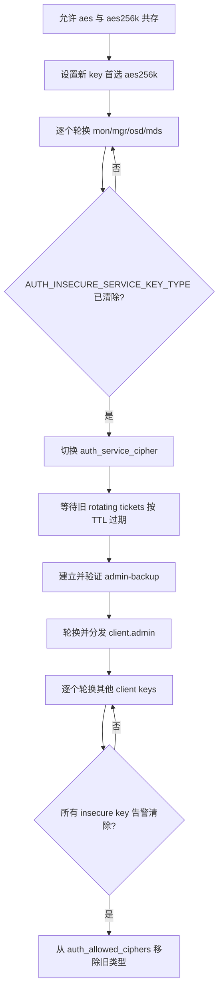

关键失败边界如下：

1. 轮换 daemon key 会让仍持旧 key 的 daemon 无法再次认证，因此按实例停止、轮换、写入正确 data directory，再启动验证；BlueStore OSD 还可能需要同步设备 label 的 `osd_key`。
2. `mon.` key 轮换后保存输出；轮换时不在 quorum 的 MON 不会自动得到新 key，必须用保存的 keyring 恢复。
3. 切换 `auth_service_cipher` 后，通常等待旧 rotating service keys 数小时自然过期。`ceph auth wipe-rotating-service-keys` 会迫使服务和新客户端刷新，只在所有 daemon 均理解新 cipher 时使用；它不改变客户端与 daemon 已建立的 session。
4. 轮换 `client.admin` 前先创建只具必要 MON 权限的 `client.admin-backup`，实测它能执行 `auth ls`；新 admin key 导入并实测后立即删除备份身份。
5. 只有 `AUTH_INSECURE_SERVICE_KEY_TYPE`、`AUTH_INSECURE_CLIENT_KEY_TYPE` 等对应告警全部清除，才能从 `auth_allowed_ciphers` 移除旧类型。误删后只能在 MON 本地配置临时 `mon_auth_emergency_allowed_ciphers` 救援；它会产生健康告警，恢复后立即清除。

Caps 或 key 更新不会神奇地重写所有既有会话。Ticket 有 TTL，wipe rotating keys 也明确不影响已建立 client-service sessions；高风险撤权要同时考虑 ticket/session 生命周期、连接重建和业务侧凭据回收，而不是只以 `ceph auth get` 的新输出判断完成。

## 6. 智能 OSD 如何消除中心瓶颈

集中式存储常经历两次调度：客户端先到 gateway/broker，再由它找数据节点。在大规模环境，这个入口限制连接、带宽并形成故障点。Ceph 客户端、MON 和 OSD 都理解地图，位置计算、连接、复制、校验和恢复被分摊到整个集群。

客户端只在需要时与相关 OSD 建立会话。OSD 又能直接与其他 OSD 和 MON 通信，所以：

- 读写带宽随 OSD 和客户端横向扩展；
- primary 替客户端完成复制或 EC 编码；
- OSD 互相检测故障并报告 MON；
- PG 自行 peering、恢复和 scrub；
- 客户端网卡不向每个副本重复发送 payload。

代价是 OSD 不能当“只装磁盘的哑盒子”。CRUSH、编码、checksum、RocksDB、recovery 和 scrub 都消耗 CPU、内存和网络。

### 6.1 `up/down` 与 `in/out` 是两个维度

| 状态 | 含义 | 后果 |
|---|---|---|
| `up + in` | daemon 可达且参与放置 | 正常服务 |
| `down + in` | daemon 不可达，但 OSDMap 仍期望数据在那里 | PG degraded/peering，等待恢复或自动 out |
| `up + out` | daemon 可运行，但 CRUSH 不再给它分配正常数据 | 维护或已迁出阶段 |
| `down + out` | daemon 不可达且不再承担目标放置 | 数据应已或正在迁往别处 |

Down 不会必然立即变 out。先 down、等待 `mon_osd_down_out_interval`、再 out，可避免短暂重启触发整盘迁移。

## 7. Heartbeat、状态报告与故障判定

### 7.1 相邻 OSD heartbeat 是主路径

OSD 以小于 6 秒的随机间隔检查邻居。邻居在默认 20 秒 `osd_heartbeat_grace` 内没有 heartbeat 时，观察者可向 MON 报告 down。默认需要不同 host/CRUSH subtree 的两个 OSD 报告者，MON 才接受结论。

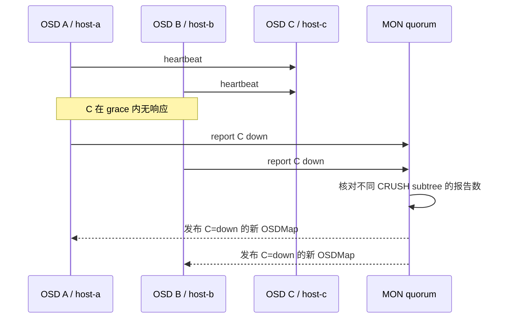

`mon_osd_reporter_subtree_level` 定义报告者怎样按 CRUSH 祖先分组，`mon_osd_min_down_reporters` 定义独立子树数。这降低同一坏交换机让整组 OSD 对另一侧一致误判的风险。

### 7.2 OSD 自报告是兜底和状态输入

OSD 启动、故障、PG stats 或 `up_thru` 变化时报告 MON；即使无事件，默认也在最长 120 秒内报告。MON 超过 `mon_osd_report_timeout` 没收到报告，可以判 down。正常故障发现仍优先依赖邻居报告。Luminous 前消息为 `MPGStats`，Luminous 起为 `MOSDBeacon`。

一个 OSD 无法与地图中的 peers 完成 peering 时，会每 30 秒向 MON 请求最新地图，由 `osd_mon_heartbeat_interval` 控制。它先排除地图落后，而不是永久重试旧 acting set。

Heartbeat 参数宜在 `[global]` 保持 MON/OSD 认知一致。grace 过小会把网络抖动或磁盘尾延迟误判为故障，引发 peering 风暴；过大则延长不可用副本发现窗口。

## 8. Pool、PG 与 CRUSH：位置计算链

### 8.1 Pool 是策略边界

Pool 至少决定对象所有权和访问范围、PG 数量、replicated 的 `size/min_size` 或 EC profile、CRUSH rule、应用标签和 quota。

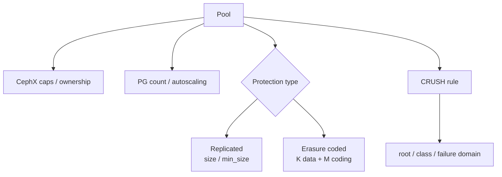

每个 pool 都带来 PG、内存和控制面开销。只有需要独立保护、放置、性能或管理边界时才新建 pool；仅需轻量分组可考虑 namespace。

### 8.2 为什么中间需要 PG

若客户端直接记“对象 X 在 osd.17”，每次扩缩容都会改变大量客户端状态。Ceph 先把海量对象 hash 到有限 PG，再由 CRUSH 把 PG 映射到 OSD。PG 同时是对象集合、间接层，以及 peering、recovery、backfill、scrub 的一致性单元。

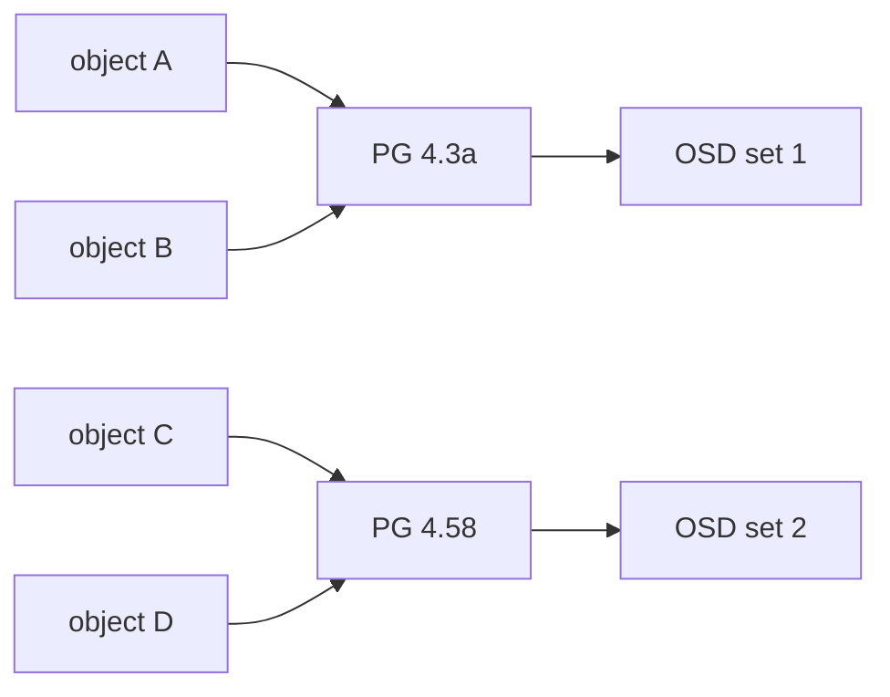

### 8.3 从对象名算出 PG ID

官方使用 pool `liverpool`、对象 `john` 来解释概念链：输入 pool 和 object ID；hash object ID；按该 pool 的 PG 空间归并，示例得到 `58`；pool name 查到 ID `4`；形成 PG `4.58`。真实实现还受 `hashpspool`、当前 `pg_num/pgp_num` 与稳定取模逻辑影响，不能把“普通整数 `% pg_num`”当作可复刻 Ceph 映射的实现公式；应以 `ceph osd map` 的结果为准。真实 PG seed 常以十六进制显示，如 `1.1701b`。

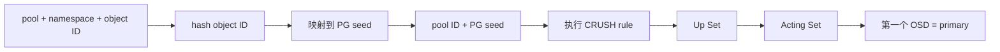

诊断命令：

```bash
ceph osd lspools
ceph osd map <pool-name> <object-name> [namespace]
ceph pg map <pool-id.pg-id>
```

计算比查询全局对象目录更快。客户端有 object ID、pool 和足够新的地图，就能直达预期 primary。

### 8.4 `pg_num` 与 `pgp_num` 分离了逻辑拆分和物理迁移

`pg_num` 是 pool 中逻辑 PG 总数；`pgp_num` 是参与 placement 计算的有效 PG 数，合法范围是 `1..pg_num`。稳态下二者应相等，但调整窗口中有意分离：先改变逻辑分组，再逐步改变物理放置，避免瞬间产生全部 backfill。

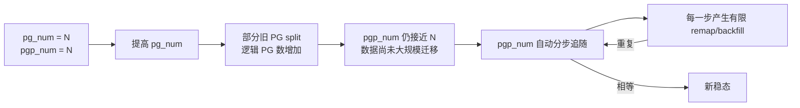

从 Nautilus 起，无论 `pg_num` 由 autoscaler 还是管理员修改，Ceph 通常都会自动、渐进调整 `pgp_num`。增加 `pg_num` 会先 split PG；只有 `pgp_num` 随后增加，相应对象才 backfill 到新的 placement。降低时也由系统渐进处理。观察窗口使用：

```bash
ceph osd pool get <pool> pg_num
ceph osd pool get <pool> pgp_num
watch ceph osd pool ls detail
ceph pg stat
```

手工把二者同时跳到目标值会丢掉官方设计的迁移摊销。正常现象是调整期间出现一轮轮 `remapped/backfilling`，而不是要求每一刻二者相等。

### 8.5 PG autoscaler 的预算与代价

PG 太少时，每个 PG 承载的数据更多，OSD 间对象数量和容量方差上升，并行度不足；PG 太多时，每个 PG 都持续消耗 OSD/MON 的内存、CPU、网络与 peering/recovery 时间。成本按“所有 pool 的 PG 数 × replica/EC fan-out”累加，所以创建大量小 pool 会乘法放大开销。

| 决策输入 | autoscaler 如何使用 | 误配结果 |
|---|---|---|
| 实际数据或 `target_size_bytes/ratio` | 估计 pool 在 CRUSH subtree 内的容量占比 | 目标严重重叠会产生健康告警，不能超卖同一容量 |
| replica size 或 `K+M` | 换算 PG replicas/shards 的 OSD 预算 | 只看逻辑 PG 数会低估 OSD 负担 |
| `pg_autoscale_bias` | 对特定 pool 的估计份额加权 | 过大让一个 pool 挤占预算 |
| `bulk` | 初始给大池较完整 PG 数，再按用量下调 | 空间预期不明确时会过早创建很多 PG |
| `pg_num_min/max` | 限制自动缩放下界/上界 | 适合保护最低并行度或控制资源上限 |

`pg_autoscale_mode` 为 `on` 时执行建议，`warn` 只告警，`off` 不管理，可用 `ceph osd pool set <pool> pg_autoscale_mode on|warn|off` 变更。Autoscaler 按预算给每个 pool 计算 target，尽量舍入到 2 的幂；相同配置的 pool 作为组同向舍入，以公平优先于让某一个 pool 独占余量。没有 balancer 时官方建议值通常约 200 PG replicas/OSD；启用 balancer 且使用默认设置时，初始常见约 50-70 PG replicas/OSD。这里的 replicas 是 `ceph df` 的 `PGS` 维度，不是“全局逻辑 PG 数除以 OSD 数”。

`hashpspool` 使 pool ID 参与 hash，改善不同 pool 间映射相关性；生产新 pool 应保留该标志。已有 pool 修改 hash、PG 数或 placement 规则都会改变对象位置，必须和 CRUSH 变更一样纳入迁移预算。

## 9. CRUSH：稳定、拓扑感知、去中心化

CRUSH（Controlled Replication Under Scalable Hashing）以 PG、设备权重、CRUSH hierarchy 和 rule 为输入，伪随机但确定性地选择 OSD。客户端和 OSD 执行同一算法。

Hierarchy 可表达 `device -> host -> chassis -> rack -> row -> room`。Rule 的 failure domain 若是 `host`，同一 PG 的副本/shard 应分散到不同主机；承受机架失效必须选择 `rack` 等更高层级，并确保拓扑与可选设备数满足规则。

`size=3` 或 `M=2` 只描述副本/shard 数量，不自动代表能承受两台主机或两个机架。CRUSH 拓扑错误时，副本可能共享电源、交换机等真实故障域。

### 9.1 新增 OSD 为什么不全量洗牌

新增 OSD 产生新 OSDMap/CRUSH 输入。CRUSH 的稳定性让大部分 PG 保持原集合，只有映射变化者迁移；新 OSD 最终获得与权重相称的数据，而不是成为所有新写的热点。

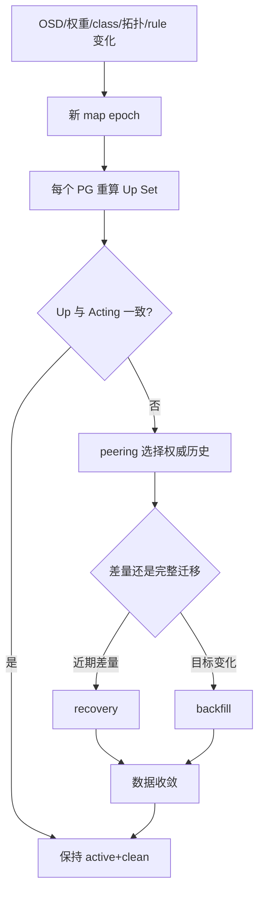

稳定放置减少迁移量，却不取消扩容的磁盘、网络和恢复成本。

### 9.2 Hierarchy、bucket、location 与 weight

CRUSH hierarchy 的叶子是非负整数 ID 的 OSD device，内部节点统称 bucket。默认 type 从低到高可包括 `osd/device`、`host`、`chassis`、`rack`、`row`、`pdu`、`pod`、`room`、`datacenter`、`zone`、`region`、`root`；不要求每层都使用，也可以自定义 type，但生产设计应只编码真实、可维护的故障关系。

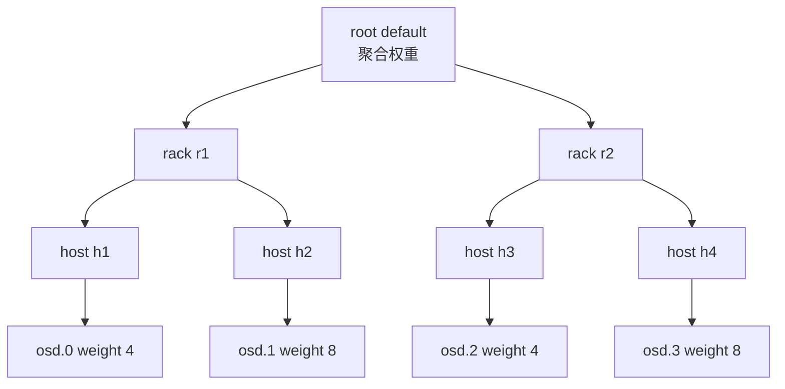

叶子 CRUSH weight 通常以 TiB 表示相对容量，父 bucket weight 自下而上求和。它决定长期数据份额，不等同于 OSDMap 的临时 `ceph osd reweight` override：

| 机制 | 修改入口 | 适用目的 | 长期处理 |
|---|---|---|---|
| CRUSH weight | `ceph osd crush reweight osd.N <weight>` | 设备容量或拓扑权重 | 保持与实际可用容量一致 |
| OSD reweight | `ceph osd reweight N <0..1>` | 临时降低某 OSD 的放置概率 | 排障后恢复 `1.0`，否则形成隐形倾斜 |
| Weight-set | compat 或 per-pool flat/positional | balancer 或特定 pool 精细纠偏 | 记录归属，避免和人工 CRUSH weight 相互打架 |
| Primary affinity | `ceph osd primary-affinity N <0..1>` | 调整成为 primary 的概率 | 只改 lead 倾向，不改变副本总份额 |

OSD location 是无顺序的 `type=value` 列表，例如 `root=default row=a rack=a2 chassis=a2a host=a2a1`。未显式配置时默认是 `root=default host=HOSTNAME`，其中 hostname 来自 `hostname -s`。OSD 启动会核对位置并在需要时自动移动；从默认切到显式 location 时若漏掉 `root=default`，既有 rule 可能找不到它。动态机房信息可由 `crush_location_hook` 生成，但 hook 输出失败、漂移或命名不一致会直接改变放置，必须纳入配置管理。

Device class 默认按介质识别为 `hdd/ssd/nvme`，也可人工设定；已设 class 必须先移除才可改。Ceph 为每个 class 生成只包含该类设备的 shadow hierarchy，rule 通过 `take <root> class <class>` 使用它。检查真实树时必须包含 shadow：

```bash
ceph osd tree
ceph osd crush tree --show-shadow
ceph osd crush rule dump
```

### 9.3 Rule 是 `take -> choose/chooseleaf -> emit` 的可执行程序

CRUSH rule 不是标签，而是一段从 hierarchy 选择结果的程序：`take` 选入口 bucket；`choose` 从当前 bucket 选下一级项；`chooseleaf` 先选指定 failure-domain bucket，再下降到 device；`emit` 把当前结果追加到最终 OSD 列表。`firstn` 通常服务 replicated pool，规则中的数量 `0` 表示使用 pool size，负值表示相对 pool size。

```text
rule replicated_ssd_by_rack {
    type replicated
    step take default class ssd
    step chooseleaf firstn 0 type rack
    step emit
}
```

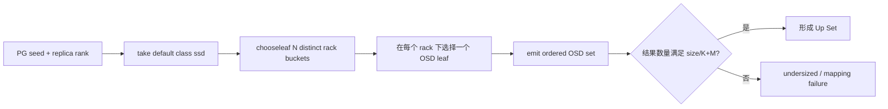

规则可满足性的硬约束是：可用 failure domain 数、每个 domain 内合格 class 设备数、`size` 或 `K+M`、被标 `out` 的设备以及 choose 重试次数必须共同允许完整结果。三副本、`failure-domain=host` 至少需要三个可选 host；九 shard EC 若只有八个合格 OSD，无论剩余容量多大都不能映射。恰好只有九个时也可能因 `choose_total_tries` 用尽而失败，此时应增加域/OSD或重新设计 profile，不能把不完整 acting set 当容量问题。

### 9.4 EC rule 与 CRUSH MSR

EC profile 中控制放置的字段包括：

| 字段 | 默认/语义 | 约束 |
|---|---|---|
| `crush-root` | `default` | 所有 shard 的 hierarchy 入口 |
| `crush-failure-domain` | `host` | shard 跨哪些 bucket 分散 |
| `crush-device-class` | 无限制 | 限定介质 class |
| `crush-osds-per-failure-domain` | `1` | 每个 failure domain 最多选几个 OSD |
| `crush-num-failure-domains` | 由布局决定 | 与上一字段必须同时指定 |
| `k/m/l` | data/coding/locality shard 数 | 决定总 fan-out 和 rule 可满足性 |

普通 `chooseleaf` 能在某个 OSD `out` 时把选择迁往新 host，但不支持同一 failure domain 选择多个 OSD后再正确回溯。Squid 新增的 CRUSH MSR（multi-step retry）在遇到 `out` OSD 时重试此前所有步骤，从而支持“固定数量的 failure domains，每个域多个 OSD”。当 `crush-osds-per-failure-domain > 1` 时会创建 MSR rule；所有 OSD 和客户端必须支持 `CRUSH_MSR` feature bit（Squid 或更新）。这不是只升级 MON 就能启用的服务器侧功能。

EC profile 正常情况下不原地修改。新建 profile 和 rule，再迁移 pool/数据，才能让配置、实际 rule 和历史数据语义保持清楚。

### 9.5 Tunables、bucket algorithm 与客户端兼容性

CRUSH tunables 是映射算法协议的一部分。升级 profile 后，MON/OSD 会拒绝不支持相应 feature 的旧客户端；kernel RBD/CephFS 也算客户端，不能只盘点用户态包。历史 profile 的关键差异：

| Profile/feature | 解决的问题 | 数据迁移影响 |
|---|---|---|
| `bobtail` / `CRUSH_TUNABLES2` | 小 leaf bucket、多层 hierarchy 或 OSD out 时难以选足副本；把 `choose_total_tries` 的典型最优值提高到 50 | 从 `argonaut` 切换产生中等迁移 |
| `firefly` / `CRUSH_TUNABLES3` | `chooseleaf_vary_r` 改善大量 OSD out 时映射不足；`straw_calc_version=1` 修复特殊权重分布 | `vary_r 0->1` 可产生大量迁移；straw 修复后再改权重会迁移 |
| `hammer` / `CRUSH_V4` | 引入 `straw2`，权重变化只应影响该 item 的映射 | 仅切 profile 不改旧 bucket；把 bucket `straw->straw2` 会迁移，等权时最少 |
| `jewel` / `CRUSH_TUNABLES5` | `chooseleaf_stable=1` 显著减少 OSD out 后的无关 remap | 既有集群切换可让几乎所有 PG mapping 改变 |

`straw2` 是新 bucket 默认算法，它的价值不是“更随机”，而是调一个 item 权重时只移动应流入或流出该 item 的映射，避免旧 `straw` 改动无关 item。`HEALTH_WARN crush map has non-optimal tunables` 不能靠静默告警代替评估：`ceph osd crush tunables optimal` 可能移动约 10% 数据，须先完成客户端 feature 盘点、容量余量和恢复限流计划；必要时可回退 `legacy`，但这只是恢复兼容，不是长期终态。

### 9.6 变更必须先离线模拟，再观察实际迁移

CRUSH 的输入或算法任何一项改变都可能生成新 Up Set：移动 bucket、改 weight/class/rule、切 tunables、切 bucket algorithm 或 primary 策略都不是“纯配置”。生产变更采用下面的证据链：

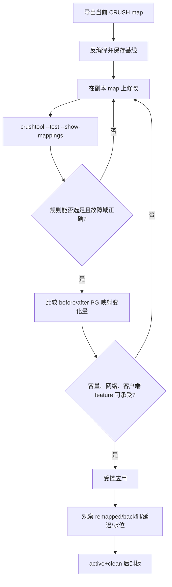

```bash
ceph osd getcrushmap -o crush.before.bin
crushtool -d crush.before.bin -o crush.before.txt
crushtool -c crush.candidate.txt -o crush.candidate.bin
crushtool --test -i crush.candidate.bin --show-mappings \
  --rule <rule-id> --num-rep <size> --min-x 0 --max-x 10000
```

离线样本要覆盖足够多 PG seed，并模拟 OSD/host/rack `out` 后是否仍选足、是否跨预期 failure domain。上线后以 `ceph pg stat`、OSD/PG 分布和网络磁盘负载验证；不能只凭文本 diff 判断影响。

### 9.7 Primary 调优与混合介质的真实代价

Replicated pool 默认由 primary 服务读取。`primary-affinity` 范围 `0..1`，默认 `1`；降低只减少某 OSD 成为 acting set 第一项的机会，不把它从副本集合移除。官方在不同容量 SATA SSD 混合集群中曾通过近似反比调 affinity 获得约 15% 读取提升，但该结果是特定硬件实测，不是通用承诺。EC pool 的读优化还需结合 fast read，不应照搬 replicated 策略。

“SSD 永远 primary、HDD 保存其余副本”的自定义 rule 有三个隐藏成本：第一，若 SSD/HDD 位于同一 host，为保证 N 个副本跨 host，规则可能选择 N+1 个 OSD；第二，若分为互不重叠的 `ssd_hosts/hdd_hosts` roots，所有正常客户端请求会集中到 SSD hosts，需要为其 CPU 与网络加码；第三，SSD primary 故障后，PG 会暂由慢 HDD primary 服务，直到替代 SSD 副本完成。混合池因此是明确的成本/延迟设计，不是免费缓存层。

## 10. Up Set、Acting Set、Primary 与 peering

### 10.1 两个集合不能混用

| 概念 | 精确定义 | 常见观察 |
|---|---|---|
| Up Set | 当前 CRUSH/OSDMap 期望承载该 PG shard 的 OSD | 数据将迁入的目标集合 |
| Acting Set | 当前有可工作 shard、负责处理请求的集合 | 客户端请求实际由它处理 |
| Primary | Acting Set 第一个 OSD | 唯一接受该 PG 客户端写并组织 peering |
| Replica | Acting Set 其余 OSD | 接受 primary subop 或 shard 写 |

稳定时二者相同。扩容、故障、恢复或 `pg_temp` 期间可不同：旧 Acting Set 继续服务，数据向新 Up Set 迁移。`ceph pg map` 会同时显示两者。

官方示例 acting set `[osd.25, osd.32, osd.61]` 中，25 是 primary；25 失败时，32 可成为新 primary。

### 10.2 peering 选择历史，不等于复制完成

Primary 让保存同一 PG 的 OSD 比较 epoch、PG log、missing 与 `last_complete`，构造从上次成功 peering 以来所有已确认写的完整有序历史。它回答“哪条历史权威、每个 peer 缺什么”。

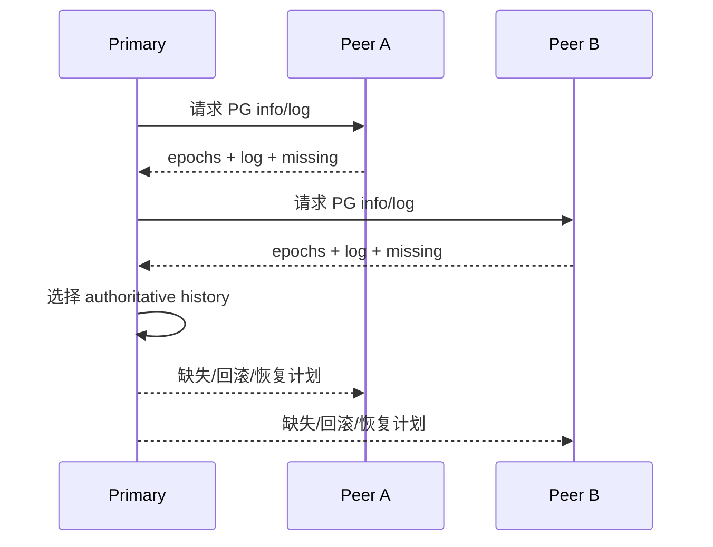

Peering 完成只表示状态达成一致，不表示每个 peer 已有最新数据。PG 可以 `active` 同时 `degraded/recovering/backfilling`。

### 10.3 复合 PG 状态

| 状态 | 含义 | 服务判断 |
|---|---|---|
| `creating` | pool 创建后建立 PG | 尚未 peering |
| `peering` | 比较历史 | 通常暂不能写 |
| `active` | primary 可处理读写 | 可与 degraded 并存 |
| `clean` | 目标副本/shard 齐全且无 stray | 理想稳态 |
| `degraded` | 对象副本/shard 不足 | active 且满足 min_size 时可服务 |
| `recovering` | 落后 OSD 按日志补差量 | 与业务争用资源 |
| `backfill_wait` | 等待 backfill | 尚未收敛 |
| `backfilling` | 扫描迁移 PG | 常见于新增/替换 OSD |
| `backfill_toofull` | 目标接近阈值而拒绝 | 条件不变就不能继续 |
| `remapped` | 目标与当前服务集合不同 | 数据迁移中 |
| `stale` | primary 未及时报告 PG stats | primary 或通信异常 |
| `inactive` | 无法读写，常在等权威数据 OSD | 不可用 |
| `unclean` | 目标冗余未满足 | 可能恢复中或卡住 |
| `undersized` | acting shard 数低于 size | 数据保护降低 |
| `incomplete` | 无足够完整历史激活 PG | 须找回权威数据 |

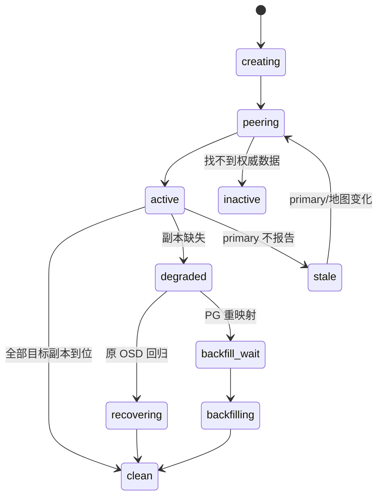

`active+degraded+remapped` 是同一 PG 同时可服务、副本不足、目标映射已改变。

### 10.4 `size` 与 `min_size`

`size` 是复制池期望副本数；`min_size` 是允许继续 I/O 的最小可用数。官方说明 R2 是最低安全线，却推荐 R3：时间足够长时，双副本更容易在第一次故障恢复前遇到第二次故障。

常见 `size=3,min_size=2` 可在一个副本故障时 degraded 服务，又不在只剩一份数据时继续写。它不是无条件模板；必须结合故障域、设备 AFR、恢复时间和业务 RPO。

## 11. 复制池的一次写入

客户端只把 payload 发给 primary，primary 找 secondary 并发送 replication subops。

```mermaid
sequenceDiagram
  participant C as Client
  participant P as Primary OSD
  participant R1 as Replica OSD 1
  participant R2 as Replica OSD 2
  C->>P: 1. write(object, version n)
  P->>P: 记录 PG transaction
  par 复制 subop
    P->>R1: 2. write replica
    P->>R2: 3. write replica
  end
  R1-->>P: 4. persisted ACK
  R2-->>P: 5. persisted ACK
  P-->>C: 6. 满足确认条件后 ACK
```

结论：客户端出口只承担一次业务写；primary 延迟受最慢必要副本、设备持久化和网络尾延迟影响；primary 是某 PG 在某 epoch 的角色，不是永久节点身份。

## 12. Recovery、backfill 与不可找回数据

Recovery 依赖 PG log，给短期离线 OSD 补近期差量。Backfill 面向新目标 OSD 或日志范围不足，扫描并迁移更完整的 PG 内容。二者都和业务争用资源；mClock 激活时部分旧并发参数不直接生效，除非显式允许覆盖。

默认 `mon_osd_down_out_interval=600` 秒：OSD 被判 down 后通常等待十分钟才自动 out，目的是让短暂重启优先原位 recovery，避免立即整盘 remap/backfill。值为 0 虽可阻止自动 out，却会让长期 down+in 的数据持续缺副本，生产必须配套明确的维护和人工 out 流程。

### 12.1 Recovery/backfill 的资源闸门

| 参数/水位 | 官方语义 | 默认值或关键限制 |
|---|---|---|
| `osd_recovery_delay_start` | OSD 启动后先 re-peer、处理 replay，再开始 recovery | 避免重启风暴立即占满资源 |
| `osd_recovery_max_active` | 限制单 OSD 同时处理的 recovery 请求 | mClock 启用时相关值可被 profile 重置 |
| `osd_recovery_max_chunk` | 限制每个 recovery 数据块大小 | 防止大 chunk 长时间占网 |
| `osd_max_backfills` | 每个 OSD 同时进/出的 backfill 数 | 默认 `1`；mClock 下除非 `osd_mclock_override_recovery_settings=true`，否则不能按旧思路直接改 |
| `backfill_full_ratio` | 目标 OSD 到此利用率拒绝 backfill | 默认 `0.90`，用 `ceph osd set-backfillfull-ratio` 改 OSDMap |
| `osd_backfill_retry_interval` | backfill 被拒后重试间隔 | 默认 `30` 秒 |
| `osd_backfill_scan_min/max` | 每轮扫描对象数范围 | 默认 `64/512` |

mClock 把 client、background recovery、background best effort 分为不同服务类，用 reservation、weight、limit 仲裁 OSD I/O。旧的“把 backfill 并发调小就一定保护业务”在 mClock profile 下不成立：先确认实际 `osd_op_queue` 和 profile，再决定是否允许 override。调低恢复资源会改善前台尾延迟，却延长 degraded 风险窗口；调高则相反，必须以业务 SLO 和重叠故障概率共同决策。

PG 卡在 `down+peering` 时，`ceph pg <pgid> query` 的 `recovery_state` 会指出 probe 对象和阻塞 OSD。正确动作通常是恢复那块 OSD，而不是立即声明 lost。

`ceph osd lost <id>` 是危险的数据决策：它让集群放弃等待该 OSD，其余副本不一定最新一致。只有介质确认不可恢复、所有位置已核销、业务接受潜在丢失时才使用。

### 12.2 unfound 如何形成

设对象只有 OSD 1、2 两份：1 down；2 单独接受新写；1 回来并发现缺对象；新对象尚未复制给 1，2 又 down。此时 1 知道更高版本存在，却没有在线副本可提供，形成 `unfound`。该对象 I/O 阻塞，其他对象仍可能可用。`size=2` 和 EC `M=1` 的风险就在这种重叠故障窗口。

```mermaid
flowchart TD
  U[发现 unfound] --> LIST[list_unfound / query]
  LIST --> LOC{还有可能持有数据的 OSD?}
  LOC -->|有| RESTORE[恢复该 OSD并等待 probe]
  LOC -->|确认全部丢失| DECIDE{业务处置}
  DECIDE -->|复制池且接受旧版| REVERT[mark_unfound_lost revert]
  DECIDE -->|接受对象消失| DELETE[mark_unfound_lost delete]
  DECIDE -->|不能接受| STOP[停止破坏性操作，转介质恢复]
```

`revert` 不适用于 EC pool；对新对象也可能等价于删除。`delete` 让集群忘记对象。两者都不是修复，而是已确认丢失后的失败语义选择。

### 12.3 卡住 PG 的证据驱动诊断树

先确定是“还在合理迁移”还是“前置条件永远无法满足”：

```bash
ceph health detail
ceph pg stat
ceph pg dump_stuck inactive
ceph pg dump_stuck unclean
ceph pg dump_stuck stale
ceph pg <pgid> query
ceph osd tree
ceph osd dump
```

```mermaid
flowchart TD
  A[PG 非 active+clean] --> B{inactive / peering / down?}
  B -->|是| C[读取 query.recovery_state 与 blocked_by/probe]
  C --> D{需要的 OSD 是否存在且可恢复?}
  D -->|是| E[修复 daemon/设备/网络并等待 peering]
  D -->|否| F{规则是否根本不可满足?}
  F -->|OSD/域不足| G[增加合格 OSD 或重建合适 pool/profile]
  F -->|choose tries 不足| H[离线验证后调整 rule/tunable]
  F -->|可能永久丢失| I[进入 unfound 处置]
  B -->|否| J{backfill_wait/toofull/remapped?}
  J -->|toofull| K[释放或增加目标容量，检查 CRUSH 倾斜]
  J -->|wait/remapped| L[检查 mClock/并发/网络/慢 OSD]
  J -->|inconsistent| M[证明权威副本后 repair]
  E & G & H & K & L & M --> N[持续观察至 active+clean]
```

典型永久前置条件错误包括：

- 单节点集群却创建 `size=2/3` 的 replicated pool，或者在线 OSD 数少于 `size`；PG 无法获得完整 acting set。测试若必须单副本，应明确设置 `size=1` 并接受任何设备故障都可能丢数据，绝不外推到生产。
- EC `K+M` 大于符合 rule/class 的 OSD 数，或 failure domain 数小于规则要求。增加不匹配 class/不在目标 root 的 OSD没有帮助。
- OSD 数量刚好够，但 CRUSH 在 `choose_total_tries` 内找不到合法组合。先用 `crushtool` 复现，不要反复重启 daemon。
- PG 的 pool 存在，但 CRUSH rule 没有任何可选目标，形成没有归属 OSD 的 homeless PG。修复 rule/root/class 后才可能 peering。
- `stale` 表示 primary 长时间未向 MON 报告 PG stats，先查 primary 是否 down、网络是否分区、OSDMap 是否前进；它不是普通 backfill 慢。

`inconsistent` 表示 scrub 发现对象存在性、属性、size 或 checksum 在副本间不一致。`ceph pg repair` 对 replicated pool 会把不一致副本标 missing，再由 recovery 重建；它并不总能自动判断哪份内容在业务上权威。若所有副本的 checksum 都与历史 digest 不同，盲目 repair 可能把错误版本扩散。先结合 `rados list-inconsistent-obj`、scrub error、应用校验或备份证明权威数据，再执行修复。EC/BlueStore 仅在 `osd_scrub_auto_repair=true` 且错误数不超过默认 `osd_scrub_auto_repair_num_errors=5` 时可自动 repair，默认自动修复关闭。

### 12.4 `lost` 与 `mark_unfound_lost` 是业务数据裁决

```mermaid
flowchart TD
  U[对象 unfound] --> P[list_unfound 显示 locations]
  P --> A{所有可能位置都已 probe?}
  A -->|否| R[恢复/挂载/取证缺失 OSD]
  A -->|是| B{还有离线介质可恢复?}
  B -->|是| R
  B -->|否| C[冻结写入并取得业务/RPO批准]
  C --> D{复制池存在可接受旧版?}
  D -->|是| V[mark_unfound_lost revert]
  D -->|否| E{业务接受对象永久消失?}
  E -->|是| X[mark_unfound_lost delete]
  E -->|否| S[保持阻塞，转备份或介质恢复]
  V & X --> Q[校验对象清单、上层索引与业务一致性]
```

`ceph osd lost <id>` 告诉集群永远不要再等某 OSD，可能允许旧副本成为权威；只有确认设备不可恢复且已核对该 OSD 承载的所有风险时才可执行。`revert` 只适合 replicated pool，回到先前版本；对象若从未有旧版，结果可能仍是删除。EC 不支持 revert。`delete` 则让所有 pool 类型忘记 unfound 对象。三者都不可逆地改变数据事实，必须保存命令前 `query/list_unfound`、可能位置、介质结论、业务批准和命令后上层校验证据。

## 13. Scrub：持续证明静态数据正确

写入确认只能证明当时成功，不能发现日后坏扇区、bit rot、固件问题或 OSD bug。Ceph 按 PG 执行对象层 `fsck`：

| 类型 | 核验内容 | 常见周期 | 能发现的问题 |
|---|---|---|---|
| light scrub | 枚举对象，比较存在性、size、attributes | 通常每天 | 缺失、大小和元数据不一致 |
| deep scrub | 读取数据并核对 checksum | 通常每周 | 坏块和静默数据损坏 |

```mermaid
flowchart LR
  S[按 PG 调度] --> CAT[生成对象目录] --> META{size/attrs 一致?}
  META -->|否| INC[inconsistent]
  META -->|是| DEEP{deep scrub?}
  DEEP -->|否| OK[完成]
  DEEP -->|是| READ[读取并校验 checksum] --> DATA{内容一致?}
  DATA -->|是| OK
  DATA -->|否| INC
```

Scrub 可限制时窗、星期、并发、chunk、sleep、负载阈值和 recovery 期间行为。自动修复只适合明确上限内的少量错误，不能代替告警与介质治理。永久关闭 scrub 等于放弃持续完整性证明。

## 14. Erasure Coding：容量效率背后的一致性协议

### 14.1 `K+M` 的物理含义

EC pool 把对象编码为 `K` data chunks 和 `M` coding chunks，pool size 是 `K+M`。每个 chunk 以同名对象存在于 acting set 不同 OSD，`shard_t` 保存 rank。任意 K 个有效 shard 可还原对象，丢失超过 M 个则无法解码。

官方 `K=3,M=2` 示例把 `NYAN=ABCDEFGHI` 分成 `ABC`、`DEF`、`GHI`，不足整除时 padding，再生成 `YXY`、`QGC`。

```mermaid
flowchart TB
  N[NYAN<br/>ABCDEFGHI] --> E[encode K=3 M=2]
  E --> D1[rank 1<br/>ABC]
  E --> D2[rank 2<br/>DEF]
  E --> D3[rank 3<br/>GHI]
  E --> C1[rank 4<br/>YXY]
  E --> C2[rank 5<br/>QGC]
  D1 --> O5[OSD 5]
  D2 --> O2[OSD 2]
  D3 --> O1[OSD 1]
  C1 --> O3[OSD 3]
  C2 --> O4[OSD 4]
```

Ceph 通过抽象 API 加载 Reed-Solomon 等插件；profile 以 `plugin/technique/k/m/crush-failure-domain` 等 key/value 固化编码和放置。它是 pool 创建时的数据格式契约，不是随时可无损改写的旋钮。

### 14.2 读取不等待最慢 shard

若 OSD 4 out、OSD 2 最慢，解码器可用先返回的 rank 1、3、4，将 2、5 标成 erasures，重建原文。

```mermaid
sequenceDiagram
  participant P as Primary / Decoder
  participant S1 as shard 1: ABC
  participant S2 as shard 2: DEF (slow)
  participant S3 as shard 3: GHI
  participant S4 as shard 4: YXY
  participant S5 as shard 5: OSD out
  P->>S1: read
  P->>S2: read
  P->>S3: read
  P->>S4: read
  P-xS5: failed
  S1-->>P: ABC
  S3-->>P: GHI
  S4-->>P: YXY
  P->>P: 已有 K=3，decode erasures 2,5
```

系统码（systematic code）在 data chunks 齐全时可直接拼接；缺 data chunk 才 decode。性能还受 plugin、technique 和 packet size 影响；packet 太小会增加调用开销。

大 image 不整体放入内存编码。RBD 常切为许多 4 MiB 对象，RGW 也分段。编码/解码由 OSD 执行，因为 recovery 和 scrub 在原客户端不在线时也必须重建 shard。

### 14.3 `M` 不是无条件可用性承诺

`M=2` 只说明数学上最多丢两片仍可能恢复，还要求 shard 分布在独立故障域、至少 K 个同一权威版本可读、PG 满足 `min_size`、剩余资源足以解码且没有重叠损坏。某些恢复阶段还可能要求恢复到 `K+1` shards 才重新提供数据，不能把“可解码”直接等同“当前可用”。

### 14.4 中断 full write 不会混用 v1/v2

用 `K=2,M=1` 说明。初始 OSD 1/2/3 分别有 `D1v1/D2v1/C1v1`，PG log 到 `1'1`。Primary 收到 `WRITE FULL v2` 后异步发送 `D1v2/D2v2/C1v2`，每个 OSD 落 shard 时追加 `1'2`。

| 阶段 | OSD 1 | OSD 2 | OSD 3 | `last_complete` |
|---|---|---|---|---|
| v1 完整 | `D1v1` | `D2v1` | `C1v1` | `1'1` |
| v2 部分到达 | `D1v1,D1v2` | `D2v1`，v2 在途 | `C1v1,C1v2` | 仍为 `1'1` |
| v2 全部完成 | `D1v2` | `D2v2` | `C1v2` | 推进到 `1'2` 后才删 v1 |

若 OSD 1 在 v2 完成前 down，OSD 4 成为 primary。存活集合只有一个 v2 shard，小于 K=2，不能恢复 v2。Peering 找到共同 `last_complete=1'1`，将 OSD 3 的 `1'2` 判为 divergent，删除孤立 `C1v2`，再用 `D2v1+C1v1` 重建 `D1v1` 到 OSD 4。

```mermaid
stateDiagram-v2
  [*] --> v1_complete: K+M v1 shards / last_complete=1'1
  v1_complete --> v2_partial: 异步写 v2
  v2_partial --> v2_complete: 必要 shards ACK
  v2_complete --> v1_removed: last_complete=1'2 后删 v1
  v2_partial --> primary_failed: OSD 1 down
  primary_failed --> peer_v1: 共同 last_complete=1'1
  peer_v1 --> divergent_removed: 删除孤立 v2
  divergent_removed --> v1_rebuilt: K 个 v1 shard 重建缺片
  v1_rebuilt --> v1_complete
```

原子可见性由 `primary + epoch + PG log + last_complete + peering + shard` 共同提供，不是编码矩阵单独提供。

## 15. Cache tiering：模式、代价与弃用结论

Cache tiering 用高速 cache pool 覆盖较慢或 EC backing pool。Objecter 对客户端隐藏两层，tiering agent 执行 promote、flush、evict。

```mermaid
flowchart LR
  C[Ceph Client] <--> O[Objecter]
  O <--> HOT[Cache pool]
  O <--> COLD[Backing pool]
  HOT -->|flush dirty| COLD
  COLD -->|promote hot| HOT
  HOT -->|evict clean| DROP[释放空间]
```

| mode | 行为 | 风险/用途 |
|---|---|---|
| `writeback` | miss 从 backing 读，按 recency promote；dirty 后续 flush | 仅强热点可变数据可能受益 |
| `readproxy` | 已有 cache 则使用，miss 代理 backing，不新增缓存对象 | 排空 writeback 的过渡状态 |
| `readonly` | 读可 promote，写直达 backing，但不刷新 cache 旧对象 | 实验性，只适合真正只读负载 |
| `none` | 禁用缓存 | 解除 tier 前使用 |

HitSet 通常用 Bloom filter 记录时间窗内访问。`hit_set_count/period` 控制窗口，read/write recency 控制检查多少最近窗口再 promote；窗口越多、周期越长，RAM 成本越高。

`target_max_bytes/objects` 定义绝对 cache 大小，任一阈值先到即动作；不设绝对目标，agent 无法自动推断。`cache_target_dirty_ratio` 开始 flush，`dirty_high_ratio` 加速，`full_ratio` evict clean；`cache_min_flush_age/evict_age` 防止过早搬移。

### 15.1 为什么新生产集群不应使用

Cache tiering 自 Reef 起 deprecated，长期无维护者，可能在较短通知后移除。上游反对新部署并建议迁移遗留部署，因为：

- 只有高度倾斜且 cache 能容纳工作集时才可能受益；
- promote/flush/evict 常让普通负载更慢；
- 预热长，通用 benchmark 难代表真实收益；
- `librados` 对象枚举在 tier 存在时不保证一致；
- 额外状态机扩大 bug 和运维风险。

相对合适的是 RGW 请求集中于最近写入对象的时间热点。已知差的是 RBD replicated cache + EC base：4 KiB 冷写可能先迁移整个 4 MiB 对象；replicated base 稍好，仍高度依赖热点偏斜。

移除 writeback 时必须先转为只代理、不再产生新 cache 对象的过渡模式，确认 dirty 全部 flush/evict，移除 overlay，最后解除 tier。顺序错误可能让 cache 中唯一新版本失去访问路径。

遗留环境的对象关系由三步建立：`ceph osd tier add <backing> <cache>` 绑定两个 pool，`ceph osd tier cache-mode <cache> <mode>` 设置模式，`ceph osd tier set-overlay <backing> <cache>` 才把客户端流量重定向到 cache。退场必须反向拆除：writeback 先切过渡模式并用对象枚举确认排空，必要时执行 `cache-flush-evict-all`；随后 `remove-overlay`，最后 `tier remove`。只读 cache 没有 dirty data，可以切 `none` 后直接解除关系。达到 `target_max_bytes` 或 `target_max_objects` 会阻塞客户端请求，这也是容量目标不能缺失的原因。

## 16. Object Class：把受控计算推到 OSD

Ceph 从 `osd class dir`（默认 `$libdir/rados-classes`）动态加载 `.so`。类方法可调用原生 Object Store 或其他 class 方法。写路径能处理输入并生成 OSD 原子应用的 transaction；读路径能加工返回数据。调用需要 OSD `x`、`class-read` 或 `class-write` cap。

```mermaid
flowchart LR
  APP[Client class call] --> OSD[Primary OSD] --> CLASS[Object Class]
  CLASS --> NATIVE[Native methods]
  CLASS --> TRANS[Atomic write transaction] --> STORE[(Object Store)]
  CLASS --> RESULT[Processed read result] --> APP
```

官方示例是在 OSD 内裁剪图片、缩放并嵌入水印后原子保存。它减少数据搬运，却把 native code 放入 OSD 故障域，必须控制 ABI、资源、错误传播、升级顺序和最小 caps。

官方源码以 `src/objclass/objclass.h` 给出接口，以 `src/fooclass.cc` 和 `src/barclass` 给出示例。这个扩展点与 CRUSH 的 device class 完全不同：前者是 OSD 内执行的方法代码，后者只是设备分类和放置属性。

## 17. Native Protocol 与 `librados`

Ceph 客户端用 native protocol 与 MON/OSD 通信，`librados` 封装同步/异步对象 API，提供：

- pool 操作；
- snapshot 与 copy-on-write clone；
- 创建、删除对象；
- 整对象或 byte-range 读写；
- append、truncate；
- xattr 与 key/value（omap）的增删改查；
- compound operation 与 dual-ack semantics；
- Object Class 调用。

直接使用者仍须设计命名、条带、并行、版本/幂等、超时重试、watch 重连、namespace 与 pool 生命周期。

## 18. Object Watch/Notify 完整时序

客户端可在对象 primary 上注册持续兴趣并保持 session。Notifier 向对象发送 payload，primary 分发给所有 watcher，收齐 ACK 或超时后返回完成结果。

```mermaid
sequenceDiagram
  participant W1 as Watcher 1
  participant W2 as Watcher 2
  participant W3 as Watcher 3
  participant O as Object primary OSD
  participant N as Notifier
  W1->>O: watch(object)
  O-->>W1: committed
  W2->>O: watch(object)
  O-->>W2: committed
  W3->>O: watch(object)
  O-->>W3: committed
  N->>O: notify(payload)
  par fan-out
    O-->>W1: notify
    O-->>W2: notify
    O-->>W3: notify
  end
  W1->>O: ack
  W2->>O: ack
  W3->>O: ack
  O-->>N: complete
```

任何对象都可成为协调通道，适合缓存失效、锁和轻量状态通知。但它不是持久消息队列：session 会断、primary 会变、watcher 会超时、通知会重试。应用要在重连后重读权威状态并保持幂等。

## 19. Data Striping：并行发生在客户端布局层

单个 RADOS 对象本身不再自动条带。RBD、RGW 与 CephFS 把逻辑数据切成 stripe units，分布到多个 RADOS 对象；直接 `librados` 应用若要并行，必须自己条带。

### 19.1 `stripe_count=1`

Unit 1..4 写入 object 0，达到 object size 后创建 object 1 并写 5..8。适合小 image/object/file，但未充分利用多个 PG/OSD。

```mermaid
flowchart LR
  DATA[Client stream] --> U1[unit 1] --> O0[object 0]
  DATA --> U2[unit 2] --> O0
  DATA --> U3[unit 3] --> O0
  DATA --> U4[unit 4] --> O0
  DATA --> U5[unit 5] --> O1[object 1]
```

### 19.2 多对象 object set

Stripe count 4 时，unit 0..3 进入 object 0..3，unit 4..7 再轮转。四个对象写满后建立 object set 2（object 4..7），从 unit 16 继续。

```mermaid
flowchart TB
  subgraph set1[Object set 1]
    O0[object 0<br/>0,4,8,12]
    O1[object 1<br/>1,5,9,13]
    O2[object 2<br/>2,6,10,14]
    O3[object 3<br/>3,7,11,15]
  end
  subgraph set2[Object set 2]
    O4[object 4<br/>16,20,24,28]
    O5[object 5<br/>17,21,25,29]
    O6[object 6<br/>18,22,26,30]
    O7[object 7<br/>19,23,27,31]
  end
  STREAM[Client stream] --> set1 --> set2
  O0 & O1 & O2 & O3 --> PGS1[多个 PG/OSD 并行]
  O4 & O5 & O6 & O7 --> PGS2[多个 PG/OSD 并行]
```

对象大概率落到不同 PG/OSD，并发写可聚合吞吐、减少单盘 seek 限制。官方举例 HDD seek 约 6 ms、单盘约 100 MB/s，条带让大 I/O 不受单盘上限约束。

| 参数 | 含义 | 约束 |
|---|---|---|
| Object size | 条带对象最大数据量，如 2/4 MiB | 容纳多个 unit，且为 unit 整数倍 |
| Stripe unit/width | 每次等长切分，最后一块可不足 | 应是 object size 因数 |
| Stripe count | object set 中轮转对象数 | 决定并行宽度 |

条带与复制/EC 独立：每个条带对象随后按 pool 保护。所有对象在同一 pool，使用同一 CRUSH 和 ACL。数据写入后不能原地改变既有 striping 参数，上线前须按真实负载验证。

## 20. 三种客户端接口如何复用 RADOS

### 20.1 RGW

`radosgw` 提供 S3/Swift 兼容 REST API，自带用户数据库、认证、ACL 与对象布局。官方 Architecture 原文将它描述为 FastCGI service；现代部署的实际 HTTP frontend 由当前 RGW 配置决定，这个历史实现描述不改变其“HTTP 网关转 RADOS 客户端”的位置。两种 API 共用 RGW namespace，因此可跨 API 读写。S3/Swift object 不保证与 RADOS object 一一对应，大对象可映射为多个 data/index/metadata objects。RGW 不使用 MDS。

### 20.2 RBD

RBD 提供可 resize、thin-provisioned、支持 snapshot/clone 的块设备。Image 条带到多个 RADOS 对象，再映射到 PG/OSD。Linux 可使用 kernel rbd；QEMU/KVM 可直连 `librbd`，避免额外内核块设备路径；OpenStack、OpenNebula、CloudStack 常经 libvirt 集成。官方 Architecture 明确未承诺其他 hypervisor 具有原生 `librbd` 集成，它们可以改用 `rbd` 命令映射出的 kernel block device，例如 Xen 访问该设备。

### 20.3 CephFS

CephFS 提供 POSIX 文件系统，可用 kernel mount、FUSE 或 `libcephfs`。文件内容由客户端直达 RADOS data pool；MDS 处理目录、inode、owner、mode、cap、锁等元数据。

```mermaid
flowchart TB
  KC[Kernel client] --> LIB[CephFS client logic]
  FC[FUSE client] --> LIB
  API[libcephfs app] --> LIB
  LIB -->|lookup/readdir/rename| MDS[MDS cache]
  MDS --> META[(Metadata pool + journal)]
  LIB -->|file data direct I/O| DATA[(RADOS data pool)]
  MON[MON] -.MDSMap/OSDMap/CephX.-> LIB
```

MDS cache/journal 权威持久化在 RADOS。Standby 可重放 journal 接管失败 active，MON 触发转换。多个 active 可按目录 subtree、热点 directory fragment 分片扩展；例如 3 active + 1 standby 同时获得扩展与高可用。

## 21. 网络设计是架构的一部分

客户端直连和 OSD 复制意味着网络承载业务、复制/EC、heartbeat、recovery、backfill 和管理。网络不足会表现为 slow ops、heartbeat 误判和恢复窗口延长，而非只有吞吐下降。

### 21.1 单网与双网

默认只有 public network。25 GbE 或更快的很多部署用单网即可。可选 cluster network 把 OSD heartbeat、replication、recovery 放到后端，客户端仍走 public。它可能提高隔离和韧性，却增加 NIC、路由、防火墙与诊断复杂度，不保证自动提速。

```mermaid
flowchart TB
  C[Clients] -->|request/response| PUB[Public network]
  PUB --> MON[MON]
  PUB --> MGR[MGR]
  PUB --> MDS[MDS]
  PUB --> O1[OSD 1]
  PUB --> O2[OSD 2]
  PUB --> O3[OSD 3]
  O1 <--> |replication/recovery/heartbeat| CL[Optional cluster network]
  O2 <--> CL
  O3 <--> CL
```

多个 subnet 必须互相可路由并全部放行。Cluster network 最好不被 public/Internet 直接路由；双网集群里的单 NIC OSD 虽可强制走 public，但官方不推荐。

### 21.2 端口与冗余

- MON 默认 TCP `3300`（v2）和 `6789`（v1）。
- MGR、MDS、OSD 从 `6800:7568` 动态选端口；重启时可能上移。
- 一个 OSD 可使用客户端/MON、OSD replication 和两个 heartbeat 通道，不能只放行一个固定端口。
- 改防火墙可能中断 Docker/Podman 网络，应逐节点维护、修改、恢复。

网卡应跨冗余交换机 active/active bond，或用三层多路径。LACP hash policy 选错会把流量压在单链路，必须用链路观测验证。

### 21.3 可执行配置与防火墙模型

最小单网配置只声明 public subnet；双网再声明 cluster subnet。CIDR 是允许 daemon 选择地址的网络，不是把任意不可达网段写进配置的标签。同一逻辑网络若列出多个 subnet，它们必须彼此可路由。

```ini
[global]
mon_host = 10.20.0.11,10.20.0.12,10.20.0.13
public_network = 10.20.0.0/24
cluster_network = 10.30.0.0/24

[osd.12]
public_addr = 10.20.0.42
cluster_addr = 10.30.0.42
```

`public_addr/cluster_addr` 用于特定 daemon 覆盖网络选择，不应成为大规模逐 OSD 手工地址表。双网环境不建议部署只有一张 NIC 的 OSD；虽可仅设 `public_addr` 强制其走 public，但这要求 public/cluster 互相路由，削弱隔离并增加异常路径。

IPv4/IPv6 与端口范围由 `ms_bind_ipv4`、`ms_bind_ipv6`、`ms_bind_port_min/max` 控制。默认 daemon 范围是 TCP `6800:7568`；`ms_tcp_nodelay` 体现 Ceph 默认禁用 TCP buffering、优先降低小消息延迟的行为。改变 bind family 或端口范围前必须同时审查地址发布、客户端兼容、主机防火墙和网络 ACL。

```mermaid
flowchart LR
  C[Client CIDR] -->|TCP 3300/6789| MON[MON public]
  C -->|TCP 6800:7568| OSDP[OSD public]
  C -->|业务所需端口| RGW[RGW ingress]
  OP[Admin CIDR] -->|TCP 6800:7568| MGR[MGR/MDS public]
  OSD1[OSD cluster addr] <-->|TCP 6800:7568<br/>replication + 2 heartbeat channels| OSD2[Peer OSD cluster addr]
```

防火墙不能只放 `osd.0=6800`：MGR/MDS/OSD 从第一个空闲端口开始，重启时旧 socket 未释放会绑定更高端口；一个 OSD 最多使用 client/MON、replication 和两个 heartbeat 的四个端口。最小规则模型是：

```bash
# public 网络到 MON；v2 与 v1 都显式放行
iptables -A INPUT -i <public-iface> -p tcp -s <public-cidr> \
  -m multiport --dports 3300,6789 -j ACCEPT

# public 网络到 OSD/MGR/MDS；cluster 网络到 OSD peer
iptables -A INPUT -i <public-iface> -p tcp -s <public-cidr> \
  --dport 6800:7568 -j ACCEPT
iptables -A INPUT -i <cluster-iface> -p tcp -s <cluster-cidr> \
  --dport 6800:7568 -j ACCEPT
```

这些是规则形态，不是要求绕过发行版 firewall manager。先列出现有规则和默认 REJECT，再按源 CIDR/接口最小放行。Docker/Podman 会维护自己的链，reload 可能打断容器网络；官方建议逐节点进入维护、停止容器服务、应用规则、恢复服务、退出维护，不能全场同时刷新。

### 21.4 单网/双网验收必须证明实际路径

配置文件正确不等于数据包走对。每个 daemon 至少采集下面证据：

```bash
ceph mon dump
ceph config get osd public_network
ceph config get osd cluster_network
ceph config get osd ms_bind_ipv4
ceph config get osd ms_bind_ipv6
ss -lntp
ceph osd metadata <osd-id>
ceph osd dump
```

| 验收项 | 单网合格 | 双网合格 |
|---|---|---|
| 地址发布 | MON/MGR/MDS/OSD 均发布 public 可达地址 | 客户端地址在 public；OSD cluster address 在后端网 |
| 端口 | 3300/6789 与需要的 6800:7568 从授权源可达 | public 与 cluster 分别按角色可达，Internet 不能直达 cluster |
| 故障 | 任一 bond member/交换机维护不丢 quorum 和 PG | 分别维护 public/cluster 链路，heartbeat 不误判、复制不回落到非预期网 |
| 路由 | 所有 public subnet 双向可达 | 各 public subnet 互通、各 cluster subnet 互通；不依赖非对称路由 |
| 带宽 | client + replication + recovery 峰值仍满足 SLO | public 与 cluster 各自峰值满足 SLO，且 ToR uplink 无过订阅瓶颈 |

抓包或接口计数应在受控写入、恢复和 heartbeat 场景分别验证流向。只有“能 ping”无法证明端口、发布地址、MTU、bond hash 或恢复带宽正确。

### 21.5 恢复时间就是风险窗口

官方量级：1 Gb/s 复制 1 TiB 约 3 小时、10 TiB 约 30 小时；10 Gb/s 分别约 20 分钟和 3 小时。链路越慢，degraded 窗口越长，重叠故障风险越高。

生产至少从 10 Gb/s 评估，重负载通常 25 Gb/s，密集节点可能需 100 Gb/s。40 Gb/s 常是四条 10 Gb/s lane，单包延迟未必优于 25 Gb/s；应看单流、并发流和交换网 oversubscription。

## 22. 硬件资源如何由架构行为推导

### 22.1 CPU

OSD 执行 CRUSH、checksum、复制、EC、压缩、BlueStore 和 recovery。NVMe 单 OSD 在真实集群可利用 5-6 cores，隔离测试可达约 14，所以应按 cycles/IOP 与 IOPS/OSD，而不是机械按盘分核。

MDS 主要路径偏单线程，优先高主频。MON/MGR 稳态 CPU 不高，但不应与不可控应用争抢。超线程通常有益，官方表中的 core 在启用 HT 时按 thread 理解。

### 22.2 RAM

BlueStore 不依赖 OS page cache 作为主要缓存。`osd_memory_target` 默认 4 GiB：

| target | 官方判断 |
|---:|---|
| `<2 GiB` | 不推荐，可能压不住使用且性能极慢 |
| `2-4 GiB` | 可运行，但活跃元数据放不下时频繁读盘 |
| `4 GiB` | 默认折中 |
| `>4 GiB` | 小对象多、大数据集或 NVMe 时可能获益 |

内存回收是 best effort，OSD 可短时超过 target。至少约 20% 额外内存只是起点。主机粗算可用 `OSD 数 × target × 2` 覆盖 OS、其他 daemon 和恢复峰值；HDD OSD 有效 target 6 GiB+ 可减少 slow requests。不建议依赖 swap，慢到爬行的 daemon 可能比快速失败更破坏集群。

MON/MGR 内存随规模增长：很小集群可从 32 GiB 评估，约 300 OSD 常用 64 GiB，更大考虑 128 GiB。MDS cache 决定内存，官方最低 1 GiB，但硬件基线为 8 GiB+，实际按 namespace 热集验证。

### 22.3 介质、HBA 与持久化

- OSD 建议至少约 1 TiB；低于 100 GiB 基本无效。
- OS、OSD data、HDD OSD 的 DB/WAL 最好分盘。
- 一块 SAS/SATA HDD 通常一个 OSD；与 OS、MON/MGR/MDS 共盘是 slow OSD 常见根因。
- 大 HDD 的 IOPS/TB 不随容量增长；8 TiB+ 更适合不敏感大对象，恢复也更慢。
- 企业 SSD 要看持续 cliff、DWPD/TBW、PLP 和随机写，不只峰值 IOPS。
- MON DB、CephFS metadata、RGW index/log 在企业规模几乎必须 SSD。
- 不要求 RAID HBA；JBOD/IT mode 往往更低延迟，NVMe 不需要 HBA；启动盘可软件镜像。

BlueStore 使用 `O_DIRECT` 并频繁 `fsync()`。官方以同步 4 KiB 随机写评估设备：

```bash
fio --name=/dev/sdX --ioengine=libaio --direct=1 --fsync=1 \
  --readwrite=randwrite --blocksize=4k --runtime=300
```

该命令破坏目标数据，只能对明确空闲测试盘运行。Volatile write cache 必须结合 PLP 与 `fsync` 实测；不能盲从设备默认。

### 22.4 官方最低值与采购基线不能混为一谈

官方 minimum 是“daemon 能运行”的下界，不是生产 sizing 结论：

| 进程/资源 | 官方最低或建议 | 生产解释 |
|---|---|---|
| HDD OSD CPU | 最低 1、建议 3 threads/OSD | EC、压缩、恢复和实际盘型会提高需求 |
| NVMe OSD CPU | 最低 4、建议 6 threads/OSD | 高速设备在真实集群常用 5-6 cores，孤立压测可约 14 |
| OSD RAM | 4 GiB+；2-4 GiB 可运行但慢；低于 2 GiB 不推荐 | 再加 OS、监控和 recovery 峰值；target 是 best effort |
| OSD device | 多数情况一盘一 OSD | 30 TB+ PCIe Gen4 SSD 可能受益于拆多个 OSD，必须实测 |
| MON CPU/RAM/disk | 2 cores、每 daemon 5 GB+、100 GB SSD 强烈建议 | 大集群按 map/store 峰值加码，不与 OSD data 争盘 |
| MDS CPU/RAM | 2 cores、高频优先、每 daemon 8 GiB+ | namespace 热集与 cache 决定真实内存 |
| 网络 | OSD 最低 1 Gb/s，bonded 25+ Gb/s 推荐；MON/MDS 10+ Gb/s 推荐 | 最低链路不能证明恢复窗口和业务 SLO |

截至 2025 年 12 月，官方 ARM container 只提供有限 daemon 集合，例如 SMB 尚不支持。采购 ARM 不仅要验证 CPU 指令与性能，还要逐项核验目标服务的 Tentacle 镜像/daemon 支持，不能由“Ceph 有 ARM 包”推导全部服务可用。

### 22.5 DB/WAL、SSD 耐久与 write cache 验收

HDD OSD 将 BlueStore DB/WAL 放到 SSD 可显著降低写延迟。官方经验上每个 HDD OSD 对应一个 SSD partition；一块 SATA SSD 服务约 4-5 个 HDD OSD，一块 NVMe 最多约 15 个 HDD OSD。上限不是容量除法：共享 SSD 的持续随机写、写放大、故障半径和队列尾延迟必须同时满足。一个共享 DB device 故障可能同时损失其承载的多只 OSD，CRUSH 不会自动感知这个隐藏故障域。

```mermaid
flowchart TB
  H1[HDD OSD 1 block] --> P1[SSD partition 1 DB/WAL]
  H2[HDD OSD 2 block] --> P2[SSD partition 2 DB/WAL]
  H3[HDD OSD 3 block] --> P3[SSD partition 3 DB/WAL]
  P1 & P2 & P3 --> SSD[共享企业 SSD/NVMe<br/>PLP + endurance + sustained latency]
  SSD --> RISK[共享设备故障域]
```

SSD partition 必须按介质 erase/block 边界对齐；错位会增加写放大、降低性能和寿命。采购与入场测试至少记录：

| 证据 | 验收问题 | 不合格信号 |
|---|---|---|
| PLP 与 flush 语义 | 掉电后已确认同步写是否持久 | 消费级 volatile cache 对 flush 撒谎或无 PLP |
| DWPD/TBW | 预期写放大下能否覆盖保修周期 | 0.3 DWPD 设备承担高写 RBD/DB |
| Sustained cliff | SLC/cache 写满后持续 IOPS/延迟 | 短时跑分很好，稳态骤降 |
| 4 KiB sync random write | 符合 BlueStore `O_DIRECT + fsync()` 路径 | 平均值可接受但 p99/p999 抖动严重 |
| 温度与固件 | 满载是否降频、是否有已知数据问题 | thermal throttle、固件版本漂移 |
| 分区对齐 | DB/WAL 起点和大小符合设备边界 | 非对齐导致额外擦写 |

HDD/SAS/SATA volatile write cache 要在同一型号、固件、控制器上分别测试 enabled/disabled。查询和验证可使用：

```bash
hdparm -W /dev/sdX
sdparm --get WCE /dev/sdX
smartctl -g wcache /dev/sdX
cat /sys/class/scsi_disk/<H:C:T:L>/cache_type
```

若关闭 cache 能改善同步 I/O，可用设备工具或 udev 持久化为 write through；变更后立即查询，重启后再次查询，再跑相同 `fio`。不能假设一次 `hdparm -W0` 跨重启持久，也不能在没有 PLP 证据时为跑分开启 write-back。

### 22.6 管理面、总线与故障域

单主机容量占比越大，故障时恢复数据越多，剩余 OSD越易超过水位。更多小节点可缩小 blast radius 和单机网络压力，但增加端口与运维成本。

故障域还包括 HBA/backplane、NIC、交换机、电源、PDU、机房和运维批次。CRUSH hierarchy 必须反映这些真实共享依赖。

密集 SAS/SATA chassis 常通过 expander 汇聚 24、36 甚至更多磁盘；单盘指标相加可能早已超过 backplane/HBA。RAID-mode HBA 的 SoC、cache、BBU 会增加延迟、成本和维护点，Ceph data device 通常采用 JBOD/IT mode；NVMe 不需要 HBA。系统盘可用 Linux MD/ZFS 镜像，但不要把硬 RAID 逻辑套到 OSD data 上掩盖单盘状态。

BMC（iDRAC/iLO/CIMC 等）、IPMI/Redfish、PXE/镜像上传、SSH 管理会产生与数据无关的流量。BMC 到 2025 年仍多为 1 Gb/s，适合独立低成本带外管理网，避免占用高速 host switch 端口，也避免管理风暴干扰 public/cluster 网络。

### 22.7 硬件入场和故障演练清单

```mermaid
flowchart TD
  P[采购规格与固件基线] --> D[单盘耐久/PLP/持续延迟]
  D --> B[单机总线/backplane/NUMA]
  B --> N[单流/多流/bond/ToR uplink]
  N --> C[部署 OSD 与 CRUSH location]
  C --> F[盘/host/rack 故障演练]
  F --> R[测 recovery 时间、业务 p99、水位]
  R --> A{满足 SLO 且能回 active+clean?}
  A -->|否| P
  A -->|是| S[冻结 BOM/固件/配置基线]
```

- ARM：逐 daemon/容器验证可用性；按实际 EC、压缩和 checksum 测 cycles/IOP。
- Device：记录序列号、固件、sector/erase size、PLP、DWPD/TBW、cache mode、SMART 基线与 partition alignment。
- Host：同时压测全部 OSD，证明 CPU、RAM、PCIe、HBA/expander、NUMA 和散热没有汇聚瓶颈。
- Network：分别证明 client、replication、recovery、heartbeat 路径；维护任一 bond member/ToR uplink 时无错误收敛。
- Failure domain：拔盘、停 host、隔离 rack 路径后，实际 Up/Acting Set 与设计相符，剩余 OSD 低于 backfillfull，并在目标时间回到 `active+clean`。
- Management：BMC 使用隔离带外网，凭据和固件受控；批量部署/镜像流量不与 Ceph 数据路径争抢。

## 23. 容量水位与可用容量

总物理容量不等于可运营容量。OSDMap 水位保护集群：

| ratio | 官方默认 | 作用 |
|---|---:|---|
| nearfull | `0.85` | 提前告警 |
| backfillfull | `0.90` | 拒绝继续 backfill |
| full | `0.95` | 为防数据丢失阻止 I/O |

创建后这些值存入 OSDMap，后续用 `ceph osd set-nearfull-ratio`、`set-backfillfull-ratio`、`set-full-ratio` 修改，而非只改配置文件。

官方例子：33 个 3 TB OSD 原始 99 TB，full=0.95 时运营上限约 95 TB，不是 99 TB。还必须扣除最大计划故障域的恢复空间，让丢一台主机或一个机架后仍能回到 `active+clean`。

```mermaid
flowchart LR
  RAW[Raw capacity] --> PROTECT[扣 replica/EC 开销]
  PROTECT --> FULL[扣 full 水位]
  FULL --> FAILURE[扣最大故障域恢复空间]
  FAILURE --> HEADROOM[扣增长/维护/不均衡]
  HEADROOM --> USABLE[可承诺容量]
```

部分 OSD nearfull、其他空闲时，先查 CRUSH weight、设备容量、rule 和倾斜。提高阈值只会缩小恢复余量。

## 24. 把写入和故障串起来

### 24.1 正常写路径

```mermaid
sequenceDiagram
  participant U as 上层业务
  participant C as Ceph Client
  participant M as MON quorum
  participant P as Primary OSD
  participant R as Replica/Shard OSDs
  U->>C: 文件/块/S3/对象写
  C->>M: 认证并取得 tickets + maps
  M-->>C: 当前 epoch 与授权材料
  C->>C: 条带为对象，计算 PG/CRUSH
  C->>P: 直写 primary
  P->>R: replica subops 或 EC shards
  R-->>P: 持久化确认
  P-->>C: 写完成
  C-->>U: 上层结果
```

### 24.2 OSD 失联后的收敛

```mermaid
flowchart TD
  FAIL[OSD/主机/网络失联] --> HB[heartbeat 超时并跨 subtree 报告]
  HB --> MAP[MON 发布新 OSDMap]
  MAP --> PEER[受影响 PG peering]
  PEER --> AUTH{有权威历史且满足 min_size?}
  AUTH -->|否| INACTIVE[inactive/down，等待权威 OSD]
  AUTH -->|是| ACTIVE[active+degraded]
  ACTIVE --> WAIT{原 OSD 快速恢复?}
  WAIT -->|是| REC[recovery 补差量]
  WAIT -->|否，out/remap| BF[backfill 到新 Up Set]
  REC & BF --> SCRUB[scrub/一致性确认] --> CLEAN[active+clean]
```

恢复依赖控制面、数据面和容量/网络共同成功。Daemon 重新 `up` 不等于 PG clean；PG active 也不等于冗余恢复。

## 25. 生产架构审查清单

### 25.1 一致性与保护

- Pool 的 `size/min_size` 或 `K/M` 是否匹配 RPO 和恢复窗口？
- CRUSH failure domain 是否反映 host/rack/power/network 依赖？
- 任一计划故障域离线后，剩余容量能否低于 backfillfull 并恢复 clean？
- Scrub/deep-scrub 是否有时窗、告警与不一致处置？
- 是否禁止以 `size=1`、`osd lost` 或 `mark_unfound_lost` 作为常规手段？

### 25.2 控制面与安全

- MON 是否奇数、跨故障域、可靠 SSD、可靠时间同步？
- MGR active/standby 和模块是否资源隔离？
- CephX entity 是否按应用拆分，caps 是否最小化？
- 长期 key、TTL、service key 与 cipher 是否有轮换/回滚？
- 是否使用 msgr2 secure mode，而非误把 CephX 签名当加密？

### 25.3 性能与恢复

- CPU 是否按 IOPS、EC/compression、recovery 实测？
- RAM 是否包含 target 外的峰值与 OS/监控余量？
- 介质是否有 PLP、可接受持续延迟和 endurance？
- 单机 OSD 聚合带宽是否超过 NIC、bond、ToR uplink 或 backplane？
- Recovery/backfill/scrub 与业务的资源仲裁是否演练？
- Striping 参数是否在写入前冻结并验证？

### 25.4 最小观察证据

```bash
ceph -s
ceph health detail
ceph -w
ceph quorum_status
ceph mon dump
ceph osd dump
ceph fs dump
ceph osd stat
ceph osd tree
ceph osd df tree
ceph pg stat
ceph pg dump
ceph pg <pool-id.pg-id> query
ceph osd map <pool-name> <object-name> [namespace]
```

输出必须结合 epoch、Up/Acting Set、复合 PG state 和时间线解释。单个 `HEALTH_OK` 不替代容量、故障域和恢复演练证据。

### 25.5 从业务 SLO 反推保护、容量与恢复窗口

架构评审不能从“有多少块盘”开始，而要从业务允许失去什么、允许中断多久开始。把以下变量写入设计基线：

| 变量 | 含义 | 必须由谁确认 |
|---|---|---|
| `L` | 需要承诺的逻辑数据量，含保留期内增长 | 业务与容量负责人 |
| `R` | raw protection factor；复制池为 `size`，EC 池为 `(K+M)/K` | 存储架构师 |
| `C` | 合格 OSD 的总 raw capacity，不含系统盘和不可用设备 | 硬件与存储负责人 |
| `F` | 最大计划故障域的 raw capacity，例如最大一台 host 或一个 rack | 机房与存储负责人 |
| `U` | 允许的最大稳态利用率，必须低于相关 nearfull/backfillfull/full 门槛 | 运维负责人 |
| `B` | 故障后可供 recovery 使用的端到端有效带宽 | 网络、硬件与业务负责人 |

忽略 BlueStore、对象对齐和 pool 元数据等额外开销时，最基础的 raw 需求是 `L × R`。真正的恢复约束更严格：

```text
L × R < U × (C - F)
T_recovery >= bytes_to_rebuild / min(network_available,
                                     source_read,
                                     target_write,
                                     encode_or_checksum_capacity)
```

第一式要求最大故障域离线后，目标保护级别仍能在剩余设备上重建且不撞水位；第二式只是理论下界，业务 I/O、CRUSH 不均衡、慢盘、backfill reservation 和 recovery 限流都会延长时间。生产设计应使用实测 p95/p99 吞吐和最大 failure domain，而不是链路标称速率或平均主机容量。

```mermaid
flowchart LR
  SLO[RPO / RTO / 延迟 SLO] --> P[选择 replica 或 K+M]
  P --> FD[定义最大 failure domain]
  FD --> CAP[验证故障后容量不越 backfillfull]
  CAP --> BW[测业务并发下 recovery 带宽]
  BW --> TIME[得到实际恢复窗口]
  TIME --> RISK{窗口内重叠故障风险可接受?}
  RISK -->|否| REDESIGN[增加故障域/带宽/余量或提高保护]
  REDESIGN --> P
  RISK -->|是| DRILL[故障演练并冻结基线]
```

若公式只在“各 OSD 完全均匀”时成立，设计仍不合格。还要分别对每条 CRUSH rule、device class、pool 和最大 bucket 检查 `ceph osd df tree` 的真实倾斜；某个 SSD root 已到 backfillfull 时，HDD root 的空闲容量不能救它。

### 25.6 故障影响矩阵：先判断哪个平面失去权威

| 故障 | 直接丢失的能力 | 仍可能工作的路径 | 不能据此作出的结论 | 恢复验收 |
|---|---|---|---|---|
| MON 失去多数派 | 新 map、auth ticket、配置和成员变更不能形成权威提交 | 持有有效 map/ticket 的既有会话可能短时继续访问未变化数据 | “已有 I/O 还在跑”不等于控制面可用 | quorum 恢复；epoch 前进；新客户端能认证并完成 I/O |
| Active MGR 失败 | 当前管理模块、指标和编排入口中断直到 standby 接管 | RADOS 数据路径与 MON quorum 不应因此停止 | `ceph -s` 管理体验异常不等于对象数据已丢失 | standby 成为 active；模块恢复；编排状态与 daemon 实际一致 |
| Primary OSD/host 失败 | 受影响 PG 重新 peering，副本/分片数下降 | 满足 `min_size` 且找到权威历史的 PG 可 degraded 服务 | OSD 重新 `up` 不等于 PG 已 clean | Up/Acting 收敛；无 unfound；恢复到目标保护；业务校验通过 |
| Active MDS 失败 | 对应 CephFS rank 的元数据服务短暂切换 | RBD、RGW 和 RADOS 不依赖 MDS；CephFS data objects 仍在 RADOS | 数据池可读不等于 namespace 操作可用 | standby 接管 rank；journal replay 完成；目录、锁、写入语义通过 |
| RGW 实例失败 | 该 HTTP endpoint/session 中断 | 其他 RGW 可继续使用同一 RADOS 后端 | RADOS 健康不等于 S3/Swift endpoint 健康 | VIP/LB 摘除失败实例；认证、PUT/GET/DELETE 与 bucket index 正常 |
| Public network 分区 | client 到 MON/OSD/MDS/RGW 的路径受影响 | cluster network 可能仍承载 OSD peer 流量 | 后端 heartbeat 正常不等于客户端可访问 | 所有授权 client subnet 重连并读写；无地址发布或 MTU 错误 |
| Cluster network 分区 | OSD heartbeat、replication、recovery 路径受影响 | public 侧 endpoint 可能仍监听 | endpoint 可连不等于写入能达到副本确认条件 | OSD peer 双向连通；无误判 down；PG 回到目标保护 |

这张表用于阻止跨层误判：每次故障先找权威状态所在平面，再检查依赖它的业务访问路径，最后做上层业务验证。不能用 daemon `running`、端口监听或单个 `HEALTH_OK` 替代端到端验收。

### 25.7 架构变更的停止、回退与不可逆边界

| 变更阶段 | 可以做什么 | 不能误称为什么 |
|---|---|---|
| 候选 map/spec 尚未应用 | 丢弃候选文件，重新模拟映射、容量和 failure-domain failure | 不需要把未生效方案称为“回滚” |
| 新 map 已提交、PG 正在 remap/recovery | 停止下一批；保存当前 epoch、before/candidate map、PG 状态和负载；先恢复容量、网络或故障设备 | 重新注入旧 CRUSH 规则不会撤销已经发生的 I/O，还可能触发反向迁移 |
| 新布局已 `active+clean` | 若业务要求恢复旧布局，把它当成一次新的完整变更，再做模拟、容量门禁和迁移观察 | “改回配置文本”不是无成本回退 |
| 已降低副本、执行 `osd lost` 或 `mark_unfound_lost` | 只能按已记录的数据裁决和备份恢复处理 | 这些操作不能由 map 回退找回已放弃的数据 |
| 已写入新的 striping/layout 或 EC profile | 通过新 image/pool/filesystem layout 和受控数据迁移切换 | 既有对象的 striping、EC profile 不能靠原地改参数重写 |

上线 CRUSH、PG、保护级别或网络变更时，统一停止条件是：不可用 PG 增加、unfound 出现、目标 OSD 达到 backfillfull、quorum 或 client feature 不满足、业务错误率/延迟越过批准阈值。停止意味着不再提交下一批变更并保留现场，不等于立即反向修改 map；在权威历史尚未确认时来回切换布局，只会增加需要 peering 和迁移的状态。

## 26. 最终心智模型

Ceph 的扩展性来自“计算位置而非查询位置”：客户端和 OSD 共享 Cluster Map，用 object hash、PG 与 CRUSH 得到目标，客户端直连 primary。MON 只对少量集群状态形成强一致，不承载海量数据路径。

Ceph 的可靠性来自“保存可证明的历史而非盲目复制”：primary、Acting Set、PG log、epoch、`last_complete` 和 peering 共同选择权威版本；replication/EC 提供冗余，recovery/backfill 恢复目标放置，scrub 持续验证静态数据。

生产难点也由此产生：控制面轻量不等于可忽略；OSD 智能意味着 CPU、RAM、网络都是保护资源；`size/M` 必须与真实 failure domain 对齐；“能服务”不等于“已恢复冗余”；容量、网络和 key 生命周期都会反馈到可用性与安全。

读完后应能独立回答：

1. 客户端如何发现集群，又为什么不需要逐对象目录？
2. 五类 map 各保存什么，epoch 和 Paxos 怎样形成权威状态？
3. Object 如何经 pool、PG、CRUSH、Up/Acting Set 到 primary？
4. CephX 的长期 secret、两类 ticket、session key 与 caps 如何配合？
5. OSD down 如何被发现，为什么 down 与 out 不能混用？
6. Peering、recovery、backfill、scrub 分别解决什么？
7. 复制确认和 EC 中断写如何避免混合版本？
8. 条带、复制/EC、CRUSH 三层布局为什么独立？
9. RGW、RBD、CephFS 在哪里增加语义，哪些路径不经过 MDS？
10. 网络、介质、RAM、容量水位和故障域如何改变恢复风险？

## 27. 官方基线与许可

参考资料：Ceph Tentacle Architecture、MON、CephX、MON/OSD interaction、PG monitoring/peering、scrub、EC、cache tiering、hardware 与 network 文档。Ceph authors and contributors，CC BY-SA 3.0。
