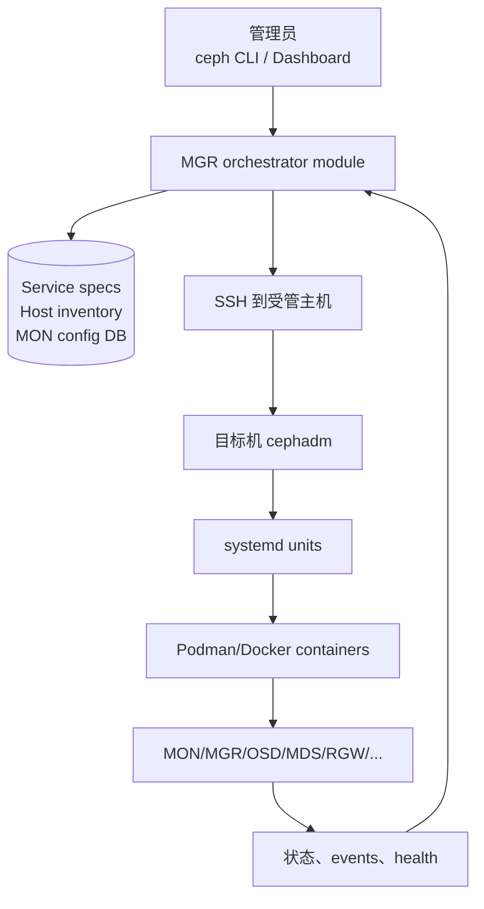
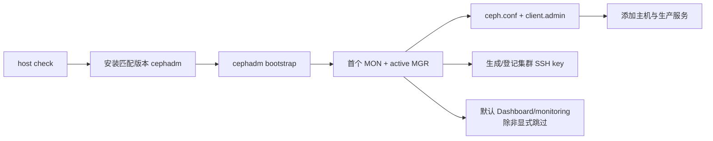
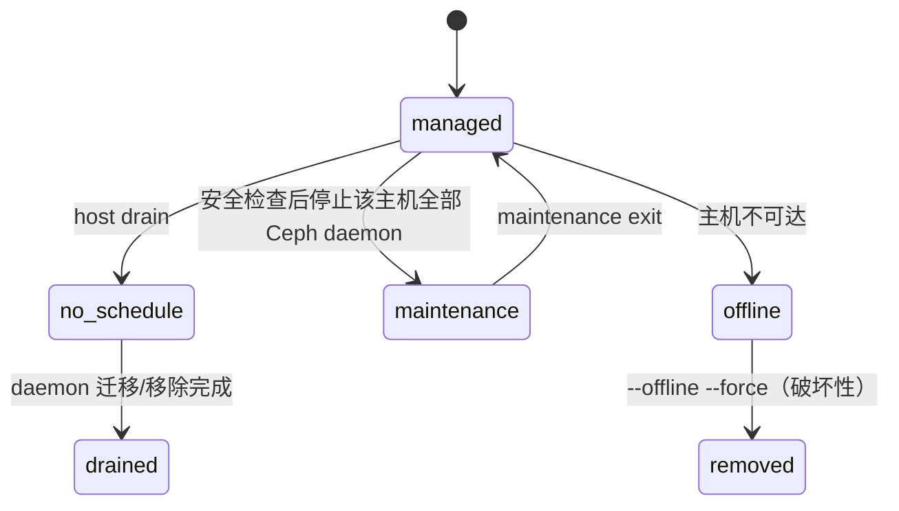
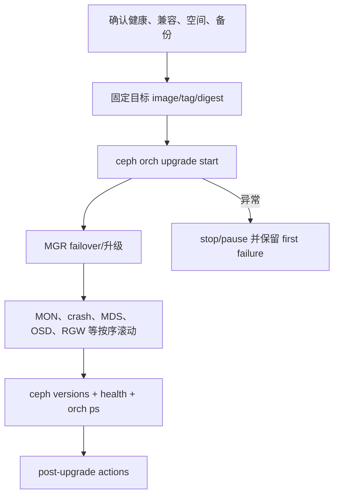
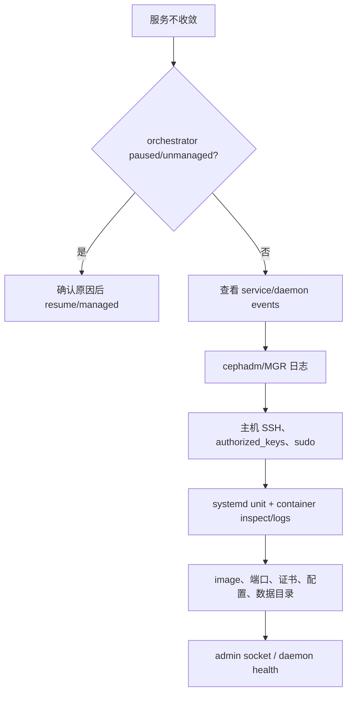
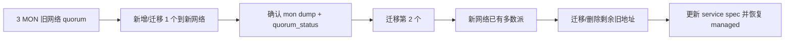
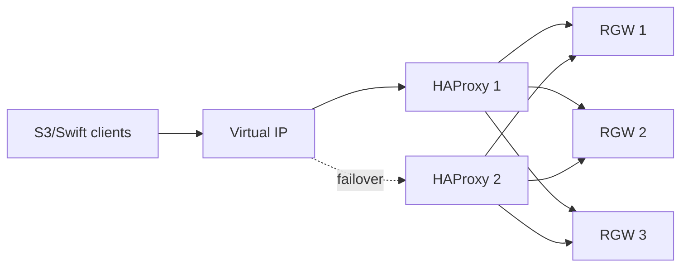
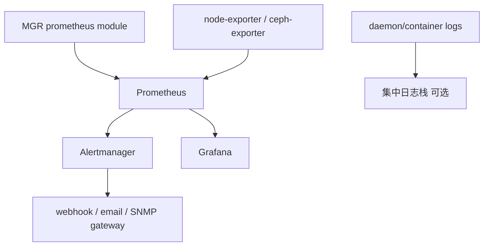
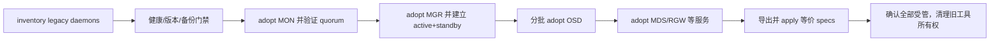

# Cephadm 企业部署与生命周期（Tentacle）

> `cephadm` 从 Octopus（15.2.0）开始提供，负责容器化 Ceph 集群从 bootstrap、扩容、服务编排、证书、升级到清理的完整生命周期。它通过 MGR orchestrator 持续把“期望规格”收敛成主机上的 systemd + container daemon，而不是只执行一次安装脚本。

## 1. 工作模型：CLI、orchestrator、cephadm、systemd 四层



`ceph orch apply` 写入期望状态；cephadm reconcile 循环选择主机、部署或删除 daemon、刷新配置和证书。手工停止容器不会改变期望状态，编排器可能重新拉起；若要暂停自动管理，应显式将 service 设为 `unmanaged`，处理完成后恢复 managed。

cephadm 不依赖 Ansible、Rook、Salt，但它们可以负责 OS、网络、仓库等 cephadm 之外的准备。不能同时让多个编排器拥有同一 daemon。

## 2. 部署前置与兼容性

每个受管主机至少要有 Python 3、systemd、Podman 或 Docker、时间同步服务、LVM2，以及能从 bootstrap 主机免密 SSH 的账号。容器引擎必须位于该 Ceph release 的兼容范围；Podman 版本不匹配可能表现为容器参数、cgroup、网络或 systemd 管理异常，而不是 Ceph daemon 本身故障。

部署前固定以下输入：

| 类别 | 必须决定并验证的内容 |
|---|---|
| 身份 | cluster fsid、cluster name、SSH 用户/密钥、是否使用 CA-signed SSH key |
| 网络 | bootstrap MON IP、public/cluster CIDR、MTU、DNS/FQDN、IPv4/IPv6、服务入口 |
| 制品 | 精确 Ceph image、registry 认证、离线镜像、非 Ceph 服务镜像 |
| 存储 | 每块盘序列号、现有签名、data/DB/WAL 归属、failure domain |
| 安全 | Dashboard/monitoring/RGW 等证书来源、管理网暴露、keyring 分发范围 |
| 容量 | MON/MGR/OSD 内存、OSD autotune 比例、恢复 headroom、共置限制 |

FQDN 与裸主机名必须全局一致。cephadm 用 `hostname` 识别受管主机，证书 SAN、service placement 和 CRUSH location 也依赖该身份；加入时用 FQDN、运行时却报告短名会产生不可收敛漂移。

## 3. Bootstrap：只创建种子集群，不是生产终态



典型入口：

```bash
cephadm bootstrap \
  --mon-ip <MON_IP> \
  --cluster-network <CLUSTER_CIDR> \
  --image <PINNED_CEPH_IMAGE>

cephadm shell -- ceph -s
cephadm shell -- ceph orch status
```

bootstrap 创建一个 MON 和一个 MGR，生成 fsid、SSH key、`ceph.conf`、`client.admin`，通常还部署 Dashboard 与基本 monitoring stack。`--skip-monitoring-stack` 可跳过监控；`--skip-dashboard` 可跳过 Dashboard；隔离网络、自定义 registry、已有 SSH key、CA-signed key、单主机等场景必须使用对应参数，不能事后假定默认值等价。

Bootstrap 后立即验证：`ceph -s`、MON quorum、active/standby MGR、`ceph orch status`、容器镜像 identity、时间同步、public/cluster network、管理凭据落盘范围。一个 MON/MGR 只是可扩展种子，不是高可用交付。

## 4. 主机生命周期与特殊标签

### 4.1 加入、批量加入和 CRUSH location

```bash
ceph cephadm get-pub-key > ceph.pub
ssh-copy-id -f -i ceph.pub root@<host>
ceph orch host add <host> <ip> --labels <label1,label2>
ceph orch host ls --detail
ceph orch host rescan <host> --with-summary
```

可用 YAML inventory 批量添加，并在首次加入时指定 `location`，把 host 放入正确 root/rack/row。加入后再移动 CRUSH bucket 会触发数据迁移；应在 OSD 创建前确定故障域。

普通 label 用于 placement。以下下划线 label 有编排语义：

| label | 作用 |
|---|---|
| `_admin` | 在主机分发 `ceph.conf` 和 `client.admin`；bootstrap 主机默认拥有 |
| `_no_schedule` | 不再向主机调度新 daemon；已有 daemon 不自动删除 |
| `_no_conf_keyring` | 不向主机写 client keyring/配置 |
| `_no_autotune_memory` | 排除 OSD memory autotune |
| `_no_autotune_memory` 等版本化特殊标签 | 使用前以当前 `ceph orch host ls`/官方版本为准 |

### 4.2 drain、maintenance、offline removal 不是一回事



`ceph orch host drain` 加入 `_no_schedule`、安排迁移 daemon；带 `--zap-osd-devices` 会擦盘，必须把它视为独立破坏性审批。maintenance 会停止该主机全部 Ceph daemon，进入前执行可用性检查；`--force --yes-i-really-mean-it` 可绕过检查，可能导致数据不可用、quorum 丢失或 PG 降级。

永久不可恢复主机可用 `ceph orch host rm <host> --offline --force` 删除；该路径会 purge 其 OSD，无法确认盘上最新数据时存在数据丢失风险。正常主机移除应先 drain、等待服务迁移和 OSD 安全排空，再删除 host 和必要的 CRUSH bucket。

## 5. Service Spec：声明式收敛的核心

Service spec 至少由 `service_type`、可选 `service_id`、`placement` 和服务专属 `spec` 组成：

```yaml
service_type: rgw
service_id: production
placement:
  label: rgw
  count: 3
networks:
  - 10.20.0.0/24
spec:
  rgw_realm: production
  rgw_zone: cn-east
  rgw_frontend_port: 443
```

Placement 支持：显式 `hosts`、`count`、host label、`host_pattern` 和组合过滤。只给 `count` 时编排器按可用主机选择；显式主机最可控但扩容需改 spec；label 适合职责池；pattern 适合稳定命名规范。

同一主机可共置多个 daemon。placement algorithm 会先满足显式 host/label/pattern，再在候选中选择数量；它不会替代资源调度器，CPU、内存、端口、故障域冲突仍由管理员负责。

```bash
ceph orch apply -i service.yaml --dry-run
ceph orch apply -i service.yaml
ceph orch ls --service_name rgw.production --export
ceph orch ps --service_name rgw.production --refresh
```

修改 spec 会滚动 reconcile。额外 container args、entrypoint args、custom config files 和 bind mounts 可以扩展容器，但会扩大兼容与安全面；先用 spec 字段，确实没有原生字段时才使用 escape hatch。

`ceph orch rm <service>` 删除 service；对有状态服务，删除 daemon 不等于删除 pool/FS/realm 数据。`unmanaged: true` 只停止自动部署/删除，现有容器仍运行。

## 6. OSD 设备选择、创建、移除和替换

### 6.1 可用设备和持久 spec

设备被认为 available 通常要求：无 partition、无 LVM state、未挂载、无 filesystem/BlueStore 签名、容量满足要求。先看 inventory 和 reject reasons：

```bash
ceph orch device ls --wide --refresh
ceph orch apply osd --all-available-devices --dry-run
```

OSD spec 可以按 `paths`、vendor/model、size 范围、rotational、device class、limit 选择 data devices，并单独选择 DB/WAL。过滤条件默认 AND；`all: true` 或 `--all-available-devices` 是持久声明：将来新增或被 zap 后重新变为 available 的盘会被自动消费。

```yaml
service_type: osd
service_id: hdd-with-nvme-db
placement:
  label: storage
spec:
  data_devices:
    rotational: 1
  db_devices:
    rotational: 0
  encrypted: true
```

每次修改 OSD spec 都先 `--dry-run`。`limit` 只适合少数特殊场景；过滤集合排序或设备变化会改变被选盘。若某盘要留给其他用途，应通过 spec 排除或暂设 unmanaged，不能与自动 all-available 策略抢占。

### 6.2 移除和 replacement

```bash
ceph orch osd rm <osd-id>
ceph orch osd rm status
ceph orch osd rm stop <osd-id>
ceph orch osd rm <osd-id> --replace
```

正常移除先把数据迁出，再 purge daemon 和 CRUSH/auth 记录；`--replace` 保留 destroyed OSD ID，满足条件时新盘复用 ID。共享 DB/WAL 设备可能关联多个 OSD，replacement 会同时影响它们，必须核对官方警告。

`ceph orch device replace <host> <device>` 自动标记关联 OSD destroyed、zap 相关设备并设置 replacement header，避免 spec 过早重建；共享设备必须用显式确认参数。新盘就位后可 `--clear` header，让 managed spec 重新部署。

### 6.3 Zap 的危险回路

```bash
ceph orch device zap <host> <device>
```

Zap 调用远端 `ceph-volume lvm zap` 擦除签名。若 all-available spec 仍是 managed，盘一旦恢复 available，cephadm 会立即重建 OSD。要把盘改作他用，先修改/暂停 spec，再 zap，最后验证 inventory 和 udev identity。

OSD memory autotune 默认启用，根据 `mgr/cephadm/autotune_memory_target_ratio` 分配主机内存；计算与存储共置时官方警告默认值通常不合适，应禁用相关主机 autotune 或显式设置 OSD memory target，并验证实际 cgroup/RSS。

## 7. 各服务的部署语义

| 服务 | 主要 spec/命令 | 不能忽略的边界 |
|---|---|---|
| MON | `ceph orch apply mon --placement=...` | bootstrap subnet 默认成为 MON subnet；搬迁网络时先 unmanaged、分阶段重建并始终保持 quorum；默认自动放置可到 5 个 |
| MGR | `ceph orch apply mgr --placement=...` | 至少 active + standby；可指定网络；共置需资源评估 |
| MDS | `ceph fs volume create <fs> --placement=...` 或 MDS spec | daemon 数与 FS `max_mds`、standby 策略是不同维度 |
| RGW | realm/zone/service spec、port/TLS/network | trivial 单站点与 multisite 不同；HTTPS 证书、SAN、shutdown drain 和 ingress HA 单独配置 |
| NFS | NFS-Ganesha service/export | 后端可为 CephFS/RGW；VIP、HAProxy Protocol 和 active/standby 需整体设计 |
| iSCSI | iSCSI service spec | API 凭据、trusted IP、SSL、tcmu-runner 和 initiator 都要验收 |
| SMB | SMB service spec | 配置可来自 RADOS、MON KV、HTTP(S)；CephFS proxy sidecar 有版本与功能限制 |
| monitoring | Prometheus、Alertmanager、Grafana、node-exporter | bootstrap 默认部署基础 stack；默认安全配置不一定满足严格环境 |
| mgmt-gateway | gateway + 可选 OAuth2 proxy | 为管理服务提供统一 TLS/入口和 HA；仍需定义后端暴露面 |
| SNMP gateway | v2c/v3 service spec | v2c community、v3 authPriv 密钥和 Alertmanager integration |
| tracing | Jaeger/Elasticsearch | 默认 tracing 后端及镜像要单独容量/保留评估 |
| custom-container | 任意容器 spec | cephadm 只管生命周期，不理解业务健康与数据语义 |

Monitoring 可以由 cephadm 自动部署，也可连接外部企业 Prometheus/Grafana。启用 secure monitoring stack 后，Prometheus/Alertmanager 使用认证和证书；自定义 image/config、retention size/time、Grafana URL/初始密码、anonymous access、webhook 和证书验证都必须显式管理。

## 8. Certificate Manager

CertMgr 是 cephadm 自签证书的 root CA。服务既可使用自动生成证书，也可导入用户 CA 签发证书：

- 自签证书由 certmgr 自动续期并让服务 reload/redeploy。
- 用户证书不会被自动续签；certmgr 只持续检查并在临期/无效时发出 `CEPHADM_CERT_ERROR`，管理员必须替换。

| 配置 | 默认/范围 | 作用 |
|---|---|---|
| `mgr/cephadm/certificate_automated_rotation_enabled` | `true` | 是否自动轮换 cephadm 自签证书 |
| `mgr/cephadm/certificate_duration_days` | `3*365`，最小 90 | 自签证书有效期 |
| `mgr/cephadm/certificate_renewal_threshold_days` | 30，范围 10-90 | 距过期多少天开始轮换或告警 |
| `mgr/cephadm/certificate_check_period` | 1 天，范围 0-30 | 检查周期；0 禁用检查 |

证书 scope 分为 global（所有实例共享，如 mgmt-gateway）、host（每主机独立）和 service（每服务名独立，如某 RGW service）。设置或取回 host/service scope 证书时必须带对应 selector，不能只按证书名字覆盖。

```bash
ceph orch certmgr entity ls
ceph orch certmgr cert ls --show-details
ceph orch certmgr key ls
ceph orch certmgr cert check
ceph orch certmgr cert get <name> --service_name <service>
ceph orch certmgr cert-key set <entity> --service_name <service> -i pair.pem
ceph orch certmgr reload
```

私钥查询输出属于敏感信息，不进入普通日志。替换时先验证 PEM、key/cert 匹配、issuer、SAN 和有效期，再触发服务 reload；删除用户证书可能使服务回落到自签或无法启动，取决于 entity。

## 9. 客户端配置和 keyring 分发

Ceph 客户端至少需要 `ceph.conf` 与对应 CephX keyring。`_admin` 主机默认收到 `client.admin`；普通应用应由 `ceph orch client-keyring set` 管理独立 entity：

```bash
ceph orch client-keyring set client.app 'label:app' \
  --mode 0600 --owner 1000:1000 \
  --path /etc/ceph/ceph.client.app.keyring
```

placement 变化后 cephadm 会从不再匹配的旧主机移除受管 keyring。默认 keyring mode 为 `0600`、owner 为 `root:root`；路径变化必须与应用启动参数一致。cephadm 默认在写 keyring 的主机也管理 `/etc/ceph/ceph.conf`，可用 placement 或 `bare_config` 控制仅配置分发。

## 10. 升级不是简单换 image tag



升级前读目标 release notes：PG autoscaler 默认、CephFS compatibility、MDS `max_mds`、require-osd-release、模块迁移等可能改变行为。cephadm 默认可能在升级 CephFS 时把 `max_mds` 降到 1；大规模 FS 会受影响。`fail_fs` 默认 false，只有明确接受 FS 离线策略时设置。

```bash
ceph orch upgrade check <image>
ceph orch upgrade start --image <image>
ceph orch upgrade status
ceph -W cephadm
ceph progress
ceph orch upgrade stop
```

`UPGRADE_NO_STANDBY_MGR` 表示没有可接管的 standby，先恢复 MGR 冗余；`UPGRADE_FAILED_PULL` 表示某主机无法拉取 image，检查 registry、认证、网络和架构。自定义 image 必须包含目标 Ceph version。Staggered upgrade 可按 daemon type、host 或数量限制批次，但不允许破坏 Ceph 的必要升级顺序；从不支持 staggered 的旧版本升级时先完成支持该能力的 MGR 阶段。

## 11. 日常操作、健康检查和日志

```bash
ceph orch ls --refresh
ceph orch ps --refresh
ceph orch daemon stop|start|restart|redeploy|reconfig <daemon>
ceph orch daemon rotate-key <daemon>
ceph -W cephadm
ceph health detail
```

Ceph daemon 默认日志到 journald，由容器 runtime/systemd 收集；可配置 log-to-file 和 logrotate。cephadm 自身可输出到 stderr、syslog、journald 或文件，bootstrap 的 `--log-dest` 与集群 daemon 日志配置不是一回事。数据目录通常位于 `/var/lib/ceph/<fsid>/<daemon-name>`，手工清理前先用 `cephadm ls` 确认归属。

主要 cephadm health：

| health code | 意义与处理方向 |
|---|---|
| `CEPHADM_PAUSED` | reconcile 被暂停；诊断后显式 resume |
| `CEPHADM_STRAY_HOST` | 集群发现 daemon 所在 host 不在 inventory |
| `CEPHADM_STRAY_DAEMON` | daemon 不属于任何受管 service spec；先纳管或移除 |
| `CEPHADM_HOST_CHECK_FAILED` | SSH、container runtime、时间同步等主机检查失败 |
| `CEPHADM_CHECK_KERNEL_LSM` | SELinux/AppArmor 配置不一致 |
| `CEPHADM_CHECK_SUBSCRIPTION` | OS subscription 状态不一致 |
| `CEPHADM_CHECK_PUBLIC_MEMBERSHIP` | 主机缺少 public network 接口 |
| `CEPHADM_CHECK_MTU` / `LINKSPEED` | OSD 网络 MTU/速率不一致 |
| `CEPHADM_CHECK_NETWORK_MISSING` | 定义的 public/cluster network 不存在 |
| `CEPHADM_CHECK_CEPH_RELEASE` | 非升级期间 daemon release 不一致 |
| `CEPHADM_CHECK_KERNEL_VERSION` | 主机 kernel major.minor 不一致 |

## 12. 排障顺序



优先使用 `ceph orch ls/ps --format yaml` 的 events、`ceph -W cephadm` 和 MGR log；再到目标主机检查 systemd 与容器。`cephadm enter`/`shell`/`unit --name`、admin socket、手工运行容器用于诊断，不应长期绕开编排。

MON quorum 丢失时可从存活 MON 容器/数据目录恢复 monmap 和 quorum；没有 MON 时可以手工部署临时 MGR，但必须记录并重新纳管。core dump 由 systemd-coredump 保存于主机，调试 image 应包含匹配 binary/debuginfo；GDB 调试 live process 会影响业务，只在隔离窗口执行。

## 13. Adoption 与清理边界

Adoption 把 legacy systemd、ceph-ansible 等已运行 daemon 转为 cephadm 容器管理。先固定目标 image，验证当前集群健康和版本，逐类 adopt MON、MGR、OSD、MDS、RGW，再创建等价 service spec；限制和不支持 daemon 必须留在旧管理路径直到迁移方案明确。Adopt 是管理权迁移，不自动重设计 CRUSH、网络和 caps。

销毁整集群命令是：

```bash
cephadm rm-cluster --force --zap-osds --fsid <fsid>
```

它会停止并删除该 fsid 的 daemon，`--zap-osds` 还擦除 OSD 设备，属于不可恢复操作。执行前必须从 `ceph fsid`、`cephadm ls`、设备序列号和备份恢复演练四处确认目标；不能用模糊主机名、旧 fsid 或未核验设备列表执行。

## 14. SSH 信任、主机身份和 OS tuning profile

Cephadm 默认生成集群专用 SSH key，由 active MGR 持有私钥并把公钥放到受管用户的 `authorized_keys`。可切换非 root 用户，但该用户必须 passwordless sudo 执行 cephadm 所需主机动作；若 sudo command allowlist 过窄，通常表现为 inventory 正常但部署/删除在某一步失败。

```bash
ceph cephadm get-pub-key
ceph cephadm get-ssh-config
ceph cephadm set-user <user>
ceph cephadm set-ssh-config -i ssh_config
ceph cephadm set-priv-key -i id_cephadm
ceph cephadm set-pub-key -i id_cephadm.pub
```

自定义 SSH config 可固定 identity、known-host policy、jump path 等，但它由集群统一使用，不能引用只存在于某个管理员 shell 的临时路径。CA-signed SSH key 模式以 CA 公钥作为主机信任根，适合大规模轮换；bootstrap 时要同时提供签名私钥/证书和匹配 host trust。任何模式都要实测 MGR 所在节点到每台 host，而不是只从运维机 SSH 成功。

主机 canonical name 必须与 `hostname` 返回一致；IP 只用于连接地址。FQDN 与短名混用会让 inventory、TLS SAN、CRUSH host 和 daemon name 分裂。修正前先导出 service spec、迁移 daemon，再按一个统一名字重加，不能直接在 `/etc/hosts` 改完等待自动修复。

OS tuning profile 是一组 sysctl/limit 等主机参数及 placement。Profile 被 apply 后，cephadm 只在匹配主机收敛所声明参数；多个 profile 冲突时要消除重叠，不依赖偶然应用顺序。

```bash
ceph orch tuned-profile ls
ceph orch tuned-profile apply -i profile.yaml
ceph orch tuned-profile rm <profile-name>
```

修改 profile 前导出当前值，确认参数属于 Ceph workload 而非整个 OS 的其他业务。移除 profile 停止管理，不一定知道如何恢复每台主机之前的原值；回滚文件应显式记录 baseline。Device rescan 会触发 SCSI host scan 并刷新 inventory，在繁忙 SAN/多路径主机可能有代价，先使用 summary 再决定是否执行全面扫描。

## 15. MON/MGR/MDS 与网络迁移的安全序列

MON placement 同时受候选主机和 network 约束。Bootstrap 使用的 MON address 会形成初始 public network 判断；新增 MON 前确保目标接口属于声明 network。迁移 MON network 不能一次删除旧 quorum：先让 service 暂时 unmanaged，逐个在新地址创建/验证 MON，始终保持多数派，更新 spec 后再恢复 managed。



MON 的 CRUSH location 只表达 daemon 主机位置，不改变对象 CRUSH rule。Cephadm 默认会根据集群规模自动部署一定数量 MON（通常最多 5）；显式 placement 接管后，管理员负责奇数规模和故障域。

MGR 可指定 network，也可允许多个 MGR 共置；生产要确保至少一 standby 不与 active 共享单故障域。`ceph orch daemon redeploy mgr.x` 会重建容器/配置，`ceph mgr fail` 是主动切 active，两者含义不同。

MDS service id 通常绑定 FS 名。Daemon count 要覆盖 `max_mds + standby`，但提高 count 不会自动提高 `max_mds`，反向也一样。删除 MDS service 前先把 FS 降到安全 rank/停止状态；容器删除不等于 metadata pool 可删。

## 16. RGW、NFS、管理网关和 OAuth 的入口拓扑

RGW trivial setup 可直接给 realm/zone/service；multisite 要先建立 realm、zonegroup、zone 与 period，再让 service spec 指向正确对象。`networks` 限制 daemon bind 候选接口，frontend extra args 可传 Beast 选项，但原生 `rgw_frontend_port`、SSL certificate 字段优先。

HTTPS 证书要覆盖客户端使用的 DNS 名；wildcard SAN 只匹配一个 label 层级。关闭 multisite sync traffic 只影响该 RGW 的同步职责，不应误用于隔离客户端。Shutdown drain 给 load balancer 时间停止新连接并完成在途请求，其时长要小于 orchestrator/容器 stop timeout。

RGW ingress 由 HAProxy + Keepalived/VIP 提供统一 endpoint：



VIP 必须位于选定 frontend network，placement 至少两个 ingress host；`virtual_interface_networks` 用于明确选接口。Ingress 健康只说明 TCP/HTTP backend 可达，S3 认证与 bucket I/O 仍需业务探针。删除 ingress service 不删除 RGW 数据，但会立即移除稳定入口。

NFS service 可直接暴露 Ganesha，也可部署 VIP/HAProxy。启用 PROXY protocol 时，前端和 Ganesha 两边必须同时匹配，否则连接会被当作损坏的 NFS 流量；只要 VIP、不需要 HAProxy 的模式则由 Ganesha 自己绑定虚拟地址，其故障模型不同。

Mgmt-gateway 为 Dashboard、Prometheus、Alertmanager 等管理服务提供单一 TLS endpoint，并代理 active MGR 变化。多实例加 ingress 可实现入口 HA，但后端服务本身仍需健康。OAuth2-proxy 放在入口前，把 OIDC/OAuth 登录转成受信请求；issuer、client id/secret、redirect URI、cookie secret 和 allowed domain 必须作为敏感配置管理。Mgmt-gateway/OAuth 不能自动把后端原有匿名接口变安全，必须限制后端监听网络和直连路径。

## 17. Monitoring、SNMP、Tracing 与自定义容器

Cephadm monitoring stack 的数据流是：ceph-mgr Prometheus endpoint 与 node-exporter 被 Prometheus scrape，Alertmanager 接收 rule 告警，Grafana 查询 Prometheus；Loki/Promtail 等集中日志组件只有显式部署后才存在。



Secure monitoring 开启后，Prometheus 和 Alertmanager 使用 cephadm 管理的证书/凭据，Grafana datasource 也必须同步更新。Prometheus retention time 与 size 同时存在时，先触达的限制生效；容量设计要包含 WAL、head block 和 compaction 临时空间。Grafana 初始 admin password 应首次登录即轮换，anonymous access 默认不应对管理网外开放。

自定义 `prometheus.yml`、Grafana cert、Alertmanager webhook 或 service image 会覆盖/扩展 cephadm 默认生成物。每次升级前检查兼容字段，变更后用 `ceph orch reconfig` 并验证 target、rule、notification 全链路。外部 monitoring 模式下不要再让 cephadm 部署一套同端口服务。

SNMP gateway 把 Alertmanager notification 转为 Ceph MIB trap。v2c 仅 community，无加密；v3 `authNoPriv` 提供认证，`authPriv` 再提供隐私加密。Engine ID、auth/priv protocol 与密码必须和 NMS 一致。验证以 NMS 收到带正确 health code 的测试 trap 为准。

Tracing service 部署 Jaeger 相关 collector/query/agent，用于 Ceph trace；后端保留期和索引容量单独规划。生产长期开高采样会增加 daemon、网络与后端压力。Custom container spec 可声明 image、entrypoint、args、env、ports、volumes、uid/gid 等，但 cephadm 只维护容器期望状态，不知道应用层 quorum、schema migration 或数据备份，健康检查和升级顺序由产品 owner 补齐。

## 18. SMB 与 iSCSI 的编排边界

SMB spec 可引用 RADOS、MON KV 或 HTTP(S) 配置源，并按 cluster/share 资源生成 Samba container。Join credential、users/groups 和 TLS key 必须独立管理；CephFS Proxy sidecar 让 Samba 与 CephFS client 解耦，但增加 proxy socket 与版本兼容点。Cephadm 看到容器 running 不能证明域加入、ACL 和文件锁正确。

iSCSI service 部署 gateway API、LIO/TCMU 相关容器。Spec 中 API user/password、trusted IP、SSL cert/key 和 pool 必须与 initiator/`gwcli` 设计一致。至少两 gateway 加 initiator multipath 才构成路径 HA；在同一 host 放两实例不提供主机容错。删除 iSCSI service 前先从 initiator 侧 drain session、卸载文件系统并确认无写入。

两类服务都跨越 Ceph 与外部协议状态机。滚动 redeploy 前应做真实连接保持/重连测试；出现故障先区分 cephadm deployment event、gateway protocol log、Ceph backend health 和客户端 timeout，不能只重启容器。

## 19. 升级批次、非 Ceph 镜像与失败回收

Cephadm 升级先验证目标 image 能 pull 且 `ceph version` 与目标一致，再按 daemon 类型的安全顺序滚动。Status 中的 target image、in-progress type、completed/remaining daemon 和 error 是权威状态；progress bar 是展示层。

Staggered upgrade 可限制 daemon types、hosts 和 batch size，适合在大集群缩小故障半径。若当前旧 release 不认识 stagger 参数，先按普通路径升级 MGR/控制面到支持版本，再开始分批，不能向旧 MGR 发送新选项并假定生效。

Monitoring、NFS、iSCSI 等非 Ceph service image 有各自更新命令/配置。它们不会因为核心 Ceph version 完成就自动满足目标应用版本；升级清单必须分别核对 image digest。自定义镜像若没有目标 binary 或架构 manifest，`UPGRADE_FAILED_PULL`/version check 会阻断，禁止用 `latest` 绕过。

取消 upgrade 会停止调度新 daemon，但已升级实例不会自动降级。回退要验证 release 是否支持混合版本与 downgrade，并显式恢复 image/spec；保留 first failure、orch events、容器日志和版本分布后再改。失败 pull 的部分 image 和失败 container 应按 runtime policy回收，不能让下一轮误判缓存制品有效。

## 20. Adoption 的逐步迁移与最终清场

Adoption 有明确限制：只支持能被 cephadm 识别的 legacy daemon/布局；容器化来源、非标准数据目录、特殊 init 管理或版本跨度可能不能直接 adopt。开始前记录每个 daemon 的 fsid、id、keyring、config、data path、端口、版本和原 unit。



每批 adoption 后确认 daemon 用原 data/auth identity 启动、maps 未改变、业务 I/O 正常。先迁 MON/MGR 是为了建立 cephadm 控制面；OSD 分批避免同时触发大量 down/recovery。服务 spec 应在 adopt 后与实际 placement 对齐，否则 reconcile 可能立即增删实例。

最终清场只移除旧 systemd/unit/config-management ownership，不删除 cephadm 正在使用的数据目录和 keyring。原 Ansible/Salt 任务必须禁用，否则两套控制器会互相改 unit/config。保留一次可验证备份和旧配置证据，直到新管理面完成升级、重启和主机故障演练。

## 21. 官方基线与许可

来源：Ceph Tentacle 官方 `doc/cephadm/`，核验提交 `76fba24cef67d9219f97eeaa68cd1a848da3f2b2`。Ceph authors and contributors，CC BY-SA 3.0。
