# RADOS 存储集群全解（Tentacle）

> RADOS 是所有 Ceph 接口的共同数据平面。配置解析、pool/PG/CRUSH 放置、OSD/MON 一致性和设备故障恢复共同决定业务 I/O 是否可用、持久且可预测。

## 1. RADOS 运行边界

最小 RADOS 有 MON、MGR 和 OSD。MON 保存地图与认证；MGR 汇总状态并承载管理模块；OSD 保存对象并完成复制/EC。官方所称“最小系统至少一个 MON 和两个 OSD”只能展示复制，不具备 MON 高可用，也不等于生产安全。

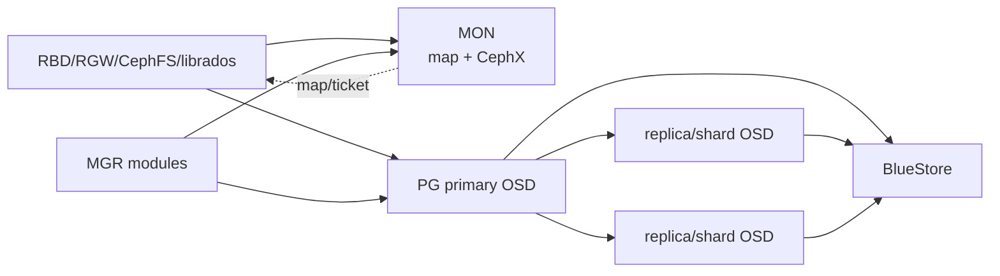

## 2. 配置系统：先判断值从哪一层来

Ceph daemon 的最终配置可能来自编译默认值、MON config database、`ceph.conf`、环境和命令行。集群化配置应写入 MON config DB，并按 section/mask 作用到 global、daemon type、具体 daemon、host、class 等范围；本地文件主要用于 bootstrap、MON discovery 和少量启动前参数。

```bash
ceph config dump
ceph config get osd.3 <option>
ceph config set osd <option> <value>
ceph config show osd.3
ceph config assimilate-conf -i ceph.conf
```

`config get` 是数据库值，`config show` 才接近 daemon 当前有效值。部分选项支持运行时更新，部分必须 restart；修改前查 option schema、type、default、min/max、runtime flag。不要因本地 `ceph.conf` 没有一项就断言它使用默认值。

### 2.1 网络和 Messenger v2

Public network 承载客户端、MON 和服务访问；cluster network 只承载 OSD replication、heartbeat、recovery/backfill。分网可隔离恢复流量，但需要双网容量、路由、防火墙和故障切换；不分网时必须保证共享网络在故障恢复期间仍满足客户端 SLO。

Messenger v2 通常监听 3300，v1 MON 端口常为 6789；OSD/MGR/MDS 使用动态范围。`msgr2` 支持 crc 和 secure mode，secure 提供在途加密与完整性；CephX 负责身份/caps，两者职责不同。

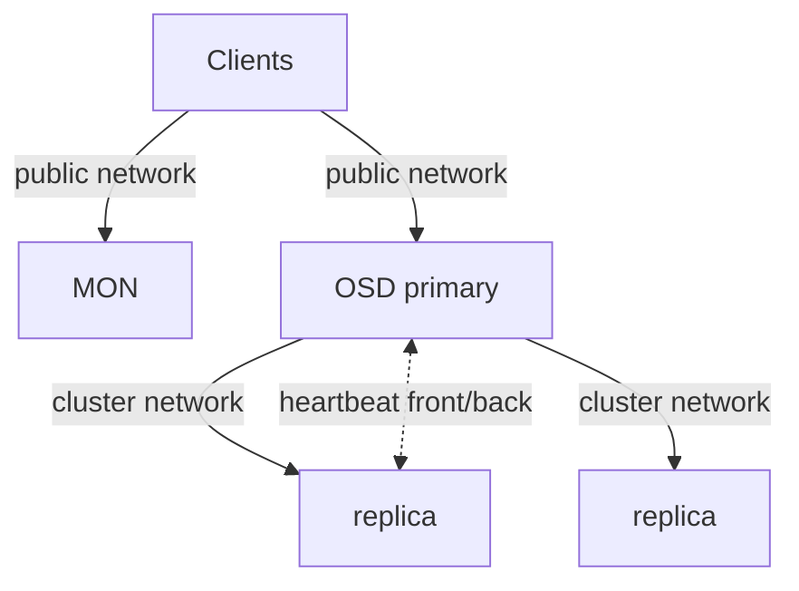

MTU、bond、VLAN、DNS、时钟和 firewall 必须端到端一致。只 ping MON 不能证明 OSD 动态端口、反向连接和 cluster network 可用。

### 2.2 CephX 与用户能力

`auth_cluster_required`、`auth_service_required`、`auth_client_required` 正常应为 `cephx`。Entity 形式为 `client.<id>`、`osd.<id>`、`mgr.<id>`、`mds.<id>`；keyring 保存 secret，caps 按 mon/osd/mgr/mds 服务解释。

```bash
ceph auth get-or-create client.app \
  mon 'profile rbd' \
  osd 'profile rbd pool=app'
ceph auth caps client.app mon 'profile rbd' osd 'profile rbd-read-only pool=app'
ceph auth get client.app
ceph auth del client.app
```

修改 caps 会改变后续 ticket 权限；已建立会话可能到 ticket 刷新才体现。删除 entity 前先撤离客户端，轮换 key 时要协调所有 keyring，不能只改 MON 侧。

## 3. BlueStore 与设备布局

BlueStore 直接管理 raw block，主 `block` 保存对象数据；RocksDB 保存 metadata/omap，WAL 记录事务。`block.db` 可放高速设备，RocksDB 数据超出 DB 设备后 spill 回主 block；`block.wal` 只有在比 DB 更快且工作负载受 WAL 限制时才有价值。

| 布局 | 适用 | 风险 |
|---|---|---|
| data-only | 全 SSD/NVMe 或简单 HDD | HDD metadata latency 较高 |
| HDD data + NVMe DB | 大量 HDD、metadata/小对象 workload | NVMe 故障可能同时影响多个 OSD；DB 容量不足会 spill |
| data + DB + WAL | 有三种明确性能层且压测证明收益 | 设备映射、替换和故障域最复杂 |

BlueStore checksum 能发现 silent corruption；compression 可按 pool/OSD mode、algorithm、min blob size 和 required ratio 控制。压缩节省的是写入后空间，可能增加 CPU 和 write amplification；先按真实数据压测。

FileStore、journal 和 BlueStore migration 页面用于旧集群迁移。Tentacle 新部署不应以 FileStore 为默认；迁移逐 OSD 完成，始终保持足够副本和恢复空间。

## 4. Pool：保护、放置和应用语义的边界

```bash
ceph osd pool create <pool> [pg_num] [replicated|erasure] [profile]
ceph osd pool application enable <pool> rbd|cephfs|rgw
ceph osd pool get <pool> all
ceph osd pool set <pool> size 3
ceph osd pool set <pool> min_size 2
ceph osd pool set-quota <pool> max_bytes <bytes>
```

| 参数 | 含义 | 错误理解 |
|---|---|---|
| `size` | replicated pool 期望副本数 | 不是故障后仍允许写的副本数 |
| `min_size` | 允许 I/O 的最小完整副本/分片条件 | 设为 1 会扩大不可恢复写窗口 |
| `pg_num/pgp_num` | PG 数和放置计算数 | 越大并非总是越快；增加 MON/OSD 内存和 peering 成本 |
| `crush_rule` | 使用哪一设备集合和故障域 | 不自动验证容量足够或 rack 真独立 |
| application | 声明 RBD/CephFS/RGW 用途 | 不是权限，也不创建上层服务 |
| quota | pool 对象数/字节逻辑限制 | 不替代集群 nearfull/full 保护 |

PG autoscaler 根据 pool 使用、target ratio/size、bulk flag、CRUSH subtree 和 bias 建议或调整 PG。`on` 自动改，`warn` 只告警，`off` 不参与。多个重叠 CRUSH root 或不准确 target 会使建议失真。

删除 pool 需要开启删除保护开关并重复 pool 名确认，是数据破坏动作。先核对 application、RBD image、CephFS/RGW 绑定、snapshot 和业务读取，再删除。

## 5. PG：对象规模与 OSD 数之间的中间层

对象 hash 到 PG，PG 再由 CRUSH 映射到 acting set。PG 是 peering、日志、scrub、recovery 和统计单位；它既减少逐对象地图规模，也限制故障/恢复的并行粒度。

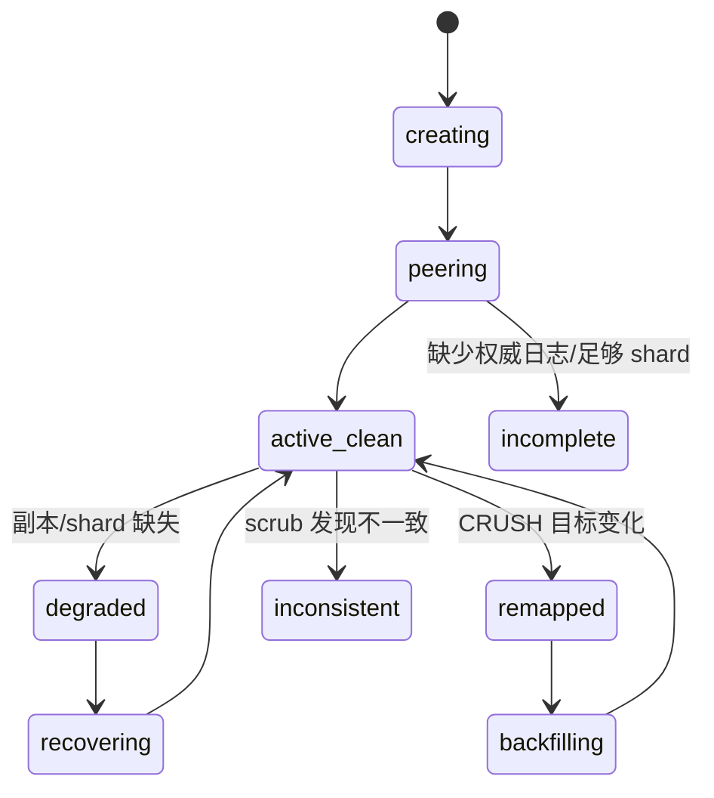

常见 PG 状态可以组合：

| 状态 | 真实含义 | 首要证据 |
|---|---|---|
| `active+clean` | 可服务且满足保护策略 | PG/OSD map、无 degraded object |
| `undersized` | acting set 小于 pool size | down/out OSD、CRUSH 可选设备 |
| `degraded` | 对象副本/shard 不完整 | degraded objects、recovery queue |
| `remapped` | acting set 与 CRUSH up set 不同 | `ceph pg map`、OSD map epoch |
| `backfill_wait/toofull` | 等待迁移或目标太满 | backfillfull ratio、OSD df |
| `stale` | MON 长时间未收到 primary 报告 | primary/acting OSD 连通性 |
| `incomplete` | 无法构建足够权威历史 | PG query、past intervals、丢失 OSD |
| `inconsistent` | scrub 发现副本内容/元数据不一致 | `rados list-inconsistent-*` |

```bash
ceph pg stat
ceph pg dump pgs_brief
ceph pg <pgid> query
ceph pg map <pgid>
ceph health detail
```

Peering 卡住时不要首先执行 `pg force_create`、`mark_unfound_lost` 或 repair。先保存 query、OSD logs、map epochs、past intervals 和可能离线盘；错误地声明 lost 会永久丢弃唯一对象版本。

## 6. CRUSH：把策略转成真实故障隔离

CRUSH hierarchy 由 device 和 bucket（host/rack/row/root 等）组成，rule 选择 root/device class、决定副本数和 failure domain。三副本只有在 rule 选择 `host` 且有至少三台合格 host 时才提供主机级冗余。

```bash
ceph osd tree
ceph osd crush tree --show-shadow
ceph osd crush rule dump
ceph osd getcrushmap -o crush.bin
crushtool -d crush.bin -o crush.txt
crushtool -i crush.bin --test --show-mappings --rule <id>
```

修改流程：导出二进制 → 反编译 → 离线 test 映射和分布 → 保存旧 map → 应用 → 观察 misplaced、backfill 和容量。`ceph osd crush move` 改 bucket 位置；`reweight` 改 CRUSH weight；`ceph osd reweight` 是 OSD map 临时 override，两者语义不同。

Device class（hdd/ssd/nvme）形成 shadow hierarchy；改 class 或 rule 会重映射数据。先确认每个 class 的独立容量足以在故障后满足 size/K+M。

## 7. 复制池与纠删码池

复制池写入由 primary 向 secondary 发送 subops；空间原始开销近似 `size × stored`。EC profile 定义 `k`、`m`、plugin、technique、failure-domain、device-class 等；原始开销近似 `(K+M)/K`，但小写需要 read-modify-write 或 overwrite optimization，CPU/网络/恢复复杂度更高。

官方插件包括 Jerasure、ISA、LRC、SHEC、CLAY：

| 插件 | 重点 |
|---|---|
| jerasure | 通用 Reed-Solomon，参数丰富 |
| isa | Intel ISA-L 优化，常用于 x86 性能路径 |
| lrc | 局部恢复码，降低部分恢复跨域流量 |
| shec | 面向多盘并行恢复的编码选择 |
| clay | 降低修复带宽，需要正确配置 scalar/vector 参数 |

EC profile 在 pool 创建后不能原地安全替换为不同布局；新建 pool、迁移数据、验证后切换。EC pool 对 omap 和部分写语义有约束，上层 RBD/CephFS 常使用 replicated metadata pool + EC data pool。

## 8. Balancer、upmap、read balancer 和 stretch mode

Balancer MGR module根据 PG/容量分布生成优化 plan；`upmap` 用 PG 映射例外改善均衡而不改 CRUSH hierarchy，要求客户端兼容相应 minimum release。执行 plan 前查看评分、受影响 PG 和迁移量，恢复期间避免频繁重复优化。

Read balancer 可调整 replicated pool 的 primary 分布，改善读负载；它不改变副本集合和容量。`read`/`upmap-read` 等模式与客户端版本、pool 类型有关。

Stretch mode 将 MON 与数据副本跨两个站点，并用第三 tiebreaker MON 处理网络分区。它不是普通三副本跨机房：需要特定 CRUSH rule、站点 bucket、MON 选举和恢复约束。网络分区时只允许满足站点策略的一侧继续，容量设计必须承受整个站点故障。

Cache tiering 从 Reef 起 deprecated；不要把 cache pool 当作新架构默认加速。停用 writeback cache 前必须 flush 和 evict 完成，不能直接删 overlay/pool。

## 9. mClock、recovery 与 scrub 的资源竞争

mClock 对 client、recovery、best-effort 等操作队列分配 reservation、weight、limit。内置 profile 适合 balanced、high_client_ops、high_recovery_ops 等目标；启用 profile 后部分低级参数由 profile 控制。

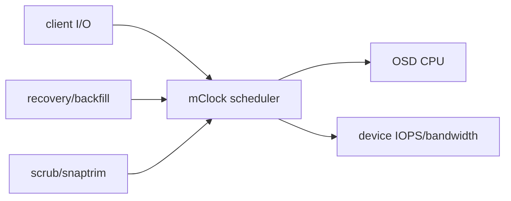

调高 recovery 并不创造磁盘性能，只会把延迟转移给业务 I/O；过度压低会延长 degraded window。应同时观察 client latency、degraded objects、recovery bytes、OSD queue、network 和 device utilization。

Scrub 比较对象 metadata/size；deep-scrub 读取数据并校验 checksum。`noscrub/nodeep-scrub` flag 只用于受控窗口，结束后清除并确认 backlog。Inconsistent PG repair 可能选择错误副本，先用 inconsistent object 输出、checksum、版本和应用副本证明权威数据。

## 10. 容量和健康阈值

OSD 有 nearfull、backfillfull、full；full 会阻止写，backfillfull 会阻止向目标回填。集群“总空闲很多”不能抵消某个 CRUSH leaf 满：对象只能落到 rule 允许的设备。

```bash
ceph df detail
ceph osd df tree
ceph osd pool stats
ceph osd perf
ceph tell osd.* bench
```

容量计划必须使用 raw、stored、replication/EC overhead、BlueStore metadata、snapshot/clone、recovery headroom 和最大 failure domain 后容量。不要把 `MAX AVAIL` 跨 pool 相加，它们可能共享同一 OSD 空间。

## 11. MON/OSD 变更的安全顺序

新增 MON：准备地址/数据目录 → 加入 monmap → 启动 → 等待 quorum；移除 MON：确认剩余多数派 → 从 monmap 移除 → 停服务。一次变更多数 MON 会丢 quorum。

新增 OSD：设备审计 → prepare/activate → `up/in` → 观察 backfill。正常移除：`out`/orchestrated drain → 等待无 PG 依赖 → purge auth/CRUSH/OSD map → 擦盘。故障盘是否 `out` 要考虑预计恢复时间和不必要 backfill；`noout` 只能短时维护使用。

MON election strategy 和 connectivity mode 可调整 leader/连接行为，但不是修复网络抖动的替代品。变更前后保存 `quorum_status`、mon dump、health 和 latency。

## 12. 故障树：先分类再修复

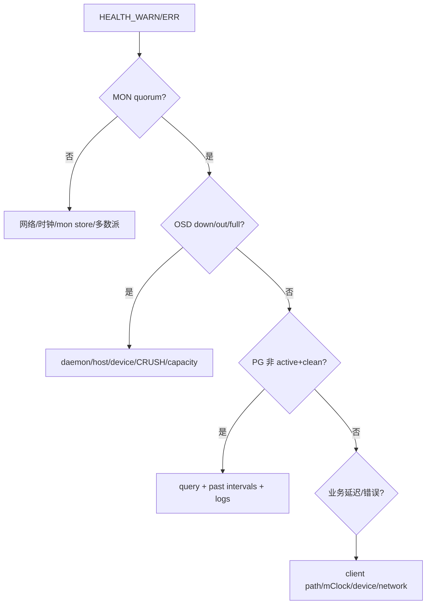

MON 排障关注 quorum、clock skew、disk full/slow、store corruption、网络地址和 election；OSD 关注 systemd/container、BlueStore label、device errors、heartbeat、slow ops、memory、DB spill 和 assert/crash；PG 关注 primary、acting/up set、blocked-by、unfound、inconsistent 和 recovery constraints。

日志级别和 subsystem debug 可以动态提高，但高 debug 会显著增加 I/O/容量；收集 first failure 后恢复默认。CPU profiling、heap/memory profiling 只在可控窗口进行，profile 本身会改变性能。

## 13. `librados` 与 Object Class API

客户端流程为 `rados_create` → 读取配置/连接 cluster → `ioctx_create(pool)` → sync/AIO object operations → 释放 ioctx/cluster。C、C++、Python binding 都提供 pool、对象、xattr、omap、snapshot、lock、watch/notify 和 compound operation。

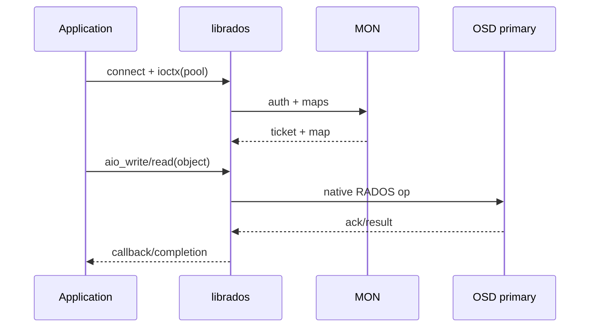

异步 API 必须正确管理 completion 生命周期、超时、重试和 shutdown；超时不证明服务端未提交，写操作需要应用幂等。Object Class 在 OSD 内执行受控方法，可原子组合对象操作；错误或高开销 class 会直接影响 OSD，不能像普通客户端插件对待。

`libcephsqlite` 把 SQLite VFS 映射到 RADOS，适用于其明确一致性模型；不是任意数据库的透明分布式化方案。

## 14. 生产验收闭环

RADOS 生产验收不能止于 `ceph -s`。至少证明：MON quorum 故障切换；OSD/host 故障后 PG 恢复；replicated/EC 真实读写；CRUSH failure domain；nearfull 告警；scrub/deep-scrub；key caps 正反例；网络和 mClock 下的业务延迟；OSD replacement；配置重启后持久；最终回到 `active+clean` 且无 unmanaged residue。

## 15. 配置解析、mask、metavariable 与 MON 发现

配置来源严格按后出现者覆盖前者，共六层：编译默认值 -> MON central config database -> 本地配置文件 -> environment variable -> command-line argument -> Admin Socket/`injectargs` runtime override。`--no-mon-config` 可在 MON quorum 不可用或完全由文件管理时跳过第二层；它不会让客户端免除 MON discovery、CephX 和 map 获取。`ceph.conf` 的 `[global]`、`[mon]`、`[osd]`、`[osd.3]` 由宽到窄；MON config DB 还可使用 location/device-class 等 mask。同一来源、同一 section 重复定义时最后一个值生效；不同来源之间，本地文件即使写在 `[global]` 也覆盖 MON DB 中更具体的 daemon 值。

Option 名在命令行/持久配置中可互换 `_` 与 `-`，配置文件中还允许空格，但自动化统一使用 schema canonical underscore 名称。schema 类型包括 `int`、`uint`、`str`、`bool`、`addr`、`addrvec`、`uuid`、`size` 和 `secs`；`size` 接受 IEC 后缀，`secs` 接受时间单位。配置值若包含 `#`、`;`、`=` 或 `[`，必须用双引号或单引号包裹，避免被当作注释、赋值或 section；Octopus 起解析器对引号、转义和续行更严格，旧文件必须先用目标版本 `ceph-conf` 验证。常用 metavariable 如 `$cluster`、`$name`、`$type`、`$id`、`$host`、`$pid` 用于路径模板，daemon 展开时上下文不同，不能在 shell 里预展开。

本地配置按以下顺序搜索，找到第一个存在的文件后停止：`$CEPH_CONF`、命令行 `-c <path>`、`/etc/ceph/$cluster.conf`、`~/.ceph/$cluster.conf`、`./$cluster.conf`。环境变量路径和 `-c` 都是显式输入，生产 unit/container 应把最终路径纳入审计，不能依赖工作目录偶然出现的文件。

```bash
ceph config help <option>
ceph config dump
ceph config ls
ceph config diff
ceph config show-with-defaults osd.3
ceph config help <option> -f json-pretty
ceph config set osd/class:ssd <option> <value>
ceph config set osd/host:storage-01 <option> <value>
ceph config rm osd <option>
ceph tell osd.3 config set <option> <value>   # runtime 临时 override
ceph-conf -c /etc/ceph/ceph.conf --name osd.3 --show-config-value <option>
```

`config diff` 对比 daemon 当前值与 compiled default；`config get` 读 MON DB，`config show` 读运行中 daemon 的 effective value，三者不能互换。混合版本期间 option schema 必须向目标 daemon 查询，因为 active MGR/CLI 的 schema 可能与旧 daemon 不同。带 `dev` level 的选项是开发/诊断接口，不构成稳定生产调优契约。Runtime override 只活到进程重启；MON DB 是期望持久配置。`ceph config assimilate-conf` 把可集中管理的文件项导入 DB，不代表可以立刻删除所有本地 bootstrap 信息。MON 自身在连接 config DB 前仍需 fsid、mon_host/monmap、keyring 和 data dir。

客户端可通过 `mon_host` 地址列表、monmap 或 DNS SRV 发现 MON。DNS 记录使用 `_ceph-mon._tcp` 与 cluster/domain 规则，返回 target/port/priority/weight；它只能帮助初始发现，不能替代 MON map 和 CephX。TTL、split DNS、IPv4/IPv6、SRV target 可解析性与证书/host naming 都要验证。

`mon_host` 的 msgr2 地址形如 `v2:host:3300/0`，v1 为 `v1:host:6789/0`，双协议可放在 bracket vector。迁移 v1-only 到 v2+v1 的顺序是：确认所有 daemon/client 支持 v2 -> `ceph mon enable-msgr2` -> 更新 MON 地址与 firewall -> 更新 bootstrap config -> 验证连接 mode，不能先封 6789 再期待旧客户端自动升级。

Messenger v2 connection mode 可按 cluster/service/client 指定 `crc` 或 `secure`，compression mode 也可按通信域配置。Secure 加密链路，CephX 认证身份；若关闭 CephX，secure mode 不能替代授权。压缩节省网络但消耗 CPU，敏感明文还需考虑压缩侧信道，因此必须按流量类型和合规选择。

## 16. BlueStore/BlueFS：容量、缓存、校验与硬件加速

BlueStore transaction 先把 metadata/WAL 交给 BlueFS/RocksDB，再安排 block data，最终以一致 transaction 可见。`block.db` 保存 RocksDB/BlueFS，`block.wal` 只存 WAL；若只提供更快 DB，WAL 通常也在 DB 上。DB 空间不足时 RocksDB files spill 到 slow block，不丢数据但 latency 可显著恶化并触发 `BLUEFS_SPILLOVER`。

DB sizing 取决于对象数、omap、RGW bucket index、RBD metadata 和 compression，不只取 data 百分比。官方通用起点是 `block.db` 占 `block` 的 1%-4%；RGW 大量使用 omap，至少按 4% 起步，RBD 通常 1%-2%。较老 BlueStore/RocksDB 的 level sizing 约在 3/30/300 GiB 边界才充分利用额外空间，新版本会更灵活地使用 DB，但升级前创建的 OSD 不会自动改布局。设备 provision 前给同一高速盘上的多个 OSD 留出故障/compaction headroom；共享 DB 设备故障会同时打掉多个 OSD，应在 CRUSH 和恢复带宽中计入相关故障。

BlueStore cache autotune 当前默认启用，但只有 TCMalloc allocator 与 `bluestore_cache_autotune=true` 同时满足才生效。它按 `osd_memory_target` 在 metadata、KV 和 data cache 间分配；target 是软目标，RocksDB、线程栈和内存碎片会让 RSS 更高。手工 cache ratio 只在有 profile 证据时调整。容器 memory limit 必须高于 daemon 真实峰值，否则 kernel OOM 会绕过 Ceph 的自调节。

BlueStore metadata 固定由 RocksDB 使用 `crc32c` 校验；data checksum 可选 `none`、`crc32c`、`crc32c_16`、`crc32c_8`、`xxhash32`、`xxhash64`。32/16/8-bit checksum 的随机错误漏检概率约为 1/4,000,000,000、1/65,536、1/256；截短 checksum 节省 metadata，却显著扩大 silent corruption 风险。Inline compression 支持 `snappy`、`zlib`、`lz4`、`zstd`，由 mode `none/passive/aggressive/force`、client hint、min/max blob size 和 required ratio 共同控制：`passive` 只压 client hint 为 compressible 的数据，`aggressive` 除明确 incompressible 外均尝试，`force` 不理会 hint；即使尝试压缩，未达到 required ratio 仍保存原文。已经存储的数据不会因改配置自动重写。

Pacific 起新建 OSD 默认使用 RocksDB column-family sharding；旧 OSD 升级后不会自动 sharding，转换必须停对应 OSD，并用 `ceph-bluestore-tool ... reshard` 完成。Minimum allocation size 只在 OSD 创建时固化，后改 config 不会重排既有介质；Pacific 起 HDD/SSD 默认均为 4 KiB，Reef 起可读取设备 optimal I/O size，但混用不同 min_alloc_size 会导致同 pool 空间放大不一致。SPDK 需要按设备 BDF 绑定 hugepage/userspace driver；若要保证所有 I/O 都走 SPDK，`bluestore_block_db_path=""` 且 `bluestore_block_db_size=0`，否则 DB/WAL 仍可能走 kernel。DSA offload 仅适用于具备 DSA 的 Intel Sapphire Rapids、启用 idxd work queue、并以 DML 支持构建的环境。启用 SPDK/DSA 前必须做掉电、reset、checksum 和 fallback 测试，不能只测峰值吞吐。

```bash
ceph daemon osd.<id> bluestore bluefs device info
ceph daemon osd.<id> bluestore allocator score block
ceph daemon osd.<id> perf dump
ceph tell osd.<id> bench
```

## 17. Pool snapshot、namespace、应用标签和 PG autoscaler

Pool 名允许受限字符且在集群内唯一。Rename 只改 pool name，不改 pool id；依赖名称的客户端配置、caps 和上层 metadata 仍需同步。Pool-level snapshot 只适用于支持的原生 RADOS用法，不等价于 RBD/CephFS/RGW 应用一致快照；上层有自己的 snapshot graph 时应使用上层 API。

RADOS namespace 在同一 pool 内隔离 object name，可写入 CephX cap `namespace=`；它不隔离 PG、容量、scrub 或性能。Application tag 及 metadata 告知工具 pool 被谁使用，可携带 key/value；没有 tag 会报 `POOL_APP_NOT_ENABLED`，但 tag 本身不授权。

PG autoscaler 为每个 CRUSH subtree 计算 PG budget：估算 pool target bytes/ratio、actual usage、replication/EC rate、bias 和 `bulk`，再给出 `NEW PG_NUM`。重叠 CRUSH roots 会共享同一 OSD 集合，预算不能分别满配。`target_size_bytes` 与 `target_size_ratio` 同时设置会告警；所有 ratio 总和/bytes 超过可用容量会 overcommit。

```bash
ceph osd pool autoscale-status
ceph osd pool set <pool> pg_autoscale_mode on
ceph osd pool set <pool> bulk true
ceph osd pool set <pool> target_size_ratio 0.4
ceph osd pool set <pool> pg_num_min 128
ceph osd pool set <pool> pg_num_max 1024
```

`bulk` 表示预期 pool 会很大，使初始分配更积极；不是 I/O priority。预设 `pg_num` 可避免导入大量数据后连续 split，但过多 PG 会占用每 OSD 内存、peering CPU 和网络。PG 数现在不强制为 2 的幂，但非 2 次幂可能分布略不均并触发 warning，需结合 autoscaler 与实际偏差决定。

PG split/merge 是在线元数据与对象归属变化。调整后看 `creating/splitting/remapped`、client latency 和 recovery，不要在 OSD 故障恢复中连续改变 PG、CRUSH 和 pool size 三个因果层。

## 18. CRUSH map 深解：bucket algorithm、tunables 与 weight set

CRUSH rule 的典型步骤是 `take root/class -> chooseleaf firstn/indep N type host/rack -> emit`。Replicated rule 常用 `firstn`，EC 按 shard position 与 failure domain 选择。MSR rule 支持更复杂的多步 retry/故障域约束，但要求相应客户端/OSD release。

Bucket 有 uniform、list、tree、straw、straw2 等 algorithm；现代一般用 straw2，设备 weight 通常按 TiB 相对容量。Bucket id 为负，device id 非负；手工编辑时重复 id/name 或断开 hierarchy 会让 map 拒绝或产生 homeless PG。

Device class 由 OSD metadata 自动识别，也可显式 set/rm。Class rule 背后使用 shadow tree；不要把 shadow bucket 当普通 bucket 手改。Legacy 单独 SSD root 迁移到 class rule 前，用 `crushtool --compare`/mapping test 证明新旧选择是否等价，再逐 pool 切 rule。

| 权重机制 | 范围 | 典型用途 |
|---|---|---|
| CRUSH device weight | 长期拓扑容量 | 设备容量/长期排除，改变 map |
| OSD reweight 0..1 | OSDMap 临时 override | 临时抑制单 OSD，归一后应回 1 |
| compat weight set | 兼容旧客户端的替代权重 | balancer compat mode |
| per-pool weight set | pool 独立放置优化 | 不影响其他 pool |
| primary affinity/upmap-primary | replicated primary 选择 | 调整读/primary 工作量，不改副本容量 |

CRUSH tunables 从 argonaut、bobtail、firefly、hammer 到 jewel 改善 retry 和数据分布。提高 profile 可能让旧客户端无法正确计算放置；先盘点最老 kernel/librados，再设 `ceph osd crush tunables <profile>`。`OLD_CRUSH_TUNABLES`/`STRAW_CALC_VERSION` 是兼容与分布风险提示，不应在未知 client 情况下直接消警。

Custom location hook 会在 OSD 启动时生成 CRUSH location；输出不稳定会让 daemon 重启后漂移。Cephadm 环境优先由 inventory/host location 管理，避免 hook 与 orchestrator 同时拥有拓扑。

## 19. 纠删码插件、overwrite 和恢复带宽

EC profile 创建后成为 pool 不可变编码契约。常用字段：`plugin`、`technique`、`k`、`m`、`crush-failure-domain`、`crush-root`、`crush-device-class`；插件还可能有 packet size、alignment、locality 和 subchunk 参数。

| 插件 | 编码/恢复特点 | 选择依据 |
|---|---|---|
| Jerasure | 多种 Reed-Solomon/Cauchy technique，通用 | 跨架构通用与历史兼容 |
| ISA | ISA-L Reed-Solomon，x86/ARM 优化取决于 build | CPU 编解码吞吐 |
| LRC | 增加 local parity，单故障可在 host/rack 局部恢复 | 用额外空间换跨域恢复流量 |
| SHEC | 多 parity 组合优化多个同时丢失的恢复效率 | durability、space、recovery 三者权衡 |
| CLAY | 将 shard 切 subchunks，最小化修复读取/网络 | 大对象/跨机架修复带宽，配置更复杂 |

```bash
ceph osd erasure-code-profile set ec-4-2 \
  plugin=isa technique=reed_sol_van k=4 m=2 \
  crush-failure-domain=host crush-device-class=hdd
ceph osd pool create data 256 erasure ec-4-2
ceph osd pool set data allow_ec_overwrites true
```

`allow_ec_overwrites` 允许 RBD/CephFS 等随机更新，但要求 BlueStore，并带来 read-modify-write 与 checksum/metadata开销。Tentacle 的 EC optimizations 能改善小 I/O/空间行为，但需要所有相关 daemon 支持且启用后存在兼容约束；升级/回滚前检查 feature。

EC recovery 要拿到任意 `k` 个正确 shard。CRUSH 必须能为 `k+m` 找到足够 failure domains；OSD 数够但 host/rack 不够仍会 PG inactive。LRC/CLAY 的低恢复流量依赖 locality layout 真的映射到物理域，profile 参数与 CRUSH step 不一致会失去收益。

空间效率 `(k+m)/k` 只是理想 data overhead，还要加 BlueStore allocation、omap/metadata、小对象 padding、PG log 与 recovery headroom。比较 replicated/EC 时必须按真实 object size 和 failure scenario 测量。

## 20. mClock profile、容量基准与 recovery 控制

mClock 三类队列是 client、background recovery、background best-effort。Reservation 保证最低份额，weight 分配剩余能力，limit 设上限；三者作用顺序不同。内置 profile 的典型目标为：

| profile | client reservation / weight / limit | recovery reservation / weight / limit | best-effort reservation / weight / limit |
|---|---|---|---|
| `balanced`（默认） | 50% / 1 / MAX | 50% / 1 / MAX | 5% / 2 / 90% |
| `high_client_ops` | 60% / 2 / MAX | 40% / 1 / MAX | 5% / 4 / 70% |
| `high_recovery_ops` | 30% / 1 / MAX | 70% / 2 / MAX | 5% / 2 / MAX |

值表达相对服务目标，最终还受介质真实 IOPS/带宽和 operation cost 影响。Built-in profile 会重写 low-level QoS 值，即使 `ceph config set` 返回成功也不代表设置生效；所有 recovery/scrub/delete/snaptrim sleep 参数在任意 mClock profile（包括 custom）下均强制为 0。修改 `osd_max_backfills`、`osd_recovery_max_active*` 前必须先设置 `osd_mclock_override_recovery_settings=true`，否则 built-in 默认会覆盖它们。需要手调 reservation/weight/limit 时切 custom profile并记录全组参数；从 custom 切回 built-in 前，必须用 `ceph config dump` 找全并 `ceph config rm` 删除 custom 参数，否则 built-in profile 不会接管。

MClock 依赖 OSD capacity determination。OSD 初始化会自动 bench 并写入 `osd_mclock_max_capacity_iops_hdd|ssd`；若结果超过默认异常阈值（HDD 500 IOPS、SSD 80,000 IOPS），Ceph 回退到默认 capacity 并要求外部 benchmark。用 `ceph tell osd.N bench [TOTAL_BYTES] [BYTES_PER_WRITE] [OBJ_SIZE] [NUM_OBJS]` 在受控窗口多次测量，必要时以 `ceph config set osd.N ...` 做 per-OSD override；要改为 global 值，先删除所有 per-OSD 项再设置 `global`，否则更具体配置继续覆盖。`injectargs`/Admin Socket 可临时改 profile 或 low-level 值，仅用于诊断且重启失效。Benchmark 本身会产生负载，禁止在 degraded 高峰全盘同时执行。

`osd_max_backfills`、`osd_recovery_max_active_hdd/ssd` 控制并发，不等于吞吐上限。调整过程一次改一个层：先选 profile，再看 client p95/p99、recovery ETA、device util/queue、network；若 slow ops 增加则回收。为避免多 shard 稀释 mClock limit，HDD 默认从 `5 shards x 1 thread` 改为 `1 shard x 5 threads`；升级后要重新验证 CPU 并行和顺序介质队列。

## 21. 设备 inventory、SMART 预测与自动迁移

Device tracking 将 OSD logical id、BlueStore device、Linux path、serial/WWN 和 host 关联。`/dev/sdX` 会变，物理更换必须用 serial/WWN/LED 定位：

```bash
ceph device ls
ceph device info <devid>
ceph device ls-by-daemon osd.<id>
ceph device light on <devid> ident
ceph device light off <devid> ident
ceph device scrape-health-metrics <devid>
```

完整监控链为：

```bash
ceph device monitoring on
ceph config set mgr mgr/devicehealth/scrape_frequency <seconds>
ceph device scrape-health-metrics
ceph device scrape-daemon-health-metrics osd.<id>
ceph device get-health-metrics <devid> [<sample-timestamp>]

ceph config set global device_failure_prediction_mode local
ceph device predict-life-expectancy <devid>
ceph device set-life-expectancy <devid> <from> [<to>]
ceph device check-health
```

默认 scrape 周期是 24 小时；`none` 关闭 prediction，`local` 使用 MGR 内置的预训练模型。外部预测写入的 life expectancy 是时间区间，`to` 可以省略，不要伪造成单一精确故障时刻。`mgr/devicehealth/warn_threshold` 决定多近的预计故障触发 health，`mgr/devicehealth/mark_out_threshold` 决定何时由 self-heal 自动 out；`mgr/devicehealth/self_heal` 默认开启。

预测结果产生 `DEVICE_HEALTH`。`DEVICE_HEALTH_IN_USE` 表示预测失败设备仍承载数据，`DEVICE_HEALTH_TOOMANY` 表示自动 out 会突破 `mon_osd_min_up_ratio` 安全比例。预测不是确定故障时间，仍需结合 media errors、stalled reads、温度、wear 和厂商诊断。

Self-heal/automatic migration 可在预期寿命阈值内自动 mark out；若集群容量不足，会把风险从“可能坏盘”变成“确定 full/backfill blocked”。启用前演练 spare capacity、replacement SLA 和告警接收。点亮 LED 后由现场人员复核序列号，不能依赖机架槽位文档直接拔盘。

## 22. Health code 按因果域解读

Health code 是稳定诊断入口，summary 只是当前实例。先 `ceph health detail --format json-pretty` 保存 code/detail，再按域定位：

| MON/认证 code | 含义与首要动作 |
|---|---|
| `DAEMON_OLD_VERSION` | 升级窗口外仍有旧 daemon；列 `ceph versions` 和 orch/process 状态 |
| `MON_DOWN` / `MON_NETSPLIT` | MON 不在 quorum 或 quorum 分裂；查 mon_status、连接矩阵、时钟 |
| `MON_CLOCK_SKEW` | monitor clock 差超过阈值；修 NTP/PTP 根因，不放大阈值遮蔽 |
| `MON_MSGR2_NOT_ENABLED` | MON 尚未发布 v2；完成兼容盘点后启用 |
| `MON_DISK_LOW` / `MON_DISK_CRIT` / `MON_DISK_BIG` | mon store 空间低/临界或异常大；先保留 quorum，清理/compact/扩容 |
| `AUTH_INSECURE_GLOBAL_ID_RECLAIM` / `AUTH_INSECURE_GLOBAL_ID_RECLAIM_ALLOWED` | 旧客户端不安全 reclaim 或兼容开关仍允许；升级 client 后关闭兼容 |
| `AUTH_INSECURE_KEYS_CREATABLE` / `AUTH_INSECURE_KEYS_ALLOWED` | 仍能创建/存在旧不安全 key 类型；轮换后禁止 |
| `AUTH_INSECURE_SERVICE_TICKETS` / `AUTH_INSECURE_SERVICE_KEY_TYPE` / `AUTH_INSECURE_ROTATING_SERVICE_KEY_TYPE` / `AUTH_INSECURE_CLIENT_KEY_TYPE` / `AUTH_EMERGENCY_CIPHERS_SET` | service/client/rotating key、ticket 或 cipher 降级；按 entity 轮换并撤销应急设置 |
| `AUTH_BAD_CAPS` | caps 无法解析或不合法；修 entity caps，不能忽略授权失效 |

| MGR code | 含义与首要动作 |
|---|---|
| `MGR_DOWN` | 没有 active MGR；恢复 daemon、MON assignment 和至少一个 standby |
| `MGR_MODULE_DEPENDENCY` | enabled module 缺 Python/外部依赖；安装匹配依赖或在确认功能影响后 disable |
| `MGR_MODULE_ERROR` | module 初始化或运行异常；查 active MGR log、module config 和 traceback |

| OSD/BlueStore code | 含义与首要动作 |
|---|---|
| `OSD_DOWN` / `OSD_ORPHAN` / `OSD_UNREACHABLE` | daemon down、map 中无 CRUSH 归属或网络不可达；查 host/device/map |
| `OSD_FULL` / `OSD_BACKFILLFULL` / `OSD_NEARFULL` / `POOL_FULL` | 阈值触发；按 CRUSH leaf 扩容/迁移/清理，谨慎调 ratio |
| `OSDMAP_FLAGS` / `OSD_FLAGS` | noout/norecover/noscrub 等全局或单 OSD flag；确认维护 owner/到期 |
| `OSD_OUT_OF_ORDER_FULL` | nearfull/backfillfull/full 阈值顺序错误；恢复单调顺序 |
| `OLD_CRUSH_TUNABLES` / `OLD_CRUSH_STRAW_CALC_VERSION` / `OSD_NO_SORTBITWISE` / `OSD_FILESTORE` | 旧放置/排序/backend 兼容状态；按最老 client 与迁移计划处理 |
| `CACHE_POOL_NO_HIT_SET` | cache pool 未配置 hit set，tiering agent 无法判断热度；补配置或按退场流程移除 tier |
| `BLUEFS_SPILLOVER` / `BLUEFS_AVAILABLE_SPACE` / `BLUEFS_LOW_SPACE` | DB/WAL 空间和 slow spill；评估 expand/migrate DB 与 compaction |
| `BLUESTORE_FRAGMENTATION` | allocator free space 碎片化；先量化 score 与业务影响 |
| `BLUESTORE_LEGACY_STATFS` / `BLUESTORE_NO_PER_POOL_OMAP` / `BLUESTORE_NO_PER_PG_OMAP` | 旧 metadata 格式；按官方 repair/upgrade procedure 转换 |
| `BLUESTORE_DISK_SIZE_MISMATCH` / `BLUESTORE_NO_COMPRESSION` / `BLUESTORE_SPURIOUS_READ_ERRORS` | 设备容量、压缩支持或读异常；保留硬件/label 证据再修 |
| `BLOCK_DEVICE_STALLED_READ_ALERT` / `WAL_DEVICE_STALLED_READ_ALERT` / `DB_DEVICE_STALLED_READ_ALERT` / `BLUESTORE_SLOW_OP_ALERT` | 对应设备读卡顿/BlueStore op 慢；定位物理盘与共享故障面 |

| Device health code | 含义与首要动作 |
|---|---|
| `DEVICE_HEALTH` | 设备预测寿命低于阈值；核对 SMART、介质错误、定位信息和替换窗口 |
| `DEVICE_HEALTH_IN_USE` | 预测故障设备仍有 PG/OSD 数据；确认自动/人工迁移为何未完成 |
| `DEVICE_HEALTH_TOOMANY` | 同时预测故障设备过多，自动 out 会威胁可用性/容量；人工排序并扩容 |

| 数据/PG code | 含义与首要动作 |
|---|---|
| `PG_AVAILABILITY` | 某些 PG 不能服务；看状态、blocked_by、acting/up 与 past intervals |
| `PG_DEGRADED` | 可服务但保护不足；控制恢复窗口并找缺失 OSD |
| `PG_RECOVERY_FULL` / `PG_BACKFILL_FULL` | 恢复目标达容量阈值；释放正确 failure domain 容量 |
| `PG_DAMAGED`, `OSD_SCRUB_ERRORS`, `OSD_TOO_MANY_REPAIRS` | scrub/repair 发现损坏；保存 inconsistent object 与介质证据 |
| `LARGE_OMAP_OBJECTS` | 单对象 omap 过大；定位 RGW/RBD/应用 object 并按上层修 |
| `CACHE_POOL_NEAR_FULL` | cache target 达阈值；停止继续脏化，flush/evict 并检查 backing pool |
| `TOO_FEW_PGS` / `TOO_MANY_PGS` / `POOL_TOO_FEW_PGS` / `POOL_TOO_MANY_PGS` / `POOL_PG_NUM_NOT_POWER_OF_TWO` / `MANY_OBJECTS_PER_PG` | PG 预算、非 2 次幂或对象分布异常；用 autoscaler/CRUSH root 分析，不能只关闭 warning |
| `SMALLER_PGP_NUM` | `pgp_num < pg_num`；完成放置迁移，避免长期半配置 |
| `POOL_TARGET_SIZE_BYTES_OVERCOMMITTED` | pool target bytes 总和超可用容量；修正容量承诺或扩容 |
| `POOL_HAS_TARGET_SIZE_BYTES_AND_RATIO` | 同一 pool 同时配置 bytes 与 ratio；保留一种容量目标 |
| `TOO_FEW_OSDS` | OSD 数少于配置的最小期望；恢复/扩容，不能只降低告警阈值 |
| `POOL_APP_NOT_ENABLED` | pool 未声明 application；确认真实 owner 后启用正确 app tag |
| `POOL_NEAR_FULL` | pool quota/容量接近阈值；区分逻辑 quota 与底层 OSD nearfull |
| `OBJECT_MISPLACED` / `OBJECT_UNFOUND` | 正在迁移或所有已知副本找不到；unfound 先寻找旧 OSD，勿急于 lost |
| `SLOW_OPS` / `PG_NOT_SCRUBBED` / `PG_NOT_DEEP_SCRUBBED` / `PG_SLOW_SNAP_TRIMMING` | 排队/介质/网络或维护 backlog；分别看 op dump、scrub queue、snaptrim |

Stretch code 包括 `INCORRECT_NUM_BUCKETS_STRETCH_MODE`、`STRETCH_MODE_BUCKET_WEIGHT_IMBALANCE`、`NONEXISTENT_MON_CRUSH_LOC_STRETCH_MODE`；分别修站点 bucket 数、权重和 MON location。NVMe-oF code 包括 `NVMEOF_SINGLE_GATEWAY`、`NVMEOF_GATEWAY_DOWN`、`NVMEOF_GATEWAY_DELETING`，需要补 gateway 冗余或完成/取消删除。`RECENT_CRASH`/`RECENT_MGR_MODULE_CRASH` 要查看并归档 crash 后仍修根因；`TELEMETRY_CHANGED` 要重新审查外发内容；`OSD_NO_DOWN_OUT_INTERVAL` 表示自动 out interval 被禁；`DASHBOARD_DEBUG` 表示生产管理面仍开 debug。

Mute health 必须带明确 duration/sticky 选择和工单 owner。Mute 不改变故障，只改变展示；结束后 `ceph health mute ls`/unmute 并验证 code 真消失。

## 23. MON、OSD 与 PG 的证据化排障

MON 的 `mon_status` 给出 state、rank、quorum、election epoch、monmap。单 MON down 而 quorum 存在时，先查其进程、地址、store、时钟；不要在健康成员上重建 quorum。Broken monmap 可从健康 MON 注入；store corruption 优先从健康 MON sync/rebuild，只有所有 MON 丢失才从 OSD 重建有限 maps，且不能恢复所有历史配置。

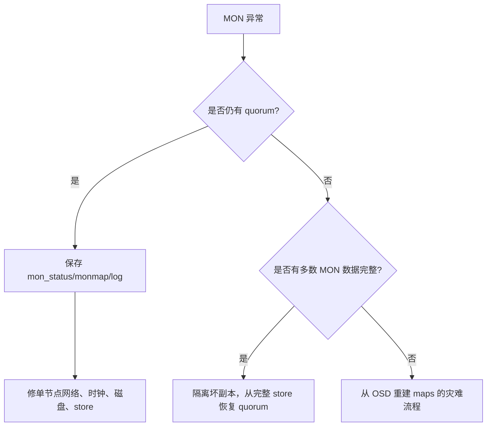

OSD 不启动先看 unit/container exit、BlueStore label、block/db/wal symlink、权限与 keyring；不要先 zap。OSD slow/unresponsive 分层看 heartbeat network、device latency/error、BlueFS/RocksDB、CPU steal、RAM/OOM、co-resident process、recovery/mClock 和 kernel issue。`dump_historic_ops`/`dump_ops_in_flight` 显示 op 卡在哪个阶段，slow request 是症状而非一定是磁盘。

计划停 OSD 又不想自动迁移可短时 `noout`，但多盘维护前计算 size/min_size 与 failure domain。Flapping OSD 常见 heartbeat 丢包、MTU/bond、过载导致心跳线程饿死或进程 crash；反复 mark in 只会制造 backfill 抖动。

PG 永不 clean 的诊断顺序：OSD 数是否满足 size/k+m -> CRUSH rule 是否能选够 failure domain -> acting OSD 是否 up/in -> peering blocked_by/past intervals -> recovery/full constraints -> inconsistent/unfound。One-node test cluster若 size=3 本就无法 clean；生产不能用 size=1 消警。

Unfound object 先 `ceph pg <pgid> list_unfound` 和 query，找 lost OSD/旧盘。`mark_unfound_lost revert` 尝试回到旧版本，`delete` 永久删对象，两者都由上层数据语义决定。Inconsistent PG repair 对 replicated pool 通常以权威 shard 修其他副本，EC 的 shard 重建更复杂；先读 `rados list-inconsistent-obj/pg` 的 version、digest、size 和 errors。

## 24. Cache tiering、balancer 与 stretch 的退出路径

Cache tiering 只在明确 workload 有益：热点相对稳定、对象较大、访问可被 hit set 捕获。随机冷扫描、RGW workload 和频繁 overwrite/omap 常是坏场景。配置涉及 backing/cache pool、tier link、overlay、mode、target dirty/full ratio、target bytes/ratio、min flush/evict age 与 hit set。

Read-only cache 退出：先把 mode 切为 `none`，再 remove tier。Writeback 退出必须先切官方退场用的 `proxy` mode，等待 dirty objects flush 并 evict 全部 cache object，再移除 overlay/tier，最后才删 cache pool。Unfound dirty cache object 可能是唯一新版本，不能直接删 pool。由于该功能已 deprecated，新设计不采用它。

Balancer 自动模式受 `begin/end time`、sleep、max misplaced ratio 等 throttle 限制。Supervised mode 是 eval -> optimize -> show plan -> execute；plan 基于某个 epoch，集群拓扑变化后应重新算。Upmap exception 过多会增加 map；移除 balancer 前决定是否保留 mappings。Read balancer online/offline 修改 primary affinity或 `pg-upmap-primary`，旧 kernel client 不支持相关映射时会拒绝，先检查 minimum compatible client。

Stretch mode 的核心不是“三地写三份”，而是两个数据 site + 第三 tiebreaker MON、connectivity election、stretch peering CRUSH rule 和 pool size/min_size 约束。进入前所有 bucket/location/weight 满足规则；单独 stretch pool 也要显式 set。退出或 force recovery/normal 会改变分区存活策略，是灾难控制动作。

Tiebreaker MON 失败可替换，但它不保存业务副本。使用 `--set-crush-location` 管理 MON location，不能只写一个与 monitor 实际认为不一致的 CRUSH 条目。Stretch 对双 site 同时故障、非对称网络和容量不平衡有明确限制，必须做网络分区演练。

## 25. 用户、caps、keyring 与密钥轮换

CephX user 是 entity + key + caps。OSD caps 可限制 pool、namespace、object prefix、class method、application tag 和读写命令；MON/MGR/MDS 各有自己的语法。Profile 是官方维护的 caps 模板，不代表所有业务都应共享一个 entity。

```bash
ceph auth ls
ceph auth get client.app
ceph auth add client.app mon 'allow r' osd 'allow rw pool=app namespace=tenant-a'
ceph auth caps client.app mon 'allow r' osd 'allow r pool=app'
ceph auth get client.app -o /etc/ceph/ceph.client.app.keyring
ceph auth import -i keyring
```

Keyring 文件可容纳多个 entity，并能 `ceph-authtool --create-keyring/--gen-key/--import-keyring` 管理；文件 mode 默认按 secret 处理。打印 key 会泄露长期凭据，标准日志只记录 entity/fingerprint。

Key rotation 先生成/登记新 key，分发所有 client/daemon，再使其重新认证，确认没有旧会话，最后撤销旧 key。Ceph daemon 的 rotating service keys/ticket TTL 与 client key 不是一件事。大规模轮换分批，并保留能恢复控制面的独立 admin credential。

禁止 CephX 或开启 emergency cipher/insecure key 只允许用于有时限的恢复，而且网络隔离不能修复授权缺失。恢复后列出现存不安全 keys、逐个轮换、关闭 compatibility flag，并用负向权限测试验收。

## 26. Librados 语言绑定、compound op 与 SQLite VFS

C/C++、Python、Java、PHP 的共同生命周期是创建 cluster handle -> 读取配置/显式 set -> connect -> 创建 pool ioctx -> object ops -> 关闭 ioctx -> shutdown。Pool name 只在创建 ioctx 时解析为 id；rename 后既有 ioctx 仍指向同一 pool id。

```python
import rados

with rados.Rados(conffile='/etc/ceph/ceph.conf', name='client.app') as cluster:
    with cluster.open_ioctx('app') as ioctx:
        ioctx.set_namespace('tenant-a')
        ioctx.write_full('object-1', b'payload')
        value = ioctx.read('object-1')
```

Object op 可把 compare、read/write、xattr/omap、assert version 等组合到 primary 原子执行；原子范围是单 object，不跨 object/pool。AIO completion 分 complete 与 safe/durable 语义（具体 API 版本按 binding）；callback 中不能释放仍被库使用的 buffer/handle。超时后查 version/idempotency，不能盲目重放 append 或非幂等 class method。

Object listing 是分片迭代视图，遍历期间并发增删可能不形成单时点 snapshot。RADOS lock/lease 需要 owner/cookie/duration 与故障 fencing；watch/notify 的断线、重新 watch 和 notify ack 都由应用处理。

Object Class 在 OSD primary 内执行已安装的 C++ method，能与 object mutation 原子组合。SDK 提供 cls API、输入/输出 bufferlist 和注册宏；所有 OSD 必须安装同版本 class。Method 必须限制 CPU、内存和循环，验证 untrusted input，返回明确 errno；崩溃/阻塞会直接伤害 OSD service thread。

Ceph SQLite VFS 把 SQLite page 放入 RADOS，推荐合适 page size/cache、persistent journal/WAL 和 exclusive lock mode。它允许受支持方式的并行访问但仍服从 SQLite locking，不是横向分片数据库。Break lock 可能让两个 writer 损坏数据库；只有确认旧 owner 永久消失才执行。Export/extract 用官方工具得到普通 SQLite 文件，temporary tables 留在本地。适合小型 control metadata，不适合高写入大数据库。

## 27. 日志、Admin Socket 与 profiling 的控制

Ceph debug 值通常是 `log_level/memory_level`。Memory level 把详细记录留在内存环形 buffer，触发 dump 时才落盘；log level 持续写文件/journal。动态命令适合复现窗口：

```bash
ceph tell osd.3 config set debug_osd 20/20
ceph daemon osd.3 dump_historic_ops
ceph tell osd.3 config set debug_osd 1/5
```

Subsystem 要针对因果层选择，如 `ms`、`mon/paxos`、`osd/optracker`、`bluestore/bluefs/rocksdb`、`crush`、`auth`，全局高 debug 会制造磁盘 full 和新的 slow ops。Boot 前故障才写持久 config，恢复后删除 override。Logrotate 加速不能删尚未收集的 first-failure 文件。

Admin socket 是本机 daemon 私有诊断接口，可查看 perf dump/schema、config、ops、messenger connections、heap 等；权限等同管理面，不暴露到非受信容器。Messenger status 可证明实际 peer 地址、协议与连接状态，比 netstat 单一监听更接近 Ceph 会话。

CPU profiling（如 oprofile/perf）、tcmalloc heap profile、Massif/Valgrind 都有观测开销。执行前记录 baseline 和持续时间，只对单 daemon/副本做；内存 release 命令可能只把 allocator free page 还给 OS，不修复 live-object leak。Profile 结果要与同一时间的 client latency、queue 和设备指标关联。

## 28. Legacy FileStore、journal 与迁往 BlueStore

FileStore 通过宿主文件系统（历史上常用 XFS）保存对象文件，用 filesystem xattr 存对象 metadata，并用独立 journal 保证写入顺序与恢复。它的双重写入、page cache、filesystem journal 与 Ceph journal 叠加，性能和故障分析比 BlueStore 更复杂；Tentacle 新 OSD 选择 BlueStore。

FileStore 旧配置域包括：xattr inline/chain、sync interval、flusher、op queue、commit timeout、B-tree filesystem 行为、journal size/alignment/direct I/O/AIO 和各类 timeout。参数互相依赖且只为旧 OSD 解释，不能把旧调优值复制到 BlueStore。Journal 必须比 data filesystem 延迟低且可靠；journal 丢失/损坏可能让尚未提交的 transaction 无法恢复。

迁移没有“原地切 backend”的无风险开关。优先路径是 mark-out replacement：逐个 OSD out -> 等数据恢复到其他 OSD -> destroy/purge 或保留 id -> 擦盘 -> 以 BlueStore 重建 -> in -> 等 `active+clean`，始终维持副本与恢复余量。Whole-host replacement 同时移除一主机全部 OSD，只适用于其余故障域容量与网络能承受。

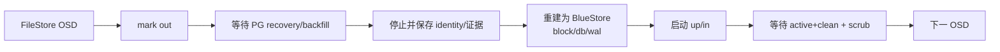

Per-OSD device copy/migration 工具仅在官方支持的版本和停机条件使用，复制期间 source 不得继续写；完成后核对 fsid/osd id、BlueStore label、auth、CRUSH location 与 object count。混合 FileStore/BlueStore 集群可作为迁移中间态，但性能、full ratio 和 recovery 行为按较弱路径规划。

每批迁移前后做业务读写、PG scrub、OSD restart、容量和 latency 验证。拒绝一次迁完整机架、在 degraded 状态继续下一批，或因进程 `up` 就擦除唯一旧盘。迁移完成后再清理 FileStore journal/device 和旧 config，保留可审计的 OSD 对照表。

## 29. 配置变更控制：从输入到 effective value

一次配置变更要回答五个问题：谁设置、作用于谁、来自哪一层、daemon 当前实际用了什么、重启后是否仍成立。只留下 `ceph config set` 的终端记录不足以审计。


### 29.1 section、mask 与优先级

Central config 的 `who` 可以是 `global`、daemon type（如 `osd`）、具体 daemon（如 `osd.7`）；mask 再限制 CRUSH location 或 device class：

```bash
# 所有 SSD OSD
ceph config set osd/class:ssd osd_memory_target 6G

# host=storage-03 上的 OSD；location mask 与 entity 以 / 分隔
ceph config set osd/host:storage-03 debug_osd 1/5

# 具体 daemon 最具体
ceph config set osd.7 osd_memory_target 8G

ceph config dump
ceph config show osd.7 osd_memory_target
ceph config show-with-defaults osd.7
```

同一 source 内 entity 越具体越优先；同等 specificity 下 location mask 与 class mask 的选择必须通过目标 daemon 的 `config show` 验证。不要依靠人脑推导多层 mask。修改范围过窄会让 replacement OSD 丢失调优，范围过宽会把 HDD 参数施加到 NVMe。

### 29.2 变更闭环

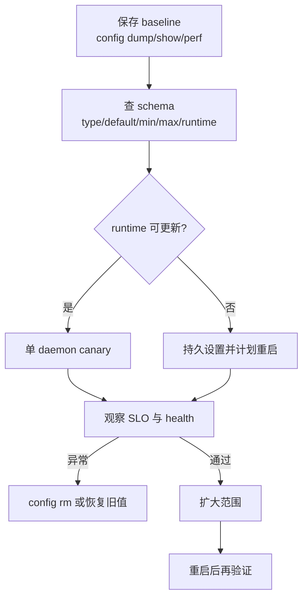

```bash
ceph config help <option> -f json-pretty
ceph config get osd.7 <option>
ceph config show osd.7 <option>
ceph config set osd.7 <option> <canary-value>
ceph config rm osd.7 <option>                 # 回到继承值，不是写“默认值”
```

停止条件：出现新的 `SLOW_OPS`、daemon crash、client p99 超 SLO、recovery 停滞或内存持续逼近 cgroup limit，立即停止扩面并删除本次 override。回退后用 `config show` 和 daemon restart 各验证一次，防止 runtime 值掩盖持久值。

### 29.3 文件解析与离线维护

```ini
[global]
mon_host = [v2:10.20.0.11:3300/0,v1:10.20.0.11:6789/0]
log_to_file = true
log_file = "/var/log/ceph/$cluster-$name.log"

[osd]
osd_memory_target = 6G

[osd.7]
host = storage-03
```

`--no-mon-config` 只用于 quorum 故障下的离线工具或明确 file-only 管理；恢复 quorum 后正常命令必须重新读取 central config。配置导入前先 dry review：

```bash
ceph-conf -c /etc/ceph/ceph.conf --name osd.7 --show-config
ceph config assimilate-conf -i /etc/ceph/ceph.conf --dry-run
ceph config assimilate-conf -i /etc/ceph/ceph.conf
```

导入结果中的不能识别项保留在本地文件，不能因“已 assimilate”而整文件删除。MON bootstrap、keyring、data path 与 discovery 仍可能依赖本地内容。

### 29.4 通用 daemon 身份与临时文件

`host` 取 `hostname -s` 的短主机名，不是 FQDN 或 IP；使用 cephadm 等部署工具时不要在单个 daemon section 手写 `host`，由部署器维护 cluster map。`admin_socket` 是本机高权限控制面，`pid_file`、`chdir`、`fatal_signal_handlers` 影响进程运行与 crash 取证，路径、owner 和容器挂载必须纳入 unit 验收。

Daemon 临时文件由 `tmp_dir` 与 `tmp_file_template` 控制，`$TMPDIR` 可作为初始化输入；临时目录必须有空间、正确权限，且不能把未完成 artifact 当正式输出。`ceph tell ... --daemon-output-file=:tmp:` 也会使用该路径。新集群统一使用默认 cluster name `ceph`；自定义 cluster name 已 deprecated，`--cluster` 只为旧环境兼容，多集群同 host 应使用 cephadm 的 FSID/容器隔离。

## 30. 网络、Messenger v2、heartbeat 与 MON 发现

### 30.1 两张网络的真实边界

Public network 承载 client-to-MON、client-to-OSD、daemon 管理通信；cluster network 承载 OSD heartbeat、replication、recovery/backfill。配置 cluster network 不会自动创造物理隔离，仍需独立接口/VLAN/路由/带宽和对称 MTU。

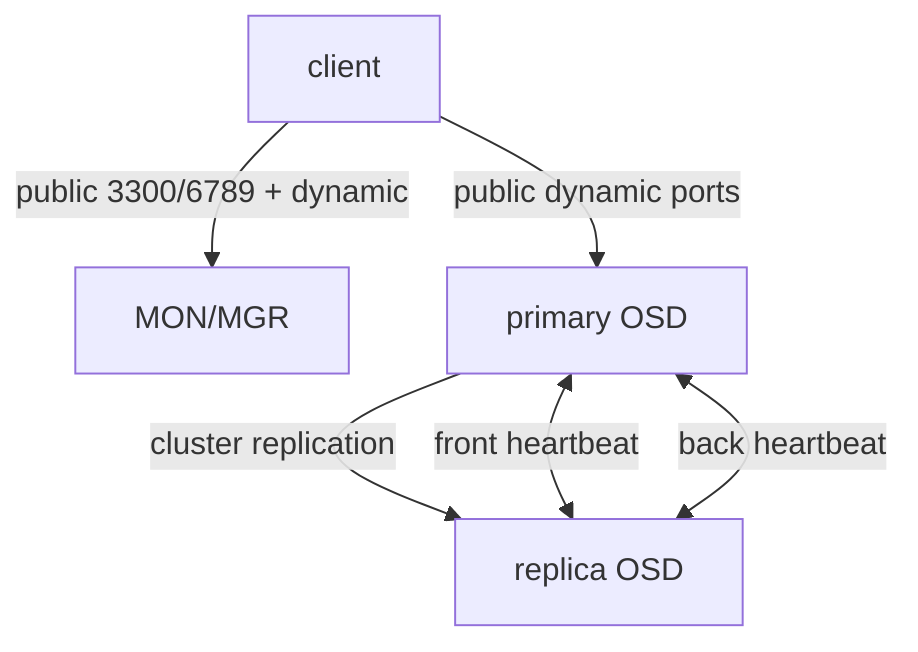

```ini
[global]
public_network = 10.20.0.0/24
cluster_network = 10.30.0.0/24
ms_bind_ipv4 = true
ms_bind_ipv6 = false
```

OSD 从 6800 起在 `ms_bind_port_min` 到 `ms_bind_port_max` 动态绑定多个端口；防火墙必须允许节点间双向新建连接。验证不能止于 `ping`/端口 listen：

```bash
ceph health detail
ceph daemon osd.7 messenger dump
ceph daemon osd.7 dump_osd_network 0
ceph config show osd.7 public_addr
ceph config show osd.7 cluster_addr
```

默认 heartbeat 慢于 1 秒会进入网络性能检查；高延迟同时出现在多个 OSD pair 常指向交换机、bond、MTU、拥塞或 host stall。`osd_heartbeat_grace` 放大只推迟 down 判定，不能修复网络。

### 30.2 v1/v2 与连接模式

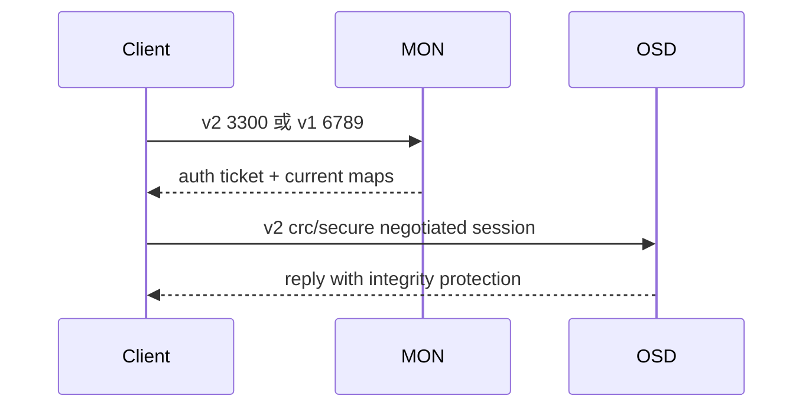

`crc` 提供帧完整性但不加密；`secure` 提供加密和完整性。CephX 认证 entity/授予 caps，不等同于传输加密。通信策略可分别控制 client、cluster、service：

```bash
ceph mon dump
ceph mon enable-msgr2
ceph config get mon ms_cluster_mode
ceph config get mon ms_service_mode
ceph config get client ms_client_mode
```

从 v1 迁移时先盘点 kernel client、librados 和全部 daemon 支持，再发布 v2 地址，验证实际 session，最后才考虑关闭 v1/6789。Messenger compression 还受 secure/non-secure 策略、algorithm 和最低 payload 影响；先压测 CPU 与链路收益，敏感数据要纳入 compression side-channel 评估。

### 30.3 DNS SRV discovery

客户端本地没有 `mon_host` 时可查 `_ceph-mon._tcp.<domain>`，或通过 `mon_dns_srv_name` 改 service label。SRV 的 priority/weight/port 仅决定初始 contact；建立连接后以 MON map 为准。

```bash
dig +short SRV _ceph-mon._tcp.storage.example.com
ceph -m dns:storage.example.com -s
```

上线前验证所有 target 有 A/AAAA、端口与协议相符、TTL 满足故障切换、split DNS 两侧一致。DNS 成功而 monmap 内旧地址不可达，客户端仍会失败。

## 31. CephX、caps、keyring 与密码学迁移

### 31.1 entity 与最小权限

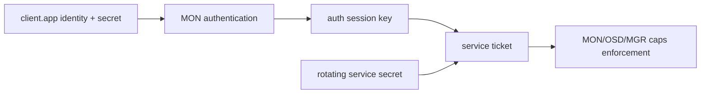

`client.admin` 是默认 CLI identity，不应分发给业务。`--id app` 等价于 `--name client.app`，后者必须写完整 type。OSD caps 的 `r/w/x` 分别约束读、写、class call；`class-read`/`class-write` 可比 `x` 更窄。

```bash
ceph auth get-or-create client.orders \
  mon 'allow r network 10.40.0.0/16' \
  osd 'allow rw pool=orders namespace=prod object_prefix order-' \
  -o /etc/ceph/ceph.client.orders.keyring

ceph auth caps client.orders \
  mon 'allow r' \
  osd 'allow r tag rbd pool=orders'
```

Match spec 支持 `pool=`、`namespace=`、`object_prefix`、`tag <application> <key>=<value>` 和 network CIDR。Caps 修改是替换整个 daemon-type cap，不是增量追加；先保存 `ceph auth get` 输出。MON `r` 是取 maps 的基本权限，业务还需对应 OSD cap。

### 31.2 keyring 生命周期

```bash
ceph auth ls
ceph auth get client.orders
ceph auth get-key client.orders
ceph-authtool --create-keyring /secure/orders.keyring
ceph-authtool /secure/orders.keyring --name client.orders --add-key '<base64-key>'
chmod 0600 /secure/orders.keyring
```

`ceph auth get-or-create` 在 entity 已存在时不会按操作者想象自动修正全部 caps，必须检查输出。`ceph auth get-or-create-key` 只返回 key。Keyring 搜索路径来自 `keyring` 配置，常含 `$cluster`/`$name`；CLI 找不到 keyring 时，不要用命令行 `--key` 暴露 secret 到进程列表。

### 31.3 无双 key 槽时的轮换

CephX entity 通常只有一个当前 secret，因此业务轮换不是简单“同时保留新旧 key”。安全做法是新建第二 identity、复制最小 caps、分批切 client、验证旧 identity 无连接/请求后删除：


```bash
ceph auth get-or-create client.orders-v2 \
  mon 'allow r' osd 'allow rw pool=orders namespace=prod'
ceph auth get client.orders-v2 -o /secure/ceph.client.orders-v2.keyring
# 应用滚动切换并执行正向/负向权限测试
ceph auth del client.orders-old
```

Service keys、rotating service secrets、ticket session keys 由 CephX 协议管理，与上述 client identity 轮换不同。Tentacle health code 会暴露 insecure key type、service ticket、rotating key 与 emergency cipher；先升级所有使用方、轮换受影响 key，再关闭兼容开关。`auth_service_cipher` 和 `mon_auth_emergency_allowed_ciphers` 只按官方迁移窗口使用，禁止永久保留应急 cipher。

## 32. MON 生命周期、选举与灾难恢复

### 32.1 quorum 与变更准入

MON 依靠多数派提交 Paxos 状态：3 个 MON 容忍 1 个故障，5 个容忍 2 个。推荐至少 3 个、需要更高隔离时 5 个；偶数 MON 不增加相对前一奇数的容错能力。

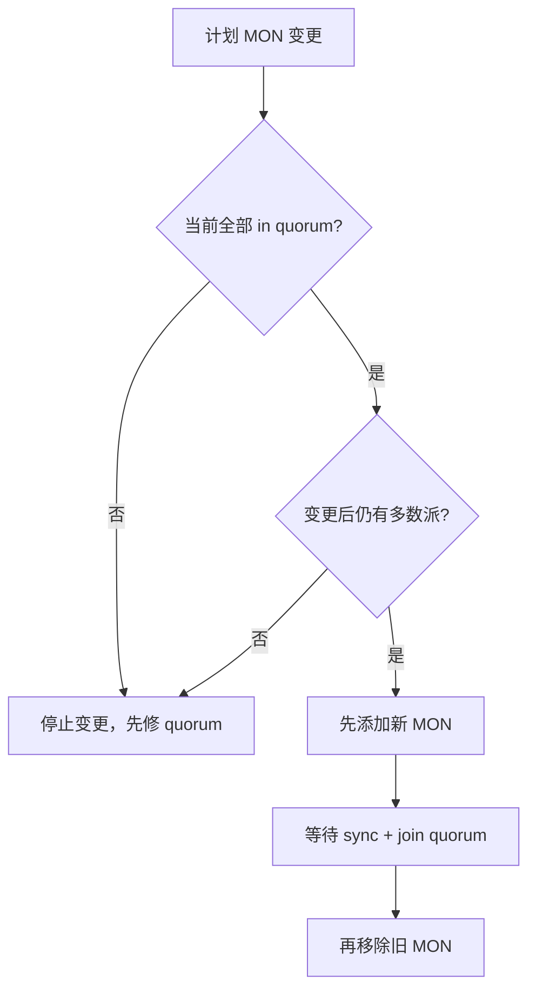

```bash
ceph -s
ceph quorum_status -f json-pretty
ceph mon dump
ceph versions
ceph time-sync-status
```

停止条件：已有 MON 不在 quorum、clock skew、MON store 接近 critical、版本不兼容、目标地址不能与所有 MON 双向通信。替换必须先加后删。

### 32.2 手工添加 MON

```bash
install -d -o ceph -g ceph /var/lib/ceph/mon/ceph-<new-id>
install -d -m 0700 /secure/mon-add
ceph auth get mon. -o /secure/mon-add/mon.keyring
ceph mon getmap -o /secure/mon-add/monmap
ceph-mon -i <new-id> --mkfs \
  --monmap /secure/mon-add/monmap \
  --keyring /secure/mon-add/mon.keyring
ceph-mon -i <new-id> --public-addr <ip:port>
```

启动后必须看到新 id 同时存在于 monmap 与 quorum，且 `state=leader|peon`，再清除临时 keyring/map。仅进程 running 或端口 listen 不算成功。

### 32.3 健康 quorum 中移除 MON

```bash
# 先证明其他 MON 数量足够且同步
ceph quorum_status -f json-pretty
systemctl stop ceph-mon@<id>
ceph mon remove <id>
ceph quorum_status -f json-pretty
```

移除后再处理 data dir/host 配置。MON IP 的首选迁移方式也是“新地址新增一个 MON -> 加入 quorum -> 删除旧 MON”，而不是原地改地址。

### 32.4 无 quorum 时删除坏 MON

此流程会重写 consensus membership，必须停全部 MON，避免两份 monmap 同时推进：


```bash
systemctl stop ceph-mon.target                    # 每个 MON host
ceph-mon -i <survivor-id> --extract-monmap /secure/monmap
cp /secure/monmap /secure/monmap.before
monmaptool --print /secure/monmap
monmaptool /secure/monmap --rm <failed-id>
ceph-mon -i <survivor-id> --inject-monmap /secure/monmap
systemctl start ceph-mon@<survivor-id>
ceph -s
ceph quorum_status -f json-pretty
```

只有恢复出唯一稳定 quorum 后才能启动/重建其他 MON。旧 store 先归档，不在确认新 quorum 可写且已补足冗余前删除。

### 32.5 全 MON IP 迁移

当旧、新网络完全不通且无法先加后删时，离线改全部地址：备份 keyring/config/monmap -> 停 cluster 并禁自动启动 -> 导出 map -> `--rm` 旧成员 -> 用 `--addv` 添加相同 id 的 v2/v1 address vector -> print 检查 FSID/member/address -> 对每个停止的 MON 注入相同 map -> 更新各 data dir config -> 启动 MON -> 更新 `public_network`、orchestrator host addr、MGR/OSD config。

```bash
monmaptool --addv mon-a \
  '[v2:192.0.2.11:3300/0,v1:192.0.2.11:6789/0]' /secure/monmap
monmaptool --print /secure/monmap
ceph-mon -i mon-a --inject-monmap /secure/monmap  # daemon 必须停止
```

任何 MON 运行时禁止 inject。启动后若 FSID、member 数或 address vector 不一致，停止所有 MON，恢复 `monmap.before`，不可让部分 MON继续选举。

### 32.6 MON store 全损时从 OSD 重建

这是最后手段。先停止全部 OSD，逐个用 `ceph-objectstore-tool --no-mon-config --op update-mon-db` 汇聚 OSD 持有的 maps，再用 `ceph-monstore-tool <path> rebuild` 和受控 keyring 构造 store。所有输入 OSD 必须来自同一 FSID；源盘只读保存，汇聚目录置于有足够空间的独立介质。

```bash
ceph-objectstore-tool --data-path /var/lib/ceph/osd/ceph-7 \
  --no-mon-config --op update-mon-db --mon-store-path /secure/mon-store
ceph-monstore-tool /secure/mon-store rebuild -- \
  --keyring /secure/admin.keyring --mon-ids mon-a mon-b mon-c
```

能力边界必须写入事故记录：能从 OSD 恢复 OSD 持有的 maps 与 OSD key，能导入显式提供的 `client.admin`/MGR key；不能恢复其他 client/MDS keyrings，不能恢复 MDS maps，正在创建 pool 的中间状态也会丢失。对未知 PG 执行 `force-create-pg` 会创建空 PG，仅在能证明 pool 原本为空时允许。

## 33. OSD 创建、替换、移除与失联诊断

### 33.1 手工创建的对象身份链

一个 OSD 同时存在于 OSDMap id、CephX `osd.<id>`、CRUSH item/location、BlueStore FSID/label 和本地 unit。任何一层残留或错配都会形成 orphan、无法认证或错误放置。

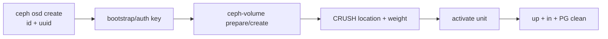

```bash
uuidgen
ceph osd create <uuid> [<requested-id>]
ceph-volume lvm create --bluestore --data /dev/<device>
ceph osd tree
ceph-volume lvm list
ceph osd metadata <id>
```

新设备必须先验证 serial/WWN、无 mount/signature、扇区尺寸、discard/firmware 与预期一致。命令中的 `/dev/sdX` 仅作示意，生产以持久设备标识定位。

### 33.2 保留 id 的故障盘替换

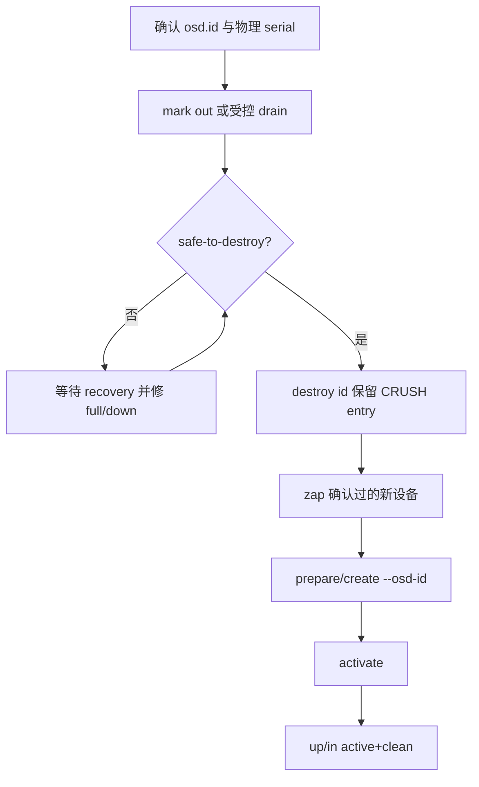

```bash
ceph osd out <id>
while ! ceph osd safe-to-destroy osd.<id>; do sleep 10; done
ceph osd destroy <id> --yes-i-really-mean-it
ceph-volume lvm zap /dev/<replacement-device>
ceph-volume lvm prepare --osd-id <id> --data /dev/<replacement-device>
ceph-volume lvm activate <id> <osd-fsid>
# 或单步：ceph-volume lvm create --osd-id <id> --data /dev/<replacement-device>
```

`destroy` 保留 id/CRUSH entry 供 replacement；`purge` 则删除 map、auth、CRUSH identity，不能混用。`zap` 前再次比对 replacement serial，原故障盘保留到新 OSD `up+in`、所有 PG clean 且业务校验通过。

### 33.3 永久移除

前置证据：集群不接近 full/backfillfull；失去该 OSD/host 后仍满足 CRUSH failure domain；无 degraded/unfound；变更期间不会并发第二故障域维护。

```bash
ceph osd out <id>
ceph -w
ceph osd safe-to-destroy osd.<id>
systemctl stop ceph-osd@<id>
ceph osd purge <id> --yes-i-really-mean-it
```

小集群中 `out` 可能因 bucket 权重未变而长期 `active+remapped`。确认是该 corner case 后：

```bash
ceph osd in <id>
ceph osd crush reweight osd.<id> 0
ceph -w
```

CRUSH reweight 0 会从 bucket 总 weight 扣除该 OSD，与 OSDMap `ceph osd reweight 0` 不同。数据迁完且 `safe-to-destroy` 通过后才能停止/purge。旧版本无 `purge` 时才分步 `ceph osd crush remove`、`ceph auth del osd.<id>`、`ceph osd rm <id>`。

### 33.4 down、out、lost 的不同语义

| 状态/动作 | 含义 | 风险 |
|---|---|---|
| `down` | daemon 不可达 | 数据仍可能在盘上，保留其历史价值 |
| `out` | 不再作为正常放置目标 | 触发 recovery/backfill，但不声明盘上数据不存在 |
| `destroy` | 销毁实例，保留 id 供替换 | 必须先 `safe-to-destroy` |
| `purge` | 从 OSDMap/auth/CRUSH 删除 | 适合永久退役，不适合保 id |
| `lost` | 声明 OSD 永不回来 | 可能接受旧副本/丢数据，是灾难动作 |

OSD 不启动时按 unit/container -> config/keyring -> BlueStore label/symlink -> block/db/wal device -> kernel I/O -> store repair 的顺序。先执行：

```bash
ceph osd find <id>
ceph osd metadata <id>
ceph-volume lvm list <id>
ceph-bluestore-tool show-label --dev /dev/<device>
journalctl -u ceph-osd@<id> --since '<incident-start>'
```

不要以 `zap`、`fsck --repair` 或 `ceph osd lost` 作为诊断第一步。能读出 label/objects 的旧盘可能是 unfound object 的唯一来源。

## 34. BlueStore、BlueFS 与设备工程

### 34.1 写入路径与故障面

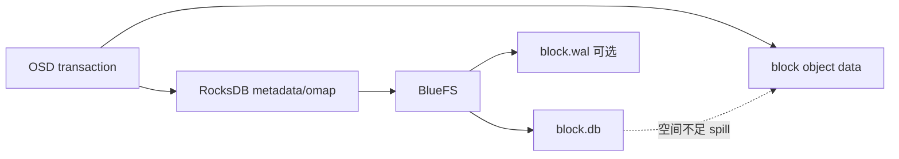

`block` 必有；`block.db`、`block.wal` 可选。只提供高速 DB 时 WAL 自动位于 DB。单独 WAL 只有在它显著快于 DB 且压测证明 WAL 是瓶颈时才有意义。共享一块 NVMe 给多个 HDD OSD 做 DB 能降低 metadata latency，但该 NVMe 是相关故障域；每块 NVMe 故障造成的 OSD 数必须低于 pool/CRUSH 可承受范围。

### 34.2 容量预算与 spillover

| workload | `block.db` 起始预算 | 必须校准的变量 |
|---|---:|---|
| RBD 大块顺序/一般虚机 | `block` 的 1%-2% | image 数、snapshot/clone、object 数 |
| RGW | 至少 4% | bucket index、omap key 数、小对象比例 |
| 混合/未知 | 1%-4% 后实测 | compaction 峰值、metadata growth、故障余量 |

```bash
ceph daemon osd.<id> bluestore bluefs device info
ceph daemon osd.<id> perf dump | jq '.bluefs,.bluestore,.rocksdb'
ceph health detail
```

`BLUEFS_SPILLOVER` 表示 DB 内容溢到 slow device，不是简单“告警可忽略”。处理顺序：记录 DB/slow 使用量和 compaction -> 判断 workload 是否持续增长 -> 有受支持空间时 expand/migrate DB -> 验证 spill 指标与 latency。禁止直接删 RocksDB SST。

### 34.3 cache 与内存

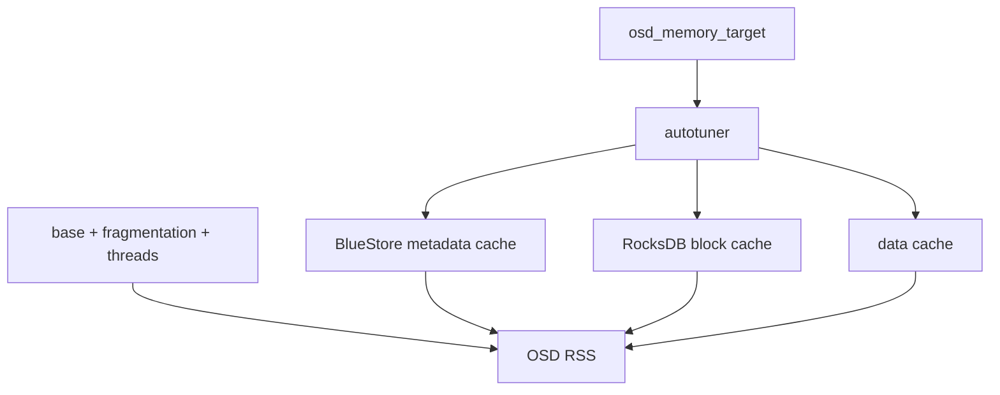

Autotune 是基于 TCMalloc 的软目标，不是 cgroup hard limit。`osd_memory_base`、expected fragmentation、cache minimum 和 resize interval 影响收敛；RSS 还包括非 cache 内存。验收同时看 daemon `heap`/perf、container working set、host available memory 和 OOM event。每 OSD 同设过大的 target 会把 host 推入 swap/OOM。

### 34.4 checksum 与 compression

Checksum 选择必须记录“漏检风险换了多少 metadata”：

| data checksum | 位宽 | 近似随机漏检概率 | 使用判断 |
|---|---:|---:|---|
| `crc32c` / `xxhash32` | 32 | 1 / 4,000,000,000 | 常规最低基线 |
| `xxhash64` | 64 | 更低 | metadata 开销更高，按版本支持验证 |
| `crc32c_16` | 16 | 1 / 65,536 | 仅明确接受风险时 |
| `crc32c_8` | 8 | 1 / 256 | 不适合作为关键数据默认 |
| `none` | 0 | 无数据 checksum | 不能发现 silent corruption |

```bash
ceph osd pool set <pool> compression_algorithm zstd
ceph osd pool set <pool> compression_mode passive
ceph osd pool set <pool> compression_required_ratio 0.7
ceph osd pool set <pool> compression_min_blob_size 64K
ceph osd pool set <pool> compression_max_blob_size 4M
ceph osd pool set <pool> csum_type crc32c
```

Compression ratio 的含义是压缩后大小必须小于原大小乘该比值才接受；算法/mode 改变只影响后续写入，不后台重写已有对象。验收使用真实数据，比较 stored/raw、CPU、client p99、recovery 和 compaction，不能只看压缩率。

### 34.5 sharding、min_alloc_size、SPDK 与 DSA

RocksDB reshard 必须逐 OSD 停机：

```bash
systemctl stop ceph-osd@<id>
ceph-bluestore-tool --path /var/lib/ceph/osd/ceph-<id> \
  --sharding='m(3) p(3,0-12) O(3,0-13)=block_cache={type=binned_lru} L P' \
  reshard
systemctl start ceph-osd@<id>
```

执行前确认其他副本健康与磁盘空间；失败时保留原盘和完整输出，不在同一 OSD 反复用不同 schema。`min_alloc_size` 以 BlueStore label 中值为事实，创建后改 global config 无效：

```bash
ceph-bluestore-tool show-label --dev /dev/<device>
```

SPDK 路径需要 hugepages、设备解绑/绑定、BDF map 与每实例独立 shared-memory namespace；DB/WAL 不清空时会留下 kernel I/O 路径。DSA 要同时满足 Sapphire Rapids、内核 idxd、work queue、DML build。两者都是设备路径变更，必须有重启、掉电、PCIe reset、介质错误和回退测试。

## 35. Pool 完整生命周期与删除保护

### 35.1 设计时固定的合同

```mermaid
flowchart TD
  W[workload] --> P{保护方式}
  P -->|replicated| R[size + min_size]
  P -->|erasure| E[k+m + profile]
  R --> C[CRUSH rule/failure domain]
  E --> C
  C --> G[PG/autoscaler target]
  G --> A[application + caps + quota]
```

池名以 `.` 开头保留给 Ceph 内部。创建前确定：replicated/EC、CRUSH root/class/failure domain、预期 raw/usable、autoscaler 模式、application owner、quota、snapshot/namespace 语义和删除责任人。

```bash
ceph osd pool create orders 128 replicated replicated-hdd --autoscale-mode=on
ceph osd pool set orders size 3
ceph osd pool set orders min_size 2
ceph osd pool application enable orders rbd
ceph osd pool application set orders rbd owner orders-platform
ceph osd pool set-quota orders max_bytes 100T
ceph osd pool ls detail
ceph osd pool get orders all
```

`size=3,min_size=2` 允许一个副本不可用时继续写，但不保证任意两个 failure domains 同失效还能服务。`min_size=1` 会让唯一副本接受新写，显著扩大不可恢复窗口。EC 的可写条件由可用 shard、`min_size` 和 peering history 共同决定，不直接套用复制池结论。

### 35.2 rename、snapshot、namespace、quota

```bash
ceph osd pool rename orders orders-v2
ceph osd pool mksnap orders-v2 pre-change
ceph osd pool rmsnap orders-v2 pre-change
rados -p orders-v2 --namespace tenant-a ls
ceph osd pool stats orders-v2
rados df
```

Rename 保留 pool id，但所有名称型 caps、应用配置和监控标签都要更新。Pool snapshot 是原生 RADOS self-managed snapshot 能力，不替代 RBD/CephFS/RGW 的应用级快照。Namespace 共用 pool 的 PG、容量和性能，只是 object name/caps 隔离。Quota 达上限会阻止 pool 写，但不为其他 pool 预留物理空间。

### 35.3 删除流程

```mermaid
flowchart TD
  D[删除申请] --> O[确认 owner/application]
  O --> L[列对象、namespace、snapshot]
  L --> U[确认无 RBD/CephFS/RGW 引用]
  U --> B[备份或明确不可恢复]
  B --> F[临时启用 mon_allow_pool_delete]
  F --> X[双 pool 名确认删除]
  X --> C[立即关闭删除开关]
  C --> V[清理 caps/未用 CRUSH rule]
```

```bash
ceph osd pool get <pool> all
rados -p <pool> ls --all | head
ceph auth ls
ceph config set mon mon_allow_pool_delete true
ceph osd pool delete <pool> <pool> --yes-i-really-really-mean-it
ceph config set mon mon_allow_pool_delete false
```

停止条件：存在未知 namespace/object、上层服务引用、snapshot、未确认 owner、备份验收失败，或集群当前 degraded。删除成功后检查 pool id 不存在、相关 caps 已回收、自定义 CRUSH rule 无其他 pool 使用再删除 rule。

## 36. PG 状态、autoscaler、scrub 与数据修复

### 36.1 状态不是单选项

```mermaid
stateDiagram-v2
  [*] --> creating
  creating --> peering
  peering --> activating
  activating --> active
  active --> clean
  clean --> scrubbing
  scrubbing --> clean
  active --> degraded
  degraded --> recovering
  recovering --> clean
  active --> remapped
  remapped --> backfilling
  backfilling --> clean
```

| 状态族 | 判断 |
|---|---|
| `creating/activating` | 新 PG 建立或 peering 完成后等待可服务 |
| `active/clean` | 可服务/保护满足，两词分别表达可用性和完整副本 |
| `wait/laggy` | 等旧 lease 过期或 replica 未及时确认 lease，I/O 暂停 |
| `degraded/undersized` | 对象副本缺失/acting set 少于 size |
| `recovering/recovery_wait/recovery_toofull/recovery_unfound` | 日志增量恢复、排队、容量或 unfound 阻塞 |
| `backfilling/backfill_wait/backfill_toofull/backfill_unfound` | 全 PG 扫描迁移及其阻塞 |
| `peered/incomplete/down` | 已 peering 但未达 min_size、缺权威 history/shard、必要副本 down |
| `stale/unknown` | MON 无 primary report / MGR 尚未收到状态 |
| `inconsistent/repair` | scrub 发现差异/正在修复 |
| `snaptrim*` | snapshot object 清理执行、排队或报错 |

### 36.2 autoscaler 的预算模型

Autoscaler 先按 CRUSH subtree 计算 PG budget，再根据实际/目标使用量、replication/EC rate、`target_size_bytes`/`ratio`、bias、bulk 和 min/max 决定 `NEW PG_NUM`。同一 OSD 同时出现在重叠 CRUSH roots 时，贡献会按比例折算。

```bash
ceph osd pool autoscale-status
ceph osd pool set <pool> pg_autoscale_mode warn
ceph osd pool set <pool> target_size_bytes 100T
ceph osd pool set <pool> pg_autoscale_bias 1.5
ceph osd pool set <pool> bulk true
ceph osd pool set <pool> pg_num_min 128
ceph osd pool set <pool> pg_num_max 2048
```

`bulk` 使大池从较完整 PG 配额起步，非 bulk 从少量 PG 随增长扩展。`target_size_bytes` 优先于同 pool 的 `target_size_ratio`，同时设置会告警；目标总量不可超过真实可用容量。无 balancer 时官方建议多数集群约 100-250 PG replicas/shards per OSD，不能把 logical PG 和 replica/shard 数混为一谈。

### 36.3 定位 stuck PG

```mermaid
flowchart TD
  P[PG 非 active+clean] --> Q[ceph pg PGID query]
  Q --> O{blocked_by/down_osds?}
  O -->|是| R[恢复可能持有权威数据的 OSD]
  O -->|否| C{toofull?}
  C -->|是| F[释放目标 failure domain 容量]
  C -->|否| U{unfound/inconsistent?}
  U -->|unfound| L[列 might_have_unfound]
  U -->|inconsistent| I[列 shard digest/version/error]
```

```bash
ceph pg dump_stuck stale
ceph pg dump_stuck inactive
ceph pg dump_stuck unclean
ceph pg <pgid> query
ceph pg map <pgid>
ceph osd map <pool> <object>
```

`force-recovery`/`force-backfill` 只提高队列优先级，不创造缺失副本或容量；完成后 flag 自动清除，也可用 `cancel-force-*`。只对明确业务优先级的 PG/pool 使用，防止其他恢复长期饥饿。

### 36.4 unfound 的决策门

```bash
ceph pg <pgid> list_unfound
ceph pg <pgid> query
```

`might_have_unfound` 的状态包括 `already probed`、`querying`、`OSD is down`、`not queried`。先找回所有可能旧盘/主机；已 out 后又发生后续故障的旧 OSD 可能未列出，也要查事故资产记录。

```mermaid
flowchart TD
  U[OBJECT_UNFOUND] --> M{仍有可能位置?}
  M -->|是| R[隔离并恢复旧 OSD/盘]
  M -->|否| B[上层备份与对象影响确认]
  B --> T{replicated 且旧版本可接受?}
  T -->|是| V[mark_unfound_lost revert]
  T -->|否| D[mark_unfound_lost delete]
  V --> A[应用一致性修复]
  D --> A
```

`revert` 不支持 EC；若对象是新建且无旧版本，也会变成删除。`delete` 永久忘记对象。两者都只在所有可能位置已探测、备份/应用 owner 批准且接受数据缺口后执行。

### 36.5 inconsistent 与 repair

```bash
rados list-inconsistent-pg <pool>
rados list-inconsistent-obj <pgid> --format json-pretty
rados list-inconsistent-snapset <pgid> --format json-pretty
ceph pg deep-scrub <pgid>
ceph pg repair <pgid>
```

先保存每个 shard 的 size、version、data/omap digest、`read_error`、object-info。`read_error` 先查 `dmesg`、SMART/NVMe error log；不要让 repair 覆写唯一好副本。Replicated pool 中 repair 会将坏副本标记 missing 再由 recovery 重建；无 checksum 时可能偏向 primary，不能保证 primary 就是正确数据。BlueStore/EC 可在 `osd_scrub_auto_repair=true` 且错误数不超过 `osd_scrub_auto_repair_num_errors`（默认 5）时自动修；关键数据仍要确认权威来源。

## 37. CRUSH、tunables、weight-set、upmap 与离线证明

### 37.1 从物理域到 rule

```mermaid
flowchart TD
  R[root default] --> K1[rack-a]
  R --> K2[rack-b]
  K1 --> H1[host-a1]
  K1 --> H2[host-a2]
  K2 --> H3[host-b1]
  K2 --> H4[host-b2]
  H1 --> O1[osd.1 hdd]
  H2 --> O2[osd.2 hdd]
  H3 --> O3[osd.3 hdd]
  H4 --> O4[osd.4 hdd]
```

Bucket type 可自定义，但 type id 顺序表达层级；bucket id 为负，device id 非负。Weight 通常以 TiB 相对容量表示。`uniform/list/tree/straw/straw2` 是 bucket algorithm，现代一般使用 `straw2`；从旧算法切换可能大规模 remap。

典型 replicated rule：

```text
step take default class hdd
step chooseleaf firstn 0 type host
step emit
```

`firstn` 与 `indep` 在失败重试和位置稳定性上不同；EC rule 通常需独立 shard position。CRUSH MSR（multi-step retry）允许在多层约束失败后回退重试，使用 `CRUSH_MSR` feature，必须盘点所有 client/daemon 支持。

### 37.2 手工 map 的受控流程

```mermaid
flowchart LR
  G[getcrushmap] --> D[crushtool decompile]
  D --> E[最小编辑]
  E --> C[compile]
  C --> T[test mappings/distribution]
  T --> P[compare old/new remap]
  P --> S[setcrushmap]
  S --> M[监控迁移与 SLO]
```

```bash
ceph osd getcrushmap -o crush.before.bin
crushtool -d crush.before.bin -o crush.edit.txt
crushtool -c crush.edit.txt -o crush.after.bin
crushtool -i crush.after.bin --test --show-statistics --rule <rule-id>
crushtool -i crush.after.bin --test --show-mappings --rule <rule-id>
crushtool -i crush.before.bin --compare crush.after.bin
ceph osd setcrushmap -i crush.after.bin
```

离线测试覆盖足够多的 x/replica 数和各 failure scenario；确认无 duplicate target、无 shortage、分布偏差可接受、remap 百分比符合窗口。保留 before map 可回滚，但回滚也会再次迁移数据。

### 37.3 四种“权重”不能混用

CRUSH weight 是长期容量拓扑；OSDMap reweight 0..1 是临时 override；compat weight-set 为旧客户端兼容优化；per-pool weight-set 只改变某 pool。Balancer `upmap` 直接加 PG 映射例外，不改 hierarchy；`upmap-primary` 只调整 replicated pool primary。

```bash
ceph osd crush reweight osd.7 3.638
ceph osd reweight osd.7 0.8
ceph osd reweight-by-utilization
ceph osd dump | rg 'pg_upmap|pg_upmap_primary'
```

长期 override reweight 不为 1 会妨碍 balancer 判断。切 tunables 前确认最老 client；`ceph osd crush tunables optimal` 可能使旧 client 无法计算 placement。Device class 自动来自设备，也可 `set-device-class`/`rm-device-class`；class shadow hierarchy 不直接手改。

### 37.4 balancer 与 read balancer

```bash
ceph balancer status
ceph balancer mode upmap
ceph balancer on
ceph balancer eval
ceph balancer optimize plan-20260921
ceph balancer show plan-20260921
ceph balancer eval plan-20260921
ceph balancer execute plan-20260921
```

自动 balancer 只在健康度与 misplaced ratio 允许时分阶段工作，可限制 begin/end time、weekday、sleep、pool allowlist。Plan 基于生成时 map；拓扑、pool 或 OSD 状态变化后重新生成。`upmap` 要求 minimum compatible client 至少 Luminous；`upmap-read`/`pg-upmap-primary` 要求 Reef 能力，旧 kernel client 可能无法 map/mount，应先验证并能移除 primary mappings。

## 38. EC 插件、overwrite 与恢复经济性

### 38.1 k、m、stripe 与 failure domain

```mermaid
flowchart LR
  O[object stripe] --> D1[data 0]
  O --> D2[data 1]
  O --> D3[data k-1]
  O --> P1[parity 0]
  O --> P2[parity m-1]
  D1 & D2 & D3 & P1 & P2 --> F[k+m distinct CRUSH targets]
```

默认 EC profile 是 `k=2,m=2`，raw overhead 与 2 副本相同但可丢 2 个 shard；它需要 4 个合格 failure domains。`k=10,m=4` 理论 overhead 40%，但需要 14 个 target。`stripe_unit` 是每个 data chunk 每 stripe 的数据量，最好 4 KiB 对齐；`stripe_width=k*stripe_unit`。

```bash
ceph osd erasure-code-profile set ec-8-3 \
  plugin=isa technique=reed_sol_van k=8 m=3 stripe_unit=64K \
  crush-root=default crush-failure-domain=host crush-device-class=hdd
ceph osd erasure-code-profile get ec-8-3
ceph osd pool create archive erasure ec-8-3
```

Profile 被 pool 引用时不能删除。用 `--force --yes-i-really-mean-it` 覆盖同名 profile 可能让旧数据的编码合同与新参数冲突，生产禁止原地改变已用 profile；创建新 pool 迁移。

### 38.2 五类插件

| plugin | 关键参数/算法 | 设计决策点 |
|---|---|---|
| `isa` | `reed_sol_van`、`cauchy` | Tentacle 默认 plugin，ISA-L 加速，确认 CPU/build |
| `jerasure` | Vandermonde、Cauchy、Liberation/Blaum-Roth 等 | 历史兼容与 technique 参数多，需专项 benchmark |
| `lrc` | `l`、locality groups | 增加 local parity，以空间换少量 OSD参与的局部修复 |
| `shec` | `c`、`single/multiple` | 以额外计算/布局权衡多故障恢复读取 |
| `clay` | `d`、`scalar_mds`、`technique` | vector code，降低修复网络与磁盘读取 |

CLAY 中 `k+1 <= d <= k+m-1`，默认 `d=k+m-1`。单 shard 存储量为 `S` 时，ISA/Jerasure 典型修复读取约 `k*S`，CLAY 为 `d*S/(d-k+1)`；`k=8,m=4,d=11` 时约从 8S 降到 2.75S。代价是 subchunk：令 `q=d-k+1`，subchunk 数为 `q^((k+m)/q)`，修复每 helper 读取 `subchunk_count/q`；stripe 太小会产生离散小读。

### 38.3 overwrite、优化与上层布局

```bash
ceph osd pool set archive allow_ec_overwrites true
ceph osd pool get archive allow_ec_overwrites
```

EC overwrite 只支持 BlueStore，随机小写可能 read-modify-write。CephFS/RBD 常用 replicated metadata pool + EC data pool，因为 omap/metadata 操作与小写要求不同。Tentacle 的 EC optimizations 改善 encoding/space 行为：所有 MON/OSD 必须到 Tentacle，gateway/client 无需同步升级；该 flag 改变新数据格式，启用后不能关闭，且当前只支持 Jerasure/ISA-L 的 `reed_sol_van`。

```mermaid
flowchart TD
  E[选择 EC] --> W{workload 可接受编码延迟?}
  W -->|否| R[replicated]
  W -->|是| F{有 k+m 独立 failure domains?}
  F -->|否| X[调整 k/m 或扩容]
  F -->|是| B[压测正常写 + 单盘/整 host 恢复]
  B --> S[验证空间、p99、CPU、网络、恢复时间]
```

验收必须包含 object size 分布、小写、degraded read、单 OSD/host/rack loss、重建流量和 remaining capacity。理论 `(k+m)/k` 不含 BlueStore allocation、padding、metadata、PG log、compaction 与 recovery headroom。

## 39. mClock、recovery、scrub 与服务等级

### 39.1 三个 QoS 参数

```mermaid
flowchart LR
  C[client] --> Q[mClock]
  R[background recovery] --> Q
  B[background best-effort<br/>scrub/snaptrim] --> Q
  Q -->|reservation 保底| D[device capacity]
  Q -->|weight 分剩余| D
  Q -->|limit 封顶| D
```

Reservation 是服务最低保证，weight 只分配 reservation 之后的剩余，limit 是绝对比例上限。内置 profile 的完整合同如下，`MAX` 表示不额外封顶：

| profile | client R/W/L | recovery R/W/L | best-effort R/W/L |
|---|---|---|---|
| `balanced` | 50% / 1 / MAX | 50% / 1 / MAX | 5% / 2 / 90% |
| `high_client_ops` | 60% / 2 / MAX | 40% / 1 / MAX | 5% / 4 / 70% |
| `high_recovery_ops` | 30% / 1 / MAX | 70% / 2 / MAX | 5% / 2 / MAX |

Reservation 总和不能超过 capacity。数值按 shard 分配，随意增加 shard 会改变每 shard 排队和 limit 的实际效果。

### 39.2 profile 变更与回退

```bash
ceph config set osd.0 osd_mclock_profile high_recovery_ops
ceph config show osd.0 | rg 'osd_mclock|osd_max_backfills|osd_recovery_max_active'

# 临时诊断，重启失效
ceph tell osd.0 injectargs '--osd_mclock_profile=high_client_ops'
ceph daemon osd.0 config set osd_mclock_profile balanced
```

```mermaid
flowchart TD
  P[built-in profile] --> C{需要低级自定义?}
  C -->|否| V[观察 SLO]
  C -->|是| S[切 custom]
  S --> T[设置完整 R/W/L 并校验总 reservation]
  T --> V
  V -->|回 built-in| R[列出并删除 custom 参数]
  R --> B[设置 built-in 并 config show]
```

设置 built-in 锁定项时 CLI 可能返回成功但 daemon 随即覆盖；effective value 才是证据。所有 `osd_recovery_sleep*`、`osd_scrub_sleep`、`osd_delete_sleep*`、`osd_snap_trim_sleep*` 在 mClock 下强制为 0，由 scheduler 决定下一 op。

### 39.3 recovery override 门控

```bash
ceph config set osd osd_mclock_override_recovery_settings true
ceph config set osd osd_max_backfills 2
ceph config set osd osd_recovery_max_active_hdd 4
ceph config show osd.0 osd_max_backfills
# 窗口结束
ceph config rm osd osd_max_backfills
ceph config rm osd osd_recovery_max_active_hdd
ceph config set osd osd_mclock_override_recovery_settings false
```

默认并发为 `osd_max_backfills=1`、通用 `osd_recovery_max_active=0`、HDD=3、SSD=10。Override 期间一次改一项，持续观察业务 p99、slow ops、degraded bytes、recovery ETA、device queue 和网络；任何 SLO 破坏立即回旧值。

### 39.4 capacity benchmark

```bash
ceph config show osd.0 osd_mclock_max_capacity_iops_hdd
ceph tell osd.0 bench 12288000 4096 4194304 100
ceph config set osd.0 osd_mclock_max_capacity_iops_hdd 350
```

初始化 bench 受 cache、shard、BlueStore throttle 和邻居负载影响。结果超过 HDD 500/SSD 80,000 IOPS 异常阈值时回退默认值；应使用 fio 等外部工具在同介质、同 queue depth、相同 4 KiB random-write 条件复核。全局 override 前删除每个 `osd.N` 项，否则 specificity 使 global 不生效。

HDD 默认为 1 shard x 5 threads。不要为了“更多并行”恢复旧 5 x 1，除非基准证明 mClock fairness、吞吐与 tail latency 均改善。

## 40. 监控、集群控制与可用性评分

### 40.1 四层观察面

```mermaid
flowchart TD
  S[ceph -s / health detail] --> C[cluster summary + health code]
  C --> M[MON/MGR/OSD maps and metadata]
  M --> P[pool/PG/object placement]
  P --> D[daemon admin socket/perf/messenger]
  D --> H[host device/network/kernel]
```

```bash
ceph -s
ceph health detail -f json-pretty
ceph -w
ceph log last 100
ceph versions
ceph quorum_status -f json-pretty
ceph osd stat
ceph osd tree
ceph osd df tree
ceph pg stat
ceph df detail
```

`ceph -s` 的 `usage` 是 raw actual usage；stored/notional 是复制、clone、snapshot 之前的逻辑数据。`MAX AVAIL` 是基于 pool CRUSH rule/保护开销估算的可用值，不同 pool 共享 OSD 时不能相加。`up/down` 表达 daemon reachability，`in/out` 表达 placement membership，两组状态正交。

### 40.2 health mute 的责任边界

```bash
ceph health mute <CODE> 2h --sticky
ceph health mute ls
ceph health unmute <CODE>
```

非 sticky mute 在 health detail 变化时可能自动失效；sticky 保留到手工 unmute。生产 mute 必须有 code、原因、owner、到期、已知影响和解除判据。禁止 mute `PG_AVAILABILITY`、`OBJECT_UNFOUND` 或 full 类告警来让 dashboard 变绿。

### 40.3 Admin Socket 与 tell

`ceph daemon <name|socket>` 直连本机 Admin Socket，不依赖 MON quorum；`ceph tell <target>` 由 MON relay，可远程但依赖 quorum。

```bash
ceph daemon osd.7 help
ceph daemon osd.7 config show
ceph daemon osd.7 perf schema
ceph daemon osd.7 perf dump
ceph daemon osd.7 dump_ops_in_flight
ceph daemon osd.7 dump_historic_ops
ceph tell osd.7 messenger dump client --tcp-info
```

`messenger dump` 会短暂锁连接结构（通常数十毫秒），大集群用 messenger 名和 `dumpcontents` 缩小输出。关注 peer、v2 connection mode、cipher/compression、RTT variance 和 retransmit；这能区分“端口通”与“Ceph session 真正健康”。Admin Socket 权限等同 daemon 控制面，禁止网络暴露。

### 40.4 pool availability score

```mermaid
stateDiagram-v2
  [*] --> Available
  Available --> Unavailable: 任一 PG inactive 或存在 unfound object
  Unavailable --> Available: 所有 PG 可用且无 unfound
  Available --> Available: uptime 累加
  Unavailable --> Unavailable: downtime 累加
```

```bash
ceph osd pool availability-status
ceph config set mon pool_availability_update_interval 2
ceph osd pool clear-availability-status <pool>
```

Ceph 按 pool 记录 uptime、downtime、failure count、MTBF、MTTR，score 为 `MTBF/(MTBF+MTTR)`。默认 1 秒更新，间隔不能小于 `paxos_propose_interval`；两个 tick 之间发生又恢复的瞬断可能不被捕获。`enable_availability_tracking=false` 时保留最后 score 且不能 clear，恢复 true 后继续更新。它是内部可用性观察，不替代客户端 SLI。

### 40.5 集群 flag 与停止条件

| flag | 用途 | 遗留风险 |
|---|---|---|
| `noout` | 短维护避免自动 out | 真故障也不迁移，degraded window 变长 |
| `norecover` / `nobackfill` | 暂停对应恢复流量 | 数据保护持续不足 |
| `norebalance` | 暂停 map change 引发的 rebalance | 新布局长期不收敛 |
| `noscrub` / `nodeep-scrub` | 维护窗口暂停 scrub | silent corruption 检测积压 |
| `pause` | 暂停客户端读写 | 高影响灾难控制，不是普通维护开关 |

```bash
ceph osd dump | rg flags
ceph osd set noout
ceph osd unset noout
```

每个 flag 要有到期时间。窗口结束逐项 unset，再看 health、scrub backlog、recovery 和业务读写；不能用 `unset` 的成功返回替代收敛验收。

## 41. MON、OSD、PG 故障恢复 runbook

### 41.1 先保存 first failure

```mermaid
flowchart TD
  A[告警/业务错误] --> B[冻结并发变更]
  B --> C[保存时间线 + health JSON + maps]
  C --> D{quorum 是否存在?}
  D -->|否| M[MON 本机 admin socket/store/network]
  D -->|是| O{OSD/PG 异常?}
  O -->|OSD| E[unit/device/network/slow ops]
  O -->|PG| P[query/past intervals/unfound/inconsistent]
  M & E & P --> R[只修一个已证明因果层]
```

最低证据包：UTC 时间线、`ceph report`、health detail JSON、quorum/mon/osd/crush maps、PG query、目标 daemon 日志、host kernel/device/network 状态。先收集再调 debug；不要重启全部 daemon 抹掉 first failure。

### 41.2 MON 无 quorum

逐 MON 本机执行，不依赖 quorum：

```bash
ceph daemon /var/run/ceph/ceph-mon.<id>.asok mon_status
ceph-mon -i <id> --show-config-value mon_data
journalctl -u ceph-mon@<id> --since '<incident-start>'
df -h /var/lib/ceph/mon
```

`mon_status` 的 `state` 常见 `probing/electing/synchronizing/leader/peon`；反复 election 查 clock/network，长期 synchronizing 查 store 大小与磁盘。Rank 来自 monmap address 排序，不是健康等级。若健康多数派存在，替换坏 MON 让其向 peer 全量同步；不要修健康 store。

```mermaid
flowchart TD
  Q[无 quorum] --> N{MON 是否互相可达且时钟正常?}
  N -->|否| F[修 L2/L3/firewall/MTU/NTP]
  N -->|是| S{是否有多数完整 store?}
  S -->|是| B[以完整成员恢复 quorum再重建其余]
  S -->|否| R[停 OSD并从 OSD maps 重建 store]
```

MON store `Corruption: error in middle of record` 或 missing `.ldb` 时，先复制整个 data dir。`compact` 只处理空间/LSM，不修硬件或任意 corruption。所有 MON 丢失才进入 32.6 的 OSD rebuild。

### 41.3 OSD down/flapping/slow

```bash
ceph osd find <id>
ceph osd perf
ceph tell osd.<id> dump_ops_in_flight
ceph tell osd.<id> dump_historic_ops
ceph tell osd.<id> messenger dump --tcp-info
ceph device ls-by-daemon osd.<id>
```

| 症状 | 证据 | 优先根因 |
|---|---|---|
| 启动即退出 | unit exit、BlueStore label、keyring | device missing、FSID/id、权限、store corruption |
| heartbeat flapping | front/back slow pair、retransmit | MTU/bond/switch、CPU stall、device hang |
| slow ops 全卡 device | op events、iostat、kernel/SMART | bad sector、firmware timeout、DB/WAL stall |
| slow ops 卡 peering/map | PG query、map epoch | OSD down、MON map lag、recovery storm |
| RSS 过高/OOM | heap、cgroup event、target | cache target、fragmentation、thread/omap growth |
| 单 host 多 OSD 同慢 | CPU/NUMA/network/shared DB | 共用资源或 DB NVMe failure domain |

Linux conntrack 即使没显式防火墙也可能被激活并成为瓶颈；网络诊断要看 table utilization/drop。Bad sector 先保护副本和采集介质证据，避免 destructive repair。Co-located MON/OSD 或其他进程可争抢 disk/CPU/RAM，必须与同时间 metrics 对齐。

### 41.4 PG unavailable、unfound、inconsistent

```mermaid
flowchart TD
  U[PG unavailable] --> Q[query recovery_state]
  Q --> H{缺哪个 history/shard?}
  H --> D[定位 down/lost OSD 与旧设备]
  D --> R{可恢复设备?}
  R -->|是| I[隔离启动并完成 peering/recovery]
  R -->|否| B[备份和业务 owner 评估]
  B --> L[lost/revert/delete 最终决策]
```

`incomplete` 的 EC pool 有时可临时降低 min_size 使 recovery 前进，但这会改变可用/持久性门槛，只能在确认当前 shard 组合可重建且有上层备份时，由事故负责人批准，恢复后立即还原并 deep-scrub。`osd lost` 可能让 peering 接受不一致历史，比单对象 `mark_unfound_lost` 影响更广。

Repair 验收不是命令返回 0：PG 回到 `active+clean`、inconsistent list 为空、deep-scrub 通过、device errors 不再增长、业务对象 checksum/读取正确。若物理介质有 read error，修 PG 后仍需替换盘。

### 41.5 日志与 profiling 的回收

```bash
ceph tell osd.7 config set debug_osd 20/20
ceph tell osd.7 config set debug_ms 1/5
# 复现并收集后
ceph config rm osd.7 debug_osd
ceph config rm osd.7 debug_ms
ceph config show osd.7 debug_osd
```

Debug 表示 `file level/memory level`；高 file level 可迅速填满 MON/OSD 盘。CPU profiler、TCMalloc heap profiler、Massif/Valgrind 均改变性能，只对单个有冗余 daemon 设定固定窗口。`heap release` 只是把 allocator free pages 尝试还给 OS，不能证明 leak 修复。

### 41.6 社区升级证据包

外部求助前运行 `ceph report` 并附版本、部署方式、完整 error、最小复现、时间线、相关 daemon logs/maps；去除 key、token、业务对象名/IP 等敏感信息。`ceph-debugpack` 会收集 binary、config、logs、core 和 cluster report，出站前必须逐项脱敏审查，不能直接上传生产包。

## 42. librados、Object Class 与 libcephsqlite 开发合同

### 42.1 生命周期和错误模型

```mermaid
sequenceDiagram
  participant A as Application
  participant L as librados handle
  participant M as MON quorum
  participant O as primary OSD
  A->>L: create and configure cluster handle
  L->>M: connect authenticate fetch maps
  A->>L: create ioctx by pool name
  L->>O: sync or async object operation
  O-->>L: errno result and version
  L-->>A: completion or return value
  A->>L: destroy ioctx and shutdown
```

C/C++：创建 `rados_t`/`Rados` -> `conf_read_file`/`conf_set` -> `connect` -> `ioctx_create` -> operation -> `ioctx_destroy` -> `shutdown`。Python context manager 应保持相同所有权边界。连接前设置 config；pool 名只在创建 ioctx 时解析。

负 errno 是接口合同：`-ENOENT`、`-EEXIST`、`-EPERM`、`-ETIMEDOUT` 等必须分类。Timeout/连接断开不证明写未提交；用 object version、application idempotency key、compare/assert 或幂等 overwrite 处理不确定结果，不能盲目重放 append、counter increment、非幂等 class method。

### 42.2 sync、AIO 与 compound op

```mermaid
flowchart TD
  R[业务请求] --> I{天然幂等?}
  I -->|是| A[AIO submit]
  I -->|否| C[compare/assert version + mutation]
  C --> A
  A --> W[wait/callback]
  W --> E{result}
  E -->|success| F[release completion]
  E -->|timeout/unknown| V[读取 version/业务 marker]
  V --> F
```

Completion、buffer、ioctx 和 cluster handle 生命周期必须覆盖 callback。等待 complete 与 durable/safe 的具体语义按 Tentacle binding API 使用，不能混用旧 release 假设。Compound read/write op 可组合 xattr、omap、compare、assert version 与 data mutation，对单 object 在 primary 原子执行；不跨 object、namespace 或 pool。

Object listing 是分片迭代，不是并发写入下的 point-in-time snapshot。Xattr 适合小 metadata，omap 适合 key/value index，但 large omap 会影响 RocksDB、scrub 和 recovery。Watch/notify 要处理 reconnect、missed notification、ack timeout；RADOS locks 要有 owner/cookie/duration，并以外部 fencing 防止旧 owner 恢复后双写。

### 42.3 语言入口

```python
import rados

cluster = rados.Rados(name='client.orders', conffile='/etc/ceph/ceph.conf')
try:
    cluster.connect()
    with cluster.open_ioctx('orders') as ioctx:
        ioctx.set_namespace('prod')
        ioctx.write_full('order-42', b'payload')
        assert ioctx.read('order-42') == b'payload'
finally:
    cluster.shutdown()
```

C/C++ 由 `librados-dev`/`librados-devel` 提供头文件和库；Python module 版本应与 cluster feature 兼容。Java/PHP binding 的分发和 API surface 不同，生产必须锁定 package version 并跑连接、auth、pool、object、AIO/exception 的合同测试。

### 42.4 Object Class SDK

```mermaid
flowchart LR
  C[client compound op] --> P[primary OSD]
  P --> L[load cls shared object]
  L --> M[registered method]
  M --> O[cls_cxx read/write/omap]
  O --> T[same object transaction]
```

Class shared object 安装在所有 OSD 的 class directory；`ceph-clsinfo` 核对 name/version/architecture。Method 注册 read/write flags，解码不可信 `bufferlist`，使用 cls API 访问当前 object并返回负 errno。禁止不受限循环、网络调用、大内存或阻塞，因为它运行在 OSD 进程内。发布顺序是全 OSD 安装兼容 class -> 验证加载 -> client 开启调用；回滚反向进行，不能先删除 library。

### 42.5 libcephsqlite

```mermaid
flowchart TD
  S[SQLite page/journal/WAL] --> V[Ceph VFS]
  V --> X[RADOS striper objects]
  X --> P[pool]
  L[exclusive RADOS lock] --> V
```

建议 page size 与 object stripe/cache 联合压测。`PRAGMA journal_mode=PERSIST` 通过覆写 journal header 避免每事务删对象；`PRAGMA locking_mode=EXCLUSIVE` 在单使用者场景减少锁往返，阻止其他 client。WAL 仅在 exclusive lock mode 可用，因为 normal mode 所需 shared memory 不受支持。

官方量级提示：RADOS VFS 可能比本地 SSD 慢 3-10 倍；小事务约 30 ms，exclusive 约 15 ms，exclusive+WAL 可约 2-5 ms/150-250 TPS，必须以目标网络与 pool 实测。当前不支持 concurrent readers，所有 access 受单 exclusive lock；temporary tables 不受 Ceph VFS 支持。

```bash
rados --pool=<pool> --striper get app.db local.db
rados --pool=<pool> --striper get app.db-journal local.db-journal
```

手工同时抽取 DB/journal 可能与 writer 竞态，优先 SQLite Backup API。Break lock 前必须以 fencing 证明旧 owner 永久退出；否则两个 writer 可损坏数据库。数据库理论上受 SQLite 281 TB 上限而非 VFS 人为上限，但大库同步读、无 readahead，性能通常先成为边界。

## 43. RADOS 工具手册与破坏性边界

### 43.1 工具选择图

```mermaid
flowchart TD
  Q[任务] --> O{在线集群管理?}
  O -->|是| C[ceph / rados]
  O -->|否| M{处理哪种 artifact?}
  M -->|config/keyring| A[ceph-conf / ceph-authtool]
  M -->|MON/OSD map| P[monmaptool / osdmaptool]
  M -->|CRUSH| R[crushtool / crushdiff]
  M -->|KV/encoding| K[ceph-kvstore-tool / ceph-dencoder]
  M -->|OSD device| V[ceph-volume]
```

| 工具 | 真实职责 | 生产边界 |
|---|---|---|
| `ceph` | 集群管理、auth/config/map/health/PG/OSD/pool 命令 | 默认经 MON；destructive 子命令先保存状态并确认 scope |
| `rados` | 原生 pool/namespace/object/xattr/omap/lock/watch、benchmark、striper | 直接改 object 可破坏 RBD/CephFS/RGW；只操作明确原生对象 |
| `ceph-volume` | inventory；LVM prepare/create/activate/list/batch/zap/new-db/new-wal/migrate | `zap --destroy` 破坏设备；用 serial/WWN 二次确认 |
| `ceph-volume-systemd` | 把 systemd instance metadata 翻译为 `ceph-volume ... trigger` 激活 | 内部 activation helper，不作日常人工部署入口 |
| `ceph-authtool` | 离线创建、查看、合并 keyring 与 caps | 输出含 secret；文件 `0600`，避免 shell history |
| `ceph-conf` | 只读配置文件/compiled defaults | 不读 MON DB；现代 effective value 用 daemon/config show |
| `ceph-clsinfo` | 查看 object class binary 的 name/version/architecture | 不证明所有 OSD 已部署同一 binary |
| `ceph-debugpack` | 打包 binaries、logs、config、core、report | 可能含 secret/业务数据，出站前脱敏 |
| `ceph-dencoder` | encode/decode/dump Ceph data structure，做跨版本兼容测试 | build/version 必须与 artifact 匹配，不直接写生产 store |
| `ceph-mon` | MON daemon；mkfs、extract/inject monmap 等离线恢复 | inject/mkfs 必须确认 daemon 停止、FSID 和备份 |
| `ceph-osd` | OSD daemon；mkfs/show config 等低层入口 | 部署优先 ceph-volume/cephadm，避免绕过 identity 管理 |
| `ceph-kvstore-tool` | 离线查看/修改 RocksDB 或 BlueStore KV/omap | 修改前停 daemon并复制 store；普通排障先 list/get/crc |
| `ceph-run` | daemon 因特定 crash signal 退出时以前台方式重启 | 不是 orchestrator/systemd health policy 替代品 |
| `ceph-syn` | 通过 userspace client 对 CephFS 生成合成 workload | 仅测试环境；不是 RADOS 业务验收工具 |
| `crushdiff` | 结合 OSDMap/PG dump 估算新 CRUSH map 移动 PG/object/bytes | 估算依赖快照，执行前仍用当前 epoch复核 |
| `crushtool` | 创建、编译、反编译、测试 CRUSH map | `setcrushmap` 前保存旧 map、测试 mapping 与 remap |
| `librados-config` | 显示 installed librados version/version code | 不证明 daemon/client feature compatibility |
| `monmaptool` | 创建、打印、修改 MON map；v1 6789/v2 3300 | `--create` 生成新 UUID，事故恢复禁止误换 FSID |
| `osdmaptool` | 创建/打印/修改/测试 OSDMap、导出 CRUSH | 离线 map 工具；错误注入会大规模 remap |
| `ceph-post-file` | 将文件/diagnostic 上传到配置的 paste service | 生产资料先脱敏并获准，不能外发 key/core |

### 43.2 离线工具共同纪律

```mermaid
flowchart LR
  S[停止 owner daemon] --> B[复制原 artifact + checksum]
  B --> I[只读 inspect/print]
  I --> T[在副本修改并验证]
  T --> A[原子替换/注入]
  A --> V[启动单 daemon 验证]
  V --> C[补足冗余再清备份]
```

任何低层 map/store 工具都不以“命令存在”代表适合当前事故。先确认版本、FSID、daemon 已停、artifact owner、剩余副本、回滚文件和磁盘空间。对副本实验，保留输入/output checksum；验证失败恢复原 artifact，不在唯一原件上连续尝试。

### 43.3 `rados` 原生验收用法

```bash
rados -p <pool> --namespace <ns> put probe.bin ./probe.bin
rados -p <pool> --namespace <ns> stat probe.bin
rados -p <pool> --namespace <ns> get probe.bin ./probe.out
sha256sum ./probe.bin ./probe.out
rados -p <pool> --namespace <ns> setxattr probe.bin owner orders
rados -p <pool> --namespace <ns> getxattr probe.bin owner
rados -p <pool> --namespace <ns> rm probe.bin
```

`rados bench` 会创建 benchmark objects，必须使用隔离 pool/namespace 并在结束运行 cleanup；不能在上层应用 pool 随意跑。Object 名相同但 namespace 不同是不同对象。`--all` listing/删除是高危范围扩张，自动化显式写 pool 与 namespace。

## 44. 生产变更与验收

### 44.1 每次变更的批准字段

| 字段 | 必填内容 |
|---|---|
| 目标 | 要改变的业务结果，不写“优化 Ceph” |
| 对象 | FSID、pool/OSD/MON id、host、device serial、CRUSH domain |
| 基线 | health JSON、maps epoch、SLO、容量、PG、版本 |
| 风险 | 最大 failure domain、数据可用性/持久性、迁移量 |
| 停止条件 | 明确 health code、p99、capacity、recovery/timeout 阈值 |
| 回退 | 旧 config/map/device/store，执行人和最迟回退点 |
| 验收 | 正反向业务、故障注入、重启持久性、清理结果 |

```mermaid
flowchart TD
  B[baseline healthy] --> C[canary]
  C --> G{停止条件触发?}
  G -->|是| R[回退并验证]
  G -->|否| E[分批扩面]
  E --> V[故障/重启/业务验收]
  V --> H{全部证据通过?}
  H -->|否| R
  H -->|是| S[批准与归档]
```

### 44.2 RADOS 验收矩阵

| 域 | 必须执行 | 通过证据 |
|---|---|---|
| MON | 停 1 MON、恢复/替换 | quorum 持续多数派，map 可提交，新 MON sync 完成 |
| OSD | 停 1 OSD、替换 1 设备 | 业务持续，PG 收敛，`safe-to-destroy` 后才擦盘 |
| host/CRUSH | 模拟最大设计 failure domain | replicas/shards 分布跨域，容量仍低于 backfillfull |
| replicated pool | 真实 put/get/checksum、故障中写 | size/min_size 行为符合设计，恢复后 deep-scrub |
| EC pool | 小写/大写、degraded read、单 shard/host recovery | k+m 放置、恢复带宽、CPU/p99 达 SLO |
| auth | 最小权限正向与越权负向 | 允许目标 pool/ns/prefix，拒绝其他资源/admin |
| network | public/cluster、v2 mode、MTU/防火墙故障 | session mode 正确，heartbeat/重传达标 |
| capacity | nearfull/backfillfull 模拟与扩容 | 告警、写保护、runbook 和 headroom 生效 |
| scrub | scrub/deep-scrub 与受控 inconsistency 演练 | inconsistent 可定位，repair 后 checksum 正确 |
| mClock | client/recovery 竞争压测 | p99、recovery ETA、queue 与 profile 合同一致 |
| config | canary、restart、remove override | effective value 重启持久，回退恢复继承值 |
| observability | health、maps、perf、availability | 告警到责任人，指标能定位 failure domain |

### 44.3 最终状态不是只有 `HEALTH_OK`

```bash
ceph -s
ceph health detail
ceph quorum_status -f json-pretty
ceph osd tree
ceph osd df tree
ceph pg stat
ceph osd pool autoscale-status
ceph balancer status
ceph config dump
ceph health mute ls
```

```mermaid
flowchart LR
  H[HEALTH_OK 或已批准 exception] --> P[所有 PG active+clean]
  P --> Q[无 unfound/inconsistent]
  Q --> F[无遗留 flags/mutes/runtime overrides]
  F --> C[容量与 CRUSH failure-domain 合格]
  C --> B[业务 checksum + latency 合格]
  B --> D[证据归档]
```

允许验收的 exception 必须经过明确批准，并含 code、影响、补救期限；不能把 `HEALTH_WARN` 泛化为“Ceph 常见”。变更创建的 benchmark object、临时 pool、key、debug level、map 文件、device light、mute、flag 和临时 admin credential 必须清理。

### 44.4 禁止跨越的红线

- 未读 `PG query`/past intervals 就执行 `osd lost` 或 `mark_unfound_lost`。
- 未通过 `safe-to-destroy` 就 zap/复用原盘。
- 在 MON 运行时 inject monmap，或让不同 monmap 的 MON 并行启动。
- 用 `min_size=1`、提高 full ratio、长期 `noout/norecover` 作为消警方案。
- 未盘点旧客户端就升级 CRUSH tunables、启用 upmap-primary 或 v2-only。
- 在应用管理的 RBD/CephFS/RGW pool 用 `rados rm` 修业务对象。
- 在 degraded/unfound 状态同时改 pool size、CRUSH、PG 数和 mClock，多层因果不可审计。
- 把 `ceph -s` 的绿色状态当作 checksum、SLO、恢复能力和权限隔离的替代证据。

## 45. CephX `aes` 到 `aes256k`：Tentacle 生产迁移合同

Tentacle 将 CephX 密钥类型升级视为一项有顺序约束的集群迁移，而不是一次全局开关。认证链包含 entity credential、service ticket、rotating service secret 和已经建立的 session；只改 `auth_allowed_ciphers` 既不会轮换旧 key，也不会立即替换存量 ticket。cephadm 与 Rook 可以处理 daemon key 的迁移，但 **cephadm 不处理 client key**，应用、内核挂载、备份节点和离线管理节点仍须逐一盘点。

```mermaid
flowchart LR
  A[允许 aes + aes256k] --> P[新 key 首选 aes256k]
  P --> D[轮换 mon/mgr/osd/mds]
  D --> T[切换 service ticket cipher]
  T --> C[阻止新建旧 key]
  C --> K[轮换 admin 和所有 client]
  K --> V[service/client warning 清零]
  V --> O[只允许 aes256k]
```

### 45.1 变更前证据与停止条件

```bash
ceph versions
ceph -s
ceph --format=json mon dump | jq '{auth_allowed_ciphers,auth_preferred_cipher,auth_service_cipher}'
ceph --format=json-pretty auth dump-keys > auth-key-metadata.before.json
ceph --format=json-pretty health detail > health.before.json
```

`auth dump-keys` 含 credential 与 rotating-key metadata，文件按 secret 证据保护，不进入工单正文。先建立 entity -> daemon/client -> keyring 所在位置 -> owner -> 可重启窗口清单，并确认所有二进制理解 `aes256k`。任一 MON 不在 quorum、存在未知 client owner、没有可用的备用管理员身份、PG 不健康或当前正执行恢复时停止；不得用 mute 掩盖迁移前置条件。

整个迁移的硬停止条件是：认证失败增加、quorum 改变、daemon 重启后无法重新认证、业务 client 重新连接失败，或新 health check 出现。每批只轮换一个故障域内可安全停止的 daemon；保存刚生成的 keyring，验证后才进入下一批。

### 45.2 第一步：允许新类型并改变新 key 默认值

```bash
ceph --format=json mon dump | jq -r '.auth_allowed_ciphers | map(.name) | join(",")'
ceph mon set auth_allowed_ciphers aes,aes256k
ceph mon set auth_preferred_cipher aes256k
ceph --format=json mon dump | jq -r '.auth_preferred_cipher.name'
```

此时保留 `aes` 是迁移兼容窗口。若尚有无法升级的 client，可以暂不改变 preferred cipher，但必须阻止团队误以为新建 key 已安全。绝不能在 daemon/client key 尚未完成轮换时直接将 allowed list 改成单独 `aes256k`。

### 45.3 第二步：逐类轮换 daemon credential

先处理共享 `mon.` credential：

```bash
ceph auth rotate --key-type=aes256k mon. | tee mon.keyring
systemctl restart ceph-mon@<id>
ceph quorum_status -f json-pretty
```

`mon.` 历史上只存在于各 MON data directory 的 keyring；该流程把 auth DB 中的副本作为权威副本，本地 MON keyring 保留为 fallback/emergency key。保存 `mon.keyring`。轮换时 out-of-quorum 的 MON 可能错过新 key，不能直接把它拉回集群；先停止该 MON，把保存的 key 导入其实际 data directory keyring，再单节点启动并验证 quorum。

其余 daemon 按 `mgr -> osd -> mds` 逐个或按可用故障域分批：

```bash
systemctl stop ceph-<type>@<id>
# OSD 还需显式反映状态
ceph osd down <id>
ceph auth rotate --key-type=aes256k <type>.<id> | tee keyring
ceph-authtool --import-keyring <copied-keyring> /var/lib/ceph/<type>/ceph-<id>/keyring
systemctl restart ceph-<type>@<id>
```

cephadm/Rook 部署应让 orchestrator 执行 daemon key 分发和重启，不要同时手工修改容器 data directory。自有 systemd 部署使用上面的官方路径。对 `ceph-volume` 创建的 OSD，还要核对 BlueStore label 中的 bootstrap `osd_key`；由 `ceph-volume lvm list <osd-id> --format json` 的 `lv_path` 或 `ceph-volume raw list --format json` 的 `device` 精确定位，禁止按 `/dev/sdX` 猜盘：

```bash
ceph-bluestore-tool --dev <device-path> set-label-key --key osd_key -v <copied-keyring>
```

每个 daemon 重启后验证它重新进入目标状态、没有 auth failure，OSD 还要验证 PG 没有新增 unavailable/unfound。全部 daemon 完成后：

```bash
ceph --format=json health detail | jq '.checks | has("AUTH_INSECURE_SERVICE_KEY_TYPE")'
```

结果必须为 `false`；否则从 health detail 定位遗漏 entity，不能进入 client 阶段。

### 45.4 第三步：service ticket 与 rotating service key

```bash
ceph mon set auth_service_cipher aes256k
ceph --format=json mon dump | jq -r '.auth_service_cipher.name'
ceph --format=json health detail | jq '.checks | has("AUTH_INSECURE_SERVICE_TICKETS") | not'
```

默认应等待旧 rotating service keys 按 TTL 在数小时内自然过期。下列命令会清空 MON 中的 rotating-service-key database，迫使所有 service daemon 刷新 key、升级后的 client 刷新 ticket；它不影响 client 与 service daemon 已建立的 session，且 **不是普通迁移建议**：

```bash
ceph auth wipe-rotating-service-keys
```

只有所有 service daemon 都已经升级、自然过期无法满足获批窗口，并且存在即时恢复方案时才执行。随后禁止再创建旧 cipher key：

```bash
ceph config set mon 'mon auth allow insecure key' false
ceph --format=json health detail | jq '.checks | has("AUTH_INSECURE_KEYS_CREATABLE") | not'
```

### 45.5 第四步：管理员与业务 client

先创建只用于本次回退的独立管理身份并实测，而不是假设现有 `client.admin` 副本可用：

```bash
ceph auth get-or-create client.admin-backup mon 'allow *' | tee client.admin-backup.keyring
ceph -n client.admin-backup -k ./client.admin-backup.keyring auth ls
ceph auth rotate --key-type=aes256k client.admin | tee client.admin.keyring
ceph-authtool --import-keyring ./client.admin.keyring /etc/ceph/ceph.client.admin.keyring
ceph -n client.admin -k /etc/ceph/ceph.client.admin.keyring auth ls
```

`client.admin` 新 key 必须分发到每个合法管理节点；遗漏的离线节点会在事故时失去管理能力。验证新 admin 后才能删除 `client.admin-backup`，但最好在整个 client 迁移和最终验收结束后回收：

```bash
ceph auth rm client.admin-backup
```

对每个普通 client，先确认所有使用该 identity 的 kernel/librados/daemon 均支持新类型，再执行并分发：

```bash
ceph auth rotate --key-type=aes256k client.<id> | tee client.<id>.keyring
ceph --format=json health detail | jq '.checks | has("AUTH_INSECURE_CLIENT_KEY_TYPE") | not'
```

同一 client identity 被多主机共享时，rotate 会让所有旧副本在重新认证时失效；无法原子切换的业务应新建并行 identity、复制最小 caps、灰度切换连接，再删除旧 identity。临时无法迁移者可以对准确 health code 设置有到期时间的 mute，例如 `8w`；永久 `--sticky` mute 不是迁移完成证据。

### 45.6 封口、救援与验收

只有下列检查均为 `false`，并且 `auth dump-keys` 中 entity metadata 已核对，才移除旧 cipher：

```bash
ceph --format=json health detail | jq '.checks | {
  service: has("AUTH_INSECURE_SERVICE_KEY_TYPE"),
  rotating: has("AUTH_INSECURE_ROTATING_SERVICE_KEY_TYPE"),
  tickets: has("AUTH_INSECURE_SERVICE_TICKETS"),
  clients: has("AUTH_INSECURE_CLIENT_KEY_TYPE"),
  creatable: has("AUTH_INSECURE_KEYS_CREATABLE")
}'
ceph mon set auth_allowed_ciphers aes256k
ceph --format=json health detail | jq '.checks | has("AUTH_INSECURE_KEYS_ALLOWED") | not'
ceph --format=json-pretty auth dump-keys > auth-key-metadata.after.json
```

若过早移除 `client.admin` 或 service daemon 使用的旧 cipher，使用 MON 本地启动配置 `mon_auth_emergency_allowed_ciphers` 临时放行旧类型，恢复认证、补做 key 轮换后立即删除该配置并逐个重启 MON。它出现时会触发 `AUTH_EMERGENCY_CIPHERS_SET`；这是限时救援通道，不得写入长期 central config。最终证据包括：allowed/preferred/service cipher、所有相关 health JSON、daemon/client 重新连接、最小权限正反向 I/O、无 emergency cipher、无遗留 mute、备用 admin 已回收。

## 46. MON 控制面：选举、同步、租约与 store

### 46.1 选举策略不是性能开关

```mermaid
flowchart TD
  N[选择 election strategy] --> S{明确存在特殊拓扑?}
  S -->|否| C[classic = 1]
  S -->|远端 MON 不宜做 leader| D[disallow = 2]
  S -->|stretch/非均匀网络| O[connectivity = 3]
  D --> Q[仍参加 quorum 并服务 client]
  O --> P[按 peer connectivity score 选 leader]
```

`classic` 是默认且官方推荐。建群前用 `mon election default strategy = 1|2|3`；运行中切换：

```bash
ceph mon set election_strategy classic
ceph mon set election_strategy disallow
ceph mon add disallowed_leader <name>
ceph mon rm disallowed_leader <name>
ceph mon dump
ceph mon set election_strategy connectivity
```

`disallow` MON 仍加入 quorum、响应 client，只不能成为 leader，适合离主要 client 很远的 MON。`connectivity` 使用各 MON 提供的 peer score，分数在 `0..1`，还记录最新 ping 是否在 timeout 前返回；主要面向 stretch、netsplit 或显著不对称网络。非 stretch、没有证据证明 classic 不满足时不要切换。

MON 即使不在 connectivity 模式也持续维护 score：

```bash
ceph daemon mon.<name> connection scores dump
ceph daemon mon.<name> connection scores reset
```

reset 会丢弃历史并重新收敛，通常没有必要。只有 dump、链路监控与 quorum 事件证明 score 异常，且支持团队/开发者建议时才执行；不要用 reset 掩盖丢包、MTU、拥塞或时钟根因。

### 46.2 Paxos 提交、lease 与新 MON 同步

```mermaid
sequenceDiagram
  participant R as Requester MON
  participant L as Leader MON
  participant P as Provider MON
  R->>L: probe local first/last committed
  L-->>R: assign Provider
  R->>P: request recent/full sync
  P-->>R: chunks up to committed epoch
  R-->>L: sync complete and join quorum
  L-->>R: lease/committed proposals
```

新 MON 必然同步。Requester 依据 store 的 first/last committed 与 leader 决定 recent sync 或 full sync；Provider 提供 committed state。同步期间角色可能迁移，Provider 若落后于 leader 可以中止本次同步，Requester 应重新选择，而不是手工拷贝一个正在变化的 store。集群 trim 依赖 PG `active+clean`，持续不 clean 会令历史累积和 MON store 膨胀。

`mon_sync_timeout`、`mon_sync_max_payload_size` 控制传输；`paxos_max_join_drift` 决定落后多少进入完整同步；`paxos_propose_interval`、`paxos_min_wait` 影响 proposal batching；`paxos_trim_min/max`、service trim 与 `mon_min_osdmap_epochs` 控制保留窗口。`mon_lease`、renew/ack/accept factor 决定 leader lease 时序。这些参数共同维护一致性，禁止只为“让 MON 快点加入”同时放大 timeout、缩短历史和强制 trim。

### 46.3 store、内存、时钟与容量门槛

| 目标 | 主要控制项 | 正确证据 | 禁止做法 |
|---|---|---|---|
| Store 一致性 | `mon_scrub_interval`、`mon_scrub_max_keys` | scrub 无 mismatch、store 可读 | MON 忙时永久关闭 scrub |
| Store 体积 | `mon_data_size_warn`、Paxos/OSDMap trim | `MON_DISK_BIG` 原因、历史 epoch、磁盘增长率 | 无备份直接 compact/删 store |
| Compact | `mon_compact_on_start/bootstrap/trim` | 维护窗口、磁盘临时空间、前后 DB size | 多数 MON 同时离线 compact |
| 内存 | `mon_memory_target`、`mon_memory_autotune`、`mon_osd_cache_size_min` | RSS、cache、proposal latency | 用 OOM 重启当回收策略 |
| 时钟 | `mon_clock_drift_allowed`、timecheck interval | NTP/PTP offset、RTT、`MON_CLOCK_SKEW` | 放宽 drift 消警 |

MON 依赖正确时间处理消息和 lease；时钟错会造成消息时间戳失效或 timeout 过早/过晚。优先修 NTP/PTP、上游时间源和链路延迟，仅在实测 drift 对 Paxos 无害时评估阈值。容量阈值同样有顺序关系：OSD 使用率必须满足 `nearfull < backfillfull < full`，达到 nearfull 就扩容/清理；提高 full ratio 只会延后保护，不能创造空间。MON 自身 `MON_DISK_LOW/CRIT/BIG` 要按文件系统空间、store 增长和 trim 阻塞分别处理。

## 47. OSD 故障判定与数据移动状态机

### 47.1 从 heartbeat 到 `down`、`out`、`in`

```mermaid
stateDiagram-v2
  [*] --> UpIn
  UpIn --> Suspect: peer heartbeat grace exceeded
  Suspect --> DownIn: enough independent reporters or MON report timeout
  DownIn --> UpIn: daemon returns before out decision
  DownIn --> DownOut: down-out interval and safety ratios permit
  DownOut --> UpOut: daemon restarts but auto-in disabled
  UpOut --> UpIn: explicit or configured auto-in
```

OSD 以小于约 6 秒的随机间隔检查 peer，默认约 20 秒 grace 后可报告对方 down。默认需要来自不同 host/CRUSH subtree 的两个 reporter；`mon_osd_reporter_subtree_level` 决定“独立报告者”的共同祖先层级，避免同一坏交换机后的 OSD 集体误判远端。OSD 自身若超过 `mon_osd_report_timeout` 未向 MON 报告，也会被判 down；状态、PG stats、`up_thru` 等事件触发报告，另有周期报告兜底。无法 peering 时，OSD 每 `osd_mon_heartbeat_interval` 向 MON 请求新 map。

| 控制域 | 参数 | 运行合同 |
|---|---|---|
| Peer heartbeat | `osd_heartbeat_interval`、`osd_heartbeat_grace` | interval 影响探测频度，grace 是疑似故障等待；放大只会延迟发现 |
| OSD -> MON | `osd_mon_heartbeat_interval`、`osd_mon_heartbeat_stat_stale`、`osd_mon_report_interval` | peering/map 请求、统计陈旧与周期报告不是同一 timeout |
| Down 证据 | `mon_osd_min_down_reporters`、`mon_osd_reporter_subtree_level`、`mon_osd_report_timeout` | reporter 数与 CRUSH 独立性共同防止网络分区误判 |
| Lag 自适应 | `mon_osd_laggy_halflife`、`mon_osd_laggy_weight`、`mon_osd_laggy_max_interval`、`mon_osd_adjust_heartbeat_grace` | 用历史 lag 估计调整 grace；不能替代链路修复 |
| Down -> out | `mon_osd_down_out_interval`、`mon_osd_adjust_down_out_interval`、`mon_osd_down_out_subtree_limit` | out 会触发 CRUSH remap/backfill；整域故障受 subtree limit 约束 |
| 安全比例 | `mon_osd_min_up_ratio`、`mon_osd_min_in_ratio` | 过多 OSD 故障时停止继续标记，防止级联迁移 |
| 自动回归 | `mon_osd_auto_mark_in`、`mon_osd_auto_mark_auto_out_in`、`mon_osd_auto_mark_new_in` | 区分普通 out、自动 out 和新 OSD；策略需与维护流程一致 |

### 47.2 调参方法与停止条件

先从 `ceph osd tree`、`ceph osd dump -f json-pretty`、`ceph pg dump -f json`、OSD heartbeat latency、交换机丢包/队列、host CPU stall 和 MON 日志建立时间线。只改变一个 causal layer：若真实 RTT/尾延迟超过 grace，先修网络或 host stall；只有长距离链路的正常分布被默认值误判时才调整 grace/reporters。维护窗口防止短停机触发大规模 remap，应使用有期限的 `noout` 并在结束立即 unset，不应永久加大 `mon_osd_down_out_interval`。

停止条件包括新 `OSD_DOWN`/`OSD_UNREACHABLE`、更多 PG inactive、client timeout、reporter 集中于同一故障域或 recovery traffic 超预算。回退到先前 effective values 后仍要清理 flags 并观察至少一个完整 down/out 窗口。验收必须同时证明：单 OSD 真故障按期 down/out、短维护不会错误 remap、跨 subtree 报告成立、整 rack/site 故障不会突破 `min_in/up_ratio`，以及恢复后 OSD 的 in/out 策略符合设计。

### 47.3 维护窗口只冻结目标故障域

Luminous 以后优先给单 OSD 或 CRUSH bucket 加 `noout`，而不是冻结全 cluster：

```bash
ceph osd add-noout osd.<id>
ceph osd rm-noout osd.<id>

ceph osd set-group noout <crush-bucket-name>
ceph osd unset-group noout <crush-bucket-name>
```

全局 `ceph osd set noout` 会让不相关的真实故障也不能自动 out，仅在范围确实是整个集群且有严格到期时使用。操作前列出该 bucket 的 OSD 与受影响 pool/PG，维护结束先启动 daemon、确认 heartbeat/PG peering，再解除 noout；最后核对 OSDMap flags 和每个 OSD 的 individual flag 均无残留。若设备已被证明永久故障，不要用 noout 延迟正确 recovery。

## 48. Scrub、op queue、backfill 与 recovery 参数图谱

这些选项影响数据完整性或降级时长，不能只按“性能高/低”选择。使用 `ceph config show osd.<id>` 读取 effective value；mClock active 时，一部分 legacy backfill/recovery 设置会被 profile 重置，先确认 `osd_op_queue` 和 `osd_mclock_override_recovery_settings`，否则变更可能无效。

### 48.1 Scrub：窗口不等于可以漏检

| 参数组 | 何时调整 | 调错的后果 | 观察与回退 |
|---|---|---|---|
| `osd_max_scrubs` | 单 OSD 并发 scrub 超出盘/CPU 预算 | 太高冲击 p99；太低长期积压 | active scrub、scheduler overdue、磁盘 latency；恢复旧值 |
| `osd_scrub_begin_hour`、`osd_scrub_end_hour`、`osd_scrub_begin_week_day`、`osd_scrub_end_week_day` | 将常规 scrub 限制到业务低谷 | 窗口过窄会永远排不上 | scheduler dump、`PG_NOT_SCRUBBED`；扩大窗口 |
| `osd_scrub_min/max_interval`、`osd_deep_scrub_interval` | 合规周期或介质风险不同 | max/deep 过大增加静默损坏暴露窗口 | last scrub/deep-scrub 时间；恢复官方/池级值 |
| `osd_scrub_during_recovery` | 恢复与完整性检查竞争 | 关闭太久形成完整性债务 | degraded 数、overdue；恢复完成立即重开 |
| `osd_scrub_load_threshold` | host load 确实能代表业务压力 | 阈值过低导致 scrub 饥饿 | load、scrub backlog；撤销 override |
| `osd_scrub_chunk_min`、`osd_scrub_chunk_max`、`osd_shallow_scrub_chunk_min`、`osd_shallow_scrub_chunk_max` | 单次锁持有影响 client p99 | chunk 太大长暂停，太小调度开销高 | slow ops、chunk latency；逐级回退 |
| `osd_deep_scrub_stride` | 顺序读粒度需匹配介质 | 大 stride 增加单次读压力 | device throughput/latency；恢复原值 |

`osd_scrub_auto_repair` 及 error-count 阈值只适合证据清楚的小范围 mismatch；超过阈值或无法确认 authoritative copy 时先导出 inconsistency detail，不自动 repair。pool 级 `scrub_min_interval`、`scrub_max_interval`、`deep_scrub_interval` 非零时覆盖 central config，应连同全局值一起审计。

### 48.2 Queue 与 slow-op 取证

`osd_op_queue` 选择 scheduler；`osd_op_queue_cut_off` 决定 strict-priority queue 接纳低优先还是高优先 operation。mClock 的 client、recovery、best-effort 资源控制应通过 profile 管理，不与 legacy priority 同时盲调。`osd_op_complaint_time` 只决定多久标记 slow op，不会让 I/O 变快；调大它会延迟发现。`osd_op_history_size` 与 `osd_op_history_duration` 决定 historical op 取证深度，也增加内存成本。

```mermaid
flowchart TD
  S[SLOW_OPS] --> H[historic ops + dump_ops_in_flight]
  H --> W{waiting at 哪一阶段?}
  W -->|queued| Q[检查 scheduler/shard/reservation]
  W -->|subops| N[检查 peer/network/recovery]
  W -->|disk| D[检查 BlueStore/device latency]
  W -->|map/peering| M[检查 OSDMap/PG state]
  Q & N & D & M --> F[只修已证明的瓶颈]
```

### 48.3 Backfill、map 与 recovery

| 参数 | 作用 | 决策边界 |
|---|---|---|
| `osd_backfill_scan_min`、`osd_backfill_scan_max` | 每批扫描 object 数 | 大批次提升吞吐但增加内存、锁与尾延迟 |
| `osd_backfill_retry_interval` | backfill 因目标 full 等失败后的重试间隔 | 太短制造重试风暴，太长延迟恢复 |
| `osd_map_dedup`、`osd_map_cache_size`、`osd_map_message_max` | 增量 map 去重、缓存和单消息携带 epoch 数 | 只在 map churn/内存证据充分时改；错误缓存会加剧重启追图压力 |
| `osd_recovery_delay_start` | OSD 启动后延迟 recovery | 给 peering/client 留窗口，但拉长风险暴露 |
| `osd_recovery_max_chunk` | 单 recovery op 数据量 | 太大冲击 p99，太小降低吞吐 |
| `osd_recovery_max_single_start` | 单次开始的 recovery 数 | 限制突发，不等于总并发 |
| `osd_recover_clone_overlap` | 恢复 clone 时保留 overlap | 关闭可能增加复制数据量，变更需针对 clone 证据 |
| `osd_recovery_priority` / pool `recovery_op_priority` | recovery operation priority | mClock 下先核实是否被 profile 管理 |

生产调优先定义 client p99 上限与 recovery ETA 上限，再单 OSD canary。提高 recovery/backfill 并发后如出现 client p99 越线、device queue 饱和、heartbeat miss、`backfill_toofull` 或新 slow ops，立即恢复旧值。降低并发后如预计恢复时间超过再失效窗口，同样判失败；“业务没报警”不能替代 durability window。

## 49. Pool 属性：从创建到不可逆能力决策

### 49.1 属性地图

| 属性 | 含义与适用场景 | 风险/验收 |
|---|---|---|
| `size` / `min_size` | replicated pool 的副本数与允许 I/O 的最少 active replica；EC 显示 `K+M` | EC `min_size` 应 **大于 K**；只剩 K 仍写没有冗余，再坏一 shard 即丢数据 |
| `allow_ec_overwrites` | 允许 EC object 局部覆盖，供 RBD/CephFS data pool | BlueStore 与应用布局前置条件；metadata pool 不使用 EC |
| `allow_ec_optimizations` | Tentacle 20.2.0 起启用 EC 性能/容量优化 | 一旦启用不能关闭；先验证 daemon、profile、stripe unit 与降级约束 |
| `hashpspool` | 设置 `HASHPSPOOL` 放置标志 | 改变 hash/放置，先计算 remap，不作普通调优开关 |
| `nodelete` | 阻止删除 pool | 与 `mon_allow_pool_delete` 共同形成双层保护 |
| `nopgchange` | 阻止改变 PG 数 | 维护/冻结窗口保护；会阻止预期 autoscale 操作 |
| `nosizechange` | 阻止改变 size | 防止误降冗余；正式变更要临时解除并立即恢复 |
| `write_fadvise_dontneed` | 设置写后不再需要 page cache 的提示标志 | 只对明确缓存行为的 client/workload 使用 |
| `fast_read` | EC read 同时向全部 shard 发 sub-read，首 K 个有效回复即可解码 | 用额外网络/OSD/CPU 换尾延迟，仅 jerasure/isa 路径按官方语义验证 |
| `scrub_min_interval` / `scrub_max_interval` / `deep_scrub_interval` | pool 非零值覆盖 central scrub interval | `0` 表示继承；检查 overdue 与合规周期 |
| `recovery_priority` | 调整 pool computed reservation priority，范围 `-10..10` | 负值低于新 pool，避免低优先级池挤占关键恢复 |
| `recovery_op_priority` | 覆盖全局 `osd_recovery_op_priority` | 与 mClock/profile 一起核对 effective 行为 |
| `target_max_bytes` / `target_max_objects` | deprecated cache tier 的 flush/evict 阈值 | 不是普通 pool quota；quota 使用 `ceph osd pool set-quota` |

`fast_read` 不减少所需 K，只把请求发给全部 shard 并接受最先返回的 K 份；慢盘尾延迟下降的同时，每次 read 的 fan-out 增大。

`allow_ec_optimizations` 适合 CephFS/RBD，也可改善 RGW 小对象/小随机读，但对 RGW 大顺序读写收益有限。它改变新数据的存储方式，**启用后不能关闭**。所有 MON 和 OSD 必须已经升级到 Tentacle 或更高版本；gateway/client 不需要同步升级。当前只支持 Jerasure 或 ISA-L plugin 的 `reed_sol_van` technique，不支持的 profile 会被 MON 拒绝。

默认 4 KiB stripe unit 适合传统 EC；启用 optimization 后，通用 I/O 官方建议至少 16 KiB。更大的 stripe unit 可改善小 read，但会逐步损伤小顺序 write；读密集可压测到 256 KiB，更大通常无额外收益。Stripe unit 是 pool 创建期属性，既有 pool 不能修改，因此既有池后来开启 optimization 得不到完整收益。Optimization 降低较大 `k` 的性能代价，但增大 `m` 仍显著伤害小写；block/file workload 官方建议 `m <= 3`。开启前必须在同 profile 测试 pool 验证 object layout、degraded read、deep-scrub、recovery 和未来版本降级边界；这是不可逆格式能力变更，不是性能 toggle。

### 49.2 变更模板

```bash
ceph osd pool ls detail -f json-pretty > pools.before.json
ceph osd pool get <pool> all
ceph osd pool set <pool> <key> <value>
ceph osd pool get <pool> <key>
ceph osd map <pool> <known-object>
```

任何改变 placement、redundancy 或 feature layout 的属性，都要先记录 pool id、application、CRUSH rule、PG state、client 最低版本和预计迁移量。停止条件是 PG inactive/unknown、新 unfound、业务 checksum/p99 失败或迁移超过容量 headroom；回退是否可行必须在执行前确认，不能默认所有 flag 都对称可逆。

### 49.3 Individual stretch pool

```bash
ceph osd pool stretch set <pool> <bucket-count> <bucket-target> <bucket-type> <crush-rule> <size> <min-size>
ceph osd pool stretch show <pool>
ceph osd pool stretch unset <pool> <normal-crush-rule> <size> <min-size>
```

`bucket-count` 与 barrier bucket type 判断 acting set 是否跨足够多独立 bucket；`bucket-target` 与 `size` 推导单 bucket 上限。CRUSH rule 类型必须与 replicated/erasure pool 一致。`--yes-i-really-mean-it` 可绕过 bucket 数等安全检查，只用于已证明拓扑与故障模型仍成立的特殊恢复。

Individual stretch pool 可跨两个以上 site，但 site netsplit 时不提供 I/O；集群命令可能可用，数据面等待网络恢复。这与 cluster-wide stretch mode 利用 tiebreaker 选择存活站点继续降级 I/O 完全不同。show 输出、按 bucket 的 acting set 抽样、单 site 故障与 netsplit 行为都要纳入验收。

## 50. 遗留 Cache Tier：只为迁移和退场负责

Cache tier 从 Reef 起 deprecated、长期缺少 maintainer，官方强烈反对新部署，并建议遗留环境迁出。它对多数 workload 会降速：对象 promotion/flush/evict 有成本，需要明显热点偏斜、cache 足以容纳 working set；冷启动 benchmark、均匀随机访问、RBD replicated cache + EC base、librados 依赖一致 object enumeration 都是差或危险候选。已存在环境仍必须能安全运维与退场。

### 50.1 Mode 与一致性

| Mode | 数据路径 | 生产含义 |
|---|---|---|
| `writeback` | 热 object 在 cache 读写，dirty object 后台 flush 到 base | cache 含唯一新数据，不能直接拆 tier |
| `readproxy` | 命中旧 cache object；miss 直接代理到 base，不再 promotion | writeback 退场时边排空边维持业务 |
| `proxy` | 新写与已修改 object flush/proxy 到 base | 官方 writeback 拆除流程的过渡 mode |
| `readonly` | read 可 promotion，write 发往 base | base 更新不会同步 cache 副本，不能保证一致；experimental，需确认参数 |
| `none` | 禁用 caching | 拆除关系前的最终 mode，不代表 dirty data 已落盘 |

```mermaid
stateDiagram-v2
  [*] --> Writeback
  Writeback --> Proxy: begin removal
  Proxy --> Flushing: flush dirty objects
  Flushing --> Empty: evict clean objects
  Empty --> Detached: remove overlay and tier relation
```

### 50.2 HitSet、容量与年龄控制

生产 hit set 使用 Bloom filter；Bloom 存在 false positive，只适合回答“可能访问过”。`hit_set_count` 是保留的时间桶数，`hit_set_period` 是每桶覆盖秒数，count 越大消耗更多 RAM。`min_read_recency_for_promote`/`min_write_recency_for_promote` 取值 `0..hit_set_count`：`0` 表示总 promotion，`1` 检查当前 HitSet，更大值检查最近对应数量的 archive HitSets。修改这些值前应先停止 tiering agent，否则 active hit-set 窗口会让策略切换难以解释。

```bash
ceph osd pool set <cache> hit_set_type bloom
ceph osd pool set <cache> hit_set_count 12
ceph osd pool set <cache> hit_set_period 14400
ceph osd pool set <cache> min_read_recency_for_promote 2
ceph osd pool set <cache> min_write_recency_for_promote 2
```

`target_max_bytes`/`target_max_objects` 定义 absolute cache target，达到上限可能阻塞 client；两者为 `0` 等于不设绝对阈值，不能让 agent 正常判断容量。相对阈值必须满足 `cache_target_dirty_ratio < cache_target_dirty_high_ratio < cache_target_full_ratio`：依次开始普通 dirty flush、激进 flush、evict clean objects。`cache_min_flush_age` 保护刚写 dirty object，`cache_min_evict_age` 保护刚访问 clean object；值过大可能在 cache 满时阻止腾挪。

### 50.3 Writeback 完整退场顺序

官方 mode 列表同时存在 `proxy` 与 `readproxy`：`readproxy` 只使用已经存在的 cache object，miss 转发 base；官方 writeback 退场程序明确要求切换为 `proxy`，让新写和已修改对象 flush 到 base。按 Tentacle 命令合同执行：

```bash
ceph osd tier cache-mode <cache> proxy
rados -p <cache> ls
rados -p <cache> cache-flush-evict-all
ceph osd tier remove-overlay <base>
ceph osd tier remove <base> <cache>
```

执行前冻结拓扑变更、确认 base/cache 容量及所有 PG 可用；`cache-flush-evict-all` 必须成功且重复执行 `rados -p <cache> ls`，确认对象已排空，不能因命令退出就假设落盘完成。若出现 unfound，先按 PG query 定位权威副本，禁止继续 remove overlay/tier。read-only cache 没有 dirty data，官方路径是先切 `none`，再执行 `ceph osd tier remove <base> <cache>`；它没有 writeback overlay 排空步骤。

历史环境中 `.ceph-internal::hit_set_*` synthetic object 可能在 OSD restart/upgrade 后报告 unfound；它不是普通业务 object。先确认只涉及 hit-set archive、业务 object 完整以及官方适用的恢复路径，再处理该历史 artifact，不能对整个 PG 直接 `mark_unfound_lost`。回退点在 remove-overlay 前：恢复原 mode 并停止排空；关系已经 remove 后不应在生产忙时临时重建，改走经验证的 base pool 业务路径。

## 51. Balancer 与 Stretch：移动多少数据、在哪个站点继续写

### 51.1 Balancer 模式、兼容性与节流

| Mode | 写/读优化机制 | 最低 client 合同 |
|---|---|---|
| `crush-compat` | 调 compat weight-set，保持 CRUSH device normal weight 表示容量 | 完全向旧 client 兼容；共享 OSD 的多 hierarchy 是限制 |
| `upmap` | OSDMap `pg-upmap` 精确修正 replica/shard | 所有 client 至少 Luminous；Tentacle 默认 |
| `read` | `pg-upmap-primary` 平衡 primary/read，不做 replica upmap | 所有 client 至少 Reef |
| `upmap-read` | 同时平衡 replica/shard 和 primary/read | 所有 client 至少 Reef；新集群优选但先审计 client |

Balancer 在 degraded 时不调整。健康时分阶段移动，`target_max_misplaced_ratio` 默认 `5%`，控制单阶段最大 misplaced PG 百分比；越大收敛快但业务冲击高。`mgr/balancer/upmap_max_deviation` 在 Tentacle 文档默认 `5`，是每 OSD replica/shard 数相对均值的**绝对个数**而非百分比；设得过低、PG 太少时会无限搬动，多 class/异构容量集群可在验证后降到 `1`。

```bash
ceph config set mgr target_max_misplaced_ratio .03
ceph config set mgr mgr/balancer/upmap_max_deviation 1
ceph config set mgr mgr/balancer/sleep_interval 60
ceph config set mgr mgr/balancer/begin_time 0000
ceph config set mgr mgr/balancer/end_time 2359
ceph config set mgr mgr/balancer/begin_weekday 0
ceph config set mgr mgr/balancer/end_weekday 6
ceph config set mgr mgr/balancer/pool_ids 1,2,3
```

时间为 `HHMM`，weekday 与 cron 相同 `0=Sunday`；`pool_ids` 空字符串代表所有 pool。任何 `ceph osd reweight` override 应先逐步恢复 `1.0`，否则 balancer 与 override 同时争夺分布。生产可先 supervised：`eval -> optimize <plan> -> show/eval <plan> -> execute`；只有计划 score 改善、预计 misplaced/capacity/p99 不越线才执行，失败删除 plan、恢复配置并等待 PG clean。

### 51.2 Upmap/read balancer 的在线与离线操作

Replicated pool 的 `read_balance_score` 可从 `ceph osd pool ls detail` 获取；`1` 附近表示 primary 接近均衡，高于 `1`（如 `1.5`）说明 read primary 偏斜。先判断业务是否真由 primary read 分布限制，不能只为追求分数产生 map 例外。

Online upmap 要求无 pre-Luminous client/daemon；read/upmap-read 使用 `pg-upmap-primary`，要求无 pre-Reef client/daemon：

```bash
ceph features
ceph osd set-require-min-compat-client luminous
ceph balancer mode upmap

ceph features
ceph osd set-require-min-compat-client reef
ceph balancer mode upmap-read
```

`set-require-min-compat-client` 在仍有旧连接时会失败；成功只证明当前 feature gate，不替代对离线 client 的资产盘点。根据 Tentacle 官方文档截至 2025-09-08 的限制，Linux kernel client 尚不支持 `pg-upmap-primary`；存在 kernel RBD/CephFS client 时不能把“系统版本新”推断为兼容。若 kernel log 出现 `feature set mismatch` / `missing required protocol features`，先停止继续生成 primary mapping，再清除：

```bash
ceph osd dump | grep pg_upmap_primary
ceph balancer mode upmap
ceph osd rm-pg-upmap-primary <pgid>
ceph osd rm-pg-upmap-primary-all
```

`rm-pg-upmap-primary-all` 不移动副本数据，但会改变 primary/read 分布；先保存 OSDMap 和 mapping 清单，观察 read p99。手工维护 mapping 时关闭 balancer，避免它与人工命令互相覆盖。

Offline capacity upmap 由 `osdmaptool` 基于快照生成普通 Ceph CLI 命令：

```bash
ceph osd getmap -o om
osdmaptool om --upmap out.txt \
  --upmap-pool <pool> \
  --upmap-max <max-optimizations> \
  --upmap-deviation <max-deviation> \
  --upmap-active
```

同设备集合、同 workload 类型的 pool 才可一起优化；RGW index 与 data pool 不属于相同 workload。`--upmap-pool` 可重复，`--upmap-max` 默认 `10`，offline 可提高；`--upmap-deviation` 默认 `5`；`--upmap-active` 循环模拟 active balancer并报告轮次/耗时，用于估算 MGR CPU。先逐行审查 `out.txt`、确认 map epoch/拓扑未变，再在获批窗口 `source out.txt`；source 会真实执行命令，不是 dry-run。

Offline read optimizer 应在 capacity upmap 完成后运行：

```bash
ceph osd getmap -o om
osdmaptool om --read read-primary.txt --read-pool <pool-name>
```

审查每条 `pg-upmap-primary`、client 兼容和 read score 后再 `source read-primary.txt`。PG 数因 autoscaler 变化、OSDMap/CRUSH/pool 拓扑变化或业务读模型改变时，旧输出作废，重新抓 map。`--debug-osd 10|20`、capacity optimizer 的 `--debug-crush 10` 只用于离线诊断，输出不证明计划可在新 epoch 安全执行。

### 51.3 Cluster-wide stretch 的事实边界

标准 stretch mode 是恰好两个 OSD site，每站两个 MON，再在第三 location 放一个不承载 OSD 的 tiebreaker MON，共五个 MON；OSD 只连接本 site MON，不连接 tiebreaker。必须使用 connectivity election、跨 `datacenter` 的 stretch peering rule、replicated `size=4/min_size=2`，每 site 两副本。EC pool、device-class CRUSH rule、超过两个 OSD site 均不支持；官方不建议 HDD/hybrid，因为 site 恢复时间会放大单站运行的数据风险。

```mermaid
flowchart LR
  subgraph A[site A]
    MA[2 MON]
    OA[2 replicas per PG]
  end
  subgraph B[site B]
    MB[2 MON]
    OB[2 replicas per PG]
  end
  T[tiebreaker MON<br/>third location]
  MA --- MB
  MA --- T
  MB --- T
  OA --- OB
```

进入前确认所有现有 pool 的 size/min_size 符合默认要求、MON location 完整、CRUSH bucket 权重平衡且 rule 可为每 PG 在两站各选两 host。自有部署必须在 MON 启动时使用：

```bash
ceph-mon --set-crush-location 'datacenter=a'
```

该参数只接受一个 `bucket=loc`，bucket type 必须等于 `enable_stretch_mode` 使用的 type；不要依赖启动后 `ceph mon set_location`，否则新 MON 加入与早期选举之间存在错误 location 窗口。进入的关键命令为：

```bash
ceph mon set election_strategy connectivity
ceph mon set_location <tiebreaker-id> datacenter=<third-location>
ceph mon enable_stretch_mode <tiebreaker-id> <stretch-rule> datacenter
```

健康模式要求两站 peering。单站整体失联后进入 degraded stretch：pool `min_size` 临时降到 `1`，只在存活站点用原有两副本继续，`size` 不变且特殊 flag 阻止在单站补成四份。站点回来进入 recovery stretch，只允许始终存活站点的 OSD 参与权威 peering；PG 已知、无 degraded/undersized/incomplete 后恢复 normal、`min_size=2` 和跨站 peering。

### 51.4 退出、替换 tiebreaker 与强制状态

```bash
ceph mon set_new_tiebreaker mon.<new-name>
ceph mon disable_stretch_mode [<normal-crush-rule>] --yes-i-really-mean-it
ceph osd force_recovery_stretch_mode --yes-i-really-mean-it
ceph osd force_healthy_stretch_mode --yes-i-really-mean-it
```

替换命令验证新 tiebreaker 不与数据站 MON 同 location，但不自动删除旧 MON，旧实例要在新 quorum 稳定后单独退役。disable 会恢复 pool 进入前 size/min_size，并切正常 CRUSH rule；recovery stretch 中不能执行，只允许 healthy 或 degraded 状态。

两个 force 命令都是灾难控制：`force_recovery` 仅在失联站点已返回但状态机未自动进入 recovery、且已确认其 OSD/epoch 时使用；`force_healthy` 会提前允许跨站 peering，可能造成数据停顿，只有逐 PG 证明能够正确 peering 时执行，不能只为消除 `HEALTH_WARN`。每次站点演练验收 quorum winner、业务正反向 I/O、每 PG 两站放置、单站期间没有错误复制、恢复时 authoritative site 正确，以及最终无 stretch warning。

## 52. systemd、控制命令与自动化输出合同

### 52.1 Daemon 生命周期

自有 systemd 部署按 instance、类型或整个 target 控制；先保证停止一个实例仍满足 quorum/min_size，禁止在 shell glob 中误停整个类型：

```bash
systemctl status ceph-mon@<id>
systemctl restart ceph-mon@<id>
systemctl restart ceph-osd@<id>
systemctl restart ceph-mds@<id>
systemctl start ceph.target
systemctl stop 'ceph*.service' 'ceph*.target'
systemctl start ceph-osd.target
systemctl stop 'ceph-osd*.service' ceph-osd.target
```

cephadm 集群由 orchestrator 管理 daemon，不把 host systemd instance 命令当作持久 desired state。任何 stop/restart 都先跑对应 `ok-to-stop`/quorum/PG 检查，变更后验证 daemon map epoch、业务 I/O 和 PG 收敛。

### 52.2 控制面高风险命令

`ceph osd test-reweight-by-utilization [threshold [max_change max_osds]] [--no-increasing]` 只生成拟议 override，不修改 OSD；先审查后才考虑实际 reweight。Balancer 工作时优先解决 CRUSH/容量根因，并把 override reweight 收敛回 `1.0`。

```bash
ceph osd blocklist add <entity-addr> [seconds]
ceph osd blocklist range add <cidr> [seconds]
ceph osd blocklist ls
ceph osd blocklist rm <entity-addr>
```

blocklist 阻止地址连接任何 OSD；若误加 OSD/host 地址，该 OSD 也无法与 peers 正常工作。记录 owner、原因和过期时间，验证 fencing 完成后回收；不能用永久 blocklist 替代修复泄露 credential。

OSD bench 直接给指定 OSD 施加写负载，只有维护/基准窗口且磁盘空间、业务 SLO 和测试对象清理责任明确时使用：

```bash
ceph tell osd.<id> cache status
ceph tell osd.<id> cache drop
ceph tell osd.<id> bench [TOTAL_DATA_BYTES] [BYTES_PER_WRITE] [OBJ_SIZE] [NUM_OBJS]
```

`cache drop` 改变后续 benchmark 的缓存条件，也可能影响业务；记录前后 cache status。`rados bench` 是 pool 级 workload，会留下 `benchmark_*` object，必须在隔离 pool/namespace 用相同 run-name cleanup。

### 52.3 JSON 是机器合同

自动化必须使用 `--format json`/`json-pretty` 并解析字段，不解析 plain 列宽、颜色、自然语言或行号。写操作还要同时核对 exit code 和变更后状态；CLI 输出成功不等于异步数据移动已结束。

```bash
ceph quorum_status -f json | jq -e '.quorum | length >= 2'
ceph osd dump -f json > osdmap.json
ceph pg dump -f json > pgdump.json
ceph health detail -f json > health.json
```

脚本应锁定目标 Tentacle build 的 schema fixture，未知/缺失字段 fail closed；混合版本阶段按实际返回 schema 做兼容分支，不能回退到 grep plain 输出。

## 53. librados/Python：可开发、可重试、可验收的接口合同

### 53.1 Handle、pool 与 ioctx 生命周期

```mermaid
flowchart LR
  H[Rados/cluster handle] --> C[read config + keyring]
  C --> X[connect]
  X --> P[pool list/create/exists/delete]
  X --> I[open_ioctx by name]
  X --> J[open_ioctx2 by numeric id]
  I & J --> O[object/xattr/snapshot/AIO]
  O --> Q[close ioctx]
  Q --> S[shutdown cluster]
```

Python `Rados.list_pools/create_pool/pool_exists/delete_pool` 需要已连接 cluster；删除 pool 是管理操作，不应授予数据面 client。`open_ioctx(name)` 以 pool 名打开，rename 后新打开会受影响；`open_ioctx2(pool_id)` 以稳定 numeric id 打开。cluster handle 可以读取 `get_fsid/get_cluster_stats`，ioctx 用 `get_stats` 和 `get_last_version`；last version 是该 ioctx 最近 operation 所见版本，不是全局事务序号。

资源释放顺序是 completion -> ioctx -> cluster。callback 尚未返回时不能释放 buffer/ioctx/cluster；fork 后不能复用父进程已连接 handle。每个 worker 使用明确 client identity、config/keyring 和 timeout，禁止默认落到 `client.admin`。

C client 用 `rados_create2`/`rados_conf_read_file`/`rados_connect`，链接 `-lrados`；C++ 用 `librados::Rados::init2`、`librados::IoCtx` 与 `librados::AioCompletion`。官方明确 **C++ API/ABI 不保证跨 Ceph major release 稳定**，应用每次 major 升级必须针对锁定的 headers/library 重新编译、重新链接，并跑完整合同测试，不能只替换动态库。Debian/Ubuntu 使用 `librados-dev`，RHEL 系使用 `librados2-devel` 与 `libradospp-devel`；构建产物记录 package NEVRA/version 和 link provenance。

### 53.2 Object、xattr、snapshot 与 locator key

| 能力 | Python/C 语义 | 设计边界 |
|---|---|---|
| `write` | 从 offset 覆盖范围，不自动截断尾部 | 要替换整个 value 用 `write_full` |
| `write_full` | 原子替换单 object 内容 | 不跨 object 原子 |
| `append` | 追加 object | timeout 后盲重试可能重复追加 |
| `read` | 指定 offset/length 读取 | short read/EOF 必须正确处理 |
| `trunc` | 截断或扩展到 size | 扩展区域语义由 object store API 决定，先测 binding |
| `remove_object` | 删除 object | `-ENOENT` 是否幂等由业务合同决定 |
| `set/get/rm_xattr`、`get_xattrs` | 小 metadata 的增删查与迭代 | 大量/大值不应用 xattr 替代对象索引 |
| pool snapshot create/list/lookup/remove | pool self-managed snapshot API | Python 文档部分接口未公开为成熟教程；按实际 binding/version 合同测试 |
| `set_locator_key` | 改变 object placement 的 locator input | 同一 object 的所有访问必须使用同 locator key，否则会查错位置 |

Object iterator `list_objects()` 是按 PG 分片遍历，在并发创建/删除时不是 point-in-time snapshot，不能直接用于账务盘点或一致备份。需要可恢复扫描时保存 iterator/PG 边界或业务索引，并容忍重复/消失；校验最终对象版本/业务 marker。

### 53.3 AIO 与不确定结果

Python/C 覆盖 `aio_write`、`aio_write_full`、`aio_append`、`aio_read` 和 `aio_flush`。提交成功只代表请求进入异步路径；completion 的 oncomplete/onsafe 语义、buffer 所有权和 release 时机以锁定 binding 为准。官方 C API 展示 complete 与 safe 等待，现代实现可能合并持久语义，应用代码不能从旧教程推断双 ack。

```mermaid
flowchart TD
  A[submit AIO] --> R{立即返回值}
  R -->|error| E[分类 errno 不创建假 completion]
  R -->|accepted| W[等待 callback/completion]
  W --> U{success/error/timeout}
  U -->|success| V[记录 get_last_version/业务 marker]
  U -->|明确失败| E
  U -->|timeout/断链| C[读取 version/marker 判定是否已提交]
  C -->|已提交| V
  C -->|未提交且幂等| T[有限重试]
  C -->|无法证明| M[人工/业务补偿路径]
```

`-ENOENT`、`-EEXIST`、`-EPERM`、`-ETIMEDOUT` 等负 errno 要保持原分类。网络 timeout 不证明 server 未提交；`write_full` 可借业务 idempotency key/版本断言安全重试，`append`、counter increment 和非幂等 Object Class method 必须先读取 marker/version 或走补偿，不能自动重放。`aio_flush` 等待该 ioctx 已提交 AIO 的完成，不替代逐操作业务结果检查。

### 53.4 最小开发验收矩阵

| 场景 | 必须证明 |
|---|---|
| 连接/auth | 正确 identity 成功，错误 key 和越权 pool 失败 |
| Pool API | list/exists 正确；create/delete 仅管理身份可用并完成清理 |
| Object API | write/range overwrite/write_full/append/trunc/remove 的边界与 checksum |
| Xattr | set/get/list/remove，缺失属性 errno 正确 |
| Snapshot | create/list/lookup/remove 与版本兼容；不支持则明确禁止 |
| AIO | read/write/write_full/append/flush、callback 生命周期、错误路径无泄漏 |
| Version/重试 | `get_last_version`、timeout-after-commit、幂等与非幂等路径 |
| Locator/namespace | 相同 key/namespace 可读，不同 scope 不串数据 |
| Listing | 并发 mutation 下允许的重复/遗漏被业务 reconciliation 处理 |
| Stats | cluster/ioctx stats 只作观测，不被误当成强一致 quota |

## 54. 深度 profiling 与官方升级证据包

### 54.1 CPU profile

OProfile 路径仅适用于按该能力编译的 Ceph 与存在匹配 `vmlinux` 的系统。它会改变运行时行为，只在单个有冗余 daemon、固定复现窗口使用：

```bash
ls /boot
opcontrol --init
opcontrol --setup --vmlinux=<matching-vmlinux> --separate=library --callgraph=6
opcontrol --start
# 执行一次受控复现
opcontrol --stop
opreport -gal <daemon-binary> | less
opreport -cal <daemon-binary> | less
opcontrol --reset
```

`--reset` 清空本轮 session data，必须在结果归档后执行，避免下一轮混入旧样本。现代平台可用发行版支持的 `perf`，但采样频率、符号包、kernel/build-id、CPU pinning 与 workload timeline 必须一并归档；profile 火焰图本身不能证明 Ceph 是根因。

### 54.2 TCMalloc heap 与 Massif

MON/OSD/MDS 在 TCMalloc/gperftools 可用时支持 heap profile：

```bash
ceph tell osd.<id> heap stats
ceph tell osd.<id> heap start_profiler
ceph tell osd.<id> heap dump
ceph tell osd.<id> heap stop_profiler
google-pprof --text /usr/bin/ceph-osd /var/log/ceph/<profile-file>
google-pprof --text --base <before.heap> /usr/bin/ceph-osd <after.heap>
ceph tell osd.<id> heap release
```

`heap stats` 不要求 profiler 已启动，`heap dump` 要求已启动；连续两次 dump 用 `--base` 看增长路径。`heap release` 只将 allocator freelist page 尝试归还 OS，不减少 live allocation，也不是 leak 修复证据。`CEPH_HEAP_PROFILER_INIT=true` 可从 daemon 启动即采样，但不应长期留在生产 unit。

Massif/Valgrind 适合特殊进程（官方示例为 RGW），开销很高，不能在线包裹 quorum/唯一 active daemon：

```bash
sudo -u ceph valgrind --max-threads=1024 --tool=massif \
  /usr/bin/radosgw -f --cluster ceph --name <name> --setuser ceph --setgroup ceph
ms_print massif.out.<pid>
```

执行前记录原 unit/环境，停止条件是业务 SLO、内存或磁盘越线；结束后恢复原启动方式，清理临时 profile，并验证无 profiler 进程/环境变量残留。

### 54.3 向供应商或社区升级问题

运维问题使用 Ceph users 渠道；疑似 bug、开发版/测试包或自编译问题使用 Ceph devel 渠道。任何外发先完成脱敏与授权，不上传 keyring、auth dump、对象内容、core 中的敏感数据或内部地址。最小证据包包括：

```bash
ceph report > ceph-report.json
ceph versions
ceph health detail -f json-pretty
```

同时附 Tentacle exact build/commit、复现时间线、第一条错误、受影响业务、最小复现与反证、daemon/host/device 日志、相关 map epoch、已尝试操作和当前是否仍可复现。`ceph report` 是官方建议的上下文入口，但不能替代目标 PG query、crash backtrace 或 profile。外发后仍保留内部原始 evidence 与 SHA256；供应商建议在生产执行前按变更流程评审。

## 55. 参考资料与许可

参考资料：Ceph Tentacle RADOS configuration、operations、troubleshooting、API 与 man page。命令执行前仍以目标 Tentacle package build、`ceph versions`、daemon schema 和集群 effective config 为准；混合版本时取实际执行该行为的 daemon 能力，不以客户端 CLI 新旧替代服务端事实。

Ceph 文档版权归 Ceph authors and contributors，文档许可为 CC BY-SA 3.0。
