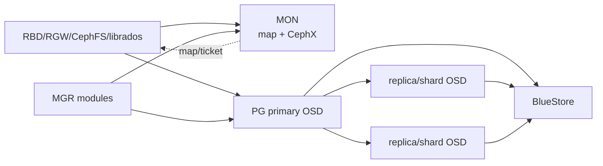
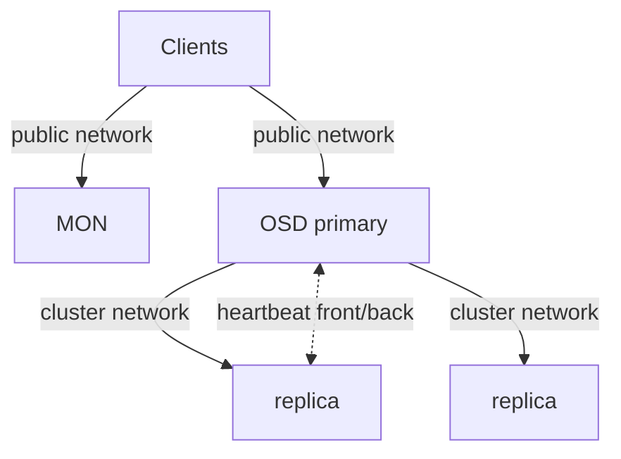
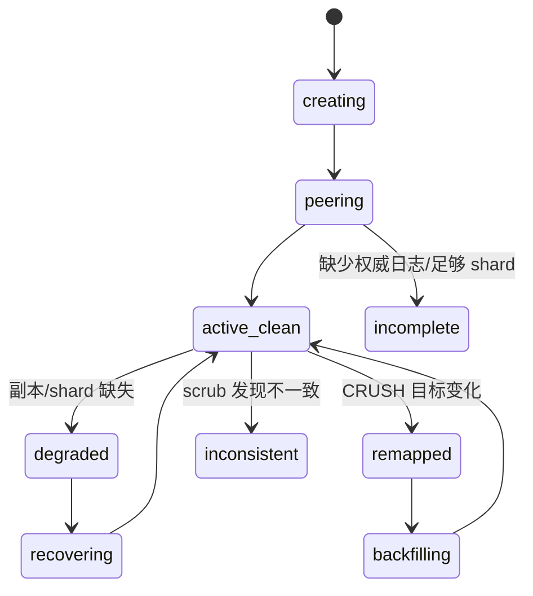
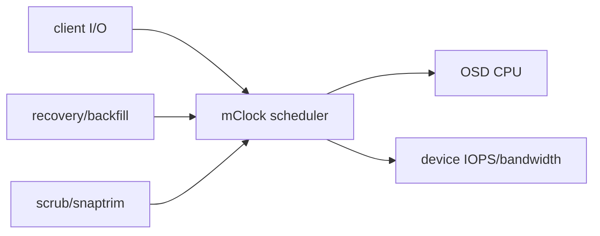
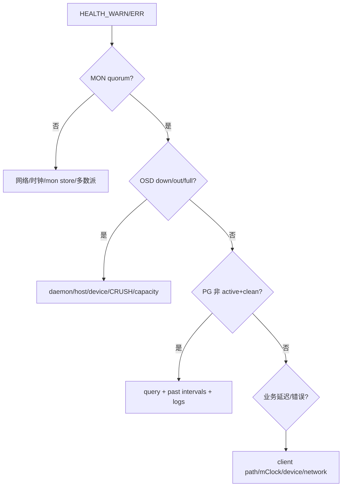
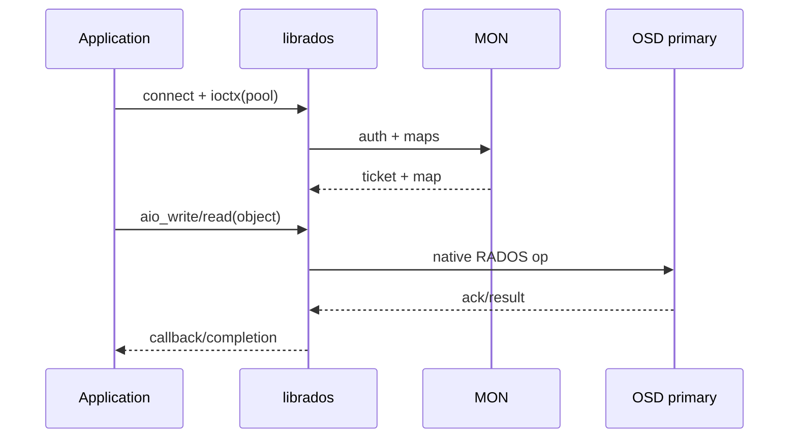
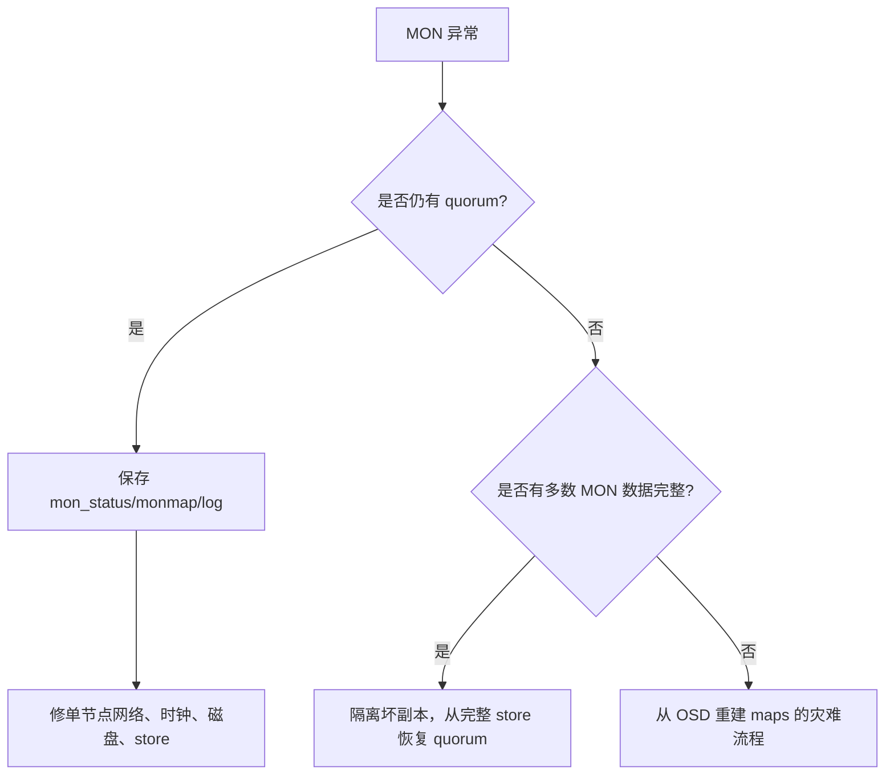
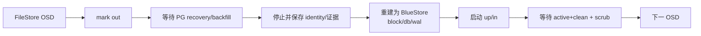

# RADOS 存储集群全解（Tentacle）

> RADOS 是所有 Ceph 接口的共同数据平面。配置解析、pool/PG/CRUSH 放置、OSD/MON 一致性和设备故障恢复共同决定客户 I/O 是否可用、持久且可预测。

## 1. RADOS 运行边界

最小 RADOS 有 MON、MGR 和 OSD。MON 保存地图与认证；MGR 汇总状态并承载管理模块；OSD 保存对象并完成复制/EC。官方所称“最小系统至少一个 MON 和两个 OSD”只能展示复制，不具备 MON 高可用，也不等于生产安全。



## 2. 配置系统：先判断值从哪一层来

Ceph daemon 的最终配置可能来自编译默认值、MON config database、`ceph.conf`、环境和命令行。集群化配置应写入 MON config DB，并按 section/mask 作用到 global、daemon type、具体 daemon、host、class 等范围；本地文件主要用于 bootstrap、MON discovery 和少量启动前参数。

```bash
ceph config dump
ceph config get osd.3 <option>
ceph config set osd <option> <value>
ceph config show osd.3
ceph config assimilate-conf -i ceph.conf
```

`config get` 是数据库值，`config show` 才接近 daemon 当前有效值。部分选项支持运行时更新，部分必须 restart；修改前查 option schema、type、default、min/max、runtime flag。不要因本地 `ceph.conf` 没有一项就断言它使用默认值。

### 2.1 网络和 Messenger v2

Public network 承载客户端、MON 和服务访问；cluster network 只承载 OSD replication、heartbeat、recovery/backfill。分网可隔离恢复流量，但需要双网容量、路由、防火墙和故障切换；不分网时必须保证共享网络在故障恢复期间仍满足客户端 SLO。

Messenger v2 通常监听 3300，v1 MON 端口常为 6789；OSD/MGR/MDS 使用动态范围。`msgr2` 支持 crc 和 secure mode，secure 提供在途加密与完整性；CephX 负责身份/caps，两者职责不同。



MTU、bond、VLAN、DNS、时钟和 firewall 必须端到端一致。只 ping MON 不能证明 OSD 动态端口、反向连接和 cluster network 可用。

### 2.2 CephX 与用户能力

`auth_cluster_required`、`auth_service_required`、`auth_client_required` 正常应为 `cephx`。Entity 形式为 `client.<id>`、`osd.<id>`、`mgr.<id>`、`mds.<id>`；keyring 保存 secret，caps 按 mon/osd/mgr/mds 服务解释。

```bash
ceph auth get-or-create client.app \
  mon 'profile rbd' \
  osd 'profile rbd pool=app'
ceph auth caps client.app mon 'profile rbd' osd 'profile rbd-read-only pool=app'
ceph auth get client.app
ceph auth del client.app
```

修改 caps 会改变后续 ticket 权限；已建立会话可能到 ticket 刷新才体现。删除 entity 前先撤离客户端，轮换 key 时要协调所有 keyring，不能只改 MON 侧。

## 3. BlueStore 与设备布局

BlueStore 直接管理 raw block，主 `block` 保存对象数据；RocksDB 保存 metadata/omap，WAL 记录事务。`block.db` 可放高速设备，RocksDB 数据超出 DB 设备后 spill 回主 block；`block.wal` 只有在比 DB 更快且工作负载受 WAL 限制时才有价值。

| 布局 | 适用 | 风险 |
|---|---|---|
| data-only | 全 SSD/NVMe 或简单 HDD | HDD metadata latency 较高 |
| HDD data + NVMe DB | 大量 HDD、metadata/小对象 workload | NVMe 故障可能同时影响多个 OSD；DB 容量不足会 spill |
| data + DB + WAL | 有三种明确性能层且压测证明收益 | 设备映射、替换和故障域最复杂 |

BlueStore checksum 能发现 silent corruption；compression 可按 pool/OSD mode、algorithm、min blob size 和 required ratio 控制。压缩节省的是写入后空间，可能增加 CPU 和 write amplification；先按真实数据压测。

FileStore、journal 和 BlueStore migration 页面用于旧集群迁移。Tentacle 新部署不应以 FileStore 为默认；迁移逐 OSD 完成，始终保持足够副本和恢复空间。

## 4. Pool：保护、放置和应用语义的边界

```bash
ceph osd pool create <pool> [pg_num] [replicated|erasure] [profile]
ceph osd pool application enable <pool> rbd|cephfs|rgw
ceph osd pool get <pool> all
ceph osd pool set <pool> size 3
ceph osd pool set <pool> min_size 2
ceph osd pool set-quota <pool> max_bytes <bytes>
```

| 参数 | 含义 | 错误理解 |
|---|---|---|
| `size` | replicated pool 期望副本数 | 不是故障后仍允许写的副本数 |
| `min_size` | 允许 I/O 的最小完整副本/分片条件 | 设为 1 会扩大不可恢复写窗口 |
| `pg_num/pgp_num` | PG 数和放置计算数 | 越大并非总是越快；增加 MON/OSD 内存和 peering 成本 |
| `crush_rule` | 使用哪一设备集合和故障域 | 不自动验证容量足够或 rack 真独立 |
| application | 声明 RBD/CephFS/RGW 用途 | 不是权限，也不创建上层服务 |
| quota | pool 对象数/字节逻辑限制 | 不替代集群 nearfull/full 保护 |

PG autoscaler 根据 pool 使用、target ratio/size、bulk flag、CRUSH subtree 和 bias 建议或调整 PG。`on` 自动改，`warn` 只告警，`off` 不参与。多个重叠 CRUSH root 或不准确 target 会使建议失真。

删除 pool 需要开启删除保护开关并重复 pool 名确认，是数据破坏动作。先核对 application、RBD image、CephFS/RGW 绑定、snapshot 和业务读取，再删除。

## 5. PG：对象规模与 OSD 数之间的中间层

对象 hash 到 PG，PG 再由 CRUSH 映射到 acting set。PG 是 peering、日志、scrub、recovery 和统计单位；它既减少逐对象地图规模，也限制故障/恢复的并行粒度。



常见 PG 状态可以组合：

| 状态 | 真实含义 | 首要证据 |
|---|---|---|
| `active+clean` | 可服务且满足保护策略 | PG/OSD map、无 degraded object |
| `undersized` | acting set 小于 pool size | down/out OSD、CRUSH 可选设备 |
| `degraded` | 对象副本/shard 不完整 | degraded objects、recovery queue |
| `remapped` | acting set 与 CRUSH up set 不同 | `ceph pg map`、OSD map epoch |
| `backfill_wait/toofull` | 等待迁移或目标太满 | backfillfull ratio、OSD df |
| `stale` | MON 长时间未收到 primary 报告 | primary/acting OSD 连通性 |
| `incomplete` | 无法构建足够权威历史 | PG query、past intervals、丢失 OSD |
| `inconsistent` | scrub 发现副本内容/元数据不一致 | `rados list-inconsistent-*` |

```bash
ceph pg stat
ceph pg dump pgs_brief
ceph pg <pgid> query
ceph pg map <pgid>
ceph health detail
```

Peering 卡住时不要首先执行 `pg force_create`、`mark_unfound_lost` 或 repair。先保存 query、OSD logs、map epochs、past intervals 和可能离线盘；错误地声明 lost 会永久丢弃唯一对象版本。

## 6. CRUSH：把策略转成真实故障隔离

CRUSH hierarchy 由 device 和 bucket（host/rack/row/root 等）组成，rule 选择 root/device class、决定副本数和 failure domain。三副本只有在 rule 选择 `host` 且有至少三台合格 host 时才提供主机级冗余。

```bash
ceph osd tree
ceph osd crush tree --show-shadow
ceph osd crush rule dump
ceph osd getcrushmap -o crush.bin
crushtool -d crush.bin -o crush.txt
crushtool -i crush.bin --test --show-mappings --rule <id>
```

修改流程：导出二进制 → 反编译 → 离线 test 映射和分布 → 保存旧 map → 应用 → 观察 misplaced、backfill 和容量。`ceph osd crush move` 改 bucket 位置；`reweight` 改 CRUSH weight；`ceph osd reweight` 是 OSD map 临时 override，两者语义不同。

Device class（hdd/ssd/nvme）形成 shadow hierarchy；改 class 或 rule 会重映射数据。先确认每个 class 的独立容量足以在故障后满足 size/K+M。

## 7. 复制池与纠删码池

复制池写入由 primary 向 secondary 发送 subops；空间原始开销近似 `size × stored`。EC profile 定义 `k`、`m`、plugin、technique、failure-domain、device-class 等；原始开销近似 `(K+M)/K`，但小写需要 read-modify-write 或 overwrite optimization，CPU/网络/恢复复杂度更高。

官方插件包括 Jerasure、ISA、LRC、SHEC、CLAY：

| 插件 | 重点 |
|---|---|
| jerasure | 通用 Reed-Solomon，参数丰富 |
| isa | Intel ISA-L 优化，常用于 x86 性能路径 |
| lrc | 局部恢复码，降低部分恢复跨域流量 |
| shec | 面向多盘并行恢复的编码选择 |
| clay | 降低修复带宽，需要正确配置 scalar/vector 参数 |

EC profile 在 pool 创建后不能原地安全替换为不同布局；新建 pool、迁移数据、验证后切换。EC pool 对 omap 和部分写语义有约束，上层 RBD/CephFS 常使用 replicated metadata pool + EC data pool。

## 8. Balancer、upmap、read balancer 和 stretch mode

Balancer MGR module根据 PG/容量分布生成优化 plan；`upmap` 用 PG 映射例外改善均衡而不改 CRUSH hierarchy，要求客户端兼容相应 minimum release。执行 plan 前查看评分、受影响 PG 和迁移量，恢复期间避免频繁重复优化。

Read balancer 可调整 replicated pool 的 primary 分布，改善读负载；它不改变副本集合和容量。`read`/`upmap-read` 等模式与客户端版本、pool 类型有关。

Stretch mode 将 MON 与数据副本跨两个站点，并用第三 tiebreaker MON 处理网络分区。它不是普通三副本跨机房：需要特定 CRUSH rule、站点 bucket、MON 选举和恢复约束。网络分区时只允许满足站点策略的一侧继续，容量设计必须承受整个站点故障。

Cache tiering 从 Reef 起 deprecated；不要把 cache pool 当作新架构默认加速。停用 writeback cache 前必须 flush 和 evict 完成，不能直接删 overlay/pool。

## 9. mClock、recovery 与 scrub 的资源竞争

mClock 对 client、recovery、best-effort 等操作队列分配 reservation、weight、limit。内置 profile 适合 balanced、high_client_ops、high_recovery_ops 等目标；启用 profile 后部分低级参数由 profile 控制。



调高 recovery 并不创造磁盘性能，只会把延迟转移给客户 I/O；过度压低会延长 degraded window。应同时观察 client latency、degraded objects、recovery bytes、OSD queue、network 和 device utilization。

Scrub 比较对象 metadata/size；deep-scrub 读取数据并校验 checksum。`noscrub/nodeep-scrub` flag 只用于受控窗口，结束后清除并确认 backlog。Inconsistent PG repair 可能选择错误副本，先用 inconsistent object 输出、checksum、版本和应用副本证明权威数据。

## 10. 容量和健康阈值

OSD 有 nearfull、backfillfull、full；full 会阻止写，backfillfull 会阻止向目标回填。集群“总空闲很多”不能抵消某个 CRUSH leaf 满：对象只能落到 rule 允许的设备。

```bash
ceph df detail
ceph osd df tree
ceph osd pool stats
ceph osd perf
ceph tell osd.* bench
```

容量计划必须使用 raw、stored、replication/EC overhead、BlueStore metadata、snapshot/clone、recovery headroom 和最大 failure domain 后容量。不要把 `MAX AVAIL` 跨 pool 相加，它们可能共享同一 OSD 空间。

## 11. MON/OSD 变更的安全顺序

新增 MON：准备地址/数据目录 → 加入 monmap → 启动 → 等待 quorum；移除 MON：确认剩余多数派 → 从 monmap 移除 → 停服务。一次变更多数 MON 会丢 quorum。

新增 OSD：设备审计 → prepare/activate → `up/in` → 观察 backfill。正常移除：`out`/orchestrated drain → 等待无 PG 依赖 → purge auth/CRUSH/OSD map → 擦盘。故障盘是否 `out` 要考虑预计恢复时间和不必要 backfill；`noout` 只能短时维护使用。

MON election strategy 和 connectivity mode 可调整 leader/连接行为，但不是修复网络抖动的替代品。变更前后保存 `quorum_status`、mon dump、health 和 latency。

## 12. 故障树：先分类再修复



MON 排障关注 quorum、clock skew、disk full/slow、store corruption、网络地址和 election；OSD 关注 systemd/container、BlueStore label、device errors、heartbeat、slow ops、memory、DB spill 和 assert/crash；PG 关注 primary、acting/up set、blocked-by、unfound、inconsistent 和 recovery constraints。

日志级别和 subsystem debug 可以动态提高，但高 debug 会显著增加 I/O/容量；收集 first failure 后恢复默认。CPU profiling、heap/memory profiling 只在可控窗口进行，profile 本身会改变性能。

## 13. `librados` 与 Object Class API

客户端流程为 `rados_create` → 读取配置/连接 cluster → `ioctx_create(pool)` → sync/AIO object operations → 释放 ioctx/cluster。C、C++、Python binding 都提供 pool、对象、xattr、omap、snapshot、lock、watch/notify 和 compound operation。



异步 API 必须正确管理 completion 生命周期、超时、重试和 shutdown；超时不证明服务端未提交，写操作需要应用幂等。Object Class 在 OSD 内执行受控方法，可原子组合对象操作；错误或高开销 class 会直接影响 OSD，不能像普通客户端插件对待。

`libcephsqlite` 把 SQLite VFS 映射到 RADOS，适用于其明确一致性模型；不是任意数据库的透明分布式化方案。

## 14. 生产验收闭环

RADOS 交付不能止于 `ceph -s`。至少证明：MON quorum 故障切换；OSD/host 故障后 PG 恢复；replicated/EC 真实读写；CRUSH failure domain；nearfull 告警；scrub/deep-scrub；key caps 正反例；网络和 mClock 下的业务延迟；OSD replacement；配置重启后持久；最终回到 `active+clean` 且无 unmanaged residue。

## 15. 配置解析、mask、metavariable 与 MON 发现

配置来源按优先级覆盖，较高层覆盖较低层：编译默认 -> MON config DB -> 本地文件 -> environment -> command line/runtime override。`ceph.conf` 的 `[global]`、`[mon]`、`[osd]`、`[osd.3]` 由宽到窄；MON config DB 还可使用 location/device-class 等 mask。重复写同一 option 时，最终值取决于 entity specificity、mask 和来源，不取决于文件视觉位置。

Option 名中的空格与下划线通常等价，但自动化应使用 schema canonical name。值支持布尔、整数、IEC size、时间和列表；字符串中的 `#`/`;`、引号与续行要按 Ceph parser 处理。常用 metavariable 如 `$cluster`、`$name`、`$type`、`$id`、`$host`、`$pid` 用于路径模板，daemon 展开时上下文不同，不能在 shell 里预展开。

```bash
ceph config help <option>
ceph config dump
ceph config ls
ceph config show-with-defaults osd.3
ceph config set osd/class:ssd <option> <value>
ceph config set osd/host:storage-01 <option> <value>
ceph config rm osd <option>
ceph tell osd.3 config set <option> <value>   # runtime 临时 override
```

Runtime override 只活到进程重启；MON DB 是期望持久配置。`ceph config assimilate-conf` 把可集中管理的文件项导入 DB，不代表可以立刻删除所有本地 bootstrap 信息。MON 自身在连接 config DB 前仍需 fsid、mon_host/monmap、keyring 和 data dir。

客户端可通过 `mon_host` 地址列表、monmap 或 DNS SRV 发现 MON。DNS 记录使用 `_ceph-mon._tcp` 与 cluster/domain 规则，返回 target/port/priority/weight；它只能帮助初始发现，不能替代 MON map 和 CephX。TTL、split DNS、IPv4/IPv6、SRV target 可解析性与证书/host naming 都要验证。

`mon_host` 的 msgr2 地址形如 `v2:host:3300/0`，v1 为 `v1:host:6789/0`，双协议可放在 bracket vector。迁移 v1-only 到 v2+v1 的顺序是：确认所有 daemon/client 支持 v2 -> `ceph mon enable-msgr2` -> 更新 MON 地址与 firewall -> 更新 bootstrap config -> 验证连接 mode，不能先封 6789 再期待旧客户端自动升级。

Messenger v2 connection mode 可按 cluster/service/client 指定 `crc` 或 `secure`，compression mode 也可按通信域配置。Secure 加密链路，CephX 认证身份；若关闭 CephX，secure mode 不能替代授权。压缩节省网络但消耗 CPU，敏感明文还需考虑压缩侧信道，因此必须按流量类型和合规选择。

## 16. BlueStore/BlueFS：容量、缓存、校验与硬件加速

BlueStore transaction 先把 metadata/WAL 交给 BlueFS/RocksDB，再安排 block data，最终以一致 transaction 可见。`block.db` 保存 RocksDB/BlueFS，`block.wal` 只存 WAL；若只提供更快 DB，WAL 通常也在 DB 上。DB 空间不足时 RocksDB files spill 到 slow block，不丢数据但 latency 可显著恶化并触发 `BLUEFS_SPILLOVER`。

DB sizing 取决于对象数、omap、RGW bucket index、RBD metadata 和 compression，不只取 data 百分比。设备 provision 前给同一高速盘上的多个 OSD 留出故障/compaction headroom；共享 DB 设备故障会同时打掉多个 OSD，应在 CRUSH 和恢复带宽中计入相关故障。

BlueStore cache 可自动按 `osd_memory_target` 在 metadata、KV 和 data cache 间分配；target 是软目标，RocksDB、线程栈和内存碎片会让 RSS 更高。手工 cache ratio 只在有 profile 证据时调整。容器 memory limit 必须高于 daemon 真实峰值，否则 kernel OOM 会绕过 Ceph 的自调节。

Checksum 类型与 block 粒度决定 silent corruption 检出成本。Inline compression 由 mode `none/passive/aggressive/force`、algorithm、min/max blob size 和 required ratio 控制：`passive` 只压提示可压数据，`aggressive` 更主动，`force` 不因 ratio 放弃。已经存储的数据不会因改配置自动重写。

RocksDB sharding 改善 column family/compaction 隔离，但 schema 转换要使用官方 reshard 工具并停对应 OSD。Minimum allocation size 在 OSD 格式化时决定小写空间放大，后改 config 不会重排既有介质；HDD/SSD workload 应在部署前选择。SPDK、DSA 等硬件路径需要支持的 device/CPU/kernel/build，启用前进行掉电、reset、checksum 和 fallback 测试，不能只测峰值吞吐。

```bash
ceph daemon osd.<id> bluestore bluefs device info
ceph daemon osd.<id> bluestore allocator score block
ceph daemon osd.<id> perf dump
ceph tell osd.<id> bench
```

## 17. Pool snapshot、namespace、应用标签和 PG autoscaler

Pool 名允许受限字符且在集群内唯一。Rename 只改 pool name，不改 pool id；依赖名称的客户端配置、caps 和上层 metadata 仍需同步。Pool-level snapshot 只适用于支持的原生 RADOS用法，不等价于 RBD/CephFS/RGW 应用一致快照；上层有自己的 snapshot graph 时应使用上层 API。

RADOS namespace 在同一 pool 内隔离 object name，可写入 CephX cap `namespace=`；它不隔离 PG、容量、scrub 或性能。Application tag 及 metadata 告知工具 pool 被谁使用，可携带 key/value；没有 tag 会报 `POOL_APP_NOT_ENABLED`，但 tag 本身不授权。

PG autoscaler 为每个 CRUSH subtree 计算 PG budget：估算 pool target bytes/ratio、actual usage、replication/EC rate、bias 和 `bulk`，再给出 `NEW PG_NUM`。重叠 CRUSH roots 会共享同一 OSD 集合，预算不能分别满配。`target_size_bytes` 与 `target_size_ratio` 同时设置会告警；所有 ratio 总和/bytes 超过可用容量会 overcommit。

```bash
ceph osd pool autoscale-status
ceph osd pool set <pool> pg_autoscale_mode on
ceph osd pool set <pool> bulk true
ceph osd pool set <pool> target_size_ratio 0.4
ceph osd pool set <pool> pg_num_min 128
ceph osd pool set <pool> pg_num_max 1024
```

`bulk` 表示预期 pool 会很大，使初始分配更积极；不是 I/O priority。预设 `pg_num` 可避免导入大量数据后连续 split，但过多 PG 会占用每 OSD 内存、peering CPU 和网络。PG 数现在不强制为 2 的幂，但非 2 次幂可能分布略不均并触发 warning，需结合 autoscaler 与实际偏差决定。

PG split/merge 是在线元数据与对象归属变化。调整后看 `creating/splitting/remapped`、client latency 和 recovery，不要在 OSD 故障恢复中连续改变 PG、CRUSH 和 pool size 三个因果层。

## 18. CRUSH map 深解：bucket algorithm、tunables 与 weight set

CRUSH rule 的典型步骤是 `take root/class -> chooseleaf firstn/indep N type host/rack -> emit`。Replicated rule 常用 `firstn`，EC 按 shard position 与 failure domain 选择。MSR rule 支持更复杂的多步 retry/故障域约束，但要求相应客户端/OSD release。

Bucket 有 uniform、list、tree、straw、straw2 等 algorithm；现代一般用 straw2，设备 weight 通常按 TiB 相对容量。Bucket id 为负，device id 非负；手工编辑时重复 id/name 或断开 hierarchy 会让 map 拒绝或产生 homeless PG。

Device class 由 OSD metadata 自动识别，也可显式 set/rm。Class rule 背后使用 shadow tree；不要把 shadow bucket 当普通 bucket 手改。Legacy 单独 SSD root 迁移到 class rule 前，用 `crushtool --compare`/mapping test 证明新旧选择是否等价，再逐 pool 切 rule。

| 权重机制 | 范围 | 典型用途 |
|---|---|---|
| CRUSH device weight | 长期拓扑容量 | 设备容量/长期排除，改变 map |
| OSD reweight 0..1 | OSDMap 临时 override | 临时抑制单 OSD，归一后应回 1 |
| compat weight set | 兼容旧客户端的替代权重 | balancer compat mode |
| per-pool weight set | pool 独立放置优化 | 不影响其他 pool |
| primary affinity/upmap-primary | replicated primary 选择 | 调整读/primary 工作量，不改副本容量 |

CRUSH tunables 从 argonaut、bobtail、firefly、hammer 到 jewel 改善 retry 和数据分布。提高 profile 可能让旧客户端无法正确计算放置；先盘点最老 kernel/librados，再设 `ceph osd crush tunables <profile>`。`OLD_CRUSH_TUNABLES`/`STRAW_CALC_VERSION` 是兼容与分布风险提示，不应在未知 client 情况下直接消警。

Custom location hook 会在 OSD 启动时生成 CRUSH location；输出不稳定会让 daemon 重启后漂移。Cephadm 环境优先由 inventory/host location 管理，避免 hook 与 orchestrator 同时拥有拓扑。

## 19. 纠删码插件、overwrite 和恢复带宽

EC profile 创建后成为 pool 不可变编码契约。常用字段：`plugin`、`technique`、`k`、`m`、`crush-failure-domain`、`crush-root`、`crush-device-class`；插件还可能有 packet size、alignment、locality 和 subchunk 参数。

| 插件 | 编码/恢复特点 | 选择依据 |
|---|---|---|
| Jerasure | 多种 Reed-Solomon/Cauchy technique，通用 | 跨架构通用与历史兼容 |
| ISA | ISA-L Reed-Solomon，x86/ARM 优化取决于 build | CPU 编解码吞吐 |
| LRC | 增加 local parity，单故障可在 host/rack 局部恢复 | 用额外空间换跨域恢复流量 |
| SHEC | 多 parity 组合优化多个同时丢失的恢复效率 | durability、space、recovery 三者权衡 |
| CLAY | 将 shard 切 subchunks，最小化修复读取/网络 | 大对象/跨机架修复带宽，配置更复杂 |

```bash
ceph osd erasure-code-profile set ec-4-2 \
  plugin=isa technique=reed_sol_van k=4 m=2 \
  crush-failure-domain=host crush-device-class=hdd
ceph osd pool create data 256 erasure ec-4-2
ceph osd pool set data allow_ec_overwrites true
```

`allow_ec_overwrites` 允许 RBD/CephFS 等随机更新，但要求 BlueStore，并带来 read-modify-write 与 checksum/metadata开销。Tentacle 的 EC optimizations 能改善小 I/O/空间行为，但需要所有相关 daemon 支持且启用后存在兼容约束；升级/回滚前检查 feature。

EC recovery 要拿到任意 `k` 个正确 shard。CRUSH 必须能为 `k+m` 找到足够 failure domains；OSD 数够但 host/rack 不够仍会 PG inactive。LRC/CLAY 的低恢复流量依赖 locality layout 真的映射到物理域，profile 参数与 CRUSH step 不一致会失去收益。

空间效率 `(k+m)/k` 只是理想 data overhead，还要加 BlueStore allocation、omap/metadata、小对象 padding、PG log 与 recovery headroom。比较 replicated/EC 时必须按真实 object size 和 failure scenario 测量。

## 20. mClock profile、容量基准与 recovery 控制

mClock 三类队列是 client、background recovery、background best-effort。Reservation 保证最低份额，weight 分配剩余能力，limit 设上限；三者作用顺序不同。内置 profile 的典型目标为：

| profile | client reservation/weight | recovery reservation/weight | best-effort reservation/limit |
|---|---|---|---|
| `balanced`（默认） | 50% / 1 | 50% / 1 | 5% / 90% |
| `high_client_ops` | 60% / 2 | 40% / 1 | 5% / 70% |
| `high_recovery_ops` | 30% / 1 | 70% / 2 | 5% / 90% |

值表达相对服务目标，最终还受介质真实 IOPS/带宽和 operation cost 影响。Built-in profile 会锁定部分 low-level sleep/recovery 参数；直接 set 可能被拒绝或无效。需要手调时切 custom profile，记录全组参数，不能混合一半 built-in、一半 legacy throttle。

MClock 依赖 OSD capacity determination。自动 bench 值若来自虚拟盘 cache、空盘瞬时峰值或并发测试干扰，会让 scheduler 高估能力。用 `ceph tell osd.N bench` 在受控窗口多次测量，必要时按 OSD 或全局 override max IOPS。Benchmark 本身会产生负载，禁止在 degraded 高峰全盘同时执行。

`osd_max_backfills`、`osd_recovery_max_active_hdd/ssd` 控制并发，不等于吞吐上限。调整过程一次改一个层：先选 profile，再看 client p95/p99、recovery ETA、device util/queue、network；若 slow ops 增加则回收。HDD mClock shard/thread 默认组合与旧 scheduler 不同，升级后要重新验证 CPU 并行和顺序介质队列。

## 21. 设备 inventory、SMART 预测与自动迁移

Device tracking 将 OSD logical id、BlueStore device、Linux path、serial/WWN 和 host 关联。`/dev/sdX` 会变，物理更换必须用 serial/WWN/LED 定位：

```bash
ceph device ls
ceph device info <devid>
ceph device ls-by-daemon osd.<id>
ceph device light on <devid> ident
ceph device light off <devid> ident
ceph device scrape-health-metrics <devid>
```

启用 device monitoring 后，定期 scrape SMART/NVMe health；预测结果产生 `DEVICE_HEALTH`。`DEVICE_HEALTH_IN_USE` 表示预测失败设备仍承载数据，`DEVICE_HEALTH_TOOMANY` 表示同时预计失败数量超过可自动迁移能力/mon 阈值。预测不是确定故障时间，仍需结合 media errors、stalled reads、温度、wear 和厂商诊断。

Self-heal/automatic migration 可在预期寿命阈值内自动 mark out；若集群容量不足，会把风险从“可能坏盘”变成“确定 full/backfill blocked”。启用前演练 spare capacity、replacement SLA 和告警接收。点亮 LED 后由现场人员复核序列号，不能依赖机架槽位文档直接拔盘。

## 22. Health code 按因果域解读

Health code 是稳定诊断入口，summary 只是当前实例。先 `ceph health detail --format json-pretty` 保存 code/detail，再按域定位：

| MON/认证 code | 含义与首要动作 |
|---|---|
| `DAEMON_OLD_VERSION` | 升级窗口外仍有旧 daemon；列 `ceph versions` 和 orch/process 状态 |
| `MON_DOWN` / `MON_NETSPLIT` | MON 不在 quorum 或 quorum 分裂；查 mon_status、连接矩阵、时钟 |
| `MON_CLOCK_SKEW` | monitor clock 差超过阈值；修 NTP/PTP 根因，不放大阈值遮蔽 |
| `MON_MSGR2_NOT_ENABLED` | MON 尚未发布 v2；完成兼容盘点后启用 |
| `MON_DISK_LOW` / `MON_DISK_CRIT` / `MON_DISK_BIG` | mon store 空间低/临界或异常大；先保留 quorum，清理/compact/扩容 |
| `AUTH_INSECURE_GLOBAL_ID_RECLAIM*` | 旧客户端不安全 reclaim 或兼容开关仍允许；升级 client 后关闭兼容 |
| `AUTH_INSECURE_KEYS_CREATABLE` / `AUTH_INSECURE_KEYS_ALLOWED` | 仍能创建/存在旧不安全 key 类型；轮换后禁止 |
| `AUTH_INSECURE_SERVICE_TICKETS` / `AUTH_INSECURE_SERVICE_KEY_TYPE` / `AUTH_INSECURE_ROTATING_SERVICE_KEY_TYPE` / `AUTH_INSECURE_CLIENT_KEY_TYPE` / `AUTH_EMERGENCY_CIPHERS_SET` | service/client/rotating key、ticket 或 cipher 降级；按 entity 轮换并撤销应急设置 |
| `AUTH_BAD_CAPS` | caps 无法解析或不合法；修 entity caps，不能忽略授权失效 |

| MGR code | 含义与首要动作 |
|---|---|
| `MGR_DOWN` | 没有 active MGR；恢复 daemon、MON assignment 和至少一个 standby |
| `MGR_MODULE_DEPENDENCY` | enabled module 缺 Python/外部依赖；安装匹配依赖或在确认功能影响后 disable |
| `MGR_MODULE_ERROR` | module 初始化或运行异常；查 active MGR log、module config 和 traceback |

| OSD/BlueStore code | 含义与首要动作 |
|---|---|
| `OSD_DOWN` / `OSD_ORPHAN` / `OSD_UNREACHABLE` | daemon down、map 中无 CRUSH 归属或网络不可达；查 host/device/map |
| `OSD_FULL` / `OSD_BACKFILLFULL` / `OSD_NEARFULL` / `POOL_FULL` | 阈值触发；按 CRUSH leaf 扩容/迁移/清理，谨慎调 ratio |
| `OSDMAP_FLAGS` / `OSD_FLAGS` | noout/norecover/noscrub 等全局或单 OSD flag；确认维护 owner/到期 |
| `OSD_OUT_OF_ORDER_FULL` | nearfull/backfillfull/full 阈值顺序错误；恢复单调顺序 |
| `OLD_CRUSH_TUNABLES` / `OLD_CRUSH_STRAW_CALC_VERSION` / `OSD_NO_SORTBITWISE` / `OSD_FILESTORE` | 旧放置/排序/backend 兼容状态；按最老 client 与迁移计划处理 |
| `CACHE_POOL_NO_HIT_SET` | cache pool 未配置 hit set，tiering agent 无法判断热度；补配置或按退场流程移除 tier |
| `BLUEFS_SPILLOVER` / `BLUEFS_AVAILABLE_SPACE` / `BLUEFS_LOW_SPACE` | DB/WAL 空间和 slow spill；评估 expand/migrate DB 与 compaction |
| `BLUESTORE_FRAGMENTATION` | allocator free space 碎片化；先量化 score 与业务影响 |
| `BLUESTORE_LEGACY_STATFS` / `BLUESTORE_NO_PER_POOL_OMAP` / `BLUESTORE_NO_PER_PG_OMAP` | 旧 metadata 格式；按官方 repair/upgrade procedure 转换 |
| `BLUESTORE_DISK_SIZE_MISMATCH` / `BLUESTORE_NO_COMPRESSION` / `BLUESTORE_SPURIOUS_READ_ERRORS` | 设备容量、压缩支持或读异常；保留硬件/label 证据再修 |
| `BLOCK_DEVICE_STALLED_READ_ALERT` / `WAL_DEVICE_STALLED_READ_ALERT` / `DB_DEVICE_STALLED_READ_ALERT` / `BLUESTORE_SLOW_OP_ALERT` | 对应设备读卡顿/BlueStore op 慢；定位物理盘与共享故障面 |

| Device health code | 含义与首要动作 |
|---|---|
| `DEVICE_HEALTH` | 设备预测寿命低于阈值；核对 SMART、介质错误、定位信息和替换窗口 |
| `DEVICE_HEALTH_IN_USE` | 预测故障设备仍有 PG/OSD 数据；确认自动/人工迁移为何未完成 |
| `DEVICE_HEALTH_TOOMANY` | 同时预测故障设备过多，自动 out 会威胁可用性/容量；人工排序并扩容 |

| 数据/PG code | 含义与首要动作 |
|---|---|
| `PG_AVAILABILITY` | 某些 PG 不能服务；看状态、blocked_by、acting/up 与 past intervals |
| `PG_DEGRADED` | 可服务但保护不足；控制恢复窗口并找缺失 OSD |
| `PG_RECOVERY_FULL` / `PG_BACKFILL_FULL` | 恢复目标达容量阈值；释放正确 failure domain 容量 |
| `PG_DAMAGED`, `OSD_SCRUB_ERRORS`, `OSD_TOO_MANY_REPAIRS` | scrub/repair 发现损坏；保存 inconsistent object 与介质证据 |
| `LARGE_OMAP_OBJECTS` | 单对象 omap 过大；定位 RGW/RBD/应用 object 并按上层修 |
| `CACHE_POOL_NEAR_FULL` | cache target 达阈值；停止继续脏化，flush/evict 并检查 backing pool |
| `TOO_FEW_PGS` / `TOO_MANY_PGS` / `POOL_TOO_FEW_PGS` / `POOL_TOO_MANY_PGS` / `MANY_OBJECTS_PER_PG` | PG 预算或对象分布异常；用 autoscaler/CRUSH root 分析 |
| `SMALLER_PGP_NUM` | `pgp_num < pg_num`；完成放置迁移，避免长期半配置 |
| `POOL_TARGET_SIZE_BYTES_OVERCOMMITTED` | pool target bytes 总和超可用容量；修正容量承诺或扩容 |
| `POOL_HAS_TARGET_SIZE_BYTES_AND_RATIO` | 同一 pool 同时配置 bytes 与 ratio；保留一种容量目标 |
| `TOO_FEW_OSDS` | OSD 数少于配置的最小期望；恢复/扩容，不能只降低告警阈值 |
| `POOL_APP_NOT_ENABLED` | pool 未声明 application；确认真实 owner 后启用正确 app tag |
| `POOL_NEAR_FULL` | pool quota/容量接近阈值；区分逻辑 quota 与底层 OSD nearfull |
| `OBJECT_MISPLACED` / `OBJECT_UNFOUND` | 正在迁移或所有已知副本找不到；unfound 先寻找旧 OSD，勿急于 lost |
| `SLOW_OPS` / `PG_NOT_SCRUBBED` / `PG_NOT_DEEP_SCRUBBED` / `PG_SLOW_SNAP_TRIMMING` | 排队/介质/网络或维护 backlog；分别看 op dump、scrub queue、snaptrim |

Stretch code 包括 `INCORRECT_NUM_BUCKETS_STRETCH_MODE`、`STRETCH_MODE_BUCKET_WEIGHT_IMBALANCE`、`NONEXISTENT_MON_CRUSH_LOC_STRETCH_MODE`；分别修站点 bucket 数、权重和 MON location。NVMe-oF code 包括 `NVMEOF_SINGLE_GATEWAY`、`NVMEOF_GATEWAY_DOWN`、`NVMEOF_GATEWAY_DELETING`，需要补 gateway 冗余或完成/取消删除。`RECENT_CRASH`/`RECENT_MGR_MODULE_CRASH` 要查看并归档 crash 后仍修根因；`TELEMETRY_CHANGED` 要重新审查外发内容；`OSD_NO_DOWN_OUT_INTERVAL` 表示自动 out interval 被禁；`DASHBOARD_DEBUG` 表示生产管理面仍开 debug。

Mute health 必须带明确 duration/sticky 选择和工单 owner。Mute 不改变故障，只改变展示；结束后 `ceph health mute ls`/unmute 并验证 code 真消失。

## 23. MON、OSD 与 PG 的证据化排障

MON 的 `mon_status` 给出 state、rank、quorum、election epoch、monmap。单 MON down 而 quorum 存在时，先查其进程、地址、store、时钟；不要在健康成员上重建 quorum。Broken monmap 可从健康 MON 注入；store corruption 优先从健康 MON sync/rebuild，只有所有 MON 丢失才从 OSD 重建有限 maps，且不能恢复所有历史配置。



OSD 不启动先看 unit/container exit、BlueStore label、block/db/wal symlink、权限与 keyring；不要先 zap。OSD slow/unresponsive 分层看 heartbeat network、device latency/error、BlueFS/RocksDB、CPU steal、RAM/OOM、co-resident process、recovery/mClock 和 kernel issue。`dump_historic_ops`/`dump_ops_in_flight` 显示 op 卡在哪个阶段，slow request 是症状而非一定是磁盘。

计划停 OSD 又不想自动迁移可短时 `noout`，但多盘维护前计算 size/min_size 与 failure domain。Flapping OSD 常见 heartbeat 丢包、MTU/bond、过载导致心跳线程饿死或进程 crash；反复 mark in 只会制造 backfill 抖动。

PG 永不 clean 的诊断顺序：OSD 数是否满足 size/k+m -> CRUSH rule 是否能选够 failure domain -> acting OSD 是否 up/in -> peering blocked_by/past intervals -> recovery/full constraints -> inconsistent/unfound。One-node test cluster若 size=3 本就无法 clean；生产不能用 size=1 消警。

Unfound object 先 `ceph pg <pgid> list_unfound` 和 query，找 lost OSD/旧盘。`mark_unfound_lost revert` 尝试回到旧版本，`delete` 永久删对象，两者都由上层数据语义决定。Inconsistent PG repair 对 replicated pool 通常以权威 shard 修其他副本，EC 的 shard 重建更复杂；先读 `rados list-inconsistent-obj/pg` 的 version、digest、size 和 errors。

## 24. Cache tiering、balancer 与 stretch 的退出路径

Cache tiering 只在明确 workload 有益：热点相对稳定、对象较大、访问可被 hit set 捕获。随机冷扫描、RGW workload 和频繁 overwrite/omap 常是坏场景。配置涉及 backing/cache pool、tier link、overlay、mode、target dirty/full ratio、target bytes/ratio、min flush/evict age 与 hit set。

Read-only cache 退出：移除 overlay -> remove tier。Writeback 退出必须先切 `forward`/只读适当模式，等待 dirty objects flush 为 0，再 evict 全部 cache object，移除 overlay/tier，最后才删 cache pool。Unfound dirty cache object 可能是唯一新版本，不能直接删 pool。由于该功能已 deprecated，新设计不采用它。

Balancer 自动模式受 `begin/end time`、sleep、max misplaced ratio 等 throttle 限制。Supervised mode 是 eval -> optimize -> show plan -> execute；plan 基于某个 epoch，集群拓扑变化后应重新算。Upmap exception 过多会增加 map；移除 balancer 前决定是否保留 mappings。Read balancer online/offline 修改 primary affinity或 `pg-upmap-primary`，旧 kernel client 不支持相关映射时会拒绝，先检查 minimum compatible client。

Stretch mode 的核心不是“三地写三份”，而是两个数据 site + 第三 tiebreaker MON、connectivity election、stretch peering CRUSH rule 和 pool size/min_size 约束。进入前所有 bucket/location/weight 满足规则；单独 stretch pool 也要显式 set。退出或 force recovery/normal 会改变分区存活策略，是灾难控制动作。

Tiebreaker MON 失败可替换，但它不保存业务副本。使用 `--set-crush-location` 管理 MON location，不能只写一个与 monitor 实际认为不一致的 CRUSH 条目。Stretch 对双 site 同时故障、非对称网络和容量不平衡有明确限制，必须做网络分区演练。

## 25. 用户、caps、keyring 与密钥轮换

CephX user 是 entity + key + caps。OSD caps 可限制 pool、namespace、object prefix、class method、application tag 和读写命令；MON/MGR/MDS 各有自己的语法。Profile 是官方维护的 caps 模板，不代表所有业务都应共享一个 entity。

```bash
ceph auth ls
ceph auth get client.app
ceph auth add client.app mon 'allow r' osd 'allow rw pool=app namespace=tenant-a'
ceph auth caps client.app mon 'allow r' osd 'allow r pool=app'
ceph auth get client.app -o /etc/ceph/ceph.client.app.keyring
ceph auth import -i keyring
```

Keyring 文件可容纳多个 entity，并能 `ceph-authtool --create-keyring/--gen-key/--import-keyring` 管理；文件 mode 默认按 secret 处理。打印 key 会泄露长期凭据，标准日志只记录 entity/fingerprint。

Key rotation 先生成/登记新 key，分发所有 client/daemon，再使其重新认证，确认没有旧会话，最后撤销旧 key。Ceph daemon 的 rotating service keys/ticket TTL 与 client key 不是一件事。大规模轮换分批，并保留能恢复控制面的独立 admin credential。

禁止 CephX 或开启 emergency cipher/insecure key 只允许用于有时限的恢复，而且网络隔离不能修复授权缺失。恢复后列出现存不安全 keys、逐个轮换、关闭 compatibility flag，并用负向权限测试验收。

## 26. Librados 语言绑定、compound op 与 SQLite VFS

C/C++、Python、Java、PHP 的共同生命周期是创建 cluster handle -> 读取配置/显式 set -> connect -> 创建 pool ioctx -> object ops -> 关闭 ioctx -> shutdown。Pool name 只在创建 ioctx 时解析为 id；rename 后既有 ioctx 仍指向同一 pool id。

```python
import rados

with rados.Rados(conffile='/etc/ceph/ceph.conf', name='client.app') as cluster:
    with cluster.open_ioctx('app') as ioctx:
        ioctx.set_namespace('tenant-a')
        ioctx.write_full('object-1', b'payload')
        value = ioctx.read('object-1')
```

Object op 可把 compare、read/write、xattr/omap、assert version 等组合到 primary 原子执行；原子范围是单 object，不跨 object/pool。AIO completion 分 complete 与 safe/durable 语义（具体 API 版本按 binding）；callback 中不能释放仍被库使用的 buffer/handle。超时后查 version/idempotency，不能盲目重放 append 或非幂等 class method。

Object listing 是分片迭代视图，遍历期间并发增删可能不形成单时点 snapshot。RADOS lock/lease 需要 owner/cookie/duration 与故障 fencing；watch/notify 的断线、重新 watch 和 notify ack 都由应用处理。

Object Class 在 OSD primary 内执行已安装的 C++ method，能与 object mutation 原子组合。SDK 提供 cls API、输入/输出 bufferlist 和注册宏；所有 OSD 必须安装同版本 class。Method 必须限制 CPU、内存和循环，验证 untrusted input，返回明确 errno；崩溃/阻塞会直接伤害 OSD service thread。

Ceph SQLite VFS 把 SQLite page 放入 RADOS，推荐合适 page size/cache、persistent journal/WAL 和 exclusive lock mode。它允许受支持方式的并行访问但仍服从 SQLite locking，不是横向分片数据库。Break lock 可能让两个 writer 损坏数据库；只有确认旧 owner 永久消失才执行。Export/extract 用官方工具得到普通 SQLite 文件，temporary tables 留在本地。适合小型 control metadata，不适合高写入大数据库。

## 27. 日志、Admin Socket 与 profiling 的控制

Ceph debug 值通常是 `log_level/memory_level`。Memory level 把详细记录留在内存环形 buffer，触发 dump 时才落盘；log level 持续写文件/journal。动态命令适合复现窗口：

```bash
ceph tell osd.3 config set debug_osd 20/20
ceph daemon osd.3 dump_historic_ops
ceph tell osd.3 config set debug_osd 1/5
```

Subsystem 要针对因果层选择，如 `ms`、`mon/paxos`、`osd/optracker`、`bluestore/bluefs/rocksdb`、`crush`、`auth`，全局高 debug 会制造磁盘 full 和新的 slow ops。Boot 前故障才写持久 config，恢复后删除 override。Logrotate 加速不能删尚未收集的 first-failure 文件。

Admin socket 是本机 daemon 私有诊断接口，可查看 perf dump/schema、config、ops、messenger connections、heap 等；权限等同管理面，不暴露到非受信容器。Messenger status 可证明实际 peer 地址、协议与连接状态，比 netstat 单一监听更接近 Ceph 会话。

CPU profiling（如 oprofile/perf）、tcmalloc heap profile、Massif/Valgrind 都有观测开销。执行前记录 baseline 和持续时间，只对单 daemon/副本做；内存 release 命令可能只把 allocator free page 还给 OS，不修复 live-object leak。Profile 结果要与同一时间的 client latency、queue 和设备指标关联。

## 28. Legacy FileStore、journal 与迁往 BlueStore

FileStore 通过宿主文件系统（历史上常用 XFS）保存对象文件，用 filesystem xattr 存对象 metadata，并用独立 journal 保证写入顺序与恢复。它的双重写入、page cache、filesystem journal 与 Ceph journal 叠加，性能和故障分析比 BlueStore 更复杂；Tentacle 新 OSD 选择 BlueStore。

FileStore 旧配置域包括：xattr inline/chain、sync interval、flusher、op queue、commit timeout、B-tree filesystem 行为、journal size/alignment/direct I/O/AIO 和各类 timeout。参数互相依赖且只为旧 OSD 解释，不能把旧调优值复制到 BlueStore。Journal 必须比 data filesystem 延迟低且可靠；journal 丢失/损坏可能让尚未提交的 transaction 无法恢复。

迁移没有“原地切 backend”的无风险开关。优先路径是 mark-out replacement：逐个 OSD out -> 等数据恢复到其他 OSD -> destroy/purge 或保留 id -> 擦盘 -> 以 BlueStore 重建 -> in -> 等 `active+clean`，始终维持副本与恢复余量。Whole-host replacement 同时移除一主机全部 OSD，只适用于其余故障域容量与网络能承受。



Per-OSD device copy/migration 工具仅在官方支持的版本和停机条件使用，复制期间 source 不得继续写；完成后核对 fsid/osd id、BlueStore label、auth、CRUSH location 与 object count。混合 FileStore/BlueStore 集群可作为迁移中间态，但性能、full ratio 和 recovery 行为按较弱路径规划。

每批迁移前后做业务读写、PG scrub、OSD restart、容量和 latency 验证。拒绝一次迁完整机架、在 degraded 状态继续下一批，或因进程 `up` 就擦除唯一旧盘。迁移完成后再清理 FileStore journal/device 和旧 config，保留可审计的 OSD 对照表。

## 29. 官方基线与许可

来源：Ceph Tentacle 官方 `doc/rados/`，核验提交 `76fba24cef67d9219f97eeaa68cd1a848da3f2b2`。Ceph authors and contributors，CC BY-SA 3.0。
