# CephFS 文件系统全解（Tentacle）

> CephFS 在 RADOS 上提供 POSIX 文件系统。理解它不能只记住“有 MDS”：必须区分元数据路径和文件数据路径，理解 MDS rank、journal、distributed metadata cache、client capabilities、subtree partition、snapshot/subvolume、配额与灾难恢复如何共同维持一致性。

## 1. 数据与元数据彻底分路

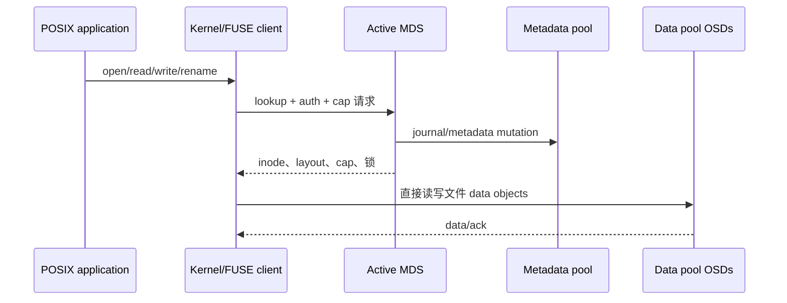

目录、inode、owner/mode、dentry、snapshot 和 MDS journal 存在 metadata pool；文件内容按 layout 条带到一个或多个 data pool。MDS 不代理正常文件数据，因此数据吞吐可随 OSD 扩展；MDS 负责命名空间一致性和客户端缓存协调。

MDS 本地磁盘不是权威元数据源。状态和 journal 位于 RADOS，所以 standby 可在 active 故障后 replay；这也意味着 metadata pool 不可用会阻断整个 FS，即使 data pool 完好。

## 2. 创建 FS 时实际创建了什么

```bash
ceph fs volume create cephfs --placement='label:mds'
ceph fs ls
ceph fs status cephfs
ceph osd pool application get <metadata-pool>
```

Volume interface 创建 metadata/data pools、FS map 和 MDS service。手工创建时必须：创建 replicated metadata pool；创建 replicated 或 EC data pool；为 pool 启用 `cephfs` application；执行 `ceph fs new <fs> <metadata> <data>`；部署 MDS。

Metadata pool 需要低延迟、可靠复制，不适合 EC。Data pool 可追加多个，并通过 file/directory layout 选择。Pacific 起新集群自动开启多 FS；已有集群若尚未开启，须先检查并设置 `enable_multiple`。每个 FS 有独立 pools/MDS ranks 和 client caps，但仍共享底层 MON/OSD 故障域；不同 FS 不能共用池，池隔离不等于物理故障域隔离。

删除 `fs volume` 可能删除 pools 和全部数据，必须明确使用确认参数；删除 MDS service 不等于安全删除 FS。

## 3. MDS rank、状态和故障接管

`max_mds=N` 表示 N 个 active ranks，把命名空间分片；standby 数量另行部署。standby-replay 跟随指定 active journal，接管更快但不能同时服务其他 rank。

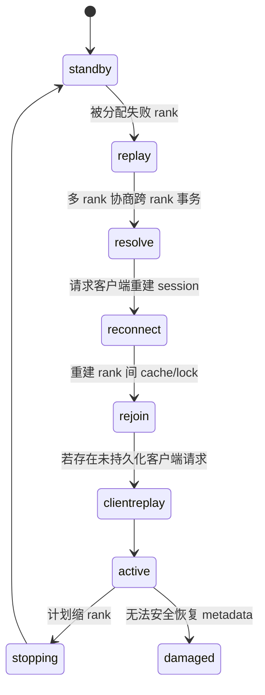

`up:active` 才正常服务 rank。`laggy` 是 beacon 超时；MON 可把 rank 分配给 standby。接管依次处理 journal replay、跨 MDS 操作、client reconnect/rejoin 和 request replay，恢复时间受 journal 长度、cache、客户端数与 metadata pool 延迟影响。

多个 active MDS 可通过显式/ephemeral pin 分担子树；动态 balancer 启用后还能根据负载导出/迁移目录子树，热点大目录还可 dirfrag。Tentacle 官方多 MDS 文档指出动态 balancer 默认关闭，不能把增加 rank 理解成自动把热点搬走。增加 rank 只改善可分割的 metadata workload，不会提高单个串行目录锁或底层 data pool 性能。

## 4. Distributed metadata cache 与 capabilities

MDS 和客户端共同缓存 inode/dentry。MDS 给客户端 capability，授权其缓存读、写、buffer、metadata 等状态；冲突操作到来时 MDS recall cap，客户端 flush/release 后操作才能继续。这是 CephFS 保持 POSIX cache coherence 的核心。

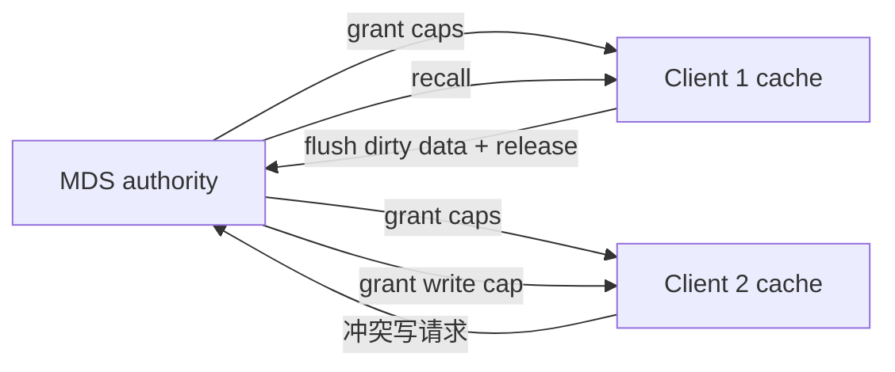

客户端失联却持有 caps 会阻塞其他客户端，MDS session timeout 后可 evict；手工 eviction 会使该客户端 I/O 出错并重新挂载，应用必须能处理。Blocklist 防止旧 client incarnation 继续写。

MDS cache 由 `mds_cache_memory_limit` 等控制。超过目标会 recall caps 和 trim；客户端不响应、metadata mutation 高峰或底层 pool 慢可导致 cache pressure/slow request。盲目加大 cache 会增加 failover replay/rejoin 时间。

## 5. Journal 与元数据持久化

每个 active rank 有独立的 RADOS journal，跨对象的元数据变更先按可重放顺序记录事件，再将变更批量写入长期 metadata objects；这是多对象 crash consistency 和顺序写性能的基础。日志不只有 inode 更新：session/open 文件、子树导入导出、dirfrag 分裂/合并、分布式事务和 table 状态也在其中，接管时才能重建 client session 与子树权威。`EVENT_SEGMENT` 可界定轻量 segment，而 replay 必须从包含 subtree map 的 major segment 开始；一段事件全部写回后才可过期并推进 expire position，过期段也可能暂留以改善 cache 热身。`mds_log_events_per_segment` 控制段目标事件数，`mds_log_minor_segments_per_major_segment` 控制 major 边界间隔，`mds_log_max_segments` 是目标而非硬上限。trim 落后会增加 replay 工作；跨 rank rename 等分布式 mutation 还需在 resolve 阶段处理未完成事务。排查时可先观察段数及 journal read/write/expire positions，不得把 trim 落后直接判成日志损坏。

`cephfs-journal-tool`、`cephfs-data-scan` 等专家工具可检查/恢复 journal 与 metadata，但可能改变权威状态；只有在保存 pools、FS map、MDS logs 且普通恢复失败后使用。`cephfs-journal-tool` 默认拒绝对 active FS 工作，不能为省事绕过这一保护。

## 6. 客户端、挂载与认证

客户端先具备 MON 地址、`ceph.conf`、keyring 和可用内核/FUSE。推荐 v2 device syntax：

```bash
mount -t ceph client.app@<fsid>.cephfs=/ /mnt/cephfs \
  -o mon_addr=<mon1>:3300/<mon2>:3300,secretfile=/etc/ceph/app.secret

ceph-fuse --id app --client_fs cephfs /mnt/cephfs
```

Kernel client 利用内核 page cache，通常性能和系统集成更好；ceph-fuse 随 Ceph 用户态版本发布，升级灵活、隔离更清晰，但有用户态切换成本。Windows 使用 ceph-dokan，feature/语义与 Linux client 需单独核验。

最小授权示例：

```bash
ceph fs authorize cephfs client.app /projects/app rw
```

生成 caps 通常包含 MON 读 FS map、MDS 指定路径权限和 OSD 指定 data pool/tag 权限。`root_squash`、snapshot、quota/layout 修改、network 限制和多 FS 都有独立 capability。`root_squash` 禁止 uid/gid 为 0 的写入但允许读取；旧客户端不理解 `client_mds_auth_caps` 时可能丢失更新，启用前逐一盘点实际客户端版本和 `MDS_CLIENTS_BROKEN_ROOTSQUASH`，验证兼容后再决定是否用 `required_client_features` 强制该位（会驱逐不支持的客户端）。`ceph fs authorize` 不会自动削减已有 caps，收紧权限须核对 `ceph auth get` 后显式修改授权并重新测试。路径 cap 只限制 MDS 管理的目录树，**不自动限制持有同一 OSD data pool 授权的客户端绕过 CephFS 直接访问 RADOS 数据对象**；不可信租户必须在 layout 中使用独立 RADOS namespace 并以 OSD namespace caps 隔离，同时挂载对应路径，验证两条越权路径都失败。

## 7. File layout 和条带

Layout 定义 pool、stripe_unit、stripe_count、object_size，可设置在文件或目录并由新文件继承。已有文件写入后不能直接改变 layout；目录 layout 变化只影响之后创建的文件。

| 参数 | 作用 |
|---|---|
| `pool` / `pool_namespace` | 文件 data objects 放入哪个 pool/namespace |
| `stripe_unit` | 连续数据切片大小 |
| `stripe_count` | 同一 object set 的并行对象数 |
| `object_size` | 单对象最大布局尺寸，必须兼容 stripe unit |

Layout xattr 变更需要相应 caps。EC data pool 需确认 overwrite 能力/上层支持；metadata 始终放 replicated pool。

## 8. Volume、subvolume 和 group

Volume API 把 FS、subvolume group、subvolume、snapshot、clone 和 trash/purge queue 组织为稳定管理对象。Subvolume 提供独立路径、quota、namespace 和访问授权，适合 CSI/NFS 等租户集成；它不是独立 FS，也不天然拥有独立 failure domain。

```bash
ceph fs subvolumegroup create cephfs team-a
ceph fs subvolume create cephfs app --group_name team-a --size <bytes>
ceph fs subvolume getpath cephfs app --group_name team-a
ceph fs subvolume snapshot create cephfs app snap1 --group_name team-a
ceph fs subvolume snapshot clone cephfs app snap1 app-clone --group_name team-a
```

删除 subvolume 通常先移入 trash，由 purge queue 异步清理对象；命令返回不等于空间已回收。克隆异步执行，需检查 clone status，失败可 cancel 后清理。

## 9. Quota、snapshot 与 scheduled snapshot

CephFS quota 是目录递归统计，常用 `ceph.quota.max_bytes`、`ceph.quota.max_files` xattr。它依赖客户端正确支持和将 quota root 视作独立 subtree；quota 不限制 RADOS pool 的物理 raw 使用，也不保护 metadata pool full。

目录 snapshot 捕获该目录树时间点视图。大量 snapshots 增加 metadata、old inode 和删除回收压力；schedule module 按路径/频率创建并以 count/time retention 清理。删除快照后空间回收是异步的。

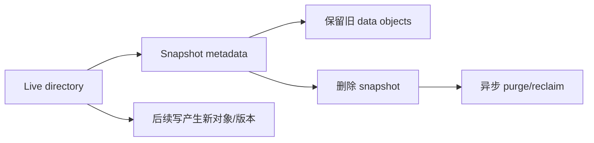

## 10. NFS 导出和应用最佳实践

NFS-Ganesha 将 CephFS 路径转换为 NFS export，适合不能原生挂 CephFS 的客户端。它增加 gateway、NFS state/lock、VIP 和故障切换层；性能与语义不等于原生 CephFS。导出路径必须落在 Ganesha CephX caps 内。

应用应避免单目录数百万热点 entries、频繁全目录扫描、所有 worker 争用同一小文件锁；使用目录分片、批量 metadata 操作和适当 client cache。LazyIO 允许应用主动协调放宽一致性以换性能，只有所有参与者理解 flush/propagate 时使用。

## 11. Snapshot mirroring

Mirror daemon 按 snapshot 增量把指定目录复制到 peer CephFS。配置 peer、remote FS/client、directory、schedule 后观察 daemon status、failed directories、last synced snapshot 和 lag。

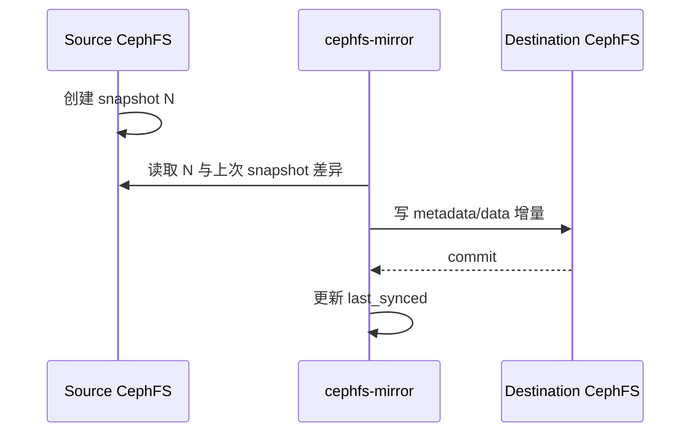

它是异步灾备，RPO 至少包含 snapshot interval + sync lag；目的端不是自动可写 active-active。故障切换前冻结/协调源端写、确认最新 snapshot；回切需重新建立方向，避免双写。

## 12. Full、health、scrub 与灾难恢复

Metadata pool full 会阻断创建、rename、cap flush 等核心操作，优先级高于普通 data pool 容量告警。FS full 排查要分别看 metadata/data pools、MDS cache、snapshot、trash/purge queue 和客户端 dirty caps。

常见健康域：standby 不足、rank damaged/failed、MDS laggy、slow metadata IO、late cap release、client failing to respond、trim behind、read-only、metadata damage。顺序是：

```bash
ceph fs status <fs>
ceph fs dump
ceph mds stat
ceph tell mds.<name> status
ceph health detail
ceph osd pool stats <metadata-pool>
```

CephFS scrub 从 metadata object/dirfrag 校验 linkage 和 inode；发现 damage 后先导出 damage table 和日志，再决定 repair。普通 RADOS PG scrub 与 CephFS metadata scrub解决不同层的问题。

灾难恢复分级：单 MDS 失败由 standby 自动接管；客户端失控使用 eviction；metadata damage 用 scrub/repair；journal/FS map 损坏才使用 expert tools；MON store 全失时需要从 OSD 恢复 maps 后重建 FS 信息。`ceph fs reset`、`mark repaired`、data-scan 不是通用按钮，错误使用会隐藏或扩大 metadata 丢失。

升级前核对 FS feature、MDS release、kernel/FUSE client compatibility、多 active rank、snapshot mirror 和 experimental feature。旧客户端不认识 required feature 时会被拒绝，不能为了兼容而无依据清除 feature flag。

## 13. 运维验收

完整验收包括：kernel/FUSE 挂载；POSIX create/rename/link/lock；路径 caps 正反例；quota；snapshot/clone/purge；active MDS failover 与 client reconnect；多 active 热点分片；metadata/data pool 故障；NFS（若启用）；mirror RPO/切换；metadata scrub；最终无 damaged rank、laggy client 和 purge backlog。

## 14. 客户端选择、挂载协议与兼容边界

CephFS 有三条直接访问路径。它们看到同一命名空间，但升级节奏、故障诊断入口和可用特性不同：

| 客户端 | 数据路径 | 优势 | 主要边界 |
|---|---|---|---|
| Linux kernel client | VFS -> kernel Ceph client -> MDS/OSD | page cache、系统调用开销低、与主机 I/O 栈结合紧 | 能力由运行内核决定；新 MDS feature 不能假定旧内核认识 |
| `ceph-fuse` | VFS -> FUSE -> 用户态 client -> MDS/OSD | 随 Ceph 用户态包升级，调试和新特性验证更灵活 | 多一次用户态切换；进程退出即挂载失效 |
| `libcephfs` | 应用直接调用库 | 应用可直接控制 mount、路径和 I/O | 应用必须自己处理生命周期、错误和线程模型 |

挂载前必须同时满足：客户端能发现 MON；keyring 可读；CephX entity 有目标 FS 和路径的 MDS caps、数据 pool 的 OSD caps；目标目录存在；DNS、时钟和网络可达。现代 kernel helper 的 device string 形如 `client.app@<fsid>.<fs-name>=/path`，其中 `@` 后的点不可省；旧语法仍可显式给 MON 地址。非默认 FS 必须明确 `fs=<name>` 或 `client_fs`，否则多 FS 集群可能挂到错误命名空间。

```bash
# kernel client；secret 放在独立文件，避免出现在进程参数和 shell history
mount -t ceph client.app@.cephfs=/ /mnt/cephfs \
  -o mon_addr=10.0.0.11:6789,secretfile=/etc/ceph/client.app.secret,_netdev

# FUSE client
ceph-fuse --id app --client_fs cephfs /mnt/cephfs

# 卸载
umount /mnt/cephfs                 # kernel
fusermount -u /mnt/cephfs         # FUSE
```

持久挂载在 `/etc/fstab` 或 systemd mount unit 中必须带 `_netdev`，并保证网络和密钥先于 mount unit 就绪。容器中暴露 kernel mount 要控制 mount propagation；把宿主机 `/etc/ceph` 整体注入容器会扩大密钥暴露面。

Windows 使用 Ceph Dokan 客户端把 CephFS 映射为盘符。凭据由 `ceph.conf`/keyring 或参数提供，卸载必须走客户端命令而不是杀进程。Windows 路径、ACL、symlink、大小写和 POSIX uid/gid 语义不能按 Linux 原样推断；生产前应按官方列出的 Dokan 限制验证目标应用。内核客户端的 inline data、quota、多 FS、多 active MDS 和 snapshot 支持也取决于内核版本，升级 MDS 前应先盘点实际 client feature，而不是只检查发行版名称：

```bash
ceph fs feature ls
ceph fs required_client_features <fs-name>
ceph tell mds.<rank> client ls
```

Required client feature 是准入门禁。增加 requirement 会立即拒绝不支持它的客户端；移除 requirement 只能改变准入，不能撤销已经写入的文件系统格式或语义。

## 15. MDS 完整状态机、缓存压力与客户端召回

MDS daemon 名称与 rank 不是同一概念。Daemon 是进程，rank 是某个 FS 的逻辑职责。Standby 被分配 rank 后通常经历 `up:replay -> up:resolve -> up:reconnect -> up:rejoin -> up:clientreplay -> up:active`；不同故障上下文会跳过部分阶段。

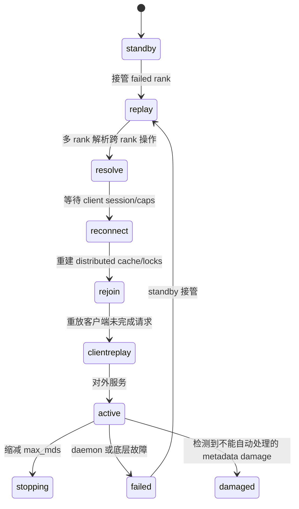

`standby-replay` 可持续跟随指定 active rank 的 journal，缩短接管时间，但占用额外 MDS 和 I/O；普通 standby 可接管任意 rank。`standby_count_wanted` 表达冗余目标，`max_mds` 表达 active rank 数，两者不可混为一谈。减小 `max_mds` 时 rank 进入 stopping，迁回 subtree 并退出；强杀会把计划缩容变成故障恢复。

MDS cache 上限 `mds_cache_memory_limit` 是目标而非硬墙。Metadata 仍被请求、被 journal segment、subtree authority 或 client capability pin 住时，MDS 必须暂时超过上限。默认 health 阈值会在约 150% 上限附近报告 oversized；不能通过持续加内存掩盖不释放 caps 的客户端。

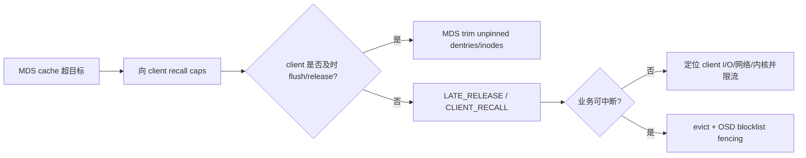

召回还有节流：`mds_max_caps_per_client` 默认约一百万 caps；MDS 每轮召回受 `mds_recall_max_caps` 等窗口控制，并保留 `mds_min_caps_per_client`。大量 `ls -l`、超大 working set 或高延迟客户端会让 recall queue 和 oldest client TID 增长。先看 session/cap 数、recall counter、cache usage 和业务访问模式，再调 throttle；把所有阈值一起放大只会推迟告警。

## 16. 多 active MDS、目录分片和元数据迁移

多 active MDS 只扩展 metadata 吞吐；文件数据始终由客户端直连 OSD。增加 `max_mds` 后，新 rank 必须有可迁移的 subtree 才能分担负载。动态 balancer 根据热度切分 authority；管理员也可用目录 pin 固定 rank，或使用 distributed/random ephemeral pin 将新子目录分散。Pin 是调度策略，不是数据副本。

Directory fragment（dirfrag）把一个巨大目录的 dentry hash 空间拆成多个片段。默认检查周期约 5 秒；size split 默认约 10,000 entries，split bits 默认 3（一次形成 8 个 fragment），hard fragment limit 默认约 100,000，merge threshold 默认约 50。Activity split 可按读写热度触发。除非有可复现实证，不应随意改这些全局参数。

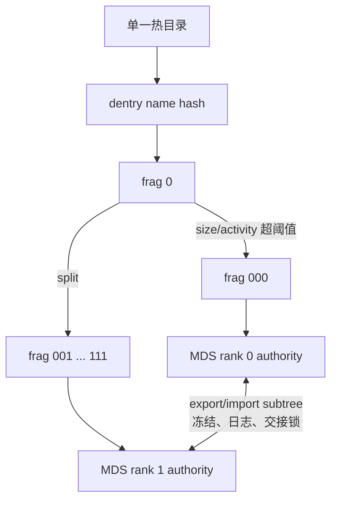

Subtree migration 不是瞬时改标签：exporter 先冻结 subtree，收敛 outstanding ops，把 metadata 状态和锁交给 importer，再更新 authority 并解冻。此时跨 subtree rename、客户端 cap 和 journal 必须保持一致。频繁来回迁移通常说明 workload、pin 或 balancer 参数不合理。

应用设计应避免：反复扫描超大目录；在持续增长文件上高频 `stat`；把所有 hardlink 汇聚到少数 inode；让 working set 长期大于 MDS 可用内存。HPC scratch、home directory 和工作流存储可以共用 CephFS，但元数据访问模式应分别压测。若应用只需要扁平大对象、块设备或 S3 语义，不应为了熟悉 POSIX 而强行选文件系统。

## 17. POSIX 语义、charmap 与 LazyIO

CephFS 以 POSIX 兼容为目标，但分布式故障会暴露本地文件系统少见的边界。单个系统调用通常保持原子元数据语义；涉及客户端缓存、OSD 写和 MDS journal 的组合动作在异常时可能只完成一部分。`fsync()` 会把数据及必要元数据推到持久层并可靠报告已知写回错误；**成功 `fclose()` 不保证数据已经落盘**，full 时 `write()` 已成功也可能直到 `fsync()` 才返回 ENOSPC。应用必须检查 `fsync()` 和关闭时的错误，但不能以成功 close 替代 fsync；跨对象边界的并发写不是原子事务，rename 也不是数据库跨文件事务。

Charmap 在目录级控制名称编码、Unicode normalization 与 case folding：

| 属性 | 含义 | 约束 |
|---|---|---|
| `ceph.dir.encoding` | 编码，当前支持 UTF-8 | charmap 目录项按该编码校验 |
| `ceph.dir.normalization` | Unicode normalization，默认 NFD | 启用 charmap 后不能真正关闭 normalization |
| `ceph.dir.casesensitive` | 是否大小写敏感 | 关闭大小写敏感会同时要求 normalization |
| `ceph.dir.charmap` | 以 JSON 查看/设置完整组合 | 目录必须为空且不能位于 snapshot 内才能移除 |

设置只对目录项生效并在创建子目录时继承，不会批量重写既有树。Case-insensitive 查找可能让仅大小写不同的名字映射到同一项；旧客户端不理解 alternate-name/charmap 时必须通过 required client feature 禁止接入。设置虚拟 xattr 需要 MDS caps 的 `p` 权限。

LazyIO 是显式放宽缓存一致性的实验能力。应用先对文件启用 lazy mode，可以长时间在客户端缓存读写；在一致点执行 `lazyio_propagate` 把本地脏数据传播出去，执行 `lazyio_synchronize` 使本地视图同步。目前操作以整个文件为粒度。它适合由应用自己定义同步阶段的并行任务，不适合依赖普通 POSIX close-to-open 可见性的通用共享目录。

Mantle 允许用 Lua policy 参与 metadata balancer 决策，可从 MDS metrics/RADOS 读取信息并返回策略。官方明确限定它用于 metadata balancer 算法的研究开发，**不得用于生产 CephFS**；即使在 `vstart`/隔离多节点集群完成编译、指标和 failover 验证，也不能据此解除生产禁用边界。

## 18. Layout、quota、snapshot 与删除回收的真实关系

文件 layout 的 `stripe_unit`、`stripe_count`、`object_size`、`pool`、`pool_namespace` 决定 offset 到 RADOS object 的映射。目录 layout 只作为新建后代的继承模板；修改目录不会搬迁旧文件。修改文件 layout 时文件必须为空。`object_size` 不能无视 OSD `osd_max_object_size`（默认 128 MiB），盲目放大对象会让写失败并增大恢复单位。

```bash
getfattr -n ceph.file.layout.json --only-values /mnt/cephfs/file
setfattr -n ceph.dir.layout.pool -v cephfs.archive.data /mnt/cephfs/archive
setfattr -n ceph.dir.layout.pool_namespace -v tenant-a /mnt/cephfs/tenant-a
```

写 layout/quota 需要 caps 的 `p` flag，管理 snapshot 需要 `s` flag。Quota 用 `ceph.quota.max_bytes` 和 `ceph.quota.max_files` 虚拟 xattr 设置在目录树上；客户端根据递归统计近似执行，不是每次写都向中央原子计数。因此并发 writer 可能短暂超额，恶意或不支持 quota 的旧 client 不能作为强租户隔离。Kernel 4.17+ 才支持 quota，且 path-restricted caps 的根应与 quota root 对齐。

CephFS snapshot 通过目录下 `.snap/<name>` 创建，保留该 subtree 的 metadata 和数据视图；删除原目录前必须先删除其 snapshot。恢复通常从 `.snap` 复制到新路径，不能把 snapshot 当作独立异地备份。Snapshot schedule module 维护 schedule、start、retention 与 active 状态；每目录 snapshot 数受 `mds_max_snaps_per_dir`（默认 100）限制，调度器还会限制自己保留的数量，设计 retention 时必须验证实际结果。

删除大 subtree 不是同步逐对象完成。MDS 先把待删 inode 变成 stray，purge queue 后台删 data objects 和 metadata；队列积压会占容量并产生持续 OSD I/O。观察 purge queue counters 后逐步调并发，不能在 recovery/backfill 已饱和时把 purge worker 一次放大数倍。

## 19. Volume、subvolume、clone 和 quiesce

Volume plugin 把 pool、FS、MDS service 和子卷操作包装成一致 CLI。`ceph fs volume create` 会创建 metadata/data pool、文件系统并通过 orchestrator 请求 MDS；禁用 volumes plugin 后，这些高级命令不可用，但已有 CephFS 数据不会消失。

Subvolume group 是策略和命名边界；subvolume 是具有稳定内部路径、quota、mode、uid/gid、charmap、earmark 和可选独立 RADOS namespace 的管理对象。默认 subvolume 在默认 group 下创建，mode `0755`、uid/gid **继承所在 group**、无 size limit；不要把执行 CLI 的操作者误认为默认文件属主。`--namespace-isolated` 提高对象命名隔离，但仍共享 pool 资源与故障域。Earmark 可声明 NFS/SMB 等消费者归属，避免多个服务争用同一子卷。

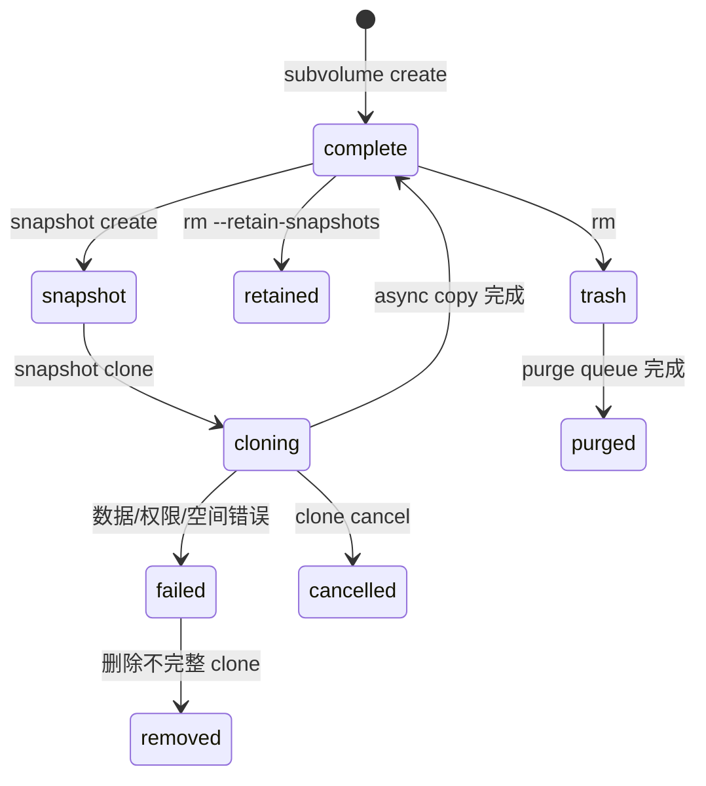

Clone 只复制目录、普通文件和 symlink，不承诺复制 socket、设备等特殊 inode；异步 clone 在 `complete` 前不可访问。失败后需删除不完整目标再重试。默认最大并发 clone worker 为 4，增加它会直接放大 metadata 和 data pool 压力。

授权使用 `ceph fs subvolume authorize`、`deauthorize`、`authorized_list` 和 `evict` 管理 CephX path caps 及挂载会话，不能把不存在的 `auth ls` 当成命令。更改内部路径、删除重建同名子卷或恢复 snapshot 后都要检查已有 auth ID 指向是否仍正确。Custom metadata 只是管理标签，不能当强一致业务数据库；它不会随子卷快照复制到克隆卷。

Quiesce set 用于协调一个或多个 subvolume 暂停变更，支持 await、超时、过期、release 和基于版本的条件更新。它是快照/编排的一致性原语，不等同于让所有应用完成自身事务：正确流程仍是应用 flush -> quiesce await 成功 -> snapshot/外部动作 -> release。`if-version` 用来拒绝覆盖并发修改，超时必须按业务最坏 flush 时间设计。

## 20. 客户端驱逐、blocklist 与故障后重连

MDS 会在 session timeout、reconnect timeout（默认约 45 秒）后自动驱逐客户端；cap revoke 长期无响应的自动驱逐**默认关闭**，只有明确启用 `mds_cap_revoke_eviction_timeout` 才会触发。也可按 client ID 手工 evict。驱逐包含两个层次：MDS 撤销 session/caps，OSD map blocklist 阻止旧 client 用陈旧 caps 继续写。

```bash
ceph tell mds.<rank> client ls
ceph tell mds.<rank> client evict id=<client-id>
ceph osd blocklist ls
```

Blocklist epoch barrier 确保其他 MDS/client 看到足够新的 OSD map 后才继续触碰相关对象。手工提前解除 blocklist 可能让尚未终止的旧客户端恢复写入；只有确认旧进程/网络路径已经被 fence，且理解 session recovery 语义时才可解除。被驱逐的普通客户端通常必须卸载并重新挂载。

MDS failover 的 reconnect 阶段要求客户端重新申报 session 和 caps。支持 session reclaim 的客户端可在允许窗口恢复；不支持或超时的 client 会丢失缓存状态。`recover_session` 等 mount 行为决定故障后是 clean remount、保留 stale fd 还是返回错误，应用应通过真实 kill/failover 测试而不是猜测。

## 21. Scrub、journal 工具与灾难恢复操作边界

诊断顺序从可逆到破坏性：先保留 FSMap、MDS map、damage table、health、journal header 和 pool 状态；再做 metadata scrub；确认损坏对象后才进入 repair。CephFS scrub 能递归检查 inode、dentry、dirfrag 和 stray，`scrub status` 跟踪 tag，damage table 是后续决策依据。

`cephfs-journal-tool` 有四类模式：

| 模式 | 用途 | 风险 |
|---|---|---|
| `journal inspect` | 检查 journal object/range 是否可读 | 只读首选 |
| `journal export/import` | 导出证据或恢复 journal | import 会覆盖目标，必须匹配 rank/FS |
| `header get/set` | 查看或修正 journal header | 错误 offset 会使 replay 丢事件 |
| `event get/splice/erase` | 查看或移除事件 | 只能按专家恢复方案执行 |

Metadata repair 工具还能从 journal 恢复 dentry、截断损坏 journal、reset MDS map、wipe MDS table、data-scan 缺失 metadata object，或临时使用 alternate metadata pool。它们都会选择“保留哪一份历史”，不能在未保存原始证据、未停止写入时尝试。`first-damage.py` 用于定位首次 metadata damage 与可能受影响文件；data pool PG 丢失意味着文件内容损坏，不应伪装成纯 metadata 问题。

MON store 全失后，先从 OSD superblock/object store 重建足以启动集群的 map，再恢复 FSMap、pool identity 和 MDS rank。Pool 名称可重建，pool ID 和对象归属不可随意改变。灾难恢复完成条件不是 MDS 进程变 active，而是 client 能 mount、遍历、读写，scrub 无新增 damage，且 backup/mirror 从新的权威历史继续。

## 22. 观测、调试与开发接口

`cephfs-top` 由 MGR plugin 聚合 client metrics，显示 client、rank、read/write、metadata latency 和 cap 等字段；交互命令可切 FS/client 视图。它适合定位热点，不替代持久 Prometheus 指标。MDS perf counters、client metrics 和 daemon health 必须结合看：吞吐下降而 request latency 上升可能是 MDS 锁/缓存，也可能是 metadata pool slow ops。

```bash
ceph mgr module enable stats
cephfs-top
ceph daemon mds.<name> perf dump
ceph tell mds.<name> dump_ops_in_flight
```

慢请求先分层：RADOS health 是否异常；哪个 MDS rank；请求卡在 lock、journal、cap revoke 还是 object I/O；关联 client 是否仍在线。FUSE 用前台/debug log，kernel client 用 `dmesg`、dynamic debug 和 debugfs；默认关闭内存日志自动 dump 是为了避免生产日志膨胀，临时打开后要恢复。Mount error 5 常指 I/O/认证/FS 状态，error 12 常见于内存或 feature/协议问题，必须以 kernel/MDS 日志的原始 errno 为准。

`libcephfs` Python binding 提供 `conf_read_file/conf_set`、`init`、`mount`、目录/文件、xattr、stat、sync 和 `shutdown` 等调用。Tentacle 官方特别警告：**Java bindings 已不由 CI 测试，可能失效或损坏数据**，不得未经单独验证作为生产接入基线。应用必须保证异常时 unmount/shutdown，不能跨 fork 复用已初始化 handle，并使用返回 errno 区分权限、路径、配额、stale session 和底层 I/O。MDS Journaler、capability/lock 状态和 metrics API 面向 Ceph 开发与诊断，普通业务不应绕过 POSIX/libcephfs 契约直接改 metadata objects。

## 23. 从业务需求到可验收的文件系统

### 23.1 先定故障域、协议与数据语义

| 设计决策 | 必须提前写清的条件 | 不成立时的后果 |
|---|---|---|
| 元数据可用性 | metadata pool 副本及 CRUSH host/rack failure domain，MON quorum，至少一名 active MDS 和不同故障域的 standby；按压测热集给 MDS 分配内存 | data pool 完好也无法完成路径解析、授权、rename 与 MDS journal 持久化 |
| 文件数据 | 默认数据池的保护方式不可在原 FS 内直接替换；额外数据池的 class、pool/namespace 与 EC overwrite 支持分别验证 | layout 指向的池失效时对应文件不可读；只看 metadata pool 的健康会漏报文件损坏 |
| 一致性 | 多客户端是否并发写同一文件，是否使用 mmap、硬链接、锁、fsync，是否有应用级事务/检查点 | 跨 object 的写可能撕裂；`.snap` 不是跨多个应用事务的原子备份 |
| 隔离 | 是否为不可信租户；MDS path cap、MON fsname cap、OSD namespace cap 和对应 layout 均落地 | 只限制路径而复用整个 data pool 授权会暴露原始 RADOS objects |
| 灾备 | 可承诺的 RPO/RTO、快照周期、最后成功同步时间、目标端独立故障域、是否另有离线备份 | 同一集群 snapshot 不等于异地备份，异步镜像不是无损自动故障切换 |

写负载、文件大小和元数据热集必须来自真实应用：用 `ls -l`/`find` 扫描热目录会触发大量 `stat` 和 cap 获取，正在增长的文件可能等待持有写 cap 的客户端刷新大小。目录 fragmentation 不能消除客户端一次列目录和排序的成本。`max_file_size` 默认约 1 TiB，调成 `0` 是禁止非空文件而不是关闭限制；巨型 sparse file 即使没写满也会让 MDS 在删除时扫描庞大的潜在 object 区间。HPC scratch、home、CSI/NFS 共享应分别测 create/unlink/rename、并行目录遍历和冷/热 cache 下延迟。

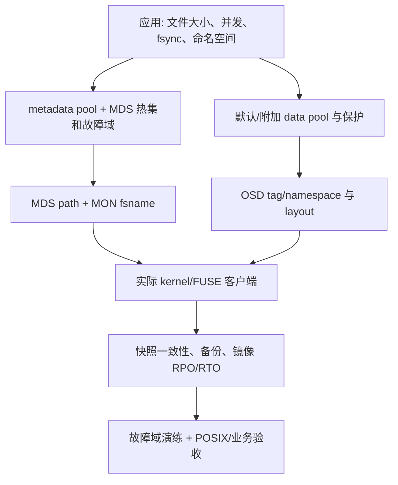

### 23.2 建立文件系统：自动与手工路径的分界

在已有健康 Ceph 集群上，先确认 metadata/data OSD 的容量和故障域、`ceph -s`、`ceph osd pool ls detail`、MDS placement 与 standby 资源；此处使用现有 **Ceph** 管理入口，不会安装或自动创建底层 OSD。使用 cephadm 等支持的 orchestrator 时：

```bash
ceph fs volume create cephfs --placement='label:mds'
ceph fs volume info cephfs
ceph fs status cephfs
ceph orch ps --service_name mds.cephfs --refresh
ceph fs dump
```

`fs volume create` 创建 FS、metadata/data pools，并请求 orchestrator 部署 MDS；是否实际部署成功仍须以 `fs status` 的 active rank 和 `orch ps` 的 daemon 证实。已有池可以用 `--data-pool`、`--meta-pool` 指定，volume 接口的 placement 不接受 YAML placement 文件。`volume info` 的 `pools`、`mon_addrs`、`used_size`、`pending_subvolume_deletions` 对容量、客户端发现和删除回收各有意义，不可只看 volume name。

需要明确池名、device class 或 CRUSH rule 时，走手工分层创建；下面的 pool 名称和保护参数必须先按目标故障域设计，不能把示例照搬到现有生产数据：

```bash
ceph osd pool create cephfs.meta
ceph osd pool create cephfs.data
ceph fs new cephfs cephfs.meta cephfs.data
ceph fs get cephfs
ceph osd pool application get cephfs.meta
ceph osd pool application get cephfs.data
ceph orch apply mds cephfs --placement='label:mds'
ceph fs status cephfs
```

Metadata pool 必须 replicated，因为 CephFS 元数据使用 RADOS OMAP；官方建议至少 3 副本，4 副本也不是过度配置，并优先考虑独立 SSD/NVMe 的低延迟和恢复能力。较大集群的 metadata pool 常用 64/128 PG 作为起点，仍须按 PG autoscaler/OSD 规模实测。默认 data pool 由 `fs new` 固定，不能事后替换；**所有 inode 的 backtrace 至少在默认 data pool 留一份对象**，即使文件内容布局指向附加池也是如此。因此默认数据池最好也用 replicated：EC 默认池的小 backtrace 写、读代价和恢复半径可能非常不划算。附加 data pool 可通过 `ceph fs add_data_pool cephfs <pool>` 加入，再用目录或文件 layout 选用。EC data pool 只适用 BlueStore，使用前按目标 pool 启用 `allow_ec_overwrites`；Tentacle 的 `allow_ec_optimizations` 只在符合业务条件且所有相关 MON/OSD 已兼容时单独批准，启用后不能关闭。给现有池配置错误的 application metadata 可能造成 auth/NFS 失败，要校验其 `cephfs metadata/data` 标签与 FS 名称，不应盲目重贴标签。

Pacific 起新建集群自动开启多 FS；已有集群若未开启，检查 `ceph fs ls` 和当前 flag 后再按需设置。批准新增前评估是否真的需要独立 MDS ranks、FS 身份/状态与 pools；FS 状态仍由共享的 MON FSMap 管理，MON/OSD 的故障风险没有消失。每个 FS 都需要自己的 MDS，若只是负载隔离，先评估单 FS 子树 pin 的成本：

```bash
ceph fs flag set enable_multiple true
ceph fs ls
ceph fs set-default cephfs
```

只有业务明确要求改变未指定 FS 的旧客户端默认挂载目标时才使用 `set-default`；新客户端仍应在 device string 中显式写 FS 名。手工池的 `fs new --fscid`、`--recover`、`--allow-dangerous-metadata-overlay` 属于已证明身份的数据恢复，不是普通建 FS 的捷径。FS、metadata/data pool 名只使用 `[a-zA-Z0-9_-.]`。验收须至少证明 MDS rank 进入 `up:active`、有不同故障域 standby、授权业务客户端写入、`fsync()`、新客户端读回和目录变更。

### 23.3 删除、改名、加池的停止边界

| 操作 | 实际状态变化 | 生产批准前的判定 |
|---|---|---|
| `ceph fs rm <fs> --yes-i-really-mean-it` | 从 FSMap 删除 FS；**不删除** metadata/data pools | 记录 FSCID/FSMap epoch、pool IDs、备份和 MDS/client 停止状态，不能把残留池误删 |
| `ceph fs volume rm <fs> --yes-i-really-mean-it` | 删除 FS、data/metadata pools，尝试移除 MDS | 本质是数据销毁；先导出业务副本、停止镜像/调度、验 pool 是否共享和删除审批 |
| `ceph fs rm_data_pool <fs> <pool>` | 从 FS 的可用 data pool 列表移除该池 | 只要仍有任意 file layout 引用，文件即不可用；默认 data pool 不可移除 |
| `ceph fs rename <old> <new>` | 更新 FS 名及 pool application tag | 旧名字的 CephX IDs 需重新授权；现有客户端可能中断；镜像应先禁用 |
| `ceph fs volume rename <old> <new> --yes-i-really-mean-it` | 还会变更 pool 名、MDS service | 做好客户端和 orchestrator 收敛窗口，逐项验证服务、池、凭据与监控 |

`ceph fs swap` 是灾难恢复时在两个已存在 FS 间原子交换名称的专用操作，不是通用迁移命令。执行前两者均 offline、`refuse_client_sessions` 均已设置、镜像均已停止，核对两个 FSCID 并明确传 `--swap-fscids=yes|no`；任何现有挂载都必须重新挂载，未 flush 的 I/O 可能丢失。交换后分别核对 auth ID、新旧 pool tag、FSMap/编排器视图，再只对被确认可提供服务的 FS 设置 `joinable true` 与 `refuse_client_sessions false`。原损坏 FS 应保留现场供取证，不允许因为“名字恢复了”直接删池。

删除 volume 后若重新用同名卷并操作 subvolume，官方提示可能需要重启 MGR；若 snap_schedule 仍引用旧池，先停用/清理调度并重启模块，持续报错再考虑 MGR 重启。恢复作业要保留旧 pool ID/FSCID 与凭据对应关系，不以池名相同认定对象身份相同。

## 24. 客户端上线与租户隔离的闭环

### 24.1 逐层验权，不以“能 mount”代表安全

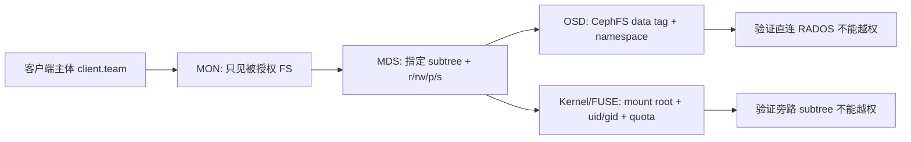

普通客户端的只读或读写路径可以从 `ceph fs authorize <fs> client.<id> <path> r|rw` 开始，检查 `ceph auth get client.<id>` 的 `mon`、`mds`、`osd` 三段，而不是把生成的 keyring 直接给多租户共享。`mds allow r` 与 `allow rw path=` 可组合，但 path 限制只对 MDS 生效；OSD 授权通常是 data pool tag，**不会自动限定到单个主体的路径**。需防御相互不信任的客户端时，给各租户的数据目录指定不同的 `ceph.dir.layout.pool_namespace`，配合严格的 OSD namespace caps 与单独 key；迁移旧文件必须复制到新布局，修改父目录 layout 不能重写原对象。`pool_namespace` 不创建独立 pool 资源或 I/O 限额。

修改 `ceph.*` layout、quota、charmap 必须给 MDS `p`；创建/删除 snapshot 必须给 `s`（与 `p` 同时出现时顺序为 `rwps`）。普通 `rw` 客户端不应拥有这两项。客户端真实安全验收包括：能挂自己 subtree、不能挂其他 subtree、自己路径能写并 fsync、以同一密钥直连 RADOS 不能读取另一 namespace 的对象、无权用户不能修改 quota/snapshot。MON 的 fsname 过滤可隐藏其他 FS，但 `ceph health detail` 等信息仍可能泄漏别的 daemon 状态，不是机密隔离边界。CIDR cap 只约束来源网络，不替代主机身份和最小权限。

### 24.2 客户端分发与持久挂载

从授权管理端生成专用 keyring 和最小 `ceph.conf`，密钥放在权限为 `0600` 的受管路径；生产轮换应先在新 mount 验新密钥，再逐实例迁移旧连接并撤销旧授权，不把明文 key 写进 shell history、fstab 或工单。挂载前核对 MON 可达、kernel feature、MDS active、subtree 路径、OSD data 授权以及 MON/fsid 与期望集群一致。

```bash
ceph fsid
ceph config generate-minimal-conf
ceph fs authorize cephfs client.team /teams/team rw
ceph auth get client.team
ceph fs status cephfs

# 以下在已分发专用凭据的客户端执行；@ 后保留点，路径是 CephFS 内绝对路径
mount -t ceph client.team@.cephfs=/teams/team /mnt/team \
  -o secretfile=/etc/ceph/team.secret,_netdev
ceph-fuse --id team --client_fs cephfs -r /teams/team /mnt/team-fuse
```

内核 mount.ceph helper 可从本机 `ceph.conf` 发现 MON/FSID；无法发现时明确提供 `mon_addr`（多个地址用 `/` 分隔）。旧 `:/ -o fs=cephfs` 语法仅供兼容；在多 FS 集群优先 device string 写明 FS 名和 subtree。FUSE 使用 `--client_fs`，`--client_mds_namespace` 是兼容旧写法。内核客户端由运行内核决定功能，发行版 backport 要按实际 feature 检查；FUSE 可随用户态版本单独升级，但遇到 cache pressure 会通过 remount 清理 kernel 侧缓存，需满足权限要求。另一种客户端出现同样故障时，可把定位范围从 client 缩到 MDS/RADOS/网络，而不能直接替代故障修复。

持久化时使用 `_netdev` 和正确的 network-online/secret 依赖；FUSE 的 fstab type 是 `fuse.ceph`，选项使用 `ceph.id=<id>` 与按需 `ceph.client_mountpoint=<CephFS 路径>`。挂载了 path cap 下的子树，内核 quota 还可能需要其 quota root **父目录**的读取能力；不验证此条件就声称 quota 生效不合格。子目录下 `df` 默认可能显示 quota 余量，`client quota df = false` 可改回全 FS 显示，不改变真正容量/配额。`getfattr -d` 不列出 Ceph 虚拟 xattr，应以 `getfattr -n ceph.quota.max_bytes <dir>` 等准确键验证。

Windows `ceph-dokan` 单独做路径/ACL、盘符、uid/gid、符号链接、大小写与断线重连测试，不将 Linux 合格结论直接移植。`libcephfs` 直连需要进程自己的权限、生命周期和 errno 处理；Java binding 在 Tentacle 官方注明没有 CI 测试，生产必须独立资格验证，不能默认具备生产资格。

### 24.3 会话故障的安全驱逐

自动驱逐可因 `session_autoclose`（默认约 300 秒）、reconnect 阶段超过 `mds_reconnect_timeout`（默认约 45 秒）或启用 `mds_cap_revoke_eviction_timeout` 后的 cap revoke 超时触发；最后一项默认关闭。先用 `ceph tell mds.<fs>:<rank> client ls` 核对 ID、hostname、挂载点、cap 和 I/O，再联系应用负责人确认缓冲写入风险：

```bash
ceph tell mds.cephfs:0 client ls
ceph tell mds.cephfs:0 client evict id=<verified-client-id>
ceph osd blocklist ls
```

驱逐会丢失未 flush 的 buffered I/O。默认的 OSD blocklist 与 epoch barrier 确保新 client/MDS 获取足够新的 OSDMap 后才能碰可能被旧 client 写过的 object；不得把解除 blocklist 作为日常重连方案。新挂载应在旧进程停止或可靠 fence 后进行，并实测业务恢复。关闭 `mds_session_blocklist_on_timeout`/`mds_session_blocklist_on_evict` 会把跨 OSD/MDS 的隔离降级为单 MDS session 删除；多 active MDS 上甚至要逐 rank 驱逐，这属于经过安全审批的高风险例外。

## 25. MDS 的容量、分片、变更和升级

### 25.1 按 rank 与 standby 而非按 daemon 数设计

MDS 是 metadata 单线程关键路径，对高主频与 cache 热集敏感。官方默认目标 cache 约 4 GiB，常规主机至少约 8 GiB RAM；客户端很多时可达到 64 GiB 级，仍须压测大 cache 对 replay、failover 和内存的影响。`mds_cache_memory_limit` 是目标不是硬墙，默认约 5% 的 `mds_cache_reservation` 留给新 metadata 工作，默认 `mds_health_cache_threshold` 约在目标的 150% 告警；不要通过放大 limit 掩盖 cap recall 失败。不同故障域部署 active/standby，`standby_count_wanted` 是冗余目标，设 0 只关闭告警不增加 HA。

```bash
ceph fs status cephfs
ceph fs get cephfs
ceph fs set cephfs standby_count_wanted 1
ceph fs set cephfs allow_standby_replay true
ceph fs dump
```

`allow_standby_replay` 可让一个 standby 跟随一个 rank 的 journal，加快这个 rank 的接管；**跟随者不能再接管其他 rank**。若给某 rank 配 standby-replay，最好每个 active rank 都有匹配容量，另外保留普通 standby；`mds_join_fs` 是倾向匹配某 FS 的策略而非绝对隔离，在缺少合适 standby 时可能退而选用无 affinity 或其他 FS standby。`up:standby_replay` 不处理客户端元数据请求；`down:failed`、`down:damaged`、`down:stopped` 是 rank 的状态，不是某个 daemon 状态。

### 25.2 升缩 rank 时必须先验证分区策略

```bash
ceph fs set cephfs max_mds 2
ceph fs status cephfs
ceph fs set cephfs bal_rank_mask 0x3
ceph fs set cephfs balance_automate true
```

前提是新增 rank 有**额外** MDS daemon 和 standby，metadata pool 健康；若只新增 `max_mds`，没有空闲 daemon 会产生 `MDS_UP_LESS_THAN_MAX`。官方 Tentacle 中动态 balancer 默认关闭；启用前先确定哪些 rank 放自动迁移子树，哪些 rank 留给固定 pin。`bal_rank_mask 0x3` 允许 balancer 在 rank 0/1，`0x0` 禁用该范围，`-1`/`all` 为所有 active ranks。默认不要单靠 balancer 承诺热点目录性能；目录碎片只能让一个目录的 dentry 分布到多个 fragment，根目录本身不能碎片化。

独立租户子树可按不同策略选择：`ceph.dir.pin=<rank>` 固定 export pin（`-1` 取消）；`ceph.dir.pin.distributed=1` 把直属子树散到多个 rank；`ceph.dir.pin.random=<fraction>` 按比例散子目录，默认上限约 `.01`，大量子树会使跨 rank 操作、cache/日志开销扩大。就近父目录的显式 pin 与 ephemeral pin 可以互相覆盖。可在 volume 管理对象上用 `ceph fs subvolumegroup pin <fs> <group> distributed 1`，命中的是其下属子卷，而不是对全部 FS 随机重排。官方 `fs-volumes.rst` 文字还列出 `fs subvolume pin`，但同版本 `src/pybind/mgr/volumes/module.py` **未注册该 CLI**；单独对子卷 pin 应使用目录级 `setfattr -n ceph.dir.pin...` 并核对结果，未实现的文档示例不得进入生产操作。Directory fragment 常见 size split 约 10,000 entries、默认 3 bits 切 8 片，hard limit 约 100,000/片，达到会对新建返回 ENOSPC，绝不是 data pool 容量满的唯一解释。

降低 `max_mds` 时等待多余 rank 经 `up:stopping` 转移子树、flush journal 并成为 standby，再做下一步；强杀 stopping daemon 会引入不必要的 failover。子树迁移过程中 exporter/importer 先 discover/freeze、journal 记录交接与权威变更，然后通知第三方 rank、解冻；多次回摆与 slow request 同现要停止连续调参，先检查权威迁移和应用热点。发生 degraded/damaged 时不按常规流程加减 `max_mds`，官方在不健康时要求显式确认且警告可能进一步失稳。

### 25.3 跨发行版升级的顺序与回退点

对**每个** FS 记录旧 `max_mds`、`allow_standby_replay`、required client features、active/standby 和 FSMap epoch。官方升级要求先关闭 standby-replay，再把每个 FS 缩至单 active rank，等待非零 rank 全部退出；再分批升级 MDS（优先 standby，减少 failover），最后按原值恢复 rank 和 standby-replay：

```bash
ceph fs set cephfs allow_standby_replay false
ceph fs set cephfs max_mds 1
ceph fs status cephfs
# 确认仅 rank 0 active、额外 rank 已停止，再由受管编排流程逐批升级 MDS
ceph fs set cephfs max_mds <recorded-value>
ceph fs set cephfs allow_standby_replay <recorded-value>
ceph fs status cephfs
```

混合版本多 active rank 之间消息/锁协议不保证无缝兼容；不能同时升级全部 MDS。新 required client feature 加入会立即驱逐不支持它的现有客户端；先清点实际挂载的 kernel/FUSE 版本并测试，再使用 `ceph fs required_client_features <fs> add <feature>`。旧客户端不识别新格式时，`rm <feature>` 只是解除准入门槛，不会使已有数据格式回退。历史上 pre-Firefly 的 TMAP metadata 必须先升到 Jewel 并执行 `cephfs-data-scan tmap_upgrade <metadata-pool>`，不能从更早版本直接跨越；这是老集群迁移分支，不适用于 Tentacle 新建 FS。

## 26. 子卷服务、空间策略与快照一致性

### 26.1 管理对象与存储对象不是一回事

Volume 是 FS/pools/MDS 的管理抽象；group 是配额、layout 与 tenant 策略的目录边界；subvolume 是单独管理的子树。Manila/CSI 可以使用 volumes MGR 模块的这些入口，但不意味着一条 subvolume 就有独立的 metadata pool 或 failure domain。先给管理身份 MON `allow r`、MGR `allow rw`，再只向业务身份下发单卷路径授权。

```bash
ceph fs subvolumegroup create cephfs team --size <group-quota-bytes> \
  --pool_layout cephfs.data --uid <uid> --gid <gid> --mode 0750
ceph fs subvolume create cephfs app --group_name team --size <subvol-quota-bytes> \
  --namespace-isolated --earmark nfs
ceph fs subvolumegroup getpath cephfs team
ceph fs subvolume getpath cephfs app --group_name team
ceph fs subvolume info cephfs app --group_name team
ceph fs subvolume authorize cephfs app client.app --group_name=team --access_level=rw
ceph fs subvolume authorized_list cephfs app --group_name=team
```

创建同名 group/subvolume 是幂等成功而非“属性已按本次参数修改”，必须 `info` 校验 quota、pool/namespace、uid/gid、mode、state、features 和 earmark。默认 group 的 group-existence 检查不包括默认 group 下的 subvolume，删卷前分别检查 group 与默认 group 子卷。Group 默认 owner 为 `0:0`，subvolume 默认继承所在 group 的 uid/gid，mode 默认 `0755` 且无 size 限制；不要把默认属性写成“当前调用者 owner”。`--namespace-isolated` 只把对象放入独立 RADOS namespace，还需要与 OSD caps 配套才能形成隔离。Earmark 的 NFS 用 `nfs`，SMB 用 `smb` 或 `smb.cluster.<id>`；修改 earmark 不会自动迁移既有 ACL 和应用授权。

Quota resize 实际修改目录 quota 而非物理池容量。缩小时用 `--no_shrink` 防止低于当前已用，设 `inf`/`infinite` 仅移除 subvolume 层限额，不增加 data pool 可用空间：

```bash
ceph fs subvolume resize cephfs app <new-size-bytes> --group_name team --no_shrink
ceph fs subvolumegroup resize cephfs team <new-group-size-bytes> --no_shrink
ceph fs subvolume info cephfs app --group_name team
ceph df detail
```

Quotas 由合作的客户端近似执行，可短时超额；内核 4.17+ 的 quota 实现仍受集群和发行版 backport 限制。通过 `ceph.quota.max_bytes/max_files` 在目录上设置，`getfattr -n` 单键读取，设 `0` 或删除 xattr 取消。快照保留的旧文件数据**不计入**该 quota，但仍占 RADOS 容量；所以租户 quota 不能替代 metadata/data pool 的 nearfull/full 监控。目录 layout 修改只影响新创建文件；已存在文件的 layout 只能在文件为空时调整。若需把现有数据迁到另一池/namespace，建立新目标并复制、校验，再切客户端，不可仅在原目录 `setfattr` 后声称迁移完成。

### 26.2 子卷删除与 clone 的后台状态

```bash
ceph fs subvolume snapshot create cephfs app before-release --group_name team
ceph fs subvolume snapshot info cephfs app before-release --group_name team
ceph fs subvolume snapshot clone cephfs app before-release app-test \
  --group_name team --target_group_name team
ceph fs clone status cephfs app-test --group_name team
ceph fs subvolume info cephfs app-test --group_name team
```

Clone 是异步全量拷贝而不是写时复制；`clone status` 的 `pending/in-progress/complete/failed/canceled` 与 `failure` 决定能否挂业务。源 snapshot 有待处理 clone 时不能删除；旧版 `snapshot protect/unprotect` 在支持 `snapshot-autoprotect` 的子卷上无实际作用，先读 `subvolume info.features`。失败 clone 要记录错误，再移除不完整目标后重试；只有在确认要取消未完成作业时执行 `ceph fs clone cancel <fs> <clone> --group_name <group>`，随后清理取消目标。默认 `mgr/volumes/max_concurrent_clones` 为 4；`snapshot_clone_no_wait` 默认会在 cloner 无空闲时拒绝新 clone，而不是无限排队。业务恢复窗口不要用尚未 `complete` 的 clone 作恢复源。

`ceph fs subvolume rm` 默认有 snapshot 会失败，`--retain-snapshots` 仅移除活动子卷，保留 snapshot 可作为 clone 来源；状态变 `snapshot-retained`，最后一张 retained snapshot 删除后才移除该对象。默认删除是进入 trash，再异步 purge；`ceph fs volume info <fs>` 的 `pending_subvolume_deletions` 与实际池用量都需要归零/达稳态后才能签署“空间已回收”。`--force` 只允许不存在的目标视作删除成功，不能用作绕过业务校验。若 recovery/backfill 饱和，临时 `ceph config set mgr mgr/volumes/pause_purging true` 与 `pause_cloning true` 抑制后台负载，结束时恢复原值并观察积压；永久 pause 会造成资源无法回收。

Custom metadata `ceph fs subvolume metadata set/get/ls/rm` 与快照 metadata 适合做管理标签，键大小写不敏感并存为小写，字符受可打印 ASCII 约束；它们不随 snapshot/clone 保留，不能当作恢复业务配置的唯一来源。Group snapshot 在主线已不支持新建，老 group snapshot 只能列出/删除；新业务使用 subvolume snapshot。

### 26.3 快照调度是选点策略，不是备份完整性保证

```bash
ceph mgr module enable snap_schedule
ceph fs snap-schedule add /teams/team/app 1h 2026-09-21T00:00:00+08:00 --fs cephfs
ceph fs snap-schedule retention add /teams/team/app 24h4w --fs cephfs
ceph fs snap-schedule status /teams/team/app --fs cephfs --format=json
ceph fs snap-schedule list /teams/team --recursive=true --fs cephfs
```

路径从 CephFS root 起算，不包括宿主机 `/mnt/...` 挂载点；多 FS 时显式传 `--fs`。`start` 为 ISO8601，省略时默认上一个 UTC 午夜、没有时区视为 UTC，显式 `+08:00` 转 UTC 执行；任务若在 13:50 加入每小时 schedule，下一次通常是 14:00 而非从加入时间顺延一小时。间隔支持 `h/d/w/M/y`，保留 `24h4w` 不是“最近 24 小时和 4 周”，而是至少间隔一小时的 24 个点和至少间隔一周的 4 个点；`10n` 才是最新 10 个不论时间间隔。对同一路径可有多个不同起点/周期的 schedule；删除单项时必须匹配 repeat/start，否则 `remove <path>` 会删该路径全部 schedule。

`status.created` 是 schedule 建立时间，不是快照创建时间；看 `created_count`、实际 `.snap` 和最后成功时间。路径在执行时不存在会使 schedule inactive，路径恢复后需手动 `activate`；繁忙 MGR 的 Python timer 会延迟，但后续计划仍基于原时间格。调度器默认最多保留 50 个快照，另受 `mds_max_snaps_per_dir` 默认 100 且需给下一次创建留位置；多个控制器对同目录建快照时必须合并计算上限。删除 volume 后旧调度的 SQLite 状态保存在 metadata pool 的 RADOS object 中可能仍引用已删池，须先停用/清理 schedule，否则需重启 snap_schedule 模块，持续错误再重启 MGR。

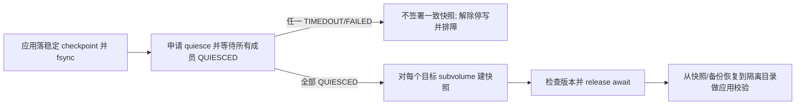

### 26.4 多客户端一致性：quiesce 的事务边界

普通 CephFS snapshot 并不承诺多客户端已经确认的写会全部进入同一快照，哪怕各应用预先做 flush。Squid 起的 `ceph fs quiesce` 对一个 set 内多个 subvolume 停止 I/O，并等待所有成员进入 `QUIESCED`；它为持久化的业务 checkpoint 建立快照窗口，**仍不代替应用数据库一致性、远端备份和恢复演练**。以下是一个在**独立 Bash 进程**中执行的双子卷快照事务：先由业务完成 checkpoint/fsync，按实测值批准 timeout/expiration，确认 `team/app`、`team/db` 已存在且备份身份有权限；不能把它粘进管理员当前交互 shell。

```bash
#!/usr/bin/env bash
set -Eeuo pipefail
run_id=$(python3 -c 'import uuid; print(uuid.uuid4().hex)')
set_id="team-backup-$run_id"
snapshot_name="checkpoint-$run_id"
quiesce_open=0
release_on_exit() {
  local rc=$?
  trap - EXIT
  if (( quiesce_open )); then
    printf '快照组未签署：set=%s snapshot=%s；尝试取消停写\n' "$set_id" "$snapshot_name" >&2
    if ! ceph fs quiesce cephfs --set-id="$set_id" --cancel --await; then
      printf '取消未确认；隔离快照并由值班人员核验 set，expiration 到期后复查 I/O\n' >&2
    fi
  fi
  exit "$rc"
}
trap release_on_exit EXIT
trap 'exit 130' INT
trap 'exit 143' TERM
app_path=$(ceph fs subvolume getpath cephfs app --group_name team)
db_path=$(ceph fs subvolume getpath cephfs db --group_name team)

# 创建时用版本 0 拒绝覆盖现有 set；创建成功后才归本次事务管理
printf '本次 quiesce set=%s snapshot=%s\n' "$set_id" "$snapshot_name" >&2
ceph fs quiesce cephfs --set-id="$set_id" team/app team/db \
  --if-version=0 --timeout=60 --expiration=120
quiesce_open=1
quiesce_result=$(ceph fs quiesce cephfs --set-id="$set_id" --await)
# 对照 subvolume 真正的内部路径，不只检查成员数量
observed_version=$(printf '%s' "$quiesce_result" | python3 -c '
import json, sys
s = json.load(sys.stdin)["sets"][sys.argv[1]]
expected = {"file:" + path for path in sys.argv[2:]}
if s["state"]["name"] != "QUIESCED":
    raise SystemExit("quiesce set 尚未全部停写")
if set(s["members"]) != expected or any(
    m["excluded"] or m["state"]["name"] != "QUIESCED"
    for m in s["members"].values()
):
    raise SystemExit("quiesce 成员或状态不符合本次备份清单")
print(s["version"])
' "$set_id" "$app_path" "$db_path")
ceph fs subvolume snapshot create cephfs app "$snapshot_name" --group_name team
ceph fs subvolume snapshot create cephfs db "$snapshot_name" --group_name team
# 并发改成员、超时或释放失败均触发取消和验收失败；不删除已有快照证据
ceph fs quiesce cephfs --set-id="$set_id" --release --await --if-version="$observed_version"
quiesce_open=0
printf '候选一致快照：set=%s snapshot=%s；仍须业务隔离恢复校验\n' "$set_id" "$snapshot_name"
```

`--timeout` 是每个成员达到 `QUIESCED` 的时限；任一超时整个 set 为 `TIMEDOUT` 并解除 I/O 阻塞。`--expiration` 在整组进入 `QUIESCED` 后计时，到期自动 `EXPIRED` 恢复 I/O；不能依赖“人工稍后 release”作为唯一防死锁机制。示例的 60/120 秒只是演示值，必须保证整个创建/验证/释放窗口低于业务批准的过期时间。未指定 timeout 的新 set 默认 0，可能立即 TIMEDOUT。非 await 的 include/exclude/reset/cancel/release 都是异步命令返回当前状态，不代表完成；`--await` 的等待可由 `--await-for` 单独限制。持续写控制器应记录返回的 `sets[set-id].version`，release 时携带 `--if-version=<observed>`，避免其他管理员中途 exclude 成员后仍接受部分一致的快照；若返回 `ESTALE`，条件操作**未执行**，本次所有 snapshot 都不能作为一致恢复点。脚本在已确认自己创建 set 的前提下尝试 cancel/await，失败则保留现场并由值班人员核验，不能原样重试、覆盖旧快照或把冲突当成功。若首次创建命令失败但服务端状态未知，须按记录的唯一 set ID 排查；不得盲目 cancel 一个未证明属于本次作业的 set。

## 27. 快照镜像、RPO 与跨站切换

### 27.1 接口分层与生产可承诺边界

CephFS 镜像通过快照按目录异步同步到远端 FS，顺序是复制 snapshot 数据后在目的目录创建**同名**快照。源/目标集群均需 Pacific 或更高。Mgr `mirroring` module 负责登记和分配目录，`cephfs-mirror` daemon 实际传输；仅执行 MON 的 `fs mirror enable` 会缺少模块创建的 `cephfs_mirror` index object，daemon 可能变 `failed`。应用的真实 RPO 至少是“产生可用快照的间隔 + 等待及同步延迟”；不是以 daemon 存活或目录已注册作为 RPO 证据。

同一 FS 当前只支持一个 mirror peer。官方虽描述多个 daemon 可按目录分摊负载和重平衡，也明确建议先部署**单 daemon**，多 daemon 未经过充分验证；不能把添加 3 个 mirror daemon 直接解释成已验证的 HA 服务。仅镜像普通文件、目录与 symlink，socket、设备等其他 inode 类型不复制。目的 FS 默认为只读运营目标，但 CephFS 不自动强制这个约束；必须靠目的地写入主体的 caps 和运维流程禁止写入，并实测误写拦截。

### 27.2 建立同一条完整的同步路径

```bash
# 源集群：镜像身份需要 index object 的 metadata pool 写权限及 data pool 读权限
ceph auth get-or-create client.mirror mon 'profile cephfs-mirror' \
  mds 'allow r' \
  osd 'allow rw tag cephfs metadata=*, allow r tag cephfs data=*' mgr 'allow r'
ceph mgr module enable mirroring
ceph orch apply cephfs-mirror
ceph fs snapshot mirror enable cephfs

# 目的集群：授权源镜像 daemon 可在目标 FS 写入并创建快照
ceph fs authorize backup_fs client.mirror_remote / rwps
ceph fs snapshot mirror peer_bootstrap create backup_fs client.mirror_remote site-remote

# 源集群：在受控交互终端从批准的 secret 通道读取目的站 token
if ! IFS= read -r -s -p '目的站 mirror token: ' mirror_token; then
  printf '令牌未取得，停止导入\n' >&2
  exit 1
fi
printf '\n'
if [ -z "$mirror_token" ]; then
  printf '空令牌，停止导入\n' >&2
  exit 1
fi
if ! ceph fs snapshot mirror peer_bootstrap import cephfs "$mirror_token"; then
  unset mirror_token
  exit 1
fi
unset mirror_token
ceph fs snapshot mirror peer_list cephfs
ceph fs snapshot mirror add cephfs /teams/team
ceph fs snapshot mirror ls cephfs
ceph fs snapshot mirror daemon status
```

Token 内含目的 MON 地址、FSID、key 等可接管数据，必须通过目的站的受控 secret 通道传递，不得写入普通工单、日志或 shell history。上例 `read -s` 只避免键入时回显与 history；**Tentacle CLI 仍要求把 token 作为进程参数传入**，运行时同机具有进程检查权限者可能读取它。因此只能在访问受控的管理节点与受限操作窗口执行，审计日志不得采集命令参数，并按密钥管理规范处理令牌及导入后的 peer 凭据；不能将 `read -s` 误报为彻底消除泄漏。上面代码按注释分别在源/目的集群执行，不能作为单机脚本跨集群顺序运行。替代方式 `peer_add <fs> client.<id>@<remote-cluster> [<remote-fs>] [<remote-mon>] [<cephx-key>]` 需要源 MGR 与镜像主机具备远端配置和 key，后两项直接在命令行传递有泄密面，因此优先 bootstrap/import。命令中的目录必须是 FS 内**绝对路径**，不能包含宿主机 mount 前缀；父子目录不可同时注册镜像，系统会规范化 `..` 并拒绝重复/嵌套注册。需要撤销时先停止 schedule 和写入，核对 `peer_list` 的 UUID，再 `ceph fs snapshot mirror remove <fs> <path>`、`peer_remove <fs> <uuid>`、最终禁用镜像，不能对仍在同步的目标直接改派。

### 27.3 判断是否真的在追赶、失败如何止损

创建受业务检查点确认的源 snapshot 后，在源端用 `ceph fs snapshot mirror daemon status` 查看 daemon/FS/peer，结合 daemon admin socket 的 `fs mirror status <fs>@<fscid>`、`fs mirror peer status <fs>@<fscid> <peer-uuid>` 检查**每个目录**的 `idle/syncing/failed`、`current_syncing_snap`、`last_synced_snap`、`failure_reason`、字节/时长及目的端同名快照。FSCID 必须与现有 FSMap 一致，重建同名 FS 后不复用旧 FSID 假象。daemon 重启或目录改派会重置 `snaps_synced/snaps_deleted/snaps_renamed` 等累计值，RPO 以快照时间和内容一致性计算，不靠累计值推断连续性。

目标端人工创建了与源端同名快照，会因镜像元数据不匹配使该目录 `failed`；先冻结目标写入和保留现场，确认这是否是运营侧误写，再由数据负责人裁决是保留独立数据还是清理冲突，不能在来源不明时覆盖。默认连续失败达到 `cephfs_mirror_max_consecutive_failures_per_directory`（10）标为 failed，按 `cephfs_mirror_retry_failed_directories_interval`（60 秒）继续重试；新注册但尚不存在的目录也会暂为 failed 并在创建后重试。`mirroring_peers/directory_count/mirror_enable_failures` 以及 `sync_bytes/sync_failures/last_synced_end/last_synced_duration` 是观察发现、进度和滞后的分层指标，不等同于成功恢复。

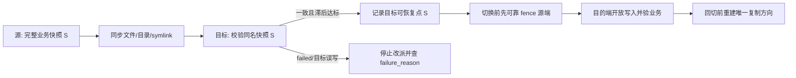

### 27.4 演练切换/回切必须保证单一写者

1. 在源端记录最后业务确认的 checkpoint、`fs status`、快照名称、路径、FSID/FSCID；等待镜像对应目录 `idle`，`last_synced_snap` 与目的端快照一致并满足批准 RPO。同步失败即停，不可因为 HTTP 或 mount 能访问目的端就宣称追平。
2. 由业务和网络负责人 fence 原源端 writer（包括 NFS-Ganesha/CSI/共享 key 的旧会话），冻结复制方向，确认旧站不可再接受写入；目的端以已确认快照恢复应用并放开目标 client caps。未同步的最后写入按 RPO 数据损失处理，不能声称可通过旧源端自动补齐。
3. 目的端检查挂载、fsync/读回、rename/lock、权限、实际应用数据版本和 quota，记录现在的唯一权威站点及快照点；快照外部的应用 secret、数据库状态仍由应用备份恢复。
4. 回切只能从**新权威**向旧站重新建一条复制链，在只读隔离区对比历史并决定冲突；官方要求 re-add peer 前确认旧 mirror daemon 不再显示该 peer UUID，改派到另一源时宜清理目的端旧同步目录；禁止两个站点同时写同一路径。

## 28. 故障诊断：按权威层级逐步缩小范围

### 28.1 收集证据、定位到真正的阻塞层

```bash
ceph -s
ceph health detail
ceph fs status cephfs
ceph fs dump
ceph osd pool stats <metadata-pool>
ceph osd pool stats <data-pool>
ceph tell mds.cephfs:0 status
ceph tell mds.cephfs:0 dump_ops_in_flight
ceph tell mds.cephfs:0 client ls
ceph mgr module enable stats
ceph fs perf stats
```

| 事实 | 优先证据与处置 | 不可误判为 |
|---|---|---|
| FS 无 active rank；`FS_WITH_FAILED_MDS`、`MDS_ALL_DOWN` | FSMap 的 failed/damaged/standby、MDS placement、MON quorum、metadata pool PG；恢复可接管 standby 并观察 replay | data pool 有余量即服务可用 |
| `MDS_SLOW_METADATA_IO`、`MDS_HEALTH_READ_ONLY` | metadata pool slow OSD、写失败、full 与 journal；先救 RADOS 元数据路径 | 增大 MDS 内存就能解除底层写失败 |
| `MDS_SLOW_REQUEST` | `dump_ops_in_flight` 的末事件：lock/cap、journal/OSD 或 client 网络；定位 inode/client/OSD | 无条件重启 MDS 就是根治 |
| `MDS_TRIM`、`MDS_ESTIMATED_REPLAY_TIME` | journal 段数、replay 的 read/write positions、MDS 版本、存储延迟 | replay 慢即 journal 已坏，可立即 reset |
| `MDS_CLIENT_RECALL`、`MDS_HEALTH_CLIENT_LATE_RELEASE`、`MDS_CLIENT_OLDEST_TID` | `client ls` 的 cap、release、oldest TID、主机和网络；先排查应用和客户端 | 增加 `mds_max_caps_per_client` 会使慢客户端自动正常 |
| `MDS_CACHE_OVERSIZED` | 真实 cache、recall/trim 速率与客户端持有 caps；视情况扩资源或修复不释放者 | 告警阈值调高就修复了超内存 |
| `MDS_DAMAGE`、`FS_DEGRADED` | damage table、关联 PG、MDS rank 和业务受损路径；先保存证据再 scrub | `ceph mds repaired` 会自动修复坏数据 |
| 客户端 `ENOSPC/EIO` | pool full/backfillfull、dirfrag 上限、quota、data pool lost PG、MDS read-only，结合 errno/FSMap | 单看 `df` 足以判断根因 |

`MDS_CLIENTS_LAGGY` 和 `MDS_CLIENTS_BROKEN_ROOTSQUASH` 需要盘点受影响客户端版本与应用身份，不能用关告警的方式接受错误权限语义。`MDS_UP_LESS_THAN_MAX` 表示 active rank 数不足，`MDS_INSUFFICIENT_STANDBY` 表示容灾人数不足，两个门槛分别验收。`MDS_DAMAGE` 可以只让受损子树返回 EIO，不能以全 FS 仍能挂载证明数据完整。

CephFS MGR `stats` module 可提供 `ceph fs perf stats --client_id=<id>` / `--mds_rank=0,1`，`cephfs-top`/`--dumpfs <fs>` 帮助定位 client 的 `avg_metadata_latency`、read/write latency、cap hits/misses、open inodes、I/O 大小与数量；同时看 MDS admin socket `counter dump` 和 pool IO，不能仅看平均值。`MDS_SLOW_REQUEST` 而 OSD 正常时再调查 lock/cap；客户端独有故障对照 kernel `dmesg` 与 FUSE 前台日志。MDS 日志/`dump cache` 文件若在容器内 tmpfs，不应误以为宿主机 `/tmp` 一定有文件；调高 debug 前保留原值并确认磁盘及敏感信息保护，诊断结束撤销临时配置。

### 28.2 Recovery replay 慢与后台负载冲突

先检查 `ceph tell mds.<fs>:0 status` 的 `replay_status.journal_read_pos/write_pos`；replay 时 write_pos 不变，read_pos 前进可估算剩余时间。`MDS_ESTIMATED_REPLAY_TIME` 说明超过阈值后发出预估，不是自动认定 journal 损坏。`MDS_TRIM` 表示日志段落后于写回进度，先定位慢 metadata pool，再评估大热集/客户端 caps。**MDS 在 recovery/replay 阶段不能执行正常 journal trim**，临时减小 `mds_tick_interval` 只影响 active MDS，不能用作加速卡在 replay 的通用办法。

专家恢复窗口可按需要临时 `ceph config set mgr mgr/volumes/pause_purging true`、`pause_cloning true`，并在已完成现有客户端 fence 后用 `ceph fs set <fs> refuse_client_sessions true` 暂拒新 session；执行后核对 `ceph fs get <fs>` 中 flag 生效，结束时恢复原先记录的值。`mds_deny_all_reconnect` 与 `mds_heartbeat_grace` 只在已确定 recovery 策略下使用，前者阻止旧 session 重新连接却**不阻止新连接**，后者延长内部心跳判失败等待，不是解决慢盘的手段。每项都记录旧值、修改目的、超时恢复人，并在隔离校验后逐一撤销。`ceph config set mds debug_mds 0` 等降低 debug 可减 replay 工作，却也会丢失诊断材料，必须先保存当前 first failure 再限时使用。若 RADOS metadata pool 不健康，先修复该层，切勿通过强制频繁 fail MDS 消耗新的 recovery 窗口。

### 28.3 Full、quota、坏 PG 的不同数据结论

`OSD full` 时 CephFS 写入及大部分非删除/截断元数据操作返回 ENOSPC；已返回成功的 `write()` 在后续 flush 才可能发现空间不足，`fsync()` 的错误才是持久化裁决，成功 `fclose()` 不能保证落盘。检查最满 OSD/CRUSH root、metadata 与每个 data pool 的满水位、snapshot/trash/purge 积压；优先从故障域内增加合格空间或按审批删除**已证明可删**数据，不因 `df` 显示 quota 余量就断言 pool 还有 raw 空间。客户端在 full 期间取消未完成写入时需要 OSD epoch barrier 防止旧请求与新读写竞争。

若 data pool PG 确认**已丢失对象**，FS metadata 可能正常但文件部分缺失，官方指出读取丢失的区域可能返回零。确认受影响 PG IDs、暂停业务写入并保护独立备份；MDS 仍正常时通过 `cephfs-data-scan pg_files <path> <pg-id>...` 列出可能受损文件，逐一做应用校验。**恢复受损文件必须删掉旧文件并从备份创建新 inode，不能原地覆盖坏文件。** 该扫描不修 metadata，也无法在 MDS 不可用时正常遍历文件；不要混同 metadata pool damage 的修复路线。

## 29. 元数据 scrub、专家恢复与停机边界

### 29.1 先做不破坏历史的前向检查

CephFS forward scrub 从目录树查 dentry/inode、dirfrag、data pool backtrace 等，rank 0 调度并能分派给其他 rank；反向从 RADOS 对象映射回文件树不是同一操作。普通 RADOS PG scrub 只判定 object 层，不判定 CephFS 路径是否连通。

```bash
ceph tell mds.cephfs:0 scrub start /teams recursive
ceph tell mds.cephfs:0 scrub status
ceph health detail
# 若需检查默认不会由根递归遍历包含的 stray:
ceph tell mds.cephfs:0 scrub start / recursive,scrub_mdsdir
ceph tell mds.cephfs:0 dump stray
```

递归 scrub 异步返回 tag；持续轮询 `scrub status`，任务消失、没有新增 damage 且业务树校验通过才算验收。负载过高可 `scrub pause`，解决后 `scrub resume`；`scrub abort` 只取消待办，已在飞的 RADOS 操作仍需完成。优先导出 damage table/日志并判定是否仍有可用备份。仅对已确认的 `DENTRY`、`DIR_FRAG`、`BACKTRACE` 损坏，经审批运行 `ceph tell mds.cephfs:0 scrub start <path> recursive,repair,force`，再次检查 damage table 与受损业务路径；损坏的 hardlink scrub 可检测但不能保证修复。`ceph mds repaired <fs>:<rank>` 只是标注 rank 已由**外部操作**修好，不会写回缺失 metadata。

### 29.2 journal/table/data-scan 的不可逆顺序

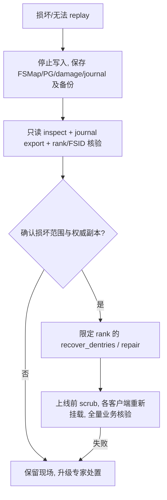

`ceph fs set <fs> down true` 是计划停机，会优雅停止 MDS、flush journal 并暂停 client I/O；`down false` 恢复先前 `max_mds`。`ceph fs fail <fs>` 用于应急让 rank 失败并阻止 standby 自动加入，属于故障恢复/删除入口而非日常停机；恢复前检查为何被 fail，再 `ceph fs set <fs> joinable true`。涉及损坏时先卸载/fence client、保存 metadata/data pools 的一致备份、FSMap/FSCID/epoch 与 MDS 日志，再选择离线专家工具。`cephfs-journal-tool journal inspect` 只能证明 journal 对象可读取/解码，不能证明事件语义一致；`journal export` 是稀疏文件，应以保留稀疏的方式存档。`journal import` 校验 FSID，`--force` 跳过校验不能当作恢复默认参数。

`cephfs-journal-tool --rank=<fs>:<rank> event recover_dentries summary` 只把比 backing store 更新的日志 dentry/inode 尝试恢复，可能造成不一致，后续还需 scrub；大 journal 使用 `--max-rss` 留出约 30% 内存余量。`header set`、`event splice`、`journal reset` 会改写权威历史；重置会丢弃未落盘的元数据、造成 orphan object 或 inode 编号冲突，不能因 replay 太慢就 reset。先以核实的 metadata pool 名分别检查 table；以下仅检查 rank 0，其他 rank 把 `mds0` 改为对应编号，snap table 是 FS 级对象：

```bash
: "${CEPHFS_METADATA_POOL:?先从 FSMap 核实 metadata pool 后设置此变量}"
rados -p "$CEPHFS_METADATA_POOL" stat mds0_sessionmap
rados -p "$CEPHFS_METADATA_POOL" stat mds0_inotable
rados -p "$CEPHFS_METADATA_POOL" stat mds_snaptable
```

对象存在不等于 table 内容一致。只有在确认证据后使用 `cephfs-table-tool <rank> reset session|snap|inode`，重置 session 后所有客户端须重新挂载/重启。`ceph fs reset` 只留下 rank 0 的既有 metadata 可用，并忽略其他 rank 的历史；普通 `fs rm` 后再建可能覆盖 root 元数据，不能当成 reset 的等价手法。

如果 metadata pool 必须从 data pool 重建：先核对所有 data pools 和 pool IDs/namespace，`cephfs-data-scan init` 恢复根/`~mdsdir`，`scan_extents` 汇总文件大小/mtime，`scan_inodes` 发现/重建 inode，`scan_links` 检查目录连通，最后按方案 `cleanup` 并审计 `lost+found`；这些并非可在生产活动 FS 上依次试运行的通用命令。执行顺序是一道**全局屏障**：先等待所有 `scan_extents` worker 成功结束并核对分片覆盖 `0..worker_m-1`、目标 data pools 全部进入扫描，再允许任何 `scan_inodes` worker 开始；所有 inode worker 完成后才能 `scan_links`，不能逐个 worker 串行跑完全部阶段。`scan_extents` 显式指定池时必须包含所有 data pools，而 `scan_inodes`/`cleanup` 只需默认 data pool。可按 `--worker_n/--worker_m` 并行扫描不同工作分片，但必须由恢复负责人批准资源上限和每阶段的结束证据。Alternate metadata pool 的恢复必须以 `ceph fs new ... --recover --allow-dangerous-metadata-overlay` 等明确选择历史，并使原 FS 完全下线、保留原池供取证；新旧 FS 不能同时写同一个 data pool 对象集合。重建 metadata 可能将无法恢复原路径的 inode 放入 `lost+found`，须与业务索引逐一核对，不得因 `scan_links` 返回成功即宣布数据完整。

### 29.3 MON store 全失的精确适用范围

官方已识别并测试的 FSMap 重建路径**仅适用于单 active MDS 且集群没有其他 CephFS**；多 active MDS 或多个 FS 的恢复步骤尚未有同样证明，不能直接套用。先从 OSD 恢复 MON store 及 pools 并验证 PG `active+clean`，记录原 pool ID、FSID、可能的 FSCID 与旧 config，然后才能重建 FSMap：

```bash
ceph fs new <fs> <recovered-meta-pool> <recovered-default-data-pool> --force --recover
ceph fs set <fs> joinable true
ceph fs status <fs>
```

`--recover` 使 rank 0 以 existing/failed 状态等待接管，防止 MDS 以新空 FS 初始化覆盖原有元数据；若 CSI 等应用依赖 FSCID，先核对并按批准的原值传 `--fscid`。恢复的 FSMap 只带默认配置，须从恢复资料包重新应用 standby、required client features、附加 data pools、client caps 与相关镜像/快照调度；不能凭“新 FS 名等于旧 FS 名”声明恢复完毕。最终隔离挂载、抽样全部关键路径与大文件校验、metadata scrub 无新损坏、业务写入 `fsync`/断线重连、镜像和备份重新锚定新的权威快照，才有资格开放业务流量。

## 30. 应用语义、协议出口与调优边界

### 30.1 POSIX 契约：比 NFS 强，不等于本地磁盘

CephFS 的路径、权限、文件锁和多客户端 cap 协同使它通常比 NFS 的 close-to-open 缓存一致性更强；但不等同 XFS/ext4。跨 RADOS object 边界的并发写可能分别选中两个写者的数据；单次很大的 O_SYNC 写在客户端异常时也可能只完成一部分。多主机可写 `mmap()` 缓存没有一般意义上的跨客户端写入失效通知，不能用它构造共享内存数据库。稀疏文件的 `st_blocks` 根据大小估算，`du` 可高估实际分配；CephFS 不自动维护常规访问的 atime，依赖 atime 的分层/备份应换独立访问日志或显式维护。`.snap` 是隐藏的虚拟目录，不参与普通 readdir，但会占用这个名称；若应用必须使用 `.snap` 名称可在客户端设置 `snapdirname`/`client_snapdir`，上线前检查不同客户端的一致配置。

| 应用观察 | 必须实测的行为 | 设计动作 |
|---|---|---|
| 同文件多客户端写 | 跨对象边界读到的组合和锁在断线时的行为 | 应用级分片/锁/事务；不能用文件系统承诺跨对象事务 |
| 稀疏文件与 `du` | `stat st_blocks`、quota 与底层实际 pool 使用差异 | 容量管理看池水位，文件统计用于应用侧解释 |
| `fsync()` 失败 | writeback 出错如何向每个打开中的 fd 报告 | 保留失败文件/版本，应用不继续提交上层事务 |
| snapshot 恢复 | 应用是否已在快照前产生持久 checkpoint，多个子卷是否同一 quiesce set | 从隔离挂载重放应用，不能用 `.snap` 可读作为恢复验收 |

### 30.2 NFS-Ganesha 是额外的 stateful 故障层

无法原生挂载 CephFS 的环境可部署 NFS-Ganesha 的 `FSAL_CEPH`；导出可能共享同一个 libcephfs 客户端（FSAL 的 mount 配置相同时），须对**实际共享的身份**逐项检查 CephX path caps 与所有导出目录。优先 `ceph nfs cluster/export` 由 MGR 和 orchestrator 管理，手工安装配置仅用于现有特殊运维模式。以下在独立 Bash 进程中运行，前提是批准 placement、对外 IP、故障域、客户端 CIDR，且网关与客户端都在受信网络；`AUTH_SYS` 依赖受信客户端提供 uid/gid，不能为不可信租户提供身份保障：

```bash
#!/usr/bin/env bash
set -Eeuo pipefail
: "${NFS_ALLOWED_CIDR:?先配置获批准的 NFS 客户端 CIDR}"
python3 - "$NFS_ALLOWED_CIDR" <<'PY'
import ipaddress
import sys

cidr = sys.argv[1]
if "/" not in cidr or ipaddress.ip_network(cidr, strict=False).prefixlen == 0:
    raise SystemExit("必须提供非全网的已批准 CIDR")
PY
ceph nfs cluster create team-nfs 'label:nfs'
ceph nfs cluster info team-nfs
ceph nfs export create cephfs --cluster-id team-nfs --pseudo-path /team \
  --fsname cephfs --path=/teams/team --client_addr "$NFS_ALLOWED_CIDR" \
  --squash root_squash --sectype sys
ceph nfs export info team-nfs /team
ceph nfs export ls team-nfs --detailed
```

`export info` 必须确认外层 `access_type=none`，`clients` 中**只有批准的地址**且该项为读写及 `root_squash`；Tentacle 源码对提供 `--client_addr` 的 export 正是按此生成，单看顶层 squash `none` 会误判，但少了 `clients` 限制确实是不安全的。官方 CLI 在未指定 `--client_addr` 时默认对所有客户端开放，未指定 `--squash` 时默认 `no_root_squash`，因此两个参数缺一不可。用获批准 CIDR 内、外的客户端分别试挂，验证外部拒绝、root 被 squash、普通用户依实际 UID/GID 正反例读写；生产还要以网关防火墙约束 TCP 2049。需要对**不可信**客户端提供身份验证和加密时，先部署和验证网关/客户端的 Kerberos keytab、DNS 与时钟，再只允许 `--sectype krb5p`，客户端带 `sec=krb5p` 挂载；不能在未配置 Kerberos 时仅改一个参数就宣布安全，也不能同时开放 `sys` 降级协商。

内核/应用主机从批准网段通过 `mount -t nfs -o nfsvers=4.1,proto=tcp,sec=sys <gateway>:/team <mountpoint>` 校验，实测 NFSv4.1+ session、create/fsync/rename、锁与 failover 后 client recovery。验证 gateway RADOS 配置 pool 中的 NFS state/锁恢复数据，不因 MDS/OSD `HEALTH_OK` 就断言 NFS 可用。入口 VIP、DNS、LB、外部认证、安全模式与 export 层 squash/client CIDR 是额外风险边界；误配为 root 不 squash 或导出根超过 CephX cap 时不得通过验收。SMB 共享等协议转换也会改变大小写、ACL 与锁语义，不得用原生 Linux CephFS 压测结果代替。

### 30.3 字符映射、LazyIO、实验机制各自独立

CephFS 默认目录项按不含 `/` 与 NUL 的字节名处理。Charmap 针对**该目录下的条目**设置 UTF-8、NFD/NFC/NFKD/NFKC normalization 和是否 case sensitive；新建子目录继承配置，既有子树不会被改名。目录必须为空且不在 snapshot 中才能变更/移除，大小写不敏感会把原本不同名字折叠为同一项。可通过 `setfattr -n ceph.dir.casesensitive -v 0 <empty-dir>`、`getfattr -n ceph.dir.charmap <dir>` 校验；不支持的旧客户端可能无法安全更新目录，需以客户端 feature 检查和 required client feature 共同控准入，而不是临时删现有目录的 charmap。底层保留 `alternate_name` 原始拼写供兼容的客户端重建显示，MDS 存的是规范化后的 name；数据导出或异构客户端测试要覆盖同音不同码位、大小写冲突与快照恢复。

LazyIO 明确**放宽**多客户端缓存一致性。`client_force_lazyio` 是全局开启，应用通常应在自己的 `libcephfs` handle 上逐文件启用；写方 `lazyio_propagate` 后，等应用自身所有 writer 的 barrier，读方 `lazyio_synchronize` 后再读取，当前只实现整个文件（offset/count 为 0）的传播/同步。未建立 barrier 的共享目录不得启用，也不能把它包装成“CephFS 默认加速开关”。Inline data 已 deprecated 且未获得生产支持；Mantle Lua balancer 官方明确仅用于研究开发，不可在生产集群执行实验脚本。启用实验 feature 还可能在 MON map 留下不可抹除的历史启用标记。

### 30.4 配置及性能诊断按因果层操作

| 现象 | 相关选项/指标 | 变更纪律 |
|---|---|---|
| Metadata cache 压力 | `mds_cache_memory_limit`、`mds_cache_reservation`、`mds_health_cache_threshold`、`mds_cache_trim_threshold/decay_rate` | 先核对工作集、MDS RSS 与 client cap；trim decay rate 增大会**减慢** trim；改完验证 p99 和 replay |
| Client 长期持 cap | `mds_recall_max_caps`、`mds_recall_max_decay_threshold/rate`、`mds_recall_global_max_decay_threshold`、`mds_recall_warning_threshold/rate`、`mds_max_caps_per_client` | 区分 recall 发得太慢与 client 不响应；逐个参数、小批次变更并保留原值 |
| 大目录 readdir 饱和 | `mds_session_cap_acquisition_throttle/decay_rate`、`mds_session_max_caps_throttle_ratio`、`mds_cap_acquisition_throttle_retry_request_timeout` | 只在实测 cap 数快速增长且工作负载符合时调；不能用放开 cap 限制掩盖 `find` 全量扫描 |
| Purge queue 增长 | `purge_queue.pq_item_in_journal`、`pq_executing_ops`、`pq_executed`；`filer_max_purge_ops`、`mds_max_purge_files/ops/ops_per_pg` | 每 rank 有独立 purge queue；先清除 data pool slow/full/recovery，再逐阶增加并发并看业务延迟 |
| Client 性能/配置 | `ceph fs perf stats`、`cephfs-top --dumpfs <fs>`；`ceph config help <option>` 查询 `Can update at runtime` | 区分 global client counters 和 rank 维度 stale `delayed_ranks`；任何调试选项结束后按记录恢复 |

`cephfs-top` 的 `stats` MGR plugin 默认未启用；可创建独立只读 `client.fstop`（MON/MDS/OSD/MGR `allow r`），不将 admin key 交给监控终端。`ceph fs perf stats` JSON 的 global metrics 与 per-rank metrics 不同，`delayed_ranks` 表示 rank 到 0 上报迟滞；不能在 metrics 断流时误报“客户端不忙”。Purge queue 的 `pq_executing` 是文件，`pq_executing_ops` 是关联 RADOS 操作，两者不可混算。对 `mds_min_caps_per_client`、`mds_session_cache_liveness_*`、`mds_tick_interval` 等内部节流选项先用 `ceph config help`/`ceph config get` 校验目标版本默认及是否运行期可修改，再按因果层回滚，不把示例参数永久写入生产默认配置。

## 31. 生产验收与许可

| 验收场景 | 可直接验证的结果 | 不得通过的条件 |
|---|---|---|
| 建立/挂载 | 不同故障域 MDS active/standby，kernel/FUSE 按指定 FS/path 挂载，写入 fsync 后新客户端读回 | 无合格 standby、隐式挂错 FS、metadata pool 不可写 |
| 身份/租户 | MDS path、MON fsname、OSD namespace 三层正反例，业务 key 不具备 p/s 等管理权限 | 只测 POSIX 路径却能直读其他租户 RADOS 对象 |
| 数据语义 | create/rename/link/lock/截断、并发跨 object 的应用处理、full 下 fsync/ENOSPC 演练 | 以成功 close 代替数据持久化、以快照代替应用事务 |
| 规模/性能 | 实际工作集下测热点目录/metadata p99、cap recall、balancer/pin、standby 接管 | 只看 `max_mds` 已设或 daemon running 就宣布可扩容 |
| 子卷与容量 | clone 完成后恢复校验，quota 短暂超额与 pool raw 水位独立监控，trash/purge 完成 | 克隆仍在进行，或删除已返回但 pool 空间尚未回收 |
| 保护与灾备 | quiesce 所有成员仍处于正确版本，目标快照内容一致，实测同步滞后与单一写者切换 | mirror 有 peer 但目录 failed，或者切换后原站仍能写 |
| 故障恢复 | MDS failover、受损 metadata 与坏 data PG 分别演练，备份恢复、scrub 与业务 I/O 通过 | reset/mark repaired 替代数据修复，未保留旧历史即清理恢复现场 |

参考资料：Ceph Tentacle CephFS 管理、挂载、镜像、子卷、恢复与开发接口文档。Ceph authors and contributors，CC BY-SA 3.0。
