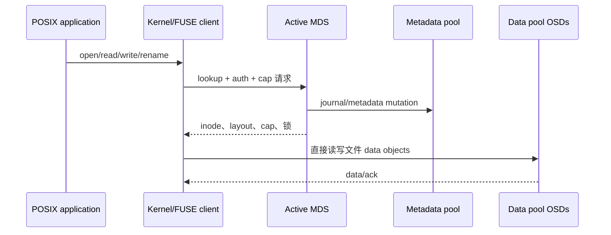
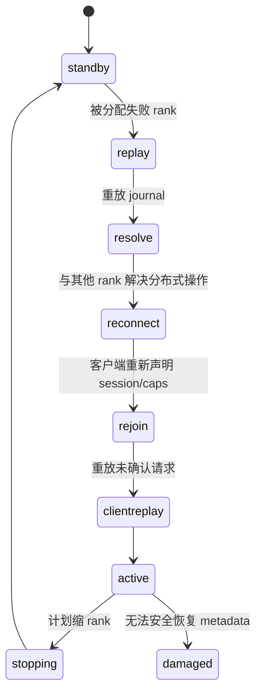
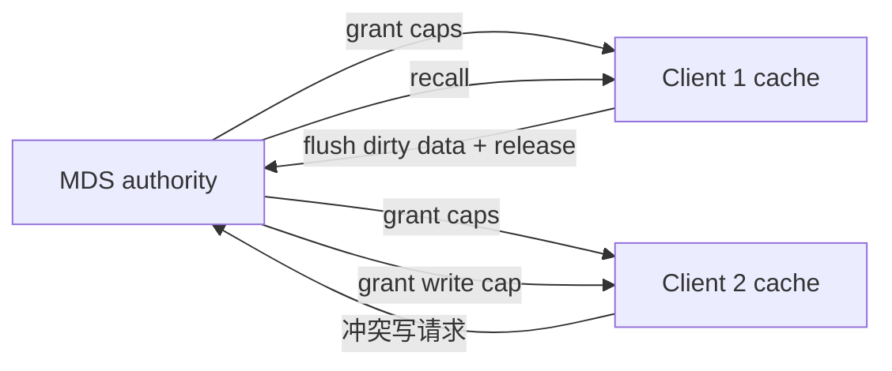
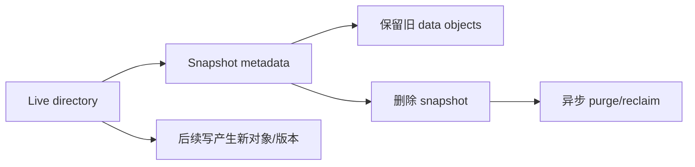
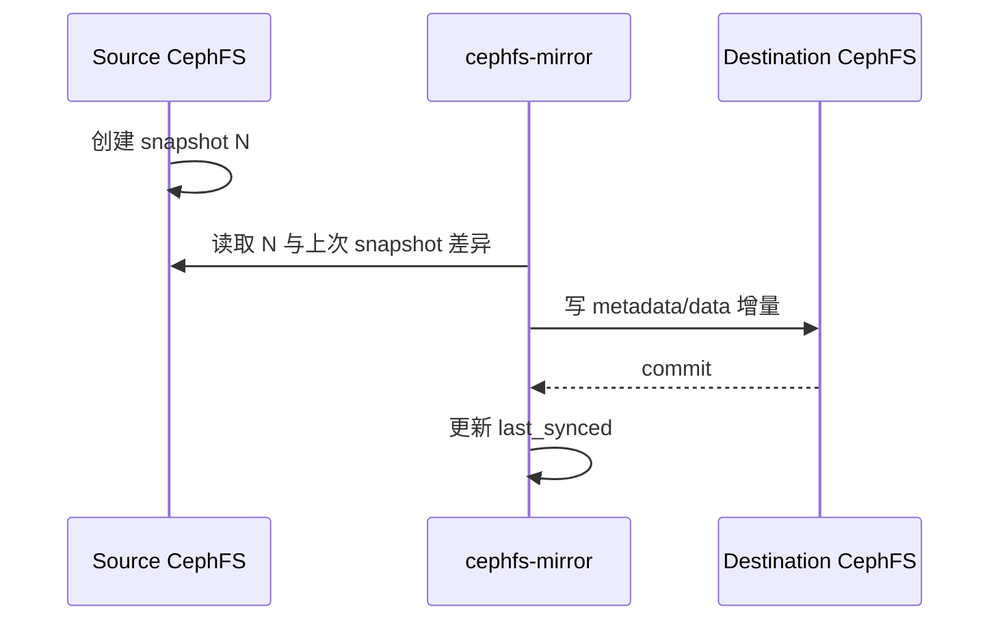
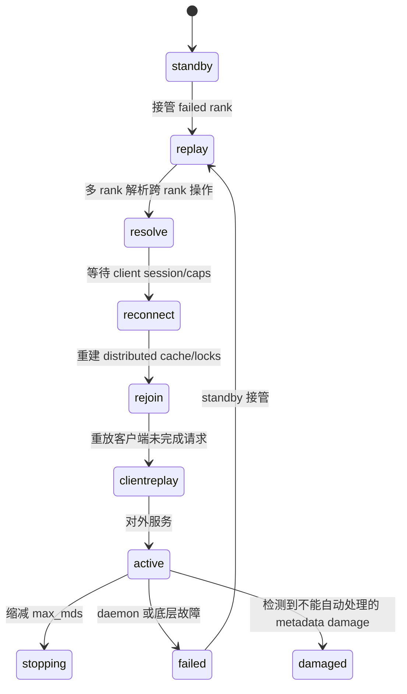
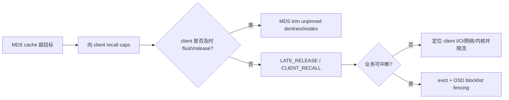
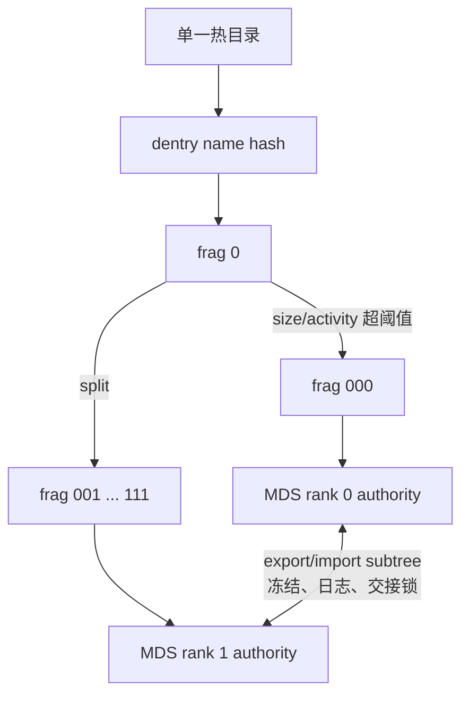
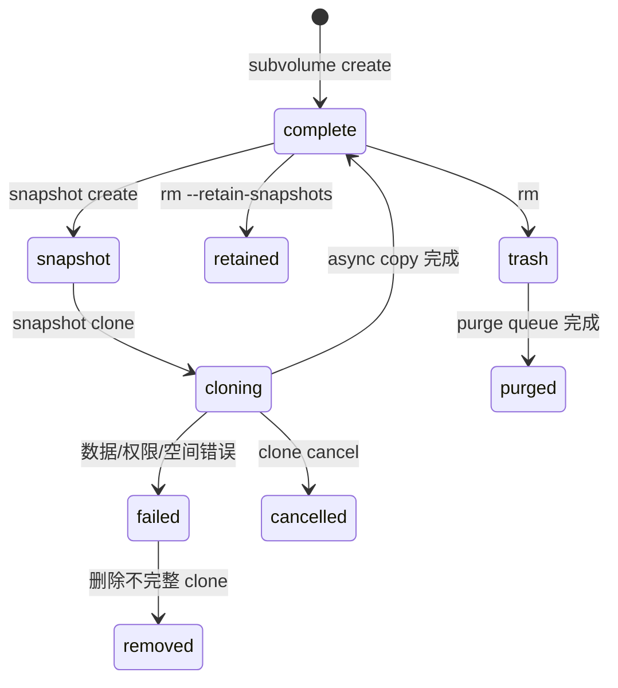

# CephFS 文件系统全解（Tentacle）

> CephFS 在 RADOS 上提供 POSIX 文件系统。理解它不能只记住“有 MDS”：必须区分元数据路径和文件数据路径，理解 MDS rank、journal、distributed metadata cache、client capabilities、subtree partition、snapshot/subvolume、配额与灾难恢复如何共同维持一致性。

## 1. 数据与元数据彻底分路



目录、inode、owner/mode、dentry、snapshot 和 MDS journal 存在 metadata pool；文件内容按 layout 条带到一个或多个 data pool。MDS 不代理正常文件数据，因此数据吞吐可随 OSD 扩展；MDS 负责命名空间一致性和客户端缓存协调。

MDS 本地磁盘不是权威元数据源。状态和 journal 位于 RADOS，所以 standby 可在 active 故障后 replay；这也意味着 metadata pool 不可用会阻断整个 FS，即使 data pool 完好。

## 2. 创建 FS 时实际创建了什么

```bash
ceph fs volume create cephfs --placement='label:mds'
ceph fs ls
ceph fs status cephfs
ceph osd pool application get <metadata-pool>
```

Volume interface 创建 metadata/data pools、FS map 和 MDS service。手工创建时必须：创建 replicated metadata pool；创建 replicated 或 EC data pool；为 pool 启用 `cephfs` application；执行 `ceph fs new <fs> <metadata> <data>`；部署 MDS。

Metadata pool 需要低延迟、可靠复制，不适合 EC。Data pool 可追加多个，并通过 file/directory layout 选择。多文件系统默认受 `enable_multiple` 保护；每个 FS 有独立 namespace、pools/MDS ranks 和 client caps，但仍共享底层 MON/OSD 故障域。

删除 `fs volume` 可能删除 pools 和全部数据，必须明确使用确认参数；删除 MDS service 不等于安全删除 FS。

## 3. MDS rank、状态和故障接管

`max_mds=N` 表示 N 个 active ranks，把命名空间分片；standby 数量另行部署。standby-replay 跟随指定 active journal，接管更快但不能同时服务其他 rank。



`up:active` 才正常服务 rank。`laggy` 是 beacon 超时；MON 可把 rank 分配给 standby。接管依次处理 journal replay、跨 MDS 操作、client reconnect/rejoin 和 request replay，恢复时间受 journal 长度、cache、客户端数与 metadata pool 延迟影响。

多个 active MDS 通过 dynamic subtree partitioning 把目录子树导出/迁移给其他 rank；热点大目录还可 dirfrag。增加 rank 只改善可分割的 metadata workload，不会提高单个串行目录锁或底层 data pool 性能。

## 4. Distributed metadata cache 与 capabilities

MDS 和客户端共同缓存 inode/dentry。MDS 给客户端 capability，授权其缓存读、写、buffer、metadata 等状态；冲突操作到来时 MDS recall cap，客户端 flush/release 后操作才能继续。这是 CephFS 保持 POSIX cache coherence 的核心。



客户端失联却持有 caps 会阻塞其他客户端，MDS session timeout 后可 evict；手工 eviction 会使该客户端 I/O 出错并重新挂载，应用必须能处理。Blocklist 防止旧 client incarnation 继续写。

MDS cache 由 `mds_cache_memory_limit` 等控制。超过目标会 recall caps 和 trim；客户端不响应、metadata mutation 高峰或底层 pool 慢可导致 cache pressure/slow request。盲目加大 cache 会增加 failover replay/rejoin 时间。

## 5. Journal 与元数据持久化

MDS 先把 metadata mutation 记录到 RADOS journal，再更新长期 metadata objects。Journal segment 达到可裁剪条件后过期；trim 落后会增加 replay 时间。跨 rank rename 等分布式 mutation 需要各 MDS 协调并在 resolve 阶段处理未完成事务。

`cephfs-journal-tool`、`cephfs-data-scan` 等专家工具可检查/恢复 journal 与 metadata，但可能改变权威状态；只有在保存 pools、FS map、MDS logs 且普通恢复失败后使用。

## 6. 客户端、挂载与认证

客户端先具备 MON 地址、`ceph.conf`、keyring 和可用内核/FUSE。推荐 v2 device syntax：

```bash
mount -t ceph client.app@<fsid>.cephfs=/ /mnt/cephfs \
  -o mon_addr=<mon1>:3300/<mon2>:3300,secretfile=/etc/ceph/app.secret

ceph-fuse --id app --client-fs cephfs /mnt/cephfs
```

Kernel client 利用内核 page cache，通常性能和系统集成更好；ceph-fuse 随 Ceph 用户态版本发布，升级灵活、隔离更清晰，但有用户态切换成本。Windows 使用 ceph-dokan，feature/语义与 Linux client 需单独核验。

最小授权示例：

```bash
ceph fs authorize cephfs client.app /projects/app rw
```

生成 caps 通常包含 MON 读 FS map、MDS 指定路径权限和 OSD 指定 data pool/tag 权限。`root_squash`、snapshot、quota/layout 修改、network 限制和多 FS 都有独立 capability。路径 cap 不是 chroot：应用仍需正确 mount root，并验证越权访问失败。

## 7. File layout 和条带

Layout 定义 pool、stripe_unit、stripe_count、object_size，可设置在文件或目录并由新文件继承。已有文件写入后不能直接改变 layout；目录 layout 变化只影响之后创建的文件。

| 参数 | 作用 |
|---|---|
| `pool` / `pool_namespace` | 文件 data objects 放入哪个 pool/namespace |
| `stripe_unit` | 连续数据切片大小 |
| `stripe_count` | 同一 object set 的并行对象数 |
| `object_size` | 单对象最大布局尺寸，必须兼容 stripe unit |

Layout xattr 变更需要相应 caps。EC data pool 需确认 overwrite 能力/上层支持；metadata 始终放 replicated pool。

## 8. Volume、subvolume 和 group

Volume API 把 FS、subvolume group、subvolume、snapshot、clone 和 trash/purge queue 组织为稳定管理对象。Subvolume 提供独立路径、quota、namespace 和访问授权，适合 CSI/NFS 等租户集成；它不是独立 FS，也不天然拥有独立 failure domain。

```bash
ceph fs subvolumegroup create cephfs team-a
ceph fs subvolume create cephfs app --group_name team-a --size <bytes>
ceph fs subvolume getpath cephfs app --group_name team-a
ceph fs subvolume snapshot create cephfs app snap1 --group_name team-a
ceph fs subvolume snapshot clone cephfs app snap1 app-clone --group_name team-a
```

删除 subvolume 通常先移入 trash，由 purge queue 异步清理对象；命令返回不等于空间已回收。克隆异步执行，需检查 clone status，失败可 cancel 后清理。

## 9. Quota、snapshot 与 scheduled snapshot

CephFS quota 是目录递归统计，常用 `ceph.quota.max_bytes`、`ceph.quota.max_files` xattr。它依赖客户端正确支持和将 quota root 视作独立 subtree；quota 不限制 RADOS pool 的物理 raw 使用，也不保护 metadata pool full。

目录 snapshot 捕获该目录树时间点视图。大量 snapshots 增加 metadata、old inode 和删除回收压力；schedule module 按路径/频率创建并以 count/time retention 清理。删除快照后空间回收是异步的。



## 10. NFS 导出和应用最佳实践

NFS-Ganesha 将 CephFS 路径转换为 NFS export，适合不能原生挂 CephFS 的客户端。它增加 gateway、NFS state/lock、VIP 和故障切换层；性能与语义不等于原生 CephFS。导出路径必须落在 Ganesha CephX caps 内。

应用应避免单目录数百万热点 entries、频繁全目录扫描、所有 worker 争用同一小文件锁；使用目录分片、批量 metadata 操作和适当 client cache。LazyIO 允许应用主动协调放宽一致性以换性能，只有所有参与者理解 flush/propagate 时使用。

## 11. Snapshot mirroring

Mirror daemon 按 snapshot 增量把指定目录复制到 peer CephFS。配置 peer、remote FS/client、directory、schedule 后观察 daemon status、failed directories、last synced snapshot 和 lag。



它是异步灾备，RPO 至少包含 snapshot interval + sync lag；目的端不是自动可写 active-active。故障切换前冻结/协调源端写、确认最新 snapshot；回切需重新建立方向，避免双写。

## 12. Full、health、scrub 与灾难恢复

Metadata pool full 会阻断创建、rename、cap flush 等核心操作，优先级高于普通 data pool 容量告警。FS full 排查要分别看 metadata/data pools、MDS cache、snapshot、trash/purge queue 和客户端 dirty caps。

常见健康域：standby 不足、rank damaged/failed、MDS laggy、slow metadata IO、late cap release、client failing to respond、trim behind、read-only、metadata damage。顺序是：

```bash
ceph fs status <fs>
ceph fs dump
ceph mds stat
ceph tell mds.<name> status
ceph health detail
ceph osd pool stats <metadata-pool>
```

CephFS scrub 从 metadata object/dirfrag 校验 linkage 和 inode；发现 damage 后先导出 damage table 和日志，再决定 repair。普通 RADOS PG scrub 与 CephFS metadata scrub解决不同层的问题。

灾难恢复分级：单 MDS 失败由 standby 自动接管；客户端失控使用 eviction；metadata damage 用 scrub/repair；journal/FS map 损坏才使用 expert tools；MON store 全失时需要从 OSD 恢复 maps 后重建 FS 信息。`ceph fs reset`、`mark repaired`、data-scan 不是通用按钮，错误使用会隐藏或扩大 metadata 丢失。

升级前核对 FS feature、MDS release、kernel/FUSE client compatibility、多 active rank、snapshot mirror 和 experimental feature。旧客户端不认识 required feature 时会被拒绝，不能为了兼容而无依据清除 feature flag。

## 13. 运维验收

完整验收包括：kernel/FUSE 挂载；POSIX create/rename/link/lock；路径 caps 正反例；quota；snapshot/clone/purge；active MDS failover 与 client reconnect；多 active 热点分片；metadata/data pool 故障；NFS（若启用）；mirror RPO/切换；metadata scrub；最终无 damaged rank、laggy client 和 purge backlog。

## 14. 客户端选择、挂载协议与兼容边界

CephFS 有三条直接访问路径。它们看到同一命名空间，但升级节奏、故障诊断入口和可用特性不同：

| 客户端 | 数据路径 | 优势 | 主要边界 |
|---|---|---|---|
| Linux kernel client | VFS -> kernel Ceph client -> MDS/OSD | page cache、系统调用开销低、与主机 I/O 栈结合紧 | 能力由运行内核决定；新 MDS feature 不能假定旧内核认识 |
| `ceph-fuse` | VFS -> FUSE -> 用户态 client -> MDS/OSD | 随 Ceph 用户态包升级，调试和新特性验证更灵活 | 多一次用户态切换；进程退出即挂载失效 |
| `libcephfs` | 应用直接调用库 | 应用可直接控制 mount、路径和 I/O | 应用必须自己处理生命周期、错误和线程模型 |

挂载前必须同时满足：客户端能发现 MON；keyring 可读；CephX entity 有目标 FS 和路径的 MDS caps、数据 pool 的 OSD caps；目标目录存在；DNS、时钟和网络可达。现代 kernel helper 的 device string 形如 `client.app@<fsid>.<fs-name>=/path`，其中 `@` 后的点不可省；旧语法仍可显式给 MON 地址。非默认 FS 必须明确 `fs=<name>` 或 `client_fs`，否则多 FS 集群可能挂到错误命名空间。

```bash
# kernel client；secret 放在独立文件，避免出现在进程参数和 shell history
mount -t ceph client.app@.cephfs=/ /mnt/cephfs \
  -o mon_addr=10.0.0.11:6789,secretfile=/etc/ceph/client.app.secret,_netdev

# FUSE client
ceph-fuse --id app --client_fs cephfs /mnt/cephfs

# 卸载
umount /mnt/cephfs                 # kernel
fusermount -u /mnt/cephfs         # FUSE
```

持久挂载在 `/etc/fstab` 或 systemd mount unit 中必须带 `_netdev`，并保证网络和密钥先于 mount unit 就绪。容器中暴露 kernel mount 要控制 mount propagation；把宿主机 `/etc/ceph` 整体注入容器会扩大密钥暴露面。

Windows 使用 Ceph Dokan 客户端把 CephFS 映射为盘符。凭据由 `ceph.conf`/keyring 或参数提供，卸载必须走客户端命令而不是杀进程。Windows 路径、ACL、symlink、大小写和 POSIX uid/gid 语义不能按 Linux 原样推断；生产前应按官方列出的 Dokan 限制验证目标应用。内核客户端的 inline data、quota、多 FS、多 active MDS 和 snapshot 支持也取决于内核版本，升级 MDS 前应先盘点实际 client feature，而不是只检查发行版名称：

```bash
ceph fs feature ls
ceph fs required_client_features <fs-name>
ceph tell mds.<rank> client ls
```

Required client feature 是准入门禁。增加 requirement 会立即拒绝不支持它的客户端；移除 requirement 只能改变准入，不能撤销已经写入的文件系统格式或语义。

## 15. MDS 完整状态机、缓存压力与客户端召回

MDS daemon 名称与 rank 不是同一概念。Daemon 是进程，rank 是某个 FS 的逻辑职责。Standby 被分配 rank 后通常经历 `up:replay -> up:resolve -> up:reconnect -> up:rejoin -> up:clientreplay -> up:active`；不同故障上下文会跳过部分阶段。



`standby-replay` 可持续跟随指定 active rank 的 journal，缩短接管时间，但占用额外 MDS 和 I/O；普通 standby 可接管任意 rank。`standby_count_wanted` 表达冗余目标，`max_mds` 表达 active rank 数，两者不可混为一谈。减小 `max_mds` 时 rank 进入 stopping，迁回 subtree 并退出；强杀会把计划缩容变成故障恢复。

MDS cache 上限 `mds_cache_memory_limit` 是目标而非硬墙。Metadata 仍被请求、被 journal segment、subtree authority 或 client capability pin 住时，MDS 必须暂时超过上限。默认 health 阈值会在约 150% 上限附近报告 oversized；不能通过持续加内存掩盖不释放 caps 的客户端。



召回还有节流：`mds_max_caps_per_client` 默认约一百万 caps；MDS 每轮召回受 `mds_recall_max_caps` 等窗口控制，并保留 `mds_min_caps_per_client`。大量 `ls -l`、超大 working set 或高延迟客户端会让 recall queue 和 oldest client TID 增长。先看 session/cap 数、recall counter、cache usage 和业务访问模式，再调 throttle；把所有阈值一起放大只会推迟告警。

## 16. 多 active MDS、目录分片和元数据迁移

多 active MDS 只扩展 metadata 吞吐；文件数据始终由客户端直连 OSD。增加 `max_mds` 后，新 rank 必须有可迁移的 subtree 才能分担负载。动态 balancer 根据热度切分 authority；管理员也可用目录 pin 固定 rank，或使用 distributed/random ephemeral pin 将新子目录分散。Pin 是调度策略，不是数据副本。

Directory fragment（dirfrag）把一个巨大目录的 dentry hash 空间拆成多个片段。默认检查周期约 5 秒；size split 默认约 10,000 entries，split bits 默认 3（一次形成 8 个 fragment），hard fragment limit 默认约 100,000，merge threshold 默认约 50。Activity split 可按读写热度触发。除非有可复现实证，不应随意改这些全局参数。



Subtree migration 不是瞬时改标签：exporter 先冻结 subtree，收敛 outstanding ops，把 metadata 状态和锁交给 importer，再更新 authority 并解冻。此时跨 subtree rename、客户端 cap 和 journal 必须保持一致。频繁来回迁移通常说明 workload、pin 或 balancer 参数不合理。

应用设计应避免：反复扫描超大目录；在持续增长文件上高频 `stat`；把所有 hardlink 汇聚到少数 inode；让 working set 长期大于 MDS 可用内存。HPC scratch、home directory 和工作流存储可以共用 CephFS，但元数据访问模式应分别压测。若应用只需要扁平大对象、块设备或 S3 语义，不应为了熟悉 POSIX 而强行选文件系统。

## 17. POSIX 语义、charmap 与 LazyIO

CephFS 以 POSIX 兼容为目标，但分布式故障会暴露本地文件系统少见的边界。单个系统调用通常保持原子元数据语义；涉及客户端缓存、OSD 写和 MDS journal 的组合动作在异常时可能只完成一部分。`fsync()` 会把文件数据和必要 metadata 推到持久层并返回已知错误，但已确认的底层对象丢失仍需 health/scrub 检测。应用必须检查 close/fsync 返回值，不能把 rename 当成数据库跨文件事务。

Charmap 在目录级控制名称编码、Unicode normalization 与 case folding：

| 属性 | 含义 | 约束 |
|---|---|---|
| `ceph.dir.encoding` | 编码，当前支持 UTF-8 | charmap 目录项按该编码校验 |
| `ceph.dir.normalization` | Unicode normalization，默认 NFD | 启用 charmap 后不能真正关闭 normalization |
| `ceph.dir.casesensitive` | 是否大小写敏感 | 关闭大小写敏感会同时要求 normalization |
| `ceph.dir.charmap` | 以 JSON 查看/设置完整组合 | 目录必须为空且不能位于 snapshot 内才能移除 |

设置只对目录项生效并在创建子目录时继承，不会批量重写既有树。Case-insensitive 查找可能让仅大小写不同的名字映射到同一项；旧客户端不理解 alternate-name/charmap 时必须通过 required client feature 禁止接入。设置虚拟 xattr 需要 MDS caps 的 `p` 权限。

LazyIO 是显式放宽缓存一致性的实验能力。应用先对文件启用 lazy mode，可以长时间在客户端缓存读写；在一致点执行 `lazyio_propagate` 把本地脏数据传播出去，执行 `lazyio_synchronize` 使本地视图同步。目前操作以整个文件为粒度。它适合由应用自己定义同步阶段的并行任务，不适合依赖普通 POSIX close-to-open 可见性的通用共享目录。

Mantle 允许用 Lua policy 参与 metadata balancer 决策，可从 MDS metrics/RADOS 读取信息并返回策略。它属于实验功能：脚本错误、执行时间和错误决策都在 metadata 控制面放大，必须在 `vstart`/隔离集群完成编译、执行、指标和 failover 验证后才考虑生产。

## 18. Layout、quota、snapshot 与删除回收的真实关系

文件 layout 的 `stripe_unit`、`stripe_count`、`object_size`、`pool`、`pool_namespace` 决定 offset 到 RADOS object 的映射。目录 layout 只作为新建后代的继承模板；修改目录不会搬迁旧文件。修改文件 layout 时文件必须为空。`object_size` 不能无视 OSD `osd_max_object_size`（默认 128 MiB），盲目放大对象会让写失败并增大恢复单位。

```bash
getfattr -n ceph.file.layout.json --only-values /mnt/cephfs/file
setfattr -n ceph.dir.layout.pool -v cephfs.archive.data /mnt/cephfs/archive
setfattr -n ceph.dir.layout.pool_namespace -v tenant-a /mnt/cephfs/tenant-a
```

写 layout/quota 需要 caps 的 `p` flag，管理 snapshot 需要 `s` flag。Quota 用 `ceph.quota.max_bytes` 和 `ceph.quota.max_files` 虚拟 xattr 设置在目录树上；客户端根据递归统计近似执行，不是每次写都向中央原子计数。因此并发 writer 可能短暂超额，恶意或不支持 quota 的旧 client 不能作为强租户隔离。Kernel 4.17+ 才支持 quota，且 path-restricted caps 的根应与 quota root 对齐。

CephFS snapshot 通过目录下 `.snap/<name>` 创建，保留该 subtree 的 metadata 和数据视图；删除原目录前必须先删除其 snapshot。恢复通常从 `.snap` 复制到新路径，不能把 snapshot 当作独立异地备份。Snapshot schedule module 维护 schedule、start、retention 与 active 状态；每目录 snapshot 数受 `mds_max_snaps_per_dir`（默认 100）限制，调度器还会限制自己保留的数量，设计 retention 时必须验证实际结果。

删除大 subtree 不是同步逐对象完成。MDS 先把待删 inode 变成 stray，purge queue 后台删 data objects 和 metadata；队列积压会占容量并产生持续 OSD I/O。观察 purge queue counters 后逐步调并发，不能在 recovery/backfill 已饱和时把 purge worker 一次放大数倍。

## 19. Volume、subvolume、clone 和 quiesce

Volume plugin 把 pool、FS、MDS service 和子卷操作包装成一致 CLI。`ceph fs volume create` 会创建 metadata/data pool、文件系统并通过 orchestrator 请求 MDS；禁用 volumes plugin 后，这些高级命令不可用，但已有 CephFS 数据不会消失。

Subvolume group 是策略和命名边界；subvolume 是具有稳定内部路径、quota、mode、uid/gid、charmap、earmark 和可选独立 RADOS namespace 的管理对象。默认 subvolume 在默认 group 下创建，mode `0755`、owner 为执行上下文、无 size limit。`--namespace-isolated` 提高对象命名隔离，但仍共享 pool 资源与故障域。Earmark 可声明 NFS/SMB 等消费者归属，避免多个服务争用同一子卷。



Clone 只复制目录、普通文件和 symlink，不承诺复制 socket、设备等特殊 inode；异步 clone 在 `complete` 前不可访问。失败后需删除不完整目标再重试。默认最大并发 clone worker 为 4，增加它会直接放大 metadata 和 data pool 压力。

授权使用 `fs subvolume authorize/deauthorize/auth ls` 管理 CephX path caps。更改内部路径、删除重建同名子卷或恢复 snapshot 后都要检查已有 auth ID 指向是否仍正确。Custom metadata 只是管理标签，不能当强一致业务数据库。

Quiesce set 用于协调一个或多个 subvolume 暂停变更，支持 await、超时、过期、release 和基于版本的条件更新。它是快照/编排的一致性原语，不等同于让所有应用完成自身事务：正确流程仍是应用 flush -> quiesce await 成功 -> snapshot/外部动作 -> release。`if-version` 用来拒绝覆盖并发修改，超时必须按业务最坏 flush 时间设计。

## 20. 客户端驱逐、blocklist 与故障后重连

MDS 会在 session timeout、reconnect timeout（默认约 45 秒）或 cache recall 长期无响应时自动驱逐客户端；也可按 client ID 手工 evict。驱逐包含两个层次：MDS 撤销 session/caps，OSD map blocklist 阻止旧 client 用陈旧 caps 继续写。

```bash
ceph tell mds.<rank> client ls
ceph tell mds.<rank> client evict id=<client-id>
ceph osd blocklist ls
```

Blocklist epoch barrier 确保其他 MDS/client 看到足够新的 OSD map 后才继续触碰相关对象。手工提前解除 blocklist 可能让尚未终止的旧客户端恢复写入；只有确认旧进程/网络路径已经被 fence，且理解 session recovery 语义时才可解除。被驱逐的普通客户端通常必须卸载并重新挂载。

MDS failover 的 reconnect 阶段要求客户端重新申报 session 和 caps。支持 session reclaim 的客户端可在允许窗口恢复；不支持或超时的 client 会丢失缓存状态。`recover_session` 等 mount 行为决定故障后是 clean remount、保留 stale fd 还是返回错误，应用应通过真实 kill/failover 测试而不是猜测。

## 21. Scrub、journal 工具与灾难恢复操作边界

诊断顺序从可逆到破坏性：先保留 FSMap、MDS map、damage table、health、journal header 和 pool 状态；再做 metadata scrub；确认损坏对象后才进入 repair。CephFS scrub 能递归检查 inode、dentry、dirfrag 和 stray，`scrub status` 跟踪 tag，damage table 是后续决策依据。

`cephfs-journal-tool` 有四类模式：

| 模式 | 用途 | 风险 |
|---|---|---|
| `journal inspect` | 检查 journal object/range 是否可读 | 只读首选 |
| `journal export/import` | 导出证据或恢复 journal | import 会覆盖目标，必须匹配 rank/FS |
| `header get/set` | 查看或修正 journal header | 错误 offset 会使 replay 丢事件 |
| `event get/splice/erase` | 查看或移除事件 | 只能按专家恢复方案执行 |

Metadata repair 工具还能从 journal 恢复 dentry、截断损坏 journal、reset MDS map、wipe MDS table、data-scan 缺失 metadata object，或临时使用 alternate metadata pool。它们都会选择“保留哪一份历史”，不能在未保存原始证据、未停止写入时尝试。`first-damage.py` 用于定位首次 metadata damage 与可能受影响文件；data pool PG 丢失意味着文件内容损坏，不应伪装成纯 metadata 问题。

MON store 全失后，先从 OSD superblock/object store 重建足以启动集群的 map，再恢复 FSMap、pool identity 和 MDS rank。Pool 名称可重建，pool ID 和对象归属不可随意改变。灾难恢复完成条件不是 MDS 进程变 active，而是 client 能 mount、遍历、读写，scrub 无新增 damage，且 backup/mirror 从新的权威历史继续。

## 22. 观测、调试与开发接口

`cephfs-top` 由 MGR plugin 聚合 client metrics，显示 client、rank、read/write、metadata latency 和 cap 等字段；交互命令可切 FS/client 视图。它适合定位热点，不替代持久 Prometheus 指标。MDS perf counters、client metrics 和 daemon health 必须结合看：吞吐下降而 request latency 上升可能是 MDS 锁/缓存，也可能是 metadata pool slow ops。

```bash
ceph mgr module enable stats
cephfs-top
ceph daemon mds.<name> perf dump
ceph tell mds.<name> dump_ops_in_flight
```

慢请求先分层：RADOS health 是否异常；哪个 MDS rank；请求卡在 lock、journal、cap revoke 还是 object I/O；关联 client 是否仍在线。FUSE 用前台/debug log，kernel client 用 `dmesg`、dynamic debug 和 debugfs；默认关闭内存日志自动 dump 是为了避免生产日志膨胀，临时打开后要恢复。Mount error 5 常指 I/O/认证/FS 状态，error 12 常见于内存或 feature/协议问题，必须以 kernel/MDS 日志的原始 errno 为准。

`libcephfs` Python binding 提供 `conf_read_file/conf_set`、`init`、`mount`、目录/文件、xattr、stat、sync 和 `shutdown` 等调用；Java binding 暴露同一类 native 能力。应用必须保证异常时 unmount/shutdown，不能跨 fork 复用已初始化 handle，并使用返回 errno 区分权限、路径、配额、stale session 和底层 I/O。MDS Journaler、capability/lock 状态和 metrics API 面向 Ceph 开发与诊断，普通业务不应绕过 POSIX/libcephfs 契约直接改 metadata objects。

## 23. 官方基线与许可

来源：Ceph Tentacle 官方 `doc/cephfs/`，核验提交 `76fba24cef67d9219f97eeaa68cd1a848da3f2b2`。Ceph authors and contributors，CC BY-SA 3.0。
