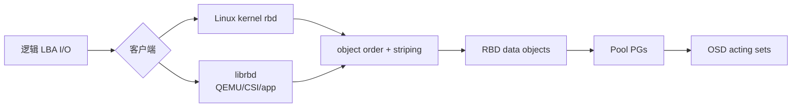
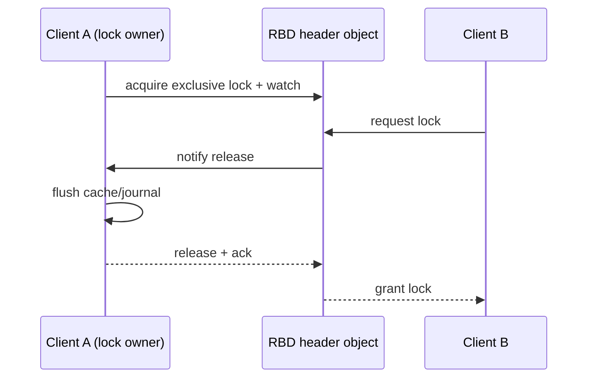
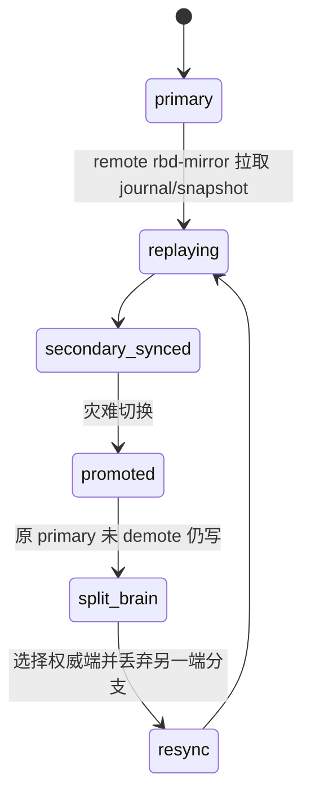
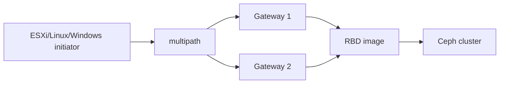
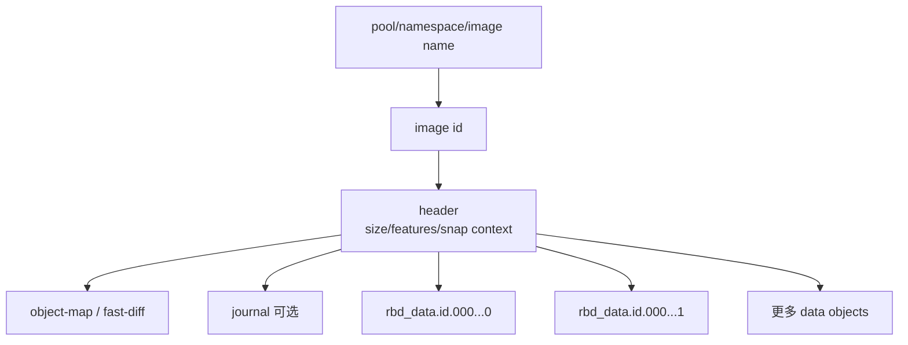
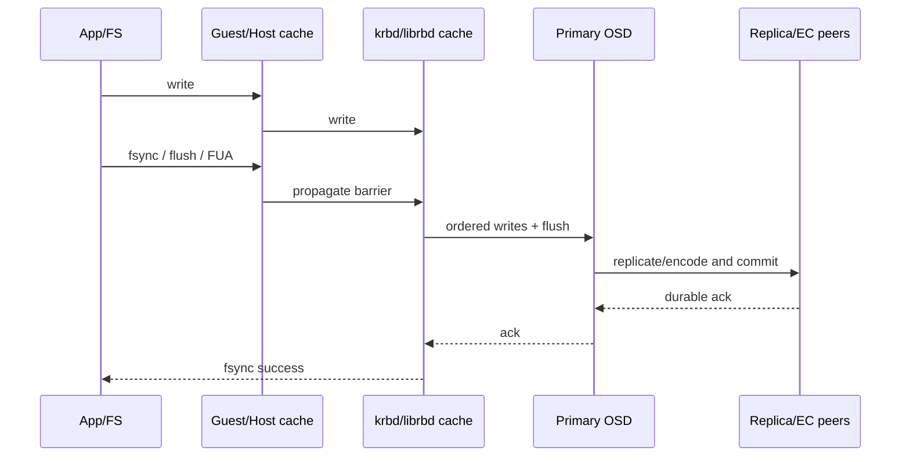
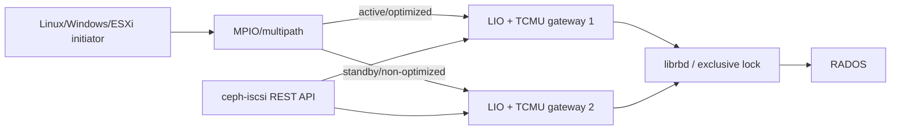

# RBD 块设备全解（Tentacle）

> RBD 把一个逻辑块设备 image 条带成 RADOS 对象。它的生产难点不是 `rbd create`，而是 feature 组合、客户端缓存、exclusive lock、snapshot/clone 依赖、加密、镜像复制和各接入层的故障语义。

## 1. 从客户块地址到 RADOS 对象



Image thin-provisioned：创建 size 只定义可寻址空间，未写区域不占等量 raw。默认对象大小由 object order 决定；format 2 才支持现代 features、snapshot/clone、namespace 等。Kernel client 可利用 Linux page cache；librbd 有自己的 cache 和功能演进节奏。

## 2. Pool、namespace 和 image 生命周期

```bash
ceph osd pool create rbd
rbd pool init rbd
rbd namespace create rbd/tenant-a
rbd create rbd/tenant-a/vol1 --size 100G --image-format 2
rbd info rbd/tenant-a/vol1
rbd du rbd/tenant-a/vol1
rbd trash mv rbd/tenant-a/vol1
rbd trash list rbd/tenant-a
```

Namespace 隔离 image 名和 caps scope，但共享 pool PG、容量和故障域。删除优先进入 trash 并设置 deferment，防止误删；`trash purge` 才清理到期 image。`rbd rm` 会受 snapshot、clone、watcher/lock 阻止。

扩容顺序：扩大 RBD image → 客户端重新发现容量 → 扩分区/LVM → 扩文件系统。缩容必须反向离线完成且确认文件系统支持；直接缩 image 会截断尾部数据。

## 3. Image features 是相互依赖的协议能力

| feature | 作用 | 依赖/边界 |
|---|---|---|
| layering | snapshot clone | clone 依赖 protected parent snapshot |
| exclusive-lock | 单一 librbd client 获得写锁 | 多写共享应用必须有自己的集群锁协议 |
| object-map | 记录哪些对象存在，加速操作 | 依赖 exclusive-lock；异常后可能 invalid，需 rebuild |
| fast-diff | 快速比较 snapshot/image changed objects | 依赖 object-map/exclusive-lock |
| deep-flatten | flatten 时解除 snapshot 层依赖 | 客户端必须支持 |
| journaling | 记录 image 更新供 journal mirroring | 依赖 exclusive-lock；增加写路径开销 |
| data-pool | metadata 与 data objects 分 pool | data pool 可 EC，但兼容性和 overwrite 要验证 |

启用 feature 前核对 krbd、QEMU、librbd、CSI/平台版本；老客户端看到未知 incompatible feature 会拒绝 map。在线 disable 也受 image 状态限制。

## 4. 映射和 I/O 缓存

```bash
rbd device map rbd/vol1 --id app
rbd device list
rbd status rbd/vol1
rbd device unmap /dev/rbd0
```

Krbd map 后是 Linux block device；librbd 被 QEMU、OpenStack、CSI 等进程内调用。Map 成功不等于文件系统可多主挂载。普通 ext4/xfs 不能由多主机同时读写；需要单写者 fencing 或真正 cluster filesystem。

Librbd cache 有 writeback/writethrough/writearound 等行为，`rbd_cache_writethrough_until_flush` 用来保护不会发 flush 的旧客户。QEMU/guest cache、host page cache、librbd cache 和 OSD cache 可能叠加；断电语义取决于 flush/FUA 是否完整传递。

Persistent Write Log cache 把未落远端的写日志放本地持久介质，Persistent Read-only cache 缓存读数据。前者故障恢复依赖 cache 文件与 image identity，不能把本地 cache 当成可随意删除的临时目录；后者只适合不可变/只读场景并需处理失效。

## 5. Exclusive lock、watcher 与故障转移

Librbd 客户端通过 RADOS watch/notify 竞争 exclusive lock。新客户端需要锁时通知旧 owner flush/cache release；旧客户端失联后可 break lock，但必须先 fence，防止恢复后双写。



`rbd status` 查看 watchers；`rbd lock list/remove` 属于低级手工锁，和 exclusive-lock 自动协议不要混用。Blocklist 旧 client 地址是故障转移的重要 fencing 手段。

## 6. Snapshot、clone、copy 和 flatten

Snapshot 是 image 时间点视图，不自动冻结 guest filesystem/数据库。应用一致性需要 guest agent、fsfreeze 或数据库 checkpoint；crash-consistent snapshot 只能保证块层时点。

```bash
rbd snap create rbd/base@s1
rbd snap protect rbd/base@s1
rbd clone rbd/base@s1 rbd/child
rbd flatten rbd/child
rbd snap rollback rbd/base@s1
```

Clone 初期只保存与 parent snapshot 的差异；读未覆盖对象回父层。Protect 防止依赖中的 parent snapshot 被删除。Flatten 复制所需父对象到 child，解除依赖但消耗 I/O/容量；deep-flatten 处理更深 snapshot 关系。Copy 直接产生独立完整 image。

Rollback 会逐对象恢复旧 snapshot，通常比从 snapshot clone 新 image 再切换慢，并会破坏当前数据；执行前停止写入。Snapshot purge 会删除全部无 clone 依赖快照，是破坏性动作。

## 7. 加密

RBD encryption 在客户端侧按 LUKS 格式加解密，OSD 看到的是密文；可对 image 和 clone layer 使用不同 passphrase。映射/打开时需要正确 format、key 和每层信息。它不加密 image metadata、大小、名称，也不替代 OSD device encryption。

密钥丢失即数据不可恢复；密钥不能存进 image 或同一未经保护的 Ceph pool。Snapshot/clone 保留加密布局，flatten/copy/migration 前核对客户端是否能解开所有 parent layers。

## 8. RBD mirroring

Mirroring 在两个独立 Ceph 集群复制 image，支持 journal-based 与 snapshot-based：

| 模式 | 变化来源 | 特点 |
|---|---|---|
| journal | image journaling 记录写顺序 | RPO 低，写路径有 journal 开销，依赖 exclusive-lock |
| snapshot | 周期 mirror snapshots/差异 | 无 journal 写路径开销，RPO 受 schedule/sync 影响 |



Pool/image mirroring、peer bootstrap token、方向（rx/tx/rx-tx）、site name、daemon placement 都需配置。验收 `rbd mirror pool/image status --verbose` 的 health、last update、entries behind，而不是只看 daemon running。

计划切换：停止源写 → 等待 replay caught up → demote 源 → promote 目标 → 接业务。强制 promote 用于源不可达，可能产生 split-brain；源恢复后必须 demote/resync，不能双端继续写。

## 9. Live migration、import/export 与 replay

Live migration 可在 RBD images/pools/集群或其他 source 间 prepare → execute → commit；prepare 建立 migration metadata，execute 复制数据并可保持业务，commit 解除 source。失败可 abort 回滚，但阶段不同的回滚语义不同。

`rbd export/import` 处理完整 image，`export-diff/import-diff` 传输 snapshot 差异；diff 链必须按顺序且 base snapshot 匹配。`rbd-replay` 根据 trace 回放 I/O 用于性能分析，不代表应用一致性。

## 10. QEMU、libvirt、OpenStack、Kubernetes 和 Nomad

QEMU 可通过 `rbd:` URL 或 libvirt secret 直接用 librbd，避免 host krbd；secret UUID、CephX caps、cache/discard、exclusive-lock 和 live migration 必须一致。Libvirt XML 中不应明文放 Ceph secret。

OpenStack 通常由 Cinder/Glance/Nova 使用各自 pool/user；clone-from-image 可利用 RBD layering，compute ephemeral、volume、image pool caps 不应共用 admin。CloudStack、OpenNebula、Nomad 也需要各自 driver 与版本兼容验证。

Kubernetes 使用 Ceph CSI，而不是旧 in-tree RBD。Controller provisioner 负责 create/delete/snapshot/clone，node plugin 负责 map/mount；StorageClass、Secret、clusterID、pool、imageFeatures、reclaimPolicy、volumeMode 和 filesystem 决定生命周期。RWO 不等于物理上绝不会双挂，节点 fencing 和 CSI stale attachment 必须测试。

## 11. iSCSI 与 NVMe-oF gateway

iSCSI gateway 把 RBD image 通过 LIO/TCMU 暴露给 initiator，支持 target、LUN、CHAP、multipath 和 gateway HA。NVMe-oF gateway 通过 subsystem、namespace、listener、host NQN 暴露 image，适合 NVMe/TCP 等协议。



Gateway HA 不改变 RBD 底层保护；必须分别验证 gateway 进程、路径故障、initiator timeout、锁/fencing、认证和 image latency。ESXi/Windows/Linux initiator 的 queue、multipath policy 和支持版本不同。

## 12. 性能、QoS 与观测

RBD config 可按 global、pool、image 设置 cache、read-ahead、concurrent management ops、QoS IOPS/BPS limit、object map、journal、mirror 等。QoS token bucket 可限制 read/write 或总 IOPS/BPS，并设置 burst；多个层同时限速时以最窄瓶颈为准。

观测至少包含 image/pool bytes、IOPS、throughput、平均与尾延迟、watcher/lock、snapshot/clone depth、object-map validity、trash、mirror lag、OSD slow ops 和 pool nearfull。Dashboard image monitoring 需要显式选择 image，不能假定每个 image 都自动产生细粒度指标。

## 13. 故障处理

| 现象 | 优先检查 |
|---|---|
| map/open 不支持 | client kernel/librbd 与 image feature |
| image busy | watchers、exclusive/manual lock、mapped devices、children |
| I/O hang | MON map、OSD PG、blocklist、lock owner、flush/cache |
| object-map invalid | 独占锁故障后 rebuild object-map/fast-diff |
| clone 无法删除 parent snap | children、protect 状态、flatten 进度 |
| mirror error/split-brain | peer、journal/snapshot、promotion history、resync direction |
| 使用量异常 | snapshot/clone shared objects、trash、`rbd du --merge-snapshots` |

先保存 `rbd info/status/snap ls/children`、mapping、client log、`ceph health detail` 和 PG 状态，再执行 lock remove、object-map rebuild、force promote 或 resync。所有 force 操作都可能选择错误写入分支。

## 14. Image 元数据、对象布局与基础操作闭环

Format 2 image 至少由 header、id、object map/fast-diff（启用时）、journal（启用时）和一组 data objects 构成。Image 名可改，稳定 identity 由 image id 保持；自动化不能把名称当永不变化的主键。Object order 是 `2^order` 字节，默认由 `rbd_default_order` 决定。Fancy striping 还用 stripe unit/count 改变连续 LBA 跨对象分布，老 kernel 只支持默认条带。



新 pool 必须先 `rbd pool init`，它会建立 RBD 所需应用标记和元数据。CephX 最小权限通常限定目标 pool/namespace，不能把 `client.admin` 下发给 hypervisor、CSI node 或 gateway。

```bash
ceph osd pool create volumes
rbd pool init volumes
ceph auth get-or-create client.rbd-app \
  mon 'profile rbd' \
  osd 'profile rbd pool=volumes namespace=tenant-a'

rbd ls volumes/tenant-a --long
rbd info volumes/tenant-a/disk01
rbd resize volumes/tenant-a/disk01 --size 200G
rbd rename volumes/tenant-a/disk01 volumes/tenant-a/disk02
```

直接减小 image 必须使用显式 shrink 确认，并先离线收缩文件系统、逻辑卷和分区；Ceph 不知道 image 尾部是不是业务数据。删除失败时依次检查 snapshot、clone child、watcher、lock、mapping 和 migration。Trash 让名称从正常列表消失但对象仍占空间；可按 deferment 恢复或过期 purge。容量核算必须把 snapshot、clone 共享对象和 trash 纳入。

## 15. 缓存、flush/FUA、discard 与 QoS

确认一次写“完成”必须沿整条栈判断：guest/application -> filesystem -> QEMU/kernel -> librbd/page cache -> RADOS primary -> replicas/EC shards。任意一层吞掉 flush/FUA，都可能让上层误以为已持久化。



Librbd cache 默认启用，支持 `writeback`、`writethrough`、`writearound`。`rbd_cache_writethrough_until_flush=true` 会先用安全的 writethrough，直到客户端第一次发 flush 后才相信其协议并进入 writeback。QEMU 的 cache mode 同时决定 host page cache 和 guest barrier 处理；不能只调 `rbd_cache` 就声称断电安全。

Read-ahead 只对顺序读有益，检测到足够随机或达到设定最大字节后停止；数据库随机 I/O 盲目放大会污染内存。Discard/TRIM 可释放 thin-provisioned 对象，但文件系统、guest、QEMU、librbd 和 pool 都必须传递 discard；大范围 discard 会产生管理 I/O，应在压测中验证。

QoS 是 librbd 客户端侧 token bucket，可分别限制总/读/写 IOPS 与 BPS，并配置 burst 和 burst seconds。它不是集群公平调度：一个 image 被多个 client 打开时，各 client 可能各自获得一份限额；需要租户级隔离时还应结合 pool/OSD mClock 和上层调度。

Persistent Write Log（PWL）有 `rwl`/`ssd` 等模式，启用后查看 cache status；维护前执行 flush，再按状态 invalidate。Persistent-on-write 初始模式确保日志条目先持久，满足条件后可切换优化模式。Cache path 必须在低延迟持久介质上并与 image identity 绑定，丢失含未回写数据的 cache 文件就是数据丢失。

Immutable object cache 为 clone 的只读 parent objects 提供共享本地缓存，需要显式启用 `ceph-immutable-object-cache` daemon。默认 socket 类似 `/var/run/ceph/immutable_object_cache_sock`、cache dir 类似 `/tmp/ceph_immutable_object_cache`、容量默认 1 GiB；生产必须改到受管持久目录并为 daemon 配置集群访问。它只缓存不会再变化的 parent object，不能给可写 head 提供一致性缓存。

## 16. Snapshot DAG、clone 管理与应用一致性

Snapshot/clone 形成有向无环图，不是简单目录层级。Child 读取自己未写对象时沿 parent snapshot 查找；多层 clone 会增加读放大和故障分析复杂度。Flatten 将所需 parent 数据复制到 child；deep-flatten 还解除 child 自身 snapshot 对更老 parent 的引用。

```mermaid
flowchart LR
  B[base image] --> S1[base@s1 protected]
  S1 --> C1[clone A]
  S1 --> C2[clone B]
  C1 --> S2[A@s2]
  S2 --> C3[clone C]
  C3 -->|flatten| I[independent C]
```

正确删除顺序是：查 children -> flatten 或删除 child -> unprotect snapshot -> remove snapshot。`snap purge` 不会越过仍有 child 的 protected snapshot。Snapshot rollback 对整个 image 逐对象恢复，期间必须停写；对于大 image，基于 snapshot clone 新卷并原子切换上层引用通常更容易控制回退。

CephX 用户执行 snapshot、clone、flatten 时除 head image 外还要能访问 parent 所在 pool/namespace。跨 pool clone、data-pool 和 encryption layer 会扩大所需权限，应该用精确 profile/caps 验证，不能用 admin 绕开权限设计。

应用一致性流程：阻止新事务 -> 数据库 checkpoint/flush -> filesystem freeze -> 创建 RBD snapshot -> thaw -> 恢复事务。虚拟机可通过 QEMU guest agent 协调。没有 guest 协调的 snapshot 只保证 crash consistency；多个 image 组成一个业务事务时需要 group snapshot 或上层编排，逐卷顺序 snapshot 不是同一时点。

## 17. 加密格式与密钥生命周期

RBD encryption 由 librbd 客户端处理，目前以 LUKS1/LUKS2 等支持格式封装。`encryption format` 初始化会写加密 header；`encryption load` 在打开 image 时加载 passphrase。格式化已有明文 image 会改变解释方式，操作前必须确认目标和备份。

Clone 可以让每一层使用不同 key：读取 child 未覆盖区域时 librbd 还需解开 parent layer，因此必须按从 child 到 parent 的顺序加载所有 encryption specs。Flatten 后仍应验证新独立 image 的加密 header 和可读性。Server 端只看到 ciphertext，但 image 名、大小、snapshot 关系、I/O pattern 和 RADOS metadata 不被该功能隐藏。

密钥轮换不能只替换 Secret 文件：先验证新旧 header slot/格式与所有消费者兼容，再滚动更新 QEMU/CSI/gateway；保留可审计的回退直到所有映射重新打开成功。内存中的 key、命令行参数、shell history、core dump 和日志都属于泄露面。

## 18. Mirroring 配置、状态与灾备切换

两个 peer cluster 对应 pool 通常必须同名；peer bootstrap token 同时建立 remote cluster、client 与方向，默认方向可为 `rx-tx`，也可显式限制。每个 `rbd-mirror` 实例必须同时访问本地和远端 MON/OSD 网络，且带宽足以追上峰值变化率。

Mirroring 有两层开关：pool default namespace 与每个非默认 namespace 独立配置；pool mode 会覆盖该 namespace 新旧 images，image mode 需要逐 image enable。Namespace 可映射到远端不同 namespace，但两端映射必须成对一致。关闭 pool/namespace mirroring 前先逐 image disable，避免残留状态。

Journal mode 是默认模式，要求 `exclusive-lock` + `journaling`；远端按有序 journal replay，RPO 可低但源写路径承担 journal 成本。Snapshot mode 周期创建 mirror-snapshot 并同步差异，默认最多保留有限数量（官方默认上限为每 image 5 个 mirror snapshots）；schedule 直接决定 RPO。

```bash
rbd mirror pool enable volumes image
rbd mirror pool peer bootstrap create volumes --site-name dc-a
rbd mirror pool peer bootstrap import volumes token --site-name dc-b
rbd mirror image enable volumes/vm-001 journal
rbd mirror image status volumes/vm-001
rbd mirror pool status volumes --verbose
```

状态至少区分 primary、non-primary、replaying、stopped、error、unknown、last update、entries behind。Daemon up 但 image replay error 不是健康。Data pool image 还必须确保目标端能选择对应 data pool，否则 metadata 到了而 data object 无法正确落位。

计划切换先停业务并 flush，确认 source primary 与 destination replay caught-up，demote source 后 promote destination。灾难中 `--force` promote 会从已复制边界继续服务，承认可能丢失最后一段写。原站恢复时若仍保留旧 primary 历史，会形成 split-brain；选择目标为权威，demote 旧端并 `resync`，该动作会丢弃旧端冲突分支，必须先留存证据。

## 19. Live migration 与导入导出状态机

同集群 live migration 默认在 prepare 阶段建立 target，并让后续客户端通过 target 访问 source backing；当前要求 prepare 前暂时停止所有使用 source 的客户端。Execute 在后台复制数据，业务可重新打开 target；commit 移除 source/backing 关系，abort 在 commit 前回到 source。

```mermaid
stateDiagram-v2
  [*] --> source
  source --> prepared: clients stop; migration prepare
  prepared --> executing: clients reopen target; execute
  executing --> executed: copy complete
  executed --> committed: commit 删除 source
  prepared --> aborted: abort 删除 target/恢复 source
  executing --> aborted: abort 回滚迁移关系
```



Import-only migration 不接管/删除 source，source 可来自 native RBD、raw、qcow、HTTP(S)、S3 或 NBD stream（支持项按格式描述 JSON 决定）。跨集群 source spec 必须成对提供 monitor/key 等字段；认证和网络要在每个执行 client 上可用。NBD 常用默认端口 10809，不应无认证暴露。

Migration 每个阶段都要检查 `rbd status/info` 和客户端引用。Commit 后 source 不再是回退点；需要保留旧数据时用 import-only 或先做独立备份。`export-diff` 依赖正确 `from-snap`，多个 diff 必须按生成顺序导入同一 base；缺一段或 base 不匹配不能拼出正确 image。

`rbd-replay` 根据 workload trace 重放 I/O，用于对比存储路径和参数，不会重建业务数据语义。Trace 可能含 offset、时序和 workload 特征，按生产数据处理。

## 20. Kernel、QEMU、libvirt 与 Windows

Krbd 的 `rbd device map/unmap/list` 由内核模块实现。Map 时可给 `--options` 控制 queue、read-only、lock 等；旧 kernel 对 image features 和 non-default striping 支持有限。强制 unmap 只解决本地设备引用，不会自动让 filesystem/应用完成 flush。

QEMU 直接使用 `rbd:pool/image:id=user:conf=...` 或 blockdev JSON，避免 host block mapping。Resize、info、discard/TRIM 和 cache mode 都能通过 QEMU 工具操作；生产配置优先用 libvirt `<disk type='network' protocol='rbd'>` 加 secret UUID，避免把 key 写入 domain XML。Live migration 两端必须有同名/等权 CephX secret、网络可达和兼容 librbd。

Windows `rbd-wnbd` service 通过 Windows Network Block Device 映射 image。Mapping 默认持久化并随服务重建；临时映射要显式 non-persistent。Windows 默认 SAN policy `offlineShared` 会让新共享磁盘 offline/read-only，作为 Hyper-V passthrough 前通常保持 offline，由宿主直接分区访问时才 online。

Windows 需要特别防范“盘号漂移”：Hyper-V 若按 disk number 引用，重启后枚举变化可能把 VM 接到错误盘；优先用稳定 location/path，启动前核对 image identity。CSV 支持、自动 mount、partition 操作和 Hyper-V address 都有版本限制。排障同时查看 Windows Event Log、service 状态、mapping list、Ceph health 和 watcher；不要只在磁盘管理器反复 online/offline。

## 21. OpenStack、Kubernetes、Nomad 与 CloudStack

OpenStack 常见三个职责域：Glance images、Cinder volumes/backups、Nova ephemeral/attach。分别创建 pool 和 CephX user，可让 Glance->Cinder clone 利用 copy-on-write；Glance 存储格式应使用 raw，外套 qcow2 会阻碍 Ceph clone/resize 能力并增加一层元数据。Libvirt secret UUID 只存引用，secret value 由部署系统安全分发。

Nova boot-from-volume 需要 compute 能访问 Cinder volume；Cinder backup 需要源/备份 pool caps；多 backend 还要明确 volume backend name。变更 `glance-api.conf`、`cinder.conf`、`nova.conf` 后按服务滚动重启并实测 create -> boot -> snapshot -> clone -> delete，不能只看配置加载。

Ceph CSI 的 controller plugin 执行 provision/delete/snapshot/clone/expand，node plugin 执行 stage/publish/map/mount。`ceph-csi-config` 中 clusterID 必须匹配 FSID/endpoint；provisioner、controller-expand、node-stage Secret 可使用不同最小权限。StorageClass 的 pool、namespace、imageFeatures、filesystem、mountOptions、reclaimPolicy、allowVolumeExpansion 和 volumeBindingMode 共同定义生命周期。

CSI 默认常走 krbd，若 image feature 超出 node kernel 能力会在 node stage 才失败。`ReadWriteOnce` 是调度访问模式，不是物理 fencing；节点失联时要验证 VolumeAttachment 清理、blocklist、exclusive-lock 和强制 detach，防止旧主机恢复双写。Raw block PVC 与 filesystem PVC 的格式化、扩容和 snapshot 语义不同。

Nomad 同样使用 CSI controller/node plugin，但 node task 需要允许相应 privileged/device 权限并预加载 `rbd` module。Job 引用 volume 前先注册 CSI volume，验证 plugin health 和 topology。CloudStack 通过 libvirt/QEMU 接 Ceph primary storage，pool 必须初始化并创建专用 user；其 disk offering、provider 和 hypervisor 组合存在限制，尤其不能假定所有 snapshot/clone 功能都等价于原生 RBD。

## 22. iSCSI gateway：会话、ALUA、multipath 与监控

Ceph iSCSI 由 `ceph-iscsi`、LIO、TCMU runner、rtslib/configshell 和 gateway API 组成。每个 gateway 以 librbd 打开 image，向 initiator 暴露 IQN/LUN；多 gateway 通过 ALUA 与 initiator multipath 提供路径冗余。它不是把同一普通文件系统安全地多主挂载，写共享仍由上层集群文件系统/应用协议负责。



部署前核对支持的 OS/kernel、target packages、时间、网络、Ceph version 和每 gateway 可映射 image 数；gateway 不应与 OSD 争抢 I/O/内存。生产至少双路径，initiator 到不同交换网络；CHAP/ACL 限定 initiator。Linux 配置 open-iscsi + device-mapper-multipath，Windows 配 MPIO，ESXi 配 software iSCSI 与 path policy，各端 timeout 必须覆盖 gateway failover 但不能把真实存储故障隐藏数分钟。

`gwcli`/API 修改 target、gateway、host、disk 和 LUN 后验证配置在所有 gateway 一致。手工安装要求所有组件版本兼容；Ansible 变量中的 API user/password、port（常见 5000）、trusted IP 和 keyring 都是安全配置，不能沿用示例默认凭据。

监控至少包括 gateway API、TCMU runner、LIO sessions、每条路径状态、RBD watcher/lock、image latency 和 Ceph health。单路径恢复不代表 HA 通过，必须实测 active path 中断、I/O 连续性、恢复后 path rejoin，以及 initiator 不发生重复设备/文件系统损坏。

## 23. NVMe-oF gateway：subsystem、namespace 与 HA group

NVMe-oF gateway 把 RBD image 映射为 NVMe namespace。控制对象依次是 gateway group、subsystem NQN、namespace、listener（gateway IP/port）和允许连接的 host NQN；initiator 先 discovery 再 connect。NVMe/TCP HA 默认启用，至少两个 gateway，并且每个 subsystem 在每个 gateway 上都有 listener；主机应有两块网卡和冗余交换网络。

```bash
# 示意：实际命令以部署的 nvmeof CLI 版本为准
nvme discover -t tcp -a 10.0.20.11 -s 4420
nvme connect-all -t tcp -a 10.0.20.11 -s 4420
nvme list-subsys
```

Scale-out 把 namespace I/O 分配到同 group 多 gateway，HA 在 gateway 失联后接管。两者都依赖正确的 discovery、ANA/path state 与 RBD fencing。Gateway host 需要满足官方 OS/container、CPU/内存、网络和 Ceph client 要求；配置工具与 gateway image 必须同版本。ESXi 和 Linux initiator 的 NVMe/TCP 支持、NQN ACL、multipath/ANA 行为不同，应分别验收。

失败注入至少覆盖：单 listener 网络中断、单 gateway 容器退出、gateway host 失联、Ceph MON/OSD 短时异常和路径恢复。观察业务 tail latency 与写一致性；只看到第二条路径存在不足以证明接管完成。

## 24. Librbd API 与自动化错误模型

Python `rbd` binding 在已连接的 `rados.Rados`/`ioctx` 上管理 image。典型生命周期是创建 ioctx -> `RBD().create()` -> `Image()` context -> read/write/flush/snapshot -> close -> ioctx close -> cluster shutdown。Context manager 能确保异常时释放 watcher/lock。

```python
import rados
import rbd

with rados.Rados(conffile="/etc/ceph/ceph.conf", name="client.app") as cluster:
    with cluster.open_ioctx("volumes") as ioctx:
        ioctx.set_namespace("tenant-a")
        with rbd.Image(ioctx, "disk01") as image:
            image.write(b"header", 0)
            image.flush()
```

自动化必须区分 `ImageNotFound`、`ImageExists`、`ImageBusy`、`InvalidArgument`、权限和通用 I/O 错误；重试只适用于确认幂等的阶段。Create 后网络超时不能直接再 create，先按 image id/name查询；remove 超时先检查 trash/metadata；migration、mirror promote 和 lock break 都有状态机，不能把非零返回统一重试。

验收 API 与 CLI 看到的 size、features、snapshots、watchers 和 namespace 一致，并在进程崩溃后确认 lock 可恢复。应用不得直接写 RBD header/data object，所有格式演进、object-map 和 snapshot context 必须由 librbd 维护。

## 25. 官方基线与许可

来源：Ceph Tentacle 官方 `doc/rbd/`，核验提交 `76fba24cef67d9219f97eeaa68cd1a848da3f2b2`。Ceph authors and contributors，CC BY-SA 3.0。
