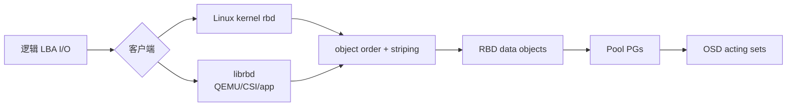
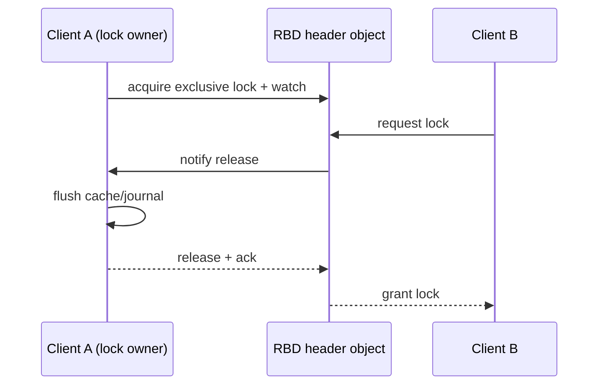
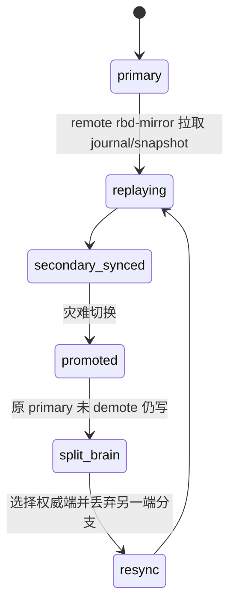
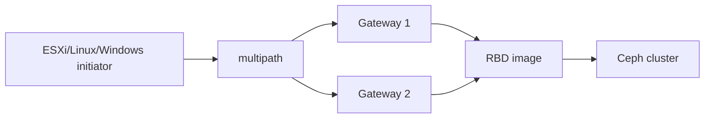
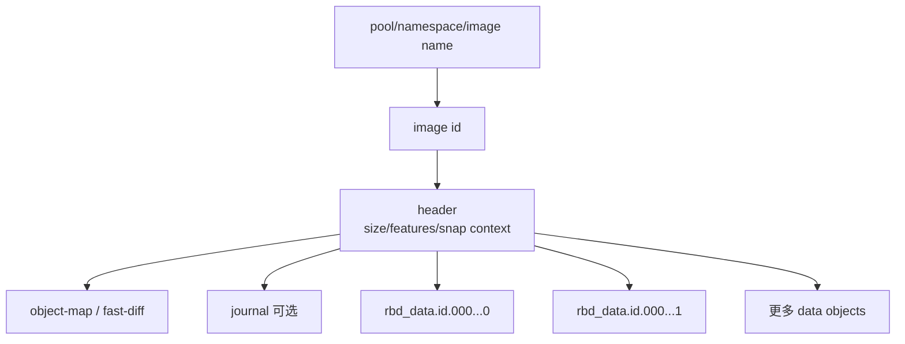
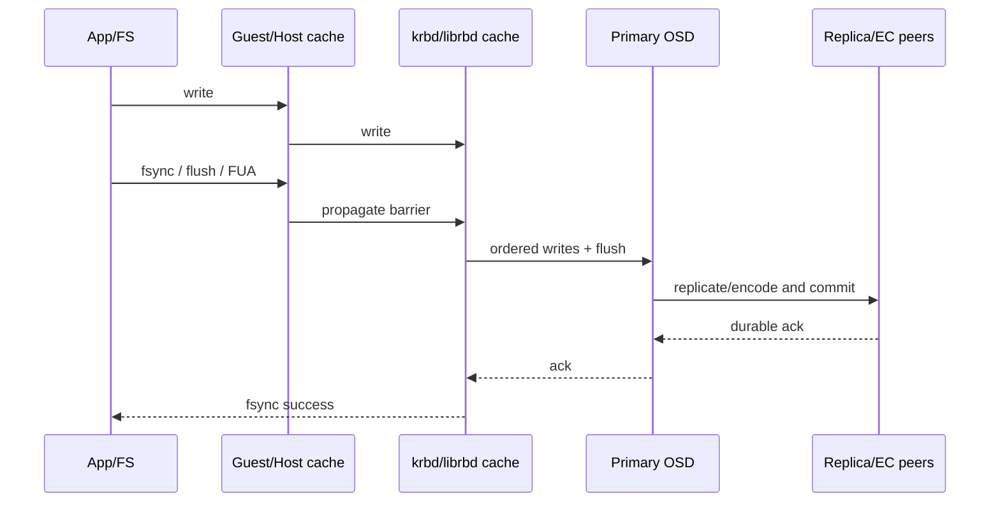
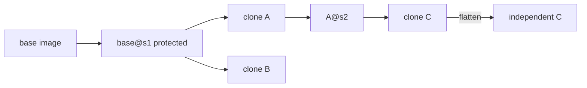
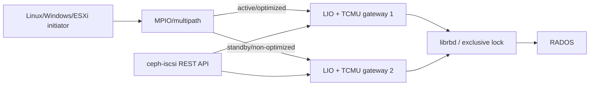

# RBD 块设备全解（Tentacle）

> RBD 把一个逻辑块设备 image 条带成 RADOS 对象。它的生产难点不是 `rbd create`，而是 feature 组合、客户端缓存、exclusive lock、snapshot/clone 依赖、加密、镜像复制和各接入层的故障语义。

## 1. 从客户块地址到 RADOS 对象



Image thin-provisioned：创建 size 只定义可寻址空间，未写区域不占等量 raw。默认对象大小由 object order 决定；format 2 才支持现代 features、snapshot/clone、namespace 等。Kernel client 可利用 Linux page cache；librbd 有自己的 cache 和功能演进节奏。

## 2. Pool、namespace 和 image 生命周期

```bash
ceph osd pool create rbd
rbd pool init rbd
rbd namespace create rbd/tenant-a
rbd create rbd/tenant-a/vol1 --size 100G --image-format 2
rbd info rbd/tenant-a/vol1
rbd du rbd/tenant-a/vol1
rbd trash mv rbd/tenant-a/vol1
rbd trash list rbd/tenant-a
```

Namespace 隔离 image 名和 caps scope，但共享 pool PG、容量和故障域。生产删除优先进入 trash 并设置 deferment，防止误删；有 snapshot/clone 的 image 也可以先移入 trash，但在 deferment 到期前不能真正释放。可以用 `--expires-at` 写入明确的到期时间；`rbd trash rm <pool>/<image-id>` 在 deferment 未到时会拒绝，只有确认数据已备份且明确使用 `--force` 才能绕过。`rbd trash restore <pool>/<image-id> [--image <new-name>]` 可按稳定 image ID 恢复，名称不是稳定身份。`rbd trash purge` 只清理到期条目。`rbd rm` 则会受 snapshot、clone、watcher/lock 阻止。

扩容顺序：扩大 RBD image → 客户端重新发现容量 → 扩分区/LVM → 扩文件系统。缩容必须反向离线完成且确认文件系统支持；直接缩 image 会截断尾部数据。

```bash
# 仅在文件系统、LVM/分区已经离线收缩并完成校验后执行
rbd resize rbd/tenant-a/vol1 --size 80G --allow-shrink

# 误删恢复：先按 ID 记录现场，再决定是否改名恢复
rbd trash list rbd/tenant-a --all
rbd trash restore rbd/tenant-a/<image-id> --image vol1-recovered
```

## 3. Image features 是相互依赖的协议能力

| feature | 作用 | 依赖/边界 |
|---|---|---|
| layering | snapshot clone | clone 依赖 protected parent snapshot |
| exclusive-lock | 单一 librbd client 获得写锁 | 多写共享应用必须有自己的集群锁协议 |
| object-map | 记录哪些对象存在，加速操作 | 依赖 exclusive-lock；异常后可能 invalid，需 rebuild |
| fast-diff | 快速比较 snapshot/image changed objects | 依赖 object-map/exclusive-lock |
| deep-flatten | flatten 时解除 snapshot 层依赖 | 客户端必须支持 |
| journaling | 记录 image 更新供 journal mirroring | 依赖 exclusive-lock；增加写路径开销 |
| data-pool | metadata 与 data objects 分 pool | data pool 可 EC，但兼容性和 overwrite 要验证 |

启用 feature 前核对 krbd、QEMU、librbd、CSI/平台版本；老客户端看到未知 incompatible feature 会拒绝 map。在线 disable 也受 image 状态限制。

## 4. 映射和 I/O 缓存

```bash
rbd device map rbd/vol1 --id app
rbd device list
rbd status rbd/vol1
rbd device unmap /dev/rbd0
```

Krbd map 后是 Linux block device；librbd 被 QEMU、OpenStack、CSI 等进程内调用。Map 成功不等于文件系统可多主挂载。普通 ext4/xfs 不能由多主机同时读写；需要单写者 fencing 或真正 cluster filesystem。

Librbd cache 有 writeback/writethrough/writearound 等行为：write-around 和 write-back 在未超过 `rbd_cache_max_dirty` 时可先返回，write-around 不从 cache 服务读请求；write-through 只有数据到达所有副本后才返回但仍可从 cache 读。`rbd_cache_writethrough_until_flush` 用来保护不会发 flush 的旧客户。QEMU/guest cache、host page cache、librbd cache 和 OSD cache 可能叠加；断电语义取决于 flush/FUA 是否完整传递。cache 是每个 client、每个 image 的本地状态，GFS/OCFS 不能借此获得跨主机一致性。

Persistent Write Log cache 把未落远端的写日志放本地持久介质，Persistent Read-only cache 缓存读数据。前者故障恢复依赖 cache 文件与 image identity，不能把本地 cache 当成可随意删除的临时目录；后者只适合不可变/只读场景并需处理失效。

## 5. Exclusive lock、watcher 与故障转移

新建 image 默认启用 `exclusive-lock`，但 `rbd_default_features`、`rbd create --image-feature/--image-shared` 可以覆盖默认值。Librbd/krbd 客户端通过 RADOS watch/notify 竞争锁；新客户端需要锁时通知旧 owner 停止写、flush cache/journal 并释放，正常退出也会释放。默认模式允许多个客户端同时打开 image 并交替写，锁会 cooperative transition；它不是“只允许一个客户端打开”的硬门禁。需要单客户端模式时，使用 `rbd device map --options exclusive`（或等价 `--exclusive`）禁止自动 lock transition，并配合主机/应用 fencing。旧客户端失联后，接管方会在 break lock 的同时请求 OSD blocklist；这要求 CephX 具有 `osd blocklist` 能力（通常由 `profile rbd` 提供）。这只是存储层 fencing，仍必须确认主机、VM 或应用不会在网络恢复后继续写。关闭 exclusive-lock 会破坏多数 librbd 的自动转移与 journal/object-map/fast-diff 依赖，不能拿它和 `rbd lock add/remove` 的 advisory lock 混用。



`rbd status` 查看 watchers；`rbd lock list/remove` 属于低级手工锁，和 exclusive-lock 自动协议不要混用。Blocklist 旧 client 地址是故障转移的重要 fencing 手段。

## 6. Snapshot、clone、copy 和 flatten

Snapshot 是 image 在某一时刻的只读逻辑副本/检查点，不自动冻结 guest filesystem/数据库，默认只保证 crash-consistent。应用一致性需要停止写入、`fsfreeze` 或数据库 checkpoint；虚拟机可用 `qemu-guest-agent` 自动 freeze/thaw。未 quiesce 的文件系统快照重新挂载前可能需要 `fsck`。启用 CephX 时每条 `rbd` 命令都要通过 `--id/--name` 和 keyring 提供凭据，不能把下面示例中的身份当作生产密钥。

```bash
rbd snap create rbd/base@s1
rbd snap ls rbd/base
rbd snap protect rbd/base@s1
rbd clone rbd/base@s1 rbd/child
rbd children rbd/base@s1
rbd flatten rbd/child
rbd snap rollback rbd/base@s1
rbd snap unprotect rbd/base@s1   # 仅在 children 已删除/flatten 后
rbd snap rm rbd/base@s1
# rbd snap purge rbd/base       # 破坏性删除该 image 的全部可删 snapshots
```

只支持 RBD format 2 的 snapshot clone。Clone 初期只保存与 parent snapshot 的差异；读未覆盖对象回父层。Parent 引用包含 pool ID、image ID 和 snapshot ID，因此 clone 可以跨 pool；这适合模板池、只读模板和跨 pool recovery/migration。Protect 防止依赖中的 parent snapshot 被删除，`rbd children` 用于确认依赖者。Flatten 复制所需父对象到 child，解除依赖但消耗 I/O/容量，耗时随未覆盖对象量增长；deep-flatten 处理更深 snapshot 关系。Copy 直接产生独立完整 image。

删除 snapshot 后 OSD 不会立即释放底层对象，异步 `snaptrim` 会在 `ceph status` 中持续一段时间；容量告警处理必须把 snaptrim backlog、clone 共享对象和 trash 一起纳入。Protected snapshot、仍有 children 的 snapshot 不能直接删除。

Rollback 会逐对象恢复旧 snapshot，通常比从 snapshot clone 新 image 再切换慢，并会破坏当前数据；执行前停止写入。Snapshot purge 会删除全部无 clone 依赖快照，是破坏性动作。

## 7. 加密

RBD 内置 image-level encryption 由 librbd 客户端按 LUKS1/LUKS2 加解密，`krbd` 当前不支持；OSD 看到的是密文。当前算法是 AES-128/AES-256，模式为 `xts-plain64`，仅 Linux 支持。可对 image 和 clone layer 使用不同 passphrase。映射/打开时必须先 `encryption load`，并按 child 到 parent 的顺序提供每个显式加密 ancestor 的 format/passphrase；仅执行 `encryption format` 不会自动把普通 RBD API 变成加密 IO，未 load 的上下文仍可按 raw image 读写，可能覆盖 LUKS header。

LUKS header 占用 image 开头空间，`rbd info` 的 raw size 与 load 后 API 看到的 effective size 不同；创建目标有效容量时应按官方流程在 format 后用带 passphrase 的 `rbd resize` 补偿 header，缩容必须显式 `--allow-shrink`。小于 LUKS sector 或未按 sector 对齐的写会触发客户端 read-modify-write，造成明显延迟和竞态风险。启用 `journaling` 的 image 不能由 RBD client format/encrypt。`rbd-nbd` 可以用 `encryption-passphrase-file` 自动 load；这不改变密钥不保存于 image、丢失 passphrase 即不可恢复的事实。

```bash
rbd create --size 50G volumes/secure
rbd encryption format volumes/secure luks2 /run/keys/secure.pass
# header 会减少 effective size；按目标 effective size 补偿
rbd resize --size 50G --encryption-passphrase-file /run/keys/secure.pass volumes/secure
# rbd-nbd 才能在 librbd 路径上自动 load；krbd map 不支持该功能
rbd device map -t nbd -o encryption-passphrase-file=/run/keys/secure.pass volumes/secure
```

密钥丢失即数据不可恢复；密钥不能存进 image 或同一未经保护的 Ceph pool。Snapshot/clone 保留加密布局，flatten/copy/migration 前核对客户端是否能解开所有 parent layers。

## 8. RBD mirroring

Mirroring 在两个独立 Ceph 集群复制 image，支持 journal-based 与 snapshot-based：

| 模式 | 变化来源 | 特点 |
|---|---|---|
| journal | image journaling 记录写顺序 | RPO 低，写路径有 journal 开销，依赖 exclusive-lock |
| snapshot | 周期 mirror snapshots/差异 | 无 journal 写路径开销，RPO 受 schedule/sync 影响 |



Pool/image mirroring、peer bootstrap token、方向（rx/tx/rx-tx）、site name、daemon placement 都需配置。验收 `rbd mirror pool/image status --verbose` 的 health、last update、entries behind，而不是只看 daemon running。

计划切换：停止源写 → 等待 replay caught up → demote 源 → promote 目标 → 接业务。强制 promote 用于源不可达，可能产生 split-brain；源恢复后必须 demote/resync，不能双端继续写。

## 9. Live migration、import/export 与 replay

Live migration 可在 RBD images/pools/集群或其他 source 间 prepare → execute → commit；prepare 建立 migration metadata，execute 复制数据并可保持业务，commit 解除 source。失败可 abort 回滚，但阶段不同的回滚语义不同。

`rbd export/import` 处理完整 image，`export-diff/import-diff` 传输 snapshot 差异；diff 链必须按顺序且 base snapshot 匹配。`rbd-replay` 根据 trace 回放 I/O 用于性能分析，不代表应用一致性。

## 10. QEMU、libvirt、OpenStack、Kubernetes 和 Nomad

QEMU 可通过 `rbd:` URL 或 libvirt secret 直接用 librbd，避免 host krbd；secret UUID、CephX caps、cache/discard、exclusive-lock 和 live migration 必须一致。Libvirt XML 中不应明文放 Ceph secret。

OpenStack 通常由 Cinder/Glance/Nova 使用各自 pool/user；clone-from-image 可利用 RBD layering，compute ephemeral、volume、image pool caps 不应共用 admin。CloudStack、OpenNebula、Nomad 也需要各自 driver 与版本兼容验证。

Kubernetes 使用 Ceph CSI，而不是旧 in-tree RBD。Controller provisioner 负责 create/delete/snapshot/clone，node plugin 负责 map/mount；StorageClass、Secret、clusterID、pool、imageFeatures、reclaimPolicy、volumeMode 和 filesystem 决定生命周期。RWO 不等于物理上绝不会双挂，节点 fencing 和 CSI stale attachment 必须测试。

## 11. iSCSI 与 NVMe-oF gateway

iSCSI gateway 把 RBD image 通过 LIO/TCMU 暴露给 initiator，支持 target、LUN、CHAP、multipath 和 gateway HA。NVMe-oF gateway 通过 subsystem、namespace、listener、host NQN 暴露 image，适合 NVMe/TCP 等协议。



Gateway HA 不改变 RBD 底层保护；必须分别验证 gateway 进程、路径故障、initiator timeout、锁/fencing、认证和 image latency。ESXi/Windows/Linux initiator 的 queue、multipath policy 和支持版本不同。

## 12. 性能、QoS 与观测

RBD config 可按 global、pool、image 设置 cache、read-ahead、concurrent management ops、QoS IOPS/BPS limit、object map、journal、mirror 等。QoS token bucket 可限制 read/write 或总 IOPS/BPS，并设置 burst；多个层同时限速时以最窄瓶颈为准。

观测至少包含 image/pool bytes、IOPS、throughput、平均与尾延迟、watcher/lock、snapshot/clone depth、object-map validity、trash、mirror lag、OSD slow ops 和 pool nearfull。Dashboard image monitoring 需要显式选择 image，不能假定每个 image 都自动产生细粒度指标。

## 13. 故障处理

| 现象 | 优先检查 |
|---|---|
| map/open 不支持 | client kernel/librbd 与 image feature |
| image busy | watchers、exclusive/manual lock、mapped devices、children |
| I/O hang | MON map、OSD PG、blocklist、lock owner、flush/cache |
| object-map invalid | 独占锁故障后 rebuild object-map/fast-diff |
| clone 无法删除 parent snap | children、protect 状态、flatten 进度 |
| mirror error/split-brain | peer、journal/snapshot、promotion history、resync direction |
| 使用量异常 | snapshot/clone shared objects、trash、`rbd du --merge-snapshots` |

先保存 `rbd info/status/snap ls/children`、mapping、client log、`ceph health detail` 和 PG 状态，再执行 lock remove、object-map rebuild、force promote 或 resync。所有 force 操作都可能选择错误写入分支。

## 14. Image 元数据、对象布局与基础操作闭环

Format 2 image 至少由 header、id、object map/fast-diff（启用时）、journal（启用时）和一组 data objects 构成。Image 名可改，稳定 identity 由 image id 保持；自动化不能把名称当永不变化的主键。Object order 是 `2^order` 字节，默认由 `rbd_default_order` 决定。Fancy striping 还用 stripe unit/count 改变连续 LBA 跨对象分布，老 kernel 只支持默认条带。



新 pool 必须先 `rbd pool init`，它会建立 RBD 所需应用标记和元数据。CephX 最小权限通常限定目标 pool/namespace，不能把 `client.admin` 下发给 hypervisor、CSI node 或 gateway。

```bash
ceph osd pool create volumes
rbd pool init volumes
ceph auth get-or-create client.rbd-app \
  mon 'profile rbd' \
  osd 'profile rbd pool=volumes namespace=tenant-a' \
  mgr 'profile rbd pool=volumes namespace=tenant-a'

rbd ls volumes/tenant-a --long
rbd info volumes/tenant-a/disk01
rbd resize volumes/tenant-a/disk01 --size 200G
rbd rename volumes/tenant-a/disk01 volumes/tenant-a/disk02
```

直接减小 image 必须使用显式 shrink 确认，并先离线收缩文件系统、逻辑卷和分区；Ceph 不知道 image 尾部是不是业务数据。删除失败时依次检查 snapshot、clone child、watcher、lock、mapping 和 migration。Trash 让名称从正常列表消失但对象仍占空间；可按 deferment 恢复或过期 purge。容量核算必须把 snapshot、clone 共享对象和 trash 纳入。

## 15. 缓存、flush/FUA、discard 与 QoS

确认一次写“完成”必须沿整条栈判断：guest/application -> filesystem -> QEMU/kernel -> librbd/page cache -> RADOS primary -> replicas/EC shards。任意一层吞掉 flush/FUA，都可能让上层误以为已持久化。



Librbd cache 默认启用，支持 `writeback`、`writethrough`、`writearound`。`rbd_cache_writethrough_until_flush=true` 会先用安全的 writethrough，直到客户端第一次发 flush 后才相信其协议并进入 writeback。QEMU 的 cache mode 同时决定 host page cache 和 guest barrier 处理；不能只调 `rbd_cache` 就声称断电安全。

Read-ahead 只对顺序读有益，检测到足够随机或达到设定最大字节后停止；数据库随机 I/O 盲目放大会污染内存。Discard/TRIM 可释放 thin-provisioned 对象，但文件系统、guest、QEMU、librbd 和 pool 都必须传递 discard；大范围 discard 会产生管理 I/O，应在压测中验证。

QoS 是 librbd 客户端侧 token bucket，可分别限制总/读/写 IOPS 与 BPS，并配置 burst 和 burst seconds。它不是集群公平调度：一个 image 被多个 client 打开时，各 client 可能各自获得一份限额；需要租户级隔离时还应结合 pool/OSD mClock 和上层调度。

生产配置评审至少保留以下参数矩阵（global/pool/image 的实际生效值以 `ceph config get`、`rbd config image get` 为准）：

| 类别 | 关键参数 | 客户决策边界 |
|---|---|---|
| cache | `rbd_cache`、`rbd_cache_policy`、`rbd_cache_size`、`rbd_cache_max_dirty`、`rbd_cache_target_dirty`、`rbd_cache_max_dirty_age` | cache 是每个 client、每个 image 的本地缓存；GFS/OCFS 不能依赖它获得跨主机一致性；writeback 必须有可靠 flush/FUA |
| compatibility | `rbd_default_features`、`rbd_default_order`、`rbd_default_clone_format` | 默认 feature 必须落在最老 krbd/QEMU/CSI kernel 的交集；format 2 才支持现代 clone/snapshot 能力 |
| compression/read | `rbd_compression_hint`、`rbd_read_from_replica_policy`、read-ahead | 顺序小读可受益；随机数据库 workload 应禁用或压低 read-ahead，并验证 replica read 的一致性与尾延迟 |
| QoS IOPS | `rbd_qos_iops_limit`、`rbd_qos_read_iops_limit`、`rbd_qos_write_iops_limit` 及对应 `*_burst`、`*_burst_seconds` | 这是 client-side 限速，不是租户全局公平；多个 client 会各自获得 token bucket |
| QoS BPS | `rbd_qos_bps_limit`、`rbd_qos_read_bps_limit`、`rbd_qos_write_bps_limit` 及对应 burst 参数 | 同时设置 IOPS/BPS 时取更窄瓶颈；`rbd_qos_schedule_tick_min` 影响调度粒度 |
| QoS exceptions | `rbd_qos_exclude_ops` | 明确哪些管理/控制操作不应被业务限速，并在压测中验证不会绕过容量保护 |

对象布局还受 `order`、stripe unit/count、data-pool 和 EC profile 影响；既有 image 的 striping/EC 不能靠原地改参数重写。启用 `object-map`、`fast-diff`、`journaling` 前必须确认 `exclusive-lock` 与客户端支持矩阵；`object-map` 异常时先停写并 rebuild，再恢复依赖它的 fast-diff 操作。

Persistent Write Log（PWL）默认关闭，启用时必须同时设置 `rbd_persistent_cache_mode=rwl|ssd` 和 `rbd_plugins=pwl_cache`；`rwl` 依赖 PMDK/libpmem 与 DAX，s390x 不支持，SSD 模式不要求 DAX。PWL 依赖 `exclusive-lock`，只有取得锁后才加载。默认先处于 persistent-on-write：写入在 cache device 持久化后才完成；第一次收到 flush 后切到 persistent-on-flush，后续写完成不再保证崩溃后可读，flush 才触发持久化。用 `rbd status` 检查 present/clean/dirty/path/metrics；异常退出可用 `rbd persistent-cache flush`，确认远端已接收后才用 `rbd persistent-cache invalidate`，后者会删除本地 cache 文件并关闭该 image 的 cache。Cache path 必须在低延迟持久介质上、按 image identity 隔离；丢失含未回写数据的 cache 文件会回退到一致但陈旧的数据，不能宣称无损。

Immutable object cache 为 clone 的只读 parent objects 提供共享本地缓存，需要在 `[client]` 开启 `rbd parent cache enabled=true`、`rbd plugins=parent_cache`，并运行 `ceph-immutable-object-cache` daemon。默认 socket 为 `/var/run/ceph/immutable_object_cache_sock`、cache dir 为 `/tmp/ceph_immutable_object_cache`、容量为 1 GiB；生产必须改到受管 SSD 目录、配置 watermark/容量，并使用独立 CephX 用户（`mon allow r`、`osd profile rbd-read-only`）启动 systemd 实例。它只缓存不会再变化的 parent object，不能给可写 head 提供一致性缓存；cache 丢失或失效时只能回源 RADOS，不能把本地文件当作备份。

## 16. Snapshot DAG、clone 管理与应用一致性

Snapshot/clone 形成有向无环图，不是简单目录层级。Child 读取自己未写对象时沿 parent snapshot 查找；多层 clone 会增加读放大和故障分析复杂度。Flatten 将所需 parent 数据复制到 child；deep-flatten 还解除 child 自身 snapshot 对更老 parent 的引用。



正确删除顺序是：查 children -> flatten 或删除 child -> unprotect snapshot -> remove snapshot。`snap purge` 不会越过仍有 child 的 protected snapshot。Snapshot rollback 对整个 image 逐对象恢复，期间必须停写；对于大 image，基于 snapshot clone 新卷并原子切换上层引用通常更容易控制回退。

CephX 用户执行 snapshot、clone、flatten 时除 head image 外还要能访问 parent 所在 pool/namespace。跨 pool clone、data-pool 和 encryption layer 会扩大所需权限，应该用精确 profile/caps 验证，不能用 admin 绕开权限设计。

应用一致性流程：阻止新事务 -> 数据库 checkpoint/flush -> filesystem freeze -> 创建 RBD snapshot -> thaw -> 恢复事务。虚拟机可通过 QEMU guest agent 协调。没有 guest 协调的 snapshot 只保证 crash consistency；多个 image 组成一个业务事务时需要 group snapshot 或上层编排，逐卷顺序 snapshot 不是同一时点。

## 17. 加密格式与密钥生命周期

RBD encryption 由 librbd 客户端处理，目前以 LUKS1/LUKS2 等支持格式封装。`encryption format` 初始化会写加密 header；`encryption load` 在打开 image 时加载 passphrase。格式化已有明文 image 会改变解释方式，操作前必须确认目标和备份。

`format` 本身不会改变所有 RBD API 的解释方式；未执行 `encryption load` 的打开上下文仍可按 raw image 读写，可能覆盖 header。`krbd` 不支持该功能，启用 `journaling` 的 image 不能由 RBD client format/encrypt；使用 `rbd-nbd` 时可通过 `encryption-passphrase-file` 自动 load。LUKS header 会减少 effective size，非 sector-aligned 写会触发 read-modify-write。

Clone 可以让每一层使用不同 key：读取 child 未覆盖区域时 librbd 还需解开 parent layer，因此必须按从 child 到 parent 的顺序加载所有 encryption specs。Flatten 后仍应验证新独立 image 的加密 header 和可读性。Server 端只看到 ciphertext，但 image 名、大小、snapshot 关系、I/O pattern 和 RADOS metadata 不被该功能隐藏。

密钥轮换不能只替换 Secret 文件：先验证新旧 header slot/格式与所有消费者兼容，再滚动更新 QEMU/CSI/gateway；保留可审计的回退直到所有映射重新打开成功。内存中的 key、命令行参数、shell history、core dump 和日志都属于泄露面。

## 18. Mirroring 配置、状态与灾备切换

两个 peer cluster 对应 pool 通常必须同名；peer bootstrap token 同时建立 remote cluster、client 与方向。导入 token 时方向明确为 `rx-only`（单向）或 `rx-tx`（双向）；每个 `rbd-mirror` 实例必须同时访问本地和远端 MON/OSD 网络，且带宽足以追上峰值变化率。token 是凭据，必须通过受保护的 stdin/临时文件传递并在导入后销毁。

Mirroring 有两层开关：pool default namespace 与每个非默认 namespace 独立配置；pool mode 会镜像 default namespace 中启用 journaling 的 image，image mode 需要逐 image enable，`init-only` 则不镜像 default namespace、仅用于准备 namespace 映射。Namespace 可映射到远端不同 namespace，但两端映射必须成对一致；远端映射到 default namespace 时使用空字符串。关闭 pool/namespace mirroring 前先逐 image disable，避免残留状态。

`image`、`pool`、`init-only` 是 pool/namespace 的配置模式，不应与 image 的 `journal`、`snapshot` 复制模式混淆。`primary/non-primary` 是每个 image 的属性：启用 image mirroring 时 image 成为 primary，non-primary image 不能写。Journal mode 要求 `exclusive-lock` + `journaling`；远端按有序 journal replay，RPO 可低但源写路径承担 journal 成本。Snapshot mode 周期创建 mirror-snapshot 并同步差异，默认最多保留有限数量（官方默认上限为每 image 5 个 mirror snapshots）；schedule 可在 global、pool、image 级配置，只有最具体层级生效，RPO 由 schedule 决定；failover 前必须等完整 delta 同步，部分 delta 会在切换时 rollback。

```bash
rbd mirror pool enable volumes image
rbd mirror pool peer bootstrap create volumes --site-name dc-a
rbd mirror pool peer bootstrap import --direction rx-tx volumes token --site-name dc-b
rbd mirror pool peer add volumes client.rbd-mirror-peer@<remote-cluster-name> \
  --remote-mon-host <remote-mon-1>,<remote-mon-2> \
  --remote-key-file /run/secrets/remote-mirror.key
rbd mirror image enable volumes/vm-001 journal
rbd mirror image status volumes/vm-001
rbd mirror pool status volumes --verbose
rbd mirror pool info volumes --all

# snapshot 模式的人工/计划快照
rbd mirror image enable volumes/vm-002 snapshot
rbd mirror image snapshot volumes/vm-002
rbd mirror snapshot schedule add --pool volumes --image vm-002 6h
rbd mirror snapshot schedule status --pool volumes --image vm-002
rbd mirror pool peer remove volumes <peer-uuid>
```

状态至少区分 primary、non-primary、replaying、stopped、error、unknown、last update、entries behind。使用 `rbd mirror image status --verbose` 与 `rbd mirror pool status --verbose` 逐 image 核验；daemon up 但 image replay error 不是健康。Data pool image 还必须确保目标端能选择对应 data pool，否则 metadata 到了而 data object 无法正确落位。

`rbd mirror pool peer add` 需要远端集群名称、配置文件/远端 MON 地址和 key；两端的 peer UUID、site name、namespace 映射必须记录在变更单中。`rbd mirror pool info --all` 是确认实际 peer 和映射的权威视图，不要只看本地 daemon 日志。Snapshot-based resync 是异步标记：目标会从 primary 的一致 snapshot 复制 image contents，期间状态可能暂时为 `replaying`/`syncing`；必须等待 `entries behind=0` 且 `last update` 前进后才能切换业务。

计划切换先停业务并 flush，确认 source primary 与 destination replay caught-up，demote source 后 promote destination。灾难中 `--force` promote 会从已复制边界继续服务，承认可能丢失最后一段写。原站恢复时若仍保留旧 primary 历史，会形成 split-brain；选择目标为权威，demote 旧端并 `resync`，该动作会丢弃旧端冲突分支，必须先留存证据。

```bash
# 计划切换：在 source cluster 执行 demote，在 destination cluster 执行 promote
rbd --cluster site-a mirror image demote volumes/vm-001
rbd --cluster site-b mirror image promote volumes/vm-001
# 若 source 不可达，以上两步不能完成时才在 destination 使用 force（二选一），并登记 RPO 损失
# rbd --cluster site-b mirror image promote --force volumes/vm-001
# 旧 source 回归后：先在旧端 demote，再在新 primary 端请求异步 resync
rbd --cluster site-a mirror image demote volumes/vm-001
rbd --cluster site-a mirror image resync volumes/vm-001
```

## 19. Live migration 与导入导出状态机

非 import-only 的同集群 live migration 要求先停止所有以读写方式打开 source 的客户端。`prepare` 成功后 source 被标记为 read-only 并移入 trash，客户端必须改用 target；不能再用 source 名称重新打开。`execute` 在后台复制，target 可以继续被使用；`commit` 删除 cross-links，并在非 import-only 模式删除 source；`abort` 只在 commit 前删除 target、恢复 source 关系。`krbd` 当前不支持 live migration。

```bash
# source 客户端已停止后，建立迁移关系
rbd migration prepare volumes/source volumes/target
rbd status volumes/target
# 客户端改用 target 后执行后台复制
rbd migration execute volumes/target
# 验证业务和校验和后，二选一提交或中止
rbd migration commit volumes/target
# rbd migration abort volumes/target
```



```mermaid
stateDiagram-v2
  [*] --> source
  source --> prepared: stop RW clients; migration prepare
  prepared --> executing: source read-only; reopen target; execute
  executing --> executed: copy complete
  executed --> committed: commit 删除 source
  prepared --> aborted: abort 删除 target/恢复 source
  executing --> aborted: abort 回滚迁移关系
```

Import-only migration 不接管/删除 source，source 可来自 native RBD、raw、qcow、HTTP(S)、S3 或 NBD stream（支持项按格式描述 JSON 决定）。例如：

```bash
rbd migration prepare --import-only \
  --source-spec-path /run/secrets/rbd-source.json \
  volumes/migration-target
rbd migration execute volumes/migration-target
rbd migration commit volumes/migration-target
```

也可以用 `--source-spec '<JSON>'` 或 stdin 传递 source spec；不要把 CephX key 写进 shell history。跨集群 native source 的 `mon_host` 与 `key` 必须成对提供，或使用 `cluster_name` 与对应 `.conf`，不能混用；key 可引用 MON config-key store 的 `config://` 路径。QCOW 不支持 compression、encryption、backing files、external data files；raw snapshot array 只支持 thick-provisioned raw snapshot exports。认证和网络要在每个 execute client 上可用，NBD 常用 10809 端口且不应无认证暴露。

Migration 每个阶段都要检查 `rbd status/info` 和客户端引用。Commit 后 source 不再是回退点；需要保留旧数据时用 import-only 或先做独立备份。`export-diff` 依赖正确 `from-snap`，多个 diff 必须按生成顺序导入同一 base；缺一段或 base 不匹配不能拼出正确 image。

`rbd-replay` 先由 LTTng 捕获 `librbd:*` trace，再用 `rbd-replay-prep` 生成 replay 文件。`rbd-replay` 默认会写入并可能破坏目标 image，第一次验证必须带 `--read-only`，必要时再用 `--pool`/`--map-image` 指向隔离测试 image。Trace 可能含 offset、时序和 workload 特征，按生产数据处理；回放只用于性能/行为对比，不重建应用一致性。

## 20. Kernel、QEMU、libvirt 与 Windows

Krbd 的 `rbd device map/unmap/list` 由内核模块实现。Map 时可给 `--options` 控制 queue、read-only、lock 等；旧 kernel 对 image features 和 non-default striping 支持有限。强制 unmap 只解决本地设备引用，不会自动让 filesystem/应用完成 flush。

QEMU 直接使用 `rbd:pool/image:id=user:conf=...` 或 blockdev JSON，避免 host block mapping；QEMU 的 user 参数只写 CephX ID（例如 `libvirt`），不能写 `client.libvirt` 前缀。RBD 上应使用 raw 格式，嵌套 qcow2 会增加开销并影响 live migration。启用 librbd write-back 时 QEMU 必须使用会发送 flush 的 `cache=writeback`，否则异常退出可能导致文件系统损坏；discard/TRIM 还需显式配置 guest/virtio 的 discard granularity。生产配置优先用 libvirt `<disk type='network' protocol='rbd'>` 加 secret UUID，避免把 key 写入 domain XML。Live migration 两端必须有同名/等权 CephX secret、网络可达和兼容 librbd。

QEMU 最小闭环应先在隔离 image 上验证：

```bash
qemu-img create -f raw rbd:volumes/vm-001 20G
qemu-img info rbd:volumes/vm-001
qemu-img resize rbd:volumes/vm-001 30G
qemu-system-x86_64 -m 2048 \
  -drive format=raw,file=rbd:volumes/vm-001:id=libvirt:conf=/etc/ceph/ceph.conf,cache=writeback
```

libvirt 侧先 `rbd pool init <pool>`，再创建 `client.libvirt`（`mon profile rbd`、限定 pool 的 `osd`/`mgr` caps），用 `virsh secret-define`/`secret-set-value` 保存 secret。domain XML 使用 `<auth username='libvirt'><secret uuid='...'/></auth>` 和 `<disk type='network' protocol='rbd'>`；secret 临时文件写入后立即删除。排障时用 `virsh qemu-monitor-command <domain> --hmp 'info block'` 对照 `rbd status`、Ceph health、QEMU 日志和 admin socket，不能只看 guest 是否启动。

Windows `rbd-wnbd` service 通过 Windows Network Block Device 映射 image。Mapping 默认持久化并随服务重建；临时映射要显式 non-persistent。Windows 默认 SAN policy `offlineShared` 会让新共享磁盘 offline/read-only，作为 Hyper-V passthrough 前通常保持 offline，由宿主直接分区访问时才 online。

Windows 需要特别防范“盘号漂移”：Hyper-V 若按 disk number 引用，重启后枚举变化可能把 VM 接到错误盘；优先用稳定 location/path，启动前核对 image identity。CSV 支持、自动 mount、partition 操作和 Hyper-V address 都有版本限制。排障同时查看 Windows Event Log、service 状态、mapping list、Ceph health 和 watcher；不要只在磁盘管理器反复 online/offline。

Windows 交付验收应显式区分两类映射：给 Hyper-V 直通的盘保持 `offline`，给 Windows 主机分区/文件系统使用的盘才 `online` 且清除 read-only。`rbd-wnbd` 默认 mapping 持久化并在 service 启动时重建；临时盘使用 `-onon-persistent`。服务注册和映射检查示例：

```powershell
sc.exe create rbd-wnbd binPath= "C:\ceph\rbd-wnbd.exe service" start= auto
Start-Service rbd-wnbd
rbd device map volumes/vm-001
$m = rbd-wnbd show volumes/vm-001 --format=json | ConvertFrom-Json
Set-Disk -Number $m.disk_number -IsOffline $true
Add-VMHardDiskDrive -VMName <vm-name> -DiskNumber $m.disk_number
# 主机文件系统场景才执行：
# Set-Disk -Number $m.disk_number -IsOffline $false
# Set-Disk -Number $m.disk_number -IsReadOnly $false
rbd device unmap volumes/vm-001
```

WNBD/rbd-wnbd 当前不支持 SCSI Persistent Reservations，Microsoft Failover Cluster 不能把它当作具备 PGR 的共享盘；Hyper-V 以 disk number 识别 passthrough 盘，重启后号码可能变化。必须设置 AutomaticStartAction/启动前校验或使用 OpenStack Hyper-V driver 自动刷新，禁止让 VM 在未核对 image identity 时自动启动。SAN policy `offlineShared` 会使新发现的共享总线磁盘 offline/read-only；不要用手工 online/offline 掩盖错误盘号。

## 20.1 CloudStack primary storage

CloudStack 通过 KVM/libvirt/QEMU 访问 RBD primary storage。创建独立 pool 并初始化：

```bash
ceph osd pool create cloudstack
rbd pool init cloudstack
ceph auth get-or-create client.cloudstack \
  mon 'profile rbd' osd 'profile rbd pool=cloudstack' \
  mgr 'profile rbd pool=cloudstack'
```

在 CloudStack UI/API 添加 Primary Storage 时，协议选择 `RBD`，填写 Ceph MON 地址、RADOS pool `cloudstack`、RADOS user `cloudstack`（不写 `client.` 前缀）和对应 secret；KVM host 必须安装 QEMU/libvirt/Ceph client 并能用同一配置认证。为 storage pool、cluster、host 建立与 `rbd` tag 一致的 disk offering，否则 `StoragePoolAllocator` 可能选择错误后端。验收 template 上传、volume create/attach/read/write、snapshot/clone、VM migrate 和 host failure recovery；CloudStack 的 snapshot/clone/expunge 生命周期不能假定等同于原生 `rbd snap`，必须检查其回收队列和 pool 使用量。

## 21. OpenStack：Glance、Cinder、Nova 的生产闭环

OpenStack 通过 `libvirt -> QEMU -> librbd` 访问 RBD。职责必须分开：Glance 保存不可变镜像，Cinder 管理可挂载 volume 和 backup，Nova 管理 ephemeral/attach guest disk。推荐四个独立 pool，分别承载 `images`、`volumes`、`backups`、`vms`；每个新 pool 都必须先 `rbd pool init`，并按容量、PG、故障域单独规划。

```bash
for pool in images volumes backups vms; do
  ceph osd pool create "$pool"
  rbd pool init "$pool"
done

ceph auth get-or-create client.glance \
  mon 'profile rbd' osd 'profile rbd pool=images' \
  mgr 'profile rbd pool=images'
ceph auth get-or-create client.cinder \
  mon 'profile rbd' \
  osd 'profile rbd pool=volumes, profile rbd pool=vms, profile rbd-read-only pool=images' \
  mgr 'profile rbd pool=volumes, profile rbd pool=vms'
ceph auth get-or-create client.cinder-backup \
  mon 'profile rbd' osd 'profile rbd pool=backups' \
  mgr 'profile rbd pool=backups'
```

将 `ceph.conf` 和对应 keyring 只分发给实际运行 `glance-api`、`cinder-volume`、`cinder-backup`、`nova-compute` 的节点，并设置服务用户所有权。Nova compute 还要把 `client.cinder` 的 key 放入 libvirt secret；临时 key 文件写入 secret 后立即删除，所有 compute 节点使用同一个 secret UUID，避免迁移时认证不一致。

Glance 的最小配置（`glance-api.conf`）为：

```ini
[glance_store]
stores = rbd
default_store = rbd
rbd_store_pool = images
rbd_store_user = glance
rbd_store_ceph_conf = /etc/ceph/ceph.conf
rbd_store_chunk_size = 8

[paste_deploy]
flavor = keystone

[DEFAULT]
# 仅在 Glance API 不对公网开放、且确认会暴露后端位置时启用
show_image_direct_url = True
```

推荐给镜像设置 `hw_scsi_model=virtio-scsi`、`hw_disk_bus=scsi`、`hw_qemu_guest_agent=yes`、`os_require_quiesce=yes`，使 discard 和 guest freeze 路径可用。Glance/Cinder 之间使用 raw 镜像时才能安全利用 RBD COW clone；QCOW2 会增加开销并削弱 live migration。

Cinder 的 RBD backend（`cinder.conf`）至少包括：

```ini
[DEFAULT]
enabled_backends = ceph
glance_api_version = 2
backup_driver = cinder.backup.drivers.ceph
backup_ceph_conf = /etc/ceph/ceph.conf
backup_ceph_user = cinder-backup
backup_ceph_chunk_size = 134217728
backup_ceph_pool = backups
backup_ceph_stripe_unit = 0
backup_ceph_stripe_count = 0
restore_discard_excess_bytes = true

[ceph]
volume_driver = cinder.volume.drivers.rbd.RBDDriver
volume_backend_name = ceph
rbd_pool = volumes
rbd_ceph_conf = /etc/ceph/ceph.conf
rbd_user = cinder
rbd_secret_uuid = <libvirt-secret-uuid>
rbd_flatten_volume_from_snapshot = false
rbd_max_clone_depth = 5
rbd_store_chunk_size = 4
rados_connect_timeout = -1
```

Nova/libvirt 使用同一 Ceph user/secret，并在 hypervisor 的 `ceph.conf` 显式配置缓存和 admin socket：

```ini
[libvirt]
rbd_user = cinder
rbd_secret_uuid = <libvirt-secret-uuid>

[client]
rbd cache = true
rbd cache writethrough until flush = true
admin socket = /var/run/ceph/guests/$cluster-$type.$id.$pid.$cctid.asok
rbd concurrent management ops = 20
```

配置变更后按服务滚动重启（Glance API、Cinder volume/backup、Nova compute），并完成以下验收：上传 Glance image → `openstack volume create --image` → boot-from-volume → attach/read/write → snapshot/clone → delete；再执行 Nova evacuate 或 live migration，并检查两端 Ceph health、RBD watcher/lock、libvirt secret、admin socket 和 QEMU 日志。只看到服务进程运行不能证明数据路径正确。

## 22. Kubernetes/ceph-csi：固定版本的可执行主路径

`ceph-csi` controller 负责 provision/delete/snapshot/clone/expand，node plugin 负责 stage/publish/map/mount。默认使用 krbd，因此 kernel 与 `imageFeatures` 必须先做兼容性矩阵；需要 librbd/rbd-nbd 时必须明确配置并在每个节点验证。生产 YAML 必须把 `quay.io/cephcsi/cephcsi:canary` 替换为经验证的固定 release，不能直接使用开发镜像。

```bash
ceph osd pool create kubernetes
rbd pool init kubernetes
ceph auth get-or-create client.kubernetes \
  mon 'profile rbd' osd 'profile rbd pool=kubernetes' \
  mgr 'profile rbd pool=kubernetes'
ceph mon dump  # 记录 fsid 与 v1 monitor 地址；clusterID 必须等于 Ceph FSID
```

以下是可作为生产模板的配置骨架；`<FSID>`、monitor、key、固定 ceph-csi release 和镜像 digest 必须由交付清单替换：

```yaml
apiVersion: v1
kind: ConfigMap
metadata: {name: ceph-csi-config}
data:
  config.json: |-
    [{"clusterID":"<FSID>","monitors":["mon-a:6789","mon-b:6789","mon-c:6789"]}]
---
apiVersion: v1
kind: ConfigMap
metadata: {name: ceph-csi-encryption-kms-config}
data:
  config.json: "{}"
---
apiVersion: v1
kind: ConfigMap
metadata: {name: ceph-config}
data:
  ceph.conf: |
    [global]
    auth_cluster_required = cephx
    auth_service_required = cephx
    auth_client_required = cephx
  keyring: ""
---
apiVersion: v1
kind: Secret
metadata: {name: csi-rbd-secret, namespace: default}
stringData:
  userID: kubernetes
  userKey: <CEPHX_KEY>
---
apiVersion: storage.k8s.io/v1
kind: StorageClass
metadata: {name: csi-rbd-sc}
provisioner: rbd.csi.ceph.com
parameters:
  clusterID: <FSID>
  pool: kubernetes
  imageFormat: "2"
  imageFeatures: layering
  csi.storage.k8s.io/provisioner-secret-name: csi-rbd-secret
  csi.storage.k8s.io/provisioner-secret-namespace: default
  csi.storage.k8s.io/controller-expand-secret-name: csi-rbd-secret
  csi.storage.k8s.io/controller-expand-secret-namespace: default
  csi.storage.k8s.io/node-stage-secret-name: csi-rbd-secret
  csi.storage.k8s.io/node-stage-secret-namespace: default
reclaimPolicy: Delete
allowVolumeExpansion: true
mountOptions: [discard]
---
apiVersion: v1
kind: PersistentVolumeClaim
metadata: {name: rbd-pvc}
spec:
  accessModes: [ReadWriteOnce]
  volumeMode: Filesystem
  storageClassName: csi-rbd-sc
  resources: {requests: {storage: 10Gi}}
```

按固定 release 的官方 RBAC、controller 和 node plugin manifests 部署后，检查 controller/node 数量、CSI socket、注册状态和日志，再创建一个挂载该 PVC 的 Pod，完成写入、删除 Pod、重新调度和读回。`volumeMode: Block` 则直接交付原始设备，必须使用对应的 raw-block Pod；不能把 filesystem 的 mount/扩容假设套到 Block。官方 access mode 只是 Kubernetes 调度语义：RBD 普通文件系统不能因为声明 `ReadWriteMany` 就获得多主写一致性，`ReadWriteOnce` 也不等于物理 fencing；节点失联还要验证 VolumeAttachment 清理、blocklist、exclusive-lock 和强制 detach。`reclaimPolicy: Delete` 只表示 CSI 回收意图，不等于安全擦除或 trash 已清空。

## 23. Nomad/ceph-csi：controller、node 与持久卷验收

Nomad 通过 ceph-csi 动态创建 RBD。官方示例默认走 krbd，故 worker 必须具备兼容的 kernel module；controller 与 node 是两个不同的 Nomad job。先准备 pool、最小 CephX 用户和主机权限：

```bash
ceph osd pool create nomad
rbd pool init nomad
ceph auth get-or-create client.nomad \
  mon 'profile rbd' osd 'profile rbd pool=nomad' \
  mgr 'profile rbd pool=nomad'
lsmod | grep rbd || sudo modprobe rbd
```

Nomad Docker driver 默认不允许 privileged，必须在 `/etc/nomad.d/nomad.hcl` 显式开启并重启 Nomad：

```hcl
plugin "docker" {
  config { allow_privileged = true }
}
```

controller job 的容器参数使用 `--controllerserver=true`、`--drivername=rbd.csi.ceph.com`、`--endpoint=unix://csi/csi.sock`，node job 使用 `--nodeserver=true`、同一 driver name 和 socket；两者都挂载 `config.json`（`clusterID=<FSID>`、v1 monitors）和临时 key 目录，node 容器必须 `privileged = true`。镜像使用固定、已验证的 ceph-csi release，不得使用 `canary`；controller/node 的 `csi_plugin` 块必须分别声明 `type = "controller"` 与 `type = "node"`。

```bash
nomad job run ceph-csi-plugin-controller.nomad
nomad job run ceph-csi-plugin-nodes.nomad
nomad plugin status ceph-csi  # Controllers Healthy/Expected、Nodes Healthy/Expected 均达到预期
```

持久卷 HCL 至少包含：

```hcl
id = "ceph-volume"
name = "ceph-volume"
type = "csi"
plugin_id = "ceph-csi"
capacity_min = "100G"
capacity_max = "200G"
capability {
  access_mode = "single-node-writer"
  attachment_mode = "file-system"
}
secrets {
  userID = "nomad"
  userKey = "<CEPHX_KEY>"
}
parameters {
  clusterID = "<FSID>"
  pool = "nomad"
  imageFeatures = "layering"
  mkfsOptions = "-t ext4"
}
```

`nomad volume create` 后，用 `volume`/`volume_mount` 将其挂到 Docker task；删除并重新运行 job，必须能读回原有数据。验收同时检查 plugin status、allocation 事件、节点 `/dev/rbd*`、Ceph watcher/lock 和重复挂载行为。CloudStack/OpenNebula 也通过 libvirt/QEMU 接入，必须单独建立 pool/user 和版本矩阵，不能假定其 snapshot、clone、migration 语义自动等同于原生 RBD。

## 24. iSCSI gateway：维护状态、会话、ALUA、multipath 与监控

Ceph iSCSI 由 `ceph-iscsi`、LIO、TCMU runner、rtslib/configshell 和 gateway API 组成。每个 gateway 以 librbd 打开 image，向 initiator 暴露 IQN/LUN；多 gateway 通过 ALUA 与 initiator multipath 提供路径冗余。它不是把同一普通文件系统安全地多主挂载，写共享仍由上层集群文件系统/应用协议负责。

> **官方生产决策边界：** Ceph 官方明确 iSCSI gateway 自 2022 年 11 月进入 maintenance，不再主动开发新功能。新项目优先评估 NVMe-oF、Ceph CSI、QEMU/libvirt 等仍有演进的路径；只有现有 ESXi/Windows/无 Ceph 原生客户端的兼容性要求明确且能接受维护状态时，才采用 iSCSI，并在合同中固定版本和回退方案。



部署前核对官方支持的 OS/kernel（官方 iSCSI 文档要求 Linux kernel 4.16+，推荐 2--4 个 gateway）、`ceph-iscsi`、LIO/TCMU runner 和 Ceph version；gateway 内存随映射 image 数量增长，不得与 OSD 争抢资源。数据端口通常为 TCP 3260，API 端口通常为 TCP 5000；`gwcli` 需要名为 `rbd` 的 pool 保存配置，所有 gateway 的 `iscsi-gateway.cfg` 必须一致。REST API 的 TLS、trusted IP、API 凭据和 keyring 不能沿用示例默认值。生产至少双路径，initiator 到不同交换网络；CHAP 必须启用并限制 ACL（单向用户名 8--64 字符、密码 12--16 字符，按官方约束），Linux 配置 open-iscsi + device-mapper-multipath，Windows 配 MPIO，ESXi 配 software iSCSI 与 path policy，各端 timeout 必须覆盖 gateway failover 但不能把真实存储故障隐藏数分钟。

为减少 initiator 因 OSD 短时下线而超时，官方建议在 OSD 配置中评估并持久化 `osd heartbeat grace = 20`、`osd heartbeat interval = 5`；修改前必须用现场网络 RTT 和恢复演练验证，不可盲目套用。

`gwcli`/API 修改 target、gateway、host、disk 和 LUN 后验证配置在所有 gateway 一致。手工安装要求所有组件版本兼容；Ansible 变量中的 API user/password、port（常见 5000）、trusted IP 和 keyring 都是安全配置，不能沿用示例默认凭据。

监控至少包括 gateway API、TCMU runner、LIO sessions、每条路径状态、RBD watcher/lock、image latency 和 Ceph health。单路径恢复不代表 HA 通过，必须实测 active path 中断、I/O 连续性、恢复后 path rejoin，以及 initiator 不发生重复设备/文件系统损坏。

Linux initiator 验收命令：

```bash
yum install -y iscsi-initiator-utils device-mapper-multipath
mpathconf --enable --with_multipathd y
# /etc/multipath.conf：LIO-ORG/TCMU、ALUA、queue-length、fast_io_fail_tmo=25、no_path_retry=queue
systemctl reload multipathd
iscsiadm -m discovery -t st -p <gateway-ip>:3260
iscsiadm -m node -T <target-iqn> -l
multipath -ll
iscsiadm -m node -T <target-iqn> -u
```

`/etc/iscsi/iscsid.conf` 必须显式启用 `node.session.auth.authmethod = CHAP` 并配置凭据；PGR/SCSI-2 reservations 在一个 RBD image 经多个 gateway 导出时不受支持。Windows 需要启用 MPIO 的 iSCSI multi-path、为每个 portal 配置 CHAP，并把策略设为 ALUA 的 Fail Over Only；全路径中断的 `PDORemovePeriod` 和磁盘超时要按应用设置。ESXi 需要 Software iSCSI、正确 initiator name、CHAP、dynamic discovery、`RecoveryTimeout=25`，并确认 ALUA/MRU path policy。监控节点安装 `ceph-iscsi-tools`、`pcp`、`pcp-pmda-lio`，启动 `pmcd` 并注册 PMDA，然后用 `gwtop` 检查 gateway、客户端、IOPS、吞吐和 `HEALTH_OK`；默认配置对象是 `rbd` pool 的 `gateway.conf`。

## 25. NVMe-oF gateway：subsystem、namespace 与 HA group

NVMe-oF gateway 把 RBD image 映射为 NVMe/TCP namespace。控制对象依次是 gateway group、subsystem NQN、namespace、listener（gateway IP/port）和允许连接的 host NQN；initiator 先 discovery 再 connect。HA 默认启用，至少两个 gateway，并且每个 subsystem 在每个 gateway 上都有 listener；namespace 采用 active/standby，主机应有两块网卡和冗余交换网络。官方 Tentacle 规模边界是每组最多 8 gateway、每集群最多 4 gateway group、每组最多 128 subsystem、每 subsystem 最多 32 host、每组最多 1024 namespace；每个 gateway 实例至少 8 GiB RAM，生产至少 2 个 CPU/vCPU，并为客户端与 Ceph 流量预留网络。

官方要求每个 gateway 至少 8 GiB RAM，并建议 4 个 CPU thread/vCPU；gateway group 至少两个 gateway，且位于不同 Ceph failure domain。HA 是 namespace 级 Active/Standby：同一 namespace 同时只有一个 gateway 提供 I/O，故障后自动 failover，恢复后自动 failback；要让所有 gateway 获得负载，应把 namespace 分配到不同 load-balancing group。Discovery Controller 会报告整个 group 的 subsystem，不能只把一个 listener 地址当作完整拓扑。

```bash
# gateway 端：创建配置池、部署 gateway、定义 subsystem/listener/host/namespace
ceph osd pool create nvmeof-pool
  rbd pool init nvmeof-pool
ceph orch apply nvmeof nvmeof-pool --placement="gw-a,gw-b"
ceph nvmeof subsystem add --nqn nqn.2026-01.example:prod
ceph nvmeof listener add --nqn nqn.2026-01.example:prod --host-name gw-a --traddr 10.0.20.11 --trsvcid 4420
ceph nvmeof host add --nqn nqn.2026-01.example:prod --host-nqn "<host-nqn>"
ceph nvmeof namespace add --nqn nqn.2026-01.example:prod --rbd-pool volumes --rbd-image-name vm-001

# Linux initiator：发现并连接所有 gateway，-l 1800 保留重连窗口
nvme discover -t tcp -a 10.0.20.11 -s 8009
nvme connect-all --traddr 10.0.20.11 --transport tcp -l 1800 -s 8009
nvme list-subsys
```

Linux initiator 的完整验收还要安装 `nvme-cli`、加载 `nvme-fabrics`，确认每个 subsystem 有多条 `live` path，再格式化/挂载并完成写读回：

```bash
yum install -y nvme-cli
modprobe nvme-fabrics
nvme discover -t tcp -a <gateway-ip> -s 8009
nvme connect-all --traddr <gateway-ip> --transport tcp -l 1800 -s 8009
nvme list-subsys
nvme list
mkdir -p /mnt/nvmeof
mount <nvme-device> /mnt/nvmeof
echo 'ceph-nvmeof' >/mnt/nvmeof/healthcheck
sync; cat /mnt/nvmeof/healthcheck
```

ESXi 7.0U3+ 需要启用 NVMe/TCP、为每个物理 NIC 配置 fabric、通过 discovery controller（端口 8009）发现并连接 gateway，再用 `esxcli nvme controller list`、`esxcli nvme namespace list` 检查多路径。失败演练必须覆盖单 gateway、单 listener、Ceph MON/OSD 短时不可用及 path 恢复，并记录 failover 延迟和 I/O 错误；仅看到 namespace 存在不足以证明 HA。

Scale-out 把 namespace I/O 分配到同 group 多 gateway，HA 在 gateway 失联后接管。两者都依赖正确的 discovery、ANA/path state 与 RBD fencing。Gateway host 需要满足官方 OS/container、CPU/内存、网络和 Ceph client 要求；配置工具与 gateway image 必须同版本。ESXi 和 Linux initiator 的 NVMe/TCP 支持、NQN ACL、multipath/ANA 行为不同，应分别验收。

失败注入至少覆盖：单 listener 网络中断、单 gateway 容器退出、gateway host 失联、Ceph MON/OSD 短时异常和路径恢复。观察业务 tail latency 与写一致性；只看到第二条路径存在不足以证明接管完成。

## 26. Librbd API 与自动化错误模型

Python `rbd` binding 在已连接的 `rados.Rados`/`ioctx` 上管理 image。典型生命周期是创建 ioctx -> `RBD().create()` -> `Image()` context -> read/write/flush/snapshot -> close -> ioctx close -> cluster shutdown。Context manager 能确保异常时释放 watcher/lock。

```python
import rados
import rbd

with rados.Rados(conffile="/etc/ceph/ceph.conf", name="client.app") as cluster:
    with cluster.open_ioctx("volumes") as ioctx:
        ioctx.set_namespace("tenant-a")
        with rbd.Image(ioctx, "disk01") as image:
            image.write(b"header", 0)
            image.flush()
```

自动化必须区分 `ImageNotFound`、`ImageExists`、`ImageBusy`、`InvalidArgument`、权限和通用 I/O 错误；重试只适用于确认幂等的阶段。Create 后网络超时不能直接再 create，先按 image id/name查询；remove 超时先检查 trash/metadata；migration、mirror promote 和 lock break 都有状态机，不能把非零返回统一重试。

验收 API 与 CLI 看到的 size、features、snapshots、watchers 和 namespace 一致，并在进程崩溃后确认 lock 可恢复。应用不得直接写 RBD header/data object，所有格式演进、object-map 和 snapshot context 必须由 librbd 维护。

## 27. 官方基线与许可

来源：Ceph Tentacle 官方 `doc/rbd/`，核验提交 `76fba24cef67d9219f97eeaa68cd1a848da3f2b2`。Ceph authors and contributors，CC BY-SA 3.0。
