# RADOS Gateway 对象存储全解（Tentacle）

> RGW 把 S3/Swift HTTP 语义映射到 RADOS。企业设计必须同时理解请求前端、身份/IAM、bucket index、data placement、多站点日志、加密密钥与异步通知；“RGW Pod 可访问”只证明进程入口，不证明对象业务和数据保护。

## 1. 一次对象请求经过哪些层

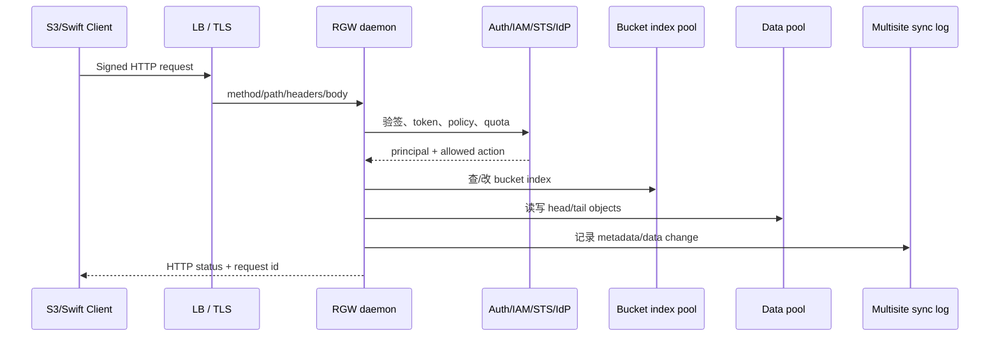

RGW 是无共享前端，多个 daemon 可水平扩展；用户、桶、索引、对象和同步状态都在 RADOS。RGW 不使用 MDS。S3 和 Swift 共享底层 namespace，但 API 能力、ACL 和响应语义并非完全相同。

## 2. Realm、Zonegroup、Zone 与 Period

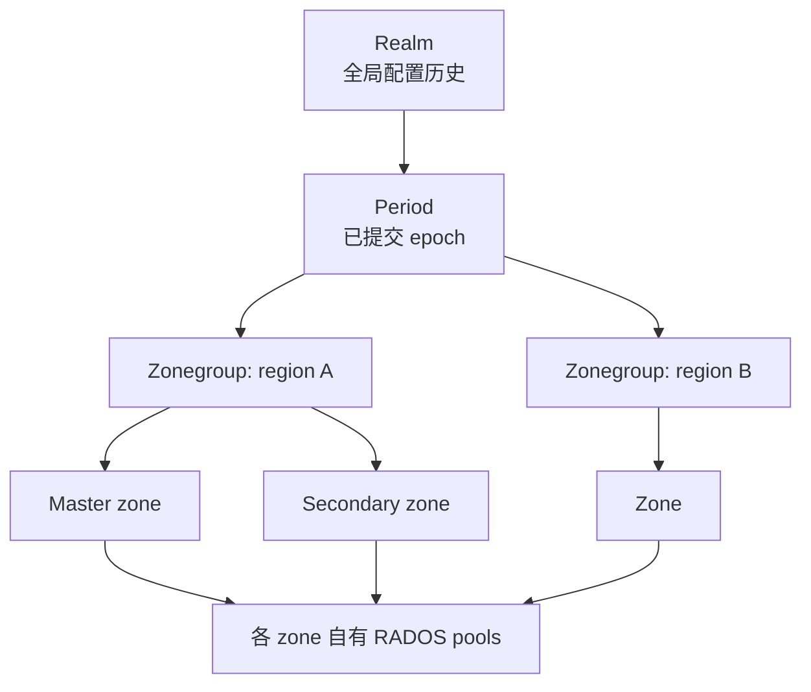

Realm 是多站点配置顶层；period 是一版已提交的 realm/zonegroup/zone 配置；master zonegroup/zone 接受全局 metadata 变更。Zone 拥有自己的 pools、endpoints、placement，data/metadata sync 把事件复制到其他 zone。

单站点也可以使用默认 realm/zonegroup/zone；准备未来多站点时应从一开始显式命名。修改 realm/zone 后需要 period update/commit 才会向其他站点传播；只改本地 JSON 不构成全局配置。

```bash
radosgw-admin realm list
radosgw-admin period get
radosgw-admin zonegroup get
radosgw-admin zone get
radosgw-admin sync status
```

## 3. RADOS 数据布局和 pools

RGW 不是“一对象一 RADOS 对象”。一个 bucket/object 可能涉及：realm/period/zone metadata、user/account metadata、bucket instance、bucket index shards、object head、multipart/tail objects、log、control、notification 和 sync pools。

| pool 类别 | 内容 | 主要风险 |
|---|---|---|
| root/metadata | realm、zone、user、bucket instance | 小对象/omap 延迟，必须 replicated |
| bucket index | object key、version、multipart、统计 | 热点 shard、reshard、omap 膨胀 |
| data | object head/tail payload | 可用 replicated/EC，受 storage class/placement 控制 |
| log/control | usage、gc、lc、intent、reshard、sync | backlog 会延迟删除、生命周期或多站点 |

Pool 名和 placement 由 zone 配置决定，不能只凭默认 pool 名写监控。EC data pool 只适合 payload；index/metadata 依赖 omap，必须 replicated。

大对象通常以 head + stripe tail 存储，multipart 每个 part 进一步形成对象集合。删除 S3 object 后 GC 异步回收 tail；立即看 raw 空间可能尚未下降。

## 4. Placement target 与 Storage Class

Placement target 把 bucket 绑定到 index/data pools、compression 和 storage classes。Storage class 可把标准/冷数据映射到不同 data pool/device class；S3 `x-amz-storage-class` 和 lifecycle transition 选择目标。

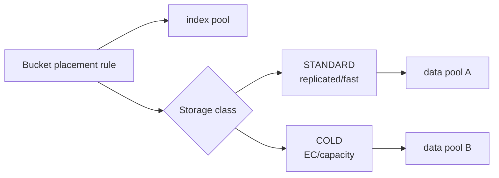

Bucket 创建后 placement 迁移不是改一个字段；现有对象仍在旧位置，需 lifecycle/cloud transition 或数据迁移。Cloud transition 可将对象转到外部 S3，cloud restore 再取回；endpoint、credential、CA、失败重试和本地 stub 生命周期都要验证。

## 5. HTTP Frontend、TLS 和负载均衡

Tentacle 主要使用 Beast frontend。配置包括 endpoint/port、SSL、线程、request timeout、header limits、TCP options 和 access log。Cephadm RGW spec 可指定 frontend port、extra args、networks、证书和 shutdown drain。

生产入口至少两个 RGW，由 HAProxy/ingress/DNS LB 分流。健康检查应执行签名的 PUT/GET/DELETE 或专用 health endpoint并验证后端，不要只判断 443 能连接。TLS 可在 LB 终止或 RGW 端终止；端到端安全场景两层都用 TLS。

虚拟主机风格 S3 需要 DNS wildcard 和证书 SAN；path-style 与 virtual-host-style 的 canonical request 不同。代理必须正确保留 Host、scheme、client IP 和大对象 streaming/chunked headers，否则 SignatureDoesNotMatch。

## 6. 用户、Tenant、Account 与密钥

传统 RGW user 有 uid、display name、access/secret key、Swift subuser/key、caps、quota、max buckets。Tenant 在名称中隔离用户和 bucket。Account/IAM 模型进一步在 account 下管理 root user、IAM users/groups/roles/policies。

```bash
radosgw-admin user create --uid app --display-name 'Application'
radosgw-admin key create --uid app --key-type s3 --gen-access-key --gen-secret
radosgw-admin user modify --uid app --max-buckets 100
radosgw-admin quota set --uid app --quota-scope user --max-size <bytes> --enabled true
radosgw-admin user info --uid app
```

Secret 只在创建/轮换时进入密码系统，不写 shell history、Git 或普通日志。一个 user 可有多把 key 用于无中断轮换：创建新 key → 应用切换并验证 → 删除旧 key。

Admin caps（如 `users=*`、`buckets=*`、`metadata=*`）控制 Admin Ops API，不是 S3 bucket policy。普通 S3 应用不应取得 admin caps。

## 7. S3 验签、Policy、IAM、STS 和 MFA

S3 Signature V4 由 method、canonical URI/query/headers、payload hash、credential scope、时间和 secret 共同计算。常见 403 根因包括时钟偏差、代理改 Host/header、URI 编码差异、region/scope、错误 secret，而不只是 policy deny。

授权结果由 identity policy、bucket policy、ACL、resource/action、condition、explicit deny 综合得出；显式 Deny 优先。IAM role 通过 trust policy 允许 principal `AssumeRole`，STS 返回短期 access/secret/session token。Session tags 可参与 policy condition；STS Lite 是简化路径，能力边界不能与完整 IAM 混称。

MFA 可保护敏感操作/版本删除；TOTP seed 和恢复流程属于高敏信息。OIDC provider/Keycloak 将外部 JWT claims 映射到 web identity role，必须校验 issuer、audience、JWKS、TLS 和 clock。LDAP、Keystone 是其他认证入口，各自 token/role 到 RGW 权限映射独立。

OPA 可外置授权决策，但增加网络依赖和失败模式；明确 OPA 不可用时 fail-open/fail-closed，生产通常要求 fail-closed。

## 8. S3 与 Swift API 的对象语义

S3 能力包括 service/bucket/object 操作、multipart、versioning、ACL/policy、CORS、lifecycle、tagging、object lock、select、notification、SSE、website 等；RGW兼容“大子集”而不是保证每个 AWS 行为完全一致。上线前按应用实际 API、header、错误码和一致性假设做兼容测试。

Swift 有 account/container/object、subuser、temp URL 等语义。S3/Swift 虽可访问共同 namespace，但 ACL、metadata/header 命名和 feature 不完全可互换；不要在未验证时让两个 API 并发管理同一 bucket。

NFS-Ganesha 可导出 RGW bucket，但对象 key/rename/目录模拟与 POSIX 差异明显；需要 POSIX 文件语义时使用 CephFS，而不是把 RGW NFS 当作等价文件系统。

## 9. Bucket index 与 Dynamic Resharding

Bucket index 保存 object keys 和状态；单 shard 在超大 bucket/高并发下成为 omap 热点。创建 bucket 时可设 shard 数，dynamic resharding 监控 entries 并异步扩 shard。

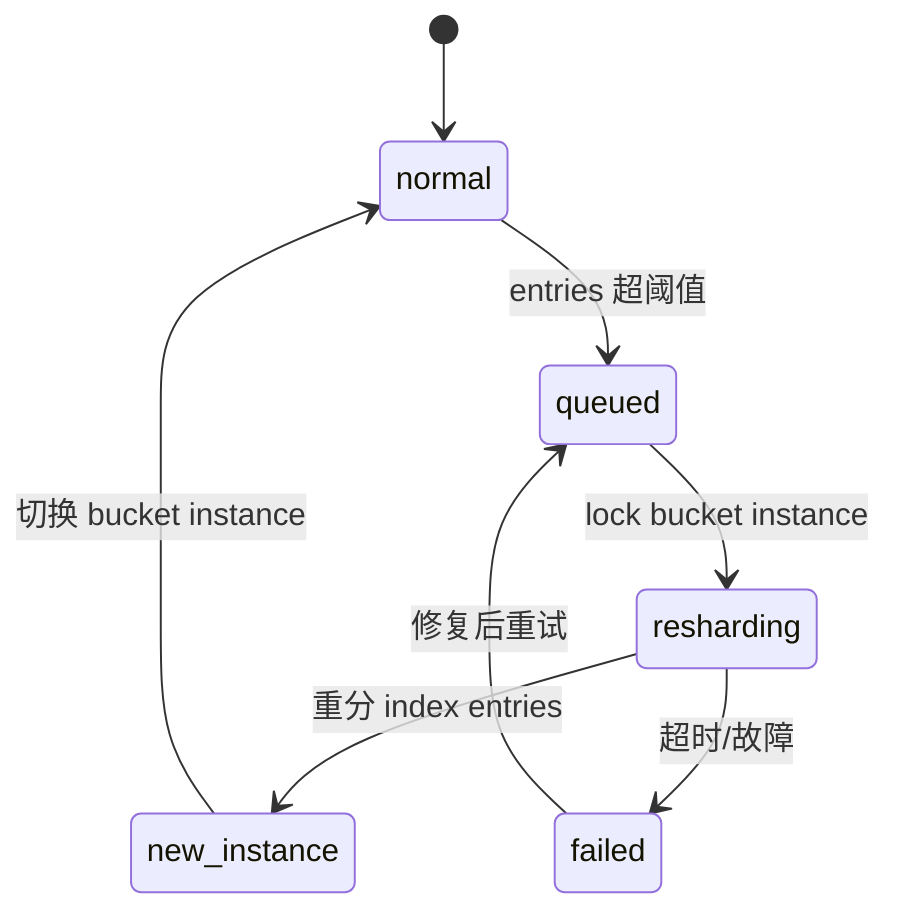

`radosgw-admin reshard status/list/process` 观察队列。Reshard 期间要考虑 multipart/versioning和 multisite；过多 shards 会增加 list 聚合、内存和小 bucket 成本。手工 reshard 前保存 bucket instance、index check 和 sync 状态。

## 10. Versioning、Lifecycle、Object Lock 与删除

Versioning enabled 后 PUT 产生 version，DELETE 默认产生 delete marker；suspended 不等于删除历史。Lifecycle 可 expiration current/noncurrent version、abort multipart、transition storage class。LC worker 是异步的，规则生效不代表对象立即处理。

Object Lock 使用 retention mode/date 与 legal hold；Governance 可由有权限主体绕过，Compliance 在期限内不可删除。必须在 bucket 创建和合规策略阶段确认支持，不能在事故后给已有数据补出完整 WORM 证据。

Bucket quota/user quota 是逻辑计数；配额统计可能异步。底层 pool full 会先于 quota 阻断请求，因此同时监控 RGW quota 和 RADOS raw capacity。

## 11. Server-side encryption 和 KMS

RGW 支持按版本能力的 SSE-S3、SSE-KMS、SSE-C。SSE-C key 由客户端每次请求提供，RGW不持久保存明文 key；SSE-KMS 通过 Vault、KMIP、Barbican 等获取 data/key material；SSE-S3 由服务管理主密钥。

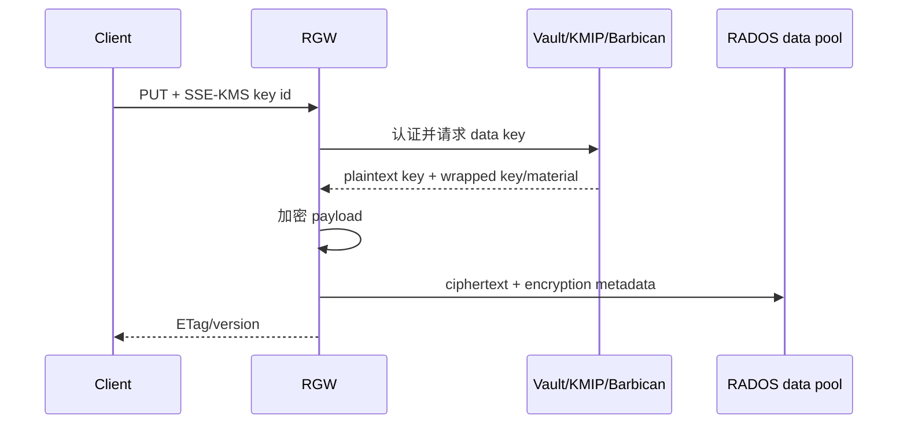

KMS 的 HA、TLS CA、token/role、key version、rotation 和灾备与 RGW 同等关键。删除 KMS key 会永久失去对象；备份 RADOS 数据而不备份 KMS/配置不能恢复。Compression 与 encryption 顺序会影响压缩收益，必须按实际实现验证。

## 12. Multisite 数据与元数据同步

Master zone 产生 metadata changes，各 zone 的 sync threads 分 shard 拉取 mdlog/datalog/bilog 并重放。Sync status 要分别看 metadata、data、各 shard marker 和 recovering/failing entries。

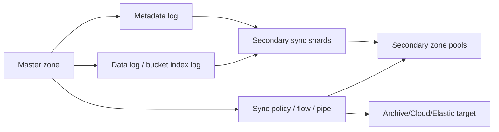

Sync policy 用 group、flow、pipe 选择源/目标 zone、bucket、prefix；状态可 enabled/allowed/forbidden。Archive zone 保留历史版本，cloud sync/transition 到外部 S3，elastic module 投递索引。它们解决的问题不同，不能都称为“灾备副本”。

Failover 前尽可能停止源写并等 sync caught up，提交新的 master period，再切入口。源站突然丢失时会有未同步 RPO。Failback 必须决定权威分支并完成同步，双 master 并发写会产生冲突和难以解释的版本。

## 13. Notification、Bucket Logging、Lua 与 S3 Select

Bucket notification 把对象事件发送到 Kafka、AMQP、HTTP 等 topic/endpoint。投递通常是至少一次，消费者必须去重；endpoint backpressure 会积压队列。检查 topic、notification config、persistent queue、ack level 和重试。

Bucket logging 将访问日志写入目标 bucket，注意日志递归、成本、敏感字段和生命周期。Lua scripting 可在 RGW request hooks 执行逻辑，脚本异常/耗时直接影响请求；限制 API、资源和发布流程。S3 Select 在服务端过滤 CSV/JSON/Parquet（按版本能力），减少传输但消耗 RGW CPU/memory。

## 14. Cache、压缩、D3N、去重和硬件加速

RGW metadata/data cache 减少 RADOS 访问，多个 RGW 依赖通知保持 cache coherence；TTL/容量过大增加陈旧窗口。D3N 在本地 NVMe 缓存 data objects，需容量、淘汰和故障验证。Compression 按 placement 设置 algorithm；监控 eligible/compressed bytes 和 CPU。

S3 object dedup、QAT/UADK 压缩/加密加速有硬件、驱动和 feature 限制，属于专项能力。不能因配置项存在就宣布生产可用。

## 15. 管理、指标与故障诊断

```bash
radosgw-admin user info --uid <uid>
radosgw-admin bucket stats --bucket <bucket>
radosgw-admin bucket check --bucket <bucket>
radosgw-admin object stat --bucket <bucket> --object <key>
radosgw-admin sync status
radosgw-admin gc list --include-all
radosgw-admin lc list
```

每次请求保留 HTTP status、RGW request ID、host、zone、bucket/key/version。4xx 多从签名、policy、quota、time、bucket state 查；5xx 再关联 RGW log、RADOS slow ops/PG/full、KMS、sync 和 index。

指标至少分 GET/PUT/DELETE/LIST/multipart 的请求率、字节、latency、4xx/5xx，按 daemon/zone 聚合；另看 bucket index、sync lag、GC/LC backlog、KMS/notification endpoint、frontend connections 和 RADOS pool。

Orphan 工具查找未被 bucket index 引用的 raw objects，扫描成本高且误删不可恢复。先完成 bucket index check、备份列表和 dry-run，再按官方版本工具清理。

## 16. Frontend、URI、代理和连接生命周期

Beast frontend 在 RGW 进程内处理 HTTP/1.1，按构建/配置支持 HTTPS 等能力。`rgw_frontends` 可声明多个 listener、port/ssl_port、endpoint、SSL certificate、TCP backlog、request timeout 与 prefix。Civetweb 是历史 frontend；新部署不应因为旧配置仍能启动就沿用其行为假设。

```text
beast endpoint=10.20.0.11:8080 ssl_endpoint=10.20.0.11:8443 \
  ssl_certificate=config://rgw/cert request_timeout_ms=65000
```

URI 解析同时受 `rgw_dns_name`、hostnames、zonegroup hostnames 与 `rgw_resolve_cname` 影响。Virtual-host 请求 `bucket.s3.example.com/key` 要从 Host 提取 bucket；path-style `/bucket/key` 从 path 提取。Bucket 名含点时，单层 wildcard certificate 不能覆盖多 label，TLS 会先于 S3 验签失败。

反向代理必须保留原始 Host 和 canonical path/query。若代理重写 URL prefix，RGW frontend 与 client endpoint 要用同一外部视图。`X-Forwarded-For` 只在 trusted proxy 范围内接受，否则客户端可伪造审计源地址。HAProxy PROXY protocol 也必须两端同时开启。

Connection/request timeout 要覆盖大 multipart part 与慢客户端，又不能让空闲连接无限占 worker。Shutdown drain 流程是 LB 停止新连接 -> 等在途请求 -> RGW 退出；orchestrator stop timeout 小于最大请求时间会把优雅关闭变成中断上传。Access log、ops log 和 usage log 是不同机制，开启字段与保留期前估算日志量。

## 17. RGW 在 RADOS 中如何拆一个对象

RGW metadata key 通过 metadata manager 存入 realm/zone/user/bucket instance 等对象；bucket index 以 omap 保存 key、version、tag、locator、size 和状态；payload 按 stripe 写 head/tail。Small object 可完全 inline 在 head，大对象或 multipart 会产生多个 tail object。

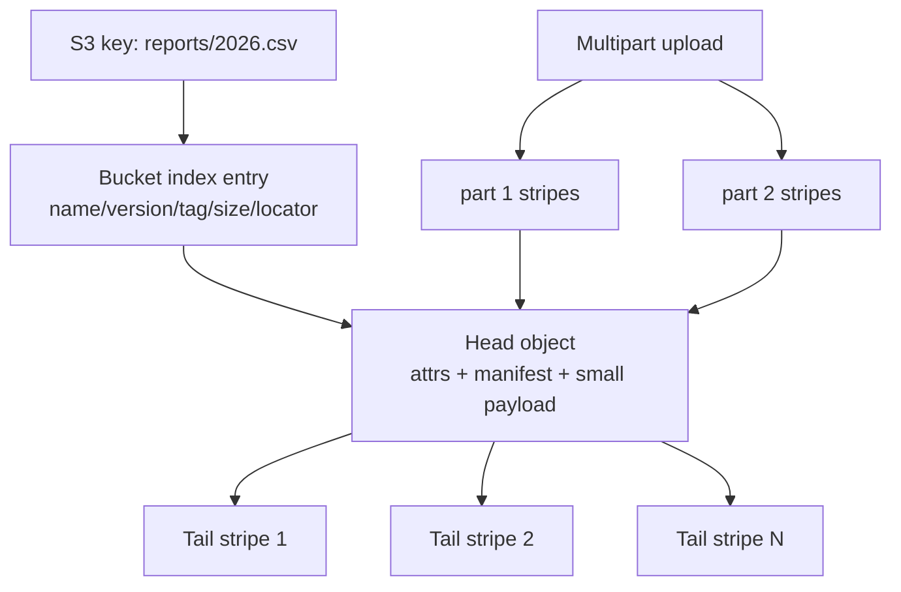

Manifest 描述 logical object 到 stripes 的映射，locator 影响 RADOS placement。绝不能用 raw `rados rm` 删除看似孤立的 tail；index、version、multipart、GC 和 multisite 可能仍引用它。

Zone 配置把多个逻辑用途映射到 pools：`.rgw.root`、control、meta、log、buckets.index、buckets.data、buckets.non-ec 等名称只是常见默认，真实名称由 placement/pool 配置决定。Index/metadata/log 依赖 omap 与小随机写，使用 replicated；payload data 可 EC。Non-EC pool 保存不适合 EC 的 multipart metadata/小控制对象。

Pool 预创建时要设置 application `rgw`、合适 CRUSH rule/PG 和 autoscaler target；让 RGW 首次请求隐式创建 pool 会失去企业命名/策略。调整 zone pool mapping 只影响按新 placement 创建/写入的对象，不会自动搬旧 raw objects。

## 18. Placement、storage class、compression 与数据迁移

Zonegroup 暴露 placement targets 给 bucket creator；zone 的 placement pools 把 target + storage class 解析到具体 data/index pool。Default placement 在 client 未指定 location constraint 时使用。用户还可被限制 default placement/tags，避免任意选昂贵存储层。

```bash
radosgw-admin zonegroup placement list --rgw-zonegroup <zg>
radosgw-admin zone placement list --rgw-zone <zone>
radosgw-admin zonegroup placement add --rgw-zonegroup <zg> \
  --placement-id archive --tags archive
radosgw-admin zone placement add --rgw-zone <zone> \
  --placement-id archive \
  --data-pool <pool> --index-pool <index-pool>
radosgw-admin period update --commit
```

Storage class 在同一 placement target 下选择另一 data pool。Lifecycle transition 更新 object version 的 storage class，并异步迁移/重写 payload。Compression 在 zone placement 的 storage class 上配置；对象 attr 记录算法与原始大小，读取透明解压。不可压数据若未达到 required ratio 会保持原样。

改变 EC profile、device class 或跨集群迁移时，不要直接改旧 pool 属性期待重编码。建立新 placement/storage class -> 用 lifecycle、S3 copy 或专用迁移重写 -> 对比 object/version/etag -> 切默认 -> 回收旧层。S3 ETag 对 multipart/加密对象不一定是内容 MD5，数据校验要用应用 checksum/version metadata。

## 19. User、Account、IAM 对象与权限求值

传统 user 模型以 RGW uid 为根，支持 tenant、subuser、S3/Swift keys、caps、user/bucket quota。Account 模型更接近 AWS：account 有 account id/name/email/tenant，account root user 管理 IAM users/groups/roles/policies；bucket 可归属 account。两种模型并存时，API principal ARN、owner 和管理命令不同。

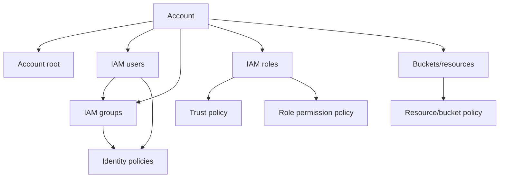

Policy statement 由 Effect、Principal（resource policy/trust policy）、Action/NotAction、Resource/NotResource、Condition 组成。求值先汇集 identity/resource/session policy，再由 explicit deny 压倒 allow；没有 allow 即 implicit deny。RGW 只实现官方列出的 IAM action/condition key 子集，应用依赖 AWS 边缘语义前要实测。

Role trust policy 允许 IAM principal、federated OIDC/SAML 或 service assume；permission policy 决定取得 session 后能做什么。`MaxSessionDuration`、external id、source identity 和 session tags 缩小信任边界。Session tag 可成为 principal tag 参与 ABAC，但允许调用者随意传 tag 等于允许自提权，必须在 trust/session policy 限制 tag key/value。

STS `AssumeRole`、`AssumeRoleWithWebIdentity` 等返回临时 access key、secret、session token 和 expiration，client 每次请求都必须带 token。STS Lite 是针对特定 RGW 使用场景的简化接口，不具备完整 AWS STS/IAM 等价性。时钟错误会让 token 立即失效。

MFA TOTP serial/seed 绑定 user，敏感操作可在 policy 使用 `aws:MultiFactorAuthPresent/Age` 类条件（以 RGW 支持集为准）。丢失 device 的恢复必须有双人/审计流程；管理员移除 MFA 后应撤销现有 session/key。

## 20. 外部身份：Keystone、LDAP、OIDC/Keycloak 与 OPA

Keystone integration 让 RGW 验证 OpenStack token，并将 accepted roles 映射为 Swift/S3 访问；配置 endpoint、admin/project credential、accepted roles、token cache、TLS。Keystone 不可用时，新 token 验证失败，缓存 token 可能在 TTL 内继续，需明确可用性与撤销延迟。

LDAP auth 通常用 service bind 搜索用户 DN，再验证密码并生成 RGW identity。Base DN、search filter、bind DN/password、TLS CA 和 nested group 行为必须固定；LDAP simple bind 不应走明文。用户 rename/delete 与 RGW bucket owner 的生命周期要有回收规则。

OIDC provider 保存 issuer URL、client ids/thumbprint 等信任信息；Keycloak 是常用 issuer。Web identity 流程：client 向 IdP 取 JWT -> RGW 验 issuer/audience/signature/time -> trust policy 允许 -> STS 发临时 S3 credential。JWKS/证书轮换、clock skew、audience 混用和 token claim size 都应演练。

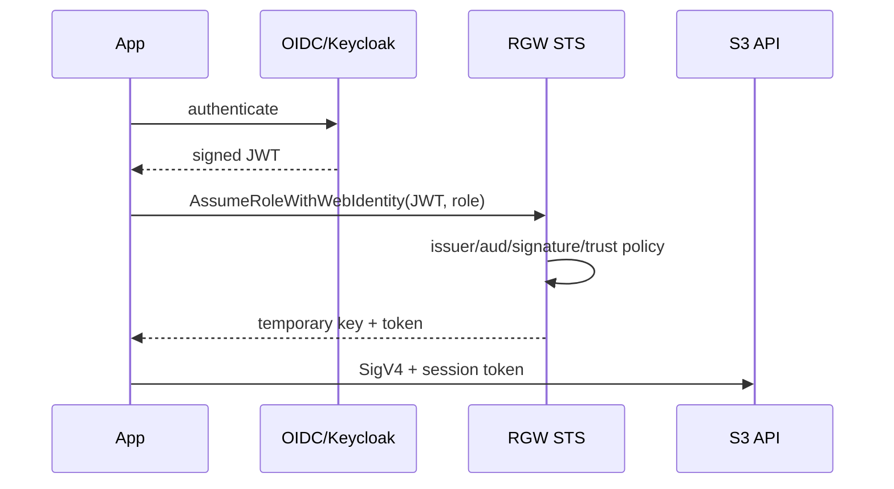

OPA integration 把 request context 发送给 policy agent。定义 endpoint TLS/auth、输入 schema、timeout/cache 和错误策略；fail-open 会在 OPA 故障时放行，是显式风险接受。OPA allow 不能越过 RGW 仍需执行的协议/对象一致性检查。

## 21. S3 API：从 service 到 object lock 的行为矩阵

RGW S3 兼容面应按资源层验收，而不是用一条 `aws s3 ls` 代表全部：

| 层级 | 主要操作 | 关键语义/边界 |
|---|---|---|
| Service | ListBuckets | 只列 principal 可见 buckets，account/tenant owner 影响结果 |
| Bucket | create/delete/head/location | location constraint 映射 zonegroup placement；非空不能删 |
| Bucket control | ACL/policy/CORS/tagging/website | 各自有独立 subresource 与权限；AWS 支持度按 RGW 矩阵 |
| Object | PUT/GET/HEAD/COPY/DELETE | conditional/range、metadata、content hash、version id |
| Multipart | initiate/upload part/list/complete/abort | complete XML 顺序与 ETag；遗留 upload 要 lifecycle abort |
| Versioning | enable/suspend/list versions/delete marker | version-specific delete 与普通 delete 不同 |
| Lifecycle | expiration/transition/noncurrent/abort MPU | 后台异步，时间按规则与 worker 周期 |
| Object Lock | retention/legal hold | bucket 创建时能力、governance/compliance 差异 |
| Encryption | SSE-C/SSE-S3/SSE-KMS | header、key service 和 copy source/destination 分别处理 |
| Notification | topic/config/event delivery | 兼容事件/过滤组合有限，至少一次消费 |
| S3 Select | SQL expression on object | 支持格式/压缩/SQL 子集受版本限制 |

SigV4 canonicalization 对重复 query、URI percent encoding、signed headers、`x-amz-content-sha256`、streaming chunk signature 和 presigned URL expiration 都敏感。SDK 默认 region/endpoint 常按 AWS 推断，私有 RGW 必须显式 endpoint 与 addressing style。官方给出的 C++、C#、Java、Perl、PHP、Python、Ruby 示例本质都完成同一件事：给兼容 SDK 注入 RGW endpoint 与 credential，不能硬编码 secret。

Conditional request 的 `If-Match/If-None-Match/If-Modified-Since` 用于避免 lost update/cache miss；multipart ETag 和 encrypted object 不应当通用内容摘要。Copy object 同时执行源读授权和目标写授权，跨 tenant/account policy 要分别满足。

## 22. Swift API、TempURL 与跨 API 边界

Swift 资源层是 account -> container -> object。Service/account operations 查看 account metadata/stat/container list；container operations create/delete/list/ACL/CORS；object operations PUT/GET/HEAD/COPY/DELETE 与 metadata。Swift large object、manifest 和 segment 语义与 S3 multipart 不同。

Swift subuser 形如 `uid:subuser`，secret/key 类型与 S3 key 分开。内置 auth 或 Keystone 发 token，client 用 `X-Auth-Token`。TempURL 用 account secret 对 method、expiry、path 做 HMAC，允许无长期 credential 的临时对象 URL；轮换 TempURL key 会使既有 URL 失效。

S3 与 Swift 共享 bucket/container namespace 时，owner/ACL/header 映射不完全对称。用 Swift 创建的 manifest 或用 S3 开启 versioning/policy 后再由另一 API 修改，可能得到客户端无法理解的行为。企业规则应指定每个 bucket 的唯一协议 owner；跨 API 只作为经过测试的读路径。

各语言 Swift tutorial 同样是 endpoint/token/container/object 基本操作示例，生产要加 TLS verification、timeout、retry idempotency、streaming 和 secret provider。SDK 看到 HTTP 500/503 可按 request id 查询 RGW，不能无限自动重试非幂等 multipart complete。

## 23. Admin Ops API、`radosgw-admin` 与变更事务

Admin Ops API 通过签名 HTTP 管理 user、key、caps、bucket、usage、quota 等，调用 user 需要对应 admin caps，例如 `users=read|write`、`buckets=*`、`usage=read`、`metadata=read`。这些 caps 权限极高，endpoint 只暴露管理网并启用审计。

`radosgw-admin` 直接通过 librados 访问 metadata/index，适合本地运维，不经过普通 frontend policy。常用对象：

```bash
radosgw-admin metadata list user
radosgw-admin metadata get user:<uid>
radosgw-admin bucket stats --bucket <bucket>
radosgw-admin bucket limit check
radosgw-admin bucket check --bucket <bucket> --check-objects
radosgw-admin usage show --uid <uid>
radosgw-admin quota check --uid <uid>
radosgw-admin bi list --bucket <bucket>
radosgw-admin object stat --bucket <bucket> --object <key>
```

Metadata `get/put` 是灾难诊断工具，不是日常配置接口；手工 put 必须保留原 JSON/version 并理解多站点 metadata log，否则其他 zone 会覆盖或传播错误。Bucket link/unlink/chown 改 owner 与 index 关系，无法替代复制对象；大 bucket chown 期间要控制业务写。

Usage log 由 RGW 周期 flush，`usage show/trim` 的时间粒度与时区要明确；trim 只删计费日志不删对象。Quota stats 可能需 sync/repair 后才与真实对象一致。Admin 命令成功后继续用 S3/Swift 正反权限和多站点 sync 验证。

## 24. Dynamic reshard、bucket index repair 与 hot bucket

Bucket index shard 数通常取素数以改善 hash 分布，并受 zonegroup 最大 shards 限制。Dynamic reshard 根据 `rgw_max_objs_per_shard` 等阈值排队；multisite 下 reshard 能力与版本/zone feature 必须兼容。并发 reshard 数过高会放大 index pool omap I/O。

```bash
radosgw-admin reshard list
radosgw-admin reshard status --bucket <bucket>
radosgw-admin reshard add --bucket <bucket> --num-shards <N>
radosgw-admin reshard process
radosgw-admin bucket check --bucket <bucket>
```

Reshard 创建新的 bucket instance，复制 index entries，再原子切换 bucket metadata；旧 instance 延后清理。失败时先确认 current instance、reshard log 和客户端写状态，不能反复 add 形成多个候选实例。

高 request rate 但 key 数不多也可能热：单 key overwrite、multipart 或 list prefix 集中在少数 shard。增加 shards只分散 key hash，不解决单 key 热点和 data pool slow PG。Bucket index check 可比较 header、entries、object stats，并按选项修复；修复前保存 bi list/metadata 和 multisite markers。

## 25. Multisite 建立、period 提交和 failover

建立新 realm 的顺序：在主站创建 realm -> master zonegroup -> master zone -> system user/endpoint -> period update --commit；次站 pull realm/period，用 system credential 创建本地 zone/pools/endpoints，启动 RGW 后观察 metadata/data sync。

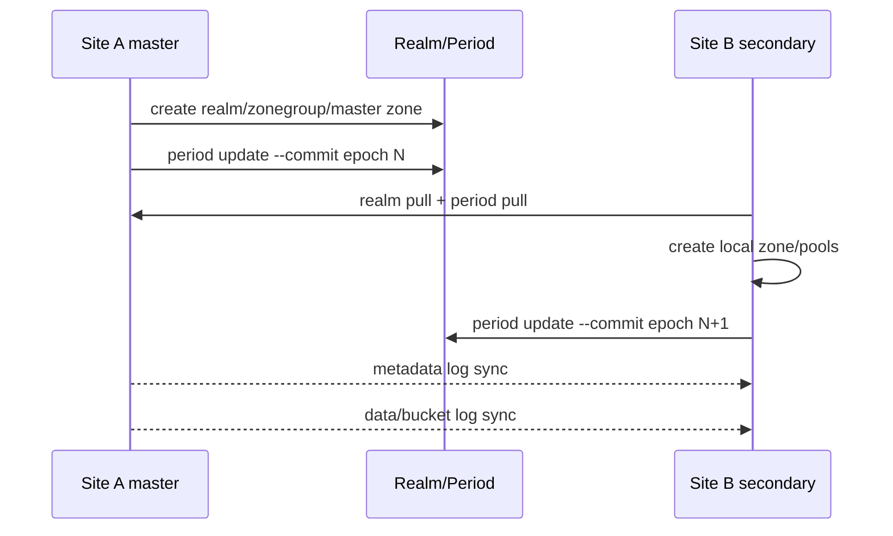

Period commit 是全局配置事务：只有 master zone 能产生新 period；epoch/revision 防止基于旧配置覆盖。改 endpoint、placement、zone feature 或 master 后都要 commit，并让所有 RGW 载入。未 commit 的 local zone JSON 只影响本地工具视图，容易在下次 period pull 丢失。

Zone feature 控制 resharding、sync policy、notification 等跨站能力；不同 release/feature 不兼容时先滚动升级到共同能力集。Read-only zone 拒绝普通写；archive zone 保存对象版本历史，不能作为普通 active-active 站点。

Failover 的权威序列：阻止旧 master 写 -> 等 metadata/data sync caught up -> 把目标 zone 标为 master/default -> 新 period commit -> 更新 DNS/LB -> 业务验证。旧站不可达时记录各 sync shard marker 估算 RPO后强切。Failback 不应简单把 master 标志改回：先把旧站作为 secondary 对齐新历史，确认冲突/落后清零，再计划切换。

## 26. Sync policy、flow、pipe 与同步模块

Sync policy group 包含 status 与一组 flows/pipes。Symmetrical flow 描述一组 zones 互相同步，directional flow 指定 source -> destination。Pipe 再选择 source/destination bucket、prefix、storage class 等数据范围。Policy 可以在 zonegroup 或 bucket 层叠加；`enabled` 执行，`allowed` 允许下层启用，`forbidden` 禁止。

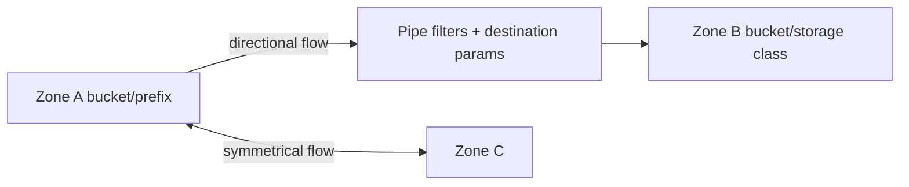

修改 policy 后检查 effective policy，而不只看配置对象。过滤器错误可能让对象永不进入 sync log；目标 bucket mapping 冲突可能把多个源写到同一 namespace。Policy 不回溯时需显式 full sync/重新标记，不能假定启用就复制全部历史。

内置/扩展 sync module 有不同数据模型：

| 模块 | 目标 | 语义 |
|---|---|---|
| default RGW | 另一个 RGW zone | metadata + object/version 同步 |
| archive | RGW archive zone | 保存版本历史，面向恢复 |
| cloud | 外部 S3 | 把对象推到云 endpoint，可改 storage class/path |
| elastic | Elasticsearch | 写可检索 object metadata，不是 payload 备份 |

Cloud sync module 与 lifecycle cloud transition 不同：sync module 是 zone 数据流，transition 是对象 storage class 生命周期。Cloud transition 将本地 payload 变成 remote object + local stub；restore 可临时或永久拉回。Credential、endpoint、multipart、version、delete、restore expiry 与外部费用都要测试。

Elastic index 可能包含 object metadata/tag，字段映射与隐私要管理；搜索结果不是 S3 权威目录。Module endpoint 堵塞会造成 sync shard lag，隔离故障 module 避免拖累核心 zone sync。

## 27. Encryption、KMS 适配与密钥轮换

SSE-C 请求携带 base64 key 与 key MD5，RGW 用 key 加解密但不存 key；GET/COPY 也必须提供正确 source key。TLS 是强制安全前提。日志和代理必须过滤 SSE-C headers。

SSE-KMS 通过 key id/context 向 KMS 获取/解封 data key。适配后端包括 HashiCorp Vault（token/agent/KV/transit 按模式）、KMIP、OpenStack Barbican；各自的认证、namespace/project、TLS CA、key template 与缓存不同。SSE-S3 可用 RGW 管理的默认主密钥路径，但同样要备份与轮换。

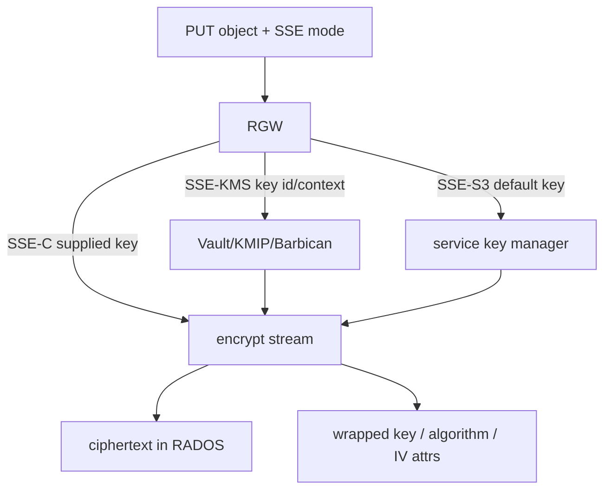

Rotation 有两类：KMS master key 新版本用于新对象，不会自动重加密旧 payload；对象 rewrite/copy 才改变其 data key/material。删除旧 master/version 前扫描所有 object metadata/备份引用。Multisite 目标 zone 必须能访问等价 key id/material，否则 ciphertext 同步成功但读取失败。

Barbican project、Vault policy/token 和 KMIP client cert 都要最小权限且有 HA。KMS timeout 应让请求失败而非写成明文；缓存 data key 的 TTL 是可用性与撤销速度权衡。灾备演练必须在隔离站恢复 KMS + RGW config + RADOS object 并成功 GET。

## 28. Notification、logging、Lua 和 S3 Select 的可靠性

Notification 对象分三层：topic 定义 endpoint/credential/persistence；bucket notification 把 event type 和 key prefix/suffix filter 绑定 topic；event delivery 产生记录。RGW 支持的 S3 notification API/事件/目标与 AWS 有兼容矩阵，配置前按目标版本核对。

Kafka/AMQP 可配置 ack level、broker/URI、SSL、user/password；HTTP endpoint 有 method、headers、timeout。Persistent notification 把未确认事件落 RADOS queue，改善 RGW 重启后的可靠性，但队列满/目标永久失败仍需告警与清理。投递可能重复、乱序，event id + bucket/key/version 作为消费者幂等键。

Bucket logging 的 source bucket 把访问记录批量写到 target bucket/prefix。Target policy、防递归、对象所有权、flush interval 与生命周期必须设置；日志可能含 client IP、key 和 principal，按审计数据保护。它与 daemon access log/usage log用途不同。

Lua 脚本可挂 pre/post request 等 context，读写允许的 request/response fields；版本、package、reload 和 failure behavior要受控。脚本 CPU/内存受 RGW request worker 共享，禁止网络长调用或无界循环。

S3 Select 接收 SQL expression、input/output serialization，对单对象流式过滤。CSV header/quote、JSON document/lines、Parquet、compression 等支持以版本矩阵为准；扫描仍消耗 RGW CPU 和后端读带宽。设置输入/输出大小和并发限制，防止少量复杂 query 压垮 frontend。

## 29. Lifecycle、GC、orphan 与删除后的空间回收

Lifecycle worker 从 LC index 取 bucket，按 rule 扫描 object versions：expiration 写 delete marker/删特定 version，noncurrent expiration 清旧版，abort MPU 清未完成 parts，transition 移 storage class/cloud。Rule 修改不保证立即重扫，检查 `lc list/get` 的状态、start/end time 和错误。

GC 处理 manifest/tail 的延迟删除。RGW 先把 chain 放 GC log，超过 min wait 后 worker 才删 raw objects；这样保护并发读和失败事务。`gc list --include-all`、process 和 queue depth 用于判断积压。强行缩短时间或直接 process 在活跃请求中可能删仍被引用的 tail。

Orphan 是 raw RADOS object 不再被任何 bucket index/manifest 引用，常来自失败旧操作/历史 bug。Orphan search 需要构建全量候选与引用集合，CPU、内存、RADOS list 成本高；在生产低峰分 pool/批次执行。先输出报告并抽样用 object stat/bi/manifest 验证，再删除。不要把 multipart、GC pending、multisite lag 或旧 bucket instance 的 object误判。

Bucket delete 只在 index 为空时成功；`--purge-objects` 是高风险批量删除，versioning/object lock/legal hold/multisite 都要检查。最终释放容量还需 LC/GC/reshard old instance 完成并等 RADOS stats 更新。

## 30. Cache、D3N、dedup 与硬件加速的适用条件

RGW cache 保存 metadata/bucket/user 等，RGW 之间通过 control pool watch/notify 做 invalidation。Miss 会读 RADOS；notify 丢失/daemon 断线由 TTL/重新加载兜底。过大 cache 提升命中也增加内存和陈旧影响，按 hit ratio 与 eviction 观察。

D3N（Data Cache）在 RGW host 本地 SSD/NVMe 缓存 data object，按目录/容量/eviction 配置。它减少远端 RADOS 读，但 host cache不是副本：丢失可重建。多 RGW 不共享本地命中；加密、version overwrite 与 invalidation必须按实现验证。Cache disk 满、慢或损坏时应 fail back 到 RADOS，而不是阻断写路径。

S3 object dedup 根据内容识别重复 payload并共享底层存储，带来 hash、引用计数、GC 与加密交互。它不是默认透明收益：租户侧信道、collision model、delete/version 和灾难恢复都要专项评审。

QAT 加速 encryption/compression，需要 Intel QAT hardware、driver、library 与 Ceph build；UADK 提供受支持 ARM/加速器 compression 路径。启用后验证 software fallback、不同对象大小、并发、压缩比、重启和硬件故障。任何 accelerator failure 都不能产生无法由纯软件读取的对象格式。

## 31. 指标、故障定位和恢复验收

RGW metrics 分 daemon/frontend、HTTP op、sync、cache、LC/GC、notification 和 data path。Counter 必须 `rate()`，latency sum/count 配对；按 bucket/user 的高 cardinality label 谨慎启用。业务 SLO至少按 API method/status class统计 request rate、bytes、p50/p95/p99 latency 与 error。

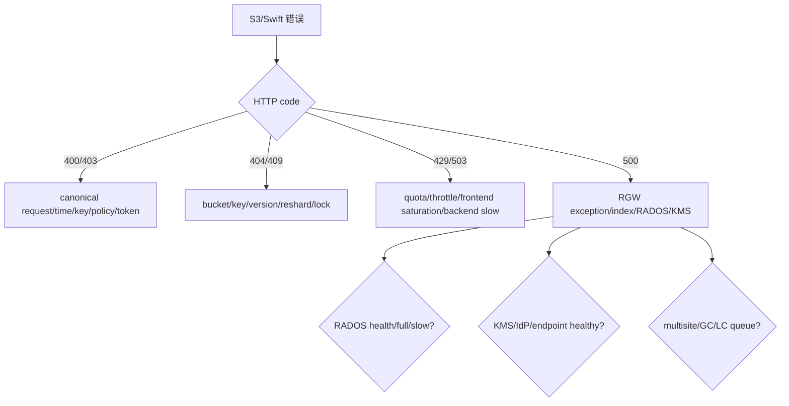

用响应 `x-amz-request-id`/RGW request id 在 access/ops log定位同一请求；记录 daemon、zone、host、bucket instance 和 RADOS errno。`SignatureDoesNotMatch` 对比 server canonical string，不能反复换 key；`NoSuchBucket` 在 multisite 场景还要查 metadata sync marker；503 slow down 与 RADOS `-ENOSPC/-EAGAIN` 方向不同。

Bucket index 异常先 stats/check/bi list，不先 rebuild；KMS 错误保存 key id/backend response 但不记明文 key；multisite lag按 shard找 failing entry，可 retry/trim 的前提是证明目标已应用。RGW crash 保留 core/backtrace 和 request id，再由 LB摘除单实例。

恢复验收必须执行：新建 user/account 和最小 policy；SigV4 PUT/HEAD/range GET/COPY/DELETE；multipart；version/delete marker；lifecycle/GC；SSE 解密；notification 去重；reshard；quota；多站同步与计划切换。最终检查 raw capacity、index consistency、sync lag、LC/GC/notification queue 和所有外部 IdP/KMS endpoint。

## 32. 官方基线与许可

来源：Ceph Tentacle 官方 `doc/radosgw/`，核验提交 `76fba24cef67d9219f97eeaa68cd1a848da3f2b2`。Ceph authors and contributors，CC BY-SA 3.0。
