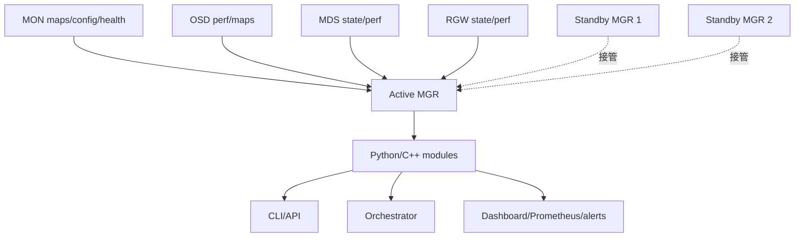
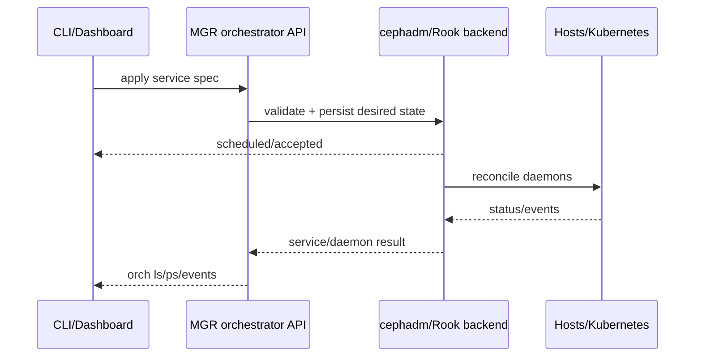
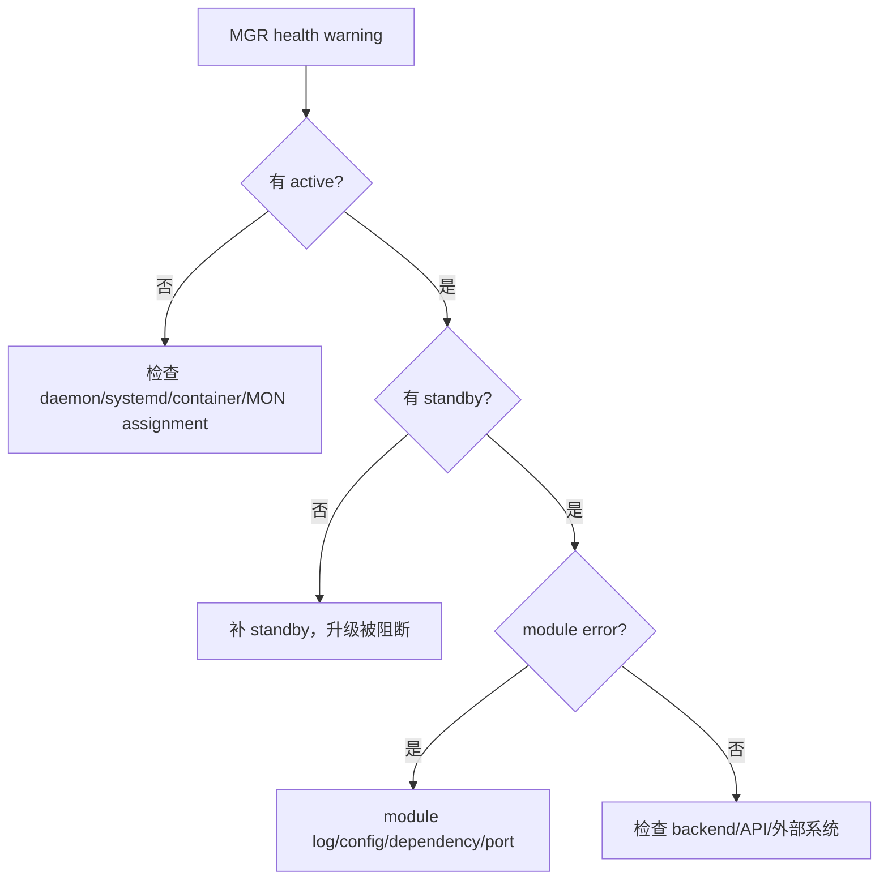
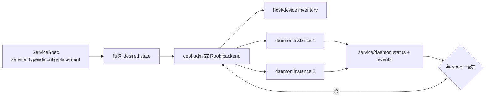
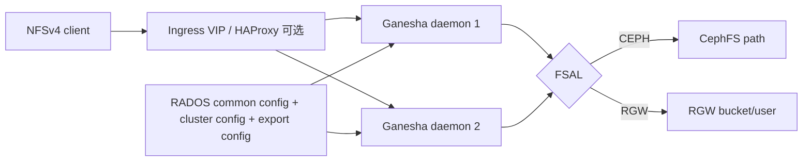
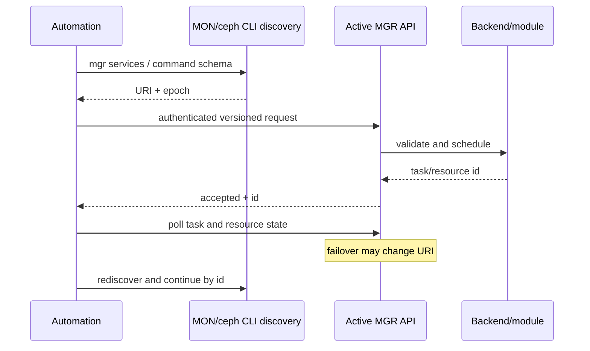

# Ceph Manager 模块与编排全解（Tentacle）

> `ceph-mgr` 从 Luminous 起是正常集群的必需组件。它不参加 MON Paxos，也不保存业务对象；它维护集群运行视图，并承载 orchestrator、Dashboard、Prometheus、alerts、crash、telemetry 等可插拔模块。

## 1. Active/Standby 与数据来源



Active MGR 接收 daemon reports、地图和性能 counter；standby 等待 MON 指定接管。无 MGR 时 RADOS 核心可能仍能处理已有 I/O，但 `ceph status` 部分信息陈旧/缺失，autoscaler、orchestrator、Dashboard、Prometheus 等停止，因此属于健康故障。

生产至少 active + standby，通常与 MON 分布但并非强制共置。MGR module 状态/config 存在 MON config/key-value store，active 切换后重建运行状态；模块不能把唯一权威数据只放进进程内存。

```bash
ceph mgr stat
ceph mgr dump
ceph mgr metadata
ceph mgr services
ceph mgr module ls
```

## 2. 模块生命周期和配置

```bash
ceph mgr module enable <module>
ceph mgr module disable <module>
ceph config get mgr mgr/<module>/<option>
ceph config set mgr mgr/<module>/<option> <value>
ceph tell mgr module self-test
```

`module ls` 区分 always-on、enabled、disabled 和 error modules。Always-on 模块随 release 固定，不能像普通模块关闭。启用模块可能开放端口、创建 service、向外发送数据或需要 Python dependency；变更前检查 module options、URI 和安全边界。

模块命令通过 `COMMANDS`/CLI API 注册；配置用 module option schema 定义 type/default/runtime，持久化数据用 KV store。模块线程不得阻塞 MGR 主事件处理；长操作应异步并报告 progress。

## 3. Orchestrator 是抽象接口，不是部署实现

Orchestrator module 定义 host、inventory、service、daemon、upgrade、certificate 等统一 API；cephadm 或 Rook module 是 backend。CLI/Dashboard 调用同一抽象，因此“命令 accepted”只说明请求进入 backend，不代表 daemon 已 ready。



`ceph orch set backend <name>` 选择 backend；切换 backend 不会自动迁移所有权。Orchestrator plugin 实现 completion、inventory、placement、service spec、daemon action 和 error translation；异步 completion 必须区分 persistent（已保存）与 effective（已生效）。

## 4. 管理和可观测模块

| 模块 | 输入/输出 | 关键边界 |
|---|---|---|
| dashboard | REST/Web UI、RBAC、各服务管理 | 独立 TLS、用户、SSO 和审计；active 切换时 URI/会话会变化 |
| prometheus | `/metrics`，cluster/daemon metadata | 不保存长期时序；daemon perf 也可来自 ceph_exporter |
| alerts | 基于 health 的 SMTP 告警 | 不替代 Prometheus rule/Alertmanager |
| progress | recovery、rebalance、operation 进度 | 进度完成仍需验证最终 health/业务 |
| crash | 收集、列出、归档 daemon crash | dump 可能含敏感数据；归档不是修复 |
| insights | 生成诊断/历史洞察报告 | 控制采集和外发边界 |
| iostat | 即时 client I/O 统计 | 聚合值不能替代 pool/image/SLO 指标 |
| diskprediction | 设备寿命预测 | 预测不是 SMART/介质验收替代品 |
| mds_autoscaler | 按 FS 设置调整 MDS | 只控制 daemon/rank 目标，不创造 metadata capacity |

Prometheus module 可配置地址、端口、scrape interval、RBD stats pools/images、standby behavior、health history；抓取超时应小于 Prometheus scrape timeout。大规模 per-image stats 会增加 MGR/OSD 开销。

## 5. 外部系统集成模块

Influx module 把 metrics 推到 InfluxDB；Telegraf 通过 socket 向 agent 发送；两者是 push 集成。Prometheus 是 pull。重复启用会形成多条观测链，需定义权威告警源。

Telemetry 明确征得管理员同意后向 Ceph 社区发送匿名 cluster/device/channel 数据；启用需要接受 Community Data License 并选择 channel。先用 `ceph telemetry preview` 审核字段；含客户、主机、设备可识别信息时按合规要求决定是否开启。

Localpool 按 CRUSH subtree 自动创建本地 pool，适用于特定 locality 需求；错误参数会大量创建 pool/PG。Hello 是开发示例，不是生产服务。

## 6. 服务专用模块

Rook backend 通过 Kubernetes/Rook CR 管理 daemon；RGW module 提供 realm/zone 等管理；NFS、SMB 模块协调对应服务；MDS autoscaler 管理文件系统 rank；这些模块只在对应 backend/service 存在时有意义。

服务模块的配置对象与真实业务对象不同：删除 MGR module 配置不等于删除 RADOS pools/FS/bucket；反之，底层对象被手工删除会使模块状态悬空。

## 7. CLI API 与 REST API

CLI API 将注册命令、参数类型、权限和返回结构暴露给自动化；Ceph RESTful API 由 MGR module 提供。调用者必须处理 `EINVAL/ENOENT/EBUSY/EPERM`、异步状态和 active MGR failover，不能解析人类表格作为稳定协议；优先 JSON/YAML formatter。

```bash
ceph <command> --format json
ceph mgr services --format json
ceph orch ls --format yaml
```

API 凭据按最小 CephX caps/RBAC，连接使用 TLS。Active MGR 切换会改变 daemon-local URI，客户端应通过 mgmt-gateway、DNS/LB 或重新发现 `ceph mgr services`。

## 8. 故障与升级



先看 `ceph mgr stat/dump`、MGR log、`module ls` error，再定位单模块。不要因 Dashboard 失败就重启所有 MGR；可能只是证书、端口或后端 API。模块 disable/enable 会中断其 API，操作前确认依赖。

升级先保证 standby MGR；cephadm 通常先升级 standby 并 failover，再升级旧 active。MGR module Python API 随 release 变化，自定义模块必须在目标版本测试。升级完成检查所有 module 恢复 enabled、service URI 正确、orchestrator backend 可用、Prometheus target up。

## 9. 开发模块的最低契约

自定义模块应声明 `MODULE_OPTIONS`、`COMMANDS`、health checks 和 service URI；实现 `serve()`/`shutdown()`，在 failover/restart 后从持久状态恢复；日志不得输出 keyring/token。Orchestrator plugin 还要实现 spec validation、idempotent reconcile、events、completion 和 inventory refresh。

Debug plugin、feature toggle、MOTD 等 Dashboard plugin 通过标准接口扩展，不得直接修改 Dashboard 核心数据。开发/调试模块不应默认在生产 enabled。

## 10. MGR 的认证、性能与自动调节

手工部署 MGR 的最小闭环是：创建 `mgr.<id>` CephX entity 和 keyring；把 daemon 放入集群；确认 MON map 出现 active/standby。MGR key 默认使用 `profile mgr`，它需要读取 maps、daemon reports 并执行模块注册的管理动作。自定义 caps 过窄会表现为模块部分可见、部分命令 `EACCES`，不应直接改为 admin 掩盖根因。

```bash
ceph auth get-or-create mgr.node-a mon 'profile mgr' osd 'allow *' mds 'allow *'
ceph mgr dump
ceph mgr fail <active-name>       # 计划切换前确认 standby 健康
ceph config set mgr mgr_stats_period 5
```

所有 daemon 向 active MGR 定期发送统计。上报周期越短，Dashboard/Prometheus 越实时，但 daemon、网络和 MGR 聚合 CPU 越高。Automatic Stats Period Tuning 会依据 PG 数等规模调整周期，避免大集群用固定高频率压垮控制面；手工固定前要用 scrape duration、MGR CPU 和消息量证明需要。

Module pool 用于模块在 RADOS 中保存较大持久对象；轻量状态通常放 MON KV。两者都必须设计 schema/version 与升级回滚。Active 切换会重建内存 cache，模块应接受短暂数据空窗并从权威 maps/KV/RADOS 恢复。

## 11. Orchestrator 对象模型与异步结果

Orchestrator 术语必须分清：host 是受管机器；device 是 inventory 发现的块设备；service 是期望部署（如 `mon`、`mds.fs-a`、`rgw.site`）；daemon 是某个运行实例；placement 决定 daemon 落点；spec 是持久 desired state。



Placement 可按显式 host、label、host pattern 和 count 选择。Backend 必须稳定排序并处理 co-location、端口与资源约束；同一 spec 重复 apply 应幂等。`ceph orch apply` 返回说明 desired state 已接受，不说明容器 ready。验收继续看：

```bash
ceph orch status
ceph orch ls --service_name <service> --format yaml
ceph orch ps --service_name <service> --refresh
ceph orch device ls --refresh
ceph orch host ls
```

Orchestrator plugin 的 completion 表达异步动作。Persistent completion 表示请求已保存、即使 active MGR 重启也应继续；effective completion 表示实际基础设施已达到结果。批处理能把多个 inventory/service 请求合并，调用方仍要逐项读取异常。错误应转换为稳定的 `OrchestratorError`/errno 与事件，不能只写 log 后返回空列表。

接口明确排除通用 SSH/配置管理器职责；backend 不负责任意客户脚本。切换 `ceph orch set backend` 只改变后续 API 接收者，原 backend 创建的 daemon、CR 或 systemd unit 不会自动迁移。禁用 backend 前必须盘点所有权与回收路径。

## 12. Module 开发模型：命令、配置、通知和退出

MGR module 通常继承 `MgrModule`，standby 服务继承 `MgrStandbyModule`。`serve()` 是长生命周期入口，`shutdown()` 必须唤醒线程、停止 server 并释放资源；不能靠进程退出回收外部连接。Module import/init 失败应通过 `can_run()` 给出原因，避免 enabled 但静默无功能。

命令推荐用 `CLICommand` decorator 声明 prefix、权限和参数，旧 `COMMANDS` schema 仍受支持。返回值统一是 errno、stdout、stderr 或结构化 responder；人类文本与 JSON formatter 要分开。参数校验在副作用前完成，批量命令失败时明确哪些对象已变更。

| 状态来源 | 适用内容 | 约束 |
|---|---|---|
| `MODULE_OPTIONS` + MON config DB | typed option、default、runtime update | option 名与 scope 稳定，敏感值不打印 |
| `get_store/set_store` | 小型持久 KV | key 需 namespace/schema version |
| module pool/RADOS | 大对象、历史报告 | 自己处理并发、清理和迁移 |
| `get()`/server data | maps、health、counters | 是快照，可能在下一 epoch 变化 |

Module 可订阅 notify（map、health、command 等），通过 `send_command` 异步调用 MON/OSD/MDS；MON 暂不可用时不能在主线程无限阻塞。访问 RADOS/CephFS 要建立独立 handle 并在 shutdown 关闭。跨 module 调用只用公开 remote method，并处理目标未启用/active 切换。

Health check 必须带稳定 code、severity、summary、detail，并在故障消失后主动清除。Service URI 通过 `set_uri` 发布；standby URI 可提供重定向，但客户端要容忍 active 改变。日志使用 module logger，key、token、bucket secret 和客户对象名按敏感级别脱敏。

## 13. Prometheus、Influx、Telegraf 与指标标签

Prometheus module 把当前 cluster state 与 perf counters 转为 `/metrics`，不负责长期保存。常见配置包括 bind address/port、scrape interval、stale cache、standby behavior、RBD stats pools、perf counter priority。Scrape generation 超过 Prometheus timeout 时，会出现 target down 即使 MGR 仍活着；先减少高 cardinality 指标或放宽合理 timeout，再考虑加硬件。

Counter 名会规范成 Prometheus metric，daemon/pool/osd metadata 以 label/metadata series 关联。`honor_labels` 决定 scrape target label 与 exporter label 冲突时谁胜出；node_exporter hostname 与 Ceph 主机名不一致时可用 `label_replace` 显式关联 drive，但必须验证一对一，不能用模糊 regex 误连设备。

Ceph health checks 输出状态 series；告警规则应保留 health code，Dashboard/Alertmanager 才能给出具体故障。RBD per-image I/O stats 需显式指定 pool/namespace/image pattern，会让 OSD/MGR 收集更多 object-level counter，大规模启用前估算 series：

```text
series ~= images x metrics_per_image x daemon/path labels
```

Influx module 主动把 pool/OSD 指标写入 InfluxDB，包括 stored/max_avail/objects、read/write bytes、op latency 等；配置 endpoint、database、user、password、interval 和 TLS。Telegraf module 把指标发往 agent socket。Push 失败会积累日志而非自动形成可靠消息队列，监控端要告警 last successful send。

同一环境可同时启用 pull/push，但必须指定哪个是 SLO 和告警权威，避免 Prometheus 与 Influx 因聚合周期不同产生互相矛盾的客户报告。

## 14. Alerts、Crash、Progress、Insights 与 DiskPrediction

Alerts module 把 `ceph health` 变化通过 SMTP 发送。配置 SMTP host/port、SSL、sender、recipient、interval，并用 `ceph alerts send` 测试。它按 health 事件工作，不具备 PromQL 的持续窗口、抑制和分组能力；不能替代 Alertmanager。

Crash module 的节点 collector 用 `client.crash.<host>` 最小权限提交 daemon core metadata，MGR 汇总 `crash ls/info/stat/archive/archive-all/prune`。Archive 只是从未处理列表移走，不删除根因；prune 才按时间清理记录。Crash dump、backtrace 和 host metadata 可能包含路径/地址，应限制读取权限。

Progress module 从 PG recovery/backfill 和显式 module event 计算完成比例，`progress json` 适合自动化。进度 100% 只说明事件对象结束，仍需检查 `active+clean`、health 与业务 I/O。大量历史 event 要及时 clear，防止操作人员把旧事件当当前故障。

Insights module 生成集群状态与变化报告，适合故障上下文留存。DiskPrediction 依据设备 SMART/历史预测寿命，需配置预测模式和 backend；`unknown` 不是 healthy，预测也不替代 SMART error、介质巡检和复制冗余。Debug 时检查 module log、数据采集是否连续和设备 identity 是否稳定。

Iostat module 提供即时集群 IOPS/throughput 视图；它是聚合瞬时值，不含完整 latency distribution。Localpool 按 CRUSH subtree 自动创建 pool，配置 failure domain、PG 与 replica 参数后才启用，否则主机/机架数量增长可能自动制造大量 pool/PG。Hello module 只演示 command、option 和文档接入，不作为生产功能。

## 15. Telemetry：明确同意、字段审查和网络边界

Telemetry 默认不应在客户不知情时外发。启用前查看 `ceph telemetry preview`、`show-device` 和 channel 内容，接受 Community Data License，并明确 contact/description 是否填写。Channel 分为 basic、crash、device、ident 等，不同 channel 的匿名化和可识别风险不同。

```bash
ceph telemetry status
ceph telemetry preview
ceph telemetry on --license sharing-1-0
ceph telemetry channel ls
ceph telemetry send
```

配置 collection interval、proxy 与 endpoint 后，监控 last upload/error。Device report 即使移除直接标识，也可能通过型号、规模、时间组合形成指纹；按客户数据分类审批。Leaderboard 是主动公开选择，不应随 telemetry 一并默认开启。关闭 telemetry 后验证定时发送已停止，并按保留策略处理本地 report。

## 16. NFS 管理：cluster、ingress、export 和配置层级

NFS module 管理 Ganesha cluster 与 export。Cluster object 定义 daemon placement；可附 ingress/虚拟 IP，对外提供稳定入口。Export 把 CephFS path、RGW bucket 或 RGW user namespace 映射到 pseudo path，并配置 protocol、transport、squash、client ACL 与 FSAL 凭据。



操作闭环包含 cluster create/list/info/update/delete，ingress IP 查看，自定义 cluster config set/get/reset；export create/delete/list/info，以及 JSON spec create/update。JSON 更新要保留 export id 与 pseudo path 唯一性，避免客户端重连到不同后端。

Ganesha 配置层级由内置 common config、cluster custom config 和 export block 合并；手工编辑 daemon container 内文件不会持久。CephFS export 的 user 必须有目标 path caps；RGW export 的 bucket/user 能力与 S3 权限分开验证。Mount 用 NFSv4 pseudo path，客户端看不到 CephFS 原始路径。

故障时依次检查 orchestrator daemon、ingress/VIP、Ganesha log、RADOS config object、FSAL CephX/RGW credential、backend health 和 client lease。删除 cluster 前先迁移/卸载 client；删除管理对象不等于自动删除 CephFS 数据或 bucket。

## 17. SMB 管理：声明式资源与 CephFS Proxy

SMB module 既支持 imperative CLI，也支持一组声明式资源：cluster、share、join-auth、users-and-groups、TLS credential。Cluster 定义域模式、placement、public addresses 和认证引用；share 定义 CephFS volume/path、名称、访问控制；敏感凭据单独成为引用对象，避免嵌入普通 spec。

声明式 apply 应把整组资源作为期望状态校验，资源 id 稳定，删除动作显式。域加入失败时保留 join-auth 与 DNS/time/Kerberos 证据，不要反复创建同名机器账户。用户组资源适合 standalone/user mode，不能与企业 AD 权威混淆。

客户端通过 SMB 访问 share，Samba daemon 通过 CephFS VFS 或 CephFS Proxy sidecar 访问数据。Proxy 把 CephFS client 隔离到独立 sidecar，改善 daemon 生命周期边界，但引入额外 socket/process 故障点和功能限制。验收包括 SMB dialect、签名/加密、ACL、case behavior、failover、open handle 和 CephFS caps，不只测试 `smbclient ls`。

## 18. RGW、Rook 与 MDS Autoscaler 模块

RGW module 管理 realm、zonegroup、zone 等对象，并可用 realm credentials token 在站点间安全引导。Token 含敏感凭据，只在受控通道传递并及时轮换。Root CA 升级需要更新信任链并验证所有 zone endpoint，不能只重启 RGW。

Rook orchestrator backend 把 host/device/service 请求映射为 Kubernetes/Rook CR。启用前确认 MGR 在可访问 Kubernetes API 的环境、service account/RBAC 正确、Rook/Ceph 版本匹配。Rook 是 CR 的权威 reconciler；绕开它改 Pod/Deployment 会被回滚。开发模式还需处理 Python client、namespace 和 kubeconfig。

MDS Autoscaler 根据每个 FS 的 `max_mds`/standby 需求请求 orchestrator 部署足够 MDS daemon。它解决 daemon 数与 rank 目标匹配，不根据 metadata latency 自动决定 `max_mds`，也不替代 cache sizing。Orchestrator 不可用时，FS setting 可以改变而 daemon 补充失败，因此必须同时监控 FSMap 与 orch service count。

## 19. REST API、CLI API 与稳定自动化

Ceph RESTful API 提供 OpenAPI specification、版本化 endpoint、认证与授权。客户端先发现 active service URI，使用受限 credential，通过 TLS 调用；版本升级时以 schema 而非 UI 请求猜接口。API 返回的异步 task 要轮询最终状态，HTTP 2xx 不必然代表底层 daemon 已 ready。

CLI API Commands module 暴露 CLI command schema，帮助自动化发现 prefix、参数和权限。脚本优先 `--format json`/YAML 并检查 exit code；表格列、颜色和进度文本不是稳定接口。对 active MGR failover，应重新发现 URI、重建连接并用 operation id/资源状态判断是否需要重试。



权限既包含 CephX command caps，也可能包含 Dashboard/API RBAC。两者任一过宽都会越权。审计记录调用者、command/resource、结果和 request id，不记录 secret。批量操作要提供幂等键或先读后写，避免网络超时后重复创建 service/export/user。

## 20. 官方基线与许可

来源：Ceph Tentacle 官方 `doc/mgr/`（Dashboard 除外），核验提交 `76fba24cef67d9219f97eeaa68cd1a848da3f2b2`。Ceph authors and contributors，CC BY-SA 3.0。
