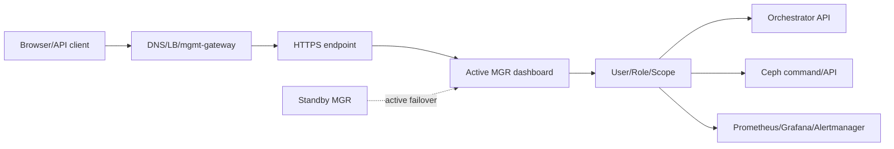
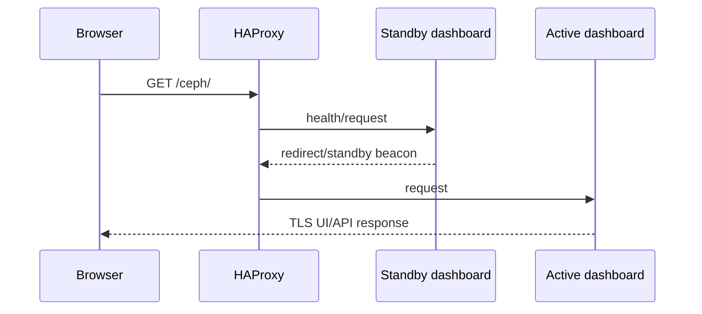
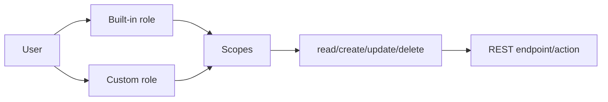
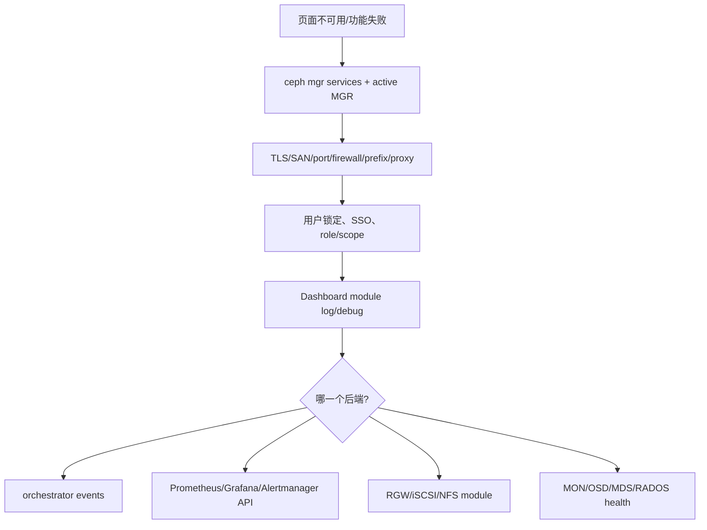
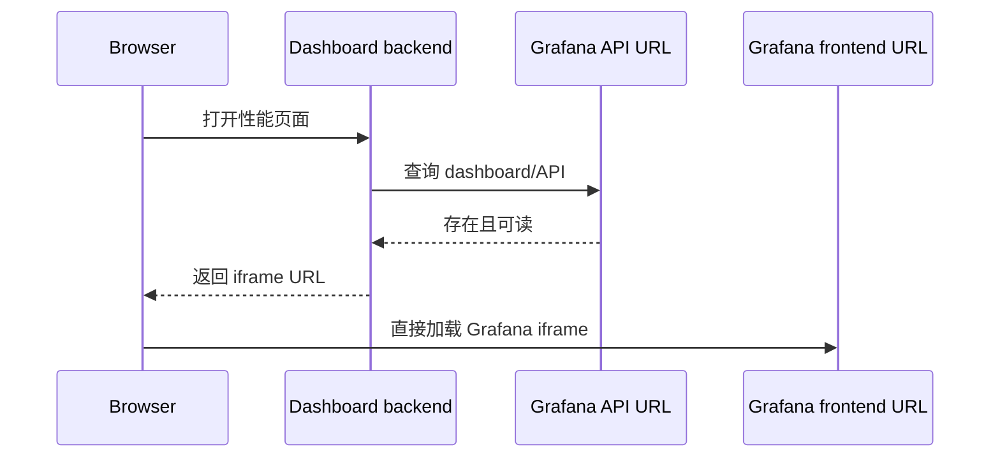
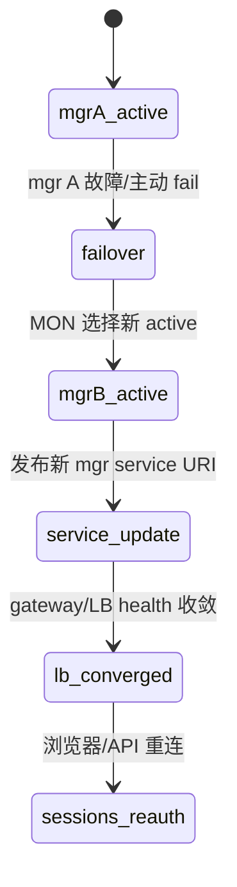

# Ceph Dashboard 企业管理面（Tentacle）

> Dashboard 是 active MGR 上的 HTTPS Web UI 与 REST API。它聚合 Ceph 状态并调用 orchestrator/服务 API，既能观察也能执行 OSD purge、RBD rollback、client eviction 等高风险动作，因此必须把 TLS、RBAC、SSO、审计和后端可用性作为同一管理面设计。

## 1. 请求路径和高可用



直接访问 active MGR URI 时，failover 后 endpoint 可能改变；standby beacon/redirect 能引导客户端，但生产更适合 mgmt-gateway 或受控 LB。`ceph mgr services` 是当前权威 URI。

```bash
ceph mgr module enable dashboard
ceph mgr services
ceph dashboard set-ssl-certificate -i dashboard.crt
ceph dashboard set-ssl-certificate-key -i dashboard.key
```

## 2. Landing Page 每个数字的真实来源

| 卡片 | 显示 | 正确解释 |
|---|---|---|
| Details | cluster fsid、release、hosts、daemons | inventory，不等于服务健康 |
| Status | overall health、按 severity 分组 alerts | 来自 Ceph health，需展开 detail |
| Capacity | raw used、nearfull warning、full danger | OSD 物理容量；不等于某 pool/tenant 可用量 |
| Inventory | hosts、OSD、MON、pool、RGW/FS 等数量 | 可点击进入具体资源 |
| Cluster utilization | used、IOPS、latency、client/recovery throughput | 来自 MGR/Prometheus，窗口和聚合影响读数 |

新版/旧版 landing page 由 `FEATURE_TOGGLE_DASHBOARD` 切换，旧版未来会移除。不要围绕旧 DOM/截图编写永久自动化。

支持 Chrome/Chromium 最近两个 major、Firefox 最近两个 major、Firefox ESR 最近 major；旧浏览器可能工作但不在保证范围。

## 3. TLS、地址、端口和代理

Dashboard 默认 HTTPS。`create-self-signed-cert` 适合初始实验，生产导入企业 CA 证书；证书 SAN 必须覆盖浏览器访问的 FQDN/VIP，不只是 MGR hostname。

可按全局或 MGR instance 设置 server address/port、SSL、证书。绑定 `0.0.0.0` 只表示监听全部接口，不是授权。防火墙仅允许管理网。

URL prefix 用于 `/ceph` 等反向代理子路径；redirect 可配置禁用、status code 和把 IP 解析为 hostname。反向代理必须传递正确 Host、scheme、WebSocket/stream、client IP，并匹配 prefix。HAProxy health check 应同时处理 active endpoint 和 standby redirect。



## 4. 本地用户、密码策略和锁定

首次创建 admin 后立即改默认凭据。用户包含 enabled、name/email、password expiration、roles；连续失败触发 account lockout，管理员可显式 unlock。

```bash
ceph dashboard ac-user-create ops -i password.txt read-only
ceph dashboard ac-user-show ops
ceph dashboard ac-user-set-roles ops <role>
ceph dashboard ac-user-lock ops
ceph dashboard ac-user-unlock ops
ceph dashboard ac-user-delete ops
```

密码策略可要求长度、复杂度、重复字符、用户名排除、字典检查和过期。密码通过 stdin/file 传入，避免命令行泄露。至少保留一个受控本地 break-glass 管理员，以处理 IdP 故障；其凭据离线保管并定期演练。

## 5. Role、Scope 与权限组合

权限以 scope + read/create/update/delete 组合。Scope 涵盖 hosts、OSD、pool、RBD image、CephFS、RGW、NFS、iSCSI、config、monitoring、manager 等。内置 administrator、read-only、block-manager、rgw-manager、cluster-manager 等角色可复用；自定义角色只赋业务职责所需动作。



只隐藏前端菜单不是安全边界，后端 API 必须验证权限。角色变更后用实际只读、创建、删除正反例验收。

## 6. SAML2 与 OAuth2/OIDC SSO

SAML2 配置 IdP metadata、entity ID、SP base URL、username attribute；OAuth2 配置 issuer、client ID/secret、redirect URI、scopes、claim。通过 oauth2-proxy/Keycloak 时，proxy 和 Dashboard 两边的 TLS、header、cookie、logout 必须一致。

SSO 上线顺序：保留本地 admin → 配置 IdP → 验证登录/退出/过期 → 验证 claim/role → 模拟 IdP 不可用 → 再要求普通用户 SSO。错误的 role mapping 可能让登录成功却越权，或让所有用户无权限。

## 7. Cluster、Host、Device 和 OSD 管理

Dashboard 可查看 host 上的 daemon、Ceph version、device inventory、SMART、health prediction、enclosure LED；通过 orchestrator 部署 OSD。OSD 页面可 up/down/out、reweight、scrub/deep-scrub、purge、改 device class 和 recovery profile。

这些按钮调用真实破坏性命令：

- `out` 触发重映射和数据迁移；
- purge 删除 OSD map/CRUSH/auth；
- device create/zap 改写磁盘；
- scrub/repair 消耗 I/O，repair 可能选择副本；
- recovery profile 改变客户与恢复资源竞争。

执行前后仍要保存 CLI JSON、events 和业务验证，Dashboard toast 不是最终证据。

## 8. Pool、RBD 与 Mirroring

Pool 页面管理 type、application、PG autoscaler、size/min_size、EC profile、CRUSH rule、quota 和 compression。配置组合必须遵守 RADOS 约束；Dashboard 不会替管理员证明 failure domain 容量足够。

RBD 页面支持 namespace/image、resize、QoS、snapshot、protect/unprotect、clone/copy/flatten/rollback、trash；RBD mirroring 页面管理 peer、daemon、pool/image mode 和 sync progress。Rollback、force promote/resync、snapshot delete 都可能丢当前数据，需应用停写和变更审批。

RBD image monitoring 不是默认覆盖所有 image。启用 pool/image 列表会增加指标开销，使用 Dashboard 配置或 MGR prometheus option 后验证实际 series。

## 9. CephFS、NFS、RGW 与 iSCSI

CephFS 页面显示 ranks、pools、clients、usage，可浏览目录、管理 quota/snapshot 和 evict client。Evict 会中断客户端并可能触发应用恢复，先确认 session 和 blocked operation。

NFS 页面通过 orchestrator/NFS module 管理 Ganesha cluster/export；后端 CephFS/RGW caps、pseudo path、client network、squash 和 HA 必须完整。iSCSI 页面依赖 ceph-iscsi gateway，可管理 target/image/initiator 和查看性能；gateway API credentials/SSL 需先配置。

RGW 管理先发现 realm/zone/gateway，并配置 admin resource；可管理用户、bucket、quota、versioning、MFA、placement。Dashboard admin API 凭据应独立最小 caps，不能复用普通 S3 key 或 client.admin。

## 10. Grafana、Prometheus 与 Alertmanager

Dashboard 内嵌 Grafana panel，数据来自 MGR prometheus module/ceph_exporter；需设置 Grafana API URL、frontend URL、证书验证和允许 embedding。匿名 Grafana 访问虽然配置简单，但会扩大指标暴露，生产使用认证/proxy。

Monitoring 页面列出 Prometheus rule、active alerts 和 Alertmanager silence，可创建/编辑/过期 silence。Silence 只抑制通知，不修复 health；必须写 matcher、owner、reason、expiry。Prometheus/Alertmanager API host、TLS CA、basic auth 配错会让 Ceph 正常但页面报错，应分层诊断。

## 11. Configuration Editor、Manager Modules 与日志

Configuration Editor 显示 option description、type、default 和当前 section 值，可直接修改 MON config DB。范围选错会影响所有 daemon；变更前用 CLI 导出旧值，并确认 runtime/restart 属性。

Manager Modules 页面 enable/disable module 和配置 option。关闭 orchestrator/prometheus/dashboard 本身会影响管理面；不要在同一页面无恢复路径地关闭当前访问依赖。

Cluster logs 可按 priority/date/keyword 筛选 event/audit log。Dashboard debug flag 和高 logging level 仅用于短时诊断，可能记录请求内容并增加磁盘。

## 12. API Auditing 与集中日志

Dashboard auditing 记录 REST API 的用户、路径、方法、时间、结果等，可发送到 cluster audit log；敏感字段需脱敏。集中日志将相关事件汇聚供检索，仍需定义 retention、访问控制和时钟同步。

企业审计至少关联：SSO/local identity、source IP、request ID、API action、Ceph command/event、资源前后状态和变更单。仅保留 Web access log 无法证明具体 OSD/RBD 操作结果。

## 13. 排障顺序



“页面某功能不可用”通常是后端模块、权限或 API 配置问题，不要先清 Dashboard 数据。登录失败检查 account lockout、密码过期、SSO claim/clock/cookie；定位 Dashboard 用 `ceph mgr services`；证书错误检查实际返回链而非配置文件名。

Dashboard 可生成 issue report，但上传前清除 host、IP、user、bucket 和 secret 等客户信息。

## 14. 启用、per-MGR 配置与证书切换

Dashboard module enable 后运行在 active MGR；standby 也加载 standby handler，以便发现/重定向。初次启用需要创建本地用户，密码从 `-i` 文件/stdin 读取：

```bash
ceph mgr module enable dashboard
ceph dashboard ac-user-create admin -i admin-password administrator
ceph mgr services
```

地址、端口和 TLS option 可设全局，也可按 `mgr/<id>/...` 覆盖。Per-daemon 配置适合多网卡或滚动换端口，但所有潜在 active MGR 都必须有可达配置；只配当前 active 会在 failover 后失联。

```bash
ceph config set mgr mgr/dashboard/server_addr 10.0.10.20
ceph config set mgr mgr/dashboard/ssl_server_port 8443
ceph config set mgr mgr/dashboard/ssl true

# 只作用于特定 mgr 实例的示意
ceph config set mgr mgr/dashboard/node-a/server_addr 10.0.10.21
ceph config set mgr mgr/dashboard/node-a/ssl_server_port 8443
```

内置 self-signed certificate 只适合首次接入。生产证书切换顺序：验证 PEM/key match、SAN/chain/expiry -> 导入 cert/key -> failover/restart module -> 从客户端读取实际证书链 -> 所有 MGR 逐一验证。私钥命令输入不进入 shell argument。每个 MGR 使用不同证书时，把实例 id 放在证书命令中：

```bash
ceph dashboard set-ssl-certificate node-a -i node-a.crt
ceph dashboard set-ssl-certificate-key node-a -i node-a.key
```

禁用 TLS 会把 session/cookie 和管理动作暴露为明文，只能在同机受控 TLS proxy 后且防火墙阻止直连时考虑。即使 proxy 终止 TLS，Dashboard 到 proxy 的 trust boundary也要明确。

## 15. RGW 管理后端：自动发现、凭据和超时

Cephadm 部署 RGW 时，Dashboard 通常自动配置管理 credential；也可显式执行：

```bash
ceph dashboard set-rgw-credentials
ceph dashboard set-rgw-api-admin-resource <admin-resource>
ceph dashboard set-rgw-hostname <gateway-daemon-name> <hostname>
ceph dashboard set-rest-requests-timeout 45
```

`set-rgw-credentials` 会为每个 realm 创建/更新 uid `dashboard` 的管理 user。它需要 Admin Ops API caps，不是业务 S3 admin key；审计和轮换按独立机器身份处理。Custom admin resource 必须与 RGW frontend 暴露路径一致。

Dashboard 从 service map/realm 找 RGW endpoint。若 daemon advertised hostname 从浏览器/MGR 不可解析，可按 daemon override hostname；修复 DNS 后应 unset override，避免永久漂移。REST request timeout 默认 45 秒，调大只容忍慢后端，不修复 RGW/RADOS latency。

自签 RGW 证书可临时 `set-rgw-api-ssl-verify False`，但这同时失去 CA 和 hostname 校验。生产导入正确 CA/SAN 并恢复验证。验证不仅打开 RGW 页面，还应创建受限 test user/bucket、读取 quota/versioning，并确认 Dashboard user 无客户 payload 超权。

## 16. iSCSI 管理后端与 credential URL

Dashboard 通过 ceph-iscsi `rbd-target-api` 管理 target，要求支持的 ceph-iscsi v3。每个 gateway 以完整 URL 注册，URL 含 scheme、API username/password、host 与可选 port，必须通过文件输入避免 credential 出现在 history/process list：

```bash
ceph dashboard iscsi-gateway-list
ceph dashboard iscsi-gateway-add -i gateway-url.txt <gateway-name>
ceph dashboard iscsi-gateway-rm <gateway-name>
```

Gateway URL 是 Dashboard 到 API 的控制连接，不是 initiator data path。API credential/SSL 验证成功后，还要看 TCMU runner、LIO session、RBD lock 和 initiator multipath。自签证书的 `set-iscsi-api-ssl-verification false` 只是临时兼容，优先部署可信证书。

删除 gateway registry 不会删除 iSCSI target/LUN；反过来，gateway API down 也不一定中断已有 data session。Dashboard 页面超时时先直接验证 gateway API 与 certificate，再看 cluster backend，避免对健康 RBD 做破坏性操作。

## 17. Grafana 嵌入的双连接模型

Dashboard 嵌入 Grafana 需要两条都通：active MGR backend 用 Grafana API URL 验证 dashboard 是否存在；浏览器通过 iframe 用 frontend URL 加载图表。



```bash
ceph dashboard set-grafana-api-url https://grafana.internal:3000
ceph dashboard set-grafana-frontend-api-url https://grafana.example.com
ceph dashboard set-grafana-api-ssl-verify true
```

若不设 frontend URL，浏览器沿用 API URL；管理网 DNS 对 MGR 可达但对用户浏览器不可达时必须分设。Grafana 需 `allow_embedding=true`，还要处理 CSP、X-Frame-Options、SameSite cookie 和认证 proxy。HTTPS Dashboard 嵌 HTTP Grafana 会被浏览器按 mixed content 阻止。

手工监控链的 Prometheus target至少包括 MGR prometheus endpoint 与 node_exporter；官方 dashboard JSON 的 metric/label 与 Ceph mixin 版本必须匹配。历史安装要求特定 datasource name/plugin 的场景应随目标 Grafana/Ceph 版本核验，不能把旧教程中的匿名 Viewer 当生产默认。RBD per-image monitoring 默认关闭，因为 series 收集会显著增加负载。

## 18. Prometheus/Alertmanager 三种接法

Dashboard 可用三种方式消费 alert：

| 模式 | 数据流 | 能力 |
|---|---|---|
| Dashboard webhook receiver | Alertmanager POST `/api/prometheus_receiver` | UI 内通知，不能完整管理 alerts/silences |
| Prometheus + Alertmanager API | Dashboard 主动读两个 API | 查看 rule/active alerts，创建/重建/更新/expire silence |
| 两者同时 | webhook + API | 通知与管理兼有；设计上去重但仍需验证 |

```bash
ceph dashboard set-alertmanager-api-host http://alertmanager:9093
ceph dashboard set-prometheus-api-host http://prometheus:9090
ceph dashboard set-alertmanager-api-ssl-verify true
ceph dashboard set-prometheus-api-ssl-verify true
```

Webhook 的 Alertmanager route/receiver 必须指向外部可达 Dashboard base URL，并信任其 certificate。API mode 中，Dashboard 从 Prometheus 读取 configured alerts，用 Alertmanager 读取 active state/silences。Silence update 在 Alertmanager 的真实语义是创建新 silence并让旧 silence expire，不是原地可变记录。

创建 silence 时 matcher 应尽量精确，填写 creator/comment/start/end；从 alert 创建能减少 label 拼错。UI 对 alert 任何可见变化可能生成通知，因为它无法从 Alertmanager API 知道外部通知是否已经实际发送。证书验证失败应安装 CA，关闭 verify 只用于有时限诊断。

## 19. SAML2 与 OAuth2 的实际授权边界

SAML2 依赖 MGR 环境安装 `python-saml`。Setup 输入 Dashboard 外部 base URL、IdP metadata URL/file/XML、username attribute（默认 `uid`）、可选 IdP entity id 与 SP signing/encryption cert/key。SP issuer/metadata URL 基于 `<base-url>/auth/saml2/metadata`，proxy prefix 和 external hostname必须在 IdP redirect 中完全一致。

```bash
ceph dashboard sso setup saml2 \
  https://ceph.example.com https://idp.example.com/metadata uid
ceph dashboard sso show saml2
ceph dashboard sso enable saml2
ceph dashboard sso status
ceph dashboard sso disable
```

SAML只负责 authentication；Dashboard 仍用本地同名 user/roles authorization。因此先创建用户和角色，IdP 返回 username 必须精确匹配。Metadata/cert 轮换前并行信任新链并测试，避免 active MGR reload 后所有 SSO 登录中断。

Tentacle OAuth2 模式以 cephadm mgmt-gateway + oauth2-proxy 为入口，推荐/测试 Keycloak。IdP client 注册 `/oauth2/callback` 和 sign-out URL；mgmt-gateway spec 开 `enable_auth=true`。OAuth proxy 提供已认证 identity/role header，Dashboard 做授权。Proxy 到 Dashboard 的直连必须受网络限制，否则攻击者可绕过 proxy 伪造 header。

SSO 变更始终保留本地 break-glass admin。验收 login、logout、token/assertion expiry、用户 disabled、role 降权、IdP 不可用、MGR failover 和反向代理 cookie。不要只证明能跳转到 IdP。

## 20. 密码策略、角色命令和会话回收

密码策略可分别控制最小长度、复杂度、重复字符、用户名包含、字典检查、expiration 和首次登录更新。策略变更通常约束新设密码，不应假定自动使全部旧密码失效；通过用户过期/强制更新计划轮换。

内置角色覆盖 administrator、read-only、block/rgw/cluster 等职责，自定义角色由 scope permissions组成：

```bash
ceph dashboard ac-role-create storage-operator
ceph dashboard ac-role-add-scope-perms storage-operator \
  pool read update
ceph dashboard ac-role-add-scope-perms storage-operator \
  rbd-image read create update
ceph dashboard ac-user-set-roles ops storage-operator
```

权限动词是 API resource CRUD，不完全等于底层 Ceph command；例如 update RBD image 可能包含 resize/QoS 等多种动作。用角色用户实际调用允许/禁止 endpoint，并确认后端返回 403，而不是仅菜单隐藏。

账号 lockout 达失败阈值后需另一个管理员 unlock；用户 disable、delete、role remove 后还要考虑已发 session/token。敏感降权时主动结束会话或等待明确 TTL，不把“数据库已改”当即时撤权证据。审计本地与 SSO identity的稳定映射，避免 username 重用继承旧记录。

## 21. Proxy redirect、HAProxy 与 active 切换

Dashboard standby 可把请求重定向到 active。可配置 URL prefix、关闭 redirect、redirect status code，以及在 redirect 前把 IP reverse-resolve 成 hostname。Reverse DNS 不稳定会造成慢响应或错误名称；生产通常由 mgmt-gateway/LB 保持固定 URL。

Prefix 必须在四处一致：浏览器外部 URL、proxy route、Dashboard prefix、SSO callback/issuer。遗漏尾斜杠或重复 prefix 会导致静态资源 404、登录循环或 API CSRF 失败。

HAProxy backend health 应区分 active/standby并接受计划 failover。Sticky session 不能把用户长期钉死到旧 active；Web/API client要处理 3xx、短连接失败和重新认证。LB TLS passthrough 与 termination 的 Host/SNI、client IP、certificate owner 不同，选定后写清信任边界。



## 22. Audit、插件和故障取证

开启 API auditing 后，Dashboard 对 PUT/POST/DELETE 记录 user、URL、method、origin、参数摘要和结果到 Ceph audit log。GET 默认不作为变更审计，但敏感读取可由外部 access/proxy log补齐。Password、secret key、token、certificate key 必须被 redact；在升级后做一次故意失败和成功操作核对字段。

Dashboard plugin 通过标准 hook 加载。Feature toggles 控制 UI 功能显隐，不能替代 backend RBAC；MOTD 显示运维公告并可带 severity/expiry；debug plugin/flag 只用于隔离诊断。关闭某 feature 不删除底层 RBD/RGW/NFS 资源。

排障需保留：`ceph mgr dump/services/module ls`、active/standby identity、Dashboard config、实际 certificate、HTTP status/request id、用户/role（不含 secret）、module log 和后端 API结果。临时提高 `debug_mgr`/Dashboard log 后立即恢复，避免审计盘被 debug 淹没。

| 现象 | 最小判别 |
|---|---|
| URI 不存在 | `ceph mgr services` 是否发布 dashboard |
| 浏览器 TLS 错 | 直接读取 endpoint cert chain/SAN/expiry |
| 登录循环 | base URL/prefix/cookie/SSO callback/clock |
| 页面空白 | 浏览器 console + static prefix + API 401/403/5xx |
| 单功能失败 | 对应 orchestrator/RGW/iSCSI/Prometheus API 与权限 |
| Grafana 空图 | 双 URL、iframe policy、datasource、metric series/time range |
| Failover 后失败 | 新 active config/cert、service URI、LB health/session |

Issue report 上传前删除 hostname、IP、FSID、username、bucket/object、key/token 和内部 URL；保留版本、health code、匿名化时间线与 stack trace。问题解决以原失败 API和客户操作成功为准，不以 UI toast 消失为准。

## 23. 官方基线与许可

来源：Ceph Tentacle 官方 `doc/mgr/dashboard.rst`，核验提交 `76fba24cef67d9219f97eeaa68cd1a848da3f2b2`。Ceph authors and contributors，CC BY-SA 3.0。
