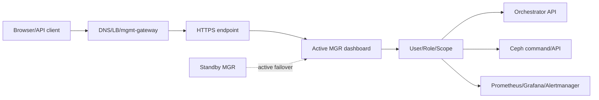
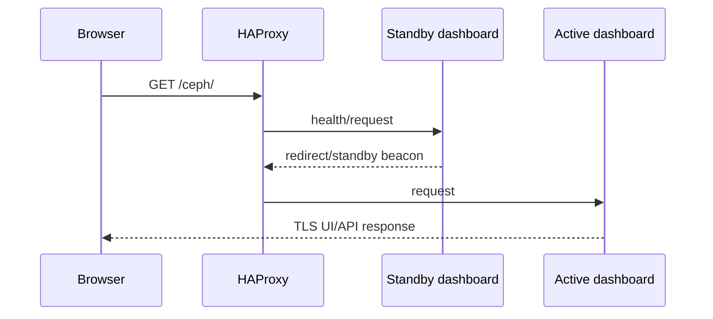
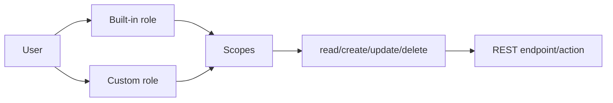
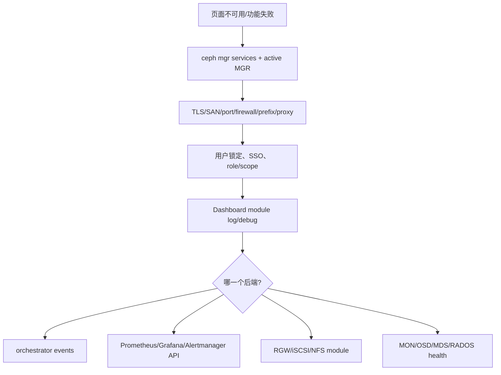
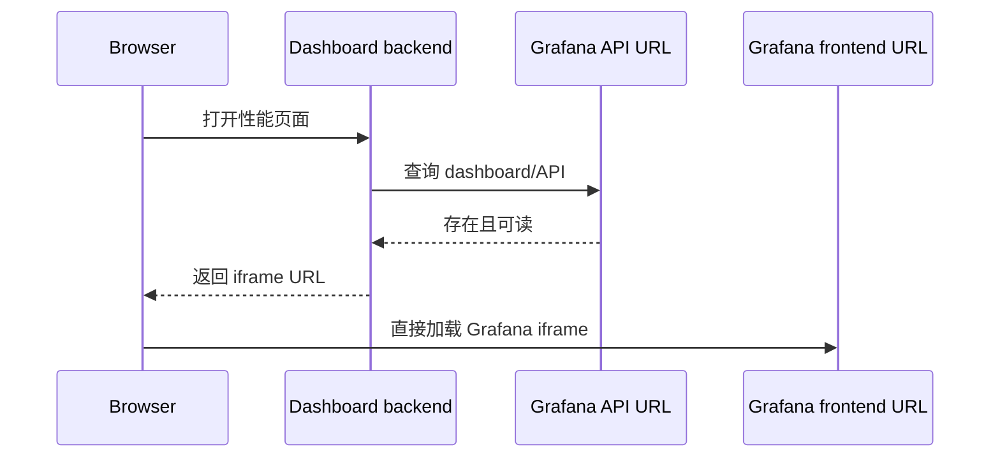
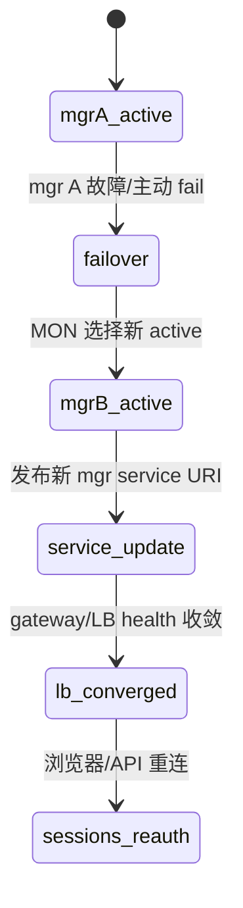
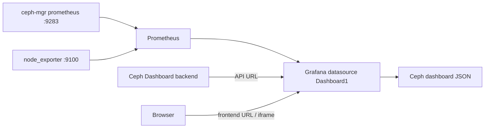
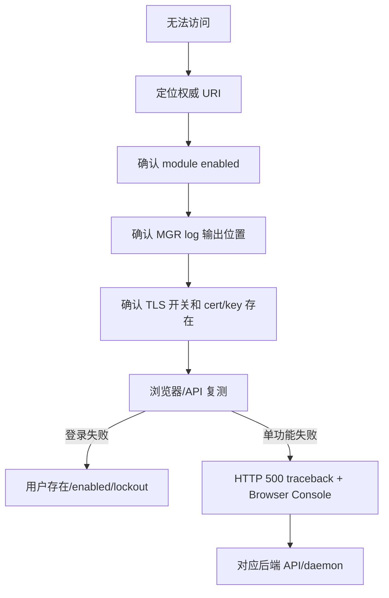

# Ceph Dashboard 企业管理面（Tentacle）

> Dashboard 是 active MGR 上的 HTTPS Web UI 与 REST API。它聚合 Ceph 状态并调用 orchestrator/服务 API，既能观察也能执行 OSD purge、RBD rollback、client eviction 等高风险动作，因此必须把 TLS、RBAC、SSO、审计和后端可用性作为同一管理面设计。

Dashboard、IdP、Grafana、Prometheus 与 Alertmanager 必须按目标环境分别验证。HTTP 成功、页面 toast 或登录跳转都不等于后端资源操作已经完成。

Dashboard 是 `ceph-mgr` module：后端基于 CherryPy 并提供自有 REST API，WebUI 基于 Angular/TypeScript。它从早期只读监控面发展为可执行资源管理的控制面，并支持运行时国际化（I18N）。通过发行版安装 `ceph-mgr-dashboard` 时，依赖由包管理器处理；只有从源码开发 Dashboard 才进入 `src/pybind/mgr/dashboard/README.rst` 与 `HACKING.rst` 的开发流程。

## 1. 请求路径和高可用



直接访问 active MGR URI 时，failover 后 endpoint 可能改变；standby beacon/redirect 能引导客户端，但生产更适合 mgmt-gateway 或受控 LB。`ceph mgr services` 是当前权威 URI。

```bash
ceph mgr module enable dashboard
ceph mgr services
ceph dashboard create-self-signed-cert       # 仅用于快速初始接入
ceph dashboard set-ssl-certificate -i dashboard.crt
ceph dashboard set-ssl-certificate-key -i dashboard.key
ceph mgr fail mgr                          # 官方示例：证书变更后触发 MGR 重启/切换
```

## 2. Landing Page 每个数字的真实来源

| 卡片 | 显示 | 正确解释 |
|---|---|---|
| Details | cluster fsid、release、hosts、daemons | inventory，不等于服务健康 |
| Status | overall health、按 severity 分组 alerts | 来自 Ceph health，需展开 detail |
| Capacity | raw used、nearfull warning、full danger | OSD 物理容量；不等于某 pool/tenant 可用量 |
| Inventory | hosts、OSD、MON、pool、RGW/FS 等数量 | 可点击进入具体资源 |
| Cluster utilization | used、IOPS、latency、client/recovery throughput | 来自 MGR/Prometheus，窗口和聚合影响读数 |

新版/旧版 landing page 由 `FEATURE_TOGGLE_DASHBOARD` 切换，旧版未来会移除。不要围绕旧 DOM/截图编写永久自动化。

支持 Chrome/Chromium 最近两个 major、Firefox 最近两个 major、Firefox ESR 最近 major；旧浏览器可能工作但不在保证范围。

## 3. TLS、地址、端口和代理

Dashboard 默认 HTTPS。`create-self-signed-cert` 适合初始实验，生产导入企业 CA 证书；证书 SAN 必须覆盖浏览器访问的 FQDN/VIP，不只是 MGR hostname。

可按全局或 MGR instance 设置 server address/port、SSL、证书。绑定 `0.0.0.0` 只表示监听全部接口，不是授权。防火墙仅允许管理网。

URL prefix 用于 `/ceph` 等反向代理子路径；redirect 可配置禁用、status code 和把 IP 解析为 hostname。反向代理必须传递正确 Host、scheme、WebSocket/stream、client IP，并匹配 prefix。HAProxy health check 应同时处理 active endpoint 和 standby redirect。



## 4. 本地用户、密码策略和锁定

首次创建 admin 后立即改默认凭据。用户包含 enabled、name/email、password expiration、roles；连续失败触发 account lockout，管理员可显式 unlock。

```bash
ceph dashboard ac-user-create ops -i password.txt read-only
ceph dashboard ac-user-show ops
ceph dashboard ac-user-set-roles ops <role>
ceph dashboard ac-user-disable ops
ceph dashboard ac-user-enable ops
ceph dashboard ac-user-delete ops
ceph dashboard get-account-lockout-attempts
ceph dashboard set-account-lockout-attempts <value:int>
```

密码策略可要求长度、复杂度、重复字符、用户名排除、字典检查和过期。密码通过 stdin/file 传入，避免命令行泄露。至少保留一个受控本地 break-glass 管理员，以处理 IdP 故障；其凭据离线保管并定期演练。

## 5. Role、Scope 与权限组合

权限以 scope + read/create/update/delete 组合。Scope 涵盖 hosts、OSD、pool、RBD image、CephFS、RGW、NFS、iSCSI、config、monitoring、manager 等。内置 administrator、read-only、block-manager、rgw-manager、cluster-manager 等角色可复用；自定义角色只赋业务职责所需动作。



只隐藏前端菜单不是安全边界，后端 API 必须验证权限。角色变更后用实际只读、创建、删除正反例验收。

## 6. SAML2 与 OAuth2/OIDC SSO

SAML2 的 Dashboard setup 接收 IdP metadata、entity ID、SP base URL、username attribute。Tentacle 的 OAuth2 路径依赖 cephadm `mgmt-gateway` 与 `oauth2-proxy`；issuer、client ID/secret、redirect URI、scopes 和 claim 属于 IdP/oauth2-proxy 配置，不是 Dashboard `sso enable oauth2` 命令参数。Proxy、IdP 和 Dashboard 的 TLS、header、cookie、callback/logout URL 必须一致。

SSO 上线顺序：保留本地 admin → 配置 IdP → 验证登录/退出/过期 → 验证 claim/role → 模拟 IdP 不可用 → 再要求普通用户 SSO。错误的 role mapping 可能让登录成功却越权，或让所有用户无权限。

## 7. Cluster、Host、Device 和 OSD 管理

Dashboard 可查看 host 上的 daemon、Ceph version、device inventory、SMART、health prediction、enclosure LED；通过 orchestrator 部署 OSD。MON 页面展示 monitor、quorum 状态和 open session；各运行服务可查看 service-specific performance counter。OSD 页面除 status/usage 外，还展示 OSD map attribute、metadata、performance counter、读写 usage histogram，并可 up/down/out、reweight、scrub/deep-scrub、purge、调整 scrub 配置、改 device class 和 recovery/backfill profile。

这些按钮调用真实破坏性命令：

- `out` 触发重映射和数据迁移；
- purge 删除 OSD map/CRUSH/auth；
- device create/zap 改写磁盘；
- scrub/repair 消耗 I/O，repair 可能选择副本；
- recovery profile 改变业务 I/O 与恢复流量的资源竞争。

执行前后仍要保存 CLI JSON、events 和业务验证，Dashboard toast 不是最终证据。

## 8. Pool、RBD 与 Mirroring

Pool 页面管理 type、application、PG autoscaler、placement group、size/min_size、EC profile、CRUSH rule、quota 和 compression。配置组合必须遵守 RADOS 约束；Dashboard 不会替管理员证明 failure domain 容量足够。

RBD 页面支持 namespace/image、resize、global/per-pool/per-image I/O 或 bandwidth QoS、snapshot、protect/unprotect、clone/copy/flatten/rollback、trash；RBD mirroring 页面管理 peer、daemon、pool/image mode 和 sync progress。Rollback、force promote/resync、snapshot delete 都可能丢当前数据，需应用停写和变更审批。

RBD image monitoring 不是默认覆盖所有 image。启用 pool/image 列表会增加指标开销，使用 Dashboard 配置或 MGR prometheus option 后验证实际 series。

## 9. CephFS、NFS、RGW 与 iSCSI

CephFS 页面显示 ranks、pools、clients、usage，可浏览目录、管理 quota/snapshot 和 evict client。Evict 会中断客户端并可能触发应用恢复，先确认 session 和 blocked operation。

NFS 页面通过 orchestrator/NFS module 管理 Ganesha cluster/export，官方支持 CephFS filesystem 和 RGW S3 bucket 作为 export backend；后端 caps、pseudo path、client network、squash 和 HA 必须完整。iSCSI 页面依赖 ceph-iscsi gateway，可列出 TCMU runner host、image 及读写操作/流量，管理 target/LUN/initiator，并展示 gateway status 与 active initiator；gateway API credentials/SSL 需先配置。

Dashboard 管理 NFS cluster/export 的官方前置条件是启用 NFS MGR module；如果 NFS 页面不可用，先以 `ceph mgr module ls` 核对 NFS module，而不是创建或删除现有 export。

RGW 管理先发现 realm/zone/gateway，并配置 admin resource；页面展示 active gateway 与 performance counter，可管理用户及其 quota、bucket owner/quota/versioning/MFA/placement。Dashboard admin API 凭据应独立最小 caps，不能复用普通 S3 key 或 client.admin。

## 10. Grafana、Prometheus 与 Alertmanager

Dashboard 内嵌 Grafana panel，数据来自 MGR prometheus module/ceph_exporter；需设置 Grafana API URL、frontend URL、证书验证和允许 embedding。匿名 Grafana 访问虽然配置简单，但会扩大指标暴露，生产使用认证/proxy。

Monitoring 页面列出 Prometheus rule、active alerts 和 Alertmanager silence，可创建/编辑/过期 silence。Silence 只抑制通知，不修复 health；必须写 matcher、owner、reason、expiry。Prometheus/Alertmanager API host、TLS CA、basic auth 配错会让 Ceph 正常但页面报错，应分层诊断。

## 11. Configuration Editor、Manager Modules 与日志

Configuration Editor 显示 option description、type、default 和当前 section 值，可直接修改 MON config DB。范围选错会影响所有 daemon；变更前用 CLI 导出旧值，并确认 runtime/restart 属性。

Manager Modules 页面 enable/disable module 和配置 option。关闭 orchestrator/prometheus/dashboard 本身会影响管理面；不要在同一页面无恢复路径地关闭当前访问依赖。

Cluster logs 可按 priority/date/keyword 筛选 event/audit log。Dashboard debug flag 和高 logging level 仅用于短时诊断，可能记录请求内容并增加磁盘。

## 12. API Auditing 与集中日志

Dashboard auditing 把 REST API 的 `from`、`path`、`method`、`user` 写入 Ceph audit log，日志系统本身提供时间戳，payload 可选；官方字段中没有独立的“后端业务结果”字段。集中日志将相关事件汇聚供检索，仍需定义 retention、访问控制和时钟同步。

企业审计至少关联：SSO/local identity、source IP、request ID、API action、Ceph command/event、资源前后状态和变更单。仅保留 Web access log 无法证明具体 OSD/RBD 操作结果。

## 13. 排障顺序



“页面某功能不可用”通常是后端模块、权限或 API 配置问题，不要先清 Dashboard 数据。登录失败检查 account lockout、密码过期、SSO claim/clock/cookie；定位 Dashboard 用 `ceph mgr services`；证书错误检查实际返回链而非配置文件名。

Dashboard 可生成 issue report，但上传前清除 host、IP、user、bucket、secret 和业务数据等敏感信息。

## 14. 启用、per-MGR 配置与证书切换

Dashboard module enable 后运行在 active MGR；standby 也加载 standby handler，以便发现/重定向。初次启用需要创建本地用户，密码从 `-i` 文件/stdin 读取：

```bash
ceph mgr module enable dashboard
ceph dashboard ac-user-create admin -i admin-password administrator
ceph mgr services
```

地址、端口和 TLS option 可设全局，也可按 `mgr/<id>/...` 覆盖。Per-daemon 配置适合多网卡或滚动换端口，但所有潜在 active MGR 都必须有可达配置；只配当前 active 会在 failover 后失联。

官方默认值是：TLS 开启时监听 TCP `8443`，TLS 关闭时监听 `8080`；未指定地址时绑定 `::`，即所有可用 IPv4/IPv6 地址。默认监听不是生产暴露策略，仍需管理网、防火墙和代理访问控制。

```bash
ceph config set mgr mgr/dashboard/server_addr 10.0.10.20
ceph config set mgr mgr/dashboard/server_port 8080
ceph config set mgr mgr/dashboard/ssl_server_port 8443
ceph config set mgr mgr/dashboard/ssl true

# 只作用于特定 mgr 实例的示意
ceph config set mgr mgr/dashboard/node-a/server_addr 10.0.10.21
ceph config set mgr mgr/dashboard/node-a/server_port 8080
ceph config set mgr mgr/dashboard/node-a/ssl_server_port 8443
```

官方通用语法是 `mgr/dashboard/$name/server_addr`、`mgr/dashboard/$name/server_port` 和 `mgr/dashboard/$name/ssl_server_port`，其中 `$name` 是承载 Dashboard 的 ceph-mgr 实例 ID。

内置 self-signed certificate 只适合首次接入。生产证书切换顺序：验证 PEM/key match、SAN/chain/expiry -> 导入 cert/key -> failover/restart module -> 从客户端读取实际证书链 -> 所有 MGR 逐一验证。私钥命令输入不进入 shell argument。每个 MGR 使用不同证书时，把实例 id 放在证书命令中：

Tentacle 官方给出的快速 key/certificate 生成示例是：

```bash
openssl req -new -nodes -x509 \
  -subj "/O=IT/CN=ceph-mgr-dashboard" -days 3650 \
  -keyout dashboard.key -out dashboard.crt -extensions v3_ca
```

该命令生成自签材料；生产仍须按企业 PKI 流程签发包含实际访问 FQDN/VIP SAN 的证书。示例中的 CN、十年有效期和文件权限不能直接作为生产基线。

```bash
ceph dashboard set-ssl-certificate node-a -i node-a.crt
ceph dashboard set-ssl-certificate-key node-a -i node-a.key
```

证书或私钥变化后必须重启 MGR process。官方给出两条路径：`ceph mgr fail mgr`，或禁用再启用 Dashboard module 以触发 MGR respawn：

```bash
ceph mgr module disable dashboard
ceph mgr module enable dashboard
```

禁用 TLS 的官方命令是 `ceph config set mgr mgr/dashboard/ssl false`。它会把 session/cookie 和管理动作暴露为明文，只能在同机受控 TLS proxy 后且防火墙阻止直连时考虑。即使 proxy 终止 TLS，Dashboard 到 proxy 的 trust boundary 也要明确。

## 15. RGW 管理后端：自动发现、凭据和超时

Cephadm 部署 RGW 时，Dashboard 通常自动配置管理 credential；也可显式执行：

```bash
ceph dashboard set-rgw-credentials
ceph dashboard set-rgw-api-admin-resource <admin-resource>
ceph dashboard set-rgw-hostname <gateway-daemon-name> <hostname>
ceph dashboard unset-rgw-hostname <gateway-daemon-name>
ceph dashboard set-rest-requests-timeout 45
```

`set-rgw-credentials` 会为每个 realm 创建/更新 uid `dashboard` 的管理 user。它需要 Admin Ops API caps，不是业务 S3 admin key；审计和轮换按独立机器身份处理。Custom admin resource 必须与 RGW frontend 暴露路径一致。

Dashboard 从 service map/realm 找 RGW endpoint。若 daemon advertised hostname 从浏览器/MGR 不可解析，可按 daemon override hostname；修复 DNS 后应 unset override，避免永久漂移。REST request timeout 默认 45 秒，调大只容忍慢后端，不修复 RGW/RADOS latency。

自签 RGW 证书可临时 `set-rgw-api-ssl-verify False`，但这同时失去 CA 和 hostname 校验。生产导入正确 CA/SAN 并恢复验证。验证不仅打开 RGW 页面，还应创建受限 test user/bucket、读取 quota/versioning，并确认 Dashboard user 无业务 payload 超权。

```bash
ceph dashboard set-rgw-api-ssl-verify False
```

## 16. iSCSI 管理后端与 credential URL

Dashboard 通过 ceph-iscsi `rbd-target-api` 管理 target，要求支持的 ceph-iscsi v3。每个 gateway 以完整 URL 注册，URL 含 scheme、API username/password、host 与可选 port，必须通过文件输入避免 credential 出现在 history/process list：

```bash
ceph dashboard iscsi-gateway-list
ceph dashboard iscsi-gateway-add -i gateway-url.txt <gateway-name>
ceph dashboard iscsi-gateway-rm <gateway-name>
```

Gateway URL 是 Dashboard 到 API 的控制连接，不是 initiator data path。API credential/SSL 验证成功后，还要看 TCMU runner、LIO session、RBD lock 和 initiator multipath。自签证书的 `set-iscsi-api-ssl-verification false` 只是临时兼容，优先部署可信证书。

```bash
ceph dashboard set-iscsi-api-ssl-verification false
```

删除 gateway registry 不会删除 iSCSI target/LUN；反过来，gateway API down 也不一定中断已有 data session。Dashboard 页面超时时先直接验证 gateway API 与 certificate，再看 cluster backend，避免对健康 RBD 做破坏性操作。

## 17. Grafana 嵌入的双连接模型

Dashboard 嵌入 Grafana 需要两条都通：active MGR backend 用 Grafana API URL 验证 dashboard 是否存在；浏览器通过 iframe 用 frontend URL 加载图表。



```bash
ceph dashboard set-grafana-api-url https://grafana.internal:3000
ceph dashboard set-grafana-frontend-api-url https://grafana.example.com
ceph dashboard set-grafana-api-ssl-verify true
```

若不设 frontend URL，浏览器沿用 API URL；管理网 DNS 对 MGR 可达但对用户浏览器不可达时必须分设。Grafana 需 `allow_embedding=true`，还要处理 CSP、X-Frame-Options、SameSite cookie 和认证 proxy。HTTPS Dashboard 嵌 HTTP Grafana 会被浏览器按 mixed content 阻止。

自签 Grafana 的官方临时兼容入口是 `ceph dashboard set-grafana-api-ssl-verify False`；这会同时关闭 CA 与 hostname 验证，生产必须安装可信证书并恢复校验。

Grafana API URL 可用 `ceph dashboard reset-grafana-api-url` 清除。清除前记录旧值；清除会使 Dashboard 失去后端图表存在性检查入口，不应把“iframe 尚可从浏览器直开”误判为集成仍健康。

手工监控链的 Prometheus target至少包括 MGR prometheus endpoint 与 node_exporter；官方 dashboard JSON 的 metric/label 与 Ceph mixin 版本必须匹配。历史安装要求特定 datasource name/plugin 的场景应随目标 Grafana/Ceph 版本核验，不能把旧教程中的匿名 Viewer 当生产默认。RBD per-image monitoring 默认关闭，因为 series 收集会显著增加负载。

## 18. Prometheus/Alertmanager 三种接法

Dashboard 可用三种方式消费 alert：

| 模式 | 数据流 | 能力 |
|---|---|---|
| Dashboard webhook receiver | Alertmanager POST `/api/prometheus_receiver` | UI 内通知，不能完整管理 alerts/silences |
| Prometheus + Alertmanager API | Dashboard 主动读两个 API | 查看 rule/active alerts，创建/重建/更新/expire silence |
| 两者同时 | webhook + API | 通知与管理兼有；设计上去重但仍需验证 |

```bash
ceph dashboard set-alertmanager-api-host http://alertmanager:9093
ceph dashboard set-prometheus-api-host http://prometheus:9090
ceph dashboard set-alertmanager-api-ssl-verify true
ceph dashboard set-prometheus-api-ssl-verify true
```

Webhook 的 Alertmanager route/receiver 必须指向外部可达 Dashboard base URL，并信任其 certificate。API mode 中，Dashboard 从 Prometheus 读取 configured alerts，用 Alertmanager 读取 active state/silences。Silence update 在 Alertmanager 的真实语义是创建新 silence并让旧 silence expire，不是原地可变记录。

官方 webhook receiver 最小形态是：

```yaml
route:
  receiver: ceph-dashboard
receivers:
  - name: ceph-dashboard
    webhook_configs:
      - url: https://<dashboard>/api/prometheus_receiver
```

API mode 的官方入口是：

```bash
ceph dashboard set-alertmanager-api-host 'http://<alertmanager-host>:9093'
ceph dashboard set-prometheus-api-host 'http://<prometheus-host>:9090'
ceph dashboard set-alertmanager-api-ssl-verify true
ceph dashboard set-prometheus-api-ssl-verify true
```

自签名 Prometheus/Alertmanager 只可在受控诊断窗口使用 `...-ssl-verify False`；关闭验证会失去 CA 和 hostname 校验。只有接入 Alertmanager API 才能在 Dashboard 中管理 silence；仅 webhook 只能接收通知。

```bash
ceph dashboard set-prometheus-api-ssl-verify False
ceph dashboard set-alertmanager-api-ssl-verify False
```

创建 silence 时 matcher 应尽量精确，填写 creator/comment/start/end；从 alert 创建能减少 label 拼错。UI 对 alert 任何可见变化可能生成通知，因为它无法从 Alertmanager API 知道外部通知是否已经实际发送。证书验证失败应安装 CA，关闭 verify 只用于有时限诊断。

API 模式启用 Monitoring 下的 `Active Alerts`、`All Alerts`、`Silences`。Alert 可按 name、job、severity、state、start time 排序；silence 可按 id、creator、status、start、updated、end time 排序，并可从零创建、从 alert 创建、从过期 silence 重建、主动 expire。更新 silence 会重建新记录并 expire 旧记录。

## 19. SAML2 与 OAuth2 的实际授权边界

SAML2 依赖 MGR 环境安装 `python-saml`。Setup 输入 Dashboard 外部 base URL、IdP metadata URL/file/XML、username attribute（默认 `uid`）、可选 IdP entity id 与 SP signing/encryption cert/key。SP issuer/metadata URL 基于 `<base-url>/auth/saml2/metadata`，proxy prefix 和 external hostname 必须在 IdP redirect 中完全一致。

```bash
ceph dashboard sso setup saml2 \
  <ceph_dashboard_base_url> <idp_metadata> \
  [<idp_username_attribute>] [<idp_entity_id>] \
  [<sp_x_509_cert>] [<sp_private_key>]
ceph dashboard sso show saml2
ceph dashboard sso enable saml2
ceph dashboard sso status
ceph dashboard sso disable
```

SAML只负责 authentication；Dashboard 仍用本地同名 user/roles authorization。因此先创建用户和角色，IdP 返回 username 必须精确匹配。Metadata/cert 轮换前并行信任新链并测试，避免 active MGR reload 后所有 SSO 登录中断。

Tentacle OAuth2 模式以 cephadm mgmt-gateway + oauth2-proxy 为入口，推荐且已测试的 IdP 是 Keycloak。IdP client 注册登录回调 `https://<host-or-ip>/oauth2/callback` 和退出地址 `https://<host-or-ip>/oauth2/sign_out`；mgmt-gateway spec 开 `enable_auth=true`。IdP 用户必须具有可用于 Dashboard authorization 的有效角色。OAuth proxy 提供已认证 identity/role header，Dashboard 做授权。Proxy 到 Dashboard 的直连必须受网络限制，否则攻击者可绕过 proxy 伪造 header。

官方启用 auth 的编排命令形态是：

```bash
ceph orch apply mgmt-gateway --enable_auth=true --placement=<ceph-node>
ceph dashboard sso disable
ceph dashboard sso status
ceph dashboard sso enable oauth2
```

SSO 变更始终保留本地 break-glass admin。验收 login、logout、token/assertion expiry、用户 disabled、role 降权、IdP 不可用、MGR failover 和反向代理 cookie。不要只证明能跳转到 IdP。

## 20. 密码策略、角色命令和会话回收

密码策略可分别控制最小长度、复杂度、重复字符、用户名包含、字典检查、expiration 和首次登录更新。策略变更通常约束新设密码，不应假定自动使全部旧密码失效；通过用户过期/强制更新计划轮换。

内置角色覆盖 administrator、read-only、block/rgw/cluster 等职责，自定义角色由 scope permissions组成：

```bash
ceph dashboard ac-role-create storage-operator
ceph dashboard ac-role-add-scope-perms storage-operator \
  pool read update
ceph dashboard ac-role-add-scope-perms storage-operator \
  rbd-image read create update
ceph dashboard ac-user-set-roles ops storage-operator
```

权限动词是 API resource CRUD，不完全等于底层 Ceph command；例如 update RBD image 可能包含 resize/QoS 等多种动作。用角色用户实际调用允许/禁止 endpoint，并确认后端返回 403，而不是仅菜单隐藏。

账号 lockout 达失败阈值后需另一个管理员重新启用；官方入口是 `ceph dashboard ac-user-enable <username>`。把阈值设为 `0` 会关闭 lockout：

```bash
ceph dashboard set-account-lockout-attempts 0
```

这会增加暴力破解和字典攻击风险，不可作为生产登录故障的常规修复。用户 disable、delete、role remove 后还要考虑已发 session/token。敏感降权时主动结束会话或等待明确 TTL，不把“数据库已改”当即时撤权证据。审计本地与 SSO identity 的稳定映射，避免 username 重用继承旧记录。

官方密码策略默认开启，至少包括长度、旧密码重复、用户名、排除词、复杂度、连续字符和重复字符检查；每项都可独立开关：

```bash
ceph dashboard set-pwd-policy-enabled <true|false>
ceph dashboard set-pwd-policy-check-length-enabled <true|false>
ceph dashboard set-pwd-policy-check-oldpwd-enabled <true|false>
ceph dashboard set-pwd-policy-check-username-enabled <true|false>
ceph dashboard set-pwd-policy-check-exclusion-list-enabled <true|false>
ceph dashboard set-pwd-policy-check-complexity-enabled <true|false>
ceph dashboard set-pwd-policy-check-sequential-chars-enabled <true|false>
ceph dashboard set-pwd-policy-check-repetitive-chars-enabled <true|false>
ceph dashboard set-pwd-policy-min-length <N>
ceph dashboard set-pwd-policy-min-complexity <N>
ceph dashboard set-pwd-policy-exclusion-list <word>[,...]
```

官方用户数据存储在 MON configuration database、密码以 bcrypt 保存并对所有 MGR 可见。完整用户管理入口包括 `ac-user-show`、`ac-user-create [--enabled] [--force-password] [--pwd_update_required]`、`ac-user-set-password`、`ac-user-set-password-hash`、`ac-user-set-info`、`ac-user-disable`、`ac-user-enable`、`ac-user-delete`；密码始终用 `-i <file>` 或 stdin，不能放在 shell 参数中。

固定 security scope 包括 `hosts`、`config-opt`、`pool`、`osd`、`monitor`、`rbd-image`、`rbd-mirroring`、`iscsi`、`rgw`、`cephfs`、`nfs-ganesha`、`manager`、`log`、`grafana`、`prometheus`、`dashboard-settings`。权限只有 `read/create/update/delete`。system role 是 `administrator`、`read-only`、`block-manager`、`rgw-manager`、`cluster-manager`、`pool-manager`、`cephfs-manager`；角色不是 CephX caps 的同义词，必须以实际 401/403 API 验收。

## 21. Proxy redirect、HAProxy 与 active 切换

Dashboard standby 可把请求重定向到 active。可配置 URL prefix、关闭 redirect、redirect status code，以及在 redirect 前把 IP reverse-resolve 成 hostname。Reverse DNS 不稳定会造成慢响应或错误名称；生产通常由 mgmt-gateway/LB 保持固定 URL。

Prefix 必须在四处一致：浏览器外部 URL、proxy route、Dashboard prefix、SSO callback/issuer。遗漏尾斜杠或重复 prefix 会导致静态资源 404、登录循环或 API CSRF 失败。

HAProxy backend health 应区分 active/standby并接受计划 failover。Sticky session 不能把用户长期钉死到旧 active；Web/API client要处理 3xx、短连接失败和重新认证。LB TLS passthrough 与 termination 的 Host/SNI、client IP、certificate owner 不同，选定后写清信任边界。



## 22. Audit、插件和故障取证

开启 API auditing 后，Dashboard 对 PUT/POST/DELETE 记录 `from`、`path`、`method`、`user`，并可记录 payload；官方默认 payload logging 开启，可用以下命令关闭：

```bash
ceph dashboard set-audit-api-enabled <true|false>
ceph dashboard set-audit-api-log-payload <true|false>
```

官方审计字段不等同于后端业务成功证明；GET 读取审计仍需结合 proxy/access log。生产应关闭 payload 或在集中日志层做脱敏，禁止把 password、secret key、token、certificate key 作为审计材料传播。

Dashboard plugin 通过标准 hook 加载。Feature toggles 控制 UI 功能显隐，不能替代 backend RBAC；MOTD 显示运维公告并可带 severity/expiry；debug plugin/flag 只用于隔离诊断。关闭某 feature 不删除底层 RBD/RGW/NFS 资源。

排障需保留：`ceph mgr dump/services/module ls`、active/standby identity、Dashboard config、实际 certificate、HTTP status/request id、用户/role（不含 secret）、module log 和后端 API结果。临时提高 `debug_mgr`/Dashboard log 后立即恢复，避免审计盘被 debug 淹没。

| 现象 | 最小判别 |
|---|---|
| URI 不存在 | `ceph mgr services` 是否发布 dashboard |
| 浏览器 TLS 错 | 直接读取 endpoint cert chain/SAN/expiry |
| 登录循环 | base URL/prefix/cookie/SSO callback/clock |
| 页面空白 | 浏览器 console + static prefix + API 401/403/5xx |
| 单功能失败 | 对应 orchestrator/RGW/iSCSI/Prometheus API 与权限 |
| Grafana 空图 | 双 URL、iframe policy、datasource、metric series/time range |
| Failover 后失败 | 新 active config/cert、service URI、LB health/session |

Issue report 上传前删除 hostname、IP、FSID、username、bucket/object、key/token 和内部 URL；保留版本、health code、匿名化时间线与 stack trace。问题解决以原失败 API 和业务操作成功为准，不以 UI toast 消失为准。

## 23. Feature toggles、Debug、MOTD 与官方 proxy 参数

Feature toggle 关闭时，前端菜单/页面/图表隐藏，对应 REST endpoint 立即返回 404；它不是 RBAC，也不删除底层资源。Tentacle 默认功能开启，可用以下命令查看和切换：

```bash
ceph dashboard feature status
ceph dashboard feature disable iscsi mirroring
ceph dashboard feature enable iscsi mirroring
```

官方列出的 feature 名包括 `rbd`、`mirroring`、`iscsi`、`cephfs`、`rgw`、`nfs-ganesha`、`nvmeof`。前端显示最多可能延迟约 20 秒，自动化应以 REST 返回和资源状态为准。

Debug plugin 默认关闭且官方建议生产保持关闭：

```bash
ceph dashboard debug status
ceph dashboard debug enable
ceph dashboard debug disable
```

MOTD 支持 `info|warning|danger`、过期时间 `Ns|m|h|d|w`（`0` 表示不过期）：

```bash
ceph dashboard motd set <severity:info|warning|danger> <expires> <message>
ceph dashboard motd get
ceph dashboard motd clear
```

`info` 和 `warning` MOTD 都允许用户关闭；`info` 在浏览器 local storage cookie 清除或出现不同 severity 的新 MOTD 前不会再次显示，`warning` 会在新 session 再次显示。`danger` 用于不能由用户忽略的高风险公告；过期后只是不再显示，不代表公告对应风险已自动解除。

Dashboard standby 默认向 active 返回 HTTP 303 redirect；反向代理不能使用内部不可解析 URI 时，官方参数是：

```bash
ceph config set mgr mgr/dashboard/url_prefix <prefix>
ceph config set mgr mgr/dashboard/standby_behaviour "error"
ceph config set mgr mgr/dashboard/standby_behaviour "redirect"
ceph config set mgr mgr/dashboard/standby_error_status_code 503
ceph config set mgr mgr/dashboard/redirect_resolve_ip_addr true
ceph config set mgr mgr/dashboard/redirect_resolve_ip_addr false
```

`redirect_resolve_ip_addr` 在旧于 17.2.6 的 Ceph 版本可能不存在；不能把该 option 当作跨版本保证。URL prefix、反向代理路由、SAML issuer 和 OAuth callback 必须保持同一外部路径。

## 24. 用户、角色与密码策略的完整操作面

### 24.1 密码复杂度不是字符数的别名

官方默认最小长度为 `8`、最小复杂度为 `10`。复杂度从 0 累加：数字 `+1`、ASCII 小写 `+1`、ASCII 大写 `+2`、特殊字符 `+3`、不属于前述类别的字符 `+5`。长度、复杂度、旧密码、用户名、排除词、连续字符和重复字符检查相互独立；关闭整个 policy 或使用 `--force-password` 都是显式绕过，必须受审批和审计。

首次登录强制改密使用 `--pwd_update_required`，密码到期日通过创建用户参数配置。不要将“策略已启用”解释为存量密码已自动轮换。

### 24.2 用户全生命周期

```bash
ceph dashboard ac-user-show [<username>]
ceph dashboard ac-user-create [--enabled] [--force-password] [--pwd_update_required] \
  <username> -i <file-containing-password> \
  [<rolename>] [<name>] [<email>] [<pwd_expiration_date>]
ceph dashboard ac-user-set-password [--force-password] \
  <username> -i <file-containing-password>
ceph dashboard ac-user-set-password-hash \
  <username> -i <file-containing-password-hash>
ceph dashboard ac-user-set-info <username> <name> <email>
ceph dashboard ac-user-disable <username>
ceph dashboard ac-user-enable <username>
ceph dashboard ac-user-delete <username>
```

`ac-user-set-password-hash` 输入必须同时包含 bcrypt hash 和 salt，可用于导入外部用户；导入前在隔离环境验证 hash 格式。用户操作的成功判据不是命令 `rc=0` 一项：还要用 `ac-user-show` 回读 enabled、roles、name/email、expiration，并以允许与禁止 API 各做一次授权验证。删除或禁用前先确认不是唯一 break-glass administrator。

### 24.3 角色全生命周期与官方最小权限示例

```bash
ceph dashboard ac-role-show [<rolename>]
ceph dashboard ac-role-create <rolename> [<description>]
ceph dashboard ac-role-delete <rolename>
ceph dashboard ac-role-add-scope-perms \
  <rolename> <scopename> <permission> [<permission>...]
ceph dashboard ac-role-del-scope-perms <rolename> <scopename>
ceph dashboard ac-user-set-roles \
  <username> <rolename> [<rolename>...]
ceph dashboard ac-user-add-roles \
  <username> <rolename> [<rolename>...]
ceph dashboard ac-user-del-roles \
  <username> <rolename> [<rolename>...]
```

官方示例让 `bob` 完整管理 RBD image、读取和创建 pool，并通过 `read-only` 获得其余 scope 的只读访问：

```bash
ceph dashboard ac-user-create bob -i <file-containing-password>
ceph dashboard ac-role-create rbd/pool-manager
ceph dashboard ac-role-add-scope-perms \
  rbd/pool-manager rbd-image read create update delete
ceph dashboard ac-role-add-scope-perms \
  rbd/pool-manager pool read create
ceph dashboard ac-user-set-roles bob rbd/pool-manager read-only
```

`read-only` 明确不包含 `dashboard-settings`。权限矩阵应为每个岗位列出 scope、允许动作、拒绝动作和验证 endpoint；先给只读，再逐项增加权限。回滚角色变更时恢复变更前 `ac-role-show` 和 `ac-user-show` 结果，而不是直接删除仍被其他用户引用的角色。

## 25. Grafana 与 Prometheus 的完整官方接入链

### 25.1 cephadm 路径与手工路径的边界

cephadm 部署 Grafana/Prometheus 时会自动配置集成；手工路径适用于外置监控栈，必须自行完成 exporter、scrape、datasource、plugin、dashboard JSON 和 iframe 安全设置。两条路径最终都要证明下面的数据链，而不是只证明进程存在：



Prometheus HTTP endpoint 按其安全模型可能向不受信任用户暴露已采集的全部指标、metadata、运行和调试信息；其 API 虽是只读、不能改配置且不直接暴露 secret，也不能因此公开到非管理网络。

### 25.2 官方手工实施顺序

1. 启用 Ceph 的 Prometheus exporter：

```bash
ceph mgr module enable prometheus
```

2. 配置 Prometheus scrape。官方最小示例同时采集 Prometheus 自身、MGR exporter 和 node exporter：

```yaml
global:
  scrape_interval: 5s

scrape_configs:
  - job_name: prometheus
    static_configs:
      - targets: ['localhost:9090']
  - job_name: ceph
    static_configs:
      - targets: ['localhost:9283']
  - job_name: node-exporter
    static_configs:
      - targets: ['localhost:9100']
```

生产把 `localhost` 替换为真实可达目标，并采集所有 MGR 的 Prometheus endpoint；单个 MGR target 可以工作，但全 MGR target 才能在 MGR 服务切换时维持采集。对每个 target 检查 `UP`、最后采集时间、label 和 series，而不是只测端口。

3. 在 Grafana 中添加 Prometheus datasource。Tentacle 官方 Dashboard JSON 要求 datasource 名称精确为 `Dashboard1`。

4. 官方手工流程列出的 panel plugin 是：

```bash
grafana-cli plugins install vonage-status-panel
grafana-cli plugins install grafana-piechart-panel
```

5. 从 Ceph `monitoring/ceph-mixin/dashboards_out` 导入对应 Dashboard JSON。官方示例为：

```bash
wget https://raw.githubusercontent.com/ceph/ceph/main/monitoring/ceph-mixin/dashboards_out/ceph-cluster.json
```

该 URL 的 `main` 是官方文档原示例，但它是可变引用。生产环境应把已审核 JSON 固定到目标 Ceph source commit 并校验摘要，不能在每次部署时无校验地消费 `main`。

6. 官方手工示例允许 anonymous Viewer，并要求 Grafana 6.2.0-beta1 起显式开启 embedding：

```ini
[auth.anonymous]
enabled = true
org_name = Main Org.
org_role = Viewer

[security]
allow_embedding = true
```

匿名 Viewer 是官方功能示例，不是生产安全默认。生产使用受控认证/代理并验证 iframe cookie、CSP 和 `X-Frame-Options`；无论采用哪种认证，`allow_embedding = true` 仍是嵌入前提。

7. 配置并回读 Dashboard 连接：

```bash
ceph dashboard set-grafana-api-url <grafana-server-url>
ceph dashboard set-grafana-frontend-api-url <grafana-server-url>
ceph dashboard set-grafana-api-ssl-verify true
```

成功判据包括：Prometheus target 全部健康、Ceph 与 node series 存在、Grafana datasource 查询成功、JSON 图表有数据、MGR 后端 API URL 可达、用户浏览器 frontend URL 可达、Dashboard iframe 无 mixed-content/CSP/cookie 错误。RBD image 图表为空时先确认 per-image monitoring 是否启用；它默认关闭且可能显著增加性能开销。

回滚顺序是停止新 Dashboard JSON/插件变更、恢复 Grafana 配置和 datasource、恢复 Dashboard URL；需要清除 API URL 时执行：

```bash
ceph dashboard reset-grafana-api-url
```

## 26. 官方 HAProxy 路径与 failover 窗口

官方给出的 SSL/TLS passthrough 示例为：

```haproxy
defaults
  log global
  option log-health-checks
  timeout connect 5s
  timeout client 50s
  timeout server 450s

frontend dashboard_front
  mode http
  bind *:80
  option httplog
  redirect scheme https code 301 if !{ ssl_fc }

frontend dashboard_front_ssl
  mode tcp
  bind *:443
  option tcplog
  default_backend dashboard_back_ssl

backend dashboard_back_ssl
  mode tcp
  option httpchk GET /
  http-check expect status 200
  server x <HOST>:<PORT> check check-ssl verify none
  server y <HOST>:<PORT> check check-ssl verify none
  server z <HOST>:<PORT> check check-ssl verify none
```

该示例不能未经评审直接用于生产：`verify none` 不校验 backend 证书；生产配置必须依据所选 TLS trust boundary 配置可信 CA/hostname，或明确 passthrough 的证书归属。MGR failover 恰好发生在两次 HAProxy health check 之间时，旧 active 可能返回指向内部不可解析地址的 HTTP 303。固定入口场景应把 standby 设为 error，并让代理只选择返回 200 的 active：

```bash
ceph config set mgr mgr/dashboard/standby_behaviour error
ceph config set mgr mgr/dashboard/standby_error_status_code 503
```

上线验收必须主动执行一次受控 MGR failover，记录切换前后 `ceph mgr services`、代理 backend 状态、实际证书、HTTP status 和重新登录结果。回滚为恢复 `standby_behaviour redirect` 并撤销代理配置；不能通过固定旧 active 地址掩盖切换失败。

## 27. Dashboard 故障处理闭环



### 27.1 URI、module、日志和 TLS

```bash
ceph mgr services | jq .dashboard
ceph mgr module ls | jq .enabled_modules
ceph config get mgr log_to_file
ceph config get mgr log_file
ceph config get mgr mgr/dashboard/ssl
ceph config-key get mgr/dashboard/crt
ceph config-key get mgr/dashboard/key
```

顺序不能颠倒：先以 `ceph mgr services` 确认当前 active URI，再确认 module，随后看 MGR 日志位置，最后核对 TLS 配置。`config-key get` 会输出证书/私钥材料，必须在受控终端执行，不得把 key 写入工单、聊天或普通日志。若 SSL 未正确初始化，官方恢复入口是 `ceph dashboard create-self-signed-cert`；生产随后仍应替换为企业 CA 证书。

### 27.2 登录与单功能故障

```bash
ceph dashboard ac-user-show <username>
ceph dashboard ac-user-show <username> | jq .enabled
ceph dashboard ac-user-enable <username>
```

先排除用户名、密码和键盘 Caps Lock，再确认用户存在和 enabled；不要为解决单一账户问题关闭全局 lockout。页面单功能失败时，在 Dashboard/`ceph-mgr` 日志检索 `500 Internal Server Error` 后面的 traceback，并检查浏览器 JavaScript Console；随后转向 RGW、iSCSI、NFS、orchestrator 或监控后端。前端通知只说明 backend 返回了错误，不定位根因。

### 27.3 限时 Debug 与可靠回滚

Dashboard debug 会把 traceback 放进 backend response；plugin debug 还会为缺少该能力的 CherryPy 版本补充 request `unique_id`，并在 error response 和日志中输出它。生产默认必须关闭。

```bash
ceph dashboard debug enable
ceph tell mgr config set debug_mgr 20
ceph config set mgr mgr/dashboard/log_level debug
```

高日志级别可能迅速填满文件系统。开始前记录磁盘余量和变更时间，采集最小复现后立即执行：

```bash
ceph dashboard debug disable
ceph config log
ceph config reset <change-sequence-number>
```

`ceph config reset` 的参数来自 `ceph config log` 中对应变更的 sequence number；不要猜测编号。回滚后重新读取 `mgr/dashboard/log_level`、检查磁盘增长停止，并用 `unique_id` 关联 response、Dashboard log 与后端事件。

## 28. 集中日志与官方问题上报

### 28.1 Dashboard 中的集中日志

官方流程是在 Dashboard 的 Create Services 中创建 Loki，再创建默认覆盖所有运行主机的 Promtail。要让 Dashboard 的 Daemon Logs 同时看到 debug 和 info 事件并把 cluster log 写入文件，官方命令为：

```bash
ceph config set mgr mgr/cephadm/log_to_cluster_level debug
ceph config set global log_to_file true
ceph config set global mon_cluster_log_to_file true
```

随后从 `Cluster -> Logs -> Daemon Logs` 打开 Log browser，使用 `filename`、`job` 等预定义 label，并用 LogQL 查询。`debug` 会增加日志量；启用前定义 retention、容量告警、访问控制和恢复值，问题复现后按变更前取值回滚。集中日志可改善检索，但不能替代原 daemon log、Ceph audit log 和业务结果证据。

### 28.2 从 Dashboard 创建 Ceph tracker issue

CLI 路径先从 Ceph Issue Tracker 的 `my account` 获取 API access key，再通过文件输入，避免 key 出现在命令行：

```bash
ceph dashboard set-issue-tracker-api-key -i <file-containing-key>
ceph dashboard create issue \
  <project> <tracker_type> <subject> <description>
```

官方 project 为 `dashboard`、`block`、`object`、`file_system`、`ceph_manager`、`orchestrator`、`ceph_volume`、`core_ceph`；tracker type 为 `bug` 或 `feature`。WebUI 的右上角 settings 菜单也提供 `Raise an issue`。

创建前必须脱敏，并确认 API key 文件权限和生命周期。事故原始证据保留在受控工单系统；只有获得授权后才向公共 tracker 提交，且不得包含 hostname、IP、FSID、用户名、bucket/object、内部 URL、secret、token 或原始业务数据。

## 29. 生产验收矩阵

| 域 | 必须证明的结果 | 失败时不得误判为成功 |
|---|---|---|
| HA 管理入口 | active 切换后固定 URL、证书和重新认证恢复 | 单台 MGR 页面可开 |
| TLS | 全部潜在 active 返回正确 SAN、chain、expiry | 配置库中存在 PEM |
| 本地账户 | break-glass 可用且受控；lockout/enable 生效 | 普通管理员一次登录成功 |
| RBAC | 每个岗位允许动作成功、禁止动作 401/403 | 菜单被隐藏 |
| SSO | login/logout/expiry/role/IdP down/failover 全路径 | 只跳转到 IdP |
| RGW/iSCSI/NFS | 控制 API 与实际后端资源结果一致 | Dashboard toast 为绿色 |
| 监控 | target、series、datasource、图表、silence 全链有效 | Grafana 页面能打开 |
| Audit | identity、source、path、method 可关联，payload 受控 | access log 有 HTTP 200 |
| 故障取证 | request ID/unique_id、MGR 日志和后端事件可关联 | 开启 debug 后没有复现 |
| 回滚 | 配置、角色、代理、日志级别恢复且回读正确 | 只执行了反向命令 |

生产验收记录应附目标版本、配置前后快照、命令退出状态、API/业务读回、MGR failover 证据、风险批准和回滚结果。

## 30. 参考资料与许可

参考资料：Ceph Tentacle Dashboard 与 Dashboard plugin 文档。Ceph authors and contributors，CC BY-SA 3.0。
