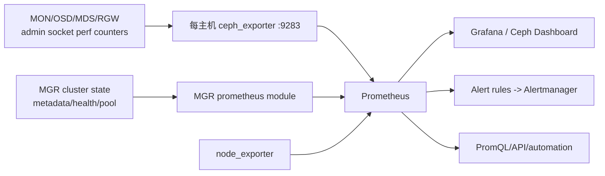
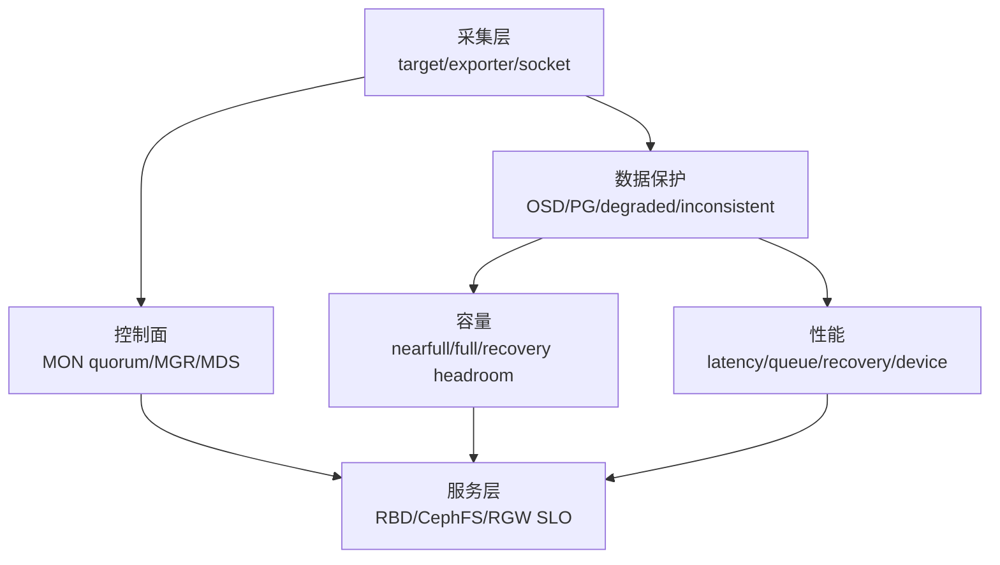
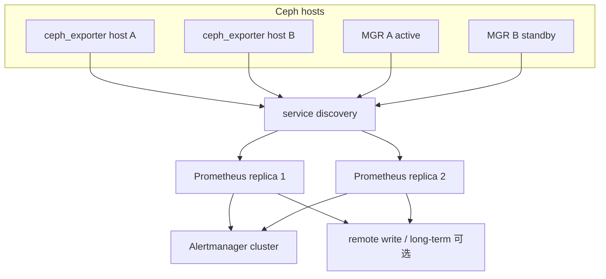

# Ceph Monitoring 指标与告警全解（Tentacle）

> Ceph 监控不是一个 Dashboard。完整链路是 daemon performance counters → 每主机 `ceph_exporter` 与 MGR prometheus module → Prometheus → Alertmanager/Grafana/Dashboard。指标必须按 counter/gauge、label、速率和故障域解释，否则图表会给出错误结论。

## 1. 指标从哪里来



`ceph_exporter` 从同主机 daemon admin sockets 收集 native counters并转成 Prometheus metrics；MGR prometheus module 暴露集群整体、metadata 和派生指标。两者可能由同一 scrape job 展示，但故障意义不同：exporter down 是采集失败，`ceph_daemon_socket_up=0` 是 exporter 活着但某 daemon 无法响应 admin socket。

Cephadm 默认可部署 Prometheus、Alertmanager、Grafana、node-exporter；企业已有统一平台时可以禁用内置 stack并抓取相同 endpoints。无论哪种方式，都要配置 TLS/认证、retention、rule、通知和 HA。

## 2. 发现端点与先检查采集面

```bash
ceph orch ps --service_name prometheus
ceph mgr services
ceph orch ps --daemon_type ceph-exporter
```

Prometheus UI 的 `/targets` 检查 scrape status，`/api/v1/targets/metadata` 列出实际 metric metadata。先确认 target up、last scrape、sample count 和 label，再判断 Ceph 指标本身。

`ceph_daemon_socket_up{ceph_daemon,hostname}` 为 1 表示 daemon admin socket 可响应，为 0 表示严重功能异常，即使进程仍在：

```promql
ceph_daemon_socket_up == 0
or min_over_time(ceph_daemon_socket_up[12h]) == 0
```

后半句能发现过去 12 小时曾不可响应但当前恢复的 daemon，适合事件追踪，不应作为一直 firing 的当前故障表达式。

## 3. Counter、Rate 和平均延迟的正确算法

Ceph `*_ops`、`*_bytes`、`*_sum`、`*_count` 多为单调 counter。面板必须使用 `rate()` 或 `irate()`；daemon restart 会重置 counter，Prometheus rate 会处理 reset。平均延迟是同窗口 `rate(sum)/rate(count)`，不能直接画累计 sum。

| 需求 | 公式模式 |
|---|---|
| 平滑容量/趋势 | `rate(counter[5m])` |
| 即时故障观察 | `irate(counter[1m])`，噪声更大 |
| 平均延迟 | `rate(latency_sum[5m]) / rate(latency_count[5m])` |
| 全集群总量 | `sum(...)` |
| 找异常 daemon | `topk()` 或 `... by (ceph_daemon)` |

单位必须从 metadata/help 核对；部分 Ceph latency counter 是 seconds，旧 counter 可能是历史单位。面板再转换 ms，不在原始表达式中凭名称猜单位。

## 4. 集群客户端吞吐、IOPS 与延迟

```promql
# 写入/读取吞吐（B/s）
sum(irate(ceph_osd_op_w_in_bytes[1m]))
sum(irate(ceph_osd_op_r_out_bytes[1m]))

# 写入/读取 IOPS
sum(irate(ceph_osd_op_w[1m]))
sum(irate(ceph_osd_op_r[1m]))

# 平均 OSD 操作延迟；用实际 *_count 配对
sum(rate(ceph_osd_op_latency_sum[5m]))
/
sum(rate(ceph_osd_op_latency_count[5m]))
```

官方 overview 只示例了 `sum(irate(ceph_osd_op_latency_sum[1m]))`，它是延迟累计量的增长率，不是单次平均延迟；企业面板必须除以匹配 count。读写延迟最好分别使用 `op_r_latency_*`、`op_w_latency_*`。

单 OSD 示例：

```promql
rate(ceph_osd_op_r_latency_sum{ceph_daemon="osd.0"}[5m])
/
rate(ceph_osd_op_r_latency_count{ceph_daemon="osd.0"}[5m])

rate(ceph_osd_op_w{ceph_daemon="osd.0"}[5m])
rate(ceph_osd_op_w_in_bytes{ceph_daemon="osd.0"}[5m])
ceph_osd_stat_bytes{ceph_daemon="osd.0"}
```

延迟异常要同时看 client ops、recovery/backfill、scrub、mClock、device 和 network，不能仅按 OSD 排序就判盘坏。

## 5. 从 OSD 映射到物理设备

`ceph_disk_occupation_human` 提供 OSD 到 `/dev/...` 和 host 的关系；node-exporter 提供 `node_disk_*`。两边的 `instance` label 常一个带 FQDN/端口，一个带 IP/端口，需要 `label_replace` 规范化 hostname/device 后用 `and on(instance,device)` 或算术 join。

```promql
# 设备平均读延迟
irate(node_disk_read_time_seconds_total[1m])
/
irate(node_disk_reads_completed_total[1m])

# 设备读 IOPS、写吞吐、忙碌率
irate(node_disk_reads_completed_total[1m])
irate(node_disk_written_bytes_total[1m])
irate(node_disk_io_time_seconds_total[5m])
```

过滤掉 partition、dm/multipath 重复层，按 `ceph_disk_occupation_human` 限定某 OSD 的真实 block device。`io_time` 对并行 SSD/NVMe 的“100% busy”解释有限；结合 await、queue、throughput、SMART/media errors 和 OSD latency。

## 6. Pool 容量和 I/O

Pool 指标公共 labels 为 `instance`、`pool_id`、`job`。`ceph_pool_metadata` 补充 `name`、`type`、`description`、`compression_mode`，可按 `pool_id` join 到其他指标。

| 指标 | 精确含义 |
|---|---|
| `ceph_pool_bytes_used` | 复制/EC 和 metadata 后消耗的 raw bytes |
| `ceph_pool_stored` | 保护前客户逻辑数据 bytes |
| `ceph_pool_compress_under_bytes` | 进入压缩评估的数据量 |
| `ceph_pool_compress_bytes_used` | 压缩后实际量 |
| `ceph_pool_rd/wr` | 读写 operation counter |
| `ceph_pool_rd_bytes/wr_bytes` | 读写 byte counter |

```promql
sum(ceph_osd_stat_bytes)                 # 集群 raw capacity
sum(ceph_pool_bytes_used)                # 已消耗 raw，含保护开销
sum(ceph_pool_stored)                    # 客户逻辑数据
sum(ceph_pool_compress_under_bytes - ceph_pool_compress_bytes_used)

# 指定 pool IOPS
rate(ceph_pool_rd[5m])
* on(pool_id) group_left(name) ceph_pool_metadata{name="rbd"}
```

不能把各 pool `MAX AVAIL` 相加，因为它们可能共享 OSD。容量告警同时看 OSD utilization、nearfull/backfillfull/full ratio、pool quota、PG distribution 和一个 failure domain 失效后的余量。

## 7. RGW 指标

RGW 公共 labels 包含 `instance`、`instance_id`、`job`；`ceph_rgw_metadata` 补 `ceph_daemon`、version、hostname。核心指标：`ceph_rgw_req` 总请求、`ceph_rgw_qlen` 队列、`ceph_rgw_failed_req` 失败；GET/PUT 有 ops、bytes、latency sum/count。

```promql
# 每实例请求率
rate(ceph_rgw_req[30s])
* on(instance_id) group_left(ceph_daemon) ceph_rgw_metadata

# GET/PUT 平均延迟
rate(ceph_rgw_op_global_get_obj_lat_sum[30s])
/
rate(ceph_rgw_op_global_get_obj_lat_count[30s])

rate(ceph_rgw_op_global_put_obj_lat_sum[30s])
/
rate(ceph_rgw_op_global_put_obj_lat_count[30s])

# GET/PUT bandwidth 与失败率
sum(rate(ceph_rgw_op_global_get_obj_bytes[30s]))
sum(rate(ceph_rgw_op_global_put_obj_bytes[30s]))
rate(ceph_rgw_failed_req[30s])
```

实例请求分布可发现 LB 倾斜；`qlen` 上升同时 latency/failed 增长表示 daemon 或后端瓶颈。“其他操作”可用总 req 减 GET/PUT ops 近似，但不要把结果直接标为 DELETE，因为还包含 LIST 等操作。

## 8. CephFS/MDS 指标

MDS labels 包括 `ceph_daemon`、`instance`、`job`；`ceph_mds_metadata` 补 version、fs_id、hostname、public_addr、rank。重点关注 request、reply latency、client request、session open/stale/total load、MDS objecter read/write、root bytes/files。

```promql
sum(rate(ceph_objecter_op_r[1m]))
sum(rate(ceph_objecter_op_w[1m]))

rate(ceph_mds_reply_latency_sum[30s])
/
rate(ceph_mds_reply_latency_count[30s])

rate(ceph_mds_request[30s])
* on(instance) group_right(ceph_daemon) ceph_mds_metadata
```

按 rank 比较 requests/session/cache/latency 能判断 metadata load 是否分片均匀。Stale sessions、cap recall 和 MDS cache pressure 要与 `ceph fs status`/health 结合。

## 9. RBD image 指标与 cardinality

默认不采集每 image RBD metrics，避免 image 数量导致 MGR/Prometheus 高 cardinality。通过 `mgr/prometheus/rbd_stats_pools` 精确指定 pools/namespaces/images。

指标包括 `ceph_rbd_read/write_bytes`、`read/write_ops`、`read/write_latency_sum/count`，labels 有 `pool`、`image`、`instance`、`job`。

```promql
rate(ceph_rbd_read_latency_sum[30s])
/
rate(ceph_rbd_read_latency_count[30s])
```

> Tentacle Monitoring 官方页面末尾的 RBD 平均读延迟示例把结果与 `ceph_rgw_metadata` 连接，这是 RGW metadata，不应复制到生产规则。RBD 指标已有 pool/image labels；若要补 daemon/host，必须使用实际存在且键一致的 RBD/OSD metadata，而不是 RGW series。

## 10. Hardware monitoring

Cephadm hardware monitoring 结合 node-exporter、SMART/device health 与预测模块。覆盖 CPU steal/iowait、memory/NUMA、network errors/drops/retransmits、disk media errors/temperature/wear、PSU/fan（视硬件 exporter）。预测健康不能替代 SMART、kernel log 和介质厂商阈值，也不能自动证明应立即换盘。

## 11. 告警设计：从症状到客户影响



每条告警定义 duration、severity、客户影响、第一诊断命令、抑制关系和恢复条件。OSD down 很快恢复可 warning；PG inactive、MON quorum lost、full 应 critical。Recovery 期间抑制由其自然引起的部分 secondary symptom，但不能抑制业务 SLO。

Alertmanager silence 必须有 owner、reason、matcher 和 expiry；silence 只停止通知，不改变 Ceph health。告警后保存 Prometheus 时间窗、`ceph health detail`、maps/events、Pod/container/host logs 和变更时间线。

## 12. Dashboard 与容量规划

Grafana/Ceph Dashboard 用同一指标构建 overview，但面板平均值可能掩盖单 OSD/单 RGW 尾部。企业看板至少提供 cluster → pool/service → daemon → host/device 四级 drill-down。

容量预测按增长率计算预计触达 nearfull 日期，并加入复制/EC、snapshot/clone、GC/purge、backfill 和 failure-domain headroom。PromQL 线性预测只能辅助，扩容采购应使用业务季节性和故障演练结果。

## 13. 采集 HA、recording rule 与 cardinality 预算

MGR prometheus module 随 active MGR 切换；ceph_exporter 则每主机独立。Prometheus 可 scrape 所有 MGR endpoint，让非 active/standby 行为按 module 配置输出，再用 target label/series 去重。只抓当前 active URI 会在 failover 和 service discovery 收敛之间形成采集空洞。



Prometheus HA 两副本会各自计算 rule 并向 Alertmanager 发相同 alert，依赖 Alertmanager label 去重；两副本 external labels 必须能区分 replica，又不能进入去重 identity。Remote write/长期存储的 replica label 与 dedup 规则也要一致。

高频表达式和复杂 label join 应做 recording rule，例如按 OSD 计算 5 分钟读写平均延迟，再由多个 panel/alert复用。Rule 命名携带聚合层和窗口；保留原始 metric，避免预聚合后无法下钻。

```promql
# recording rule expression 示例
sum by (ceph_daemon) (rate(ceph_osd_op_w_latency_sum[5m]))
/
sum by (ceph_daemon) (rate(ceph_osd_op_w_latency_count[5m]))
```

Cardinality 预算不是只数 metric name，而是 label 笛卡尔积。RBD image、RGW bucket/user、device、daemon、pool 和 request type 同时进入 label 会快速膨胀。上线前估算 active series、samples/s、retention bytes 和 query fan-out；禁止把 object key、request id、client IP 作为常驻 metric label，这些属于日志/trace。

Scrape interval 要短于需要发现的故障时间，rule `for` 要长于可接受瞬态；range vector 至少包含数个 sample。Exporter scrape timeout 小于 interval，Prometheus evaluation interval 与 rule window 对齐。时钟漂移会让 sample stale、alert延迟和多站点时间线失真，所有 Ceph/监控节点统一时钟。

## 14. PromQL 校验与 Tentacle 示例勘误

官方示例是教学起点，企业规则必须用 endpoint metadata 与样本实测。Tentacle `doc/monitoring/index.rst` 当前至少有四处容易直接造成错误图表的表达：

| 官方示例问题 | 为什么错 | 本文采用的表达 |
|---|---|---|
| 集群 latency 只对 `ceph_osd_op_latency_sum` 做 `irate` | 得到每秒累计 latency，不是每 op 平均 latency | `rate(sum)/rate(count)`，sum/count 使用同窗口与聚合标签 |
| PUT bandwidth 的指标文字/示例混入 `...get_obj_bytes` | 会把 GET 流量画成 PUT | 使用实际 endpoint 存在的 `ceph_rgw_op_global_put_obj_bytes` |
| MDS “write workload for a specific MDS” 示例仍用 `ceph_objecter_op_r` | 读 counter 不能表示写 workload | 使用 `ceph_objecter_op_w` |
| RBD average read latency 连接 `ceph_rgw_metadata` | RGW metadata 的 join key/对象类型与 RBD 无关 | RBD 原有 pool/image labels；需要主机关联时找键一致的实际 metadata |

上线一条查询前按以下顺序验证：

1. 在 `/api/v1/targets/metadata` 或 `/metrics` 确认 metric 名、type、help 和 labels 真存在；不同 Ceph release 可能改名。
2. 选一个 daemon/image/pool，直接读当前 raw samples，确认 counter/gauge 与单位。
3. 在受控时间做一次可测 I/O，对比 `increase(counter[window])` 与业务操作数/字节。
4. 检查除数为零、daemon restart、series stale 和 label 多对多 join。
5. 聚合前保留定位 label；集群总平均必须先 sum numerator/count，再相除，不能平均各 OSD 平均值。
6. 用 Prometheus rule test 或固定 fixture 验证 firing、recovery、missing series 与 reset。

例如多 OSD 平均延迟的正确聚合是：

```promql
sum(rate(ceph_osd_op_latency_sum[5m]))
/
clamp_min(sum(rate(ceph_osd_op_latency_count[5m])), 1e-9)
```

`clamp_min` 只防止除零展示；无请求时是否显示 0、NaN 或 no data 应由面板语义决定。告警不应把 no data 自动当低延迟，需另设 target/metric absent rule。

## 15. 从告警到恢复证据

告警 rule 输出稳定 labels：cluster/fsid、service/daemon、severity、health code（若有）和 runbook id；annotation 放当前值与客户影响。不要把动态长文本放 label。分层抑制示例：MON quorum lost 可抑制由采集不到 MGR 引发的次要缺数通知，但不能抑制 RGW/RBD 业务探针失败。

恢复条件不能只用 `ceph health == HEALTH_OK`。不同事件还需要：

| 事件 | 恢复证据 |
|---|---|
| exporter/socket down | target 连续 up、socket metric 为 1、sample timestamp 新鲜 |
| OSD/PG 故障 | OSD 状态正确、PG `active+clean` 或已接受状态、degraded/unfound 为 0 |
| nearfull/full | 最大 OSD utilization 回安全线，backfill 可继续，故障域 headroom 恢复 |
| latency SLO | 真实业务探针与对应 service/daemon latency 在观察窗内恢复 |
| RGW failure | 签名 PUT/GET/DELETE、失败率/queue 恢复，index/backend 无积压 |
| CephFS/MDS | client metadata op、session/cap/slow request 恢复，rank 稳定 |
| RBD mirror | replaying/healthy、lag/RPO 达标，非只看 daemon up |

告警结束后保留开始/确认/处置/恢复时间、rule version、Prometheus query window、Ceph maps/health、变更事件和客户探针结果。Grafana 截图只作可视辅助，原始 query、sample 和 Ceph JSON 才能复算。

## 16. 官方基线与许可

来源：Ceph Tentacle 官方 `doc/monitoring/index.rst`，核验提交 `76fba24cef67d9219f97eeaa68cd1a848da3f2b2`。Ceph authors and contributors，CC BY-SA 3.0。
