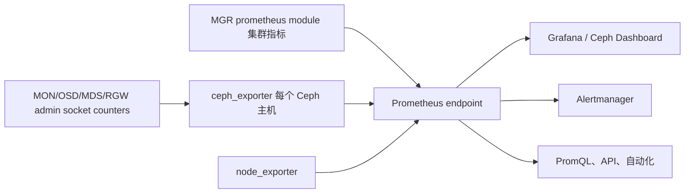
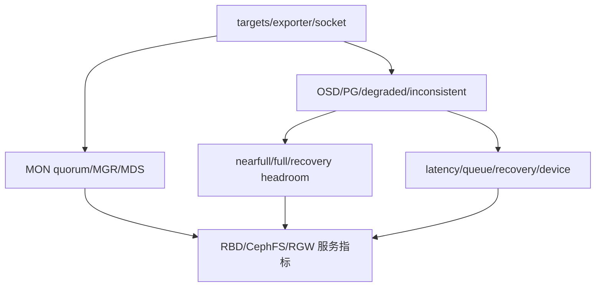

# Ceph Monitoring 指标与查询

Ceph 的监控数据来自各 Ceph daemon 的 performance counters、Ceph Manager 的
`prometheus` module 和主机级 exporter。Prometheus 负责抓取和保存时间序列，
PromQL 用于计算，Alertmanager 用于通知，Grafana 与 Ceph Dashboard 用于展示。
Cephadm 可以部署这套组件，也可以停用默认组件并接入已有监控平台。



## 1. 监控组件与端点

`ceph_exporter` 在每个 Ceph 集群主机上运行，从该主机上的 daemon admin
socket 读取 native performance counters，并转换为 Prometheus 指标。Ceph
Manager 的 `prometheus` module 提供集群整体、Pool 元数据和派生指标。两类
指标的故障域不同：exporter 不可抓取是采集路径故障，
`ceph_daemon_socket_up=0` 表示 exporter 仍响应但 daemon 无法响应 admin socket。

定位 Cephadm 部署的 Prometheus：

```bash
ceph orch ps --service_name prometheus
```

官方示例服务端口为 `9095`，例如 `cephtest-node-00.cephlab.com:9095`：

```text
http://cephtest-node-00.cephlab.com:9095
http://cephtest-node-00.cephlab.com:9095/api/v1/targets/metadata
```

前一个地址提供 targets、表达式浏览器和 Prometheus 指标；后一个地址提供
完整指标名称、类型、帮助文本和标签。也可以直接读取 `/metrics`。查询前先
确认 target 的 `up`、最近抓取时间、样本数和实际 labels。

## 2. Ceph daemon 健康指标

`ceph_daemon_socket_up` 表示 daemon 是否能通过 admin socket 响应：`1` 为正常，
`0` 为异常。进程可能仍然存在，但 `0` 已表示功能存在严重问题。标签为：

| 标签 | 含义 |
| --- | --- |
| `ceph_daemon` | 暴露 admin socket 的 daemon 标识，例如 `osd.1`、`mds.a` |
| `hostname` | daemon 所在主机名 |

```text
ceph_daemon_socket_up{ceph_daemon="mds.a",hostname="testhost"} 1
ceph_daemon_socket_up{ceph_daemon="osd.1",hostname="testhost"} 0
```

```promql
# 当前不健康 daemon
ceph_daemon_socket_up == 0

# 过去 12 小时内曾经不响应的 daemon
ceph_daemon_socket_up == 0 or min_over_time(ceph_daemon_socket_up[12h]) == 0
```

第二个表达式用于发现历史事件，不替代当前故障告警。

## 3. 性能指标公共标签与计算

Ceph daemon performance metrics 通常有 `ceph_daemon`（来源 daemon）、
`instance`（exporter 地址）和 `job`（Prometheus scrape job）标签：

```text
ceph_osd_op_r{ceph_daemon="osd.0",instance="192.168.122.7:9283",job="ceph"} 73981
```

`*_ops`、`*_bytes`、`*_sum`、`*_count` 多为单调 counter，应使用 `rate()` 或
`irate()`。daemon 重启造成的 reset 由 Prometheus rate 函数处理。累计 latency
sum 不是一次操作的平均延迟，平均值应使用同窗口 sum/count 相除，单位以
`/metrics` 的 help 和 metadata 为准。

## 4. OSD 与集群性能

```promql
# 集群写、读吞吐（B/s）
sum(irate(ceph_osd_op_w_in_bytes[1m]))
sum(irate(ceph_osd_op_r_out_bytes[1m]))

# 集群写、读 IOPS
sum(irate(ceph_osd_op_w[1m]))
sum(irate(ceph_osd_op_r[1m]))

# 官方 overview 的 latency 累计量增长率
sum(irate(ceph_osd_op_latency_sum[1m]))

# 每个操作的平均 latency
sum(rate(ceph_osd_op_latency_sum[5m]))
/
clamp_min(sum(rate(ceph_osd_op_latency_count[5m])), 1e-9)
```

单 OSD 查询可以通过 `ceph_daemon` 过滤：

```promql
# OSD 0 读 latency
irate(ceph_osd_op_r_latency_sum{ceph_daemon=~"osd.0"}[1m])
/ on (ceph_daemon) irate(ceph_osd_op_r_latency_count[1m])

# OSD 0 写 IOPS、吞吐和 raw capacity
irate(ceph_osd_op_w{ceph_daemon=~"osd.0"}[1m])
irate(ceph_osd_op_w_in_bytes{ceph_daemon=~"osd.0"}[1m])
ceph_osd_stat_bytes{ceph_daemon="osd.0"}
```

延迟升高时同时检查 recovery/backfill、scrub、队列、设备和网络。

## 5. 物理存储设备性能

`node_exporter` 磁盘指标与 `ceph_disk_occupation_human` 的 OSD 到设备映射
结合后，可以定位支撑 OSD 的物理设备。官方查询先用 `label_replace` 去掉
`instance` 端口并从 `/dev/...` 提取 device，再以 `and on (instance, device)`
连接。以下查询均以 `osd.0` 为例：

```promql
# 读、写延迟
label_replace(irate(node_disk_read_time_seconds_total[1m])
  / irate(node_disk_reads_completed_total[1m]), "instance", "$1", "instance", "([^:.]*).*")
and on (instance, device)
label_replace(label_replace(ceph_disk_occupation_human{ceph_daemon=~"osd.0"},
  "device", "$1", "device", "/dev/(.*)"), "instance", "$1", "instance", "([^:.]*).*")

label_replace(irate(node_disk_write_time_seconds_total[1m])
  / irate(node_disk_writes_completed_total[1m]), "instance", "$1", "instance", "([^:.]*).*")
and on (instance, device)
label_replace(label_replace(ceph_disk_occupation_human{ceph_daemon=~"osd.0"},
  "device", "$1", "device", "/dev/(.*)"), "instance", "$1", "instance", "([^:.]*).*")

# 读/写 IOPS
label_replace(irate(node_disk_reads_completed_total[1m]), "instance", "$1", "instance", "([^:.]*).*")
and on (instance, device) label_replace(label_replace(ceph_disk_occupation_human{ceph_daemon=~"osd.0"}, "device", "$1", "device", "/dev/(.*)"), "instance", "$1", "instance", "([^:.]*).*")
label_replace(irate(node_disk_writes_completed_total[1m]), "instance", "$1", "instance", "([^:.]*).*")
and on (instance, device) label_replace(label_replace(ceph_disk_occupation_human{ceph_daemon=~"osd.0"}, "device", "$1", "device", "/dev/(.*)"), "instance", "$1", "instance", "([^:.]*).*")

# 读/写吞吐
label_replace(irate(node_disk_read_bytes_total[1m]), "instance", "$1", "instance", "([^:.]*).*")
and on (instance, device) label_replace(label_replace(ceph_disk_occupation_human{ceph_daemon=~"osd.0"}, "device", "$1", "device", "/dev/(.*)"), "instance", "$1", "instance", "([^:.]*).*")
label_replace(irate(node_disk_written_bytes_total[1m]), "instance", "$1", "instance", "([^:.]*).*")
and on (instance, device) label_replace(label_replace(ceph_disk_occupation_human{ceph_daemon=~"osd.0"}, "device", "$1", "device", "/dev/(.*)"), "instance", "$1", "instance", "([^:.]*).*")

# 最近 5 分钟设备利用率（对 SSD 的解释有限）
label_replace(irate(node_disk_io_time_seconds_total[5m]), "instance", "$1", "instance", "([^:.]*).*")
and on (instance, device) label_replace(label_replace(ceph_disk_occupation_human{ceph_daemon=~"osd.0"}, "device", "$1", "device", "/dev/(.*)"), "instance", "$1", "instance", "([^:.]*).*")
```

生产看板应过滤 partition、device-mapper 和 multipath 重复层，并结合 await、
队列、吞吐、SMART/media errors 与 OSD latency 判断设备问题。

## 6. Pool 指标

Pool 指标的公共标签为 `instance`、`pool_id`（数字 ID）和 `job`。`ceph_pool_metadata`
附加 `compression_mode`（`lz4`、`snappy`、`zlib`、`zstd`、`none`）、
`description`（例如 `replica:3`）、`name` 和 `type`（`replicated` 或 `erasure`）。

| 指标 | 含义 |
| --- | --- |
| `ceph_pool_bytes_used` | 复制或 EC 后用户数据和元数据消耗的 raw capacity |
| `ceph_pool_stored` | 保护前存储的数据总量 |
| `ceph_pool_compress_under_bytes` | 符合压缩条件的数据量 |
| `ceph_pool_compress_bytes_used` | 压缩后的实际占用量 |
| `ceph_pool_rd` / `ceph_pool_wr` | Pool 读写操作计数 |
| `ceph_pool_rd_bytes` / `ceph_pool_wr_bytes` | Pool 读写字节计数 |

```promql
sum(ceph_osd_stat_bytes)                                      # raw capacity
sum(ceph_pool_bytes_used)                                     # raw used
sum(ceph_pool_stored)                                         # data before protection
sum(ceph_pool_compress_under_bytes - ceph_pool_compress_bytes_used)

# 指定 Pool 的读写 IOPS 和吞吐（示例 testrbdpool）
irate(ceph_pool_rd[1m]) * on (pool_id) group_left (instance, name) ceph_pool_metadata{name=~"testrbdpool"}
irate(ceph_pool_wr[1m]) * on (pool_id) group_left (instance, name) ceph_pool_metadata{name=~"testrbdpool"}
irate(ceph_pool_rd_bytes[1m]) * on (pool_id) group_left (instance, name) ceph_pool_metadata{name=~"testrbdpool"}
irate(ceph_pool_wr_bytes[1m]) * on (pool_id) group_left (instance, name) ceph_pool_metadata{name=~"testrbdpool"}
```

不同 Pool 可能共享 OSD，不能把各 Pool 的 `MAX AVAIL` 相加；容量还要结合
OSD 利用率、nearfull/backfillfull/full ratio、Pool quota、PG 分布和 failure-domain headroom。

## 7. RGW 指标

RGW 指标公共标签为 `instance`、`instance_id` 和 `job`。`ceph_rgw_metadata`
附加 `ceph_daemon`、`ceph_version` 和 `hostname`。核心指标是
`ceph_rgw_req`（GET+PUT+DELETE 请求数）、`ceph_rgw_qlen`（队列长度）和
`ceph_rgw_failed_req`（中止请求）。

GET 指标为 `ceph_rgw_op_global_get_obj_lat_count`、`_lat_sum`、`_ops`、`_bytes`；
PUT 指标为 `ceph_rgw_op_global_put_obj_lat_count`、`_lat_sum`、`_ops`、`_bytes`。

```promql
# 平均 GET/PUT latency 与请求速率
rate(ceph_rgw_op_global_get_obj_lat_sum[30s]) / rate(ceph_rgw_op_global_get_obj_lat_count[30s])
  * on (instance_id) group_left (ceph_daemon) ceph_rgw_metadata
rate(ceph_rgw_op_global_put_obj_lat_sum[30s]) / rate(ceph_rgw_op_global_put_obj_lat_count[30s])
  * on (instance_id) group_left (ceph_daemon) ceph_rgw_metadata
rate(ceph_rgw_req[30s]) * on (instance_id) group_left (ceph_daemon) ceph_rgw_metadata

# 其他操作（LIST、DELETE 等）
rate(ceph_rgw_req[30s]) - (rate(ceph_rgw_op_global_get_obj_ops[30s]) + rate(ceph_rgw_op_global_put_obj_ops[30s]))

# GET、PUT 带宽；每个 RGW 实例的总带宽
sum(rate(ceph_rgw_op_global_get_obj_bytes[30s]))
sum(rate(ceph_rgw_op_global_put_obj_bytes[30s]))
sum by (instance_id) (rate(ceph_rgw_op_global_get_obj_bytes[30s]) + rate(ceph_rgw_op_global_put_obj_bytes[30s]))
  * on (instance_id) group_left (ceph_daemon) ceph_rgw_metadata

# HTTP 错误和其他失败
rate(ceph_rgw_failed_req[30s])
```

“其他操作”是总请求减 GET/PUT 的近似值，仍包含 LIST、DELETE 等操作，不能
命名为单一 DELETE 计数。请求、队列和失败率应按 `instance_id` 检查分布。

## 8. CephFS 与 MDS 指标

MDS 指标公共标签为 `ceph_daemon`、`instance` 和 `job`。`ceph_mds_metadata`
附加 `ceph_version`、`fs_id`、`hostname`、`public_addr` 和 `rank`。

| 指标 | 含义 |
| --- | --- |
| `ceph_mds_request` | MDS 请求总数 |
| `ceph_mds_reply_latency_sum` / `_count` | reply 延迟总量和样本数 |
| `ceph_mds_server_handle_client_request` | 客户端请求数 |
| `ceph_mds_sessions_session_count` | session 数量 |
| `ceph_mds_sessions_total_load` | session 总负载 |
| `ceph_mds_sessions_sessions_open` / `_stale` | 打开和 stale session 数 |
| `ceph_objecter_op_r` / `ceph_objecter_op_w` | objecter 读写操作数 |
| `ceph_mds_root_rbytes` / `ceph_mds_root_rfiles` | 管理的字节数和文件数 |

```promql
sum(rate(ceph_objecter_op_r[1m]))
sum(rate(ceph_objecter_op_w[1m]))
sum(rate(ceph_objecter_op_r{ceph_daemon=~"mdstest"}[1m]))
sum(rate(ceph_objecter_op_w{ceph_daemon=~"mdstest"}[1m]))
rate(ceph_mds_reply_latency_sum[30s]) / rate(ceph_mds_reply_latency_count[30s])
rate(ceph_mds_request[30s]) * on (instance) group_right (ceph_daemon) ceph_mds_metadata
```

按 rank 比较请求、session、load、cache 和 latency；stale session、cap recall、
缓存压力和慢请求还应结合 `ceph fs status` 与 health 状态。

## 9. RBD image 指标

默认不采集每个 RBD image 指标，以控制高 cardinality 对 Manager
`prometheus` module 的影响。需要时配置 `mgr/prometheus/rbd_stats_pools`。
标签为 `image`、`instance`、`job` 和 `pool`。

| 指标 | 含义 |
| --- | --- |
| `ceph_rbd_read_bytes` / `ceph_rbd_write_bytes` | RBD 读写字节数 |
| `ceph_rbd_read_ops` / `ceph_rbd_write_ops` | RBD 读写操作数 |
| `ceph_rbd_read_latency_count` / `_sum` | RBD 读延迟样本数和总时间 |
| `ceph_rbd_write_latency_count` / `_sum` | RBD 写延迟样本数和总时间 |

```promql
rate(ceph_rbd_read_latency_sum[30s])
/
rate(ceph_rbd_read_latency_count[30s])
* on (instance) group_left (ceph_daemon) ceph_rgw_metadata
```

该连接形式保留官方查询的写法；部署环境没有与 `instance` 一致的 RGW
metadata 时，应去掉连接或改用实际存在且键一致的 metadata，不能用无关
series 制造 daemon 标签。启用 image 指标前估算 image、Pool、节点和窗口形成的 active series。

## 10. Hardware monitoring

硬件监控将 node-exporter、磁盘 SMART/device health 和硬件厂商 exporter 与
Ceph 指标关联，观察 CPU steal/iowait、内存、网络错误与重传、磁盘介质错误/
温度/磨损以及电源和风扇。预测结果不能替代 SMART、内核日志、设备厂商阈值
和更换流程。

## 11. 查询、标签与保留规范

1. 在 `/api/v1/targets/metadata` 或 `/metrics` 确认 metric 名、type、help 和 labels。
2. 读取一个 daemon、Pool 或 image 的 raw sample，确认 counter/gauge 和单位。
3. 用 `increase(counter[window])` 与可观测操作数/字节数核对采集语义。
4. 检查除数为零、daemon restart、stale series 和多对多 join；`clamp_min` 只用于展示防除零。
5. 保留 daemon、Pool、image、host 等定位标签，集群平均值先聚合 sum/count。
6. 高频或复杂 join 使用 recording rule，规则名包含聚合层和窗口并保留原始指标。
7. `scrape_interval` 短于故障发现目标，`for` 长于允许瞬态，range vector 至少包含多个样本，
   Ceph 与监控节点保持时钟同步。

RBD image、RGW bucket/user、device、daemon、Pool 和请求类型会使 cardinality
快速增长；object key、request ID、客户端 IP 等高变值不应作为常驻 metric label。

```promql
sum by (ceph_daemon) (rate(ceph_osd_op_w_latency_sum[5m]))
/
clamp_min(sum by (ceph_daemon) (rate(ceph_osd_op_w_latency_count[5m])), 1e-9)
```

Prometheus 双副本各自计算规则时，通过 external labels 和 Alertmanager 去重；
长期存储的 replica label 也保持一致。MGR 切换时，抓取服务发现到的 MGR 端点，
不要只绑定单一 active URI。

## 12. 告警与恢复



每条规则定义持续时间、严重级别、业务影响、首个诊断命令、抑制关系和恢复
条件。PG inactive、MON quorum 丢失和 full 属于高优先级故障；恢复期间可抑制
根因产生的次级通知，但不能抑制独立服务探针失败。Alertmanager silence 只
停止通知，不改变 Ceph health；silence 要有 owner、reason、matcher 和 expiry。

| 事件 | 恢复证据 |
| --- | --- |
| exporter/socket 不可用 | target 连续 up、socket metric 为 1、样本新鲜 |
| OSD/PG 故障 | OSD 状态正确，PG 达到 `active+clean` 或接受状态，degraded/unfound 清零 |
| nearfull/full | 最大 OSD 利用率回到安全线，backfill 可继续，failure-domain headroom 恢复 |
| latency 超标 | 对应服务探针和 daemon latency 在观察窗内恢复 |
| RGW 失败 | 签名 PUT/GET/DELETE 成功，失败率与队列恢复，后端无积压 |
| CephFS/MDS 异常 | metadata 操作、session/cap、慢请求恢复，rank 稳定 |
| RBD mirror 延迟 | replaying/healthy，lag 和 RPO 达标，而非只看 daemon up |

## 13. 参考资料与许可

参考资料：Ceph Tentacle Monitoring 文档的 Monitoring overview、Ceph metrics、
RGW、CephFS、RBD 和 Hardware monitoring 章节。Ceph authors and contributors，
文档许可 CC BY-SA 3.0（Creative Commons Attribution Share Alike 3.0）。
