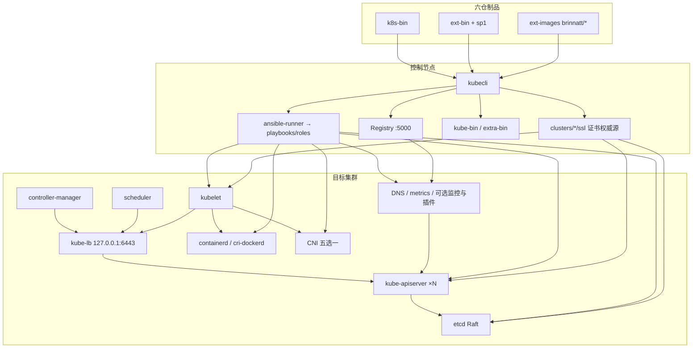

# 2、技术白皮书（总册）

> **文档形态：** 概念与架构说明书（Concepts / Architecture White Paper）  
> **对照业界：** Oracle Cloud Native Environment *Concepts*、华为云 CCE 架构说明、Amazon EKS 架构白皮书一类交付物——先讲清原理与组件协作，再落到本产品实现与验收口径。  
> **配套：** [操作手册](./operations-manual.md) · [开发手册](./development-manual.md) · [仓库入口](../README.md)

---

## 2.0、阅读说明（签收用）

本白皮书不是「目录式简介」，而是按章节展开的**可签收技术说明**：每一章均包含（1）官方/社区原理提炼，（2）架构图与数据流，（3）**kubeauto 仓库中的实现落点**（角色、模板、变量、playbook），（4）交付验收要点。

若只读总册而不读分章，仍不足以完成架构评审——请按下方分册精读。分章正文位于 [`docs/whitepaper/`](./whitepaper/)。

| 读者 | 建议精读 |
|------|----------|
| 甲方架构师 / 签收人 | 第 1–3、6、7、11、12、15 章 + 附录 A |
| 实施运维 | 第 5–10、13、15–17 章，并对照操作手册上机 |
| 二次开发 | 第 13–14 章 + 开发手册全文 |

---

## 2.1、产品一句话与设计基线

kubeauto 以 **`kubecli`（Python）+ Ansible 角色** 在目标主机上以 **二进制 + systemd** 方式安装 Kubernetes 与生态组件，**不依赖 kubeadm**；制品由 **六仓 dual-push** 生产，经控制节点本地 Registry 离线分发；默认启用 Node Allocatable（合计约 2 CPU + 4Gi 预留，systemReserved 默认不硬限）。

**编写时版本基线：** Kubernetes v1.33.6 · etcd v3.6.4 · Calico v3.28.4 · containerd 2.1.4 · nerdctl 2.3.4 · ext-bin 1.14.0 · kubeauto v0.1.1（以 `common/constants.py` 与六仓同步测试为准）。

---

## 2.2、总体架构（总览图）

更细的组件级图见各分章。

---

## 2.3、分章目录（正文）

| 章 | 标题 | 文件 |
|----|------|------|
| 前言 | 文档约定、读者、术语 | [whitepaper/00-preface.md](./whitepaper/00-preface.md) |
| 1 | 产品概述与交付范围 | [whitepaper/01-product-scope.md](./whitepaper/01-product-scope.md) |
| 2 | Kubernetes 总体架构原理 | [whitepaper/02-k8s-architecture.md](./whitepaper/02-k8s-architecture.md) |
| 3 | 控制平面组件原理与实现 | [whitepaper/03-control-plane.md](./whitepaper/03-control-plane.md) |
| 4 | 数据平面与节点组件 | [whitepaper/04-node-dataplane.md](./whitepaper/04-node-dataplane.md) |
| 5 | etcd 原理与实现 | [whitepaper/05-etcd.md](./whitepaper/05-etcd.md) |
| 6 | **证书与 PKI 全链路** | [whitepaper/06-pki-certificates.md](./whitepaper/06-pki-certificates.md) |
| 7 | 高可用与负载均衡 | [whitepaper/07-ha-loadbalancer.md](./whitepaper/07-ha-loadbalancer.md) |
| 8 | 容器运行时 CRI | [whitepaper/08-cri-runtime.md](./whitepaper/08-cri-runtime.md) |
| 9 | 集群网络 CNI | [whitepaper/09-cni-networking.md](./whitepaper/09-cni-networking.md) |
| 10 | DNS 与服务发现 | [whitepaper/10-dns-service.md](./whitepaper/10-dns-service.md) |
| 11 | 调度、QoS 与 Node Allocatable | [whitepaper/11-allocatable-qos.md](./whitepaper/11-allocatable-qos.md) |
| 12 | **插件 / 监控 / 可观测性** | [whitepaper/12-addons-observability.md](./whitepaper/12-addons-observability.md) |
| 13 | 制品供应链与离线分发 | [whitepaper/13-artifact-supply-chain.md](./whitepaper/13-artifact-supply-chain.md) |
| 14 | kubecli 软件架构 | [whitepaper/14-controlplane-software.md](./whitepaper/14-controlplane-software.md) |
| 15 | 安全基线与生命周期 | [whitepaper/15-security-lifecycle.md](./whitepaper/15-security-lifecycle.md) |
| 16 | **持久化存储与 OpenEBS** | [whitepaper/16-storage-openebs.md](./whitepaper/16-storage-openebs.md) |
| 17 | **其他存储与中间件插件** | [whitepaper/17-storage-middleware-addons.md](./whitepaper/17-storage-middleware-addons.md) |
| 附录 A | 版本矩阵与官方文档索引 | [whitepaper/A-version-matrix.md](./whitepaper/A-version-matrix.md) |

跨组件集中检索见[技术栈导航与文档覆盖矩阵](./technology-stack-index.md)。

---

## 2.4、关键结论摘要（供评审页）

### 2.4.1、控制面

- apiserver / CM / scheduler / etcd / kubelet / kube-proxy 均为 **systemd 托管二进制**，非 kubeadm static Pod 默认形态。
- 多 master 安装 **`serial: 1`**，降低 Service IP 分配竞态。
- 节点与 CM/Scheduler 访问 apiserver 统一经 **本机 kube-lb（127.0.0.1:6443）**；可选 ex-lb 提供北向 VIP。

### 2.4.2、证书

- 私有 CA + **cfssl** 显式签发；权威源在 `clusters/<name>/ssl/`。
- **ServiceAccount 与集群 CSR 签发复用 CA 密钥**；`ca-key.pem` **仅 master**。
- `kubernetes.pem` 同时用于 apiserver 服务端、etcd 客户端、kubelet 客户端。
- 轮换走 `96.update-certs.yml`：**先分发后协同重启**，保证 HA 信任链一致。

### 2.4.3、运行时与网络

- 默认 containerd（随包分发 **nerdctl 2.3.4**，`roles/containerd` 安装到 master/worker）；可选 docker + cri-dockerd（对接官方 CRI 演进）。
- 默认 Calico（**etcdv3** 数据存储，非 KDD）；另支持 flannel / cilium / kube-router / kube-ovn。
- CoreDNS + 默认 NodeLocal DNSCache（`169.254.20.10`）。

### 2.4.4、资源与监控

- 默认 kubeReserved + systemReserved 计入 Allocatable；**systemReserved 默认不 enforce**。
- Prometheus 栈可选安装于 `monitor`，镜像与 chart 版本钉扎；须在充足容量节点上启用。
- OpenEBS 可选安装 Hostpath 与 LVM 两条独立本地卷链路；二者均不自带跨节点数据副本，LVM 启用不等于自动创建 VG。

### 2.4.5、制品

- 版本 SSOT：`common/constants.py`；六仓 CI dual-push；拉取 talkedu → Hub；部署只信本地 Registry。

---

## 2.5、实现路径速查

| 主题 | 路径 |
|------|------|
| 版本钉扎 | `common/constants.py` |
| 一键安装 | `playbooks/90.setup.yml` |
| 证书 | `roles/deploy/`、`roles/etcd/`、`roles/kube-master/`、`roles/kube-node/` |
| 监控插件 | `roles/cluster-addon/tasks/prometheus.yml` 等 |
| 下载灌仓 | `service/cluster/downloader.py`、`registry.py` |
| 生命周期映射 | `service/cluster/manager.py` |

完整矩阵见 [附录 A](./whitepaper/A-version-matrix.md)。

---

## 2.6、修订记录

| 版本 | 说明 |
|------|------|
| 交付深化版 | 由单页概要扩展为「总册 + 18 分章」Concepts 结构；原理与仓库实装一一对应，供客户签收评审 |

分章内容随代码演进更新；**版本数字以六仓同步测试通过的 `KubeConstant` 为准**。
`)

---

## 2.7、交付签收检查表

| # | 项 | 依据 |
|---|----|------|
| 1 | 版本基线与 `common/constants.py` / 附录 A 一致 | 白皮书附录 A |
| 2 | aio 与 HA 各完成一次安装记录 | 操作手册 §1.2 / §1.3 |
| 3 | 控制面经 kube-lb（`127.0.0.1:6443`）可达；节点 Ready | 白皮书第 7 章 |
| 4 | 证书矩阵抽检；`ca-key` 仅 master | 白皮书第 6 章 |
| 5 | Calico 为 etcdv3（或所选 CNI 文档路径） | 操作手册 §1.3.3.6 |
| 6 | NodeLocal DNS `169.254.20.10`（若启用） | 白皮书第 10 章 |
| 7 | `verify-node-reserved.sh` 通过（启用 Allocatable 时） | 操作手册 §1.1.4 |
| 8 | backup / restore 演练记录 | 操作手册生命周期章 |
| 9 | 可选插件（监控/Ingress/存储）按合同范围验收 | 白皮书第 12、16 章 |
| 10 | 初始口令已修改；私仓仅信本地 Registry | 白皮书第 15 章 |
