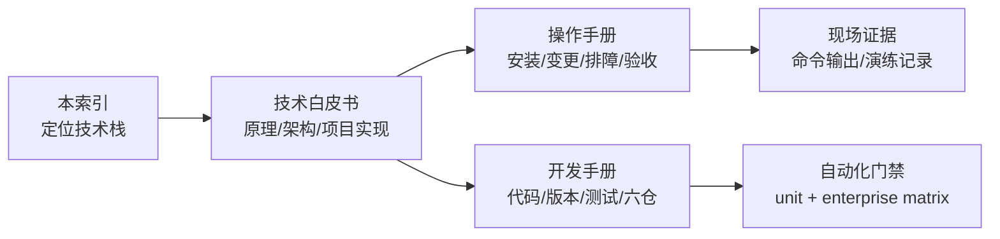
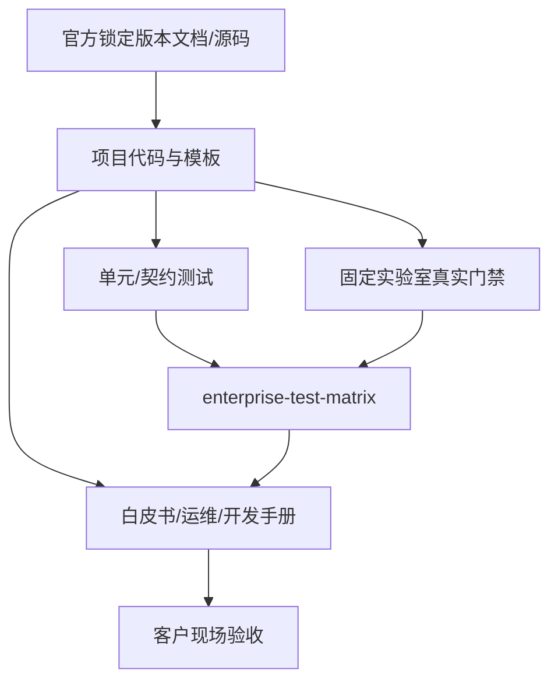

# kubeauto 技术栈导航与文档覆盖矩阵

> 本页是客户、架构师、运维和开发人员的统一检索入口。目标是先在项目文档中完成选型、操作和排障，不要求读者到多个社区网站自行拼接结论。外部链接用于审计来源，不替代项目手册。

## 1、怎么使用这套文档

| 读者问题 | 先看 |
|----------|------|
| 这个组件是什么、为什么选它、数据怎么流 | 技术白皮书对应章 |
| 配置项怎么填、怎么安装、失败怎么查 | 操作手册对应节 |
| 版本怎么升级、模板在哪里、要测哪些仓 | 开发手册 |
| 当前交付到底验证过什么 | `tests/enterprise-test-matrix.yaml` |

## 2、技术栈总表

“项目深度”表示项目内可直接使用的材料，不代表上游功能全部被 kubeauto 启用。

| 层 | 技术/组件 | 项目选择与边界 | 白皮书 | 运维入口 | 项目深度 |
|----|-----------|----------------|----------|----------|----------|
| 安装编排 | Python `kubecli` + Ansible | 生命周期编排；二进制 + systemd，不使用 kubeadm | [第 14 章](./whitepaper/14-controlplane-software.md) | [部署/生命周期](./operations-manual.md) | 专章 |
| Kubernetes | apiserver、controller-manager、scheduler | v1.33.6，systemd 进程 | [第 2–3 章](./whitepaper/02-k8s-architecture.md) | [分步安装](./operations-manual.md#133分步安装) | 专章 |
| 节点 | kubelet、kube-proxy、systemd/cgroup | kube-proxy 默认 IPVS | [第 4 章](./whitepaper/04-node-dataplane.md) | [节点安装](./operations-manual.md#1335安装-kube_node-节点) | 专章 |
| 状态存储 | etcd Raft | v3.6.4、mTLS、奇数成员 | [第 5 章](./whitepaper/05-etcd.md) | [etcd 安装](./operations-manual.md#1332安装-etcd-集群) | 专章 |
| 身份安全 | cfssl、X.509、RBAC | 私有 CA；CA key 仅 master | [第 6 章](./whitepaper/06-pki-certificates.md) | [证书生命周期](./operations-manual.md#15集群生命周期) | 专章 |
| 高可用 | kube-lb、Nginx、Keepalived | 默认本地 kube-lb；可选外部 VIP | [第 7 章](./whitepaper/07-ha-loadbalancer.md) | [HA 部署](./operations-manual.md#13高可用部署) | 专章 |
| 容器运行时 | containerd / Docker + cri-dockerd | 默认 containerd；systemd cgroup | [第 8 章](./whitepaper/08-cri-runtime.md) | [运行时安装](./operations-manual.md#1333安装容器运行时) | 专章 |
| CNI | Calico、Flannel、Cilium、kube-router、kube-ovn | 五选一；默认 Calico etcdv3 | [第 9 章](./whitepaper/09-cni-networking.md) | [网络安装](./operations-manual.md#1336安装网络组件) | 专章 |
| 服务发现 | CoreDNS、NodeLocal DNSCache | NodeLocal 默认 `169.254.20.10` | [第 10 章](./whitepaper/10-dns-service.md) | [集成插件](./operations-manual.md#1337集成插件) | 专章 |
| 资源治理 | Node Allocatable、QoS、Eviction | kube/system reserved；system 不默认硬限 | [第 11 章](./whitepaper/11-allocatable-qos.md) | [§1.1.4](./operations-manual.md#114为系统守护进程预留计算资源node-allocatable) | 专章 |
| 指标 | metrics-server | 即时资源指标，不做历史存储 | [第 12 章](./whitepaper/12-addons-observability.md#123-metrics-server) | [插件安装](./operations-manual.md#1337集成插件) | 架构 + SOP |
| 监控 | Prometheus Operator、Prometheus、Alertmanager、Grafana | 可选；本地镜像；etcd TLS 抓取 | [第 12 章](./whitepaper/12-addons-observability.md#125-kube-prometheus-stack) | [Prometheus](./operations-manual.md#13374prometheus) | 架构 + SOP |
| 入口 | ingress-nginx | NodePort + 节点标签；可接 ex-lb | [第 12 章](./whitepaper/12-addons-observability.md#126-ingress-nginx) | [Ingress](./operations-manual.md#13375ingress-nginx) | 架构 + SOP |
| UI | Kubernetes Dashboard + Kong | 可选；高权限账号必须治理 | [第 12 章](./whitepaper/12-addons-observability.md#124-kubernetes-dashboard) | [Dashboard](./operations-manual.md#13373dashboard) | 架构 + SOP |
| 本地存储 | OpenEBS Hostpath / LVM | 两条独立本地卷链路，不自带副本/RWX | [第 16 章](./whitepaper/16-storage-openebs.md) | [§1.3.4](./operations-manual.md#134openebs-生产运维) | 专章 + 完整 SOP |
| 简易本地存储 | Rancher local-path-provisioner | 目录型本地卷；不执行容量硬限制 | [第 17 章](./whitepaper/17-storage-middleware-addons.md#172-rancher-local-path-provisioner) | [存储供给](./operations-manual.md#13376存储供给) | 架构 + SOP |
| 共享文件 | NFS subdir external provisioner | 依赖客户 NFS 服务；自身只是动态子目录控制器 | [第 17 章](./whitepaper/17-storage-middleware-addons.md#173-nfs-subdir-external-provisioner) | [存储供给](./operations-manual.md#13376存储供给) | 架构 + SOP |
| 对象存储 | MinIO Operator/Tenant | 依赖已验证 SC；应用副本不等于底层卷副本 | [第 12 章](./whitepaper/12-addons-observability.md#128-minio) | [MinIO](./operations-manual.md#13377minio) | 架构 + 安装 |
| 注册配置 | Nacos + 外部 MySQL | 三副本强反亲和；必须导入官方 schema | [第 17 章](./whitepaper/17-storage-middleware-addons.md#174-nacos-243) | [其他插件](./operations-manual.md#13378其他可选组件概要) | 架构 + SOP |
| 消息 | RocketMQ Operator | NameService/Broker 异步 CR 协调；默认 master 无副本 | [第 17 章](./whitepaper/17-storage-middleware-addons.md#175-rocketmq-operator) | [其他插件](./operations-manual.md#13378其他可选组件概要) | 架构 + SOP |
| 数据库中间件 | Percona Operator for MySQL / PXC | 目标方案：Operator 1.20.0、PXC 8.4.8-8.1、HAProxy；独立 MySQL 分路，当前未编码 | [PXC 白皮书](./middleware/perconaPXC/technical-whitepaper.md) | [PXC 用户与运维手册](./middleware/perconaPXC/operations-manual.md) | 企业文档基线完成，代码/门禁待实现 |
| 制品 | Distribution Registry、Harbor、Helm、六仓 CI | TalkEdu 优先、Hub 回退、本地 Registry 部署 | [第 13 章](./whitepaper/13-artifact-supply-chain.md) | [§1.4](./operations-manual.md#14制品下载与离线分发) | 专章 |
| 生命周期 | 备份、恢复、升级、证书轮换、安全基线 | 固定 playbook/CLI 路径 | [第 15 章](./whitepaper/15-security-lifecycle.md) | [§1.5](./operations-manual.md#15集群生命周期) | 专章 |

版本与镜像 tag 不在本表重复维护，以[附录 A](./whitepaper/A-version-matrix.md)和 `common/constants.py` 为准。

## 3、项目内的权威关系

发生冲突时按以下顺序处理：

1. 先确认项目锁定版本，不用最新版官网行为覆盖旧版事实。
2. 对照该版本官方源码和项目 vendored chart/模板。
3. 用当前环境的渲染结果、对象状态和真实数据面验证。
4. 文档若与代码不一致，必须作为交付缺陷修正，不能要求客户自行猜测。

## 4、技术章节最低质量门槛

以后新增或升级任何技术栈，交付文档必须同时回答：

| 类别 | 必答内容 |
|------|----------|
| 定位 | 解决什么问题、不解决什么问题、项目是否启用 |
| 版本 | 产品/chart/子组件/镜像版本关系，SSOT 在哪里 |
| 架构 | 组件图、控制流、数据流、端口/协议、故障域 |
| 原理 | 关键协调循环、调度/存储/网络机制，不只列名词 |
| 项目实现 | 开关、默认值、角色、模板、playbook、镜像路径 |
| 选型 | 适用/不适用、替代方案、容量与高可用边界 |
| 操作 | 前置检查、安装、扩缩、升级、卸载、回滚 |
| 安全 | 权限、凭据、证书、特权、数据删除风险 |
| 可观测性 | Ready 之外的业务指标、日志、告警和容量指标 |
| 故障处理 | 现象 → 证据 → 根因层 → 修复 → 残留回收 |
| 数据保护 | 备份对象、RPO/RTO、恢复演练；明确 etcd 不包含业务卷数据 |
| 验收 | 可执行命令、真实读写/请求、预期终态与失败标志 |
| 证据 | 锁定版本的官方文档、官方源码、项目测试矩阵 |

只有参数表或官网链接，不满足交付门槛。只看到 Pod `Running`，也不满足功能验收门槛。

## 5、集中官方索引

客户无需按安装过程逐个查找，下表用于架构审计和进一步研究：

| 技术 | 锁定/适用文档入口 |
|------|-------------------|
| Kubernetes v1.33 | https://v1-33.docs.kubernetes.io/docs/home/ |
| etcd | https://etcd.io/docs/ |
| containerd | https://github.com/containerd/containerd/tree/main/docs |
| cri-dockerd | https://github.com/Mirantis/cri-dockerd |
| Calico | https://docs.tigera.io/calico/latest/about/ |
| Cilium | https://docs.cilium.io/ |
| CoreDNS | https://coredns.io/manual/toc/ |
| OpenEBS 4.3.x | https://openebs.io/docs/4.3.x/ |
| Prometheus Operator | https://prometheus-operator.dev/docs/ |
| ingress-nginx | https://kubernetes.github.io/ingress-nginx/ |
| Kubernetes Dashboard | https://kubernetes.io/docs/tasks/access-application-cluster/web-ui-dashboard/ |
| MinIO Kubernetes | https://min.io/docs/minio/kubernetes/upstream/ |
| Nacos | https://nacos.io/en/docs/latest/ |
| RocketMQ Operator | https://github.com/apache/rocketmq-operator |
| Percona Operator for MySQL/PXC | https://docs.percona.com/percona-operator-for-mysql/pxc/ |
| Harbor 2.13 | https://goharbor.io/docs/2.13.0/ |
| Helm | https://helm.sh/docs/ |
| Ansible | https://docs.ansible.com/ansible/latest/ |

这些链接是来源索引。项目实际默认值、镜像地址、安装顺序和验收方式仍以本仓文档与代码为准。

## 6、维护责任

任何用户可见变更必须在同一个交付中更新：

- 本技术栈索引的入口和覆盖状态；
- 对应白皮书原理与项目实现；
- 操作手册 SOP 和故障处理；
- 开发手册代码导航与测试要求；
- 附录 A 版本矩阵；
- 自动化测试和企业矩阵证据。

文档不能用历史日志证明当前版本，也不能描述项目没有启用的上游能力。OpenEBS 的典型例子是：上游包含 Mayastor，不等于 kubeauto 当前交付了复制型 OpenEBS 存储。
