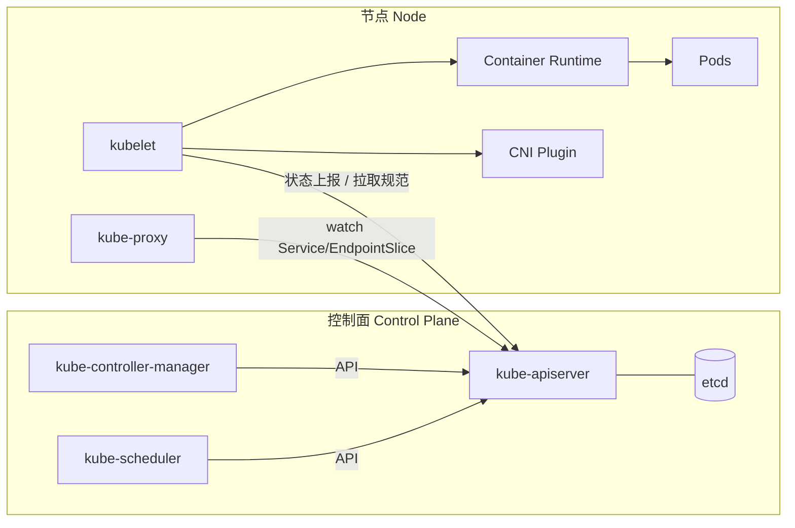
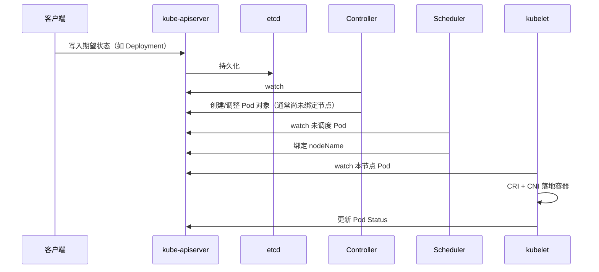
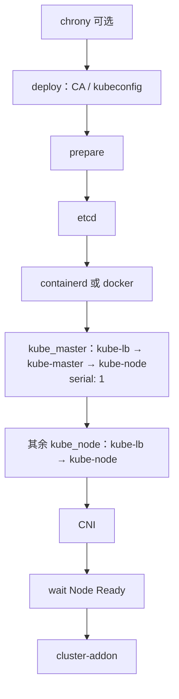

# 第 2 章 Kubernetes 总体架构

> 官方文档：[Kubernetes Components](https://kubernetes.io/docs/concepts/overview/components/) · [Cluster Architecture](https://kubernetes.io/docs/concepts/architecture/) · [The Kubernetes API](https://kubernetes.io/docs/concepts/overview/kubernetes-api/)

## 2.1 概述

Kubernetes 集群由**控制面**（Control Plane）与一个或多个**工作节点**（Node）组成。控制面管理集群的期望状态与全局决策；节点运行工作负载（Pod），并维护容器运行时环境。

官方组件划分如下（摘自 [Kubernetes Components](https://kubernetes.io/docs/concepts/overview/components/)）：

### 2.1.1 控制面组件

| 组件 | 职责 |
|------|------|
| **kube-apiserver** | 暴露 Kubernetes HTTP API；集群控制面的前端 |
| **etcd** | 一致且高可用的键值存储，保存全部 API 对象数据 |
| **kube-scheduler** | 监视尚未绑定节点的 Pod，并为每个 Pod 选择合适节点 |
| **kube-controller-manager** | 运行控制器，实现 Kubernetes API 所定义的控制行为 |
| **cloud-controller-manager**（可选） | 与底层云厂商集成；自建机房集群通常不部署 |

### 2.1.2 节点组件

节点组件在每个节点上运行，负责维护运行中的 Pod 并提供运行时环境：

| 组件 | 职责 |
|------|------|
| **kubelet** | 确保 Pod（含其中的容器）按规范运行 |
| **kube-proxy**（可选） | 在节点上维护网络规则以实现 Service；部分 CNI（如 Cilium）可替代其数据面 |
| **容器运行时** | 负责运行容器；须符合 CRI（见第 8 章） |

节点上通常还依赖操作系统级进程管理（例如 Linux 上的 systemd）来托管上述组件。

### 2.1.3 插件（Addons）

插件扩展集群功能。常见类别包括：集群 DNS、Web UI（Dashboard）、容器资源监控、集群级日志等。本项目通过 `roles/cluster-addon` 安装，详见第 10、12 章。

### 2.1.4 架构总览



## 2.2 控制面与节点的职责边界

### 2.2.1 控制面

控制面组件做出关于集群的**全局决策**（例如调度），并检测与响应集群事件（例如当 Deployment 的副本不足时创建新的 Pod）。控制面逻辑上可部署在一台或多台机器上；生产环境通常使用多副本控制面，并由负载均衡汇聚对 apiserver 的访问（见第 7 章）。

### 2.2.2 节点

节点可以是物理机或虚拟机。每个节点由控制面管理，并包含运行 Pod 所需的服务（kubelet、容器运行时、网络插件等）。资源受限或实验环境可以只有一个节点；生产环境通常有多个节点。

关于 Node 对象、自注册、Ready 条件与心跳，见第 4 章与官方 [Nodes](https://kubernetes.io/docs/concepts/architecture/nodes/)。

## 2.3 架构不变量

下列行为由 Kubernetes 架构保证，与具体安装器（kubeadm、kubeauto 等）无关：

1. **仅 kube-apiserver 直接访问 etcd。** 其他组件通过 Kubernetes API 读写状态，不直连 etcd。
2. **kube-scheduler 只负责任务到节点的绑定**（写入 `spec.nodeName` / Binding），不启动容器。
3. **kubelet 在节点上执行 Pod 生命周期**：调用 CRI 与 CNI，并向 apiserver 汇报状态。
4. **声明式 API**：客户端提交期望状态；控制器持续将实际状态收敛到期望状态。

### 2.3.1 声明式协调（Reconcile）



用户与自动化系统提交的是资源对象的期望规格；控制面控制器与节点代理共同完成收敛。该模型是排障的基础：区分「对象未写入 API」「控制器未协调」「调度未绑定」「节点未落地」四个阶段。

## 2.4 核心工作负载抽象：Pod

Pod 是 Kubernetes 中可调度的最小部署单元：一组共享网络与存储命名空间的容器。节点上的 kubelet 保证 Pod 中的容器处于运行状态（在重启策略与探针允许的范围内）。

Pod 网络模型要求：每个 Pod 获得集群内可路由的 IP；同一节点与跨节点的 Pod 通信遵循集群网络插件所实现的连通性规则。详见官方 [Pods](https://kubernetes.io/docs/concepts/workloads/pods/) 与本白皮书第 9 章。

## 2.5 本项目（kubeauto）中的组件落点

kubeauto **不使用 kubeadm**。控制面与节点组件以**二进制 + systemd** 方式安装，由 Ansible 角色渲染 unit 与配置。

| 官方组件 | 本项目运行形态 | 角色 / 路径 |
|----------|----------------|-------------|
| etcd | `etcd.service` | `roles/etcd` |
| kube-apiserver | `kube-apiserver.service` | `roles/kube-master` |
| kube-controller-manager | `kube-controller-manager.service` | `roles/kube-master` |
| kube-scheduler | `kube-scheduler.service` | `roles/kube-master` |
| kubelet | `kubelet.service` | `roles/kube-node` |
| kube-proxy | systemd + 配置文件 | `roles/kube-node` |
| 容器运行时 | containerd 或 dockerd + cri-dockerd | `roles/containerd` / `roles/docker` |
| apiserver 本机入口 | kube-lb（nginx stream，监听 `127.0.0.1:6443`） | `roles/kube-lb` |
| 默认 CNI | Calico **v3.28.4**，**etcdv3** 数据存储（非 KDD） | `roles/calico`；`playbooks/06.network.yml` |

默认版本基线见附录 A（编写时：Kubernetes **v1.33.6**，containerd **2.1.4**，etcd **v3.6.4**）。证书目录默认 `/etc/kubernetes/ssl`（`ca_dir`），apiserver 安全端口默认 `SECURE_PORT=6443`。

### 2.5.1 与 kubeadm 默认形态的差异

| 维度 | kubeadm 常见做法 | kubeauto |
|------|------------------|----------|
| 控制面进程 | 常以 static Pod 由本机 kubelet 管理 | systemd 直接托管控制面二进制 |
| 证书目录 | `/etc/kubernetes/pki` | `/etc/kubernetes/ssl` |
| 安装入口 | `kubeadm init/join` | `kubecli setup` → Ansible playbooks |
| 本机访问 apiserver | 视配置而定 | 节点组件统一经 `https://127.0.0.1:6443`（kube-lb） |

该差异是交付架构选择，不是 kubeadm 封装未完成。升级、证书轮换由本仓库 `93` / `96` 等 playbook 承担。

### 2.5.2 安装步骤 01–07 与 90/all

分步安装与一键总装映射如下（CLI：`kubecli setup <cluster> <step>`，定义于 `service/cluster/manager.py`）：

| 步骤 | Playbook | 主要角色 / 任务 |
|------|----------|-----------------|
| `01` | `01.prepare.yml` | 可选 `chrony` → `deploy`（CA / kubeconfig）→ `prepare` |
| `02` | `02.etcd.yml` | `etcd` |
| `03` | `03.runtime.yml` | `containerd`（默认）或 `docker` |
| `04` | `04.kube-master.yml` | `kube-lb` → `kube-master` → `kube-node`（`serial: 1`） |
| `05` | `05.kube-node.yml` | worker：`kube-lb` → `kube-node` |
| `06` | `06.network.yml` | CNI（默认 `calico`，etcdv3 后端） |
| `07` | `07.cluster-addon.yml` | `cluster-addon` |
| `90` / `all` | `90.setup.yml` | 下列总装流程 |

### 2.5.3 一键安装顺序（90.setup.yml）

`playbooks/90.setup.yml`（与分步 `01`–`07` 等价）顺序为：



对 `kube_master` 使用 `serial: 1`，以避免多 master 并行 bootstrap 时 Service IP 分配器竞态。细节见第 3、7 章。

**说明：** 步骤 `01` 已包含 `deploy`（签发 CA 与组件 kubeconfig）；步骤 `04` 不再重复 deploy，但会签发 `kubernetes.pem` 并启动控制面 systemd 单元。

## 2.6 生产观测与验收入口

安装完成后，可用下列命令核对架构是否按预期落地（控制节点配置好 `KUBECONFIG`）：

```bash
kubectl get --raw=/readyz?verbose
kubectl get nodes -o wide
kubectl get cs 2>/dev/null || true
kubectl get pods -n kube-system
systemctl is-active kube-apiserver kube-controller-manager kube-scheduler kubelet
```

节点侧确认 CRI 与 kubelet：

```bash
systemctl is-active containerd   # 或 docker / cri-dockerd
crictl info
journalctl -u kubelet -n 50 --no-pager
```

### 2.6.1 架构签收要点

- [ ] 控制面组件以 systemd 托管（非 static Pod）；worker 上不存在 `ca-key.pem`。
- [ ] 各节点 `ss -lntp` 可见 `127.0.0.1:6443`（kube-lb）与 `inventory_hostname:6443`（apiserver，仅 master）。
- [ ] 默认 Calico 时，网络插件使用 etcdv3 数据存储；`calico-node` 在 kube-system Running。
- [ ] `kubectl get --raw=/readyz?verbose` 返回各子检查 OK。

## 2.7 本章与后续章节

| 主题 | 章节 |
|------|------|
| apiserver / CM / scheduler | 第 3 章 |
| Node / kubelet / kube-proxy | 第 4 章 |
| etcd | 第 5 章 |
| 证书与认证 | 第 6 章 |
| 高可用与负载均衡 | 第 7 章 |
| 容器运行时 | 第 8 章 |
| 集群网络 | 第 9 章 |

## 2.8 参考文档

- [Kubernetes Components](https://kubernetes.io/docs/concepts/overview/components/)
- [Cluster Architecture](https://kubernetes.io/docs/concepts/architecture/)
- [Nodes](https://kubernetes.io/docs/concepts/architecture/nodes/)
- [Pods](https://kubernetes.io/docs/concepts/workloads/pods/)
