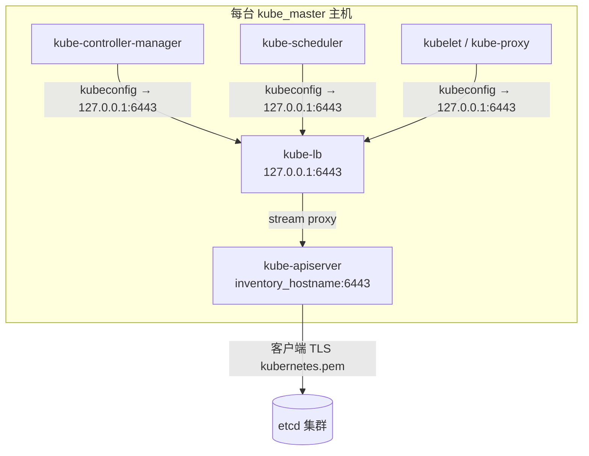
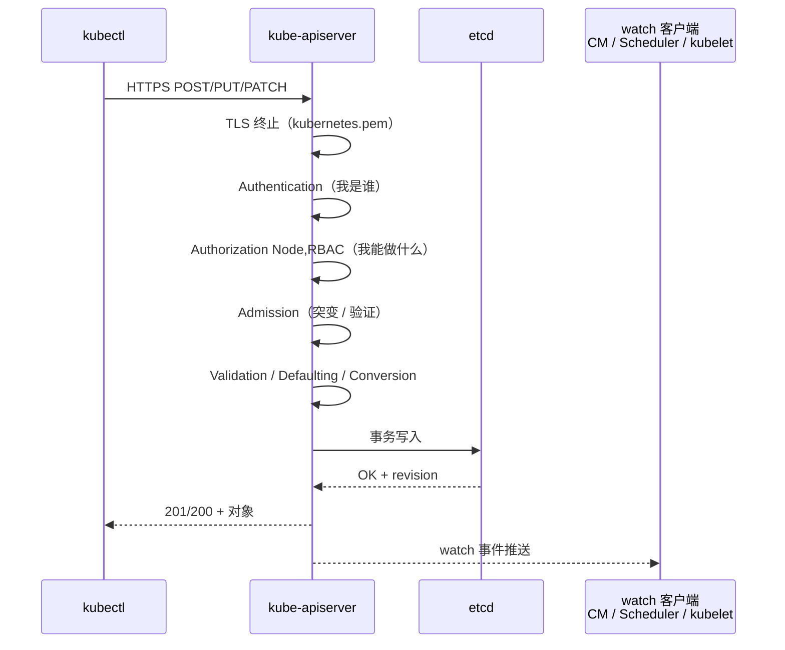
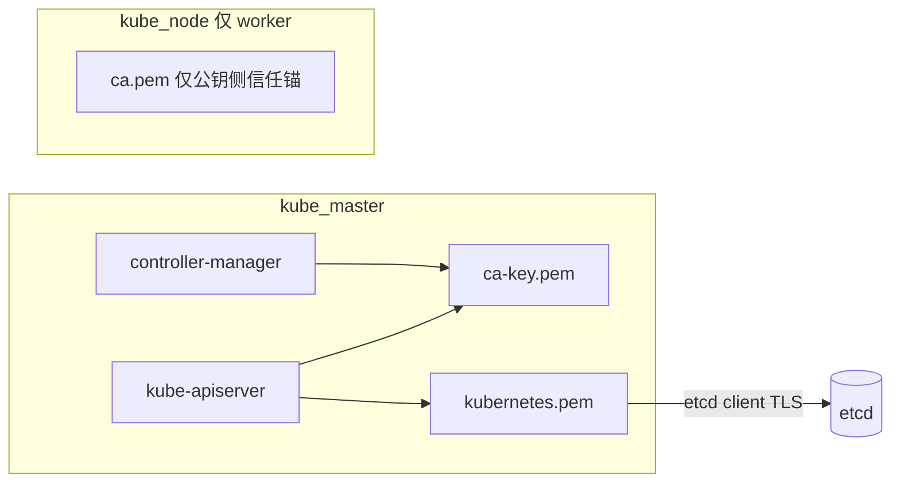
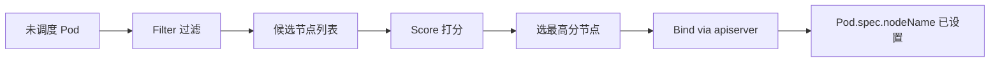
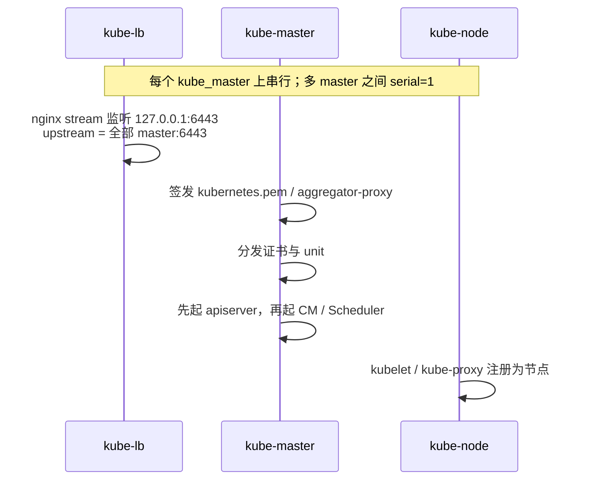

# 第 3 章 控制平面组件原理与本项目实现

> 官方参考：[kube-apiserver](https://kubernetes.io/docs/reference/command-line-tools-reference/kube-apiserver/) · [kube-controller-manager](https://kubernetes.io/docs/reference/command-line-tools-reference/kube-controller-manager/) · [kube-scheduler](https://kubernetes.io/docs/reference/command-line-tools-reference/kube-scheduler/) · [Controlling Access](https://kubernetes.io/docs/reference/access-authn-authz/controlling-access/) · [PKI Certificates](https://kubernetes.io/docs/setup/best-practices/certificates/)

## 3.1 概述

本章说明控制面三个核心组件——**kube-apiserver**、**kube-controller-manager**、**kube-scheduler**——的职责边界、请求处理路径、选主与调度流水线，以及 kubeauto 中对应的 systemd unit、关键 flags、证书与 kubeconfig 实现。

范围包括：

- apiserver 作为集群唯一 API 入口：认证、鉴权、准入，以及**仅它**可写 etcd
- controller-manager 的协调循环与 leader election
- scheduler 的 filter → score → bind 流水线与 Pending Pod 归因
- kubeauto 实现：unit 模板、flags、证书、`127.0.0.1:6443`（kube-lb）、`MASTER_CERT_HOSTS`、`playbooks/90.setup.yml` 中 `serial: 1`

阅读本章前应已掌握第 2 章的控制面 / 节点划分，以及「仅 apiserver 访问 etcd」这一架构不变量。

---

### 3.1.1 三个独立进程

控制面（Control Plane）组件做出关于集群的全局决策，并检测、响应集群事件。自建集群中最核心的三个常驻进程是：

| 组件 | 职责 |
|------|------|
| **kube-apiserver** | 暴露 Kubernetes HTTP API；集群控制面的前端；通往 etcd 的唯一写路径 |
| **kube-controller-manager** | 运行控制器，实现 API 所定义的控制行为（期望状态 → 实际状态） |
| **kube-scheduler** | 监视尚未绑定节点的 Pod，并为每个 Pod 选择合适节点 |

三者均通过 Kubernetes API 协作；除 apiserver 外，**都不直连 etcd**。在 kubeauto 中，三者以 **systemd 服务**形式运行在 `kube_master` 主机上（不是 kubeadm 的 static Pod）。

拆成三个进程的工程收益：

1. **故障隔离**：调度器崩溃不应使 API 全体不可用。
2. **独立扩缩与选主**：apiserver 可多活；CM / Scheduler 通过选主保证单活写。
3. **权限最小化**：每个组件使用不同客户端身份（不同证书 / kubeconfig），RBAC 可精细约束。
4. **可观测**：`journalctl -u kube-apiserver` 与 `-u kube-scheduler` 日志语义不同，排障更快。

### 3.1.2 本项目控制面落点总览



| 组件 | Unit 模板 | 角色任务 |
|------|-----------|----------|
| apiserver | `roles/kube-master/templates/kube-apiserver.service.j2` | `roles/kube-master/tasks/main.yml` |
| controller-manager | `roles/kube-master/templates/kube-controller-manager.service.j2` | 同上 |
| scheduler | `roles/kube-master/templates/kube-scheduler.service.j2` | 同上 |
| 本机 LB | `roles/kube-lb/templates/kube-lb.conf.j2` | `roles/kube-lb` |
| 编排 | `playbooks/04.kube-master.yml`；总装 `playbooks/90.setup.yml`（`serial: 1`） | |

默认：`SECURE_PORT=6443`，`ca_dir=/etc/kubernetes/ssl`，Kubernetes **v1.33.6**。

---

## 3.2 kube-apiserver

### 3.2.1 职责

kube-apiserver 暴露 Kubernetes HTTP API，是控制面的前端，也是通往 etcd 的唯一写路径。所有人机交互（kubectl）、控制器与 kubelet 均通过同一套资源模型与 API 交互。若各组件各自定义存储格式并直写 etcd，集群将失去：

- 统一的对象 Schema 与版本转换（v1 / v1beta1…）
- 统一的认证鉴权
- 统一的准入策略
- 统一的 watch / list 一致性语义

### 3.2.2 一个请求如何穿过 apiserver

以 `kubectl apply -f deploy.yaml` 为例：



**认证（Authentication）** 回答「你是谁」：常见机制包括 X.509 客户端证书、Bearer Token、ServiceAccount Token、Webhook 等。kubeauto 生产路径高度依赖证书：人用 admin kubeconfig，组件用各自 kubeconfig，节点用 `system:node:<name>` 证书。

**鉴权（Authorization）** 回答「你能做什么」。本项目显式配置：

```text
--authorization-mode=Node,RBAC
```

- **Node**：限制 kubelet 只能访问与本节点相关的资源（配合 NodeRestriction 准入）。
- **RBAC**：基于 Role / ClusterRole 绑定的通用鉴权。

顺序有意义：Node 授权器先处理节点身份相关请求，其余走 RBAC。

**准入（Admission）** 在对象持久化前执行：填充默认值、拒绝危险配置、执行策略。聚合层相关请求还会用到 requestheader 身份传递。

只有上述关卡都通过，apiserver 才把对象写入 etcd，并通知 watch 者。

### 3.2.3 关键 flags（对照本项目 unit）

模板：`roles/kube-master/templates/kube-apiserver.service.j2`。

| 关注点 | 本项目 flag | 说明 |
|--------|-------------|------|
| 监听地址 | `--bind-address={{ inventory_hostname }}` | 绑在节点 IP，供 LB upstream 使用 |
| 安全端口 | `--secure-port={{ SECURE_PORT }}` | 默认 6443 |
| 禁止匿名 | `--anonymous-auth=false` | 未认证请求直接拒绝 |
| 鉴权 | `--authorization-mode=Node,RBAC` | 节点授权 + RBAC |
| etcd 端点 | `--etcd-servers={{ ETCD_ENDPOINTS }}` | 唯一存储后端 |
| etcd TLS | `--etcd-cafile/certfile/keyfile` → `ca.pem` + `kubernetes.pem` | apiserver 作为 etcd 客户端 |
| 服务端 TLS | `--tls-cert-file/key-file` → `kubernetes.pem` | 对外 HTTPS |
| 客户端 CA | `--client-ca-file={{ ca_dir }}/ca.pem` | 校验客户端证书 |
| Service 网段 | `--service-cluster-ip-range={{ SERVICE_CIDR }}` | 如 `10.68.0.0/16` |
| NodePort 范围 | `--service-node-port-range={{ NODE_PORT_RANGE }}` | 库存可配 |
| SA 签发 | `--service-account-signing-key-file={{ ca_dir }}/ca-key.pem` | **复用 CA 私钥** |
| SA 校验密钥 | `--service-account-key-file={{ ca_dir }}/ca.pem` | 公钥侧 |
| SA issuer | `--service-account-issuer=https://kubernetes.default.svc` | Token 发行方声明 |
| kubelet 客户端 | `--kubelet-client-certificate/key` → `kubernetes.pem` | apiserver 调 kubelet（logs/exec） |
| 聚合层 | `requestheader-*` + `aggregator-proxy.pem` | metrics 等扩展 API |
| Endpoint 协调 | `--endpoint-reconciler-type=lease` | 基于 Lease 协调 |
| 审计（可选） | `ENABLE_CLUSTER_AUDIT` 时挂 audit policy | 见 3.8 节 |

### 3.2.4 `kubernetes.pem` 一证多用（必须理解）

本项目中，同一张 `kubernetes.pem` / `kubernetes-key.pem` 承担至少三种角色：

1. **apiserver 服务端证书**：kubectl 与组件连接 `https://<master>:6443` 时校验的服务端身份。
2. **apiserver → etcd 的客户端证书**：etcd 侧校验来访者。
3. **apiserver → kubelet 的客户端证书**：执行 `kubectl logs` / `exec` / `port-forward` 时，apiserver 作为客户端访问节点 kubelet API。

对应地，安装流程会创建 ClusterRoleBinding，把用户 `kubernetes` 绑定到 `system:kubelet-api-admin`（见 `roles/kube-master/tasks/main.yml`）。若该绑定缺失，典型症状是：**业务 Pod Running，但 `kubectl logs` / `exec` 失败**。

### 3.2.5 ServiceAccount 为何复用 `ca-key.pem`

上游常见做法是单独生成 `sa.key` / `sa.pub`。kubeauto 选择：

```text
--service-account-signing-key-file={{ ca_dir }}/ca-key.pem
--service-account-key-file={{ ca_dir }}/ca.pem
```

同时，controller-manager 使用：

```text
--service-account-private-key-file={{ ca_dir }}/ca-key.pem
--cluster-signing-cert-file={{ ca_dir }}/ca.pem
--cluster-signing-key-file={{ ca_dir }}/ca-key.pem
```

含义：

- SA Token 由 CA 密钥签发。
- 集群内 CSR（例如部分启动引导场景）也由同一 CA 签发。
- **`ca-key.pem` 只分发到 kube_master**，worker 节点只持有 `ca.pem`。

这是安全边界，不是疏忽：任何持有 `ca-key.pem` 的主机都能签发集群信任的证书与 Token。运维验收时应检查 worker 的 `/etc/kubernetes/ssl/` **不包含** `ca-key.pem`。



### 3.2.6 `MASTER_CERT_HOSTS` 与证书 SAN

模板：`roles/kube-master/templates/kubernetes-csr.json.j2`。

签发时写入 `hosts`（SAN）的名称包括：

- `127.0.0.1` —— 本机经 kube-lb 回环访问时，TLS 校验服务端名
- 全部 `kube_master` 的 IP（inventory 主机名）
- `CLUSTER_KUBERNETES_SVC_IP`（`SERVICE_CIDR` 的 `.1`，即 `kubernetes` Service IP）
- 若存在 `ex_lb`，则包含 `EX_APISERVER_VIP`
- `MASTER_CERT_HOSTS` 列表中配置的外网 IP / FQDN（`conf/config.yml` 示例含公网 IP 与域名）
- DNS 风格名：`kubernetes`、`kubernetes.default`、`kubernetes.default.svc`、`kubernetes.default.svc.cluster.local`、以及 `kubernetes.default.svc.{{ CLUSTER_DNS_DOMAIN }}`

**遗漏 SAN 是交付现场最高频的 TLS 故障之一。** 表现为：用某 VIP 或域名访问 API 时证书校验失败；或 ServiceAccount / 集群内客户端以 Service IP 访问失败。变更 VIP / 域名后，必须重新签发 `kubernetes.pem`（本仓库有证书相关 tag / playbook），而不是只改 LB 配置。

### 3.2.7 生产验证（apiserver）

```bash
# 进程与端口
systemctl status kube-apiserver
ss -lntp | grep {{ SECURE_PORT }}

# 就绪探测（在能连上 API 的机器上）
kubectl get --raw='/readyz?verbose'
kubectl get --raw='/livez?verbose'

# 证书与配置
ls -l /etc/kubernetes/ssl/kubernetes.pem /etc/kubernetes/ssl/ca-key.pem
openssl x509 -in /etc/kubernetes/ssl/kubernetes.pem -noout -text | grep -A1 'Subject Alternative Name'

# 日志
journalctl -u kube-apiserver -f
```

健康时：`readyz` 各项 OK；日志中无持续 etcd timeout；`kubectl get ns` 正常返回。

若 apiserver 起不来，优先检查：etcd 端点与证书、`kubernetes.pem` 是否存在、`bind-address` 是否匹配 inventory、磁盘是否满。

---

## 3.3 kube-controller-manager

### 3.3.1 职责

apiserver 负责将对象持久化到 etcd 并通知观察者；它**不会**因 `replicas: 3` 而自动创建 3 个 Pod。完成「期望 → 实际」收敛的是一系列 **控制器（controllers）**。

将多个控制器置于同一进程（controller-manager）便于共享客户端、共享选主、统一启停与指标暴露。逻辑上各控制器仍是独立的协调循环。

### 3.3.2 协调循环（Reconcile）正式说法

每个控制器不断：

1. 从 apiserver **list/watch** 相关对象。
2. 计算「期望状态 vs 实际状态」。
3. 若不一致，则通过 apiserver **创建 / 更新 / 删除** 对象，使实际逼近期望。
4. 处理错误重试与速率限制，避免雪崩。

控制器是**持续过程**，而非一次性脚本：每次调谐结束后仍继续监视，直至期望与实际一致，并在后续偏差出现时再次收敛。

### 3.3.3 Leader Election：为什么多副本必须选主

生产会在多个 master 上各跑一份 controller-manager。若两份同时调谐同一个 Deployment，可能产生重复创建、冲突写入。因此官方默认启用：

```text
--leader-elect=true
```

选主通过协调租约（Lease）等机制完成：同一时刻只有 **leader** 执行写入；其他实例待命。leader 失联后，新 leader 接管。

你在生产中可以观察：

```bash
kubectl -n kube-system get lease
kubectl -n kube-system get endpoints kube-controller-manager -o yaml   # 历史兼容路径，视版本而定
journalctl -u kube-controller-manager | grep -i leader
```

### 3.3.4 本项目关键 flags

模板：`roles/kube-master/templates/kube-controller-manager.service.j2`。

| 关注点 | flag / 值 | 含义 |
|--------|-----------|------|
| 选主 | `--leader-elect=true` | 多 master 单活写 |
| kubeconfig | `/etc/kubernetes/kube-controller-manager.kubeconfig` | 访问 API 的身份与地址 |
| 认证 / 鉴权 kubeconfig | 同上两个 `*-kubeconfig` | 组件自身 HTTPS 安全端口保护 |
| Pod 网段 | `--cluster-cidr={{ CLUSTER_CIDR }}` | 如 `172.20.0.0/16` |
| 分配 Node CIDR | `--allocate-node-cidrs=true` | 为节点分配 PodCIDR |
| 掩码长度 | `--node-cidr-mask-size={{ NODE_CIDR_LEN }}` | 默认 24（`conf/config.yml`） |
| Service 网段 | `--service-cluster-ip-range={{ SERVICE_CIDR }}` | 与 apiserver 一致 |
| SA 私钥 | `--service-account-private-key-file={{ ca_dir }}/ca-key.pem` | 签发相关 |
| 集群签发 | `--cluster-signing-*-file` → CA | CSR 签发 |
| 根 CA | `--root-ca-file={{ ca_dir }}/ca.pem` | 注入到 ServiceAccount 等 |
| 使用 SA 凭据 | `--use-service-account-credentials=true` | 各控制器用独立 SA |

### 3.3.5 kubeconfig 改写为 `127.0.0.1`

`roles/deploy` 生成的 kubeconfig 可能暂时指向「某一 master」。在 `roles/kube-master/tasks/main.yml` 中，安装时用 `lineinfile` **强制改写**：

```text
server: https://127.0.0.1:{{ SECURE_PORT }}
```

对象文件：

- `/etc/kubernetes/kube-controller-manager.kubeconfig`
- `/etc/kubernetes/kube-scheduler.kubeconfig`

这样 CM / Scheduler 始终走**本机 kube-lb**，而不是直连某一个可能宕机的 peer IP。这与第 4 章 kubelet 的 `KUBE_APISERVER=https://127.0.0.1:{{ SECURE_PORT }}` 是同一设计。

### 3.3.6 生产验证（controller-manager）

```bash
systemctl status kube-controller-manager
journalctl -u kube-controller-manager -f

# 扩容实验：观察 ReplicaSet / Pod 数量收敛
kubectl create deploy demo --image=... --replicas=1
kubectl scale deploy demo --replicas=3
kubectl get rs,pods -l app=demo -w
```

若 CM 未运行或非 leader：Deployment 可能停在「有对象但副本不收敛」。先确认 leader，再查 RBAC / 证书 / 是否能经 127.0.0.1:6443 访问 API。

---

## 3.4 kube-scheduler

### 3.4.1 职责

控制器创建出的 Pod 最初通常 **没有** `spec.nodeName`。kube-scheduler 根据资源、亲和性、污点容忍、拓扑等策略为 Pod 选择节点，并通过 apiserver 写入绑定结果。

调度独立于 apiserver：策略复杂、可插拔、需独立演进；调度失败不应阻塞整个 API。调度也不由各节点 kubelet 本地抢占完成，否则将失去全集群视角的放置策略与一致性。

### 3.4.2 Filter → Score → Bind



1. **Filter（过滤 / 谓词）**：磁盘不足、CPU 不够、污点不匹配、节点 NotReady、端口冲突等 → 直接淘汰。
2. **Score（打分 / 优先级）**：在剩余节点上按策略打分（资源均衡、亲和性等）。
3. **Bind（绑定）**：通过 apiserver 写入绑定结果。

**调度器不调用 CRI。** 绑定完成后，目标节点的 kubelet 才会开始拉镜像、建沙箱。

### 3.4.3 本项目实现

模板：`roles/kube-master/templates/kube-scheduler.service.j2`。

关键点：

- `--leader-elect=true`
- `--kubeconfig=/etc/kubernetes/kube-scheduler.kubeconfig`（同样被改写为 `https://127.0.0.1:{{ SECURE_PORT }}`）
- 证书身份：CN/O 对齐 `system:kube-scheduler`（由 deploy 阶段 CSR 签发，模板侧见仓库 `kube-scheduler` 相关 csr）

### 3.4.4 生产验证（scheduler）

```bash
systemctl status kube-scheduler
journalctl -u kube-scheduler -f

kubectl get pods -A --field-selector=status.phase=Pending
kubectl describe pod <pending-pod>   # 看 Events: FailedScheduling 等
```

常见 Events 语义：

| Events 摘要 | 可能原因 |
|-------------|----------|
| `no nodes available` / `didn't match ...` | 资源、亲和、污点、节点选择器 |
| `node(s) had taint` | 未容忍污点（含 master 被 cordon/taint） |
| 无 FailedScheduling，但有镜像错误 | 已调度，问题在数据面 |

实验室验证调度器职责：停止 `kube-scheduler` 后创建 Pod，应长期 Pending；恢复后自动绑定。

---

## 3.5 控制面安装顺序与 `serial: 1`

### 3.5.1 单 master 主机上的角色顺序

在 `playbooks/90.setup.yml` 中，针对 `kube_master`：

```yaml
serial: 1
roles:
  - kube-lb
  - kube-master
  - kube-node
```

顺序固定为 **kube-lb → kube-master → kube-node**：



原因：

1. CM / Scheduler / kubelet 的 kubeconfig 依赖本机 `127.0.0.1:6443` —— 必须先有 LB 进程（即便最初 upstream 尚未全健康，也要先就位）。
2. apiserver 必须先于依赖 API 的组件可用。
3. master 上的 kube-node 让控制面主机也成为 Node 对象（可再 cordon）。

### 3.5.2 为什么 `serial: 1`

playbook 注释写明：

> avoid apiserver Service IP allocator race on multi-master bootstrap

多 master **并行**首次启动时，Service IP 分配（以及部分控制面初始化）可能竞态，导致 bootstrap 失败或状态异常。`serial: 1` 强制一次只配置一个 master，用确定性换并行度——这对安装阶段是正确取舍。

### 3.5.3 apiserver 先于 CM / Scheduler 重启

`roles/kube-master/tasks/main.yml` 的启动顺序：

1. `systemctl restart kube-apiserver`
2. wait until active
3. `systemctl restart kube-controller-manager && systemctl restart kube-scheduler`
4. 再分别 wait

这与「CM / Scheduler 依赖 API」一致。升级或强制换证时走同一路径（相关 Ansible tags：`restart_master`、`force_change_certs`、`upgrade_k8s`）。

### 3.5.4 证书分发清单（master）

分发到 `{{ ca_dir }}`（默认 `/etc/kubernetes/ssl`）的文件包括：

- `ca.pem`、`ca-key.pem`
- `kubernetes.pem`、`kubernetes-key.pem`
- `aggregator-proxy.pem`、`aggregator-proxy-key.pem`

CSR 在控制节点 `clusters/*/ssl` 生成（`delegate_to: localhost`），再用 cfssl 签发后拷贝到各 master。

---

## 3.6 聚合层（API Aggregator）为何需要

metrics-server 等扩展以 **extension-apiserver** 形式注册 APIService。kube-apiserver 作为前端把请求代理过去，需要：

- `requestheader-client-ca-file` 等 requestheader 配置（本项目用 `ca.pem`）
- `--proxy-client-cert-file/key-file` → `aggregator-proxy.pem`
- `--enable-aggregator-routing=true`

若聚合证书缺失或 CA 不信任，典型症状：`kubectl top` 失败、`metrics.k8s.io` APIService 长期 `False`（在 metrics-server 工作负载已安装的前提下）。模板见 `roles/kube-master/templates/aggregator-proxy-csr.json.j2`。

---

## 3.7 控制面与 etcd 的一致性模型（运维视角）

1. 客户端写入 → apiserver 校验 → 写入 etcd → watch 通知。
2. 多个 apiserver **无本地权威状态**，均以 etcd 为准，故可水平扩展。
3. etcd 失多数 → 写失败；已建立的 watch 可能中断；集群控制能力下降。
4. CM / Scheduler 的 leader 依赖 API 中的 Lease；API 不可用时选主与调谐都会停摆。

本项目**不**引入外部数据库替代 etcd，与标准 Kubernetes 架构一致。etcd 运维见第 5 章。

---

## 3.8 审计日志（可选）

当 `ENABLE_CLUSTER_AUDIT=true`（`conf/config.yml`）时：

- 渲染 `roles/kube-master/templates/audit-policy.yaml.j2` → `/etc/kubernetes/audit/audit-policy.yaml`
- apiserver 增加 `--audit-log-path=/var/log/kubernetes/audit/audit.log` 等参数

审计日志增长快。生产开启前必须规划采集、压缩与留存，否则磁盘打满会连带打挂 apiserver——这是「安全开关」附带的运维责任。

---

## 3.9 kubeauto 如何实现（路径速查）

| 主题 | 精确路径 |
|------|----------|
| 总装顺序与 serial | `playbooks/90.setup.yml` |
| master 角色任务 | `roles/kube-master/tasks/main.yml` |
| apiserver unit | `roles/kube-master/templates/kube-apiserver.service.j2` |
| CM unit | `roles/kube-master/templates/kube-controller-manager.service.j2` |
| scheduler unit | `roles/kube-master/templates/kube-scheduler.service.j2` |
| kubernetes CSR / SAN | `roles/kube-master/templates/kubernetes-csr.json.j2` |
| 聚合代理 CSR | `roles/kube-master/templates/aggregator-proxy-csr.json.j2` |
| 审计策略 | `roles/kube-master/templates/audit-policy.yaml.j2` |
| kube-lb 配置 | `roles/kube-lb/templates/kube-lb.conf.j2` |
| MASTER_CERT_HOSTS 等默认 | `conf/config.yml` |
| 证书权威源（控制节点） | `clusters/<name>/ssl/` |
| 节点上证书目录 | `ca_dir` → `/etc/kubernetes/ssl` |

---

## 3.10 动手验证清单

- [ ] 每个 master：`systemctl is-active kube-apiserver kube-controller-manager kube-scheduler kube-lb` 均为 `active`。
- [ ] `ss -lntp` 可见 `inventory_hostname:6443`（apiserver）与 `127.0.0.1:6443`（kube-lb）。
- [ ] `grep server /etc/kubernetes/kube-controller-manager.kubeconfig` 与 scheduler 的 kubeconfig 均为 `https://127.0.0.1:6443`。
- [ ] `openssl x509 -in /etc/kubernetes/ssl/kubernetes.pem -noout -text` 的 SAN 含 `127.0.0.1`、各 master IP、`MASTER_CERT_HOSTS`、以及 kubernetes Service IP。
- [ ] worker 上 **不存在** `/etc/kubernetes/ssl/ca-key.pem`；master 上存在。
- [ ] `kubectl get --raw='/readyz?verbose'` 成功。
- [ ] `kubectl -n kube-system get lease` 能看到与调度 / 控制器相关的租约。
- [ ] 创建 Deployment 后副本收敛；`kubectl describe` 可见调度成功事件。
- [ ] （可选）`kubectl logs` 某 Pod 成功——验证 `kubernetes` 用户与 `system:kubelet-api-admin` 绑定。
- [ ] （实验室）停止 scheduler，确认新 Pod Pending；恢复后自动调度。

---

## 3.11 常见问题与误区（FAQ）

### Q1：为什么组件都连 127.0.0.1，不直接连 master 的局域网 IP？

直连单 IP 会在该 master 宕机时让本机组件失去 API。经 kube-lb 后，upstream 可在多 master 间失败转移。详见第 7 章。

### Q2：`kubernetes.pem` 过期或 SAN 不对，最先坏什么？

TLS 握手失败：kubectl、CM、Scheduler、kubelet 都可能报 `x509: certificate is valid for ..., not ...` 或类似错误。先核对 SAN 与系统时间，再谈业务。

### Q3：能否把 `ca-key.pem` 拷到所有节点「方便签证书」？

**不可以。** 私钥扩散等于集群被任意节点完全接管。本项目只分发到 master；worker 只需 `ca.pem` 做信任锚。

### Q4：controller-manager 不是 leader 时，是故障吗？

在多 master 下，**只有一个 leader 是正常的**。非 leader 实例应处于等待。若**所有**实例都不是 leader 或不断抖动，才查 API / 时钟 / 网络分区。

### Q5：调度成功但 Pod 不 Running，是不是 scheduler 配置错了？

通常不是。绑定完成后责任交给 kubelet。去看节点事件、CRI、CNI、镜像——见第 4 章。

### Q6：为什么 apiserver 的 `--bind-address` 不是 `0.0.0.0`？

本项目绑在 `inventory_hostname`，与 LB upstream 列表一致，减少意外监听面，并让「库存 IP 即服务地址」的模型更清晰。本地访问走 `127.0.0.1` 的 kube-lb，而不是依赖 apiserver 自己听在回环上。

### Q7：`serial: 1` 会不会让安装很慢？

多 master 时安装时间近似线性增加，但这是为了避免 bootstrap 竞态。安装完成后，运行时 apiserver 仍是多活并行的；`serial` 只约束 Ansible 落地过程。

### Q8：匿名认证关闭后，健康检查怎么办？

本项目 `--anonymous-auth=false`。就绪检查应使用合法 kubeconfig 或组件证书访问 `/readyz`，而不是假设匿名可访问。

---

## 3.12 官方文档与延伸阅读

| 主题 | URL |
|------|-----|
| kube-apiserver 参数 | https://kubernetes.io/docs/reference/command-line-tools-reference/kube-apiserver/ |
| kube-controller-manager 参数 | https://kubernetes.io/docs/reference/command-line-tools-reference/kube-controller-manager/ |
| kube-scheduler 参数 | https://kubernetes.io/docs/reference/command-line-tools-reference/kube-scheduler/ |
| 访问控制概览 | https://kubernetes.io/docs/reference/access-authn-authz/controlling-access/ |
| RBAC | https://kubernetes.io/docs/reference/access-authn-authz/rbac/ |
| Node 授权 | https://kubernetes.io/docs/reference/access-authn-authz/node/ |
| 准入控制器 | https://kubernetes.io/docs/reference/access-authn-authz/admission-controllers/ |
| PKI 证书 | https://kubernetes.io/docs/setup/best-practices/certificates/ |
| Aggregated API Servers | https://kubernetes.io/docs/concepts/extend-kubernetes/api-extension/apiserver-aggregation/ |
| 审计 | https://kubernetes.io/docs/tasks/debug/debug-cluster/audit/ |

**下一章**进入数据面：Node 对象、自注册与 Ready、kubelet 的 Pod 启动链、kube-proxy 的 ipvs 默认，以及 kubeauto 在 `roles/kube-node` 中的具体实现。
