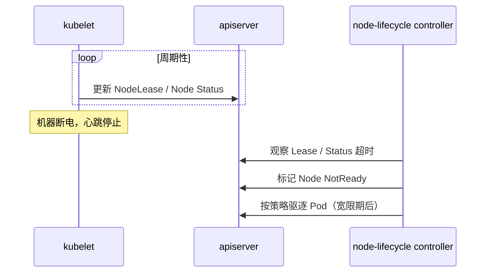
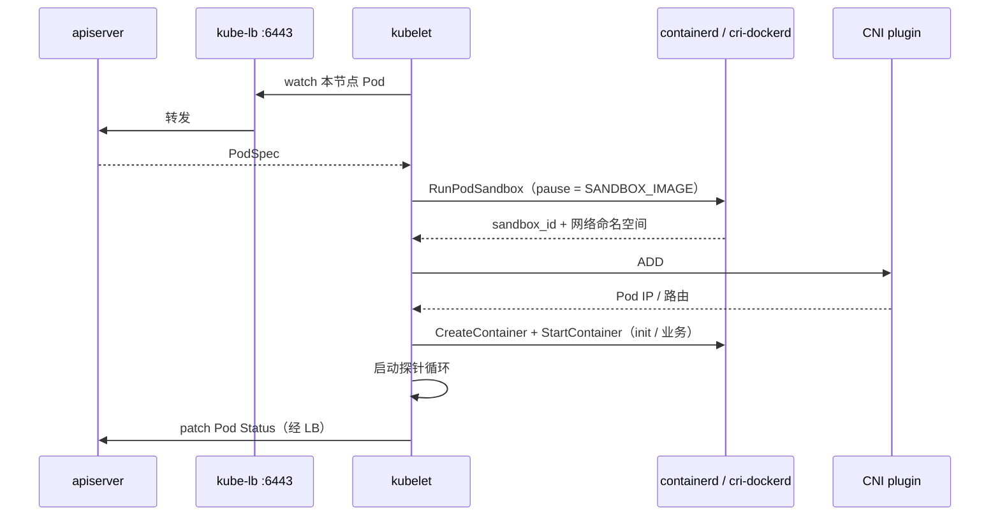
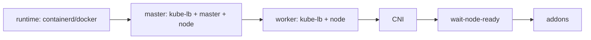

# 第 4 章 数据平面与节点组件原理及实现

> 官方参考：[Nodes](https://kubernetes.io/docs/concepts/architecture/nodes/) · [kubelet](https://kubernetes.io/docs/reference/command-line-tools-reference/kubelet/) · [kube-proxy](https://kubernetes.io/docs/reference/command-line-tools-reference/kube-proxy/) · [Reserve Compute Resources](https://kubernetes.io/docs/tasks/administer-cluster/reserve-compute-resources/) · [Container Runtimes](https://kubernetes.io/docs/setup/production-environment/container-runtimes/)

## 4.1 概述

本章说明节点侧组件与对象：**Node**、**kubelet**、**kube-proxy**，以及 Pod 从绑定到 Running 的启动链路；并对照 kubeauto 在 `roles/kube-node` 中的实现。

范围包括：

- Node 对象的自注册、Conditions（尤其 Ready）、心跳与 NodeLease
- kubelet：监视本节点 Pod，经 CRI / CNI 兑现为运行中的容器，并回报状态
- Pod 启动链：pause 沙箱 → CNI `ADD` → 业务容器；以及 `kubectl describe` / `crictl` / journald 排障顺序
- kube-proxy 的 iptables / ipvs 模式，以及本项目默认 **ipvs**
- Capacity 与 Allocatable 的区分（详细计算见第 11 章）
- kubeauto：`KUBE_APISERVER=https://127.0.0.1:{{ SECURE_PORT }}`、CRI 端点、`K8S_NODENAME`、`podruntime.slice`、`wait-node-ready.yml`

控制面决定集群的期望状态与全局决策；节点组件在机器上维护运行中的 Pod 与 Service 转发规则。生产排障中，用户感知的故障（`ContainerCreating`、`ImagePullBackOff`、节点 `NotReady`、Service 不通、资源压力驱逐）多数落在节点侧。本章目标是将「API 正常但业务起不来」与「控制面不可用」区分开。

---

## 4.2 控制面与节点的职责边界

控制面管理期望状态（API 对象、调度绑定、控制器调谐）。节点侧负责：

| 组件 / 对象 | 职责 |
|-------------|------|
| **kubelet** | 按 PodSpec 创建并维护沙箱与容器；执行探针；汇报 Node / Pod Status |
| **kube-proxy** | 在节点上维护网络规则，将流量转发到 Service 后端 |
| **Node 对象** | 控制面中代表该机器的记录：Ready、Capacity / Allocatable、地址等 |

控制面不可用时，已在节点上运行的工作负载通常继续运行，但无法接收新的规范变更，也无法将状态更新写回 API。控制面配置正确而节点上 CRI、CNI 或镜像不可用时，工作负载仍无法启动。

---

## 4.3 Node 对象：集群中的工作节点

### 4.3.1 定义

根据官方 [Nodes](https://kubernetes.io/docs/concepts/architecture/nodes/) 文档，**Node** 是 Kubernetes 中的工作节点：可以是虚拟机或物理机，取决于集群。每个 Node 上运行的组件包括 kubelet、容器运行时，以及通常还有 kube-proxy。

控制面通过 Node 对象跟踪机器：

- **元数据**：名称、标签、注解、污点。
- **Spec**：例如 `unschedulable`（cordon）、`podCIDR`、污点等。
- **Status**：地址、条件（Conditions）、容量（Capacity）、可分配（Allocatable）、节点信息、镜像列表等。

**Node 对象是控制面中的记录；物理或虚拟机在基础设施侧。** kubelet 负责使二者保持同步。机器故障而对象仍在，或对象已删而机器仍在，都会造成状态不一致——排障时两者都要核对。

### 4.3.2 自注册（Self-registration）

默认情况下，kubelet 启动后会尝试向 apiserver **注册自己**（创建或更新 Node 对象）。注册成功的前提包括：

1. 能连接到 apiserver（本项目经 `https://127.0.0.1:6443` → kube-lb）。
2. 持有合法节点身份证书：CN=`system:node:<节点名>`，O=`system:nodes`。
3. 节点名符合规则，且与证书、`--hostname-override` 一致。

本项目中节点名来自 `K8S_NODENAME`（`conf/config.yml`）：若 inventory 未设 `k8s_nodename`，则默认派生为 `k8s-<ip-with-dashes>`。`ENABLE_SETTING_HOSTNAME=true` 时还会把主机 hostname 设成该名。

**节点名一旦进入集群，变更成本极高**（证书 CN、Node 对象、网络策略、监控标签全绑在名字上）。实验室规划阶段就应固定命名策略。

### 4.3.3 Ready 与其他 Conditions

Node Status 中的 Conditions 是运维仪表盘。最重要的是 **Ready**：

| Condition | 大致含义 |
|-----------|----------|
| **Ready** | 节点是否可以接收新 Pod；`True` 才通常被视为可调度健康节点 |
| MemoryPressure | 内存压力 |
| DiskPressure | 磁盘压力 |
| PIDPressure | PID 压力 |
| NetworkUnavailable | 网络未就绪（常见于 CNI 未装完） |

`kubectl describe node <name>` 会打印 Conditions、Capacity/Allocatable、系统信息、已分配资源与事件。**这是节点排障的第一入口**，比盲目重启 kubelet 更有效。

CNI 安装完成前，节点经常 `NotReady` 且伴随网络相关原因——这是官方预期行为。kubeauto 因此在 `90.setup.yml` 里先装 CNI，再执行 `wait-node-ready.yml`。

### 4.3.4 心跳与 Lease

若一台机器突然断电，它无法主动将 Node 标记为 NotReady。集群依赖：

1. **kubelet 定期更新 Node Status**（本项目 `nodeStatusUpdateFrequency` 等见 kubelet 配置）。
2. **NodeLease**：更轻量的心跳对象（`nodeLeaseDurationSeconds`，本项目配置为 40s 量级）。
3. **node-lifecycle 控制器**（在 controller-manager 内）：若超时未收到心跳，将节点标记为 NotReady，并在宽限期后触发 Pod 驱逐等逻辑。

超时过短会在网络抖动时误判节点故障；过长则延长故障转移时间。生产环境调整这些参数前应有明确的可用性目标（SLO）。



---

## 4.4 kubelet

### 4.4.1 职责

kubelet 在每个节点上运行，确保分配到本节点的 Pod（含其中的容器）按规范运行。其核心职责包括：

1. 将分配给本节点的 PodSpec **兑现**为运行中的容器。
2. 将本机真实状态 **汇报**回控制面。
3. 在节点本地执行策略：探针、卷、cgroup、驱逐、镜像垃圾回收。

### 4.4.2 职责明细

官方语义下，kubelet 典型职责包括：

- 使用证书身份向 API 认证，监视本节点 Pod。
- 通过 **CRI** 调用容器运行时：创建 Pod 沙箱、创建/启动/停止容器、拉取镜像。
- 通过 **CNI**（经由运行时或网络插件路径）配置 Pod 网络。
- 挂载 Volume、管理 Secret/ConfigMap 投影。
- 执行 liveness / readiness / startup 探针。
- 维护 cgroup、执行 Node Allocatable 与驱逐策略。
- 暴露本地 API（默认 `10250`）供 apiserver 做 logs/exec（需正确客户端证书）。
- 更新 Node 与 Pod 的 Status、Events。

kubelet 由 systemd 托管（本项目如此）；这与「kubelet 经 CRI 管理业务容器」属于不同层级——kubelet 进程异常不等同于全部业务容器停止，二者相关但不等价。

### 4.4.3 Pod 启动全链路

当调度器写入 `spec.nodeName` 后：



逐步解释：

1. **获得 PodSpec**：kubelet 经本机 LB 连接 apiserver，过滤出属于自己的 Pod。
2. **RunPodSandbox**：创建 pause 容器，持有网络命名空间。镜像来自 `SANDBOX_IMAGE`（`conf/config.yml`）。私仓不可达或 tag 错误时，故障就卡在这一步。
3. **CNI ADD**：为沙箱配置 veth、IP、路由。失败时常见 `NetworkPluginNotReady` 或 `FailedCreatePodSandBox`。
4. **创建业务容器**：拉取镜像、创建并启动；Init 容器按顺序先完成。
5. **汇报 Status**：Pod IP、容器状态、条件（Ready 等）写回 API。

排障时应按这个顺序提问：**沙箱有了吗？→ IP 有了吗？→ 业务容器起来了吗？→ 探针过了吗？**

### 4.4.4 本项目 kubelet 实现要点

| 项 | 路径 / 值 |
|----|-----------|
| 角色 | `roles/kube-node` |
| Unit | `roles/kube-node/templates/kubelet.service.j2` → `/etc/systemd/system/kubelet.service` |
| 配置 | `templates/kubelet-config.yaml.j2` → `/var/lib/kubelet/config.yaml` |
| 身份 CSR | `templates/kubelet-csr.json.j2`：CN=`system:node:{{ K8S_NODENAME }}`，O=`system:nodes` |
| kubeconfig 创建 | `tasks/create-kubelet-kubeconfig.yml` |
| API 地址 | `vars/main.yml`：`KUBE_APISERVER: "https://127.0.0.1:{{ SECURE_PORT }}"` |
| 节点名 | `--hostname-override={{ K8S_NODENAME }}` |
| CRI（containerd） | `unix:///run/containerd/containerd.sock` |
| CRI（docker） | `unix:///var/run/cri-dockerd.sock`，且 `Requires=cri-dockerd.service` |
| cgroup 驱动 | `CGROUP_DRIVER=systemd`（vars） |
| 根目录 | `KUBELET_ROOT_DIR` 默认 `/var/lib/kubelet` |
| 最大 Pod 数 | `MAX_PODS` 默认 110 |

安装时还会把 kubeconfig 中的 `server` **lineinfile 改写**为 `{{ KUBE_APISERVER }}`，确保与 deploy 阶段可能残留的「首 master IP」脱钩。

### 4.4.5 节点身份与 RBAC / NodeRestriction

证书约定不是装饰：

- Node 授权器与 **NodeRestriction** 准入依赖 `system:node:<name>` 命名。
- 这能防止节点 A 的 kubelet 伪装成节点 B，或读写不属于自己的 Secret。

另外，第 3 章提到：apiserver 使用 `kubernetes.pem` 作为访问 kubelet 的客户端证书，并绑定 `system:kubelet-api-admin`。缺少绑定时，节点上业务可能正常，但中控 `kubectl logs` 失败——排障时不要只盯着业务镜像。

---

## 4.5 kube-proxy

### 4.5.1 职责

Service 为可能变化的一组 Pod 提供稳定的虚拟 IP 与 DNS 名。将发往 `ClusterIP:Port` 的流量转发到后端 `Pod IP:Port` 的，是每个节点上的 **服务代理**。默认实现是 kube-proxy；部分 CNI（如 Cilium）可用 eBPF 数据面替代它。

没有服务代理时，ClusterIP 仅是 API / etcd 中的地址分配结果，主机网络栈不会为其建立转发规则。

### 4.5.2 iptables vs ipvs（以及本项目默认）

| 模式 | 机制 | 特点 |
|------|------|------|
| **iptables** | 大量 iptables 规则链做 DNAT / 概率负载均衡 | 规则数随 Service/Endpoint 增长，大集群 iptables 刷新可能变慢 |
| **ipvs** | 内核 IPVS 虚拟服务器表 | 规则更像「一张 VS 表」，大规模时通常更清晰、性能更好 |

kubeauto 库存默认：

```text
PROXY_MODE=ipvs
```

配置模板：`roles/kube-node/templates/kube-proxy-config.yaml.j2`，其中：

- `mode: "{{ PROXY_MODE }}"`
- `clusterCIDR: "{{ CLUSTER_CIDR }}"` —— 用于区分集群内外流量并决定 SNAT 行为
- `hostnameOverride: "{{ K8S_NODENAME }}"` —— **必须与 kubelet 一致**，否则 proxy 找不到 Node，可能不编程任何规则
- ipvs 段含 `strictARP` 等（由 `ENABLE_IPVS_STRICT_ARP` 控制）

生产验证 ipvs：

```bash
ipvsadm -Ln
ipvsadm -Ln --stats
systemctl status kube-proxy
journalctl -u kube-proxy -f
```

若 `PROXY_MODE=ipvs` 但内核模块 / `ipvsadm` 缺失，proxy 可能回退或失败——安装角色应保证依赖就绪（见 prepare / 节点角色相关任务）。

### 4.5.3 本项目 kube-proxy 落点

| 项 | 路径 |
|----|------|
| 配置 | `roles/kube-node/templates/kube-proxy-config.yaml.j2` |
| Unit | `roles/kube-node/templates/kube-proxy.service.j2` |
| kubeconfig | `/etc/kubernetes/kube-proxy.kubeconfig`（身份 `system:kube-proxy`，server 指向本机 LB） |
| cgroup | 可与 kubelet 一同放入 `podruntime.slice` |

---

## 4.6 Capacity vs Allocatable（先导，细节见第 11 章）

### 4.6.1 为何调度使用 Allocatable 而非 Capacity

若业务 Pod 占用节点几乎全部 CPU / 内存，操作系统、kubelet、containerd、SSH、journald 等系统进程将争用不足，最终可能导致节点 NotReady 与业务级联失败。因此 Kubernetes 区分：

- **Capacity**：节点上报的资源总量（硬件 / 内核可见资源）。
- **Allocatable**：调度器用于放置 Pod 的可分配量 ≈ Capacity − 预留 − 驱逐阈值等。

调度器依据 Allocatable 做放置决策，而非 Capacity。

### 4.6.2 本项目合同基线（预告）

`conf/config.yml` 默认启用：

- `kubeReserved`：如 CPU `1000m`、内存 `1536Mi`（给 kubelet/运行时等）
- `systemReserved`：如 CPU `1000m`、内存 `2560Mi`（给 OS；**默认不硬限 enforce**）
- `enforceNodeAllocatable`：始终含 `pods`；`kube-reserved` 随开关；`system-reserved` 仅当 `SYS_RESERVED_ENFORCE=yes`

systemd 驱动下：

```text
kubeReservedCgroup: /podruntime   → 主机上 podruntime.slice
systemReservedCgroup: /system     → system.slice
```

**切勿**在 systemd 驱动下写成 `/podruntime.slice`，否则会变成 `podruntime.slice.slice` 并导致 kubelet 无法启动（上游已知问题）。

`roles/prepare/tasks/podruntime-slice.yml` 负责创建并启动 `podruntime.slice`；kubelet unit 在预留开启时 `Slice=podruntime.slice` 且 `Requires=podruntime.slice`。

第 11 章展开 QoS、驱逐与验收口径；本章只需建立：`kubectl describe node` 里 **Allocatable 小于 Capacity 是健康设计，不是资源丢失**。

---

## 4.7 节点就绪路径：从安装编排到 Ready

### 4.7.1 `90.setup.yml` 中与节点相关的阶段



关键事实：

1. 运行时先于 kubelet（docker 路径下 unit 显式 `Requires=cri-dockerd.service`）。
2. CNI 在 node 组件之后；此前 NotReady 正常。
3. `roles/kube-node/tasks/wait-node-ready.yml` 循环查询：

```text
kubectl get node {{ K8S_NODENAME }} -o jsonpath='...Ready...'
until == True
```

成功后打标签 `kubernetes.io/role=node`；若是 master 再打 `master`；若主机不在 `kube_node` 组（纯 master），则 `cordon` 禁止调度业务。

### 4.7.2 失败时的排查顺序

```bash
kubectl get nodes -o wide
kubectl describe node <K8S_NODENAME>
systemctl status kubelet kube-proxy kube-lb
ls /etc/cni/net.d/
crictl info
crictl pods
crictl ps -a
journalctl -u kubelet -f
```

建议顺序：

1. Node Ready？有无 `NetworkPluginNotReady`？
2. kubelet active？CRI socket 是否存在？
3. pause 沙箱能否创建？`SANDBOX_IMAGE` 能否拉取？
4. `/etc/cni/net.d` 是否仅有目标 CNI 的配置（残留的 `10-default.conf` 可能导致 CNI 冲突）？
5. kubeconfig 的 server 是否为 `https://127.0.0.1:6443`？kube-lb 是否在听？

---

### 4.7.3 与安装步骤的对应关系

| CLI 步骤 | Playbook | 本章组件 |
|----------|----------|----------|
| `03` | `03.runtime.yml` | containerd / docker（CRI 端点） |
| `04` | `04.kube-master.yml` | master 上的 kubelet / kube-proxy |
| `05` | `05.kube-node.yml` | worker 上的 kube-lb → kube-node |
| `06` | `06.network.yml` | CNI 安装；此前节点 NotReady 属预期 |
| `90` | `90.setup.yml` | 上述总装 + `wait-node-ready.yml` |

## 4.8 生产验证：命令与路径

### 4.8.1 文件路径

| 路径 | 含义 |
|------|------|
| `/etc/kubernetes/ssl/kubelet.pem` | kubelet 服务端 / 客户端证书 |
| `/etc/kubernetes/kubelet.kubeconfig` | kubelet 访问 API |
| `/etc/kubernetes/kube-proxy.kubeconfig` | kube-proxy 访问 API |
| `/var/lib/kubelet/config.yaml` | KubeletConfiguration |
| `/var/lib/kubelet/` | 数据根（pod 目录、插件等） |
| `/run/containerd/containerd.sock` | containerd CRI |
| `/var/run/cri-dockerd.sock` | cri-dockerd CRI |
| `/etc/cni/net.d/` | CNI 配置 |
| `/opt/cni/bin/` | CNI 二进制（常见） |
| `/etc/systemd/system/podruntime.slice` | kubeReserved 父 slice |
| `/etc/kube-lb/logs/error.log` | 本机 API LB 错误日志 |

### 4.8.2 kubectl / crictl 视角

```bash
kubectl get node <name> -o yaml | less
kubectl describe node <name>
kubectl get pods -A -o wide --field-selector spec.nodeName=<name>
kubectl get events -A --field-selector involvedObject.kind=Node

# 节点上（需 crictl 已配置 runtime endpoint）
crictl pods
crictl ps -a
crictl images | grep pause
```

### 4.8.3 健康节点的判定要点

- `Ready=True`，无持续 Pressure。
- Allocatable CPU/Memory 小于 Capacity，且数值与预留配置一致。
- `crictl pods` 中系统 Pod 沙箱 Running。
- `ipvsadm -Ln`（ipvs 模式）中能看到 kubernetes Service 等虚拟服务器。
- kubelet 日志无每秒级 CRI 连接错误。

---

## 4.9 kubeauto 如何实现（角色级深描）

### 4.9.1 角色与变量

- 主角色：`roles/kube-node`
- 强制 API：`roles/kube-node/vars/main.yml` → `KUBE_APISERVER=https://127.0.0.1:{{ SECURE_PORT }}`
- 默认配置源：`conf/config.yml`（`K8S_NODENAME`、`MAX_PODS`、预留开关等）
- 库存网络默认：`PROXY_MODE=ipvs`、`CLUSTER_NETWORK=calico`、`CONTAINER_RUNTIME=containerd`（见 `conf/hosts.*`）

### 4.9.2 与控制面的关系

master 主机在 `90.setup.yml` 中也会跑 `kube-node`，因此：

- 控制面进程（systemd）与 kubelet 共存。
- 资源预留对 master 节点更关键（apiserver/etcd 常在 `system.slice`）。
- 纯 master 可在 wait 阶段被 cordon，避免业务 Pod 调度至控制面节点。

### 4.9.3 精确路径表

| 主题 | 路径 |
|------|------|
| kubelet unit | `roles/kube-node/templates/kubelet.service.j2` |
| kubelet 配置 | `roles/kube-node/templates/kubelet-config.yaml.j2` |
| kubelet CSR | `roles/kube-node/templates/kubelet-csr.json.j2` |
| 创建 kubeconfig | `roles/kube-node/tasks/create-kubelet-kubeconfig.yml` |
| kube-proxy 配置 | `roles/kube-node/templates/kube-proxy-config.yaml.j2` |
| kube-proxy unit | `roles/kube-node/templates/kube-proxy.service.j2` |
| 等待 Ready | `roles/kube-node/tasks/wait-node-ready.yml` |
| podruntime slice | `roles/prepare/tasks/podruntime-slice.yml` |
| 本机 LB | `roles/kube-lb/templates/kube-lb.conf.j2` |
| 总装编排 | `playbooks/90.setup.yml` |

---

## 4.10 动手验证清单

- [ ] `kubectl get nodes` 全部 Ready；`describe` 中无持续 NetworkUnavailable。
- [ ] 每节点 `grep 'server:' /etc/kubernetes/kubelet.kubeconfig` 为 `https://127.0.0.1:6443`。
- [ ] `ss -lntp | grep 127.0.0.1:6443` 显示 kube-lb。
- [ ] `systemctl is-active kubelet kube-proxy` 为 active；containerd 或 cri-dockerd 对应 active。
- [ ] `ls /run/containerd/containerd.sock`（或 cri-dockerd sock）存在。
- [ ] `crictl images` 能看到 pause（`SANDBOX_IMAGE`）。
- [ ] `cat /var/lib/kubelet/config.yaml | grep -E 'cgroupDriver|kubeReserved|clusterDNS'` 符合预期（systemd、预留、DNS IP）。
- [ ] `systemctl status podruntime.slice` 在预留开启时为 active；kubelet 在该 slice 下。
- [ ] `hostname` 与 `K8S_NODENAME`、Node 名一致；kube-proxy 配置中 `hostnameOverride` 相同。
- [ ] `PROXY_MODE=ipvs` 时 `ipvsadm -Ln` 非空（至少有 kubernetes 相关服务）。
- [ ] 创建测试 Pod，在节点上用 `crictl pods` 看到 sandbox，再用 `kubectl get pod -o wide` 看到 Pod IP。
- [ ] （可选）对比 `Capacity` 与 `Allocatable`，确认差值与 `KUBE_RESERVED_*` + `SYS_RESERVED_*` 粗略一致。

---

## 4.11 常见问题与误区（FAQ）

### Q1：节点 NotReady，是不是先重启机器？

先 `kubectl describe node` 与 `journalctl -u kubelet`。多数是 CNI、磁盘、运行时、时钟、证书问题。盲目重启可能只是暂时恢复，根因仍在。

### Q2：为什么 kubelet 已经 Running，节点还是 NotReady？

kubelet 进程活着 ≠ 节点 Ready。网络插件未就绪、运行时挂掉、磁盘压力等都会让 Ready=False。看 Conditions 的 `Message`/`Reason` 字段。

### Q3：`hostnameOverride` 和真实 hostname 不一致会怎样？

可能导致 Node 名混乱、kube-proxy 找不到节点、证书 CN 不匹配。本项目用 `K8S_NODENAME` 统一三者；不要手改其一而不改证书。

### Q4：ipvs 模式下 Service 不通，如何判断是 proxy 还是 CNI？

先测 Pod IP 直连（绕过 Service）。Pod IP 不通 → CNI/路由；Pod IP 通但 ClusterIP 不通 → kube-proxy/ipvs/iptables 或 DNS。再 `ipvsadm -Ln` 看是否有对应 VS。

### Q5：Allocatable 比 Capacity 小，是不是安装把资源「吃掉」了？

是**故意预留**。调度器必须给 OS 与 Kubernetes 系统守护进程留空间。详见第 11 章；不要把预留关掉只为「看起来能调度更多」。

### Q6：master 被 cordon 后，控制面是不是也不能跑了？

cordon 只影响**新 Pod 是否调度到该节点**，不影响本机 systemd 托管的 apiserver 等进程。纯 master cordon 是常见加固做法。

### Q7：删掉 Node 对象但机器还在，再启动 kubelet 会怎样？

kubelet 通常会按身份重新注册（或按配置行为更新）。但若名称/证书不一致，可能注册出「另一个节点」或失败。删除 Node 前应有维护流程（drain、确认工作负载）。

### Q8：`ContainerCreating` 卡很久，第一眼看什么？

`kubectl describe pod` 的 Events：是沙箱失败、CNI 失败，还是镜像拉取失败。然后到节点上 `crictl pods` / `journalctl -u kubelet` 对照第 4.4.3 节的链路逐步核对。

### Q9：为什么所有组件都要走 127.0.0.1，worker 上也要装 kube-lb？

worker 同样需要高可用地访问 apiserver。本机 LB 把「API 入口」统一成回环地址，upstream 配全部 master。见 `roles/kube-lb` 与第 7 章。

### Q10：可以把 kube-proxy 模式改成 iptables 吗？

可以，改库存 `PROXY_MODE` 并重跑相关角色/配置。改模式会重写节点转发规则，应在维护窗口操作，并回归 Service 连通性与会话保持需求。

---

## 4.12 与前后章节的衔接

- **第 2 章**给出控制面/数据面总图；本章是数据面展开。
- **第 3 章**解释 API / 控制器 / 调度器如何把 Pod「交到」某节点；本章从交接点继续。
- **第 5 章**讲 etcd——控制面存储，但节点故障时你仍可能需要区分「API 读失败」与「节点本身失败」。
- **第 8 章**深入 CRI（containerd / cri-dockerd）。
- **第 9 章**深入 CNI。
- **第 11 章**深入 Allocatable、QoS 与驱逐。

---

## 4.13 官方文档与延伸阅读

| 主题 | URL |
|------|-----|
| Nodes | https://kubernetes.io/docs/concepts/architecture/nodes/ |
| kubelet 参数 | https://kubernetes.io/docs/reference/command-line-tools-reference/kubelet/ |
| kube-proxy 参数 | https://kubernetes.io/docs/reference/command-line-tools-reference/kube-proxy/ |
| 预留计算资源 | https://kubernetes.io/docs/tasks/administer-cluster/reserve-compute-resources/ |
| 容器运行时 | https://kubernetes.io/docs/setup/production-environment/container-runtimes/ |
| 集群网络 | https://kubernetes.io/docs/concepts/cluster-administration/networking/ |
| Service | https://kubernetes.io/docs/concepts/services-networking/service/ |
| Pod 生命周期 | https://kubernetes.io/docs/concepts/workloads/pods/pod-lifecycle/ |
| 污点与容忍 | https://kubernetes.io/docs/concepts/scheduling-eviction/taint-and-toleration/ |
| 节点压力驱逐 | https://kubernetes.io/docs/concepts/scheduling-eviction/node-pressure-eviction/ |

**本仓库对照路径速查：** `roles/kube-node/` · `roles/kube-lb/` · `roles/prepare/tasks/podruntime-slice.yml` · `playbooks/90.setup.yml` · `conf/config.yml` · `conf/hosts.multi-node`

至此，控制面与数据面的主线已经闭环：声明式对象进入 etcd，控制器与调度器决定「在哪台机器以何种形态存在」，kubelet 与网络/运行时把期望变成进程与数据包。后续章节分别把存储、证书、HA、CRI、CNI、DNS、可分配资源与插件生态展开到可验收深度。
