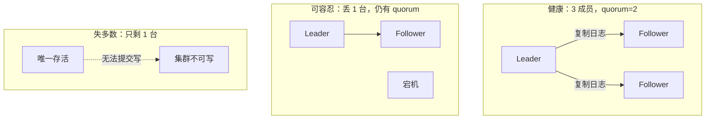
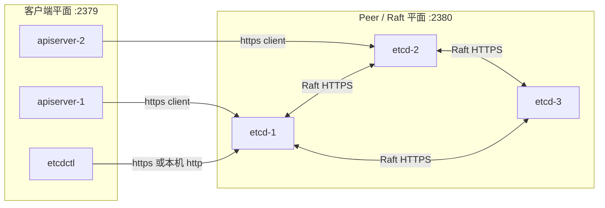
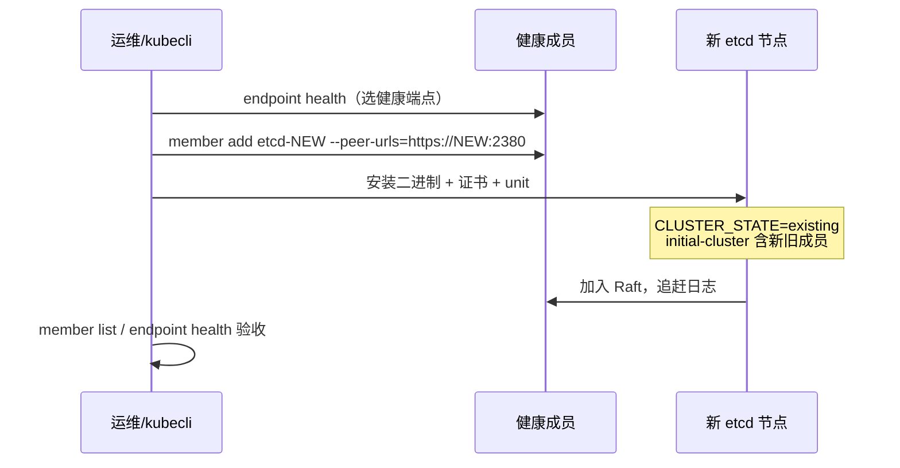
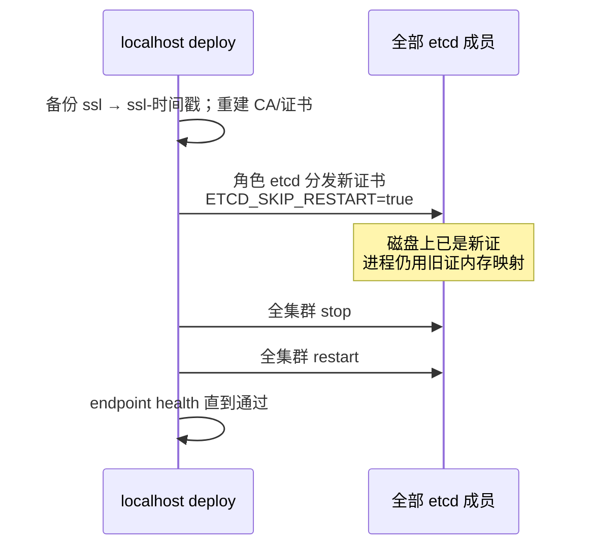

# 第 5 章 etcd 原理与本项目实现

> 官方参考：[etcd Documentation](https://etcd.io/docs/)、[Operating etcd clusters for Kubernetes](https://kubernetes.io/docs/tasks/administer-cluster/configure-upgrade-etcd/)、[etcd FAQ](https://etcd.io/docs/latest/faq/)  
> 版本基线：本项目从 **ext-bin** 分发官方 etcd 二进制 **v3.6.4**（含 `etcd` / `etcdctl` / `etcdutl`）。

---

## 5.1 概述

本章说明 etcd 作为 Kubernetes 控制面存储后端的角色、Raft 多数派语义、peer / client 网络平面、数据生命周期（WAL、快照、压缩、配额），以及 kubeauto 中的安装、扩容、备份、恢复与证书轮换实现。

范围包括：

- 奇数成员与 quorum：可容忍故障数与失多数后果
- peer 端口 2380 与 client 端口 2379；本机 `http://127.0.0.1:2379` 与对外 HTTPS 宣告的不对称配置
- snapshot、compaction、quota 对磁盘与写入能力的影响
- 运维判读：`endpoint health` / `member list` / `endpoint status`
- kubeauto 路径：安装、扩容、备份、恢复、证书轮换（含 `ETCD_SKIP_RESTART`）
- 交付验收：健康检查与备份演练

本章面向架构与实施交付。操作步骤见操作手册；本章给出架构约束与仓库参数与官方语义的对应关系。

---

## 5.2 etcd 在 Kubernetes 中的角色

Kubernetes 几乎所有 API 对象（Pod、Deployment、Secret、Lease、CRD 实例等）最终以序列化形式写入 etcd。etcd 提供强一致、可复制的键值存储。官方架构有一条硬性不变量：

> **只有 kube-apiserver 直接读写 etcd。**  
> 其他组件通过 apiserver 的 REST / watch 交互，绝不直连 etcd。

该不变量带来两个直接后果：

- etcd 的可用性上限，就是集群「可写」的上限。失多数派时，apiserver 无法持久化变更，控制面实质停写。
- etcd 的证书、磁盘、成员拓扑属于控制面核心 SLA，交付评审须单独验收。

写路径由 Raft Leader 发起日志复制，须获得多数派确认后方可提交（commit）。因此生产成员数建议为奇数（通常 3 或 5），以便在固定可容忍故障数下用最少成员维持 quorum——下一节展开。

---

## 5.3 Raft 多数派：Leader、Follower 与法定人数

### 5.3.1 角色

etcd 集群基于 Raft 共识协议。稳态下成员角色为：

| 角色 | 职责 |
|------|------|
| **Leader** | 处理客户端写请求；将日志条目复制给 Follower；在多数派确认后提交（commit） |
| **Follower** | 接收并持久化 Leader 复制过来的日志；响应心跳；在超时未收到心跳时发起选举 |
| **Candidate** | 选举过程中的临时角色：请求选票，若获得多数票则成为新 Leader |

读请求在多数实现中也可由 Follower 提供（视线性一致性配置而定），但对 Kubernetes 而言更关键的是：**写路径必须经过 Leader，且必须得到多数派确认**。

### 5.3.2 多数派（quorum）公式

设集群有 \(N\) 个成员，法定人数（quorum）为：

\[
\text{quorum} = \lfloor N/2 \rfloor + 1
\]

因此：

| 成员数 \(N\) | quorum | 可容忍故障数 |
|-------------|--------|--------------|
| 1 | 1 | 0 |
| 3 | 2 | 1 |
| 5 | 3 | 2 |
| 4 | 3 | 1（与 3 相同，却多一台无增益故障域） |
| 2 | 2 | 0（任一故障即失多数） |

**奇数成员的本质理由**：在固定可容忍故障数下，奇数拓扑用最少的机器达到目标。例如容忍 1 台故障，3 节点足够；若改用 4 节点，仍只能容忍 1 台（因为 quorum=3），却多付出一台机器的成本与复制带宽，且故障域更复杂。官方与 etcd 社区因此强烈建议生产使用 **3 或 5**。

### 5.3.3 失多数意味着什么

当存活成员 < quorum 时：

- 集群**无法选出或维持 Leader**（或无法提交新日志）。
- 客户端写入失败；Kubernetes 侧表现为创建/更新资源超时、Lease 无法续约、控制器停止协调。
- 集群**不会**自动降级为只读模式；运维须恢复成员 quorum 或从快照重建。



---

## 5.4 peer 2380 与 client 2379：两条网络平面

etcd 对外暴露两类 URL，混用是现场高频误配置来源。

### 5.4.1 peer URL（默认端口 2380）

Peer 平面用于**成员之间**的 Raft 通信：心跳、日志复制、选举投票、成员变更。

在 kubeauto 的 `etcd.service.j2` 中对应：

- `--listen-peer-urls=https://{{ inventory_hostname }}:2380`
- `--initial-advertise-peer-urls=https://{{ inventory_hostname }}:2380`
- `--initial-cluster={{ ETCD_NODES }}`，其中每项形如 `etcd-<ip>=https://<ip>:2380`

Peer 平面必须使用成员间可达的真实地址，且必须与证书 SAN / hosts 列表一致。防火墙必须放行成员之间的 2380。

### 5.4.2 client URL（默认端口 2379）

Client 平面供 **apiserver（以及运维用的 etcdctl）** 访问。Kubernetes 状态读写全部走这条平面。

kubeauto 中的关键设计：

```text
--listen-client-urls=https://{{ inventory_hostname }}:2379,http://127.0.0.1:2379
--advertise-client-urls=https://{{ inventory_hostname }}:2379
```

请仔细读这两行的不对称：

1. **监听**同时包含本机 HTTPS 与本机 HTTP 回环。
2. **广告（advertise）**只宣告 HTTPS 地址。

含义是：集群成员互相告知「请用 HTTPS 连我的 2379」；本机 `http://127.0.0.1:2379` 仅便于本机探测或受限运维场景，**不是**给远程 apiserver 用的入口。远程客户端（其他节点上的 apiserver）必须走 `https://<etcd-ip>:2379`，并携带客户端证书。



---

## 5.5 数据生命周期：WAL、快照、压缩与配额

### 5.5.1 数据目录与 WAL

etcd 将状态机快照与预写日志（WAL）落盘。kubeauto 暴露两个变量（`conf/config.yml`）：

| 变量 | 默认 | 含义 |
|------|------|------|
| `ETCD_DATA_DIR` | `/var/lib/etcd` | 数据目录（含 backend / 快照） |
| `ETCD_WAL_DIR` | `""`（空则与 data 同盘） | 可选独立 WAL 目录 |

官方与社区实践强烈建议：

- 使用 **SSD**；避免与高 IO 业务盘争抢。
- 若条件允许，将 WAL 放到独立磁盘，降低 fsync 延迟对提交延迟的影响。
- 目录权限应为 `0700`（kubeauto 安装时会创建并设权）。

### 5.5.2 snapshot-count

`--snapshot-count=50000`（kubeauto 默认）表示大约每累积这么多写事务后触发一次快照。快照是压缩历史与灾难恢复的基础材料之一。过小会增加磁盘抖动；过大则 WAL 变长、恢复更慢。50000 是常见生产折中。

### 5.5.3 auto-compaction

Kubernetes 对 etcd 的写放大很高（控制器持续更新状态）。历史修订若不压缩，backend 会持续膨胀，最终触发配额告警甚至拒绝写入。

kubeauto 配置：

```text
--auto-compaction-mode=periodic
--auto-compaction-retention=1
```

即周期性压缩，保留约 1 小时历史修订窗口。运维仍应监控 `db size` 与磁盘使用率。

### 5.5.4 quota-backend-bytes

`--quota-backend-bytes=8589934592`（8 GiB）是软硬结合的保护阀：当 backend 超过配额，etcd 进入告警状态并拒绝写，防止把磁盘写满导致不可预期损坏。现场若看到「etcd 只读 / 配额耗尽」，正确动作是：排查异常写入 → 压缩/碎片整理（`defrag`）→ 必要时扩容磁盘并调整配额——**不要**盲目把配额调到极大值却不治根因。

另有 `--max-request-bytes=10485760`（10 MiB）限制单请求体积，避免超大对象拖垮成员。

---

## 5.6 安装时序：`CLUSTER_STATE=new` 与 `existing`

### 5.6.1 全新集群（new）

首次由 `playbooks/02.etcd.yml` / `90.setup.yml` 拉起时，`roles/etcd/defaults/main.yml` 默认：

```text
CLUSTER_STATE: "new"
ETCD_NODES: etcd-<ip1>=https://<ip1>:2380,etcd-<ip2>=https://<ip2>:2380,...
```

所有初始成员必须以**相同的** `--initial-cluster` 列表、`--initial-cluster-token`（kubeauto 固定 `etcd-cluster-0`）和 `new` 状态启动，否则无法形成一致的集群身份。

成员名格式：`etcd-{{ inventory_hostname }}`。

### 5.6.2 扩容（existing）

`playbooks/21.addetcd.yml`（`kubecli add-etcd`）流程：

1. 在现有健康成员上执行 `etcdctl member add etcd-<新IP> --peer-urls=https://<新IP>:2380`。
2. 对新主机以 `CLUSTER_STATE: existing` 运行 `roles/etcd`。
3. 新成员加入后，Raft 会同步数据；期间应避免同时大幅变更拓扑。

**切记**：已经跑起来的成员，绝不能再用 `new` 状态带着旧 data-dir 随意重启「重建」——那会生成另一套集群身份，造成脑裂或无法加入。



缩容见 `31.deletcd.yml` / `kubecli del-etcd`：先 `member remove`，再清理主机——顺序反了会导致法定人数计算混乱。

---

## 5.7 TLS 模型：共用 etcd.pem，信任集群 CA

### 5.7.1 证书生成

`roles/etcd` 在控制节点（localhost）上：

1. 渲染 `etcd-csr.json.j2`：CN=`etcd`，hosts 为全部 `groups['etcd']` IP + `127.0.0.1`。
2. 使用集群 CA（`ca.pem` / `ca-key.pem`）与 profile `kubernetes` 签发 `etcd.pem` / `etcd-key.pem`。
3. 分发到各 etcd 节点的 `ca_dir`（默认 `/etc/kubernetes/ssl`）：`ca.pem`、`etcd.pem`、`etcd-key.pem`。

**注意**：etcd 节点默认**不**拿到 `ca-key.pem`。

### 5.7.2 服务端与 peer 共用一对证书

`etcd.service.j2` 中：

```text
--cert-file / --key-file          → etcd.pem / etcd-key.pem   （client 平面服务端）
--peer-cert-file / --peer-key-file → 同一对 etcd.pem / etcd-key.pem
--trusted-ca-file / --peer-trusted-ca-file → ca.pem
```

这与 kubeadm 默认「server / peer / healthcheck-client 多套证书」的细粒度拆分不同：kubeauto 选择**单 CA + 单 etcd 证书兼 client/peer**，降低运维面。代价是证书用途更广，轮换与保护必须更谨慎（详见第 6 章）。

### 5.7.3 apiserver 如何作为 etcd 客户端

apiserver **不**使用 `etcd.pem` 作为客户端身份。本项目中：

- `--etcd-servers={{ ETCD_ENDPOINTS }}`（全部 `https://<etcd-ip>:2379`）
- `--etcd-cafile=ca.pem`
- `--etcd-certfile=kubernetes.pem`
- `--etcd-keyfile=kubernetes-key.pem`

即：**kubernetes.pem 身兼 apiserver 服务端证书与 etcd 客户端证书**。因此 etcd 的 `--trusted-ca-file` 必须信任签发 `kubernetes.pem` 的同一 CA——本项目正是单一集群 CA。

---

## 5.8 生产验证命令

以下命令在控制节点执行时，证书路径通常指向 `{{ cluster_dir }}/ssl/`；在 etcd 节点本机可用 `/etc/kubernetes/ssl/`。二进制可用节点上的 `{{ bin_dir }}/etcdctl` 或控制节点 `extra-bin/etcdctl`。

### 5.8.1 健康与成员

```bash
export ETCDCTL_API=3
export EP="https://10.0.0.11:2379,https://10.0.0.12:2379,https://10.0.0.13:2379"
export CACERT=/usr/local/kubeauto/clusters/<name>/ssl/ca.pem
export CERT=/usr/local/kubeauto/clusters/<name>/ssl/etcd.pem
export KEY=/usr/local/kubeauto/clusters/<name>/ssl/etcd-key.pem

etcdctl --endpoints="$EP" --cacert="$CACERT" --cert="$CERT" --key="$KEY" endpoint health
etcdctl --endpoints="$EP" --cacert="$CACERT" --cert="$CERT" --key="$KEY" endpoint status -w table
etcdctl --endpoints="$EP" --cacert="$CACERT" --cert="$CERT" --key="$KEY" member list -w table
```

判读要点：

- `endpoint health` 应全部 `is healthy`。
- `endpoint status` 观察 `RAFT TERM`、`RAFT INDEX`、`LEADER` 是否一致收敛；某一成员 index 长期落后说明复制或磁盘异常。
- `member list` 应与库存 `groups['etcd']` 一一对应。

### 5.8.2 手工快照（理解 94 在做什么）

```bash
etcdctl --endpoints="https://<healthy>:2379" \
  --cacert="$CACERT" --cert="$CERT" --key="$KEY" \
  snapshot save /path/to/snapshot.db

etcdutl --write-out=table snapshot status /path/to/snapshot.db
```

### 5.8.3 systemd 视角

```bash
systemctl status etcd
journalctl -u etcd -e --no-pager
ss -lntp | grep -E '2379|2380'
```

期望：2380 仅成员 IP；2379 有成员 IP 的 HTTPS 监听，以及 `127.0.0.1:2379`。

---

## 5.9 kubeauto 实现落点（路径级）

### 5.9.1 角色与模板

| 项 | 路径 / 值 |
|----|-----------|
| 角色 | `roles/etcd` |
| Unit 模板 | `roles/etcd/templates/etcd.service.j2` |
| CSR 模板 | `roles/etcd/templates/etcd-csr.json.j2` |
| 默认变量 | `roles/etcd/defaults/main.yml`（`ETCD_NODES`、`CLUSTER_STATE`、`ETCD_SKIP_RESTART`） |
| 安装 playbook | `playbooks/02.etcd.yml` |
| 扩容 | `playbooks/21.addetcd.yml`（`CLUSTER_STATE=existing`） |
| 缩容 | `playbooks/31.deletcd.yml` |
| 备份 | `playbooks/94.backup.yml` |
| 恢复 | `playbooks/95.restore.yml` + `roles/cluster-restore` |
| 证书轮换编排 | `playbooks/96.update-certs.yml` |
| 二进制来源 | `{{ base_dir }}/extra-bin/{etcd,etcdctl,etcdutl}`（etcd **v3.6.4**） |
| 节点落盘 | `{{ bin_dir }}/` + `{{ ca_dir }}/` + `ETCD_DATA_DIR` |

### 5.9.2 备份流程（94）精要

1. 轮询各成员 `endpoint health`，选出第一个 healthy 节点。
2. 对该端点执行 `snapshot save`，写入 `{{ cluster_dir }}/backup/snapshot_<时间戳>.db`。
3. 同时更新 `snapshot.db` 为「最新」指针，便于恢复剧本默认取用。

备份发生在控制节点侧通过远程 HTTPS 端点完成，因此控制节点必须持有 `ca.pem` + `etcd.pem` 密钥对，且网络可达 2379。

### 5.9.3 恢复流程（95）精要

官方要求恢复时**所有成员**基于同一快照重建身份拓扑。kubeauto 对齐该语义：

1. 停止全部 kube-master（apiserver / CM / scheduler）与 kubelet / kube-proxy。
2. **全部** etcd 成员 `state=stopped`。
3. 以 `serial: 1` 对每个成员跑 `cluster-restore`（写入快照数据）。
4. 全部恢复完成后再统一 `restart etcd`，并 `endpoint health` 验收。
5. 再按 `serial: 1` 拉起 apiserver，随后 CM/scheduler，最后节点代理。

切勿在「部分成员仍跑旧数据、部分已恢复」的混合状态下期望 Raft 自动修好——该状态易导致脑裂。

### 5.9.4 证书轮换与 `ETCD_SKIP_RESTART`

`96.update-certs.yml` 对 etcd 的 HA 安全顺序是本章必须掌握的实现精髓：



若在分发过程中逐台 `restart etcd`，可能出现「已重启成员只信任新 CA、未重启成员仍用旧证」——peer TLS 失败 → 失多数。`ETCD_SKIP_RESTART` 正是为了把「换文件」与「换进程信任」拆成两个屏障阶段。

---

### 5.9.5 与安装步骤的对应关系

| CLI 步骤 | Playbook | 说明 |
|----------|----------|------|
| `02` | `02.etcd.yml` | 全新集群；`CLUSTER_STATE=new` |
| `21` | `21.addetcd.yml` | 扩容；`kubecli add-etcd`；`CLUSTER_STATE=existing` |
| `94` / `95` | `94.backup.yml` / `95.restore.yml` | 快照备份与协同恢复 |
| `96` | `96.update-certs.yml` | 证书轮换；`ETCD_SKIP_RESTART` 两阶段屏障 |

步骤 `02` 在 `90.setup.yml` 中位于 `prepare` 之后、`containerd` 之前；Calico 默认以 **etcdv3** 读取网络状态（与 apiserver 所用 etcd 集群相同，经独立客户端证书 `calico.pem` 访问）。

## 5.10 与 apiserver、监控的衔接

- **控制面**：`roles/kube-master/vars/main.yml` 组装 `ETCD_ENDPOINTS`；无 etcd 则 apiserver 无法持久化。
- **Prometheus（可选）**：`roles/cluster-addon/tasks/prometheus.yml` 会另行签发 `etcd-client.pem` 并做成 Secret，供抓取 etcd metrics——这是**额外**客户端身份，不改变 apiserver 使用 `kubernetes.pem` 的主路径。
- **资源预留**：etcd 与 apiserver 常驻 `system.slice`；第 11 章讨论为何 `systemReserved` 默认不硬限，以避免误杀控制面。

---

## 5.11 验证清单（交付验收）

在签收或变更窗口结束后，逐项打勾：

1. **版本**：节点 `etcd --version` 为 **3.6.4**（或与当前 `KubeConstant` / ext-bin 钉扎一致）。
2. **成员**：`member list` 与库存 `groups['etcd']` 一致；无幽灵成员。
3. **健康**：`endpoint health` 全绿；`endpoint status` 有明确 Leader，raft index 接近。
4. **端口**：2380 仅 peer；2379 广告为 HTTPS；本机存在 `127.0.0.1:2379` 监听属预期。
5. **磁盘**：`ETCD_DATA_DIR`（及可选 WAL）在 SSD；`df -h` 余量充足；inode 未耗尽。
6. **配额**：`endpoint status` 中 DB SIZE 远低于 8Gi 配额；无持续 NOSPACE 告警。
7. **证书**：`openssl x509 -in etcd.pem -noout -text` 含全部成员 IP 与 `127.0.0.1`；节点无 `ca-key.pem`。
8. **备份**：`clusters/<name>/backup/snapshot.db` 存在且 `etcdutl snapshot status` 可读。
9. **恢复演练**：在实验室至少完整跑通一次 94→95（或等价流程），记录 RTO。
10. **扩容（若做）**：`add-etcd` 后新成员为 `existing` 加入，health 正常。

---

## 5.12 常见问题（FAQ）

**Q1：为什么不能用 2 节点 etcd「先省一台」？**  
A：quorum=2，任一故障即失多数。可用性与单节点相当，却增加复制与运维复杂度。

**Q2：本机 `http://127.0.0.1:2379` 是否不安全？**  
A：它只绑定回环，不对外暴露。风险面是「本机任意进程可无 TLS 访问 etcd」。生产主机应限制登录与本地恶意进程；远程访问仍必须 HTTPS+客户端证。不要把 HTTP 加到 `advertise-client-urls`。

**Q3：能否让 apiserver 只连本机 etcd，不配全部 endpoints？**  
A：可以工作于「etcd 与 apiserver 共置」的拓扑，但成员故障时该 apiserver 失去存储入口。kubeauto 默认列出全部 etcd HTTPS 端点，由客户端侧做故障转移，更符合多成员语义。

**Q4：备份文件在控制节点，是否等于「异地容灾」？**  
A：不等于。控制节点损坏会同时丢失权威证书与快照。应将 `backup/` 与 `ssl/` 复制到独立安全存储，并按密钥级保护。

**Q5：证书轮换时 etcd 短暂停服是否正常？**  
A：是。`96` 会协同 stop/start 全体成员。应在维护窗口执行，并确保 apiserver 也按剧本协同，避免半新半旧信任链。

**Q6：`CLUSTER_STATE=new` 误用于已有数据目录会怎样？**  
A：可能生成新的集群身份或拒绝启动。扩容必须用 `existing`，且 data-dir 必须为空或按官方恢复流程准备。

**Q7：DB 持续增长怎么办？**  
A：确认 auto-compaction 生效；检查是否有异常高频写入；执行压缩后按需 `defrag`；排查大对象 / 事件风暴。达到配额后必须先释放空间再恢复写入。

**Q8：etcd 与 kube-master 必须共置吗？**  
A：不必。kubeauto 库存允许独立 `etcd` 组。独立部署时更要注意 2379/2380 网络时延与证书 hosts 列表完整。

---

## 5.13 官方与延伸阅读

| 文档 | URL |
|------|-----|
| Operating etcd for Kubernetes | https://kubernetes.io/docs/tasks/administer-cluster/configure-upgrade-etcd/ |
| etcd 运维指南 | https://etcd.io/docs/latest/op-guide/ |
| Raft 与容错 FAQ | https://etcd.io/docs/latest/faq/ |
| 硬件建议 | https://etcd.io/docs/latest/op-guide/hardware/ |
| 本仓库实现 | `roles/etcd/`、`playbooks/02.etcd.yml`、`21.addetcd.yml`、`94.backup.yml`、`95.restore.yml`、`96.update-certs.yml` |

---

## 5.14 本章小结

etcd 是 Kubernetes 的强一致键值存储：Raft 多数派决定可写性，奇数成员是成本与容错的优选拓扑。peer 2380 与 client 2379 是两个网络平面；kubeauto 用单一 `etcd.pem` 覆盖 client/peer 服务端 TLS，用 `kubernetes.pem` 作为 apiserver 的 etcd 客户端身份，并用 `listen` HTTP 回环 + `advertise` HTTPS 的不对称配置平衡本机运维便利与集群安全。快照、压缩、配额共同约束磁盘寿命；备份/恢复与证书轮换必须「先对齐文件、再协同重启」，否则维护窗口可能自行造成失多数。下一章深入整条 PKI 链——包括 `kubernetes.pem` 多重用途与 `ca-key.pem` 为何不得下发到 worker。
