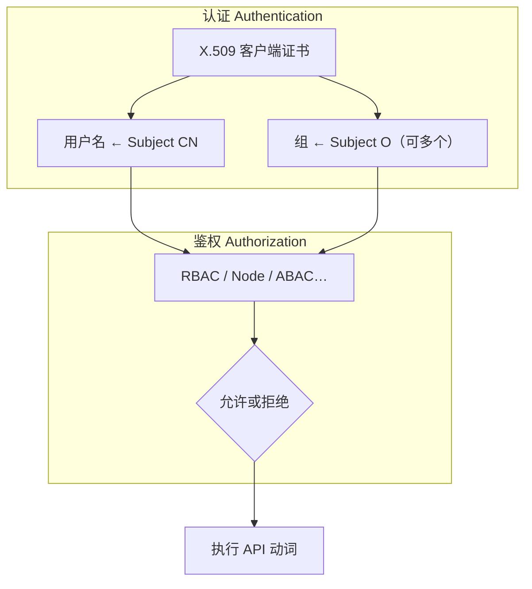
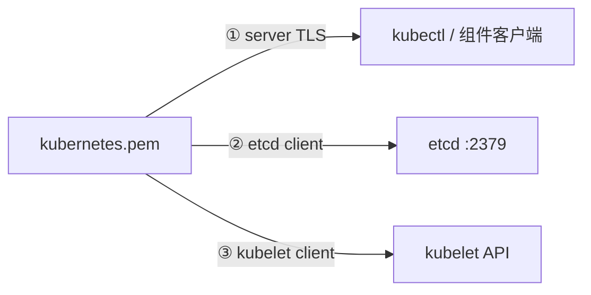
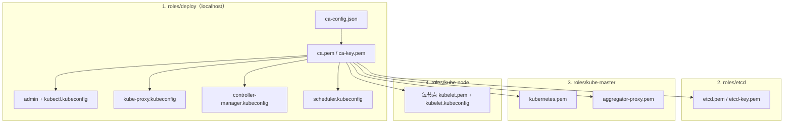
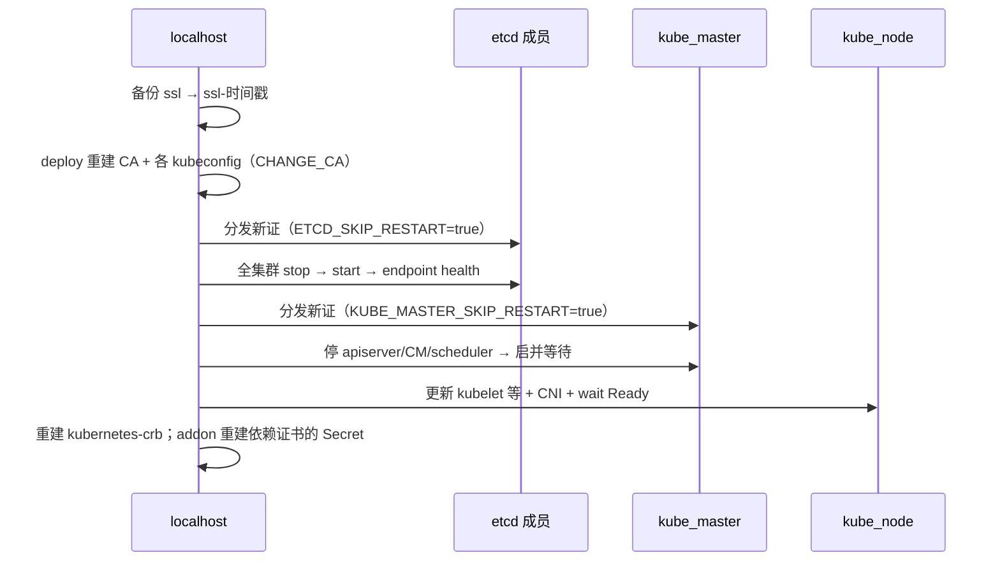

# 第 6 章 证书与 PKI 全链路（原理 + 本项目实现）

> 官方参考：[PKI certificates and requirements](https://kubernetes.io/docs/setup/best-practices/certificates/)、[Authenticating](https://kubernetes.io/docs/reference/access-authn-authz/authentication/)、[RBAC](https://kubernetes.io/docs/reference/access-authn-authz/rbac/)、[TLS bootstrapping](https://kubernetes.io/docs/reference/access-authn-authz/kubelet-tls-bootstrapping/)、[Certificate Management with kubeadm](https://kubernetes.io/docs/tasks/administer-cluster/kubeadm/kubeadm-certs/)  
> 业界对照：Oracle OCNE Concepts 将 X.509 互信视为平台前提；kubeauto 采用 **私有 CA + cfssl 显式签发**，文件可审计、可备份、可轮换。  
> **本章是签收评审的核心安全章。** 建议通读全文，并对照分发矩阵与验收清单逐项核对。

---

## 6.1 概述

本章说明 Kubernetes 控制面与节点组件所依赖的 X.509 PKI：认证（CN / O → 用户 / 组）、鉴权（RBAC）、服务端与客户端证书、官方证书清单，以及 kubeauto 的单一 CA 模型、分发矩阵与轮换顺序。

范围包括：

- X.509 的 CN / O 如何映射为用户名 / 组，再由 RBAC 鉴权
- 服务端证书与客户端证书的 key usage；同一证书身兼两职的条件
- 对照官方 [PKI certificates and requirements](https://kubernetes.io/docs/setup/best-practices/certificates/) 表，映射到 kubeauto 文件名
- kubeadm `/etc/kubernetes/pki` 与 kubeauto `/etc/kubernetes/ssl` 的差异
- 设计取舍：单一 CA、SA 密钥复用 `ca-key.pem`、`kubernetes.pem` 三重用途
- 生成与分发顺序：`deploy` → `etcd` → `kube-master` → `kube-node`；**`ca-key.pem` 仅出现在 master**
- `kca-renew` / `96.update-certs.yml` 的 HA 安全顺序与 kubeconfig `--embed-certs`
- 用 `openssl` / `kubectl` 做验收与排障

第 5 章说明状态存储位置；本章说明组件如何相互证明身份，以及谁有资格经 API 访问该存储。

---

## 6.2 X.509 认证与鉴权

Kubernetes 控制面由彼此不共享进程内存的独立二进制（或 Pod）组成。组件间的每一次 HTTPS 调用，都需要同时回答：

1. **你是谁？**（Authentication / 认证）
2. **你被允许做什么？**（Authorization / 鉴权）

在证书认证模式下：

- 客户端出示证书，证明持有对应私钥。
- apiserver 用配置的 CA（`--client-ca-file`）验证证书链。
- 默认的 x509 认证器把证书 **Common Name (CN)** 当作用户名，把 **Organization (O)** 当作用户所属组。
- 随后 RBAC 根据用户名或组名，匹配 RoleBinding / ClusterRoleBinding，决定动词与资源是否允许。

没有统一的客户端证书体系时，组件互信只能依赖静态 token 或其他机制，规模扩大后难以审计与轮换。



因此：**修改证书 Subject 等于修改身份；更换 CA 等于更换整条信任锚。** 证书轮换、备份与 `ca-key` 分发范围在交付中属于 P0。

---

## 6.3 核心概念：服务端证书、客户端证书与双向 TLS

### 6.3.1 服务端证书（server auth）

服务端证书证明「我是你要找的那个服务」。客户端（kubectl、kubelet、apiserver 连 etcd 时）会校验：

- 证书链是否被信任的 CA 签发；
- 证书是否在有效期内；
- **SAN（Subject Alternative Name）** 是否包含客户端实际连接的 IP 或 DNS 名。

遗漏 SAN 是现场 TLS 失败的第一大原因。例如外部用户通过 VIP 访问 apiserver，但 `kubernetes.pem` 未包含该 VIP——握手在证书校验阶段即失败。

### 6.3.2 客户端证书（client auth）

客户端证书证明「我是某个身份」。服务端（apiserver、etcd）在开启客户端认证时，要求对端出示证书并用 CA 验证。对 apiserver 而言，验证通过后提取 CN/O 进入认证流水线。

### 6.3.3 key usage 与 cfssl profile

官方将 kind 映射到 X.509 key usage：

| kind | Key usage（概念） |
|------|-------------------|
| server | digital signature, key encipherment, **server auth** |
| client | digital signature, key encipherment, **client auth** |

kubeauto 的 `roles/deploy/templates/ca-config.json.j2` 定义两个 profile：

| profile | usages | 典型用途 |
|---------|--------|----------|
| `kubernetes` | signing, key encipherment, **server auth**, **client auth** | 组件证书（可作服务端也可作客户端） |
| `kcfg` | signing, key encipherment, **client auth** | 自定义用户 kubeconfig（仅客户端） |

`kubernetes` profile 同时包含 `server auth` 与 `client auth`，因此同一叶子证书可在不同连接方向上复用。这是简化运维的明确设计，而非证书用途配置遗漏。

### 6.3.4 双向 TLS（mTLS）在本项目中的落点

| 连接 | 服务端身份 | 客户端身份 |
|------|------------|------------|
| kubectl → apiserver | `kubernetes.pem` | admin / 用户证书 |
| kubelet → apiserver | `kubernetes.pem`（经 kube-lb） | `kubelet.pem`（CN=`system:node:…`） |
| CM/Scheduler → apiserver | 同上 | 各自 kubeconfig 内嵌证书 |
| apiserver → etcd | `etcd.pem` | **`kubernetes.pem`** |
| etcd peer ↔ peer | `etcd.pem` | `etcd.pem`（peer 侧） |
| apiserver → kubelet API | kubelet 服务端证 | **`kubernetes.pem`**（作为 kubelet client） |

---

## 6.4 官方身份约定：CN / O → 用户与组

官方与社区约定了若干「众所周知」的身份。RBAC 预置绑定依赖这些名字；写错 CN 会导致「证书能握手但 API 全 403」。

| Subject | 含义 | 典型绑定 |
|---------|------|----------|
| O=`system:masters` | 应急超级管理员组（break-glass） | 可绕过常规鉴权层（须严格管控） |
| CN=`admin` + O=`system:masters` | kubeauto 默认运维管理员 | 等价超管 kubeconfig |
| CN=`system:kube-controller-manager` | 控制器管理器 | 预置 CM 权限 |
| CN=`system:kube-scheduler` | 调度器 | 预置 Scheduler 权限 |
| CN=`system:kube-proxy` | kube-proxy | 读 Service/Endpoint 等 |
| CN=`system:node:<nodeName>` + O=`system:nodes` | kubelet 节点身份 | Node authorizer / NodeRestriction |
| CN=`kubernetes` | kubeauto 中 apiserver 证书 CN；亦作为访问 kubelet 的用户名 | 本项目绑定 `system:kubelet-api-admin` |

**节点名必须与证书 CN 中的 `<nodeName>` 一致。** 本项目由 `K8S_NODENAME` 决定；一旦入集群再改名，成本极高（证书、Node 对象、策略全动）。

---

## 6.5 官方 PKI 表精读：每一类证书是干什么的

以下内容直接对照官方文档 [PKI certificates and requirements](https://kubernetes.io/docs/setup/best-practices/certificates/)。先建立官方完整证书集合，再看 kubeauto 如何折叠简化。

### 6.5.1 官方建议的多 CA 模型

在「单根 CA + 中间 CA」或 kubeadm 默认模型中，常见三类 CA：

| 路径（相对 `/etc/kubernetes/pki`） | 默认 CN | 用途 |
|-----------------------------------|---------|------|
| `ca.crt` / `ca.key` | kubernetes-ca | 集群通用 CA：apiserver 服务端、kubelet 客户端、组件客户端等 |
| `etcd/ca.crt` / `etcd/ca.key` | etcd-ca | **仅** etcd 相关：etcd server/peer、apiserver→etcd 客户端 |
| `front-proxy-ca.crt` / `front-proxy-ca.key` | kubernetes-front-proxy-ca | API 聚合层（extension apiserver）请求头认证 |

另外需要独立的 ServiceAccount 密钥对：`sa.key` / `sa.pub`，用于签发与校验 ServiceAccount JWT——**在官方模型中它不是 X.509 CA，而是独立 RSA 密钥对**。

### 6.5.2 官方「All certificates」表：逐项用途

| 默认 CN | 父 CA | O | kind | 用途解读 |
|---------|-------|---|------|----------|
| kube-etcd | etcd-ca | — | server, client | etcd **客户端端口**上的服务端证；亦可作部分客户端场景 |
| kube-etcd-peer | etcd-ca | — | server, client | etcd **peer 端口**互信 |
| kube-etcd-healthcheck-client | etcd-ca | — | client | 健康检查专用客户端 |
| kube-apiserver-etcd-client | etcd-ca | — | client | **apiserver 访问 etcd** 的客户端身份 |
| kube-apiserver | kubernetes-ca | — | server | apiserver HTTPS 服务端；SAN 须含 LB/VIP/Service IP 等 |
| kube-apiserver-kubelet-client | kubernetes-ca | 常为 system:masters 或定制组 | client | apiserver 调用 kubelet API（logs/exec）时的客户端 |
| front-proxy-client | front-proxy-ca | — | client | 聚合层代理客户端 |

配套的用户账户 kubeconfig（官方表）：

| 文件（kubeadm） | 默认 CN | O | 用途 |
|-----------------|---------|---|------|
| admin.conf | kubernetes-admin | 发行版相关 | 管理员 |
| super-admin.conf | kubernetes-super-admin | system:masters | 应急超管（break-glass） |
| kubelet.conf | system:node:`<nodeName>` | system:nodes | kubelet→apiserver |
| controller-manager.conf | system:kube-controller-manager | — | CM→apiserver |
| scheduler.conf | system:kube-scheduler | — | Scheduler→apiserver |

官方还注明：kubelet 自身也需要服务端证书，以便 apiserver 安全连入 kubelet；可以采用「与 apiserver 共用」或「独立 kubelet-client」两种策略。

### 6.5.3 读官方表时的两个关键注释

1. **front-proxy 仅在启用 API 聚合层时需要。** kubeauto 启用了 requestheader / aggregator，因此有对应证书（见后文），但默认**不**单独建 front-proxy-ca，而是复用集群 CA。
2. **SAN 列表是「能连上的名字」的超集。** 官方脚注要求包含：节点 IP、advertise IP、负载均衡稳定 IP/DNS、以及 `kubernetes`、`kubernetes.default`、`kubernetes.default.svc`、`…svc.cluster.local` 等。

---

## 6.6 kubeadm 目录 vs kubeauto 目录：对照表

| 主题 | kubeadm 典型 | kubeauto |
|------|--------------|----------|
| 节点证书根目录 | `/etc/kubernetes/pki` | `/etc/kubernetes/ssl`（`ca_dir`） |
| 控制节点权威源 | 各 master 本地 pki | **`clusters/<name>/ssl/`**（控制节点） |
| 集群 CA | `ca.crt` / `ca.key` | `ca.pem` / `ca-key.pem` |
| etcd CA | `etcd/ca.crt`（独立） | **复用** `ca.pem`（默认无独立 etcd-ca） |
| front-proxy CA | `front-proxy-ca.crt`（独立） | **复用** `ca.pem` |
| apiserver 服务端 | `apiserver.crt` | `kubernetes.pem` |
| apiserver→etcd 客户端 | `apiserver-etcd-client.crt` | **复用** `kubernetes.pem` |
| apiserver→kubelet 客户端 | `apiserver-kubelet-client.crt` | **复用** `kubernetes.pem` |
| etcd server / peer | `etcd/server.crt`、`etcd/peer.crt` | **共用** `etcd.pem` |
| SA 密钥 | `sa.key` / `sa.pub` | **复用** `ca-key.pem` / `ca.pem` |
| 管理员 kubeconfig | `/etc/kubernetes/admin.conf` | `clusters/<name>/kubectl.kubeconfig` |
| 聚合客户端 | `front-proxy-client.crt` | `aggregator-proxy.pem` |

迁移或混用工具时，**不要假设路径与文件名与 kubeadm 相同**。自动化脚本里写死 `pki/ca.crt` 会在本项目直接失败。

---

## 6.7 kubeauto 设计取舍（必须理解的安全含义）

### 6.7.1 单一 CA，而不是三套 CA

默认只维护一套 `kubernetes-ca`（文件 `ca.pem` / `ca-key.pem`）。etcd 与 aggregator 均由该 CA 签发。

**好处：** 运维面小；备份与轮换剧本简单；离线交付友好。  
**代价：** CA 私钥泄露 = **etcd 信任域 + API 信任域 + 聚合层信任域** 一并沦陷。无法做到「只轮换 etcd-ca 而不动 kubernetes-ca」。

签收时必须接受这一模型，或提出定制多 CA（当前仓库默认不实现）。

### 6.7.2 ServiceAccount 密钥复用 ca-key.pem（极重要）

本项目**不**生成独立 `sa.key`：

| 组件 | 参数 | 文件 |
|------|------|------|
| kube-apiserver | `--service-account-signing-key-file` | `ca-key.pem` |
| kube-apiserver | `--service-account-key-file` | `ca.pem`（作公钥） |
| kube-controller-manager | `--service-account-private-key-file` | `ca-key.pem` |
| kube-controller-manager | `--cluster-signing-cert-file` / `--cluster-signing-key-file` | `ca.pem` / `ca-key.pem` |

**安全含义（签收页应原文理解）：**

1. 能签发 ServiceAccount Token 的私钥，与能签发任意集群身份证书的私钥，是**同一把**。
2. 能给 CSR 做集群签发（`--cluster-signing-*`）的，也是这把。
3. 因此 **`ca-key.pem` 绝对不能出现在 worker 节点**。worker 只应有 `ca.pem`（信任锚）。
4. 备份 `clusters/<name>/ssl/` 等于备份根 CA 私钥与全部已签发材料——按密钥管理系统级别保护，权限建议 `0600`，限制控制节点登录。

这不是缺陷隐瞒，而是明确的简化策略：减少密钥种类，把保护焦点集中到单一私钥。

### 6.7.3 kubernetes.pem 的三重用途

同一张 `kubernetes.pem` / `kubernetes-key.pem` 用于：

1. **apiserver 服务端 TLS**（`--tls-cert-file` / `--tls-private-key-file`）
2. **apiserver → etcd 的客户端证书**（`--etcd-certfile` / `--etcd-keyfile`）
3. **apiserver → kubelet 的客户端证书**（`--kubelet-client-certificate` / `--kubelet-client-key`）

对应官方表中的 `kube-apiserver` + `kube-apiserver-etcd-client` + `kube-apiserver-kubelet-client` 三角色折叠。

因此：

- `kubernetes.pem` 的 SAN 必须满足**服务端**访问场景（VIP、master IP、Service IP、`127.0.0.1` 等）。
- 其 CN=`kubernetes` 会作为访问 kubelet 时的用户名；本项目通过 ClusterRoleBinding `kubernetes-crb` 绑定 `system:kubelet-api-admin`，否则出现「业务 Pod 正常但 kubectl logs/exec 失败」。



---

## 6.8 证书生成全流程（按角色时间线）



### 6.8.1 阶段 1：deploy（权威源诞生）

路径：`roles/deploy/tasks/main.yml`。

1. 创建 `{{ cluster_dir }}/ssl`、`backup`、`yml` 等目录。
2. 若 `ca.pem` 不存在，或 `CHANGE_CA=true`：渲染 `ca-csr.json` / `ca-config.json`，执行  
   `cfssl gencert -initca ca-csr.json | cfssljson -bare ca`。
3. 幂等：已有 CA 且未强制更换时**跳过**重建，避免破坏信任链。
4. 依次生成 admin / kube-proxy / controller-manager / scheduler 的证书与 kubeconfig（见下表）。
5. 可选：`ADD_KCFG` 时按 `user-csr.json.j2` + profile `kcfg` 生成自定义用户。

工具链：`{{ base_dir }}/extra-bin/cfssl` 与 `cfssljson`（ext-bin 提供，cfssl **v1.6.5** 静态编译）。

**CA CSR 要点（`ca-csr.json.j2`）：** CN=`kubernetes-ca`，RSA 2048，`ca.expiry={{ CA_EXPIRY }}`。

**有效期（`conf/config.yml`）：**

| 变量 | 默认 | 含义 |
|------|------|------|
| `CA_EXPIRY` | `876000h`（约 100 年） | 根 CA 有效期 |
| `CERT_EXPIRY` | `438000h`（约 50 年） | profile `kubernetes` 签发的组件证 |
| `CHANGE_CA` | `false` | 为 true 时允许重建 CA（破坏旧链，仅配合正式轮换剧本） |

长有效期适合离线/内网交付，减少频繁轮换；**不等于**可以忽视泄露响应——泄露时必须走 `kca-renew`。

### 6.8.2 deploy 阶段签发的客户端身份明细

| CSR 模板 | CN / O | 产物 | profile |
|----------|--------|------|---------|
| `admin-csr.json.j2` | CN=`admin`，O=`system:masters` | `admin.pem` + `kubectl.kubeconfig` | kubernetes |
| `kube-proxy-csr.json.j2` | CN=`system:kube-proxy` | `kube-proxy.kubeconfig` | kubernetes |
| `kube-controller-manager-csr.json.j2` | CN/O=`system:kube-controller-manager` | CM kubeconfig | kubernetes |
| `kube-scheduler-csr.json.j2` | CN/O=`system:kube-scheduler` | Scheduler kubeconfig | kubernetes |
| `user-csr.json.j2` | 自定义 | 自定义 kubeconfig | **kcfg** |

kubeconfig 生成模式（以 admin 为例，`create-kubectl-kubeconfig.yml`）：

1. `kubectl config set-cluster`：`--certificate-authority=ca.pem --embed-certs=true --server={{ KUBE_APISERVER }}`
2. `set-credentials`：嵌入客户端证书与密钥，`--embed-certs=true`
3. `set-context` / `use-context`

**deploy 阶段的 `KUBE_APISERVER` 指向库存中第一个 master 的 `https://<ip>:6443`。**  
随后在节点上，CM/Scheduler/kubelet 的 server 会被改写为 `https://127.0.0.1:6443`（走 kube-lb）。控制节点运维用的 `kubectl.kubeconfig` 默认仍指向首 master（或你规划写入 SAN 的 VIP/FQDN）。

### 6.8.3 阶段 2：etcd 证书

见第 5 章。要点回顾：hosts = 全部 etcd IP + `127.0.0.1`；产物 `etcd.pem`；分发 `ca.pem`+etcd 证到 etcd 节点；**不分发 ca-key**。

### 6.8.4 阶段 3：kube-master（kubernetes + aggregator）

`roles/kube-master/tasks/main.yml`：

1. 渲染 `kubernetes-csr.json.j2`，cfssl 签发 `kubernetes.pem`。
2. 渲染 `aggregator-proxy-csr.json.j2`（CN=`aggregator`），签发 `aggregator-proxy.pem`。
3. 分发到 master 的 `ca_dir`：  
   `ca.pem`、**`ca-key.pem`**、`kubernetes.pem`、`kubernetes-key.pem`、`aggregator-proxy.pem`、`aggregator-proxy-key.pem`。
4. 将 CM/Scheduler kubeconfig 中的 `server` 改写为 `https://127.0.0.1:{{ SECURE_PORT }}`。
5. 安装并启动 systemd 单元（可用 `KUBE_MASTER_SKIP_RESTART` 跳过，供 96 协同重启）。

#### MASTER_CERT_HOSTS 与 SAN 列表

`kubernetes-csr.json.j2` 写入的 hosts 包括：

- `127.0.0.1`（本机经 kube-lb 访问）
- 若存在 `ex_lb` 组：`EX_APISERVER_VIP`
- 全部 `kube_master` IP
- `CLUSTER_KUBERNETES_SVC_IP`（Service CIDR 的 `.1`，即 `kubernetes` Service）
- `MASTER_CERT_HOSTS` 中配置的外网 IP / FQDN（`conf/config.yml` 示例含公网 IP 与域名）
- DNS 名：`kubernetes`、`kubernetes.default`、`kubernetes.default.svc`、`kubernetes.default.svc.cluster`、`kubernetes.default.svc.cluster.local`、`kubernetes.default.svc.{{ CLUSTER_DNS_DOMAIN }}`

**任何你希望用来访问 API 的名字，都必须出现在此列表。** 变更 VIP 或公网域名后，需要重新签发 apiserver 证（`change_cert` / 轮换流程）。

### 6.8.5 阶段 4：kube-node（每节点 kubelet 身份）

`roles/kube-node/tasks/create-kubelet-kubeconfig.yml`：

1. 在 localhost 按 `K8S_NODENAME` 渲染 CSR 并签发 `{{ K8S_NODENAME }}-kubelet.pem`。
2. 生成 kubeconfig，用户名为 `system:node:{{ K8S_NODENAME }}`，嵌入证书。
3. 分发到节点：`ca.pem`、`kubelet.pem`、`kubelet-key.pem`、`/etc/kubernetes/kubelet.kubeconfig`。
4. **不分发 ca-key.pem。**

Master 兼节点时，该节点同时拥有 master 证书集与 kubelet 证书集——仍须保证 worker-only 主机没有 ca-key。

### 6.8.6 聚合层证书在 apiserver 中的使用

`aggregator-proxy.pem` 对应官方 front-proxy-client 角色。apiserver 配置 requestheader 相关参数与 `--proxy-client-cert-file` / `--proxy-client-key-file`，使聚合 API / 扩展 APIServer 链路可传递用户身份。本项目用集群 CA 同时充当 requestheader client CA，而不是单独的 front-proxy-ca。

---

## 6.9 分发矩阵（签收表）

| 文件 | 控制节点 `cluster_dir/ssl` | kube_master | kube_node（纯 worker） | etcd 节点 |
|------|---------------------------|-------------|------------------------|-----------|
| ca.pem | ✓ | ✓ | ✓ | ✓ |
| ca-key.pem | ✓ | ✓ | **✗ 禁止** | **✗ 禁止** |
| admin.pem / kubectl.kubeconfig | ✓ | 按需 | ✗ | ✗ |
| kubernetes.pem / key | ✓ | ✓ | ✗ | ✗ |
| aggregator-proxy.pem / key | ✓ | ✓ | ✗ | ✗ |
| etcd.pem / key | ✓ | 若共置可有 | ✗ | ✓ |
| kubelet.pem / key | 按节点生成 | 若兼 node | ✓ | ✗ |
| kube-proxy.kubeconfig | ✓ | 兼 node 时 | ✓（改写 server） | ✗ |
| CM / Scheduler kubeconfig | ✓ | ✓（server→127.0.0.1） | ✗ | ✗ |

验收命令示例：在 worker 上 `ls /etc/kubernetes/ssl/ca-key.pem` 必须失败（文件不存在）。

---

## 6.10 kubeconfig 与 embed-certs

本项目生成的 kubeconfig 普遍使用 `--embed-certs=true`：CA 与客户端证书内容直接写入 kubeconfig YAML。

**好处：** 分发单文件即可；节点不依赖额外路径拼接。  
**风险：** **kubeconfig = 私钥。** 必须 `chmod 0600`，纳入密钥管理；泄露的 admin kubeconfig 与泄露 admin 证书等价。  
控制节点若把 `kubectl.kubeconfig` 复制到 `~/.kube/config`，同样按密钥保护。

查看嵌入情况：

```bash
kubectl config view --kubeconfig=./kubectl.kubeconfig --raw
# 不应只有路径引用，而应看到 certificate-authority-data / client-certificate-data
```

---

## 6.11 证书轮换：`kubecli kca-renew` 与 HA 安全顺序

| 项 | 内容 |
|----|------|
| CLI | `kubecli kca-renew <cluster>` |
| 实现入口 | `ClusterManager.renew_ca_certs` → `playbooks/96.update-certs.yml` |
| 关键标志 | `CHANGE_CA=true`，ansible tag `force_change_certs` |

### 6.11.1 为什么不能「逐台立刻重启」

若 master-1 已用新 CA 重启、master-2 / etcd-3 仍只认旧 CA：

- etcd peer 之间 TLS 失败 → 可能失多数；
- apiserver 与 etcd、kubelet 与 apiserver 之间出现间歇性 x509 错误；
- 排查极像「网络抖动」，实为信任链撕裂。

### 6.11.2 剧本顺序（实现精髓）



对应 `96.update-certs.yml` 的注释与任务块。etcd / master 都采用「先全员落盘新文件，再协同重启」两阶段屏障。

### 6.11.3 轮换后的附加修复

- 检查并重建 `kubernetes-crb`：`system:kubelet-api-admin` ↔ 用户 `kubernetes`。
- `cluster-addon` 角色会重建依赖证书的 Secret（例如 Prometheus 的 `etcd-client-cert`）。

---

## 6.12 动手：openssl / kubectl 验收与排障

以下假设权威源在控制节点 `clusters/<name>/ssl/`。把路径换成你的 `cluster_dir`。

### 6.12.1 查看 CA 与叶子证

```bash
openssl x509 -in ca.pem -noout -subject -issuer -dates
openssl x509 -in kubernetes.pem -noout -text | sed -n '/Subject:/p;/DNS:/p;/IP Address/p;/Extended Key Usage/,+2p'
openssl x509 -in etcd.pem -noout -text | sed -n '/Subject:/p;/DNS:/p;/IP Address/p'
openssl x509 -in admin.pem -noout -subject
```

期望示例：

- CA Subject 含 `CN = kubernetes-ca`。
- `kubernetes.pem` SAN 含 `127.0.0.1`、各 master IP、Service IP、VIP（若有）、`MASTER_CERT_HOSTS` 项。
- `admin.pem` Subject 含 `O = system:masters` 与 `CN = admin`。

### 6.12.2 验证证书链

```bash
openssl verify -CAfile ca.pem kubernetes.pem
openssl verify -CAfile ca.pem etcd.pem
openssl verify -CAfile ca.pem aggregator-proxy.pem
```

### 6.12.3 确认 worker 无 ca-key

```bash
ansible -i clusters/<name>/hosts kube_node -m shell -a 'test ! -e /etc/kubernetes/ssl/ca-key.pem && echo OK'
```

### 6.12.4 从证书推导 kubeconfig 身份

```bash
kubectl --kubeconfig=kubectl.kubeconfig auth whoami
kubectl --kubeconfig=kubectl.kubeconfig get nodes
```

### 6.12.5 TLS 握手失败时的快速二分

1. 看客户端连接的 **地址字符串** 是否出现在服务端证 SAN。
2. 看客户端是否信任正确的 CA（embed 的 `certificate-authority-data` 是否已轮换）。
3. 看服务端是否已加载新证（是否完成协同重启）。
4. 看时钟是否漂移（证书 notBefore/notAfter 与主机时间）。

```bash
openssl s_client -connect 127.0.0.1:6443 -servername kubernetes </dev/null 2>/dev/null | openssl x509 -noout -dates -subject
```

---

## 6.13 与组件参数的一一映射（便于读 unit 文件）

| 组件 | 关键证书相关参数（概念） | kubeauto 文件 |
|------|--------------------------|---------------|
| kube-apiserver | `--client-ca-file` | ca.pem |
| kube-apiserver | `--tls-cert-file` / `--tls-private-key-file` | kubernetes.pem / key |
| kube-apiserver | `--etcd-cafile` / `--etcd-certfile` / `--etcd-keyfile` | ca.pem + kubernetes.pem / key |
| kube-apiserver | `--service-account-signing-key-file` / `--service-account-key-file` | ca-key.pem / ca.pem |
| kube-apiserver | `--kubelet-client-certificate` / `--kubelet-client-key` | kubernetes.pem / key |
| kube-apiserver | requestheader + proxy-client | ca.pem + aggregator-proxy.pem / key |
| kube-controller-manager | `--cluster-signing-*-file`、`--root-ca-file`、SA private key | CA 对 / ca-key |
| kube-scheduler / CM | kubeconfig 客户端证 | deploy 签发的各自 pem（已 embed） |
| kubelet | kubeconfig 客户端证 | kubelet.pem |
| etcd | `--cert-file`、`--peer-cert-file`、`--trusted-ca-file` | etcd.pem + ca.pem |

---

## 6.14 验证清单（证书专章签收）

1. 控制节点存在 `clusters/<name>/ssl/ca.pem` 与 `ca-key.pem`，权限严格。
2. 所有节点 `ca.pem` 指纹一致：`openssl x509 -in ca.pem -noout -fingerprint -sha256`。
3. **纯 worker 与纯 etcd 节点不存在 `ca-key.pem`。**
4. `kubernetes.pem` SAN 覆盖：127.0.0.1、全部 master、Service IP、VIP（若用 ex-lb）、`MASTER_CERT_HOSTS`。
5. `openssl verify -CAfile ca.pem` 对 kubernetes/etcd/aggregator/kubelet 叶子证通过。
6. `kubectl auth whoami` 显示预期用户；admin 属于 `system:masters`。
7. `kubectl logs` / `exec` 正常（验证 kubernetes 用户的 kubelet-api-admin 绑定）。
8. 组件日志无持续 `x509: certificate signed by unknown authority` / `certificate is valid for … not …`。
9. kubeconfig 文件权限 `0600`；已知泄露则立即 `kca-renew`。
10. 在维护窗口演练过一次证书轮换或至少在实验室跑通 `96` 顺序理解。

---

## 6.15 常见问题（FAQ）

**Q1：为什么不学 kubeadm 拆成 etcd-ca 与 front-proxy-ca？**  
A：离线交付与运维简化优先。单一 CA 降低剧本分支。若合规强制密钥域隔离，需要定制多 CA——超出默认产品范围，应在合同中单列。

**Q2：SA 复用 ca-key 是否违反官方？**  
A：官方要求「有 SA 签名密钥对」，并未强制与集群 CA 分离。分离是更优安全实践；本项目选择复用并**用分发边界（仅 master）** 补偿。评审时应把「ca-key 保护」列为控制措施。

**Q3：kubernetes.pem 的 O=`k8s` 为什么不是 system:masters？**  
A：作为 **服务端证** 时 Subject O 不用于客户端身份。当它被用作 **kubelet 客户端** 时，身份用户名取 CN=`kubernetes`；本项目靠显式 ClusterRoleBinding 提权到 kubelet API 管理，而不是塞进 system:masters。

**Q4：admin 在 system:masters 是否过于危险？**  
A：属于 break-glass 应急身份。生产应限制持有 `kubectl.kubeconfig` 的人员与主机；日常可另发 profile=`kcfg` 的普通用户并绑定更小角色。

**Q5：只想给 apiserver 加一个新域名，必须全量 kca-renew 吗？**  
A：不一定。更新 `MASTER_CERT_HOSTS` 后重新签发 `kubernetes.pem`（`change_cert` 相关标签/流程）并滚动 apiserver 即可。只有 CA 本身要换或大量客户端证泄露时才走完整 `CHANGE_CA`。

**Q6：embed-certs 后轮换 CA，为什么旧 kubeconfig 立刻失效？**  
A：因为它内嵌的是旧 CA 与旧客户端证。必须使用轮换剧本重新生成并分发的新 kubeconfig。

**Q7：如何确认节点 kubeconfig 走的是本机 LB？**  
A：查看节点上 `/etc/kubernetes/kubelet.kubeconfig`（及 CM/Scheduler）的 `server:` 应为 `https://127.0.0.1:6443`。控制节点运维 kubeconfig 仍可能指向首 master IP——二者故意不同。

**Q8：cfssl profile `kcfg` 与 `kubernetes` 混用会怎样？**  
A：`kcfg` 仅 client auth，适合纯客户端用户。若误用于需要 server auth 的证书，服务端握手可能失败。组件证一律用 `kubernetes`。

**Q9：证书还有很久才过期，是否可以永不轮换？**  
A：过期不是唯一轮换理由。泄露、人员离职、算法升级、SAN 变更、合规要求都需要轮换。长有效期减少的是「例行过期」，不是「安全管理」。

**Q10：与第 5、7 章如何衔接？**  
A：第 5 章解释 etcd 为何用同一 CA 与 `kubernetes.pem` 客户端；第 7 章解释为何 SAN 必须含 `127.0.0.1` 与 VIP——LB 改变的是客户端连接字符串，证书 SAN 必须覆盖这些名字。

---

## 6.16 官方与延伸阅读

| 文档 | URL |
|------|-----|
| PKI certificates and requirements | https://kubernetes.io/docs/setup/best-practices/certificates/ |
| Authentication | https://kubernetes.io/docs/reference/access-authn-authz/authentication/ |
| RBAC Authorization | https://kubernetes.io/docs/reference/access-authn-authz/rbac/ |
| Node Authorization | https://kubernetes.io/docs/reference/access-authn-authz/node/ |
| TLS bootstrapping | https://kubernetes.io/docs/reference/access-authn-authz/kubelet-tls-bootstrapping/ |
| kubeadm 证书管理 | https://kubernetes.io/docs/tasks/administer-cluster/kubeadm/kubeadm-certs/ |
| 本仓库实现 | `roles/deploy/`、`roles/etcd/`、`roles/kube-master/`、`roles/kube-node/`、`playbooks/96.update-certs.yml` |

---

## 6.17 实现路径速查

| 主题 | 路径 |
|------|------|
| CA / ca-config | `roles/deploy/templates/ca-csr.json.j2`、`ca-config.json.j2` |
| admin / 组件 CSR | `roles/deploy/templates/*-csr.json.j2` |
| kubeconfig 任务 | `roles/deploy/tasks/create-*-kubeconfig.yml` |
| apiserver CSR / SAN | `roles/kube-master/templates/kubernetes-csr.json.j2` |
| aggregator | `roles/kube-master/templates/aggregator-proxy-csr.json.j2` |
| kubelet | `roles/kube-node/tasks/create-kubelet-kubeconfig.yml` |
| 有效期变量 | `conf/config.yml` → `CA_EXPIRY` / `CERT_EXPIRY` / `CHANGE_CA` / `MASTER_CERT_HOSTS` |
| 轮换 | `playbooks/96.update-certs.yml`、`kubecli kca-renew` |

---

## 6.18 本章小结

Kubernetes 的组件互信基于 X.509：CN/O 映射用户/组，RBAC 映射权限；服务端证书校验连接目标（SAN），客户端证书证明调用方身份。官方 PKI 表描述了多 CA、多叶子证的完整集合；kubeauto 在可审计、可离线的前提下将其折叠为**单一 CA**、**SA 与 CSR 签发复用 ca-key**、**kubernetes.pem 三角色复用**、**etcd.pem 双平面复用**，并用严格的分发矩阵与 HA 协同轮换顺序约束风险边界。下一章讨论高可用与负载均衡：当客户端统一连接 `127.0.0.1:6443` 或 VIP 时，正是本章 SAN 与嵌入式 kubeconfig 共同保证 TLS 仍然成立。
