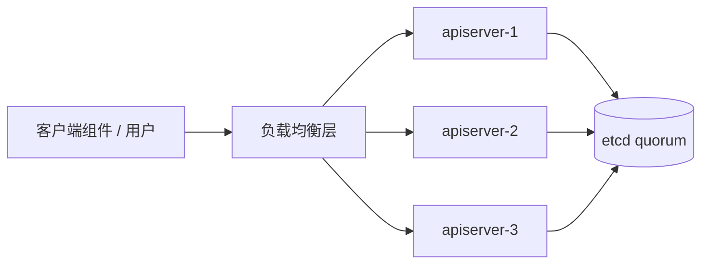
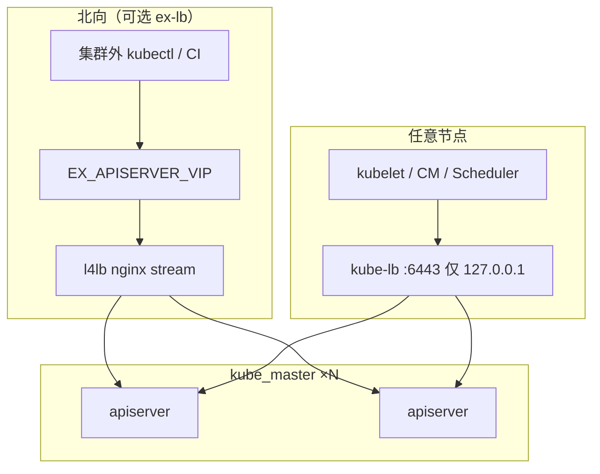
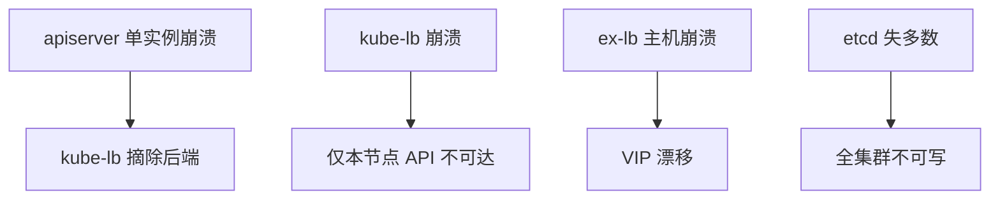

# 第 7 章 高可用与负载均衡原理及实现

> 官方参考：[Highly Available topology](https://kubernetes.io/docs/setup/production-environment/tools/kubeadm/ha-topology/)、[Coordinated Leader Election](https://kubernetes.io/docs/concepts/architecture/leases/)、[Operating etcd for Kubernetes](https://kubernetes.io/docs/tasks/administer-cluster/configure-upgrade-etcd/)  
> 架构图（仓库）：`images/k8s_new_arch.png`（默认：集成 kube-lb）、`images/k8s_traditional_arch.png`（外置 ex-lb / VIP）

---

## 7.1 概述

本章说明多控制面场景下的高可用与负载均衡：etcd 多数派、多 apiserver + LB、以及 CM / Scheduler 的 leader election 各自解决什么问题；并说明 kubeauto 的 **kube-lb**（本机 nginx stream，仅 `127.0.0.1`）与可选 **ex-lb**（keepalived VIP + l4lb）。

范围包括：

- 为何多 apiserver 必须有负载均衡，以及与 etcd quorum、选主的分工
- kube-lb 与 ex-lb 的监听范围、典型客户端与安装范围
- 节点组件使用 `https://127.0.0.1:6443`，而控制节点 deploy 出的 kubectl 默认仍指向第一个 master
- 故障预期：单 apiserver 崩溃、整机宕机、kube-lb 崩溃、VIP 漂移、etcd 失多数
- 实现对照：`roles/kube-lb`、`roles/ex-lb`；VIP 必须进入证书 SAN（衔接第 6 章）

etcd Raft 细节见第 5 章；证书 SAN 细节见第 6 章。本章在 HA 语境下引用二者。

---

## 7.2 多控制面为何需要负载均衡

单 master 环境可让客户端直连 `https://10.0.0.11:6443`。进入生产多 master 后，三个问题同时出现：

1. **apiserver 是无状态的**：可以（也应该）跑多个实例；但客户端若写死某一个 IP，该实例故障即全局失败。
2. **etcd 是有状态的多数派**：多副本提供容错，但不提供「客户端自动换入口」——那是 LB 与客户端连接串的责任。
3. **controller-manager / scheduler 不能多活写入**：它们通过 `--leader-elect=true` 选主；需要的是「多个实例都能连上 apiserver」，而不是「多个实例同时 reconcile」。

因此，控制面 HA 由三层机制组成：

| 层次 | 机制 | 失败时 |
|------|------|--------|
| 数据一致性 | etcd Raft quorum | 失多数 → 集群不可写 |
| API 入口水平扩展 | 多 apiserver + **负载均衡** | 单 API 挂 → LB 摘除后端 |
| 控制循环互斥 | Lease leader-elect | 非 leader 待命；leader 挂 → 重新选举 |



没有 LB 的「多 master」只是部署了多个 apiserver 实例，客户端故障域仍是单点。

---

## 7.3 选主组件：CM 与 Scheduler 的 HA 语义

kube-controller-manager 与 kube-scheduler 在多实例部署时：

- 每个实例都启动并连接 apiserver；
- 通过协调租约（Lease）竞争 leader；
- **只有 leader** 执行写入型控制循环 / 调度绑定；
- 其它实例处于待命，leader 失联后自动选举。

因此：

- 你需要保证**每个** CM/Scheduler 实例都能稳定访问 apiserver（经 LB）；
- 但不需要（也不应该）在 LB 层对 CM/Scheduler 做「会话粘滞」之类的特判——它们是 apiserver 的客户端，不是 LB 的后端。

kubeauto 中二者以 systemd 运行在 `kube_master` 上，kubeconfig 的 server 被改写为本机 `https://127.0.0.1:{{ SECURE_PORT }}`，与 kubelet 同一路径。

---

## 7.4 kubeauto 双 LB 模型总览

本项目把「南向/节点侧」与「北向/集群外」入口拆开：

| 模型 | 角色 | 默认 | 监听 | 典型用户 |
|------|------|------|------|----------|
| **kube-lb**（集成） | `roles/kube-lb` | **始终安装** | **仅** `127.0.0.1:6443` | kubelet、kube-proxy、本机 CM/Scheduler |
| **ex-lb**（外置） | `roles/ex-lb` | 可选 | `0.0.0.0:EX_APISERVER_PORT` + VIP | 集群外用户、CI、跨网段运维 |

默认推荐架构见 `images/k8s_new_arch.png`：节点只信本机回环 LB，不把 apiserver 端口暴露策略绑死在单一外网 IP 上。  
传统「前置硬件/Keepalived VIP」架构见 `images/k8s_traditional_arch.png`：在 kube-lb 之外再加一层北向 VIP。



两层可以共存：节点流量永远走 kube-lb；人走 VIP（若启用）。

---

## 7.5 kube-lb（默认，始终安装）

### 7.5.1 定义与配置

kube-lb 是基于 nginx **stream**（四层 TCP）编译的专用负载均衡二进制，安装名为 `/etc/kube-lb/sbin/kube-lb`，由 ext-bin-sp1 提供。配置模板：`roles/kube-lb/templates/kube-lb.conf.j2`。

核心语义：

```nginx
stream {
    upstream backend {
        server <master1>:6443  max_fails=2 fail_timeout=3s;
        server <master2>:6443  max_fails=2 fail_timeout=3s;
        ...
    }
    server {
        listen 127.0.0.1:6443;
        proxy_connect_timeout 1s;
        proxy_pass backend;
    }
}
```

要点：

1. **只监听回环**——不在 `0.0.0.0:6443` 再开一个对外入口，减少攻击面。
2. upstream 为库存中全部 `kube_master` 的 `SECURE_PORT`（默认 6443）。
3. `max_fails=2 fail_timeout=3s`：短时连续失败后暂时摘除后端，实现快速 failover。
4. `proxy_connect_timeout 1s`：连接阶段快速失败，便于客户端重试到其它后端。

### 7.5.2 安装范围

所有 master **以及**非 master 的 worker 都安装 kube-lb。原因：任何运行 kubelet 的节点都要把 apiserver 地址写成本机 127.0.0.1；没有本机 LB，该设计不成立。

### 7.5.3 客户端如何使用本机 LB

| 客户端 | server 地址 | 谁改写 |
|--------|-------------|--------|
| kubelet | `https://127.0.0.1:6443` | `roles/kube-node`（vars 强制） |
| kube-proxy | 同上 | kube-node 改写 kubeconfig |
| controller-manager | 同上 | `roles/kube-master` `lineinfile` |
| scheduler | 同上 | 同上 |
| 本机手工 curl 测试 | `https://127.0.0.1:6443` | — |

TLS 如何仍然通过？因为 `kubernetes.pem` 的 SAN **包含 `127.0.0.1`**（第 6 章）。客户端连接的 SNI / 校验名是 127.0.0.1，证书必须包含该名；TCP 再被 kube-lb 转发到真实 master IP——TLS 校验的是客户端声明的目标名，不是四层最终落到的后端地址。

### 7.5.4 增减 master 后必须刷新 upstream

upstream 列表来自当前 inventory 的 `groups['kube_master']`。新增或删除 master 后，若 kube-lb 配置未更新，会出现：

- 残留已删除 master → 多余失败探测，放大延迟；
- 缺少新 master → 新实例无法承接流量，HA 容量不足。

`service/cluster/manager.py` 在 add/del master 流程中会触发相关重启/刷新，避免 upstream 陈旧。现场手工改库存后，也应重跑 kube-lb 角色或等价通知。

---

## 7.6 ex-lb（可选北向入口）

### 7.6.1 组件

| 组件 | 作用 | 模板 |
|------|------|------|
| **l4lb** | nginx stream，对 `0.0.0.0:EX_APISERVER_PORT` 做四层转发到全部 master | `roles/ex-lb/templates/l4lb.conf.j2` |
| **keepalived** | VRRP 管理 **VIP**（`EX_APISERVER_VIP`），主备切换 | `keepalived-master.conf.j2` / `keepalived-backup.conf.j2` |

Playbook：`playbooks/10.ex-lb.yml`（`kubecli setup <c> 10`）。角色：`roles/ex-lb`。主机组：`ex_lb`。

keepalived 通过 `vrrp_track_process` 跟踪 l4lb 进程：l4lb 不健康时降低优先级 / 触发切换，避免「VIP 还在但四层已死」的黑洞。

### 7.6.2 VIP 与证书 SAN（硬约束）

外部客户端使用 `https://<VIP>:port` 访问时，TLS 校验的是 VIP（或你配置的 FQDN）。因此：

1. VIP 必须进入 `kubernetes.pem` SAN。kubeauto 在存在 `ex_lb` 组时，由 `kubernetes-csr.json.j2` 自动加入 `EX_APISERVER_VIP`。
2. 若使用域名，把域名写入 `MASTER_CERT_HOSTS`。
3. 先规划 VIP/域名再签发证书；事后追加必须重签 apiserver 证并滚动。

### 7.6.3 可选：Ingress NodePort 的北向转发

`l4lb.conf.j2` 在变量打开时可额外监听 80/443，把流量转到若干节点的 Ingress NodePort。这与 apiserver HA 是同一台 ex-lb 上的**附加**能力，默认关闭（`INGRESS_NODEPORT_LB` / `INGRESS_TLS_NODEPORT_LB`）。

### 7.6.4 与 kube-lb 的分工

| 问题 | 答案 |
|------|------|
| 节点上的 kubelet 会走 VIP 吗？ | **默认不会**；走 `127.0.0.1` → kube-lb |
| 只有 kube-lb 没有 ex-lb 能生产吗？ | 能；集群内 HA 已成立；缺的是优雅的北向统一入口 |
| 只有 ex-lb 没有 kube-lb？ | 不符合本项目设计；节点组件依赖本机 LB |
| VIP 挂了节点还工作吗？ | 是——节点不依赖 VIP；仅外部用户受影响 |

---

## 7.7 客户端实际连接路径总表

| 客户端 | 默认 server | 说明 |
|--------|-------------|------|
| 节点 kubelet / kube-proxy | `https://127.0.0.1:6443` | 经 kube-lb → 各 master |
| 本机 CM / Scheduler | 同上 | master 角色改写 |
| 控制节点 kubectl（deploy 默认） | `https://<首个 master>:6443` | 生成于 deploy；可手改为 VIP |
| 集群外用户 | VIP 或 `MASTER_CERT_HOSTS` 中的 FQDN | 需 SAN + 网络放通 +（可选）ex-lb |

**为什么 deploy 不默认写成 127.0.0.1？**  
因为控制节点上的 kubectl 往往**并不**与 master 同机；写 127.0.0.1 会连到控制节点自己，而那里没有 apiserver。首 master IP 是可工作的默认值；生产常改为 VIP/FQDN 并确保证书覆盖。

---

## 7.8 故障场景表（预期行为）

| 故障 | 预期现象 | 本项目机制 | 不是什么 |
|------|----------|------------|----------|
| 单个 apiserver 进程崩溃 | 节点组件短暂重试后恢复 | kube-lb upstream `max_fails` 摘除该后端 | 不需要人工改 kubeconfig |
| 单个 master 整机宕机 | 同上；若 etcd 共置，须保证剩余 etcd 仍满足 quorum | 3 节点 etcd 可容忍 1 失 | 「两台 etcd」扛不住 |
| kube-lb 进程崩溃 | **本机**组件无法连 API | systemd 拉起；应监控 kube-lb | VIP 切换救不了本机回环 |
| 某 worker 上 kube-lb 挂了 | 仅该节点失联 API | 其它节点不受影响 | 不是全集群故障 |
| ex-lb 主节点宕机 | VIP 漂移到 backup | keepalived + 跟踪 l4lb | 节点侧流量不变 |
| l4lb 死但 VIP 未切 | 北向入口黑洞 | `vrrp_track_process` 降低此风险；仍需监控 | 单靠 VRRP 不够 |
| etcd 失多数 | 全集群无法持久化写入 | **无自动恢复机制**——须保 quorum 或从快照恢复 | LB 不能替代 etcd 修复 |
| 证书 SAN 无 VIP | 外部客户端 TLS 失败 | 规划 SAN；重签 | 看起来像「网络不通」 |
| 增减 master 未刷新 kube-lb | failover 变慢或容量不足 | manager 流程触发刷新 | 易被忽略的静默问题 |



---

## 7.9 节点侧一次请求的路径

以 kubelet 列表本节点 Pod 为例：

1. kubelet 读取 kubeconfig：`server: https://127.0.0.1:6443`，并出示 `kubelet.pem`。
2. 内核把连接送到本机 kube-lb 监听的 `127.0.0.1:6443`。
3. kube-lb 在 upstream 中选择一个健康的 `masterIP:6443`，做 TCP 转发。
4. 该 master 上的 apiserver 用 `kubernetes.pem` 完成 TLS；校验客户端证由集群 CA 签发，CN 符合 `system:node:…`。
5. RBAC / Node authorizer 允许后返回数据。
6. 若该 master 刚崩溃：连接失败 → kube-lb 记失败 → 下一连接打到其它 master；kubelet 客户端自身也有重试。

北向用户路径把第 2 步换成「连 VIP → ex-lb l4lb → master」，TLS 校验名改为 VIP/FQDN。

---

## 7.10 生产验证命令

### 7.10.1 验证 kube-lb

在任意节点：

```bash
systemctl status kube-lb
ss -lntp | grep 6443
# 期望：127.0.0.1:6443 由 kube-lb 监听，而不是直接是 kube-apiserver
# （apiserver 监听在节点 IP:6443）

curl -vk https://127.0.0.1:6443/healthz
# 或使用节点 kubeconfig
kubectl --kubeconfig=/etc/kubernetes/kubelet.kubeconfig get --raw='/readyz?verbose'
```

查看配置中的 upstream 是否含全部 master：

```bash
grep -A20 'upstream backend' /etc/kube-lb/conf/kube-lb.conf
# 实际路径以角色安装为准；核心是确认 server 行完整
```

### 7.10.2 验证 apiserver 与选主

```bash
systemctl status kube-apiserver kube-controller-manager kube-scheduler
kubectl get endpoints kubernetes -n default
kubectl -n kube-system get lease
# 观察 kube-controller-manager / kube-scheduler 相关 Lease 的 holderIdentity
```

### 7.10.3 验证 ex-lb（若启用）

在 `ex_lb` 节点：

```bash
ip addr show | grep <EX_APISERVER_VIP>
systemctl status l4lb keepalived
ss -lntp | grep <EX_APISERVER_PORT>
curl -vk https://<EX_APISERVER_VIP>:<EX_APISERVER_PORT>/healthz
```

从集群外主机用 VIP 做同样探测，并确认证书 CN/SAN 匹配。

### 7.10.4 模拟单 API 故障（维护窗口）

```bash
# 在 master-1 上
systemctl stop kube-apiserver
# 在某 worker 上观察 kubelet 是否仍能沟通 API
kubectl --kubeconfig=/etc/kubernetes/kubelet.kubeconfig get nodes
systemctl start kube-apiserver
```

预期：短中断后恢复；etcd 与其它 apiserver 正常是前提。

---

## 7.11 kubeauto 实现落点

| 文件 / 路径 | 作用 |
|-------------|------|
| `roles/kube-lb/templates/kube-lb.conf.j2` | 本机 stream upstream |
| `roles/kube-lb/templates/kube-lb.service.j2` | systemd 单元 |
| `roles/ex-lb/templates/l4lb.conf.j2` | 外置四层转发（API + 可选 Ingress） |
| `roles/ex-lb/templates/keepalived-*.conf.j2` | VRRP 主备 |
| `roles/ex-lb/defaults/main.yml` | `ROUTER_ID`、Ingress LB 开关 |
| `playbooks/10.ex-lb.yml` | 安装 ex-lb |
| `roles/kube-master/tasks/main.yml` | CM/Scheduler server → 127.0.0.1 |
| `roles/kube-node/vars/main.yml` | 节点 `KUBE_APISERVER` 覆盖为本机 LB |
| `roles/kube-master/templates/kubernetes-csr.json.j2` | SAN 含 127.0.0.1 与 VIP |
| `service/cluster/manager.py` | 增减 master 时刷新相关组件 |
| `images/k8s_new_arch.png` | 默认集成 LB 架构图 |
| `images/k8s_traditional_arch.png` | 外置 LB 架构图 |

安装总序（概念）：证书（deploy）→ … → **kube-lb** 与 **kube-master**（多 master 时常 `serial:1`）→ kube-node。没有本机 LB，节点 kubeconfig 指向 127.0.0.1 会失败。

---

### 7.11.1 与安装步骤的对应关系

| CLI 步骤 | Playbook | 说明 |
|----------|----------|------|
| `04` / `05` | `04.kube-master.yml` / `05.kube-node.yml` | 各节点安装 `kube-lb`；改写 kubeconfig → `127.0.0.1:6443` |
| `10` | `10.ex-lb.yml` | 可选北向 VIP；不在 `90` 默认路径内 |
| `90` | `90.setup.yml` | 总装含 kube-lb；不含 ex-lb |

## 7.12 选型建议

| 场景 | 建议 |
|------|------|
| 实验室 / 中小规模生产 | 默认 **仅 kube-lb** 足够 |
| 需要统一北向入口、DNS 指向稳定 IP | 增加 **ex-lb VIP**，并写入 SAN / `MASTER_CERT_HOSTS` |
| 已有云 LB / 硬件 LB | 可用云 LB 替代 ex-lb；仍建议保留节点侧 kube-lb；把云 LB 地址写入 SAN |
| 多集群共用一组外置 LB | 谨慎：upstream 与证书 SAN 必须按集群隔离，避免串流 |
| 极高安全要求 | kube-lb 仅回环已是优点；北向入口另加 WAF/防火墙与审计 |

---

## 7.13 与第 5、6 章的衔接检查单

在做 HA 评审时，同时确认：

1. **etcd 成员为奇数**，且与 master 故障域规划一致（共置时一台机器故障可能同时少一个 API 与一个 etcd）。
2. **kubernetes.pem SAN** 含 `127.0.0.1` 与（若有）VIP/FQDN。
3. 节点 kubeconfig **不是**指向单一 master IP。
4. 证书轮换（第 6 章）使用协同重启，避免 HA 维护窗口自己造成失多数。
5. 备份（第 5 章）演练过——LB 不能替代数据恢复。

---

## 7.14 验证清单（交付验收）

1. 每个 master 与每个 worker 上 `kube-lb` active，且 `ss` 显示 `127.0.0.1:6443`。
2. kube-lb upstream 列表与当前 `kube_master` 库存一致。
3. 节点 `/etc/kubernetes/kubelet.kubeconfig` 的 server 为 `https://127.0.0.1:6443`。
4. master 上 CM/Scheduler kubeconfig 同样指向 127.0.0.1。
5. 控制节点运维 kubeconfig 可按需改为 VIP；改前确认 SAN。
6. 停掉一台 apiserver 后，其它节点仍能 `kubectl get nodes`（经本机 LB）。
7. 若启用 ex-lb：VIP 漂移测试通过；集群外 `curl -vk https://VIP:port/healthz` 成功。
8. `kubectl -n kube-system get lease` 可见 CM/Scheduler leader。
9. 监控覆盖：kube-lb 进程、apiserver healthz、etcd health、（可选）keepalived/l4lb。
10. 架构图与现场一致：默认用 new_arch；启用 VIP 时用 traditional_arch 并向甲方说明双层 LB。

---

## 7.15 常见问题（FAQ）

**Q1：为什么不直接让 kubelet 连 VIP？**  
A：VIP 依赖额外主机与 VRRP，是北向可选层。本机 LB 把节点故障域留在本机，master 外网/VIP 抖动不影响节点→API 的基本连通模型；也避免所有节点流量绕行外置 LB。

**Q2：apiserver 自己也监听 6443，会和 kube-lb 冲突吗？**  
A：apiserver 绑定节点 IP（`--bind-address={{ inventory_hostname }}`），kube-lb 绑定 `127.0.0.1`。地址不同，不冲突。

**Q3：首 master 宕机后，控制节点默认 kubectl 是否失效？**  
A：若 kubeconfig 仍写死首 master IP，会失效；应改为 VIP 或多端点策略，或临时改 server。节点组件不受影响。

**Q4：leader-elect 失败是否因为 LB？**  
A：少见。更常见是时钟、apiserver 不可达、RBAC、或 etcd 慢。先确认各 CM 实例能否经 127.0.0.1 访问 API。

**Q5：可以把 kube-lb 改成监听 0.0.0.0 吗？**  
A：会扩大攻击面，且与「本机入口」设计偏离。北向需求应走 ex-lb 或外部 LB。

**Q6：max_fails / fail_timeout 是否要调更大？**  
A：默认偏敏，利于快速 failover。若 master 偶发短卡导致频繁摘除，可审慎调大，并先优化 apiserver/etcd 延迟。

**Q7：三 master 是否必须三 etcd？**  
A：非必须，但共置时故障域叠加。独立 etcd 组更灵活，也更耗机器。评审时画故障域，而不是只数「几台 master」。

**Q8：与云厂商 SLB 如何配合？**  
A：SLB 后端指向各 master:6443；健康检查用 `/healthz` 或 TCP。节点侧仍用 kube-lb。证书 SAN 包含 SLB 域名或地址。

---

## 7.16 官方与延伸阅读

| 文档 | URL |
|------|-----|
| kubeadm HA topology | https://kubernetes.io/docs/setup/production-environment/tools/kubeadm/ha-topology/ |
| Leases / leader election | https://kubernetes.io/docs/concepts/architecture/leases/ |
| 创建高可用集群（概念） | https://kubernetes.io/docs/setup/production-environment/tools/kubeadm/high-availability/ |
| etcd 运维 | https://kubernetes.io/docs/tasks/administer-cluster/configure-upgrade-etcd/ |
| 本仓库实现 | `roles/kube-lb/`、`roles/ex-lb/`、`playbooks/10.ex-lb.yml` |
| 架构图 | `images/k8s_new_arch.png`、`images/k8s_traditional_arch.png` |

---

## 7.17 本章小结

控制面 HA = etcd 多数派 + 多 apiserver + 负载均衡 + 选主组件。kubeauto 默认用 **kube-lb** 把所有节点组件收敛到 `https://127.0.0.1:6443`，用证书 SAN 中的回环地址打通 TLS；可选 **ex-lb** 提供 VIP 北向入口，但 VIP 必须进入证书 SAN。故障排查时应区分：单 apiserver 后端不可用、本机 kube-lb 故障、北向 VIP/ex-lb 故障，或 etcd 失多数——四者对策不同。与第 5、6 章合读，可将可用性与证书信任链纳入同一套交付验收闭环。
