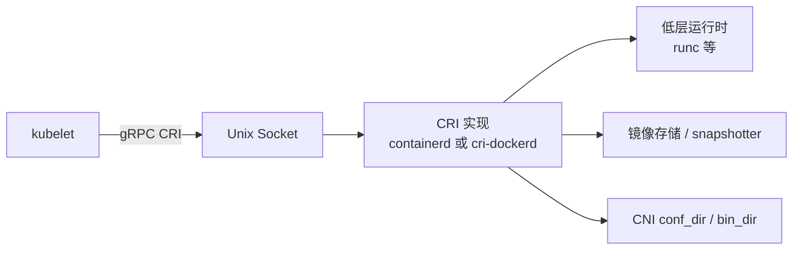
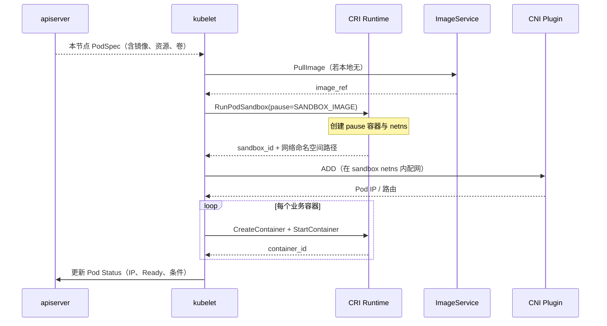

# 第 8 章 容器运行时（CRI）

> 官方文档：[Container Runtimes](https://kubernetes.io/docs/setup/production-environment/container-runtimes/) · [Container Runtime Interface (CRI)](https://kubernetes.io/docs/concepts/architecture/cri/)  
> 实现对照：containerd、cri-dockerd；本仓库 `roles/containerd` / `roles/docker`

## 8.1 概述

每个节点上的 **kubelet** 不直接实现容器创建与镜像管理。它通过 **Container Runtime Interface（CRI）**——一组 gRPC 服务定义——与符合规范的容器运行时通信。运行时负责拉取镜像、创建 Pod 沙箱与业务容器、收集日志与状态。

自 Kubernetes **1.24** 起，kubelet 不再内嵌 **dockershim**。节点必须安装独立的 CRI 实现（例如 containerd，或 Docker Engine + cri-dockerd）。

| 版本 | 事件 |
|------|------|
| 1.20 | dockershim 弃用（deprecated） |
| 1.23 | 仍可用；迁移文档已成熟 |
| **1.24** | dockershim 从 kubelet 中移除 |

官方生产要求可概括为：选择实现了 CRI 的运行时，并保证其与 kubelet 的 **cgroup 驱动一致**。本项目默认选择 containerd；在需要保留 Docker Engine 工作流时，可选 docker + cri-dockerd。

## 8.2 CRI：RuntimeService 与 ImageService

CRI 在逻辑上包含两类服务：

| 服务 | 职责 |
|------|------|
| **RuntimeService** | Pod 沙箱与容器生命周期：创建、启动、停止、删除、状态、日志、exec 等 |
| **ImageService** | 镜像拉取、列举、删除、状态 |

kubelet 通过 Unix domain socket 连接实现方：

| 运行时路径 | CRI socket |
|------------|------------|
| containerd | `unix:///run/containerd/containerd.sock` |
| cri-dockerd | `unix:///var/run/cri-dockerd.sock` |

通信协议为 **gRPC**，不是 Docker Remote API。因此：

- `docker ps` 不一定完整反映 kubelet 视角下的 Pod（纯 containerd 路径上尤其如此）。
- 排障应优先使用 **`crictl`**（指向同一 CRI socket），其次为 `ctr`（containerd 原生）或 `docker`（仅 docker 路径）。



### 8.2.1 为何需要 CRI

早期 kubelet 通过 dockershim 直接调用 Docker Engine API。该耦合带来的问题包括：

- Docker API 表面远大于 kubelet 所需的「按 PodSpec 拉镜像、建沙箱、起容器、收集状态」；
- Docker 与 Kubernetes 独立发版，破坏性变更迫使双方互相打补丁；
- CRI-O、containerd 等替代实现难以成为一等公民。

CRI 将「kubelet 需要的最小能力」抽象为稳定接口：kubelet 只认识 CRI；引擎实现 CRI 即可被管理。

## 8.3 Pod 沙箱（pause）

Pod 是一组共享网络命名空间的容器，不是单个容器。运行时先创建 **基础设施容器**（infra / pause，亦称 pod sandbox）：

| 属性 | 说明 |
|------|------|
| 职责 | 持有 netns、ipc、uts 等命名空间；几乎无业务逻辑 |
| 业务容器 | 以加入该沙箱的方式启动，共享同一 Pod IP 与 localhost 语义 |
| 生命周期 | Pod 删除时先停业务容器，再拆除沙箱；CNI DEL 挂在沙箱生命周期上 |

官方与各运行时文档称该镜像为 **pause** 或 **pod sandbox image**。kubeauto 通过变量 `SANDBOX_IMAGE` 指定，默认解析为：

```text
registry.talkschool.cn:5000/brinnatt/pause:3.10
```

占位符 `__pause__` 由版本常量 `v_pause=3.10` 在集群生成阶段替换。沙箱镜像不可拉取时，几乎所有 Pod 的 `RunPodSandbox` 都会失败。

## 8.4 cgroup 驱动一致性

Linux 用 cgroup 限制 CPU、内存、PID 等。kubelet 与容器运行时都会创建和管理 cgroup 层级。二者驱动不一致时，可能导致容器逃出预期限制、节点负载统计错误、不稳定的 OOM / throttling。

| 组件 | 必须一致的配置 |
|------|----------------|
| kubelet | `cgroupDriver: systemd` 或 `cgroupfs` |
| containerd（runc） | `SystemdCgroup = true/false` |
| Docker daemon | `"cgroupdriver": "systemd"` 等 |

**生产建议（本项目默认）：使用 `systemd`。** 现代发行版用 systemd 管理服务；容器 cgroup 挂在 systemd 层级下，便于与 `kubeReserved` / `systemReserved` 的 slice 模型对齐（见第 11 章）。

## 8.5 从 PodSpec 到运行中容器的时序

节点上一次成功拉起普通业务 Pod 时，kubelet 与 CRI 的典型协作顺序如下（网络细节见第 9 章）：



失败时按依赖倒置排查：

1. CRI socket 是否存在、kubelet endpoint 是否正确  
2. pause 镜像是否可拉取（私仓、证书、`INSECURE_REG`）  
3. cgroup 驱动是否一致  
4. CNI 是否 Ready（否则沙箱有了也无 IP / Node NotReady）  
5. 业务镜像与探针（运行时已通时的业务自身问题）

## 8.6 节点观测：进程、socket 与故障面

| 现象 | containerd 路径 | docker + cri-dockerd 路径 |
|------|----------------|---------------------------|
| 主进程 | `containerd` | `dockerd` + `cri-dockerd` |
| CRI socket | `/run/containerd/containerd.sock` | `/var/run/cri-dockerd.sock` |
| kubelet 参数 | `--container-runtime-endpoint=unix:///run/containerd/containerd.sock` | `unix:///var/run/cri-dockerd.sock` |
| 常用排障 | `crictl ps` / `crictl pods` | 同上 + `docker ps` |

| 症状 | 常见根因 |
|------|----------|
| kubelet 日志 `Cannot connect to ...sock` | 运行时未起、endpoint 配错、docker 路径未装 cri-dockerd |
| Pod `ErrImagePull` 且镜像为 pause | `SANDBOX_IMAGE` 不可达、私仓 TLS/HTTP 未信任 |
| 容器起得来但 cgroup 异常 | kubelet 与运行时 cgroup 驱动不一致 |
| `docker ps` 空但集群正常 | 使用 containerd；应改用 `crictl` |
| 节点 NotReady + NetworkPluginNotReady | 运行时可能正常，缺 CNI（见第 9 章） |

健康信号：`systemctl is-active containerd`（或 `docker` + `cri-dockerd`）为 `active`；`crictl info` 无报错；CNI 安装后节点 Ready；业务 Pod 无 `ErrImagePull` / `CreateContainerError`。

## 8.7 本项目实现

### 8.7.1 选型开关

库存变量 `CONTAINER_RUNTIME`（`conf/hosts.*`）：

| 值 | 角色 | kubelet endpoint | 说明 |
|----|------|------------------|------|
| `containerd`（默认） | `roles/containerd` | `unix:///run/containerd/containerd.sock` | 生产推荐 |
| `docker` | `roles/docker` | `unix:///var/run/cri-dockerd.sock` | 保留 Docker Engine 工作流 |

编排入口：`playbooks/03.runtime.yml`，并由 `playbooks/90.setup.yml` 纳入一键安装。

kubelet unit 模板 `roles/kube-node/templates/kubelet.service.j2` 按 `CONTAINER_RUNTIME` 分支：

- `docker`：`After=` / `Requires=cri-dockerd.service`，endpoint 指向 cri-dockerd socket  
- `containerd`：endpoint 指向 containerd socket  

### 8.7.2 containerd 路径（默认）

| 项 | 路径 / 值 |
|----|-----------|
| Tasks | `roles/containerd/tasks/main.yml` |
| 主配置模板 | `roles/containerd/templates/config.toml.j2` → `/etc/containerd/config.toml` |
| Config 版本 | **version = 2** |
| 存储根 | `CONTAINERD_STORAGE_DIR`，默认 `/var/lib/containerd` |
| gRPC 地址 | `/run/containerd/containerd.sock` |
| sandbox 镜像 | `SANDBOX_IMAGE` → `registry.talkschool.cn:5000/brinnatt/pause:3.10` |
| CNI | `bin_dir=/opt/cni/bin`，`conf_dir=/etc/cni/net.d` |
| runc cgroup | **`SystemdCgroup = true`**（与默认 `CGROUP_DRIVER=systemd` 对齐） |
| Registry | `config_path=/etc/containerd/certs.d` |
| 二进制来源 | **ext-bin**：containerd **2.1.4**、配套 runc **v1.3.1**、crictl 等 |
| crictl | `templates/crictl.yaml.j2` → `/etc/crictl.yaml`，指向同一 socket |

#### Registry：`certs.d` 与 `hosts.toml`

containerd 推荐用 `certs.d/<host>/hosts.toml` 描述镜像源：

| hosts.toml | 作用 |
|------------|------|
| `certs.d/docker.io/hosts.toml` | 拉取加速 / 镜像源 |
| `certs.d/registry.talkschool.cn:5000/hosts.toml` | 企业私仓：HTTP + `skip_verify` 等 |
| `INSECURE_REG` 列表中的各主机 | 信任现场 insecure registry |
| Harbor 主机模板 | 可选 Basic Auth |

离线/实验室环境中，pause 与业务镜像几乎都走私仓；私仓可达性是运行时故障的首要排查项。

#### 与 Node Allocatable 的衔接

若 `KUBE_RESERVED_ENABLED=yes`（合同默认），containerd unit 可加入 `podruntime.slice`。官方将「kubelet + 容器运行时」记在 **kubeReserved** 账本上；本项目用 systemd slice 将这些守护进程置于同一父级，便于强制执行 `kube-reserved`（详见第 11 章）。

### 8.7.3 docker + cri-dockerd 路径

| 步骤 | 实现 |
|------|------|
| 安装 Docker Engine | `roles/docker`，静态包版本 `v_docker=28.5.2` |
| daemon 配置 | `daemon.json.j2`：存储目录、`insecure-registries`、`registry-mirrors`、**`cgroupdriver=systemd`** |
| 安装 CRI 适配 | **cri-dockerd 0.3.26**（`v_cri_dockerd`） |
| pause | `--pod-infra-container-image={{ SANDBOX_IMAGE }}` |
| kubelet 依赖 | `Requires=cri-dockerd.service` |

适用场景：流水线或运维习惯强依赖 `docker` CLI、或遗留工具链尚未迁到 `nerdctl`/`crictl`。新生产集群仍推荐 containerd。

### 8.7.4 关键变量速查

| 变量 | 默认 / 含义 |
|------|-------------|
| `CONTAINER_RUNTIME` | `containerd` 或 `docker` |
| `SANDBOX_IMAGE` | 私仓 pause:3.10 |
| `CGROUP_DRIVER` | `systemd`（须与运行时一致） |
| `INSECURE_REG` | 需信任的 insecure registry 列表 |
| `CONTAINERD_STORAGE_DIR` | containerd 数据目录 |

## 8.8 验证清单

```bash
# 1) 运行时进程
systemctl is-active containerd
# 或
systemctl is-active docker cri-dockerd

# 2) CRI 是否应答
crictl info
crictl version

# 3) kubelet endpoint 是否匹配
systemctl cat kubelet | grep container-runtime-endpoint

# 4) cgroup 驱动一致性
grep cgroupDriver /var/lib/kubelet/config.yaml
grep -n SystemdCgroup /etc/containerd/config.toml   # containerd
grep cgroupdriver /etc/docker/daemon.json            # docker

# 5) pause / 沙箱
crictl pods
crictl images | grep pause

# 6) slice（启用 kubeReserved 时）
systemctl show kubelet containerd -p Slice --value
test ! -d /sys/fs/cgroup/podruntime.slice.slice && echo NO_DOUBLE_SLICE
```

交付门禁脚本会在 docker 路径上额外检查 cri-dockerd socket、业务 Pod 是否误落到 `docker0` 等回归项。

## 8.9 FAQ

**Q1：已安装 Docker，为何 kubelet 仍连不上运行时？**  
A：自 1.24 起，仅有 dockerd 不够。必须安装并运行 **cri-dockerd**，且 kubelet 的 `--container-runtime-endpoint` 指向 `unix:///var/run/cri-dockerd.sock`。本项目在 `CONTAINER_RUNTIME=docker` 时自动处理。

**Q2：为何不推荐继续把 Docker 当默认？**  
A：containerd 是 CNCF 项目，也是多数发行版与云厂商的默认选择；少一层适配。Docker 路径保留是为了兼容，不是新集群首选。

**Q3：`crictl` 和 `ctr`、`docker` 怎么选？**  
A：排障优先 **crictl**（与 kubelet 同一 CRI 视角）。`ctr` 偏 containerd 内部调试；`docker` 仅在 docker 路径有完整意义。

**Q4：pause 拉不下来会怎样？**  
A：几乎所有 Pod 的 `RunPodSandbox` 都会失败。先验证 `SANDBOX_IMAGE` 与 `certs.d` / `INSECURE_REG`。

**Q5：为何强调 SystemdCgroup 与 kubelet cgroupDriver 一致？**  
A：这是官方 Container Runtimes 文档的硬性生产要求。不一致时问题可能延迟到高负载时才暴露。

**Q6：containerd config version 2 有什么含义？**  
A：本项目模板使用 `version = 2` 的配置结构，并按 containerd 2.x 的 CRI 插件布局渲染。不要把旧版手工配置片段直接覆盖模板产物。

**Q7：运行时要不要放进 podruntime.slice？**  
A：启用 `kubeReserved` 强制时应当放入。本项目在预留开启时把 kubelet / 运行时 / kube-proxy 与该 slice 对齐（见第 11 章与 kubernetes#78629）。

**Q8：扩展二进制从哪来？**  
A：containerd **2.1.4**、runc、crictl、CNI 等由 **ext-bin** 供给，版本矩阵见附录 A。

## 8.10 参考文档与仓库路径

| 主题 | URL |
|------|-----|
| Container Runtimes（生产） | https://kubernetes.io/docs/setup/production-environment/container-runtimes/ |
| CRI 概念 | https://kubernetes.io/docs/concepts/architecture/cri/ |
| dockershim 移除说明 | https://kubernetes.io/blog/2022/02/17/dockershim-removal-faq/ |
| containerd | https://github.com/containerd/containerd |
| cri-dockerd | https://github.com/Mirantis/cri-dockerd |
| crictl | https://github.com/kubernetes-sigs/cri-tools |

| 主题 | 路径 |
|------|------|
| 运行时编排 | `playbooks/03.runtime.yml` |
| containerd 角色 | `roles/containerd/` |
| containerd 配置 | `roles/containerd/templates/config.toml.j2` |
| registry hosts | `roles/containerd/templates/**/hosts.toml.j2` |
| docker + cri-dockerd | `roles/docker/` |
| kubelet endpoint / slice | `roles/kube-node/templates/kubelet.service.j2` |
| kubelet cgroupDriver | `roles/kube-node/templates/kubelet-config.yaml.j2` |
| pause / 版本 | `conf/config.yml` 的 `SANDBOX_IMAGE`，`common/constants.py` 的 `v_pause` / `v_cri_dockerd` |
| 版本矩阵 | `docs/whitepaper/A-version-matrix.md` |
