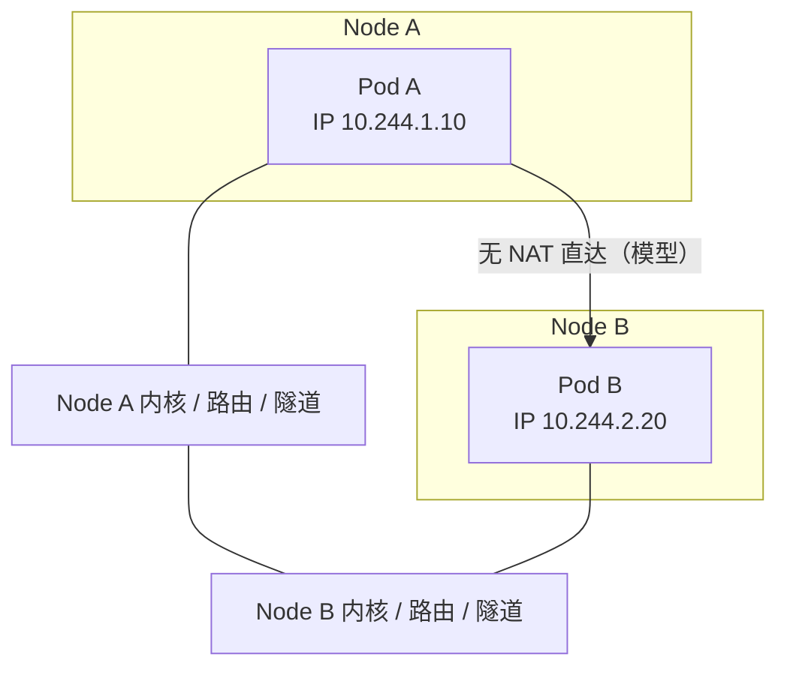
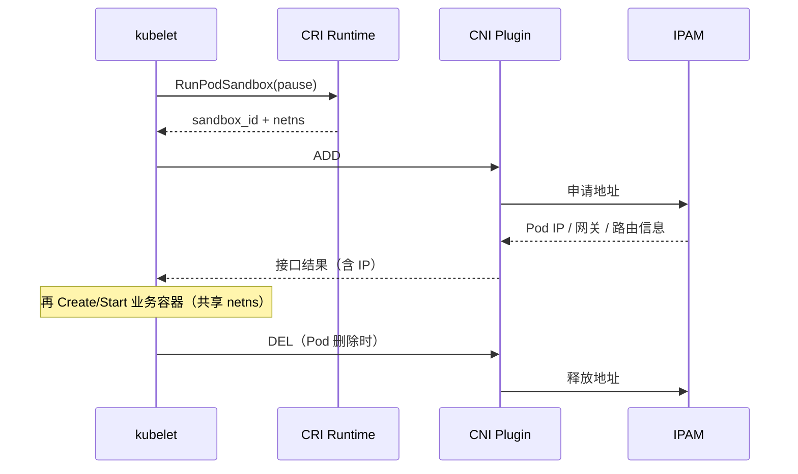
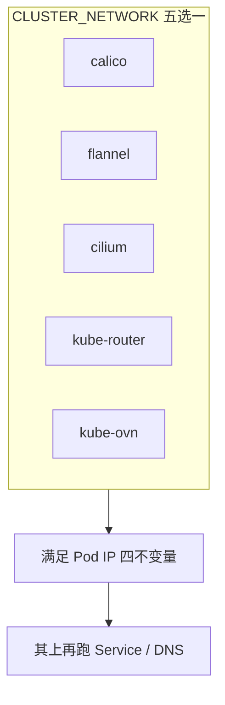

# 第 9 章 集群网络（CNI）

> 官方文档：[Cluster Networking](https://kubernetes.io/docs/concepts/cluster-administration/networking/) · [Network Policies](https://kubernetes.io/docs/concepts/services-networking/network-policies/)  
> 规范：[CNI Spec](https://www.cni.dev/)  
> 实现对照：本仓库 `CLUSTER_NETWORK`、`playbooks/06.network.yml`、`roles/calico` 等

## 9.1 概述

Kubernetes **不实现**完整的 Pod 到 Pod 连通性。如何将数据包从 Pod A 送到 Pod B，由实现 [CNI](https://www.cni.dev/) 的网络插件负责。没有可用的 Pod 网络时，节点会长期停留在 **NotReady**（常见条件 `NetworkPluginNotReady`），调度出去的 Pod 也无法获得集群内可达的 IP。

控制面、etcd、CRI 可以正常，但缺少 CNI 时集群仍不具备业务语义上的网络。DNS、NetworkPolicy、跨节点通信均依赖该层正确落地。

## 9.2 官方四个网络问题

Kubernetes 网络模型围绕四个问题展开（见官方 Cluster Networking）：

| # | 问题 | 谁负责 |
|---|------|--------|
| 1 | 同 Pod 内高度耦合的容器到容器通信 | **Pod 共享 netns**：localhost 即可 |
| 2 | Pod 到 Pod 通信 | **CNI / 集群网络插件** |
| 3 | Pod 到 Service 通信 | **Service + kube-proxy**（或 eBPF 替代） |
| 4 | 外部到 Service 通信 | **NodePort / LoadBalancer / Ingress** 等 |

| 维度 | Pod 网络 | Service 网络 |
|------|----------|--------------|
| 职责 | 主机与容器世界的 L3 可达 | 稳定虚拟 IP 与负载均衡 |
| 地址空间 | `CLUSTER_CIDR` | `SERVICE_CIDR` |
| 本项目默认 | `CLUSTER_NETWORK` 选定的 CNI | `PROXY_MODE=ipvs` |

二者不可混为一谈：能访问 Service 不等于 Pod IP 互通；反之亦然。

## 9.3 Pod IP 模型：四个不变量

官方要求的集群网络模型包含四条不变量：

1. **每个 Pod 都有自己的 IP 地址**；同 Pod 内容器共享该网络命名空间。  
2. **任意 Pod 与任意 Pod 无需 NAT 即可通信**（在模型语义上）。  
3. **任意 Node 上的代理（如系统守护进程）与任意 Pod 无需 NAT 即可通信**。  
4. **Pod 自己看到的 IP，与其他 Pod / 节点看到的 IP 一致**（无双重地址映射）。

这与 Docker 默认桥接（`docker0` + iptables MASQUERADE）不同。Kubernetes 要求把 Pod 当作可路由的一等主机来处理。

实践含义：

- 业务 Pod 的主接口不应落在 `docker0` 上（交付门禁会检查此类回归）。  
- 跨节点连通依赖路由宣告、隧道封装或 eBPF 转发——由插件决定。  
- NetworkPolicy 是在已有连通性之上做选择性隔离；无策略实现的 CNI 上，YAML 不会生效。



## 9.4 CNI ADD / DEL 与 IPAM

### 9.4.1 kubelet 何时调用 CNI

结合第 8 章：kubelet 先让 CRI **RunPodSandbox**（pause 持有 netns），再对 CNI 发起：

| 操作 | 行为 |
|------|------|
| **ADD** | 在沙箱网络命名空间中创建 veth、配地址、写路由、可选带宽限制等，返回接口信息与 IP |
| **DEL** | Pod 拆除时释放上述资源；IPAM 回收地址 |

配置通常位于 `/etc/cni/net.d/*.conflist`（或 `.conf`），二进制在 `/opt/cni/bin`。kubelet / 运行时按字典序选择配置；**错误的旧文件残留**会导致仍走旧插件或启动失败。

### 9.4.2 IPAM

**IPAM（IP Address Management）** 负责分配/回收 Pod IP。

| 模式 | 含义 | 例子 |
|------|------|------|
| host-local | 节点本地分配器，常配合每节点 Pod CIDR | 部分简单插件 |
| 控制器 / CRD 池 | 集群级池，节点按需领子网或地址 | Calico IPAM、Cilium cluster-pool |
| OVN 逻辑交换机 | SDN 控制面分配 | kube-ovn |

`CLUSTER_CIDR` 划定 Pod 大网段；`NODE_CIDR_LEN` 等影响每节点子网大小与可调度 Pod 密度（与 `MAX_PODS` 等约束一起考虑）。



### 9.4.3 占位配置 `10-default.conf`（kubeauto）

正式 CNI 安装前，kube-node 可能放置占位 `10-default.conf`，避免 kubelet 在「完全无 CNI 配置」时进入更难诊断的状态。**CNI 角色安装成功后必须删除该占位**，否则可能干扰真实 conflist。排障时若 `/etc/cni/net.d` 仍有 default 占位或多种插件并存，应清理到仅剩当前 `CLUSTER_NETWORK` 对应配置。

## 9.5 Service 网络与 Pod 网络

| 维度 | Pod 网络 | Service 网络 |
|------|----------|--------------|
| 地址空间 | `CLUSTER_CIDR` | `SERVICE_CIDR` |
| 分配者 | CNI / IPAM | apiserver（Service ClusterIP） |
| 节点数据面 | 路由 / VXLAN / IPIP / eBPF… | kube-proxy iptables/IPVS 或 Cilium 等 |
| DNS 名 | 可选 Pod DNS | `*.svc.cluster.local`（第 10 章） |
| 稳定性 | Pod 重建后 IP 常变 | ClusterIP 稳定（Headless 除外） |

**Headless Service**（`clusterIP: None`）把 DNS 直接解析到 Pod IP，仍依赖 Pod 网络可达。

`SERVICE_CIDR` 与 `CLUSTER_CIDR` 不得重叠；也不得与节点物理网段、VPN、云 VPC 二级网段无规划地冲突。冲突的典型症状是偶发通、重启后不通、仅跨节点失败。

## 9.6 网络插件机制

### 9.6.1 Calico

Calico 优先以路由方式实现 Pod 连通，必要时使用隧道封装。

| 模式 | 机制 |
|------|------|
| **BGP**（常配合 bird） | 节点通过 BGP 宣告 Pod 子网；同二层/可路由 fabric 上可无封装转发 |
| **IPIP** | 将原 IP 包再封装进另一层 IP（**IP 协议号 4**）；接口常为 `tunl0`。**不是 GRE**（协议号 47） |
| **VXLAN** | 基于 UDP 的覆盖封装；穿越更苛刻底层网络时常见 |
| **CrossSubnet / Always / Never** | 按「同子网直连、跨子网封装」折中，减少不必要隧道 |

Felix 在节点上落实 NetworkPolicy。大规模全互联 BGP 可引入 **Route Reflector（RR）** 降低网格复杂度。kubeauto 提供 `CALICO_RR_ENABLED` / `CALICO_RR_NODES`。

### 9.6.2 flannel

flannel 为每节点分配子网并实现 Pod 互通：

| Backend | 特点 |
|---------|------|
| **vxlan** | 通用；有封装开销 |
| **host-gw** | 同二层时用主机路由；对二层范围有要求 |

可选直连优化（本项目 `DIRECT_ROUTING` 等）在 vxlan 下减少绕路。flannel 不以复杂 NetworkPolicy 见长；细粒度策略更常选 Calico 或 Cilium。

### 9.6.3 Cilium

Cilium 用 **eBPF** 做转发、负载均衡、策略与可观测（Hubble）。可提供高效 Pod 连通与策略；在部分场景可替代 kube-proxy 数据面。对内核版本/配置要求更严。kubeauto 用 Helm chart 安装，并提供 connectivity check。

### 9.6.4 kube-router / kube-ovn

| 插件 | 机制要点 | 本项目注意 |
|------|----------|------------|
| kube-router | BGP + 主机路由 + 防火墙 | 与 kube-proxy 并存时 `--run-service-proxy=false`，避免双数据面 |
| kube-ovn | OVN/OVS SDN：逻辑交换机、网关 | 预装 DNS；addon 阶段须避免重复安装 CoreDNS（第 10 章） |



## 9.7 生产观测与故障面

| 阶段 | 现象 |
|------|------|
| 仅 CRI + kubelet | 节点常 NotReady，条件含网络插件未就绪 |
| CNI DaemonSet Running + 配置落地 | 节点转 Ready |
| 业务 Pod | 获得 `CLUSTER_CIDR` 内 IP，跨节点可通（按插件模式） |

CNI 完成前的 NotReady 是官方预期，不是安装失败。

| 症状 | 排查方向 |
|------|----------|
| 永久 NotReady / NetworkPluginNotReady | CNI Pod CrashLoop、镜像未 `download -E`、etcd/API 权限（Calico 等） |
| 同节点通、跨节点不通 | BGP 未建立、VXLAN/UDP 被防火墙拦截、IP 自动探测选错网卡 |
| 部分网段不通 | CrossSubnet 策略、底层路由黑洞、CIDR 冲突 |
| 切换 CNI 后怪异 | 旧 conflist / 旧 vxlan / BPF 残留未清理 |
| 策略「误伤」 | NetworkPolicy 未放行 DNS（kube-system）或探针端口 |

常见现场对象：`calico-node` / `cilium-*` / `kube-flannel-ds`；`ip route` / `ip link` 上的 tunl0、vxlan.calico、flannel.1、cilium_host 等；`/etc/cni/net.d` 当前插件 conflist。

## 9.8 本项目实现

### 9.8.1 互斥入口

- 库存变量：`CLUSTER_NETWORK` ∈ `calico | flannel | cilium | kube-router | kube-ovn`（**五选一**）
- Playbook：`playbooks/06.network.yml`；一键安装见 `90.setup.yml`（同互斥 `when`）
- 相关网段：`CLUSTER_CIDR`、`SERVICE_CIDR`、`NODE_CIDR_LEN`、`PROXY_MODE`

切换 CNI 前必须清理旧插件状态，并重新执行对应镜像的 **`download -E`**。

### 9.8.2 Calico（默认）

| 项 | 本项目 |
|----|--------|
| 版本 | `v_calico=v3.28.4` |
| 角色 | `roles/calico` |
| 清单 | `templates/calico-v3.28.yaml.j2` 等 |
| 镜像 | `brinnatt/calico-{node,cni,kube-controllers}` |
| **数据存储** | **etcdv3**（`calicoctl.cfg.j2` 中 `datastoreType: etcdv3`）；**非** Kubernetes CRD（KDD）模式 |
| Overlay | `CALICO_ENABLE_OVERLAY`：`Always` / `CrossSubnet` / `Never`（映射 IPIP/VXLAN 池策略） |
| Backend | `CALICO_NETWORKING_BACKEND`：`bird` / `vxlan` / `none` |
| 网卡探测 | `IP_AUTODETECTION_METHOD`（如 `can-reach=<首 master>`） |
| RR | `CALICO_RR_ENABLED`、`CALICO_RR_NODES` |
| 证书与工具 | 节点 `/etc/calico/ssl/`；`calicoctl` + `/etc/calico/calicoctl.cfg` |

**etcdv3 模式含义：**

- Calico 网络状态写入 **集群 etcd**（与 Kubernetes 数据面共用 etcd 集群，经 TLS 客户端证书访问）。  
- 未安装 Calico API server / 相关 CRD 时，`kubectl apply` 含 `GlobalNetworkPolicy`、`HostEndpoint` 等 CR 清单会报 `no matches for kind`；**主机侧策略与排障须使用 `calicoctl`**。  
- 勿与上游「仅 KDD（Kubernetes 数据存储）」架构图混读。

**IPIP 与 GRE：** 本项目 Calico IPIP 使用 **IP-in-IP（proto 4）**，对应 `tunl0`；与 **GRE（proto 47）** 为不同封装。防火墙须按协议号放行，不可混用 GRE 规则。

安装语义：控制节点生成密钥与清单并 `kubectl apply`；节点落盘证书；轮询 `calico-node` Running。安装入口为 **`playbooks/06.network.yml`**（setup 步骤 **06**），与 DNS（步骤 **07**）分离。

`conf/config.yml` 默认示例：`CALICO_ENABLE_OVERLAY: "Always"`、`CALICO_NETWORKING_BACKEND: "bird"`、`CALICO_RR_ENABLED: false`。

### 9.8.3 Flannel / Cilium / kube-router / kube-ovn

| 插件 | 版本要点 | 路径 / 注意 |
|------|----------|-------------|
| Flannel | flannel `v0.28.4`，cni-plugin `v1.8.0-flannel1` | `roles/flannel`；`FLANNEL_BACKEND` 默认 `vxlan`；同二层可 `host-gw`；`DIRECT_ROUTING` 等 |
| Cilium | `v1.19.5`；Hubble UI `v0.13.5` | Helm + `values.yaml.j2`；IPAM cluster-pool（`CLUSTER_CIDR`）；`cilium_connectivity_check` → NS `cilium-test` |
| kube-router | v1.5.4 | `--run-service-proxy=false` |
| kube-ovn | v1.11.5 | `install.sh.j2`；**预装 DNS**，addon 跳过重复 |

Hubble UI 依赖 DNS；本项目在 cluster-addon 中于 CoreDNS 就绪后再等待。

### 9.8.4 验收组件

| 机制 | 开关 | 说明 |
|------|------|------|
| 通用 network-check | `network_check_enabled` | CronJob + 探测工作负载，NS `network-test`；非 Cilium 路径 |
| Cilium connectivity | `cilium_connectivity_check` | 官方风格连通性套件 |
| 手工 | `kubectl get pods -n kube-system` | 插件 Pod Running + 节点 Ready |

## 9.9 验证清单

```bash
# 1) 互斥变量
grep CLUSTER_NETWORK clusters/<cluster>/hosts

# 2) 节点与插件
kubectl get nodes -o wide
kubectl get pods -n kube-system -o wide | egrep 'calico|flannel|cilium|kube-router|ovn'

# 3) CNI 配置无残留冲突
ls -l /etc/cni/net.d/
# 不应长期留下 10-default.conf（CNI 安装成功后）

# 4) 跨节点 Pod 连通（示例）
kubectl run net-a --image=registry.talkschool.cn:5000/brinnatt/alpine-curl --command -- sleep 3600
kubectl run net-b --image=registry.talkschool.cn:5000/brinnatt/alpine-curl --command -- sleep 3600

# 5) 切换 CLUSTER_NETWORK 后执行 download -E
```

## 9.10 FAQ

**Q1：为什么节点安装完 kubelet 还是 NotReady？**  
A：在 CNI 完成前这是预期。先看 `kubectl describe node` 的 `NetworkPluginNotReady`，再查对应 CNI DaemonSet。

**Q2：Calico 选 BGP 还是 VXLAN？**  
A：底层能传播/学习 Pod 路由且防火墙友好时，BGP/直连更干净；跨子网或云网络限制多时，VXLAN/IPIP 更省心。用 `CALICO_ENABLE_OVERLAY` 与 `CALICO_NETWORKING_BACKEND` 对齐现场。

**Q3：Service 通但 Pod IP 不通？**  
A：Service 通说明 kube-proxy 与部分后端可能正常；Pod IP 不通更偏向 CNI/路由/策略。两端应从源 Pod 所在节点查路由与抓包。

**Q4：能否双 CNI 并存？**  
A：本项目按 `CLUSTER_NETWORK` **互斥**。要切换就 clean + 重装 + `download -E`。

**Q5：NetworkPolicy 默认是什么？**  
A：无策略时通常允许互通（视插件）；一旦引入限制性策略，必须显式放行 DNS、探针与所需端口。

**Q6：`10-default.conf` 还在要不要紧？**  
A：CNI 正式安装成功后应删除。残留时优先怀疑安装任务未跑完。

**Q7：kube-ovn 集群 DNS 装了两次？**  
A：kube-ovn 路径会预装 DNS；`cluster-addon` 检测到已有 CoreDNS 应跳过。

**Q8：防火墙要放行哪些？**  
A：随模式变化：BGP（TCP 179）、VXLAN（UDP 4789 等）、IPIP（**IP proto 4**，非 GRE proto 47）、Cilium/health 端口等。

**Q9：Calico 默认是 KDD 还是 etcd？**  
A：kubeauto 默认为 **etcdv3**。策略与 IP 池管理使用 `calicoctl`；非 KDD 模式下勿依赖 `kubectl apply` Calico CRD 清单。

## 9.11 参考文档与仓库路径

| 主题 | URL |
|------|-----|
| Cluster Networking | https://kubernetes.io/docs/concepts/cluster-administration/networking/ |
| Service | https://kubernetes.io/docs/concepts/services-networking/service/ |
| Network Policies | https://kubernetes.io/docs/concepts/services-networking/network-policies/ |
| CNI Spec | https://www.cni.dev/ |
| Calico | https://docs.tigera.io/calico/latest/about/ |
| flannel | https://github.com/flannel-io/flannel |
| Cilium | https://docs.cilium.io/ |

| 主题 | 路径 |
|------|------|
| 网络 playbook | `playbooks/06.network.yml` |
| 互斥安装 | `playbooks/90.setup.yml` 中 CNI roles |
| Calico / Flannel / Cilium / kube-router / kube-ovn | `roles/calico/` 等 |
| 默认变量 | `conf/config.yml`（`CALICO_*` 等） |
| 版本 | `common/constants.py`、`docs/whitepaper/A-version-matrix.md` |
