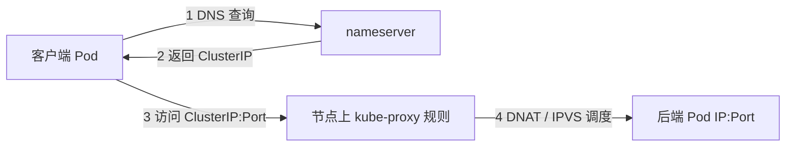
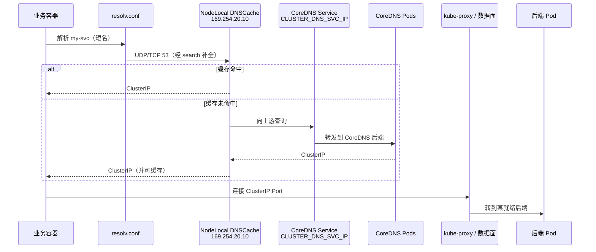
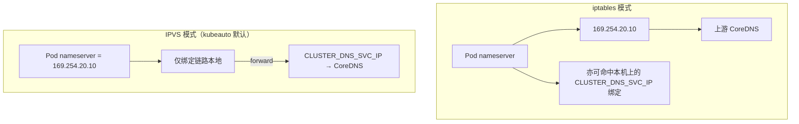

# 第 10 章 DNS 与 Service 发现

> 官方文档：[DNS for Services and Pods](https://kubernetes.io/docs/concepts/services-networking/dns-pod-service/) · [Service](https://kubernetes.io/docs/concepts/services-networking/service/) · [Using NodeLocal DNSCache](https://kubernetes.io/docs/tasks/administer-cluster/nodelocaldns/)  
> 实现对照：本仓库 `dns_install`、`ENABLE_LOCAL_DNS_CACHE`、`roles/cluster-addon` DNS 模板

## 10.1 概述

Pod IP 在重建与扩缩时会变化；调用方不应将后端地址写死在配置中。Kubernetes 提供 **Service** 作为稳定虚拟入口，并由 **集群 DNS** 将服务名解析为 ClusterIP（或 Headless 时的 Pod IP 列表）。

发现路径依赖第 9 章的 Pod 网络：CoreDNS 与 NodeLocal DNSCache 本身以 Pod 形式运行。

## 10.2 Service ClusterIP

| 属性 | 含义 |
|------|------|
| 稳定性 | 在 Service 生命周期内 ClusterIP 通常不变 |
| 范围 | 默认仅集群网络内可达（ClusterIP 类型） |
| 负载 | 将流量分布到就绪后端（结合 readiness） |
| 非替代 | 不替代 CNI 的 Pod 互通 |

Service 通过标签选择器关联一组 Pod（经 Endpoint / EndpointSlice）；节点上由 **kube-proxy**（或 Cilium 等）编程转发规则。类型包括 `ClusterIP`、`NodePort`、`LoadBalancer`、`ExternalName`。本章聚焦发现路径上的 ClusterIP + DNS。

### 10.2.1 kube-proxy 在路径中的位置



| 模式 | 机制 |
|------|------|
| **iptables** | 链式规则与概率性负载均衡 |
| **IPVS**（本项目库存默认） | 内核 IPVS 维护虚拟服务器；规则规模增长时通常更稳 |

部分 CNI（如 Cilium）可替代该数据面；此时 kube-proxy 是否仍运行取决于安装选项。

## 10.3 DNS 记录与 resolv.conf

假设域名后缀为 `cluster.local`（本项目 `CLUSTER_DNS_DOMAIN` 默认值）：

| 查询名 | 典型结果 |
|--------|----------|
| `my-svc.my-ns.svc.cluster.local` | Service 的 ClusterIP（A/AAAA） |
| Headless `my-svc.my-ns.svc.cluster.local` | 后端 Pod IP 列表 |
| `my-pod.my-ns.pod.cluster.local` | Pod IP（需启用相应记录；不如 Service 常用） |
| `kubernetes.default.svc.cluster.local` | 默认命名空间中 kubernetes Service（apiserver 集群内入口） |

同一命名空间内，应用常只写 `my-svc`；跨命名空间写 `my-svc.other-ns`。短名依赖 search 列表。

### 10.3.1 search 与 ndots

kubelet 为 Pod 注入 DNS 配置（简化示意）：

```text
nameserver 169.254.20.10
search <namespace>.svc.cluster.local svc.cluster.local cluster.local
options ndots:5
```

| 字段 | 作用 |
|------|------|
| **nameserver** | 查询发往何处——启用 NodeLocal 时为链路本地 `169.254.20.10`，否则为 `CLUSTER_DNS_SVC_IP` |
| **search** | 短名依次补全后缀再查 |
| **ndots** | 名字中的点数量阈值。默认 `ndots:5` 时，点数量足够的名字倾向于先当 FQDN 查；短名则走 search |

错误的 ndots/search 会导致解析变慢，或先查外部再查内部的意外行为。

## 10.4 一次服务名访问的时序



排障须分离失败环：先 `nslookup`/`dig`，再 `curl ClusterIP`，再 `curl PodIP`。DNS 失败、转发失败、后端未就绪的表现都可能是「服务调不通」。

## 10.5 NodeLocal DNSCache

### 10.5.1 官方动机

官方 NodeLocal DNSCache 任务文档强调：

1. **conntrack 压力**：Pod 以 ClusterIP 访问 kube-dns Service 时，DNS 查询经过 iptables/IPVS 与连接跟踪；短 TTL、高 QPS 会放大 conntrack 表项。  
2. **延迟与抖动**：每次解析都可能绕到不在本节点的 CoreDNS Pod。  
3. **可用性局部化**：节点上跑 DNS 缓存代理（DaemonSet）；未命中再问上游 CoreDNS。

本项目默认开启：`ENABLE_LOCAL_DNS_CACHE=true`，监听 **`LOCAL_DNS_CACHE=169.254.20.10`**（链路本地地址，不依赖额外路由宣告）。

### 10.5.2 IPVS 与 iptables 的绑定差异

| 模式 | 模板 | node-cache 绑定 | 说明 |
|------|------|-----------------|------|
| **iptables** | `nodelocaldns-iptables.yaml.j2` | 绑定 `LOCAL_DNS_CACHE` **与** `CLUSTER_DNS_SVC_IP` | 在节点上「冒充」集群 DNS IP，配合规则劫持到本地缓存 |
| **IPVS** | `nodelocaldns-ipvs.yaml.j2` | **仅**绑定 `LOCAL_DNS_CACHE`，`forward` 到 `CLUSTER_DNS_SVC_IP` | 避免与 IPVS 虚拟服务器争用同一 ClusterIP；Pod 的 nameserver 须指向链路本地 |

当 `PROXY_MODE=ipvs`（默认）时：

- kubelet `clusterDNS` **必须**指向 `169.254.20.10`（启用本地缓存时）；  
- 若误指 `CLUSTER_DNS_SVC_IP` 而又按 IPVS 清单只绑链路本地，会出现路径不符或解析异常。



## 10.6 生产观测与故障面

| 对象 | 典型位置 |
|------|----------|
| CoreDNS Deployment/Pod | `kube-system`，镜像 `brinnatt/coredns:1.12.4` |
| Service `kube-dns` | ClusterIP = `CLUSTER_DNS_SVC_IP`（`SERVICE_CIDR` 的 **.2**） |
| node-cache DaemonSet | 每节点，镜像 `brinnatt/k8s-dns-node-cache:1.26.4` |
| Pod resolv.conf | nameserver `169.254.20.10`（默认开启缓存时） |
| kubelet 配置 | `clusterDNS` / `clusterDomain` |

| 现象 | 含义 |
|------|------|
| CoreDNS Ready，短名可解析 | DNS 控制路径基本正常 |
| 解析慢、偶发超时 | 优先查 NodeLocal、conntrack、上游 forward |
| 只有外部域名失败 | CoreDNS forward 上游或节点出网/53 被拦 |
| 只有跨 ns 短名失败 | search 域或调用方写错名字 |
| OVN 集群出现两套 CoreDNS | addon 去重失败或手工重复安装 |

默认拒绝的 NetworkPolicy 若未放行到 `kube-dns` / node-local-dns 的 53/UDP+TCP，应用会表现为服务发现全挂——这是策略问题，不是 DNS 组件本身故障。

## 10.7 本项目实现

### 10.7.0 安装阶段（06 network / 07 addon）

| 阶段 | Playbook / 步骤 | DNS 相关行为 |
|------|-----------------|--------------|
| **06 network** | `06.network.yml` | 仅 CNI；**不**安装 CoreDNS / NodeLocal |
| **07 cluster-addon** | `07.cluster-addon.yml` | `dns_install: "yes"` 时安装 CoreDNS + NodeLocal |
| **kube-ovn 例外** | `roles/kube-ovn`（步骤 06） | 可预装 CoreDNS / NodeLocal；addon **检测去重** |

因此：节点在步骤 06 完成后可 Ready，但集群服务发现依赖步骤 **07**（或 kube-ovn 预装路径）。Hubble UI 等 addon 子任务在 CoreDNS Ready 后再做等待。

### 10.7.1 开关与地址约定

| 项 | 值 |
|----|-----|
| 安装开关 | `dns_install: "yes"` |
| 本地缓存 | `ENABLE_LOCAL_DNS_CACHE: true`（默认） |
| 链路本地 | `LOCAL_DNS_CACHE: "169.254.20.10"` |
| 集群 DNS IP | `CLUSTER_DNS_SVC_IP` = `SERVICE_CIDR` 的第二个地址（习惯上 `.2`；`.1` 常留给 kubernetes Service） |
| 域名 | `CLUSTER_DNS_DOMAIN` 默认 `cluster.local` |
| CoreDNS | `v_coredns=1.12.4` → `brinnatt/coredns:1.12.4` |
| NodeLocal | `v_dnsnodecache=1.26.4` → `brinnatt/k8s-dns-node-cache:1.26.4` |

### 10.7.2 kubelet 注入

`roles/kube-node/templates/kubelet-config.yaml.j2`：

```yaml
clusterDNS:
# ENABLE_LOCAL_DNS_CACHE 为真时
- {{ LOCAL_DNS_CACHE }}
# 否则
- {{ CLUSTER_DNS_SVC_IP }}
clusterDomain: {{ CLUSTER_DNS_DOMAIN }}
```

改 DNS 拓扑后，须保证节点 kubelet 配置与 addon 清单一致，否则新 Pod 仍指向错误 nameserver。

### 10.7.3 Addon 任务与模板

| 文件 | 作用 |
|------|------|
| `roles/cluster-addon/tasks/coredns.yml` | 安装 CoreDNS |
| `roles/cluster-addon/tasks/nodelocaldns.yml` | 按 `PROXY_MODE` 选择 IPVS/iptables 清单 |
| `templates/dns/coredns.yaml.j2` | CoreDNS + kube-dns Service（固定 `clusterIP`） |
| `templates/dns/nodelocaldns-ipvs.yaml.j2` | 仅绑 `LOCAL_DNS_CACHE` |
| `templates/dns/nodelocaldns-iptables.yaml.j2` | 绑 `LOCAL_DNS_CACHE` + `CLUSTER_DNS_SVC_IP` |

### 10.7.4 kube-ovn 特殊路径

kube-ovn 角色可在 CNI 阶段预装 CoreDNS / NodeLocal。`cluster-addon` 检测到已存在 `coredns` Pod 时 **跳过**，避免双份 DNS 争用同一 Service IP。

### 10.7.5 依赖、镜像与变更顺序

CoreDNS、node-cache 都是 Pod：先有 CNI，再有 DNS。Hubble UI 等依赖域名解析的组件，应在 DNS Ready 后再做就绪等待。

DNS 相关镜像通过 `download` 进入企业私仓。离线现场若漏下 node-cache 镜像，会出现「CoreDNS 正常但 DaemonSet 拉不起、Pod 仍指向 169.254.20.10 导致解析全死」。

推荐变更顺序：

1. 确认 `SERVICE_CIDR` / `CLUSTER_DNS_SVC_IP` / `LOCAL_DNS_CACHE` 契约不变或已全局规划。  
2. 应用 addon DNS 清单（CoreDNS → NodeLocal）。  
3. 滚动更新 kubelet 配置，使 `clusterDNS` 与清单一致。  
4. 抽检新建 Pod 的 `/etc/resolv.conf`；存量 Pod 不会自动改 resolv，除非重建。

## 10.8 验证清单

```bash
# 1) 组件
kubectl -n kube-system get pods -l k8s-app=kube-dns -o wide
kubectl -n kube-system get ds -l k8s-app=node-local-dns 2>/dev/null || \
  kubectl -n kube-system get pods | grep node-local

# 2) Service IP 是否与约定一致
kubectl -n kube-system get svc kube-dns -o wide

# 3) kubelet clusterDNS
grep -A2 clusterDNS /var/lib/kubelet/config.yaml
# 默认期望含 169.254.20.10

# 4) Pod 内解析
kubectl run dns-test --rm -it --restart=Never \
  --image=registry.talkschool.cn:5000/brinnatt/alpine-curl -- \
  nslookup kubernetes.default.svc.cluster.local

# 5) resolv.conf
kubectl run dns-test2 --rm -it --restart=Never \
  --image=registry.talkschool.cn:5000/brinnatt/alpine-curl -- \
  cat /etc/resolv.conf
```

建议验收顺序：本机 nameserver 端口通 → 集群域名通 → 外部域名通（若需要）→ 短名通 → Service 连通 → 后端 Pod 连通。

## 10.9 FAQ

**Q1：ClusterIP 能 ping 通吗？**  
A：不一定。ClusterIP 是虚拟 IP，ICMP 是否响应取决于数据面；应用应测 **TCP/UDP 目标端口**。

**Q2：为何默认要用 169.254.20.10？**  
A：官方 NodeLocal 示例常用的链路本地地址，不占用 `SERVICE_CIDR`，并配合 IPVS「只绑链路本地」的设计。

**Q3：关闭 NodeLocal 可以吗？**  
A：可以：`ENABLE_LOCAL_DNS_CACHE=false`，并让 kubelet `clusterDNS` 回指 `CLUSTER_DNS_SVC_IP`。大规模高 QPS 解析场景更建议保持开启。

**Q4：为什么 IPVS 与 iptables 的 node-cache 清单不同？**  
A：iptables 路径常在本节点绑定集群 DNS IP 以劫持查询；IPVS 已为该 ClusterIP 建立虚拟服务，再绑定同一 IP 容易冲突。

**Q5：短名偶发解析到错误地方？**  
A：检查 search / ndots、应用是否把不完整名字当 FQDN、以及 CoreDNS 对外部域的 forward。

**Q6：CoreDNS 一直 CrashLoop？**  
A：发现路径会大面积失败。查镜像、CNI、Corefile、是否与第二份 DNS 冲突。

**Q7：kubernetes.default 能解析，自己的 svc 不行？**  
A：查 Service 是否创建、Endpoint 是否为空、名字与命名空间、NetworkPolicy。

**Q8：改 SERVICE_CIDR 后 DNS 失效？**  
A：`CLUSTER_DNS_SVC_IP` 与已发布的 kube-dns Service、历史规则、kubelet 配置可能不一致。网段是集群级契约，应在建簇时固定。

## 10.10 参考文档与仓库路径

| 主题 | URL |
|------|-----|
| DNS for Services and Pods | https://kubernetes.io/docs/concepts/services-networking/dns-pod-service/ |
| NodeLocal DNSCache | https://kubernetes.io/docs/tasks/administer-cluster/nodelocaldns/ |
| Service | https://kubernetes.io/docs/concepts/services-networking/service/ |
| CoreDNS | https://coredns.io/ |
| kube-proxy | https://kubernetes.io/docs/reference/command-line-tools-reference/kube-proxy/ |

| 主题 | 路径 |
|------|------|
| 默认开关 | `conf/config.yml`（`dns_install`、`ENABLE_LOCAL_DNS_CACHE`、`LOCAL_DNS_CACHE`） |
| kubelet DNS | `roles/kube-node/templates/kubelet-config.yaml.j2` |
| CoreDNS 清单 | `roles/cluster-addon/templates/dns/coredns.yaml.j2` |
| NodeLocal IPVS / iptables | `roles/cluster-addon/templates/dns/nodelocaldns-*.yaml.j2` |
| OVN 预装 DNS | `roles/kube-ovn/templates/coredns.yaml.j2` 等 |
| 版本常量 | `v_coredns`、`v_dnsnodecache`（`common/constants.py`） |
