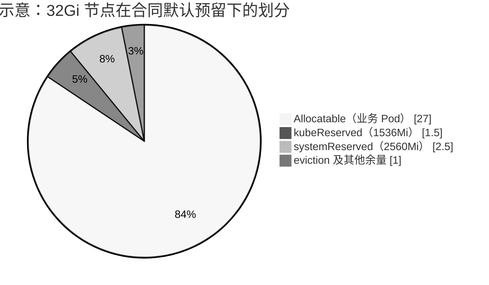
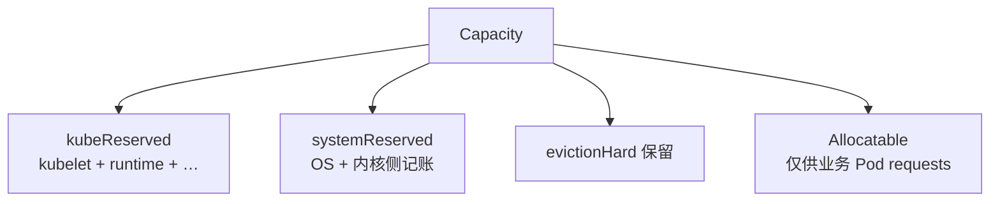
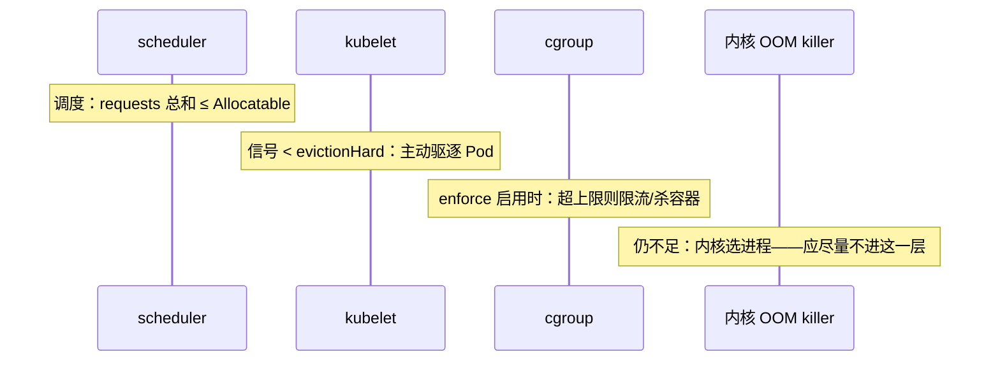
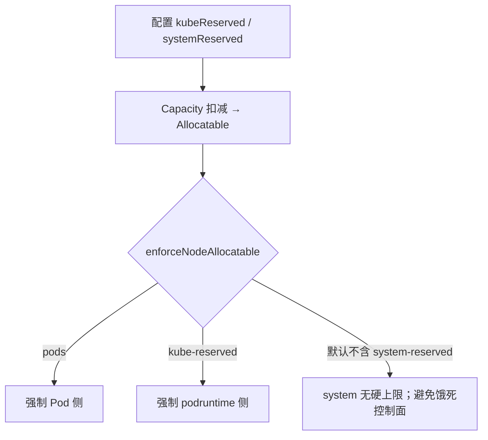
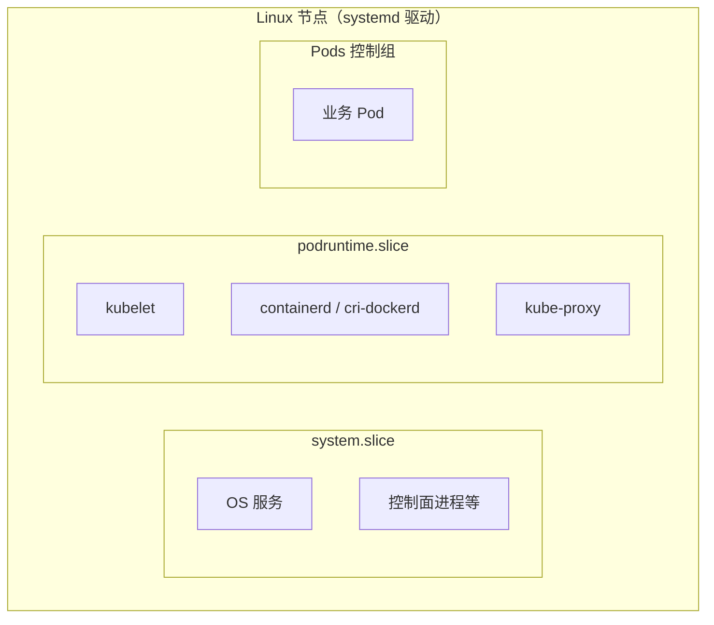

# 第 11 章 Node Allocatable、资源预留与 Pod QoS

> 官方文档：[Reserve Compute Resources for System Daemons](https://kubernetes.io/docs/tasks/administer-cluster/reserve-compute-resources/) · [Node-pressure Eviction](https://kubernetes.io/docs/concepts/scheduling-eviction/node-pressure-eviction/) · [Pod Quality of Service Classes](https://kubernetes.io/docs/concepts/workloads/pods/pod-qos/)  
> 实现对照：本仓库合同默认预留、`kubelet-config.yaml.j2`、`verify-node-reserved.sh`、`test_kube_reserved.py`

## 11.1 概述

节点上除业务 Pod 外，还运行 kubelet、容器运行时、kube-proxy 等 Kubernetes 系统守护进程，以及 sshd、udev、journald 等操作系统守护进程；内核自身亦占用内存。若调度器把 **Capacity** 全部视为可调度给 Pod，高密度或内存抖动时平台组件与 OS 会与业务争抢资源，最坏情况下控制面失联。

官方因此引入 **Node Allocatable**：向调度器暴露「真正允许 Pod 使用的资源上限」，并从 Capacity 中扣减预留。这解释了交付中常见的问题：节点显示 32Gi，却无法调度合计接近 32Gi requests 的业务——**本就不该**。

## 11.2 Capacity、Allocatable 与官方公式

```text
Node Allocatable ≈ Capacity
                   − kubeReserved
                   − systemReserved
                   − evictionHard 对应保留量
```

支持的资源类型通常包括 CPU、内存、ephemeral-storage 等（以版本与配置为准）。

### 11.2.1 官方数值例子（16 CPU / 32Gi）

| 项 | 示例值 |
|----|--------|
| Capacity | 16 CPU，32Gi 内存 |
| kubeReserved | cpu `1000m`，memory `2Gi` |
| systemReserved | cpu `500m`，memory `1Gi` |
| evictionHard | `memory.available: "<500Mi"` |
| **Allocatable（约）** | **14.5 CPU，28.5Gi 内存** |

调度器确保：该节点上所有 Pod 的 **requests** 之和不超过 Allocatable。实际用量压迫节点时，kubelet 还可通过驱逐与 cgroup 强制介入。

### 11.2.2 kubeauto 合同默认（≥16C/32Gi 节点）

| 项 | 默认 |
|----|------|
| kubeReserved | CPU `1000m`，内存 `1536Mi`，pid `1000` |
| systemReserved | CPU `1000m`，内存 `2560Mi`，pid `5000` |
| 合计记账预留 | 约 **2 CPU + 4Gi**（另加 eviction 等） |
| 交付地板 | 节点规格 **≥ 16 CPU / 32Gi** |



以现场 `kubectl describe node` 与验收脚本为准；下图为容量结构示意，非精确数值。

## 11.3 kubeReserved 与 systemReserved

| 配置 | 官方用途 | 典型覆盖对象 | kubeauto 落点 |
|------|----------|--------------|---------------|
| **kubeReserved** | 为 **Kubernetes 系统守护进程** 预留；一般不用于以 Pod 形式运行的系统组件 | kubelet、containerd/cri-dockerd、kube-proxy 等 | `KUBE_RESERVED_*`；cgroup 父级 `/podruntime` → 主机 `podruntime.slice` |
| **systemReserved** | 为 **操作系统守护进程** 预留；并应考虑内核内存 | sshd、udev、journald、内核侧等 | `SYS_RESERVED_*`；cgroup 父级 `/system` → `system.slice` |
| **evictionHard** | 保留阈值以下的可用资源，供节点压力驱逐使用；不可再当作可调度容量 | 内存/磁盘/inode/PID 等信号 | 模板默认含 `memory.available: 300Mi` 等 |

两个预留写入后，会从 Capacity 扣减从而缩小 Allocatable（调度侧）。是否再对相应 cgroup **施加上限**，由 `enforceNodeAllocatable` 列表单独决定。



以 Pod 运行的插件（CoreDNS 等）消耗的是 Allocatable，不算作 kubeReserved。

## 11.4 evictionHard 与节点压力驱逐

kubelet 持续监控内存、节点文件系统、镜像文件系统、inode、PID 等信号。当可用资源跌破 **硬驱逐阈值** 时，kubelet 以 `0s` 宽限期终止 Pod，降低直接掉进 **System OOM** 的概率。

本项目模板默认示例：

```yaml
evictionHard:
  imagefs.available: 15%
  memory.available: 300Mi
  nodefs.available: 10%
  nodefs.inodesFree: 5%
```

官方说明：kubelet **并不**简单地把 QoS 类名当作唯一排序键，但会综合：(1) 用量是否超过 `requests`；(2) Pod Priority；(3) 相对 `requests` 的超额程度。倾向性结果常被概括为：

| QoS | 判定要点 | 压力下的相对位置 |
|-----|----------|------------------|
| **BestEffort** | 未设置 CPU/内存 request 与 limit | 通常最先成为候选 |
| **Burstable** | 有部分 request/limit，但不满足 Guaranteed | 介于中间 |
| **Guaranteed** | 各容器 CPU、内存的 request 与 limit 均 >0 且两两相等 | 通常最靠后 |

若系统守护进程已超过预留，且节点上只剩较规范的 Guaranteed/Burstable，kubelet **仍可能**驱逐较低优先级 Pod 以保节点。预留的目标是尽量避免走到内核 OOM killer——该层不保证「先杀业务、后杀 kubelet」。



## 11.5 enforceNodeAllocatable

`enforceNodeAllocatable` 可包含：

| 键 | 含义 |
|----|------|
| `pods` | 限制业务 Pod 总体用量，超额则驱逐/约束 |
| `kube-reserved` | 对 `kubeReservedCgroup` 施加上限 |
| `system-reserved` | 对 `systemReservedCgroup` 施加上限 |

**调度扣减 ≠ 运行时硬限。** kubelet 不会自动创建缺失的预留 cgroup；父级无效会导致 kubelet 启动失败。本项目在 `prepare` 中创建 `podruntime.slice`，并在 kubelet unit 中处理依赖与（cgroup v1 下的）路径兜底。

### 11.5.1 kubeauto 默认策略

| 行为 | 默认 |
|------|------|
| 配置 kubeReserved / systemReserved（扣减 Allocatable） | **是** |
| enforce 含 `pods` | **是** |
| enforce 含 `kube-reserved` | **是**（当 `KUBE_RESERVED_ENABLED=yes`） |
| enforce 含 `system-reserved` | **否**（`SYS_RESERVED_ENFORCE=no`） |

### 11.5.2 为何 SYS_RESERVED_ENFORCE 默认为 no

控制面进程（kube-apiserver、etcd 等）在本项目中以 systemd 运行，通常落在 **system.slice** 账本附近。若把过小的 `systemReserved` 内存上限硬加到该 slice，会在安装 Prometheus 等重量组件或控制面峰值时饿死 apiserver（现场曾出现 `MemoryMax` 过小导致 6443 复位的回归）。

官方 General Guidelines 亦警告：对 `system-reserved` 的强制必须极端谨慎。合同策略因此为：

1. **调度侧**：systemReserved **计入** Allocatable 扣减；  
2. **运行时侧**：默认 **不**对 system.slice 一刀切硬限；  
3. 压力时优先通过 `pods` / 驱逐影响业务；  
4. 现场完成峰值剖析且预留值足够覆盖控制面峰值后，可将 `SYS_RESERVED_ENFORCE=yes` 作为加固项。



## 11.6 systemd cgroup 命名

使用 **systemd** cgroup 驱动时，kubelet 配置里写的是逻辑名；kubelet 会再追加 `.slice`。

| 正确写法（systemd） | 主机上实际 slice | 错误写法 | 结果 |
|--------------------|------------------|----------|------|
| `kubeReservedCgroup: /podruntime` | `podruntime.slice` | `/podruntime.slice` | `podruntime.slice.slice` |
| `systemReservedCgroup: /system` | `system.slice` | `/system.slice` | `system.slice.slice` |

根因见 [kubernetes#78629](https://github.com/kubernetes/kubernetes/issues/78629) 与 kubelet `ToSystemd()` 行为。kubeauto 模板：

```jinja

kubeReservedCgroup: /podruntime
systemReservedCgroup: /system

kubeReservedCgroup: /podruntime.slice
systemReservedCgroup: /system.slice

```

验收时显式检查 **不存在** `/sys/fs/cgroup/.../podruntime.slice.slice`。



## 11.7 生产观测

```text
Capacity:
  cpu:                16
  memory:             32768000Ki
Allocatable:
  cpu:                14
  memory:             ~28Gi 量级（随预留与 eviction 变化）
```

CPU 差值应大约覆盖 `1000m+1000m`；内存差值约 **4Gi** 量级（另含 eviction）。以脚本与现场为准。

| 场景 | 期望 |
|------|------|
| 调度超卖 attempts | Pod Pending，提示资源不足 |
| 内存逼近阈值 | 驱逐事件、目标多为 BestEffort/超用 Burstable |
| 误开 system 硬限且值过小 | 控制面卡顿、API 超时、节点 NotReady |
| 双重 slice | kubeReserved 强制失效或 kubelet 异常 |

## 11.8 本项目实现（合同默认）

### 11.8.1 配置变量（`conf/config.yml`）

| 变量 | 默认 | 含义 |
|------|------|------|
| `KUBE_RESERVED_ENABLED` | `"yes"` | 启用 kube 预留 |
| `KUBE_RESERVED_CPU` | `"1000m"` | |
| `KUBE_RESERVED_MEMORY` | `"1536Mi"` | |
| `KUBE_RESERVED_PID` | `"1000"` | |
| `SYS_RESERVED_ENABLED` | `"yes"` | 启用 system 预留（调度扣减） |
| `SYS_RESERVED_CPU` | `"1000m"` | |
| `SYS_RESERVED_MEMORY` | `"2560Mi"` | |
| `SYS_RESERVED_PID` | `"5000"` | |
| `SYS_RESERVED_ENFORCE` | **`"no"`** | 不把 `system-reserved` 加入 enforce |

注释约定：systemd 下不要写 `/podruntime.slice`；`SYS_RESERVED_ENFORCE=yes` 仅当 system 内存预留 ≥ 测得的控制面峰值。

### 11.8.2 渲染与 slice

| 文件 | 作用 |
|------|------|
| `roles/kube-node/templates/kubelet-config.yaml.j2` | 渲染 reserved、eviction、enforce、cgroup 名 |
| `roles/kube-node/templates/kubelet.service.j2` | `Slice=podruntime.slice`、`Requires=podruntime.slice`、endpoint 等 |
| `roles/prepare/tasks/podruntime-slice.yml` | 创建父级 slice |
| 运行时 unit | containerd/docker 在预留开启时可加入同一 slice |

### 11.8.3 测试与验收资产

| 资产 | 作用 |
|------|------|
| `tests/unit/test_kube_reserved.py` | 断言默认值、模板渲染、enforce 分支 |
| `tests/helpers/verify-node-reserved.sh` | 现场/门禁：期望 `RESERVED_ALLOCATABLE_PASS` |
| 操作手册 §1.1.4 | 运维向完整说明（与本章互补） |

变更预留后需重配节点，例如：`kubecli setup <cluster> 05`（以当前 CLI 阶段编号为准）。

**低规格实验节点不得直接套用 2C+4Gi 生产预留**——Capacity 小于预留时，kubelet 会拒绝启动（官方约束）。

## 11.9 验证清单

```bash
# 1) 配置合同默认
grep -E 'KUBE_RESERVED_|SYS_RESERVED_' clusters/<cluster>/config.yml
# 期望：CPU 1000m/1000m，内存 1536Mi/2560Mi，ENFORCE=no

# 2) 节点账本
kubectl describe node <node> | grep -A8 -E 'Capacity|Allocatable'

# 3) kubelet 配置
grep -E 'kubeReserved|systemReserved|enforceNodeAllocatable|evictionHard' \
  -A6 /var/lib/kubelet/config.yaml
# enforce 应含 pods、kube-reserved；默认不含 system-reserved
# cgroup 名应为 /podruntime 与 /system（systemd）

# 4) slice 与双重 slice
systemctl show kubelet containerd -p Slice --value
test ! -d /sys/fs/cgroup/podruntime.slice.slice && echo NO_DOUBLE_SLICE

# 5) 仓库验收脚本
bash tests/helpers/verify-node-reserved.sh clusters/<cluster>/kubectl.kubeconfig
# 期望输出含 RESERVED_ALLOCATABLE_PASS

# 6) 单测
python -m pytest tests/unit/test_kube_reserved.py -q
```

通过条件通常包括：CPU 差值约 ≥ `2000m`；内存差值约 `4Gi` 量级（含 eviction）；运行时位于 `podruntime.slice`；无 `.slice.slice`。

## 11.10 FAQ

**Q1：为什么 Allocatable 比 Capacity 小？是不是装坏了？**  
A：这是正确且必要的。差值应接近预留与 eviction 设计；用 `verify-node-reserved.sh` 确认。

**Q2：Guaranteed Pod 就绝对不会被驱逐吗？**  
A：不会「绝对」。它通常最靠后，但在节点保活需要时仍可能被驱逐；Priority 与实际超用同样重要。

**Q3：只设 limit 不设 request 会怎样？**  
A：调度主要看 request。应按工作负载认真设置 request，limit 按超卖与保护策略设置。

**Q4：为何不默认 enforce system-reserved？**  
A：防止 system.slice 硬限饿死 apiserver/etcd/OS 关键服务。调度扣减已经保护「别把节点塞满」。

**Q5：写了 `/podruntime.slice` 为什么危险？**  
A：systemd 驱动下会变成 `podruntime.slice.slice`，预留强制与进程归属错位。始终写 `/podruntime`。

**Q6：16C/32Gi 以下能不能用这套默认？**  
A：合同地板是 ≥16C/32Gi。更小节点必须同步缩小预留，否则 kubelet 可能因 `Expected capacity >= reservation` 无法启动。

**Q7：启用 Prometheus 后内存紧张？**  
A：先观察控制面与 OS 真实峰值，再 **上调** systemReserved（并评估是否仍保持 ENFORCE=no）。关掉预留通常不是生产答案。

**Q8：evictionHard 的 300Mi 与官方示例 500Mi 不同？**  
A：阈值可按容量与风险偏好调整；关键是有明确硬阈值且与 Allocatable 记账一致。

**Q9：Pod 形式的插件（CoreDNS 等）算 kubeReserved 吗？**  
A：官方语义上，kubeReserved 主要面向 **主机级** Kubernetes 守护进程；以 Pod 运行的插件消耗 Allocatable。

## 11.11 参考文档与仓库路径

| 主题 | URL |
|------|-----|
| Reserve Compute Resources | https://kubernetes.io/docs/tasks/administer-cluster/reserve-compute-resources/ |
| Node-pressure Eviction | https://kubernetes.io/docs/concepts/scheduling-eviction/node-pressure-eviction/ |
| Pod QoS | https://kubernetes.io/docs/concepts/workloads/pods/pod-qos/ |
| Assign Memory Resources | https://kubernetes.io/docs/tasks/configure-pod-container/assign-memory-resource/ |
| kubernetes#78629 | https://github.com/kubernetes/kubernetes/issues/78629 |

| 主题 | 路径 |
|------|------|
| 合同默认 | `conf/config.yml` |
| kubelet 配置模板 | `roles/kube-node/templates/kubelet-config.yaml.j2` |
| kubelet unit / slice | `roles/kube-node/templates/kubelet.service.j2` |
| slice 创建 | `roles/prepare/tasks/podruntime-slice.yml` |
| 验收脚本 | `tests/helpers/verify-node-reserved.sh` |
| 单元测试 | `tests/unit/test_kube_reserved.py` |
| 运维手册 | `docs/operations-manual.md` §1.1.4 |
