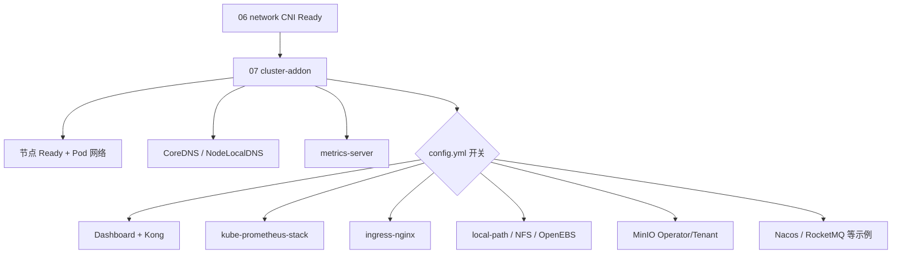
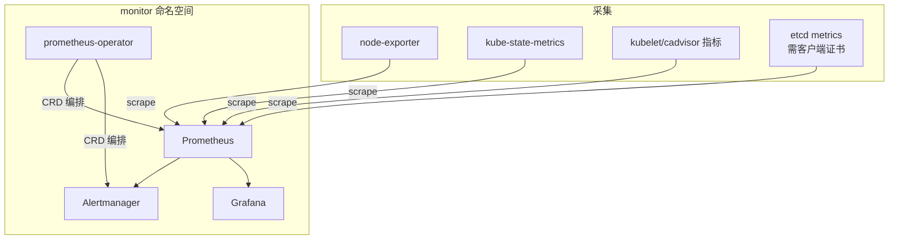
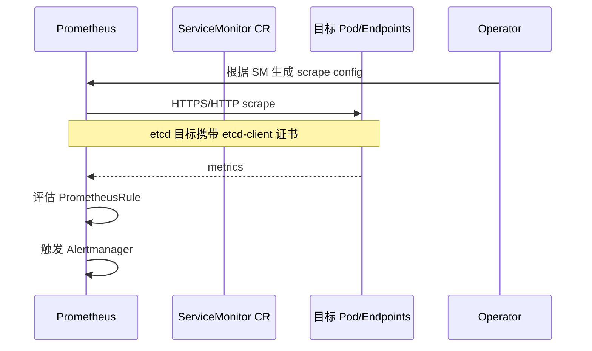
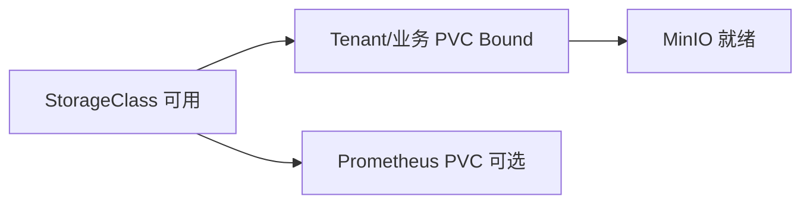

# 第 12 章 集群插件与可观测性

> 官方参考：[Cluster Addons](https://kubernetes.io/docs/concepts/cluster-administration/addons/) · [metrics-server](https://kubernetes-sigs.github.io/metrics-server/) · [Kubernetes Dashboard](https://kubernetes.io/docs/tasks/access-application-cluster/web-ui-dashboard/) · [ingress-nginx](https://kubernetes.github.io/ingress-nginx/) · [kube-prometheus-stack](https://github.com/prometheus-community/helm-charts/tree/main/charts/kube-prometheus-stack)  
> 实现对照：本仓库 `roles/cluster-addon`、`playbooks/07.cluster-addon.yml`

## 12.1 概述

控制面、CRI 与 CNI 就绪后，集群仍缺少多项日常运维能力：资源指标、可视化、监控告警、HTTP 入口、动态存储供给等。官方将这类扩展统称为 **Cluster Addons（插件）**：它们不是控制面核心组件，但通过 Deployment / DaemonSet / Helm Chart 等形式扩展集群功能。

本项目由 **`roles/cluster-addon`** 在 **`playbooks/07.cluster-addon.yml`**（setup 步骤 **07**）及 `90.setup.yml` 末段统一安装。Pod 网络（CNI）已在步骤 **06**（`06.network.yml`）完成；addon 阶段假定节点 Ready 且 CNI 可用。DNS（CoreDNS / NodeLocal DNSCache，`169.254.20.10`）亦在本阶段安装，机制见第 10 章；本章聚焦指标、监控、入口、存储与相关安全约定。

| Setup 步骤 | Playbook | 与本章关系 |
|------------|----------|------------|
| `06` / `network` | `06.network.yml` | CNI 就绪（前置条件） |
| `07` / `cluster-addon` | `07.cluster-addon.yml` | 本章所述插件 |

所有镜像经本地仓：`registry.talkschool.cn:5000/brinnatt/<name>:<tag>`。安装前必须 `kubecli download -X`（默认集）或 `-E <component>`。

## 12.2 插件在架构中的位置

| 类别 | 典型能力 | 官方/社区形态 |
|------|----------|---------------|
| 集群 DNS | 服务发现 | CoreDNS（见第 10 章） |
| 资源指标 | `kubectl top`、HPA 资源指标 | metrics-server（`metrics.k8s.io`） |
| Web UI | 对象浏览与操作 | Kubernetes Dashboard |
| 监控告警 | 时序指标、规则、可视化 | Prometheus / Grafana 生态 |
| 入口 | HTTP(S) 路由 | Ingress Controller |
| 存储 | 动态 PV 供给 | CSI / in-tree provisioner |

插件以 **普通工作负载** 形式运行：消耗 Allocatable（第 11 章）、依赖 Pod 网络与 DNS、受 NetworkPolicy 约束。安装顺序上须先保证节点 Ready 与 CNI，再装依赖网络的 addon。

## 12.3 metrics-server

### 12.3.1 机制

metrics-server 从各节点 kubelet 的 Summary API 汇总 CPU/内存用量，实现聚合 API **`metrics.k8s.io`**。它支撑：

- `kubectl top node` / `kubectl top pod`
- HorizontalPodAutoscaler（资源指标路径）

它**不是**长期时序存储；历史趋势与告警由 Prometheus 等组件承担。

### 12.3.2 本项目实现

| 项 | 值 |
|----|-----|
| 安装 | 默认随基础 addon（`metrics_server` 相关开关） |
| 模板 | `roles/cluster-addon/templates/metrics-server/components.yaml.j2` |
| 镜像 | `brinnatt/metrics-server:v0.8.0`（`v_metricsserver`） |
| 关键参数 | `--kubelet-insecure-tls`（私有 CA 场景常见）、`--kubelet-preferred-address-types=InternalIP,ExternalIP,Hostname` |

验收：`kubectl top nodes` 返回非空指标；APIService `v1beta1.metrics.k8s.io` 为 Available。

## 12.4 Kubernetes Dashboard

### 12.4.1 机制

Dashboard 通过 Kubernetes API 访问集群对象。现代版本拆分为 auth / api / web 等组件，常以 Helm 安装，并以前置代理暴露。

### 12.4.2 本项目实现

| 项 | 值 |
|----|-----|
| 开关 | `dashboard_install`（默认 `no`） |
| Chart | `kubernetes-dashboard-7.14.0.tgz` |
| Values | `templates/dashboard/dashboard-values.yaml.j2` |
| 镜像 | dashboard-auth/api/web、metrics-scraper、kong:3.9 |
| RBAC | admin-user / read-user SA 清单 |
| 暴露 | Kong NodePort |

下载：`kubecli download -E dashboard`。

### 12.4.3 安全约定

Dashboard 绑定高权限 ServiceAccount 时风险极高。本项目提供 admin-user 与 read-user 两套 RBAC 模板。生产应：

- 禁用长期高权限 token，改用短时令牌或 OIDC；  
- 限制 NodePort 暴露范围，或改为仅内网 Ingress；  
- 交付后审计已签发的 token 与 NetworkPolicy。

## 12.5 kube-prometheus-stack

### 12.5.1 机制架构

| 组件 | 职责 |
|------|------|
| **prometheus-operator** | 用 CRD（ServiceMonitor、PrometheusRule、Prometheus 等）声明式管理 Prometheus |
| **Prometheus** | 拉取（scrape）时序指标、评估规则、触发告警 |
| **kube-state-metrics** | 将 Kubernetes 对象状态转为指标 |
| **node-exporter** | 主机层 CPU / 磁盘 / 网络等 |
| **Alertmanager** | 告警路由、分组、抑制与接收 |
| **Grafana** | 可视化；首次安装生成随机管理员口令并保存于 Kubernetes Secret |

### 12.5.2 抓取路径（结合本项目）

| 目标 | 指标来源 | 本项目处理 |
|------|----------|------------|
| 节点主机 | node-exporter | DaemonSet，Helm values 启用 |
| K8s 对象 | kube-state-metrics | Deployment |
| 容器资源 | kubelet / cadvisor | 经 ServiceMonitor |
| apiserver | 控制面指标端口 | stack 默认抓取配置 |
| etcd | etcd metrics + 客户端 TLS | 生成 `etcd-client-cert` Secret 供 Prometheus 使用 |
| ingress | controller metrics | `ingress_nginx_metrics_enabled` 与 prom 联动 |

### 12.5.3 本项目实现

| 项 | 值 |
|----|-----|
| 开关 | `prom_install`（默认 `no`） |
| Namespace | `monitor` |
| Chart | `kube-prometheus-stack-88.0.0.tgz`（`v_promchart`） |
| Values | `templates/prometheus/values.yaml.j2` |
| etcd 抓取证书 | 角色内 cfssl 签发 → Secret `monitor/etcd-client-cert` |
| NodePort | Prometheus 30901、Alertmanager 30902、Grafana 30903 等 |
| 高可用 | Prometheus 2 副本、Alertmanager 3 副本、独立 admission webhook 2 副本；均配置 PDB，核心有状态组件采用硬反亲和 |
| 持久化 | 设置 `prom_storage_class` 后，Prometheus、Alertmanager 与 Grafana 均使用 PVC；生产必须使用已验证的 StorageClass |

镜像钉扎示例（均为 `brinnatt/*`，完整列表见 `component_images["prometheus"]` 与 values）：

- prometheus v3.13.1-distroless、alertmanager v0.33.1、grafana 13.1.1
- operator/config-reloader/admission-webhook v0.93.0、node-exporter v1.12.1、kube-state-metrics v2.18.0

可选：`prometheus-dingtalk` webhook（`download -E prometheus-dingtalk`）。

**资源提示：** 监控栈本身消耗显著内存/CPU。须在已配置 Node Allocatable 的充足节点上启用；并确认未错误硬限 `system.slice`（第 11 章）导致 apiserver 在安装过程中 OOM。

### 12.5.4 交付验收

1. `kubectl get pods -n monitor` 全部 Running/Ready，Prometheus、Alertmanager 和 webhook 副本分布在不同节点。
2. 所有监控 PVC 为 `Bound`，PDB 的 `ALLOWED DISRUPTIONS` 与副本规模一致。
3. Prometheus Targets API 中 apiserver、etcd、kubelet、CoreDNS、node-exporter、kube-state-metrics、scheduler、controller-manager 与 kube-proxy 全部为 `up`，`lastError` 为空。
4. Rules API 中每条规则 `health=ok` 且 `lastError` 为空。
5. 使用 Secret 中的随机管理员凭据登录 Grafana，确认 Prometheus 数据源与内置 Dashboard 可用。
6. 用可回收测试规则验证 Alertmanager 分组、抑制、触发和恢复通知，再删除测试规则。
7. 删除一个 Prometheus Pod 后确认 StatefulSet 重建、PVC UID 不变且重启前历史样本仍可查询。
8. 确认节点 Allocatable 与监控栈 requests 不导致控制面饥饿。

## 12.6 ingress-nginx

### 12.6.1 机制

**Ingress** 对象描述 HTTP(S) 路由规则（主机、路径、后端 Service）。**Ingress Controller** 监听 API 并编程数据面。本项目使用 nginx 实现。

入口流量路径（概念）：外部客户端 → NodePort / 外部 LB → Ingress Controller → 后端 Service → Pod。

### 12.6.2 本项目实现

| 项 | 本项目 |
|----|--------|
| 开关 | `ingress_nginx_install` |
| Chart | 4.13.0 |
| Controller | `brinnatt/ingress-nginx-controller:v1.13.0` |
| Service | NodePort，`externalTrafficPolicy: Local` |
| 调度 | 节点标签 `ingress-controller/provider=ingress-nginx` |
| 与监控联动 | `prom_install=yes` 时可启用 ServiceMonitor |

ex-lb 可选将 80/443 转发到 Ingress NodePort（`INGRESS_NODEPORT_LB`）。

## 12.7 存储供给

动态供给机制：PVC 绑定 StorageClass → Provisioner 创建 PV → Pod 挂载卷。

| 组件 | 开关 | 说明 |
|------|------|------|
| local-path-provisioner | `local_path_provisioner_install` | Rancher 方案；目录 `local_path_provisioner_dir` |
| nfs-subdir-external-provisioner | `nfs_provisioner_install` | 需 `nfs_server` / `nfs_path` |
| OpenEBS | `openebs_install` | Helm 4.3.2；hostpath / LVM；NS `openebs` |

本地路径类适合实验室与单节点；生产需按数据持久性与副本要求选型（NFS、OpenEBS LVM、外部存储阵列等）。

OpenEBS Hostpath/LVM 的组件架构、StorageClass 参数优先级、thin pool、部分节点 VG、故障域与验收口径已独立成[第 16 章](./16-storage-openebs.md)。不要从本节的组件列表推断 OpenEBS 具备跨节点复制；kubeauto 当前禁用了 Mayastor，本项目的 Hostpath 和 LVM 都是节点本地卷。

## 12.8 MinIO

| 项 | 值 |
|----|-----|
| 形态 | Operator NS `minio-operator` + Tenant NS `minio` |
| Chart | `7.1.1` |
| 镜像 | `brinnatt/minio-operator` 等 |
| 存储类 | 默认倾向 OpenEBS LVM；池规模 `minio_pool_servers` / `minio_pool_size` |
| 凭据 | 根用户口令在 `config.yml`，交付后必须轮换 |

### 12.8.1 依赖顺序

若 `prom_storage_class` / `minio_storage_class` 指向尚未安装的 OpenEBS/NFS，Helm 会卡住。安装顺序建议：存储 provisioner →（可选）MinIO → Prometheus（若要持久化）。

local-path、NFS provisioner、Nacos 与 RocketMQ 的详细架构和业务数据面验收见[第 17 章](./17-storage-middleware-addons.md)。

## 12.9 Helm 与多集群 KUBECONFIG

Helm 任务显式传入 `KUBECONFIG`（指向当前集群），避免控制节点多集群上下文串扰。这是本项目在多集群运维场景下的重要实现细节。

## 12.10 可观测性分层（总结）

| 层 | 问题 | 本项目组件 |
|----|------|------------|
| 即时资源用量 | 节点/Pod 当前 CPU/内存 | metrics-server |
| 对象与主机时序 | 历史趋势、告警 | kube-prometheus-stack |
| 控制面深抓 | etcd / apiserver 健康 | etcd-client-cert + ServiceMonitor |
| 入口与业务路由 | HTTP 入口可达 | ingress-nginx metrics（可选） |
| UI | 人工巡检 | Dashboard（可选，默关） |

metrics-server 与 Prometheus 互补：前者服务 API 与 HPA；后者服务 SRE 时序与告警。二者均依赖节点 Ready、足够 Allocatable，以及正确的镜像私仓可达性。

## 12.11 参考文档与仓库路径

| 主题 | URL |
|------|-----|
| Cluster Addons | https://kubernetes.io/docs/concepts/cluster-administration/addons/ |
| metrics-server | https://kubernetes-sigs.github.io/metrics-server/ |
| Dashboard | https://kubernetes.io/docs/tasks/access-application-cluster/web-ui-dashboard/ |
| ingress-nginx | https://kubernetes.github.io/ingress-nginx/ |
| kube-prometheus-stack | https://github.com/prometheus-community/helm-charts/tree/main/charts/kube-prometheus-stack |

| 主题 | 路径 |
|------|------|
| Addon playbook | `playbooks/07.cluster-addon.yml` |
| 角色 | `roles/cluster-addon/` |
| metrics-server | `templates/metrics-server/components.yaml.j2` |
| Dashboard values | `templates/dashboard/dashboard-values.yaml.j2` |
| Prometheus values | `templates/prometheus/values.yaml.j2` |
| 默认开关 | `conf/config.yml`（`dashboard_install`、`prom_install`、`ingress_nginx_install` 等） |
| 版本常量 | `v_metricsserver`、`v_promchart`（`common/constants.py`） |
| 版本矩阵 | `docs/whitepaper/A-version-matrix.md` |
