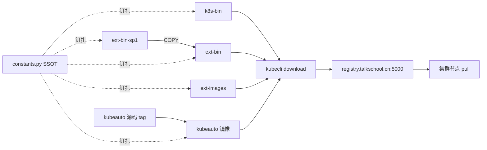
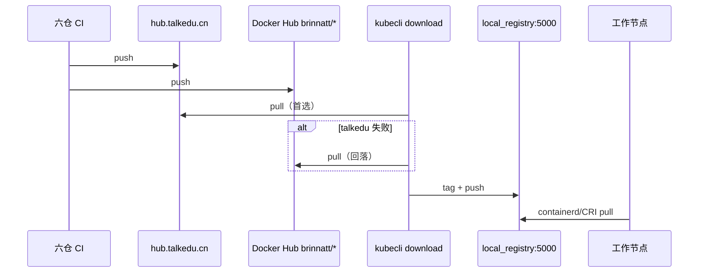

# 第 13 章 制品供应链与离线分发

> 实现对照：`common/constants.py`、`service/cluster/downloader.py`、`service/cluster/registry.py`  
> 开发协同：[开发手册](../development-manual.md) · 契约测试：`tests/unit/test_six_repo_version_sync.py`

## 13.1 概述

kubeauto 将 Kubernetes 控制面、节点组件与生态镜像拆分为 **六仓制品链**，由控制节点上的 **`kubecli download`** 拉取、缓存并推入现场 **本地 Registry**，再供 Ansible 角色在目标节点安装。该模型服务于 **离线 / 半离线** 交付：业务节点不直接访问公网镜像源，版本由单一真相源（SSOT）钉扎，CI 与运行时拉取路径保持一致。

本项目 **不使用 kubeadm**；二进制与镜像均经制品链进入 `/usr/local/kubeauto`（或 `KUBEAUTO_BASE_PATH` 覆盖路径），再由 roles 落盘。

## 13.2 六仓契约



| 仓库 | 镜像产物 | 内容 |
|------|----------|------|
| kubeauto | （逻辑仓库） | CLI、roles、playbooks、conf 模板 |
| kubeauto-dockerfile | `brinnatt/kubeauto:<v_kubeauto>` | PyInstaller / 打包产品载体 |
| kubeauto-k8s-bin-dockerfile | `brinnatt/kubeauto-k8s-bin:<v_k8s_bin>` | Kubernetes 官方二进制 `/k8s` |
| kubeauto-ext-bin-dockerfile | `brinnatt/kubeauto-ext-bin:<v_extra_bin>` | etcd、containerd、runc、CNI、helm、crictl、cfssl、calicoctl 等 |
| kubeauto-ext-bin-sp1-dockerfile | `brinnatt/kubeauto-ext-bin-sp1:<v_extra_bin_sp1>` | nginx、chrony、keepalived（被 ext-bin Dockerfile COPY） |
| kubeauto-ext-images-dockerfile | 各 `brinnatt/<组件>:<tag>` | Calico、CoreDNS、Prometheus 栈、Ingress 等生态镜像 |

### 13.2.1 版本钉扎原则

- **SSOT**：`common/constants.py` 中的 `KubeConstant` dataclass 声明全部默认版本与 `component_images` 映射。
- **集群实例化**：`kubecli new` 时 `ClusterManager._get_config_placeholders` 将 `__k8s_ver__`、`__calico__`、`__pause__` 等占位符写入 `clusters/<name>/config.yml`。
- **禁止漂移**：不得在单个 role 模板中手写与 SSOT 不一致的 tag；否则六仓 CI、离线缓存与现场 pull 将分叉，导致 `ErrImagePull` 或二进制/API 版本不匹配。

契约回归：`tests/unit/test_six_repo_version_sync.py` 在 sibling dockerfile 仓库检出时，比对 ext-images CI matrix、ext-bin Dockerfile `ENV` 与 `KubeConstant` 字段。

## 13.3 CI dual-push 与运行时拉取顺序

六仓 CI 对每个 `brinnatt/<name>:<tag>` 执行 **双推送**：

| 目标 | 路径格式 | 用途 |
|------|----------|------|
| 国内私仓（首选） | `hub.talkedu.cn/kubeauto/<name>:<tag>` | 控制节点 `kubecli download` 首选源 |
| Docker Hub（回落） | `brinnatt/<name>:<tag>` | 私仓不可达时的第二源 |

`RegistryManager._ensure_image_local`（`service/cluster/registry.py`）对 `brinnatt/*` 镜像的拉取顺序为：

1. `hub.talkedu.cn/kubeauto/<name>:<tag>`（由 `v_talkedu_registry` 映射）
2. `brinnatt/<name>:<tag>`（Docker Hub）
3. 上游 origin（迁移桥接，见 `_BRINATT_UPSTREAM_FALLBACKS`；CI 发布完成后应移除对应项）

节点侧 **不** 直接访问 talkedu 或 Docker Hub。Ansible 渲染的镜像引用为：

```text
registry.talkschool.cn:5000/brinnatt/<name>:<tag>
```

该主机名由本地 Registry 容器（`brinnatt/registry:2`）与 `/etc/hosts` 条目 `127.0.0.1 registry.talkschool.cn` 解析到控制节点环回地址。



## 13.4 控制节点下载管线

### 13.4.1 核心类

| 类 | 路径 | 职责 |
|----|------|------|
| `DownloadManager` | `service/cluster/downloader.py` | 编排 download 全流程 |
| `RegistryManager` | `service/cluster/registry.py` | 本地 Registry 启停、镜像 pull/tag/push |
| `DockerManager` | `service/cluster/docker.py` | Engine 安装检测、容器与镜像操作 |

### 13.4.2 `kubecli download -D`（`download_all`）顺序

| 步骤 | 方法 | 产物路径 |
|------|------|----------|
| 1 | 检测并安装 Docker Engine | 静态包 `v_docker=28.5.2`（华为云 mirror 等） |
| 2 | `get_ansible_env` | 系统包管理器安装 Ansible |
| 3 | `get_kubeauto` | 自 `brinnatt/kubeauto:<v_kubeauto>` 解压至 `BASE_PATH` |
| 4 | `get_k8s_bin` | 自 `brinnatt/kubeauto-k8s-bin:<v_k8s_bin>` 解压至 `kube-bin/`，符号链接至 `/usr/local/bin` |
| 5 | `get_ext_bin` | 自 `brinnatt/kubeauto-ext-bin:<v_extra_bin>` 解压至 `extra-bin/` |
| 6 | `start_local_registry` | `registry.talkschool.cn:5000`，数据目录默认 `/data/registry` |
| 7 | `get_default_images` | 推送默认镜像集（见下表） |
| 8 | `ensure_kubeauto_clusters_dir` | 创建 `clusters/` 目录 |

**默认镜像集**（`-X` / `get_default_images`）：

| 镜像 | 常量 |
|------|------|
| `brinnatt/calico-{cni,node,kube-controllers}:<v_calico>` | `v_calico=v3.28.4` |
| `brinnatt/coredns:<v_coredns>` | `1.12.4` |
| `brinnatt/k8s-dns-node-cache:<v_dnsnodecache>` | `1.26.4` |
| `brinnatt/metrics-server:<v_metricsserver>` | `v0.8.0` |
| `brinnatt/pause:<v_pause>` | `3.10` |

### 13.4.3 分项 download 子命令

| CLI 标志 | 作用 |
|----------|------|
| `-D` / `--download-all` | 上述全流程 |
| `-k` / `--kubeauto` | 仅产品载体 |
| `-b` / `--k8s-bin` | 仅 Kubernetes 二进制 |
| `-e` / `--ext-bin` | 仅扩展二进制 |
| `-X` / `--default-images` | 仅默认镜像集 |
| `-E <component>` / `--extra-images` | 按 `component_images` 键拉取可选组件 |
| `-H` / `--harbor-offline` | Harbor 离线安装包 |

`-E` 合法组件名见 `KubeConstant.component_images`（如 `prometheus`、`ingress-nginx`、`cilium`、`dashboard` 等）。Cilium 路径会额外 `helm pull` chart 至 `roles/cilium/files/`。

### 13.4.4 载体镜像与目录布局

| 常量 | 默认路径 | 说明 |
|------|----------|------|
| `BASE_PATH` | `/usr/local/kubeauto` | 产品根目录 |
| `IMAGE_DIR` | `BASE_PATH/down` | 镜像 tar 缓存 |
| `KUBE_BIN_DIR` | `BASE_PATH/kube-bin` | kubelet、kubectl 等 |
| `EXTRA_BIN_DIR` | `BASE_PATH/extra-bin` | etcdctl、containerd、helm 等 |
| `SYS_BIN_DIR` | `/usr/local/bin` | 指向 kube-bin 可执行文件的符号链接 |

`__handle_files` 从容器内路径（如 `/k8s`、`/extra`、`/usr/local/kubeauto`）解压至目标目录。Kubernetes 二进制更新采用 **原子符号链接替换**（`.kubelet.new` → `kubelet`），避免 ETXTBUSY 导致升级中断。

## 13.5 离线分发与现场约束

### 13.5.1 典型离线流程

1. 在线控制节点执行 `kubecli download -D` 与所需 `-E` 组件。  
2. 将 `BASE_PATH`、`/data/registry`（或等价 Registry 数据目录）、`clusters/` 按甲方策略拷贝至隔离环境。  
3. 隔离环境启动本地 Registry；节点 `INSECURE_REG` / containerd `certs.d` 信任 `registry.talkschool.cn:5000`。  
4. 执行 `kubecli setup`；所有 Pod 与 pause 镜像从本地 Registry 拉取。

### 13.5.2 失败模式

| 症状 | 常见根因 |
|------|----------|
| download 某 tag 不存在 | 六仓 CI 未 dual-push；constants 与 CI matrix 不同步 |
| 节点 `ErrImagePull` | 未 `-E` 对应组件；Registry 未启动；hosts 未解析 |
| 二进制版本不符 | 仅更新了镜像未 `-b/-e`；或 symlink 未刷新 |
| talkedu 与 Hub tag 不一致 | 违反 `test_six_repo_version_sync` 契约 |

### 13.5.3 与部署阶段的关系

| 阶段 | Playbook | 制品依赖 |
|------|----------|----------|
| 01 prepare | `01.prepare.yml` | ext-bin（cfssl 等） |
| 02 etcd | `02.etcd.yml` | ext-bin etcd **v3.6.4** |
| 03 runtime | `03.runtime.yml` | ext-bin containerd **2.1.4** 或 docker **28.5.2** + cri-dockerd |
| 04–05 控制面/节点 | `04`/`05` | k8s-bin **v1.33.6** |
| 06 network | `06.network.yml` | CNI 镜像（Calico 等，`-X` 或 `-E`） |
| 07 cluster-addon | `07.cluster-addon.yml` | CoreDNS、NodeLocal、可选插件（`-X`/`-E`） |

网络（步骤 **06**）与 DNS / 插件（步骤 **07**）分离：CNI 在 `06.network.yml` 安装；CoreDNS 与 NodeLocal DNSCache 在 `07.cluster-addon.yml` 安装（kube-ovn 路径可能在 CNI 阶段预装 DNS，addon 去重，见第 10 章）。

## 13.6 版本单一真相源（SSOT）维护

变更版本时的最小闭环：

1. 修改 `common/constants.py` 中对应 `v_*` 字段。  
2. 在 sibling dockerfile 仓库更新 Dockerfile `ENV` / CI matrix tag。  
3. 运行 `tests/unit/test_six_repo_version_sync.py`（需 sibling 检出）。  
4. 重建并 dual-push 受影响镜像。  
5. 控制节点重新 `kubecli download`；已存在集群同步编辑 `clusters/<name>/config.yml` 占位符或按升级流程处理。

**禁止**仅在某一角色 YAML 中手写旧 tag——该做法必然造成六仓漂移与离线失败。

## 13.7 参考路径

| 主题 | 路径 |
|------|------|
| 版本 SSOT | `common/constants.py` |
| 下载编排 | `service/cluster/downloader.py` |
| Registry 与 pull 顺序 | `service/cluster/registry.py` |
| 组件镜像表 | `KubeConstant.component_images` |
| 六仓契约测试 | `tests/unit/test_six_repo_version_sync.py` |
| 默认配置占位符 | `conf/config.yml` |
| 操作手册 download 节 | `docs/operations-manual.md` §1.2 |
